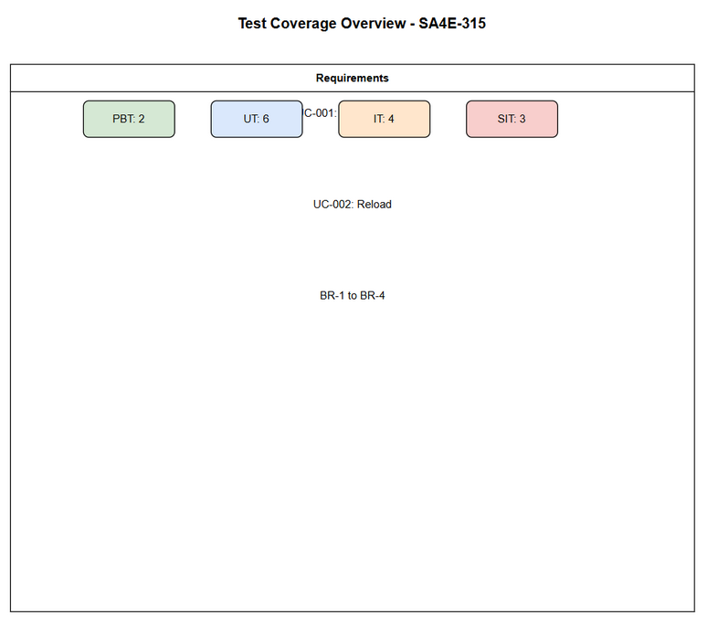
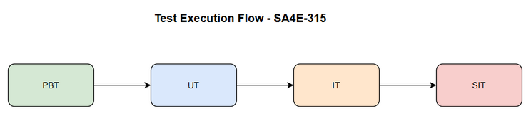

# Software Test Plan (STP)

## SA4E-315 — Wire up DefaultResourceLoader (cwd + agentDir) for resource discovery

---

## Document Information

| Field | Value |
|-------|-------|
| Jira Ticket | SA4E-315 |
| Title | Wire up DefaultResourceLoader (cwd + agentDir) for resource discovery |
| Author | QA Agent |
| Version | 1.0 |
| Date | 2026-09-25 |
| Status | Draft |
| Related BRD | BRD.md |
| Related FSD | FSD.md |
| Related TDD | TDD.md |

---

## 1. Introduction

### 1.1 Purpose
This Test Plan defines the strategy, scope, and approach for testing the wiring of DefaultResourceLoader with explicit cwd and agentDir parameters for Pi SDK resource discovery in SDLC Agents workspace.

### 1.2 Test Objectives
- Verify DefaultResourceLoader is initialized with cwd and agentDir correctly
- Verify loader.reload() is called before session creation
- Verify resources are discovered from workspace
- Validate business rules BR-1 to BR-4
- Ensure diagnostics/warnings are logged as per FSD error handling

### 1.3 References
| Document | Location |
|----------|----------|
| BRD | documents/SA4E-315/BRD.md |
| FSD | documents/SA4E-315/FSD.md |
| TDD | documents/SA4E-315/TDD.md |

---

## 2. Test Strategy

### 2.1 Test Levels

| Level | Scope | Automation | Tools |
|-------|-------|------------|-------|
| PBT | Correctness properties (random inputs) | Automated | fast-check |
| UT | Unit/edge case tests | Automated | vitest |
| IT | API integration (Hono app in-process) | Automated | vitest + Hono `app.request()` |
| E2E-API | REST endpoint E2E (real server) | Automated | vitest + fetch |
| E2E-UI | Browser UI E2E (Playwright) | Automated | Playwright |
| SIT | Manual exploratory / edge cases only | Manual | Browser |

### 2.2 Test Cases Summary

| Level | Count | Automated | Manual |
|-------|-------|-----------|--------|
| PBT | 2 | 2 | 0 |
| UT | 6 | 6 | 0 |
| IT | 4 | 4 | 0 |
| E2E-API | 0 | 0 | 0 |
| E2E-UI | 0 | 0 | 0 |
| SIT | 3 | 0 | 3 |
| **Total** | **15** | **12 (80%)** | **3 (20%)** |

### 2.3 E2E Automation Coverage
No REST API or UI exposed by this change. E2E-API and E2E-UI are out of scope. SIT limited to manual verification of logs and diagnostics.

### 2.4 Entry/Exit Criteria

**Entry Criteria:**
- Code merged to develop branch
- Unit tests pass locally
- BRD/FSD reviewed and approved

**Exit Criteria:**
- 100% test cases executed
- 0 Critical defects open
- ≤1 Major defect open
- RTM coverage 100%

---

## 3. Test Scope

### 3.1 In Scope
| # | Feature / Story | Priority | FSD Reference | Test Type |
|---|----------------|----------|---------------|-----------|
| 1 | Configure DefaultResourceLoader with cwd and agentDir | MUST HAVE | UC-001, BR-1..BR-4 | Functional |
| 2 | Reload resources from workspace | MUST HAVE | UC-002 | Functional |
| 3 | Diagnostics/warnings logging | MUST HAVE | BR-4, FSD 9.1 | Functional |

### 3.2 Out of Scope
| # | Feature | Reason |
|---|---------|--------|
| 1 | Pi SDK internal discovery logic | External library |
| 2 | UI implementation | No UI per BRD |
| 3 | Data migration | Out of scope per BRD |

---

## 4. Test Environment
- Environment: Local dev workspace
- Node version: 20+
- Workspace root: configurable via cwd
- Pi SDK installed

---

## 5. Test Schedule
| Phase | Duration |
|-------|----------|
| Test Planning | 1 day |
| Test Execution | 2 days |
| Defect Fix & Retest | 1 day |

---

## 6. Resources & Responsibilities
| Role | Responsibility |
|------|----------------|
| Test Lead | QA Agent |
| Developer | Bug fix |
| BA | UAT support |

---

## 7. Risk & Mitigation
| Risk | Mitigation |
|------|------------|
| Pi SDK API change | Monitor release notes |
| cwd not deterministic | Reference SA4E-313 |

---

## 8. Defect Management
Severity: Critical/Major/Minor/Trivial
Priority: P1-P4 with SLA

---

## 9. Test Metrics
| Metric | Target |
|--------|--------|
| Pass Rate | ≥95% |
| Critical defects | 0 |

---

