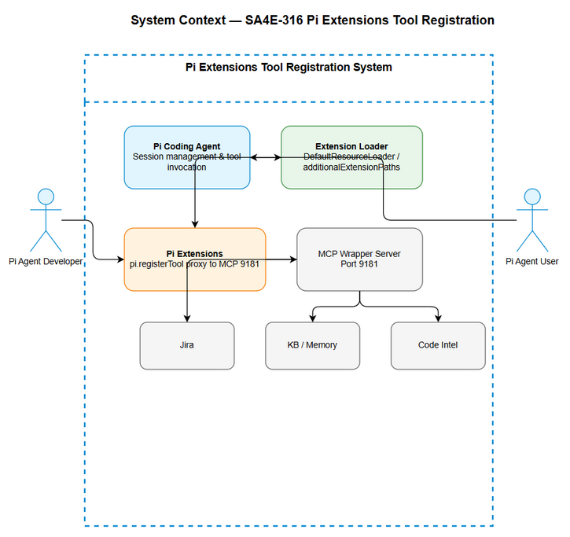
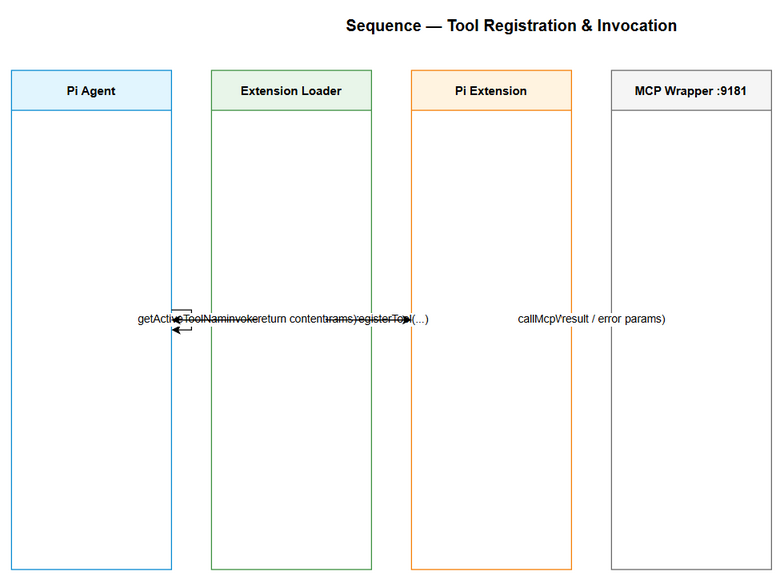

# Functional Specification Document (FSD)

## Pi Extensions — SA4E-316: Register custom tools via Pi Extensions (bridge MCP wrapper tools)

---

## Document Information

| Field | Value |
|-------|-------|
| Jira Ticket | SA4E-316 |
| Title | Register custom tools via Pi Extensions (bridge MCP wrapper tools) |
| Author | BA Agent |
| Version | 1.0 |
| Date | 2026-09-24 |
| Status | Draft |
| Related BRD | documents/SA4E-316/BRD.md |

---

## Revision History

| Version | Date | Author | Changes |
|---------|------|--------|---------|
| 1.0 | 2026-09-24 | BA Agent | Initiate document — auto-generated from BRD and Jira tickets |

---

## 1. Introduction

### 1.1 Purpose

This FSD specifies the functional behavior of registering custom tools for Pi Coding Agent via Pi Extensions, bridging existing MCP wrapper tools running on port 9181 into the Pi agent session.

### 1.2 Scope

Reference BRD scope: Register custom tools via Pi Extensions system using `pi.registerTool`. Expose MCP wrapper tools (Jira, KB/mem, code intelligence, drawio, docx export) into Pi agent for direct invocation. Extension loading mechanism per SA4E-315.

Out of scope: implementing new MCP services, modifying Pi core SDK, UI for tool management.

### 1.3 Definitions & Acronyms

| Term | Definition |
|------|------------|
| Pi Extension | Plugin loaded by Pi Coding Agent to register tools/commands |
| MCP Wrapper | Proxy server exposing tools on port 9181 |
| pi.registerTool | Pi SDK API to register a custom tool |

### 1.4 References

| Document | Location |
|----------|----------|
| BRD | documents/SA4E-316/BRD.md |
| Pi SDK Docs | https://pi.dev/docs/latest/sdk |

---

## 2. System Overview

### 2.1 System Context Diagram

*[Edit in draw.io](diagrams/system-context.drawio)*

The system interacts with Pi Coding Agent, Extension Loader, MCP Wrapper Server, and external services Jira/KB/Code Intel. Pi Agent Developer creates extensions; Pi Agent User invokes registered tools.

### 2.2 System Architecture

Pi Coding Agent loads extensions via DefaultResourceLoader. Extensions call `pi.registerTool` with schema and execute handler proxying to MCP Wrapper at 9181. Tool metadata is exposed via `session.getActiveToolNames()`.

---

## 3. Functional Requirements

### 3.1 Feature: Register custom tools via Pi Extensions

**Source:** BRD Story 1

#### 3.1.1 Description

Extension registers minimum tools: `jira_*`, `mem_search/mem_ingest`, `code_search`, `execute_dynamic_tool`. Registration uses `export default function (pi) { pi.registerTool(...) }`. Execute handler proxies to MCP wrapper via `callMcpWrapper`. Schemas validated via TypeBox/Zod.

#### 3.1.2 Use Case

**Use Case ID:** UC-1
**Actor:** Pi Agent Developer
**Preconditions:** MCP wrapper running on 9181, Pi SDK available, extension loading configured
**Postconditions:** Tools registered and visible in session

**Main Flow:**

| Step | Actor | System | Description |
|------|-------|--------|-------------|
| 1 | Developer creates extension file | | Export default function receiving Pi ExtensionAPI |
| 2 | | Extension Loader | Discovers extension from configured paths |
| 3 | | Extension | Calls pi.registerTool for each tool |
| 4 | | Pi Agent | Tools appear in session.getActiveToolNames() |
| 5 | Developer invokes tool | Pi Agent | Execute handler calls MCP wrapper |
| 6 | | MCP Wrapper | Returns result or error |
| 7 | | Pi Agent | Returns content array to agent |

**Alternative Flows:**

| ID | Condition | Steps |
|----|-----------|-------|
| AF-1 | Schema validation fails | Return validation error, do not call MCP |
| AF-2 | MCP unreachable | Return structured error with cause |

**Exception Flows:**

| ID | Condition | Steps |
|----|-----------|-------|
| EF-1 | Duplicate tool name | Registration rejected, log error |
| EF-2 | Exception in handler | Catch, log, return error message |

#### 3.1.3 Business Rules

| Rule ID | Rule | Source |
|---------|------|--------|
| BR-1 | Tool name must be unique within session | BRD Validation |
| BR-2 | Parameters schema must validate before execution | BRD Validation |
| BR-3 | Execute handler must return content array with type 'text' | BRD Validation |
| BR-4 | Errors from wrapper must be propagated, not swallowed | BRD Story 3 |

#### 3.1.4 Data Specifications

**Input Data:**

| Field | Type | Required | Validation | Description |
|-------|------|----------|------------|-------------|
| name | string | Y | unique, alphanumeric | Tool identifier, e.g., jira_get_issue |
| label | string | Y | max 100 chars | Human readable name |
| description | string | Y | | Tool purpose |
| parameters | object | Y | TypeBox/Zod schema | Input schema |
| execute | function | Y | async | Handler proxying to MCP |

**Output Data:**

| Field | Type | Description |
|-------|------|-------------|
| content | array | Pi tool response content [{type:'text', text:...}] |
| details | object | Additional metadata |

#### 3.1.5 UI Specifications

N/A – Extension registration is code-level.

#### 3.1.6 API Contract (Functional View)

> Note: Technical details in TDD.

**Endpoint:** Internal Pi Extension API `pi.registerTool`

**Purpose:** Register custom tool in Pi session

**Input Parameters:**

| Parameter | Type | Required | Business Rule | Description |
|-----------|------|----------|---------------|-------------|
| name | string | Y | BR-1 | Tool identifier |
| parameters | schema | Y | BR-2 | Validation schema |
| execute | function | Y | | Proxy handler |

**Business Error Scenarios:**

| Scenario | User Message | Trigger Condition |
|----------|-------------|-------------------|
| Invalid parameters | Validation failed | Schema mismatch |
| MCP unreachable | MCP wrapper unavailable | Network error |

---

### 3.2 Feature: Tools visible in session

**Source:** BRD Story 2

#### 3.2.1 Description

After extension load, `session.getActiveToolNames()` includes registered tool names and metadata accessible via Pi API.

#### 3.2.2 Use Case

**Use Case ID:** UC-2
**Actor:** Pi Agent User
**Preconditions:** Extensions loaded
**Postconditions:** Tool list reflects registrations

**Main Flow:**

| Step | Actor | System | Description |
|------|-------|--------|-------------|
| 1 | User queries session | Pi Agent | Calls getActiveToolNames() |
| 2 | | Pi Agent | Returns list of registered tools |

---

### 3.3 Feature: Clear error reporting

**Source:** BRD Story 3

#### 3.3.1 Description

Execute handler propagates errors from MCP wrapper with human readable messages containing tool name and original error.

#### 3.3.2 Use Case

**Use Case ID:** UC-3
**Actor:** Pi Agent Operator
**Preconditions:** Tool invocation fails
**Postconditions:** Error returned to agent

**Main Flow:**

| Step | Actor | System | Description |
|------|-------|--------|-------------|
| 1 | | Extension | Catches MCP error |
| 2 | | Extension | Returns error message |

---

## 4. Data Model

> Note: No persistent data model. Logical entities are tool registration metadata.

### 4.1 Entity Relationship Diagram

N/A – No persistent entities.

### 4.2 Logical Entities

Entity: Tool Registration

| Attribute | Type | Required | Business Rule | Description |
|-----------|------|----------|---------------|-------------|
| name | string | Y | BR-1 | Tool identifier |
| label | string | Y | | Display name |
| description | string | Y | | Purpose |
| parameters | schema | Y | BR-2 | Validation schema |

---

## 5. Integration Specifications

### 5.1 External System: MCP Wrapper Server

| Attribute | Value |
|-----------|-------|
| Purpose | Bridge Pi Extensions to existing tools |
| Direction | Outbound |
| Data Format | JSON |
| Frequency | On-demand |

**Data Exchange:**

| Our Data | External Data | Direction | Business Rule |
|----------|--------------|-----------|---------------|
| tool name + params | JSON-RPC request | Send | |
| result | JSON-RPC response | Receive | |

---

## 6. Processing Logic

### 6.1 Tool Registration Process

**Trigger:** Pi Agent session start
**Schedule:** On-demand
**Input:** Extension file
**Output:** Registered tools in session

**Processing Steps:**

| Step | Description | Error Handling |
|------|-------------|----------------|
| 1 | Load extensions from paths | Log missing paths |
| 2 | Execute export default(pi) | Catch exceptions |
| 3 | Call pi.registerTool | Duplicate name -> reject |
| 4 | Validate schema | Invalid schema -> reject |
| 5 | Store tool metadata | |

**Activity Diagram:**

---

## 7. Security Requirements

### 7.1 Authentication & Authorization

| Role | Permissions | Screens/Features |
|------|-------------|------------------|
| Developer | Register tools | Extension files |
| User | Invoke registered tools | Pi Agent session |

### 7.2 Data Sensitivity Classification

| Data Type | Classification | Business Requirement |
|-----------|---------------|---------------------|
| Tool parameters | Internal | Validate via schema |

---

## 8. Non-Functional Requirements

| Category | Business Requirement | Acceptance Criteria |
|----------|---------------------|---------------------|
| Performance | Tool invocation latency | < 2s including MCP roundtrip |
| Availability | Extension load | Must load successfully on session start |
| Scalability | Tool count | Support >50 tools per session |
| Security | Input validation | Schemas validated via TypeBox/Zod |

---

## 9. Error Handling (User-Facing)

### 9.1 Error Scenarios

| Scenario | Severity | User Message | Expected Behavior |
|----------|----------|-------------|-------------------|
| MCP unreachable | Critical | MCP wrapper unavailable | Return error, do not swallow |
| Invalid parameters | Warning | Validation failed | Return validation error |
| Duplicate tool name | Warning | Tool name already exists | Reject registration |

---

## 10. Testing Considerations

### 10.1 Test Scenarios

| ID | Scenario | Input | Expected Output | Priority |
|----|----------|-------|-----------------|----------|
| TC-1 | Register tools | Valid extension | Tools in session list | High |
| TC-2 | Invoke tool | Valid params | Result from MCP | High |
| TC-3 | Invalid params | Bad schema | Validation error | High |
| TC-4 | MCP down | Invoke tool | Error message | Medium |

---

## 11. Appendix

### Diagrams

| Diagram | File |
|---------|------|
| System Context | [system-context.png](diagrams/system-context.png) |
| Sequence - Tool Registration & Invocation | [sequence.png](diagrams/sequence.png) |
| State - Tool Lifecycle | [state.png](diagrams/state.png) |

### Change Log from BRD

FSD adds functional use cases, business rules BR-1..BR-4, integration spec for MCP Wrapper, processing logic and error handling details derived from BRD requirements.
