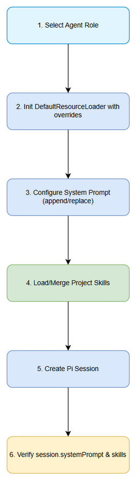
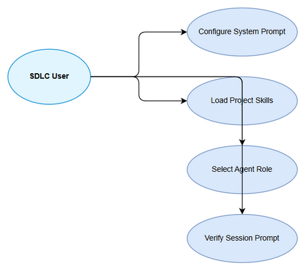

# Business Requirements Document (BRD)

## SA4E-317 — Configure System Prompt + Skills for SDLC agent behavior

---

## Document Information

| Field | Value |
|-------|-------|
| Jira Ticket | SA4E-317 |
| Title | Configure System Prompt + Skills for SDLC agent behavior |
| Author | BA Agent |
| Version | 1.0 |
| Date | 2026-09-24 |
| Status | Draft |

---

## Author Tracking

| Role | Name - Position | Responsibility |
|------|-----------------|----------------|
| Author | BA Agent – Business Analyst | Create document |
| Peer Reviewer | — – — | Review document |

---

## Revision History

| Version | Date | Author | Changes |
|---------|------|--------|---------|
| 1.0 | 2026-09-24 | BA Agent | Initiate document — auto-generated from Jira ticket SA4E-317 and linked tickets |

---

## Sign-Off

| Name | Signature and date |
|------|--------------------|
| | ☐ I agree and confirm all criteria on this BRD as expected requirements |
| | ☐ I agree and confirm all criteria on this BRD as expected requirements |

---

## 1. Introduction

### 1.1 Scope

Nạp đúng behavior của các SDLC agent (SM, BA, SA, DEV, QA, DevOps, UI, Security) vào Pi session thông qua System Prompt override và Skills. Mục đích là chatbox hoạt động đúng vai trò/steering của project thay vì prompt mặc định. Hỗ trợ cả appendSystemPromptOverride và systemPromptOverride để thay toàn bộ hoặc bổ sung prompt, cùng skillsOverride để filter/merge/replace skills được auto-discover từ <cwd>/.pi/skills, ~/.pi/agent/skills.

### 1.2 Out of Scope

- Thay đổi nội dung steering files gốc (.kiro/steering, .claude/rules) — chỉ mapping sang Pi.
- Phát triển Pi SDK — sử dụng SDK hiện có.
- Triển khai CI/CD cho prompt/skills.

### 1.3 Preliminary Requirement

- DefaultResourceLoader đã được triển khai cho phép systemPromptOverride, appendSystemPromptOverride, skillsOverride (SA4E-315).
- Project steering files và skills nguồn tồn tại để mapping.

---

## 2. Business Requirements

### 2.1 High Level Process Map

Người dùng chọn agent role/phase → DefaultResourceLoader khởi tạo với overrides → System Prompt được append/replace theo vai trò → Skills project được discover, filter/merge/replace → Pi Session được tạo với prompt và skills hiệu lực → Xác thực session.systemPrompt và loader.getSkills().

*[Edit in draw.io](diagrams/Business_Flow.drawio)*

*[Edit in draw.io](diagrams/use-case.drawio)*

### 2.2 List of User Stories / Use Cases

| # | Story / Use Case / Epic | Priority | Source Ticket |
|---|-------------------------|----------|---------------|
| 1 | As a SDLC Agent User, I want system prompt to reflect selected agent role so that chatbox behaves with correct steering | MUST HAVE | SA4E-317 |
| 2 | As a Developer, I want project skills to be loaded and listed via loader.getSkills() so that agent capabilities match project rules | MUST HAVE | SA4E-317 |
| 3 | As a System Administrator, I want to configure prompt override mode (append/replace) so that APPEND_SYSTEM.md is not unintentionally applied | SHOULD HAVE | SA4E-317 |

---

### 2.3 Details of User Stories

---

#### Business Flow

**Step 1:** User selects agent role/phase (SM, BA, SA, DEV, QA, DevOps, UI, Security)

**Step 2:** DefaultResourceLoader được khởi tạo với cwd, agentDir và các override callbacks

**Step 3:** appendSystemPromptOverride hoặc systemPromptOverride được áp dụng để tạo prompt hiệu lực

**Step 4:** skillsOverride được thực thi để merge/filter/replace skills từ project và agent directories

**Step 5:** Pi Session được tạo, session.systemPrompt trả về prompt đã override

**Step 6:** Xác thực loader.getSkills() liệt kê skills đã nạp và kiểm tra không bị APPEND_SYSTEM.md lẫn khi replace

> **Note:** Khi replace prompt, appendSystemPromptOverride phải trả về [] để tránh append APPEND_SYSTEM.md ngoài ý muốn.

---

#### STORY 1: Configure System Prompt by Agent Role

> As a SDLC Agent User, I want system prompt to reflect selected agent role so that chatbox behaves with correct steering

**Requirement Details:**

1. System prompt phải phản ánh đúng vai trò agent được chọn thông qua append hoặc replace.
2. Khi replace prompt, không bị lẫn APPEND_SYSTEM.md ngoài ý muốn.
3. session.systemPrompt trả về prompt hiệu lực đúng.

**Data Fields (if applicable):**

| Field | Type | Required | Description | Example |
|-------|------|----------|-------------|---------|
| agentRole | string | Yes | Vai trò agent được chọn | BA, SA, DEV |
| promptMode | enum | Yes | append hoặc replace | replace |
| systemPrompt | string | Yes | Prompt hiệu lực | ... |

**Acceptance Criteria:**

1. System prompt phản ánh đúng vai trò agent được chọn (append hoặc replace)
2. session.systemPrompt trả về prompt hiệu lực đúng
3. Khi replace prompt, không bị lẫn APPEND_SYSTEM.md ngoài ý muốn

**UI Specifications (if applicable):**

| No. | Name | Type | Required | Description | Note |
|-----|------|------|----------|-------------|------|
| 1 | Agent Role Selector | Dropdown | Yes | Chọn vai trò agent | |

**Validation Rules (if applicable):**

- agentRole phải thuộc danh sách SDLC agents đã định nghĩa
- promptMode phải là append hoặc replace

**Error Handling (if applicable):**

- Agent role không hợp lệ: trả về lỗi validation

---

#### STORY 2: Load Project Skills

> As a Developer, I want project skills to be loaded and listed via loader.getSkills() so that agent capabilities match project rules

**Requirement Details:**

1. Skills của project (.pi/skills hoặc inline) được nạp qua DefaultResourceLoader.
2. skillsOverride cho phép filter/merge/replace skills.
3. loader.getSkills() liệt kê đầy đủ skills đã nạp.

**Acceptance Criteria:**

1. Skills của project được nạp và liệt kê qua loader.getSkills()
2. Có thể chọn skill theo phase/agent
3. Skills được auto-discover từ <cwd>/.pi/skills và ~/.pi/agent/skills

**Data Fields:**

| Field | Type | Required | Description | Example |
|-------|------|----------|-------------|---------|
| skillId | string | Yes | Identifier skill | sdlc-ba |
| skillSource | string | Yes | Nguồn skill | .pi/skills |

---

#### STORY 3: Prompt Override Control

> As a System Administrator, I want to configure prompt override mode so that APPEND_SYSTEM.md is not unintentionally applied

**Requirement Details:**

1. systemPromptOverride thay toàn bộ system prompt.
2. appendSystemPromptOverride append thêm hướng dẫn vào prompt mặc định.
3. Khi replace, appendSystemPromptOverride trả về [] để không append APPEND_SYSTEM.md.

**Acceptance Criteria:**

1. Khi replace prompt, không bị lẫn APPEND_SYSTEM.md ngoài ý muốn
2. Có thể chọn skill theo phase/agent

---

## 3. Dependencies

| Dependency | Type | Related Ticket | Description |
|------------|------|----------------|-------------|
| DefaultResourceLoader | System | SA4E-315 | Cung cấp systemPromptOverride, appendSystemPromptOverride, skillsOverride |
| Pi SDK | External | — | API cho session và resource loader |
| Epic Migration LangGraph to Pi SDK | System | SA4E-289 | Epic cha |

---

## 4. Stakeholders

| Role | Name / Team | Responsibility | Source |
|------|-------------|----------------|--------|
| Reporter / Creator | Duc Nguyen Minh | Yêu cầu tính năng | SA4E-317 |
| BA Agent | BA Agent | Viết BRD | — |

---

## 5. Risks and Assumptions

### 5.1 Risks

| Risk | Impact | Likelihood | Mitigation |
|------|--------|------------|------------|
| Prompt override làm mất context mặc định | High | Medium | Kiểm thử regression session.systemPrompt |
| Skills conflict giữa project và agent | Medium | Medium | Ưu tiên rõ ràng trong skillsOverride |

### 5.2 Assumptions

- DefaultResourceLoader đã sẵn sàng và ổn định
- Steering files .kiro/steering và .claude/rules có thể mapping sang Pi skills/prompt

---

## 6. Non-Functional Requirements

| Category | Requirement | Details |
|----------|-------------|---------|
| Performance | — | No specific non-functional requirements identified. To be confirmed with technical team. |
| Security | — | — |
| Scalability | — | — |
| Availability | — | — |

> If no non-functional requirements are identified from the tickets, state: "No specific non-functional requirements identified. To be confirmed with technical team."

---

## 7. Related Tickets

| Ticket Key | Summary | Status | Type | Relationship |
|------------|---------|--------|------|--------------|
| SA4E-317 | Configure System Prompt + Skills for SDLC agent behavior | In Progress | Task | Main ticket |
| SA4E-289 | Migrate LangGraph Workflow Engine to Pi SDK (Option C) | In Progress | Epic | Parent |
| SA4E-315 | DefaultResourceLoader | — | — | Dependency |

---

## 8. Appendix

### Diagram Index

| # | Diagram | Image | Source (editable) |
|---|---------|-------|-------------------|
| 1 | Business Flow | [Business_Flow.png](diagrams/Business_Flow.png) | [Business_Flow.drawio](diagrams/Business_Flow.drawio) |
| 2 | Use Case | [use-case.png](diagrams/use-case.png) | [use-case.drawio](diagrams/use-case.drawio) |

### Glossary

| Term | Definition |
|------|------------|
| System Prompt Override | Thay toàn bộ system prompt của Pi session |
| Append System Prompt Override | Bổ sung hướng dẫn vào prompt mặc định |
| Skills Override | Filter/merge/replace skills được auto-discover |

### Reference Documents

| Document | Link / Location |
|----------|-----------------|
| Pi SDK Docs | https://pi.dev/docs/latest/sdk |
| Example replace + append | examples/sdk/03-custom-prompt.ts |
| Example skills | examples/sdk/04-skills.ts |
