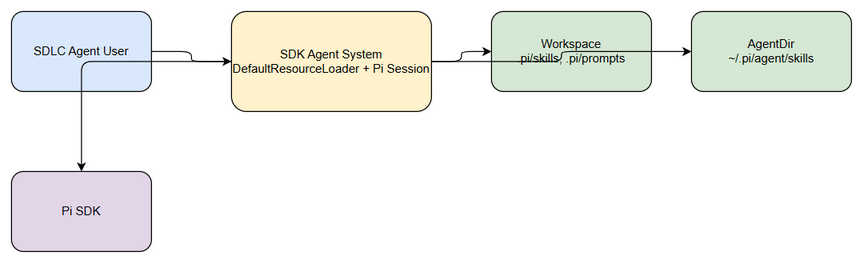
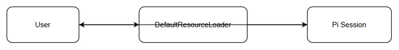

# Functional Specification Document (FSD)

## SA4E-317 — Configure System Prompt + Skills for SDLC agent behavior

---

## Document Information

| Field | Value |
|-------|-------|
| Jira Ticket | SA4E-317 |
| Title | Configure System Prompt + Skills for SDLC agent behavior |
| Author | BA Agent |
| Version | 1.0 |
| Date | 2026-09-24 |
| Status | Draft |
| Related BRD | documents/SA4E-317/BRD.md |

---

## Revision History

| Version | Date | Author | Changes |
|---------|------|--------|---------|
| 1.0 | 2026-09-24 | BA Agent | Initiate document — auto-generated from BRD and Jira tickets |

---

## 1. Introduction

### 1.1 Purpose

This FSD specifies the functional behavior for configuring System Prompt overrides and Skills overrides for SDLC agents via Pi SDK DefaultResourceLoader, ensuring chatbox behaves correctly per selected agent role/phase.

### 1.2 Scope

Reference BRD scope: Nạp đúng behavior của các SDLC agent vào Pi session thông qua System Prompt override và Skills. Hỗ trợ appendSystemPromptOverride, systemPromptOverride, skillsOverride.

Technical scope clarification: Implementation uses Pi SDK DefaultResourceLoader with callbacks for prompt and skills override. No change to Pi SDK core.

### 1.3 Definitions & Acronyms

| Term | Definition |
|------|------------|
| System Prompt Override | Thay toàn bộ system prompt của Pi session |
| Append System Prompt Override | Bổ sung hướng dẫn vào prompt mặc định |
| Skills Override | Filter/merge/replace skills được auto-discover |
| DefaultResourceLoader | Pi SDK component for resource discovery |

### 1.4 References

| Document | Location |
|----------|----------|
| BRD | documents/SA4E-317/BRD.md |
| Pi SDK Docs | https://pi.dev/docs/latest/sdk |

---

## 2. System Overview

### 2.1 System Context Diagram

The system interacts with SDLC Agent User who selects agent role, DefaultResourceLoader which discovers resources from Workspace and AgentDir, Pi Session which uses effective system prompt and skills, and Pi SDK as external platform.

Pi SDK provides session creation APIs and resource loader hooks.

### 2.2 System Architecture

Components:
- **Agent Orchestrator** — selects agentRole, promptMode, initiates loader
- **DefaultResourceLoader** — initialized with cwd, agentDir, systemPromptOverride, appendSystemPromptOverride, skillsOverride
- **Pi Session** — created with resourceLoader, exposes session.systemPrompt and loader.getSkills()
- **Workspace** — contains `.pi/skills`, `.pi/prompts`
- **AgentDir** — `~/.pi/agent/skills`

**Code Intelligence Note:** Technical context for DefaultResourceLoader was not verified against local codebase (Pi SDK is external). Data model sections marked as UNVERIFIED — requires SA review.

---

## 3. Functional Requirements

### 3.1 Feature: Configure System Prompt by Agent Role

**Source:** BRD Story 1 — As a SDLC Agent User, I want system prompt to reflect selected agent role

#### 3.1.1 Description

System prompt must reflect selected agent role via append or replace mode. When replace mode is used, appendSystemPromptOverride must return empty to avoid unintended APPEND_SYSTEM.md inclusion. session.systemPrompt returns effective prompt.

#### 3.1.2 Use Case

**Use Case ID:** UC-01
**Actor:** SDLC Agent User
**Preconditions:** DefaultResourceLoader is available, agent role list defined
**Postconditions:** Pi session created with correct system prompt

**Main Flow:**

| Step | Actor | System | Description |
|------|-------|--------|-------------|
| 1 | User selects agent role and prompt mode | | Role chosen |
| 2 | | DefaultResourceLoader | Initialized with overrides |
| 3 | | Pi Session | Created with resourceLoader |
| 4 | | System | session.systemPrompt returns effective prompt |

**Alternative Flows:**

| ID | Condition | Steps |
|----|-----------|-------|
| AF-1 | promptMode = append | appendSystemPromptOverride returns additional instructions |
| AF-2 | promptMode = replace | systemPromptOverride returns full prompt, append returns [] |

**Exception Flows:**

| ID | Condition | Steps |
|----|-----------|-------|
| EF-1 | Invalid agent role | Validation error returned to user |

#### 3.1.3 Business Rules

| Rule ID | Rule | Source |
|---------|------|--------|
| BR-1 | agentRole must be from defined SDLC agents list | BRD Validation Rules |
| BR-2 | When promptMode = replace, appendSystemPromptOverride must return [] | BRD Note |
| BR-3 | session.systemPrompt must return effective prompt | BRD AC2 |

#### 3.1.4 Data Specifications

**Input Data:**

| Field | Type | Required | Validation | Description |
|-------|------|----------|------------|-------------|
| agentRole | string | Y | ∈ {SM, BA, SA, DEV, QA, DevOps, UI, Security} | Vai trò agent được chọn |
| promptMode | enum | Y | append / replace | Chế độ override |
| systemPrompt | string | Y | — | Prompt hiệu lực |

**Output Data:**

| Field | Type | Description |
|-------|------|-------------|
| systemPrompt | string | Effective system prompt |

#### 3.1.5 UI Specifications

**Screen: Agent Role Selector**

| No. | Element | Type | Required | Behavior | Validation |
|-----|---------|------|----------|----------|------------|
| 1 | Agent Role Selector | Dropdown | Y | Chọn vai trò agent | agentRole must be valid |

#### 3.1.6 API Contract (Functional View)

**Endpoint:** `createAgentSession(loader)`
**Purpose:** Create Pi session with configured resource loader

**Input Parameters:**

| Parameter | Type | Required | Business Rule | Description |
|-----------|------|----------|---------------|-------------|
| loader | DefaultResourceLoader | Y | BR-1 | Initialized loader |
| agentRole | string | Y | BR-1 | Role selection |

**Output Data:**

| Field | Type | Description |
|-------|------|-------------|
| session.systemPrompt | string | Effective prompt |
| session.getSkills | array | Discovered skills |

**Business Error Scenarios:**

| Scenario | User Message | Trigger Condition |
|----------|-------------|-------------------|
| Invalid agent role | "Agent role không hợp lệ" | agentRole not in list |

---

### 3.2 Feature: Load Project Skills

**Source:** BRD Story 2

#### 3.2.1 Description

Project skills discovered from `<cwd>/.pi/skills` and `~/.pi/agent/skills`. skillsOverride allows filter/merge/replace. loader.getSkills() lists effective skills.

#### 3.2.2 Use Case

**Use Case ID:** UC-02
**Actor:** Developer
**Preconditions:** DefaultResourceLoader initialized
**Postconditions:** Skills loaded and listed

**Main Flow:**

| Step | Actor | System | Description |
|------|-------|--------|-------------|
| 1 | | DefaultResourceLoader | Discover skills |
| 2 | | skillsOverride | Apply filter/merge/replace |
| 3 | | System | loader.getSkills() returns list |

**Alternative Flows:** None

**Exception Flows:**

| ID | Condition | Steps |
|----|-----------|-------|
| EF-1 | Skill conflict | Prioritize project over agent per override rule |

#### 3.2.3 Business Rules

| Rule ID | Rule | Source |
|---------|------|--------|
| BR-4 | Skills auto-discover from .pi/skills and agentDir | BRD AC3 |
| BR-5 | loader.getSkills() must list all loaded skills | BRD AC1 |

#### 3.2.4 Data Specifications

**Input Data:**

| Field | Type | Required | Validation | Description |
|-------|------|----------|------------|-------------|
| skillId | string | Y | — | Identifier skill |
| skillSource | string | Y | — | Source path |

**Output Data:**

| Field | Type | Description |
|-------|------|-------------|
| skills | array | Effective skill list |

---

### 3.3 Feature: Prompt Override Control

**Source:** BRD Story 3

#### 3.3.1 Description

systemPromptOverride replaces entire prompt; appendSystemPromptOverride adds instructions. When replace mode active, append must be empty to prevent APPEND_SYSTEM.md leakage.

#### 3.3.2 Use Case

**Use Case ID:** UC-03
**Actor:** System Administrator
**Preconditions:** Session creation flow active
**Postconditions:** Prompt override mode enforced

**Main Flow:**

| Step | Actor | System | Description |
|------|-------|--------|-------------|
| 1 | Admin configures promptMode | | Mode set |
| 2 | | DefaultResourceLoader | Applies override callbacks |
| 3 | | Pi Session | Prompt effective |

**Exception Flows:**

| ID | Condition | Steps |
|----|-----------|-------|
| EF-1 | Replace mode with non-empty append | Warning logged, append cleared |

#### 3.3.3 Business Rules

| Rule ID | Rule | Source |
|---------|------|--------|
| BR-6 | Replace mode => appendSystemPromptOverride returns [] | BRD AC1 |
| BR-7 | Prompt override mode selectable | BRD Story 3 |

---

## 4. Data Model

> Note: Logical data model for prompt/skills configuration. Physical implementation in TDD §4.

### 4.1 Entity Relationship Diagram

N/A — Configuration is runtime object-based, no persistent entities.

### 4.2 Logical Entities

#### Entity: ResourceLoaderConfig

| Attribute | Type | Required | Business Rule | Description |
|-----------|------|----------|---------------|-------------|
| cwd | string | Y | — | Workspace root |
| agentDir | string | Y | — | Agent directory |
| systemPromptOverride | function | N | — | Replacement callback |
| appendSystemPromptOverride | function | N | BR-2 | Append callback |
| skillsOverride | function | N | — | Skills override callback |

---

## 5. Integration Specifications

### 5.1 External System: Pi SDK

| Attribute | Value |
|-----------|-------|
| Purpose | Session creation and resource discovery |
| Direction | Bidirectional |
| Data Format | JSON / TS objects |
| Frequency | On-demand |

**Data Exchange:**

| Our Data | External Data | Direction | Business Rule |
|----------|--------------|-----------|---------------|
| DefaultResourceLoader config | Session with systemPrompt | Send | BR-3 |
| Skills list | loader.getSkills() | Receive | BR-5 |

---

## 6. Processing Logic

### 6.1 Agent Session Initialization

**Trigger:** User selects agent role
**Schedule:** On-demand
**Input:** agentRole, promptMode
**Output:** Pi Session with effective prompt & skills

**Processing Steps:**

| Step | Description | Error Handling |
|------|-------------|----------------|
| 1 | Init DefaultResourceLoader with cwd, agentDir | Fail if Pi SDK unavailable |
| 2 | Apply systemPromptOverride / appendSystemPromptOverride | Log warnings |
| 3 | Apply skillsOverride | Prioritize conflict |
| 4 | Create Pi Session | Fail if session creation error |
| 5 | Validate session.systemPrompt | Return validation error |

**Activity Diagram:**

---

## 7. Security Requirements

### 7.1 Authentication & Authorization

| Role | Permissions | Screens/Features |
|------|-------------|-------------------|
| SDLC Agent User | Read/Configure | Agent Role Selector |
| Developer | Configure | Skills loading |
| System Administrator | Configure | Prompt override mode |

### 7.2 Data Sensitivity Classification

No sensitive data processed.

### 7.3 Audit Trail

| Event | Logged Fields | Retention | Business Reason |
|-------|--------------|-----------|-----------------|
| Session created | agentRole, promptMode | 30 days | Traceability |

---

## 8. Non-Functional Requirements

| Category | Business Requirement | Acceptance Criteria |
|----------|---------------------|---------------------|
| Performance | Session init | < 2s |
| Availability | — | No specific requirement |
| Scalability | — | No specific requirement |
| Data Retention | — | No specific requirement |

---

## 9. Error Handling (User-Facing)

### 9.1 Error Scenarios

| Scenario | Severity | User Message | Expected Behavior |
|----------|----------|-------------|-------------------|
| Invalid agent role | Warning | "Agent role không hợp lệ" | Return validation error |
| Skill conflict | Info | "Skill conflict resolved by override priority" | Log and continue |

### 9.2 Notification Requirements

None defined.

---

## 10. Testing Considerations

### 10.1 Test Scenarios

| ID | Scenario | Input | Expected Output | Priority |
|----|----------|-------|-----------------|----------|
| TC-01 | Replace prompt mode | agentRole=BA, promptMode=replace | session.systemPrompt = BA prompt, no APPEND_SYSTEM | High |
| TC-02 | Append prompt mode | agentRole=DEV, promptMode=append | session.systemPrompt includes default + append | High |
| TC-03 | Skills discovery | Loader init | loader.getSkills() lists project skills | High |
| TC-04 | Invalid role | agentRole=UNKNOWN | Validation error | Medium |

---

## 11. Appendix

### Diagrams

| Diagram | File |
|---------|------|
| System Context | [system-context.png](diagrams/system-context.png) |
| Sequence | [sequence.png](diagrams/sequence.png) |
| State | [state.png](diagrams/state.png) |

### Change Log from BRD

- FSD adds functional use cases, business rules BR-1..BR-7, API contract for session creation, processing logic for agent session initialization.
- Data model noted as runtime config, no persistent entities.
- Code intelligence data not available for Pi SDK internals; sections marked UNVERIFIED.

---
