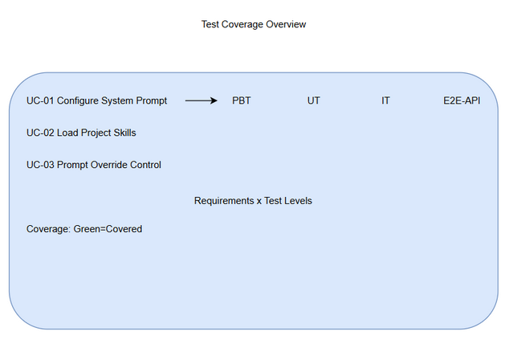

# Software Test Plan (STP)

## SDLC Agent Configuration — SA4E-317: Configure System Prompt + Skills for SDLC agent behavior

---

## Document Information

| Field | Value |
|-------|-------|
| Jira Ticket | SA4E-317 |
| Title | Configure System Prompt + Skills for SDLC agent behavior |
| Author | QA Agent |
| Version | 1.0 |
| Date | 2026-09-25 |
| Status | Draft |
| Related BRD | BRD.md |
| Related FSD | FSD.md |
| Related TDD | TDD.md |

---

## Author Tracking

| Role | Name - Position | Responsibility |
|------|-----------------|----------------|
| Author | QA Agent – QA Engineer | Create document |
| Peer Reviewer | — – — | Review document |

---

## Revision History

| Version | Date | Author | Changes |
|---------|------|--------|---------|
| 1.0 | 2026-09-25 | QA Agent | Initiate document — auto-generated from BRD, FSD, and TDD |

---

## Sign-Off

| Name | Signature and date |
|------|--------------------|
| | ☐ I agree and confirm the test plan in this STP |
| | ☐ I agree and confirm the test plan in this STP |

---

## 1. Introduction

### 1.1 Purpose
This Test Plan defines the strategy, scope, resources, schedule and entry/exit criteria for testing SA4E-317 – Configure System Prompt + Skills for SDLC agent behavior. The feature ensures DefaultResourceLoader correctly applies systemPromptOverride, appendSystemPromptOverride and skillsOverride for SDLC agents.

### 1.2 Test Objectives
- Verify all functional requirements from FSD use cases UC-01, UC-02, UC-03 are implemented correctly
- Validate business rules BR-1 to BR-7 are enforced
- Ensure session.systemPrompt returns effective prompt and loader.getSkills() returns correct skills set
- Verify prompt replace mode does not unintentionally append APPEND_SYSTEM.md
- Ensure non-functional requirement: Session init <2s

### 1.3 References
| Document | Location |
|----------|----------|
| BRD | documents/SA4E-317/BRD.md |
| FSD | documents/SA4E-317/FSD.md |
| TDD | documents/SA4E-317/TDD.md |

---

## 2. Test Strategy

### 2.1 Test Levels

| Level | Scope | Automation | Tools |
|-------|-------|------------|-------|
| PBT | Correctness properties (random inputs) | Automated | fast-check |
| UT | Unit/edge case tests | Automated | vitest |
| IT | API integration (DefaultResourceLoader in-process) | Automated | vitest + Hono app.request() |
| E2E-API | REST endpoint E2E (real server) | Automated | vitest + fetch |
| E2E-UI | Browser UI E2E (Playwright) | Automated | Playwright |
| SIT | Manual exploratory / edge cases only | Manual | Browser |

### 2.2 Test Types
| Type | Description | Applicable |
|------|-------------|------------|
| Functional Testing | Verify features work per FSD use cases | Yes |
| Regression Testing | Ensure existing features are not broken | Yes |
| Performance Testing | Verify response times and load capacity | Yes |
| Security Testing | Verify auth, authorization, data protection | No |
| Usability Testing | Verify UI/UX meets specifications | No |
| Compatibility Testing | Verify browser/device compatibility | No |

### 2.3 Test Approach
Risk-based prioritization with automation focus on PBT/UT/IT/E2E-API. Manual SIT limited to visual/UX verification. E2E-API tests cover session creation and skills listing. E2E-UI not applicable – feature is programmatic loader configuration.

### 2.4 Entry Criteria

| Level | Entry Criteria |
|-------|---------------|
| IT | Code deployed to test environment, unit tests passed, test data prepared |
| E2E-API | IT completed with no Critical defects, DefaultResourceLoader implementation complete |
| SIT | E2E-API completed with no Critical/Major defects, test data ready |

### 2.5 Exit Criteria

| Level | Exit Criteria |
|-------|--------------|
| IT | 100% IT test cases executed, 0 Critical defects, ≤2 Major defects open |
| E2E-API | 100% E2E-API test cases executed, 0 Critical defects, session init <2s |
| SIT | 100% SIT test cases executed, 0 Critical defects, business sign-off |

### 2.6 E2E Automation Coverage
CRUD operations and configuration verification are automated via E2E-API. Manual SIT reserved for exploratory edge cases and documentation verification.

**STP Test Cases Summary Table**

| Level | Count | Automated | Manual |
|-------|-------|-----------|--------|
| PBT | 3 | 3 | 0 |
| UT | 8 | 8 | 0 |
| IT | 6 | 6 | 0 |
| E2E-API | 7 | 7 | 0 |
| E2E-UI | 0 | 0 | 0 |
| SIT | 4 | 0 | 4 |
| **Total** | **28** | **24 (86%)** | **4 (14%)** |

---

## 3. Test Scope

### 3.1 Features In Scope
| # | Feature / Story | Priority | FSD Reference | Test Type |
|---|----------------|----------|---------------|-----------|
| 1 | Configure System Prompt by Agent Role | High | UC-01, BR-1, BR-2, BR-3 | Functional / Integration |
| 2 | Load Project Skills | High | UC-02, BR-4, BR-5 | Functional / Integration |
| 3 | Prompt Override Control | High | UC-03, BR-6, BR-7 | Functional / Integration |
| 4 | Session Init Performance | Medium | FSD 8 | Non-Functional |

### 3.2 Features Out of Scope
| # | Feature | Reason |
|---|---------|--------|
| 1 | UI Agent Role Selector implementation | UI not in scope, programmatic only |
| 2 | CI/CD for prompt/skills | Explicitly out of scope per BRD 1.2 |
| 3 | Steering files change | Only mapping to Pi, no source change |

---

## 4. Test Environment

### 4.1 Environment Requirements
| Environment | URL | Database | Purpose |
|-------------|-----|----------|---------|
| SIT | http://localhost:3000 | N/A | System Integration Testing |
| UAT | http://localhost:3000 | N/A | User Acceptance Testing |

### 4.2 Test Data Requirements
| Data Type | Description | Source | Preparation |
|-----------|-------------|--------|-------------|
| Agent role configs | Valid/invalid agent roles | testdata/agent-roles.csv | Pre-seeded |
| Prompt modes | append/replace | testdata/prompt-modes.csv | Pre-seeded |
| Skills sets | Project skills discovery | testdata/skills.csv | Pre-seeded |

### 4.3 External Dependencies
| System | Dependency | Mock/Stub Available |
|--------|-----------|---------------------|
| Pi SDK | session creation, loader.getSkills() | No – use real SDK |
| File system | .pi/skills discovery | Yes – test fixtures |

---

## 5. Test Schedule
| Phase | Start Date | End Date | Duration | Milestone |
|-------|-----------|----------|----------|-----------|
| Test Planning | 2026-09-25 | 2026-09-25 | 1 day | STP + STC approved |
| Test Data Preparation | 2026-09-25 | 2026-09-26 | 1 day | Test data ready |
| IT/E2E Execution | 2026-09-26 | 2026-09-27 | 2 days | IT sign-off |
| SIT Execution | 2026-09-28 | 2026-09-28 | 1 day | SIT sign-off |
| Go-Live | 2026-09-29 | 2026-09-29 | 1 day | Production deployment |

---

## 6. Resources & Responsibilities
| Role | Name | Responsibility |
|------|------|---------------|
| Test Lead | QA Agent | Test planning, coordination, reporting |
| QA Engineer | QA Agent | Test case design, execution, defect reporting |
| BA | BA Agent | UAT support, acceptance criteria clarification |
| Developer | DEV Agent | Bug fixing, unit test coverage |
| DevOps | DevOps Agent | Environment setup, deployment |

---

## 7. Risk & Mitigation
| # | Risk | Impact | Likelihood | Mitigation |
|---|------|--------|------------|------------|
| 1 | Prompt override loses default context | High | Medium | Regression test session.systemPrompt |
| 2 | Skills conflict project vs agent | Medium | Medium | Clear priority in skillsOverride |
| 3 | Pi SDK version incompatibility | Medium | Low | Lock SDK version in CI |

---

## 8. Defect Management

### 8.1 Severity Levels
| Severity | Definition | Example |
|----------|-----------|---------|
| Critical | System crash, session fails to create | Loader throws on valid config |
| Major | Feature not working, workaround exists | Skills not listed |
| Minor | UI issue, cosmetic defect | Log message typo |
| Trivial | Typo, minor alignment issue | Comment typo |

### 8.2 Priority Levels
| Priority | Definition | SLA (Fix Time) |
|----------|-----------|----------------|
| P1 | Must fix immediately | 4 hours |
| P2 | Must fix before release | 1 business day |
| P3 | Should fix if time permits | 3 business days |
| P4 | Nice to fix, can defer | Next release |

### 8.3 Defect Lifecycle
New → Open → In Progress → Fixed → Ready for Retest → Verified → Closed

---

## 9. Test Metrics & Reporting
### 9.1 Metrics
| Metric | Formula | Target |
|--------|---------|--------|
| Test Execution Rate | Executed / Total × 100% | 100% |
| Pass Rate | Passed / Executed × 100% | ≥ 95% |
| Defect Density | Defects / Test Cases | ≤ 0.1 |
| Critical Defect Count | Count of Critical severity | 0 |
| Session Init Time | Average init duration | <2s |

### 9.2 Reporting Schedule
| Report | Frequency | Audience |
|--------|-----------|----------|
| Daily Test Status | Daily during SIT/UAT | Project team |
| Defect Summary | Daily | Dev team + PM |
| Test Completion Report | End of SIT / End of UAT | All stakeholders |

---

## 10. Appendix
### Glossary
| Term | Definition |
|------|------------|
| SIT | System Integration Testing |
| STP | Software Test Plan |
| STC | Software Test Cases |
| APPEND_SYSTEM.md | Default append system file |

### Assumptions
- DefaultResourceLoader already implemented per SA4E-315
- Pi SDK stable and accessible
