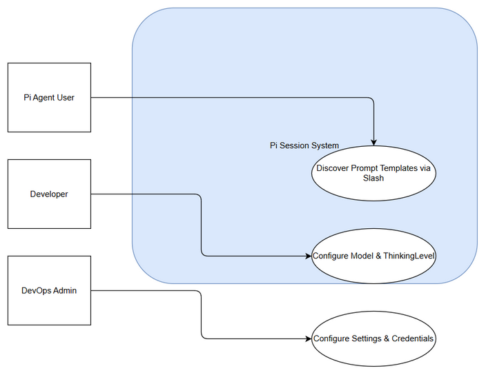
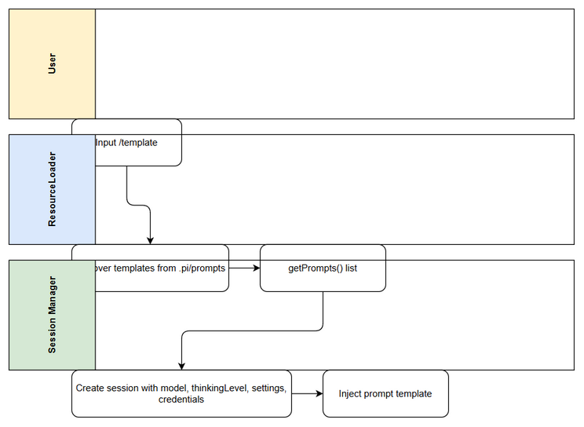

# Business Requirements Document (BRD)

## SDLC Agents 4 Enterprise — SA4E-318: Add Prompt Templates + configure Settings/Models/Credentials

---

## Document Information

| Field | Value |
|-------|-------|
| Jira Ticket | SA4E-318 |
| Title | Add Prompt Templates + configure Settings/Models/Credentials |
| Author | BA Agent |
| Version | 1.0 |
| Date | 2026-09-24 |
| Status | Draft |

---

## Author Tracking

| Role | Name - Position | Responsibility |
|------|-----------------|----------------|
| Author | BA Agent – Business Analyst | Create document |
| Peer Reviewer | – | Review document |

---

## Revision History

| Version | Date | Author | Changes |
|---------|------|--------|---------|
| 1.0 | 2026-09-24 | BA Agent | Initiate document — auto-generated from Jira ticket SA4E-318 and linked tickets |

---

## Sign-Off

| Name | Signature and date |
|------|--------------------|
| | ☐ I agree and confirm all criteria on this BRD as expected requirements |
| | ☐ I agree and confirm all criteria on this BRD as expected requirements |

---

## 1. Introduction

### 1.1 Scope

Bổ sung Prompt Templates (slash commands) và cấu hình Settings / Models / Credentials cho Pi session, để chatbox có lệnh tắt theo pipeline SDLC và dùng đúng model + credential store của project.

Prompt templates là file-based, inject nội dung khi gọi /tenTemplate. Auto-discover từ <cwd>/.pi/prompts và ~/.pi/agent/prompts, hoặc thêm qua promptsOverride trên DefaultResourceLoader (SA4E-315).

Các boundary cấu hình session còn lại:
- model, thinkingLevel, scopedModels, modelRuntime: chọn model + mức reasoning
- settingsManager: settings file-backed hoặc in-memory
- credentials: cấu hình credential/model storage (API key / OAuth)

### 1.2 Out of Scope

- Thay đổi workflow LangGraph hiện tại ngoài việc migrate sang Pi SDK.
- Quản lý secrets ở mức enterprise vault – chỉ tham chiếu key name.
- UI chính thức cho cấu hình – phạm vi cấu hình qua code/config file trong giai đoạn này.

### 1.3 Preliminary Requirement

- Pi SDK @earendil-works/pi-agent-core đã cài đặt.
- DefaultResourceLoader và createAgentSession có sẵn.
- Thư mục prompts đã chuẩn bị theo cấu trúc .pi/prompts.

---

## 2. Business Requirements

### 2.1 High Level Process Map

Người dùng nhập lệnh slash /{template} → ResourceLoader discover template → Session inject prompt → Agent thực thi với model/thinkingLevel đã cấu hình → Settings/ Credentials được load từ manager → Kết quả trả về chatbox.

*[Edit in draw.io](diagrams/use-case.drawio)*

*[Edit in draw.io](diagrams/business-flow.drawio)*

### 2.2 List of User Stories / Use Cases

| # | Story / Use Case / Epic | Priority | Source Ticket |
|---|-------------------------|----------|---------------|
| 1 | As a Pi Agent user, I want prompt templates discoverable via slash commands so that I can trigger SDLC pipeline steps quickly | MUST HAVE | SA4E-318 |
| 2 | As a developer, I want to configure model, thinkingLevel and scopedModels so that the session uses the correct reasoning model | MUST HAVE | SA4E-318 |
| 3 | As a DevOps admin, I want settings and credentials to be loadable from file-backed or in-memory store without hardcoding secrets so that configuration is secure and portable | MUST HAVE | SA4E-318 |

---

### 2.3 Details of User Stories

---

#### Business Flow

**Step 1:** Người dùng gõ /tenTemplate trong chatbox.
**Step 2:** DefaultResourceLoader quét <cwd>/.pi/prompts và ~/.pi/agent/prompts để discover templates.
**Step 3:** Nếu promptsOverride được cung cấp, merge templates bổ sung.
**Step 4:** loader.getPrompts() trả về danh sách templates khả dụng.
**Step 5:** Session được tạo với model, thinkingLevel, settingsManager, credentials.
**Step 6:** Prompt template được inject vào session và thực thi.
**Step 7:** Kết quả được trả về người dùng.

> **Note:** Templates là file-based, tên lệnh = tên file không phần mở rộng. Credentials chỉ tham chiếu theo tên key, không hardcode secret.

---

#### STORY 1: Prompt Templates discoverable via slash commands

> As a Pi Agent user, I want prompt templates discoverable via slash commands so that I can trigger SDLC pipeline steps quickly

**Requirement Details:**

1. Prompt templates của project (vd /brd, /fsd, /tdd, /deploy) discover được và gọi bằng /ten
2. loader.getPrompts() liệt kê đầy đủ templates từ cả cwd và agent dir
3. promptsOverride cho phép thêm template động qua DefaultResourceLoader

**Data Fields (if applicable):**

| Field | Type | Required | Description | Example |
|-------|------|----------|-------------|---------|
| templateName | string | Yes | Tên template không dấu / | brd |
| templatePath | string | Yes | Đường dẫn file prompt | .pi/prompts/brd.md |
| promptContent | string | Yes | Nội dung prompt | "Create BRD..." |

**Acceptance Criteria:**

1. Prompt templates của project discover được và gọi bằng /ten
2. loader.getPrompts() liệt kê đầy đủ templates
3. Slash command trigger đúng template đã đăng ký

**UI Specifications (if applicable):**

| No. | Name | Type | Required | Description | Note |
|-----|------|------|----------|-------------|------|
| 1 | Chat Input | Input | Yes | Nhập lệnh /tenTemplate | Hỗ trợ autocomplete |
| 2 | Prompt List | List | No | Hiển thị danh sách templates discover được | |

**Validation Rules (if applicable):**

- templateName chỉ chứa chữ thường, số, dấu gạch nối
- templatePath phải tồn tại trong .pi/prompts

**Error Handling (if applicable):**

- Template not found: Hiển thị thông báo "Template '{name}' không tồn tại"
- Load error: Log diagnostic và trả về danh sách templates còn khả dụng

---

#### STORY 2: Model + ThinkingLevel configuration

> As a developer, I want to configure model, thinkingLevel and scopedModels so that the session uses the correct reasoning model

**Requirement Details:**

1. Model + thinkingLevel cấu hình được và dùng khi prompt
2. scopedModels và modelRuntime được truyền vào createAgentSession
3. Session sử dụng đúng model đã chọn

**Data Fields:**

| Field | Type | Required | Description | Example |
|-------|------|----------|-------------|---------|
| model | string | Yes | Tên model | gpt-4o-mini |
| thinkingLevel | string | No | Mức reasoning | low/medium/high |
| scopedModels | array | No | Danh sách model scope | [modelA, modelB] |

**Acceptance Criteria:**

1. Model + thinkingLevel cấu hình được và dùng khi prompt
2. Session khởi tạo thành công với tham số model

**Validation Rules:**

- model phải là model được hỗ trợ
- thinkingLevel ∈ {low, medium, high}

**Error Handling:**

- Invalid model: Fallback về default model và log warning

---

#### STORY 3: Settings and Credentials configuration

> As a DevOps admin, I want settings and credentials to be loadable from file-backed or in-memory store without hardcoding secrets so that configuration is secure and portable

**Requirement Details:**

1. Settings nạp từ file-backed hoặc in-memory theo host
2. Credentials cấu hình đúng (không hardcode secret; tham chiếu theo tên key)
3. settingsManager được truyền vào createAgentSession

**Data Fields:**

| Field | Type | Required | Description | Example |
|-------|------|----------|-------------|---------|
| settingsSource | string | Yes | file / memory | file |
| credentialKey | string | Yes | Tên key credential | openai_api_key |
| credentialValueRef | string | Yes | Tham chiếu giá trị | env:OPENAI_KEY |

**Acceptance Criteria:**

1. Settings nạp từ file-backed hoặc in-memory theo host
2. Credentials cấu hình đúng (không hardcode secret; tham chiếu theo tên key)

**Validation Rules:**

- credentialValueRef không chứa giá trị thật, chỉ tham chiếu
- settings file phải hợp lệ JSON/YAML

**Error Handling:**

- Missing credential: Báo lỗi "Credential key '{key}' not found"
- Settings parse error: Dùng default settings và log error

---

## 3. Dependencies

| Dependency | Type | Related Ticket | Description |
|------------|------|----------------|-------------|
| Pi SDK Installation | System | SA4E-289 | @earendil-works/pi-agent-core phải được cài đặt |
| DefaultResourceLoader | System | SA4E-315 | Hỗ trợ promptsOverride |
| Prompt directory structure | Infrastructure | N/A | <cwd>/.pi/prompts và ~/.pi/agent/prompts tồn tại |

---

## 4. Stakeholders

| Role | Name / Team | Responsibility | Source |
|------|-------------|----------------|--------|
| Reporter/Creator | Duc Nguyen Minh | Yêu cầu feature | SA4E-318 |
| Epic Owner | SA4E Team | Migrate LangGraph to Pi SDK | SA4E-289 |

---

## 5. Risks and Assumptions

### 5.1 Risks

| Risk | Impact | Likelihood | Mitigation |
|------|--------|------------|------------|
| Template discovery fail do path sai | High | Medium | Validate path và log diagnostics |
| Credential leak nếu hardcode | High | Low | Enforce reference-only, static scan |
| Model không tương thích | Medium | Medium | Validate model list trước khi khởi tạo |

### 5.2 Assumptions

- Pi SDK API ổn định theo docs https://pi.dev/docs/latest/sdk
- Người dùng có quyền truy cập thư mục prompts
- Credentials được quản lý bởi hệ thống môi trường bên ngoài

---

## 6. Non-Functional Requirements

| Category | Requirement | Details |
|----------|-------------|---------|
| Performance | Prompt discovery | < 500ms cho < 100 templates |
| Security | Credentials | Không hardcode secret, tham chiếu theo tên key |
| Scalability | Settings | Hỗ trợ file-backed và in-memory |
| Availability | Session init | Session tạo thành công với config hợp lệ |

> No specific non-functional requirements identified beyond above.

---

## 7. Related Tickets

| Ticket Key | Summary | Status | Type | Relationship |
|------------|---------|--------|------|--------------|
| SA4E-318 | Add Prompt Templates + configure Settings/Models/Credentials | In Progress | Task | Main ticket |
| SA4E-289 | Migrate LangGraph Workflow Engine to Pi SDK (Option C) | In Progress | Epic | Parent |

---

## 8. Appendix

### Glossary

| Term | Definition |
|------|------------|
| Prompt Template | File prompt được discover và gọi bằng slash command |
| ResourceLoader | Component load prompts, settings, credentials |
| settingsManager | Quản lý settings file-backed hoặc in-memory |

### Reference Documents

| Document | Link / Location |
|----------|-----------------|
| Pi SDK Docs | https://pi.dev/docs/latest/sdk |
| Example prompt templates | examples/sdk/08-prompt-templates.ts |
| Example model config | examples/sdk/02-custom-model.ts |
| Example credentials | examples/sdk/09-api-keys-and-oauth.ts |
| Example settings | examples/sdk/10-settings.ts |
