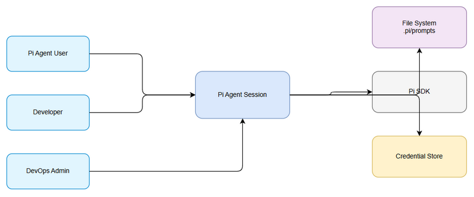
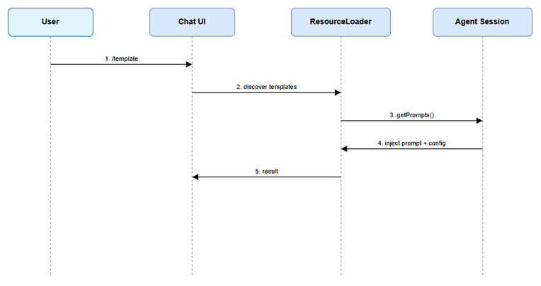
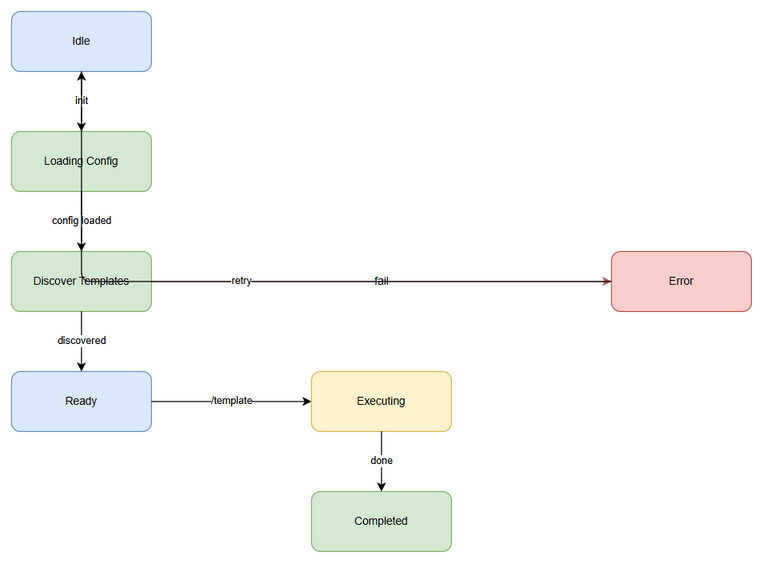

# Functional Specification Document (FSD)

## SDLC Agents 4 Enterprise — SA4E-318: Add Prompt Templates + configure Settings/Models/Credentials

---

## Document Information

| Field | Value |
|-------|-------|
| Jira Ticket | SA4E-318 |
| Title | Add Prompt Templates + configure Settings/Models/Credentials |
| Author | BA Agent |
| Version | 1.0 |
| Date | 2026-09-24 |
| Status | Draft |
| Related BRD | documents/SA4E-318/BRD.md |

---

## Revision History

| Version | Date | Author | Changes |
|---------|------|--------|---------|
| 1.0 | 2026-09-24 | BA Agent | Initiate document — auto-generated from BRD SA4E-318 |

---

## 1. Introduction

### 1.1 Purpose
Specify functional requirements for prompt template discovery via slash commands and session configuration for models, thinking level, settings manager and credentials in Pi Agent.

### 1.2 Scope
Reference BRD scope: add file-based Prompt Templates discoverable via slash commands, configure model/thinkingLevel/scopedModels/modelRuntime, settingsManager file-backed or in-memory, credentials reference-only.
Technical scope: Pi SDK @earendil-works/pi-agent-core DefaultResourceLoader, createAgentSession integration.

### 1.3 Definitions & Acronyms

| Term | Definition |
|------|------------|
| Prompt Template | File prompt discovered and invoked via slash command |
| ResourceLoader | Component loading prompts, settings, credentials |
| settingsManager | Manages settings file-backed or in-memory |
| Pi SDK | @earendil-works/pi-agent-core |

### 1.4 References

| Document | Location |
|----------|----------|
| BRD | documents/SA4E-318/BRD.md |
| Pi SDK Docs | https://pi.dev/docs/latest/sdk |

---

## 2. System Overview

### 2.1 System Context Diagram

*[Edit in draw.io](diagrams/system-context.drawio)*

Pi Agent Session interacts with Pi Agent User, Developer, DevOps Admin. External systems: File System (.pi/prompts, ~/.pi/agent/prompts), Pi SDK, Credential Store/Environment.

### 2.2 System Architecture
Session initialization pipeline: DefaultResourceLoader discovers templates from cwd and agent dir, merges promptsOverride, loads settingsManager and credentials reference, creates agent session with model/thinkingLevel/scopedModels/modelRuntime. Agent execution injects selected prompt template.

---

## 3. Functional Requirements

### 3.1 Feature: Prompt Templates Discoverable via Slash Commands

**Source:** BRD Story 1

#### 3.1.1 Description
Allow users to trigger SDLC pipeline steps via slash commands, templates discovered from .pi/prompts.

#### 3.1.2 Use Case
**Use Case ID:** UC-1
**Actor:** Pi Agent User
**Preconditions:** At least one template exists in .pi/prompts
**Postconditions:** Prompt injected and session executes

**Main Flow:**
| Step | Actor | System | Description |
|------|-------|--------|-------------|
| 1 | User | | Types /templateName in chat |
| 2 | | ResourceLoader | Discovers templates from cwd and agent dir |
| 3 | | ResourceLoader | Merges promptsOverride if provided |
| 4 | | Session | Injects prompt content |
| 5 | | Agent | Executes with configured model |

**Alternative Flows:**
| ID | Condition | Steps |
|----|-----------|-------|
| AF-1 | promptsOverride provided | Merge additional templates |

**Exception Flows:**
| ID | Condition | Steps |
|----|-----------|-------|
| EF-1 | Template not found | Show "Template '{name}' không tồn tại" |
| EF-2 | Load error | Log diagnostic, return available list |

#### 3.1.3 Business Rules
| Rule ID | Rule | Source |
|---------|------|--------|
| BR-1 | templateName only lowercase, numbers, hyphen | BRD Validation |
| BR-2 | templatePath must exist in .pi/prompts | BRD Validation |

#### 3.1.4 Data Specifications
**Input Data:**
| Field | Type | Required | Validation | Description |
|-------|------|----------|------------|-------------|
| templateName | string | Y | BR-1 | Slash command name |
| templatePath | string | Y | BR-2 | File path |
| promptContent | string | Y | - | Template body |

**Output Data:**
| Field | Type | Description |
|-------|------|-------------|
| availableTemplates | array | List from getPrompts() |

#### 3.1.5 UI Specifications
**Screen: Chat Input**
| No. | Element | Type | Required | Behavior | Validation |
|-----|---------|------|----------|----------|------------|
| 1 | Chat Input | Input | Y | Accepts /template | Autocomplete |
| 2 | Prompt List | List | N | Shows discoverable templates | - |

#### 3.1.6 API Contract
**Endpoint:** `createAgentSession(params)`
**Purpose:** Initialize session with model, settings, credentials, prompts
**Input Parameters:** model, thinkingLevel, scopedModels, modelRuntime, settingsManager, credentials
**Business Error:** Invalid model → fallback to default

### 3.2 Feature: Model + ThinkingLevel Configuration

**Source:** BRD Story 2

#### 3.2.1 Description
Configure model and reasoning level for session execution.

#### 3.2.2 Use Case
**Use Case ID:** UC-2
**Actor:** Developer
**Preconditions:** Supported model list available
**Postconditions:** Session uses selected model

**Main Flow:**
| Step | Actor | System | Description |
|------|-------|--------|-------------|
| 1 | Developer | | Configures model, thinkingLevel |
| 2 | | Session | Validates model support |
| 3 | | Session | Initializes with params |

**Exception Flows:**
| ID | Condition | Steps |
|----|-----------|-------|
| EF-1 | Invalid model | Fallback to default + log warning |

#### 3.2.3 Business Rules
| Rule ID | Rule | Source |
|---------|------|--------|
| BR-3 | thinkingLevel ∈ {low, medium, high} | BRD |
| BR-4 | model must be supported | BRD |

#### 3.2.4 Data Specifications
| Field | Type | Required | Validation |
|-------|------|----------|------------|
| model | string | Y | Supported list |
| thinkingLevel | string | N | low/medium/high |
| scopedModels | array | N | - |

### 3.3 Feature: Settings and Credentials Configuration

**Source:** BRD Story 3

#### 3.3.1 Description
Load settings from file-backed or in-memory store, credentials referenced by key.

#### 3.3.2 Use Case
**Use Case ID:** UC-3
**Actor:** DevOps Admin
**Preconditions:** Settings file valid JSON/YAML
**Postconditions:** Session initialized with secure config

**Main Flow:**
| Step | Actor | System | Description |
|------|-------|--------|-------------|
| 1 | Admin | | Defines settingsSource, credentialKey |
| 2 | | settingsManager | Loads settings |
| 3 | | Credentials | Resolves reference, no secret hardcode |
| 4 | | Session | Creates with managers |

**Exception Flows:**
| ID | Condition | Steps |
|----|-----------|-------|
| EF-1 | Missing credential | Error "Credential key '{key}' not found" |
| EF-2 | Settings parse error | Use default + log error |

#### 3.3.3 Business Rules
| Rule ID | Rule | Source |
|---------|------|--------|
| BR-5 | credentialValueRef must reference, not contain secret | BRD |
| BR-6 | settings file must be valid JSON/YAML | BRD |

#### 3.3.4 Data Specifications
| Field | Type | Required | Validation |
|-------|------|----------|------------|
| settingsSource | string | Y | file/memory |
| credentialKey | string | Y | - |
| credentialValueRef | string | Y | reference only |

---

## 4. Data Model

### 4.1 Entity Relationship Diagram
Logical model: PromptTemplate, SessionConfig, Settings, Credentials.

### 4.2 Logical Entities

#### Entity: PromptTemplate
| Attribute | Type | Required | Business Rule |
|-----------|------|----------|---------------|
| templateName | string | Y | BR-1 |
| templatePath | string | Y | BR-2 |
| promptContent | string | Y | - |

#### Entity: SessionConfig
| Attribute | Type | Required | Business Rule |
|-----------|------|----------|---------------|
| model | string | Y | BR-4 |
| thinkingLevel | string | N | BR-3 |
| settingsSource | string | Y | - |
| credentialKey | string | Y | BR-5 |

---

## 5. Integration Specifications

### 5.1 External System: Pi SDK
| Attribute | Value |
|-----------|-------|
| Purpose | Agent session creation |
| Direction | Outbound |
| Data Format | JSON |
| Frequency | On-demand |

**Data Exchange:**
| Our Data | External Data | Direction | Business Rule |
|----------|--------------|-----------|---------------|
| model, thinkingLevel | session | Send | BR-4 |
| prompts | prompt | Send | BR-1 |

### 5.2 External System: File System
| Attribute | Value |
|-----------|-------|
| Purpose | Prompt templates discovery |
| Direction | Inbound |
| Data Format | Markdown |
| Frequency | On-demand |

---

## 6. Processing Logic

### 6.1 Prompt Discovery Process
**Trigger:** User types slash command
**Input:** templateName
**Output:** Prompt content injected
**Processing Steps:**
| Step | Description | Error Handling |
|------|-------------|----------------|
| 1 | Scan .pi/prompts and ~/.pi/agent/prompts | Log if path missing |
| 2 | Merge promptsOverride | Ignore invalid entries |
| 3 | Return getPrompts list | - |

---

## 7. Security Requirements

### 7.1 Authentication & Authorization
| Role | Permissions | Features |
|------|-------------|----------|
| Pi Agent User | Read | Trigger templates |
| Developer | Read/Write | Configure model |
| DevOps Admin | Read/Write | Configure settings/credentials |

### 7.2 Data Sensitivity Classification
| Data Type | Classification | Requirement |
|-----------|----------------|-------------|
| Credential reference | Confidential | No secret hardcode |

---

## 8. Non-Functional Requirements

| Category | Business Requirement | Acceptance Criteria |
|----------|---------------------|---------------------|
| Performance | Prompt discovery | < 500ms for <100 templates |
| Security | Credentials | Reference-only, no hardcode |
| Scalability | Settings | File-backed and in-memory support |
| Availability | Session init | Success with valid config |

---

## 9. Error Handling

### 9.1 Error Scenarios
| Scenario | Severity | User Message | Expected Behavior |
|----------|----------|-------------|-------------------|
| Template not found | Warning | Template '{name}' không tồn tại | Show available list |
| Invalid model | Warning | Fallback to default | Log warning |
| Missing credential | Critical | Credential key '{key}' not found | Block session init |

---

## 10. Testing Considerations

| ID | Scenario | Input | Expected Output | Priority |
|----|----------|-------|-----------------|----------|
| TC-1 | Discover templates | /brd | Prompt injected | High |
| TC-2 | Invalid model | model=unknown | Fallback default | High |
| TC-3 | Missing credential | key missing | Error message | High |

---

## 11. Appendix

### Diagrams

| Diagram | File |
|---------|------|
| System Context | [system-context.png](diagrams/system-context.png) |
| Sequence | [sequence.png](diagrams/sequence.png) |
| State | [state.png](diagrams/state.png) |

### Diagram Index

| # | Diagram | Image | Source (editable) |
|---|---------|-------|-------------------|
| 1 | System Context |  | *[Edit in draw.io](diagrams/system-context.drawio)* |
| 2 | Sequence |  | *[Edit in draw.io](diagrams/sequence.drawio)* |
| 3 | State |  | *[Edit in draw.io](diagrams/state.drawio)* |

### Change Log from BRD
FSD adds functional use cases, data specifications, API contracts, processing logic derived from BRD stories.
