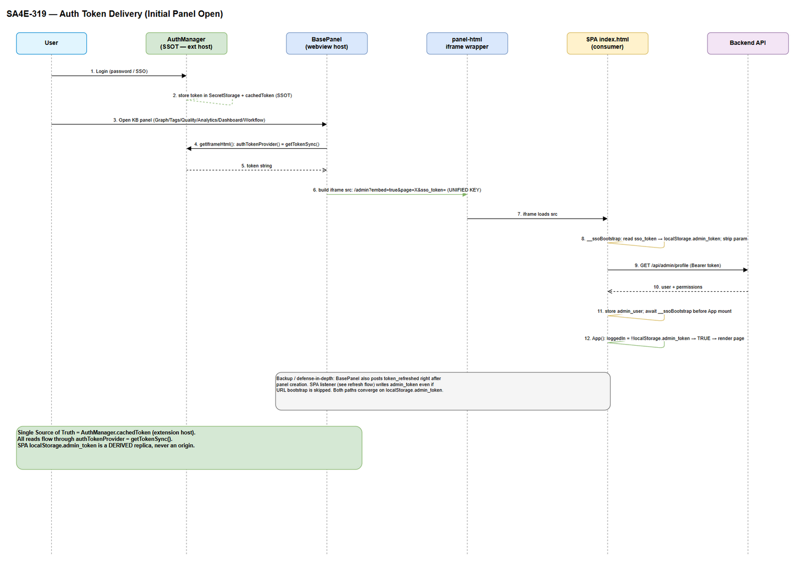
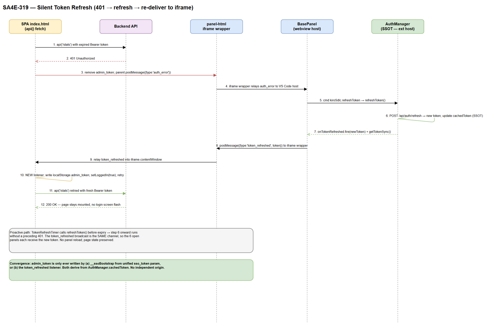

# TDD — SA4E-319: Fix split-brain auth cho KB webview panels

| Field | Value |
|-------|-------|
| Ticket | SA4E-319 (Bug) |
| Loại | Architecture fix — auth token delivery |
| Author | Solution Architect |
| Related | AuthManager (SA4E auth), SA4E-155 (silent refresh channel) |
| Nguyên tắc | Single Source of Truth, no workaround |

---

## 1. Bối cảnh & Triệu chứng

User đã đăng nhập (sidebar hiển thị "Logged in as admin", backend `http://127.0.0.1:48721`), nhưng khi mở các trang KB webview (Graph, Tags, Quality, Analytics, Dashboard, Workflow) thì hiện màn hình login **"Admin Portal"** thay vì nội dung trang.

6 trang này đều là **iframe nhúng backend admin SPA** (`backend/src/viewer/admin/index.html`), tạo bởi cùng một hàm `getIframeHtml()` trong `extension/src/panels/panel-html.ts`.

## 2. Root Cause — Split-brain authentication

Token tồn tại ở 3 nơi nhưng **không hội tụ về một nguồn** và **cầu URL dùng sai key**:

| # | Nơi | Vai trò hiện tại | Vấn đề |
|---|-----|------------------|--------|
| 1 | Extension host — `AuthManager.cachedToken` + VS Code SecretStorage | Nguồn thật (SSOT) | OK |
| 2 | Cầu URL — `panel-html.ts` dòng ~33 | Producer truyền token qua param `token` | **Sai key** |
| 3 | SPA bootstrap — `index.html` IIFE `captureSsoToken` (dòng 527-544) | Consumer chỉ đọc `sso_token` | Không tìm thấy `token` → `if(!tok) return;` → **không ghi `admin_token`** |
| 4 | SPA gate — `App()` (dòng 544) | `loggedIn = !!localStorage.getItem('admin_token')` | `admin_token` rỗng → render `LoginPage` "Admin Portal" |

**Chuỗi lỗi (initial load):**
```
panel-html tạo src: .../admin?embed=true&page=graph&token=<T>&projectId=...
       │  (key = "token")
       ▼
SPA __ssoBootstrap: const tok = p.get('sso_token');  // = null
       │  if(!tok) return;   ← thoát sớm, KHÔNG ghi admin_token
       ▼
App(): loggedIn = !!localStorage.getItem('admin_token')  // = false
       ▼
render <LoginPage>  ← BUG: hiện "Admin Portal"
```

**Vì sao đây là design flaw (không phải typo đơn lẻ):**
- Kênh khởi tạo (URL param) và kênh refresh (`postMessage token_refreshed`) **không được thiết kế cùng contract**. Kênh refresh (từ SA4E-155) đã có ở host (`base-panel.ts`) và ở iframe wrapper (`panel-html.ts`) nhưng **SPA chưa có listener** ghi token vào `localStorage.admin_token` — nên ngay cả khi refresh, SPA vẫn không đăng nhập lại được.
- `loggedIn` chỉ được khởi tạo **một lần** lúc mount từ `localStorage`; không có đường phản ứng khi token đến sau (async).

## 3. Nguyên tắc thiết kế (SSOT — no workaround)

> **Single Source of Truth = `AuthManager.cachedToken` (extension host).**
> `localStorage.admin_token` trong SPA chỉ là **bản sao dẫn xuất (derived replica)**, không bao giờ là nguồn gốc độc lập.

Mọi token đến SPA phải chảy qua **đúng 2 đường ghi** `admin_token`, và cả hai đều bắt nguồn từ `cachedToken`:
1. **Bootstrap (initial):** URL param → `__ssoBootstrap` ghi `admin_token`.
2. **Runtime (refresh/redeliver):** `postMessage token_refreshed` → listener SPA ghi `admin_token`.

⛔ **KHÔNG** vá kiểu `p.get('sso_token') || p.get('token')` — đó là workaround hợp thức hóa 2 key song song, để lại nợ kỹ thuật. Thay vào đó **thống nhất một key duy nhất: `sso_token`** (key mà SPA đã dùng cho SSO web-flow, đã có logic strip param an toàn khỏi history).

## 4. Contract truyền token (Extension → iframe SPA)

### 4.1 Key thống nhất: `sso_token`

Chọn `sso_token` làm key chuẩn cho URL bootstrap vì:
- SPA `__ssoBootstrap` **đã** xử lý `sso_token`: ghi `admin_token`, gọi `/api/admin/profile` lấy permissions, và **strip param khỏi URL history** (bảo mật — token không lưu lại trong history).
- Tránh phải viết logic bootstrap mới → giảm bề mặt thay đổi ở consumer.

Vậy **producer phải đổi key**, không phải consumer đổi để chấp nhận thêm key.

### 4.2 Hai kênh, cùng một payload token

| Kênh | Thời điểm | Producer | Consumer | Ghi vào |
|------|-----------|----------|----------|---------|
| URL param `sso_token` | Initial panel open | `panel-html.getIframeHtml()` | `__ssoBootstrap` IIFE | `localStorage.admin_token` (+ `admin_user`) |
| `postMessage {type:'token_refreshed', token}` | Sau refresh / redeliver | `base-panel.ts` → `panel-html` relay | **listener mới trong SPA** | `localStorage.admin_token`, `setLoggedIn(true)` |

Cả hai đường **cùng đọc từ** `AuthManager` (`getTokenSync()` / `onTokenRefreshed`). Không có đường nào tạo token từ chỗ khác.

### 4.3 Defense-in-depth (khuyến nghị, không bắt buộc để fix)

Ngoài URL bootstrap, `BasePanel` **nên** chủ động `postMessage token_refreshed` ngay sau khi tạo panel. Khi đó, dù URL bootstrap có bị bỏ qua (ví dụ token rỗng lúc build src rồi login sau), listener runtime vẫn đưa SPA vào trạng thái đăng nhập. Hai đường hội tụ về cùng `admin_token`, không xung đột.

## 5. Vòng đời token (lifecycle)

### 5.1 Initial load (xem `diagrams/auth-token-delivery.png`)
1. User login → `AuthManager` lưu `cachedToken` (SSOT).
2. User mở panel → `BasePanel.getIframeHtml()` gọi `authTokenProvider()` = `getTokenSync()`.
3. `panel-html` dựng src với `sso_token=<token>` (key thống nhất).
4. iframe load → `__ssoBootstrap` đọc `sso_token`, ghi `admin_token`, strip param, gọi `/api/admin/profile` ghi `admin_user`.
5. `App()` mount **sau** bootstrap → `loggedIn = true` → render đúng trang.

### 5.2 Silent refresh / redeliver (xem `diagrams/auth-token-refresh.png`)
1. `api()` trong SPA gọi backend với token hết hạn → **401**.
2. SPA xóa `admin_token`, `parent.postMessage({type:'auth_error'})`.
3. `panel-html` relay `auth_error` lên VS Code host.
4. `BasePanel` chạy lệnh `kiroSdlc.refreshToken` → `AuthManager.refreshToken()` cập nhật `cachedToken` + fire `onTokenRefreshed`.
5. `BasePanel` `postMessage({type:'token_refreshed', token})` → `panel-html` relay vào `iframe.contentWindow`.
6. **Listener mới** trong SPA ghi `admin_token`, `setLoggedIn(true)`, không reload trang (giữ nguyên state).
7. `api()` retry với token mới → 200.

**Proactive path:** `TokenRefreshTimer` gọi `refreshToken()` trước hạn → cùng broadcast `token_refreshed`, không cần chờ 401. Cả 6 panel đang mở đều nhận token mới qua cùng kênh (mỗi panel là 1 webview độc lập nghe cùng `onTokenRefreshed`).

### 5.3 Đảm bảo 6 trang đều nhận đúng
- Cả 6 panel kế thừa `BasePanel` và dùng chung `getIframeHtml()` + cùng handler `token_refreshed` trong `panel-html`. Fix ở tầng chung nên **tự động áp dụng cho cả 6 trang**; không cần sửa từng panel (`graph-panel.ts` v.v. không cần đổi).
- `AuthManager.onTokenRefreshed` là `vscode.EventEmitter` → mỗi `BasePanel` instance đăng ký nghe riêng, đảm bảo mọi panel mở đều được đẩy token mới.

## 6. Single Source of Truth — bản đồ đọc/ghi token

| Nơi | Đọc | Ghi | Hội tụ về SSOT? |
|-----|-----|-----|-----------------|
| `AuthManager.cachedToken` + SecretStorage | `getTokenSync`, `getAccessToken` | `login`, `loginSso`, `refreshToken`, `logout` | **Là SSOT** |
| `BasePanel.authTokenProvider` | gọi `getTokenSync()` | — | ✅ đọc từ SSOT |
| `panel-html` iframe src | nhận từ `authTokenProvider` | ghi vào URL `sso_token` | ✅ dẫn xuất từ SSOT |
| SPA `__ssoBootstrap` | đọc URL `sso_token` | ghi `localStorage.admin_token` | ✅ dẫn xuất |
| SPA `token_refreshed` listener (mới) | đọc `event.data.token` | ghi `localStorage.admin_token` | ✅ dẫn xuất (từ `onTokenRefreshed`) |
| SPA `api()` | đọc `localStorage.admin_token` | xóa khi 401 | ✅ chỉ tiêu thụ replica |
| SPA `LoginPage` (chỉ khi thật sự chưa login) | — | ghi `admin_token` sau password/SSO login | ✅ đây là đường login gốc riêng của web browser (ngoài extension) |

**Kết luận:** `admin_token` chỉ được ghi bởi (a) `__ssoBootstrap` từ `sso_token`, (b) listener `token_refreshed`, hoặc (c) `LoginPage` khi mở SPA trực tiếp trên trình duyệt. Trong ngữ cảnh extension iframe, chỉ (a) và (b) hoạt động, cả hai đều dẫn xuất từ `AuthManager`. Không còn nguồn độc lập → hết split-brain.

## 7. Thay đổi cần thực hiện (cho DEV)

### 7.1 `extension/src/panels/panel-html.ts` — đổi key URL
- **Dòng ~33:** đổi `&token=${encodedToken}` thành `&sso_token=${encodedToken}` trong biến `src`.
- Giữ nguyên phần relay `token_refreshed` (đã đúng) và `auth_error`.
- Ghi chú: đây là thay đổi cốt lõi biến URL bootstrap hoạt động đúng với contract của SPA. **Chỉ đổi 1 key**, không thêm key thứ hai.

### 7.2 `backend/src/viewer/admin/index.html` — thêm listener runtime + đảm bảo mount sau bootstrap

**(a) Thêm `token_refreshed` listener (đường runtime — hiện đang thiếu).**
- Đăng ký `window.addEventListener('message', ...)` xử lý `event.data.type === 'token_refreshed' && event.data.token`:
  - `localStorage.setItem('admin_token', event.data.token);`
  - Gọi `window.__onAuthRefreshed?.()` để flip `loggedIn` (xem b).
- Listener này phải tồn tại **độc lập với React lifecycle** (đăng ký ở scope global cùng chỗ `__ssoBootstrap`) để không bị mất khi `App` unmount về `LoginPage`.

**(b) Cho `App()` phản ứng khi token đến sau mount.**
- Hiện có `window.__onAuthExpired = () => setLoggedIn(false)`. Bổ sung đối xứng:
  `window.__onAuthRefreshed = () => setLoggedIn(true);` (set trong cùng `useEffect`, cleanup khi unmount).
- Khi listener (a) chạy: ghi `admin_token` rồi gọi `window.__onAuthRefreshed()` → `loggedIn` chuyển true → render trang, **không reload**, giữ state.

**(c) App mount sau `__ssoBootstrap` — ĐÃ ĐÚNG, không cần sửa.**
- Dòng 574 hiện đã: `Promise.resolve(window.__ssoBootstrap).then(()=>{ReactDOM.createRoot(...).render(<App/>);});` → App mount **sau** khi bootstrap ghi `admin_token`/`admin_user`. Đây là lý do vì sao chỉ cần fix key ở §7.1 là initial load đã hoạt động; §7.2(a)(b) là để đường runtime/refresh cũng đúng.

### 7.3 `extension/src/panels/base-panel.ts` — (khuyến nghị) chủ động đẩy token khi mở panel
- Sau khi tạo panel trong `create()`, nếu có token, `postMessage({type:'token_refreshed', token})` một lần để kích hoạt đường runtime như defense-in-depth. Không bắt buộc để fix bug, nhưng làm hệ thống bền vững với race (login sau khi panel đã mở).

### 7.4 Không cần sửa
- `extension/src/auth/AuthManager.ts` — SSOT đã đúng, `onTokenRefreshed` + `getTokenSync` đủ dùng.
- `extension/src/panels/graph-panel.ts` và 5 panel còn lại — dùng chung tầng `BasePanel`/`panel-html`, tự hưởng fix.

## 8. Bảo mật
- `sso_token` trên URL được `__ssoBootstrap` **strip khỏi history** ngay sau khi đọc (`history.replaceState`) → token không lưu lại trong URL/history. Giữ nguyên hành vi này.
- CSP `frame-src` trong `panel-html` đã giới hạn origin backend; `token_refreshed` relay dùng `postMessage(..., '*')` trong phạm vi iframe cùng origin backend — chấp nhận được vì nội dung chỉ là token đã có, và iframe src cố định theo `backendOrigin`. Không mở rộng target origin.
- Không log token ra console ở mã production (SPA hiện có `console.log('[api] ... tokenLen=', token.length)` — chỉ log độ dài, chấp nhận được; **không** thêm log giá trị token).

## 9. Kiểm thử (cho QA)
1. **Initial load:** login → mở lần lượt 6 panel (Graph, Tags, Quality, Analytics, Dashboard, Workflow) → mỗi panel render nội dung, **không** hiện "Admin Portal".
2. **Token đúng nguồn:** kiểm tra iframe src chứa `sso_token=` (không còn `token=`); `localStorage.admin_token` == `cachedToken`.
3. **Silent refresh:** ép token hết hạn / trả 401 → panel không nhảy về login, tự retry thành công, state trang được giữ.
4. **Proactive refresh:** để `TokenRefreshTimer` xoay token → cả 6 panel đang mở tiếp tục hoạt động.
5. **Race (defense-in-depth):** mở panel trước khi login (token rỗng) → sau khi login, đường `token_refreshed` đưa panel vào trạng thái đăng nhập (nếu triển khai 7.3).
6. **Không regression browser:** mở SPA trực tiếp trên trình duyệt (SSO web-flow) vẫn login qua `sso_token` như cũ.

## 10. Diagram Index

| # | Diagram | Image | Source (editable) |
|---|---------|-------|-------------------|
| 1 | Auth Token Delivery (initial panel open) | [auth-token-delivery.png](diagrams/auth-token-delivery.png) | [auth-token-delivery.drawio](diagrams/auth-token-delivery.drawio) |
| 2 | Silent Token Refresh (401 → refresh → redeliver) | [auth-token-refresh.png](diagrams/auth-token-refresh.png) | [auth-token-refresh.drawio](diagrams/auth-token-refresh.drawio) |






---

## Vòng 2 — Root cause còn lại sau deploy & fix triệt để

Sau khi deploy vòng 1 (đổi key `sso_token` + listener `token_refreshed`), user báo trang Graph render được nhưng còn 3 hiện tượng:

### Hiện tượng
1. **Flashing**: màn hình login "Admin Portal" thoáng hiện rồi mới vào Graph.
2. **"Admin (0)"**: tab hiện 0 permissions.
3. **Sidebar "Login Required"**: extension host coi như chưa đăng nhập.

### Root cause (vòng 2)
| # | Hiện tượng | Nguyên nhân |
|---|-----------|-------------|
| 1 | Flashing | Hai kênh đua nhau: `__ssoBootstrap` async (await fetch profile) + base-panel push `token_refreshed` ngay khi mở panel. App mount đọc `loggedIn` từ localStorage trong lúc token chưa kịp ghi → render LoginPage 1 nhịp rồi flip. |
| 2 | Admin (0) | Listener `token_refreshed` vòng 1 **chỉ ghi `admin_token`, không fetch `/api/admin/profile`** → `admin_user` rỗng → `permissions=[]`. Vi phạm nguyên tắc "2 kênh cùng payload". |
| 3 | Login Required + stale | `localStorage` của iframe **sống lâu hơn phiên đăng nhập** của extension host. Token cũ trong localStorage khiến SPA tự "đăng nhập" với permissions cũ/rỗng, trong khi host (`AuthManager.initialize()` xóa token mỗi session) là UNAUTHENTICATED. |

### Fix vòng 2 (no workaround, SSOT, 2 kênh cùng payload)
1. **`backend/src/viewer/admin/index.html`**
   - Thêm hàm chung `applyToken(tok)`: ghi `admin_token` + fetch profile ghi `admin_user`. CẢ `__ssoBootstrap` và listener `token_refreshed` dùng chung → 2 kênh cùng payload (fix Admin(0)).
   - Thêm `__embedded` (từ `?embed=true`): khi nhúng trong extension, **xóa stale `admin_token`/`admin_user`** lúc load — host là SSOT, không self-login bằng token cũ (fix stale/Admin(0)).
   - Thêm no-flash gate: khi `__embedded && !__authSettled && !admin_token` → hiện "Authenticating…" thay vì LoginPage (fix flashing). Chỉ fallback LoginPage khi host đã settle mà vẫn không có token.
   - `App`: `authVer` bump khi token áp dụng → re-read `admin_user` (permissions) → tab hiện đúng số quyền. `__onAuthRefreshed` flip loggedIn + bump authVer.
   - Listener xử lý `auth_unavailable` → settle + về LoginPage.
2. **`extension/src/panels/base-panel.ts`**: sau khi set html, host báo trạng thái auth ĐÚNG MỘT LẦN: có token → `token_refreshed`; không token → `auth_unavailable` (để SPA không kẹt ở "Authenticating…").
3. **`extension/src/panels/panel-html.ts`**: relay `auth_unavailable` vào iframe.

### Verify vòng 2
- extension `tsc`: PASS; backend build: PASS (dist chứa applyToken/__embedded/__authSettled/auth_unavailable).
- extension full suite: 1917 pass, 0 fail. Test regression `panel-html-token.test.ts`: 3/3 pass.
- Đóng gói VSIX + `kiro --install-extension --force`: thành công.
- ⚠️ Manual UI pending: login → mở 6 panel → không flash, không "Admin (0)", sidebar "Logged in as ...".


---

## Vòng 3 — Mở Graph làm logout toàn cục (root cause sâu nhất) + fix C

### Triệu chứng (sau deploy vòng 2)
Hết flashing, nhưng mở Graph → session expired + logout cả extension host (sidebar "Login Required", tab "Admin (0)").

### Root cause (xác định qua code — SA4E-262 session-fixation hardening)
Token là **session token** validate qua `SessionService`/`validateSession` với **user-agent binding**:
```
if (currentUserAgentHash && row.user_agent_hash && row.user_agent_hash !== currentUserAgentHash) return null; // → 401
```
Một session token bị dùng bởi **2 user-agent hợp pháp**:
- Login từ **extension host** (Node undici) → session gắn UA hash của Node.
- Iframe `/api/admin/*` chạy từ **webview Chromium** → UA khác → validate 401.

Chuỗi lỗi: iframe 401 → `parent.postMessage(auth_error)` → panel-html relay → base-panel `kiroSdlc.refreshToken` → `AuthManager.refreshToken()` → `/api/auth/refresh` cũng UA-bind fail → `transitionTo("UNAUTHENTICATED")` → **logout host**. Fix vòng 1/2 đưa token vào iframe nên mới lộ mismatch UA này.

### Fix C (đã chọn — kết hợp A + B, no workaround)

**A — Backend bỏ UA-binding cho session do extension cấp (giữ cho browser SSO):**
- `extension/src/auth/AuthManager.ts`: gửi header `X-Client-Type: extension` khi `login()` và `refreshToken()`.
- `backend/src/server/routes/auth/unified.ts` `/login`: nếu `x-client-type === 'extension'` → `sessions.issue(userId,'',ip,'')` (UA rỗng). `validateSession`/`refreshSession` tự bỏ so UA khi `row.user_agent_hash` rỗng (logic sẵn có). Browser SSO (không header) giữ UA-binding.
- Lý do an toàn: session extension chỉ dùng loopback 127.0.0.1 cùng máy/cùng user, token vẫn opaque ngẫu nhiên. Session fixation cho luồng browser công cộng vẫn được bảo vệ.

**B — Panel 401 không kéo sập host:**
- `extension/src/panels/base-panel.ts`: khi `auth_error`, refresh; nếu có token mới → `token_refreshed`; nếu KHÔNG → gửi `auth_unavailable` (panel tự về login) thay vì để host logout.

### Verify vòng 3
- backend build: PASS (dist unified.js chứa isExtensionClient/x-client-type).
- extension compile: PASS.
- Test mới `admin.test.ts`: (1) extension session dùng được từ UA khác → 200; (2) browser session bị chặn UA khác → 401. PASS.
- Full suite: backend 3008 pass, extension auth+panels 63 pass, 0 fail.
- Đóng gói VSIX + `kiro --install-extension --force`: thành công.
- ⚠️ Manual UI pending: reload window + restart server + login lại → mở Graph → KHÔNG logout, tab hiện đúng permissions.

### Bảo mật (đánh giá)
Nới UA-binding CHỈ cho session `X-Client-Type: extension` (loopback, cùng máy). Luồng SSO web-browser giữ nguyên hardening SA4E-262 — verify bằng test "browser session rejected from different UA". Không hardcode secret, không log token value.
