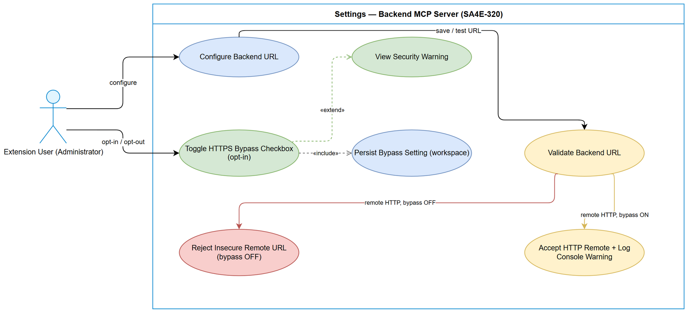
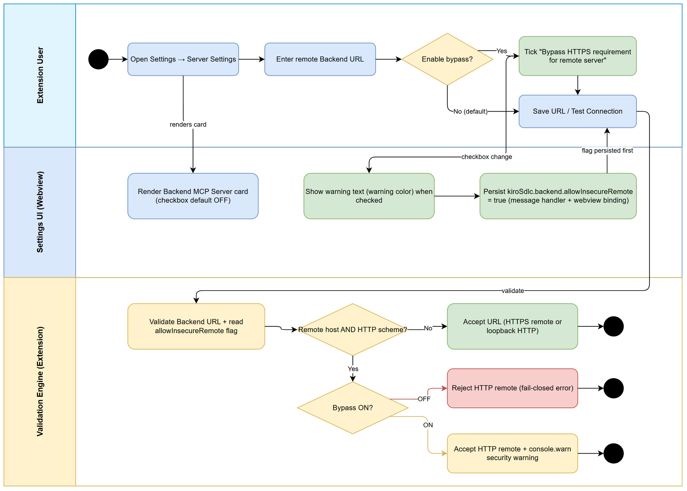

# Business Requirements Document (BRD)

## SDLC Agents 4 Enterprise (VS Code/Kiro Extension) — SA4E-320: Add opt-in checkbox to bypass HTTPS enforcement for remote backend server

---

## Document Information

| Field | Value |
|-------|-------|
| Jira Ticket | SA4E-320 |
| Title | Add opt-in checkbox to bypass HTTPS enforcement for remote backend server |
| Project | SA4E — SDLC Agents 4 Enterprise |
| Issue Type | Story |
| Priority | Medium |
| Labels | security, settings-ui, transport-security |
| Author | BA Agent |
| Version | 1.0 |
| Date | 2026-09-23 |
| Status | Draft |
| Source Ticket Status | To Do |

---

## Author Tracking

| Role | Name - Position | Responsibility |
|------|-----------------|----------------|
| Author | BA Agent – Business Analyst | Create document |
| Peer Reviewer | TBD – Scrum Master / Product Owner | Review document |

---

## Revision History

| Version | Date | Author | Changes |
|---------|------|--------|---------|
| 1.0 | 2026-09-23 | BA Agent | Initiate document — auto-generated from Jira ticket SA4E-320 (no linked tickets, no comments, no attachments available) |

---

## Sign-Off

| Name | Signature and date |
|------|--------------------|
| | ☐ I agree and confirm all criteria on this BRD as expected requirements |
| | ☐ I agree and confirm all criteria on this BRD as expected requirements |

---

## 1. Introduction

### 1.1 Problem Statement / Business Context

The Settings screen of the extension (**Settings > tab "Server Settings" > card "Backend MCP Server"**) currently **enforces HTTPS for all remote (non-loopback) backend server connections**, as mandated by the project transport-security requirement **SEC-289-03**. Loopback addresses (`localhost`, `127.0.0.1`, `::1`, `127.x`) are allowed over HTTP.

This secure-by-default posture is correct for production, but it **blocks legitimate use cases** where the backend MCP server is reachable only over HTTP — for example:

- Internal / air-gapped development environments without TLS termination;
- Trusted private networks where operators deliberately run an HTTP-only backend;
- Local lab setups where the backend is exposed on a non-loopback interface (e.g. LAN IP or Docker host name) but no certificate is available.

Today, operators have **no supported way** to connect to such a remote backend: the URL is rejected with no recourse short of changing the code. At the same time, simply removing the HTTPS enforcement is unacceptable — it would weaken the security baseline for every user.

**Business objective:** introduce a **deliberate, opt-in bypass** — a single checkbox that lets an informed user relax HTTPS enforcement for a remote backend **while keeping the system secure by default**, warning the user of the risks, and leaving SEC-289-03 enforcement fully intact for everyone who does not opt in.

> **Source:** SA4E-320 description — Context / Requirement sections; Security note: *"This is an opt-in relaxation of transport security requirement SEC-289-03. Keep secure-by-default (checkbox OFF). Security Design Review required at implementation."*

### 1.2 Scope (Scope In)

| # | In-Scope Item | Source |
|---|---------------|--------|
| 1 | New boolean setting `kiroSdlc.backend.allowInsecureRemote` with **default `false`** (secure-by-default) | SA4E-320 AC1 |
| 2 | Checkbox **"Bypass HTTPS requirement for remote server"** rendered **below the Backend URL input** inside the **Backend MCP Server** card; **default OFF** | SA4E-320 AC2 |
| 3 | **Warning text in warning color** explaining the security risk, displayed when the bypass is enabled | SA4E-320 AC3 |
| 4 | Behavior when checkbox **OFF** (default) unchanged: HTTP remote rejected; HTTPS remote and HTTP loopback accepted | SA4E-320 AC4 |
| 5 | Behavior when checkbox **ON**: remote HTTP accepted by URL validation **and a security warning logged to console** | SA4E-320 AC5 |
| 6 | Checkbox state **read/written through message handler + webview binding** and **persisted in workspace settings** | SA4E-320 AC6 |
| 7 | **Unit tests covering both branches** (bypass ON and OFF) of backend URL validation | SA4E-320 AC7 |
| 8 | Awareness of downstream impact: knowledge-base client URL resolution shares the same backend URL policy | SA4E-320 Technical Notes |

### 1.3 Out of Scope (Scope Out)

| # | Out-of-Scope Item | Rationale |
|---|-------------------|-----------|
| 1 | Removing or weakening SEC-289-03 enforcement when the checkbox is OFF | Enforcement remains the baseline; only an explicit opt-in relaxes it |
| 2 | Automatic / environment-variable / URL-parameter activation of the bypass | Must be a deliberate user action only (opt-in) |
| 3 | Backend server-side changes (TLS setup, certificates, server configuration) | Client-side extension setting only |
| 4 | Changing loopback detection rules (`localhost`, `127.0.0.1`, `::1`, `127.x`) | Loopback HTTP remains allowed as-is under SEC-289-03 |
| 5 | Allowing protocols other than `http`/`https` for the backend URL | Bypass relaxes HTTP-vs-HTTPS only, not the protocol allowlist |
| 6 | Fixing pre-existing transport-enforcement gaps outside this change (raw config reads, loopback prefix weaknesses) | Identified by Security Design Review as pre-existing — track as separate follow-up tickets |
| 7 | Persistent status-bar indicator of bypass state outside the Settings panel | Not required by SA4E-320; recommended follow-up by Security Design Review |
| 8 | Certificate pinning, mTLS, or proxy configuration features | Unrelated to the opt-in bypass requirement |

> *Items 6–7 source: SECURITY-REPORT.md (SA4E-320 Security Design Review, findings classified as pre-existing / follow-up). To be confirmed with stakeholders for prioritization.*

### 1.4 Preliminary Requirements

| # | Prerequisite | Type | Status |
|---|--------------|------|--------|
| 1 | SEC-289-03 HTTPS enforcement for remote backend already implemented and active | Existing capability | In place (per ticket Context) |
| 2 | Settings > Server Settings > Backend MCP Server card with Backend URL input exists | Existing UI | In place |
| 3 | **Security Design Review** of the bypass design | Compliance gate | **Required by ticket Security note before implementation** |
| 4 | Agreement on warning copy (risk of credential/data interception over HTTP) | Product/Security sign-off | To be confirmed with stakeholders |

---
## 2. Business Requirements

### 2.1 High Level Process Map

The business process covers two scenarios under the same Settings surface:

1. **Default (secure) path — checkbox OFF:** user opens Settings, enters a backend URL, saves/tests. If the URL is a **remote host over HTTP**, validation **rejects** it (current SEC-289-03 behavior, unchanged). HTTPS remote and loopback HTTP are accepted.
2. **Opt-in bypass path — checkbox ON:** user explicitly ticks **"Bypass HTTPS requirement for remote server"** under the Backend URL field. A **warning in warning color** appears and a **console security warning** is logged. Validation then **accepts remote HTTP** URLs.

The setting defaults to OFF (**secure-by-default**) and persists in workspace settings so the choice survives panel reloads.

#### Use Case Diagram

*[Edit in draw.io](diagrams/use-case.drawio)*

#### Business Flow (Swimlane)

*[Edit in draw.io](diagrams/business-flow.drawio)*

---

### 2.2 List of User Stories / Use Cases

| # | Story / Use Case / Epic | Priority | Source Ticket |
|---|-------------------------|----------|---------------|
| US-1 | As a security-conscious extension user, I want HTTPS enforcement to remain active by default for remote backend servers, so that my connection is protected without any manual configuration. | MUST HAVE | SA4E-320 (AC1, AC4) |
| US-2 | As an administrator running an HTTP-only backend server on a trusted private network, I want an opt-in checkbox "Bypass HTTPS requirement for remote server" under the Backend URL field, so that I can deliberately allow HTTP connections to my remote backend. | MUST HAVE | SA4E-320 (AC2, AC5) |
| US-3 | As a user who enables the bypass, I want a clearly visible warning in warning color explaining the security risks, so that I understand credentials and data may be intercepted over unencrypted HTTP. | MUST HAVE | SA4E-320 (AC3) |
| US-4 | As a returning user, I want the bypass checkbox state to persist in workspace settings and be restored when I reopen the Settings panel, so that my choice survives reloads and sessions. | MUST HAVE | SA4E-320 (AC6) |
| US-5 | As a maintainer of the extension, I want automated unit tests covering both bypass states (ON and OFF), so that transport-security behavior cannot silently regress. | SHOULD HAVE | SA4E-320 (AC7) |

#### Acceptance Criteria Traceability (7 ACs from Jira → User Stories)

| Jira AC | Criterion (abbreviated) | Covered by |
|---------|-------------------------|------------|
| AC1 | New setting `kiroSdlc.backend.allowInsecureRemote` (boolean, default `false`) | US-1 |
| AC2 | Checkbox below Backend URL in Backend MCP Server card; default OFF | US-2 |
| AC3 | Warning text in warning color explaining the risk | US-3 |
| AC4 | OFF: HTTP remote rejected; HTTPS remote + HTTP loopback accepted (behavior unchanged) | US-1 |
| AC5 | ON: validation accepts HTTP remote; console warning still logged | US-2 |
| AC6 | State read/written via message handler + webview binding; persisted in workspace settings | US-4 |
| AC7 | Unit tests updated for both branches (ON/OFF) | US-5 |

---

### 2.3 Details of User Stories

#### Business Flow

**Step 1:** User opens **Settings > Server Settings**; the **Backend MCP Server** card renders with the bypass checkbox **OFF by default**.

**Step 2:** User enters (or edits) the **Backend URL** — either a loopback address, a remote `https://` address, or a remote `http://` address.

**Step 3:** User decides whether HTTPS enforcement must be bypassed for this remote server.

**Step 4 (bypass needed):** User ticks **"Bypass HTTPS requirement for remote server"**. The UI **shows the warning text in warning color** and **persists** `kiroSdlc.backend.allowInsecureRemote = true` through the message handler + webview binding.

**Step 5 (bypass not needed — default):** User leaves the checkbox OFF; no setting change occurs.

**Step 6:** User clicks **Save URL / Test Connection**. The system **validates the backend URL** and **reads the bypass flag fresh from configuration**.

**Step 7 — Decision: is the URL a remote (non-loopback) host using `http://`?**
- **No** (HTTPS remote, or loopback over HTTP): URL is **accepted** — flow ends successfully.
- **Yes**: proceed to Step 8.

**Step 8 — Decision: is the bypass flag ON?**
- **OFF (default):** URL is **rejected with a fail-closed security error** — flow ends with error (secure-by-default preserved).
- **ON:** URL is **accepted** and a **console security warning is logged** — flow ends with a warning.

> **Note:** The bypass never applies to loopback hosts (they are already allowed over HTTP) and never relaxes protocol/malformed-URL validation — it only relaxes the HTTP-vs-HTTPS decision for remote hosts (SA4E-320 Requirement; Security Design Review confirms bypass scope).

---

#### STORY 1: Secure-by-Default HTTPS Enforcement (US-1)

> As a security-conscious extension user, I want HTTPS enforcement to remain active by default for remote backend servers, so that my connection is protected without any manual configuration.

**Requirement Details:**

1. A new boolean setting `kiroSdlc.backend.allowInsecureRemote` is introduced with **default value `false`** — fresh installs and users who never touch the checkbox get exactly today's behavior (SA4E-320 AC1).
2. With the checkbox **OFF** (default), validation behavior is **unchanged** from current SEC-289-03 enforcement (SA4E-320 AC4):
   - Remote (non-loopback) `http://` URL → **rejected** (fail-closed).
   - Remote `https://` URL → **accepted**.
   - Loopback URL over `http://` (`localhost`, `127.0.0.1`, `::1`, `127.x`) → **accepted**.
3. Enforcement must be evaluated **fresh at each validation** — no cached decision that could outlive a settings change.
4. The bypass flag must activate only on a **strict `true` value**; missing/unset/invalid values keep enforcement ON (fail-closed).

**Data Fields (if applicable):**

| Field | Type | Required | Description | Example |
|-------|------|----------|-------------|---------|
| `kiroSdlc.backend.allowInsecureRemote` | Boolean (VS Code setting) | No (default: `false`) | Opt-in flag relaxing HTTPS enforcement for remote backend URLs | `false` |
| `kiroSdlc.backend.url` | String (VS Code setting) | Yes | Backend server URL subject to the transport-security policy | `https://backend.example.com:48721` |

**Acceptance Criteria:**

1. Setting `kiroSdlc.backend.allowInsecureRemote` exists as boolean with default `false` (AC1).
2. With checkbox OFF: HTTP remote is rejected; HTTPS remote and HTTP loopback are accepted — no behavior change vs. current release (AC4).
3. Unset/invalid flag values behave as OFF (fail-closed).

**Validation Rules (if applicable):**

- Default value of the flag is `false` — the system must never ship or initialize it as `true`.
- HTTPS enforcement applies whenever the target host is **not** a loopback host **and** the scheme is `http`.
- Loopback hosts are exempt from HTTPS enforcement regardless of the flag (unchanged SEC-289-03 behavior).

**Error Handling (if applicable):**

- Remote `http://` URL + bypass OFF → validation **fails with a security error**; the URL is not saved/used; user must either switch to `https://` or explicitly enable the bypass.

---

#### STORY 2: Opt-In Bypass Control (US-2)

> As an administrator running an HTTP-only backend server on a trusted private network, I want an opt-in checkbox "Bypass HTTPS requirement for remote server" under the Backend URL field, so that I can deliberately allow HTTP connections to my remote backend.

**Requirement Details:**

1. A checkbox labeled exactly **"Bypass HTTPS requirement for remote server"** appears **below the Backend URL input** inside the **Backend MCP Server** card (Settings > Server Settings) (AC2).
2. Checkbox **default state is OFF** (AC2) — consistent with the setting default `false`.
3. When the checkbox is **ON**, URL validation **accepts remote `http://` URLs** (AC5).
4. While the bypass is active, a **security warning is still logged to the console** on validation, even though the URL is accepted (AC5) — insecure usage must remain traceable.
5. The bypass is **opt-in only**: it changes nothing for users who do not tick the box (AC4).

**UI Specifications (if applicable):**

| No. | Name | Type | Required | Description | Note |
|-----|------|------|----------|-------------|------|
| 1 | Bypass HTTPS requirement for remote server | Checkbox | No (opt-in; default OFF) | Enables acceptance of remote `http://` backend URLs | Directly below Backend URL input, inside card `Backend MCP Server`; exact label text as specified |
| 2 | Backend URL | Text input | Yes (existing) | Backend server URL being validated | Existing element — unchanged, checkbox placed after it |

**Acceptance Criteria:**

1. Checkbox is present under the Backend URL field in the Backend MCP Server card, default OFF (AC2).
2. When ON: remote HTTP URL passes validation; console security warning is logged (AC5).
3. When OFF: remote HTTP URL is rejected (AC4 — shared with US-1).

**Validation Rules (if applicable):**

- Saving/testing with bypass **OFF** + remote `http://` → reject.
- Saving/testing with bypass **ON** + remote `http://` → accept + `console.warn`.
- Bypass **ON** does **not** accept unsupported protocols (e.g. `ftp://`, `ws://`) or malformed URLs — only the HTTP-vs-HTTPS decision is relaxed *(scope per Security Design Review of SA4E-320)*.

**Error Handling (if applicable):**

- Bypass ON + malformed URL → still rejected (validation error unchanged).
- Bypass ON + remote HTTP accepted → success path, but console shows a persistent security warning for each validation while active.

---

#### STORY 3: Visible Risk Warning (US-3)

> As a user who enables the bypass, I want a clearly visible warning in warning color explaining the security risks, so that I understand credentials and data may be intercepted over unencrypted HTTP.

**Requirement Details:**

1. When the bypass checkbox is **checked**, a **warning text in warning color** (warning/amber-red style) is displayed adjacent to the checkbox (AC3).
2. The warning must explain the **business risk**: traffic to the remote backend will be sent as unencrypted HTTP; **credentials and data can be intercepted**; only enable on trusted private networks.
3. When the checkbox is **unchecked**, the warning is **not shown** (no confusing risk message in the default secure state).
4. The warning state must stay **synchronized** with the checkbox (toggle on/off together) including when the panel is reopened with a persisted ON state.

**UI Specifications (if applicable):**

| No. | Name | Type | Required | Description | Note |
|-----|------|------|----------|-------------|------|
| 1 | Security warning text | Warning label (status/warning style) | Conditional — visible only when checkbox ON | Explains MITM/credential-interception risk of unencrypted HTTP | Warning color styling; hidden attribute toggled with checkbox; sits directly under the checkbox |

**Acceptance Criteria:**

1. Warning text rendered in warning color whenever the checkbox is ON (AC3).
2. Warning hidden whenever the checkbox is OFF (AC3).
3. Warning restored correctly from persisted state when the Settings panel reopens.

**Validation Rules (if applicable):**

- Warning visibility must be driven **only** by the checkbox/setting state — it cannot be permanently dismissed while the bypass remains ON.

**Error Handling (if applicable):**

- If state sync fails on load, the panel must fall back to the safe rendering (checkbox OFF / warning hidden only when the persisted value is not `true`).

---

#### STORY 4: Persistent Bypass State (US-4)

> As a returning user, I want the bypass checkbox state to persist in workspace settings and be restored when I reopen the Settings panel, so that my choice survives reloads and sessions.

**Requirement Details:**

1. Checkbox state is **read and written through a message handler + webview binding** (AC6) — the webview posts the toggle; the extension persists it.
2. The value is **persisted in workspace settings** (`kiroSdlc.backend.allowInsecureRemote`) (AC6) and **restored** into the checkbox (and its warning) when the panel loads.
3. The persisted flag is what URL validation reads — UI state and enforcement state cannot diverge after the write completes.
4. Toggling must take effect for subsequent Save/Test operations (the flag is read fresh at validation time).

**Data Fields (if applicable):**

| Field | Type | Required | Description | Example |
|-------|------|----------|-------------|---------|
| `kiroSdlc.backend.allowInsecureRemote` (workspace scope) | Boolean | No (default `false`) | Persisted bypass state written by the message handler | `true` (after user opts in) |

**Acceptance Criteria:**

1. State round-trip: webview message → handler → workspace setting → state pushed back → checkbox + warning restored (AC6).
2. Value persists across Settings panel close/reopen and window reload (AC6).
3. Validation reads the persisted value fresh (no stale in-memory copy deciding enforcement).

**Validation Rules (if applicable):**

- Only a strict boolean `true` written/read as enabled — non-boolean/truthy garbage must behave as OFF (fail-closed).

**Error Handling (if applicable):**

- Persistence failure → subsequent validation falls back to default OFF (enforcement stays ON — fail-closed), user informed via existing settings save/test feedback.

---

#### STORY 5: Regression Protection for Both Branches (US-5)

> As a maintainer of the extension, I want automated unit tests covering both bypass states (ON and OFF), so that transport-security behavior cannot silently regress.

**Requirement Details:**

1. Unit tests cover the **OFF branch**: remote HTTP rejected; HTTPS remote accepted; loopback HTTP accepted (AC7).
2. Unit tests cover the **ON branch**: remote HTTP accepted; console warning emitted (AC7).
3. Tests additionally pin the **bypass scope**: unsupported protocols and malformed URLs remain rejected with the bypass ON.
4. Tests belong to the backend URL validation test suite (ticket: `extension/src/config/__tests__/backend-url.test.ts`).

**Acceptance Criteria:**

1. Automated tests execute for both ON and OFF branches and pass in CI/local runs (AC7).
2. OFF-branch tests prove behavior equivalence with pre-change SEC-289-03 enforcement (AC4 → regression guard).

**Validation Rules (if applicable):**

- Test suite must fail if the default value of the setting ever changes from `false`, or if OFF-branch rejection of remote HTTP is removed.

**Error Handling (if applicable):**

- Not applicable (quality attribute story — no runtime error paths introduced).

---
## 3. Business Rules

| Rule ID | Rule | Rationale | Source |
|---------|------|-----------|--------|
| BR-01 | **Secure-by-default:** `kiroSdlc.backend.allowInsecureRemote` MUST default to `false`. Fresh installs and untouched configurations enforce HTTPS for remote backends. | Preserve SEC-289-03 baseline; no silent weakening | SA4E-320 AC1; Security note |
| BR-02 | **Opt-in only:** the bypass activates ONLY through explicit user interaction with the checkbox. No environment variable, URL parameter, or ambient condition may enable it. | Deliberate, informed decision required | SA4E-320 Requirement; Security note |
| BR-03 | **Warning mandatory:** whenever the bypass is ON, (a) warning text in warning color is visible in the Settings UI, and (b) a security warning is written to the console on each URL validation. | Risk must stay visible while insecure mode is active | SA4E-320 AC3, AC5 |
| BR-04 | **OFF = legacy behavior (no change):** with the checkbox OFF, HTTP remote URLs are rejected; HTTPS remote URLs and HTTP loopback URLs are accepted — identical to current SEC-289-03 behavior. | Backward compatibility; AC4 is a regression contract | SA4E-320 AC4 |
| BR-05 | **ON = accept remote HTTP with warning:** with the checkbox ON, remote `http://` URLs pass validation and a console warning is logged. | Bypass fulfills its purpose without going silent | SA4E-320 AC5 |
| BR-06 | **Loopback exemption unchanged:** `localhost`, `127.0.0.1`, `::1`, `127.x` remain allowed over HTTP regardless of the checkbox state. | Local development must not regress | SA4E-320 Context (SEC-289-03) |
| BR-07 | **Bypass scope limited to transport scheme:** the opt-in relaxes only the HTTP-vs-HTTPS decision for remote hosts. Protocol allowlist (`http`/`https` only) and malformed-URL rejection remain enforced with the bypass ON. | Prevent the escape hatch from becoming a general validator bypass | SA4E-320 Requirement; Security Design Review |
| BR-08 | **State persistence:** checkbox state is read/written via message handler + webview binding and persisted in workspace settings; validation reads the flag fresh at each check. | UI state and enforcement state must not diverge | SA4E-320 AC6 |
| BR-09 | **Downstream consistency:** all consumers that resolve the backend URL for outbound connections apply the same transport policy (including knowledge-base client URL resolution). | One setting, one behavior across the extension | SA4E-320 Technical Notes (knowledge-client) |
| BR-10 | **Fail-closed on missing/invalid flag:** if the flag is absent, unset, or not a strict boolean `true`, enforcement stays ON. | Security controls must fail toward safety | Derived from BR-01/BR-02; Security Design Review |
| BR-11 | **Security Design Review gate:** the bypass design MUST pass a Security Design Review before/with implementation. | Explicit compliance requirement on the ticket | SA4E-320 Security note |

---

## 4. Dependencies

| Dependency | Type | Related Ticket | Description |
|------------|------|----------------|-------------|
| SEC-289-03 — Transport Security | Compliance / Requirement | SA4E-320 (governing requirement) | HTTPS enforcement for non-loopback backend; this ticket is an explicit, opt-in relaxation of that rule |
| Backend URL validation logic (`extension/src/config/backend-url.ts`) | System | SA4E-320 | Existing validation surface (`validateBackendUrl`, `isLoopbackHost`, `getBackendUrl`) that enforces SEC-289-03 today and will consult the new flag |
| Settings UI — Server Settings tab / Backend MCP Server card | System (UI) | SA4E-320 | Host surface for the new checkbox + warning; existing Backend URL input defines placement |
| Message handler + webview binding (Settings panel) | System (UI) | SA4E-320 | Transport for reading/writing the checkbox state (AC6) |
| Workspace settings persistence (VS Code configuration) | Infrastructure | N/A | Stores `kiroSdlc.backend.allowInsecureRemote`; survives reloads |
| Knowledge-base client URL resolution (`knowledge-client.ts` → `resolveKbBaseUrl`) | System (downstream consumer) | SA4E-320 | Shares backend URL resolution — behavior must stay consistent with the chosen policy (BR-09) |
| Security Design Review | Process / External | SA4E-320 | Mandatory review gate called out in the ticket Security note |
| Unit test suite for backend URL validation | System (QA) | SA4E-320 | Must cover both ON/OFF branches (AC7) |

---

## 5. Stakeholders

| Role | Name / Team | Responsibility | Source |
|------|-------------|----------------|--------|
| Reporter / Creator | Duc Nguyen Minh | Raised SA4E-320; product ownership of the requirement | Jira reporter & creator |
| Watcher | 1 watcher (Jira) | Informed of ticket progress | Jira watches |
| Security Reviewer | Security Agent (Security Design Review) | Approve/condition the bypass design (BR-11) | SA4E-320 Security note; SECURITY-REPORT.md |
| Document Author | BA Agent | Produce this BRD | SDLC pipeline |
| Peer Reviewer | Scrum Master / Product Owner (TBD) | Review and sign off BRD | This document |
| End Users | Extension administrators & developers configuring the backend server | Operate the checkbox; accept residual risk when opting in | Target personas of US-1..US-4 |
| Maintainers / QA | Development & QA team | Implement AC7 regression tests; uphold BR-04/BR-05 | SA4E-320 AC7 |

> Assignee is currently unassigned in Jira (assignee: null).

---

## 6. Risks and Assumptions

### 6.1 Risks

| Risk | Impact | Likelihood | Mitigation |
|------|--------|------------|------------|
| Users enable the bypass casually without understanding MITM / credential-interception risk | High | Medium | BR-01 secure default; BR-02 opt-in only; BR-03 mandatory UI + console warnings; warning copy names the concrete risk |
| Bypass flag persisted at workspace scope could be committed in repository settings and activated without clicking the checkbox | High | Low–Medium | Security Design Review Finding #2 — follow-up: restrict configuration scope / trust restrictions, or persistent indicator (Out of Scope #7 → follow-up ticket) |
| Inconsistent enforcement across backend URL consumers (knowledge client vs. other consumers) undermines "one setting, one behavior" | Medium | Medium | BR-09 downstream consistency; Security Design Review condition — must be resolved before ticket acceptance |
| Residual exposure when bypass is deliberately ON: tokens/credentials transit cleartext | High | Low (requires deliberate opt-in) | Accepted residual risk of the opt-in — documented in warning (BR-03); Security Design Review lists residual risks to be recorded on the ticket |
| Warning fatigue — users ignore amber warning over time | Medium | Medium | Warning hidden in default state (only shown when ON); console warning repeats on every validation while active |
| Regression: OFF branch accidentally changes current SEC-289-03 behavior | High | Low | BR-04 as explicit contract; US-5 / AC7 tests pin both branches |

### 6.2 Assumptions

- SEC-289-03 remains the governing transport-security requirement; this ticket creates a controlled exception, not a replacement.
- The target audience for the bypass operates on **trusted private networks** (per warning copy intent) and accepts the residual cleartext-transport risk.
- The bypass checkbox lives only in the **Backend MCP Server card** — no equivalent control is added on other Settings tabs.
- Loopback HTTP usage continues to work unchanged and does not require the checkbox.
- This BRD is produced in a retroactive pipeline; it documents **business requirements only** and does not describe implementation details.
- No linked Jira issues, comments, or attachments exist on SA4E-320 at the time of writing; all requirements derive from the main ticket description.

---

## 7. Non-Functional Requirements

| Category | Requirement | Details |
|----------|-------------|---------|
| Security | Secure-by-default | Flag default `false` (BR-01); fail-closed on missing/invalid flag (BR-10); bypass never ambiently enabled (BR-02) |
| Security | Opt-in relaxation with mandatory warning | UI warning in warning color + console warning while active (BR-03); warning names credential/data interception risk |
| Security | Compliance gate | Security Design Review required (BR-11); residual risks documented on the ticket |
| Security | Minimal bypass scope | Only HTTP-vs-HTTPS decision relaxed for remote hosts; protocol allowlist and malformed-URL checks unaffected (BR-07) |
| Compatibility | SEC-289-03 preserved when OFF | OFF branch behaviorally identical to current enforcement (BR-04) — backward compatible for all non-opted-in users |
| Compatibility | Loopback rules unchanged | `localhost` / `127.0.0.1` / `::1` / `127.x` HTTP still accepted with or without the checkbox (BR-06) |
| Compatibility | Downstream consistency | Backend URL consumers (incl. knowledge-base client URL resolution) follow the same policy (BR-09) |
| Performance | Negligible validation overhead | Enabling/disabling the bypass adds at most a configuration read per validation — no additional network calls, no measurable latency impact on Save/Test |
| Performance | Fresh read at validation | Flag read at validation time (no long-lived cache) so settings changes take effect on the next Save/Test |
| UX | Clear placement & discoverability | Checkbox directly below Backend URL in the Backend MCP Server card; exact label "Bypass HTTPS requirement for remote server"; default OFF |
| UX | Warning visibility | Warning rendered in warning color only while checked; synchronized on toggle and on panel reload; absent in the default secure state |
| UX | Accessible control | Checkbox is a native, keyboard-operable control associated with its label and warning text (per existing Settings conventions) |
| Reliability | Persisted state | Checkbox state survives panel reopen and window reload via workspace settings (AC6); enforcement falls back to ON if state is unreadable (fail-closed) |
| Maintainability | Regression protection | Unit tests for both ON and OFF branches (AC7 / US-5) run with the existing test suite |

---

## 8. Related Tickets

| Ticket Key | Summary | Status | Type | Relationship |
|------------|---------|--------|------|--------------|
| SA4E-320 | Add opt-in checkbox to bypass HTTPS enforcement for remote backend server | To Do | Story | Main ticket |
| SEC-289-03 | Transport Security — HTTPS enforcement for non-loopback backend | N/A (requirement ID) | Security requirement | Governing requirement being opt-in-relaxed by SA4E-320 |

> Jira `issuelinks` for SA4E-320 is empty; no subtasks; no comments; no attachments at time of writing. Pre-existing security findings from the Security Design Review are recommended as separate follow-up tickets (see Out of Scope #6–7) but do not yet exist as Jira issues.

---

## 9. Appendix

### 9.1 Glossary

| Term | Definition |
|------|------------|
| HTTPS Enforcement | The rule (SEC-289-03) that backend URLs pointing to non-loopback hosts must use the `https://` scheme; violations are rejected by URL validation unless the opt-in bypass is active. |
| Loopback Host | A local address — `localhost`, `127.0.0.1`, `::1`, or `127.x` — always permitted over HTTP regardless of the bypass checkbox. |
| Opt-In Bypass | The deliberate user activation of `kiroSdlc.backend.allowInsecureRemote` via the "Bypass HTTPS requirement for remote server" checkbox, allowing remote `http://` backend URLs. |
| Secure-by-Default | Design principle applied here: the bypass flag defaults to `false`, so security enforcement is active unless the user explicitly opts out. |
| SEC-289-03 | Project security requirement ID for Transport Security (HTTPS enforcement for non-loopback backend servers). |
| Backend MCP Server (card) | The Settings > Server Settings card that hosts the Backend URL input and the new bypass checkbox. |
| Remote Backend Server | A backend MCP server reachable at a non-loopback host name or IP — the population subject to HTTPS enforcement. |
| Fail-Closed | Behavior where missing/invalid configuration or rejected URLs cause the system to deny the insecure operation rather than allow it. |
| Warning Color | The visual styling (warning/amber tone) required for the bypass risk message so it reads as a caution, not informational text. |

### 9.2 Diagram Index

| # | Diagram | Image | Source (editable) |
|---|---------|-------|-------------------|
| 1 | Use Case Diagram — Settings / Backend MCP Server bypass | [use-case.png](diagrams/use-case.png) | [use-case.drawio](diagrams/use-case.drawio) |
| 2 | Business Flow (Swimlane) — Extension User / Settings UI / Validation Engine | [business-flow.png](diagrams/business-flow.png) | [business-flow.drawio](diagrams/business-flow.drawio) |

### 9.3 Reference Documents

| Document | Link / Location |
|----------|-----------------|
| Jira ticket SA4E-320 (source of Context, Requirement, 7 ACs, Technical Notes, Security note) | `https://jiraassist.atlassian.net/browse/SA4E-320` |
| UI Spec (existing, produced in ui_design phase) | `documents/SA4E-320/UI-SPEC.md` |
| Security Design Review report (existing, security_review phase) | `documents/SA4E-320/SECURITY-REPORT.md` |
| BRD template used | `documents/templates/BRD-TEMPLATE.md` |
| Backend URL validation logic (context reference only — not a BRD deliverable) | `extension/src/config/backend-url.ts` |
| Backend URL validation tests (AC7 target — context reference only) | `extension/src/config/__tests__/backend-url.test.ts` |
