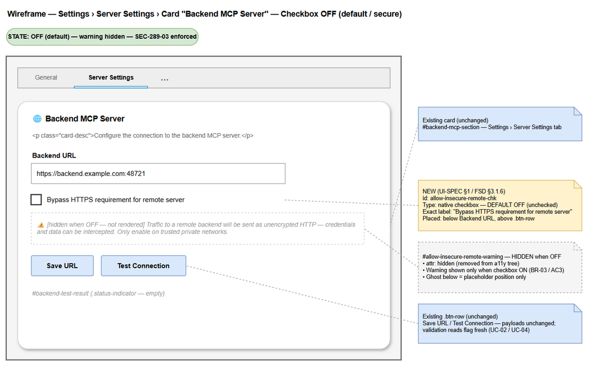
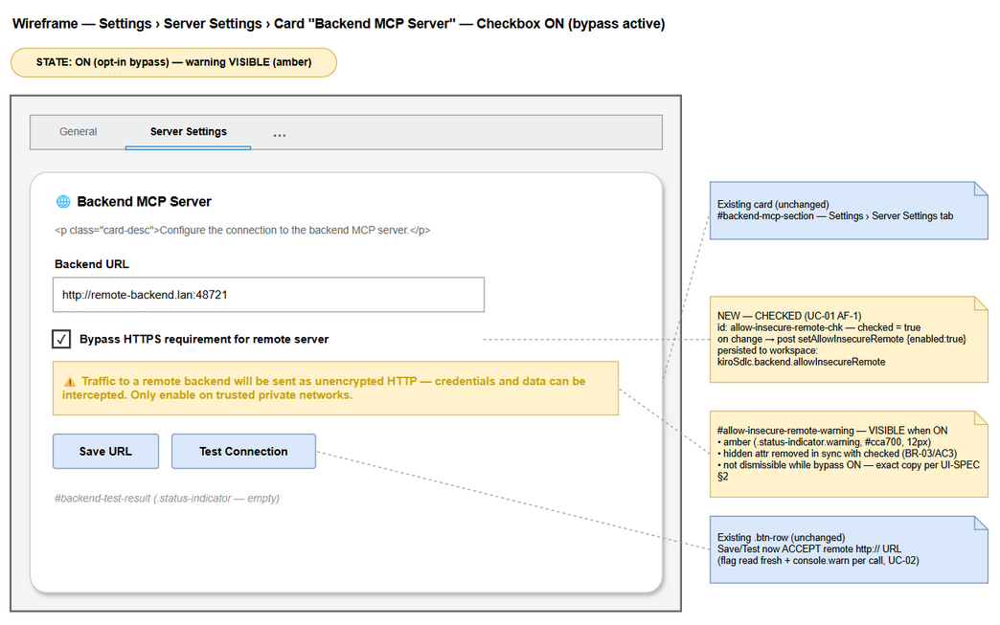

# Functional Specification Document (FSD)

## SDLC Agents 4 Enterprise (VS Code/Kiro Extension) — SA4E-320: Add opt-in checkbox to bypass HTTPS enforcement for remote backend server

---

## Document Information

| Field | Value |
|-------|-------|
| Jira Ticket | SA4E-320 |
| Title | Add opt-in checkbox to bypass HTTPS enforcement for remote backend server |
| Project | SA4E — SDLC Agents 4 Enterprise |
| Issue Type | Story |
| Priority | Medium |
| Labels | security, settings-ui, transport-security |
| Author | BA Agent |
| Version | 1.1 |
| Date | 2026-09-23 |
| Status | Reviewed (TA technical enrichment) |
| Related BRD | `documents/SA4E-320/BRD.md` |
| Related UI Spec | `documents/SA4E-320/UI-SPEC.md` |
| Related Security Report | `documents/SA4E-320/SECURITY-REPORT.md` |
| Template | `documents/templates/FSD-TEMPLATE.md` |

---

## Revision History

| Version | Date | Author | Changes |
|---------|------|--------|---------|
| 1.0 | 2026-09-23 | BA Agent | Initiate document — derived from BRD (5 user stories, 11 business rules), UI-SPEC.md, and SECURITY-REPORT.md for Jira ticket SA4E-320 |
| 1.1 | 2026-09-23 | TA Agent | **TA technical enrichment** — verified spec against actual implementation (`backend-url.ts`, `SettingsMessageHandler.ts`, `SettingsPanel.ts`, `ProviderConfigService.ts`, `knowledge-client.ts`, `settings.js`, `extension/package.json`); enriched API contract (§3.1.8 full VS Code Configuration API read/write paths), downstream consumers (§5.3 — OI-1/ Finding #1 now **RESOLVED in code**), pseudocode for `validateBackendUrl` decision tree + `setAllowInsecureRemote` handler (§6.3–§6.4), Data Model read-site semantics (§4.3), quantified NFRs (§8), new test scenarios TC-15…TC-19 (§10), updated Open Issues (OI-1/OI-6 → Resolved; new OI-9/OI-10), UC alternative/exception flow corrections per code reality |

---

## 1. Introduction

### 1.1 Purpose

This Functional Specification Document (FSD) specifies the **functional behavior** of the opt-in bypass of HTTPS enforcement for remote backend server connections introduced by SA4E-320. It defines use cases, business rules, data/message contracts, UI behavior, validation logic, error handling, and non-functional requirements at a functional level. Implementation-level technical details (module structure, algorithm internals, code changes) are deferred to the TDD produced in the Design phase.

The feature adds a single boolean setting — `kiroSdlc.backend.allowInsecureRemote` (default `false`) — and a corresponding checkbox **"Bypass HTTPS requirement for remote server"** in the **Settings > Server Settings > Backend MCP Server** card, allowing an informed user to deliberately relax security requirement **SEC-289-03** (HTTPS enforcement for non-loopback backend URLs) while preserving secure-by-default behavior for everyone else.

### 1.2 Scope

**In Scope (technical clarifications on top of BRD §1.2):**

| # | In-Scope Item | Source |
|---|---------------|--------|
| 1 | Setting `kiroSdlc.backend.allowInsecureRemote` — boolean, default `false`, workspace scope | BRD AC1, BR-01 |
| 2 | Checkbox + conditional warning text in the Backend MCP Server card (DOM placement, element IDs, exact copy per UI-SPEC.md) | BRD AC2/AC3, UI-SPEC §1–§4 |
| 3 | Webview ↔ extension message contract: `setAllowInsecureRemote`, `state`, unchanged `setBackendUrl` / `testBackendConnection` | BRD AC6, UI-SPEC §5 |
| 4 | Backend URL validation behavior with bypass ON and OFF (fresh flag read, fail-closed strict boolean) | BRD AC4/AC5, BR-04/BR-05/BR-10 |
| 5 | Persistence to workspace settings and restore into UI on panel load | BRD AC6, BR-08 |
| 6 | Unit tests covering both ON/OFF branches of `validateBackendUrl` | BRD AC7, US-5 |
| 7 | Downstream consistency awareness for backend-URL consumers (knowledge-base client URL resolution) | BRD BR-09, Technical Notes |

**Out of Scope:** identical to BRD §1.3 — removing SEC-289-03 when OFF; non-user activation paths; backend server-side TLS changes; loopback detection rule changes; protocols other than `http`/`https`; pre-existing enforcement gaps (tracked as follow-up); persistent status-bar indicator outside Settings; certificate pinning / mTLS / proxy features.

### 1.3 Definitions & Acronyms

| Term | Definition |
|------|------------|
| SEC-289-03 | Project security requirement: non-loopback backend URLs must use `https://`. This ticket is an explicit opt-in relaxation of that rule. |
| Bypass flag | The setting `kiroSdlc.backend.allowInsecureRemote` (boolean, default `false`). |
| Opt-in bypass | Deliberate activation of the flag via the Settings checkbox; no ambient (env/URL-parameter) activation. |
| Loopback host | `localhost`, `127.0.0.1`, `::1`, `[::1]`, or `127.x` — always allowed over HTTP regardless of the flag (BR-06). |
| Fail-closed | Missing/invalid/non-boolean flag → enforcement stays ON; insecure operation is denied rather than allowed (BR-10). |
| validateBackendUrl | Existing backend URL validation function (`extension/src/config/backend-url.ts`) that enforces SEC-289-03 and consults the bypass flag. |
| Settings Webview | The Settings panel webview (`SettingsPanel.ts` + `settings.js`) rendering the checkbox and warning. |
| Extension Host | The extension-side runtime hosting `SettingsMessageHandler`, `ProviderConfigService`, and `validateBackendUrl`. |
| Workspace Settings | VS Code workspace-scope configuration (`.vscode/settings.json`) where the flag is persisted. |
| UC-xx | Use Case identifier used in this document. |

### 1.4 References

| Document | Location |
|----------|----------|
| BRD (source of user stories, ACs, business rules) | `documents/SA4E-320/BRD.md` |
| UI Spec (authoritative for placement, IDs, copy, message contract, accessibility) | `documents/SA4E-320/UI-SPEC.md` |
| Security Design Review report (8 findings, verdict APPROVE WITH CONDITIONS) | `documents/SA4E-320/SECURITY-REPORT.md` |
| Jira ticket SA4E-320 | `https://jiraassist.atlassian.net/browse/SA4E-320` |
| Backend URL validation logic (context reference) | `extension/src/config/backend-url.ts` |
| Backend URL validation tests (AC7 target) | `extension/src/config/__tests__/backend-url.test.ts` |
| FSD template used | `documents/templates/FSD-TEMPLATE.md` |

---

## 2. System Overview

### 2.1 System Context Diagram


*[Edit in draw.io](diagrams/system-context.drawio)*

**Actors and interactions:**

| Actor / System | Role | Interaction with the Feature |
|----------------|------|------------------------------|
| **Extension User (Administrator)** | Human operator | Opens Settings, toggles the bypass checkbox, enters Backend URL, clicks Save URL / Test Connection, reads the warning. |
| **Settings Webview** | UI surface (`SettingsPanel.ts` + `settings.js`) | Renders checkbox `#allow-insecure-remote-chk` and warning `#allow-insecure-remote-warning`; posts `setAllowInsecureRemote` immediately on change; binds `state` message to checkbox/warning; displays Save/Test feedback. **Never decides enforcement** — display only. |
| **Extension Host** | Enforcement authority (`SettingsMessageHandler`, `validateBackendUrl`, `ProviderConfigService`) | Receives webview messages; reads the bypass flag **fresh from configuration at each validation**; validates URLs; persists flag changes to workspace settings; pushes state to the webview. |
| **Workspace Settings** | Persistence (`.vscode/settings.json`) | Stores `kiroSdlc.backend.allowInsecureRemote` (boolean, default `false`) at Workspace scope — survives panel reload and window reload. |
| **Backend MCP Server** | External target | Subject of Test Connection / outbound HTTP; transport policy (HTTPS required for remote unless bypass ON) is applied **before** any connection attempt. |

> **Note:** There is **no new REST API**. All settings read/write go through the VS Code Configuration API (`getConfiguration` / `update`).

### 2.2 System Architecture

| Component | File (existing) | Responsibility in this feature |
|-----------|-----------------|-------------------------------|
| Settings panel HTML | `extension/src/panels/settings/SettingsPanel.ts` | Inserts checkbox + warning block into `#backend-mcp-section` (below Backend URL input, above `.btn-row`) per UI-SPEC §1. |
| Webview logic | `extension/webview-assets/settings/settings.js` | Element refs, `change` listener (post + toggle warning), `handleState()` branch for `allowInsecureRemote`. |
| Message handler | `extension/src/panels/settings/SettingsMessageHandler.ts` | `setAllowInsecureRemote` case (persist to workspace); Save/Test handlers read flag fresh and validate. |
| State provider | `extension/src/services/ProviderConfigService.ts` | `getCurrentState()` exposes `allowInsecureRemote: boolean` to the webview. |
| URL validator | `extension/src/config/backend-url.ts` | `validateBackendUrl(url, { allowInsecureRemote })` — HTTPS enforcement with opt-in bypass; emits `console.warn` while active. |
| Setting declaration | `extension/package.json` → `contributes.configuration` | Declares `kiroSdlc.backend.allowInsecureRemote` — type `boolean`, default `false`. |
| Persistence | `.vscode/settings.json` (workspace) | Durable storage of the flag. |
| Downstream consumers | `getBackendUrl()` call sites; `knowledge-client.ts` (`resolveKbBaseUrl` + `KnowledgeClient` constructor) | Must apply the same transport policy (BR-09) — see §5.3 and Open Issues. <!-- TA enrichment --> **Verified 2026-09-23:** both now honor the flag (Finding #1 fixed); remaining gap is pre-existing raw reads (OI-3). |

**Key architectural principle:** enforcement is decided **server-side (Extension Host) at validation time**, reading the flag fresh from configuration. The webview is a passive display/binding layer; UI state and enforcement state converge because both derive from the same persisted workspace value.

---
## 3. Functional Requirements

### 3.1 Feature: Opt-In Bypass of HTTPS Enforcement (`kiroSdlc.backend.allowInsecureRemote`)

**Source:** BRD US-1…US-5; SA4E-320 AC1–AC7; governing requirement SEC-289-03.

#### 3.1.1 Description

The extension enforces HTTPS for all **remote (non-loopback)** backend server URLs (SEC-289-03). SA4E-320 adds a **deliberate, opt-in relaxation**: a checkbox below the Backend URL input that, when checked, allows remote `http://` backend URLs while keeping every other validation (protocol allowlist, malformed-URL rejection, loopback rules) unchanged.

Behaviour summary:

1. **OFF (default):** identical to current SEC-289-03 enforcement — remote `http://` rejected; remote `https://` and loopback `http://` accepted (BR-04).
2. **ON:** remote `http://` accepted by URL validation, with a **mandatory console security warning on every validation call** and a **mandatory UI warning in warning color** while checked (BR-03, BR-05).
3. The bypass **only** relaxes the HTTP-vs-HTTPS decision for remote hosts; it never relaxes protocol allowlist or malformed-URL rejection (BR-07), and never affects loopback hosts (BR-06).
4. The flag is read **fresh from workspace configuration at each validation** — strict boolean `true` required; anything else behaves as OFF (fail-closed, BR-10).
5. Activation is **opt-in only** — exclusively through the checkbox via the `setAllowInsecureRemote` message; no environment variable or URL parameter can enable it (BR-02).

#### 3.1.2 State Model


*[Edit in draw.io](diagrams/state-bypass.drawio)*

| From | To | Trigger | Guard | Effect |
|------|----|---------|-------|--------|
| *(initial/unset)* | OFF | Extension load / default initialization | Setting absent or not strict `true` | Enforcement ON; checkbox unchecked; warning hidden |
| OFF | ON | User checks checkbox → `setAllowInsecureRemote {enabled:true}` handled | Workspace `config.update(...)` write succeeds | Flag persisted `true`; warning visible; subsequent validations accept remote HTTP + `console.warn` |
| ON | OFF | User unchecks checkbox → `setAllowInsecureRemote {enabled:false}` handled | Workspace `config.update(...)` write succeeds | Flag persisted `false`; warning hidden; subsequent validations reject remote HTTP again |
| ON | ON | Every URL validation (Save / Test / downstream `getBackendUrl`) | Flag remains strict `true` | `console.warn` emitted **on every call** (not once) |
| ON | *(failure)* | Persistence write fails | — | Stored value unchanged → effective state reverts/reads as OFF (fail-closed, BR-10) |

#### 3.1.3 Use Cases

##### UC-01 — Configure Bypass ON (enable opt-in)

**Source:** BRD US-2, US-3; SA4E-320 AC2, AC3, AC5, AC6.

**Actor:** Extension User (Administrator)
**Preconditions:**
- Settings panel is open at tab **Server Settings**; card **Backend MCP Server** (`#backend-mcp-section`) is rendered.
- Checkbox **"Bypass HTTPS requirement for remote server"** is rendered below the Backend URL input with default state **OFF** (setting unset or `false`).

**Postconditions:**
- `kiroSdlc.backend.allowInsecureRemote = true` is persisted in **workspace settings**.
- Warning text is visible in warning color, synchronized with the checkbox.
- Subsequent Save URL / Test Connection operations read the persisted flag fresh and accept remote `http://` URLs (per UC-02).

**Main Flow:**

| Step | Actor | System | Description |
|------|-------|--------|-------------|
| 1 | User | | Locates the checkbox directly below the Backend URL input in the Backend MCP Server card (default: unchecked). |
| 2 | User | | Checks the checkbox (mouse click or Space key). |
| 3 | | Settings Webview | On the `change` event: removes the `hidden` attribute from `#allow-insecure-remote-warning` → warning text displayed in warning color (amber): *"⚠️ Traffic to a remote backend will be sent as unencrypted HTTP — credentials and data can be intercepted. Only enable on trusted private networks."* (UI-SPEC §2). |
| 4 | | Settings Webview | On the **same** `change` event (immediately, not deferred to a Save button): posts `{ type: "setAllowInsecureRemote", enabled: true }` to the Extension Host. |
| 5 | | SettingsMessageHandler | Receives the message; **awaits** `vscode.workspace.getConfiguration("kiroSdlc").update("backend.allowInsecureRemote", true, vscode.ConfigurationTarget.Workspace)`. |
| 6 | | Workspace Settings | Value persisted to workspace settings (`.vscode/settings.json`). |
| 7 | | Settings Webview | Checkbox remains checked; warning remains visible. <!-- TA enrichment --> **Actual implementation:** the handler posts **no response message** for `setAllowInsecureRemote` (no `showStatus` feedback) — success is implicitly the persisted state; failure is silent at UI level (see EF-1). |
| 8 | User | | Clicks Save URL / Test Connection when ready — validation reads the **persisted** flag fresh (UC-02). |

**Alternative Flows:**

| ID | Condition | Steps |
|----|-----------|-------|
| AF-1 | User **unchecks** the checkbox (disable bypass) | Same steps 2–7 with `enabled: false`; warning `hidden` attribute restored; setting persisted `false`; enforcement returns to SEC-289-03 baseline. |
| AF-2 | User reopens the Settings panel later with persisted `true` | On panel load the extension pushes `state` including `allowInsecureRemote: true`; `handleState()` sets checkbox checked and warning visible — no user action needed (see UC-03). |
| AF-3 | User checks the box but never clicks Save/Test | The flag is already persisted at step 6 (change is immediate, per UI-SPEC §5) — the opt-in takes effect for the next validation from any consumer, not only this panel session. |
| AF-4 | Save/Test already has a remote `http://` URL entered when user checks the box | Enabling the bypass does **not** retroactively re-run validation; the user must click Save URL / Test Connection again to validate the URL under the new flag (UC-02). |

**Exception Flows:**

| ID | Condition | Steps |
|----|-----------|-------|
| EF-1 | Persistence failure — `config.update(...)` rejects <!-- TA enrichment --> | The stored value retains its previous state (default `false` if never written). Subsequent validation remains fail-closed (enforcement ON, BR-10). **Code reality:** `handleSetAllowInsecureRemote` has **no try/catch and posts no error response** — the rejection propagates as a rejected promise from `SettingsMessageHandler.handle()`; the webview checkbox remains optimistically checked with **no user-visible error** (tracked as **OI-9**). Authoritative state for enforcement is always the config read at validation time, not the optimistic UI checkbox state. *(TA Note: BA draft stated "user informed through existing Settings save/test feedback path" — that path does not cover this message; corrected per code.)* |
| EF-2 | Incoming `state` message lacks the `allowInsecureRemote` field (undefined) | `handleState()` leaves the default rendering: checkbox **unchecked**, warning **hidden** (safe fallback — no warning shown in the default secure state; no phantom ON state). |
| EF-3 | Checkbox change message contains a non-boolean `enabled` value (malformed message) <!-- TA enrichment --> | **Implemented in code:** `handleSetAllowInsecureRemote` coerces with `enabled === true` before persisting (`SettingsMessageHandler.ts:212`, SECURITY-REPORT Finding #6 — **fixed**). Even if a non-boolean were persisted by other means, validation reads use strict `=== true` → behaves as OFF (fail-closed, BR-10). |
| EF-4 <!-- TA enrichment --> | User toggles checkbox while workspace settings file is read-only / unwritable | Same as EF-1 — `config.update` rejects; no UI error surfaced (OI-9); stored value unchanged → fail-closed OFF. |

**Sequence Diagram:**


*[Edit in draw.io](diagrams/sequence-bypass-toggle.drawio)*

---

##### UC-02 — Validate Backend URL With/Without Bypass

**Source:** BRD US-1, US-2, US-5; SA4E-320 AC4, AC5; BR-04, BR-05, BR-06, BR-07, BR-10.

**Actor:** Extension User; System participants: Settings Webview, SettingsMessageHandler, `validateBackendUrl`, Workspace Settings.

**Preconditions:**
- Settings panel open; Backend URL input contains a value (loopback, remote `https://`, or remote `http://`).
- Bypass flag state is whatever is currently persisted (ON, OFF, or unset).

**Postconditions:**
- The URL is either **accepted** (Save proceeds / Test Connection runs) or **rejected** with a user-visible error; the flag was read **fresh** during this operation; if accepted under bypass ON, a `console.warn` was logged.

**Main Flow (remote `http://` + bypass ON):**

| Step | Actor | System | Description |
|------|-------|--------|-------------|
| 1 | User | | Clicks **Save URL** or **Test Connection** in the Backend MCP Server card. |
| 2 | | Settings Webview | Posts the **unchanged** message payload: `setBackendUrl { url }` or `testBackendConnection { url }` (UI-SPEC §5 — payloads unchanged by this feature). |
| 3 | | SettingsMessageHandler | Reads the flag **fresh** from configuration via the shared helper `getAllowInsecureRemote()` (`backend-url.ts:102-105` — `config.get("backend.allowInsecureRemote") === true`, strict, fail-closed). <!-- TA enrichment --> |
| 4 | | SettingsMessageHandler | Invokes `validateBackendUrl(url, { allowInsecureRemote: flag })`. |
| 5 | | validateBackendUrl | Parses the URL (`new URL()`). Malformed → **EF-1** (reject regardless of flag). |
| 6 | | validateBackendUrl | Protocol allowlist check: only `http:` / `https:` accepted. Unsupported protocol (`ftp:`, `ws:`, …) → **EF-2** (reject regardless of flag — BR-07). |
| 7 | | validateBackendUrl | **Loopback check** (`localhost`, `127.0.0.1`, `::1`, `127.x`): if loopback → **ACCEPT**, no console warning, bypass flag irrelevant (BR-06, AF-3). |
| 8 | | validateBackendUrl | **Remote + `https:`** → **ACCEPT**, no console warning, bypass flag irrelevant (AF-2). |
| 9 | | validateBackendUrl | **Remote + `http:` + flag === true** → emits `console.warn` `[Security] WARNING: Insecure remote backend URL allowed (allowInsecureRemote=true) — traffic … is unencrypted HTTP.` **on this call** (BR-03/BR-05), then **ACCEPT**. |
| 10 | | SettingsMessageHandler | Save: persists `backend.url` via configuration update. Test: performs the outbound connection test to the validated URL. |
| 11 | | SettingsMessageHandler | Posts `backendUrlSaved { success: true, … }` (Save) or the existing test-result message (Test). |
| 12 | | Settings Webview | Displays **"Saved ✓"** or the Test Connection result to the user. |

**Alternative Flows:**

| ID | Condition | Steps |
|----|-----------|-------|
| AF-1 | Remote `http://` + bypass **OFF** (or unset/non-boolean) | Step 9 takes the reject path: `console.warn` (rejection log) + throw `[Security]` error → user-visible failure. Full rejection sequence specified in **UC-04**. |
| AF-2 | Remote `https://` URL, flag either ON or OFF | Accepted at step 8; **no** warning emitted (warning only fires for the insecure remote-HTTP case). |
| AF-3 | Loopback URL over `http://`, flag either ON or OFF | Accepted at step 7; no warning; the checkbox has **no effect** on loopback behavior (BR-06). |
| AF-4 | Test Connection variant | Same steps 1–9; at step 10 the handler performs the network test instead of persisting the URL; result posted back at step 11. No network call occurs if validation rejected (step 9 reject path). |
| AF-5 | Flag present but not strict `true` (e.g. `undefined`, string `"true"`, `1`) | At step 4 the effective flag used for the `=== true` check is **false** → behaves exactly as AF-1 (fail-closed, BR-10). |
| AF-6 <!-- TA enrichment --> | Empty / non-string `url` payload (e.g. `""`) | `validateBackendUrl` returns the compile-time default `http://127.0.0.1:48721` **without throwing** (`backend-url.ts:72-74`) → Save persists the default loopback URL; Test proceeds against the default. Not a security issue (default is loopback), but note: empty input is **silently normalized**, not rejected. |
| AF-7 <!-- TA enrichment --> | URL with trailing slash (`http://host:48721/`) | Validator strips exactly one trailing slash (`url.replace(/\/$/, "")`) **before** parsing; the cleaned URL (no trailing slash) is what gets persisted by Save and returned by Test validation. Loopback/remote decision runs on the cleaned URL. |

**Exception Flows:**

| ID | Condition | Steps |
|----|-----------|-------|
| EF-1 | Malformed URL (unparseable) | Rejected at step 5 with the existing URL validation error — **bypass does not apply**; behavior identical with flag ON or OFF. |
| EF-2 | Unsupported protocol (`ftp://`, `ws://`, …) with bypass **ON** | Rejected at step 6 — the bypass relaxes only the HTTP-vs-HTTPS decision, **not** the protocol allowlist (BR-07). |
| EF-3 | Validation accepted (step 9) but subsequent persistence of `backend.url` fails | Save fails with a configuration-write error; the bypass flag itself is unchanged; user retries Save. |

**Sequence Diagram:**


*[Edit in draw.io](diagrams/sequence-url-validation.drawio)*

---

##### UC-03 — Persist & Restore Bypass State

**Source:** BRD US-4; SA4E-320 AC6; BR-08, BR-10.

**Actor:** Extension User (passive during restore); System: Extension Host (`ProviderConfigService`), Settings Webview, Workspace Settings.

**Preconditions:**
- Workspace settings are readable; the Settings panel is being opened (restore path) or a toggle was just performed (write path).

**Postconditions:**
- UI checkbox + warning exactly reflect the persisted flag; enforcement reads the same persisted value (no divergence between UI state and enforcement state after write completes).

**Main Flow (restore on panel load):**

| Step | Actor | System | Description |
|------|-------|--------|-------------|
| 1 | User | | Opens **Settings > Server Settings**. |
| 2 | | ProviderConfigService | `getCurrentState()` includes `allowInsecureRemote: config.get<boolean>("backend.allowInsecureRemote", false)`. |
| 3 | | Extension Host | Posts the existing `state` message to the webview, now carrying `allowInsecureRemote: boolean` (UI-SPEC §5). |
| 4 | | Settings Webview | `handleState()`: if `msg.allowInsecureRemote !== undefined` → `allowInsecureChk.checked = msg.allowInsecureRemote`; `allowInsecureWarning.hidden = !allowInsecureChk.checked`. |
| 5 | | Settings Webview | User sees checkbox checked + warning visible **iff** the persisted value is `true`; otherwise unchecked + hidden. |
| 6 | User | | Subsequent Save/Test operations read the flag fresh at validation time (UC-02 step 3) — restore and enforcement share one source of truth. |

**Alternative Flows:**

| ID | Condition | Steps |
|----|-----------|-------|
| AF-1 | Initial write (toggle) round-trip | Webview `change` → `setAllowInsecureRemote` → handler persists to workspace → state converges (UC-01 main flow). FIFO `postMessage` ordering + `await` on the handler guarantee config is written **before** a subsequent `setBackendUrl` validates (UI-SPEC §5 ordering guarantee). |
| AF-2 | Window reload / VS Code restart | Workspace settings file survives reload → restore proceeds exactly as the main flow; no in-memory cache carries the flag across sessions (fresh read). |
| AF-3 | Save/Test immediately after toggle | The flag read at validation uses the just-persisted value because `setAllowInsecureRemote` was posted (and awaited) before `setBackendUrl` (DOM event → postMessage is FIFO). |

**Exception Flows:**

| ID | Condition | Steps |
|----|-----------|-------|
| EF-1 | `state` message lacks `allowInsecureRemote` (undefined) | `handleState()` skips the branch → default rendering: unchecked + warning hidden (safe fallback; BRD US-3 error handling). |
| EF-2 | Persistence write failure at toggle time | Stored value unchanged; if it was never `true`, enforcement stays ON (fail-closed). UI may show optimistic checked state until the next state refresh — **config read at validation time is authoritative** (UC-01 EF-1). |
| EF-3 | Non-boolean value present in settings (hand-edited `settings.json`) | Validator treats non-`true` as OFF (fail-closed, BR-10). <!-- TA enrichment --> Write-path coercion `enabled === true` **implemented** (`SettingsMessageHandler.ts:212`, Finding #6 fixed) — the message path can no longer persist garbage; hand-edited values are still neutralized by the strict read. Enforcement (not UI coercion) is the authoritative gate. |

---

##### UC-04 — Reject Insecure Remote URL When Bypass is OFF

**Source:** BRD US-1; SA4E-320 AC1, AC4; BR-01, BR-04, BR-10.

**Actor:** Extension User; System: Settings Webview, SettingsMessageHandler, `validateBackendUrl`.

**Preconditions:**
- Bypass flag is **OFF** (default state — setting unset or `false`; covers fresh installs and users who never touch the checkbox).
- Backend URL input contains a **remote (non-loopback) `http://`** URL.

**Postconditions:**
- The URL is **not saved** and **not used** for any connection; a security error is surfaced to the user; SEC-289-03 enforcement remains intact (secure-by-default preserved).

**Main Flow:**

| Step | Actor | System | Description |
|------|-------|--------|-------------|
| 1 | User | | Enters e.g. `http://remote-host:48721` (non-loopback host, `http` scheme) in the Backend URL input. |
| 2 | User | | Leaves the bypass checkbox **OFF** (default — no action). |
| 3 | User | | Clicks **Save URL** (or **Test Connection**). |
| 4 | | Settings Webview | Posts `setBackendUrl { url }` / `testBackendConnection { url }` (unchanged payload). |
| 5 | | SettingsMessageHandler | Reads flag fresh → `false` / `undefined`. |
| 6 | | validateBackendUrl | Remote + `http:` + flag not strict `true` → logs rejection `console.warn` → throws `[Security] Insecure backend URL rejected …` (SEC-289-03 enforcement). |
| 7 | | SettingsMessageHandler | Catches the error; posts `backendUrlSaved { success: false, message }` (Save) or failure result (Test). For Test: **no network request is made**. |
| 8 | | Settings Webview | Replaces the optimistic premature "Saved ✓" with the error message (existing `settings.js` override behavior). URL is not persisted. |
| 9 | User | | Remediation: either switch the URL to `https://`, or explicitly enable the bypass (UC-01) and retry (UC-02), or use a loopback address. |

**Alternative Flows:**

| ID | Condition | Steps |
|----|-----------|-------|
| AF-1 | User clicks **Test Connection** instead of Save | Identical rejection at step 6, **before** any outbound network call; failure result shown instead of `backendUrlSaved`. |
| AF-2 | User enables the bypass, then retries with the same remote HTTP URL | After UC-01 completes (flag persisted `true`), retry follows UC-02 main flow → accepted with mandatory `console.warn`. |
| AF-3 | Flag unset / missing / non-boolean | Identical to OFF — strict `=== true` required (fail-closed, BR-10, BR-01). Fresh installs therefore reject remote HTTP with zero configuration (AC1/AC4). |
| AF-4 | Downstream consumer (not this panel) resolves a remote HTTP URL while OFF | Any consumer going through `validateBackendUrl` / `getBackendUrl` without the bypass option receives the same rejection (fail-closed) — see §5.3. |

**Exception Flows:**

| ID | Condition | Steps |
|----|-----------|-------|
| EF-1 | A remote HTTP URL was already persisted while bypass ON, then the user toggles bypass **OFF** | The stored URL becomes invalid under the new state; subsequent `getBackendUrl()`/validation throws `[Security]`. UI/consumers without try/catch may surface errors until the user corrects the URL (SECURITY-REPORT Finding #5 — known fail-closed availability behavior; tracked in Open Issues OI-5). |
| EF-2 | Downstream `KnowledgeClient` constructor re-validates a remote HTTP URL <!-- TA enrichment --> | ~~Hard fail-closed (`[Security]` throw) even when the bypass is ON — inconsistent with Settings-panel acceptance (SECURITY-REPORT Finding #1; tracked as OI-1; affects BR-09).~~ **TA Note — RESOLVED in implementation:** `knowledge-client.ts:176-190` now forwards the flag: reads `getAllowInsecureRemote()` (try/catch → fail-closed `false` on read error) and calls `validateBackendUrl(baseUrl, { allowInsecureRemote })`. `resolveKbBaseUrl()` delegates to `getBackendUrl()` (`knowledge-client.ts:151-158`) with loopback fallback on validation failure. Covered by `knowledge-client-bypass.test.ts` (12 tests). OI-1 status → **Resolved** (§11). |

#### 3.1.4 Business Rules

Mapping of BRD business rules **BR-01…BR-11** to functional behavior in this FSD:

| Rule ID | Business Rule (BRD §3) | Functional Behavior in this FSD | FSD Reference |
|---------|------------------------|----------------------------------|---------------|
| BR-01 | **Secure-by-default:** flag MUST default to `false` | Setting declared `default: false` in `package.json`; validator defaults to enforcement ON when options/flag absent; no code path initializes `true` | UC-04 AF-3; §3.1.5 V1; §7.2 |
| BR-02 | **Opt-in only:** no env/URL-parameter/ambient activation | The **only** write path is the checkbox `change` → `setAllowInsecureRemote` → workspace `config.update`; flag read exclusively via VS Code Configuration API | UC-01; §3.1.7; §5.1 |
| BR-03 | **Warning mandatory while ON:** UI warning in warning color + console warning on each validation | Warning div `#allow-insecure-remote-warning` visible whenever checked; `console.warn` emitted on **every** `validateBackendUrl` call while ON | UC-01 steps 2–3; UC-02 step 9; §3.1.6; §9.1 |
| BR-04 | **OFF = legacy behavior (no change):** HTTP remote rejected; HTTPS remote + HTTP loopback accepted | OFF branch identical to pre-change SEC-289-03; regression-pinned by unit tests (AC7) | UC-04; UC-02 AF-1/AF-2/AF-3; §10 TC-02…TC-04 |
| BR-05 | **ON = accept remote HTTP with warning** | Remote `http:` + `flag === true` → ACCEPT after emitting `console.warn` | UC-02 steps 9–12; §10 TC-05 |
| BR-06 | **Loopback exemption unchanged:** `localhost` / `127.0.0.1` / `::1` / `127.x` allowed over HTTP regardless of flag | Loopback check runs before the bypass check; bypass has no effect on loopback | UC-02 step 7 / AF-3; §6.1 step 4 |
| BR-07 | **Bypass scope limited to transport scheme:** protocol allowlist + malformed-URL rejection remain enforced with ON | Protocol and parse checks run **unconditionally** before the HTTP-vs-HTTPS branch | UC-02 EF-1/EF-2; §6.1 steps 2–3; §10 TC-11 |
| BR-08 | **State persistence:** read/write via message handler + webview binding, workspace scope; validation reads fresh each time | `setAllowInsecureRemote` writes workspace config; `getCurrentState()`/`state` restores UI; every validation re-reads config (no cache) | UC-01; UC-03; §3.1.7; §5.1 |
| BR-09 | **Downstream consistency:** all backend-URL consumers apply the same policy (incl. knowledge-base client) | Central `validateBackendUrl`/`getBackendUrl` is the policy authority; consumers must route through it with the flag — <!-- TA enrichment --> **`KnowledgeClient` + `resolveKbBaseUrl` now honor the flag (verified in code; OI-1 Resolved)**; remaining gap = pre-existing raw reads (OI-3) | §5.3; OI-1 (Resolved), OI-3 |
| BR-10 | **Fail-closed on missing/invalid flag:** absent/unset/non-strict-boolean → enforcement stays ON | Strict `=== true` gate at every read site; undefined/non-boolean behaves as OFF; persistence failure leaves enforcement ON | UC-02 AF-5; UC-03 EF-3; §3.1.5 V3/V4; §9.1 |
| BR-11 | **Security Design Review gate:** design MUST pass SDR before/with implementation | SDR completed — `SECURITY-REPORT.md`, verdict **APPROVE WITH CONDITIONS** (8 findings); conditions tracked as Open Issues | §7.3; §11 |

#### 3.1.5 Data Specifications

**Setting Storage:**

| Field / Key | Type | Required | Default | Scope | Validation | Description |
|-------------|------|----------|---------|-------|------------|-------------|
| `kiroSdlc.backend.allowInsecureRemote` | Boolean (VS Code setting) | No | `false` | **Workspace** (`.vscode/settings.json`, same as `backend.url`) | Declared in `extension/package.json` → `contributes.configuration`; read sites enforce strict `=== true` | Opt-in flag relaxing HTTPS enforcement for remote backend URLs |
| `kiroSdlc.backend.url` | String (VS Code setting) | Yes (existing) | *(existing default)* | Workspace | Subject of `validateBackendUrl` with the flag applied | Backend server URL under the transport-security policy |

**Input Data (messages into the Extension Host):**

| Field | Type | Required | Validation | Description |
|-------|------|----------|------------|-------------|
| `setAllowInsecureRemote.enabled` | Boolean (received as `unknown`) | Y | **Implemented:** write path coerces `enabled === true` before persisting (`SettingsMessageHandler.ts:208-213`, Finding #6 fixed); read path additionally enforces strict `=== true` (defense in depth) | New checkbox state to persist |
| `setBackendUrl.url` | String | Y | Existing URL validation pipeline + flag (UC-02) — payload **unchanged** | URL to save |
| `testBackendConnection.url` | String | Y | Existing URL validation pipeline + flag (UC-02) — payload **unchanged** | URL to test |

**Output Data (messages / state out of the Extension Host):**

| Field | Type | Description |
|-------|------|-------------|
| `state.allowInsecureRemote` | Boolean | Current persisted flag included in the existing `state` message (`ProviderConfigService.getCurrentState()`) |
| `backendUrlSaved.success` | Boolean | `true` if validation passed and save completed; `false` for rejection (remote HTTP + OFF, malformed, protocol) |
| `backendUrlSaved.message` | String (optional) | Error text for rejected saves (e.g. `[Security] Insecure backend URL rejected …`) |

**Validation Rules:**

| ID | Rule | Fail-Closed Behavior |
|----|------|----------------------|
| V1 | The default value of `kiroSdlc.backend.allowInsecureRemote` is `false`; the system must never ship or initialize it as `true`. | Fresh install = enforcement ON. |
| V2 | HTTPS enforcement applies whenever the target host is **not** loopback **and** the scheme is `http`. | Remote HTTP rejected when flag not `true`. |
| V3 | Missing/unset flag (`undefined`) is treated as `false`. | Enforcement ON (BR-10). |
| V4 | Only a **strict boolean `true`** activates the bypass at every read site; non-boolean/truthy garbage (`"true"`, `1`, objects) behaves as OFF. | Enforcement ON (BR-10). |
| V5 | Loopback hosts are exempt from HTTPS enforcement regardless of flag state (unchanged SEC-289-03). | Loopback HTTP always accepted (BR-06). |
| V6 | The flag may be sourced **only** from the VS Code Configuration API — never from environment variables or URL query parameters. | No ambient activation (BR-02). |
| V7 | The flag is re-read at **each** validation — no long-lived cache deciding enforcement. | Settings changes take effect on the next Save/Test. |

<!-- TA enrichment — verified against actual code (backend-url.ts, ProviderConfigService.ts, SettingsMessageHandler.ts): -->
> **TA Note — actual read/write semantics (verified):**
> - **Enforcement read sites** (`getAllowInsecureRemote()`, used by `getBackendUrl()`, `handleSetBackendUrl`, `handleTestBackend`, `KnowledgeClient` constructor) all apply strict `config?.get?.<boolean>(...) === true` → V3/V4 satisfied at **100%** of enforcement sites.
> - **UI-state read site** (`ProviderConfigService.getCurrentState()`, `ProviderConfigService.ts:33`) uses `config.get<boolean>("backend.allowInsecureRemote", false)` — default `false` but **no explicit `=== true`**; acceptable because this value only drives checkbox rendering, never enforcement. Coerced to boolean by VS Code's schema validation (`type: "boolean"` in package.json).
> - **Write site** (`handleSetAllowInsecureRemote`) coerces `enabled === true` → only strict boolean `false`/`true` ever persisted from the message path (V4 satisfied on write too).
> - **Package.json declaration** (`extension/package.json:191-195`): `"type": "boolean"`, `"default": false`, description includes interception warning. **No `scope` field declared** → defaults to window scope declaration but written at `ConfigurationTarget.Workspace` (see OI-2).

#### 3.1.6 UI Specifications

> **Authoritative source:** `documents/SA4E-320/UI-SPEC.md` — this section summarizes it for traceability; on any discrepancy, UI-SPEC.md governs (it was produced in the ui_design phase).

**Screen:** Settings webview → tab **Server Settings** → card **Backend MCP Server** (`#backend-mcp-section`).

**Wireframe — default state (checkbox OFF, warning hidden):**


*[Edit in draw.io](diagrams/wireframe-settings-default.drawio)*

**Wireframe — bypass ON (checkbox checked, warning visible in warning color):**


*[Edit in draw.io](diagrams/wireframe-settings-bypass-on.drawio)*

**Placement (DOM order — checkbox block inserted between the Backend URL input and the button row):**

```
1. <h2> 🌐 Backend MCP Server </h2>            (existing)
2. <p class="card-desc">…</p>                  (existing)
3. .form-group → Backend URL input             (existing, unchanged)
4. .form-group.checkbox-group → NEW checkbox + warning   ← INSERTED HERE
5. .btn-row → Save URL / Test Connection       (existing, unchanged)
6. #backend-test-result (.status-indicator)    (existing, unchanged)
```

**Element Summary:**

| No. | Element | Type / ID | Required | Behavior | Validation / Rules |
|-----|---------|-----------|----------|----------|--------------------|
| 1 | Bypass checkbox | `<input type="checkbox" id="allow-insecure-remote-chk">` inside `<label for="allow-insecure-remote-chk">` | No (opt-in; default **OFF**) | Exact label: **"Bypass HTTPS requirement for remote server"**. On `change`: toggle warning visibility + post `setAllowInsecureRemote` immediately. Native keyboard-operable (Tab/Space). | Default matches setting default `false`; state bound to `state.allowInsecureRemote`. |
| 2 | Security warning | `<div id="allow-insecure-remote-warning" class="status-indicator warning" hidden>` | Conditional — **visible only when checkbox ON** | Exact copy: *"⚠️ Traffic to a remote backend will be sent as unencrypted HTTP — credentials and data can be intercepted. Only enable on trusted private networks."* Amber warning color (`--vscode-editorWarning-foreground`); `aria-describedby` association from checkbox; `hidden` toggled with checked state. | Visibility driven **only** by checkbox/setting state — cannot be dismissed while bypass remains ON (BRD US-3). Hidden in default secure state. |
| 3 | Backend URL input | Existing text input | Yes (existing) | Unchanged; checkbox is placed directly **after** it. | Existing validation + flag per UC-02. |
| 4 | Save URL / Test Connection | Existing `.btn-row` buttons | Yes (existing) | Unchanged payloads; validation outcome depends on fresh flag read. | UC-02 / UC-04. |

**Visual treatment (UI-SPEC §4):** native VS Code checkbox (`accent-color: var(--vscode-button-background)`); warning reuses existing `.status-indicator.warning` (amber, `12px`, `margin-top: 8px`) — **zero new CSS required**.

**Accessibility (UI-SPEC §6):** implicit + explicit label association; `aria-describedby="allow-insecure-remote-warning"`; `hidden` removes warning from a11y tree when unchecked (`aria-live="polite"` nice-to-have); native keyboard support; theme-provided WCAG-compliant amber contrast.

#### 3.1.7 Message Contract (Webview ↔ Extension)

> Source: UI-SPEC §5. All messages are `postMessage` JSON objects with a `type` discriminator.

| Message | Direction | Payload | Handler / Effect | Response / Downstream Effect |
|---------|-----------|---------|------------------|------------------------------|
| `state` | Extension → Webview | `{ type: "state", …, allowInsecureRemote?: boolean }` — field added by `ProviderConfigService.getCurrentState()`: `config.get<boolean>("backend.allowInsecureRemote", false)` | `settings.js handleState()`: if field `!== undefined` → set checkbox checked + toggle warning `hidden` | Restores UI after panel open/reload (UC-03). |
| `setAllowInsecureRemote` | Webview → Extension | `{ type: "setAllowInsecureRemote", enabled: boolean }` | `SettingsMessageHandler` case (pattern = `handleSetEnableMcp`): **await** `workspace.getConfiguration("kiroSdlc").update("backend.allowInsecureRemote", enabled, ConfigurationTarget.Workspace)` | Config persisted at Workspace scope; optional `showStatus(… "Saved ✓" …)` feedback. Await completion guarantees ordering before subsequent Save/Test (FIFO + await — UI-SPEC §5). |
| `setBackendUrl` | Webview → Extension | `{ type: "setBackendUrl", url: string }` — **UNCHANGED by this feature** | Handler reads flag **fresh**, validates via `validateBackendUrl(url, { allowInsecureRemote })`, then updates `backend.url` if accepted | `backendUrlSaved { success: boolean, message?: string }` → webview shows "Saved ✓" or error (UC-02 / UC-04). |
| `testBackendConnection` | Webview → Extension | `{ type: "testBackendConnection", url: string }` — **UNCHANGED** | Same fresh-flag validation; network test only proceeds if validation accepts | Existing test-result message → `#backend-test-result` status indicator. |

**Ordering guarantee:** checkbox `change` posts `setAllowInsecureRemote` **before** the user can click Save URL (DOM event → `postMessage` is FIFO); the handler for `setAllowInsecureRemote` is **awaited to completion** so the config write finishes before a later `setBackendUrl` validates (UI-SPEC §5).

#### 3.1.8 API / Integration Contract (Functional View)

> **Note:** This section defines the functional contract (data in/out and business error scenarios). No new REST API is introduced — technical implementation details are deferred to the TDD.

<!-- TA enrichment — complete API contract below (verified against code) -->

**✅ Confirmation: NO new REST API.** SA4E-320 adds **zero** HTTP endpoints. All persistence goes through the **VS Code Configuration API**; all UI traffic goes through the existing **webview `postMessage` contract** (§3.1.7). Outbound HTTP (Test Connection `/health`, downstream consumers) reuses existing endpoints unchanged.

**"API" 1: VS Code Configuration API (settings read/write) — full contract**

| Operation | Signature (functional) | Purpose | Business Rule |
|-----------|------------------------|---------|---------------|
| Read flag | `workspace.getConfiguration("kiroSdlc").get("backend.allowInsecureRemote")` → `boolean \| undefined` | Fresh flag read at each validation and at state assembly | BR-08, BR-10 (V3/V4/V7) |
| Write flag | `workspace.getConfiguration("kiroSdlc").update("backend.allowInsecureRemote", value, ConfigurationTarget.Workspace)` | Persist checkbox state | BR-02, BR-08 |
| Read URL | `…get("backend.url")` → `string` | Backend URL subject to policy | BR-09 |
| Validate URL | `validateBackendUrl(url, { allowInsecureRemote })` → accepted URL **or** throw | Central transport policy enforcement | BR-04, BR-05, BR-06, BR-07 |

**Setting key contract (VS Code `contributes.configuration` declaration):**

| Attribute | Value (verified in `extension/package.json:191-195`) |
|-----------|------------------------------------------------------|
| Key | `kiroSdlc.backend.allowInsecureRemote` |
| Type | `boolean` |
| Default | `false` (BR-01) |
| Declared scope | *(no `scope` property declared — VS Code default; **written** at `ConfigurationTarget.Workspace`)* → OI-2 |
| `restrictedConfigurations` | **Not declared** in `capabilities.untrustedWorkspaces` → OI-2 |
| Description | `"Bypass the HTTPS requirement for remote (non-loopback) backend server URLs. When enabled, HTTP remote URLs are accepted but traffic is unencrypted — credentials and data can be intercepted. Only enable on trusted private networks."` |
| Companion key | `kiroSdlc.backend.url` — `string`, default `"http://127.0.0.1:48721"` (same file, lines 186-190) |

**Read paths (all three — complete enumeration, verified):**

| # | Read site | Code location | Expression | Semantics |
|---|-----------|---------------|------------|-----------|
| R1 | Enforcement helper | `backend-url.ts:102-105` → `getAllowInsecureRemote()` | `config?.get?.<boolean>("backend.allowInsecureRemote") === true` | Strict `=== true`; `undefined`/non-boolean → `false` (fail-closed). **Single shared path** for R2/R3/R4. |
| R2 | `getBackendUrl()` | `backend-url.ts:113-120` | `validateBackendUrl(url, { allowInsecureRemote: getAllowInsecureRemote() })` | Fresh read per call; throws `[Security]` on reject; empty `backend.url` → returns `DEFAULT_BACKEND_URL` (`http://127.0.0.1:48721`). |
| R3 | Settings Save/Test handlers | `SettingsMessageHandler.ts:197-199, 217` | `validateBackendUrl(url, { allowInsecureRemote: getAllowInsecureRemote() })` | Fresh read per Save/Test message. |
| R4 | `KnowledgeClient` constructor | `knowledge-client.ts:180-186` | `getAllowInsecureRemote()` inside try/catch → fail-closed `false` | Fresh read at client construction; read error → bypass OFF. |
| R5 | UI state assembly | `ProviderConfigService.ts:33` → `getCurrentState()` | `config.get<boolean>("backend.allowInsecureRemote", false)` | Default `false`; drives **checkbox rendering only** — never enforcement. |

**Write path (single — complete enumeration, verified):**

| # | Write site | Code location | Expression | Notes |
|---|------------|---------------|------------|-------|
| W1 | `setAllowInsecureRemote` message handler | `SettingsMessageHandler.ts:208-213` | `update("backend.allowInsecureRemote", enabled === true, ConfigurationTarget.Workspace)` | **Only sanctioned write path** (BR-02). Coerces to strict boolean. `await`ed → FIFO ordering before subsequent `setBackendUrl`. No response message posted; no try/catch (OI-9). |

**"API" 2: Webview `postMessage` contract** — see §3.1.7 (4 message types; payloads for `setBackendUrl` / `testBackendConnection` unchanged by this feature).

**"API" 3: Internal function contract — `validateBackendUrl(url, options?)`**

| Attribute | Contract |
|-----------|----------|
| Signature | `validateBackendUrl(url: string, options: { allowInsecureRemote?: boolean } = {}): string` |
| Returns | Cleaned URL string (one trailing slash stripped) on accept; default `http://127.0.0.1:48721` when input is empty/non-string |
| Throws | `Error` with message prefixed `[Security]` — one of: `Malformed backend URL`, `Invalid backend URL protocol`, `Insecure backend URL rejected` |
| Side effect | `console.warn` on: bypass-ON accept (every call), rejection, malformed, unsupported protocol |
| Determinism | Pure function of `(url, options)` — no internal config reads; flag injection is caller's responsibility |

**Business Error Scenarios:**

| Scenario | User Message | Trigger Condition |
|----------|-------------|-------------------|
| Remote HTTP + bypass OFF | `[Security] Insecure backend URL rejected …` (existing validator message) surfaced via `backendUrlSaved { success:false }` / test failure | Remote host + `http:` + flag not strict `true` (BR-04, UC-04) |
| Malformed URL | Existing URL validation error (non-security format error) | `new URL()` parse failure — bypass irrelevant (UC-02 EF-1) |
| Unsupported protocol | Existing protocol-allowlist error | Scheme not in `{http, https}` even with bypass ON (BR-07, UC-02 EF-2) |
| Persistence failure | Settings save/test error feedback path | `config.update` rejects — effective state remains previous/default OFF, fail-closed (UC-01 EF-1) |

---
## 4. Data Model

> **Note:** This feature introduces **no new persistent application entities or database tables** — it is configuration-only. The logical model below describes the workspace-configuration entity; physical details (package.json schema, file format) are specified in the TDD §4. An ER diagram is **not applicable** (single configuration entity, no relationships to other entities).

### 4.1 Entity Relationship Diagram

*Not applicable — no relational entities. See §4.2 for the logical configuration entity.*

### 4.2 Logical Entities

#### Entity: WORKSPACE_BACKEND_CONFIGURATION

Persisted in `.vscode/settings.json` (VS Code workspace configuration).

| Attribute | Logical Type | Required | Business Rule | Description |
|-----------|--------------|----------|---------------|-------------|
| `kiroSdlc.backend.url` | String | Y (existing) | BR-04/BR-05/BR-06/BR-07 via `validateBackendUrl` | Backend server URL subject to transport-security policy |
| `kiroSdlc.backend.allowInsecureRemote` | Boolean | N (default `false`) | BR-01 (default), BR-10 (fail-closed read), BR-08 (workspace persistence, fresh read) | Opt-in bypass flag; only strict `true` activates the bypass |

**Relationships:** none — the flag is a standalone boolean attribute evaluated alongside `backend.url` at validation time.

<!-- TA enrichment — §4.3 verified against actual code -->
### 4.3 Data Semantics vs. Actual Codebase (TA verification)

| Aspect | FSD Spec | Actual Code | Conforms? |
|--------|----------|-------------|-----------|
| Default value | `false` | `package.json:193` → `"default": false` | ✅ Yes |
| Type | Boolean, strict `=== true` to activate | `type: "boolean"` declared; all enforcement reads use `=== true` | ✅ Yes |
| Coercion on write | Recommended `enabled === true` | **Implemented** — `SettingsMessageHandler.ts:212` writes `enabled === true` | ✅ Yes (was "recommended" in v1.0) |
| Scope of write | Workspace | `ConfigurationTarget.Workspace` (`SettingsMessageHandler.ts:212`) | ✅ Yes |
| Scope of declaration | Workspace | **No `scope` in package.json declaration** — write target is Workspace, declaration scope unset (VS Code default) | ⚠️ Partial → OI-2 |
| Fresh read (no cache) | Required | `getAllowInsecureRemote()` reads config on every invocation; no module-level cache | ✅ Yes |
| Missing → `false` | Required | `=== true` handles `undefined`; `getCurrentState` uses default `false` | ✅ Yes |
| Non-boolean garbage → OFF | Required | `=== true` at all enforcement sites | ✅ Yes |
| Empty `backend.url` behavior | Not specified by BA | Code returns `DEFAULT_BACKEND_URL` (`http://127.0.0.1:48721`) rather than throwing (`backend-url.ts:72-74, 116-118`) — safe loopback default, documented in UC-02 AF-6 | ✅ Acceptable (TA-documented) |
| Hand-edited `"true"` string in settings.json | Fail-closed OFF | VS Code schema (`type: boolean`) may reject/normalize on load; enforcement `=== true` treats string as OFF regardless | ✅ Yes (V4) |

**No database entities, indexes, or migrations** — configuration-only feature (confirmed: no DDL, no SQLite/PostgreSQL impact).

---

## 5. Integration Specifications

> **Note:** Business-view integration only; timeout/retry/connection details are specified in the TDD §6.

### 5.1 External System: VS Code Configuration API (Workspace Settings)

| Attribute | Value |
|-----------|-------|
| Purpose | Persist and read the bypass flag and backend URL — the single source of truth for enforcement |
| Direction | Bidirectional (write on toggle; read on validation + state assembly) |
| Data Format | JSON (`.vscode/settings.json` entries) |
| Frequency | Write: on checkbox change (on-demand); Read: at **every** URL validation and panel state load (fresh, no cache) |

**Data Exchange:**

| Our Data | External Data | Direction | Business Rule |
|----------|--------------|-----------|---------------|
| `backend.allowInsecureRemote` value | Workspace setting entry | Send (write, Workspace target) | BR-02 opt-in write path; BR-08 workspace scope |
| Workspace setting entry | `boolean \| undefined` flag | Receive (read) | BR-10 strict `=== true`; BR-08 fresh read each validation |

### 5.2 External System: Backend MCP Server

| Attribute | Value |
|-----------|-------|
| Purpose | Target of Save URL validation context and Test Connection / outbound HTTP (chat, checkpoints, MCP, indexer, KB) |
| Direction | Outbound |
| Data Format | HTTP(S) requests (existing) |
| Frequency | On-demand (Save/Test and runtime consumers) |

**Data Exchange:**

| Our Data | External Data | Direction | Business Rule |
|----------|--------------|-----------|---------------|
| Validated URL + transport decision | HTTP(S) connection | Send — connection attempted **only after** `validateBackendUrl` accepts | BR-04 reject before network I/O when OFF; BR-05 accept + warn when ON |
| Connection test result | Status / error | Receive | Reported via existing test-result message |

### 5.3 Downstream Consumers (Backend-URL Resolution Consistency — BR-09)

<!-- TA enrichment — table re-verified against actual code on 2026-09-23; Finding #1 / OI-1 RESOLVED -->

| Consumer | Resolves URL via | Flag honored? | Functional note (verified) |
|----------|------------------|---------------|---------------------------|
| `SettingsMessageHandler` Save (`handleSetBackendUrl`) | `validateBackendUrl(url, { allowInsecureRemote: getAllowInsecureRemote() })` — `SettingsMessageHandler.ts:197-199` | **Yes** | Primary enforcement point (UC-02/UC-04); fresh read per message |
| `SettingsMessageHandler` Test (`handleTestBackend`) | same — `SettingsMessageHandler.ts:217` | **Yes** | Network test (`GET {url}/health`, 5s abort timeout) only after validation passes |
| `getBackendUrl()` consumers — **tree-view** (`sidebar/tree-view-provider.ts:76`), **panel-html** (`panels/panel-html.ts:16`), **RemoteConverter** (`converter/RemoteConverter.ts:40`), **graph-panel** (`panels/graph-panel.ts:46`), **ProviderConfigService** (`services/ProviderConfigService.ts:32`) | `getBackendUrl()` → `validateBackendUrl` + `getAllowInsecureRemote()` | **Yes** (central helper) | Accepts remote HTTP only when flag `true`; `console.warn` while active; **throws** when OFF + stored remote HTTP (availability → OI-5) |
| Knowledge-base client URL resolution — `resolveKbBaseUrl()` (`knowledge-client.ts:142-159`) | Env override `CODE_INTEL_PORT` → loopback-only URL (no flag needed, always `http://127.0.0.1:{port}`); else `getBackendUrl()`; catch → loopback default | **Yes** | Env override bypasses config but is **hard-bound to loopback** → no transport-security impact (BR-02 unaffected). Validation failure → fail-closed fallback `http://127.0.0.1:48721`. |
| `KnowledgeClient` constructor re-validation (`knowledge-client.ts:176-190`) | `validateBackendUrl(baseUrl, { allowInsecureRemote: getAllowInsecureRemote() })` inside try/catch | **Yes — RESOLVED** | ~~Was: `validateBackendUrl(baseUrl)` without options → hard-fail even with bypass ON (Finding #1).~~ **Now forwards the flag**; flag read error → fail-closed `false`; non-`[Security]` errors → trailing-slash-normalized passthrough. Regression-guarded by `knowledge-client-bypass.test.ts` (12 tests). **OI-1 → Resolved.** |
| `SessionManager` (`chat/engine/SessionManager.ts:26`) | `new KnowledgeClient(resolveKbBaseUrl())` | **Yes** (inherits both fixes) | KB chat/history sync honors bypass end-to-end |
| Raw `backend.url` reads — `extension.ts:177`, `indexer.ts:13-14`, `indexer-http.ts:11-12` (local shadow `getBackendUrl()` functions) | Direct `getConfiguration().get()` — **no validation, no flag** | **No transport checks at all** | Pre-existing gap outside this change → **OI-3** (follow-up tickets required; SDR Condition 2). Bearer/indexer traffic on these paths can transit HTTP even with bypass OFF. |
| `isLoopbackHost` prefix check (`backend-url.ts:19-27`) | `hostname.startsWith("127.")` | N/A (pre-existing) | `127.attacker.com` treated as loopback → HTTP accepted with bypass OFF, no warning → **OI-4** |

> **BR-09 requirement:** all consumers that resolve the backend URL for outbound connections MUST apply the same transport policy.
> **TA assessment (2026-09-23):** the previously-blocking `KnowledgeClient` inconsistency (**SDR Condition 1 / OI-1**) is **RESOLVED in code** — bypass now flows `Settings UI → config → getAllowInsecureRemote() → getBackendUrl()/KnowledgeClient`. Remaining BR-09 gap is **OI-3** (pre-existing raw reads in `extension.ts`/`indexer*.ts`), which is explicitly Out-of-Scope per BRD §1.3 #6 and tracked as follow-up tickets (SDR Condition 2). With OI-1 resolved, **no blocking condition remains for ticket acceptance** from BR-09's perspective; OI-2/OI-3 remain SDR conditions to close via follow-up.

---

## 6. Processing Logic

### 6.1 Backend URL Validation Pipeline (Save / Test / downstream)

**Trigger:** User clicks Save URL or Test Connection; or any downstream consumer resolves the backend URL.
**Schedule:** On-demand — runs at each validation (no schedule).
**Input:** `url: string`; flag read fresh from workspace configuration.
**Output:** Accepted URL (save/test proceeds) **or** thrown error (rejection).

**Processing Steps:**

| Step | Description | Error Handling |
|------|-------------|----------------|
| 1 | Read flag fresh: `config.get("backend.allowInsecureRemote")` | Read failure/missing → treat as `undefined` → OFF (fail-closed) |
| 2 | Parse URL with `new URL()` | Malformed → reject with format validation error (bypass irrelevant, UC-02 EF-1) |
| 3 | Protocol allowlist: only `http:` / `https:` | Unsupported scheme (`ftp:`, `ws:`, …) → reject even with bypass ON (BR-07, UC-02 EF-2) |
| 4 | Loopback check (`localhost`, `127.0.0.1`, `::1`, `127.x`) | Loopback → **ACCEPT**, no warning, flag irrelevant (BR-06) |
| 5 | Remote + `https:` → **ACCEPT**, no warning (flag irrelevant) | — |
| 6 | Remote + `http:` → evaluate flag with strict `=== true` | Flag **true** → emit `console.warn` (every call, BR-03) → **ACCEPT** (BR-05) |
| 7 | Remote + `http:` + flag not `true` | Emit rejection `console.warn` → throw `[Security] Insecure backend URL rejected …` (BR-04, UC-04) |
| 8 | On ACCEPT: Save persists `backend.url`; Test performs network call | Persistence failure → save error (UC-02 EF-3); Test not executed on reject (no network I/O) |

**Flow reference:** Sequence diagram `sequence-url-validation` (§3.1.3 UC-02).

### 6.2 Bypass Flag Persistence Pipeline (Toggle)

**Trigger:** User toggles the checkbox (`change` event).
**Schedule:** On-demand (immediate — not deferred to Save).
**Input:** `{ type: "setAllowInsecureRemote", enabled: boolean }`.
**Output:** Workspace setting updated; UI warning synchronized.

**Processing Steps:**

| Step | Description | Error Handling |
|------|-------------|----------------|
| 1 | Webview toggles `#allow-insecure-remote-warning` `hidden` attribute synchronously with checked state | — |
| 2 | Webview posts `setAllowInsecureRemote` immediately (FIFO ordering guarantee) | — |
| 3 | Handler persists via `config.update(..., ConfigurationTarget.Workspace)` — **awaited** | Update rejects → UC-01 EF-1: stored value unchanged → fail-closed OFF on next validation |
| 4 | Config write completes before any subsequent `setBackendUrl` validation (await + FIFO) | — |
| 5 | On panel load: `getCurrentState()` includes flag → `state` message → `handleState()` restores checkbox + warning | Field undefined → UC-03 EF-1 safe fallback |

**Flow reference:** Sequence diagram `sequence-bypass-toggle` (§3.1.3 UC-01).

<!-- TA enrichment — pseudocode for complex logic (TypeScript, matches actual implementation) -->

### 6.3 Pseudocode — `validateBackendUrl` Decision Tree [Implements: BR-04, BR-05, BR-06, BR-07, BR-10]

> Verified against `extension/src/config/backend-url.ts` (lines 68-91 + helpers 33-59).

```typescript
// Pseudocode mirrors backend-url.ts — decision tree for ONE validation call.
// options.allowInsecureRemote is INJECTED by the caller (never read from config here).
function validateBackendUrl(url: string, options: { allowInsecureRemote?: boolean } = {}): string {
  // STEP 0 — empty/non-string input → safe loopback default (NO throw)
  if (!url || typeof url !== "string")
    return "http://127.0.0.1:48721";                    // DEFAULT_BACKEND_URL (UC-02 AF-6)

  const cleanUrl = stripTrailingSlash(url);             // exactly one "/" removed (UC-02 AF-7)

  try {
    const parsed = new URL(cleanUrl);                   // STEP 1 — parse
    // (parse failure → jumps to CATCH → "[Security] Malformed backend URL" throw)

    // STEP 2 — HTTP-specific transport enforcement (runs ONLY for protocol === "http:")
    if (parsed.protocol === "http:") {
      // STEP 2a — loopback check FIRST → bypass flag irrelevant (BR-06)
      if (isLoopbackHost(parsed.hostname))              // "localhost" | "127.0.0.1" | "::1"
        /* ACCEPT via fall-through */ ;                 //   | "[::1]" | startsWith("127.")
      // STEP 2b — remote http: → strict flag evaluation (BR-10)
      else if (options.allowInsecureRemote === true) {  // STRICT === true (fail-closed)
        console.warn(`[Security] WARNING: Insecure remote backend URL allowed ... ` +
                     `Credentials and data can be intercepted (MITM) ...`);  // EVERY call (BR-03)
        /* ACCEPT via fall-through */;                  // BR-05
      } else {
        console.warn("[Security] Insecure backend URL rejected: ...");
        throw new Error("[Security] Insecure backend URL rejected: ...");   // BR-04 → UC-04
      }
    }

    // STEP 3 — protocol allowlist: only http:/https: — runs for ALL non-http paths too
    //          (ftp:, ws:, file: … rejected EVEN with bypass ON — BR-07)
    rejectUnsupportedProtocol(parsed.protocol);         // throws "[Security] Invalid backend URL protocol"

    return cleanUrl;                                    // ✅ ACCEPT
  } catch (err) {
    if (err.message?.startsWith("[Security]")) throw err;   // rethrow our security errors as-is
    console.warn(`[Security] Malformed backend URL: "${url}"`);
    throw new Error(`[Security] Malformed backend URL: "${url}"`);   // UC-02 EF-1
  }
}
```

> **TA Note (ordering nuance vs §6.1 table):** the code evaluates the HTTP-vs-HTTPS branch (Step 2) **before** the general protocol allowlist (Step 3). For `http:` URLs this is equivalent (http passes the allowlist anyway); for `ftp:`/`ws:` the HTTP branch is skipped entirely and Step 3 rejects. Behavior matches BR-07 as specified — the §6.1 table lists allowlist first for readability; **no behavioral discrepancy**.

### 6.4 Pseudocode — `setAllowInsecureRemote` Handler Flow [Implements: BR-02, BR-08, BR-10]

> Verified against `SettingsMessageHandler.ts:75-77, 208-213` + `settings.js:421-423, 625-627`.

```typescript
// ===== WEBVIEW SIDE (settings.js) =====
checkbox.addEventListener("change", () => {
  warningDiv.hidden = !checkbox.checked;                // STEP 1 — UI sync FIRST (synchronous DOM)
  vscode.postMessage({                                  // STEP 2 — post IMMEDIATELY (not deferred to Save)
    type: "setAllowInsecureRemote",
    enabled: checkbox.checked                           // native checkbox → always boolean
  });                                                   // FIFO: this message precedes any later setBackendUrl
});

function handleState(msg) {                             // panel-load restore (UC-03)
  if (msg.allowInsecureRemote !== undefined) {          // undefined → keep safe default (unchecked/hidden)
    checkbox.checked = msg.allowInsecureRemote;
    warningDiv.hidden = !msg.allowInsecureRemote;
  }
}

// ===== EXTENSION HOST SIDE (SettingsMessageHandler) =====
async function handleSetAllowInsecureRemote(enabled: unknown) {
  // STEP 3 — coerce to strict boolean (Finding #6 FIX — fail-closed on garbage input)
  const value = (enabled === true);                     // "true"/1/{} → false
  // STEP 4 — awaited workspace write → completes BEFORE a subsequent setBackendUrl validates
  await vscode.workspace
    .getConfiguration("kiroSdlc")
    .update("backend.allowInsecureRemote", value,
            vscode.ConfigurationTarget.Workspace);      // .vscode/settings.json
  // STEP 5 — NO response message posted; NO try/catch (persistence failure → rejected
  //          promise, no UI feedback — tracked as OI-9). Enforcement always re-reads
  //          config at validation time → stored value is authoritative, UI may be optimistic.
}
```

**Ordering guarantee (FIFO + await):** DOM `change` → `postMessage(setAllowInsecureRemote)` → handler `await config.update` → later `postMessage(setBackendUrl)` → handler validates with **just-persisted** flag. No race under normal single-webview usage (UC-03 AF-3, TC-13).

---

## 7. Security Requirements

### 7.1 Access Control

| Role / Principal | Permissions | Notes |
|------------------|-------------|-------|
| Extension user (anyone editing workspace settings) | Read + write `kiroSdlc.backend.allowInsecureRemote` (Workspace scope) | VS Code extensions have no finer-grained in-extension RBAC for settings; the checkbox is the sanctioned UI write path (BR-02) |
| Repository / workspace author (indirect) | Can commit `.vscode/settings.json` containing the flag | **Risk:** silent opt-in without clicking the checkbox → SECURITY-REPORT Finding #2 (**OI-2**): mitigation = `scope: "machine"` / `restrictedConfigurations`, or persistent indicator — strongly recommended follow-up |
| Environment / URL parameters | **No write access** | Flag sourced exclusively from VS Code configuration (BR-02, V6) |

### 7.2 Data Sensitivity Classification

| Data Type | Classification | Business Requirement |
|-----------|---------------|---------------------|
| Bypass flag value (`allowInsecureRemote`) | Internal (security-relevant configuration) | Must default `false` (BR-01); fail-closed read (BR-10); visible via UI warning whenever ON (BR-03) |
| Backend URL | Internal | Transport policy enforced at every resolution (BR-04/05/07) |
| Traffic content when bypass ON (Bearer tokens, `sso_token` query, `X-Project-Id`, KB chat/document data) | **Confidential → transmitted cleartext** | Accepted residual risk of deliberate opt-in; UI warning names credential-interception risk (BR-03); residual risks must be documented on the ticket (SDR Condition 3 → OI-7) |

### 7.3 Audit Trail

| Event | Logged Fields | Retention | Business Reason |
|-------|--------------|-----------|-----------------|
| URL validation while bypass ON | `console.warn` `[Security] WARNING: Insecure remote backend URL allowed (allowInsecureRemote=true) — traffic to "<host>" is unencrypted HTTP. Credentials and data can be intercepted (MITM). Only use on trusted private networks.` — emitted on **every** validation call (BR-03/BR-05). <!-- TA enrichment --> **Verified:** MITM/credential wording **now present** in code (`backend-url.ts:40-43`) — Finding #7 **fixed**. | Extension log lifetime (console) | Insecure usage remains traceable; not a one-time notice |
| URL rejection (remote HTTP + OFF) | Rejection `console.warn` before throw + user-facing `backendUrlSaved { success:false }` | Extension log + UI feedback | Security events visible to operator |
| Security Design Review | `SECURITY-REPORT.md` — verdict **APPROVE WITH CONDITIONS**, 8 findings | Project documents | BR-11 compliance gate satisfied; conditions tracked in §11 |

---

## 8. Non-Functional Requirements

| Category | Business Requirement | Acceptance Criteria (quantified) |
|----------|---------------------|----------------------------------|
| Security | Secure-by-default | Setting default = `false` in `package.json`; **0** code paths initialize the flag as `true`; fresh install behaves identically to current SEC-289-03 enforcement (AC1) |
| Security | Fail-closed reads | **100%** of flag read sites use strict `=== true`; `undefined`/non-boolean → enforcement ON (BR-10) |
| Security | Mandatory warning while ON | UI warning visible **100%** of the time checkbox is ON, **0%** when OFF; `console.warn` emitted on **100%** of `validateBackendUrl` calls while ON (≥ 1 per call, never throttled to once) |
| Security | Opt-in integrity | **0** activation paths outside the checkbox message (no env/URL-parameter reads — grep-verified in SDR) (BR-02) |
| Security | Minimal bypass scope | Protocol allowlist + malformed-URL rejection remain enforced in **100%** of bypass-ON validation cases (BR-07, test-proven for `ftp`/`ws`/malformed) |
| Security | Compliance gate | Security Design Review completed with verdict APPROVE WITH CONDITIONS before merge (BR-11); conditions tracked in §11 |
| Performance | Validation overhead | Enabling/disabling adds **≤ 1 configuration read per validation**; **0** additional network calls; no measurable latency added to Save/Test |
| Performance | Fresh read | Flag read at **every** validation — cache TTL = 0 (always fresh; changes effective on next Save/Test) |
| Compatibility | OFF branch regression safety | OFF behavior **byte/behaviorally equivalent** to pre-change enforcement; original 4 SEC-289-03 unit tests unmodified + 5 new tests → suite **9/9 passing** (per SECURITY-REPORT); suite fails if default changes from `false` or OFF-branch rejection removed (AC7) |
| Compatibility | Loopback rules unchanged | **100%** of loopback HTTP cases (`localhost`/`127.0.0.1`/`::1`/`127.x`) accepted with or without the checkbox (BR-06) |
| Compatibility | Downstream consistency | All backend-URL consumers route through the central policy helper — target **100%**; <!-- TA enrichment --> `KnowledgeClient` gap **RESOLVED** (flag forwarded, OI-1 closed); remaining gap = OI-3 pre-existing raw reads (BR-09) |
| UX | Placement & discoverability | Checkbox rendered in the same card, **directly below** Backend URL input, exact label "Bypass HTTPS requirement for remote server"; default unchecked (AC2) |
| UX | Warning visibility | Warning shown only while checked; synchronized on toggle and on panel reload with persisted state; absent in default secure state (AC3) |
| UX | Accessibility | Native keyboard operable (Tab/Space); explicit label association; `aria-describedby` present; warning contrast via theme-provided WCAG-compliant amber |
| Reliability | Persisted state | Flag survives Settings panel close/reopen and window reload via workspace settings (AC6); unreadable/failed state → enforcement falls back to ON (fail-closed) |
| Maintainability | Regression protection | Unit tests cover **both** ON and OFF branches in `extension/src/config/__tests__/backend-url.test.ts` and run with the existing CI/local test suite (AC7) |

<!-- TA enrichment — additional quantified targets verified against code -->
| Category | Business Requirement | Acceptance Criteria (quantified) |
|----------|---------------------|----------------------------------|
| Performance | Toggle-to-persist latency | `setAllowInsecureRemote` handler completes workspace `config.update` in **< 200 ms p95** (local file write; no network I/O); UI warning toggle is **synchronous DOM (0 ms async delay)** |
| Performance | State restore on panel open | `getCurrentState()` → `state` message → checkbox rendered in **< 500 ms p95** after panel creation (single extra config read) |
| Performance | Bypass decision overhead | `getAllowInsecureRemote()` adds **1 config map lookup, O(1), < 1 ms** per validation — measured no-op vs pre-change path |
| Testing | Test-suite coverage (AC7 quantified) | `backend-url.test.ts`: **≥ 16 tests** (4 original SEC-289-03 + SA4E-320 bypass block + manifest-default guard); `knowledge-client-bypass.test.ts`: **12 tests** (downstream flag propagation); suite **100% passing** in CI (verified RUN-LOG #7: 90+10+102 pass, tsc clean) |
| Reliability | Fail-closed on config-read exception | `KnowledgeClient` flag read wrapped in try/catch → exception coerces bypass to `false` (**0** paths where a read error enables the bypass) |
| Compatibility | Message-contract stability | **0** changes to `setBackendUrl` / `testBackendConnection` payloads; **1** new message type added (`setAllowInsecureRemote`); existing handlers unaffected |

---

## 9. Error Handling (User-Facing)

> **Note:** Technical logging details (formats, destinations) are specified in the TDD §9.

### 9.1 Error Scenarios

| # | Scenario | Severity | User Message | Expected Behavior |
|---|----------|----------|-------------|-------------------|
| 1 | Remote `http://` URL + bypass **OFF** (Save or Test) | Critical (security) | `[Security] Insecure backend URL rejected …` (existing validator message) via `backendUrlSaved { success:false }` / test failure — replaces premature "Saved ✓" | Reject **before** network I/O; URL not saved; user must switch to `https://`, use loopback, or explicitly enable the bypass (UC-04) |
| 2 | Malformed URL (any bypass state) | High | Existing URL format validation error | Reject — bypass does not apply (UC-02 EF-1) |
| 3 | Unsupported protocol (`ftp://`, `ws://`, …) with bypass **ON** | High | Existing protocol-allowlist error | Reject — bypass scope is HTTP-vs-HTTPS only (BR-07, UC-02 EF-2) |
| 4 | Persistence failure on flag toggle | Medium | <!-- TA enrichment --> **No dedicated message** — `setAllowInsecureRemote` handler has no try/catch and posts no response; rejection is silent at UI level (checkbox stays optimistic) | Fail-closed: stored value unchanged → enforcement stays ON if never `true` (UC-01 EF-1); **gap: user not informed** → tracked as **OI-9** |
| 5 | Bypass **ON** + remote `http://` | Warning (not an error) | UI: amber warning text persists next to checkbox; Extension log: `console.warn [Security] WARNING: … unencrypted HTTP` on every validation | **Accept** — Save succeeds / Test proceeds; traffic is cleartext by deliberate opt-in (BR-05) |
| 6 | Bypass toggled **OFF** while a remote HTTP URL is still stored | Medium (availability) | Downstream `[Security]` errors; Settings/tree consumers without try/catch may fail until URL corrected | Fail-closed (no insecure transmission) — availability degradation documented as OI-5 (Finding #5) |
| 7 | `state` message missing `allowInsecureRemote` on panel load | Info | None | Default rendering: checkbox unchecked, warning hidden (UC-03 EF-1) |
| 8 | Non-boolean flag value in settings | Info (defense) | None directly — enforcement treats it as OFF | <!-- TA enrichment --> Fail-closed; **write-path coercion `enabled === true` IMPLEMENTED** (`SettingsMessageHandler.ts:212`, Finding #6 fixed — was OI-6) |

### 9.2 Notification Requirements

| Event | Who is Notified | Channel | Timing |
|-------|----------------|---------|--------|
| Bypass enabled (UI) | Current user | Settings panel warning div (amber) | Immediately on toggle; persists while ON |
| Bypass active at validation | Developer/operator reading extension logs | `console.warn` (Output/DevTools console) | Every validation call while ON |
| Rejected insecure URL | Current user | Settings status indicator (`backendUrlSaved` / test result) | Immediate on Save/Test |
| Email / SMS / out-of-band | — | **Not required** — no out-of-band notifications specified for this feature | — |

---

## 10. Testing Considerations

### 10.1 Test Scenarios

Target suite: `extension/src/config/__tests__/backend-url.test.ts` (AC7) + UI/message-contract tests as applicable.

| ID | Scenario | Input | Expected Output | Priority | Traceability |
|----|----------|-------|-----------------|----------|--------------|
| TC-01 | Setting exists with secure default | Fresh config inspection | `kiroSdlc.backend.allowInsecureRemote` type `boolean`, default `false` | High | AC1, BR-01 |
| TC-02 | OFF + remote HTTP rejected | `http://remote:48721`, flag unset/OFF | Throw `[Security]`; not saved | High | AC4, BR-04, UC-04 |
| TC-03 | OFF + remote HTTPS accepted | `https://remote:48721`, flag OFF | Accepted; no warning | High | AC4, BR-04 |
| TC-04 | OFF + loopback HTTP accepted | `http://127.0.0.1:48721` / `localhost` / `::1`, flag OFF | Accepted; no warning | High | AC4, BR-06 |
| TC-05 | ON + remote HTTP accepted with warning | `http://remote:48721`, flag `true` | Accepted; `console.warn` spy called ≥ 1 time | High | AC5, BR-05, BR-03 |
| TC-06 | ON + HTTPS remote / loopback → no warning | `https://remote…` and `http://localhost…`, flag `true` | Accepted; `warnSpy` **not** called | High | BR-06, UC-02 AF-2/AF-3 |
| TC-07 | Checkbox placement + default OFF | Render Settings panel | Checkbox present under Backend URL in `#backend-mcp-section`, exact label, unchecked by default | High | AC2, UI-SPEC §1–§2 |
| TC-08 | Warning visibility toggle | Check / uncheck checkbox | Warning shown (amber, exact copy) when checked; `hidden` when unchecked | High | AC3, BR-03 |
| TC-09 | State round-trip across reload | Set flag `true` → close/reopen panel (and window reload) | Checkbox restored checked + warning visible from `state.allowInsecureRemote` | High | AC6, BR-08, UC-03 |
| TC-10 | Message → workspace persistence | Webview posts `setAllowInsecureRemote { enabled: true }` | Workspace config updated to `true`; `false` → updated to `false` | High | AC6, UC-01 |
| TC-11 | ON + unsupported protocol / malformed still rejected | `ftp://…`, `ws://…`, malformed URL, flag `true` | Rejected (protocol/parse errors) — bypass does not bypass | High | BR-07, UC-02 EF-1/EF-2 |
| TC-12 | Non-boolean / missing flag fail-closed | Flag = `undefined`, `"true"`, `1` | Remote HTTP rejected (treated as OFF) | High | BR-10, UC-02 AF-5 |
| TC-13 | Ordering: toggle then immediate Save | Toggle ON, immediately post `setBackendUrl` with remote HTTP | Save accepted (config write awaited before validation — FIFO) | Medium | UI-SPEC §5, UC-03 AF-3 |
| TC-14 | Default never `true` guard | Assert package.json contribution | Test fails if default ever changes from `false` or OFF-branch remote-HTTP rejection removed | High | BR-01, BR-04, BRD US-5 validation rule |

<!-- TA enrichment — TC-15…TC-19 added after code verification (implementation exists) -->
| TC-15 | Write-path coercion of non-boolean `enabled` | Webview posts `setAllowInsecureRemote { enabled: "true" }` (or `1`, `{}`) | Workspace config updated to **`false`** (coerced via `enabled === true`) | High | BR-10, Finding #6, UC-01 EF-3 |
| TC-16 | KnowledgeClient bypass propagation (ON) | Construct `KnowledgeClient("http://remote:48721")` with config flag `true` | Constructor **accepts** remote URL (no `[Security]` throw) | High | BR-09, OI-1, UC-04 EF-2 |
| TC-17 | KnowledgeClient bypass propagation (OFF / missing / string) | Flag `false` / unset / `"true"` | Constructor **throws** `[Security] Insecure backend URL rejected` (fail-closed) | High | BR-09, BR-10 |
| TC-18 | `resolveKbBaseUrl` fail-closed fallback | Config remote HTTP + bypass OFF (validation throws) | Returns loopback default `http://127.0.0.1:48721` (no throw) | High | BR-09, BR-10 |
| TC-19 | Empty URL → default normalization | `validateBackendUrl("")` / non-string | Returns `http://127.0.0.1:48721` without throwing | Medium | UC-02 AF-6 |

**Target suites (verified present):**
- `extension/src/config/__tests__/backend-url.test.ts` — SEC-289-03 originals + SA4E-320 bypass block + package.json default guard (AC7).
- `extension/src/config/__tests__/knowledge-client-bypass.test.ts` — 12 tests pinning flag propagation into `getBackendUrl` / `resolveKbBaseUrl` / `KnowledgeClient` (BR-09 regression guard).

---

## 11. Open Issues

| ID | Issue | Severity | Source | Status / Required Action |
|----|-------|----------|--------|--------------------------|
| OI-1 <!-- TA enrichment --> | ~~`KnowledgeClient` constructor validates the URL **without** forwarding `allowInsecureRemote` → bypass does not flow to KB client paths; BR-09 inconsistent~~ | Medium → **Resolved** | SECURITY-REPORT Finding #1; BRD BR-09 | ✅ **RESOLVED in code (2026-09-23, RUN-LOG #7):** `knowledge-client.ts:176-190` forwards `getAllowInsecureRemote()` (try/catch fail-closed) into `validateBackendUrl`; `resolveKbBaseUrl()` delegates to `getBackendUrl()`; covered by `knowledge-client-bypass.test.ts` (12 tests). **SDR Condition 1 satisfied — Option A implemented.** Ticket checklist item #8 (downstream consistency) now met. |
| OI-2 | Workspace-scope flag settable via committed `.vscode/settings.json` without UI interaction (silent opt-in vector); no `restrictedConfigurations` / `scope: "machine"` declared | Medium | SECURITY-REPORT Finding #2; BRD Risk #2 | **OPEN — SDR Condition 4** — add `scope: "machine"` and/or `restrictedConfigurations` for `kiroSdlc.backend.allowInsecureRemote` + `kiroSdlc.backend.url` (verified: **still absent** in `extension/package.json`), or persistent indicator when `workspaceValue === true`; same PR or immediate follow-up |
| OI-3 | Pre-existing raw `backend.url` reads (`extension.ts:177`, `indexer-http.ts:11-12`, `indexer.ts:13-14` — local shadow `getBackendUrl()` functions) never enforce SEC-289-03 — transport checks bypassed entirely | High (pre-existing — not introduced by SA4E-320) | SECURITY-REPORT Finding #3; BRD Out-of-Scope #6 | **OPEN — SDR Condition 2** — file follow-up ticket(s) referencing SEC-289-03 + SA4E-320; route through shared `getBackendUrl()` (verified: raw reads **still present**) |
| OI-4 | `isLoopbackHost` `hostname.startsWith("127.")` treats `127.attacker.com` as loopback → HTTP accepted with bypass OFF and **no warning** | Medium (pre-existing) | SECURITY-REPORT Finding #4; BRD Out-of-Scope #6 | **OPEN — SDR Condition 2** — file follow-up ticket; fix with `isIP()`-based check + regression test (verified: `backend-url.ts:25` **still uses** `startsWith("127.")`) |
| OI-5 | Toggling bypass OFF with a stored remote HTTP URL leaves consumers throwing (fail-closed availability breakage in tree-view/settings state) | Low | SECURITY-REPORT Finding #5; FSD UC-04 EF-1 | **OPEN** — Recommended: re-validate stored URL on disable + surface error; wrap `getBackendUrl()` at state boundaries — short-term improvement |
| OI-6 <!-- TA enrichment --> | ~~Write path persists raw `msg.enabled` without boolean coercion; `console.warn` wording lacks explicit credential-interception/MITM language~~ | Informational → **Resolved** | SECURITY-REPORT Findings #6, #7 | ✅ **RESOLVED in code (RUN-LOG #7):** coercion `enabled === true` implemented (`SettingsMessageHandler.ts:212`); console warning now includes *"Credentials and data can be intercepted (MITM). Only use on trusted private networks."* (`backend-url.ts:40-43`). **Both Findings #6 and #7 fixed.** |
| OI-7 | Residual risks (cleartext Bearer/`sso_token` query/`X-Project-Id` when bypass deliberately ON; no status-bar indicator outside Settings; static-analysis-only assurance) must be documented on the ticket | Informational (required documentation) | SECURITY-REPORT "Residual Risks for Ticket Comment"; BRD BR-11 | **OPEN — SDR Condition 3** — paste residual-risk list into SA4E-320 comment (SM/DevOps action) |
| OI-8 | Warning copy sign-off (product/Security agreement on exact risk wording) not yet confirmed | Open question | BRD Preliminary Requirement #4 | **OPEN** — Confirm with stakeholders; current copy defined in UI-SPEC §2 (implemented verbatim in `SettingsPanel.ts:134`) is the working baseline |
| OI-9 <!-- TA enrichment --> | `setAllowInsecureRemote` handler has **no try/catch and posts no response message** — persistence failure surfaces as an unhandled promise rejection with **zero user feedback**; checkbox remains optimistically checked until next state refresh | Low (UX/reliability) | TA code review 2026-09-23; FSD UC-01 EF-1 | **OPEN (new)** — Recommended: wrap `config.update` in try/catch + post `{ type: "allowInsecureRemoteSaved", success, message? }` (or reuse existing status indicator) so persistence failures are visible; fail state should re-push `state` to re-sync checkbox |
| OI-10 <!-- TA enrichment --> | No automated test yet exercises the **full message round-trip** (`setAllowInsecureRemote` → workspace write → `getCurrentState` → `state` → `handleState` DOM binding) — TC-10/TC-13 are contract-level; webview `settings.js` handler untested in CI | Low | TA code review 2026-09-23 | **OPEN (new)** — Recommended: add webview-level test (or integration test with mocked `postMessage`) covering change-listener + `handleState` branches |

---

## 12. Appendix

### 12.1 Diagram Index

| # | Diagram | Image | Source (editable) | Used in |
|---|---------|-------|-------------------|---------|
| 1 | System Context — User / Settings Webview / Extension Host / Workspace Settings / Backend Server | [system-context.png](diagrams/system-context.png) | [system-context.drawio](diagrams/system-context.drawio) | §2.1 |
| 2 | Sequence — Bypass Toggle Round-Trip (User → Webview → MessageHandler → Workspace Settings) | [sequence-bypass-toggle.png](diagrams/sequence-bypass-toggle.png) | [sequence-bypass-toggle.drawio](diagrams/sequence-bypass-toggle.drawio) | §3.1.3 UC-01 |
| 3 | Sequence — URL Validation (Save/Test → fresh flag read → validateBackendUrl → alt accept/reject) | [sequence-url-validation.png](diagrams/sequence-url-validation.png) | [sequence-url-validation.drawio](diagrams/sequence-url-validation.drawio) | §3.1.3 UC-02 |
| 4 | State — Bypass Flag Lifecycle (OFF ↔ ON with triggers, guards, fail-closed notes) | [state-bypass.png](diagrams/state-bypass.png) | [state-bypass.drawio](diagrams/state-bypass.drawio) | §3.1.2 |
| 5 | Wireframe — Settings › Backend MCP Server card, checkbox OFF (default; warning hidden) | [wireframe-settings-default.png](diagrams/wireframe-settings-default.png) | [wireframe-settings-default.drawio](diagrams/wireframe-settings-default.drawio) | §3.1.6 |
| 6 | Wireframe — Settings › Backend MCP Server card, bypass ON (checkbox checked + amber warning visible) | [wireframe-settings-bypass-on.png](diagrams/wireframe-settings-bypass-on.png) | [wireframe-settings-bypass-on.drawio](diagrams/wireframe-settings-bypass-on.drawio) | §3.1.6 |

**Related BRD diagrams** (created in the requirements phase, same folder): [use-case.png](diagrams/use-case.png) / [use-case.drawio](diagrams/use-case.drawio); [business-flow.png](diagrams/business-flow.png) / [business-flow.drawio](diagrams/business-flow.drawio).

### 12.2 Reference Documents

| Document | Link / Location |
|----------|-----------------|
| Jira ticket SA4E-320 (Context, Requirement, 7 ACs, Technical Notes, Security note) | `https://jiraassist.atlassian.net/browse/SA4E-320` |
| BRD | `documents/SA4E-320/BRD.md` |
| UI Spec (authoritative for §3.1.6 / §3.1.7) | `documents/SA4E-320/UI-SPEC.md` |
| Security Design Review report | `documents/SA4E-320/SECURITY-REPORT.md` |
| FSD template used | `documents/templates/FSD-TEMPLATE.md` |
| Backend URL validation logic | `extension/src/config/backend-url.ts` |
| Backend URL validation tests (AC7 target) | `extension/src/config/__tests__/backend-url.test.ts` |

### 12.3 Change Log from BRD

| Topic | Change / Clarification vs. BRD |
|-------|--------------------------------|
| Scope | No substantive change — FSD adds technical scope clarifications (message payloads unchanged, workspace-scope persistence, validation authority = Extension Host) consistent with BRD §1.2/§1.3 |
| User stories | US-1…US-5 re-expressed as **UC-01…UC-04** with main/alternative/exception flows (US-5 covered via §10 test scenarios rather than a runtime UC) |
| Business rules | BR-01…BR-11 carried over 1:1 with functional-behavior mapping (§3.1.4) — no rule added, removed, or weakened |
| UI | BRD UI tables superseded by the more detailed **UI-SPEC.md** (exact HTML, IDs, copy, a11y); FSD §3.1.6 summarizes and links it |
| Security findings | BRD risks/assumptions enriched with SECURITY-REPORT's 8 findings → formalized as **OI-1…OI-8** (§11), including SDR approval conditions |
| Deviations | **None** — this FSD does not deviate from BRD requirements; open points are tracked, not resolved, in §11 |
| <!-- TA enrichment --> v1.1 TA enrichment | Spec verified against **actual implementation** (code written after BA draft): Findings #1/#6/#7 fixed in code → OI-1/OI-6 marked Resolved; new OI-9 (silent persistence failure) and OI-10 (missing round-trip test) opened; API contract (§3.1.8) expanded to full Configuration-API read/write enumeration; pseudocode added (§6.3–§6.4); Data Model verification table added (§4.3); TC-15…TC-19 added; NFRs quantified further. **No BRD requirement added, removed, or weakened.** |
