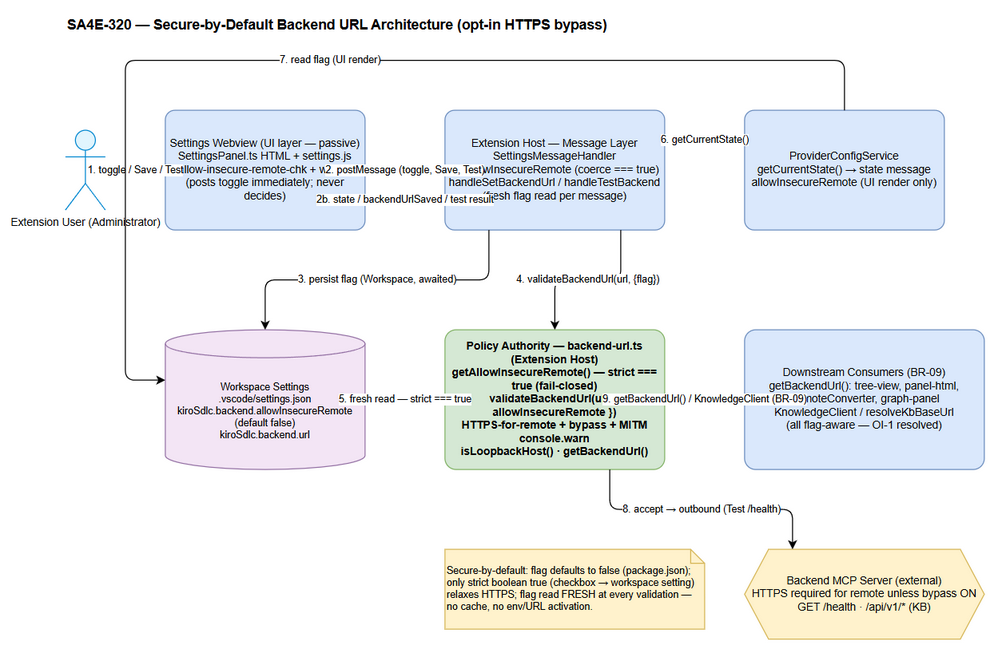
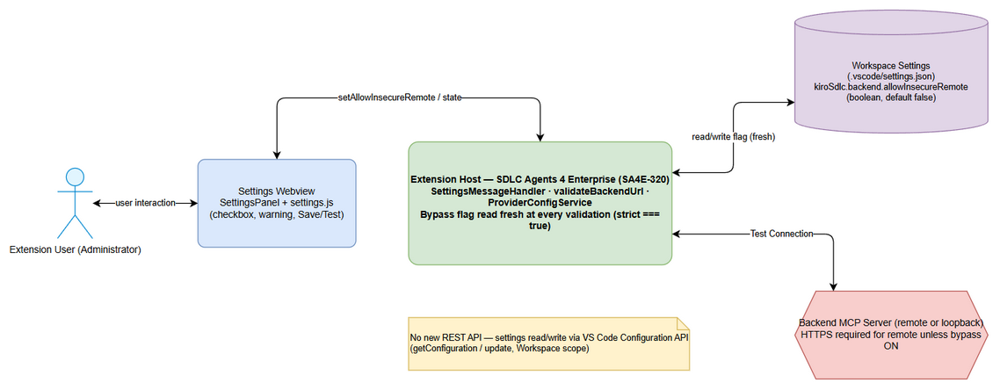
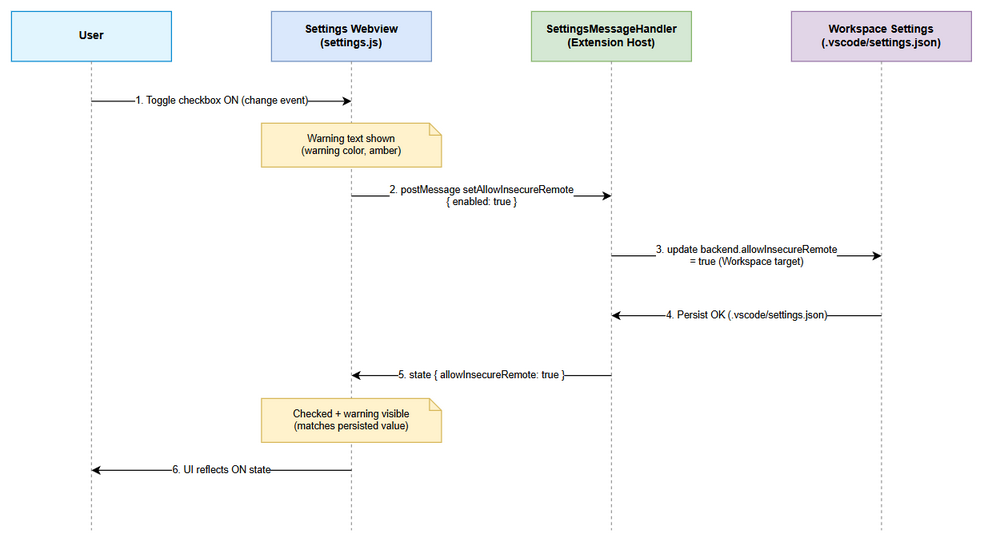
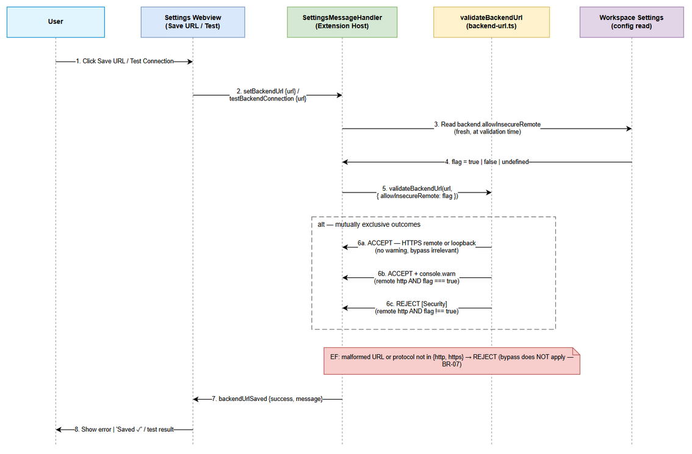
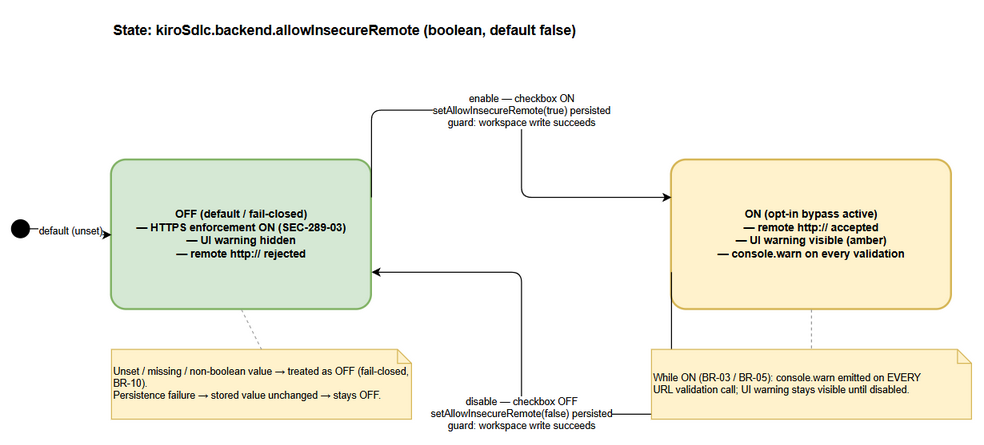
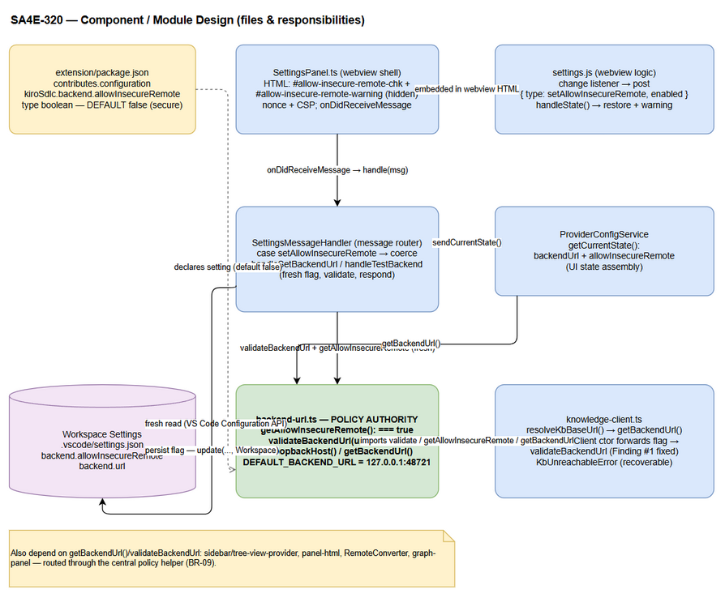

# Technical Design Document (TDD)

## SDLC Agents 4 Enterprise (VS Code/Kiro Extension) — SA4E-320: Opt-in checkbox to bypass HTTPS enforcement for remote backend server

---

## Document Information

| Field | Value |
|-------|-------|
| Jira Ticket | SA4E-320 |
| Title | Add opt-in checkbox to bypass HTTPS enforcement for remote backend server |
| Author | SA Agent |
| Version | 1.0 |
| Date | 2026-09-23 |
| Status | Draft |
| Related BRD | `documents/SA4E-320/BRD.md` |
| Related FSD | `documents/SA4E-320/FSD.md` |
| Related UI Spec | `documents/SA4E-320/UI-SPEC.md` |
| Related Security Report | `documents/SA4E-320/SECURITY-REPORT.md` |
| Governing Requirement | SEC-289-03 (Transport Security) |
| Template | `documents/templates/TDD-TEMPLATE.md` |

---

## Author Tracking

| Role | Name - Position | Responsibility |
|------|-----------------|----------------|
| Author | SA Agent – Solution Architect | Create document |
| Peer Reviewer | Security Agent / Scrum Master | Review document |

---

## Revision History

| Version | Date | Author | Changes |
|---------|------|--------|---------|
| 1.0 | 2026-09-23 | SA Agent | Initiate document — derived from BRD v1.0, FSD v1.1, SECURITY-REPORT v1.0 and verified against actual source code (`backend-url.ts`, `SettingsPanel.ts`, `SettingsMessageHandler.ts`, `ProviderConfigService.ts`, `knowledge-client.ts`, `extension/package.json`) |

---

## Sign-Off

| Name | Signature and date |
|------|--------------------|
| | ☐ I agree and confirm the technical design in this TDD |
| | ☐ I agree and confirm the technical design in this TDD |

---

## 1. Introduction

> **Scope Boundary:** This TDD specifies HOW the opt-in bypass of SEC-289-03 (SA4E-320) is implemented at the technical level. Functional requirements, business rules BR-01…BR-11, use cases UC-01…UC-04 and UI specs live in the BRD/FSD/UI-SPEC — this document covers architecture, data flow, message/API contracts, module design, security, error handling, and the implementation checklist (the feature is **already implemented and security-reviewed**; this TDD documents the as-built design).

### 1.1 Purpose

Design the **secure-by-default backend URL resolution** with a **deliberate opt-in bypass** (`kiroSdlc.backend.allowInsecureRemote`, boolean, default `false`) so that an informed administrator can connect to an HTTP-only remote backend on a trusted private network, while every non-opted-in user keeps full SEC-289-03 HTTPS enforcement.

### 1.2 Scope

**In scope (technical):**

| # | Component | File |
|---|-----------|------|
| 1 | Backend URL validator + bypass flag reader | `extension/src/config/backend-url.ts` |
| 2 | Settings webview shell (checkbox + warning HTML) | `extension/src/panels/settings/SettingsPanel.ts` |
| 3 | Message handlers (persist flag, validate on Save/Test) | `extension/src/panels/settings/SettingsMessageHandler.ts` |
| 4 | State provider (`allowInsecureRemote` in `state` message) | `extension/src/services/ProviderConfigService.ts` |
| 5 | Downstream consumer — KB client URL resolution | `extension/src/knowledge-client.ts` |
| 6 | Setting declaration | `extension/package.json` → `contributes.configuration` |
| 7 | Webview binding logic | `extension/webview-assets/settings/settings.js` |
| 8 | Unit tests (both ON/OFF branches) | `extension/src/config/__tests__/backend-url.test.ts`, `knowledge-client-bypass.test.ts` |

**Out of scope:** backend server-side TLS; removing SEC-289-03 when OFF; env/URL-parameter activation; loopback detection rule changes; protocols other than `http`/`https`; pre-existing raw-read gaps (`OI-3`) and `isLoopbackHost` prefix weakness (`OI-4`) — tracked as follow-up tickets per BRD §1.3.

### 1.3 Technology Stack

| Layer | Technology | Version |
|-------|-----------|---------|
| Language | TypeScript | ^5.4.0 |
| Runtime | VS Code Extension Host (Node.js) | engines.vscode ^1.85.0 |
| UI | VS Code Webview (`postMessage` JSON contract) | — |
| Persistence | VS Code Configuration API (workspace scope, `.vscode/settings.json`) | — |
| Test | Vitest (+ jsdom, sinon) | ^4.1.8 |
| Build | esbuild | ^0.21.0 |
| Packaging | `@vscode/vsce` | ^2.24.0 |

**No new dependencies** introduced (verified by Security Report — Dependency table empty).

### 1.4 Design Principles

- **Secure-by-default / fail-closed:** flag default `false`; only strict `=== true` activates bypass; read failures → enforcement stays ON.
- **Single source of truth:** one config-reading path `getAllowInsecureRemote()` shared by `getBackendUrl()`, Settings handlers, and `KnowledgeClient` (FSD Finding #1 fix).
- **Pure validator:** `validateBackendUrl(url, options)` never reads config internally — the flag is injected by the caller (testable, deterministic).
- **Passive webview:** UI displays/binds only; enforcement is decided exclusively in the Extension Host at validation time.
- **Minimal bypass scope:** only the HTTP-vs-HTTPS decision for remote hosts is relaxed; protocol allowlist and malformed-URL rejection always run.

### 1.5 Constraints

- Workspace-scope persistence (`ConfigurationTarget.Workspace`) for parity with `backend.url` — enables silent commit-based activation (**OI-2**, SDR Condition 4, follow-up).
- No new REST API; no database schema change (configuration-only feature).
- FIFO + `await` ordering guarantee between `setAllowInsecureRemote` and subsequent `setBackendUrl` (single webview, single handler chain).

---

## 2. System Architecture

### 2.1 Architecture Overview — Secure-by-Default Backend URL + Opt-In Bypass

The architecture has three layers: **(1) Declaration** (package.json default `false`), **(2) Enforcement** (Extension Host validator, fresh flag read per call), **(3) Display/Binding** (webview checkbox + warning — never decides enforcement).


*[Edit in draw.io](diagrams/architecture.drawio)*

**Component responsibilities:**

| Component | Layer | Responsibility |
|-----------|-------|----------------|
| `extension/package.json` (`contributes.configuration`) | Declaration | Declares `kiroSdlc.backend.allowInsecureRemote`: `type: "boolean"`, `default: false` (single place the default lives). |
| `backend-url.ts` | Enforcement | `validateBackendUrl()` pure validator; `getAllowInsecureRemote()` strict `=== true` reader; `getBackendUrl()` read+validate composition. Emits `console.warn` on every bypass-ON accept. |
| `SettingsMessageHandler` | Enforcement | `setAllowInsecureRemote` → coerce `enabled === true` → `config.update(..., Workspace)`; Save/Test → fresh flag read → `validateBackendUrl`. |
| `ProviderConfigService` | State | `getCurrentState()` exposes `allowInsecureRemote` for UI restore (render-only read). |
| `SettingsPanel` + `settings.js` | Display | Renders checkbox `#allow-insecure-remote-chk` + hidden warning `#allow-insecure-remote-warning`; posts toggle immediately; binds `state`. |
| `knowledge-client.ts` | Downstream | `resolveKbBaseUrl()` delegates to `getBackendUrl()`; `KnowledgeClient` constructor re-validates forwarding the flag (fail-closed on flag read error). |
| `.vscode/settings.json` | Persistence | Durable workspace storage of the flag. |

### 2.2 Deployment Architecture

Configuration-only change inside the packaged `.vsix` extension — no server deployment, no DB migration, no infrastructure change. Users receive the setting declaration + validation logic on extension update.

### 2.3 Communication Patterns

- **Sync (in-process):** webview ↔ Extension Host via `postMessage` JSON with `type` discriminator (FIFO ordering).
- **Sync (local HTTP):** Test Connection → `GET {url}/health` with 5 s `AbortController` timeout — executed **only after** validation accepts.
- **No async/messaging infrastructure added** (no queues, no events bus).

---

## 3. Data Flow — URL Resolution (default → config → allowInsecureRemote bypass)

Resolution order for every consumer of the backend URL:

```text
resolve(url, flag):
1. EMPTY / non-string url            → return DEFAULT_BACKEND_URL "http://127.0.0.1:48721"  (no throw)
2. STRIP one trailing slash          → cleanUrl
3. PARSE new URL(cleanUrl)           → fail ⇒ throw "[Security] Malformed backend URL"
4. FLAG read (caller): getAllowInsecureRemote()  → strict config.get(...) === true, else false (fail-closed)
5a. protocol not http:/https:        → throw "[Security] Invalid backend URL protocol"  (bypass irrelevant)
5b. protocol http: + LOOPBACK host   → ACCEPT (bypass irrelevant — BR-06)
5c. protocol http: + REMOTE + flag === true
                                     → console.warn MITM/credential warning (EVERY call) → ACCEPT (BR-05)
5d. protocol http: + REMOTE + flag ≠ true
                                     → console.warn rejection → throw "[Security] Insecure backend URL rejected" (BR-04)
6. protocol https: + REMOTE          → ACCEPT (flag irrelevant)
```

**Consumers of the resolved URL:**

| Consumer | Entry | Flag source |
|----------|-------|-------------|
| Settings Save | `handleSetBackendUrl` → `validateBackendUrl(url, { allowInsecureRemote: getAllowInsecureRemote() })` | fresh config read |
| Settings Test | `handleTestBackend` → same, then `GET {url}/health` | fresh config read |
| Tree view / panels / converter | `getBackendUrl()` | fresh config read |
| KB client base URL | `resolveKbBaseUrl()` → env `CODE_INTEL_PORT` (loopback-only) **or** `getBackendUrl()`, catch → default | via `getBackendUrl()` |
| KB client construction | `KnowledgeClient` constructor → `validateBackendUrl(baseUrl, { allowInsecureRemote })` inside try/catch | fresh, read error → `false` |

**Opt-in bypass write flow:** checkbox `change` → (toggle warning synchronously) → `postMessage { type: "setAllowInsecureRemote", enabled }` → handler `await config.update(..., enabled === true, Workspace)` → subsequent validations read the persisted value fresh. No other activation path exists (no env var, no URL parameter — BR-02).

---

## 4. Sequence / Interaction Design

All sequence/state interactions reuse the diagrams created in the specification phase (no new diagrams required for these flows).

### 4.1 System Context

Actors: Extension User (admin) → Settings Webview → Extension Host (SettingsMessageHandler / validateBackendUrl / ProviderConfigService) → Workspace Settings; plus Backend MCP Server as outbound target. The webview is display-only; the Extension Host is the enforcement authority.


*[Edit in draw.io](diagrams/system-context.drawio)*

### 4.2 Bypass Toggle Round-Trip (UC-01)

User checks `#allow-insecure-remote-chk` → webview toggles warning visibility **synchronously** and posts `setAllowInsecureRemote { enabled }` immediately (not deferred to Save) → `SettingsMessageHandler.handleSetAllowInsecureRemote` coerces `enabled === true` and `await`s `config.update(..., ConfigurationTarget.Workspace)` → value persisted to `.vscode/settings.json` → later `setBackendUrl` / `testBackendConnection` messages are validated against the just-persisted flag (FIFO `postMessage` + `await` = ordering guarantee; TC-13).


*[Edit in draw.io](diagrams/sequence-bypass-toggle.drawio)*

> **As-built note:** the handler posts **no response message** for `setAllowInsecureRemote` and has no try/catch — persistence failure surfaces as an unhandled rejection with no UI feedback; checkbox stays optimistically checked (FSD **OI-9**, open UX gap). Enforcement always re-reads config at validation time, so the stored value is authoritative.

### 4.3 URL Validation — Save / Test (UC-02 / UC-04)

Save URL / Test Connection → unchanged payload `setBackendUrl { url }` / `testBackendConnection { url }` → handler reads flag **fresh** via `getAllowInsecureRemote()` → `validateBackendUrl(url, { allowInsecureRemote })` decision tree (parse → protocol allowlist → loopback → HTTPS/bypass branch) → accept: persist URL / run `GET {url}/health` and post success; reject: throw `[Security] …` → post `backendUrlSaved { success: false, message }` / test failure — **no network I/O occurs on rejection**.


*[Edit in draw.io](diagrams/sequence-url-validation.drawio)*

### 4.4 Bypass Flag Lifecycle (State Model)

States: *(unset)* → OFF (initial, fail-closed) ⇄ ON. Transitions: ON only via successful workspace write of strict `true`; OFF via write of `false`; write failure → stored value unchanged → effective OFF. Self-loop on ON: every validation emits `console.warn` (never throttled). See FSD §3.1.2 for the transition table.


*[Edit in draw.io](diagrams/state-bypass.drawio)*

---

## 5. Message / API Design

### 5.1 Webview ↔ Extension `postMessage` Contract

> Discriminated JSON objects with `type`. **No new REST API** — zero HTTP endpoints added (FSD §3.1.8).

| Message | Direction | Payload | Handler | Response / Effect |
|---------|-----------|---------|---------|-------------------|
| `state` | Ext → Webview | `{ type: "state", …, allowInsecureRemote?: boolean }` (from `ProviderConfigService.getCurrentState()`) | `settings.js handleState()`: if field `!== undefined` → set checkbox + toggle warning `hidden` | Restores UI on panel open/reload (UC-03) |
| `setAllowInsecureRemote` | Webview → Ext | `{ type: "setAllowInsecureRemote", enabled: boolean }` | `handleSetAllowInsecureRemote(enabled: unknown)` → `enabled === true` → `update("backend.allowInsecureRemote", value, Workspace)` | **No response posted** (as-built; OI-9) |
| `setBackendUrl` | Webview → Ext | `{ type: "setBackendUrl", url: string }` — **UNCHANGED** | fresh flag read → `validateBackendUrl` → `update("backend.url", …)` if accepted | `backendUrlSaved { success, message? }` |
| `testBackendConnection` | Webview → Ext | `{ type: "testBackendConnection", url: string }` — **UNCHANGED** | fresh flag read → `validateBackendUrl` → only then `GET {url}/health` (5 s timeout) | `backendTestResult { success, message, latencyMs? }` |

**Ordering guarantee:** DOM `change` → `postMessage(setAllowInsecureRemote)` → `await config.update` completes before a later `setBackendUrl` validates (single handler chain, FIFO webview messages).

### 5.2 VS Code Configuration API Contract

| Operation | Signature | Business rule |
|-----------|-----------|---------------|
| Read flag (enforcement) | `workspace.getConfiguration("kiroSdlc").get("backend.allowInsecureRemote") === true` via `getAllowInsecureRemote()` | BR-08/BR-10 — fresh, strict, fail-closed |
| Read flag (UI state only) | `config.get<boolean>("backend.allowInsecureRemote", false)` in `getCurrentState()` | Render-only; default `false` |
| Write flag | `update("backend.allowInsecureRemote", enabled === true, ConfigurationTarget.Workspace)` | BR-02 — single sanctioned write path (W1) |
| Read URL | `get("backend.url")` | Subject of policy |
| Validate URL | `validateBackendUrl(url, { allowInsecureRemote })` → cleaned URL or throw `[Security] …` | BR-04/05/06/07 |

**Setting declaration (verified `extension/package.json:191-195`):**

```jsonc
"kiroSdlc.backend.allowInsecureRemote": {
  "type": "boolean",
  "default": false,
  "description": "Bypass the HTTPS requirement for remote (non-loopback) backend server URLs. When enabled, HTTP remote URLs are accepted but traffic is unencrypted — credentials and data can be intercepted. Only enable on trusted private networks."
}
// No "scope" declared (→ OI-2); written at ConfigurationTarget.Workspace
// Companion: "kiroSdlc.backend.url" string, default "http://127.0.0.1:48721" (lines 186-190)
```

### 5.3 Internal Function Contract — `validateBackendUrl`

| Attribute | Contract |
|-----------|----------|
| Signature | `validateBackendUrl(url: string, options: ValidateBackendUrlOptions = {}): string` |
| Returns | Cleaned URL (one trailing slash stripped); `DEFAULT_BACKEND_URL` for empty/non-string input (no throw) |
| Throws | `Error` prefixed `[Security]` — one of: `Malformed backend URL`, `Invalid backend URL protocol`, `Insecure backend URL rejected` |
| Side effect | `console.warn` on bypass-ON accept (every call), rejection, malformed, unsupported protocol |
| Determinism | Pure function of `(url, options)` — no internal config reads |

### 5.4 Outbound Endpoints (unchanged)

| Endpoint | Method | When | Notes |
|----------|--------|------|-------|
| `{backendUrl}/health` | GET | Test Connection | 5 s abort timeout; only after validation accepts |
| `{backendUrl}/api/v1/threads*` | GET/POST/PUT/DELETE | KB client runtime | Via `KnowledgeClient` — baseUrl validated at construction |

---

## 6. Class / Module Design

### 6.1 Package Structure

```text
extension/
├── package.json                          # declares kiroSdlc.backend.allowInsecureRemote (default false)
├── webview-assets/settings/
│   ├── settings.js                       # change listener + handleState binding (webview side)
│   └── settings.css                      # reuses .status-indicator.warning (zero new CSS)
└── src/
    ├── config/
    │   ├── backend-url.ts                # validator + flag reader (policy authority)
    │   └── __tests__/
    │       ├── backend-url.test.ts        # both ON/OFF branches (AC7, ≥16 tests)
    │       └── knowledge-client-bypass.test.ts  # 12 tests, flag propagation
    ├── panels/settings/
    │   ├── SettingsPanel.ts              # webview shell — checkbox + warning HTML
    │   └── SettingsMessageHandler.ts     # message routing + persistence + validation
    ├── services/
    │   └── ProviderConfigService.ts      # getCurrentState() exposes allowInsecureRemote
    └── knowledge-client.ts               # resolveKbBaseUrl() + KnowledgeClient re-validation
```

### 6.2 Key Modules & Members

**`extension/src/config/backend-url.ts` (policy authority, 120 lines):**

| Export | Kind | Role |
|--------|------|------|
| `DEFAULT_BACKEND_URL` | const | `"http://127.0.0.1:48721"` — compile-time fallback matching package.json |
| `ValidateBackendUrlOptions` | interface | `{ allowInsecureRemote?: boolean }` — backward-compatible optional param |
| `isLoopbackHost(hostname)` | function | `localhost` / `127.0.0.1` / `::1` / `[::1]` / `startsWith("127.")` (prefix weakness → **OI-4**, pre-existing) |
| `enforceHttpsForRemote(parsed, allow)` | private fn | Loopback → return; allow → MITM `console.warn` then return; else → throw |
| `rejectUnsupportedProtocol(protocol)` | private fn | Only `http:`/`https:` pass — runs regardless of bypass (BR-07) |
| `validateBackendUrl(url, options)` | exported fn | Decision tree per §3 Data Flow |
| `getAllowInsecureRemote()` | exported fn | **Single shared config-read path** — `config?.get?.<boolean>("backend.allowInsecureRemote") === true` |
| `getBackendUrl()` | exported fn | Read `backend.url` (empty → default) + validate with fresh flag |

**`extension/src/panels/settings/SettingsMessageHandler.ts` (SRP handler):**

| Member | Role |
|--------|------|
| `handle(msg)` | Switch on `msg.type`; delegates proxy messages to `ProxyMessageHandler` |
| `handleSetAllowInsecureRemote(enabled: unknown)` | `enabled === true` coercion (Finding #6 fix) → workspace `update` — **no try/catch, no response** (OI-9) |
| `handleSetBackendUrl(url)` | fresh flag → `validateBackendUrl` → persist → `backendUrlSaved` |
| `handleTestBackend(url)` | fresh flag → `validateBackendUrl` → `fetchBackendHealth` (only on accept) |

**`extension/src/services/ProviderConfigService.ts` (state provider):**

| Member | Role |
|--------|------|
| `getCurrentState()` | Assembles state incl. `backendUrl: getBackendUrl()` and `allowInsecureRemote: config.get(…, false)` — UI restore only |
| `updateConfig(key, value)` | Generic global config writer for other LLM settings (not used for the bypass — bypass writes at Workspace scope directly) |

**`extension/src/knowledge-client.ts` (downstream consumer):**

| Member | Role |
|--------|------|
| `resolveKbBaseUrl()` | `CODE_INTEL_PORT` env (loopback-only, 1024–65535) → else `getBackendUrl()`; catch → loopback default |
| `KnowledgeClient` constructor | Reads flag via `getAllowInsecureRemote()` inside try/catch (read error → `false`, fail-closed) → `validateBackendUrl(baseUrl, { allowInsecureRemote })`; rethrows `[Security]`, else trailing-slash passthrough |
| Static import of `backend-url` | Finding #1 fix — ONE shared config path (previous lazy `require()` skipped validation under vitest) |

### 6.3 Design Patterns

| Pattern | Where | Rationale |
|---------|-------|-----------|
| Pure Function / Parameter Object | `validateBackendUrl(url, options)` | Flag injected → deterministic unit tests for both branches (AC7) |
| Single Source of Truth | `getAllowInsecureRemote()` | Finding #1 — one config-read path for all consumers (BR-09) |
| Thin Controller / SRP | `SettingsPanel` (HTML shell) vs `SettingsMessageHandler` (logic) | Existing refactor — handler extracted from panel |
| Passive View | webview never validates | Enforcement authority = Extension Host (prevents UI state divergence) |
| Fail-Closed Guard | `=== true` at every read; try/catch → `false` in KnowledgeClient | BR-10 |
| Singleton | `SettingsPanel.instance` | Existing panel lifecycle pattern |

### 6.4 Dependency Graph

```text
settings.js ──postMessage──▶ SettingsMessageHandler ──▶ validateBackendUrl / getAllowInsecureRemote (backend-url.ts)
                                     │                         ▲
                                     ▼                         │
                              ProviderConfigService ──getBackendUrl()──┘
                                     │
                              vscode.workspace (Configuration API, Workspace scope)

KnowledgeClient ──▶ validateBackendUrl + getAllowInsecureRemote (static import)
SessionManager / RemoteCheckpointer ──▶ KnowledgeClient(resolveKbBaseUrl())
resolveKbBaseUrl ──▶ getBackendUrl() ──▶ backend-url.ts
```

---

## 7. Security Design

> Security Design Review completed: `documents/SA4E-320/SECURITY-REPORT.md` — verdict **APPROVE WITH CONDITIONS** (8 findings, 0 Critical).

### 7.1 Secure-by-Default Posture

| Control | Implementation |
|---------|----------------|
| Default OFF | `package.json` → `"default": false`; no code path initializes `true` (BR-01) |
| Strict activation | Every enforcement read: `getAllowInsecureRemote()` → `=== true`; `undefined` / `"true"` / `1` → OFF (BR-10) |
| Opt-in only | Sole write path = checkbox `change` → `setAllowInsecureRemote` → workspace `config.update` (BR-02); flag never read from env/URL query (grep-verified) |
| OFF = legacy behavior | Without options / with flag OFF, `validateBackendUrl` is behaviorally identical to pre-change SEC-289-03 (4 original tests unmodified) |
| Pure validator | Flag injection is caller's responsibility — validation logic cannot self-enable bypass |

### 7.2 Opt-In Bypass Design

- **UI:** checkbox `#allow-insecure-remote-chk` labeled exactly *"Bypass HTTPS requirement for remote server"*, placed directly below Backend URL input inside `#backend-mcp-section`, default unchecked; `aria-describedby` → warning div.
- **Scope:** bypass relaxes **only** the HTTP-vs-HTTPS decision for remote hosts. `rejectUnsupportedProtocol` and `new URL()` parse failures run unconditionally — `ftp://`, `ws://`, malformed URLs still rejected with bypass ON (BR-07, test-verified TC-11).
- **Loopback unaffected:** loopback check runs before the bypass branch — `localhost`/`127.0.0.1`/`::1`/`127.x` HTTP accepted with or without the checkbox (BR-06).
- **Persistence:** `ConfigurationTarget.Workspace` (parity with `backend.url`); fresh read at every validation — cache TTL = 0 (BR-08/V7).

### 7.3 MITM / Credential-Interception Warning

Two mandatory warning surfaces while bypass ON (BR-03):

1. **UI warning** (`SettingsPanel.ts:134`) — amber `.status-indicator.warning`, hidden by default, toggled with checkbox, `aria-live="polite"`:
   > *"⚠️ Traffic to a remote backend will be sent as unencrypted HTTP — credentials and data can be intercepted. Only enable on trusted private networks."*
2. **Console warning** (`backend-url.ts:40-43`) — emitted on **every** `validateBackendUrl` call while ON (Finding #7 fixed — wording matches UI):
   > `[Security] WARNING: Insecure remote backend URL allowed (allowInsecureRemote=true) — traffic to "<host>" is unencrypted HTTP. Credentials and data can be intercepted (MITM). Only use on trusted private networks.`

Rejection path also logs `console.warn` before throw (audit trail on both branches).

### 7.4 Residual Risks (accepted with deliberate opt-in — SDR)

1. MITM/eavesdropping on all traffic when ON (KB chat, checkpoints, MCP, `X-Project-Id`).
2. Credential/token interception — `Authorization: Bearer`, `sso_token` in URL query (`panel-html.ts:32`, CWE-598).
3. Workspace-scope silent activation via committed `.vscode/settings.json` (**OI-2** — SDR Condition 4: add `scope: "machine"` / `restrictedConfigurations`, or persistent indicator — follow-up).
4. Inconsistent enforcement on pre-existing raw reads: `extension.ts:177`, `indexer.ts`, `indexer-http.ts` (**OI-3** — SDR Condition 2, follow-up tickets).
5. `isLoopbackHost` `startsWith("127.")` treats `127.attacker.com` as loopback (**OI-4** — pre-existing, follow-up).
6. Warning visibility limited to Settings panel + `console.warn` — no status-bar indicator outside Settings (out of scope).
7. Assurance = static analysis + unit tests only (no dynamic MITM testing).

### 7.5 Security Findings Status (as-built)

| # | Finding | Severity | Status |
|---|---------|----------|--------|
| 1 | KnowledgeClient doesn't forward bypass flag | Medium | ✅ **Resolved** — static import + flag forwarded (`knowledge-client.ts:176-190`), 12 tests |
| 2 | Workspace-scope silent flag enable | Medium | ⚠️ **Open (OI-2)** — follow-up: `scope: "machine"` / `restrictedConfigurations` |
| 3 | Raw `backend.url` reads bypass all validation | High (pre-existing) | ⚠️ **Open (OI-3)** — follow-up tickets |
| 4 | `isLoopbackHost` `127.` prefix | Medium (pre-existing) | ⚠️ **Open (OI-4)** — follow-up: `isIP()`-based check |
| 5 | Bypass-OFF with stale remote HTTP URL → consumer throws | Low | ⚠️ **Open (OI-5)** — availability, fail-closed |
| 6 | Raw `msg.enabled` persisted without coercion | Info | ✅ **Resolved** — `enabled === true` (`SettingsMessageHandler.ts:212`) |
| 7 | Console warn lacks MITM wording | Info | ✅ **Resolved** — wording aligned (`backend-url.ts:40-43`) |
| 8 | `sso_token` in query over cleartext | Info (residual) | Documented — residual risk comment |

---

## 8. Error Handling

### 8.1 Exception Hierarchy

No new exception classes. Security errors are plain `Error` with a **`[Security]` message prefix** (discriminated by `err.message.startsWith("[Security]")` — rethrown as-is; non-security errors converted). Recoverable KB network failures use existing `KbUnreachableError` (`recoverable = true`).

### 8.2 Error Scenarios

| # | Scenario | Throw / Signal | Surfaced as | Fail direction |
|---|----------|----------------|-------------|----------------|
| 1 | Remote `http://` + bypass OFF | `[Security] Insecure backend URL rejected …` | `backendUrlSaved { success:false, message }` / `backendTestResult { success:false }` — URL **not** saved; **no network I/O** | Fail-closed (security) |
| 2 | Malformed URL (any flag state) | `[Security] Malformed backend URL: "…"` | Same as #1 | Fail-closed — bypass irrelevant |
| 3 | Unsupported protocol (`ftp:`, `ws:`) with bypass ON | `[Security] Invalid backend URL protocol …` | Same as #1 | Fail-closed — bypass scope limited (BR-07) |
| 4 | Empty / non-string `url` | *(no throw)* — returns `DEFAULT_BACKEND_URL` | Save persists loopback default; Test hits default | Safe normalization (UC-02 AF-6) |
| 5 | `setAllowInsecureRemote` persistence failure | Rejected promise from `config.update` — **no try/catch, no response** | **Silent at UI** — checkbox optimistic until next `state` | Stored value unchanged → fail-closed OFF (**OI-9**, open UX gap) |
| 6 | Flag read error in `KnowledgeClient` | Caught → `allowInsecureRemote = false` | Validation may throw `[Security]` for remote HTTP | Fail-closed (0 paths where read error enables bypass) |
| 7 | `resolveKbBaseUrl` validation failure | Caught → return `http://127.0.0.1:48721` | KB falls back to loopback (no crash) | Fail-closed + availability |
| 8 | `state` missing `allowInsecureRemote` | — | `handleState()` keeps default: unchecked + warning hidden | Safe default |
| 9 | Non-boolean flag in settings | Coerced at write (`enabled === true`); read `=== true` | Enforcement treats as OFF | Fail-closed (BR-10) |
| 10 | Test Connection timeout / HTTP error | `AbortError` / non-OK status after 5 s timeout | `backendTestResult { success:false, message, latencyMs }` | Availability only — validation already passed |
| 11 | KB HTTP 4xx/5xx during runtime | `withRetry` → **no retry** (SA4E-104) → propagates | `KbUnreachableError` at boundary if network retries exhausted → `STREAM_ERROR(recoverable)` | Availability, recoverable |

### 8.3 Logging Standard

- Security events: `console.warn` with `[Security]` prefix (rejection, malformed, protocol, bypass-ON accept).
- Bypass-ON accept warning fires on **100%** of validation calls while active (never throttled) — audit-trail requirement BR-03.
- No structured logger introduced for this change (existing pattern retained; long-term recommendation in SDR).

---

## 9. Performance & Scalability

| Concern | Design | Target |
|---------|--------|--------|
| Flag read overhead | 1 config map lookup (`O(1)`) per validation | `< 1 ms`, no network I/O |
| Toggle-to-persist | Workspace file write only | `< 200 ms p95`; warning toggle = synchronous DOM (0 ms) |
| State restore | Extra `allowInsecureRemote` field in existing `getCurrentState()` | `< 500 ms p95` panel open |
| Cache | **No cache** for enforcement flag (TTL = 0 by design) | Fresh read guarantees settings changes effective next Save/Test |
| Horizontal scaling | N/A — client-side extension, single user per workspace | — |

---

## 10. Testing Strategy (AC7)

| Suite | File | Coverage |
|-------|------|----------|
| Validator unit | `extension/src/config/__tests__/backend-url.test.ts` | ≥16 tests: 4 original SEC-289-03 + bypass ON/OFF block (TC-02…TC-06, TC-11, TC-12, TC-19) + package.json default guard (TC-14: fails if default ever ≠ `false` or OFF-branch rejection removed) |
| Downstream propagation | `extension/src/config/__tests__/knowledge-client-bypass.test.ts` | 12 tests: `KnowledgeClient` constructor accepts/rejects per flag (TC-16/17), `resolveKbBaseUrl` fallback (TC-18), fail-closed on missing/string flag |
| Service | `extension/src/services/__tests__/ProviderConfigService.test.ts` | State assembly incl. `allowInsecureRemote` |

Commands: `npm test` / `npm run test:unit` (vitest run), `npm run lint`. Verified in RUN-LOG: suites passing, `tsc` clean.

**Gap:** no automated full message round-trip test for `settings.js` binding (**OI-10**, open) — recommended webview-level test with mocked `postMessage`.

---

## 11. E2E Test Architecture

### 11.1 Framework & Language

- **Framework:** Vitest (unit/integration/E2E-API) — `extension/package.json` scripts: `test`, `test:unit`, `test:integration`, `test:e2e` (`vitest.e2e.config.ts`).
- **Language:** TypeScript (matches extension main language).
- **Style:** unit tests colocated under `src/**/__tests__/*.test.ts`; E2E files `*.e2e.test.ts`; webview logic tested with **jsdom** + **sinon** spies (`console.warn` spies for security-warning assertions).

### 11.2 Test Structure

- Unit: `extension/src/**/*.test.ts`
- Integration: `*.integration.test.ts`
- E2E: `*.e2e.test.ts` (+ `extension/tests/` for bridge-level tests)
- Relevant to SA4E-320: `src/config/__tests__/backend-url.test.ts`, `src/config/__tests__/knowledge-client-bypass.test.ts`, `src/services/__tests__/ProviderConfigService.test.ts`

### 11.3 Reusable Components

- **Config mock:** vitest module mock of `vscode.workspace.getConfiguration` (returns flag/URL per test case).
- **Warn spy:** `vi.spyOn(console, "warn")` to assert bypass-ON warning on every validation and rejection warnings.
- **Manifest guard:** direct `JSON.parse(fs.readFileSync("package.json"))` assertion for `default === false` (TC-14).

### 11.4 Test Design for SA4E-320

- **File:** extend `backend-url.test.ts` (AC7 target) + `knowledge-client-bypass.test.ts`.
- **Cases:** TC-01…TC-19 per FSD §10 (both bypass branches, protocol/malformed scope, fail-closed non-boolean, KnowledgeClient propagation, empty-URL normalization).
- **Auth/Data cleanup:** N/A — no backend, no DB, no auth required for validator tests; config mock isolates from real workspace settings.

### 11.5 E2E-UI Test Design

- **File (recommended, OI-10):** webview-level test exercising `settings.js` `change` listener + `handleState()` branches with mocked `acquireVsCodeApi().postMessage`.
- **Selectors:** `#allow-insecure-remote-chk`, `#allow-insecure-remote-warning`, `#backend-url-input`, `#save-backend-url-btn`, `#test-backend-btn`, `#backend-test-result`.
- **Reused helpers:** existing webview unit-test harness patterns in `src/webview/__tests__/`.

---

## 12. Implementation Checklist (actual files touched)

Feature is **as-built and security-reviewed**. Verified file inventory:

| # | File | Change | AC / Rule | Status |
|---|------|--------|-----------|--------|
| 1 | `extension/package.json` | Declare `kiroSdlc.backend.allowInsecureRemote` (`boolean`, `default: false`) at lines 191-195; companion `backend.url` at 186-190 | AC1, BR-01 | ✅ Done |
| 2 | `extension/src/config/backend-url.ts` | `ValidateBackendUrlOptions`, `enforceHttpsForRemote` with bypass branch + MITM warn (33-49), `rejectUnsupportedProtocol` (52-59), `validateBackendUrl` options param (68-91), `getAllowInsecureRemote` (102-105), `getBackendUrl` wiring (113-120) | AC4, AC5, BR-04/05/07/10 | ✅ Done |
| 3 | `extension/src/panels/settings/SettingsPanel.ts` | Checkbox + warning block in `#backend-mcp-section` HTML (line 134), `hidden` + `aria-describedby` + `aria-live` | AC2, AC3 | ✅ Done |
| 4 | `extension/src/panels/settings/SettingsMessageHandler.ts` | `setAllowInsecureRemote` case (75-77), `handleSetAllowInsecureRemote` with `enabled === true` coercion (208-213), fresh-flag validation in Save (193-206) / Test (215-241) | AC6, Finding #6 fix | ✅ Done (OI-9 open) |
| 5 | `extension/src/services/ProviderConfigService.ts` | `getCurrentState()` returns `backendUrl` + `allowInsecureRemote` (lines 32-33, 51) | AC6 restore | ✅ Done |
| 6 | `extension/webview-assets/settings/settings.js` | `change` listener posts `setAllowInsecureRemote` + toggles warning; `handleState()` restore branch | AC2/AC3/AC6 | ✅ Done |
| 7 | `extension/src/knowledge-client.ts` | Static import of `validateBackendUrl`/`getAllowInsecureRemote`/`getBackendUrl` (line 19); constructor forwards flag fail-closed (176-190); `resolveKbBaseUrl` delegates to `getBackendUrl()` (151-158) | BR-09, Finding #1 fix | ✅ Done |
| 8 | `extension/src/config/__tests__/backend-url.test.ts` | Both ON/OFF branches + default guard | AC7 | ✅ Done |
| 9 | `extension/src/config/__tests__/knowledge-client-bypass.test.ts` | 12 flag-propagation tests | BR-09 regression | ✅ Done |

**Open follow-ups (NOT this ticket's code changes):** OI-2 (`scope: "machine"` / `restrictedConfigurations`), OI-3 (raw reads in `extension.ts`/`indexer*.ts`), OI-4 (`isLoopbackHost` prefix), OI-5 (re-validate URL on bypass disable), OI-9 (try/catch + response for toggle handler), OI-10 (webview round-trip test), OI-7 (paste residual risks to Jira comment).

---

## Appendix A — Diagram Index

> All diagrams pre-exist in `documents/SA4E-320/diagrams/` (created during design/specification phases). This TDD **references only** — no new drawio files were generated.

| # | Diagram | PNG (embedded) | Source (editable) | Used in TDD |
|---|---------|----------------|-------------------|-------------|
| 1 | **Architecture** — secure-by-default URL resolution + opt-in bypass layers | [architecture.png](diagrams/architecture.png) | [architecture.drawio](diagrams/architecture.drawio) | §2.1 |
| 2 | **Component** — backend-url / SettingsPanel / SettingsMessageHandler / ProviderConfigService / knowledge-client dependencies | [component.png](diagrams/component.png) | [component.drawio](diagrams/component.drawio) | §6 |
| 3 | Sequence — Bypass Toggle round-trip | [sequence-bypass-toggle.png](diagrams/sequence-bypass-toggle.png) | [sequence-bypass-toggle.drawio](diagrams/sequence-bypass-toggle.drawio) | §4.2 |
| 4 | Sequence — URL Validation (Save/Test) | [sequence-url-validation.png](diagrams/sequence-url-validation.png) | [sequence-url-validation.drawio](diagrams/sequence-url-validation.drawio) | §4.3 |
| 5 | State — Bypass flag lifecycle | [state-bypass.png](diagrams/state-bypass.png) | [state-bypass.drawio](diagrams/state-bypass.drawio) | §4.4 |
| 6 | System Context — User / Webview / Extension Host / Workspace Settings / Backend | [system-context.png](diagrams/system-context.png) | [system-context.drawio](diagrams/system-context.drawio) | §4.1 |

**Component diagram (for §6 reference):**


*[Edit in draw.io](diagrams/component.drawio)*

### Appendix B — FSD → TDD Traceability

| FSD Section | TDD Section |
|-------------|-------------|
| §2 System Overview / architecture table | §2 Architecture Overview |
| §3.1.2 State Model | §4.4 |
| §3.1.3 UC-01 (toggle) | §4.2, §5.1 |
| §3.1.3 UC-02 (validation) / UC-04 (reject) | §3 Data Flow, §4.3 |
| §3.1.3 UC-03 (persist/restore) | §4.2, §5.1, §5.2 |
| §3.1.7 Message contract | §5.1 |
| §3.1.8 API contract (Config API, validateBackendUrl) | §5.2, §5.3 |
| §4 Data model (config-only, no DB) | §1.5 Constraints, §5.2 |
| §5 Integration (workspace settings, backend, consumers) | §3, §5.4 |
| §6 Processing logic + pseudocode | §3 Data Flow, §6.2 |
| §7 Security requirements | §7 Security Design |
| §8 NFRs | §7, §9 |
| §9 Error handling | §8 Error Handling |
| §10 Test scenarios TC-01…TC-19 | §10 Testing Strategy, §11 E2E |
| §11 Open Issues OI-1…OI-10 | §7.5, §12 Implementation Checklist |

### Appendix C — Reference Documents

| Document | Location |
|----------|----------|
| BRD | `documents/SA4E-320/BRD.md` |
| FSD | `documents/SA4E-320/FSD.md` |
| UI Spec | `documents/SA4E-320/UI-SPEC.md` |
| Security Report | `documents/SA4E-320/SECURITY-REPORT.md` |
| Jira SA4E-320 | `https://jiraassist.atlassian.net/browse/SA4E-320` |
| Validator source | `extension/src/config/backend-url.ts` |
| TDD template | `documents/templates/TDD-TEMPLATE.md` |
