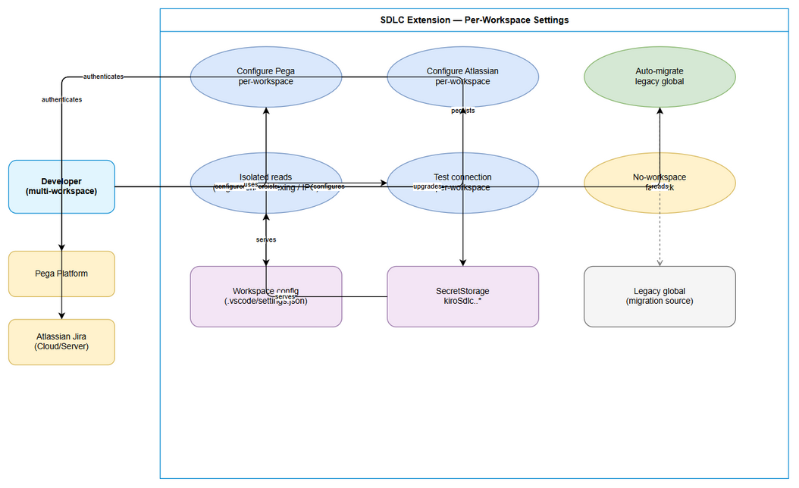
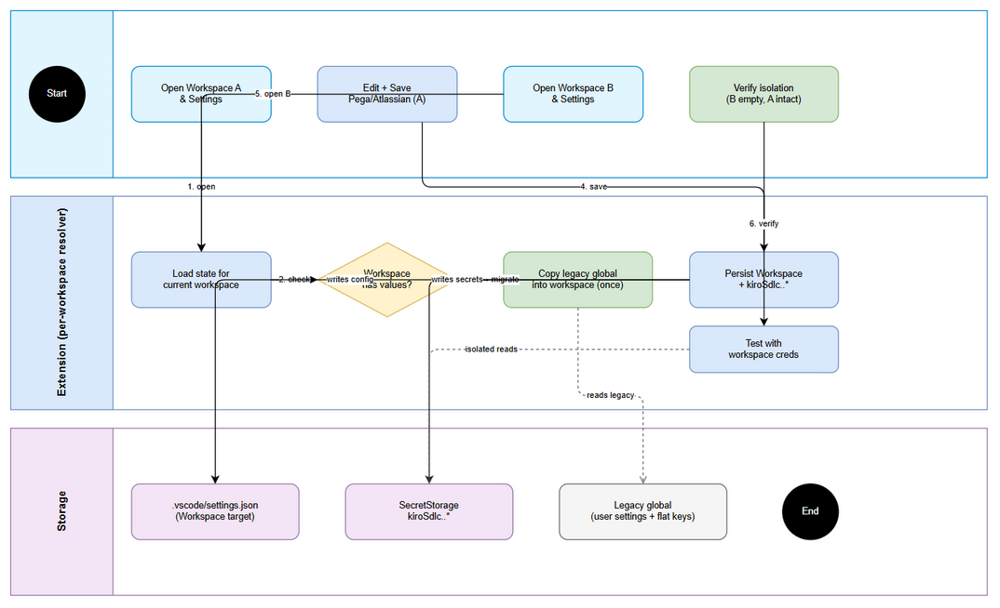

# Business Requirements Document (BRD)

## SDLC Agents 4 Enterprise — SA4E-323: Pega/Atlassian connection settings per-workspace isolation

---

## Document Information

| Field | Value |
|-------|-------|
| Jira Ticket | SA4E-323 |
| Title | Pega/Atlassian connection settings luu global, leak giua cac workspace — can luu rieng per-workspace |
| Author | BA Agent |
| Version | 1.0 |
| Date | 2026-09-24 |
| Status | Draft |

---

## Author Tracking

| Role | Name - Position | Responsibility |
|------|-----------------|----------------|
| Author | BA Agent – Business Analyst | Create document |
| Peer Reviewer | SM – Scrum Master | Review document |

---

## Revision History

| Version | Date | Author | Changes |
|---------|------|--------|---------|
| 1.0 | 2026-09-24 | BA Agent | Initiate document — auto-generated from Jira ticket SA4E-323 and code grounding (extension persistence layer) |

---

## Sign-Off

| Name | Signature and date |
|------|--------------------|
| Product Owner | ☐ I agree and confirm all criteria on this BRD as expected requirements |
| Tech Lead | ☐ I agree and confirm all criteria on this BRD as expected requirements |

---

## 1. Introduction

### 1.1 Scope

This BRD covers fixing the credential leakage bug where Pega Platform Connection (Endpoint URL, Operator ID/Username, Password) and Atlassian Connection (Jira Base URL, Email, API Token/PAT, Connection Type) entered in the "SDLC Pipeline Settings" UI are stored GLOBAL (shared across all workspaces) instead of per-workspace.

In scope:

- Change non-secret persistence from `vscode.ConfigurationTarget.Global` to `vscode.ConfigurationTarget.Workspace` in `ProviderConfigService.updatePegaConfig()` (pegaEndpoint, pegaUsername) and `AtlassianCredentialService.storeConnectionType()` (atlassianConnectionType).
- Namespace all related SecretStorage keys per workspace identity (workspace folder path hash): `kiroSdlc.<wsHash>.pegaPassword`, `kiroSdlc.<wsHash>.atlassian.*` (baseUrl, email, apiToken). All read/write sites must use a single shared key-derivation function.
- Synchronize every read site to the same per-workspace resolution: `ProviderConfigService.getCurrentState()`, `PegaHttpClient.getAuthHeader()/getPegaEndpoint()/getConfiguredUsername()`, `IndexingService.runSchemaIndexer()`, `AtlassianCredentialService.getConfig()/handleCredentialRequest()/testConnection()`, `SettingsMessageHandler` save/getState dispatch.
- One-time migration of legacy global values (config + secrets) into the current workspace scope so existing users lose no data on upgrade.
- Defined fallback behavior when no workspace folder is open (single-file / empty window) and for multi-root workspaces.
- Verification: same workspace returns same config from every entry point; different workspaces are fully isolated.

Source: SA4E-323 (Bug/High).

### 1.2 Out of Scope

- Changing storage scope of unrelated LLM provider keys (anthropic/openai/lmstudio/openrouter API keys, base URLs, llmProvider/llmModel/ollamaUrl) managed by `ProviderConfigService.updateConfig()` — unless the design explicitly decides to align them. This BRD does not require it.
- Backend (`backend/`) credential storage — backend does not persist these credentials; no backend change is required.
- Proxy settings (`proxy.mode/host/port/bypass`), backend URL, MCP port/enable flag — already per-workspace; no change.
- Secret encryption algorithm changes — secrets remain in VS Code SecretStorage (OS keychain); only key namespacing changes.
- Cross-machine settings sync (Settings Sync) policy — out of scope; workspace-scoped config naturally follows the workspace folder.
- UI redesign of the Settings panel — only data-binding correctness is in scope.

### 1.3 Preliminary Requirement

- VS Code Extension Host with workspace folder support (`vscode.workspace.workspaceFolders`, `vscode.ConfigurationTarget.Workspace`, `vscode.SecretStorage`).
- Existing precedent pattern for per-workspace config is already proven in the codebase (`backend.url`, `backend.allowInsecureRemote`, `mcpServerPort`, `enableMcpServer`, `proxy.*`, `jiraLastProject`, sync state) — see Section 3.
- Access to current source files for grounding: `extension/src/services/ProviderConfigService.ts`, `extension/src/services/AtlassianCredentialService.ts`, `extension/src/models/LlmProviderConfig.ts`, `extension/src/panels/settings/SettingsMessageHandler.ts`, `extension/src/services/PegaHttpClient.ts`, `extension/src/services/IndexingService.ts`.
- No additional infrastructure or Pega/Atlassian server-side change is needed.
---

## 2. Business Requirements

### 2.1 High Level Process Map

The user configures Pega and Atlassian connections in the SDLC Pipeline Settings webview. Today both write paths are global: non-secrets go to user `settings.json` (`ConfigurationTarget.Global`) and secrets go to flat global SecretStorage keys (`kiroSdlc.pegaPassword`, `kiroSdlc.atlassian.*`). Any workspace therefore reads the last-written global value — the reported "leak".

The target process isolates by workspace: the Settings panel loads and saves the config of the currently open workspace only; every consumer (Pega HTTP client, schema/indexing jobs, Atlassian IPC/HTTP client, settings state) resolves credentials through a single workspace-scoped resolver (config `Workspace` target + hashed secret keys `kiroSdlc.<wsHash>.*`). A one-time migration copies legacy global values into the active workspace on first run after upgrade. When no workspace folder is open, a documented fallback applies (global read-only or explicit "no workspace" warning — to be fixed in design, default: read legacy global but block save with a clear message).

*[Edit in draw.io](diagrams/use-case.drawio)*

*[Edit in draw.io](diagrams/business-flow.drawio)*

### Diagram Index

| # | Diagram | Image | Source (editable) |
|---|---------|-------|-------------------|
| 1 | Use Case — Per-workspace connection settings | [use-case.png](diagrams/use-case.png) | [use-case.drawio](diagrams/use-case.drawio) |
| 2 | Business Flow — Save / load / migrate per-workspace credentials | [business-flow.png](diagrams/business-flow.png) | [business-flow.drawio](diagrams/business-flow.drawio) |

### 2.2 List of User Stories / Use Cases

| # | Story / Use Case / Epic | Priority | Source Ticket |
|---|-------------------------|----------|---------------|
| US-1 | As a developer working in multiple workspaces, I want my Pega connection settings stored per-workspace so that switching workspaces never leaks the previous workspace's endpoint/username/password | MUST HAVE | SA4E-323 |
| US-2 | As a developer working in multiple workspaces, I want my Atlassian connection settings stored per-workspace so that Jira Base URL, Email, Token and Connection Type are isolated between workspaces | MUST HAVE | SA4E-323 |
| US-3 | As an existing user with globally stored config, I want a one-time automatic migration of my old global values into the current workspace so that I lose no data when upgrading | MUST HAVE | SA4E-323 |
| US-4 | As a developer opening VS Code without a workspace folder (or multi-root), I want a clear, predictable fallback so that I understand what config is used and why save may be restricted | SHOULD HAVE | SA4E-323 |
| US-5 | As a developer, I want the Settings UI to always display and verify the current workspace's config (including Test Connection using that workspace's credentials) so that what I see is what is used | MUST HAVE | SA4E-323 |

---
### 2.3 Details of User Stories

---

#### Business Flow

**Step 1:** Developer opens Workspace A and opens SDLC Pipeline Settings. The panel requests current state via `getState` → `ProviderConfigService.getCurrentState()` + `AtlassianCredentialService.getConfig()` resolved for Workspace A (Workspace-targeted config + `kiroSdlc.<hashA>.*` secrets, with migration applied first if legacy global values exist and Workspace A has no values yet).

**Step 2:** Developer edits Pega Endpoint / Username / Password and/or Atlassian Base URL / Email / Token / Connection Type, then clicks Save. The handler dispatches `savePegaConfig` → `updatePegaConfig()` and `saveAtlassianConfig` → `saveConfig()/storeConnectionType()`.

**Step 3:** The system persists non-secrets with `ConfigurationTarget.Workspace` (workspace `.vscode/settings.json`) and secrets with namespaced keys `kiroSdlc.<hashA>.*` in SecretStorage. No global key is written.

**Step 4:** Developer opens Workspace B. Settings loads and shows empty (or B's own values) — never A's values. `PegaHttpClient`, `IndexingService`, Atlassian IPC/HTTP paths all resolve via hash B.

**Step 5:** Developer saves different credentials in Workspace B → stored under `kiroSdlc.<hashB>.*` + Workspace B settings. Reopening Workspace A still shows A's original values. Test Connection buttons in each workspace authenticate against that workspace's own credentials.

**Step 6:** On upgrade with pre-existing global values: first Settings open (or activation) in any workspace migrates legacy global config + flat secret keys into that workspace's scope exactly once (copy, not move, until confirmed; then optionally clear or leave legacy read-only as fallback).

> **Note:** Workspace identity is derived from the workspace folder path (hash, e.g. SHA-256 truncated). Exact hash algorithm, truncation length, normalization (case, trailing slash, remote URIs) and multi-root choice (first folder vs active) are fixed in design (FSD/TDD) but the BUSINESS rule is: same folder path → same key; different folder path → different key; no folder → documented fallback.

---

#### STORY US-1: Pega connection per-workspace isolation

> As a developer working in multiple workspaces, I want my Pega connection settings stored per-workspace so that switching workspaces never leaks the previous workspace's endpoint/username/password

**Requirement Details:**

1. `ProviderConfigService.updatePegaConfig(endpoint, username, password?)` MUST write `pegaEndpoint` and `pegaUsername` with `ConfigurationTarget.Workspace` instead of `Global` (SA4E-323, `ProviderConfigService.ts:60-61`).
2. Pega password MUST be stored under a workspace-namespaced SecretStorage key `kiroSdlc.<wsHash>.pegaPassword` (replacing flat `kiroSdlc.pegaPassword` in `SECRET_KEYS.pega`), via a single shared key-derivation helper used by all callers.
3. All Pega read sites MUST resolve the same workspace scope: `ProviderConfigService.getCurrentState()` (`pegaEndpoint`/`pegaUsername` + `hasPegaPassword`), `PegaHttpClient.getAuthHeader()` (username + password → Basic), `getPegaEndpoint()`, `getConfiguredUsername()`, `resolveDeterministicPegaHierarchy()`, `IndexingService.runSchemaIndexer()` (currently `secrets.get("kiroSdlc.pegaPassword")` at `IndexingService.ts:234` — must use namespaced key), `PegaCatalogIndexer`/`PegaProjectIndexer` paths that construct `PegaHttpClient`.
4. Switching workspaces without saving in the new workspace MUST NOT display or use the previous workspace's values.

**Data Fields (if applicable):**

| Field | Type | Required | Description | Example |
|-------|------|----------|-------------|---------|
| pegaEndpoint | string (URL) | Yes | Pega platform base URL, workspace-scoped config | `https://pega.corp.local:8443/prweb` |
| pegaUsername | string | Yes | Pega Operator ID, workspace-scoped config | `dev.operator` |
| pegaPassword | secret string | Yes | Pega password/token, workspace-namespaced SecretStorage | `••••••••` |
| wsHash | string (derived) | System | Hash of workspace folder path used to namespace secret keys | `a3f9c1e2b4d5` |
| legacyGlobalEndpoint/Username | string | System (migration only) | Pre-upgrade global values to migrate once | `http://localhost:8080/prweb` |

**Acceptance Criteria:**

1. Save Pega config in Workspace A; open Workspace B → Pega Endpoint/Username are empty (or B's own), `hasPegaPassword` is false unless B has its own password (SA4E-323 AC-1).
2. Every read site in Workspace A returns A's values; every read site in Workspace B returns B's values — verified at `getCurrentState()`, `PegaHttpClient.getAuthHeader()/getPegaEndpoint()`, and schema indexing credential check (SA4E-323 AC-2).
3. SecretStorage contains namespaced keys (`kiroSdlc.<wsHash>.*`); flat legacy key is not written for new saves; no password appears in logs, settings.json, or error messages (SA4E-323 AC-3).
4. Repro from SA4E-323 no longer reproduces: A-save → B-open → B does not show/use A's values.
5. Same workspace + same entry point → same result on repeated reads (deterministic resolution).

**UI Specifications (if applicable):**

| No. | Name | Type | Required | Description | Note |
|-----|------|------|----------|-------------|------|
| 1 | Pega Endpoint URL | Input | Yes | Shows current workspace's endpoint only | Empty in new workspace, not prefilled from other workspace |
| 2 | Pega Operator ID | Input | Yes | Shows current workspace's username only | Same isolation as endpoint |
| 3 | Pega Password | Password Input | Yes | Masked; placeholder indicates whether current workspace has a stored password (`hasPegaPassword`) | Never displays stored value |
| 4 | Save Pega | Button | Yes | Persists to workspace scope + namespaced secret; shows `pegaSaved` success/error | Error surfaces validation/auth message |
| 5 | Test Connection | Button | No | Tests using current workspace's resolved credentials only | Result message indicates reachable/auth status |

**Validation Rules (if applicable):**

- Endpoint MUST be a valid http/https URL; trailing slash normalized on read (`getPegaEndpoint()` strips trailing `/`).
- Username MUST be non-empty after trim; empty username blocks auth-dependent operations with a clear message (fail-closed, consistent with SA4E-241 SEC-03).
- Password save with empty/blank value MUST NOT overwrite the stored workspace password (preserve existing, per current `updatePegaConfig` guard).

**Error Handling (if applicable):**

- No workspace folder open + save attempted: block save with message "No workspace folder open — Pega config requires a workspace to isolate credentials." (exact wording may be refined in FSD).
- SecretStorage failure: surface `pegaSaved success:false` with the underlying message; do not leave partial config (endpoint saved but password not) without warning.
- Auth failure (401/403) at use time: report invalid Operator ID/password for the current workspace; do not fall back to another workspace's credentials.

---

#### STORY US-2: Atlassian connection per-workspace isolation

> As a developer working in multiple workspaces, I want my Atlassian connection settings stored per-workspace so that Jira Base URL, Email, Token and Connection Type are isolated between workspaces

**Requirement Details:**

1. `AtlassianCredentialService.saveConfig()` MUST store baseUrl/email/apiToken under workspace-namespaced keys `kiroSdlc.<wsHash>.atlassian.baseUrl`, `kiroSdlc.<wsHash>.atlassian.email`, `kiroSdlc.<wsHash>.atlassian.apiToken` (replacing flat `SECRET_KEYS.atlassian*` in `LlmProviderConfig.ts:12-14`), via the same shared key-derivation helper as Pega.
2. `AtlassianCredentialService.storeConnectionType()` MUST write `atlassianConnectionType` with `ConfigurationTarget.Workspace` instead of `Global` (SA4E-323, `AtlassianCredentialService.ts:93`); `readConnectionType()` must read the workspace-scoped value.
3. All Atlassian read sites MUST resolve the same workspace scope: `getConfig()` (null if incomplete), `testConnection()` (`GET /rest/api/2/myself` with Basic), `handleCredentialRequest()` (IPC for child server incl. `atlassian-http-client.ts` hot-reload path), `ProviderConfigService.getCurrentState()` (`atlassianBaseUrl/atlassianEmail/hasAtlassianToken/atlassianConnectionType` currently from flat secrets + global config at lines 43-46 — must switch to namespaced/workspace).
4. `SettingsMessageHandler.handleSaveAtlassianConfig` / `handleTestAtlassianConnection` behavior is unchanged apart from scope — same validation, same IPC messages (`atlassianSaved`, `atlassianTestResult`).

**Data Fields (if applicable):**

| Field | Type | Required | Description | Example |
|-------|------|----------|-------------|---------|
| atlassianBaseUrl | secret string (URL) | Yes | Jira base URL, workspace-namespaced secret | `https://myorg.atlassian.net` |
| atlassianEmail | secret string | Yes | Atlassian account email, workspace-namespaced secret | `dev@corp.local` |
| atlassianToken | secret string | Yes | API token / PAT, workspace-namespaced secret | `••••••••` |
| atlassianConnectionType | enum `cloud\|server` | Yes | Connection type, workspace-scoped config | `cloud` |

**Acceptance Criteria:**

1. Save Atlassian config in Workspace A; open Workspace B → Base URL/Email/Token empty (or B's own), Connection Type is B's own default (`cloud` unless B saved `server`) (SA4E-323 AC-1).
2. `getConfig()` in A returns A's triple; in B returns B's triple or null if incomplete; `handleCredentialRequest()` and `testConnection()` in each workspace use only that workspace's credentials (SA4E-323 AC-2).
3. Secrets remain in SecretStorage (OS keychain) under namespaced keys; no token in plaintext settings, logs, or IPC error messages (SA4E-323 AC-3).
4. Invalid URL is still rejected at save (`validateUrl` — http/https only, "Invalid Jira Base URL format.") per workspace; incomplete config returns null / "No credentials configured."

**UI Specifications (if applicable):**

| No. | Name | Type | Required | Description | Note |
|-----|------|------|----------|-------------|------|
| 1 | Jira Base URL | Input | Yes | Current workspace's URL only | Validated http/https |
| 2 | Email | Input | Yes | Current workspace's email only | — |
| 3 | API Token / PAT | Password Input | Yes | Masked; `hasAtlassianToken` indicates presence for current workspace | Never displayed |
| 4 | Connection Type | Dropdown/Radio (`cloud`/`server`) | Yes | Current workspace's type only | Default `cloud` |
| 5 | Save Atlassian | Button | Yes | Persists to workspace scope + namespaced secrets | `atlassianSaved` feedback |
| 6 | Test Atlassian | Button | No | Calls `GET /rest/api/2/myself` with current workspace creds | Shows "Connected as {name}" or 401/HTTP error |

**Validation Rules (if applicable):**

- Base URL MUST parse as URL with `http:`/`https:` protocol, else throw "Invalid Jira Base URL format." / "URL must use http or https protocol." (existing `validateUrl` preserved).
- `getConfig()` returns null unless baseUrl AND email AND apiToken are all present for the current workspace.
- Connection Type read MUST default to `cloud` and coerce any non-`server` value to `cloud` (existing `readConnectionType` preserved).

**Error Handling (if applicable):**

- Incomplete credentials at test/IPC time: `testConnection` returns `success:false "No credentials configured."`; `handleCredentialRequest` throws "Atlassian credentials not configured in extension."
- HTTP 401 → "Authentication failed (401). Check email/token."; other HTTP → `HTTP {status}: {statusText}`; network abort/timeout → `Connection failed: {message}` — all scoped to the current workspace's credentials.
- No workspace folder open + save attempted: block with the same "no workspace" message pattern as US-1.

---
#### STORY US-3: One-time migration of legacy global config

> As an existing user with globally stored config, I want a one-time automatic migration of my old global values into the current workspace so that I lose no data when upgrading

**Requirement Details:**

1. On first run after upgrade (first `getCurrentState()`/`getConfig()`/save in a workspace, or at activation), the system MUST detect legacy global values: workspace-targeted config absent for the current workspace BUT global `kiroSdlc.pegaEndpoint`/`pegaUsername`/`atlassianConnectionType` present, and/or flat secret keys (`kiroSdlc.pegaPassword`, `kiroSdlc.atlassian.*`) present.
2. The system MUST copy (not move, until confirmed readable) legacy values into the current workspace scope: write `Workspace`-targeted config + `kiroSdlc.<wsHash>.*` secrets. Migration MUST be idempotent — running twice changes nothing if the workspace already has its own values (workspace values always win; never overwrite a workspace value with a global value).
3. Migration MUST be per-workspace and lazy: each workspace migrates independently on first open; opening Workspace B after migrating Workspace A re-copies the same legacy globals into B (so no workspace is left empty just because another workspace migrated first) — unless the design explicitly chooses "migrate once then clear globals", in which case B's behavior must be documented. Default business rule: copy-on-first-open per workspace; do not delete legacy globals until all migration paths are verified (or keep them as read-only fallback and document retention).
4. A migration marker (e.g. workspace-scoped flag or versioned state) MUST prevent repeated copy attempts from overwriting intentional workspace-level clears (user deliberately cleared Workspace B after migration → must stay cleared).

**Data Fields (if applicable):**

| Field | Type | Required | Description | Example |
|-------|------|----------|-------------|---------|
| legacyPegaEndpoint/Username | string | System | Global config values to copy | `http://localhost:8080/prweb` |
| legacyPegaPassword / legacyAtlassian* | secret | System | Flat secret keys to copy | `kiroSdlc.pegaPassword` |
| migrationMarker | boolean/string | System | Per-workspace flag recording that migration was attempted | `kiroSdlc.migrated.wsHash=true` or version |

**Acceptance Criteria:**

1. User with only legacy global config opens any workspace after upgrade → Settings shows the legacy values (now as that workspace's own values) and all read sites work without re-entering credentials (SA4E-323 AC-4).
2. User who already has workspace values is never overwritten by migration (workspace wins).
3. Clearing a workspace value after migration stays cleared (no resurrection on restart).
4. No data loss: if migration fails midway (e.g. SecretStorage error), legacy values remain intact and an error is surfaced; retry is safe.

**Validation Rules (if applicable):**

- Never migrate an empty legacy value over a non-empty workspace value.
- Never write a migrated secret to logs or plaintext config.
- Migration MUST validate migrated URLs with the same rules as normal save (Pega http/https; Atlassian `validateUrl`).

**Error Handling (if applicable):**

- Secret read failure during migration: abort migration for that workspace, keep legacy intact, surface a warning; do not mark migration complete.
- Partial migration (config copied but secret failed): do not mark complete; next open retries; UI indicates which part is missing.

---

#### STORY US-4: Fallback when no workspace folder is open

> As a developer opening VS Code without a workspace folder (or multi-root), I want a clear, predictable fallback so that I understand what config is used and why save may be restricted

**Requirement Details:**

1. When `vscode.workspace.workspaceFolders` is empty/undefined (single loose file, empty window): reads fall back to a documented source — default business rule: read legacy global config + flat secret keys read-only (so existing single-file flows do not break); saves are blocked with a clear message directing the user to open a workspace folder. Alternative (to be fixed in FSD/TDD): disable Pega/Atlassian sections entirely with an explanatory banner. Either way the behavior MUST be explicit, not silent global write.
2. Multi-root: the design MUST fix which folder defines identity (default: first workspace folder `workspaceFolders[0]`, consistent with `PegaHttpClient.getWorkspaceRoot()`, `CommandRegistrar.getWorkspaceRoot()`, `IndexingService` root parameter). All secret namespacing and `Workspace`-targeted writes use that same folder.
3. Remote/WSL/SSH paths: hash normalization (case, separators, trailing slash, URI scheme) MUST be deterministic so the same remote folder always maps to the same key.

**Data Fields (if applicable):**

| Field | Type | Required | Description | Example |
|-------|------|----------|-------------|---------|
| workspaceFolderCount | number | System | 0, 1, or N folders open | `0` |
| activeFolderPath | string \| null | System | Path used for hashing (or null) | `c:\projects\client-a` |

**Acceptance Criteria:**

1. Empty window: opening Settings shows either (a) legacy global read-only values with save disabled + explanatory message, or (b) empty + banner — exactly one documented behavior, no silent global overwrite.
2. Multi-root: repeated opens resolve to the same folder's config deterministically.
3. `handleFetchPegaContext()` existing guard ("No workspace folder open to save Pega context.") remains consistent with the new fallback (no contradiction).

**UI Specifications (if applicable):**

| No. | Name | Type | Required | Description | Note |
|-----|------|------|----------|-------------|------|
| 1 | No-workspace banner | Banner/Notice | Conditional | Shown when no folder is open | Explains read-only or disabled state |
| 2 | Save buttons | Button | Yes | Disabled (or guarded with message) when no folder is open | Prevents accidental global write |

**Error Handling (if applicable):**

- Save with no folder: blocked + message "No workspace folder open — open a folder to configure per-workspace Pega/Atlassian credentials."

---

#### STORY US-5: Settings UI shows and verifies the current workspace's config

> As a developer, I want the Settings UI to always display and verify the current workspace's config (including Test Connection using that workspace's credentials) so that what I see is what is used

**Requirement Details:**

1. `sendCurrentState()` (`SettingsMessageHandler.ts:121-126`) MUST return the current workspace's values only: `pegaEndpoint/pegaUsername/hasPegaPassword/atlassianBaseUrl/atlassianEmail/hasAtlassianToken/atlassianConnectionType` resolved per-workspace. `getModels()`/provider state is unchanged.
2. `savePegaConfig` / `saveAtlassianConfig` IPC handlers keep the same message contracts (`pegaSaved`, `atlassianSaved`) but persist per-workspace; immediate `sendCurrentState()` refresh after save must reflect the saved workspace values.
3. `testPegaConnection` and `testAtlassianConnection` MUST authenticate with the current workspace's resolved credentials (Pega: `PegaHttpClient` endpoint + auth header; Atlassian: `AtlassianCredentialService.testConnection()` → `GET /rest/api/2/myself`). Results return via existing `pegaTestResult` / `atlassianTestResult` messages.
4. No cross-workspace prefill: a fresh workspace shows defaults/empty, never another workspace's secrets or URLs.

**Data Fields (if applicable):**

Same fields as US-1/US-2, plus presence flags `hasPegaPassword`, `hasAtlassianToken` (boolean, per-workspace).

**Acceptance Criteria:**

1. Workspace A and B show different values (or empty vs filled) matching what each workspace's read sites use — "what you see is what is used" (SA4E-323 AC-2, AC-5).
2. Test Connection in A authenticates as A's operator / Jira user; Test in B authenticates as B's (verify with distinct credentials; SA4E-323 AC-5: same workspace → same result from every entry point).
3. Stored secrets are never rendered into the webview (only boolean presence flags).

**UI Specifications (if applicable):**

- Presence indicators (`hasPegaPassword`, `hasAtlassianToken`) drive placeholder text such as "●●●●●●●● (saved for this workspace)" vs "Not set for this workspace".
- Save success refreshes state; failure shows `error` without clearing the form.

**Error Handling (if applicable):**

- Test with incomplete workspace credentials: clear "not configured for this workspace" message (not a generic global message).
- Webview opened with no folder: banner per US-4; test buttons disabled or scoped to fallback with explicit labeling.

---
## 3. Dependencies

| Dependency | Type | Related Ticket | Description |
|------------|------|----------------|-------------|
| VS Code Configuration API (`Workspace` target + `.vscode/settings.json`) | System | N/A | Non-secret isolation mechanism; precedent already used for `backend.url`, `backend.allowInsecureRemote`, `mcpServerPort`, `enableMcpServer`, `proxy.*` (`SettingsMessageHandler.ts:201,212,245,250`, `ProxyConfigService.ts:65,71-73`) |
| VS Code SecretStorage (OS keychain, extension-scoped, global) | System | N/A | Secret store; has no native workspace scope — requires key namespacing `kiroSdlc.<wsHash>.*`; shared key-derivation helper is mandatory |
| Workspace identity (`workspace.workspaceFolders[0].uri.fsPath` hash) | System | N/A | Canonical folder for hashing; consistent with `PegaHttpClient.getWorkspaceRoot()`, `CommandRegistrar.getWorkspaceRoot()`, `IndexingService` root; multi-root and remote-path normalization to be fixed in FSD/TDD |
| `SECRET_KEYS` registry (`extension/src/models/LlmProviderConfig.ts:6-15`) | System | N/A | Flat keys `kiroSdlc.pegaPassword`, `kiroSdlc.atlassian.email/apiToken/baseUrl` must become dynamic per-workspace or be superseded by a resolver; all direct `secrets.get("kiroSdlc.pegaPassword")` call sites (e.g. `IndexingService.ts:234`) must migrate |
| Pega Platform endpoint + Operator credentials | External | N/A | Validated by Test/Fetch flows; no server-side change needed |
| Atlassian Jira Cloud/Server (`GET /rest/api/2/myself`, Basic auth) | External | SA4E-110 | `AtlassianCredentialService` IPC + `atlassian-http-client.ts` hot-reload reads; behavior preserved, scope changed |
| Settings webview (`SettingsMessageHandler`, `SettingsPanel`) | System | N/A | Dispatch layer for save/getState/test; message contracts unchanged |

---

## 4. Stakeholders

| Role | Name / Team | Responsibility | Source |
|------|-------------|----------------|--------|
| Reporter | Duc Nguyen Minh | Reported bug, root-cause analysis, proposed fix direction | SA4E-323 reporter/creator |
| Extension developers | Extension team | Implement per-workspace persistence, migration, read-site sync | SA4E-323 code locations |
| QA | QA team | Verify isolation matrix (A vs B), migration, fallback, read-site consistency | SA4E-323 AC |
| End users (multi-workspace developers) | Developers using Pega + Jira in several workspaces | Validate that each client/project workspace keeps its own credentials | SA4E-323 problem statement |
| Watcher | Duc Nguyen Minh (watching) | Notified of progress | SA4E-323 watchCount=1 |

---

## 5. Risks and Assumptions

### 5.1 Risks

| Risk | Impact | Likelihood | Mitigation |
|------|--------|------------|------------|
| Missing one read site (e.g. a direct `secrets.get(SECRET_KEYS.pega)` or `config.get("pegaEndpoint")` left global) silently reintroduces leak | High | Medium | Inventory every `SECRET_KEYS.pega/atlassian*` and `pegaEndpoint/pegaUsername/atlassianConnectionType` access via grep; single resolver helper; test matrix covers every entry point in the same workspace |
| Secret key scheme collision (hash truncation too short, unnormalized paths) causes two workspaces to share a key | High | Low | Use sufficient hash length (e.g. SHA-256 truncated ≥12 hex chars, as already used for `projectId` in `PegaHttpClient.fetchAndSavePegaContext`); normalize path (case/separators/trailing slash/scheme); document scheme in FSD/TDD |
| Migration overwrites intentional workspace values or resurrects cleared values | High | Medium | Workspace-wins rule + idempotent marker; never overwrite non-empty workspace value; cleared-after-migration stays cleared |
| Users rely on global sharing (single credential for all workspaces) and perceive isolation as regression | Medium | Medium | Migration pre-fills each workspace with legacy values on first open; release note explains new behavior; no silent data loss |
| Multi-root / remote (WSL/SSH) folder identity ambiguity → nondeterministic keys | Medium | Medium | Fix canonical folder (default `workspaceFolders[0]`) and normalization in design; log resolved folder+hash at debug level |
| `updateConfig(key, value)` generic helper (`ProviderConfigService.ts:107-110`, Global) reused for Pega/Atlassian keys bypasses the fix | Medium | Medium | Audit all `updateConfig` callers; either scope the helper per-key or forbid its use for workspace-scoped keys |
| No-workspace fallback chosen poorly (silent global write) reintroduces the bug through the back door | Medium | Low | Business rule: no silent global write; block save or read-only with explicit message |

### 5.2 Assumptions

- VS Code `ConfigurationTarget.Workspace` requires an open workspace folder; behavior with no folder is handled by US-4 fallback.
- SecretStorage is available and persistent (OS keychain); namespaced keys scale to a reasonable number of workspaces (tens, not thousands).
- Workspace folder path is stable enough to serve as identity; rename/move is treated as a new workspace (user re-enters or re-migrates from legacy globals if still present).
- LLM provider keys and other global settings are intentionally left unchanged in this fix.
- Pega/Atlassian server APIs and auth schemes are unchanged; only client-side persistence scope changes.
- Code intelligence snapshot (`.analysis/code-intelligence/`) was unavailable at BRD time; requirements are grounded by direct reads of the six listed extension files plus repo-wide grep for `ConfigurationTarget` and `SECRET_KEYS` usage.

---

## 6. Non-Functional Requirements

| Category | Requirement | Details |
|----------|-------------|---------|
| Performance | Settings load/save latency unchanged | Workspace-scoped config read + one SecretStorage `get` per key; hashing is sub-millisecond; no extra network calls |
| Performance | Migration overhead once per workspace | Lazy, idempotent, local-only; must not block activation beyond a short threshold (exact budget in FSD, e.g. <500ms) |
| Security | Secrets never leave SecretStorage except as auth headers | No secret in `settings.json`, logs, webview state (only boolean presence), IPC errors, or migration diagnostics; namespaced keys only |
| Security | No cross-workspace credential use | Every auth header / IPC credential response uses the current workspace's key only; verified by isolation tests |
| Security | No hardcoded credentials or fallback defaults | Preserve SA4E-241 SEC-03 fail-closed behavior (no default operator ID) |
| Reliability | Deterministic resolution | Same workspace + same entry point → same result on every call; hash normalization documented and tested |
| Reliability | No data loss on upgrade | Legacy globals preserved until migration for that workspace succeeds; failed migration is retry-safe |
| Maintainability | Single key-derivation + single scope-resolution helper | No duplicated hash logic; every current and future read/write site calls the same function |
| Compatibility | Existing message contracts unchanged | `state`, `pegaSaved`, `atlassianSaved`, `pegaTestResult`, `atlassianTestResult`, `pegaContextFetched`, IPC `credentials` shape unchanged; only values become workspace-scoped |
| Testability | Isolation matrix is verifiable | Manual + automated tests: A-save/B-isolated, all read sites consistent, migration, no-folder fallback, same-ws determinism (SA4E-323 AC-5) |

---

## 7. Related Tickets

| Ticket Key | Summary | Status | Type | Relationship |
|------------|---------|--------|------|--------------|
| SA4E-323 | Pega/Atlassian connection settings luu global, leak giua cac workspace — can luu rieng per-workspace | In Progress | Bug (High) | Main ticket |
| SA4E-110 | AtlassianCredentialService (credential service, IPC, connectivity test) | No information available from the provided tickets | Task/Service | Referenced implementation (file header cites SA4E-110) |
| SA4E-241 SEC-03 | No hardcoded Pega operator default (fail-closed) | No information available from the provided tickets | Security follow-up | Constraint referenced in `PegaHttpClient` |

> Note: `issuelinks`, `subtasks`, `comments`, and `attachments` on SA4E-323 are all empty at BRD time (verified via `jira_get_issue` + `jira_get_comments` + `jira_get_attachments`). No further linked tickets were found to fetch recursively.

---

## 8. Appendix

### Code grounding (verified 2026-09-24)

- `extension/src/services/ProviderConfigService.ts:60-61` — `updatePegaConfig` writes `pegaEndpoint`/`pegaUsername` with `ConfigurationTarget.Global` (must become `Workspace`); `:107-110` generic `updateConfig` also Global.
- `extension/src/services/AtlassianCredentialService.ts:33-39` — `saveConfig` stores three secrets with flat keys; `:91-94` `storeConnectionType` writes `atlassianConnectionType` Global (must become Workspace); `:42-49` `getConfig`, `:52-58` `testConnection`, `:61-76` `handleCredentialRequest`.
- `extension/src/models/LlmProviderConfig.ts:6-15` — `SECRET_KEYS` flat: `pega: kiroSdlc.pegaPassword`, `atlassianEmail: kiroSdlc.atlassian.email`, `atlassianToken: kiroSdlc.atlassian.apiToken`, `atlassianBaseUrl: kiroSdlc.atlassian.baseUrl` (must be namespaced per workspace).
- `extension/src/panels/settings/SettingsMessageHandler.ts:90-97,112-117,121-126,193-251` — save/getState/test dispatch; per-workspace precedent already present for `backend.url`, `backend.allowInsecureRemote`, `mcpServerPort`, `enableMcpServer` (Workspace target) — Pega/Atlassian paths do not follow it.
- `extension/src/services/PegaHttpClient.ts:39-56` — `getAuthHeader`/`getPegaEndpoint`/`getConfiguredUsername` read global config + flat secret (must resolve workspace scope).
- `extension/src/services/IndexingService.ts:228-247` — `runSchemaIndexer` reads `config.get("pegaUsername")` + `secrets.get("kiroSdlc.pegaPassword")` directly (must use workspace resolver).
- Repo-wide grep confirms only Pega/Atlassian paths (plus generic LLM `updateConfig` and `chat-panel-provider llmModel`) still use `Global`; all other product settings (`proxy.*`, `backend.*`, `mcp*`, `jiraLastProject`, sync state) already use `Workspace`.
- Backend (`backend/`) persists no Pega/Atlassian credentials — fix is extension persistence layer only (per SA4E-323 description).

### Glossary (if applicable)

| Term | Definition |
|------|------------|
| Workspace | A VS Code workspace folder (`workspace.workspaceFolders[0].uri.fsPath` by default); the isolation boundary for Pega/Atlassian config in this fix |
| wsHash | Truncated hash of the normalized workspace folder path used to namespace SecretStorage keys (`kiroSdlc.<wsHash>.*`); same folder → same hash |
| SecretStorage | VS Code OS-keychain-backed secret store, global to the extension (no native workspace scope); requires key namespacing for isolation |
| ConfigurationTarget | VS Code config scope enum; `Global` = user `settings.json` shared across workspaces, `Workspace` = `.vscode/settings.json` per workspace folder |
| Migration | One-time, idempotent, per-workspace copy of legacy global config + flat secret keys into workspace scope on first open after upgrade |
| Read site | Any code that reads the config/secret (`getCurrentState`, `PegaHttpClient.*`, `IndexingService`, `AtlassianCredentialService.getConfig`, IPC handlers) — all must resolve the same workspace scope |
| Connection Type | Atlassian deployment flavor (`cloud` \| `server`), workspace-scoped config defaulting to `cloud` |
| IPC credential request | Child-server credential fetch via `AtlassianCredentialService.handleCredentialRequest()` returning `{email, apiToken, baseUrl}` for the current workspace |

### Reference Documents

| Document | Link / Location |
|----------|-----------------|
| Jira SA4E-323 (Bug/High) | SA4E project — summary/description/AC as ingested to KB (`jira/SA4E-323`, entry 614657) |
| BRD template | `documents/templates/BRD-TEMPLATE.md` |
| ProviderConfigService | `extension/src/services/ProviderConfigService.ts` |
| AtlassianCredentialService | `extension/src/services/AtlassianCredentialService.ts` |
| SECRET_KEYS registry | `extension/src/models/LlmProviderConfig.ts` |
| SettingsMessageHandler | `extension/src/panels/settings/SettingsMessageHandler.ts` |
| PegaHttpClient (read sites) | `extension/src/services/PegaHttpClient.ts` |
| IndexingService (read site) | `extension/src/services/IndexingService.ts` |
