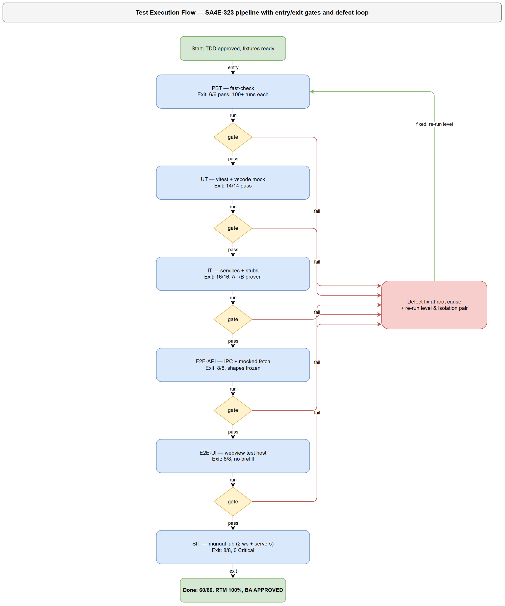
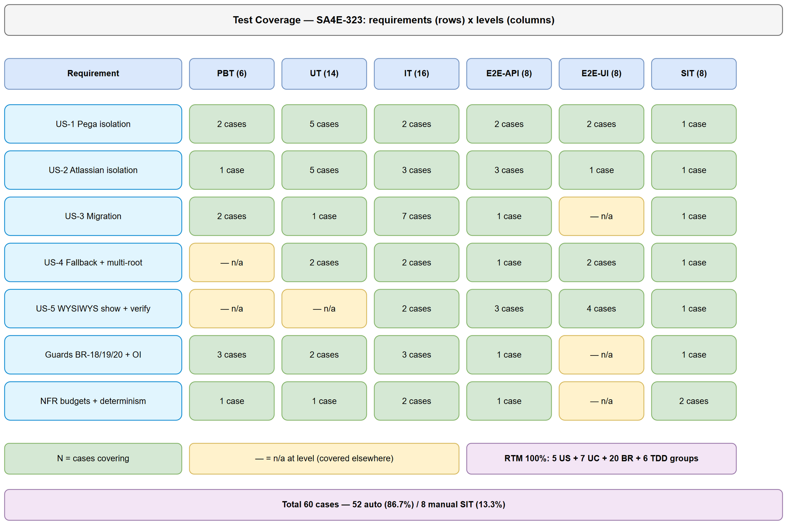

# Software Test Plan (STP)

## SDLC Agents 4 Enterprise — SA4E-323: Per-workspace isolation for Pega/Atlassian connection settings

---

## Document Information

| Field | Value |
|-------|-------|
| Jira Ticket | SA4E-323 |
| Title | Pega/Atlassian connection settings luu global, leak giua cac workspace — can luu rieng per-workspace |
| Author | QA Agent |
| Version | 1.0 |
| Date | 2026-09-24 |
| Status | Draft |
| Related BRD | BRD-v1-SA4E-323.docx (documents/SA4E-323/BRD.md v1.0) |
| Related FSD | FSD-v1-SA4E-323.docx (documents/SA4E-323/FSD.md v1.1) |
| Related TDD | TDD-v1-SA4E-323.docx (documents/SA4E-323/TDD.md v1.0) |

---

## Author Tracking

| Role | Name - Position | Responsibility |
|------|-----------------|----------------|
| Author | QA Agent – QA Engineer | Create document |
| Peer Reviewer | SM – Scrum Master | Review document |
| Business Reviewer | BA Agent – Business Analyst | Business coverage review (mandatory gate) |

---

## Revision History

| Version | Date | Author | Changes |
|---------|------|--------|---------|
| 1.0 | 2026-09-24 | QA Agent | Initiate document — from BRD v1.0 (5 US), FSD v1.1 (7 UCs, 20 BRs), TDD v1.0 (WorkspaceScopeResolver, 3 write sites, migration, fallback) |

---

## Sign-Off

| Name | Signature and date |
|------|--------------------|
| Test Lead | ☐ I agree and confirm the test plan in this STP |
| Tech Lead | ☐ I agree and confirm the test plan in this STP |

---

## 1. Introduction

### 1.1 Purpose

This Test Plan defines the strategy, scope, schedule, resources, and quality gates for verifying the SA4E-323 bug fix: Pega Platform Connection (Endpoint URL, Operator ID, Password) and Atlassian Connection (Jira Base URL, Email, API Token/PAT, Connection Type) entered in the "SDLC Pipeline Settings" UI are currently stored GLOBAL (shared across all workspaces) and MUST become per-workspace isolated.

The fix (extension host only, `extension/`) changes 3 config write sites from `ConfigurationTarget.Global` to `ConfigurationTarget.Workspace`, namespaces all secrets per workspace identity (`kiroSdlc.<wsHash>.*` via one shared `WorkspaceScopeResolver`), synchronizes every read site to the same scope, adds lazy idempotent per-workspace migration of legacy globals, and defines a no-folder fallback plus multi-root canonical folder (`workspaceFolders[0]`).

### 1.2 Test Objectives

- Verify Pega isolation: save in Workspace A never leaks into Workspace B (endpoint/username/password), across EVERY read site (BRD US-1, FSD UC-1/UC-7).
- Verify Atlassian isolation: triple + connection type isolated per workspace, IPC and hot-reload paths included (BRD US-2, FSD UC-2/UC-7).
- Verify one-time migration: legacy globals copied (not moved) per workspace, workspace-wins, cleared-stays-cleared, idempotent, retry-safe (BRD US-3, FSD UC-5, BR-13..BR-15).
- Verify fallback: no-folder reads read-only + saves blocked with zero silent global writes; multi-root deterministic on `workspaceFolders[0]` (BRD US-4, FSD UC-6, BR-16..BR-17).
- Verify WYSIWYS: Settings UI shows and tests ONLY the current workspace's credentials; secrets never cross the webview boundary (BRD US-5, FSD UC-3/UC-4, BR-10..BR-12, BR-20).
- Verify NFRs: `getState` p95 < 300 ms, `ensureMigrated()` p95 < 500 ms, `getWsHash()` < 1 ms, zero secret leakage, deterministic resolution, no data loss on upgrade.
- Maximize automation: 6 test levels with E2E-API/E2E-UI covering all deterministic IPC/UI behavior; manual SIT reserved for real-server matrix, keychain inspection, timing, and visual/UX judgment only.

### 1.3 References

| Document | Location |
|----------|----------|
| BRD v1.0 (5 user stories US-1..US-5) | documents/SA4E-323/BRD.md |
| FSD v1.1 (7 use cases UC-1..UC-7, 20 business rules BR-1..BR-20, IPC schemas, 20 test scenarios TC-1..TC-20) | documents/SA4E-323/FSD.md |
| TDD v1.0 (WorkspaceScopeResolver, 3 write-site diffs, key scheme, migration wiring, OI-1..OI-12) | documents/SA4E-323/TDD.md |
| STC (60 test cases PBT/UT/IT/E2E-API/E2E-UI/SIT) | documents/SA4E-323/STC.md |
| Test data CSVs | documents/SA4E-323/testdata/*.csv |
| Test execution tracker | documents/SA4E-323/TEST-REPORT-SA4E-323.csv |

### Diagram Index

| # | Diagram | Image | Source (editable) |
|---|---------|-------|-------------------|
| 1 | Test Coverage — requirements x levels | [test-coverage.png](diagrams/test-coverage.png) | [test-coverage.drawio](diagrams/test-coverage.drawio) |
| 2 | Test Execution Flow — pipeline + gates | [test-execution-flow.png](diagrams/test-execution-flow.png) | [test-execution-flow.drawio](diagrams/test-execution-flow.drawio) |

---
## 2. Test Strategy

### 2.1 Test Levels (MANDATORY — 6 levels)

| Level | Scope | Automation | Tools |
|-------|-------|------------|-------|
| PBT | Correctness properties (random inputs): wsHash determinism, key format, migration idempotency, workspace-wins, slash normalization | Automated | fast-check (already in extension devDependencies ^4.9.0) |
| UT | Unit/edge case tests: normalize matrix, null scope, guards, validation, defaults/coercion, error strings | Automated | vitest (`npm run test:unit`), `vi.mock("vscode")` pattern from `__tests__/pega-ruleset-resolver.test.ts` |
| IT | Service integration (in-memory SecretStorage stub + `getConfiguration` stub, no network): save/load isolation, read-site consistency, migration matrix, fallback, clear | Automated | vitest + stubs (same pattern as existing extension tests) |
| E2E-API | IPC-contract E2E (SettingsMessageHandler save/getState/test/fetch + outbound Pega/Jira REST via mocked `fetch`): frozen message shapes, per-workspace auth, timeouts | Automated | vitest + mocked `fetch` (no Pega/Jira server needed) |
| E2E-UI | Settings webview UI E2E (render/save/presence/banner/test buttons per workspace) | Automated | VS Code extension test host + webview assertions (existing `*.e2e.test.ts` pattern); manual fallback only if host unavailable |
| SIT | Manual exploratory / edge cases only: real two-workspace matrix against real servers, real keychain migration, no-leak grep, timing, concurrency, remote paths | Manual | VS Code (2 local workspaces A/B) + real Pega/Jira servers + OS keychain inspection |

> Note on mapping: this is a VS Code extension bug (no backend REST surface — `backend/` persists no credentials per BRD §1.2). E2E-API therefore covers the IPC message contracts (`savePegaConfig`, `saveAtlassianConfig`, `getState`→`state`, `testPegaConnection`, `testAtlassianConnection`, `fetchPegaContext`, `handleCredentialRequest`) plus the outbound Pega/Jira REST calls made with workspace credentials. E2E-UI covers the Settings webview per-workspace rendering and interaction.


*[Edit in draw.io](diagrams/test-execution-flow.drawio)*

### 2.2 Test Types

| Type | Description | Applicable |
|------|-------------|------------|
| Functional Testing | Verify 7 UCs (UC-1..UC-7) main/alternative/exception flows | Yes |
| Business Rule Testing | Verify 20 BRs (BR-1..BR-20) incl. guards, defaults, fallback | Yes |
| Regression Testing | Existing IPC shapes, LLM keys untouched, `updateConfig` callers, test-only mocks | Yes |
| Performance Testing | `getWsHash` < 1 ms, `getState` p95 < 300 ms, migration p95 < 500 ms, 8 s test timeouts | Yes (SIT-04 + IT timing asserts) |
| Security Testing | No secret in settings.json/logs/webview/IPC; no cross-workspace auth; fail-closed; no silent global write | Yes |
| Usability Testing | Banner wording, presence placeholders, disabled saves, multi-root note | Yes (E2E-UI + SIT) |
| Compatibility Testing | Windows/Unix path normalization, remote/WSL/SSH scheme handling | Yes (PBT/UT + SIT-06) |

### 2.3 Test Approach

1. **KB-first**: `mem_search("SA4E-323")` returned no prior entries — this plan is grounded directly in BRD/FSD/TDD files (primary sources). After completion, STP+STC are ingested via `mem_ingest_file` for DEV/BA reuse.
2. **Risk-based prioritization**: isolation A→B (P0), read-site consistency incl. `IndexingService.ts:234` literal bypass (P0), no-leakage (P0), migration workspace-wins/copy-not-move (P0) first; fallback/multi-root, determinism, NFRs second; cosmetic/UX wording last.
3. **Single-resolver verification**: every test resolves scope through `WorkspaceScopeResolver` only — no test duplicates hash logic; a dedicated guard test (IT + UT-05) fails the build if any Pega/Atlassian key flows through the generic Global `updateConfig()`.
4. **Automation-first**: all deterministic behavior (PBT/UT/IT/E2E-API/E2E-UI = 52/60 cases, 86.7%) runs in `npm run test:unit`; manual SIT (8/60, 13.3%) is restricted to what cannot be automated: real-server auth, real keychain, wall-clock timing, concurrent windows, remote paths, human judgment of banners.
5. **No-workaround rule**: failing tests are fixed at root cause (resolver/scope/migration); tests MUST NOT mock away the scope under test (e.g., IT tests use distinct stub folders per workspace, never a single shared stub).

### 2.4 Entry Criteria

| Level | Entry Criteria |
|-------|----------------|
| PBT/UT | TDD v1.0 approved; `WorkspaceScopeResolver.ts` skeleton + `crypto` import available; `vi.mock("vscode")` pattern confirmed |
| IT | PBT/UT green; in-memory SecretStorage + `getConfiguration` stubs ready; test data CSVs prepared |
| E2E-API | IT green; `SettingsMessageHandler` + both services wired to Resolver; `fetch` mock harness ready |
| E2E-UI | E2E-API green; Settings webview buildable; 2 test workspaces (A/B) provisioned |
| SIT | E2E-UI green; 0 Critical/Major defects open; real Pega + Jira test servers reachable; 2 local workspaces + legacy-global fixture ready |

### 2.5 Exit Criteria

| Level | Exit Criteria |
|-------|---------------|
| PBT | All 6 properties pass ≥100 runs each; no shrinking counterexample |
| UT | All 14 tests pass; 0 failures |
| IT | All 16 tests pass; isolation A→B proven for both Pega and Atlassian; migration matrix green |
| E2E-API | All 8 tests pass; IPC shapes byte-identical to FSD §3.8 frozen contracts |
| E2E-UI | All 8 tests pass; no cross-workspace prefill; secrets absent from all `state` payloads |
| SIT | All 8 scenarios executed; 0 Critical defects; ≤1 Major open with workaround; no-leak grep clean; timing budgets met |
| Overall | 60/60 executed, pass rate ≥ 95%, RTM 100%, BA business-coverage review APPROVED |

### 2.6 E2E Automation Coverage (SIT minimization)

| SIT scenario | Automated as | Reason |
|--------------|-------------|--------|
| CRUD save/load isolation (Pega + Atlassian A→B) | IT-01, IT-03, E2E-API-01, E2E-API-02 | Deterministic config/secret stub assertions |
| Form validation (invalid URL, empty token, blank password) | UT-07, UT-08, UT-11, IT (validation paths) | Pure input/output rules |
| IPC response verification (ack shapes, `state` shape, error strings) | E2E-API-01..08 | Frozen contracts, string-exact asserts |
| Auth scoping (401 never retries other workspace) | UT-13, E2E-API-05, IT-04 | Header-level assertions with mocked fetch |
| Status/presence changes (hasPegaPassword/hasAtlassianToken) | IT-06, E2E-UI-04 | Boolean flag assertions |
| Migration matrix (happy/wins/cleared/lazy/retry/invalid-skip) | PBT-04, PBT-05, IT-07..IT-12 | Deterministic stub-state machine |
| Regression (LLM keys, IPC shapes, existing mocks) | UT-05, E2E-API-03, IT (guard) | Automated regression suite |
| Real-server auth proof (Test buttons vs live Pega/Jira) | SIT-01 (manual) | Requires live credentials/servers |
| Real keychain migration + `.vscode/settings.json` inspection | SIT-02 (manual) | Requires real OS keychain |
| No-leak grep across settings.json/logs/webview/IPC | SIT-03 (manual) | Human-verified evidence sweep |
| Wall-clock timing (getState/migration p95) | SIT-04 (manual) | OS keychain latency is environment-specific |
| Concurrent windows, remote/WSL paths, read-only settings.json | SIT-05, SIT-06, SIT-07 (manual) | OS/window-manager behavior |
| Release-note UX wording (banner, committed-settings warning) | SIT-08 (manual) | Human judgment |

### 2.7 Test Cases Summary (MANDATORY)

| Level | Count | Automated | Manual |
|-------|-------|-----------|--------|
| PBT | 6 | 6 | 0 |
| UT | 14 | 14 | 0 |
| IT | 16 | 16 | 0 |
| E2E-API | 8 | 8 | 0 |
| E2E-UI | 8 | 8 | 0 |
| SIT | 8 | 0 | 8 |
| **Total** | **60** | **52 (86.7%)** | **8 (13.3%)** |

---
## 3. Test Scope

### 3.1 Features In Scope

| # | Feature / Story | Priority | FSD Reference | Test Type |
|---|----------------|----------|---------------|-----------|
| 1 | Pega save/load per-workspace (endpoint/username Workspace + password namespaced) — BRD US-1 | High | UC-1, BR-1..BR-4 | Functional (PBT/UT/IT/E2E-API/E2E-UI) |
| 2 | Atlassian save/load per-workspace (triple namespaced + type Workspace) — BRD US-2 | High | UC-2, BR-5..BR-9 | Functional (UT/IT/E2E-API/E2E-UI) |
| 3 | Settings state WYSIWYS (current-workspace values + presence flags only) — BRD US-5 | High | UC-3, BR-10..BR-11 | Functional + Security (IT/E2E-API/E2E-UI) |
| 4 | Test Pega / Test Atlassian with current-workspace creds (8 s timeouts, no cross-ws retry) — BRD US-5 | High | UC-4, BR-12 | Functional (E2E-API/E2E-UI/SIT) |
| 5 | Lazy idempotent per-workspace migration (copy-not-move, workspace-wins, cleared-stays-cleared) — BRD US-3 | High | UC-5, BR-13..BR-15 | Functional (PBT/IT/SIT) |
| 6 | No-folder fallback (read-only + blocked save, zero silent global writes) + multi-root `folders[0]` — BRD US-4 | High | UC-6, BR-16..BR-17 | Functional (UT/IT/E2E-UI/SIT) |
| 7 | Downstream consumption sync (PegaHttpClient, IndexingService literal fix, AtlassianHttpClient hot-reload, JiraProjectIndexer gate, IPC credentials) | High | UC-7, BR-18..BR-20 | Integration + Security (IT/E2E-API) |
| 8 | wsHash derivation determinism + normalization (win/unix/remote) | Medium | BR-19, NFR Reliability | PBT/UT/SIT |
| 9 | No-leakage (settings.json, logs, webview, IPC errors, migration diagnostics) | High | BR-20, NFR Security | Security (IT/E2E-API/SIT) |
| 10 | NFR budgets (getState p95 <300 ms, migration p95 <500 ms, getWsHash <1 ms, activation +0 ms) | Medium | FSD §8 / TDD §8.3 | Non-functional (IT asserts + SIT-04) |
| 11 | New Clear paths (`clearPegaPassword`/`clearConfig` + IPC, marker stays) — TDD OI-8 | Medium | UC-5 (BR-14), TDD §5.2 | Functional (IT/E2E-API) |
| 12 | Post-save `sendCurrentState()` refresh parity (OI-12) + Pega 8 s timeout (OI-7) + empty email/token reject (OI-9) | Medium | UC-3/UC-4/UC-2 | Functional (IT/E2E-API) |


*[Edit in draw.io](diagrams/test-coverage.drawio)*

### 3.2 Features Out of Scope

| # | Feature | Reason |
|---|---------|--------|
| 1 | LLM provider keys scope (anthropic/openai/lmstudio/openrouter keys, llmProvider/llmModel/ollamaUrl) | Explicitly out of scope (BRD §1.2); covered only by regression guard UT-05 (must stay Global) |
| 2 | Backend (`backend/`) credential storage | Persists no Pega/Atlassian credentials; no change (BRD §1.2) |
| 3 | Proxy/backend-URL/MCP settings | Already Workspace-scoped; no change |
| 4 | Secret encryption algorithm changes | Secrets remain in OS-keychain SecretStorage; only key namespacing changes |
| 5 | Settings Sync policy | Workspace-scoped config naturally follows the folder; out of scope |
| 6 | Settings panel redesign | Only data-binding correctness is in scope |
| 7 | `pegaDeveloperShortName` write path | TDD OI-10: documented out-of-scope, no code change (release-note warning only) |
| 8 | Pega/Atlassian server-side changes | No server change needed; client-side persistence scope only |

---
## 4. Test Environment

### 4.1 Environment Requirements

| Environment | Setup | Purpose |
|-------------|-------|---------|
| Unit/IT/E2E-API host | Node + `extension/` devDeps (`vitest ^4.1.8`, `fast-check ^4.9.0`); `npm run test:unit`; `vi.mock("vscode")` with per-workspace `workspaceFolders` + in-memory SecretStorage + `getConfiguration` stub (pattern: `__tests__/pega-ruleset-resolver.test.ts:6-22`) | PBT/UT/IT/E2E-API (52 automated cases, no servers) |
| E2E-UI host | VS Code extension test host (`*.e2e.test.ts` pattern) with 2 fixture workspaces A/B; webview Settings panel buildable | E2E-UI (8 cases) |
| SIT lab | VS Code desktop + 2 local folders `C:\sdlc-test\ws-a`, `C:\sdlc-test\ws-b` (+ multi-root window A+B, empty window, read-only `.vscode/settings.json` variant); real Pega Platform + Jira Cloud/Server test tenants with DISTINCT credentials per workspace; OS keychain access | SIT (8 manual scenarios) |

### 4.2 Browser / OS Requirements

| Platform | Version | Required |
|----------|---------|----------|
| VS Code (extension host) | ^1.85.0 (engine per `extension/package.json`) | Yes |
| Windows 10/11 (primary: backslash/drive-letter normalization, keychain = Credential Manager) | 10+ | Yes |
| Linux or macOS (secondary: separator/case behavior cross-check for BR-19) | Any recent | Recommended (SIT-06) |
| Remote/WSL/SSH folder (scheme+authority preservation check) | — | For SIT-06 only |

### 4.3 Test Data Requirements

| Data Type | Description | Source | Preparation |
|-----------|-------------|--------|-------------|
| Workspace fixtures | Folder A `C:\sdlc-test\ws-a`, folder B `C:\sdlc-test\ws-b`; derived `wsHashA`/`wsHashB` (computed at runtime via `getWsHash()`, never hardcoded) | testdata/pre-seeded-data.csv | Create folders; record hashes from first resolver run |
| Pega per-workspace values | A: `https://pega-a.corp.local:8443/prweb` / `op.a` / `PassA-123!`; B: `https://pega-b.corp.local:8443/prweb` / `op.b` / `PassB-456!`; invalid: `ftp://x`, `not-a-url`, `""` | testdata/pega-isolation-testdata.csv | Seed via save path in IT/E2E; manual entry in SIT |
| Atlassian per-workspace values | A: `https://a.atlassian.net` / `a@corp.local` / `tokenA` / `cloud`; B: `https://b-jira.corp.local` / `b@corp.local` / `patB` / `server`; invalid: `ftp://x`, `""` email/token | testdata/atlassian-isolation-testdata.csv | Same as above |
| Legacy-global migration fixture | Global config (endpoint/username/type) + flat secrets (`kiroSdlc.pegaPassword`, `kiroSdlc.atlassian.*`), no workspace values, no marker | testdata/migration-testdata.csv | Seed legacy scope only; each workspace migrates lazily |
| Fallback/NFR fixtures | Empty `workspaceFolders`, 2-folder multi-root, trailing-slash endpoints, read-only `.vscode/settings.json` | testdata/fallback-nfr-testdata.csv | Harness flags per test case |

All CSVs live at `documents/SA4E-323/testdata/`; every STC test-case ID appears in at least one CSV (verified in STC Appendix).

### 4.4 External Dependencies

| System | Dependency | Mock/Stub Available |
|--------|-----------|---------------------|
| Pega Platform REST (operator context, casetypes) | Reachable test server for SIT-01 only | Yes — mocked `fetch` for E2E-API-04/05 (no server needed) |
| Jira Cloud/Server (`GET /rest/api/2/myself`) | Reachable test tenant for SIT-01 only | Yes — mocked `fetch` for E2E-API-05 (200/401/500 fixtures) |
| VS Code SecretStorage (OS keychain) | Real keychain for SIT-02 | Yes — in-memory stub for PBT/UT/IT/E2E-API |
| VS Code Configuration (`.vscode/settings.json`) | Real workspace files for SIT | Yes — `getConfiguration` stub for automated levels |

---
## 5. Test Schedule

| Phase | Duration | Milestone |
|-------|----------|-----------|
| Test Planning (STP + STC + diagrams + CSVs) | 2 days | STP + STC approved (SM review + BA business-coverage APPROVED) |
| Test Data Preparation (fixtures A/B, legacy globals, CSV verification) | 0.5 day | All 60 test-case IDs covered by ≥1 CSV |
| PBT/UT/IT Execution (`npm run test:unit`) | 1 day | 36/36 green |
| E2E-API/E2E-UI Execution | 1 day | 16/16 green, IPC shapes frozen |
| Defect Fix & Retest | 1–2 days | 0 Critical, ≤1 Major open |
| SIT Execution (manual matrix, keychain, timing, concurrency) | 1.5 days | 8/8 executed, evidence screenshots in `evidence/` |
| UAT / Release note sign-off (migration + OI-11 warning) | 0.5 day | PO sign-off |

---

## 6. Resources & Responsibilities

| Role | Responsibility |
|------|---------------|
| Test Lead (QA Agent) | Test planning (this STP), STC design, coordination, RTM 100% verification, reporting |
| QA Engineer | Automated suite execution (PBT/UT/IT/E2E-API), SIT manual execution, defect reporting, evidence capture |
| BA Agent | Business-coverage review of STC (mandatory gate): every US/AC/BR mapped; verdict APPROVED or CHANGES REQUESTED (max 2 iterations) |
| Developer (DEV Agent) | Bug fixing at root cause (no workarounds), new unit tests beside `extension/src/__tests__/`, keep `SECRET_KEYS` legacy-comment (OI-4) |
| SM | Phase-4 review (10-criteria checklist), Jira attachment of DOCX/XLSX, gate to Phase 5 |
| PO | Banner wording approval (OI-5), legacy-retention policy (OI-6), release-note wording (OI-11), UAT sign-off |

**Tools:** vitest + fast-check (automated), VS Code extension test host (E2E-UI), VS Code desktop + real servers (SIT), draw.io CLI (diagrams), python-docx/openpyxl (DOCX/XLSX export), KB `mem_ingest_file` (cross-agent sharing), Jira (defect tracking).

---

## 7. Risk & Mitigation

| # | Risk | Impact | Likelihood | Mitigation |
|---|------|--------|------------|------------|
| 1 | Missed read site (a direct `secrets.get(SECRET_KEYS.pega)` or Global `config.get` left unfixed, e.g. the `IndexingService.ts:234` literal) silently reintroduces the leak | High | Medium | Grep inventory of all `SECRET_KEYS`/flat-key/`ConfigurationTarget` accesses; single-resolver rule (BR-18) + guard test UT-05/IT; read-site consistency tests IT-02/IT-04/E2E-API cover every entry point |
| 2 | Hash collision/unnormalized paths (two workspaces share a key) | High | Low | PBT-02 (distinct→distinct) + UT-01 normalization matrix + 12-hex SHA-256 precedent; SIT-06 remote/WSL check |
| 3 | Migration overwrites workspace values or resurrects cleared values | High | Medium | PBT-04/PBT-05 + IT-08/IT-09/IT-12; workspace-wins per FIELD; marker blocks resurrect; copy-not-move keeps legacy intact |
| 4 | Users relying on global sharing perceive isolation as regression | Medium | Medium | SIT-02 migration pre-fill + SIT-08 release-note UX verification; no silent data loss (BR-15 retry-safe) |
| 5 | Multi-root/remote identity ambiguity → nondeterministic keys | Medium | Medium | BR-17 canonical `folders[0]` (IT-14, E2E-UI-08); normalization (UT-01, SIT-06); debug folder+hash logging (no values) |
| 6 | `updateConfig()` generic Global helper reused for Pega/Atlassian keys bypasses the fix | Medium | Medium | Runtime guard + UT-05/IT guard test; audit of `setProvider/setModel/setOllamaUrl/setBaseUrl` callers (LLM-only, stay Global) |
| 7 | No-workspace fallback silently writes global (back-door leak) | Medium | Low | IT-13 zero-write assert (config + secrets untouched); E2E-UI-05 banner/disabled-save; explicit error strings |
| 8 | Secret leakage into logs/webview/settings.json/IPC errors | High | Low | BR-20 presence-flags-only design; IT-06/E2E-API-03 payload asserts; SIT-03 manual grep sweep (P0) |
| 9 | Test environment: real Pega/Jira servers unavailable for SIT-01 | Medium | Low | All auth-scoping logic pre-verified with mocked fetch (E2E-API-04/05); SIT-01 can run against one real + one mocked tenant if needed |
| 10 | Requirement churn (banner wording OI-5, clear-path UX OI-8) during testing | Medium | Medium | Exact strings pinned in STC expected results; wording changes tracked as data-only updates, not scope changes |

---

## 8. Defect Management

### 8.1 Severity Levels

| Severity | Definition | Example (this ticket) |
|----------|-----------|----------------------|
| Critical | Data loss, security breach, cross-workspace credential use | B shows A's password; secret in settings.json/logs/webview; migration deletes legacy; silent global write |
| Major | Feature not working, workaround exists | Migration does not run (user must re-enter); Test button uses wrong workspace; `state` shows stale values until manual refresh |
| Minor | UI issue, cosmetic defect | Banner wording unclear; placeholder text wrong; multi-root note missing |
| Trivial | Typo, minor alignment issue | Punctuation in `pegaSaved` message; placeholder capitalization |

### 8.2 Priority Levels

| Priority | Definition | SLA (Fix Time) |
|----------|-----------|----------------|
| P1 | Must fix immediately (Critical / isolation break) | 4 hours |
| P2 | Must fix before release (Major) | 1 business day |
| P3 | Should fix if time permits (Minor) | 3 business days |
| P4 | Nice to fix, can defer (Trivial) | Next release |

### 8.3 Defect Lifecycle

```
New → Open → In Progress → Fixed → Ready for Retest → Verified → Closed
                                                      → Reopened → In Progress
```

Isolation/no-leak defects are always P1/Critical. Migration defects blocking upgrade are P1/P2. Retest MUST re-run the full isolation pair (A→B) plus the migration idempotency check, not just the failing step.

---

## 9. Test Metrics & Reporting

### 9.1 Metrics

| Metric | Formula | Target |
|--------|---------|--------|
| Test Execution Rate | Executed / Total × 100% | 100% (60/60) |
| Pass Rate | Passed / Executed × 100% | ≥ 95% |
| Automation Rate | Automated / Total × 100% | ≥ 85% (actual 86.7%) |
| Defect Density | Defects / Test Cases | ≤ 0.1 |
| Critical Defect Count | Count of Critical severity | 0 at exit |
| Defect Fix Rate | Fixed / Total Defects × 100% | ≥ 90% |
| RTM Coverage | Requirements with ≥1 test case / Total | 100% (5 US + 7 UC + 20 BR + 6 TDD component groups) |
| No-leak violations | Secret outside SecretStorage+auth headers | 0 (P0) |

### 9.2 Reporting Schedule

| Report | Frequency | Audience |
|--------|-----------|----------|
| Daily Test Status (automated suite + SIT progress) | Daily during execution | Project team |
| Defect Summary | Daily | Dev team + PM |
| Test Completion Report (60-case results + RTM + evidence) | End of SIT | All stakeholders + Jira attachment |

---

## 10. Appendix

### Glossary

| Term | Definition |
|------|------------|
| wsHash | `sha256("ws:"+normalizedPath).hex.slice(0,12)` — workspace identity for key namespacing (TDD §4.2) |
| secretKey | `kiroSdlc.<wsHash>.<suffix>` built ONLY by `WorkspaceScopeResolver.secretKey()` |
| Migration marker | `kiroSdlc.<wsHash>.migrated="1"` — exactly-once gate per workspace |
| Workspace-wins | Non-empty workspace value is never overwritten by legacy (per FIELD) |
| Copy-not-move | Legacy kept intact until workspace copy readable; never auto-deleted (OI-6) |
| WYSIWYS | What-you-see-is-what-is-used: Settings shows/uses current-workspace values only |
| SIT | System Integration Testing (manual only in this plan) |
| RTM | Requirements Traceability Matrix (in STC §10) |

### Assumptions

- `secretKey()`/hash implementation matches TDD §4.2 + FSD §6.3.1 verbatim (`crypto.createHash("sha256")`, `"ws:"` prefix, 12-hex truncation).
- Legacy flat `SECRET_KEYS` strings are kept verbatim as read-only migration sources (TDD OI-4).
- `package.json` config declarations unchanged (no `scope` field); `Workspace`-targeted writes persist to `.vscode/settings.json` regardless.
- Test-only mocks of `pegaEndpoint`/`pegaUsername` in existing `__tests__/pega-*.test.ts` are unaffected (they mock `getConfiguration`, not SecretStorage keys).
- Exact IPC error strings are per FSD §3.8.3 / TDD §3.2 (pinned in STC expected results).
- `mem_search("SA4E-323")` returned no prior KB entries at plan time; STP+STC are ingested after completion for cross-agent reuse.
