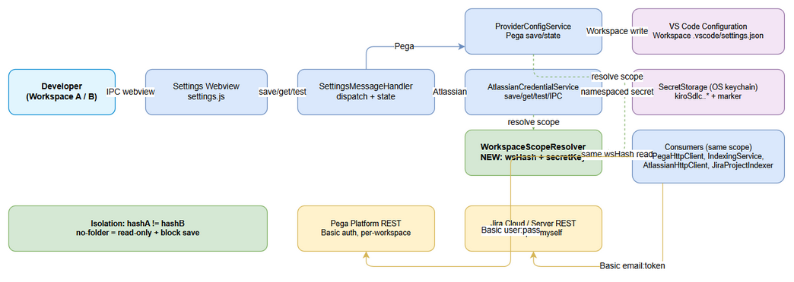
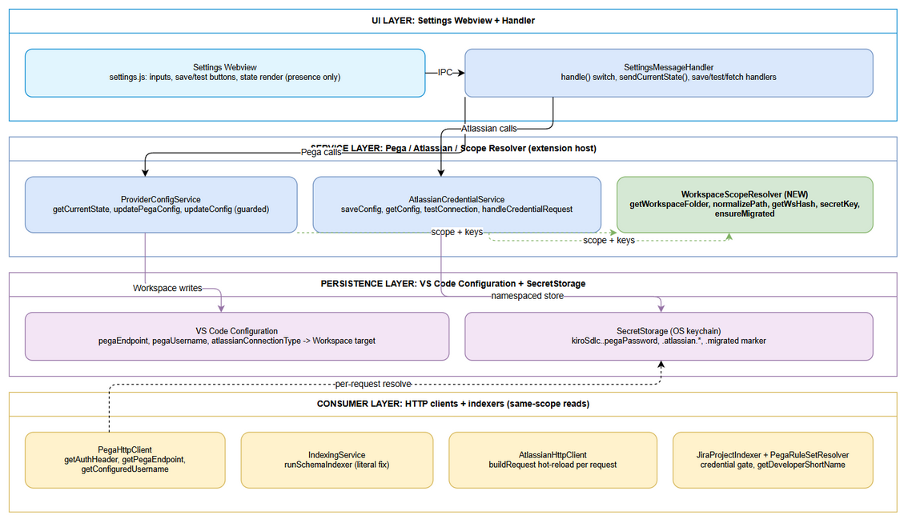
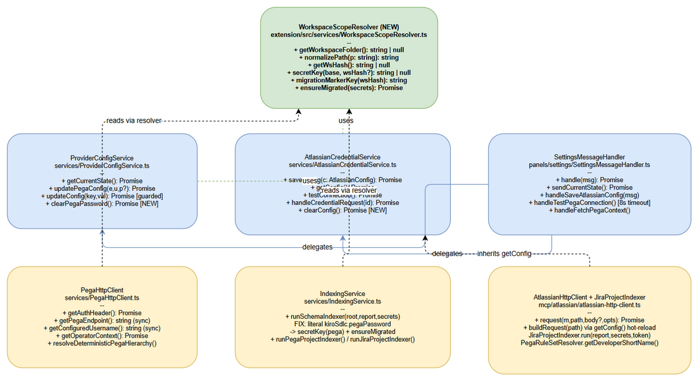

# Technical Design Document (TDD)

## SDLC Agents 4 Enterprise — SA4E-323: Per-workspace isolation for Pega/Atlassian connection settings

---

## Document Information

| Field | Value |
|-------|-------|
| Jira Ticket | SA4E-323 |
| Title | Pega/Atlassian connection settings luu global, leak giua cac workspace — can luu rieng per-workspace |
| Author | SA Agent |
| Version | 1.0 |
| Date | 2026-09-24 |
| Status | Draft |
| Related BRD | documents/SA4E-323/BRD.md (v1.0) / BRD-v1-SA4E-323.docx |
| Related FSD | documents/SA4E-323/FSD.md (v1.1) / FSD-v1-SA4E-323.docx |
| Type | Bug / High (extension persistence layer only, `extension/`) |

---

## Revision History

| Version | Date | Author | Changes |
|---------|------|--------|---------|
| 1.0 | 2026-09-24 | SA Agent | Initiate from BRD v1.0 + FSD v1.1, grounded against actual code (ProviderConfigService, AtlassianCredentialService, LlmProviderConfig, SettingsMessageHandler, PegaHttpClient, IndexingService, atlassian-http-client, JiraProjectIndexer, PegaRuleSetResolverService, package.json) |

---

## Sign-Off

| Name | Signature and date |
|------|--------------------|
| Tech Lead | ☐ I agree and confirm the technical design in this TDD |
| PO | ☐ I agree and confirm the technical design in this TDD |

---

## 1. Introduction

> **Scope Boundary:** Functional contracts (use cases UC-1..UC-7, business rules BR-1..BR-20, IPC schemas, NFR targets) are defined in FSD v1.1. This TDD does NOT repeat them — it specifies HOW to implement: new module, exact file diffs, key-derivation algorithm, migration wiring, IPC code changes, error/security/performance implementation, test hooks, and rollback.

### 1.1 Purpose

Fix the verified leak: Pega (`pegaEndpoint`, `pegaUsername`, `kiroSdlc.pegaPassword`) and Atlassian (`atlassianConnectionType`, `kiroSdlc.atlassian.*`) are persisted `Global`/flat today, so the last-written workspace leaks into every other workspace. This TDD designs a per-workspace persistence layer — `Workspace`-targeted config plus namespaced secrets `kiroSdlc.<wsHash>.*` behind ONE shared resolver — with lazy copy-not-move migration, null-scope fallback, and full read-site synchronization.

### 1.2 Scope

**In scope (extension host only, `extension/`):**

- NEW `extension/src/services/WorkspaceScopeResolver.ts` (pure scope + key derivation + `ensureMigrated`).
- 3 write-site fixes `Global`→`Workspace` (ProviderConfigService.ts:60-61, AtlassianCredentialService.ts:93).
- Namespaced secrets for all 4 secret bases + marker; `IndexingService.ts:234` literal fix.
- Read-site synchronization (list in §5.2); `updateConfig()` guard; `sendCurrentState()` refresh fix (OI-12); Pega test 8s timeout (OI-7); Clear methods (OI-8); empty-string reject (OI-9).
- Unit tests beside `extension/src/__tests__/`; manual isolation matrix hooks.

**Out of scope:** LLM provider keys/scope, `backend/` (persists nothing), proxy/backend-URL/MCP settings (already `Workspace`), encryption algorithm, Settings Sync policy, Settings panel redesign, `pegaDeveloperShortName` write path (OI-10: documented only).

### 1.3 Technology Stack

| Layer | Technology | Version / Note |
|-------|-----------|----------------|
| Language | TypeScript (extension host) | `extension/package.json`, `vscode ^1.85.0` engine |
| Runtime API | VS Code Extension Host (`workspace.getConfiguration`, `SecretStorage`, `ConfigurationTarget.Workspace`) | No new dependency |
| Hash | Node `crypto.createHash("sha256")` | Same import style as `PegaHttpClient.ts:941` precedent |
| Tests | vitest (`npm run test:unit`), `vi.mock("vscode")` pattern | See `__tests__/pega-ruleset-resolver.test.ts` |
| Diagrams | draw.io (`.drawio` + `.png` via draw.io CLI) | No Mermaid |
| Doc export | python-docx 1.2.0 | `TDD-v1-SA4E-323.docx` |

### 1.4 Design Principles

- **Single resolver, zero duplication** (BR-18): every current/future Pega/Atlassian read/write calls `WorkspaceScopeResolver`; no inline hash.
- **Merged-read leverage:** `config.get()` with no target already returns Workspace-wins — only 3 write sites change target (§4 TA verification in FSD).
- **Fail-closed, never cross-workspace retry** (BR-12, SEC-03 preserved): missing creds → "not configured"; 401 → current-workspace message only.
- **Copy-not-move + workspace-wins + cleared-stays-cleared** (BR-13..15): migration never overwrites, never resurrects, never deletes legacy (OI-6).
- **No secret leaves SecretStorage** except as auth header (BR-20): presence flags only across webview; folder+hash only in debug logs.

### 1.5 Constraints

- `ConfigurationTarget.Workspace` requires an open folder; no-folder MUST block saves (BR-16).
- `SecretStorage` has no native scope and no batch API — ≤6 gets per `getState` (NFR-T2); all work lazy, +0ms at activation (NFR-T4).
- Sync getters (`getPegaEndpoint`, `getConfiguredUsername`, `readConnectionType`, `getDeveloperShortName`) cannot `await ensureMigrated` — migration is guaranteed by async entry points that always run first (§5.4).
- `package.json` declares NO `scope` field for the 3 config keys (verified `:336-364`) — NO `package.json` change; `config.update(..., Workspace)` is legal regardless.
- Multi-root canonical folder is `workspaceFolders[0]` everywhere (BR-17).

### 1.6 References

| Document | Location |
|----------|----------|
| BRD v1.0 | documents/SA4E-323/BRD.md |
| FSD v1.1 (7 UCs, 20 BRs, IPC schemas, pseudocode, OI-1..OI-12) | documents/SA4E-323/FSD.md |
| ProviderConfigService | extension/src/services/ProviderConfigService.ts |
| AtlassianCredentialService | extension/src/services/AtlassianCredentialService.ts |
| SECRET_KEYS | extension/src/models/LlmProviderConfig.ts:6-15 |
| SettingsMessageHandler | extension/src/panels/settings/SettingsMessageHandler.ts |
| PegaHttpClient | extension/src/services/PegaHttpClient.ts |
| IndexingService | extension/src/services/IndexingService.ts:228-247 |
| AtlassianHttpClient | extension/src/mcp/atlassian/atlassian-http-client.ts:68-74 |
| JiraProjectIndexer | extension/src/services/JiraProjectIndexer.ts:35-39 |
| PegaRuleSetResolverService | extension/src/services/PegaRuleSetResolverService.ts:52-59 |
| Config declarations | extension/package.json:336-364 |

---

## 2. System Architecture

### 2.1 Architecture Overview

All changes live in the extension-host process. The Settings webview talks only to `SettingsMessageHandler`, which delegates to `ProviderConfigService` (Pega) and `AtlassianCredentialService` (Atlassian). Both services — and every downstream consumer — resolve scope through the NEW `WorkspaceScopeResolver`: non-secrets go to that workspace's `.vscode/settings.json` (`Workspace` target), secrets go to `kiroSdlc.<wsHash>.*` in SecretStorage. Workspace A (`hashA`) and Workspace B (`hashB`) never share a key. External systems (Pega Platform, Jira) are unchanged; only client-side persistence scope changes. `backend/` is untouched.


*[Edit in draw.io](diagrams/architecture.drawio)*

**Isolation invariant:** `same folder path → same wsHash → same keys; different folder → different keys; no folder → null scope → read-only fallback + blocked saves.` Hash: `sha256("ws:"+normalizedPath).hex.slice(0,12)` (48-bit, same 12-hex precedent as `projectId` at `PegaHttpClient.ts:941`).

### 2.2 Component Diagram


*[Edit in draw.io](diagrams/component.drawio)*

| Component | Responsibility | Technology |
|-----------|---------------|------------|
| Settings Webview (`settings.js`) | Pega/Atlassian inputs, save/test buttons, `state` render with presence placeholders only | Svelte/JS webview, IPC `postMessage` |
| SettingsMessageHandler | Thin dispatch (`handle()` switch UNCHANGED); `sendCurrentState()` double-post (`state` then `models`); save/test/fetch handlers + no-folder guards + post-save refresh (OI-12) | TypeScript, extension host |
| ProviderConfigService | `getCurrentState()` (workspace-resolved), `updatePegaConfig()` (Workspace + namespaced secret), `updateConfig()` (GUARDED — rejects Pega/Atlassian keys), NEW `clearPegaPassword()` | TypeScript |
| AtlassianCredentialService | `saveConfig()` (namespaced triple + Workspace type), `getConfig()` (null unless triple complete), `testConnection()` (8s abort), `handleCredentialRequest()` IPC, NEW `clearConfig()` | TypeScript |
| WorkspaceScopeResolver (NEW) | Pure scope: `getWorkspaceFolder`, `normalizePath`, `getWsHash`, `secretKey`, `migrationMarkerKey`, `ensureMigrated`; NO network, NO vscode writes except via callers | TypeScript + `crypto` |
| VS Code Configuration | `pegaEndpoint`, `pegaUsername`, `atlassianConnectionType` with `Workspace` target | VS Code API |
| SecretStorage | `kiroSdlc.<wsHash>.pegaPassword`, `.atlassian.baseUrl/.email/.apiToken`, `.migrated="1"`; legacy flat keys READ-ONLY for migration | OS keychain |
| Consumers | `PegaHttpClient`, `IndexingService`, `AtlassianHttpClient` (hot-reload per request), `JiraProjectIndexer` gate, `PegaRuleSetResolverService` — all same-scope reads | TypeScript |

### 2.3 Deployment Architecture

N/A — no new process, container, or server. The fix ships inside the existing VSIX; all persistence is local (workspace `.vscode/settings.json` + OS keychain). No infra, network-policy, or env change. Rollback = reinstall previous VSIX (§10.3); data remains compatible because legacy globals are never deleted (OI-6).

### 2.4 Communication Patterns

| From | To | Protocol | Pattern | Description |
|------|----|----------|---------|-------------|
| Webview | SettingsMessageHandler | VS Code webview IPC (`postMessage`) | Sync request / async response | `savePegaConfig`, `saveAtlassianConfig`, `getState`, `test*`, `fetchPegaContext`; contracts FROZEN (FSD §3.8) |
| Handler/Services | VS Code Configuration | Extension-host API | Sync read / async write | Merged `get()` reads; `update(..., Workspace)` writes; migration legacy read via `inspect().globalValue` |
| Services/Consumers | SecretStorage | Extension-host API | Async get/store | Namespaced keys via `secretKey()`; marker-gated migration |
| PegaHttpClient | Pega Platform | HTTPS REST + Basic | Sync per-request | `GET {E}`, `D_OperatorID`, casetypes; single-shot, no client retry |
| AtlassianCredentialService / AtlassianHttpClient | Jira Cloud/Server | HTTPS REST + Basic | Sync per-request | `GET /rest/api/2/myself` (8s test timeout) / data plane (30s + 429/5xx retry) |
| AtlassianCredentialService | Child MCP server | In-process IPC | Request/response | `handleCredentialRequest()` → `{type:"credentials", credentials:{email,apiToken,baseUrl}}` (shape UNCHANGED) |

---

## 3. API / IPC Design

> Functional parameter/business-error contracts are frozen in FSD §3.x.6 + §3.8. This section specifies the CODE-LEVEL implementation: exact message handling, validation order, new timeouts/refresh/clear behavior, and status mapping.

### 3.1 IPC Overview (contracts UNCHANGED, values workspace-scoped)

| # | Direction | `type` | Handler | Change in this fix |
|---|-----------|--------|---------|-------------------|
| 1 | Webview→host | `savePegaConfig {endpoint,username,password?}` | `updatePegaConfig()` | Scope+keys (§5.2); + post-save `sendCurrentState()` (OI-12) |
| 2 | Webview→host | `saveAtlassianConfig {baseUrl,email,apiToken,connectionType?}` | `saveConfig()` | Scope+keys; reject empty email/token (OI-9); + refresh (OI-12) |
| 3 | Webview→host | `ready` / `getState` | `sendCurrentState()` | Values workspace-resolved; logic unchanged |
| 4 | Webview→host | `testPegaConnection` | `handleTestPegaConnection()` | + 8000ms AbortController (OI-7) |
| 5 | Webview→host | `testAtlassianConnection` | `testConnection()` | Unchanged (already 8s); scope via `getConfig()` |
| 6 | Webview→host | `fetchPegaContext` | `handleFetchPegaContext()` | Unchanged guard + `folders[0]`; client workspace-resolved |
| 7 | Host→webview | `state`, `models`, `pegaSaved`, `atlassianSaved`, `pegaTestResult`, `atlassianTestResult`, `pegaContextFetched` | — | Shapes UNCHANGED; `state` carries presence flags only |
| 8 | Host→child | `credentials {email,apiToken,baseUrl}` | `handleCredentialRequest()` | Values workspace-scoped; shape UNCHANGED |
| 9 | NEW | `clearPegaPassword`, `clearAtlassianConfig` | `clearPegaPassword()`, `clearConfig()` | OI-8: explicit clear (marker stays) |

### 3.2 IPC Implementation Details

**`savePegaConfig` (implements UC-1, BR-1..BR-4, BR-16):** handler `try { await configService.updatePegaConfig(msg.endpoint, msg.username, msg.password); post(pegaSaved ok); await sendCurrentState(); } catch → post(pegaSaved success:false, error)`. Service order: (1) `wsHash=getWsHash()` → null throws no-workspace error; (2) `await ensureMigrated(secrets)`; (3) trim + `http(s)://` check throws `Invalid Pega Endpoint URL (http/https required).`; (4) `config.update(pegaEndpoint, Workspace)` + `config.update(pegaUsername, Workspace)`; (5) blank-password guard preserved (`password?.trim()` non-empty → `secrets.store(secretKey("pega"), password)`). Partial-failure message: `Failed to save Pega config: {message} (password may not be saved — retry).`

**`saveAtlassianConfig` (UC-2, BR-5..BR-9, OI-9):** handler defaults `connectionType || "cloud"`, then same try/post/refresh pattern. Service order: (1) null-scope throw; (2) `ensureMigrated`; (3) `validateUrl` VERBATIM (`Invalid Jira Base URL format.`); (4) NEW: reject empty `email`/`apiToken` after trim with `Atlassian email/API token must not be empty.` (fail-closed; replaces store-empty-then-null); (5) store 3 namespaced secrets; (6) `storeConnectionType()` → `Workspace` (was `Global`).

**`getState → state` (UC-3, BR-10..BR-11):** `sendCurrentState()` UNCHANGED except its data source `getCurrentState()` is now workspace-resolved + refresh is also called after both saves (OI-12 — kills the race where the user switches workspace between save and manual `getState`). Payload shape frozen (FSD §3.8.2); secrets NEVER included.

**`testPegaConnection` (UC-4, OI-7):** `endpoint=client.getPegaEndpoint()` (workspace-resolved, default `http://localhost:8080/prweb` when empty — message MUST imply workspace default, UC-4 AF-3); `fetch(endpoint,{method:"GET",signal:AbortSignal.timeout(8000)})` (NEW timeout, parity with Atlassian); success `pegaTestResult {success:true, "✅ Network OK — Pega Server reachable (HTTP {status}). Authentication not tested."}` preserved verbatim; failure `Connection failed: {message}`. No auth header (behavior preserved). Null-scope: test runs against read-only fallback endpoint, result labeled shared (UC-4 AF-4); save stays blocked.

**`testAtlassianConnection` + `handleCredentialRequest` (UC-2/UC-4/UC-7):** no logic change; scope flows from `getConfig()` (namespaced triple, `ensureMigrated` first, null unless all three present). 401 → `Authentication failed (401). Check email/token.` scoped to current workspace; never retries another workspace (BR-12).

**`fetchPegaContext`:** guard `No workspace folder open to save Pega context.` VERBATIM + `folders[0]` root VERBATIM; client internally workspace-resolved (§5.2). No scope change needed in the handler itself.

**Error-code table (exact strings, FSD §3.8.3):** no-workspace Pega `No workspace folder open — Pega config requires a workspace to isolate credentials.`; no-workspace Atlassian `No workspace folder open — open a folder to configure per-workspace Atlassian credentials.`; invalid Pega `Invalid Pega Endpoint URL (http/https required).`; invalid Jira `Invalid Jira Base URL format.`; partial `Failed to save {Pega/Atlassian} config: {message} (password/token may not be saved — retry).`

---

## 4. Data Design

> No relational database. Non-secrets → VS Code Configuration (`Workspace` scope, `.vscode/settings.json`); secrets → SecretStorage (OS keychain) under namespaced keys. This section is the physical key scheme + migration + access patterns.

### 4.1 Secret-Key Scheme (physical)

| Legacy flat key (BEFORE, global — READ-ONLY after fix) | Workspace key (AFTER, per wsHash) | Store | Writer |
|--------------------------------------------------------|-----------------------------------|-------|--------|
| (Global) `kiroSdlc.pegaEndpoint` | (Workspace) `kiroSdlc.pegaEndpoint` | Config | `ProviderConfigService.ts:60` Workspace |
| (Global) `kiroSdlc.pegaUsername` | (Workspace) `kiroSdlc.pegaUsername` | Config | `ProviderConfigService.ts:61` Workspace |
| (Global) `kiroSdlc.atlassianConnectionType` | (Workspace) `kiroSdlc.atlassianConnectionType` | Config | `AtlassianCredentialService.ts:93` Workspace |
| `kiroSdlc.pegaPassword` (`SECRET_KEYS.pega`) | `kiroSdlc.<wsHash>.pegaPassword` | SecretStorage | `secretKey("pega")` only |
| `kiroSdlc.atlassian.baseUrl` | `kiroSdlc.<wsHash>.atlassian.baseUrl` | SecretStorage | `secretKey("atlassianBaseUrl")` only |
| `kiroSdlc.atlassian.email` | `kiroSdlc.<wsHash>.atlassian.email` | SecretStorage | `secretKey("atlassianEmail")` only |
| `kiroSdlc.atlassian.apiToken` | `kiroSdlc.<wsHash>.atlassian.apiToken` | SecretStorage | `secretKey("atlassianToken")` only |
| (none) | `kiroSdlc.<wsHash>.migrated = "1"` | SecretStorage marker | `ensureMigrated` on full success only |

`package.json:336-364` declarations UNCHANGED (no `scope` field added — `Workspace` update is legal regardless; adding `scope` would only change Settings-UI categorization). Out-of-scope keys (`llmProvider/llmModel/ollamaUrl`/provider URLs/API keys) stay `Global` via `updateConfig()`.

### 4.2 Key Derivation (normative)

```typescript
// extension/src/services/WorkspaceScopeResolver.ts (NEW, full listing in §5.2)
getWorkspaceFolder(): string | null   // workspaceFolders[0].uri.fsPath or null (BR-17)
normalizePath(p: string): string      // \ → /, strip trailing / (keep root), lowercase Windows drive letter, keep remote scheme+authority (BR-19)
getWsHash(): string | null            // sha256("ws:"+normalized).hex.slice(0,12); try/catch → null (fail closed)
secretKey(base, wsHash=getWsHash()): string | null  // kiroSdlc.<wsHash>.<suffix>; suffix: pega→pegaPassword, atlassianBaseUrl→atlassian.baseUrl, atlassianEmail→atlassian.email, atlassianToken→atlassian.apiToken
migrationMarkerKey(wsHash): string    // kiroSdlc.<wsHash>.migrated
```

Collision: 48-bit truncated SHA-256; same 12-hex precedent as `projectId` (`PegaHttpClient.ts:941`); negligible for tens of workspaces/machine; normalization guarantees same-folder determinism incl. Remote/WSL/SSH (scheme+authority preserved). Debug logs may contain folder+wsHash, NEVER values (BR-20).

### 4.3 Migration Plan (lazy, per-workspace, idempotent)

`ensureMigrated(secrets)` is called FIRST by 5 async entry points: `getCurrentState()`, `updatePegaConfig()`, `getConfig()`, `saveConfig()` (OI-3), plus `IndexingService.runSchemaIndexer()` (defensive 5th hook — it reads a secret directly and may run without a prior Settings open). Marker-gated so steady-state cost is 1 secret `get`.

| Order | Step | Description | Rollback/retry |
|-------|------|-------------|----------------|
| 1 | Resolve scope | `wsHash=getWsHash()`; null → return (UC-6 fallback, skip migration) | — |
| 2 | Marker check | `secrets.get(marker)` present → return (AF-1) | — |
| 3 | Snapshot legacy | `config.inspect(k)?.globalValue` for 3 config keys (NEVER plain `get`); `secrets.get()` flat 4 keys | Read failure → abort, NO marker, warn; next open retries (EF-1) |
| 4 | Snapshot workspace | Merged `config.get()` + `secrets.get(nsKey)` | — |
| 5 | Field-level copy | Per FIELD: workspace non-empty → keep (workspace-wins); else legacy non-empty+valid → `config.update(k, legacy, Workspace)` / `secrets.store(nsKey, legacy)`; invalid legacy URL skipped (AF-4); `atlassianConnectionType` re-validated (`cloud`/`server` else skip) | Write failure → `failed=true`, NO marker, retry next open (EF-2..EF-4); already-copied secrets harmless (idempotent overwrite) |
| 6 | Mark | If `!failed` → `secrets.store(marker,"1")`; legacy NEVER deleted (copy-not-move, OI-6) | Cleared-after-migration stays cleared (marker blocks resurrect, BR-14) |

Full pseudocode: FSD §6.3.2 (implement verbatim; `isValidFor` = Pega `^https?://` check + Atlassian `validateUrl` + enum check).

### 4.4 Access Patterns

| Operation | Pattern | Performance |
|-----------|---------|-------------|
| Pega/Atlassian save | `ensureMigrated` → validate → `Workspace` config writes + `secretKey()` stores → refresh `state` | Local only; p95 < 300ms |
| `getState` | `ensureMigrated` (1 marker get) → merged `config.get()` ×3 + namespaced `secrets.get()` ×4 (+ LLM keys unchanged) ≤6 gets | p95 < 300ms (NFR-T2) |
| Consumer read (Pega auth) | `getWsHash()` (<1ms) → `secrets.get(secretKey("pega"))` + merged username | No network on resolve |
| Consumer read (Atlassian) | `getConfig()` per request (hot-reload, UC-7 AF-2) → null-gate before network | Picks up mid-session saves |
| Sync getters | Merged `config.get()` ONLY (no target, no migration — guaranteed by prior async entry in every flow, §5.4) | Zero I/O beyond config |
| Legacy read | Migration/fallback ONLY via `inspect().globalValue` + flat `SECRET_KEYS`; explicit `Global` on reads FORBIDDEN (would reintroduce leak) | — |

---

## 5. Class / Module Design

### 5.1 Package Structure

```
extension/src/
├── services/
│   ├── WorkspaceScopeResolver.ts      # NEW — getWorkspaceFolder, normalizePath, getWsHash,
│   │                                  #   secretKey, migrationMarkerKey, ensureMigrated + LEGACY_* consts
│   ├── ProviderConfigService.ts       # MODIFY — getCurrentState, updatePegaConfig, updateConfig guard, +clearPegaPassword
│   ├── AtlassianCredentialService.ts  # MODIFY — saveConfig, getConfig, storeConnectionType, +clearConfig
│   ├── PegaHttpClient.ts              # MODIFY — getAuthHeader only (secret); sync getters unchanged-by-construction
│   ├── IndexingService.ts             # MODIFY — runSchemaIndexer literal fix + ensureMigrated
│   ├── JiraProjectIndexer.ts          # NO CHANGE (inherits via getConfig) — verified only
│   └── PegaRuleSetResolverService.ts  # NO CHANGE (merged gets already correct) — verified only
├── mcp/atlassian/
│   └── atlassian-http-client.ts       # NO CHANGE (inherits via getConfig hot-reload) — verified only
├── panels/settings/
│   └── SettingsMessageHandler.ts      # MODIFY — post-save refresh (OI-12), Pega 8s timeout (OI-7), clear IPC (OI-8)
├── models/
│   └── LlmProviderConfig.ts           # NO CHANGE — SECRET_KEYS kept verbatim as LEGACY read-only sources (OI-4)
└── __tests__/
    ├── workspace-scope-resolver.test.ts  # NEW — normalize, wsHash, secretKey, ensureMigrated matrix
    ├── provider-config-workspace.test.ts # NEW — save/state isolation, blank-preserve, updateConfig guard
    └── atlassian-workspace.test.ts       # NEW — triple isolation, empty-reject, type default/coerce
```


*[Edit in draw.io](diagrams/class.drawio)*

### 5.2 Key Interfaces (normative diffs)

**NEW `WorkspaceScopeResolver.ts`** — pure functions + migration (FSD §6.3.1–6.3.2 verbatim; `crypto.createHash`):
`getWorkspaceFolder(): string|null`, `normalizePath(fsPath:string):string`, `getWsHash():string|null`, `secretKey(base:SecretBase, wsHash?:string|null):string|null`, `migrationMarkerKey(wsHash:string):string`, `ensureMigrated(secrets:vscode.SecretStorage):Promise<void>`, consts `LEGACY_SECRET:Record<SecretBase,string>`, `LEGACY_CONFIG=["pegaEndpoint","pegaUsername","atlassianConnectionType"]`, `SECRET_SUFFIX` mapping. No vscode writes inside except `ensureMigrated` via passed `secrets` + `getConfiguration`.

**`ProviderConfigService` (MODIFY):** `getCurrentState()` — prepend `await ensureMigrated(this.secrets)` (null-scope → legacy read-only fallback per §5.5); replace 5 secret/config reads: `SECRET_KEYS.pega→secretKey("pega")`, `atlassian*→secretKey(...)` (3), config `get()` calls UNCHANGED (merged). `updatePegaConfig(e,u,p?)` — FSD §6.3.3 AFTER body verbatim (`Global`→`Workspace` ×2, namespaced store, blank-preserve guard, http(s) check, null-scope throw). `updateConfig(key,val)` — NEW GUARD first line: `if (["pegaEndpoint","pegaUsername","atlassianConnectionType"].includes(key)) throw new Error("Use workspace-scoped method for "+key+" (SA4E-323).")`. NEW `clearPegaPassword():Promise<void>` — null-scope throw; `secrets.delete(secretKey("pega")!)`; marker NOT touched (cleared-stays-cleared).

**`AtlassianCredentialService` (MODIFY):** `saveConfig()` — FSD §6.3.3 AFTER body verbatim (null-scope throw, `ensureMigrated`, `validateUrl` VERBATIM, NEW empty email/token reject, 3 namespaced stores, `storeConnectionType`). `getConfig()` — prepend `ensureMigrated`; 3 flat gets → namespaced; completeness gate + `readConnectionType()` UNCHANGED. `storeConnectionType()` — `Global`→`Workspace` (1-line fix). `readConnectionType/testConnection/handleCredentialRequest/validateUrl/performMyself/interpretResponse` — NO CHANGE. NEW `clearConfig()` — delete 3 namespaced secrets + `config.update("atlassianConnectionType", undefined, Workspace)`; marker stays.

**`PegaHttpClient` (MODIFY 1 method):** `getAuthHeader()` — `secrets.get(SECRET_KEYS.pega)` → `wsHash? secrets.get(secretKey("pega",wsHash)!):""`; username merged-`get` UNCHANGED. `getPegaEndpoint/getConfiguredUsername/getOperatorContext:73/resolveDeterministicPegaHierarchy:133/fetchAndSavePegaContext:903` — NO CODE CHANGE (merged `get()` already Workspace-correct; migration guaranteed by async callers). `getWorkspaceRoot():142-145` (`folders[0]` else `process.cwd()`) UNCHANGED — disk-save fallback ONLY, never credential scope.

**`IndexingService.runSchemaIndexer:232-236` (MODIFY):** `config.get("pegaUsername")` UNCHANGED (merged); literal `"kiroSdlc.pegaPassword"` → `secretKey("pega")` via Resolver (THE literal bypass fix); prepend `await ensureMigrated(secrets)`; null-scope → legacy flat-key read-only fallback (same as §5.5).

**`SettingsMessageHandler` (MODIFY):** `savePegaConfig` case + `handleSaveAtlassianConfig()` — append `await this.sendCurrentState()` after success post (OI-12). `handleTestPegaConnection()` — wrap fetch with `AbortSignal.timeout(8000)` (OI-7). NEW cases `clearPegaPassword`/`clearAtlassianConfig` → clear methods + `sendCurrentState()`. `sendCurrentState/handleFetchPegaContext/handleTestAtlassianConnection` — NO CHANGE.

**NO-CHANGE verified:** `AtlassianHttpClient.buildRequest:68-74` (hot-reload via `getConfig()`), `JiraProjectIndexer.run:35-39` (null-gate via `getConfig()`), `PegaRuleSetResolverService.getDeveloperShortName:52-59` (merged gets; OI-10 documents `pegaDeveloperShortName` Global-manual leak as accepted), `LlmProviderConfig.ts SECRET_KEYS` (OI-4: kept as legacy constants + `DO NOT WRITE — use WorkspaceScopeResolver.secretKey()` comment), `package.json` (no edit).

### 5.3 Design Patterns

| Pattern | Where Used | Rationale |
|---------|-----------|-----------|
| Single Resolver (Strategy + Facade) | `WorkspaceScopeResolver` fronting Configuration + SecretStorage | One hash/key/migration implementation; kills missed-site risk (BRD Risk #1) |
| Lazy idempotent migration (Marker) | `ensureMigrated` + `kiroSdlc.<wsHash>.migrated` | Exactly-once per workspace; retry-safe; no activation cost |
| Hot-reload credential read | `AtlassianHttpClient.buildRequest()` re-calls `getConfig()` per request | Mid-session Settings saves apply without restart (UC-7 AF-2) |
| Fail-closed guard | Null-scope throws; `updateConfig()` key guard; empty-token reject; SEC-03 empty-username preserved | No silent global write, no cross-workspace fallback |
| Presence-flag projection | `hasPegaPassword/hasAtlassianToken` booleans to webview | Secrets never cross IPC (BR-20) |

### 5.4 Sync/Async Contract (why sync getters need no change)

`getPegaEndpoint()`, `getConfiguredUsername()`, `readConnectionType()`, `getDeveloperShortName()` are SYNCHRONOUS and cannot `await ensureMigrated()`. Correctness holds because: (a) merged `config.get()` returns the Workspace value automatically once written — no target needed; (b) EVERY flow reaching a sync getter first passes through an async `ensureMigrated` entry — Settings open (`getCurrentState`), any save, any test (`testConnection`→`getConfig`), any indexing run (`runSchemaIndexer` now migrates; Pega project paths construct via async callers). Direct unit construction of `PegaHttpClient` without prior migration returns the Workspace value if migrated, else the legacy Global value via merged read — identical to today's behavior, never another workspace's value. Secret reads are all async (`getAuthHeader`, `getConfig`, `runSchemaIndexer`) and therefore always post-migration. New code MUST NOT pass explicit `Global` on reads.

### 5.5 No-Folder Fallback + Multi-Root (BR-16, BR-17)

- `getWsHash()===null` (no `workspaceFolders` or resolver throws → fail closed to null): READS return legacy Global config (`inspect().globalValue`) + flat secrets READ-ONLY; `sendCurrentState()` additionally signals banner (wording §3.2/OI-5); SAVES throw no-workspace errors (§3.2) — zero writes (verified by TC-15). `fetchPegaContext` keeps its VERBATIM guard.
- Multi-root: `workspaceFolders[0].uri.fsPath` is the ONLY identity for hashing AND `Workspace` writes, consistent with `PegaHttpClient.getWorkspaceRoot:142-145` and `handleFetchPegaContext:285`. `folders[1..N]` values are never read/written; Settings shows a note when `folderCount>1` (OI-5).

### 5.6 Error Handling (code mapping)

| Exception / Condition | Where | IPC / Surface | Retry |
|----------------------|-------|---------------|-------|
| Null scope on save | `updatePegaConfig`, `saveConfig` | `pegaSaved/atlassianSaved success:false` + exact no-workspace string | User opens folder, retries |
| Invalid Pega endpoint / Jira URL | Service validation | `pegaSaved/atlassianSaved success:false` + exact invalid string; nothing persisted | Fix URL, retry |
| Empty Atlassian email/token (OI-9) | `saveConfig` NEW | `atlassianSaved success:false "Atlassian email/API token must not be empty."` | Enter value, retry |
| `config.update` throws (read-only `.vscode/settings.json`) | Save + migration step 5 | Partial-save warning `Failed to save ... (password/token may not be saved — retry).`; migration: NO marker, retry next open | Retry save / reopen |
| `secrets.store/get` throws | Save / state / migration | Save: partial warning; `getCurrentState`: presence `false` + `state` still posted (FSD UC-3 EF-3); migration: abort, NO marker, warn | Retry / reopen |
| Incomplete triple at use | `getConfig` null | Test `No credentials configured.`; IPC throws `Atlassian credentials not configured in extension.`; Jira indexer returns Settings message | Configure triple |
| 401/403 at use | `interpretResponse` / `getOperatorContext` | Current-workspace message only; NEVER another workspace (BR-12) | Fix current-workspace creds |
| `updateConfig()` with workspace key | Guard (BR-18) | Throws `Use workspace-scoped method...` (dev-facing, fail-fast in tests) | Call correct method |

---

## 6. Integration Design

### 6.1 External System: Pega Platform

| Attribute | Value |
|-----------|-------|
| Protocol | HTTPS REST, `Authorization: Basic base64(<ws>.username:<ws>.password)` built PER REQUEST from workspace values |
| Endpoints | `GET {E}` (connectivity test, NO auth — preserved); `GET {E}/api/v1/data/D_OperatorID` → fallback `PRRestService/...` → casetypes chain (FSD §5.4.1 Call B) |
| Timeout | NEW 8000ms on test path (OI-7, `AbortSignal.timeout`); operator/index paths inherit fetch defaults (unchanged) |
| Retry / Circuit breaker | NONE client-side (single-shot; failure surfaces immediately; 401/403 never retried, never cross-workspace) |
| Data mapping | `pyUserIdentifier \|\| <ws>.username` → operatorId; `pyAccessGroup` → access group; trailing `/` stripped on endpoint read |

### 6.2 External System: Jira Cloud / Server

| Attribute | Value |
|-----------|-------|
| Protocol | HTTPS REST, `Authorization: Basic base64(<ws>.email:<ws>.apiToken)` per request from `getConfig()` |
| Endpoints | `GET {baseUrl}/rest/api/2/myself` (test, 8s abort VERBATIM `AtlassianCredentialService.ts:106-107`); data plane via `AtlassianHttpClient` (FSD §5.4.2 Call D) |
| Timeout | Test 8000ms; data plane default 30000ms/attempt (overridable `RequestOptions.timeout`) |
| Retry policy | Test path: NONE (user-initiated retry only). Data plane: retry ONLY 429/5xx, max 1+`MAX_RETRIES`(3), backoff `Retry-After` else `1000*2^attempt`; 401/403/4xx NEVER retried |
| Circuit breaker | Token bucket 100/60s (`acquireToken` before every request) — UNCHANGED |
| Data mapping | `displayName` → `Connected as {name}`; 401 → fixed string; other HTTP → `HTTP {status}: {statusText}` |

### 6.3 Internal: VS Code Configuration + SecretStorage (the isolation mechanism)

| Attribute | Value |
|-----------|-------|
| Config writes | `config.update(key, value, Workspace)` for the 3 keys ONLY; legacy read via `config.inspect(k)?.globalValue` (migration/fallback only) |
| Config reads | Merged `config.get(key, default)` everywhere; explicit scope on reads FORBIDDEN |
| Secret writes | `secrets.store(secretKey(...), value)` ONLY; overwrite idempotent; failure → no marker + partial warning |
| Secret reads | `secrets.get(secretKey(...))` → `undefined` = absent = presence `false` |
| Marker | `secrets.store(marker,"1")` on full success only; `secrets.get(marker)` short-circuits |
| Legacy | Flat `SECRET_KEYS` + Global config NEVER written after fix; retention indefinite (OI-6) |

---

## 7. Security Design

### 7.1 Authentication

Pega: per-request `Basic(username:password)` from current-workspace values (`getAuthHeader`); empty username fail-closed (`Pega Operator ID is not configured...`, SEC-03 preserved). Atlassian: per-request `Basic(email:token)` from current-workspace triple; incomplete triple never touches network. No new auth scheme; no hardcoded credentials; no cross-workspace fallback on 401/403 (BR-12).

### 7.2 Authorization

| Role | Access | Enforcement |
|------|--------|-------------|
| VS Code user with folder access | R/W current-workspace Pega/Atlassian via Settings | `wsHash` scoping + `Workspace` target |
| Indexing / MCP tools (same OS user) | Read current-workspace creds only | Same resolver; `handleCredentialRequest` returns current triple only |
| Other workspaces | NO access | Distinct `wsHash` keys + separate `.vscode/settings.json` |

### 7.3 Data Protection

| Data Type | At Rest | In Transit | In Logs / IPC |
|-----------|---------|------------|---------------|
| Pega password, Jira token/PAT | SecretStorage (OS keychain), namespaced keys ONLY | TLS + Basic header per request | EXCLUDED — presence flags only; error strings contain NO values |
| Jira baseUrl/email, Pega endpoint/username | Workspace `.vscode/settings.json` (folder-local) + Atlassian URL/email ALSO in SecretStorage (existing design, only namespaced) | TLS | Endpoint host may appear in test/migration logs; secrets NEVER |
| wsHash, folder path | N/A (derived) | N/A | Debug-level only, never alongside values (BR-20) |

### 7.4 Input Validation

| Field | Validation | Sanitization |
|-------|-----------|--------------|
| Pega endpoint | `^https?://` after trim else throw; trailing `/` stripped ON READ (`getPegaEndpoint`) | Trim; store trimmed |
| Pega username | Trim; empty blocks auth paths fail-closed | Trim |
| Pega password | Blank = preserve (BR-3); stored whole otherwise | No inner trim beyond guard |
| Jira baseUrl | `validateUrl` VERBATIM (`new URL()` + http/https) | Stored as entered; trailing `/+` stripped ON USE |
| Jira email/token | Non-empty after trim (OI-9 NEW reject) | Trim-check, store as entered |
| connectionType | Missing → `cloud`; non-`server` coerces `cloud` (BR-8) | Coerce on read + default on save |
| IPC payloads | Null-scope guard BEFORE any write; shapes frozen (§3.1) | Unknown fields ignored |

---

## 8. Performance & Scalability

> NFR budgets from FSD §8 (quantified NFR-T1..T7). How they are met in code:

### 8.1 Caching Strategy

| Cache | What | TTL | Technology |
|-------|------|-----|------------|
| NONE (intentional) | Credentials are re-resolved per call (`getConfig()` hot-reload; `getWsHash()` <1ms recompute) | N/A | No cache = no stale-workspace risk; marker check (1 secret get) is the only repeated cost |

### 8.2 Connection Pooling

N/A — outbound calls are `fetch()` single-shot (test) or per-request with AbortController (data plane). No DB pool. Token bucket (100/60s) already bounds Jira pressure — unchanged.

### 8.3 Performance Targets (implementation notes)

| Operation | Target | How met |
|-----------|--------|---------|
| `getWsHash()` | <1ms, zero I/O (NFR-T1) | Single SHA-256 over short path; folder lookup only; called freely |
| `getState` | p95 <300ms, ≤6 secret gets, 0 network (NFR-T2) | Merged config gets (sync) + 4 namespaced gets + marker where applicable; no batching API exists — accepted |
| `ensureMigrated()` worst case | p95 <500ms, ≤3 inspect + ≤8 gets + ≤7 writes local (NFR-T3) | Once per wsHash (marker-gated); never on activation path (NFR-T4, +0ms) |
| Pega test | ≤8000ms bounded (NFR-T7) | NEW AbortController (was unbounded hang) |
| Atlassian test | ≤8000ms (existing) | Unchanged |
| Same-workspace concurrent windows | Converge last-write-wins (NFR-T5) | Single scope, idempotent overwrites, post-save `state` re-read |
| Keychain scale | Tens of workspaces, no global scan (NFR-T6) | 5 keys + 1 marker per wsHash; per-workspace lazy, never enumerate |

---

## 9. Monitoring & Observability

### 9.1 Logging (output channel + console; NEVER values)

| Log Event | Level | Fields | Destination |
|-----------|-------|--------|-------------|
| Pega/Atlassian save | INFO/ERROR | folder + wsHash + field NAMES + success/failure (NO values) | Extension output channel |
| Migration run | INFO/WARN | wsHash + copied/skipped/invalid field NAMES + marker set (NO values) | Same |
| Test connection | INFO/WARN | wsHash + endpoint host (not query) + HTTP status/401 flag (NO creds) | Same |
| Scope fallback | DEBUG | folderCount + null-scope reason + folder+hash when resolvable | Same |
| SecretStorage failure | WARN/ERROR | operation + key SUFFIX (not value) + message | Same + IPC warning to Settings |

### 9.2 Metrics (manual verification; no new telemetry infra)

| Metric | Type | Alert Threshold |
|--------|------|-----------------|
| Cross-workspace leak (A-save → B shows A) | Manual matrix TC-1/TC-4/TC-8 | 0 occurrences (P0) |
| Secret in `settings.json`/logs/webview/IPC | Manual grep TC-19 | 0 occurrences (P0) |
| Migration success per workspace | Marker present + read sites work (TC-10) | 100% on happy path |
| `getState` p95 | Manual timing | <300ms |

### 9.3 Health Checks

| Check | How | Expected |
|-------|-----|----------|
| Settings `state` loads per workspace | Open Settings in A vs B | Each shows own values; no prefill |
| Test Pega / Test Atlassian | Click per workspace with distinct creds | Authenticates as that workspace only |
| Indexing credential gate | Run schema/Jira indexing per workspace | Uses current-workspace creds or clear missing message |

---

## 10. Deployment Considerations

### 10.1 Environment Configuration

| Property | DEV | SIT | UAT | PROD |
|----------|-----|-----|-----|------|
| All Pega/Atlassian keys | Local workspace + OS keychain (no env-specific values) | Same | Same | Same |

No new env vars, flags, or servers. `package.json` unchanged.

### 10.2 Feature Flags

None. The per-workspace marker `kiroSdlc.<wsHash>.migrated` is migration state, not a flag. No phased rollout needed — behavior is strictly more isolated and migration pre-fills legacy values (BRD Risk #4 mitigated by release note).

### 10.3 Rollback Strategy

- **Code rollback:** reinstall previous VSIX. SAFE because: (a) legacy globals/flat secrets were never deleted (OI-6) — old code reads them exactly as before; (b) Workspace `.vscode/settings.json` values written by new code are ignored by old code (it reads Global), so no corruption; (c) namespaced secrets are ignored by old code (it reads flat keys).
- **Data rollback:** none required. Optionally delete `kiroSdlc.<wsHash>.*` + `.migrated` keys per workspace to return to pure-legacy state; NOT required for correctness.
- **Forward fix:** if migration partially failed (no marker), reopening the workspace with fixed code retries automatically (EF-2/EF-4).
- **Release note MUST state:** (1) each workspace inherits legacy values on first open (copy, legacy kept); (2) endpoint/username now live in workspace `.vscode/settings.json` (usually committed — OI-11 accepted, secrets stay in OS keychain); (3) single-credential-for-all-workspaces users must save per workspace going forward.

---

## 11. Implementation Checklist + Testing Strategy

### 11.1 Test Framework & Hooks

- **Framework:** vitest (`extension`: `npm run test:unit` = `vitest run`); mock pattern `vi.mock("vscode", ...)` with `workspaceFolders:[{uri:{fsPath}}]`, `getConfiguration` stub, in-memory `SecretStorage` stub — copy `__tests__/pega-ruleset-resolver.test.ts:6-22`.
- **E2E/manual:** two local workspaces A/B with distinct Pega/Jira creds; Settings open/save/test in each; inspect `.vscode/settings.json` + SecretStorage via test stub; grep `settings.json`/logs/webview payloads for secrets (TC-19).
- **No new infra:** all tests local (config + keychain stubs + `fetch` mock); no Pega/Jira server required for unit; manual matrix uses real servers for Test buttons only.

### 11.2 Test Mapping (FSD §10 TC-1..TC-20 → code hooks)

| TC | Hook | Assert |
|----|------|--------|
| TC-1/TC-4/TC-8 isolation | `updatePegaConfig`/`saveConfig` in A, `getCurrentState`/`getConfig` in B (mock folders) | B empty/default, `has*==false`, no flat write |
| TC-2/TC-5 read-site consistency | `getAuthHeader/getPegaEndpoint/getConfiguredUsername/handleCredentialRequest/buildRequest` per wsHash | All return same-workspace values |
| TC-3 blank-preserve | `updatePegaConfig` with `""` password | Stored password unchanged |
| TC-6/TC-7 validation | `saveConfig` with `ftp://x`; missing/corrupt type | Exact error strings; default/coerce `cloud` |
| TC-9 current-workspace test | Mock `fetch` per wsHash | Auth header uses that workspace only |
| TC-10..TC-14 migration | `ensureMigrated` with legacy fixtures | Copy/skip/marker/retry semantics per §4.3 |
| TC-15/TC-16 fallback/multi-root | Empty folders / 2 folders | Read-only + blocked save / `folders[0]` determinism |
| TC-17 determinism | Repeated `getWsHash/secretKey` | Stable across calls/restarts |
| TC-18 slash normalization | Endpoint with `/` | `getPegaEndpoint`/myself URL correct |
| TC-19 no leak | Save/test/migrate then grep | Zero secrets outside SecretStorage+headers |
| TC-20 guard | `updateConfig("pegaEndpoint",…)` | Throws workspace-scoped error; LLM keys pass |

### 11.3 Implementation Checklist (files to create / modify)

**CREATE:**
- [ ] `extension/src/services/WorkspaceScopeResolver.ts` — §5.2 full API + LEGACY consts + `DO NOT WRITE` comments
- [ ] `extension/src/__tests__/workspace-scope-resolver.test.ts` — normalize matrix (win/unix/trailing-slash/drive-case/remote), wsHash determinism + null, secretKey/marker format, `ensureMigrated` happy/workspace-wins/invalid-skip/retry-no-marker (TC-17, TC-10..TC-14)
- [ ] `extension/src/__tests__/provider-config-workspace.test.ts` — save/state isolation, blank-preserve (TC-3), `updateConfig` guard (TC-20), clear (OI-8)
- [ ] `extension/src/__tests__/atlassian-workspace.test.ts` — triple isolation, empty-reject (OI-9), type default/coerce (TC-7), IPC shape (TC-5)

**MODIFY:**
- [ ] `ProviderConfigService.ts` — `getCurrentState:39-46` namespaced + migrate; `updatePegaConfig:60-63` Workspace + namespaced + validation + null-guard; `updateConfig:107-110` guard; + `clearPegaPassword()`
- [ ] `AtlassianCredentialService.ts` — `saveConfig:33-39` namespaced + reject-empty; `getConfig:42-49` namespaced + migrate; `storeConnectionType:93` Workspace; + `clearConfig()`
- [ ] `PegaHttpClient.ts:42` — `getAuthHeader` namespaced password (only secret change; sync getters verified unchanged)
- [ ] `IndexingService.ts:232-236` — literal `"kiroSdlc.pegaPassword"` → `secretKey("pega")` + `ensureMigrated` + null-fallback
- [ ] `SettingsMessageHandler.ts` — post-save `sendCurrentState()` ×2 (OI-12); Pega test 8s timeout (OI-7); clear IPC cases (OI-8)
- [ ] `LlmProviderConfig.ts` — ADD comment `SECRET_KEYS.pega/atlassian* are LEGACY read-only sources (SA4E-323); new writes MUST use WorkspaceScopeResolver.secretKey()` (no value change, OI-4)

**VERIFY-ONLY (no diff):** `atlassian-http-client.ts:68-74`, `JiraProjectIndexer.ts:35-39`, `PegaRuleSetResolverService.ts:52-59`, `package.json:336-364`, `ProviderConfigService` merged `config.get()` reads, `SettingsMessageHandler` dispatch table + `fetchPegaContext` guard.

---

## Appendix A. OI Resolutions (FSD §11 OI-1..OI-12 — all closed in TDD)

| ID | Decision (normative) | Rationale |
|----|---------------------|-----------|
| OI-1 Resolver location | `extension/src/services/WorkspaceScopeResolver.ts`, pure functions | Co-located with services; matches FSD §6.3 imports; unit-tested beside `__tests__/` |
| OI-2 Marker storage | SecretStorage `kiroSdlc.<wsHash>.migrated="1"` | Survives `settings.json` delete; co-located with guarded secrets; readable in same stub |
| OI-3 Hook points | 5 triggers: `getCurrentState`, `updatePegaConfig`, `getConfig`, `saveConfig` + defensive `runSchemaIndexer` | 4 cover all Settings/test/IPC flows; 5th justified (direct secret read may run without prior Settings open); downstream inherit, no other direct calls |
| OI-4 Flat keys | `SECRET_KEYS` kept VERBATIM as `LEGACY_*` read-only sources + guard comment + `updateConfig()` runtime guard | Zero risk to LLM keys; migration/fallback keep working; new writes impossible via guard |
| OI-5 Banner + test | Banner strings per §3.2; multi-root note when `folderCount>1`; Test runs against labeled shared fallback, Save blocked | PO to approve final strings; behavior matches UC-4 AF-4/UC-6 |
| OI-6 Legacy retention | NEVER auto-delete legacy globals/flat secrets; leave intact indefinitely | They are the re-migration source for every NEW workspace + UC-6 fallback; deletion would strand workspaces |
| OI-7 Pega timeout | ADD `AbortSignal.timeout(8000)` to `handleTestPegaConnection` | Parity with Atlassian 8s; eliminates unbounded hang; message unchanged |
| OI-8 Clear path | ADD `clearPegaPassword()` + `clearConfig()` + `clearPegaPassword`/`clearAtlassianConfig` IPC (marker stays) | Without clear, Pega password can never be removed (blank=preserve) and TC-12 untestable for Atlassian; small cost, preserves cleared-stays-cleared |
| OI-9 Empty semantics | REJECT empty `email`/`apiToken` at save (`Atlassian email/API token must not be empty.`) | Fail-closed; avoids store-empty-then-`getConfig()`-null confusion (FSD UC-2 AF-4 replaced) |
| OI-10 `pegaDeveloperShortName` | DOCUMENT as out-of-scope; NO code change; release-note warning | No write path exists in code (manual `settings.json` only); Global manual value may leak into branch names — accepted limitation, PO confirmed pattern |
| OI-11 Settings Sync + git | ACCEPT + release-note warning (endpoints/usernames in committed `.vscode/settings.json`; secrets stay in keychain, BR-20 holds) | Workspace scope inherently follows the folder; Tech Lead to confirm |
| OI-12 Refresh asymmetry | Handler calls `await sendCurrentState()` after BOTH save posts | Single source of truth; kills cross-workspace-switch race; webview re-request becomes redundant-safe |

## Appendix B. Traceability (FSD → TDD)

| FSD | TDD |
|-----|-----|
| UC-1/BR-1..BR-4 | §3.2 savePega, §4.1 scheme, §5.2 ProviderConfigService + PegaHttpClient + IndexingService |
| UC-2/BR-5..BR-9 | §3.2 saveAtlassian (+OI-9), §5.2 AtlassianCredentialService |
| UC-3/BR-10..BR-11 | §3.2 getState (+OI-12 refresh), §5.2 sendCurrentState |
| UC-4/BR-12 | §3.2 tests (+OI-7 timeout), §6.1/§6.2 |
| UC-5/BR-13..BR-15 | §4.3 migration plan + §5.2 ensureMigrated |
| UC-6/BR-16..BR-17 | §5.5 fallback + multi-root; §5.6 null-scope errors |
| UC-7/BR-18..BR-20 | §5.2 read-site sync + §5.4 sync/async + §7 security |
| FSD §3.8 IPC schemas | §3.1 frozen + §3.2 code mapping |
| FSD §4 key scheme | §4.1/§4.2 physical scheme + derivation |
| FSD §5.4 contracts | §6.1/§6.2/§6.3 implementation |
| FSD §6.3 pseudocode | §5.2 normative (implement verbatim) + §4.3 wiring |
| FSD §8 NFR-T1..T7 | §8.3 implementation notes |
| FSD §9 errors | §5.6 code mapping |
| FSD §10 TC-1..TC-20 | §11.2 hooks |

## Appendix C. Glossary

| Term | Definition |
|------|------------|
| wsHash | `sha256("ws:"+normalizedPath).hex.slice(0,12)`; workspace identity for key namespacing |
| secretKey | `kiroSdlc.<wsHash>.<suffix>` built ONLY by `WorkspaceScopeResolver.secretKey()` |
| Migration marker | `kiroSdlc.<wsHash>.migrated="1"`; exactly-once gate per workspace |
| Workspace-wins | Non-empty workspace value is never overwritten by legacy (per FIELD) |
| Copy-not-move | Legacy kept intact until workspace copy readable; never auto-deleted |
| Merged read | `config.get()` with no target returns Workspace-over-Global automatically |

## Appendix D. Diagram Index

| # | Diagram | Image | Source (editable) |
|---|---------|-------|-------------------|
| 1 | Architecture — per-workspace persistence + isolation | [architecture.png](diagrams/architecture.png) | [architecture.drawio](diagrams/architecture.drawio) |
| 2 | Component — UI / service / persistence / consumer layers | [component.png](diagrams/component.png) | [component.drawio](diagrams/component.drawio) |
| 3 | Class — resolver + services + consumers with method signatures | [class.png](diagrams/class.png) | [class.drawio](diagrams/class.drawio) |

*Functional sequences/state (save-Pega, save-Atlassian, migration, lifecycle) are already covered by FSD diagrams (`sequence-save-pega`, `sequence-save-atlassian`, `sequence-migration`, `state`, `system-context`) in the same folder and are NOT duplicated here.*
