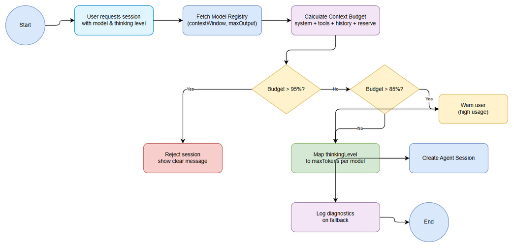

# Business Requirements Document (BRD)

## Pi Context Budget + Model Registry for small-context models — SA4E-324: Pi Context Budget + Model Registry for small-context models

---

## Document Information

| Field | Value |
|-------|-------|
| Jira Ticket | SA4E-324 |
| Title | Pi Context Budget + Model Registry for small-context models |
| Author | BA Agent |
| Version | 1.0 |
| Date | 2026-09-26 |
| Status | Draft |

---

## Author Tracking

| Role | Name - Position | Responsibility |
|------|-----------------|----------------|
| Author | BA Agent – Business Analyst | Create document |
| Peer Reviewer | TBD – Reviewer | Review document |

---

## Revision History

| Version | Date | Author | Changes |
|---------|------|--------|---------|
| 1.0 | 2026-09-26 | BA Agent | Initiate document — auto-generated from Jira ticket SA4E-324 and linked tickets |

---

## Sign-Off

| Name | Signature and date |
|------|--------------------|
| | ☐ I agree and confirm all criteria on this BRD as expected requirements |
| | ☐ I agree and confirm all criteria on this BRD as expected requirements |

---

## 1. Introduction

### 1.1 Scope

Pi harness hiện tại (extension/src/pi-agent/session-configurator.ts, settings-manager.ts) chỉ hỗ trợ 4 models cũ (gpt-4o-mini/gpt-4o/claude-3/claude-3-opus), không biết contextWindow thực tế của model nhỏ (phi-3-mini 2k, smollm2-360m, ollama llama3.1 8k, qwen-coder, lmstudio local) và không đếm token trước createAgentSession.

Scope bao gồm:
* Bổ sung Model Registry: contextWindow, maxOutput, giá/tốc độ cho từng model trong chat-models.ts + SessionConfigurator.
* Tính budget trước session: system (~7500 chars) + tool schema + retrieval + history + reserve 2000; nếu >95% thì reject/re-rank, >85% warn.
* Map thinkingLevel low/medium/high sang maxTokens tương ứng per model.
* Log diagnostics khi fallback model.

Files liên quan: extension/src/pi-agent/session-configurator.ts, settings-manager.ts, chat-panel/chat-models.ts, langgraph/core/context-budget.ts (migrate sang Pi).

### 1.2 Out of Scope

* Thay đổi logic tạo agent core ngoài budget check.
* Hỗ trợ model streaming real-time ngoài scope này.
* Tối ưu chi phí API ngoài registry.

### 1.3 Preliminary Requirement

* Epic SA4E-289 Migrate LangGraph -> Pi SDK phải được khởi tạo.
* Model Registry schema đã được thống nhất với TA.

---

## 2. Business Requirements

### 2.1 High Level Process Map

*[Edit in draw.io](diagrams/business-flow.drawio)*

Người dùng/developer chọn model và thinking level. Hệ thống tra Model Registry để lấy contextWindow, tính tổng context budget từ system prompt, tool schema, retrieval, history và reserve. Nếu vượt ngưỡng 95% thì từ chối, 85-95% cảnh báo, còn lại cho phép tạo session và map maxTokens theo thinking level. Mọi fallback được log diagnostics.

### 2.2 List of User Stories / Use Cases

| # | Story / Use Case / Epic | Priority | Source Ticket |
|---|-------------------------|----------|---------------|
| 1 | As a developer, I want to register small-context models in Model Registry with contextWindow, maxOutput, cost so that session budget can be calculated accurately | MUST HAVE | SA4E-324 |
| 2 | As a Pi Agent user, I want the system to calculate context budget before creating a session so that OOM crashes are prevented | MUST HAVE | SA4E-324 |
| 3 | As a system administrator, I want budget thresholds to block >95% usage with clear message and warn >85% so that risky sessions are controlled | MUST HAVE | SA4E-324 |
| 4 | As a developer, I want thinkingLevel low/medium/high mapped to maxTokens per model so that output size matches model capability | SHOULD HAVE | SA4E-324 |

### 2.3 Details of User Stories

---

#### Business Flow

**Step 1:** User requests agent session with model selection and thinking level.
**Step 2:** System fetches Model Registry for selected model.
**Step 3:** Calculate context budget: system (~7500 chars) + tool schema + retrieval + history + reserve 2000.
**Step 4:** Check threshold >95% → reject; >85% → warn.
**Step 5:** Map thinkingLevel to maxTokens per model.
**Step 6:** Create Agent Session if approved.
**Step 7:** Log diagnostics on fallback.

> **Note:** Budget calculation phải thực hiện trước createAgentSession để tránh OOM.

---

#### STORY 1: Register Model in Model Registry

> As a developer, I want to register small-context models in Model Registry with contextWindow, maxOutput, cost so that session budget can be calculated accurately

**Requirement Details:**

1. Bổ sung Model Registry trong chat-models.ts và SessionConfigurator với các trường contextWindow, maxOutput, cost, speed cho từng model.
2. Hỗ trợ các model nhỏ: phi-3-mini 2k, smollm2-360m, ollama llama3.1 8k, qwen-coder, lmstudio local.

**Data Fields:**

| Field | Type | Required | Description | Example |
|-------|------|----------|-------------|---------|
| modelId | string | Yes | Unique model identifier | phi-3-mini |
| contextWindow | integer | Yes | Max tokens context | 2048 |
| maxOutput | integer | Yes | Max output tokens | 512 |
| costPer1k | float | No | Cost per 1k tokens | 0.0002 |
| speed | string | No | Relative speed | fast |

**Acceptance Criteria:**

1. Model Registry chứa đầy đủ contextWindow cho model nhỏ.
2. SessionConfigurator có thể query registry theo modelId.

**UI Specifications:**

N/A – backend config.

**Validation Rules:**

- contextWindow > 0
- maxOutput <= contextWindow

**Error Handling:**

- Model not found: fallback to default model + log.

---

#### STORY 2: Calculate Context Budget Before Session

> As a Pi Agent user, I want the system to calculate context budget before creating a session so that OOM crashes are prevented

**Requirement Details:**

1. Tính budget trước session: system (~7500 chars) + tool schema + retrieval + history + reserve 2000.
2. Chuyển đổi chars sang tokens theo heuristic.

**Acceptance Criteria:**

1. Small model 2k/8k không crash OOM context khi tạo session.
2. Budget được tính và lưu trong session diagnostics.

**Validation Rules:**

- Reserve tối thiểu 2000 tokens.

**Error Handling:**

- Estimation error → conservative estimate + warn.

---

#### STORY 3: Budget Threshold Warning and Reject

> As a system administrator, I want budget thresholds to block >95% usage with clear message and warn >85% so that risky sessions are controlled

**Requirement Details:**

1. Nếu budget >95% contextWindow → reject session với thông báo rõ ràng.
2. Nếu budget >85% → hiển thị cảnh báo.

**Acceptance Criteria:**

1. Budget >95% bị chặn có thông báo rõ ràng.
2. Người dùng có thể điều chỉnh history/retrieval để giảm budget.

**Error Handling:**

- Reject message phải chỉ ra % usage và gợi ý giảm.

---

#### STORY 4: Map Thinking Level to maxTokens

> As a developer, I want thinkingLevel low/medium/high mapped to maxTokens per model so that output size matches model capability

**Requirement Details:**

1. Map thinkingLevel sang maxTokens tương ứng per model.
2. Lưu mapping trong Model Registry.

**Acceptance Criteria:**

1. Low → maxTokens nhỏ, High → maxTokens lớn, không vượt maxOutput của model.

---

## 3. Dependencies

| Dependency | Type | Related Ticket | Description |
|------------|------|----------------|-------------|
| Pi SDK Migration | System | SA4E-289 | Epic migrate LangGraph -> Pi SDK |
| Model Registry Schema | Internal | SA4E-324 | Cần thống nhất schema trước implement |

---

## 4. Stakeholders

| Role | Name / Team | Responsibility | Source |
|------|-------------|----------------|--------|
| Reporter | Duc Nguyen Minh | Requirement owner | SA4E-324 |
| BA Agent | BA Agent | BRD author | - |
| Dev Team | Pi Agent Team | Implementation | Epic SA4E-289 |

---

## 5. Risks and Assumptions

### 5.1 Risks

| Risk | Impact | Likelihood | Mitigation |
|------|--------|------------|------------|
| Token estimation không chính xác | High | Medium | Dùng conservative heuristic + buffer reserve |
| Model Registry chưa đầy đủ | Medium | Medium | Unit test per model tier, bổ sung dần |
| Performance overhead khi tính budget | Low | Low | Cache registry, tính async |

### 5.2 Assumptions

- ContextWindow của model nhỏ được cung cấp chính xác từ vendor.
- System prompt ~7500 chars ổn định.

---

## 6. Non-Functional Requirements

| Category | Requirement | Details |
|----------|-------------|---------|
| Performance | Budget calculation < 100ms per session | Không ảnh hưởng UX |
| Security | Registry data chỉ đọc trong extension | No external exposure |
| Scalability | Hỗ trợ thêm model mà không sửa code core | Registry-driven |
| Availability | N/A | |

> No specific non-functional requirements identified beyond above.

---

## 7. Related Tickets

| Ticket Key | Summary | Status | Type | Relationship |
|------------|---------|--------|------|--------------|
| SA4E-324 | Pi Context Budget + Model Registry for small-context models | In Progress | Story | Main ticket |
| SA4E-289 | Migrate LangGraph Workflow Engine to Pi SDK (Option C) | - | Epic | Epic parent |

---

## 8. Appendix

### Diagram Index

| # | Diagram | Image | Source (editable) |
|---|---------|-------|-------------------|
| 1 | Use Case Diagram | [use-case.png](diagrams/use-case.png) | [use-case.drawio](diagrams/use-case.drawio) |
| 2 | Business Flow | [business-flow.png](diagrams/business-flow.png) | [business-flow.drawio](diagrams/business-flow.drawio) |

### Glossary

| Term | Definition |
|------|------------|
| Context Budget | Tổng số tokens tiêu thụ ước tính cho một session |
| Model Registry | Bộ đăng ký metadata model: contextWindow, maxOutput, cost |
| Thinking Level | Cấu hình low/medium/high để điều chỉnh maxTokens |

### Reference Documents

| Document | Link / Location |
|----------|-----------------|
| Epic SA4E-289 | Jira SA4E-289 |
| Migration Plan | extension/docs/pi-migration-plan.md |

