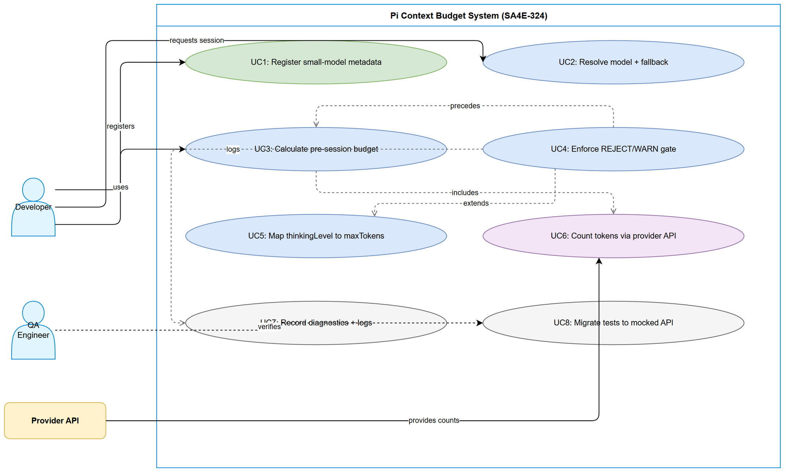
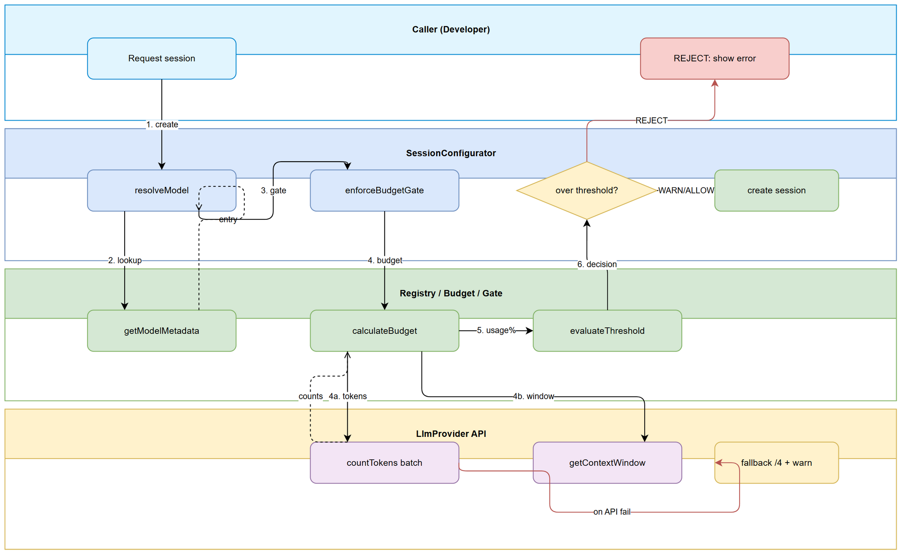

# Business Requirements Document (BRD)

## Pi Context Budget + Model Registry — SA4E-324: Pi Context Budget + Model Registry for small-context models

---

## Document Information

| Field | Value |
|-------|-------|
| Jira Ticket | SA4E-324 |
| Title | Pi Context Budget + Model Registry for small-context models |
| Epic | SA4E-289 — Migrate LangGraph Workflow Engine to Pi SDK (Option C) |
| Author | BA Agent |
| Version | 1.0 |
| Date | 2026-09-26 |
| Status | Draft |

---

## Author Tracking

| Role | Name - Position | Responsibility |
|------|-----------------|----------------|
| Author | BA Agent – Business Analyst | Create document |
| Peer Reviewer | TBD – Tech Lead | Review document |

---

## Revision History

| Version | Date | Author | Changes |
|---------|------|--------|---------|
| 1.0 | 2026-09-26 | BA Agent | Initiate document — from Jira SA4E-324 + Epic SA4E-289 + UG.md + source analysis (session-configurator.ts, settings-manager.ts, context-usage-tracker.ts, context-budget.ts, anthropic/openai/ollama/onnx providers, onnx-tokenizer.ts, llm-provider.ts, chat-models.ts) |

---

## Sign-Off

| Name | Signature and date |
|------|--------------------|
| Product Owner | ☐ I agree and confirm all criteria on this BRD as expected requirements |
| Tech Lead | ☐ I agree and confirm all criteria on this BRD as expected requirements |

---

## 1. Introduction

### 1.1 Scope

This BRD covers Story SA4E-324 under Epic SA4E-289 (Migrate LangGraph Workflow Engine to Pi SDK, Option C — Full Replacement).

The current Pi harness (`extension/src/pi-agent/session-configurator.ts`, `settings-manager.ts`) supports only 4 legacy models (gpt-4o-mini / gpt-4o / claude-3 / claude-3-opus) and does not know the real `contextWindow` of small-context models (phi-3-mini 2k, smollm2-360m, Ollama llama3.1 8k, qwen2.5-coder, LM Studio local model) nor performs a token budget check before `createAgentSession`.

In scope:

1. **Model Registry** for small-context models — `contextWindow`, `maxOutput`, cost/speed metadata per model in `chat-models.ts` + `SessionConfigurator` (`extension/src/pi-agent/model-registry.ts`, `session-configurator.ts`).
2. **Pre-session Context Budget Gate** — estimate `system + toolSchema + retrieval + history + reserve 2000`; if usage `>95%` of `contextWindow` → REJECT (throw `ContextBudgetError`), if `>85%` → WARN (session still created), else ALLOW.
3. **thinkingLevel → maxTokens mapping** — `low / medium / high` mapped to per-model `maxTokens`, always capped at model `maxOutput`.
4. **Diagnostics** — budget, decision, and fallback recorded in `session.diagnostics` and via `logger`.
5. **MANDATORY token-accuracy rule** — all token lengths and context windows MUST come from provider APIs (`LlmProvider.countTokens()` async), NOT hard-coded heuristics. Remove `ceil(len/4)`, `ceil(len/3.5)`, hard-coded `200000 / 128000 / 8192 / 2048`, and `SYSTEM 3500 + STEERING 4000` chars; only fallback to `/4` on API failure with `warn` log. Batch one call for arrays.
6. **Mandatory test-scope migration** — convert all hard-coded-number assertions to mocked-API assertions; add per-provider `countTokens` contract tests + fallback + batch tests.

Source: SA4E-324 description + 5 Acceptance Criteria, `documents/SA4E-324/UG.md`, and source files listed in the ticket.

### 1.2 Out of Scope

- Full Pi SDK migration itself (Pi Provider, Executor, Phase Router, State/Checkpointer adapters, Human Approval) — covered by Epic SA4E-289, not this story.
- Deletion of LangGraph engine code (LangGraph cleanup is a separate ticket under the Epic).
- LLM inference quality tuning for small models beyond budget math.
- Chat-panel UI redesign — only budget error/warning messages; no new end-user screens.
- Cost billing / quota enforcement — registry cost metadata is for routing/display only.

### 1.3 Preliminary Requirement

- Pi SDK (`@earendil-works/pi-agent-core`) installed; `SessionManager.inMemory(cwd)` + `createAgentSession` available.
- `LlmProvider` interface (`extension/src/langgraph/core/llm-provider.ts`) extensible — new `countTokens(texts: string[]): Promise<number[]>` can be added without breaking providers.
- API/file access for token truth: Anthropic `POST /v1/messages/count_tokens` + `GET /v1/models`; OpenAI-compatible `GET /v1/models` (`context_length`, `meta.n_ctx`) + `POST /tokenize`; Ollama `POST /api/show` (`model_info.context_length`) + `prompt_eval_count` from `/api/chat`; ONNX `tokenizer.json` on disk under `.code-intel/models/llm/{modelId}/`.
- Existing suites runnable (`providers/__tests__`, `token-counter`, `context-usage-tracker`, `context-budget`, `prompt-template-tiers`, e2e); CI must stay green.

---

## 2. Business Requirements

### 2.1 High Level Process Map

The pre-session budget gate runs synchronously inside `SessionConfigurator.createAgentSession` BEFORE any Pi SDK session is created. It resolves the requested model via the Registry (fallback to default + warn), obtains the real `contextWindow` (denominator) and real token counts (numerator) from provider APIs, computes `usagePercent`, applies the Threshold Gate (REJECT / WARN / ALLOW), maps `thinkingLevel` to `maxTokens`, and either throws a clear `ContextBudgetError` or creates the session with diagnostics attached.

*[Edit in draw.io](diagrams/use-case.drawio)*

*[Edit in draw.io](diagrams/business-flow.drawio)*

### Diagram Index

| # | Diagram | Image | Source (editable) |
|---|---------|-------|-------------------|
| 1 | Use Case Diagram | [use-case.png](diagrams/use-case.png) | [use-case.drawio](diagrams/use-case.drawio) |
| 2 | Business Flow (Swimlane) | [business-flow.png](diagrams/business-flow.png) | [business-flow.drawio](diagrams/business-flow.drawio) |

### 2.2 List of User Stories / Use Cases

| # | Story / Use Case / Epic | Priority | Source Ticket |
|---|-------------------------|----------|---------------|
| 1 | As a Developer, I want a Model Registry for small-context models so that sessions use the correct contextWindow and maxOutput per model | MUST HAVE | SA4E-324 |
| 2 | As a Developer, I want a pre-session Context Budget Gate (REJECT >95%, WARN >85%) so that small models never crash with OOM | MUST HAVE | SA4E-324 |
| 3 | As a Developer, I want thinkingLevel (low/medium/high) mapped to per-model maxTokens so that reasoning effort fits each model | SHOULD HAVE | SA4E-324 |
| 4 | As a Platform Engineer, I want all token lengths and context windows sourced from provider APIs (never hard-coded) so that budget math is accurate per model | MUST HAVE | SA4E-324 |
| 5 | As a QA Engineer, I want the test scope migrated to mocked-API + contract tests (countTokens, fallback, batch) so that CI validates real API behavior | MUST HAVE | SA4E-324 |

---

### 2.3 Details of User Stories

---

#### Business Flow

**Step 1:** Caller invokes `SessionConfigurator.createAgentSession(sdk, cwd, { model, thinkingLevel, contextBudget })` with budget inputs (`systemPromptChars` or pre-counted tokens, `toolSchemaTokens`, `retrievalTokens`, `historyTokens`).

**Step 2:** `resolveModel(model)` looks up `ModelRegistry`; if missing, falls back to `DEFAULT_MODEL_ID` and records `fallbackFrom` for diagnostics + `warn` log (`Model not found, using default`).

**Step 3:** Numerator — token counts for system / tools / retrieval / history obtained via `LlmProvider.countTokens(texts[])` (single batched async call per provider). Only on API failure: fallback `ceil(len/4)` with `warn` log (`conservative estimate used`).

**Step 4:** Denominator — `contextWindow` obtained from provider API per model (Anthropic `count_tokens`/`models`, OpenAI `models` `context_length`/`meta.n_ctx`, Ollama `api/show` `model_info.context_length`, ONNX `tokenizer.json` + registry `contextLength`).

**Step 5:** `BudgetCalculator.calculateBudget(contextWindow, inputs)` computes `estimatedTokens = system + toolSchema + retrieval + history + reserve (2000 min)` and `usagePercent = estimatedTokens / contextWindow * 100`.

**Step 6:** `ThresholdGate.evaluate(usagePercent)` returns REJECT (>95%), WARN (>85%), else ALLOW with human-readable message.

**Step 7a (REJECT):** Log `error`, throw `ContextBudgetError(message, budget)` — no Pi session created; caller surfaces clear message (reduce history/retrieval/system or switch to larger model).

**Step 7b (WARN/ALLOW):** Log `warn` if WARN; map `thinkingLevel` via `ThinkingLevelMapper` (capped at `maxOutput`); build session config `{ model, thinkingLevel, maxTokens, scopedModels, modelRuntime }`; attach `diagnostics { model, fallbackFrom, contextWindow, maxTokens, estimatedTokens, usagePercent, decision }`; call `sdk.createAgentSession`.

> **Note:** phi-3-mini (2k) / smollm2-360m with default `systemPromptChars ~7500` will ALWAYS REJECT by design (fail-safe against OOM). Users must reduce system/history or choose an 8k+ model. Reserve 2000 is a mandatory minimum and cannot be lowered.

---

#### STORY 1: Model Registry for small-context models

> As a Developer, I want a Model Registry for small-context models so that sessions use the correct contextWindow and maxOutput per model

**Requirement Details:**

1. Extend `chat-models.ts` + `SessionConfigurator` / `model-registry.ts` with metadata per model: `modelId` (unique), `contextWindow` (>0), `maxOutput` (<= contextWindow), `costPer1k`, `speed`, `thinkingMap`. Seed entries: `gpt-4o-mini`, `gpt-4o`, `claude-3`, `claude-3-opus` (legacy) + `phi-3-mini` (2048), `smollm2-360m` (~1024–2048), `llama3.1` (8192), `qwen2.5-coder`, `local-model` (LM Studio, auto-detect). Source: SA4E-324 + UG.md §1.
2. `SessionConfigurator.getModelMetadata(modelId)` returns the entry; `DEFAULT_MODEL_REGISTRY.listModels()` enumerates IDs; `SUPPORTED_MODELS` derived from registry. Invalid entries (violating `contextWindow > 0`, `maxOutput <= contextWindow`, duplicate `modelId`, `thinkingMap <= maxOutput`) are rejected from the registry with `warn` log.
3. Unknown `modelId` → fallback to `DEFAULT_MODEL_ID` with `warn` (`Model not found, using default`) and `diagnostics.fallbackFrom` set; never crash on unknown model at resolve time (crash only via budget REJECT if applicable).

**Data Fields (if applicable):**

| Field | Type | Required | Description | Example |
|-------|------|----------|-------------|---------|
| modelId | string | Yes | Unique registry key | `phi-3-mini` |
| contextWindow | number | Yes | Real context window (tokens, from API; >0) | `2048` |
| maxOutput | number | Yes | Max generation tokens (<= contextWindow) | `512` |
| costPer1k | number | No | Relative cost metadata for routing | `0.15` |
| speed | string | No | Speed tier metadata | `fast` |
| thinkingMap | object | Yes | low/medium/high → maxTokens (each <= maxOutput) | `{ low: 128, medium: 256, high: 512 }` |
| fallbackFrom | string | No | Original requested ID when fallback occurred (diagnostics) | `unknown-model-x` |

**Acceptance Criteria:**

1. Registry contains all 9+ seed models with correct `contextWindow`/`maxOutput` (phi-3-mini 2k, smollm2 1k–2k, llama3.1 8k, qwen-coder, lmstudio local) — verified via `listModels()` / `getModelMetadata`.
2. Invalid entries are excluded with `warn` log; `modelId` uniqueness enforced.
3. Unknown model falls back to default with `warn` + `diagnostics.fallbackFrom` (no silent misrouting).

**UI Specifications (if applicable):**

| No. | Name | Type | Required | Description | Note |
|-----|------|------|----------|-------------|------|
| — | (No new UI) | — | — | Registry is code-level; model dropdown reuses existing chat-panel catalog | See `chat-models.ts` static catalog as fallback when gateway unreachable |

**Validation Rules (if applicable):**

- `contextWindow > 0`, else reject entry.
- `maxOutput <= contextWindow`, else reject entry.
- `modelId` unique, else reject duplicate.
- Every `thinkingMap` value `<= maxOutput`, else reject entry.

**Error Handling (if applicable):**

- Unknown model: warn + fallback to default (not throw at resolve; throw only if default itself unavailable).
- Invalid registry entry: exclude + `warn` log with reason; registry remains usable.

---

#### STORY 2: Pre-session Context Budget Gate

> As a Developer, I want a pre-session Context Budget Gate (REJECT >95%, WARN >85%) so that small models never crash with OOM

**Requirement Details:**

1. Before `createAgentSession`, compute `estimatedTokens = system + toolSchema + retrieval + history + reserve (2000 minimum, constant `MIN_RESERVE_TOKENS`)`. Inputs via `ContextBudgetInputs { systemPromptChars, toolSchemaTokens, retrievalTokens, historyTokens }`; invalid inputs (NaN/negative) → conservative estimate + `warn` (`conservative estimate used`). Source: SA4E-324 + UG.md §2–§3.
2. `usagePercent = estimatedTokens / contextWindow * 100`. Thresholds: `REJECT_THRESHOLD_PERCENT = 95`, `WARN_THRESHOLD_PERCENT = 85` (constants in `model-registry.ts` / budget module per UG.md §3).
3. REJECT → `logger.error` + throw `ContextBudgetError(message, budget)`; no session created; message must state usage% and suggest reducing history/retrieval/system or switching model. WARN → `logger.warn` + session created. ALLOW → session created silently (diagnostics still recorded).
4. Diagnostics persisted: `session.diagnostics { model, fallbackFrom?, contextWindow, maxTokens, estimatedTokens, usagePercent (1 decimal), decision }` and passed into `sdk.createAgentSession({ cwd, sessionManager, diagnostics, ...config })`.

**Data Fields (if applicable):**

| Field | Type | Required | Description | Example |
|-------|------|----------|-------------|---------|
| systemPromptChars | number | No | System prompt length (chars; counted via API, default 7500 fallback) | `7500` |
| toolSchemaTokens | number | No | Tool schema tokens (via countTokens on serialized tools) | `500` |
| retrievalTokens | number | No | Retrieval/RAG tokens | `300` |
| historyTokens | number | No | Conversation history tokens | `200` |
| reserveTokens | number | No | Reserved for output (min 2000, cannot be lowered) | `2000` |
| estimatedTokens | number | Yes (output) | Sum of above | `4575` |
| usagePercent | number | Yes (output) | estimated / contextWindow * 100 | `223.4` |
| decision | enum | Yes (output) | ALLOW / WARN / REJECT | `REJECT` |

**Acceptance Criteria:**

1. Small model 2k/8k does not crash OOM on session creation (SA4E-324 AC #1) — over-budget sessions are rejected pre-creation.
2. Budget >95% is blocked with a clear message (SA4E-324 AC #2) — `ContextBudgetError` message contains usage% and threshold.
3. WARN (>85%) still creates the session but logs `warn`; ALLOW creates silently; all three record `diagnostics`.
4. `systemPromptChars ~7500` on phi-3-mini/smollm2 always REJECTs (fail-safe documented in UG.md §2).

**Validation Rules (if applicable):**

- `reserveTokens >= 2000` enforced (`MIN_RESERVE_TOKENS`); lower values clamped to 2000.
- Negative/NaN budget inputs → conservative estimate + `warn`, never negative totals.
- `REJECT (95) > WARN (85)` invariant; thresholds are constants, not per-call params (per-instance override only via new `ModelRegistry`/`BudgetCalculator` instances per UG.md §3).

**Error Handling (if applicable):**

- REJECT: throw `ContextBudgetError`; caller must surface message; suggest remediation (reduce history/retrieval/system or larger model).
- Budget estimation error: `warn` (`Context budget estimation error - conservative estimate used`) and continue with conservative numbers.

---

#### STORY 3: thinkingLevel → maxTokens mapping

> As a Developer, I want thinkingLevel (low/medium/high) mapped to per-model maxTokens so that reasoning effort fits each model

**Requirement Details:**

1. `SessionConfigurator.mapThinkingLevel(modelId, level)` delegates to `ThinkingLevelMapper` backed by the registry `thinkingMap`; result always `<= maxOutput` of the model (BR-08 per UG.md §1).
2. `buildSessionConfig` defaults `thinkingLevel` to `medium` when omitted; `validateThinkingLevel` throws on values outside `low/medium/high`.
3. Example: `mapThinkingLevel('qwen2.5-coder', 'high') → 1024` (capped at that model's `maxOutput`).

**Data Fields (if applicable):**

| Field | Type | Required | Description | Example |
|-------|------|----------|-------------|---------|
| thinkingLevel | enum | No (default medium) | Requested reasoning effort | `high` |
| maxTokens | number | Yes (output) | Mapped output budget (<= maxOutput) | `1024` |

**Acceptance Criteria:**

1. `low/medium/high` each map to the correct per-model value; unknown level throws `Invalid thinkingLevel`.
2. Mapped value never exceeds the model's `maxOutput`.
3. Default when omitted is `medium`.

**Validation Rules (if applicable):**

- `thinkingLevel ∈ {low, medium, high}`; other values throw.
- Output `maxTokens <= maxOutput`; capping is mandatory, not best-effort.

**Error Handling (if applicable):**

- Invalid level: throw `Error('Invalid thinkingLevel ... Must be low/medium/high')` before any session creation.

---

#### STORY 4: API-based token counting (mandatory accuracy rule)

> As a Platform Engineer, I want all token lengths and context windows sourced from provider APIs (never hard-coded) so that budget math is accurate per model

**Requirement Details:**

1. Add `LlmProvider.countTokens(texts: string[]): Promise<number[]>` (async, batched — 1 call for the whole array to reduce roundtrips). Replace: `estimateTokens ceil(len/4)` in `chat-panel/context-usage-tracker.ts:119` and `ceil(len/3.5)` in `langgraph/core/context-budget.ts:11` (plus `+4` per-message overhead must be re-validated against API counts, not kept as magic). Source: SA4E-324 mandatory rule.
2. Remove hard-coded context windows: Anthropic `200000` (`anthropic-provider.ts:27`), OpenAI `8192/128000` (`openai-provider.ts:28`), Ollama `8192` (`ollama-provider.ts:23`), ONNX `2048` (`onnx-provider.ts:40`). Replace with per-provider API truth:
   - Anthropic: `POST /v1/messages/count_tokens` (+ `GET /v1/models` for window).
   - OpenAI / LM Studio / llama-server: `GET /v1/models` (`context_length`, `meta.n_ctx`) + `POST /tokenize`.
   - Ollama: `POST /api/show` (`model_info.context_length`) + `prompt_eval_count` from `/api/chat`.
   - ONNX: load real `tokenizer.json` (replace `split(/\s+/)` heuristic in `onnx-tokenizer.ts`).
3. Remove hard-coded `SYSTEM 3500 + STEERING 4000` chars in `chat-panel-provider.ts:59-60`; count real content via `countTokens`.
4. Fallback policy: ONLY on API failure → `ceil(len/4)` with `warn` log; never as primary path. All call sites (`BaseLlmProvider`, `context-budget`, `context-usage-tracker`) must follow this policy.
5. Touch list (authoritative): `langgraph/core/llm-provider.ts` (add `countTokens`), `langgraph/core/context-budget.ts`, `langgraph/providers/BaseLlmProvider.ts`, `anthropic/openai/ollama/onnx-provider.ts`, `onnx-tokenizer.ts` (migrate to Pi), `chat-panel/context-usage-tracker.ts`, `chat-panel/chat-panel-provider.ts`, `chat-panel/chat-models.ts`, `pi-agent/session-configurator.ts`, `settings-manager.ts`.

**Data Fields (if applicable):**

| Field | Type | Required | Description | Example |
|-------|------|----------|-------------|---------|
| texts | string[] | Yes | Input batch for counting | `["hello", "world"]` |
| tokenCounts | number[] | Yes (output) | Per-text counts, same order/length | `[1, 1]` |
| contextWindow | number | Yes (output) | Per-model window from API | `8192` |
| fallbackUsed | boolean | Yes (output/log) | True only when API failed | `false` |

**Acceptance Criteria:**

1. Numerator + denominator of `% usage` both come from per-model APIs (SA4E-324 AC #3).
2. No remaining `len/4`, `len/3.5`, `200000`, `128000` hard-coded primaries in code (only API-failure fallback) — verifiable by grep.
3. Batch: 1 API call per array (not N calls).
4. API failure → fallback `/4` + `warn` log; success path never logs fallback.

**Validation Rules (if applicable):**

- `countTokens` preserves input order and length (`output.length === input.length`).
- Empty string → `0` (no API call required).
- `contextWindow > 0` after API resolution; `0`/unknown means "unknown", not a valid budget denominator — callers must treat as error/conservative, not divide-by-zero.

**Error Handling (if applicable):**

- API timeout/error → `warn` + fallback `/4` (single policy, consistent message).
- `tokenizer.json` missing/corrupt (ONNX) → provider `isAvailable() = false` path; surface clear load error, do not silently use `split`.

---

#### STORY 5: Test-scope migration to mocked-API + contract tests

> As a QA Engineer, I want the test scope migrated to mocked-API + contract tests (countTokens, fallback, batch) so that CI validates real API behavior

**Requirement Details:**

1. `providers/__tests__`: `anthropic-provider.test.ts:40 (=200000)`, `ollama-provider.test.ts:79 (=8192)`, `onnx-provider.test.ts:75 (=2048)`, `openai-provider.test.ts:224 (=128000)` → mock APIs (`GET /v1/models`, `POST /api/show`, `POST /v1/messages/count_tokens`) then assert `getContextWindow()` equals the mocked API value (not the old constant). Source: SA4E-324 test scope.
2. Heuristic-assert suites → mock `provider.countTokens` + add API-fail case asserting fallback `/4` + `warn`: `token-counter.test.ts:72-77`, `conversation-manager.test.ts:57`, `context-usage-tracker.test.ts:80,210`, `pi-agent/__tests__/context-budget.test.ts:25`, `prompt-template-tiers.test.ts:138 (len/4)`.
3. Mock-compat suites keep `getContextWindow` mocks but ADD matching `countTokens` mocks: `chat-panel-e2e.test.ts:541-543`, `chat-graph-diagnostics.integration.test.ts:334,345`, `chat-graph-agent-step.test.ts:33 (mockReturnValue 200000/8000)`.
4. New tests: per-provider `countTokens` contract tests + batch-array test + fallback test; expand `model-registry.test.ts`, `session-configurator.budget.test.ts`, `session-compactor.test.ts` from constants to mocked APIs.
5. Gate: full CI green (SA4E-324 AC #5); no remaining hard-coded-number asserts.

**Data Fields (if applicable):**

| Field | Type | Required | Description | Example |
|-------|------|----------|-------------|---------|
| mockedContextWindow | number | Yes (test fixture) | API-returned window | `8192` |
| mockedTokenCount | number[] | Yes (test fixture) | API-returned counts | `[5, 7]` |
| apiFailure | boolean | Yes (test case) | Simulate API down | `true` |

**Acceptance Criteria:**

1. Unit tests per model tier + integration test `countTokens` vs real API shape (SA4E-324 AC #4).
2. All legacy hard-coded asserts migrated to mocked-API asserts; new contract + fallback + batch tests exist.
3. CI green (SA4E-324 AC #5).

**UI Specifications (if applicable):**

- No UI; test-only story.

**Validation Rules (if applicable):**

- Every migrated test asserts against the mocked API return value, not a pasted constant.
- Fallback tests assert BOTH the `/4` value AND the `warn` log.

**Error Handling (if applicable):**

- Test API-failure injection must not leak into other tests (reset mocks per test).

---

## 3. Dependencies

| Dependency | Type | Related Ticket | Description |
|------------|------|----------------|-------------|
| Epic SA4E-289 (Pi SDK migration, Option C) | System | SA4E-289 | Parent epic; budget/registry rides on Pi harness (`session-configurator`, `settings-manager`); phases (Executor, Router, Checkpointer) must not break budget gate |
| Pi SDK `@earendil-works/pi-agent-core` | External | SA4E-289 | `SessionManager.inMemory` + `createAgentSession` contract; diagnostics passthrough |
| Anthropic API (`count_tokens`, `models`) | External | SA4E-324 | Numerator + denominator for Anthropic models; key/config via `getApiKey` |
| OpenAI-compatible `models` + `tokenize` (cloud / LM Studio / llama-server) | External | SA4E-324 | `context_length` / `meta.n_ctx` + tokenize endpoint; local auto-detect (`local-model`) |
| Ollama `api/show` + `api/chat` | External | SA4E-324 | `model_info.context_length` + `prompt_eval_count` |
| ONNX `tokenizer.json` files on disk | Infrastructure | SA4E-324 | `.code-intel/models/llm/{modelId}/tokenizer.json`; `onnxruntime-node` for inference |
| `chat-models.ts` static catalog | System | SA4E-324 | Fallback when gateway unreachable; must stay consistent with registry |
| CI test infrastructure | Infrastructure | SA4E-324 | All suites in test scope must run green after mock migration |

---

## 4. Stakeholders

| Role | Name / Team | Responsibility | Source |
|------|-------------|----------------|--------|
| Reporter | Duc Nguyen Minh | Requirement owner, Epic/Story author | SA4E-324 reporter; SA4E-289 creator |
| Extension Team | VS Code extension team | Implement registry, budget gate, provider countTokens | Ticket files (pi-agent, chat-panel, langgraph) |
| QA | QA team | Migrate tests to mocked-API + contract/fallback/batch; CI green | SA4E-324 test scope |
| End users (Developers) | Extension users with small/local models | Benefit: no OOM; clear REJECT/WARN messages | AC #1–#2 |

---

## 5. Risks and Assumptions

### 5.1 Risks

| Risk | Impact | Likelihood | Mitigation |
|------|--------|------------|------------|
| Provider token APIs unavailable/slow (network, local server down) | High (budget blocked or inaccurate) | Medium | Mandatory fallback `/4` + `warn`; batch to 1 call; timeout (5s pattern per existing `detectContextWindow`); `isAvailable` checks |
| API token counts differ across providers (Anthropic vs tiktoken vs Ollama vs ONNX) | Medium (cross-model % not strictly comparable) | High | Always use the SAME provider's counter + window for that session (numerator/denominator consistency = AC #3); document per-provider semantics |
| Small models (2k) reject default 7500-char system prompt, hurting adoption | Medium (users confused by constant REJECT) | High | Documented fail-safe in UG + error message guidance (reduce system/history or use 8k+); consider slim system prompt profile for 2k tier (out of scope, note as follow-up) |
| Hard-coded remnants missed (`len/4`, `len/3.5`, constants) | High (AC #3 failure) | Medium | Grep gate in review/CI; explicit file:line checklist in §8.1 |
| Test migration incomplete (stale hard-coded asserts) | Medium (false-green CI) | Medium | File:line checklist in §8.1; contract + fallback + batch tests mandatory; CI must run full scope |
| ONNX `tokenizer.json` missing/corrupt or `split` heuristic left in place | Medium (wrong counts for phi-3/smollm2) | Medium | Real `tokenizer.json` load; `isAvailable=false` when missing; no silent `split` fallback except API-fail path with warn |

### 5.2 Assumptions

- Reserve 2000 tokens is sufficient for Pi session overhead across all registered models.
- Thresholds 95% (REJECT) / 85% (WARN) are constants; per-model tuning is future work.
- `thinkingMap` values supplied by model owners are sane (each <= maxOutput); invalid entries are rejected, not auto-clamped.
- Provider APIs used for counting are the same tokenizers used for inference (counts match billed/context reality).
- Batch `countTokens` has no ordering/length side effects.

---

## 6. Non-Functional Requirements

| Category | Requirement | Details |
|----------|-------------|---------|
| Performance | Budget gate overhead negligible | `countTokens` batched (1 call/array); API timeout ~5s (existing pattern); no per-message roundtrips; gate runs pre-session only, not per-token |
| Performance | Local counting fast | ONNX `tokenizer.json` loaded once and reused; no re-read per call |
| Reliability | Fail-safe against OOM | REJECT >95% is fail-closed (no session); WARN >85% is fail-open with log; fallback `/4` only on API failure with warn — never silent |
| Reliability | Fallback consistency | Single fallback formula `ceil(len/4)` + single warn message pattern across all providers/call sites |
| Security | API keys never logged | `getApiKey` values excluded from diagnostics/logs; only model IDs, counts, percents logged |
| Security | Local files guarded | `tokenizer.json` read from workspace-scoped `.code-intel/models/llm/{modelId}/`; path traversal guarded |
| Maintainability | No magic numbers | Zero hard-coded `len/4`, `len/3.5`, `200000`, `128000`, `8192`, `2048`, `3500`, `4000` as primary logic (grep-verifiable); constants only for thresholds/reserve with names (`MIN_RESERVE_TOKENS`, `REJECT_THRESHOLD_PERCENT`, `WARN_THRESHOLD_PERCENT`) |
| Observability | Diagnostics on every session | `diagnostics { model, fallbackFrom?, contextWindow, maxTokens, estimatedTokens, usagePercent, decision }` + `logger.warn/error` on fallback/WARN/REJECT with model + percent |
| Compatibility | Provider parity | All 4 provider families (Anthropic, OpenAI-compatible, Ollama, ONNX) implement `countTokens` + window detection; `BaseLlmProvider` shares fallback/timeout behavior |

### 6.1 Token-API NFR (mandatory — accuracy of numerator + denominator)

| Provider | Context-window source (denominator) | Token-count source (numerator) | NFR |
|----------|-------------------------------------|--------------------------------|-----|
| Anthropic | `GET /v1/models` (window) | `POST /v1/messages/count_tokens` (per-text, batched) | Counts must use the same model ID as the session; auth via existing `getApiKey`; failures → fallback `/4` + warn |
| OpenAI / LM Studio / llama-server | `GET /v1/models`: `context_length`, else `meta.n_ctx` (existing `detectContextWindow` pattern) | `POST /tokenize` (batched) | Auto-detect `local-model` first ID; cloud defaults (`128000`) REMOVED as primary — only API value or (on failure) fallback; 5s timeout |
| Ollama | `POST /api/show`: `model_info.context_length` (existing `detectContextWindow` pattern) | `prompt_eval_count` from `/api/chat` semantics, exposed via `countTokens` batch | `8192` default REMOVED as primary; `llama.context_length` alias supported; local, no key |
| ONNX (phi-3-mini, smollm2) | Registry `contextLength` validated against `tokenizer.json` vocab (2048 tier) | Real `tokenizer.json` encode (replace `split(/\s+/)` + char-fallback in `onnx-tokenizer.ts`) | `2048` constant REMOVED as primary; missing/corrupt tokenizer → unavailable with clear error, not silent heuristic |
| Shared (`BaseLlmProvider`, `context-budget`, `context-usage-tracker`) | `getContextWindow()` returns API value; `0` = unknown (never divide) | `countTokens(texts[])` order/length-preserving; empty → 0 without API call | ONE fallback (`ceil(len/4)`) + ONE warn pattern; batch = 1 call; `SYSTEM 3500 + STEERING 4000` chars REMOVED — real `countTokens` on real content |

---

## 7. Related Tickets

| Ticket Key | Summary | Status | Type | Relationship |
|------------|---------|--------|------|--------------|
| SA4E-324 | Pi Context Budget + Model Registry for small-context models | In Progress | Story | Main ticket (this BRD) |
| SA4E-289 | Migrate LangGraph Workflow Engine to Pi SDK (Option C) | In Progress | Epic | Parent epic |

---

## 8. Appendix

### 8.1 Mandatory Test Scope (from SA4E-324 — must all be executed, no hard-coded asserts retained)

**A. `providers/__tests__` — window from mocked API (not constants):**

- `anthropic-provider.test.ts:40 (=200000)` → mock `POST /v1/messages/count_tokens` + `GET /v1/models`, assert `getContextWindow()` == mocked value.
- `ollama-provider.test.ts:79 (=8192)` → mock `POST /api/show`, assert == mocked `model_info.context_length`.
- `onnx-provider.test.ts:75 (=2048)` → mock `tokenizer.json` load, assert == mocked `contextLength`.
- `openai-provider.test.ts:224 (=128000)` → mock `GET /v1/models` (`context_length` / `meta.n_ctx`), assert == mocked value.

**B. Heuristic-assert suites → mock `countTokens` + API-fail fallback case (`/4` + warn):**

- `token-counter.test.ts:72-77`, `conversation-manager.test.ts:57`, `context-usage-tracker.test.ts:80,210`, `pi-agent/__tests__/context-budget.test.ts:25`, `prompt-template-tiers.test.ts:138 (len/4)`.

**C. Mock-compat suites — keep `getContextWindow` mocks, ADD matching `countTokens` mocks:**

- `chat-panel-e2e.test.ts:541-543`, `chat-graph-diagnostics.integration.test.ts:334,345`, `chat-graph-agent-step.test.ts:33 (mockReturnValue 200000/8000)`.

**D. New tests (mandatory):**

- Per-provider `countTokens` contract tests (Anthropic / OpenAI / Ollama / ONNX).
- Batch test: 1 call for N-text array, order/length preserved.
- Fallback test: API fail → `ceil(len/4)` + `warn` asserted.
- Expand `model-registry.test.ts`, `session-configurator.budget.test.ts`, `session-compactor.test.ts` from constants to mocked APIs.

**E. Gate:** CI green with zero remaining hard-coded-number asserts (SA4E-324 AC #5).

### Glossary (if applicable)

| Term | Definition |
|------|------------|
| Model Registry | Per-model metadata store (`modelId`, `contextWindow`, `maxOutput`, cost/speed, `thinkingMap`); source of denominator + `maxTokens` mapping |
| Context Budget | Pre-session estimate `system + toolSchema + retrieval + history + reserve(2000)` in tokens |
| Threshold Gate | REJECT (>95%) / WARN (>85%) / ALLOW decision on `usagePercent` |
| countTokens | Async batched provider API returning per-text token counts (`texts[] → number[]`) |
| ContextBudgetError | Thrown on REJECT; carries message + budget; blocks `createAgentSession` |
| thinkingLevel | `low / medium / high` → per-model `maxTokens` (capped at `maxOutput`) |
| Fallback | `ceil(len/4)` used ONLY when token API fails, always with `warn` log |
| Diagnostics | `session.diagnostics` recording model, fallback, window, tokens, percent, decision |

### Reference Documents

| Document | Link / Location |
|----------|-----------------|
| Jira SA4E-324 | `https://jiraassist.atlassian.net/browse/SA4E-324` |
| Epic SA4E-289 | `https://jiraassist.atlassian.net/browse/SA4E-289` |
| User Guide (existing, reference only — BRD is requirements view, not a copy) | `documents/SA4E-324/UG.md` |
| Session Configurator | `extension/src/pi-agent/session-configurator.ts` |
| Settings Manager | `extension/src/pi-agent/settings-manager.ts` |
| Chat Model Catalog | `extension/src/chat-panel/chat-models.ts` |
| Context Usage Tracker (heuristic to remove :119) | `extension/src/chat-panel/context-usage-tracker.ts` |
| Context Budget (heuristic to remove :11) | `extension/src/langgraph/core/context-budget.ts` |
| Provider Interface (add countTokens) | `extension/src/langgraph/core/llm-provider.ts` |
| Providers (remove hard-coded windows) | `extension/src/langgraph/providers/anthropic-provider.ts`, `openai-provider.ts`, `ollama-provider.ts`, `onnx-provider.ts`, `onnx-tokenizer.ts`, `BaseLlmProvider.ts` |
