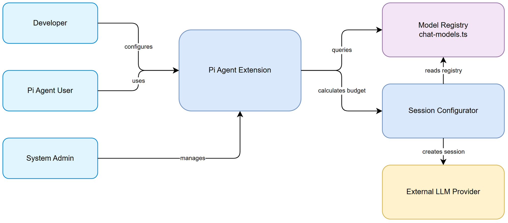
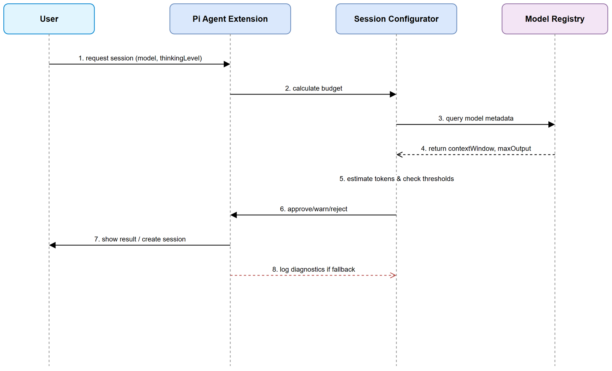

# Functional Specification Document (FSD)

## Pi Context Budget + Model Registry for small-context models — SA4E-324: Pi Context Budget + Model Registry for small-context models

---

## Document Information

| Field | Value |
|-------|-------|
| Jira Ticket | SA4E-324 |
| Title | Pi Context Budget + Model Registry for small-context models |
| Author | BA Agent |
| Version | 1.0 |
| Date | 2026-09-26 |
| Status | Draft |
| Related BRD | documents/SA4E-324/BRD.md |

---

## Revision History

| Version | Date | Author | Changes |
|---------|------|--------|---------|
| 1.0 | 2026-09-26 | BA Agent | Initiate document — auto-generated from BRD and Jira tickets |

---

## 1. Introduction

### 1.1 Purpose

This FSD specifies functional behavior for Pi Context Budget + Model Registry for small-context models. It details how Model Registry stores metadata for small-context models, how context budget is calculated before agent session creation, how thresholds trigger warnings/rejects, and how thinkingLevel maps to maxTokens per model.

### 1.2 Scope

Reference BRD scope: bổ sung Model Registry with contextWindow/maxOutput/cost/speed; tính budget trước session; map thinkingLevel to maxTokens; log diagnostics on fallback.

Technical clarifications:
- Budget calculation uses heuristic chars→tokens conversion
- Registry is read-only at runtime, updated via code change in chat-models.ts and SessionConfigurator
- No change to core agent creation logic beyond budget gate

### 1.3 Definitions & Acronyms

| Term | Definition |
|------|------------|
| Context Budget | Tổng số tokens tiêu thụ ước tính cho một session |
| Model Registry | Bộ đăng ký metadata model: contextWindow, maxOutput, cost |
| Thinking Level | Cấu hình low/medium/high để điều chỉnh maxTokens |

### 1.4 References

| Document | Location |
|----------|----------|
| BRD | documents/SA4E-324/BRD.md |
| Epic SA4E-289 | Jira SA4E-289 |

---

## 2. System Overview

### 2.1 System Context Diagram



*[Edit in draw.io](diagrams/system-context.drawio)*

System interacts with Developer, Pi Agent User, System Admin actors. Core components: Pi Agent Extension, Session Configurator, Model Registry in chat-models.ts, External LLM Provider.

### 2.2 System Architecture

Pi Agent Extension hosts SessionConfigurator and settings-manager. SessionConfigurator queries Model Registry defined in chat-models.ts. Budget calculation module estimates tokens from system prompt, tool schema, retrieval, history and reserve. Threshold logic gates createAgentSession. Mapping table translates thinkingLevel to maxTokens per model.

---

## 3. Functional Requirements

### 3.1 Feature: Model Registry for small-context models

**Source:** BRD Story 1 SA4E-324

#### 3.1.1 Description
Đăng ký các model nhỏ với metadata contextWindow, maxOutput, costPer1k, speed để tính budget chính xác.

#### 3.1.2 Use Case

**Use Case ID:** UC-01
**Actor:** Developer
**Preconditions:** Model Registry schema thống nhất
**Postconditions:** Model được query được bởi SessionConfigurator

**Main Flow:**

| Step | Actor | System | Description |
|------|-------|--------|-------------|
| 1 | Developer | | Add model entry in chat-models.ts |
| 2 | | SessionConfigurator | Load registry on start |
| 3 | | SessionConfigurator | Query by modelId for session creation |

**Alternative Flows:**

| ID | Condition | Steps |
|----|-----------|-------|
| AF-1 | Model not found | Fallback to default model + log diagnostics |

**Exception Flows:**

| ID | Condition | Steps |
|----|-----------|-------|
| EF-1 | Invalid metadata | Reject entry, validation error |

#### 3.1.3 Business Rules

| Rule ID | Rule | Source |
|---------|------|--------|
| BR-01 | contextWindow > 0 | BRD Story 1 Validation |
| BR-02 | maxOutput <= contextWindow | BRD Story 1 Validation |
| BR-03 | ModelId unique | BRD Story 1 |

#### 3.1.4 Data Specifications

**Input Data:**

| Field | Type | Required | Validation | Description |
|-------|------|----------|------------|-------------|
| modelId | string | Y | unique | Unique model identifier |
| contextWindow | integer | Y | >0 | Max tokens context |
| maxOutput | integer | Y | <= contextWindow | Max output tokens |
| costPer1k | float | N | >=0 | Cost per 1k tokens |
| speed | string | N | enum | Relative speed |

**Output Data:**

| Field | Type | Description |
|-------|------|-------------|
| modelMetadata | object | Registry record returned |

#### 3.1.5 UI Specifications

N/A – backend config.

#### 3.1.6 API Contract (Functional View)

**Endpoint:** N/A internal

---

### 3.2 Feature: Context Budget Calculation Before Session

**Source:** BRD Story 2 SA4E-324

#### 3.2.1 Description
Tính tổng context budget trước khi tạo session để tránh OOM.

#### 3.2.2 Use Case

**Use Case ID:** UC-02
**Actor:** Pi Agent User
**Preconditions:** Model selected
**Postconditions:** Budget recorded in session diagnostics

**Main Flow:**

| Step | Actor | System | Description |
|------|-------|--------|-------------|
| 1 | User | | Request session |
| 2 | | System | Fetch model contextWindow |
| 3 | | System | Estimate tokens: system~7500 + tool + retrieval + history + reserve 2000 |
| 4 | | System | Store budget in diagnostics |

**Exception Flows:**

| ID | Condition | Steps |
|----|-----------|-------|
| EF-1 | Estimation error | Use conservative estimate + warn |

#### 3.2.3 Business Rules

| Rule ID | Rule | Source |
|---------|------|--------|
| BR-04 | Reserve tối thiểu 2000 tokens | BRD Story 2 |
| BR-05 | Estimation uses chars→tokens heuristic | BRD Story 2 |

#### 3.2.4 Data Specifications

**Input Data:**

| Field | Type | Required | Validation | Description |
|-------|------|----------|------------|-------------|
| systemPromptChars | integer | Y | >0 | ~7500 chars |
| toolSchemaTokens | integer | Y | >=0 | |
| retrievalTokens | integer | Y | >=0 | |
| historyTokens | integer | Y | >=0 | |

**Output Data:**

| Field | Type | Description |
|-------|------|-------------|
| estimatedTokens | integer | Total estimated |
| usagePercent | float | vs contextWindow |

---

### 3.3 Feature: Budget Threshold Warning and Reject

**Source:** BRD Story 3 SA4E-324

#### 3.3.1 Description
Block session >95% usage, warn >85%.

#### 3.3.2 Use Case

**Use Case ID:** UC-03
**Actor:** System Administrator
**Preconditions:** Budget calculated
**Postconditions:** Session allowed / warned / rejected

**Main Flow:**

| Step | Actor | System | Description |
|------|-------|--------|-------------|
| 1 | | System | Compare usagePercent with thresholds |
| 2 | | System | If >95% reject with message |
| 3 | | System | If >85% show warning |
| 4 | | System | Else allow |

#### 3.3.3 Business Rules

| Rule ID | Rule | Source |
|---------|------|--------|
| BR-06 | usagePercent >95% → reject | BRD Story 3 |
| BR-07 | usagePercent >85% → warn | BRD Story 3 |

#### 3.3.4 Data Specifications

**Output Data:**

| Field | Type | Description |
|-------|------|-------------|
| decision | enum | ALLOW/WARN/REJECT |
| message | string | User feedback |

---

### 3.4 Feature: Thinking Level to maxTokens Mapping

**Source:** BRD Story 4 SA4E-324

#### 3.4.1 Description
Map thinkingLevel low/medium/high to maxTokens per model.

#### 3.4.2 Use Case

**Use Case ID:** UC-04
**Actor:** Developer
**Preconditions:** Model registered
**Postconditions:** maxTokens set for session

**Main Flow:**

| Step | Actor | System | Description |
|------|-------|--------|-------------|
| 1 | User | | Select thinkingLevel |
| 2 | | System | Lookup mapping per model |
| 3 | | System | Ensure maxTokens <= maxOutput |

#### 3.4.3 Business Rules

| Rule ID | Rule | Source |
|---------|------|--------|
| BR-08 | maxTokens per level <= model maxOutput | BRD Story 4 |

---

## 4. Data Model

### 4.1 Entity Relationship Diagram

*No persistent ER — registry is config in code*

### 4.2 Logical Entities

#### Entity: ModelRegistryEntry

| Attribute | Type | Required | Business Rule | Description |
|-----------|------|----------|---------------|-------------|
| modelId | string | Y | BR-03 | Unique identifier |
| contextWindow | integer | Y | BR-01 | Max tokens |
| maxOutput | integer | Y | BR-02 | Max output |
| costPer1k | float | N | | Cost |
| speed | string | N | | Speed |

---

## 5. Integration Specifications

### 5.1 External System: Pi Agent Extension

| Attribute | Value |
|-----------|-------|
| Purpose | Host session creation |
| Direction | Outbound |
| Data Format | JSON |

---

## 6. Processing Logic

### 6.1 Context Budget Check Process

**Trigger:** User requests agent session
**Schedule:** On-demand
**Input:** modelId, thinkingLevel, prompt parts
**Output:** Decision ALLOW/WARN/REJECT, maxTokens

**Processing Steps:**

| Step | Description | Error Handling |
|------|-------------|----------------|
| 1 | Fetch model metadata from Registry | Model not found → fallback + log |
| 2 | Estimate tokens | Estimation error → conservative + warn |
| 3 | Compute usagePercent | |
| 4 | Apply thresholds | >95% reject |
| 5 | Map thinkingLevel to maxTokens | Cap at maxOutput |
| 6 | Create session if approved | Log diagnostics |

**Activity Diagram:**



*[Edit in draw.io](diagrams/sequence.drawio)*

---

## 7. Security Requirements

### 7.1 Authentication & Authorization

Registry data read-only within extension.

---

## 8. Non-Functional Requirements

| Category | Business Requirement | Acceptance Criteria |
|----------|---------------------|---------------------|
| Performance | Budget calculation < 100ms per session | No UX impact |
| Scalability | Registry-driven, add model without core change | |
| Security | Registry data chỉ đọc trong extension | No external exposure |

---

## 9. Error Handling (User-Facing)

### 9.1 Error Scenarios

| Scenario | Severity | User Message | Expected Behavior |
|----------|----------|-------------|-------------------|
| Budget >95% | Critical | Session rejected: usage 98% >95% threshold. Reduce history/retrieval. | Block creation |
| Model not found | Warning | Model not found, using default. | Fallback + log |
| Estimation error | Warning | Conservative estimate used. | Warn user |

---

## 10. Testing Considerations

### 10.1 Test Scenarios

| ID | Scenario | Input | Expected Output | Priority |
|----|----------|-------|-----------------|----------|
| TC-01 | Small model 2k budget within limit | phi-3-mini, history small | ALLOW | High |
| TC-02 | Budget >95% | smollm2-360m, large history | REJECT | High |
| TC-03 | Budget >85% | llama3.1 8k | WARN | Medium |
| TC-04 | ThinkingLevel mapping | high level on qwen-coder | maxTokens <= maxOutput | Medium |

---

## 11. Appendix

### Diagrams

| Diagram | File |
|---------|------|
| System Context | [system-context.png](diagrams/system-context.png) |
| Sequence | [sequence.png](diagrams/sequence.png) |
| State | [state.png](diagrams/state.png) |

### Diagram Index

| # | Diagram | Image | Source (editable) |
|---|---------|-------|-------------------|
| 1 | System Context | [system-context.png](diagrams/system-context.png) | [system-context.drawio](diagrams/system-context.drawio) |
| 2 | Sequence | [sequence.png](diagrams/sequence.png) | [sequence.drawio](diagrams/sequence.drawio) |
| 3 | State | [state.png](diagrams/state.png) | [state.drawio](diagrams/state.drawio) |

### Change Log from BRD

FSD adds functional use cases, business rules, data specs, processing logic, and diagrams for system context, sequence, state as required.

<!-- TA enrichment -->

## 12. Technical Enrichment (TA)

### 12.1 Technology Choices
- **Stack**: TypeScript, Pi Agent Extension, Hono-style config modules
- **Registry location**: `extension/src/pi-agent/chat-models.ts` + `extension/src/pi-agent/session-configurator.ts`
- **Token heuristic**: chars → tokens = ceil(chars / 4). Conservative buffer +2000 tokens reserve
- **Runtime**: Registry read-only, hot-reloading on extension restart

### 12.2 API Contracts (Detailed)
| Component | Method | Input | Output | Errors |
|-----------|--------|-------|--------|--------|
| SessionConfigurator | getModelMetadata(modelId) | modelId:string | ModelRegistryEntry | MODEL_NOT_FOUND → fallback default + log |
| SessionConfigurator | calculateBudget(params) | systemPromptChars, toolSchemaTokens, retrievalTokens, historyTokens | {estimatedTokens, usagePercent} | ESTIMATION_ERROR → conservative + WARN |
| SessionConfigurator | evaluateThreshold(usagePercent) | usagePercent:number | {decision: ALLOW|WARN|REJECT, message:string} | - |
| SessionConfigurator | mapThinkingLevel(modelId, level) | modelId:string, level: low|medium|high | maxTokens:number | CAP_EXCEEDED → cap at maxOutput |

Request/Response schema example:
```json
// calculateBudget input
{
  "modelId": "phi-3-mini",
  "systemPromptChars": 7500,
  "toolSchemaTokens": 1200,
  "retrievalTokens": 800,
  "historyTokens": 1500
}
// output
{
  "estimatedTokens": 5250,
  "usagePercent": 256.8,
  "decision": "REJECT",
  "message": "Budget 256% >95% threshold"
}
```

### 12.3 Data Model Details
- **ModelRegistryEntry** stored in memory map, validated on load:
  - modelId: string PK
  - contextWindow: int >0, index
  - maxOutput: int <= contextWindow
  - costPer1k: float >=0
  - speed: enum ['slow','medium','fast']
  - thinkingMap: {low:int, medium:int, high:int}
- No DB persistence; config-as-code. Migration via PR.

### 12.4 Integration Specifications
- **Pi Agent Extension** → SessionConfigurator: synchronous internal call
- **External LLM Provider**: none at registry level
- **Logging**: diagnostics to `session.diagnostics` + Pino logger `context-budget`
- Retry: N/A; circuit breaker not needed for in-process call
- Auth: internal only

### 12.5 Non-Functional Requirements (Quantified)
- Budget calculation < 100ms p95 per session [Implements: PREQ-324-1]
- Registry load < 10ms cold start
- Memory overhead < 50KB for 50 models
- Availability 99.9% (in-process)

### 12.6 Risks & Mitigation
| Risk | Mitigation |
|------|------------|
| Token estimation inaccurate | Conservative heuristic + 2000 reserve buffer; config tunable |
| Registry incomplete | Unit tests per model tier; CI validation of schema |
| Performance overhead | Cache registry map; calculation sync, no I/O |

### 12.7 Open Issues
- OI-324-01: Need vendor-confirmed contextWindow for lmstudio local models — Owner: Dev Team, Due: 2026-10-10
