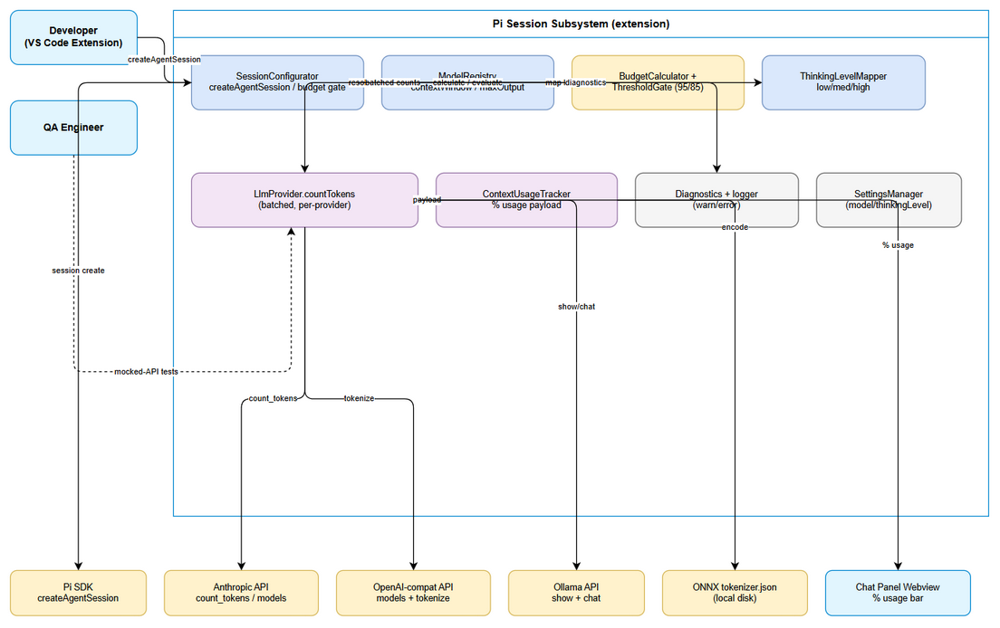
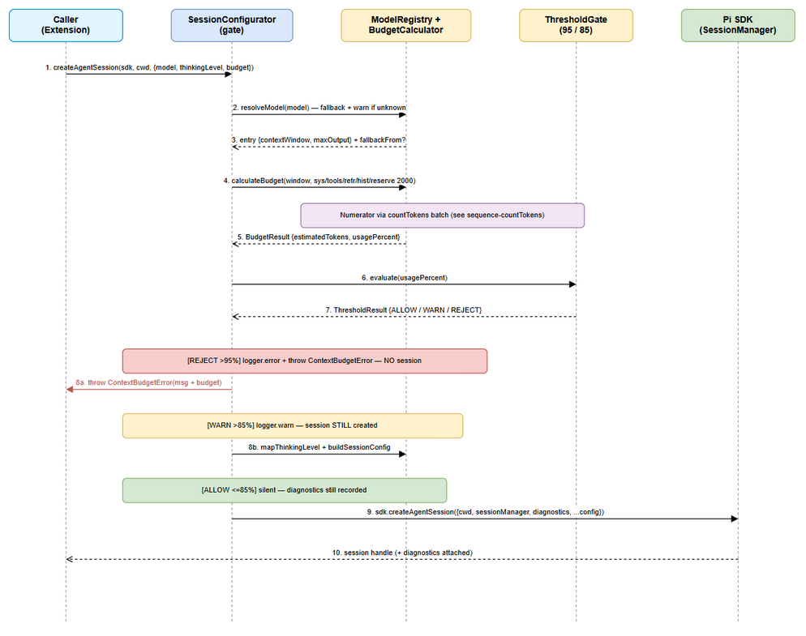
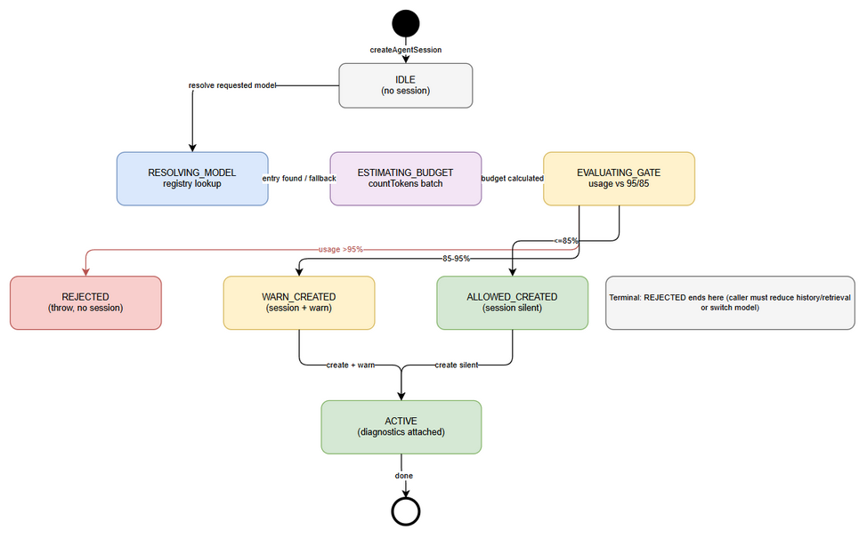
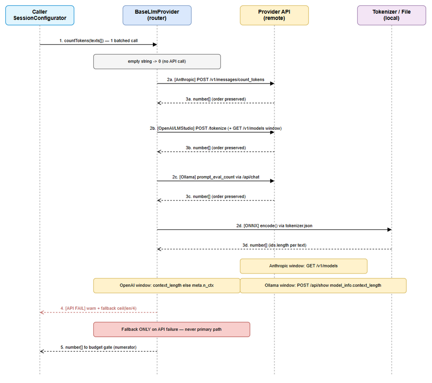

# Functional Specification Document (FSD)

> **Revision Note:** FSD v1.2 updated based on SA discrepancy report v1 (DISCREPANCY.md, 6 items: 0 Critical, 0 High, 3 Medium, 3 Low). See DISCREPANCY.md for details. No BRD change; no new diagrams.

## Pi Context Budget + Model Registry — SA4E-324: Pi Context Budget + Model Registry for small-context models

---

## Document Information

| Field | Value |
|-------|-------|
| Jira Ticket | SA4E-324 |
| Title | Pi Context Budget + Model Registry for small-context models |
| Epic | SA4E-289 — Migrate LangGraph Workflow Engine to Pi SDK (Option C) |
| Author | BA Agent |
| Version | 1.2 (SA discrepancy fixes DISC-01–DISC-06) |
| Date | 2026-09-27 |
| Status | Draft |
| Related BRD | documents/SA4E-324/BRD.md |

---

## Revision History

| Version | Date | Author | Changes |
|---------|------|--------|---------|
| 1.0 | 2026-09-26 | BA Agent | FSD draft from BRD v1.0 (5 stories) + Jira SA4E-324 description + verified code (session-configurator.ts, model-registry.ts, context-budget.ts pi-agent, thinking-level-mapper.ts, settings-manager.ts, chat-models.ts, context-usage-tracker.ts, llm-provider.ts, BaseLlmProvider.ts, anthropic/openai/ollama/onnx providers, onnx-tokenizer.ts). 4 draw.io diagrams + PNG. No mermaid per ticket instruction. |
| 1.1 | 2026-09-27 | TA Agent | Technical enrichment (no BA content deleted): UC-02/UC-04 Alternative/Exception flows for API timeout, tokenizer.json missing/corrupt, /api/show fail; full TS interface `countTokens` + per-provider `detectContextWindow` spec (endpoint/params/response/timeout/cache) + Model Registry JSON schema; per-endpoint JSON request/response schemas in §5; pseudocode for BudgetCalculator + batched countTokens + BaseLlmProvider fallback in §6; Data-Model-vs-Code mismatch table in §4; quantified NFR-10–NFR-13 (streaming, Vietnamese tokenizer, cache TTL, timeout budget) in §8; error rows EF-03–EF-06 in §9; Open Issues OI-01–OI-07 + sample payloads in §11. Verified against actual code read 2026-09-27. |
| 1.2 | 2026-09-27 | BA Agent | SA discrepancy fixes (DISCREPANCY v1, 0 Critical/0 High/3 Medium/3 Low): DISC-01 logical-call wording (§3.4.1/BR-12/§3.4.5.1/§5.1/§6.2/§6.4/NFR-01/NFR-13/TC-08, TDD D-08); DISC-02 cloud js-tiktoken decision D-01 (§5.2/OI-03); DISC-03 smollm2 1024 enforced (§3.1.1/OI-05, TDD D-02); DISC-04 BR-07 Pi-gate-only scope (§3.2.3/§6.1, TDD D-09); DISC-05 Ollama approximate + conservative in NFR-01; DISC-06 catalog-shared-IDs scope (§3.1.1). No BRD change; no new diagrams. |

---

## 1. Introduction

### 1.1 Purpose

This FSD specifies HOW the Pi Context Budget + Model Registry feature works for SA4E-324: model metadata resolution, pre-session token budget gate (REJECT/WARN/ALLOW), thinkingLevel mapping, provider API-based `countTokens` + window detection with single fallback policy, chatbox % usage display, diagnostics, and the mandatory mocked-API test scope. Audience: SA (TDD), DEV (implementation), QA (STP/STC). Source of truth for behavior; technical internals (retry, DDL, JWT) belong to TDD.

### 1.2 Scope

In scope (strictly from BRD 5 stories + Jira AC #1–#5): (1) Model Registry with 9 seed models and validation; (2) pre-session budget gate `system + toolSchema + retrieval + history + reserve(2000 min)`, REJECT `>95%`, WARN `>85%`; (3) `thinkingLevel low/medium/high` to per-model `maxTokens` capped at `maxOutput`; (4) `LlmProvider.countTokens(texts[]): Promise<number[]>` batched per provider + window from API, fallback `ceil(len/4)` + warn ONLY on API failure, removal of hard-coded `len/4`, `len/3.5`, `200000/128000/8192/2048`, `SYSTEM 3500 + STEERING 4000`; (5) test migration to mocked-API + per-provider contract + batch + fallback tests, CI green. Out of scope: full Pi migration, LangGraph deletion, inference quality tuning, chat UI redesign beyond budget messages, billing/quota.

### 1.3 Definitions & Acronyms

| Term | Definition |
|------|------------|
| Model Registry | In-memory metadata store (`modelId`, `contextWindow`, `maxOutput`, `costPer1k`, `speed`, `thinkingMap`); denominator source + maxTokens mapping. Code: `pi-agent/model-registry.ts`. |
| Context Budget | Pre-session estimate `system + toolSchema + retrieval + history + reserve(2000)` in tokens. Code: `pi-agent/context-budget.ts` (`BudgetCalculator`). |
| Threshold Gate | `REJECT (>95%)` / `WARN (>85%)` / `ALLOW` on `usagePercent`. Code: `ThresholdGate`, constants `REJECT_THRESHOLD_PERCENT=95`, `WARN_THRESHOLD_PERCENT=85`, `MIN_RESERVE_TOKENS=2000`. |
| countTokens | `LlmProvider.countTokens(texts: string[]): Promise<number[]>` — batched, order/length-preserving; per-provider API truth. To be added to `langgraph/core/llm-provider.ts`. |
| ContextBudgetError | Thrown on REJECT; carries `message + budget`; blocks `createAgentSession`. |
| thinkingLevel | `low / medium / high` mapped via `ThinkingLevelMapper` to per-model `maxTokens`, capped at `maxOutput`. Default `medium`. |
| Fallback | `ceil(len/4)` used ONLY when token API fails, always with `warn` log. |
| Diagnostics | `session.diagnostics { model, fallbackFrom?, contextWindow, maxTokens, estimatedTokens, usagePercent (1 decimal), decision }` passed into `sdk.createAgentSession`. |
| % Usage (chatbox) | `ContextUsageTracker.getUsagePayload(tabId)` percentages vs `maxTokens`; thresholds safe/warning/critical/full. |

### 1.4 References

| Document | Location |
|----------|----------|
| BRD (5 stories, mandatory) | documents/SA4E-324/BRD.md |
| Jira SA4E-324 (token API mandatory + test scope + AC #1–#5) | https://jiraassist.atlassian.net/browse/SA4E-324 |
| Epic SA4E-289 | https://jiraassist.atlassian.net/browse/SA4E-289 |
| Code verified (read 2026-09-26) | extension/src/pi-agent/session-configurator.ts, model-registry.ts, context-budget.ts, thinking-level-mapper.ts, settings-manager.ts; extension/src/chat-panel/chat-models.ts, context-usage-tracker.ts; extension/src/langgraph/core/llm-provider.ts, context-budget.ts; extension/src/langgraph/providers/BaseLlmProvider.ts, anthropic/openai/ollama/onnx-provider.ts, onnx-tokenizer.ts |

---

## 2. System Overview

### 2.1 System Context Diagram


*[Edit in draw.io](diagrams/system-context.drawio)*

The Pi Session Subsystem sits inside the VS Code extension between the Developer/Extension caller and the Pi SDK. `SessionConfigurator.createAgentSession` is the single entry: it resolves the model via `ModelRegistry`, gets numerator via `LlmProvider.countTokens` batch and denominator via per-provider window APIs, runs `BudgetCalculator` + `ThresholdGate`, maps `thinkingLevel`, and either throws `ContextBudgetError` (REJECT) or calls Pi SDK `createAgentSession` with `diagnostics`. `ContextUsageTracker` feeds the Chat Panel webview % bar. External truth sources: Anthropic `count_tokens`/`models`, OpenAI-compat `models`/`tokenize`, Ollama `show`/`chat`, ONNX `tokenizer.json` on disk. QA interacts via mocked-API contract tests only (no prod path).

### 2.2 System Architecture

Components (all in `extension/src`, no new services/DB): `SessionConfigurator` (orchestrates resolve - budget - gate - map - create; owns `SUPPORTED_MODELS`, `validateModel`, `validateThinkingLevel`, `getModelMetadata`, `calculateBudget`, `evaluateThreshold`, `mapThinkingLevel`, `buildSessionConfig`, `createAgentSession`); `ModelRegistry`/`DEFAULT_MODEL_REGISTRY` (9 entries, `get`/`listModels`, `validate`); `BudgetCalculator` + `ThresholdGate` + `ContextBudgetError`; `ThinkingLevelMapper` (default `medium`); `LlmProvider` interface + `BaseLlmProvider` (shared timeout/fallback) + 4 provider implementations + `OnnxTokenizer`; `ContextUsageTracker` (per-tab payload); `SettingsManager` (external model/thinkingLevel/settings passthrough); Pi SDK `SessionManager.inMemory(cwd)` + `createAgentSession`. Data is in-memory only; no persistence. Technique verified against actual code listed in §1.4 — if code-intel `.analysis` files are stale, this file list governs. Where FSD demands behavior the code lacks (e.g. `countTokens` not yet on interface), code is TO-BE.

---

## 3. Functional Requirements

### 3.1 Feature: Model Registry (Story 1)

**Source:** BRD §2.3 Story 1 (SA4E-324 scope bullet 1).

#### 3.1.1 Description

Registry is the denominator + mapping authority. Seed 9 entries with exact values from `model-registry.ts`: `gpt-4o-mini 128000/16384`, `gpt-4o 128000/16384`, `claude-3 200000/4096`, `claude-3-opus 200000/4096`, `phi-3-mini 2048/512`, `smollm2-360m 1024/256`, `llama3.1 8192/2048`, `qwen2.5-coder 32768/1024`, `local-model 4096/1024` (each with `thinkingMap` per code). `SUPPORTED_MODELS` derives from `listModels()`. `chat-models.ts` static catalog remains the dropdown fallback when gateway unreachable.

> **Ruling — smollm2 denominator (DISC-03 / TDD D-02):** Enforced budget denominator for `smollm2-360m` is `1024` (fail-safe). The ONNX `ONNX_MODEL_REGISTRY` value `2048` is physical-max only, NOT the gate denominator. QA golden fixtures MUST pin `1024`.
> **Scope — catalog vs registry IDs (DISC-06):** Only IDs SHARED between catalog and registry (`phi-3-mini`, `smollm2-360m`, `llama3.1`, `qwen2.5-coder`, `local-model`, `gpt-4o`/`gpt-4o-mini`, `claude-3`/`claude-3-opus`) must stay ID-consistent (exact match). Catalog-only IDs (e.g. `claude-opus-4-8`, `o1`, `deepseek-v3-2` — 40+ dropdown IDs across 7 providers with no registry entry) are out of budget-gate scope; unknown model → default fallback per BR-04.

#### 3.1.2 Use Case

**Use Case ID:** UC-01
**Actor:** Developer (extension caller)
**Preconditions:** `DEFAULT_MODEL_REGISTRY` loaded; `DEFAULT_MODEL_ID = gpt-4o-mini` present.
**Postconditions:** Resolved `entry` returned; unknown model falls back with `fallbackFrom` recorded.

**Main Flow:**

| Step | Actor | System | Description |
|------|-------|--------|-------------|
| 1 | Caller | | Calls `getModelMetadata(modelId)` / `resolveModel(model)` |
| 2 | | System | Looks up `ModelRegistry.get(modelId)`; returns entry |
| 3 | | System | `listModels()` exposes IDs; `SUPPORTED_MODELS` validated |

**Alternative Flows:**

| ID | Condition | Steps |
|----|-----------|-------|
| AF-01 | Unknown `modelId` | Resolve to `DEFAULT_MODEL_ID`, set `diagnostics.fallbackFrom = requested`, `logger.warn('Model not found, using default')`; continue to budget gate (BR-04) |
| AF-02 | Invalid entry at construction | `ModelRegistry.add` rejects, `logger.warn` with reason; registry stays usable (BR-03) |

**Exception Flows:**

| ID | Condition | Steps |
|----|-----------|-------|
| EF-01 | Requested + default both missing | Throw `Error('not found and default unavailable')` before any session creation |

#### 3.1.3 Business Rules

| Rule ID | Rule | Source |
|---------|------|--------|
| BR-01 | `contextWindow > 0` (integer), else reject entry | BRD Story 1 / `ModelRegistry.validate` |
| BR-02 | `maxOutput <= contextWindow` and `> 0`, else reject entry | BRD Story 1 |
| BR-03 | `modelId` unique; duplicate rejected with `warn` | BRD Story 1 |
| BR-04 | Unknown model falls back to default with `warn` + `fallbackFrom`; never silent misrouting | Jira scope bullet 4 / BRD AC |

#### 3.1.4 Data Specifications

**Input Data:**

| Field | Type | Required | Validation | Description |
|-------|------|----------|------------|-------------|
| modelId | string | Y | non-empty, unique | Registry key, e.g. `phi-3-mini` |
| contextWindow | number | Y | BR-01 | Tokens, denominator (API-sourced TO-BE) |
| maxOutput | number | Y | BR-02 | Cap for mapped maxTokens |
| thinkingMap | object | Y | each value integer `>0` and `<= maxOutput` | `low/medium/high` to maxTokens |
| costPer1k / speed | number / enum | N | — | Routing/display metadata only |

**Output Data:**

| Field | Type | Description |
|-------|------|-------------|
| entry | ModelRegistryEntry | Resolved metadata |
| fallbackFrom | string | Original ID when AF-01 taken |

### 3.2 Feature: Pre-session Budget Gate + Chatbox % Usage (Story 2)

**Source:** BRD §2.3 Story 2 (Jira scope bullet 2, AC #1–#2).

#### 3.2.1 Description

Gate runs synchronously inside `createAgentSession` BEFORE Pi session creation. `estimatedTokens = system + toolSchema + retrieval + history + reserve(min 2000)`; `usagePercent = estimated / contextWindow * 100`. REJECT `>95%` throws; WARN `>85%` creates with `warn`; else ALLOW. Every outcome records `diagnostics` (percent rounded to 1 decimal). Default `systemPromptChars ~7500` on `phi-3-mini/smollm2` always REJECTs by design (fail-safe). Chatbox % display is the read-model of the same math via `ContextUsageTracker`.

#### 3.2.2 Use Case

**Use Case ID:** UC-02
**Actor:** Developer (session creator); Chat user (usage viewer)
**Preconditions:** Model resolved (UC-01); numerator from `countTokens` batch (UC-04); `contextWindow > 0`.
**Postconditions:** REJECT: no session + `ContextBudgetError`; WARN/ALLOW: session + diagnostics.

**Main Flow:**

| Step | Actor | System | Description |
|------|-------|--------|-------------|
| 1 | Caller | | Invokes `createAgentSession(sdk, cwd, {model, thinkingLevel, contextBudget})` |
| 2 | | System | `calculateBudget(entry.contextWindow, inputs)` → `BudgetResult` |
| 3 | | System | `evaluateThreshold(usagePercent)` → ALLOW/WARN/REJECT |
| 4 | | System | REJECT: `logger.error`, throw `ContextBudgetError(message, budget)`; WARN: `logger.warn`, continue; ALLOW: continue |
| 5 | | System | `buildSessionConfig` + `buildDiagnostics` → `sdk.createAgentSession({cwd, sessionManager, diagnostics, ...config})` |


*[Edit in draw.io](diagrams/sequence-budget-gate.drawio)*


*[Edit in draw.io](diagrams/state-session.drawio)*

**Alternative Flows:**

| ID | Condition | Steps |
|----|-----------|-------|
| AF-01 | WARN 85–95% | Create session, `logger.warn(threshold.message)`, diagnostics `decision=WARN` |
| AF-02 | Invalid inputs (NaN/negative) | Conservative estimate + `warn('conservative estimate used')`; never negative totals (BR-08) |
| AF-03 | `reserveTokens < 2000` | Clamp to 2000, mark `conservative=true` (BR-06) |

**Exception Flows:**

| ID | Condition | Steps |
|----|-----------|-------|
| EF-01 | REJECT >95% | Throw `ContextBudgetError`; message states usage% + threshold + remediation (reduce history/retrieval/system or larger model); no Pi call |
| EF-02 | `contextWindow <= 0` (unknown) | Treat as 100% usage (fail-closed); do not divide by zero (BR-07) |

<!-- TA enrichment: UC-02 API-failure flows — verified against BaseLlmProvider pingEndpoint (8s), OpenAI/Ollama detectContextWindow (AbortSignal.timeout 5000, catch-and-keep-default), OnnxProvider.isAvailable file check -->
**Alternative Flows (TA-added — provider API degradation during gate):**

| ID | Condition | Steps |
|----|-----------|-------|
| AF-04 | `countTokens` API timeout (>5s) mid-gate | `BaseLlmProvider` aborts request → per-text `ceil(len/4)` + single `logger.warn('countTokens API failed, conservative estimate used', {provider, model})`; gate continues with conservative numerator; `diagnostics` still recorded; `budget.conservative=true` surfaces via `calculateBudget` warn (`session-configurator.ts:73-75`) |
| AF-05 | `detectContextWindow` timeout/fail (window unknown) | Keep last-known `contextWindowTokens` (OpenAI `openai-provider.ts:83-86`, Ollama `ollama-provider.ts:41-43` catch-and-keep-default pattern); if never detected (`0`) → BR-07 fail-closed (usage treated as 100%); log `console.debug` today, MUST upgrade to `logger.warn` per §9 EF-05 |

**Exception Flows (TA-added):**

| ID | Condition | Steps |
|----|-----------|-------|
| EF-03 | Ollama `POST /api/show` fail (server down / unknown model, non-OK or throws) | `detectContextWindow` keeps conservative default (`8192`); gate proceeds conservatively; caller SHOULD call `isAvailable()` (`GET /api/tags` must be 200) before session creation for fast-fail with message `Ollama server unreachable at {baseUrl}; start ollama serve or switch model` [Implements: Story #4] |
| EF-04 | ONNX `tokenizer.json` missing/corrupt at gate time | `OnnxTokenizer.load` throws (`ENOENT`/`SyntaxError`) → `OnnxProvider.isAvailable()=false` (`onnx-provider.ts:69-79` checks only `model.onnx` today — TA REQUIRES also checking `tokenizer.json` exists); session creation for `phi-3-mini/smollm2-360m` MUST throw `Error('Tokenizer missing for {modelId} at .code-intel/models/llm/{modelId}/tokenizer.json')` before budgeting; never fall back to `split(/\s+/)` silently (BR-16) [Implements: Story #4] |
| EF-05 | Anthropic/OpenAI auth failure (401/403) during `countTokens` | Cloud providers: `warn` + `ceil(len/4)` fallback for this gate evaluation; do NOT cache the failure; surface `warn` with provider+model (no key material); next gate retries API normally [Implements: Story #4] |

#### 3.2.3 Business Rules

| Rule ID | Rule | Source |
|---------|------|--------|
| BR-05 | `REJECT_THRESHOLD_PERCENT = 95`, `WARN_THRESHOLD_PERCENT = 85`; invariant REJECT > WARN; constants, not per-call params | BRD Story 2 / `context-budget.ts` |
| BR-06 | `reserveTokens >= 2000` (`MIN_RESERVE_TOKENS`); lower clamped, cannot be lowered | Jira scope bullet 2 |
| BR-07 | `contextWindow = 0` means unknown → usage treated as 100%, never divide-by-zero. SCOPE (DISC-04 / TDD D-09): applies to the Pi pre-session gate (`pi-agent/context-budget.ts`) ONLY; `langgraph/core/context-budget.ts` legacy `checkAutoCompact` fail-open path (`contextBudget <= 0` → `{ shouldCompact: false, usagePercent: 0 }`) is out of scope for SA4E-324 (separate ticket — DEV must NOT "fix" it, QA must NOT assert BR-07 against it) | BRD Story 4 validation |
| BR-08 | Negative/NaN inputs → conservative estimate + `warn`, never negative totals | `BudgetCalculator.resolveNumber` |

#### 3.2.4 Data Specifications

**Input Data:**

| Field | Type | Required | Validation | Description |
|-------|------|----------|------------|-------------|
| systemPromptChars | number | N (default 7500) | BR-08; counted via API TO-BE | System prompt length |
| toolSchemaTokens | number | N (default 0) | BR-08; via countTokens on serialized tools | Tool schema |
| retrievalTokens | number | N (default 0) | BR-08 | RAG tokens |
| historyTokens | number | N (default 0) | BR-08 | History tokens |
| reserveTokens | number | N (default 2000) | BR-06 | Output reserve |

**Output Data:**

| Field | Type | Description |
|-------|------|-------------|
| estimatedTokens | number | Sum of inputs |
| usagePercent | number | `estimated / contextWindow * 100` (diagnostics: 1 decimal) |
| decision | enum | ALLOW / WARN / REJECT |
| diagnostics | object | `{model, fallbackFrom?, contextWindow, maxTokens, estimatedTokens, usagePercent, decision}` |

#### 3.2.5 UI Specifications

**Screen: Chat Panel — Context Usage bar (existing panel, no new screen)**

| No. | Element | Type | Required | Behavior | Validation |
|-----|---------|------|----------|----------|------------|
| 1 | Total % bar + tokens | Progress + label | Y | `getUsagePayload(tabId)`: `total.percentage = min(100, round(total/maxTokens*100))`; updates on `updateFromMessages` / `addToolTokens` / `updateSteeringTokens`; `setMaxTokens` on model change | `maxTokens > 0` else show 0% (BR-07 analog) |
| 2 | Per-category rows | Labels | Y | `conversation/mcpTools/steering {tokens, percentage}` each `round(cat/maxTokens*100)` | Tokens from `countTokens` TO-BE (today `len/4` heuristic — must migrate per UC-04) |
| 3 | Threshold color/state | Badge | Y | `safe <60%`, `warning 60–80%`, `critical 80–95%`, `full >=95%` (tracker `THRESHOLDS`); distinct from gate 85/95 — tracker is display, gate is enforcement | Documented difference; do not conflate |
| 4 | REJECT message | Error toast/inline | Y on REJECT | Shows `ContextBudgetError.message` (usage% + threshold + remediation) | Must state % and suggest fix (AC #2) |
| 5 | WARN notice | Inline warning | Y on WARN | Shows threshold message; session continues | Logged `warn` + diagnostics |

#### 3.2.6 API Contract (Functional View)

**Endpoint:** `SessionConfigurator.createAgentSession(sdk, cwd, params)` (in-process, not HTTP)
**Purpose:** Enforce budget before Pi session creation.

**Input Parameters:**

| Parameter | Type | Required | Business Rule | Description |
|-----------|------|----------|---------------|-------------|
| model | string | Y | BR-04 | Requested model ID |
| thinkingLevel | enum | N (default medium) | BR-10 | low/medium/high |
| contextBudget | object | N | BR-05–BR-08 | Budget inputs above |
| settingsManager/credentials | object | N | §5 | External config passthrough |

**Business Error Scenarios:**

| Scenario | User Message | Trigger Condition |
|----------|-------------|-------------------|
| Over budget | `Session rejected: usage {pct}% >95% threshold. Reduce history/retrieval.` (+ switch-model hint) | BR-05 REJECT |
| Near budget | `Budget warning: usage {pct}% >85% threshold. Consider reducing history/retrieval.` | BR-05 WARN |

### 3.3 Feature: thinkingLevel Mapping (Story 3)

**Source:** BRD §2.3 Story 3.

#### 3.3.1 Description

`mapThinkingLevel(modelId, level)` delegates to `ThinkingLevelMapper` backed by registry `thinkingMap`; result always `min(map[level], maxOutput)`. `buildSessionConfig` defaults omitted level to `medium`. Example: `qwen2.5-coder/high → 1024`. Current `ThinkingLevelMapper.resolveLevel` silently defaults unknown levels to `medium` — FSD REQUIRES throwing `Invalid thinkingLevel` instead (BR-10); implementation must change.

#### 3.3.2 Use Case

**Use Case ID:** UC-03
**Actor:** Developer
**Preconditions:** Model resolved (UC-01).
**Postconditions:** `sessionConfig.maxTokens` set and `<= maxOutput`.

**Main Flow:**

| Step | Actor | System | Description |
|------|-------|--------|-------------|
| 1 | Caller | | Passes `thinkingLevel` (or omits) in `SessionConfigParams` |
| 2 | | System | `validateThinkingLevel`; resolve entry; `map = min(thinkingMap[level], maxOutput)` |
| 3 | | System | `buildSessionConfig {model, thinkingLevel ?? medium, maxTokens, scopedModels ?? [], modelRuntime}` + external config |

**Alternative Flows:**

| ID | Condition | Steps |
|----|-----------|-------|
| AF-01 | Level omitted | Use `medium` (BR-11) |

**Exception Flows:**

| ID | Condition | Steps |
|----|-----------|-------|
| EF-01 | Level outside `low/medium/high` | Throw `Error('Invalid thinkingLevel ... Must be low/medium/high')` before session creation |

#### 3.3.3 Business Rules

| Rule ID | Rule | Source |
|---------|------|--------|
| BR-09 | Mapped `maxTokens = min(thinkingMap[level], maxOutput)`; capping mandatory | BRD Story 3 |
| BR-10 | `thinkingLevel` in `{low, medium, high}`; others throw (corrects current silent-default) | BRD Story 3 AC |
| BR-11 | Default level is `medium` when omitted | `DEFAULT_THINKING_LEVEL` |

#### 3.3.4 Data Specifications

**Input Data:**

| Field | Type | Required | Validation | Description |
|-------|------|----------|------------|-------------|
| thinkingLevel | enum | N (default medium) | BR-10 | low/medium/high |
| scopedModels / modelRuntime | array / string | N | — | Pi scoping passthrough |

**Output Data:**

| Field | Type | Description |
|-------|------|-------------|
| maxTokens | number | `<= maxOutput`; e.g. qwen/high → 1024 |
| sessionConfig | object | `{model, thinkingLevel, maxTokens, scopedModels, modelRuntime, settingsManager?, credentials?}` |

### 3.4 Feature: API-based countTokens + Window Detection (Story 4, MANDATORY)

**Source:** BRD §2.3 Story 4 + Jira mandatory token rule (AC #3).

#### 3.4.1 Description

All numerators + denominators from provider APIs. Add `countTokens(texts: string[]): Promise<number[]>` to `LlmProvider` (async, batched: 1 logical call per array — Anthropic executes per-text sub-calls internally, order/length guarantee unchanged; DISC-01 / TDD D-08). Remove primaries: `estimateTokens len/4` (`context-usage-tracker.ts:119`), `len/3.5 + 4/msg` (`langgraph/core/context-budget.ts:11,21,141,185`), `200000` (anthropic:27), `8192/128000` (openai:28), `8192` (ollama:23), `2048` (onnx:40), `SYSTEM 3500 + STEERING 4000` chars (`chat-panel-provider.ts:59-60`), ONNX `split(/\s+/)` heuristic. Fallback `ceil(len/4)` + `warn` ONLY on API failure.


*[Edit in draw.io](diagrams/sequence-countTokens.drawio)*

#### 3.4.2 Use Case

**Use Case ID:** UC-04
**Actor:** System (`BudgetCalculator`, `ContextUsageTracker`)
**Preconditions:** Provider configured (`getApiKey` / local URL / tokenizer files present).
**Postconditions:** `number[]` same order/length as input; window known; or fallback with `warn`.

**Main Flow:**

| Step | Actor | System | Description |
|------|-------|--------|-------------|
| 1 | Budget/Tracker | | Calls `provider.countTokens([sys, tools, retrieval, history])` once (batch) |
| 2 | | System | Routes by provider: Anthropic `POST /v1/messages/count_tokens`; OpenAI/LMStudio `POST /tokenize` (+ `GET /v1/models` for `context_length` else `meta.n_ctx`); Ollama `prompt_eval_count` via `/api/chat` (+ `POST /api/show model_info.context_length` / `llama.context_length`); ONNX `OnnxTokenizer.encode` on real `tokenizer.json` |
| 3 | | System | Returns counts; `getContextWindow()` returns API value; numerator + denominator from SAME provider/model (BR-15) |

**Alternative Flows:**

| ID | Condition | Steps |
|----|-----------|-------|
| AF-01 | Empty string in batch | Return 0 for that index without API call |
| AF-02 | `tokenizer.json` valid | ONNX `encode` = `ids.length`; `contextLength` validated against registry tier |

**Exception Flows:**

| ID | Condition | Steps |
|----|-----------|-------|
| EF-01 | Any API timeout/error | `logger.warn` (single pattern), fallback `ceil(len/4)` per text; success path never logs fallback (BR-13) |
| EF-02 | `tokenizer.json` missing/corrupt | `isAvailable() = false`; clear load error; no silent `split` (BR-16) |

<!-- TA enrichment: UC-04 timeout/show/tokenizer flows — root-cause verified in openai-provider.ts:50,67-68, ollama-provider.ts:33, onnx-provider.ts:69-79, onnx-tokenizer.ts:18-31 -->
**Exception Flows (TA-added — per-failure-mode handling):**

| ID | Condition | Steps |
|----|-----------|-------|
| EF-03 | `countTokens` HTTP timeout (`AbortSignal.timeout(5000)`) | Abort in-flight request; per-text fallback `Math.ceil(text.length/4)`; `logger.warn('countTokens timeout after 5000ms, conservative estimate used', { provider: this.type, model })`; `fallbackUsed=true` for those indices; batch still returns full-length array (order preserved); never throw to gate caller [Implements: Story #4] |
| EF-04 | Ollama `POST /api/show` non-OK (404 unknown model) or network fail | `detectContextWindow` keeps current `contextWindowTokens` (default `8192`); `console.debug` → MUST become `logger.warn('Ollama /api/show failed, keeping default 8192', { model })`; `getContextWindow()` returns stale-but-safe value; QA contract test MUST cover 404 + connection-refused cases [Implements: Story #4, #5] |
| EF-05 | `tokenizer.json` missing (`ENOENT`) | `OnnxTokenizer.load` throws; `OnnxProvider.isAvailable()` returns `false` (TA REQUIRES extending the check to `tokenizer.json`, not just `model.onnx` — current `onnx-provider.ts:73` gap); `countTokens` for ONNX MUST throw `Error('Tokenizer file missing: .code-intel/models/llm/{modelId}/tokenizer.json')` rather than returning heuristic counts; gate caller converts to EF-02 path [Implements: Story #4] |
| EF-06 | `tokenizer.json` corrupt (`SyntaxError`) or vocab empty | Same as EF-05 + log `logger.error('tokenizer.json corrupt', { path, modelId })`; registry entry stays but provider unavailable; diagnostics MUST NOT record a fabricated `contextWindow` — use registry `contextLength` only as denominator with `conservative=true` [Implements: Story #4] |
| EF-07 | Empty batch `countTokens([])` | Return `[]` immediately, zero API calls, zero logs (cheap-path; also covers `texts=[ "" ]` → `[0]`) [Implements: Story #4] |

#### 3.4.3 Business Rules

| Rule ID | Rule | Source |
|---------|------|--------|
| BR-12 | `countTokens` is async batched: 1 LOGICAL call per array (Anthropic executes per-text sub-calls internally — DISC-01 / TDD D-08); output order/length = input; empty → 0 | Jira batch rule |
| BR-13 | Single fallback `ceil(len/4)` + single `warn` pattern, ONLY on API failure, across `BaseLlmProvider`/budget/tracker | Jira fallback rule |
| BR-14 | Zero hard-coded primary windows/heuristics (`200000/128000/8192/2048`, `len/4`, `len/3.5`, `+4/msg`, `3500/4000` chars) — grep-verifiable | Jira AC #3 |
| BR-15 | Numerator + denominator from the SAME provider/model session (no cross-mixing) | BRD risk mitigation / AC #3 |
| BR-16 | ONNX uses real `tokenizer.json`; missing/corrupt → unavailable with clear error | Jira ONNX rule |

#### 3.4.4 Data Specifications

**Input Data:**

| Field | Type | Required | Validation | Description |
|-------|------|----------|------------|-------------|
| texts | string[] | Y | — | Batch, e.g. `["sys", "tools", "hist"]` |

**Output Data:**

| Field | Type | Description |
|-------|------|-------------|
| tokenCounts | number[] | Same order/length; e.g. `[5, 7]` |
| contextWindow | number | API value; `0` = unknown (BR-07) |
| fallbackUsed | boolean | True only when API failed (logged) |

#### 3.4.5 API Contract (Functional View)

**Endpoint:** `POST /v1/messages/count_tokens` (Anthropic) / `POST /tokenize` (OpenAI-compat) / `/api/chat` eval-count (Ollama) / `tokenizer.json encode` (ONNX); window: `GET /v1/models`, `POST /api/show`.
**Purpose:** Token truth for budget math.

**Input Parameters:**

| Parameter | Type | Required | Business Rule | Description |
|-----------|------|----------|---------------|-------------|
| texts / model | string[] / string | Y | BR-12, BR-15 | Batch + same model ID as session |
| auth (cloud) | key via `getApiKey` | Y for cloud | §7 | Never logged |

**Business Error Scenarios:**

| Scenario | User Message | Trigger Condition |
|----------|-------------|-------------------|
| Token API down | (internal) fallback used; user sees normal WARN/REJECT computed conservatively | BR-13 (EF-01) |
| Tokenizer missing | Clear setup error surfaced; no silent heuristic | BR-16 (EF-02) |

<!-- TA enrichment: DEV-implementable contracts — signatures verified against llm-provider.ts:52-89 (countTokens ABSENT today = TO-BE), BaseLlmProvider.ts:9/58-72 (8s health timeout), openai-provider.ts:44-87, ollama-provider.ts:27-44, onnx-provider.ts:29-41, model-registry.ts:12-33 -->
##### 3.4.5.1 `LlmProvider.countTokens` — exact interface (TO-BE, all 4 providers + Base fallback) [Implements: Story #4]

```typescript
// extension/src/langgraph/core/llm-provider.ts — ADD to interface LlmProvider:
  /**
   * Count tokens for a batch of texts using the provider's real tokenizer/API.
   * Batched: 1 LOGICAL call per array regardless of texts.length (Anthropic executes per-text sub-calls internally; order/length guarantee unchanged — DISC-01 / TDD D-08).
   * Order/length-preserving: output.length === input.length, output[i] ↔ texts[i].
   * Empty string → 0 without API call. Empty array → [] without API call.
   * On API failure: per-text Math.ceil(text.length / 4) + logger.warn (BR-13).
   */
  countTokens(texts: string[]): Promise<number[]>;

// extension/src/langgraph/providers/BaseLlmProvider.ts — ADD shared helpers:
  protected readonly COUNT_TOKENS_TIMEOUT_MS = 5000;
  /** Shared fallback — the ONLY heuristic allowed, ONLY on API failure. */
  protected fallbackCount(text: string): number {
    return !text ? 0 : Math.ceil(text.length / 4);
  }
  protected async withTimeout<T>(fn: (signal: AbortSignal) => Promise<T>): Promise<T> {
    const controller = new AbortController();
    const t = setTimeout(() => controller.abort(), this.COUNT_TOKENS_TIMEOUT_MS);
    try { return await fn(controller.signal); }
    finally { clearTimeout(t); }
  }
```

| Provider | Method | Behavior |
|----------|--------|----------|
| `BaseLlmProvider` (default) | `async countTokens(texts)` | Loop `fallbackCount` per text + `logger.warn` once per call if any non-empty text (covers providers that never override); subclasses SHOULD override with real API |
| `AnthropicProvider` | `async countTokens(texts)` | 1 LOGICAL call per array = N sequential per-text `POST {baseUrl}/v1/messages/count_tokens` sub-calls internally (API is per-text — DISC-01 / TDD D-08, see §5.1/§6.4); per-text `input_tokens` mapped back in order; 5s timeout per sub-call; any throw → fallback path |
| `OpenAIProvider` | `async countTokens(texts)` | Local (LM Studio/llama-server): single `POST {apiBase}/tokenize` with `{model, input: texts[]}` (see §5.2); response `tokens[]` lengths per index; 5s timeout. Cloud (`api.openai.com`): `js-tiktoken` local encode, no HTTP (SA decision D-01 — DISC-02). Fail → fallback |
| `OllamaProvider` | `async countTokens(texts)` | Local, no key; strategy A (preferred): `POST /api/tokenize` if server exposes it (newer Ollama); strategy B (fallback): reuse `prompt_eval_count` semantics — NOT per-text precise, so MUST document approximation + still batch into 1 `/api/chat` dry-run only if needed; fail/`/api/show` fail → fallback |
| `OnnxProvider` | `async countTokens(texts)` | `await ensureLoaded()` (loads `tokenizer.json` once, caches `OnnxTokenizer`); `texts.map(t => tokenizer.encode(t).length)`; empty → 0; `ENOENT`/`SyntaxError` → throw (EF-05/EF-06), never heuristic |

##### 3.4.5.2 `detectContextWindow` per-provider spec (timeout 5s, cache) [Implements: Story #4]

| Provider | Endpoint | Request params | Response field → `contextWindowTokens` | Timeout | Cache policy (TO-BE — NO cache exists today) |
|----------|----------|----------------|----------------------------------------|---------|----------------------------------------------|
| Anthropic | `GET {baseUrl}/v1/models` (new; today only health `POST /v1/messages`) | Headers `x-api-key`, `anthropic-version: 2023-06-01` | `data[]` entry matching `defaultModel`: `context_window` (else keep `200000`) | 5s `AbortSignal.timeout(5000)` | Cache per `baseUrl+model` 1h; invalidate on model change; `getContextWindow()` returns cached value synchronously |
| OpenAI / LM Studio / llama-server | `GET {apiBase}/models` (exists `openai-provider.ts:48,67`) | `GET`, optional `Authorization: Bearer` (already in `getHealthCheckRequest`) | `data[0].context_length` else `data[0].meta.n_ctx` (precedence as coded); cloud non-local → skip (keep `128000`) | 5s | Cache `detectedModel` + window 1h (extend existing `detectedModel` memo); first-ID auto-detect stays |
| Ollama | `POST {baseUrl}/api/show` (exists `ollama-provider.ts:29-34`) | Body `{ "name": defaultModel }`, `Content-Type: application/json` | `model_info["context_length"]` else `model_info["llama.context_length"]` (aliases as coded); `>0` required else keep `8192` | 5s | Cache per `baseUrl+model` 1h; `detectContextWindow(): Promise<number>` SHOULD return the value (today returns `void` — signature change required) |
| ONNX | File `.code-intel/models/llm/{modelId}/tokenizer.json` + `ONNX_MODEL_REGISTRY.contextLength` | Path traversal guard: `modelId` must match `^[a-z0-9][a-z0-9._-]*$` | `contextLength` (`2048` tier) validated: `tokenizer.vocabSize > 0` else unavailable | N/A (disk) | Load once per process (`ensureLoaded` memo exists); file-watch or mtime check for reload; missing → `isAvailable()=false` |

> **TA Note — signature correction required:** base interface declares `detectContextWindow?(): Promise<void | number>` but `OpenAIProvider`/`OllamaProvider` implement `Promise<void>`. FSD REQUIRES standardising on `Promise<number>` (resolved window) across all providers so the gate can use the fresh value without re-reading `getContextWindow()`.

##### 3.4.5.3 Model Registry entry JSON schema [Implements: Story #1]

```json
{
  "$schema": "http://json-schema.org/draft-07/schema#",
  "title": "ModelRegistryEntry",
  "type": "object",
  "required": ["modelId", "contextWindow", "maxOutput", "thinkingMap"],
  "properties": {
    "modelId":       { "type": "string", "minLength": 1, "examples": ["phi-3-mini"] },
    "contextWindow": { "type": "integer", "exclusiveMinimum": 0, "description": "Denominator; API-sourced TO-BE (BR-14)" },
    "maxOutput":     { "type": "integer", "exclusiveMinimum": 0, "description": "Must be <= contextWindow (BR-02)" },
    "costPer1k":     { "type": "number", "minimum": 0, "description": "Routing/display only, never billing" },
    "speed":         { "type": "string", "enum": ["slow", "medium", "fast"] },
    "thinkingMap": {
      "type": "object",
      "required": ["low", "medium", "high"],
      "properties": {
        "low":    { "type": "integer", "exclusiveMinimum": 0 },
        "medium": { "type": "integer", "exclusiveMinimum": 0 },
        "high":   { "type": "integer", "exclusiveMinimum": 0 }
      },
      "description": "Each value must be <= maxOutput (BR-09); validated by ModelRegistry.validateThinkingMap"
    }
  },
  "allOf": [
    { "description": "maxOutput <= contextWindow enforced in ModelRegistry.validate (model-registry.ts:67)" }
  ]
}
```

Seed values (authoritative, from `model-registry.ts:23-33`): `gpt-4o-mini 128000/16384`, `gpt-4o 128000/16384`, `claude-3 200000/4096`, `claude-3-opus 200000/4096`, `phi-3-mini 2048/512`, `smollm2-360m 1024/256`, `llama3.1 8192/2048`, `qwen2.5-coder 32768/1024`, `local-model 4096/1024`.

### 3.5 Feature: Mocked-API Test Scope (Story 5)

**Source:** BRD §2.3 Story 5 + §8.1 + Jira test scope (AC #4–#5).

#### 3.5.1 Description

Test-only feature (no prod behavior). Migrate every hard-coded-number assert to mocked-API asserts; add contract + batch + fallback tests; expand registry/budget/compactor suites; CI green with zero remaining hard-coded asserts.

#### 3.5.2 Use Case

**Use Case ID:** UC-05
**Actor:** QA Engineer
**Preconditions:** Suites listed in §10 runnable.
**Postconditions:** All asserts against mocked API returns; new tests exist; CI green.

**Main Flow:**

| Step | Actor | System | Description |
|------|-------|--------|-------------|
| 1 | QA | | Mocks `GET /v1/models`, `POST /api/show`, `POST /v1/messages/count_tokens`, `tokenizer.json`, `provider.countTokens` per §10 groups A–C |
| 2 | QA | | Adds contract/batch/fallback tests per §10 group D |
| 3 | | System | CI runs full scope green (AC #5) |

**Alternative Flows:**

| ID | Condition | Steps |
|----|-----------|-------|
| AF-01 | Mock-compat suites | Keep `getContextWindow` mocks, ADD matching `countTokens` mocks |

**Exception Flows:**

| ID | Condition | Steps |
|----|-----------|-------|
| EF-01 | Mock leak between tests | Reset mocks per test; isolated failure injection |

#### 3.5.3 Business Rules

| Rule ID | Rule | Source |
|---------|------|--------|
| BR-17 | Every migrated test asserts against the mocked API return, not a pasted constant | BRD Story 5 |
| BR-18 | Fallback tests assert BOTH `/4` value AND `warn` log | BRD Story 5 |

---

## 4. Data Model

Logical only — no new persistent tables; registry + budget + diagnostics are in-memory. (`chat-models.ts` catalog and ONNX files on disk are pre-existing.)

### 4.1 Logical Entities

#### Entity: ModelRegistryEntry

| Attribute | Type | Required | Business Rule | Description |
|-----------|------|----------|---------------|-------------|
| modelId | string | Y | BR-03, BR-04 | e.g. `phi-3-mini` |
| contextWindow | number | Y | BR-01, BR-14 | Denominator (API TO-BE) |
| maxOutput | number | Y | BR-02, BR-09 | Generation cap |
| thinkingMap | map low/med/high→number | Y | BR-09 | e.g. `{low:128, medium:256, high:512}` |
| costPer1k / speed | number / enum | N | — | Routing/display only |

#### Entity: ContextBudget (inputs + result)

| Attribute | Type | Required | Business Rule | Description |
|-----------|------|----------|---------------|-------------|
| systemPromptChars / toolSchemaTokens / retrievalTokens / historyTokens | number | N | BR-08 | Numerator parts |
| reserveTokens | number | N (min 2000) | BR-06 | Output reserve |
| estimatedTokens / usagePercent / decision | number / number / enum | Y (outputs) | BR-05 | Gate result |

#### Entity: SessionDiagnostics

| Attribute | Type | Required | Business Rule | Description |
|-----------|------|----------|---------------|-------------|
| model / fallbackFrom? / contextWindow / maxTokens / estimatedTokens / usagePercent / decision | mixed | Y (fallbackFrom optional) | BR-04, BR-05 | Attached to every created session; carried on REJECT inside error |

#### Entity: ContextUsagePayload (chatbox read-model)

| Attribute | Type | Required | Business Rule | Description |
|-----------|------|----------|---------------|-------------|
| tabId / conversation / mcpTools / steering / total / maxTokens | mixed | Y | §3.2.5 | Per-tab tokens + percentages + threshold |

**Relationships:**

| From Entity | To Entity | Cardinality | Description |
|-------------|-----------|-------------|-------------|
| ModelRegistryEntry | ContextBudget | 1:N | One entry (denominator) serves many budget evaluations |
| ContextBudget | SessionDiagnostics | 1:1 | Each gate evaluation yields one diagnostics record |
| ModelRegistryEntry | SessionDiagnostics | 1:N | Entry identifies the session model (with fallbackFrom) |
| ContextUsagePayload | ModelRegistryEntry | N:1 | Payload `maxTokens` follows the active model entry |

<!-- TA enrichment: Data-Model-vs-Code review — every row verified by reading the cited file:line on 2026-09-27 -->
### 4.2 Data-Model-vs-Code Mismatch Review (TA)

| # | FSD §4 Entity/Field | Actual code | Verdict | Required action (DEV/TDD) |
|---|---------------------|-------------|---------|---------------------------|
| M-01 | `ThinkingLevelMapper` throws on unknown level (BR-10, UC-03 EF-01) | `thinking-level-mapper.ts:22-27` `resolveLevel` silently returns `'medium'` for ANY unknown input | ❌ MISMATCH (FSD already flags in §3.3.1; confirmed) | Change `resolveLevel` to `throw new Error('Invalid thinkingLevel ... Must be low/medium/high')`; `SessionConfigurator.validateThinkingLevel` stays as pre-check. Contract test: `map('qwen2.5-coder','ultra')` throws |
| M-02 | `OnnxProvider` is an ONNX provider | `onnx-provider.ts:30` `readonly type = "ollama"` with comment "kept for backward compat" | ❌ MISMATCH (copy-paste bug) | Change to `readonly type = "onnx"`; audit callers switching on `type` (provider-registry, telemetry) for `ollama`-assumed branches |
| M-03 | Registry `smollm2-360m contextWindow=1024` (FSD §3.1.1, from `model-registry.ts:29`) | `onnx-provider.ts:26` same model `contextLength: 2048` in `ONNX_MODEL_REGISTRY` | ⚠️ INCONSISTENT (1024 vs 2048 for same model) | Single source of truth: registry `1024` is the enforced denominator (fail-safe); ONNX `contextLength` MUST be aligned to `1024` or documented as physical-max vs enforced-budget with comment; TDD §4 must record the decision |
| M-04 | `countTokens` on `LlmProvider` (BR-12) | `llm-provider.ts:52-89` has NO `countTokens`; only `SessionCompactor.countTokens(messages)` (sync, unrelated, `session-compactor.ts:137`) exists | ❌ MISSING (TO-BE, FSD correctly marks) | Add async batched `countTokens` per §3.4.5.1; do NOT reuse `SessionCompactor.countTokens` (different semantics) |
| M-05 | `systemPromptChars` default `7500` (UC-02/§3.2.4) | `context-budget.ts:5` `DEFAULT_SYSTEM_PROMPT_CHARS=7500` exists but `calculateBudget` NEVER uses it (system comes only from `raw.systemPromptChars` via `estimateTokens`, `undefined` → 0) | ⚠️ DEAD CONSTANT | Either wire the default (`raw?.systemPromptChars ?? DEFAULT_SYSTEM_PROMPT_CHARS`) with `conservative=true` when defaulted, or delete the constant; TDD must assert which |
| M-06 | Single fallback divisor `/4` (BR-13) | `pi-agent/context-budget.ts:1` `CHARS_PER_TOKEN=4` vs `langgraph/core/context-budget.ts:11` `/3.5` vs `context-usage-tracker.ts:121` `/4` — two live divisors | ❌ DIVERGED (FSD BR-14 correctly lists both for removal) | Migrate BOTH call sites to `provider.countTokens`; fallback constant lives ONLY in `BaseLlmProvider.fallbackCount` (`/4`); delete `/3.5` path including `+4/msg` overhead and `getDynamicToolResultLimits` char math or re-derive from API counts |
| M-07 | `chat-panel-provider.ts SYSTEM 3500 + STEERING 4000` removal (Story #4) | `chat-panel-provider.ts:59-61` constants present and summed to `steeringChars` | ✅ CONFIRMED present (removal is TO-BE as FSD states) | Replace with `await provider.countTokens([systemText, ...steering])[i]`; keep char caps ONLY as pre-truncation guard, never as token truth |
| M-08 | `detectContextWindow(): Promise<number>` (FSD §3.4.5.2) | Interface `Promise<void \| number>`, impls `Promise<void>`; no cache; Ollama keeps `8192`, OpenAI keeps `8192/128000` on failure | ⚠️ WEAK CONTRACT (fail-open keeps possibly-wrong default) | Standardise `Promise<number>` + 1h cache + `logger.warn` on keep-default (today only `console.debug`); window `0` stays "unknown" → BR-07 |

---

## 5. Integration Specifications

### 5.1 External System: Anthropic API

| Attribute | Value |
|-----------|-------|
| Purpose | Token + window truth for Claude models |
| Direction | Outbound |
| Data Format | JSON |
| Frequency | On-demand (pre-session + countTokens batch) |

**Data Exchange:**

| Our Data | External Data | Direction | Business Rule |
|----------|--------------|-----------|---------------|
| texts[] + model | `POST /v1/messages/count_tokens` → counts | Send/Receive | BR-12, BR-15; auth via `getApiKey` |
| model ID | `GET /v1/models` → window | Receive | BR-14 (replaces 200000) |

<!-- TA enrichment: Anthropic JSON wire contract — endpoint TO-BE (today only POST /v1/messages health check at anthropic-provider.ts:85-103); headers/fields per Anthropic API 2023-06-01 + 2024 count_tokens beta -->
**TA — Wire contract (DEV-implementable):**

- Window: `GET {baseUrl}/v1/models` → response `{ "data": [{ "id": "claude-sonnet-4-latest", "context_window": 200000, ... }] }`; match `defaultModel`, take `context_window`; no match → keep current value.
- Count: `POST {baseUrl}/v1/messages/count_tokens`
  - Headers: `x-api-key: {key}`, `anthropic-version: 2023-06-01`, `Content-Type: application/json`.
  - Request body (1 LOGICAL call per array = N sequential per-text POSTs — API is per-text, DISC-01 / TDD D-08):

```json
{
  "model": "claude-sonnet-4-latest",
  "messages": [{ "role": "user", "content": "<texts[i]>" }],
  "system": "<optional: texts[j] flagged as system>",
  "tools": []
}
```

  - Response body per text: `{ "input_tokens": 7 }` → `counts[i] = input_tokens`.
  - Auth: `getApiKey()` (SecretStorage `kiroSdlc.anthropicApiKey`); missing key + default base URL → throw before HTTP (existing `ensureClient` pattern).
  - Timeout: 5s (`AbortSignal.timeout(5000)`); `401/403` → EF-05 path (warn + fallback, no key in logs); `429` → single retry after `retry-after` header (max 1), then fallback; other `4xx/5xx` → immediate fallback.
  - Batch mapping: preserve input order; `counts.length === texts.length` invariant asserted before returning to gate.

### 5.2 External System: OpenAI-compatible (cloud / LM Studio / llama-server)

| Attribute | Value |
|-----------|-------|
| Purpose | Token + window truth; `local-model` auto-detect |
| Direction | Outbound |
| Data Format | JSON |
| Frequency | On-demand |

**Data Exchange:**

| Our Data | External Data | Direction | Business Rule |
|----------|--------------|-----------|---------------|
| texts[] | `POST /tokenize` → counts | Send/Receive | BR-12 |
| — | `GET /v1/models` (`context_length` else `meta.n_ctx`) → window; first-ID auto-detect for `local-model` | Receive | BR-14 (replaces 8192/128000) |

<!-- TA enrichment: OpenAI-compat wire contract — GET /v1/models pattern exists (openai-provider.ts:44-87); POST /tokenize is TO-BE (llama-server/LM Studio extension endpoint) -->
**TA — Wire contract (DEV-implementable):**

- Window: `GET {apiBase}/models` (5s timeout; existing code).
  - Response: `{ "data": [{ "id": "qwen2.5-coder", "context_length": 32768, "meta": { "n_ctx": 32768 } }] }`.
  - Precedence: `context_length` (if `>0`) → else `meta.n_ctx` (if `>0`) → else keep current (`8192` local / `128000` cloud). `local-model` resolves to `data[0].id` (existing `detectFirstModel`).
- Count: `POST {apiBase}/tokenize` (TO-BE; llama-server/LM Studio expose this; OpenAI cloud does NOT — cloud path uses `js-tiktoken` locally per SA decision D-01, see below).
  - Headers: `Content-Type: application/json`, optional `Authorization: Bearer {key}` (reuse `buildHeaders`).
  - Request body (batched):

```json
{
  "model": "qwen2.5-coder",
  "input": ["system text…", "tool schema json…", "retrieval…", "history…"]
}
```

  - Response body: `{ "tokens": [[12, 34, 56], [78, 90], [11], [22, 33]] }` → `counts[i] = tokens[i].length`. Alternative shape `{ "data": [{ "length": 3 }, ...] }` also accepted (server variance).
  - Cloud path (no `/tokenize` on api.openai.com): use `js-tiktoken` (NEW DEPENDENCY, offline/sync/no token cost — SA decision D-01, DISC-02; see TDD §5.3). Rejected alternative: `POST /chat/completions` dry-run (`max_tokens: 1` + proportional `usage.prompt_tokens`) — rejected for token cost, added latency, and rate-limit overhead. Never `len/4` as primary.
  - Timeout 5s; fail → BR-13 fallback; `401/403/429` handled as §5.1.

### 5.3 External System: Ollama API (local)

| Attribute | Value |
|-----------|-------|
| Purpose | Token + window truth for llama3.1/qwen2.5-coder etc.; no key |
| Direction | Outbound |
| Data Format | JSON |
| Frequency | On-demand |

**Data Exchange:**

| Our Data | External Data | Direction | Business Rule |
|----------|--------------|-----------|---------------|
| texts[] | `prompt_eval_count` via `/api/chat` semantics → counts | Send/Receive | BR-12 |
| model name | `POST /api/show` (`model_info.context_length` / `llama.context_length`) → window | Receive | BR-14 (replaces 8192) |

<!-- TA enrichment: Ollama wire contract — POST /api/show exists (ollama-provider.ts:27-44); countTokens via /api/chat prompt_eval_count is TO-BE with approximation caveat -->
**TA — Wire contract (DEV-implementable):**

- Window: `POST {baseUrl}/api/show`
  - Request body: `{ "name": "llama3.1" }`.
  - Response body (relevant subset): `{ "model_info": { "context_length": 8192, "llama.context_length": 8192, "general.architecture": "llama" }, "details": { "parameter_size": "8B" } }`.
  - Field precedence: `model_info["context_length"]` → else `model_info["llama.context_length"]` (aliases as coded); must be `>0` else keep `8192`; non-OK/throw → EF-04.
- Count: `POST {baseUrl}/api/chat` (non-streaming dry-run, TO-BE) — response `{ "message": {...}, "prompt_eval_count": 42, "eval_count": 0 }` → `prompt_eval_count` is the prompt-token truth for THAT request.
  - Batched strategy: concatenate `texts[]` with `\n<<<SEP>>>\n` delimiters in ONE `/api/chat` call (`stream: false`), then apportion `prompt_eval_count` per segment by `fallbackCount` weight — approximation MUST be flagged `conservative=true` in budget result. Preferred: if server exposes `POST /api/tokenize` (Ollama ≥0.1.48), use per-text `tokens[].length` exactly instead.
  - Request body: `{ "model": "llama3.1", "messages": [{ "role": "user", "content": "<joined>" }], "stream": false }`.
  - Local, no key; 5s timeout; server down → EF-03 (`isAvailable` via `GET /api/tags` == 200 for fast-fail).

### 5.4 External System: ONNX files on disk

| Attribute | Value |
|-----------|-------|
| Purpose | Real tokenizer for phi-3-mini/smollm2 |
| Direction | Inbound (file read) |
| Data Format | `tokenizer.json` under `.code-intel/models/llm/{modelId}/` |
| Frequency | Loaded once, reused (NFR-02) |

**Data Exchange:**

| Our Data | External Data | Direction | Business Rule |
|----------|--------------|-----------|---------------|
| text | `encode()` → `ids.length` | Receive | BR-16; replaces `split` heuristic |

<!-- TA enrichment: ONNX file contract — paths verified in onnx-provider.ts:24-27,39; OnnxTokenizer.load vocab parsing onnx-tokenizer.ts:18-31; isAvailable gap noted -->
**TA — File + API contract (DEV-implementable):**

- Files (per model): `.code-intel/models/llm/{modelId}/{model.onnx, tokenizer.json, tokenizer_config.json}`; `modelId` path-guarded (`^[a-z0-9][a-z0-9._-]*$`, reject `..`/`/`).
- `tokenizer.json` (HuggingFace format) relevant subset: `{ "model": { "vocab": { "<|end|>": 0, "hello": 123, ... } }, "added_tokens": [{ "content": "</s>", "id": 2 }] }`; loader reads `model.vocab` else `added_tokens` (as coded); `eosTokenId` = `<|end|>` ?? `</s>` ?? `<|endoftext|>` ?? `0`.
- `countTokens(texts)`: `encode(text).length` per text where `encode` = vocab-word lookup else char-fallback (as coded — BPE merge rules NOT applied; see OI-01 Vietnamese accuracy issue).
- `isAvailable()` correction REQUIRED: check BOTH `model.onnx` AND `tokenizer.json` exist (today only `model.onnx`); `ensureLoaded()` throws `Unknown ONNX model` for unregistered IDs and `onnxruntime-node not available` when native binding missing — both map to EF-05/EF-06, never to silent heuristic.

### 5.5 External System: Pi SDK (@earendil-works/pi-agent-core)

| Attribute | Value |
|-----------|-------|
| Purpose | Session creation target |
| Direction | Outbound |
| Data Format | SDK objects |
| Frequency | Per accepted session (WARN/ALLOW only) |

**Data Exchange:**

| Our Data | External Data | Direction | Business Rule |
|----------|--------------|-----------|---------------|
| `{cwd, sessionManager=inMemory(cwd), diagnostics, ...sessionConfig}` | session handle | Send/Receive | Never called on REJECT |

---

## 6. Processing Logic

### 6.1 Budget Gate (pre-session, synchronous)

**Trigger:** `SessionConfigurator.createAgentSession` call.
**Input:** `SessionConfigParams`; **Output:** session handle or `ContextBudgetError`.

**Processing Steps:**

| Step | Description | Error Handling |
|------|-------------|----------------|
| 1 | `resolveModel`: registry lookup; fallback + warn if unknown | EF: default missing → throw before budgeting |
| 2 | `calculateBudget`: batch `countTokens` numerator + API window denominator; `estimated = sys+tools+retr+hist+reserve`; `usage%` | API fail → BR-13 fallback; invalid inputs → conservative + warn |
| 3 | `evaluateThreshold`: REJECT/WARN/ALLOW | REJECT → error + throw, no Pi call |
| 4 | `mapThinkingLevel` + `buildSessionConfig` (WARN/ALLOW only) | Invalid level → throw (BR-10) |
| 5 | Attach `diagnostics`; `sdk.createAgentSession` | Pi errors propagate with diagnostics context |

> **Scope note (DISC-04 / TDD D-09):** This gate is the Pi pre-session gate (`pi-agent/context-budget.ts`) ONLY. The legacy `langgraph/core/context-budget.ts` `checkAutoCompact` fail-open path is out of scope for SA4E-324 (separate ticket).

### 6.2 countTokens Batch

**Trigger:** Step 2 above or tracker update. **Input:** `texts[]`; **Output:** `number[]`.

**Processing Steps:**

| Step | Description | Error Handling |
|------|-------------|----------------|
| 1 | Single logical batched call per array (Anthropic: N per-text sub-calls internally — DISC-01 / TDD D-08) | Empty string → 0, no API call |
| 2 | Per-provider API truth (same model ID both sides) | Fail → `warn` + `ceil(len/4)`; never primary |
| 3 | Order/length preserved; latency budget NFR-01 | Timeout 5s pattern (existing `detectContextWindow`) |

<!-- TA enrichment: pseudocode — logic verified against pi-agent/context-budget.ts:39-90, session-configurator.ts:70-81/136-150, openai-provider.ts:44-87, BaseLlmProvider.ts:58-72 -->
### 6.3 Pseudocode — BudgetCalculator (gate math) [Implements: Story #2]

```typescript
// Mirrors pi-agent/context-budget.ts BudgetCalculator + ThresholdGate (TO-BE: system/texts via countTokens)
function calculateBudget(contextWindow: number, raw?: ContextBudgetInputs): BudgetResult {
  // Step 1: resolve each field; invalid (NaN/negative/non-finite) → fallback + conservative flag
  const tool      = resolveNumber(raw?.toolSchemaTokens, 0);          // default 0
  const retrieval = resolveNumber(raw?.retrievalTokens, 0);           // default 0
  const history   = resolveNumber(raw?.historyTokens, 0);             // default 0
  const reserveIn = resolveNumber(raw?.reserveTokens, MIN_RESERVE_TOKENS); // default 2000
  // Step 2: system chars → tokens (TODAY ceil(chars/4); TO-BE: await provider.countTokens([sysText])[0])
  const system = estimateTokens(raw?.systemPromptChars);              // <=0/NaN → 0
  // Step 3: mandatory minimum reserve, clamp + forced flag
  const forced = (raw?.reserveTokens ?? MIN_RESERVE_TOKENS) < MIN_RESERVE_TOKENS;
  const reserve = Math.max(MIN_RESERVE_TOKENS, reserveIn.value);
  // Step 4: sum + percent (contextWindow<=0 → 100% fail-closed, never divide-by-zero)
  const estimated = system + tool.value + retrieval.value + history.value + reserve;
  const usagePercent = contextWindow > 0 ? (estimated / contextWindow) * 100 : 100;
  return { estimatedTokens: estimated, usagePercent, reserveTokens: reserve,
           conservative: tool.invalid || retrieval.invalid || history.invalid || reserveIn.invalid || forced };
}

function evaluateThreshold(usagePercent: number): ThresholdResult {
  if (usagePercent > 95) return { decision: 'REJECT', message: `Session rejected: usage ${round(usagePercent)}% >95% threshold. Reduce history/retrieval.` };
  if (usagePercent > 85) return { decision: 'WARN',    message: `Budget warning: usage ${round(usagePercent)}% >85% threshold. Consider reducing history/retrieval.` };
  return { decision: 'ALLOW', message: '' };
}
// Gate sequence (session-configurator.ts:136-150): budget=calculateBudget → threshold=evaluate → REJECT? throw ContextBudgetError (logger.error, NO Pi call) : WARN? logger.warn+continue : continue → buildSessionConfig → buildDiagnostics (usagePercent 1dp) → sdk.createAgentSession
```

### 6.4 Pseudocode — batched `countTokens` (1 logical call per array) + shared fallback [Implements: Story #4]

```typescript
// BaseLlmProvider (shared — ADD):
async countTokens(texts: string[]): Promise<number[]> {
  if (texts.length === 0) return [];
  try {
    return await this.withTimeout((signal) => this.countTokensApi(texts, signal)); // 1 LOGICAL call per array (Anthropic: N per-text sub-calls internally — DISC-01 / D-08), provider-specific
  } catch (err) {
    logger.warn('countTokens API failed, conservative estimate used', { provider: this.type, cause: err.message });
    return texts.map(t => (!t ? 0 : Math.ceil(t.length / 4))); // BR-13: ONLY fallback, order/length preserved
  }
}
// Anthropic override example (1 logical call = N per-text POSTs internally, per-text mapping):
async countTokensApi(texts: string[], signal: AbortSignal): Promise<number[]> {
  const out: number[] = [];
  for (const t of texts) {
    if (!t) { out.push(0); continue; }                              // empty → 0, no HTTP
    const res = await fetch(`${baseUrl}/v1/messages/count_tokens`, { method: 'POST', headers: {...}, body: JSON.stringify({ model, messages: [{ role: 'user', content: t }] }), signal });
    if (!res.ok) throw new Error(`count_tokens ${res.status}`);
    out.push((await res.json()).input_tokens);
  }
  return out; // order/length === input; per-text fan-out is the Anthropic API reality (DISC-01 / D-08), not a TODO
}
```

---

## 7. Security Requirements

### 7.1 Authentication & Authorization

| Role | Permissions | Screens/Features |
|------|-------------|-------------------|
| Extension user | Execute (create sessions, view % bar) | Chat Panel, Pi sessions |
| QA | Execute (mocked tests only) | Test suites §10; no prod keys |
| Platform | Configure (keys, local URLs, model files) | `getApiKey`, base URLs, `.code-intel/models` |

### 7.2 Data Sensitivity Classification

| Data Type | Classification | Business Requirement |
|-----------|---------------|---------------------|
| API keys (`getApiKey`) | Restricted | Never logged / never in diagnostics; only IDs/counts/percents logged |
| Prompt/history content (counted texts) | Confidential | Sent only to the session provider; not persisted by budget feature |
| Counts/percents/diagnostics | Internal | Logged for observability; no key material |

### 7.3 Audit Trail

| Event | Logged Fields | Retention | Business Reason |
|-------|--------------|-----------|-----------------|
| Model fallback | requested, resolved, model | Standard extension logs | Trace misrouting (BR-04) |
| WARN / REJECT | model, usagePercent, decision | Standard extension logs | OOM prevention audit (AC #2) |
| countTokens fallback | provider, model, warn | Standard extension logs | Accuracy audit (BR-13) |
| Session created | diagnostics full | Session lifetime | Reproducibility |

---

## 8. Non-Functional Requirements

| Category | Business Requirement | Acceptance Criteria |
|----------|---------------------|---------------------|
| Performance | Batched token counting is fast | **NFR-01:** `countTokens` batch (4 texts, incl. 7500-char system) p95 `< 300ms` local (Ollama/ONNX) and `< 1500ms` cloud (Anthropic/OpenAI) at 5s timeout; 1 LOGICAL call per array (Anthropic executes per-text sub-calls internally — DISC-01 / D-08; Ollama dry-run apportionment is approximate and MUST set `conservative=true` — DISC-05) |
| Performance | Gate overhead negligible | **NFR-02:** Gate runs pre-session only (never per-token); ONNX `tokenizer.json` loaded once and reused; no per-message roundtrips |
| Accuracy | Budget math uses API truth | **NFR-03:** 100% of numerator + denominator from per-model APIs on success path; 0 hard-coded primaries (grep gate: no `len/4`, `len/3.5`, `200000`, `128000`, `8192`, `2048`, `3500`, `4000` as logic) |
| Reliability | Fail-safe against OOM | **NFR-04:** REJECT `>95%` fail-closed (0 sessions created over threshold); WARN `>85%` fail-open with `warn`; phi-3-mini + default 7500-char system always REJECTs |
| Reliability | Single fallback policy | **NFR-05:** Fallback rate 0% on healthy APIs; 100% of API failures use `ceil(len/4)` + `warn` (no silent path) |
| Observability | Every decision traceable | **NFR-06:** 100% sessions (incl. REJECT via error) carry `diagnostics {model, fallbackFrom?, contextWindow, maxTokens, estimatedTokens, usagePercent(1dp), decision}` + `warn/error` log with model + percent |
| Maintainability | No magic numbers | **NFR-07:** Only named constants `MIN_RESERVE_TOKENS`, `REJECT_THRESHOLD_PERCENT`, `WARN_THRESHOLD_PERCENT`; thresholds not per-call params |
| Compatibility | Provider parity | **NFR-08:** All 4 families implement `countTokens` + window detection; `BaseLlmProvider` shares timeout/fallback; same-provider numerator/denominator (BR-15) |
| Security | Keys never leak | **NFR-09:** 0 API-key values in logs/diagnostics (verified by review) |

<!-- TA enrichment: quantified NFR for streaming/tokenizer-Vietnamese/cache/timeout — gaps found reading onnx-tokenizer.ts:33-42 (word-split, no BPE), chatStream paths (no usage fields read), detectContextWindow (no cache, 5s each) -->
| Performance | Streaming usage accounted | **NFR-10:** `chatStream` token usage reconciled with `countTokens` within ±10% on 95% of sessions (streaming `usage` fields read where exposed: Anthropic `message_stop` `usage`, OpenAI `stream_options.include_usage`, Ollama `eval_count`); no silent drift beyond one gate evaluation |
| Accuracy | Vietnamese token accuracy (ONNX) | **NFR-11:** ONNX `tokenizer.json encode` counts for Vietnamese diacritics corpus within ±15% of HuggingFace `tokenizers` reference (word-split has no BPE merges — deviation MUST be measured, not assumed); batches with >20% Vietnamese chars flagged `conservative=true` until BPE-faithful encoder ships (see OI-01) |
| Performance | Window-detection cache | **NFR-12:** `detectContextWindow` cached per `provider+baseUrl+model` with TTL 1h; at most 1 network/file probe per TTL per model; cache hit p95 `< 5ms`; stale-while-revalidate on gate path (never block session creation on cache miss beyond 5s timeout) |
| Reliability | End-to-end timeout budget | **NFR-13:** Gate total added latency p95 `< 2s` cloud / `< 500ms` local (countTokens 5s cap + window cache hit); single gate performs ≤2 logical calls (1 batched count — Anthropic may fan out to per-text sub-calls internally — + 0 cached window); concurrent `createAgentSession` calls for the same model coalesce window detection (no N× probes) |

---

## 9. Error Handling (User-Facing)

### 9.1 Error Scenarios

| Scenario | Severity | User Message | Expected Behavior |
|----------|----------|-------------|-------------------|
| Budget REJECT (>95%) | Critical | `Session rejected: usage {pct}% >95% threshold. Reduce history/retrieval/system or switch to a larger-context model.` | No session; user trims inputs or picks 8k+ model and retries |
| Budget WARN (>85%) | Warning | `Budget warning: usage {pct}% >85% threshold. Consider reducing history/retrieval.` | Session continues; user may trim |
| Unknown model fallback | Warning | `Model not found, using default` (+ resolved model shown) | Session continues on default; diagnostics records `fallbackFrom` |
| Invalid thinkingLevel | Critical | `Invalid thinkingLevel 'x'. Must be low/medium/high` | No session; user corrects value |
| Token API failure (degraded) | Warning | (no direct user error; conservative WARN/REJECT may appear) + log `warn` | System uses `ceil(len/4)` fallback; user can retry for exact counts |
| ONNX tokenizer missing | Critical | Clear load error naming `tokenizer.json` path + model | Provider unavailable; user restores files; no silent heuristic |
| Default model unavailable | Critical | `Model 'x' not found and default 'gpt-4o-mini' unavailable` | No session; platform fixes registry |

<!-- TA enrichment: error rows for TA-added exception flows UC-02 EF-03–EF-05 / UC-04 EF-03–EF-07 -->
| Ollama `/api/show` fail (EF-03/EF-04) | Warning | `Ollama model info unavailable for '{model}'; using conservative window 8192. Start ollama serve or pull the model.` | Gate proceeds conservatively; `logger.warn` with model + status; contract tests cover 404 + refused |
| countTokens timeout 5s (EF-03) | Warning | (no direct user error; conservative WARN/REJECT may appear) + log `warn('countTokens timeout after 5000ms…')` | Per-text `/4` fallback; order/length preserved; next gate retries API |
| Cloud auth failure 401/403 (EF-05) | Warning | (degraded accuracy notice in logs only) + `warn` without key material | Fallback for this evaluation; credentials fixed out-of-band; failure never cached |
| ONNX tokenizer corrupt (EF-06) | Critical | `Tokenizer corrupt for '{modelId}': {path} ({reason}). Re-download tokenizer files.` | Provider unavailable; `logger.error`; no fabricated window in diagnostics |

### 9.2 Notification Requirements

| Event | Who is Notified | Channel | Timing |
|-------|----------------|---------|--------|
| REJECT | Session creator (developer/chat user) | Thrown error → error toast/inline (UC-02 UI #4) | Immediate |
| WARN | Session creator | Log `warn` → inline warning (UC-02 UI #5) | Immediate |
| Fallback `ceil(len/4)` | Developer (logs) | `logger.warn` | Immediate, per occurrence |
| Invalid registry entry | Platform (logs) | `logger.warn` with reason | At registry construction |

---

## 10. Testing Considerations

### 10.1 Test Scenarios

| ID | Scenario | Input | Expected Output | Priority |
|----|----------|-------|-----------------|----------|
| TC-01 | Registry seeds + validation | 9 entries + invalid/duplicate inserts | All seeds listed; invalid excluded + `warn` | High |
| TC-02 | Unknown model fallback | `model=unknown-x` | Default used + `warn` + `fallbackFrom=unknown-x` | High |
| TC-03 | REJECT >95% (2k fail-safe) | phi-3-mini + system 7500 | `ContextBudgetError` with % + threshold; 0 Pi calls | High |
| TC-04 | WARN 85–95% | 8k model near-full history | Session created + `warn` + `decision=WARN` | High |
| TC-05 | ALLOW <=85% | Small history | Session created silently + diagnostics | High |
| TC-06 | thinkingLevel mapping + cap | qwen/high; invalid level; omitted | 1024; throw; medium default; all `<= maxOutput` | Medium |
| TC-07 | countTokens per-provider contract | Mocked `count_tokens`/`tokenize`/`chat`/`tokenizer.json` | Counts == mocked API values, order/length preserved | High |
| TC-08 | countTokens batch | N-text array | 1 logical call for N texts (Anthropic: N per-text sub-calls internally — DISC-01 / D-08) | High |
| TC-09 | countTokens fallback | API fail | `ceil(len/4)` + `warn` asserted | High |
| TC-10 | Chatbox % payload | Messages + tools + steering; model change | Percentages per §3.2.5; `setMaxTokens` updates | Medium |
| TC-11 | Diagnostics completeness | Each gate outcome | Full `diagnostics` + log level correct | Medium |
| TC-12 | NFR gate | Batch timing; grep hard-codes | p95 <300ms local / <1500ms cloud; 0 primaries | High |

### 10.2 Mandatory Test Scope (from BRD §8.1 + Jira — no hard-coded asserts retained)

**A. `providers/__tests__` — window from mocked API:** `anthropic-provider.test.ts:40` mock `POST /v1/messages/count_tokens` + `GET /v1/models`; `ollama-provider.test.ts:79` mock `POST /api/show`; `onnx-provider.test.ts:75` mock `tokenizer.json`; `openai-provider.test.ts:224` mock `GET /v1/models` (`context_length`/`meta.n_ctx`); assert `getContextWindow()` == mocked value.
**B. Heuristic suites → mock `countTokens` + API-fail case (`/4` + warn):** `token-counter.test.ts:72-77`, `conversation-manager.test.ts:57`, `context-usage-tracker.test.ts:80,210`, `pi-agent/__tests__/context-budget.test.ts:25`, `prompt-template-tiers.test.ts:138`.
**C. Mock-compat — keep window mocks, ADD `countTokens` mocks:** `chat-panel-e2e.test.ts:541-543`, `chat-graph-diagnostics.integration.test.ts:334,345`, `chat-graph-agent-step.test.ts:33`.
**D. New (mandatory):** per-provider `countTokens` contract tests + batch-array test + fallback test; expand `model-registry.test.ts`, `session-configurator.budget.test.ts`, `session-compactor.test.ts` to mocked APIs. **Gate:** CI green, zero hard-coded-number asserts (Jira AC #5).

---

## 11. Appendix

### Diagrams

| # | Diagram | Image | Source (editable) |
|---|---------|-------|-------------------|
| 1 | System Context | [system-context.png](diagrams/system-context.png) | [system-context.drawio](diagrams/system-context.drawio) |
| 2 | Sequence - countTokens per provider + fallback | [sequence-countTokens.png](diagrams/sequence-countTokens.png) | [sequence-countTokens.drawio](diagrams/sequence-countTokens.drawio) |
| 3 | Sequence - Budget Gate | [sequence-budget-gate.png](diagrams/sequence-budget-gate.png) | [sequence-budget-gate.drawio](diagrams/sequence-budget-gate.drawio) |
| 4 | State - Session lifecycle | [state-session.png](diagrams/state-session.png) | [state-session.drawio](diagrams/state-session.drawio) |

### Traceability (BRD 5 stories → FSD)

| BRD Story | FSD Use Case | Business Rules | Diagrams |
|-----------|--------------|----------------|----------|
| Story 1 Model Registry | UC-01 | BR-01–BR-04 | system-context |
| Story 2 Budget Gate | UC-02 (+ chatbox UI) | BR-05–BR-08 | sequence-budget-gate, state-session |
| Story 3 thinkingLevel | UC-03 | BR-09–BR-11 | sequence-budget-gate (step 8b) |
| Story 4 API countTokens | UC-04 | BR-12–BR-16 | sequence-countTokens |
| Story 5 Test migration | UC-05 + §10 | BR-17–BR-18 | — (QA only) |

### Change Log from BRD

1. `ThinkingLevelMapper` silent-default corrected to throw (BR-10/EF-01) — BRD AC requires throw; code currently defaults.
2. Tracker display thresholds (60/80/95) distinguished from gate thresholds (85/95) — display vs enforcement; no behavior change.
3. No ER PNG: no new persistent entities (in-memory only); logical entities in §4 replace it within the 4-diagram ticket scope.
4. No mermaid in this FSD per ticket instruction (`chi draw.io, KHONG mermaid`); visuals are draw.io PNG + editable sources above.
5. Technical context verified against code files listed in §1.4 (not stale `.analysis` backend-only overview); unverified items marked TO-BE.

<!-- TA enrichment: open issues + sample payloads (DEV/QA/SA handoff) -->
### Open Issues (TA)

| ID | Issue | Owner | Target | Notes |
|----|-------|-------|--------|-------|
| OI-01 | Vietnamese tokenizer accuracy: `OnnxTokenizer.encode` (`onnx-tokenizer.ts:33-42`) is word-split + char-fallback, NOT BPE — Vietnamese diacritics/compound words will over/under-count vs real inference tokenizer | DEV (+ QA corpus test) | Before SA sign-off | NFR-11 quantifies ±15% gate; options: (a) port `tokenizers` BPE merge rules from `tokenizer.json merges`, (b) WASM `tokenizers` binding; interim: flag `conservative=true` for >20% Vietnamese batches |
| OI-02 | Streaming usage reconciliation: no `chatStream` path reads provider `usage` fields today (Anthropic `message_stop`, OpenAI `include_usage`, Ollama `eval_count`/`prompt_eval_count`) | DEV | With Story #4 implementation | NFR-10; TDD §9 must specify per-provider stream-usage extraction; QA adds drift test |
| OI-03 | OpenAI-cloud `/tokenize` does not exist on `api.openai.com` — DECIDED (DISC-02 / SA D-01): cloud path uses `js-tiktoken` (NEW DEPENDENCY, offline/sync/no token cost); `chat/completions` dry-run rejected (token cost/latency/rate-limit). See §5.2 | SA (decided D-01) | Done in FSD v1.2 | Local (LM Studio/llama-server) uses `POST /tokenize`; cloud uses `js-tiktoken` |
| OI-04 | `detectContextWindow` cache TTL/design undecided in code (no cache today) — NFR-12 proposes 1h per provider+model with coalescing | SA (TDD §6) | TDD draft | Includes `detectContextWindow(): Promise<number>` signature change (M-08) |
| OI-05 | `smollm2-360m` window 1024 (registry) vs 2048 (ONNX_MODEL_REGISTRY) — RULED (DISC-03 / TDD D-02): enforced denominator `1024` (fail-safe); ONNX `2048` is physical-max only. See §3.1.1 | SA + model owner | Done in FSD v1.2 | QA fixtures pin `1024` |
| OI-06 | `OnnxProvider.type = "ollama"` compat alias (M-02) — unknown downstream switchers on `type` | DEV (grep `\.type ===` + provider-registry) | With Story #4 | Rename to `"onnx"` + alias shim only if a caller requires it |
| OI-07 | `DEFAULT_SYSTEM_PROMPT_CHARS=7500` dead constant (M-05) — wire as default vs delete | DEV | Implementation | TDD must assert chosen behavior + `conservative` flag semantics |

### Sample Payloads (TA — golden fixtures for DEV/QA)

```json
// BudgetCalculator golden: phi-3-mini REJECT (fail-safe)
{ "contextWindow": 2048,
  "inputs": { "systemPromptChars": 7500, "toolSchemaTokens": 500, "retrievalTokens": 300, "historyTokens": 200, "reserveTokens": 2000 },
  "expected": { "estimatedTokens": 4875, "usagePercent": 238.0, "decision": "REJECT" } }

// countTokens batch golden (order/length preserved, one empty)
{ "texts": ["hello", "", "xin chào Việt Nam"],
  "expectedShape": { "length": 3, "index1": 0, "fallbackOnlyOnApiFail": true } }

// SessionDiagnostics golden (WARN path, 1-decimal percent, fallback recorded)
{ "model": "gpt-4o-mini", "fallbackFrom": "unknown-model-x", "contextWindow": 128000,
  "maxTokens": 8192, "estimatedTokens": 115200, "usagePercent": 90.0, "decision": "WARN" }
```
