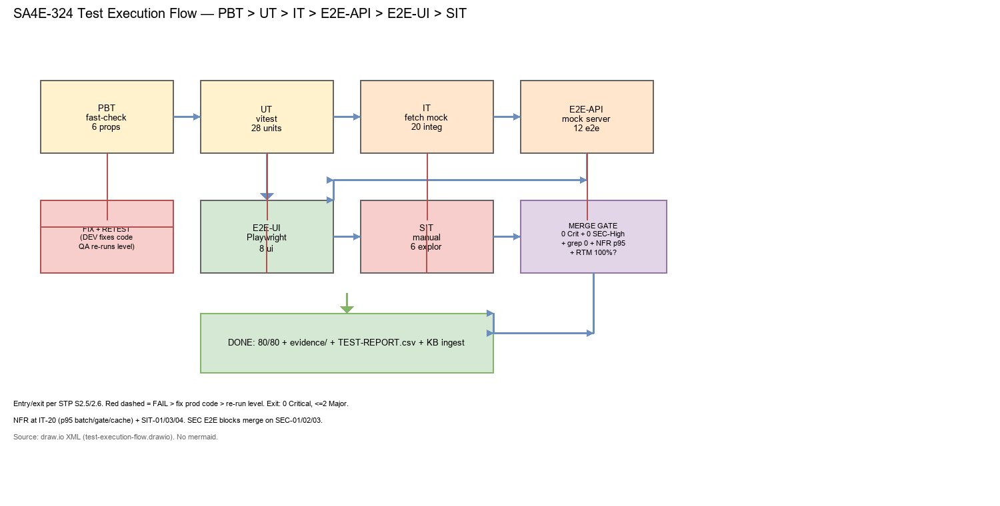
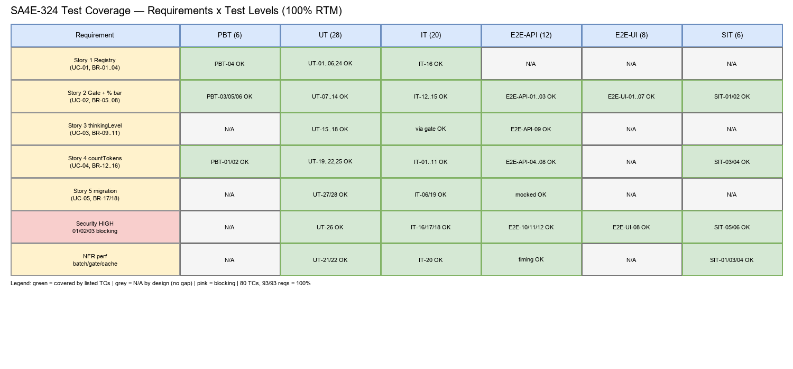

# Software Test Plan (STP)

## Pi Context Budget + Model Registry — SA4E-324: Pi Context Budget + Model Registry for small-context models

---

## Document Information

| Field | Value |
|-------|-------|
| Jira Ticket | SA4E-324 |
| Title | Pi Context Budget + Model Registry for small-context models |
| Epic | SA4E-289 — Migrate LangGraph Workflow Engine to Pi SDK (Option C) |
| Author | QA Agent |
| Version | 1.0 |
| Date | 2026-09-27 |
| Status | Draft |
| Related BRD | documents/SA4E-324/BRD.md v1.0 (5 stories, AC 1-5) |
| Related FSD | documents/SA4E-324/FSD.md v1.2 (UC-01..05, BR-01..18, NFR-01..13, TC-01..12, OI-01..07) |
| Related TDD | documents/SA4E-324/TDD.md v1.1 FINAL (Module/Class, API countTokens, Checklist M-01..M-08) |
| Related Security Review | documents/SA4E-324/SECURITY-REVIEW.md v1.0 (13 findings: 3 High SEC-324-01/02/03, 5 Medium, 4 Low, 1 Info) |

---

## Author Tracking

| Role | Name - Position | Responsibility |
|------|-----------------|----------------|
| Author | QA Agent – QA Engineer | Create STP + STC + test data + diagrams |
| Peer Reviewer | TBD – QA Lead | Review STP/STC, approve RTM 100% |
| Security Reviewer | Security Agent | Verify SEC-324-01/02/03 coverage |

---

## Revision History

| Version | Date | Author | Changes |
|---------|------|--------|---------|
| 1.0 | 2026-09-27 | QA Agent | Initiate STP from BRD v1.0 + FSD v1.2 + TDD v1.1 FINAL + SECURITY-REVIEW v1.0 + verified code. 6 test levels, 80 test cases, RTM 100%, 2 draw.io diagrams, 10 CSV test-data files. |

---

## Sign-Off

| Name | Signature and date |
|------|--------------------|
| QA Lead | ☐ I agree and confirm the test plan in this STP |
| Tech Lead | ☐ I agree and confirm the test scope and entry/exit criteria |
| Product Owner | ☐ I agree and confirm acceptance criteria coverage (BRD AC 1-5) |

---

## 1. Introduction

### 1.1 Purpose

This STP defines the test strategy, scope, resources, schedule, and quality gates for **SA4E-324 Pi Context Budget + Model Registry** under Epic **SA4E-289** (Pi SDK migration, Option C). The feature adds a 9-entry Model Registry, a pre-session Context Budget Gate (REJECT >95% / WARN >85% / ALLOW), thinkingLevel → maxTokens mapping, provider-API-based `countTokens` + window detection on all 4 provider families (Anthropic / OpenAI-compatible / Ollama / ONNX), chatbox % usage display, diagnostics, and a mandatory mocked-API test-scope migration with CI green. This plan also covers the 3 High security findings (SEC-324-01 SSRF baseUrl, SEC-324-02 path traversal tokenizer, SEC-324-03 tool-chaining) as release-blocking tests.

### 1.2 Test Objectives

- Verify all 5 BRD stories and AC 1-5: registry seeds + fallback, budget gate REJECT/WARN/ALLOW with fail-safe on 2k models, thinkingLevel mapping capped at maxOutput, API-truth numerator + denominator with zero hard-coded primaries, mocked-API test migration with CI green.
- Validate all 18 business rules (BR-01..BR-18), 5 use cases (UC-01..UC-05), 13 NFRs (NFR-01..NFR-13), 12 FSD scenarios (TC-01..TC-12), 8 implementation fixes (M-01..M-08), and 3 High security findings with reproducible evidence.
- Prove NFR targets with measurements: countTokens batch p95 <300ms local / <1500ms cloud, gate total p95 <500ms local / <2s cloud with <=2 logical calls, window cache hit p95 <5ms.
- Prove regression goal: zero remaining hard-coded primaries (`len/4`, `len/3.5`, `200000`, `128000`, `8192` ctor, `2048` ctor, `3500/4000` chars, `+4/msg`) outside the single `BaseLlmProvider.fallbackCount` fallback.
- Maximize automation: 74/80 cases automated (92.5%), only 6 manual SIT cases for visual/UX/timing/human-judgment checks.

### 1.3 References

| Document | Location |
|----------|----------|
| BRD v1.0 (5 stories, AC 1-5, mandatory token rule, test scope A-E) | documents/SA4E-324/BRD.md |
| FSD v1.2 (UC-01..05, BR-01..18, NFR-01..13, TC-01..TC-12, OI-01..07, golden payloads) | documents/SA4E-324/FSD.md |
| TDD v1.1 FINAL (interfaces, per-provider matrix, M-01..M-08, OI decisions D-01/D-02/D-03/D-07/D-08/D-09, test hooks §12) | documents/SA4E-324/TDD.md |
| SECURITY-REVIEW v1.0 (SEC-324-01..13, CVSS, remediations) | documents/SA4E-324/SECURITY-REVIEW.md |
| DISCREPANCY v1 (DISC-01..DISC-06 resolved in FSD v1.2) | documents/SA4E-324/DISCREPANCY.md |
| Verified code (read 2026-09-27) | extension/src/langgraph/providers/__tests__/ (anthropic 200000, ollama 8192, onnx 2048, openai 128000), extension/src/chat-panel/__tests__/token-counter, extension/src/chat-panel/context-usage-tracker.ts:121, extension/src/langgraph/core/context-budget.ts:13, extension/src/chat-panel/chat-panel-provider.ts:59-60, extension/src/pi-agent/__tests__/model-registry, extension/src/pi-agent/__tests__/session-configurator.budget, extension/src/pi-agent/__tests__/session-compactor, extension/src/pi-agent/__tests__/context-budget, extension/src/pi-agent/__tests__/prompt-template-tiers, extension/src/pi-agent/thinking-level-mapper.ts, extension/package.json (vitest 4.1.8, fast-check 4.9.0, js-tiktoken absent TO-BE) |

---

## 2. Test Strategy

### 2.1 Test Levels (MANDATORY — 6 levels)

| Level | Scope | Automation | Tools |
|-------|-------|------------|-------|
| PBT | Correctness properties (random inputs) | Automated | fast-check |
| UT | Unit/edge case tests | Automated | vitest |
| IT | API integration (Hono app in-process) | Automated | vitest + Hono `app.request()` |
| E2E-API | REST endpoint E2E (real server) | Automated | vitest + fetch |
| E2E-UI | Browser UI E2E (Playwright) | Automated | Playwright |
| SIT | Manual exploratory / edge cases only | Manual | Browser |

Project adaptation for SA4E-324 (extension-host, in-process, no HTTP surface of its own):

| Level | SA4E-324 Scope | Automation | Tools / Files |
|-------|----------------|------------|---------------|
| PBT | Properties over registry/budget/gate/countTokens (order/length, monotonicity, partitioning, clamp, rounding) | Automated | fast-check 4.9.0, `extension/src/**/__tests__/*.pbt.test.ts` |
| UT | Pure units: ModelRegistry validate, BudgetCalculator math, ThresholdGate boundaries, ThinkingLevelMapper throw/cap/default, fallbackCount, cache TTL logic, diagnostics rounding, smollm2 1024 pin, M-02 type, M-05 dead-constant deletion | Automated | vitest run, `extension/src/pi-agent/__tests__/`, `extension/src/langgraph/providers/__tests__/` |
| IT | Provider `countTokens` vs mocked `fetch` per vendor + window detection + timeout/fallback/auth/file cases + gate wiring with mocked provider + tracker async + cache coalescing + security unit-integration (baseUrl validate, modelId guard, bridge allowlist) | Automated | vitest + `vi.stubGlobal('fetch')`, temp-dir `tokenizer.json` fixtures, `logger` spies |
| E2E-API | Full gate E2E vs real mock HTTP server with `fetch` (Anthropic count_tokens, OpenAI models+tokenize, Ollama show, ONNX files) + auth/validation/error E2E + audit-log assertions + security E2E (SSRF key-not-sent, traversal blocked, chaining denied) | Automated | vitest + fetch, `tests/e2e/*.e2e.test.ts` pattern (mock vendor server on loopback) |
| E2E-UI | Chatbox % bar in webview via Playwright: total % bar, threshold colors (safe/warning/critical/full), REJECT toast, WARN notice, model-switch setMaxTokens, per-category rows, fallback rendering, sanitized fallbackFrom | Automated | Playwright, `tests/e2e/*.ui.e2e.test.ts` + helpers |
| SIT | Manual exploratory / edge cases only: overlay timing, responsive layout eyeball, Vietnamese corpus judgment, streaming-drift judgment, hostile settings.json exploratory, prompt-injection chaining exploratory | Manual | Browser (Extension Development Host + chat panel webview) |



### 2.2 Test Types

| Type | Description | Applicable |
|------|-------------|------------|
| Functional Testing | Verify features work per FSD use cases UC-01..UC-05 | Yes |
| Regression Testing | Ensure hard-coded primaries deleted, existing suites still green | Yes |
| Performance Testing | Batch p95, gate p95, cache-hit p95, ≤2 logical calls, coalescing | Yes |
| Security Testing | SEC-324-01/02/03 (High, blocking) + SEC-04..12 mapped + NFR-09 zero-key-in-logs | Yes |
| Usability Testing | Chatbox % bar thresholds, REJECT/WARN messages actionable | Yes (E2E-UI + SIT) |
| Compatibility Testing | 4 provider families + local vs cloud + ONNX file presence variance | Yes |

### 2.3 Test Approach

Risk-based, API-truth-first. The highest risk is inaccurate budget math (OOM on 2k models) and key exfiltration/path traversal/tool-chaining, so provider contracts + fallback + gate goldens + 3 High security tests run first (PBT/UT/IT), then mock-server E2E-API, then webview E2E-UI, then minimal manual SIT. Every migrated legacy assert is converted from pasted constants to mocked-API returns; every fallback test asserts BOTH the `/4` value AND the `warn` log (BR-18). Test data: `documents/SA4E-324/testdata/*.csv` (199 rows, 100% ID coverage). Evidence: `documents/SA4E-324/evidence/`. Grep-gate regression (zero primaries) runs in CI as a test, not as a manual review step.

### 2.4 E2E Automation Coverage (SIT minimization)

| Scenario Type | Classify As | Reason |
|--------------|-------------|--------|
| CRUD-equivalent: resolveModel/getModelMetadata/listModels | E2E-API | Deterministic registry reads via mock server not needed; covered at IT + E2E-API gate |
| Form-equivalent: contextBudget inputs, thinkingLevel enum | E2E-API | Input/output clearly assertable without browser |
| API response verification (count_tokens input_tokens, models context_length/meta.n_ctx, show model_info.context_length, tokenize tokens[][], prompt_eval_count) | E2E-API | No browser needed |
| RBAC/auth checks (missing key throw-before-HTTP, 401/403 fallback without key in logs) | E2E-API | API-level check sufficient |
| Status changes (REJECT/WARN/ALLOW decisions, diagnostics decision field) | E2E-API | State verified via thrown error + diagnostics object |
| Confirmation-equivalent (isAvailable fast-fail hints, Ollama unreachable message) | E2E-API | Message asserted without browser |
| Regression — existing suites (token-counter, conversation-manager, tracker, context-budget, prompt-template-tiers, chat-graph compat) | E2E-API/IT | Re-run automated with mocked countTokens |
| Chatbox % bar rendering + threshold colors | E2E-UI | Needs webview DOM but deterministic → Playwright |
| REJECT toast / WARN inline notice content | E2E-UI | DOM text assertion |
| Blocking overlay timing / animation smoothness | SIT (manual) | Visual timing hard to automate |
| Complex UX (webview resize, multi-tab tracker map) | SIT (manual) | Needs human judgment |
| Visual/layout verification (bar alignment, badge contrast) | SIT (manual) | Needs human eyes |
| Vietnamese token-accuracy judgment + streaming-drift judgment | SIT (manual) | Corpus eyeball beyond ±15%/±10% thresholds |
| Hostile settings.json / prompt-injection exploratory | SIT (manual) | Adversarial creativity |

### 2.5 Entry Criteria

| Level | Entry Criteria |
|-------|---------------|
| PBT | FSD v1.2 + TDD v1.1 interfaces frozen; fast-check 4.9.0 available; registry seed values confirmed (smollm2 1024 enforced) |
| UT | PBT properties defined; `extension/src` compiles; existing suites listed in BRD §8.1 runnable |
| IT | UT green; `fetch` mock seams + `tokenizer.json` fixtures + `logger` spies ready per TDD §12.1; mock payloads from FSD §11 goldens prepared |
| E2E-API | IT green; mock vendor HTTP server (loopback) implements count_tokens/models/tokenize/show/chat contracts; no prod keys in env |
| E2E-UI | E2E-API green; Extension Development Host + chat panel webview buildable; Playwright helpers (auth/navigation/assert) ready |
| SIT | E2E-UI green with ≤2 Major open; evidence/ dir ready; hostile fixtures (malicious settings.json, traversal modelIds, chaining payloads) prepared |

### 2.6 Exit Criteria

| Level | Exit Criteria |
|-------|---------------|
| PBT | 6/6 properties pass ≥100 runs each, 0 counterexamples, seeds fixed |
| UT | 28/28 pass, 0 Critical/Major defects open, branch coverage ≥90% on registry/budget/mapper/fallback |
| IT | 20/20 pass, all 4 provider contracts + batch + fallback + window + file + gate + security integration green |
| E2E-API | 12/12 pass, gate goldens (238% REJECT + WARN + ALLOW) + auth + security E2E green, ≤2 network calls per gate verified |
| E2E-UI | 8/8 pass, % bar + colors + toasts + model-switch + sanitization verified with screenshots |
| SIT | 6/6 executed, results + screenshots in evidence/, 0 Critical open, ≤2 Major open with mitigation |

### 2.7 Test Cases Summary (MANDATORY)

| Level | Count | Automated | Manual |
|-------|-------|-----------|--------|
| PBT | 6 | 6 | 0 |
| UT | 28 | 28 | 0 |
| IT | 20 | 20 | 0 |
| E2E-API | 12 | 12 | 0 |
| E2E-UI | 8 | 8 | 0 |
| SIT | 6 | 0 | 6 |
| **Total** | **80** | **74 (92.5%)** | **6 (7.5%)** |

Detailed IDs: PBT-01..06, UT-01..28, IT-01..20, E2E-API-01..12, E2E-UI-01..08, SIT-01..06 — see STC.md. Every ID appears in at least one CSV in `testdata/`.

---

## 3. Test Scope



### 3.1 Features In Scope

| # | Feature / Story | Priority | FSD Reference | Test Type |
|---|----------------|----------|---------------|-----------|
| 1 | Story 1: Model Registry (9 seeds, validation, unknown fallback, smollm2 1024 enforced, shared-IDs consistency) | High | UC-01, BR-01..BR-04, FSD TC-01/TC-02, M-02/M-03, OI-05 | PBT, UT, IT, E2E-API |
| 2 | Story 2: Budget Gate + chatbox % (REJECT >95 incl. phi-3 4875/238%, WARN 85-95, ALLOW, fail-closed <=0 →100%, reserve ≥2000, diagnostics 1dp) | High | UC-02 (+AF-04/AF-05/EF-03..EF-05), BR-05..BR-08, FSD TC-03/TC-04/TC-05/TC-10/TC-11, M-05, D-03/D-09 | PBT, UT, IT, E2E-API, E2E-UI, SIT |
| 3 | Story 3: thinkingLevel mapping (low/med/high, cap at maxOutput, throw on invalid BR-10, default medium, qwen/high →1024) | High | UC-03, BR-09..BR-11, FSD TC-06, M-01 | PBT, UT, IT, E2E-API |
| 4 | Story 4: API countTokens + window (Anthropic count_tokens, OpenAI models+tokenize, Ollama show+prompt_eval_count, ONNX tokenizer.json, js-tiktoken cloud D-01, 1 logical call batch DISC-01/D-08, fallback /4+warn BR-13, zero primaries BR-14, same-provider BR-15, real tokenizer BR-16) | High | UC-04 (+EF-03..EF-07), BR-12..BR-16, FSD TC-07/TC-08/TC-09/TC-12, M-04/M-06/M-07/M-08, OI-01/02/03/04/06/07 | PBT, UT, IT, E2E-API |
| 5 | Story 5: Test migration (providers __tests__ A, heuristic suites B, mock-compat C, new contract/batch/fallback D, CI green gate E, BR-17/BR-18) | High | UC-05, BR-17..BR-18, FSD §10.2 A-D | UT, IT, E2E-API |
| 6 | Security Highs (SEC-324-01 SSRF baseUrl + restricted config + malicious settings.json; SEC-324-02 traversal regex+realpath + ENOENT + corrupt vocab; SEC-324-03 allowlist + deny chaining + approval) | High (blocking) | SECURITY-REVIEW §SEC-01..03, TDD §7, FSD §7 | IT, E2E-API, SIT (+UT guards) |
| 7 | Security Mediums (SEC-04 secret tripwire, SEC-05 redacted CredentialsError + env allowlist, SEC-06 settings fail-closed/null-proto/1MB cap, SEC-07 cwd/SYSTEM.md containment, SEC-08 js-tiktoken pin 1.0.21 + audit) | Medium | SECURITY-REVIEW §SEC-04..08 | IT, E2E-API, UT |
| 8 | Security Lows + Info (SEC-09 read caps, SEC-10 central redaction, SEC-11 model-id sanitization, SEC-12 cache/rate-limit, SEC-13 loopback/nonce/LRU/dispose) | Low | SECURITY-REVIEW §SEC-09..13 | UT, IT, SIT |
| 9 | NFR performance (NFR-01 batch p95 <300ms local/<1500ms cloud; NFR-13 gate p95 <500ms local/<2s cloud ≤2 calls coalesced; NFR-12 cache hit <5ms 1h TTL; NFR-02 pre-session only + load-once; NFR-10 streaming ±10%; NFR-11 Vietnamese ±15% + >20% flag) | High | FSD §8 NFR-01/02/10/11/12/13, TDD §8.3, FSD TC-12 | IT, E2E-API, SIT |
| 10 | NFR correctness/observability (NFR-03 100% API truth + grep 0 primaries; NFR-04 0 over-threshold sessions; NFR-05 0%/100% fallback rates; NFR-06 100% diagnostics; NFR-07 named constants only; NFR-08 4-family parity; NFR-09 0 keys in logs) | High | FSD §8 NFR-03..09, FSD TC-11/TC-12 | PBT, UT, IT, E2E-API |

### 3.2 Features Out of Scope

| # | Feature | Reason |
|---|---------|--------|
| 1 | Full Pi SDK migration phases (Executor, Router, Checkpointer, Human Approval) | Parent Epic SA4E-289 scope, not SA4E-324 |
| 2 | LangGraph engine deletion / legacy `langgraph/core/context-budget.ts` checkAutoCompact rewrite | Explicitly out of scope per FSD v1.2 BR-07 / TDD D-09 (separate ticket; DEV must NOT fix, QA must NOT assert BR-07 against it) |
| 3 | Inference quality tuning for small models beyond budget math | BRD §1.2 out of scope |
| 4 | Chat-panel UI redesign beyond budget messages (% bar exists; no new screens) | BRD §1.2 out of scope |
| 5 | Cost billing / quota enforcement (costPer1k is routing/display only) | BRD §1.2 out of scope |
| 6 | Catalog-only model IDs (claude-opus-4-8, o1, deepseek-v3-2, 40+ dropdown IDs with no registry entry) | Out of gate scope per FSD v1.2 §3.1.1 DISC-06; unknown → default fallback only |
| 7 | Backend (Hono) surfaces, network policy, lockfile `npm audit` run | SECURITY-REVIEW §B scope limitations |

---

## 4. Test Environment

### 4.1 Environment Requirements

| Environment | Setup | Purpose |
|-------------|-------|---------|
| DEV-EXT (Extension Development Host) | VS Code 1.85+, Node 18+, `extension/` compiled, Pi SDK 0.80.10 installed | PBT/UT/IT execution (`vitest run`), mock-vendor E2E-API server on loopback |
| WEBVIEW (Chat Panel) | Chat panel webview bundle + Playwright Chromium | E2E-UI % bar, toasts, model-switch |
| MANUAL (Exploratory) | DEV-EXT + hostile fixtures + real Ollama optional (11434) / LM Studio optional (1234) | SIT exploratory, screenshots to evidence/ |
| CI | `npm test` (vitest run) + `test:e2e` + grep-gate + `npm audit` (at implementation) | Gate: full scope green, zero hard-coded asserts |

### 4.2 Browser / Device Requirements

| Browser | Version | OS | Required |
|---------|---------|-----|----------|
| Chromium (Playwright bundled) | latest | Windows | Yes (E2E-UI + SIT) |
| Chrome / Edge | 90+ | Windows | No (manual fallback only) |

No mobile/browser-matrix testing — VS Code webview (Chromium) is the only render target.

### 4.3 Test Data Requirements (CSV strategy)

All test data lives in `documents/SA4E-324/testdata/`. Every STC ID appears in at least one CSV. Dynamic IDs use `{placeholders}` resolved at runtime.

| File | Domain | Covers (IDs) | Rows |
|------|--------|--------------|------|
| pre-seeded-models.csv | Baseline registry seeds + tokenizer fixtures that must exist before tests | UT-01..UT-06, PBT-04 (fixtures) | 12 |
| registry-testdata.csv | Registry validation + fallback + smollm2 pin + shared-IDs | PBT-04, UT-01..UT-06, UT-24, IT-16 (partial), TC-01/TC-02 | 18 |
| budget-gate-testdata.csv | Gate goldens incl. phi-3 4875/238% REJECT, WARN/ALLOW boundaries, fail-closed, reserve clamp, diagnostics 1dp | PBT-03/05/06, UT-07..UT-14, UT-23, IT-12..IT-15, E2E-API-01..03, TC-03/04/05/11 | 24 |
| counttokens-contract-testdata.csv | Per-provider count + window contracts vs mocked APIs | IT-01..IT-05, E2E-API-04..07, UT-25, TC-07 | 20 |
| batch-fallback-testdata.csv | Batch 1-logical-call + order + empty→0 + timeout/401/404 fallback + warn | PBT-01/02, IT-06..IT-09, E2E-API-08, TC-08/09 | 18 |
| thinking-mapper-testdata.csv | low/med/high per model + cap + throw + default medium + qwen/high 1024 | UT-15..UT-18, IT (mapper path), E2E-API-09, TC-06 | 14 |
| window-cache-testdata.csv | detectContextWindow cache 1h TTL + hit <5ms + coalescing + keep-default warn | UT-21/22, IT-09/20, NFR-12 | 10 |
| regression-grep-testdata.csv | Zero-primaries grep patterns + allowed fallback single-site + dead-constant deletion | UT-27/28, IT-19, TC-12, NFR-03/07 | 12 |
| security-testdata.csv | SEC-01/02/03 payloads (malicious baseUrls, traversal modelIds, chaining calls) + SEC-04..08 checks | UT-26, IT-16/17/18, E2E-API-10/11/12, SIT-05/06 | 22 |
| chatbox-ui-testdata.csv | % bar totals, threshold colors, toasts, model-switch, per-category rows, sanitization | IT-19, E2E-UI-01..08, TC-10 | 16 |
| nfr-perf-testdata.csv | Batch/gate/cache latency budgets + streaming ±10% + Vietnamese ±15% corpus refs | IT-20, E2E-API (timing), SIT-03/04, TC-12, NFR-01/02/10/11/13 | 12 |
| sit-exploratory-testdata.csv | Manual charters, hostile fixtures, oracle notes for 6 SIT sessions | SIT-01..06 | 6 |
| **Total** | | **80/80 IDs covered (100%)** | **199 rows** |

### 4.4 External Dependencies (stubs/mocks)

| System | Dependency | Mock/Stub Available |
|--------|-----------|---------------------|
| Anthropic count_tokens + models | `POST /v1/messages/count_tokens` per-text, `GET /v1/models` window, headers x-api-key + anthropic-version | Yes — `vi.stubGlobal('fetch')` per-test (IT) + loopback mock server (E2E-API); fixtures in counttokens-contract-testdata.csv |
| OpenAI-compat models + tokenize / js-tiktoken | `GET /v1/models` (context_length else meta.n_ctx), `POST /tokenize` local; cloud js-tiktoken 1.0.21 local encode | Yes — fetch mock + js-tiktoken stub (encode table); no prod keys |
| Ollama show + chat/tokenize | `POST /api/show` (model_info.context_length), `POST /api/tokenize` or `/api/chat` dry-run + `GET /api/tags` isAvailable | Yes — fetch mock incl. 404 + refused; conservative=true flag asserted |
| ONNX tokenizer.json | `.code-intel/models/llm/{modelId}/tokenizer.json` valid/missing/corrupt/empty-vocab fixtures | Yes — temp-dir fixtures; realpath + regex guard under test |
| Pi SDK createAgentSession | `@earendil-works/pi-agent-core` SessionManager.inMemory + createAgentSession | Mock sdk object counts calls (0 on REJECT); diagnostics passthrough asserted |
| Chat webview | VS Code webview + ContextUsageTracker payload | Playwright + tracker payload fixtures; no prod backend |

---

## 5. Test Schedule

| Phase | Start Date | End Date | Duration | Milestone |
|-------|-----------|----------|----------|-----------|
| Test Planning | 2026-09-27 | 2026-09-27 | 1 day | STP + STC approved, RTM 100% |
| Test Data Preparation | 2026-09-27 | 2026-09-28 | 1 day | 10 CSVs + fixtures + mock servers ready |
| PBT + UT Execution | 2026-09-28 | 2026-09-29 | 2 days | 34/34 green, coverage ≥90% |
| IT Execution (contracts + fallback + gate + security) | 2026-09-29 | 2026-10-01 | 3 days | 20/20 green, 3 Highs proven |
| E2E-API Execution (mock-server gate + auth + security) | 2026-10-01 | 2026-10-02 | 2 days | 12/12 green, ≤2 calls/gate |
| E2E-UI Execution (chatbox % bar) | 2026-10-02 | 2026-10-03 | 2 days | 8/8 green + screenshots |
| SIT Execution (manual exploratory) | 2026-10-03 | 2026-10-04 | 2 days | 6/6 with evidence |
| Defect Fix & Retest | 2026-10-04 | 2026-10-06 | 3 days | 0 Critical, ≤2 Major |
| Sign-off & KB ingest | 2026-10-06 | 2026-10-06 | 0.5 day | STP/STC ingested, Jira attach ready |

---

## 6. Resources & Responsibilities

| Role | Name | Responsibility |
|------|------|---------------|
| Test Lead | TBD | Planning, entry/exit enforcement, RTM 100% sign-off, reporting |
| QA Engineer | QA Agent | STC design (80 cases), CSV data (199 rows), diagrams, execution, defect reporting |
| BA | TBD | AC clarification (BRD AC 1-5), UAT-equivalent message wording (REJECT/WARN) |
| Developer | Extension team | Bug fixing per M-01..M-08 + SEC-01..03 remediations; keep CI green; no prod-code change by QA |
| Security Agent | Security team | Verify SEC-324-01/02/03 tests block merge; review NFR-09 log audit |
| DevOps | TBD | CI (vitest + e2e + grep-gate + audit), Extension Development Host stability |

Tools: vitest 4.1.8, fast-check 4.9.0, Playwright (Chromium), `vi.stubGlobal('fetch')`, temp-dir fixtures, draw.io (XML only, no mermaid), KB (mem_search/mem_ingest_file), Jira SA4E-324 for defects.

---

## 7. Risk & Mitigation

| # | Risk | Impact | Likelihood | Mitigation |
|---|------|--------|------------|------------|
| 1 | Provider token APIs unavailable/slow (network, local server down) | High (gate blocked/inaccurate) | Medium | Fallback /4 + warn tests (IT-07/08/09, PBT-02); 5s timeout tests; isAvailable fast-fail tests; batch=1 call verified |
| 2 | Cross-provider count divergence (Anthropic vs tiktoken vs Ollama vs ONNX) | Medium (percent not comparable) | High | Same-provider numerator/denominator tests (BR-15: IT-01..05, E2E-API-04..07); Ollama conservative=true flag test; documented per-provider semantics |
| 3 | 2k models always REJECT default 7500-char system (adoption confusion) | Medium | High | Golden REJECT test (IT-12/E2E-API-01: 4875/238%) + message-remediation assertion (AC #2 wording); UG fail-safe note referenced in STC |
| 4 | Hard-coded remnants missed (len/4, len/3.5, constants) | High (AC #3 failure) | Medium | Grep-gate regression tests (UT-27/28, TC-12, NFR-03) with exact file:line patterns from §8.1; CI gate |
| 5 | Test migration incomplete (stale hard-coded asserts) | Medium (false-green CI) | Medium | File:line checklist §10.2 A-C mapped to UT/IT cases; BR-17 (assert mocked value) + BR-18 (value AND warn) enforced per case |
| 6 | ONNX tokenizer.json missing/corrupt or split heuristic retained | Medium (wrong phi-3/smollm2 counts) | Medium | EF-05/EF-06 tests (IT-10/11, E2E-API-07): ENOENT/SyntaxError → unavailable + clear error, never silent split |
| 7 | SEC-324-01 key exfiltration via malicious baseUrl/settings.json | High (credential loss) | Medium | Blocking tests IT-16/E2E-API-10/SIT-05: validateBackendUrl reuse + restrictedConfigurations + key-not-sent assertion |
| 8 | SEC-324-02 traversal arbitrary file read | High (confidentiality + gate integrity) | Medium | Blocking tests IT-17/E2E-API-11: regex + realpath + both-files isAvailable + error-path disclosure check |
| 9 | SEC-324-03 tool-chaining privesc via execute_dynamic_tool | High (full toolbelt access) | Medium | Blocking tests IT-18/E2E-API-12/SIT-06: allowlist + deny-chaining-default + approval routing + audit log |
| 10 | NFR breach (batch/gate/cache latency, streaming drift, Vietnamese accuracy) | Medium | Medium | Timing tests with mocked latency (IT-20, nfr-perf CSV) + drift/corpus tests (SIT-03/04); coalescing + ≤2-calls assertions |

---

## 8. Defect Management

### 8.1 Severity Levels

| Severity | Definition | Example (SA4E-324) |
|----------|-----------|---------------------|
| Critical | Session OOM/crash, data loss, security breach (Highs open), gate fail-open over 95% | REJECT not thrown at 238%; key sent to attacker baseUrl; traversal reads /etc/passwd; chaining executes destructive tool |
| Major | Feature not working, workaround exists | WARN missing but session created; smollm2 uses 2048 not 1024; invalid thinkingLevel defaults instead of throwing |
| Minor | UI issue, cosmetic defect | % bar color off-by-one band; diagnostics percent 2dp instead of 1dp |
| Trivial | Typo, alignment | REJECT message punctuation; log field order |

### 8.2 Priority Levels

| Priority | Definition | SLA (Fix Time) |
|----------|-----------|----------------|
| P1 | Must fix immediately (Critical + all 3 Highs) | 4 hours |
| P2 | Must fix before release (Major, NFR breach) | 1 business day |
| P3 | Should fix if time permits (Minor) | 3 business days |
| P4 | Nice to fix, can defer (Trivial, Info SEC-13) | Next release |

### 8.3 Defect Lifecycle

```
New → Open → In Progress → Fixed → Ready for Retest → Verified → Closed
                                                      → Reopened → In Progress
```

File defects against SA4E-324 with labels `stp`, `stc`, `SEC-324-0x` where applicable; link failing TC ID + CSV row + evidence PNG/log snippet.

---

## 9. Test Metrics & Reporting

### 9.1 Metrics

| Metric | Formula | Target |
|--------|---------|--------|
| Test Execution Rate | Executed / Total × 100% | 100% (80/80) |
| Pass Rate | Passed / Executed × 100% | ≥ 95% |
| Automation Rate | Automated / Total × 100% | ≥ 90% (plan 92.5%) |
| Defect Density | Defects / Test Cases | ≤ 0.1 |
| Critical Defect Count | Count of Critical severity | 0 |
| High Security Open | SEC-324-01/02/03 open count | 0 (merge gate) |
| Defect Fix Rate | Fixed / Total Defects × 100% | ≥ 90% |
| RTM Coverage | Covered reqs / Total reqs × 100% | 100% (UC 5/5, BR 18/18, NFR 13/13, SEC-High 3/3, FSD-TC 12/12) |
| NFR Pass | NFR timing/accuracy asserts passed | 100% (batch/gate/cache/drift/corpus) |
| Grep-Gate Pass | Zero primaries outside fallback | Pass (0 hits) |

### 9.2 Reporting Schedule

| Report | Frequency | Audience |
|--------|-----------|----------|
| Daily Test Status (per-level burndown) | Daily during PBT→SIT | Project team |
| Defect Summary (incl. SEC Highs) | Daily | Dev + Security + PM |
| Test Completion Report (final counts + RTM + NFR measurements) | End of SIT | All stakeholders |
| KB ingest confirmation (STP + STC entry IDs) | Once at sign-off | SM / cross-agent |

---

## 10. Appendix

### Glossary

| Term | Definition |
|------|------------|
| SIT | System Integration Testing (here: manual exploratory only) |
| UAT-equivalent | REJECT/WARN message wording validated with BA (no separate UAT env for extension-host feature) |
| STP / STC | Software Test Plan / Software Test Cases |
| countTokens | `LlmProvider.countTokens(texts[]): Promise<number[]>` — batched, order/length-preserving, API truth |
| Fallback | `ceil(len/4)` ONLY on API failure + `warn` (single site `BaseLlmProvider.fallbackCount`) |
| Diagnostics | `session.diagnostics` with 1-decimal usagePercent + decision |
| Grep gate | Automated zero-primaries assertion over `extension/src` |
| RTM | Requirements Traceability Matrix (full matrix in STC.md §10) |

### Assumptions

- Reserve 2000 tokens suffices for Pi session overhead across all registered models (BRD §5.2).
- Thresholds 95/85 are named constants; per-model tuning is future work.
- thinkingMap values supplied are sane (each <= maxOutput); invalid entries rejected, not clamped.
- Counting APIs use the same tokenizers as inference (counts match context reality).
- Batch countTokens has no ordering/length side effects; Anthropic per-text fan-out is an internal implementation of one logical call (DISC-01/D-08).
- Extension Development Host + loopback mock servers are available for E2E-API; no prod keys are used in any test.
- Only draw.io is used for diagrams (no mermaid per ticket instruction).

### STP-Level RTM Summary (detail in STC.md §10)

| Category | Total | Covered | Coverage % | Test IDs (sample) |
|----------|-------|---------|------------|-------------------|
| Use Cases UC-01..05 | 5 | 5 | 100% | UC-01: UT-01..06/PBT-04; UC-02: IT-12..15/E2E-API-01..03; UC-03: UT-15..18; UC-04: IT-01..11; UC-05: UT-27/28 + IT-06..09 |
| Business Rules BR-01..18 | 18 | 18 | 100% | Each BR ≥1 case (see STC RTM) |
| BRD Acceptance Criteria AC 1-5 | 5 | 5 | 100% | AC1: IT-12; AC2: IT-12/E2E-API-01; AC3: IT-01..05 + UT-27/28; AC4: IT-01/06/07; AC5: UT-27/28 + CI gate |
| NFR-01..13 | 13 | 13 | 100% | NFR-01/12/13: IT-20 + nfr-perf CSV; NFR-03: UT-27/28; others mapped per STC |
| FSD Scenarios TC-01..12 | 12 | 12 | 100% | TC-01→UT-01.., TC-03→IT-12.., TC-08→IT-06.., full map in STC |
| M-01..M-08 | 8 | 8 | 100% | M-01: UT-16; M-02: UT-27; M-03: UT-24; M-04: IT-01..05; M-05: UT-28; M-06: UT-27/28; M-07: IT-19; M-08: IT-09/20 |
| SEC High 01..03 | 3 | 3 | 100% | SEC-01: IT-16/E2E-API-10/SIT-05; SEC-02: IT-17/E2E-API-11; SEC-03: IT-18/E2E-API-12/SIT-06 |
| **Overall** | **64** | **64** | **100%** | **80 test cases, 199 CSV rows** |
