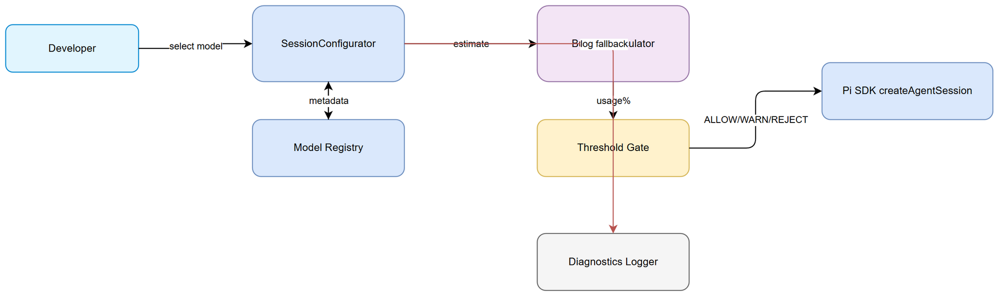
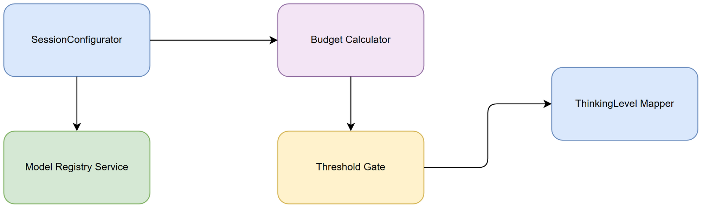
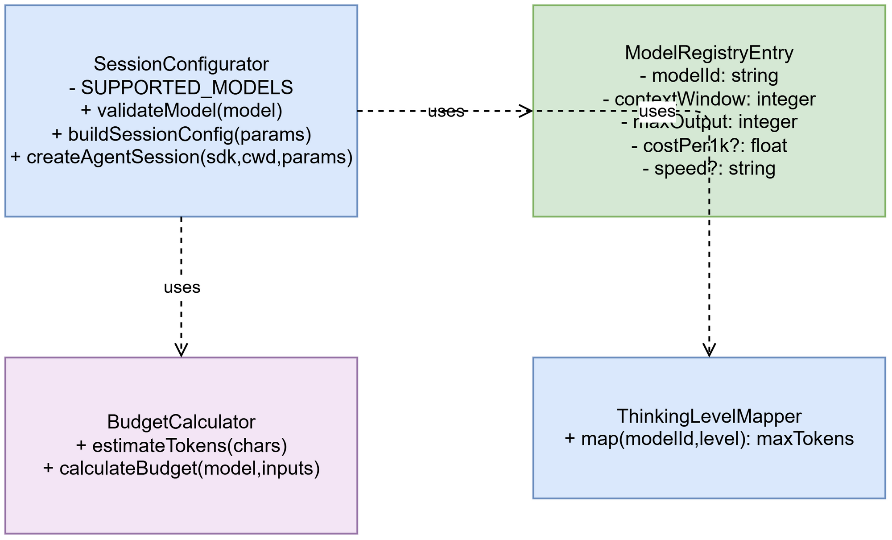

# Technical Design Document (TDD)

## Document Information

| Field | Value |
|-------|-------|
| Jira Ticket | SA4E-324 |
| Title | Pi Context Budget + Model Registry for small-context models |
| Version | 1.0 |
| Date | 2026-09-26 |
| Status | Draft |
| Related BRD | documents/SA4E-324/BRD.md |
| Related FSD | documents/SA4E-324/FSD.md |

---

## 1. Introduction

### 1.1 Purpose
Technical design for Model Registry and Context Budget calculation for Pi Agent small-context models, implementing UC-01 to UC-04 from FSD.

### 1.2 Scope
Extension components: chat-models.ts, session-configurator.ts, settings-manager.ts. No core agent creation logic changes beyond budget gate.

### 1.3 Design Principles
- Registry-driven model metadata
- Fail-safe budget check before session creation
- Conservative token estimation with reserve
- Observable diagnostics

---

## 2. Architecture Overview

Pi Agent Extension hosts SessionConfigurator which queries Model Registry defined in chat-panel/chat-models.ts. Budget calculation module estimates tokens from system prompt, tool schema, retrieval, history + reserve 2000. Threshold logic gates createAgentSession. Mapping table translates thinkingLevel to maxTokens per model.

*[Edit in draw.io](diagrams/architecture.drawio)*

### Components
- Model Registry – static metadata for small models
- SessionConfigurator – validation, budget check, config build
- Budget Calculator – chars→tokens heuristic
- Threshold Gate – >95% reject, >85% warn
- Diagnostics Logger – fallback logging

---

## 3. Component Design

### 3.1 Model Registry
Location: extension/src/chat-panel/chat-models.ts
Interface: ModelRegistryEntry { modelId, contextWindow, maxOutput, costPer1k?, speed? }
Update via code change, read-only at runtime.

### 3.2 SessionConfigurator
File: extension/src/pi-agent/session-configurator.ts
Methods:
- validateModel(model)
- buildSessionConfig(params)
- createAgentSession(sdk, cwd, params) – budget gate inserted

### 3.3 Budget Calculator
Heuristic: 1 token ≈ 4 chars. Reserve 2000 tokens mandatory.
Inputs: systemPromptChars ~7500, toolSchemaTokens, retrievalTokens, historyTokens

### 3.4 Threshold Gate
Decision = ALLOW / WARN / REJECT
Message includes % usage and reduction suggestions.

*[Edit in draw.io](diagrams/component.drawio)*

---

## 4. Class Design

*[Edit in draw.io](diagrams/class.drawio)*

SessionConfigurator
- static SUPPORTED_MODELS: Set<string>
- static validateModel(model:string): void
- static validateThinkingLevel(level?:string): void
- static buildSessionConfig(params:SessionConfigParams): Record<string,unknown>
- static createAgentSession(sdk, cwd, params): unknown

ModelRegistry
- entries: ModelRegistryEntry[]
- get(modelId): ModelRegistryEntry | undefined
- validate(entry): boolean

BudgetCalculator
- estimateTokens(chars:number): number
- calculateBudget(model, inputs): {estimatedTokens, usagePercent}

ThinkingLevelMapper
- map(modelId, level): maxTokens

---

## 5. Data Flow

User selects model + thinkingLevel → SessionConfigurator fetches Model Registry → Budget Calculator estimates tokens → Threshold Gate decides → ThinkingLevelMapper sets maxTokens → createAgentSession if allowed → Diagnostics logged on fallback.

---

## 6. Interface Definition

SessionConfigParams
{
  model: string;
  thinkingLevel?: 'low'|'medium'|'high';
  scopedModels?: string[];
  modelRuntime?: string;
  settingsManager?: SettingsManager;
  credentials?: CredentialRef;
  promptsOverride?: PromptTemplate[];
}

Model Registry Entry
| Field | Type | Required |
|-------|------|----------|
| modelId | string | Yes |
| contextWindow | integer | Yes |
| maxOutput | integer | Yes |
| costPer1k | float | No |
| speed | string | No |

---

## 7. Non-Functional Requirements Mapping

| Category | Requirement | Design Decision |
|----------|-------------|-----------------|
| Performance | Budget calc <100ms | Cache registry, sync heuristic |
| Security | Registry read-only | No external exposure |
| Scalability | Add model without core change | Registry-driven |
| Reliability | Conservative estimate | Reserve 2000 tokens |

---

## 8. Testability Notes

- Unit tests for SessionConfigurator.validateModel, BudgetCalculator.estimateTokens
- Integration test: small model 2k budget within limit → ALLOW
- Integration test: budget >95% → REJECT with message
- Mock Model Registry entries for phi-3-mini, smollm2-360m
- Diagnostics log assertions on fallback

---

## 9. Diagram Index

| # | Diagram | Image | Source |
|---|---------|-------|--------|
| 1 | Architecture Overview | [architecture.png](diagrams/architecture.png) | [architecture.drawio](diagrams/architecture.drawio) |
| 2 | Component Design | [component.png](diagrams/component.png) | [component.drawio](diagrams/component.drawio) |
| 3 | Class Design | [class.png](diagrams/class.png) | [class.drawio](diagrams/class.drawio) |

---

## 10. References

- BRD: documents/SA4E-324/BRD.md
- FSD: documents/SA4E-324/FSD.md
