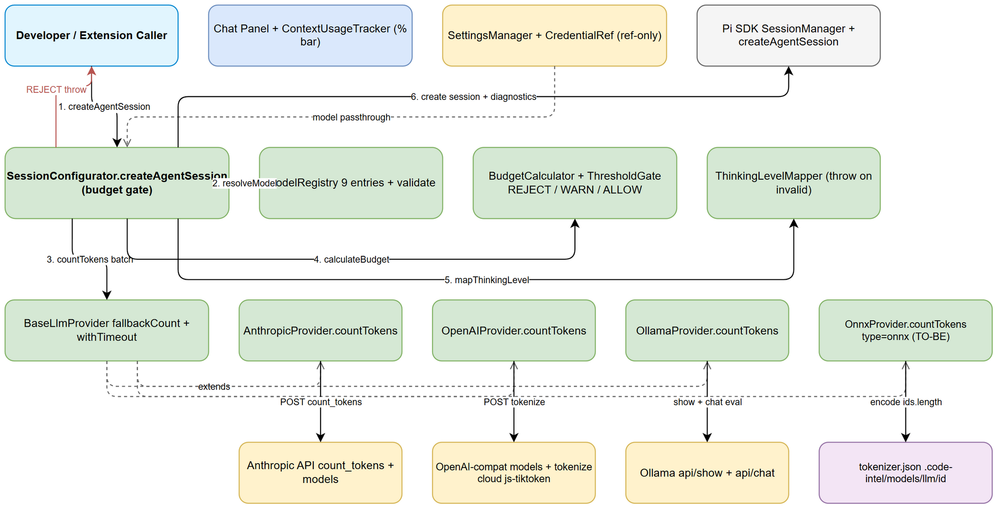
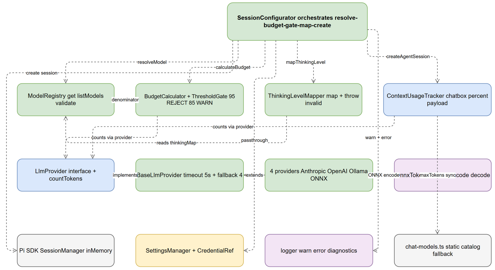
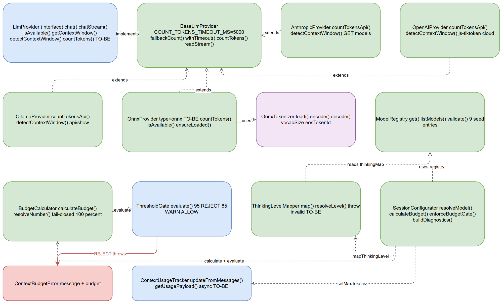
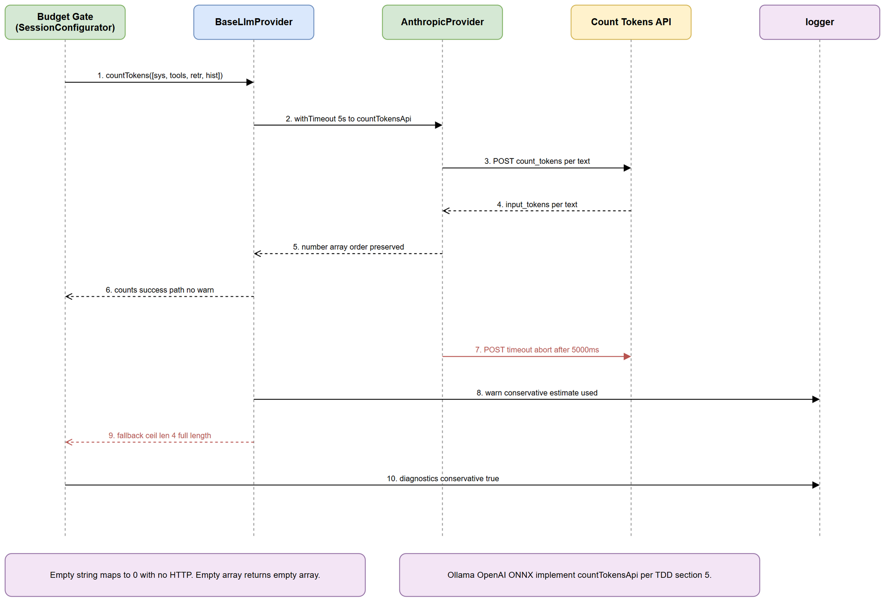

# Technical Design Document (TDD)

## Pi Context Budget + Model Registry — SA4E-324: Pi Context Budget + Model Registry for small-context models

---

## Document Information

| Field | Value |
|-------|-------|
| Jira Ticket | SA4E-324 |
| Title | Pi Context Budget + Model Registry for small-context models |
| Epic | SA4E-289 — Migrate LangGraph Workflow Engine to Pi SDK (Option C) |
| Author | SA Agent (Solution Architect) |
| Version | 1.1 (FSD v1.2 alignment — DISC-01–DISC-06 verified fixed, no design change) |
| Date | 2026-09-27 |
| Status | Final (consistent with FSD v1.2; DISCREPANCY v1 RESOLVED) |
| Related BRD | documents/SA4E-324/BRD.md (v1.0, 5 stories) |
| Related FSD | documents/SA4E-324/FSD.md (v1.2, 1020 lines, DISC-01–DISC-06 fixed) |

---

## Author Tracking

| Role | Name - Position | Responsibility |
|------|-----------------|----------------|
| Author | SA Agent – Solution Architect | Create document |
| Peer Reviewer | TBD – Tech Lead | Review document |

---

## Revision History

| Version | Date | Author | Changes |
|---------|------|--------|---------|
| 1.0 | 2026-09-27 | SA Agent | Initiate document — from BRD v1.0 + FSD v1.1 + 11 verified source files + KB context |
| 1.1 | 2026-09-27 | SA Agent | FSD v1.2 alignment review: verified DISC-01–DISC-06 fixed (§3.1.1 rulings, BR-07 scope, BR-12 logical-call, §5.2 D-01, NFR-01/NFR-13 logical-call + Ollama conservative flag, OI-03/OI-05 closed). No design change — TDD D-01/D-02/D-08/D-09 already anticipated rulings. Updated refs to FSD v1.2, marked DISCREPANCY v1 RESOLVED, set Status Final. |

---

## Sign-Off

| Name | Signature and date |
|------|--------------------|
| Tech Lead | ☐ I agree and confirm the technical design in this TDD |
| QA Lead | ☐ I agree and confirm the test hooks in §12 are sufficient |

---

## 1. Introduction

### 1.1 Purpose

This TDD specifies HOW to implement SA4E-324: a Model Registry for small-context models and a pre-session Context Budget Gate inside the VS Code extension (`extension/src`), plus provider-API-based `countTokens` on all 4 provider families. It resolves every TO-BE item flagged in FSD §4.2 (M-01..M-08) and records SA decisions for all open issues (OI-01..OI-07). Functional behavior (use cases, business rules, thresholds) is defined in the FSD and NOT repeated here — this document covers interfaces, classes, wire contracts, error handling, caching, security, and the implementation checklist.

> **v1.1 alignment note (2026-09-27):** Reviewed against FSD v1.2 (1020 lines). All 6 DISCREPANCY v1 items verified fixed in FSD — DISC-01 logical-call wording (§3.4.1/BR-12/§3.4.5.1/§5.1/§6.2/§6.4/NFR-01/NFR-13/TC-08), DISC-02 D-01 js-tiktoken (§5.2/OI-03), DISC-03 smollm2 1024 ruling (§3.1.1/OI-05), DISC-04 BR-07 Pi-gate scope (§3.2.3/§6.1), DISC-05 Ollama approximate + conservative in NFR-01, DISC-06 shared-IDs scope (§3.1.1). No TDD design change required — D-01/D-02/D-08/D-09 already specified the ruled behavior. This version updates references only and marks TDD Final.

### 1.2 Scope

**In scope (TO-BE implementation):**

1. Add `LlmProvider.countTokens(texts: string[]): Promise<number[]>` + `BaseLlmProvider` helpers (`COUNT_TOKENS_TIMEOUT_MS = 5000`, `fallbackCount`, `withTimeout`); per-provider `countTokensApi` for Anthropic / OpenAI / Ollama / ONNX.
2. Standardize `detectContextWindow` on `Promise<number>` with 1-hour cache + in-flight coalescing (M-08, OI-04).
3. Unify the diverged fallback divisors (`/4` vs `/3.5`) into `BaseLlmProvider.fallbackCount` (`/4` only); delete `/3.5`, `+4/msg` overhead, `SYSTEM 3500 + STEERING 4000` char math, and dead `DEFAULT_SYSTEM_PROMPT_CHARS` (M-05, M-06, M-07).
4. Fix `ThinkingLevelMapper` silent-default to throw (M-01, BR-10); fix `OnnxProvider.type = "onnx"` (M-02); align smollm2 window to enforced `1024` (M-03, OI-05).
5. Keep `BudgetCalculator` fail-closed (`contextWindow <= 0` → 100% usage, never divide by zero).

**Out of scope:** full Pi SDK migration phases, LangGraph engine deletion, `langgraph/core/context-budget.ts` legacy pruning rewrite (FSD v1.2 BR-07 scope note — Pi gate only, legacy out of scope per DISCREPANCY DISC-04 ✅ RESOLVED — separate ticket), billing/quota, chat-panel UI redesign.

### 1.3 Technology Stack

| Layer | Technology | Version |
|-------|-----------|---------|
| Language | TypeScript (strict) | 5.x (extension) |
| Runtime | VS Code Extension Host (Node) | — |
| HTTP client | Global `fetch` + `AbortSignal.timeout(5000)` | Node 18+ |
| Local tokenization (cloud OpenAI path) | `js-tiktoken` (**NEW DEPENDENCY**, see D-01) | latest |
| Local inference | `onnxruntime-node` (existing) | existing |
| Logging | `extension/src/logger` (`logger.warn/error`) | existing |
| Tests | `vitest` + `fetch` mocks + `tokenizer.json` fixtures | existing |
| Diagrams | draw.io (`.drawio` + `.png`), no mermaid per ticket | — |

### 1.4 Design Principles

- **API truth, never heuristics:** numerator + denominator from the same provider/model session (BR-15); exactly ONE fallback (`ceil(len/4)`) used ONLY on API failure with `warn`.
- **Fail-closed budgeting:** unknown window (`<= 0`) → 100% usage → REJECT path; small models reject the default 7500-char system prompt by design.
- **Single responsibility per change:** each M-0x maps to one file-level change with its own contract test (§11).
- **No new deployables:** everything runs in-process in the extension host; no DB, no services.

### 1.5 Constraints

- `countTokens` MUST preserve order/length (`output.length === input.length`); empty string → `0` with no HTTP; `[]` → `[]`.
- Gate total added latency: p95 < 2s cloud / < 500ms local (NFR-13); at most 2 network calls per gate (1 batched count + 0 cached window).
- API keys NEVER enter logs/diagnostics (reference-only `CredentialRef` passthrough).
- `reserveTokens >= 2000` always; thresholds `95/85` are named constants, not per-call params.

### 1.6 References

| Document | Location |
|----------|----------|
| BRD (5 stories, AC #1–#5) | documents/SA4E-324/BRD.md |
| FSD v1.2 (UC-01..05, BR-01..18, §3.4.5, §4.2, §5.1–5.4, §6.3–6.4) | documents/SA4E-324/FSD.md |
| Discrepancy report v1 (6 items, 0 Critical — ✅ RESOLVED in FSD v1.2) | documents/SA4E-324/DISCREPANCY.md |
| Verified source (11 files, read 2026-09-27) | `extension/src/langgraph/core/llm-provider.ts`, `providers/BaseLlmProvider.ts`, `providers/anthropic|openai|ollama|onnx-provider.ts`, `providers/onnx-tokenizer.ts`, `chat-panel/context-usage-tracker.ts`, `chat-panel/chat-models.ts`, `langgraph/core/context-budget.ts`, `pi-agent/session-configurator.ts`, `pi-agent/model-registry.ts`, `pi-agent/thinking-level-mapper.ts`, `pi-agent/context-budget.ts` |

---

## 2. System Architecture

### 2.1 Architecture Overview

The feature is an in-process gate inside `SessionConfigurator.createAgentSession`. The caller resolves the model via `ModelRegistry`, obtains token counts via the provider's batched `countTokens` (numerator) and the API-detected `contextWindow` (denominator), runs `BudgetCalculator` + `ThresholdGate`, maps `thinkingLevel`, and either throws `ContextBudgetError` (REJECT, no Pi call) or forwards config + diagnostics to the Pi SDK. `ContextUsageTracker` reuses the same provider counter for the chatbox % bar.


*[Edit in draw.io](diagrams/architecture.drawio)*

### 2.2 Component Diagram

`SessionConfigurator` orchestrates five collaborators (registry, budget, mapper, provider interface, Pi SDK) plus external config passthrough and logging. `BaseLlmProvider` centralizes timeout + fallback so all 4 providers share one policy. The tracker consumes the same `LlmProvider` interface — no second heuristic path remains after M-06.


*[Edit in draw.io](diagrams/component.drawio)*

| Component | Responsibility | Technology |
|-----------|---------------|------------|
| SessionConfigurator | resolve → budget → gate → map → create; builds diagnostics | TypeScript, existing file |
| ModelRegistry | 9 seed entries, `get/listModels/validate` (BR-01..03) | In-memory Map |
| BudgetCalculator + ThresholdGate | token math + 95/85 decision, fail-closed 100% | Pure functions |
| ThinkingLevelMapper | `low/medium/high` → `min(map, maxOutput)`, throws on invalid | Pure, registry-backed |
| BaseLlmProvider | `countTokens` template method, 5s timeout, `/4` fallback | Abstract class |
| 4 providers | Per-API `countTokensApi` + `detectContextWindow` | fetch / tokenizer.json / js-tiktoken |
| ContextUsageTracker | Per-tab % payload for chat panel (async TO-BE) | In-memory Map |
| Pi SDK | `SessionManager.inMemory(cwd)` + `createAgentSession` | External lib (unchanged) |

### 2.3 Deployment Architecture

No new deployables. All code ships inside the existing VS Code extension bundle (`extension/`). ONNX `tokenizer.json` files are workspace-scoped data under `.code-intel/models/llm/{modelId}/` (pre-existing). No containers, no migrations, no infra change. Rollback = revert extension version.

### 2.4 Communication Patterns

| From | To | Protocol | Pattern | Description |
|------|----|----------|---------|-------------|
| SessionConfigurator | ModelRegistry | In-process call | Sync | `resolveModel` / `get` |
| Gate | LlmProvider | In-process call | Async (5s cap) | `countTokens(texts[])` batch |
| Providers | Anthropic/OpenAI/Ollama | HTTPS POST/GET | Sync request | count + window detection |
| OnnxProvider | tokenizer.json | File read (once, cached) | Sync | `encode().length` |
| SessionConfigurator | Pi SDK | In-process call | Sync | `createAgentSession` (WARN/ALLOW only) |
| Tracker | Webview | Message protocol | Async event | `ContextUsagePayload` |

---

## 3. API Design

### 3.1 API Overview

All APIs are in-process TypeScript methods (no HTTP surface). The only HTTP contracts are provider-to-vendor calls specified per provider below.

| # | Method | Kind | Description | Source |
|---|--------|------|-------------|--------|
| 1 | `LlmProvider.countTokens(texts)` | Interface (TO-BE) | Batched async token counting | UC-04, BR-12 |
| 2 | `BaseLlmProvider.countTokens/withTimeout/fallbackCount` | Shared impl (TO-BE) | Timeout + single fallback policy | BR-13 |
| 3 | Per-provider `countTokensApi` (x4) | Override (TO-BE) | API truth per vendor | UC-04, §5.1–5.4 |
| 4 | `detectContextWindow(): Promise<number>` | Standardized (TO-BE) | Cached window detection | M-08, NFR-12 |
| 5 | `SessionConfigurator.createAgentSession` | Gate (modified) | Async gate: count → budget → threshold → create | UC-02 |
| 6 | `ContextUsageTracker` updates | Modified (async) | Same counter for % bar | UC-02 UI |

### 3.2 API: `LlmProvider.countTokens` (TO-BE)

**Implements:** UC-04, BR-12, BR-13, BR-15.

| Attribute | Value |
|-----------|-------|
| Signature | `countTokens(texts: string[]): Promise<number[]>` |
| Auth | Provider-owned (key via `getApiKey`, local = none) |
| Timeout | 5s total per batch (`COUNT_TOKENS_TIMEOUT_MS`) |
| Rate Limit | 1 logical call per array (see D-08 for Anthropic sub-calls) |

**Request:** `{ "texts": ["system text", "tool schema json", "retrieval", "history"], "model": "<session model id>" }` (logical; each provider maps to its wire format).

**Response — success:** `{ "counts": [12, 45, 7, 30], "fallbackUsed": false }` — `counts.length === texts.length`, order preserved, empty text → `0`.

**Response — API failure:** `{ "counts": [ceil(len/4)...], "fallbackUsed": true }` + `logger.warn('countTokens API failed, conservative estimate used', { provider, model })`. Success path MUST NOT log fallback.

**Error mapping (all providers):**

| Condition | Handling | Log |
|-----------|----------|-----|
| HTTP timeout (> 5s) / network error | Per-text `/4` fallback, full-length array | `warn` + provider/model |
| 401/403 (cloud) | Fallback for this evaluation; failure never cached; retry next gate | `warn` without key material |
| 429 | One retry after `retry-after`, then fallback | `warn` |
| Other 4xx/5xx | Immediate fallback | `warn` |
| Empty string element | `0`, no HTTP for that index | none |
| Empty array | `[]`, zero calls | none |

### 3.3 Provider countTokens matrix

| Provider | File | Wire strategy | Window source |
|----------|------|---------------|---------------|
| Anthropic | `anthropic-provider.ts` | `POST {base}/v1/messages/count_tokens` per non-empty text inside ONE batched method call (D-08); `input_tokens` per index | `GET {base}/v1/models` → `context_window` (TO-BE) |
| OpenAI local | `openai-provider.ts` | Single `POST {apiBase}/tokenize` `{model, input: texts[]}` → `tokens[i].length` | `GET {apiBase}/models` → `context_length` else `meta.n_ctx` |
| OpenAI cloud | `openai-provider.ts` | `js-tiktoken` local encode per text (**NEW DEPENDENCY**, D-01) | Keep `128000` only until `models` exposes window; then API value |
| Ollama | `ollama-provider.ts` | Preferred `POST /api/tokenize` (if server exposes); else ONE `/api/chat` dry-run with `SEP`-joined texts, apportion `prompt_eval_count` by fallback weight, flag `conservative=true` | `POST /api/show` → `model_info.context_length` else `llama.context_length` |
| ONNX | `onnx-provider.ts` | `ensureLoaded()` then `texts.map(t => tokenizer.encode(t).length)`; `ENOENT`/`SyntaxError` → throw (never heuristic) | `ONNX_MODEL_REGISTRY.contextLength` aligned to registry (D-02) |

Wire JSON schemas are FSD §5.1–5.4 (unchanged); this TDD adds: Anthropic batch header `anthropic-version: 2023-06-01`, OpenAI `/tokenize` request `{ "model": "qwen2.5-coder", "input": ["..."] }` → `{ "tokens": [[ids], ...] }`, Ollama dry-run `{ "model": "llama3.1", "messages": [{ "role": "user", "content": joined }], "stream": false }` → `{ "prompt_eval_count": N }`.

### 3.4 API: `detectContextWindow(): Promise<number>` (standardized, TO-BE, M-08)

Breaks the weak `Promise<void | number>` contract: all providers return the resolved window. Cache key = `provider + baseUrl + model`, TTL 1h (NFR-12), hit p95 < 5ms, stale-while-revalidate on the gate path, in-flight requests coalesced via a shared promise (no Nx probes for concurrent gates). On detection failure: keep last-known value + `logger.warn` (upgrade from `console.debug`), `getContextWindow()` returns it synchronously; value `0` stays "unknown" → gate treats as 100% (BR-07). `OpenAIProvider.detectFirstModel` memo is extended to store the window alongside `detectedModel`.

### 3.5 API: `SessionConfigurator.createAgentSession` (modified)

Becomes `async` (it must `await provider.countTokens`). New internal step `resolveBudgetInputs()` converts `{systemText, toolSchemaText, retrievalText, historyText}` (raw strings, TO-BE params) into token counts via ONE `countTokens` batch, then delegates to the unchanged SYNC `BudgetCalculator.calculateBudget` math. Legacy numeric `ContextBudgetInputs` remain accepted (tracker/test compat) but the chars-based `systemPromptChars → /4` estimate is deleted with `CHARS_PER_TOKEN`. `enforceBudgetGate` stays sync after inputs are resolved. REJECT: `logger.error` + `throw new ContextBudgetError(message, budget)` before any Pi call. WARN: `logger.warn` + continue. Diagnostics: `{ model, fallbackFrom?, contextWindow, maxTokens, estimatedTokens, usagePercent (1 decimal), decision }`.

Example REJECT: `Session rejected: usage 238% >95% threshold. Reduce history/retrieval/system or switch to a larger-context model.` (phi-3-mini + 7500-char system → estimated 4875 / 2048, FSD §11 golden).

### 3.6 API: `ContextUsageTracker` (modified, async)

`updateFromMessages / addToolTokens / updateSteeringTokens` become `async` and take an `LlmProvider`, replacing private `estimateTokens(len/4)` with `provider.countTokens` batches. `getUsagePayload / pct / getThreshold / setMaxTokens` unchanged (display thresholds 60/80/95 stay distinct from gate 85/95). `chat-panel-provider.ts` `SYSTEM 3500 + STEERING 4000` constants deleted; real content counted. Char caps may remain ONLY as pre-truncation guards, never as token truth (M-07).

---

## 4. Logical Data Design

No database. All state is in-memory; ONNX tokenizer files on disk are pre-existing.

### 4.1 Entities

| Entity | Fields | Owner |
|--------|--------|-------|
| ModelRegistryEntry | `modelId, contextWindow (>0), maxOutput (<= window), costPer1k?, speed?, thinkingMap {low, medium, high} (each <= maxOutput)` | `pi-agent/model-registry.ts` |
| ContextBudgetInputs (TO-BE) |-token inputs `systemTokens/toolSchemaTokens/retrievalTokens/historyTokens` + raw text variants for the async resolver; `reserveTokens (min 2000)` | `pi-agent/context-budget.ts` |
| BudgetResult | `estimatedTokens, usagePercent, reserveTokens, conservative` | same |
| SessionDiagnostics | `model, fallbackFrom?, contextWindow, maxTokens, estimatedTokens, usagePercent (1dp), decision` | `session-configurator.ts` |
| ContextUsagePayload | per-tab `conversation/mcpTools/steering/total {tokens, percentage}` + `maxTokens` | `context-usage-tracker.ts` |

### 4.2 Registry seed values (authoritative, unchanged)

`gpt-4o-mini 128000/16384`, `gpt-4o 128000/16384`, `claude-3 200000/4096`, `claude-3-opus 200000/4096`, `phi-3-mini 2048/512`, `smollm2-360m 1024/256`, `llama3.1 8192/2048`, `qwen2.5-coder 32768/1024`, `local-model 4096/1024` (thinkingMaps per current code).

### 4.3 SA data decisions

- **D-02 (M-03/OI-05):** enforced denominator for `smollm2-360m` is registry `1024` (fail-safe). `ONNX_MODEL_REGISTRY` entry aligned `2048 → 1024` with comment distinguishing physical model max vs enforced budget window. `OnnxProvider.getContextWindow()` returns `min(registryWindow, onnxPhysical)`.
- **D-03 (M-05/OI-07):** DELETE dead `DEFAULT_SYSTEM_PROMPT_CHARS = 7500` (never read by `calculateBudget`). No implicit default: omitted system text counts as `0` tokens with no `conservative` flag; the documented phi-3-mini REJECT case arises from REAL counted system content, not a magic constant.
- **D-09:** Pi-gate `contextWindow <= 0 → usage 100%` (fail-closed, keep `context-budget.ts:51`). Legacy `langgraph/core/context-budget.ts checkAutoCompact` returning `0%` is out of scope — FSD v1.2 BR-07 + §6.1 scope note (DISC-04 ✅ RESOLVED).
- ONNX files: `.code-intel/models/llm/{modelId}/{model.onnx, tokenizer.json, tokenizer_config.json}`; `modelId` path-guarded `^[a-z0-9][a-z0-9._-]*$` (reject `..`, `/`).

---

## 5. Class / Module Design

### 5.1 Package Structure (all under `extension/src`, no new packages)

```
langgraph/core/llm-provider.ts        # LlmProvider += countTokens; detectContextWindow -> Promise<number>
langgraph/providers/BaseLlmProvider.ts # += COUNT_TOKENS_TIMEOUT_MS, fallbackCount, withTimeout, countTokens, countTokensApi, window cache
langgraph/providers/anthropic-provider.ts # += countTokensApi (count_tokens), detectContextWindow (GET models)
langgraph/providers/openai-provider.ts    # += countTokensApi (tokenize / js-tiktoken), detectContextWindow (cached)
langgraph/providers/ollama-provider.ts    # += countTokensApi (tokenize-or-dry-run), detectContextWindow (cached, warn)
langgraph/providers/onnx-provider.ts      # type "ollama"->"onnx"; += countTokens; isAvailable += tokenizer.json
langgraph/providers/onnx-tokenizer.ts     # unchanged API (load/encode/decode); accuracy note OI-01
chat-panel/context-usage-tracker.ts   # estimateTokens deleted; updates become async w/ provider
chat-panel/chat-models.ts             # unchanged (fallback catalog); shared-IDs-only consistency per FSD v1.2 §3.1.1 (DISC-06 ✅ RESOLVED)
pi-agent/model-registry.ts            # unchanged seeds/validation (smollm2 stays 1024)
pi-agent/context-budget.ts            # delete CHARS_PER_TOKEN + DEFAULT_SYSTEM_PROMPT_CHARS; keep fail-closed math
pi-agent/thinking-level-mapper.ts     # resolveLevel throws (M-01)
pi-agent/session-configurator.ts      # createAgentSession async + resolveBudgetInputs
```

### 5.2 Key Interfaces (TO-BE deltas)

```typescript
// llm-provider.ts — ADD + tighten:
countTokens(texts: string[]): Promise<number[]>;
detectContextWindow?(): Promise<number>; // was Promise<void | number>

// BaseLlmProvider.ts — ADD:
protected readonly COUNT_TOKENS_TIMEOUT_MS = 5000;
protected fallbackCount(text: string): number; // !text ? 0 : ceil(len/4) — ONLY fallback
protected async withTimeout<T>(fn: (s: AbortSignal) => Promise<T>): Promise<T>;
async countTokens(texts: string[]): Promise<number[]>; // [] -> []; try countTokensApi; catch -> warn + fallback map
protected async countTokensApi(texts: string[], signal: AbortSignal): Promise<number[]>; // default: fallback map (no warn here)
private windowCache = new Map<string, { value: number; at: number }>(); // 1h TTL + coalesced promise
```

```typescript
// thinking-level-mapper.ts — resolveLevel becomes:
private static resolveLevel(level?: string): ThinkingLevel {
  if (level === 'low' || level === 'medium' || level === 'high') return level;
  throw new Error(`Invalid thinkingLevel '${level}'. Must be low/medium/high`);
}
// map(): default param level = DEFAULT_THINKING_LEVEL so omitted -> medium still works (BR-11).
```


*[Edit in draw.io](diagrams/class.drawio)*

### 5.3 Per-provider `countTokensApi` design

- **Anthropic (D-08):** loop non-empty texts; each `POST {base}/v1/messages/count_tokens` `{model, messages:[{role:'user',content:t}], tools:[]}` headers `x-api-key, anthropic-version: 2023-06-01`; collect `input_tokens` in order. Empty → `0` without HTTP. Any throw aborts whole batch to Base fallback (partial results discarded — preserves order guarantee). `detectContextWindow`: NEW `GET {base}/v1/models`, match `defaultModel` → `context_window`; no match → keep.
- **OpenAI local:** single `POST {apiBase}/tokenize` `{model, input: texts[]}`; accept `{tokens: number[][]}` (lengths) or `{data:[{length}]}`. `detectContextWindow`: existing `/models` logic + cache (precedence `context_length` → `meta.n_ctx`).
- **OpenAI cloud (D-01, NEW DEPENDENCY `js-tiktoken`):** `getEncodingForModel(model)` (fallback `cl100k_base`) → `encode(t).length` per text; unknown model → Base fallback + warn. Rationale: api.openai.com exposes no `/tokenize`; `js-tiktoken` is offline, sync, p95 < 5ms, and matches the inference tokenizer family. Alternative dry-run `chat/completions` rejected (costs tokens, adds latency, still approximate).
- **Ollama:** probe `POST /api/tokenize` once per process (cache capability flag); if present use per-text lengths. Else single `/api/chat` dry-run (`stream:false`, `SEP`-joined) → apportion `prompt_eval_count` by `fallbackCount` weights, set `conservative=true`. `isAvailable` stays `GET /api/tags == 200`.
- **ONNX:** `countTokens = (await ensureLoaded(), texts.map(t => !t ? 0 : tokenizer.encode(t).length))`. `isAvailable` checks BOTH `model.onnx` AND `tokenizer.json`. `ensureLoaded` errors (`Unknown ONNX model`, `onnxruntime-node not available`, `ENOENT`, `SyntaxError`) propagate — never heuristic (BR-16). Vietnamese accuracy caveat → OI-01/NFR-11 (flag `conservative=true` when >20% Vietnamese chars until BPE-faithful encoder).

### 5.4 Design Patterns

| Pattern | Where Used | Rationale |
|---------|-----------|-----------|
| Template Method | `BaseLlmProvider.countTokens` → `countTokensApi` | One timeout/fallback policy, 4 vendor strategies |
| Strategy | Per-provider `countTokensApi` | Vendor APIs differ; gate is strategy-agnostic |
| Fail-closed default | `BudgetCalculator` (`<=0 → 100%`), `ThinkingLevelMapper` (throw) | OOM prevention over convenience |
| Cache-aside + coalescing | `detectContextWindow` 1h cache | NFR-12/13: ≤1 probe/TTL/model, never block gate |
| Reference-only credential | `CredentialRef {credentialKey, credentialValueRef}` | Keys never logged (NFR-09) |

### 5.5 Error Handling (REJECT / WARN / fallback)

| Exception / Signal | Raised by | Handling |
|-------------------|-----------|----------|
| `ContextBudgetError(message, budget)` | `enforceBudgetGate` on REJECT (>95%) | `logger.error`; no Pi call; caller surfaces toast with remediation |
| WARN (>85%) | `ThresholdGate` | `logger.warn`; session created; `decision=WARN` in diagnostics |
| `Error('Invalid thinkingLevel...')` | `ThinkingLevelMapper` + `validateThinkingLevel` | Before session creation (BR-10) |
| `Error('Tokenizer ... missing/corrupt')` | `OnnxProvider` | Provider unavailable; no silent `split` |
| countTokens API failure | `BaseLlmProvider` | `warn` + `/4` fallback; `conservative=true` downstream |
| Unknown model | `resolveModel` | Warn + default fallback + `fallbackFrom`; throw only if default missing |

---

## 6. Integration Design


*[Edit in draw.io](diagrams/sequence-countTokens-impl.drawio)*

### 6.1 External System: Anthropic API

| Attribute | Value |
|-----------|-------|
| Protocol / Endpoint | HTTPS `POST /v1/messages/count_tokens`, `GET /v1/models` at configured `baseUrl` |
| Authentication | `x-api-key` from `getApiKey()` (SecretStorage); missing key + default URL → throw before HTTP |
| Timeout / Retry | 5s `AbortSignal.timeout`; 429 → 1 retry after `retry-after`, then fallback; 401/403 → fallback, never cached |
| Circuit Breaker | None (fallback IS the breaker); consecutive-failure metric in §9 triggers alert |

**Data Mapping:** `texts[i]` → per-text `messages:[{role:'user',content}]` → `input_tokens` → `counts[i]`; `GET /models data[].context_window` → `contextWindowTokens`.

### 6.2 External System: OpenAI-compatible (LM Studio / llama-server / cloud)

| Attribute | Value |
|-----------|-------|
| Protocol / Endpoint | `GET {apiBase}/models`; local `POST {apiBase}/tokenize`; cloud `js-tiktoken` (no network) |
| Authentication | `Authorization: Bearer` via existing `buildHeaders` (local may be empty) |
| Timeout / Retry | 5s; fail → BR-13 fallback; `local-model` resolves first `data[0].id` (existing `detectFirstModel`) |

### 6.3 External System: Ollama (local)

| Attribute | Value |
|-----------|-------|
| Protocol / Endpoint | `POST {base}/api/show` (`model_info.context_length` → `llama.context_length`, `>0` required); count via `/api/tokenize` or `/api/chat` dry-run |
| Authentication | None (local) |
| Timeout / Retry | 5s; non-OK/throw → keep value + `logger.warn`; fast-fail hint via `isAvailable` (`GET /api/tags == 200`): `Ollama server unreachable at {baseUrl}` |

### 6.4 External System: ONNX files on disk

| Attribute | Value |
|-----------|-------|
| Protocol | File read, loaded once per process (`ensureLoaded` memo), mtime check for reload |
| Validation | `tokenizer.json` must parse; `vocabSize > 0`; else `isAvailable()=false` + clear error naming path + model |
| Path guard | `modelId` regex `^[a-z0-9][a-z0-9._-]*$`; base dir `.code-intel/models/llm/` |

### 6.5 External System: Pi SDK (`@earendil-works/pi-agent-core`)

Unchanged contract: `SessionManager.inMemory(cwd)` + `createAgentSession({cwd, sessionManager, diagnostics, ...sessionConfig})`. NEVER called on REJECT. Pi errors propagate with diagnostics attached for debuggability.

---

## 7. Security Design

FSD §7 roles/audit are unchanged; this section specifies implementation.

### 7.1 Authentication

Cloud providers reuse existing `getApiKey()` (SecretStorage `kiroSdlc.*ApiKey`); local providers (Ollama, ONNX, LM Studio) need none. `SessionConfigurator.attachExternalConfig` passes only `CredentialRef` (key + value-ref), never key material.

### 7.2 Authorization

| Role | Surface | Permissions |
|------|---------|-------------|
| Extension user | Chat Panel, Pi sessions | Execute gate + view % bar |
| QA | Test suites (§12) | Mocked-API tests only; no prod keys |
| Platform | baseURLs, `.code-intel/models` | Configure endpoints/files |

### 7.3 Data Protection

| Data Type | At Rest | In Transit | In Logs |
|-----------|---------|------------|---------|
| API keys | SecretStorage | TLS (vendor) | EXCLUDED (keys never logged; review gate NFR-09) |
| Prompt/history content | Not persisted by this feature | TLS to session provider only | EXCLUDED (only counts/percents) |
| Counts/percents/diagnostics | Extension logs | n/a | INCLUDED (model, %, decision) |

### 7.4 Input Validation

| Field | Validation | Sanitization |
|-------|-----------|--------------|
| `modelId` (ONNX path) | Regex `^[a-z0-9][a-z0-9._-]*$` | Reject `..`, `/`, absolute paths |
| `thinkingLevel` | Enum `low/medium/high` | Throw otherwise (no coercion) |
| Budget numbers | `resolveNumber`: non-finite/negative → fallback + `conservative=true` | Never negative totals |
| `reserveTokens` | Clamp `max(2000, input)` | `forced` flag when clamped |
| Registry entry | `validate` + `validateThinkingMap` + unique `modelId` | Reject + `warn`, registry stays usable |

---

## 8. Performance & Scalability

### 8.1 Caching Strategy

| Cache | What | TTL | Eviction | Technology |
|-------|------|-----|----------|------------|
| Window cache | `contextWindowTokens` per `provider+baseUrl+model` | 1h | TTL + invalidate on model change | In-memory Map + coalesced promise (NFR-12) |
| ONNX tokenizer | Parsed `OnnxTokenizer` per model | Process lifetime | mtime reload | Existing `ensureLoaded` memo |
| Ollama capability | `/api/tokenize` availability flag | Process lifetime | Re-probe on failure | Boolean memo |
| `detectFirstModel` | First local model id + window | 1h (extended memo) | Same as window cache | Existing field, extended |

### 8.2 Connection Pooling

Not applicable (short-lived `fetch`, no DB). Concurrency rule: concurrent `createAgentSession` calls for the same model coalesce window detection (shared in-flight promise); `countTokens` batches are never merged across gates (each gate = 1 logical call).

### 8.3 Performance Targets (from FSD NFR-01/02/10/12/13)

| Operation | Target | Measurement |
|-----------|--------|-------------|
| `countTokens` batch (4 texts incl. 7500-char system) | p95 < 300ms local / < 1500ms cloud | Contract tests with mocked latency (NFR-01) |
| Gate total added latency | p95 < 500ms local / < 2s cloud; ≤2 network calls | Integration timing test (NFR-13) |
| Window cache hit | p95 < 5ms; ≤1 probe/TTL/model | Unit test with fake clock (NFR-12) |
| Streaming reconciliation (OI-02) | `chatStream` usage within ±10% of `countTokens` on 95% sessions | Drift test reading Anthropic `message_stop usage`, OpenAI `include_usage`, Ollama `eval_count` (NFR-10) |
| Vietnamese ONNX accuracy (OI-01) | Within ±15% of HuggingFace `tokenizers` reference on diacritics corpus | Corpus test; >20% Vietnamese batches flagged `conservative=true` (NFR-11) |

---

## 9. Monitoring & Observability

### 9.1 Logging

| Log Event | Level | Fields | Destination |
|-----------|-------|--------|-------------|
| Model fallback | `warn` | requested, resolved | Extension log (BR-04 audit) |
| WARN / REJECT | `warn` / `error` | model, usagePercent, decision | Extension log (AC #2 audit) |
| countTokens fallback | `warn` | provider, model, cause (no key) | Extension log (BR-13 audit) |
| Invalid registry entry | `warn` | modelId, reason | Extension log (construction) |
| Window keep-default | `warn` | provider, model, status | Extension log (upgraded from `console.debug`, M-08) |
| Session created | info | full diagnostics | Session lifetime |

### 9.2 Metrics

| Metric | Type | Description | Alert Threshold |
|--------|------|-------------|-----------------|
| `budget_gate_decision_total{decision}` | Counter | REJECT/WARN/ALLOW counts | REJECT spike > 20%/h |
| `counttokens_fallback_total{provider}` | Counter | Fallback rate per provider | > 5% on healthy API (NFR-05) |
| `counttokens_latency_ms` | Histogram | Batch latency per provider | p95 breach of §8.3 |
| `window_cache_hit_ratio` | Gauge | Detection cache efficiency | < 90% steady-state |
| `stream_usage_drift_pct` | Histogram | Streaming vs counted drift | > 10% on > 5% sessions |

### 9.3 Health Checks

| Check | Method | Expected |
|-------|--------|----------|
| Provider `isAvailable()` | Existing ping / file check (unchanged semantics) | `true` before gate fast path |
| Ollama fast-fail | `GET /api/tags == 200` | Else `Ollama server unreachable` hint |
| ONNX readiness | `model.onnx` + `tokenizer.json` exist, `vocabSize > 0` | Else provider unavailable with path error |

---

## 10. Deployment Considerations

### 10.1 Environment Configuration

| Property | DEV | PROD |
|----------|-----|------|
| `baseUrl` / `apiBase` (Anthropic/OpenAI/Ollama) | localhost / sandbox keys | Vendor URLs + SecretStorage keys |
| `.code-intel/models/llm/{id}/tokenizer.json` | Test fixtures | Real tokenizer files per model |
| `js-tiktoken` WASM/data | Bundled | Bundled (offline-capable) |

### 10.2 Feature Flags

| Flag | Default | Description |
|------|---------|-------------|
| `piContextBudgetGate` | `true` | Master switch for the pre-session gate (fail-safe: flag-off = legacy behavior, logged) |

### 10.3 Rollback Strategy

Extension-version rollback (no data migration). If `countTokens` regressions appear in prod: (1) flag-off gate, (2) providers fall back to Base `/4` path automatically on API errors, (3) fix-forward per §11 checklist order. No DB rollback needed.

---

## 11. Implementation Checklist

### 11.1 M-01..M-08 (FSD §4.2 → TDD design → DEV change)

| ID | File:line | Change | Contract test |
|----|-----------|--------|---------------|
| M-01 | `pi-agent/thinking-level-mapper.ts:22-27` | `resolveLevel` throws `Invalid thinkingLevel`; `map()` defaults omitted → `medium` | `map('qwen2.5-coder','ultra')` throws; omitted → medium value |
| M-02 | `langgraph/providers/onnx-provider.ts:30` | `type = "onnx"`; grep `\.type ===` + provider-registry/telemetry for `ollama`-assumed branches; alias shim ONLY if a caller requires it | Existing ONNX suite green; type assertion test |
| M-03 | `onnx-provider.ts:26` vs registry `:29` | Align ONNX `contextLength 2048 → 1024` + comment (physical-max vs enforced); `getContextWindow()` = `min(registry, physical)` | `getContextWindow() === 1024` for smollm2-360m |
| M-04 | `langgraph/core/llm-provider.ts:52-89` | ADD `countTokens` (§3.2) + tighten `detectContextWindow` to `Promise<number>`; do NOT reuse `SessionCompactor.countTokens` | Interface conformance per provider (§12) |
| M-05 | `pi-agent/context-budget.ts:5` | DELETE `DEFAULT_SYSTEM_PROMPT_CHARS`; omitted system = `0` tokens, no conservative flag | Golden REJECT test uses REAL counted text, not 7500 |
| M-06 | `pi-agent/context-budget.ts:1`, `langgraph/core/context-budget.ts:11,21,141,185`, `context-usage-tracker.ts:121` | Single `/4` in `BaseLlmProvider.fallbackCount`; delete `/3.5`, `+4/msg`, char-based `getDynamicToolResultLimits` math (re-derive limits with `*4`); delete `estimateTokens` primaries | Grep gate: zero `3.5`, `+ 4`, `CHARS_PER_TOKEN` outside Base |
| M-07 | `chat-panel/chat-panel-provider.ts:59-61` | Replace `SYSTEM 3500 + STEERING 4000` with `provider.countTokens([system, ...steering])`; char caps stay ONLY as pre-truncation guards | Tracker suite with mocked `countTokens` (TC-10) |
| M-08 | `openai-provider.ts:64`, `ollama-provider.ts:27` | `detectContextWindow(): Promise<number>` + 1h cache + coalescing + `logger.warn` on keep-default (§3.4) | Cache-hit < 5ms; 404/refused → warn + keep; concurrent gates = 1 probe |

### 11.2 OI-01..OI-07 (decisions recorded)

| ID | Decision | Owner |
|----|----------|-------|
| OI-01 | Vietnamese batches >20% flagged `conservative=true` until BPE-faithful encoder; NFR-11 corpus test | DEV + QA |
| OI-02 | Per-provider stream-usage extraction specified in §8.3/NFR-10 + drift test | DEV |
| OI-03 | **DECIDED D-01:** cloud OpenAI path uses `js-tiktoken` (NEW DEPENDENCY); dry-run alternative rejected — ✅ Done in FSD v1.2 §5.2/OI-03 (DISC-02 RESOLVED) | SA (decided) |
| OI-04 | **DECIDED D-07:** 1h cache per provider+baseUrl+model + coalescing (§3.4) | DEV |
| OI-05 | **DECIDED D-02:** enforce registry `1024` for smollm2 (M-03) — ✅ Done in FSD v1.2 §3.1.1/OI-05 (DISC-03 RESOLVED) | SA (decided) |
| OI-06 | Rename to `"onnx"` + caller audit (M-02) | DEV |
| OI-07 | **DECIDED D-03:** delete dead constant; no implicit system default (M-05) | DEV |

### 11.3 Suggested DEV order

`M-04 (interface) → M-08 (window) → M-02/M-03 (onnx) → M-01 (mapper) → M-05/M-06 (divisors) → M-07 (tracker) → gate async wiring (§3.5) → D-01 js-tiktoken → contract/batch/fallback tests (§12)`.

## 12. Test Hooks (for QA contract tests — no test code written here)

### 12.1 Injection seams (designed for mocking)

| Seam | How to mock | Covers |
|------|-------------|--------|
| Global `fetch` | `vi.stubGlobal('fetch', ...)` per-test, reset after each | Anthropic/OpenAI/Ollama count + window contracts, 401/403/429/404/refused, 5s timeout (fake timers) |
| Constructor params | `new XProvider(getApiKeyMock, baseUrlOverride, modelOverride)` | Cloud vs local branches, `local-model` first-ID detection |
| `OnnxTokenizer.load(path)` | Temp-dir `tokenizer.json` fixtures (valid / missing / corrupt / empty vocab) | EF-05/EF-06, `isAvailable` both-files check |
| `logger.warn/error` | Spy; assert call args contain provider+model, never key material | BR-13/BR-18 (value AND warn asserted) |
| `BaseLlmProvider.COUNT_TOKENS_TIMEOUT_MS` | Protected — subclass test-harness overrides to 50ms | Timeout fallback without slow tests |
| Window cache clock | Fake timers for 1h TTL; concurrent `detectContextWindow` promises | NFR-12: 1 probe per TTL, coalescing |
| Golden fixtures | FSD §11 payloads (phi-3-mini REJECT 238%, batch shape, WARN diagnostics) | TC-03/TC-08/TC-11 parity with FSD |

### 12.2 Contract test matrix (QA implements in STP/STC)

| # | Case | Fixture | Assert |
|---|------|---------|--------|
| 1 | Per-provider `countTokens` (x4) | Mocked `count_tokens` / `tokenize` / `chat` / `tokenizer.json` | Counts == mocked values, order/length preserved (TC-07) |
| 2 | Batch | 4-text array incl. `""` | Exactly 1 logical call; `""` → `0` with no HTTP (TC-08) |
| 3 | Fallback | API fail/timeout per provider | `ceil(len/4)` values AND `warn` (TC-09, BR-18) |
| 4 | Window | Mocked `models` / `show` (incl. 404 + refused) | `getContextWindow()` == mocked; fail → warn + keep (M-08) |
| 5 | Gate goldens | FSD §11 JSON | REJECT 238% + 0 Pi calls; WARN + diagnostics 1dp (TC-03..05, TC-11) |
| 6 | Mapper throw | `'ultra'` level; omitted level | Throws / medium default; all `<= maxOutput` (TC-06) |
| 7 | Grep gate | Full `extension/src` | Zero hard-coded primaries (`3.5`, `200000`, `128000` ctor, `8192` ctor, `2048` ctor, `3500/4000`) (NFR-03/TC-12) |
| 8 | Streaming drift | Mocked stream `usage` fields | Within ±10% of counted (NFR-10) |

---

## Appendix A. Traceability (FSD → TDD)

| FSD | TDD section |
|-----|-------------|
| UC-01 / BR-01..04 (Registry) | §4.2, §5.1, §11.1 (no seed change) |
| UC-02 / BR-05..08 (Gate + tracker) | §3.5, §3.6, §5.5 |
| UC-03 / BR-09..11 (thinkingLevel) | §5.2 (throw), §11.1 M-01 |
| UC-04 / BR-12..16 (§3.4.5, §5.1–5.4, §6.3–6.4) | §3.2–3.4, §5.3, §6.1–6.4, §11.1 M-04/M-06/M-07 |
| M-01..M-08 (§4.2) | §11.1 (each with file:line + test) |
| NFR-10..13, OI-01..07 | §8.3, §11.2 (D-01/D-02/D-03/D-07 decided) |
| UC-05 / BR-17..18 (§10) | §12 (seams + matrix; QA writes STP/STC) |

## Appendix B. Glossary

| Term | Definition |
|------|------------|
| countTokens | `LlmProvider.countTokens(texts[]): Promise<number[]>` — batched, order/length-preserving, API truth |
| Fallback | `ceil(len/4)` ONLY on API failure + `warn` (single policy in `BaseLlmProvider`) |
| Fail-closed | Unknown window (`<=0`) → 100% usage → REJECT; never divide by zero |
| NEW DEPENDENCY | `js-tiktoken` for OpenAI-cloud counting (D-01) — offline, sync, no extra API cost |
| TO-BE | Design-specified, not yet in code (all M-0x items) |

### Diagram Index

| # | Diagram | Image | Source (editable) |
|---|---------|-------|-------------------|
| 1 | Architecture | [architecture.png](diagrams/architecture.png) | [architecture.drawio](diagrams/architecture.drawio) |
| 2 | Component | [component.png](diagrams/component.png) | [component.drawio](diagrams/component.drawio) |
| 3 | Class | [class.png](diagrams/class.png) | [class.drawio](diagrams/class.drawio) |
| 4 | Sequence countTokens impl | [sequence-countTokens-impl.png](diagrams/sequence-countTokens-impl.png) | [sequence-countTokens-impl.drawio](diagrams/sequence-countTokens-impl.drawio) |

*Note: FSD diagrams (system-context, sequence-countTokens, sequence-budget-gate, state-session) remain the functional views; TDD diagrams above are the implementation views. No mermaid used per ticket instruction — draw.io only.*
