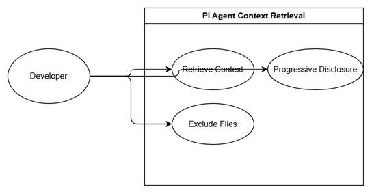
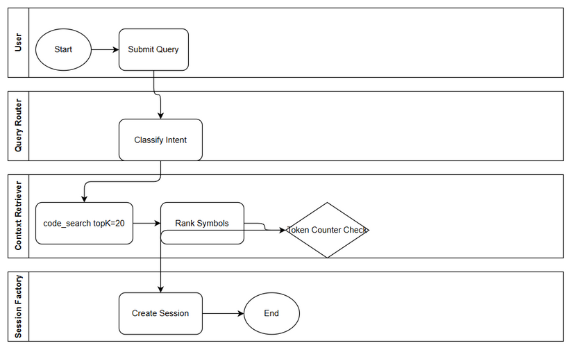

# Business Requirements Document (BRD)

## System — SA4E-325: Pi Smart Context Retrieval for repos with thousands of files

---

## Document Information

| Field | Value |
|-------|-------|
| Jira Ticket | SA4E-325 |
| Title | Pi Smart Context Retrieval for repos with thousands of files |
| Author | BA Agent |
| Version | 1.0 |
| Date | 2026-09-26 |
| Status | Draft |

---

## Author Tracking

| Role | Name - Position | Responsibility |
|------|-----------------|----------------|
| Author | BA Agent – Business Analyst | Create document |
| Peer Reviewer | — | Review document |

---

## Revision History

| Version | Date | Author | Changes |
|---------|------|--------|---------|
| 1.0 | 2026-09-26 | BA Agent | Initiate document — auto-generated from Jira ticket SA4E-325 |

---

## Sign-Off

| Name | Signature and date |
|------|--------------------|
| | ☐ I agree and confirm all criteria on this BRD as expected requirements |
| | ☐ I agree and confirm all criteria on this BRD as expected requirements |

---

## 1. Introduction

### 1.1 Scope
Pi currently has empty contextFiles in session-factory.ts:29, ResourceLoader reloads full scan .pi/*, and PromptTemplateService.readDirRecursive does not rank. For projects with thousands of files (~10M tokens), dumping everything kills small models.
Scope includes ContextRetriever running before createAgentSession with query -> code_search/mem_search topK=20 -> symbol -> outline/signature 200 tok -> chunk 80 lines 800 tok, progressive disclosure 3 tiers with token counter, file exclusion (.git, node_modules, out, dist) + pagination, and summary-tree for GLOBAL questions.

### 1.2 Out of Scope
Full repo re-indexing, changes to model provider APIs, UI changes.

### 1.3 Preliminary Requirement
Code search and memory search services available, query-router intent classification present, existing session factory pipeline.

---

## 2. Business Requirements

### 2.1 High Level Process Map
User query → Intent classification → ContextRetriever → Ranked symbol retrieval → Progressive disclosure → Token budget check → Session creation with selected context.

*[Edit in draw.io](diagrams/use-case.drawio)*

*[Edit in draw.io](diagrams/business-flow.drawio)*

### 2.2 List of User Stories / Use Cases

| # | Story / Use Case / Epic | Priority | Source Ticket |
|---|-------------------------|----------|---------------|
| 1 | As a developer, I want context retrieval before session creation so that model receives relevant files only | MUST HAVE | SA4E-325 |
| 2 | As a user, I want progressive disclosure of files by relevance so that token budget stays <6k | MUST HAVE | SA4E-325 |
| 3 | As a system admin, I want file exclusions and pagination so that irrelevant directories are not scanned | SHOULD HAVE | SA4E-325 |

---

### 2.3 Details of User Stories

#### Business Flow

**Step 1:** User submits query in Pi agent.
**Step 2:** Query-router classifies intent LOCAL/GLOBAL/STRUCTURAL.
**Step 3:** ContextRetriever executes code_search/mem_search topK=20.
**Step 4:** Symbols ranked, outline/signature extracted ~200 tokens.
**Step 5:** Chunk 80 lines ~800 tokens for top candidates.
**Step 6:** Token counter enforces 3-tier progressive disclosure.
**Step 7:** Session factory creates agent session with contextFiles.
**Step 8:** Response returned.

> **Note:** GLOBAL queries use summary-tree instead of per-file scan.

#### STORY 1: Context Retrieval Before Session

> As a developer, I want context retrieval before session creation so that model receives relevant files only

**Requirement Details:**
1. ContextRetriever runs before createAgentSession.
2. Query -> code_search/mem_search topK=20.
3. Symbol outline/signature extracted 200 tokens.

**Data Fields:**
| Field | Type | Required | Description | Example |
|-------|------|----------|-------------|---------|
| query | string | Yes | User query | "review auth flow" |
| topK | integer | Yes | Number of candidates | 20 |
| contextFiles | array | Yes | Selected files | [...] |

**Acceptance Criteria:**
1. Repo 1000 files, /review loads <6k tokens but hits relevant files.
2. search_text 100-file limit is no longer bottleneck.
3. Integration test retrieval-first vs dump passes.

**Validation Rules:**
- topK <= 20
- Token budget <= 6000

**Error Handling:**
- Search service timeout: fallback to summary-tree.
- No results: empty context with warning.

#### STORY 2: Progressive Disclosure

> As a user, I want progressive disclosure of files by relevance so that token budget stays <6k

**Requirement Details:**
1. Three-tier disclosure with token counter.
2. Load topK into contextFiles only.

**Acceptance Criteria:**
1. Token usage stays under 6k for 1000-file repo.
2. Relevance ranking preserves files needed for fix.

#### STORY 3: File Exclusion & Pagination

> As a system admin, I want file exclusions and pagination so that irrelevant directories are not scanned

**Requirement Details:**
1. Exclude .git, node_modules, out, dist.
2. Pagination for directory read.

**Acceptance Criteria:**
1. Excluded paths never appear in context.
2. Pagination prevents full directory load.

---

## 3. Dependencies

| Dependency | Type | Related Ticket | Description |
|------------|------|----------------|-------------|
| code_search | System | SA4E-289 | code-search.ts |
| query-router | System | SA4E-289 | intent classification |
| session-factory | System | SA4E-325 | session creation pipeline |

---

## 4. Stakeholders

| Role | Name / Team | Responsibility | Source |
|------|-------------|----------------|--------|
| Reporter | Duc Nguyen Minh | Requirement owner | SA4E-325 |
| Epic Owner | SA4E-289 | Migration oversight | SA4E-289 |

---

## 5. Risks and Assumptions

### 5.1 Risks
| Risk | Impact | Likelihood | Mitigation |
|------|--------|------------|------------|
| Token counting inaccurate | High | Medium | Unit tests for counter |
| Search quality low | High | Medium | TopK + outline fallback |
| Performance degradation | Medium | Medium | Pagination & exclusion |

### 5.2 Assumptions
- code_search index is up to date.
- Small model context window ~8k tokens.

---

## 6. Non-Functional Requirements

| Category | Requirement | Details |
|----------|-------------|---------|
| Performance | Context retrieval <500ms | topK=20 |
| Scalability | Support 1000+ files | Progressive disclosure |
| Availability | No impact to session creation | Fallback to empty context |

---

## 7. Related Tickets

| Ticket Key | Summary | Status | Type | Relationship |
|------------|---------|--------|------|--------------|
| SA4E-325 | Pi Smart Context Retrieval for repos with thousands of files | In Progress | Story | Main ticket |
| SA4E-289 | Migrate LangGraph Workflow Engine to Pi SDK | In Progress | Epic | Parent |

---

## 8. Appendix

### Diagram Index
- use-case.drawio / use-case.png
- business-flow.drawio / business-flow.png

### Reference Documents
- extension/src/pi-agent/session-factory.ts
- backend/src/engine/tools/code-search.ts
