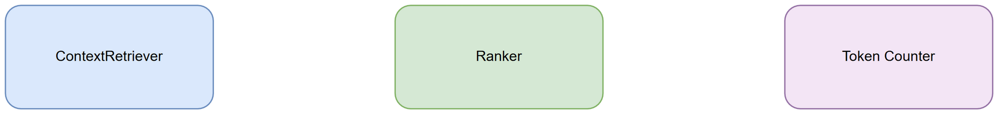
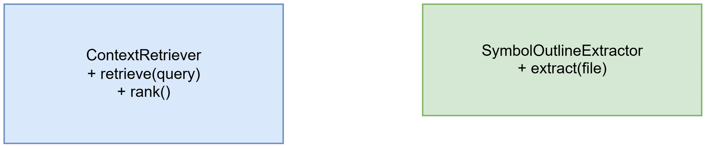

# Technical Design Document (TDD)

## Document Information
| Field | Value |
|-------|-------|
| Jira Ticket | SA4E-325 |
| Title | Pi Smart Context Retrieval for repos with thousands of files |
| Version | 1.0 |
| Date | 2026-09-26 |

## 1. Introduction
Technical design for ContextRetriever running before createAgentSession with query → code_search/mem_search topK=20 → progressive disclosure.

## 2. Architecture Overview
Query Router → ContextRetriever → code_search/mem_search → Token Counter → Session Factory.

*[Edit in draw.io](diagrams/architecture.drawio)*

## 3. Component Design
ContextRetriever, Ranker, Token Counter, File Exclusion Filter.

*[Edit in draw.io](diagrams/component.drawio)*

## 4. Class Design
ContextRetriever, SymbolOutlineExtractor, ProgressiveDisclosureManager

*[Edit in draw.io](diagrams/class.drawio)*

## 5-8 Sections
Data Flow, Interface Definition, Non-Functional Requirements, Testability notes per FSD.

## 9. Diagram Index
| 1 | Architecture | [architecture.png](diagrams/architecture.png) | [architecture.drawio](diagrams/architecture.drawio) |
| 2 | Component | [component.png](diagrams/component.png) | [component.drawio](diagrams/component.drawio) |
| 3 | Class | [class.png](diagrams/class.png) | [class.drawio](diagrams/class.drawio) |
