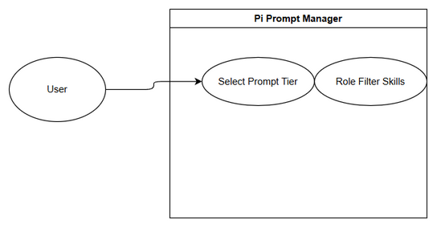

# Business Requirements Document (BRD)

## System — SA4E-326: Pi Prompt Compression + Role-scoped prompts per model tier

---

## Document Information

| Field | Value |
|-------|-------|
| Jira Ticket | SA4E-326 |
| Title | Pi Prompt Compression + Role-scoped prompts per model tier |
| Author | BA Agent |
| Version | 1.0 |
| Date | 2026-09-26 |
| Status | Draft |

---

## 1. Introduction

### 1.1 Scope
Reduce prompt size for small models by providing full and compressed prompt variants, avoid preloading all templates, and enforce role-scoped skill filtering per phase.

### 1.2 Out of Scope
Model provider changes, UI redesign.

### 1.3 Preliminary Requirement
agent-configurator.ts and prompt-template.service.ts exist.

---

## 2. Business Requirements

### 2.1 High Level Process Map
Prompt request → Model tier detection → Select full/compressed template → Role filter → Inject content on demand → Session creation.

*[Edit in draw.io](diagrams/use-case.drawio)*

*[Edit in draw.io](diagrams/business-flow.drawio)*

### 2.2 List of User Stories

| # | Story | Priority | Source |
|---|-------|----------|--------|
| 1 | As a developer using small model, I want compressed prompts so that session stays within context | MUST HAVE | SA4E-326 |
| 2 | As a role user, I want only role-relevant skills loaded so that tool list is not polluted | MUST HAVE | SA4E-326 |
| 3 | As a system, I want prompt discovery <500ms so that UX remains fast | SHOULD HAVE | SA4E-326 |

### 2.3 Details

#### STORY 1: Prompt Compression
> As a developer using small model, I want compressed prompts...

**Requirement Details:**
1. Two prompt versions: full and compressed.
2. Inject on /template call, no preload.

**Acceptance Criteria:**
1. Small model passes STC of SA4E-318.
2. Prompt discovery <500ms with <100 templates.

#### STORY 2: Role-scoped prompts
**Acceptance Criteria:**
1. SM sees only BRD skill.
2. DEV sees only code skill.
3. QA sees only test skill.

#### STORY 3: Append SYSTEM.md
**Acceptance Criteria:**
Append SYSTEM.md when mode=replace.

---

## 3. Dependencies
code-intel, agent-configurator

## 4. Stakeholders
Reporter Duc Nguyen Minh

## 5. Risks
Prompt truncation risk, role filter misconfiguration.

## 6. Non-Functional
Performance <500ms.

## 7. Related Tickets
SA4E-326 main, SA4E-289 parent

## 8. Appendix
Diagram Index: use-case, business-flow
