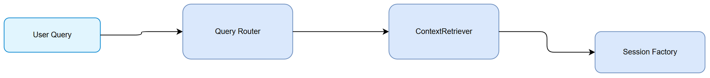

# Technical Design Document (TDD)
## Jira Ticket: SA4E-328
## Title: Pi Verification loop + Hallucination grader for small models

## 1. Introduction
Design for verification loop and hallucination grading for small models.

## 2. Architecture Overview
Execute Tools → Verification Loop → Hallucination Grader → Faithfulness Score → Retry

*[Edit in draw.io](diagrams/architecture.drawio)*

## Diagram Index
| 1 | Architecture | [architecture.png](diagrams/architecture.png) | [architecture.drawio](diagrams/architecture.drawio) |
| 2 | Component | [component.png](diagrams/component.png) | [component.drawio](diagrams/component.drawio) |
| 3 | Class | [class.png](diagrams/class.png) | [class.drawio](diagrams/class.drawio) |
