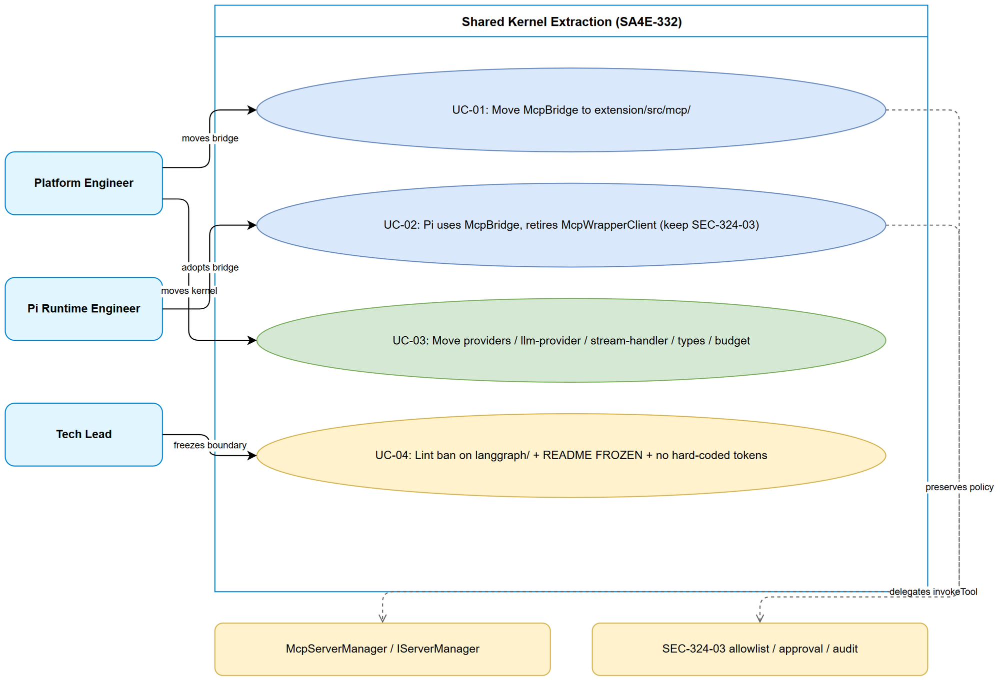
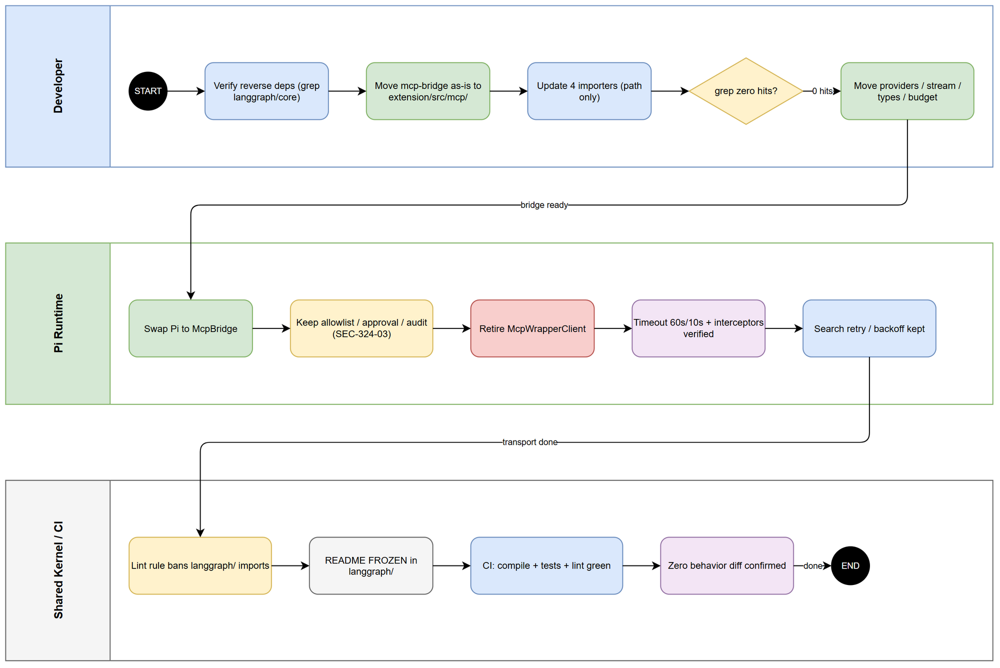

# Business Requirements Document (BRD)

## SDLC-Agents-4-Enterprise — SA4E-332: Shared kernel extraction: move McpBridge/providers/stream-handler out of langgraph

---

## Document Information

| Field | Value |
|-------|-------|
| Jira Ticket | SA4E-332 |
| Title | Shared kernel extraction: move McpBridge/providers/stream-handler out of langgraph |
| Epic | SA4E-289 Migrate LangGraph -> Pi SDK (Option C) |
| Author | BA Agent |
| Version | 1.0 |
| Date | 2026-09-27 |
| Status | Draft |
| Priority | High |
| Ticket Status (at analysis time) | To Do |

---

## Author Tracking

| Role | Name - Position | Responsibility |
|------|-----------------|----------------|
| Author | BA Agent – Business Analyst | Create document |
| Peer Reviewer | TBD – Tech Lead | Review document |

---

## Revision History

| Version | Date | Author | Changes |
|---------|------|--------|---------|
| 1.0 | 2026-09-27 | BA Agent | Initiate document — auto-generated from Jira ticket SA4E-332, Epic SA4E-289, and code verification in workspace SA4E-254 |

---

## Sign-Off

| Name | Signature and date |
|------|--------------------|
| | ☐ I agree and confirm all criteria on this BRD as expected requirements |
| | ☐ I agree and confirm all criteria on this BRD as expected requirements |

---

## 1. Introduction

### 1.1 Scope

This change request covers the **shared-kernel extraction** step of Epic SA4E-289 (Migrate LangGraph -> Pi SDK, Option C). The problem verified in code: new Pi code depends **backwards** on the legacy `langgraph/` tree, which violates the Option C migration direction (Pi is the target, LangGraph is the legacy to be retired).

Verified reverse dependencies (workspace SA4E-254):

- `extension/src/pi-workflow/kb-client.ts:3` imports `McpBridge` from `'../langgraph/core/mcp-bridge.js'`.
- `extension/src/pi-workflow/pi-workflow-adapter.ts:7-8` imports `McpBridge` from `'../langgraph/core/mcp-bridge'`, `StreamHandler` from `'../langgraph/core/stream-handler'`, and type `LlmProvider` from `'../langgraph/core/llm-provider'`.

In-scope work (move-as-is, no behavior refactor):

1. **Move `mcp-bridge.ts` to `extension/src/mcp/`** and update all importers, preserving behavior exactly (60 s tool-call timeout, 10 s `tools/list` timeout, `_as_path` / `_base64_file` interceptors, `listTools`, `isAvailable`, in-process `McpServerManager.invokeTool` delegation).
2. **Retire `McpWrapperClient` in Pi paths** — Pi (`mcp-bridge-extension.ts`, `search-provider.ts` via `createMcpSearchProvider`) stops using raw-fetch `McpWrapperClient` (`extension/src/pi-agent/extensions/mcp-wrapper-client.ts`: hardcoded `http://127.0.0.1:9181/mcp`, no timeout) and uses `McpBridge` instead, **keeping** the SEC-324-03 allowlist / approval / audit behavior.
3. **Continue kernel extraction**: move `providers/` directory, `llm-provider` interface, `stream-handler`, domain types (`state-types`), and `context-budget` out of `langgraph/` into the shared kernel; pure-graph code stays and is deleted phase-by-phase (not moved).
4. **Freeze the boundary**: add a lint rule forbidding new imports from `langgraph/` plus a `README FROZEN` notice; rule: tokens/credentials come from API (VS Code SecretStorage / settings), never hard-coded; moves are as-is with no behavior change.

### 1.2 Out of Scope

- Any behavior refactor of `McpBridge`, `StreamHandler`, providers, or `context-budget` (only relocation + import path updates).
- Deletion of the pure LangGraph graph/workflow execution code in this ticket (done in later phase tickets under SA4E-289).
- Changes to SEC-324-03 policy semantics (allowlist contents, approval decisions, audit format) — only the transport underneath changes.
- Backend (MCP server) changes, protocol changes, or new MCP tools.
- UI/screen changes — no user-visible interface change is expected.

### 1.3 Preliminary Requirement

- Epic SA4E-289 (Option C direction: Pi is the target) is approved and understood by implementers.
- SEC-324-03 allowlist / approval / audit behavior is documented and its tests exist (`mcp-bridge-extension.test.ts`, `mcp-wrapper-client.test.ts`).
- Existing tests covering the moved modules are green before the move: `langgraph/__tests__/mcp-bridge.test.ts`, providers tests (`provider-registry`, `anthropic/openai/ollama/onnx`, `provider-url-policy`), `pi-agent/extensions/__tests__/mcp-bridge-extension.test.ts`, and the 2 e2e tests importing `McpBridge` (`drawio-convert.e2e.test.ts`, `cross-process.e2e.test.ts`).
- `extension/src/mcp/` directory exists (verified: contains `atlassian/`, `devtools-bridge.ts`, `PegaMcpTools.ts`, etc.) — target location for the shared kernel.

---

## 2. Business Requirements

### 2.1 High Level Process Map

The migration direction must be **Pi -> shared kernel (`extension/src/mcp/`)**, never **Pi -> `langgraph/`**. Today the arrow points the wrong way: `pi-workflow` (the future) imports from `langgraph/core` (the legacy). This ticket reverses the dependency by extracting the shared kernel (MCP bridge, providers, streaming, domain types, budget) into a neutral location both sides can use, then re-points all importers, retires the weaker Pi-side HTTP client, and freezes the old path with lint + README so the inversion cannot regress.

**Diagrams:**

*[Edit in draw.io](diagrams/use-case.drawio)*

*[Edit in draw.io](diagrams/business-flow.drawio)*

### Diagram Index

| # | Diagram | Image | Source (editable) |
|---|---------|-------|-------------------|
| 1 | Use Case — Shared kernel extraction | [use-case.png](diagrams/use-case.png) | [use-case.drawio](diagrams/use-case.drawio) |
| 2 | Business Flow — Extraction sequence | [business-flow.png](diagrams/business-flow.png) | [business-flow.drawio](diagrams/business-flow.drawio) |

### 2.2 List of User Stories / Use Cases

| # | Story / Use Case / Epic | Priority | Source Ticket |
|---|-------------------------|----------|---------------|
| 1 | US-01 — As a platform engineer, I want McpBridge moved to extension/src/mcp/ with all importers updated so that Pi no longer reverse-depends on langgraph and behavior is unchanged | MUST HAVE | SA4E-332 |
| 2 | US-02 — As a Pi runtime engineer, I want Pi to use McpBridge instead of McpWrapperClient so that all Pi tool calls get timeout protection and file interceptors while keeping SEC-324-03 allowlist/approval | MUST HAVE | SA4E-332 |
| 3 | US-03 — As a platform engineer, I want providers/, llm-provider, stream-handler, state-types, and context-budget moved to the shared kernel so that only pure-graph code remains in langgraph/ for phased deletion | MUST HAVE | SA4E-332 |
| 4 | US-04 — As a tech lead, I want a lint rule banning new imports from langgraph/ plus a README FROZEN notice so that the boundary cannot regress and tokens are never hard-coded | SHOULD HAVE | SA4E-332 |

---

### 2.3 Details of User Stories

---

#### Business Flow

**Step 1:** Developer verifies current reverse dependencies: `pi-workflow/kb-client.ts:3`, `pi-workflow-adapter.ts:7-8` import from `../langgraph/core/*`; enumerates all 4 `McpBridge` importers (`langgraph/vscode/tool-registry.ts:6`, `pi-workflow/kb-client.ts:3`, `pi-workflow-adapter.ts:7`, 2 e2e tests) and all `McpWrapperClient` consumers (`mcp-bridge-extension.ts:8`, `search-provider.ts:3,135`, tests).

**Step 2:** Developer moves `extension/src/langgraph/core/mcp-bridge.ts` (182 lines) as-is to `extension/src/mcp/mcp-bridge.ts` (or `extension/src/mcp/bridge/` per team convention), keeping class `McpBridge`, `McpToolTimeoutError`, timeouts (60 s / 10 s), `_as_path` / `_base64_file` interceptors, `listTools`, `isAvailable` intact.

**Step 3:** Developer updates every importer to the new path (tool-registry, kb-client, pi-workflow-adapter, 2 e2e tests, `mcp-bridge.test.ts`); runs TypeScript compile + full related test suites; behavior diff must be zero.

**Step 4:** Developer switches Pi tool paths from `McpWrapperClient.callMcpWrapper` (raw fetch, hardcoded URL, no timeout) to `McpBridge.callTool`/`listTools` (in-process `McpServerManager.invokeTool` + timeout + interceptors), preserving SEC-324-03 allowlist (`TOOL_ALLOWLIST`), dynamic-chaining deny-by-default, approval hook, and audit sink.

**Step 5:** Developer moves `providers/` (registry, anthropic/openai/ollama/onnx, helpers, url-policy, BaseLlmProvider), `core/llm-provider.ts` interface, `core/stream-handler.ts`, `core/state-types.ts` domain types, and `pi-agent/context-budget.ts` (or its langgraph counterpart if one is identified) into the shared kernel as-is; pure-graph files (`workflow/`, graph executors) stay.

**Step 6:** Developer adds an ESLint rule banning new imports matching `langgraph/` from outside `langgraph/` (allowlist only the remaining legacy intra-graph imports), adds `README FROZEN` in `langgraph/`, and verifies tokens come only from SecretStorage/settings (`PROVIDER_BASE_URL_KEYS`, `getSecretKey`, `kiroSdlc.*ApiKey`) — no hard-coded tokens.

**Step 7:** CI (lint + compile + unit + e2e subsets) passes; reviewer confirms zero behavior change (only moved files + import paths + Pi transport swap with identical policy outcomes).

> **Note:** "Move nguyên trạng" (move as-is) is a hard rule. Any behavior fix discovered during the move must be filed as a separate ticket, not bundled into this move.

---

#### STORY 1 (US-01): Move McpBridge to shared kernel

> As a platform engineer, I want McpBridge moved to extension/src/mcp/ with all importers updated so that Pi no longer reverse-depends on langgraph and behavior is unchanged.

**Requirement Details:**

1. Move `extension/src/langgraph/core/mcp-bridge.ts` (182 lines, verified) to `extension/src/mcp/` preserving filename `mcp-bridge.ts` (or team-agreed subpath; update this BRD if a subpath is chosen). No logic edits: `DEFAULT_TOOL_TIMEOUT_MS = 60_000`, `LIST_TOOLS_TIMEOUT_MS = 10_000`, `interceptRequestArgs` (`_as_path` -> base64 read + recursive descent), `interceptResponse` (`_base64_file` -> write under `documents/tmp/`), `callTool` (availability guard + `Promise.race` timeout + `McpToolTimeoutError`), `listTools` (POST `http://127.0.0.1:{port}/mcp` with `AbortController`, `tools/list`), `isAvailable` (`mcpManager.status === "running"`). Source: SA4E-332 + code verification.
2. Update all verified importers (minimum): `extension/src/langgraph/vscode/tool-registry.ts:6` (imports `McpBridge` + defines `McpToolDefinition` consumed by `mcp-bridge.ts:13` — resolve the resulting circular/type dependency by moving `McpToolDefinition` with the bridge or to a shared types file, decided at implementation but documented in TDD); `extension/src/pi-workflow/kb-client.ts:3` (note `.js` suffix import); `extension/src/pi-workflow/pi-workflow-adapter.ts:7`; `extension/src/__tests__/drawio-convert.e2e.test.ts:6`; `extension/src/__tests__/cross-process.e2e.test.ts:6`; `extension/src/langgraph/__tests__/mcp-bridge.test.ts:28`. A repo-wide grep for `langgraph/core/mcp-bridge` must return zero hits after the change.
3. Keep `McpToolTimeoutError` export name and module surface identical so callers need only a path change.

**Data Fields (file mapping):**

| File | Type | Required | Description | Example |
|------|------|----------|-------------|---------|
| `extension/src/langgraph/core/mcp-bridge.ts` | source module (182 lines) | Yes | Move source, delete original, keep git history (git mv) | `git mv extension/src/langgraph/core/mcp-bridge.ts extension/src/mcp/mcp-bridge.ts` |
| `extension/src/mcp/mcp-bridge.ts` | destination module | Yes | Identical content, only import paths adjusted (`../../mcp-server-manager`, `../../types/*`, tool-registry types) | `import { McpServerManager } from "../mcp-server-manager"` (adjusted) |
| Importer paths (4 files + 1 test) | import statements | Yes | Path-only change, no symbol rename | `import { McpBridge } from "../../mcp/mcp-bridge"` (from pi-workflow) |

**Acceptance Criteria:**

1. `extension/src/langgraph/core/mcp-bridge.ts` no longer exists; `extension/src/mcp/mcp-bridge.ts` exists with byte-identical logic (only import paths differ); `git log --follow` shows history preserved.
2. Repo-wide search for `langgraph/core/mcp-bridge` returns zero matches; `tsc` compile passes with no errors.
3. `mcp-bridge.test.ts`, `tool-registry` consumers, `kb-client` tests, and the 2 e2e tests pass without modification of assertions (only import paths updated).
4. Runtime behavior spot-check passes: tool call timeout still 60 s, `tools/list` timeout still 10 s, `_as_path` and `_base64_file` interceptor behavior unchanged (verified by existing tests, no new behavior).

**Validation Rules:**

- No logic diff except import-specifier lines (reviewer verifies with `git diff` ignoring import lines).
- Token/credential handling untouched: bridge takes port from `mcpManager.port`, never a hard-coded token.
- Circular import (`mcp-bridge.ts` <-> `tool-registry.ts` via `McpToolDefinition`) must be resolved, not left as a runtime cycle.

**Error Handling:**

- MCP server not running: `McpServerNotRunningError` thrown by `callTool`/`listTools` as before.
- Tool timeout: `McpToolTimeoutError(name, timeoutMs)` as before.
- `tools/list` abort: `McpToolTimeoutError("tools/list", 10_000)` as before.

---

#### STORY 2 (US-02): Pi adopts McpBridge, retires McpWrapperClient

> As a Pi runtime engineer, I want Pi to use McpBridge instead of McpWrapperClient so that all Pi tool calls get timeout protection and file interceptors while keeping SEC-324-03 allowlist/approval.

**Requirement Details:**

1. Replace `McpWrapperClient` usage in Pi tool paths with `McpBridge`: `extension/src/pi-agent/extensions/mcp-bridge-extension.ts` (currently `createMcpClient()` + `mcpClient.callMcpWrapper(toolName, params)` at line 132 inside `createExecuteHandler`) and `extension/src/pi-agent/context-retrieval/search-provider.ts` (`createMcpSearchProvider` at line 134-136 constructs `McpWrapperClient`; `callTool` at line 103-110 calls `caller.callMcpWrapper`). The `McpCaller` interface must be adapted (adapter or signature change) so `McpBridge.callTool(name, args, timeoutMs)` satisfies it, including the existing `withSearchTimeout`/`withRetry` wrappers. Source: SA4E-332 + code verification.
2. Preserve SEC-324-03 semantics exactly: `TOOL_ALLOWLIST` gating, `DYNAMIC_TOOL_NAME` deny-by-default (`allowDynamicChaining !== true` -> `chaining_denied`), `bridgeRequiresApproval` (dynamic tool + `mem_ingest` always require approval), approval-hook routing, `BridgeAuditEntry` audit sink (arg keys only, never values), and `validateParams` pre-check. No policy constant changes.
3. Delete or deprecate `extension/src/pi-agent/extensions/mcp-wrapper-client.ts` (hardcoded `http://127.0.0.1:9181/mcp`, raw `fetch` with no `AbortController`/timeout — verified lines 28, 45-51). If deleted, remove `createMcpClient` factory and update `mcp-wrapper-client.test.ts` / `mcp-bridge-extension.test.ts` mocks accordingly; if kept temporarily, mark `@deprecated` pointing to `McpBridge` and file a follow-up deletion ticket. No new hard-coded URLs: port/URL must come from `IServerManager` (`mcpManager.port`) or `kiroSdlc.mcpServerPort` / `kiroSdlc.mcpServerUrl` settings (verified in `package.json`: `mcpServerPort` default 9181, `mcpServerUrl` override).

**Data Fields (behavior comparison — must hold post-change):**

| Aspect | McpWrapperClient (before) | McpBridge (after) | Required |
|--------|---------------------------|-------------------|----------|
| Transport | Raw HTTP fetch to hardcoded URL | In-process `McpServerManager.invokeTool` (+ `listTools` via port) | Yes — switch |
| Timeout | None (hangs possible) | 60 s per-call, 10 s list | Yes — gain, no opt-out |
| `_as_path` / `_base64_file` | Not handled | Handled (read file -> base64 / save base64 -> `documents/tmp/`) | Yes — gain |
| Availability guard | None (fetch fails late) | `isAvailable()` throws `McpServerNotRunningError` early | Yes — gain |
| SEC-324-03 allowlist/approval/audit | Enforced in `mcp-bridge-extension.ts` | Unchanged, enforced at same layer | Yes — identical |

**Acceptance Criteria:**

1. No production (non-test) code under `pi-agent/` or `pi-workflow/` imports `mcp-wrapper-client`; `mcp-bridge-extension.ts` and `search-provider.ts` obtain tool results via `McpBridge`.
2. SEC-324-03 regression suite passes unchanged: allowlisted tools execute, non-allowlisted chained targets denied, `execute_dynamic_tool` denied without opt-in, `mem_ingest` requires approval, every invocation emits exactly one audit entry with arg keys only.
3. Timeout behavior verified: a hung tool call fails with `McpToolTimeoutError` (~60 s default) instead of hanging; search path keeps its `searchTimeoutMs` + retry semantics on top.
4. No hard-coded MCP URL or token remains in Pi paths; port/URL resolution is from `IServerManager` or `kiroSdlc.mcpServerPort`/`mcpServerUrl`.

**Validation Rules:**

- `validateParams` runs before any transport call (unchanged order: validate -> chaining check -> approval -> transport).
- Audit entry emitted for every decision branch including deny paths.
- Error text for transport failures remains user-actionable (`Error invoking {tool}: {message}` with `mcp_error` details).

**Error Handling:**

- Approval denied: `approval_denied` payload, no transport call made.
- Chaining not opted in / target not allowlisted: `chaining_denied` payload, audited as denied.
- Bridge timeout / unavailable: surfaced as `mcp_error` with cause preserved (Pi extension never swallows with empty success).

---

#### STORY 3 (US-03): Extract providers, llm-provider, stream-handler, domain types, context-budget

> As a platform engineer, I want providers/, llm-provider, stream-handler, state-types, and context-budget moved to the shared kernel so that only pure-graph code remains in langgraph/ for phased deletion.

**Requirement Details:**

1. Move as-is (path change only) into the shared kernel (`extension/src/mcp/` or team-agreed `extension/src/shared/` — decision recorded in TDD; this BRD uses `extension/src/mcp/` as default): entire `extension/src/langgraph/providers/` (verified: `index.ts` factory `createLlmProvider`/`createProviderByType`, `provider-registry.ts`, `anthropic/openai/ollama/onnx` providers + helpers, `BaseLlmProvider.ts`, `provider-url-policy.ts`); `extension/src/langgraph/core/llm-provider.ts` (89 lines: `LlmProvider`, `LlmMessage`, `LlmOptions`, `LlmToolCall`, `LlmResponse`); `extension/src/langgraph/core/stream-handler.ts` (185 lines: 50 ms debounce, 100-message buffer cap, token/status/complete/error/retry/verify/strategy-switch/human-intervention events); `extension/src/langgraph/core/state-types.ts` (36 lines: `SDLCPhase`, `PipelineIntent`, `PipelineStatus`, `ApprovalDecision`, `AutonomyLevel`, message/error/graph types); `context-budget` (`extension/src/pi-agent/context-budget.ts` verified: `ContextBudgetInputs`, `ContextBudgetError`, `BudgetCalculator` — if a `langgraph/`-side duplicate exists, the canonical one moves and the duplicate is removed). Source: SA4E-332 scope item (3) + code verification.
2. Update all importers, including `pi-workflow-adapter.ts:8` (`StreamHandler`), `pi-workflow-adapter.ts:11` (`LlmProvider`), `state-types.ts:5` (imports `LlmToolCall` from `llm-provider` — moves together, internal import updated), providers' internal cross-imports, and any `tool-registry` type imports. Pure-graph files (`langgraph/workflow/workflow-graph-data.ts`, graph executors, hooks, diagnostics) stay in place and are explicitly NOT moved.
3. Credential/base-URL resolution stays intact: `PROVIDER_BASE_URL_KEYS` (from `models/LlmProviderConfig`), `getSecretKey` (`kiroSdlc.*ApiKey` via SecretStorage), per-provider keys (`anthropicBaseUrl`, `openaiBaseUrl`, `ollamaUrl`, `lmstudioBaseUrl`, `openrouterBaseUrl` — verified in `package.json`), `llmFallbackModels` ordering. No token hard-coding introduced by the move.

**Data Fields (move list):**

| Module | Current path | Target (default) | Lines (verified) |
|--------|--------------|------------------|------------------|
| LLM provider interface | `extension/src/langgraph/core/llm-provider.ts` | `extension/src/mcp/llm-provider.ts` | 89 |
| Stream handler | `extension/src/langgraph/core/stream-handler.ts` | `extension/src/mcp/stream-handler.ts` | 185 |
| Domain types | `extension/src/langgraph/core/state-types.ts` | `extension/src/mcp/state-types.ts` (or `domain-types.ts`) | 36 |
| Providers | `extension/src/langgraph/providers/*` | `extension/src/mcp/providers/*` | 12+ files |
| Context budget | `extension/src/pi-agent/context-budget.ts` (canonical) | shared kernel (with its consumers `session-configurator.ts`, `session-compactor.ts` updated) | verified exists |

**Acceptance Criteria:**

1. All five module groups exist in the shared kernel; originals under `langgraph/` are deleted; `git mv` history preserved.
2. Zero behavior diff: provider factory resolution (`anthropic`/`ollama`/`onnx`/`kiro` special cases + openai-compatible generic + fallback), `StreamHandler` debounce/buffer/flush semantics, `context-budget` calculation, and all type shapes are identical (existing tests pass with only import-path updates: provider-registry/url-policy/openai/ollama/onnx/anthropic/base-provider suites, `stream-handler-events.test.ts`, `context-budget.test.ts`, `session-configurator.budget.test.ts`).
3. `pi-workflow-adapter.ts` compiles against the new paths with no logic change (constructor still builds `McpBridge` + `StreamHandler`, `configurePiProvider` still reads `PROVIDER_BASE_URL_KEYS` + `llmFallbackModels`).
4. Remaining `langgraph/` content is provably pure-graph (workflow/graph/hooks/diagnostics executors only) — reviewer confirms no shared types/providers remain behind.

**Validation Rules:**

- Move-as-is: `git diff` shows only import-specifier changes.
- No provider default URL or timeout constant changed during the move.
- `McpToolDefinition` ownership (bridge vs tool-registry) resolved in exactly one canonical location.

**Error Handling:**

- Unchanged per module (provider `Unknown provider type` error, stream-handler flush-on-dispose, budget `ContextBudgetError` on over-budget — all preserved).

---

#### STORY 4 (US-04): Lint freeze + README FROZEN + no hard-coded tokens

> As a tech lead, I want a lint rule banning new imports from langgraph/ plus a README FROZEN notice so that the boundary cannot regress and tokens are never hard-coded.

**Requirement Details:**

1. Add an ESLint rule (in the extension lint config) forbidding imports matching `langgraph/` (including `../langgraph/`, `@/langgraph`, `.js`-suffixed variants) from any file outside `extension/src/langgraph/`; intra-`langgraph/` legacy imports are temporarily allowlisted until phased deletion completes. The rule fails CI (`npm run lint`) on violation. Source: SA4E-332 scope item (4).
2. Add `extension/src/langgraph/README.md` (or `FROZEN.md`) stating: directory is FROZEN — no new code, no new importers; shared code lives in `extension/src/mcp/`; pure-graph code is deleted phase-by-phase under SA4E-289 follow-ups; point to this BRD (SA4E-332).
3. Enforce "token từ API, không hard-code": no API keys/tokens/secret literals in moved or new code; credentials resolve only via `vscode.SecretStorage` (`getSecretKey` mapping) and base URLs only via `PROVIDER_BASE_URL_KEYS` + `kiroSdlc.*` settings (verified `package.json` `capabilities.restrictedConfigurations` includes `anthropicBaseUrl`, `openaiBaseUrl`, `ollamaUrl`, `lmstudioBaseUrl`, `pegaEndpoint`, `atlassianConnectionType`, backend URL keys). MCP endpoint resolves via `IServerManager.port` / `mcpServerPort` / `mcpServerUrl`, replacing the hardcoded `127.0.0.1:9181` default in `mcp-wrapper-client.ts:28`.

**Data Fields:** Not applicable (no business data entities; enforcement artifacts only).

| Artifact | Location | Content |
|----------|----------|---------|
| ESLint rule | extension lint config (`eslint.config.*` / `.eslintrc.*`) | `no-restricted-imports` pattern for `langgraph/` with allowlist for intra-legacy imports |
| README FROZEN | `extension/src/langgraph/README.md` | Frozen notice + pointer to `extension/src/mcp/` + SA4E-289/SA4E-332 refs |
| Settings keys | `extension/package.json` (verified) | `mcpServerPort` (9181), `mcpServerUrl`, provider base URLs, `restrictedConfigurations` |

**Acceptance Criteria:**

1. New test import from `langgraph/` outside the allowlist fails `npm run lint` (demonstrated by a temporary fixture or documented rule test).
2. `extension/src/langgraph/README.md` FROZEN notice exists and names the shared-kernel target + owning epic/ticket.
3. Secret scan passes: no `ApiKey` literal, token literal, or hardcoded `127.0.0.1:9181` remains in moved/new Pi + kernel code (the only `9181` occurrences allowed are the `mcpServerPort` default in `package.json` and its documented fallback resolution).
4. Existing intra-`langgraph/` imports still lint clean (no false-positive break of the legacy tree before its phased deletion).

**Validation Rules:**

- Rule pattern covers `.js`-suffixed imports (`mcp-bridge.js`) and deep paths (`langgraph/core/*`, `langgraph/providers/*`, `langgraph/vscode/*`).
- README lists the exact shared-kernel paths chosen at implementation.

**Error Handling:**

- Lint violation message must name the forbidden pattern and the correct replacement (`extension/src/mcp/...`).

---

## 3. Dependencies

| Dependency | Type | Related Ticket | Description |
|------------|------|----------------|-------------|
| Epic SA4E-289 (Option C direction) | System | SA4E-289 | Defines Pi as target / LangGraph as legacy; this ticket is the shared-kernel extraction step. Do not reverse direction. |
| SEC-324-03 allowlist/approval/audit | Compliance | SEC-324-03 | `TOOL_ALLOWLIST`, dynamic-chaining deny-by-default, approval hook, audit sink in `mcp-bridge-extension.ts` must be preserved through the transport swap (US-02). |
| McpServerManager / IServerManager (`extension/src/mcp-server-manager.ts` -> `remote-backend-client`, `types/server-types`) | System | SA4E-289 | `McpBridge` delegates to `invokeTool` + reads `port`/`status`; extraction must keep these contracts. |
| ToolRegistry + McpToolDefinition (`langgraph/vscode/tool-registry.ts`) | System | SA4E-332 (this ticket) | Circular type dependency with `mcp-bridge.ts:13`; must be resolved to a single canonical owner during US-01. |
| LlmProviderConfig (`models/LlmProviderConfig`, `PROVIDER_BASE_URL_KEYS`) + SecretStorage | System | N/A | Provider base-URL/secret resolution must survive US-03 untouched. |
| Existing test suites (mcp-bridge, providers, stream-handler-events, context-budget, mcp-bridge-extension, 2 e2e) | Infrastructure | N/A | Green-before/green-after gate; assertions unchanged, only import paths updated. |
| ESLint config + CI lint gate | Infrastructure | N/A | US-04 rule must run in CI; location of config to be confirmed at implementation. |
| `extension/src/mcp/` target directory (exists, verified) | System | N/A | Houses `atlassian/`, `PegaMcpTools.ts`, `devtools-*`; new kernel files must follow its conventions without collisions. |

---

## 4. Stakeholders

| Role | Name / Team | Responsibility | Source |
|------|-------------|----------------|--------|
| Epic owner | SA4E-289 owner (Pi migration) | Confirms Option C direction; accepts phased-deletion plan for pure-graph remainder | Epic SA4E-289 |
| Security reviewer | Security / SEC-324-03 owner | Confirms allowlist/approval/audit semantics unchanged after transport swap | `mcp-bridge-extension.ts` SEC-324-03 header |
| Extension maintainers | VS Code extension team | Own `extension/src/mcp/`, `pi-workflow/`, `pi-agent/`; review move + importer updates | Code ownership (verified paths) |
| QA | Test owners | Confirm zero-behavior-change via existing suites + timeout/interceptor spot checks | Test files cited in US-01..US-03 |
| BA | BA Agent | Author of this BRD | Ticket SA4E-332 |

---

## 5. Risks and Assumptions

### 5.1 Risks

| Risk | Impact | Likelihood | Mitigation |
|------|--------|------------|------------|
| Circular import `mcp-bridge` <-> `tool-registry` (`McpToolDefinition`) breaks at new location | High | Medium | Decide single canonical owner for `McpToolDefinition` in TDD; add import-cycle check; run full compile + tests. |
| `.js`-suffixed imports (`kb-client.ts:3` uses `mcp-bridge.js`) missed by path rewrite or lint pattern | Medium | Medium | Grep covers both `mcp-bridge` and `mcp-bridge.js`; lint pattern covers `\.js` variant; verify with repo-wide search in AC. |
| Pi transport swap subtly changes error/timeout surface relied upon by callers (search retry, extension error text) | High | Medium | Keep `withSearchTimeout`/`withRetry` wrappers; map `McpToolTimeoutError`/`McpServerNotRunningError` to existing `mcp_error` shapes; run extension + search-provider tests. |
| `McpWrapperClient` deleted while an unknown consumer still imports it | Medium | Low | Repo-wide grep for `mcp-wrapper-client`/`McpWrapperClient`/`createMcpClient` before deletion; if any doubt, deprecate first with follow-up ticket. |
| Providers move breaks lazy `require()` paths or `PROVIDER_BASE_URL_KEYS` wiring | High | Low | Move-as-is including `require("./anthropic-provider")` relatives; run full provider test matrix; verify settings-driven URL resolution manually once. |
| Lint rule false-positives break legacy intra-graph imports still needed pre-deletion | Medium | Medium | Allowlist intra-`langgraph/` imports explicitly; test rule against current tree before enabling fail-CI. |
| Hardcoded `127.0.0.1:9181` reintroduced via copy-paste | Low | Medium | Secret/URL scan in AC; single resolution helper via `IServerManager`/settings; README documents the rule. |
| Scope creep: behavior "improvements" bundled into the move | Medium | Medium | Hard rule "move nguyên trạng"; any fix filed separately; reviewer enforces import-only diff. |

### 5.2 Assumptions

- Jira description's 4 acceptance criteria correspond to the 4 scope items restated in Section 1.1 / US-01..US-04 (Jira API was not queried in this session; if Jira AC text differs, TDD must reconcile and this BRD is revised).
- `extension/src/mcp/` is the agreed shared-kernel home; if the team chooses `extension/src/shared/` instead, paths in US-01/US-03 are renamed 1:1 with no requirement change.
- Pure-graph remainder (`workflow/`, executors, hooks, diagnostics) is deleted under SA4E-289 follow-up tickets, not this one.
- `McpServerManager` (`RemoteBackendClient` alias) `invokeTool`/`port`/`status` contracts are stable during this move.
- Test files cited from grep are the authoritative regression set; additional suites discovered during implementation are added to the TDD test plan.

---

## 6. Non-Functional Requirements

| Category | Requirement | Details |
|----------|-------------|---------|
| Performance | No regression in tool-call path | `McpBridge` timeouts unchanged (60 s call / 10 s list); `StreamHandler` debounce 50 ms + 100-buffer cap unchanged; in-process `invokeTool` replaces raw HTTP fetch (expected equal-or-faster; no perf claim beyond parity). |
| Reliability | Timeout protection for all Pi tool calls | Pi paths previously hanging on raw fetch now fail fast via `McpToolTimeoutError`; search retry/backoff preserved. |
| Security | No hard-coded tokens/URLs; SEC-324-03 preserved | Secrets only via SecretStorage/`kiroSdlc.*ApiKey`; URLs only via settings/`IServerManager`; allowlist + approval + audit (keys-only) behavior identical. |
| Maintainability | Zero reverse dependencies; frozen legacy | After ticket: zero imports from `langgraph/` outside it; lint rule + README FROZEN prevent regress; `git mv` history preserved for all moved files. |
| Compatibility | Drop-in path swap | Exported symbols (`McpBridge`, `McpToolTimeoutError`, `LlmProvider`, `StreamHandler`, provider factories, budget APIs) keep names/signatures; only import paths change (except the intentional `McpCaller` adaptation in US-02, documented in TDD). |
| Testability | Existing suites green without assertion changes | Suites listed in US-01..US-03 pass with import-path-only updates; lint-rule violation demonstrably fails CI. |
| Observability | Audit/error parity | `BridgeAuditEntry` per invocation; `[McpBridge]`/`[Pi Extension]` log lines unchanged; error codes (`McpServerNotRunningError`, `McpToolTimeoutError`, `approval_denied`, `chaining_denied`, `mcp_error`) unchanged. |

---

## 7. Related Tickets

| Ticket Key | Summary | Status | Type | Relationship |
|------------|---------|--------|------|--------------|
| SA4E-332 | Shared kernel extraction: move McpBridge/providers/stream-handler out of langgraph | To Do | Task | Main ticket |
| SA4E-289 | Migrate LangGraph -> Pi SDK (Option C) | (Epic, status TBD) | Epic | Parent epic — defines migration direction |
| SEC-324-03 | Tool allowlist + deny dynamic chaining + approval + audit | (status TBD) | Security requirement | Constraining requirement — policy preserved in US-02 |

---

## 8. Appendix

Code verification performed in workspace `SA4E-254` (no fabrication; all paths below were read):

- `extension/src/langgraph/core/mcp-bridge.ts` (182 lines): 60 s / 10 s timeouts, `_as_path`/`_base64_file` interceptors, `listTools`, `isAvailable`, `McpToolTimeoutError`.
- `extension/src/pi-workflow/kb-client.ts:3`, `extension/src/pi-workflow/pi-workflow-adapter.ts:7-8,11`: reverse imports into `langgraph/core`.
- `extension/src/langgraph/vscode/tool-registry.ts:6`: `McpBridge` + `McpToolDefinition` (circular-type note).
- `extension/src/pi-agent/extensions/mcp-wrapper-client.ts` (76 lines): hardcoded `http://127.0.0.1:9181/mcp`, raw fetch, no timeout.
- `extension/src/pi-agent/extensions/mcp-bridge-extension.ts` (SEC-324-03 enforcement + `callMcpWrapper` at line 132).
- `extension/src/pi-agent/context-retrieval/search-provider.ts` (`McpWrapperClient` at 3, 135; retry/timeout wrappers at 76-131).
- `extension/src/langgraph/core/stream-handler.ts` (185 lines), `llm-provider.ts` (89 lines), `state-types.ts` (36 lines); `extension/src/langgraph/providers/*` (12+ files); `extension/src/pi-agent/context-budget.ts` (+ `session-configurator.ts`, `session-compactor.ts` consumers).
- `extension/src/mcp-server-manager.ts` (alias to `RemoteBackendClient`); `extension/src/mcp/` (exists); `extension/package.json` (`mcpServerPort` 9181, `mcpServerUrl`, provider base URLs, `restrictedConfigurations`).
- Importer enumeration via grep: 4 production `McpBridge` importers + 1 unit test + `mcp-wrapper-client.test.ts` / `mcp-bridge-extension.test.ts`.

Out-of-scope confirmation: pure-graph files (e.g. `langgraph/workflow/workflow-graph-data.ts`, hooks, diagnostics) were listed but not moved per ticket scope.

### Glossary (if applicable)

| Term | Definition |
|------|------------|
| Shared kernel | Neutral module location (`extension/src/mcp/`) holding code used by both Pi and legacy LangGraph during migration; the only allowed dependency direction target. |
| Reverse dependency | Pi (future) importing from `langgraph/` (legacy) — the violation this ticket removes. |
| Move-as-is (move nguyên trạng) | Relocation with import-path-only diff; no logic, constant, or API change. |
| McpBridge | Timeout-aware in-process wrapper over `McpServerManager.invokeTool` with file interceptors and `tools/list`. |
| McpWrapperClient | Legacy Pi-side raw-HTTP MCP client (hardcoded URL, no timeout) to be retired in Pi paths. |
| SEC-324-03 | Security policy: tool allowlist + deny dynamic chaining by default + approval hook + audit sink. |
| FROZEN | `langgraph/` state after extraction: no new code or importers; only phased deletion. |
| Option C | SA4E-289 migration strategy: Pi SDK as target, shared kernel extracted, pure graph deleted in phases. |

### Reference Documents

| Document | Link / Location |
|----------|-----------------|
| BRD template | `documents/templates/BRD-TEMPLATE.md` |
| Epic SA4E-289 | Jira — Migrate LangGraph -> Pi SDK (Option C) |
| Ticket SA4E-332 | Jira — Shared kernel extraction (Priority High, Status To Do) |
| Use Case diagram (editable) | `documents/SA4E-332/diagrams/use-case.drawio` |
| Business Flow diagram (editable) | `documents/SA4E-332/diagrams/business-flow.drawio` |
| Code evidence | Paths listed in Appendix (workspace SA4E-254) |
