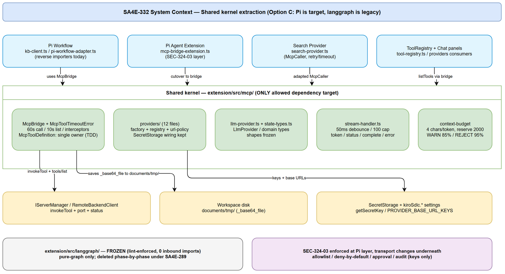
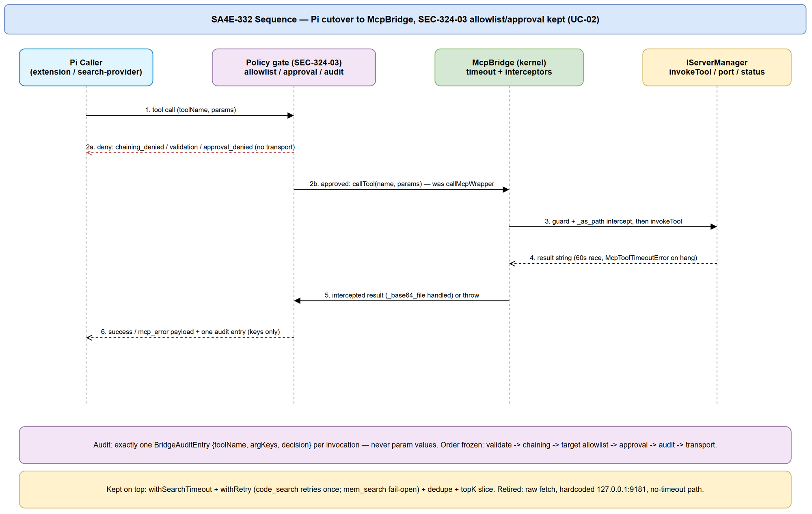
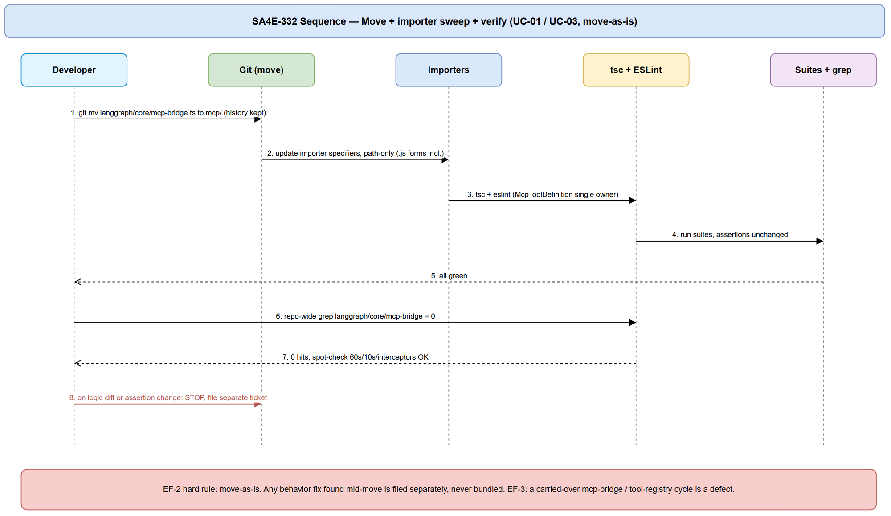
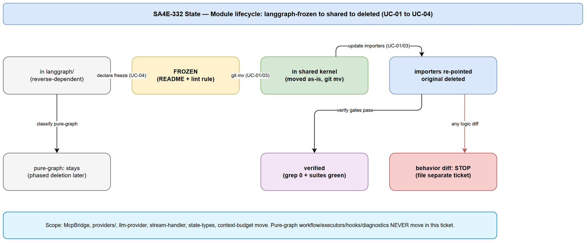

# Functional Specification Document (FSD)

## SDLC-Agents-4-Enterprise — SA4E-332: Shared kernel extraction: move McpBridge/providers/stream-handler out of langgraph

> **Revision Note:** FSD v1.2 updated based on SA discrepancy report v1 (`documents/SA4E-332/DISCREPANCY.md` — 2 High DISC-01/DISC-02, 1 Low DISC-03). See DISCREPANCY.md for details. TDD v1.0 decisions adopted as-is (DELETE stale test + artifact, corrected e2e depth). No BRD change, no TDD/code written.

---

## Document Information

| Field | Value |
|-------|-------|
| Jira Ticket | SA4E-332 |
| Title | Shared kernel extraction: move McpBridge/providers/stream-handler out of langgraph |
| Epic | SA4E-289 Migrate LangGraph -> Pi SDK (Option C) |
| Author | BA Agent |
| Version | 1.2 |
| Date | 2026-09-27 |
| Status | Draft (FSD draft — BA scope; no TDD/STP/code) |
| Related BRD | `documents/SA4E-332/BRD.md` (US-01 → US-04) |
| Workspace (absolute) | `C:\Users\ASUS\orca\workspaces\SDLC-Agents-4-Enterprise\SA4E-254\documents\SA4E-332\` |
| FSD file (absolute) | `C:\Users\ASUS\orca\workspaces\SDLC-Agents-4-Enterprise\SA4E-254\documents\SA4E-332\FSD.md` |
| Diagrams (absolute) | `C:\Users\ASUS\orca\workspaces\SDLC-Agents-4-Enterprise\SA4E-254\documents\SA4E-332\diagrams\` |

---

## Revision History

| Version | Date | Author | Changes |
|---------|------|--------|---------|
| 1.0 | 2026-09-27 | BA Agent | FSD draft from BRD SA4E-332 + verified code (no behavior design; move-as-is + Pi cutover + freeze). Diagrams: system-context, sequence-move, sequence-pi-cutover, state-module (draw.io only, no mermaid). |
| 1.1 | 2026-09-27 | TA Agent | Technical enrichment: McpBridge/McpCaller full contracts, complete old→new import map (21 grep hits incl. `.js`/type-only/relative forms), McpToolDefinition owner decision (new kernel `mcp-types.ts`), lint-rule snippet + README FROZEN wording, UC-01/02 supplementary AF/EF flows (import cycle, stale test path, Pi-vs-LangGraph approval), Data-Model/NFR verification, Open Issues with owners/dates. |
| 1.2 | 2026-09-27 | BA Agent | Fix per SA DISCREPANCY.md v1 (DISC-01/02/03): DISC-01 DELETE `extension/tests/mcp-bridge.test.ts` + designate healthy `src/langgraph/__tests__/mcp-bridge.test.ts` → `src/mcp/__tests__/` as canonical (AF-4/OPEN-06/§8/§10 clarified); DISC-02 correct e2e import-map rows 7–8 to `../mcp/mcp-bridge`; DISC-03 add TC-MOVE-07 stale `.js` cleanup gate. No BRD/TDD/code change. |

---

## 1. Introduction

### 1.1 Purpose

This FSD specifies **HOW** the shared-kernel extraction for SA4E-332 is performed at functional level: which modules move where, which importers are re-pointed, how Pi paths cut over from `McpWrapperClient` to `McpBridge` while preserving SEC-324-03 policy, and how the `langgraph/` boundary is frozen. It is the buildable input for the SA's TDD. It introduces **zero new behavior** — every functional requirement is a relocation or transport swap with identical observable outcomes.

### 1.2 Scope

In scope (from BRD US-01 → US-04, refined against verified code):

1. Move `extension/src/langgraph/core/mcp-bridge.ts` (182 lines) as-is to `extension/src/mcp/mcp-bridge.ts` (default target; team may choose `extension/src/mcp/bridge/` 1:1 — TDD records the final path) and update **all** importers with path-only changes.
2. Cut Pi tool paths (`pi-agent/extensions/mcp-bridge-extension.ts`, `pi-agent/context-retrieval/search-provider.ts` via `createMcpSearchProvider`) from `McpWrapperClient.callMcpWrapper` to `McpBridge.callTool`/`listTools`, preserving SEC-324-03 allowlist / deny-by-default chaining / approval / audit (keys-only) exactly.
3. Move as-is to the shared kernel: entire `extension/src/langgraph/providers/` (12 files verified), `core/llm-provider.ts` (89 lines), `core/stream-handler.ts` (185 lines), `core/state-types.ts` (36 lines), and canonical `context-budget` (`extension/src/pi-agent/context-budget.ts`; if a `langgraph/`-side duplicate is found at implementation, the canonical one moves and the duplicate is deleted). Pure-graph files (`workflow/`, graph executors, hooks, diagnostics) **stay** and are deleted in later SA4E-289 phase tickets.
4. Freeze the boundary: ESLint rule banning new imports from `langgraph/` outside `extension/src/langgraph/` + `README FROZEN` notice in `extension/src/langgraph/`; credentials only via VS Code SecretStorage/settings, never hard-coded.

Out of scope: any logic refactor of the moved modules; deletion of pure-graph execution code in this ticket; changes to SEC-324-03 policy semantics, MCP protocol, backend server, or UI.

### 1.3 Definitions & Acronyms

| Term | Definition |
|------|------------|
| Shared kernel | Neutral home `extension/src/mcp/` (default) for code used by both Pi and legacy LangGraph during migration; the only allowed dependency target. |
| Move-as-is (move nguyên trạng) | Relocation with import-specifier-only diff; no logic, constant, signature, or default change. Any fix found mid-move is filed separately. |
| McpBridge | Timeout-aware in-process wrapper over `IServerManager.invokeTool` with `_as_path`/`_base64_file` interceptors and `tools/list` (verified `langgraph/core/mcp-bridge.ts`). |
| McpWrapperClient | Legacy Pi-side raw-HTTP client (`pi-agent/extensions/mcp-wrapper-client.ts`, hardcoded `http://127.0.0.1:9181/mcp`, no timeout) retired from Pi production paths. |
| McpCaller | Minimal caller interface in `search-provider.ts` (`callMcpWrapper`) — must be adapted to `McpBridge.callTool` during cutover. |
| SEC-324-03 | Security policy enforced in `mcp-bridge-extension.ts`: `TOOL_ALLOWLIST` + deny dynamic chaining by default + approval hook + audit sink (arg keys only, never values). |
| FROZEN | Post-extraction state of `extension/src/langgraph/`: no new code, no new importers; only phased deletion. |
| Option C | SA4E-289 strategy: Pi SDK is the target, shared kernel is extracted, pure graph is deleted in phases. |
| IServerManager | Contract in `extension/src/types/server-types.ts` (`status`, `port`, `invokeTool(name, args) => Promise<string>`) implemented by `RemoteBackendClient` (aliased `McpServerManager`). |

### 1.4 References

| Document | Location |
|----------|----------|
| BRD SA4E-332 (US-01 → US-04) | `C:\Users\ASUS\orca\workspaces\SDLC-Agents-4-Enterprise\SA4E-254\documents\SA4E-332\BRD.md` |
| Epic SA4E-289 (Option C) | Jira — Migrate LangGraph -> Pi SDK (Option C) |
| Code evidence (verified reads) | `extension/src/langgraph/core/mcp-bridge.ts`, `extension/src/langgraph/vscode/tool-registry.ts`, `extension/src/pi-workflow/kb-client.ts`, `extension/src/pi-workflow/pi-workflow-adapter.ts`, `extension/src/pi-agent/extensions/mcp-bridge-extension.ts`, `extension/src/pi-agent/extensions/mcp-wrapper-client.ts`, `extension/src/pi-agent/context-retrieval/search-provider.ts`, `extension/src/langgraph/core/llm-provider.ts`, `extension/src/langgraph/core/stream-handler.ts`, `extension/src/langgraph/core/state-types.ts`, `extension/src/pi-agent/context-budget.ts`, `extension/src/langgraph/providers/` (12 files), `extension/src/mcp-server-manager.ts`, `extension/package.json`, `extension/src/langgraph/__tests__/mcp-bridge.test.ts`, `extension/src/pi-agent/extensions/__tests__/mcp-bridge-extension.test.ts` |
| FSD template | `documents/templates/FSD-TEMPLATE.md` |

---

## 2. System Overview

### 2.1 System Context Diagram


*[Edit in draw.io](diagrams/system-context.drawio)*

The shared kernel (`extension/src/mcp/`) sits between consumers (Pi workflow, Pi agent extension, search provider, ToolRegistry, chat panels) and infrastructure (`IServerManager`/`RemoteBackendClient`, VS Code SecretStorage + `kiroSdlc.*` settings, workspace disk for `documents/tmp/`). Today two Pi modules depend **backwards** on `langgraph/core` (`kb-client.ts:3` with `.js` suffix, `pi-workflow-adapter.ts:7-8,11`); after this ticket every arrow into the kernel points at `extension/src/mcp/`, and `langgraph/` is a frozen island with no inbound edges from outside itself. SEC-324-03 policy (allowlist / approval / audit) stays at the Pi extension layer — the transport underneath changes, the decisions do not.

### 2.2 System Architecture

Before: `pi-workflow/` → `langgraph/core/` (reverse dependency); Pi agent → `mcp-wrapper-client` (raw HTTP, hardcoded URL, no timeout); providers/llm/stream/types/budget live under `langgraph/` or `pi-agent/`.

After (this FSD):

- `extension/src/mcp/mcp-bridge.ts` — `McpBridge` + `McpToolTimeoutError` (moved as-is; only its 4 import lines are re-pointed: `../../mcp-server-manager`, `../../types/*`, tool-registry types).
- `extension/src/mcp/llm-provider.ts`, `extension/src/mcp/stream-handler.ts`, `extension/src/mcp/state-types.ts` (or `domain-types.ts` — TDD fixes the name), `extension/src/mcp/providers/*` (12 files, relative `require("./...")` preserved), canonical `context-budget` module in the kernel.
- `McpToolDefinition` has exactly one canonical owner (today defined in `tool-registry.ts:9-13` and imported by `mcp-bridge.ts:13` and `llm-provider.ts:8` — TDD decides: move with the bridge or to a shared types file; FSD requires the cycle `mcp-bridge ↔ tool-registry` to be resolved, not carried over).
- Consumers re-pointed: `langgraph/vscode/tool-registry.ts:6` (relative `../core/mcp-bridge` form), `pi-workflow/kb-client.ts:3` (`.js`-suffixed form), `pi-workflow-adapter.ts:7-8,11`, `pi-adapter-context-probe.ts:1` (type-only `LlmProvider`), 2 e2e tests (`drawio-convert`, `cross-process`), `mcp-bridge.test.ts:28`, plus broader `langgraph/` importers (`chat-panel-provider`, `ChatStatusManager`, `message-protocol`, `message-routing`, `SettingsPanel`, `LlmTestService`, `workflow-panel`, `extension.ts`, diagnostics) handled per US-03 classification (shared → move; pure-graph → stay).
- Pi production code no longer imports `mcp-wrapper-client`; `McpBridge` is the single tool transport. `mcp-wrapper-client.ts` is deleted (preferred) or marked `@deprecated` with a follow-up deletion ticket if any unknown consumer is found by repo-wide grep at implementation.
- `extension/src/langgraph/` contains only pure-graph code + `README FROZEN`; ESLint `no-restricted-imports` fails CI on any new `langgraph/` import from outside.

---

## 3. Functional Requirements

### 3.1 Feature F-01 — Move McpBridge to shared kernel (US-01)

**Source:** BRD §2.3 STORY 1 (US-01).

#### 3.1.1 Description

Relocate `extension/src/langgraph/core/mcp-bridge.ts` to `extension/src/mcp/mcp-bridge.ts` via `git mv` (history preserved) with byte-identical logic. Only the module's own import specifiers and every importer's specifier change. Exported surface (`McpBridge`, `McpToolTimeoutError`) keeps names and signatures. Constants and semantics are frozen: `DEFAULT_TOOL_TIMEOUT_MS = 60_000`, `LIST_TOOLS_TIMEOUT_MS = 10_000`, deep-clone-then-`interceptRequestArgs` (`_as_path` → base64 read + recursive descent into nested objects/arrays, missing/unreadable file → drop key + `console.error`, no throw), `interceptResponse` (`_base64_file` → write under `{workspaceRoot}/documents/tmp/` with `_filename` or `output_{Date.now()}.bin` fallback; no workspace → `Proxy Error: Cannot save base64 file because workspace is undefined.`; write failure → `Proxy Error: Failed to save base64 file to disk (...)` without leaking base64; non-JSON → return raw), `callTool` (availability guard → `McpServerNotRunningError`; `Promise.race` vs timeout → `McpToolTimeoutError(name, timeoutMs)`; timer always cleared), `listTools` (guard → port check → `POST http://127.0.0.1:{port}/mcp` `tools/list` with `AbortController` 10 s → non-OK → `HTTP {status}`; `data.error` → `MCP error (code)`; `AbortError` → `McpToolTimeoutError("tools/list", 10_000)`), `isAvailable` (`status === "running"`).

#### 3.1.2 Use Case

**Use Case ID:** UC-01
**Actor:** Platform engineer (developer performing the move)
**Preconditions:** Related suites green before the move (`mcp-bridge.test.ts`, `tool-registry` consumers, `kb-client` tests, 2 e2e); `extension/src/mcp/` exists; `git` history intact.
**Postconditions:** Bridge lives only in the kernel; zero references to the old path; `tsc` clean; suites green with import-path-only test edits; runtime behavior identical.

**Main Flow:**

| Step | Actor | System | Description |
|------|-------|--------|-------------|
| 1 | Developer | | Runs `git mv extension/src/langgraph/core/mcp-bridge.ts extension/src/mcp/mcp-bridge.ts`; adjusts the 4 import lines inside the moved file to the new relative depth. No logic line touched. |
| 2 | Developer | | Updates every importer specifier only: `tool-registry.ts:6` (`../core/mcp-bridge` → new kernel path), `kb-client.ts:3` (`../langgraph/core/mcp-bridge.js` → `../../mcp/mcp-bridge`), `pi-workflow-adapter.ts:7` (`../langgraph/core/mcp-bridge` → `../../mcp/mcp-bridge`), both e2e tests `:6` (`../langgraph/core/mcp-bridge` → `../mcp/mcp-bridge` per v1.2 DISC-02), healthy `src/langgraph/__tests__/mcp-bridge.test.ts:28` (moves to `src/mcp/__tests__/`, specifier → `../mcp-bridge`); stale `extension/tests/mcp-bridge.test.ts` is DELETED per v1.2 DISC-01 (not re-pointed). Resolves `McpToolDefinition` ownership to one canonical location (no runtime import cycle). |
| 3 | | Build/lint | `tsc` compiles with zero errors; ESLint passes (no new violations). |
| 4 | Developer | | Runs full related suites (healthy `src/mcp/__tests__/mcp-bridge.test.ts`, tool-registry, kb-client, 2 e2e); all pass with assertions unchanged — stale `extension/tests/mcp-bridge.test.ts` is DELETED per v1.2 DISC-01 and excluded from "assertions unchanged". |
| 5 | Developer | | Repo-wide grep for `langgraph/core/mcp-bridge` (plus `mcp-bridge.js` variant and `../core/mcp-bridge` from inside `langgraph/`) returns zero hits outside history; behavior spot-check (60 s / 10 s / both interceptors) matches pre-move. |

**Alternative Flows:**

| ID | Condition | Steps |
|----|-----------|-------|
| AF-1 | Team chooses `extension/src/mcp/bridge/` subpath instead of flat file | Same steps with subpath applied 1:1 to all importers; TDD records the chosen path; this FSD is not re-issued. |
| AF-2 | `McpToolDefinition` moved with the bridge | `tool-registry.ts` imports the type from the kernel instead of defining it; `llm-provider.ts` import updated identically; no duplication. |
| AF-3 | `McpToolDefinition` moved to a shared types file | Both bridge and registry import from the shared types file; single owner documented in TDD. |

**Exception Flows:**

| ID | Condition | Steps |
|----|-----------|-------|
| EF-1 | `tsc` reports missing/dangling import after the move | Move is incomplete — developer fixes the specifier; no logic patch to satisfy the compiler; re-runs compile. |
| EF-2 | Any test assertion needs changing beyond import paths | STOP — behavior diff detected; file a separate ticket; do not bundle the fix into the move. |
| EF-3 | Circular import `mcp-bridge ↔ tool-registry` surfaces at runtime | STOP — resolve ownership per AF-2/AF-3; a carried-over cycle is a defect, not an accepted outcome. |

<!-- TA enrichment: UC-01 supplementary flows (verified against code 2026-09-27) -->
> **TA Note (UC-01 — supplements BA AF-1→AF-3 / EF-1→EF-3, does not replace):** verified in workspace SA4E-254 that the cycle is **type-only at runtime but a real compile-time cycle with 8 importers**: `mcp-bridge.ts:13` imports `type { McpToolDefinition }` from `../vscode/tool-registry`, while `tool-registry.ts:6` imports the **value** `McpBridge` from `../core/mcp-bridge`. Additionally `llm-provider.ts:8` + 5 provider files (`anthropic-provider.ts:6`, `BaseLlmProvider.ts:7`, `ollama-provider.ts:7`, `ollama-tools.ts:6`, `openai-provider.ts:6`) all `import type { McpToolDefinition }` from `../vscode/tool-registry`. Moving the bridge alone **without** the type re-creates a kernel→legacy edge and defeats US-04. The decision is closed in §11.5: new file `extension/src/mcp/mcp-types.ts` owns `McpToolDefinition` (AF-2/AF-3 superseded — neither "move with bridge" nor "shared types file elsewhere"; it is a kernel types file).

**Supplementary Alternative Flows (TA):**

| ID | Condition | Steps |
|----|-----------|-------|
| AF-4 (TA, SUPERSEDED by FSD v1.2 DISC-01) | `extension/tests/mcp-bridge.test.ts:24-27` references old tree (`../src/langgraph/core/mcp-bridge` + `base-node` + `core/state` + `core/stream-handler`) | **RESOLVED: DELETE `extension/tests/mcp-bridge.test.ts` (not re-pointed). `base-node` / `core/state` (`:25-26`) exist nowhere under `extension/` (SA verified 2026-09-27 — only hits are the test file itself + stale `.js` artifact), so "import paths only" is unachievable. Canonical bridge suite is `extension/src/langgraph/__tests__/mcp-bridge.test.ts` (229 lines, imports only `../core/mcp-bridge`) MOVED to `extension/src/mcp/__tests__/mcp-bridge.test.ts` (specifier → `../mcp-bridge`); assertions unchanged applies to the healthy suite only. See TDD §13.1 / §14 OPEN-06.** |
| AF-5 (TA) | Import rewriter misses `.js`-suffixed or relative forms (`kb-client.ts:3` uses `../langgraph/core/mcp-bridge.js`; `tool-registry.ts:6` uses `../core/mcp-bridge`; `pi-adapter-context-probe.ts:1` uses type-only `../langgraph/core/llm-provider.js`) | Sweep with three grep patterns (not one): `langgraph/core/mcp-bridge`, `mcp-bridge\.js`, `\.\./core/mcp-bridge`; plus `langgraph/core/llm-provider(\.js)?` for the type-only probes; CI gate TC-MOVE-01/02 covers all three. |

**Supplementary Exception Flows (TA):**

| ID | Condition | Steps |
|----|-----------|-------|
| EF-4 (TA) | After `git mv`, `mcp-bridge.ts` still imports `type { McpToolDefinition }` from `../vscode/tool-registry` (cycle carried into kernel) | STOP — defect. Re-point to `../mcp-types` (new kernel owner) per §11.5; verify `grep "vscode/tool-registry" extension/src/mcp/` returns 0 hits. |
| EF-5 (TA) | Any of the 5 provider `import type { McpToolDefinition }` lines still points at `langgraph/vscode/tool-registry` after US-03 | STOP — same fix: re-point to `../../mcp-types` (depth-adjusted per file); kernel must have zero inbound edges from `langgraph/`. |
| EF-6 (TA) | Pi approve-flow confused with LangGraph approve-flow during rewiring | Do NOT unify. Pi keeps SEC-324-03 (`bridgeRequiresApproval` + `approvalHook` + `auditLog` in `mcp-bridge-extension.ts`); LangGraph keeps `ToolApprovalGate`/`ToolApprovalClassifier` + `hookEngine.fire*` in `pi-workflow-adapter.ts:48-52`. Different layers, different callers; this ticket changes only the transport underneath Pi, never the policy layer. |

#### 3.1.3 Business Rules

| Rule ID | Rule | Source |
|---------|------|--------|
| BR-01 | Move-as-is: `git diff` shows only import-specifier lines (plus the single `McpToolDefinition` ownership decision). Any other diff is rejected in review. | BRD US-01 Validation; SA4E-332 scope |
| BR-02 | Timeouts frozen: 60 000 ms per tool call, 10 000 ms for `tools/list`. | `mcp-bridge.ts:16,19` |
| BR-03 | Interceptor semantics frozen: `_as_path` read-and-replace + drop-on-miss; `_base64_file` save-to-`documents/tmp/` with exact `Proxy Error: ...` strings; non-JSON passthrough. | `mcp-bridge.ts:62-109` |
| BR-04 | Availability rule: `callTool`/`listTools` throw `McpServerNotRunningError` when `status !== "running"` (and `listTools` additionally when `port` is null). | `mcp-bridge.ts:33,116,169` |
| BR-05 | Post-move grep `langgraph/core/mcp-bridge` (incl. `.js` variant) returns zero hits in production + test code. | BRD US-01 AC-2 |
| BR-06 | History preserved: `git log --follow` shows the moved file's history. | BRD US-01 AC-1 |

#### 3.1.4 Data Specifications

**Input Data (file move):**

| Field | Type | Required | Validation | Description |
|-------|------|----------|------------|-------------|
| Source module | file `extension/src/langgraph/core/mcp-bridge.ts` (182 lines) | Y | Must exist pre-move; deleted post-move | Move source; `git mv` only |
| Destination module | file `extension/src/mcp/mcp-bridge.ts` (default) | Y | Content identical except ≤4 import lines; exports `McpBridge`, `McpToolTimeoutError` | Move destination |
| Importer specifiers | import statements in `tool-registry.ts:6`, `kb-client.ts:3`, `pi-workflow-adapter.ts:7`, 2 e2e `:6` (`../mcp/mcp-bridge` per v1.2 DISC-02), healthy `src/langgraph/__tests__/mcp-bridge.test.ts:28` (`../mcp-bridge` after move to `src/mcp/__tests__/`) | Y | Path-only change; no symbol rename; `.js` suffix form covered; stale `extension/tests/mcp-bridge.test.ts` DELETED per v1.2 DISC-01 (not an importer) | All re-pointed (stale file deleted) |
| `McpToolDefinition` owner | type `{name: string; description: string; inputSchema: Record<string, unknown>}` | Y | Exactly one canonical definition post-move | Cycle resolved |

**Output Data:**

| Field | Type | Description |
|-------|------|-------------|
| `McpBridge.callTool(name, args, timeoutMs=60000): Promise<string>` | method | Unchanged signature/semantics (guard → clone → intercept → race → intercept response) |
| `McpBridge.listTools(): Promise<McpToolDefinition[]>` | method | Unchanged (guard → port → POST `tools/list` → tools or throw) |
| `McpBridge.isAvailable(): boolean` | method | Unchanged (`status === "running"`) |
| `McpToolTimeoutError(toolName, timeoutMs)` | error class | Unchanged message `MCP tool '{name}' timed out after {ms}ms` |

#### 3.1.5 UI Specifications

Not applicable — no UI change.

#### 3.1.6 API Contract (Functional View)

**Endpoint:** `McpBridge.callTool(name: string, args: Record<string, unknown>, timeoutMs = 60_000) → Promise<string>`
**Purpose:** Single tool-call transport for LangGraph nodes today, for Pi + LangGraph during migration.

**Input Parameters:**

| Parameter | Type | Required | Business Rule | Description |
|-----------|------|----------|---------------|-------------|
| name | string | Y | BR-04 | Tool name; availability checked before transport |
| args | Record<string, unknown> | Y | BR-03 | Deep-cloned, then `_as_path` intercepted recursively |
| timeoutMs | number | N (default 60000) | BR-02 | Per-call timeout; hang → `McpToolTimeoutError` |

**Output Data:**

| Field | Type | Description |
|-------|------|-------------|
| result | string | `invokeTool` result after `_base64_file` interception (or `Proxy Error: ...` string, never raw base64 on failure) |

**Business Error Scenarios:**

| Scenario | User Message | Trigger Condition |
|----------|-------------|-------------------|
| Server not running | `McpServerNotRunningError` ("MCP Server is not running.") | BR-04: `status !== "running"` |
| Tool timeout | `MCP tool '{name}' timed out after {ms}ms` | BR-02: race loses to timer |
| tools/list abort | `MCP tool 'tools/list' timed out after 10000ms` | BR-02: `AbortError` path |
| tools/list HTTP/MCP error | `HTTP {status}: ...` / `MCP error ({code}): ...` | Upstream failure (unchanged) |

<!-- TA enrichment: McpBridge developer-ready contract (verified from mcp-bridge.ts 182 lines) -->
> **TA Note (F-01 API — implements BRD US-01 / `[Implements: Story #1]`):** BA §3.1.6 is the functional view. Below is the **developer-ready surface** — a DEV can implement the move + call sites from this alone. No header/auth/rate-limit applies (in-process TS class, not HTTP); the only network hop is `listTools()` internal `POST http://127.0.0.1:{port}/mcp`.

**Class:** `export class McpBridge { constructor(mcpManager: IServerManager) }` — `IServerManager` (`extension/src/types/server-types.ts:8-18`): `{ status: ServerStatus; port: number | null; invokeTool(name, args): Promise<string> }`. `McpServerNotRunningError` imported from `../../types` (unchanged package, only depth changes after move).

| Member | Signature (frozen) | Semantics (frozen) | Errors |
|--------|--------------------|--------------------|--------|
| `callTool` | `(name: string, args: Record<string, unknown>, timeoutMs?: number = 60_000) => Promise<string>` | 1. `isAvailable()` guard. 2. Deep clone via `JSON.parse(JSON.stringify(args))` (shallow spread is NOT enough — LangGraph state aliasing). 3. `interceptRequestArgs` (recursive; `_as_path` → `fs.readFileSync(p,'base64')` into key minus suffix; missing/unreadable → `console.error` + drop key, no throw). 4. `Promise.race([mcpManager.invokeTool(name, modifiedArgs), timeoutPromise])`; `timer.unref?.()` so CLI/e2e exits cleanly; `clearTimeout` on both paths. 5. `interceptResponse`. | `McpServerNotRunningError` (not running); `McpToolTimeoutError(name, timeoutMs)` (race loses) — message `MCP tool '{name}' timed out after {ms}ms`, `name='McpToolTimeoutError'`. Upstream `invokeTool` errors propagate unchanged. |
| `listTools` | `() => Promise<McpToolDefinition[]>` | 1. Guard + `port` null-check (both → `McpServerNotRunningError`). 2. `POST http://127.0.0.1:{port}/mcp` headers `{"Content-Type":"application/json"}`, body `{jsonrpc:"2.0", id:Date.now(), method:"tools/list", params:{}}`, `AbortController` 10 s. 3. Non-OK → `Error('HTTP {status}: {statusText}')`. 4. `data.error` → `Error('MCP error ({code}): {message}')`. 5. Else `data.result?.tools ?? []`. | `McpServerNotRunningError`; `McpToolTimeoutError('tools/list', 10_000)` on `AbortError`; other fetch/JSON errors rethrown as-is. DEV note: `Date.now()` as JSON-RPC `id` is kept as-is (no dedup change in this ticket). |
| `isAvailable` | `() => boolean` | `return mcpManager.status === "running"` — no I/O, no throw. | — |
| `interceptRequestArgs` (private) | `(args: Record<string, unknown>) => Record<string, unknown>` | Key loop: `key.endsWith('_as_path')` → read+replace+delete; `typeof === 'object' && !== null` → recurse (covers nested objects AND arrays — index keys recurse identically); primitives untouched. | Never throws (catch → `console.error`, drop key). |
| `interceptResponse` (private) | `(resultStr: string) => string` | `JSON.parse` → if `_base64_file: string` present: workspace `undefined` → return `Proxy Error: Cannot save base64 file because workspace is undefined.`; else `mkdir -p {root}/documents/tmp`, filename `_filename` or `output_{Date.now()}.bin`, `writeFileSync(Buffer.from(b64,'base64'))` → return `File saved successfully to: {outPath}`; write failure → return `Proxy Error: Failed to save base64 file to disk ({reason})` (no base64 leak). Non-JSON/no-key → return raw input. Parse-skip logs `console.debug` (first 100 chars). | Never throws (all paths return string). |
| `McpToolTimeoutError` | `constructor(toolName: string, timeoutMs: number)` | `super(...)` + `this.name='McpToolTimeoutError'`. Export name + module surface identical post-move (callers change path only). | — |

**Complete old→new import map (TA-verified via `grep "from.*langgraph/"`, 21 hits, 2026-09-27):**

| # | File (importer) | Old specifier | New specifier | Form note |
|---|-----------------|---------------|---------------|-----------|
| 1 | `extension/src/langgraph/vscode/tool-registry.ts:6` | `../core/mcp-bridge` | `../../mcp/mcp-bridge` | Relative intra-legacy form; value import (`McpBridge` for ctor). Type `McpToolDefinition` defined here MOVES OUT (see §11.5) — registry then `import type { McpToolDefinition } from "../../mcp/mcp-types"` (legacy→kernel edge is allowed direction). |
| 2 | `extension/src/pi-workflow/kb-client.ts:3` | `../langgraph/core/mcp-bridge.js` | `../../mcp/mcp-bridge` (drop `.js` unless repo convention keeps ESM suffix — TDD records; both gate patterns cover it) | `.js`-suffixed form — rewriter + lint must cover `\.js` variant. `IServerManager` import at `:2` uses `.js` too — leave or normalize consistently per TDD. |
| 3 | `extension/src/pi-workflow/pi-workflow-adapter.ts:7` | `../langgraph/core/mcp-bridge` | `../../mcp/mcp-bridge` | Value import; ctor `new McpBridge(mcpManager)` unchanged. |
| 4 | `extension/src/pi-workflow/pi-workflow-adapter.ts:8` | `../langgraph/core/stream-handler` | `../../mcp/stream-handler` | US-03 but same sweep; `new StreamHandler(msg => onEvent(msg))` unchanged. |
| 5 | `extension/src/pi-workflow/pi-workflow-adapter.ts:11` | `../langgraph/core/llm-provider` (type-only) | `../../mcp/llm-provider` | `import type` — erased at runtime; still must move for US-04 gate. |
| 6 | `extension/src/pi-workflow/pi-adapter-context-probe.ts:1` | `../langgraph/core/llm-provider.js` (type-only) | `../../mcp/llm-provider` | Type-only + `.js` — the combination BA flagged; lint pattern covers both axes. |
| 7–8 | `extension/src/__tests__/drawio-convert.e2e.test.ts:6`, `cross-process.e2e.test.ts:6` | `../langgraph/core/mcp-bridge` | `../mcp/mcp-bridge` **[v1.2 DISC-02: corrected depth — `../../mcp/mcp-bridge` from `src/__tests__/` would resolve to non-existent `extension/mcp/mcp-bridge`; old `../langgraph/core/mcp-bridge` resolves to `src/langgraph/core/mcp-bridge`, so new specifier is `../mcp/mcp-bridge`]** | E2E constructs bridge directly (see OPEN-04 — accepted for this ticket, helper extraction is follow-up). |
| 9 (SUPERSEDED by v1.2 DISC-01 — DELETE, do not re-point) | `extension/tests/mcp-bridge.test.ts:24-27` | `../src/langgraph/core/mcp-bridge` (+ non-existent `base-node` / `core/state` at `:25-26`) | — (DELETED; canonical suite is `src/langgraph/__tests__/mcp-bridge.test.ts:28` `../core/mcp-bridge` → `src/mcp/__tests__/mcp-bridge.test.ts` `../mcp-bridge`) | Stale file cannot compile; assertions-unchanged applies to healthy suite only (TDD §13.1). |
| 10–15 | 6 provider/type files importing the type | `../vscode/tool-registry` (`mcp-bridge.ts:13`, `llm-provider.ts:8`, `anthropic-provider.ts:6`, `BaseLlmProvider.ts:7`, `ollama-provider.ts:7`, `ollama-tools.ts:6`, `openai-provider.ts:6` — 7 incl. bridge) | `../mcp-types` (same-dir after move) or `../../mcp-types` (providers subdir) — depth per file | ALL `import type` — runtime-safe but must move for freeze gate; single-owner rule §11.5. |
| 16–21 | Broader US-03 sweep (stay-or-move per BR-27) | `../langgraph/providers` (`ChatStatusManager.ts:7`, `chat-panel-provider.ts:11`, `LlmTestService.ts:7`, `SettingsPanel.ts:9` → kernel), `../langgraph/core/state-types` (`message-routing.ts:9`, `message-protocol.ts:18` → kernel), `../langgraph/workflow/workflow-graph-data` (`workflow-panel.ts:11` STAYS — pure-graph), `../langgraph/diagnostics/*` (`extension.ts:15`, `chat-panel-provider.ts:18` STAY) | Kernel targets per §3.3.4; stayers unchanged | `SessionManager.test.ts:10` imports `mock-kb-server` helper from `langgraph/core/__tests__` — test scaffold, stays; document in TDD. |

---

### 3.2 Feature F-02 — Pi adopts McpBridge, retires McpWrapperClient (US-02)

**Source:** BRD §2.3 STORY 2 (US-02).

#### 3.2.1 Description

Replace the transport under the unchanged SEC-324-03 enforcement layer. In `mcp-bridge-extension.ts`, `createExecuteHandler` keeps its exact decision order (chaining-deny → `validateParams` → chained-target allowlist → approval → audit → transport) and its exact payload shapes (`validation`, `chaining_denied`, `approval_denied`, `mcp_error` with `Error invoking {tool}: {message}`), but the transport call changes from `mcpClient.callMcpWrapper(toolName, params)` (line 132) to `McpBridge.callTool` (in-process `invokeTool` + 60 s timeout + both interceptors + early availability guard). In `search-provider.ts`, `McpCaller` is adapted so `McpBridge.callTool(name, args, timeoutMs)` satisfies it (adapter or signature change documented in TDD), keeping `withSearchTimeout`/`withRetry` wrappers: `code_search` retries once after `retryBackoffMs`, `mem_search` is fail-open (`[]` on persistent failure). `TOOL_ALLOWLIST`, `DYNAMIC_TOOL_NAME` deny-by-default (`allowDynamicChaining !== true`), `bridgeRequiresApproval` (`DYNAMIC_TOOL_NAME` + `mem_ingest` always), approval-hook routing, and `BridgeAuditEntry` (arg **keys** only) are untouched. `mcp-wrapper-client.ts` (hardcoded URL, raw `fetch`, no `AbortController`/timeout — lines 28, 45-51) is deleted from production use; `createMcpClient` factory goes with it (tests re-mocked to the bridge).

#### 3.2.2 Use Case

**Use Case ID:** UC-02
**Actor:** Pi runtime engineer
**Preconditions:** UC-01 done (bridge importable from kernel); SEC-324-03 suite green pre-change (`mcp-bridge-extension.test.ts` allowlist/chaining/approval/audit cases).
**Postconditions:** No production code under `pi-agent/` or `pi-workflow/` imports `mcp-wrapper-client`; Pi tool calls carry timeout + interceptor protection; policy outcomes identical.


*[Edit in draw.io](diagrams/sequence-pi-cutover.drawio)*

**Main Flow:**

| Step | Actor | System | Description |
|------|-------|--------|-------------|
| 1 | Developer | | Rewires `mcp-bridge-extension.ts`: extension entry builds `McpBridge` (from `IServerManager`) instead of `createMcpClient()`; `createExecuteHandler` receives the bridge. |
| 2 | | Pi extension | On tool call: deny `execute_dynamic_tool` unless `allowDynamicChaining === true` (audit `denied`, return `chaining_denied`) — unchanged. |
| 3 | | Pi extension | `validateParams` pre-check; on failure return `validation` without transport — unchanged. |
| 4 | | Pi extension | Chained-target allowlist check for opted-in dynamic calls; non-allowlisted inner target → `chaining_denied` + audited `denied` — unchanged. |
| 5 | | Pi extension | Approval hook via `bridgeRequiresApproval`; denied → `approval_denied`, no transport; every branch emits exactly one `BridgeAuditEntry` with arg keys only — unchanged. |
| 6 | | McpBridge | Approved calls go to `callTool(name, params)` (60 s default): availability guard, `_as_path` interception, `invokeTool`, `_base64_file` interception; result mapped to `{content:[{type:'text',text}], details:{toolName,success:true}}`; throws mapped to `mcp_error` with cause preserved. |
| 7 | Developer | | Adapts `search-provider.ts`: `McpCaller` satisfied by the bridge; `createMcpSearchProvider` no longer constructs `McpWrapperClient`; retry/timeout wrappers preserved. |
| 8 | Developer | | Deletes (or deprecates with follow-up ticket) `mcp-wrapper-client.ts`; grep for `mcp-wrapper-client`/`McpWrapperClient`/`createMcpClient` in production code returns zero; port/URL resolves only via `IServerManager.port` or `kiroSdlc.mcpServerPort`/`mcpServerUrl`. |

**Alternative Flows:**

| ID | Condition | Steps |
|----|-----------|-------|
| AF-1 | Unknown consumer of `McpWrapperClient` found by grep | Keep file temporarily as `@deprecated` pointing to `McpBridge`; file follow-up deletion ticket; Pi paths still cut over in this ticket. |
| AF-2 | `McpCaller` kept as-is with a thin adapter | Adapter maps `callMcpWrapper(tool, params)` → `bridge.callTool(tool, params)`; `search-provider.ts` logic lines otherwise untouched. |

**Exception Flows:**

| ID | Condition | Steps |
|----|-----------|-------|
| EF-1 | Approval denied | Return `approval_denied` payload; no transport call; audited `denied` (unchanged). |
| EF-2 | Chaining not opted in / inner target not allowlisted | Return `chaining_denied`; audited `denied` (unchanged). |
| EF-3 | Bridge unavailable / timeout | Surfaced as `mcp_error` (`Error invoking {tool}: {message}`, `cause` preserved); Pi extension never returns empty success (unchanged error-text contract). |
| EF-4 | `validateParams` fails | Return `validation` payload before any policy/transport step (unchanged order). |

#### 3.2.3 Business Rules

| Rule ID | Rule | Source |
|---------|------|--------|
| BR-10 | Decision order frozen: validate → chaining check → chained-target allowlist → approval → audit → transport. | `mcp-bridge-extension.ts:98-132` |
| BR-11 | `execute_dynamic_tool` denied unless `allowDynamicChaining === true`; even opted-in, inner `tool_name` must be in `TOOL_ALLOWLIST` else `chaining_denied`. | `mcp-bridge-extension.ts:101,114,164` |
| BR-12 | `bridgeRequiresApproval`: `DYNAMIC_TOOL_NAME` and `mem_ingest` always require approval; others defer to `requiresApproval`. | `mcp-bridge-extension.ts:52` |
| BR-13 | Audit: exactly one `BridgeAuditEntry` per invocation decision, `{toolName, argKeys, decision}`, never param values. | `mcp-bridge-extension.ts:40-49,102,117,123` |
| BR-14 | Transport swap gains (no opt-out): 60 s per-call timeout, 10 s list, `_as_path`/`_base64_file` handling, early `isAvailable` guard. Going back to no-timeout fetch is forbidden. | BRD US-02 behavior table |
| BR-15 | No hard-coded MCP URL/token in Pi paths; resolution only via `IServerManager` (`port`) or `kiroSdlc.mcpServerPort` (default 9181) / `mcpServerUrl`. | `package.json:266-285`; BRD US-02 AC-4 |
| BR-16 | Search semantics preserved: `code_search` retry-once + backoff; `mem_search` fail-open; outer `searchTimeoutMs` + dedupe + `topK` slice. | `search-provider.ts:94-131` |

#### 3.2.4 Data Specifications

**Input Data:**

| Field | Type | Required | Validation | Description |
|-------|------|----------|------------|-------------|
| toolName | string | Y | BR-11/12 | Pi tool name (`TOOLS` entry; unique per session) |
| params | Record<string, unknown> | Y | `validateParams` schema; oversized strings rejected | Tool arguments (keys audited, values never logged) |
| BridgeOptions.allowDynamicChaining | boolean | N (default false) | BR-11 | Opt-in gate for `execute_dynamic_tool` |
| BridgeOptions.approvalHook | function | N | BR-12 | Consent callback; `false` → `approval_denied` |
| RetrievalConfig.searchTimeoutMs / retryBackoffMs | numbers | Y | BR-16 | Outer search timeout + retry backoff (kept on top of bridge timeout) |

**Output Data:**

| Field | Type | Description |
|-------|------|-------------|
| success | `{content:[{type:'text',text}], details:{toolName,success:true}}` | Transport result text (bridge-intercepted string) |
| validation | `{content, details:{error:'validation',toolName}}` | Pre-transport rejection |
| chaining_denied | `{content, details:{error:'chaining_denied',...}}` | Policy denial (default or non-allowlisted target) |
| approval_denied | `{content, details:{error:'approval_denied',toolName}}` | Consent denial, no transport |
| mcp_error | `{content:'Error invoking {tool}: {msg}', details:{error:'mcp_error',toolName,cause}}` | Transport failure with cause |

#### 3.2.5 UI Specifications

Not applicable — no UI change.

#### 3.2.6 API Contract (Functional View)

**Endpoint:** `McpBridge.callTool(name, args)` (as consumed by Pi) + `McpBridge.listTools()` (as consumed by `pi-workflow-adapter.listAvailableTools`, fail-open `[]` on error).
**Purpose:** Give every Pi tool call timeout protection and file interceptors without changing policy outcomes.

**Business Error Scenarios:**

| Scenario | User Message | Trigger Condition |
|----------|-------------|-------------------|
| Approval denied | `Tool call denied by approval: {tool}` | BR-12 hook resolves false |
| Chaining denied | `Dynamic tool chaining is disabled...` / `...denied: '{inner}' is not allowlisted` | BR-11 |
| Transport failure | `Error invoking {tool}: {message}` | Bridge throws (unavailable/timeout/upstream); BR-14 gain: hangs now fail as `McpToolTimeoutError` (~60 s) |

<!-- TA enrichment: McpCaller/factory contracts + Pi-vs-LangGraph approval (verified 2026-09-27) -->
> **TA Note (F-02 transport — implements BRD US-02 / `[Implements: Story #2]`):** the only intentional signature change in the whole ticket lives here. Everything else is path-only.

**Current contracts (verified source):**

| Symbol | Location | Shape |
|--------|----------|-------|
| `McpCaller` | `search-provider.ts:6-8` | `interface McpCaller { callMcpWrapper(toolName: string, params: Record<string, unknown>): Promise<unknown> }` — method name is wrapper-specific, return is `unknown` (wrapper returns `data.result`: string OR `{content:[...]}`; `extractText` at `:68-74` handles both). |
| `McpWrapperClient.callMcpWrapper` | `mcp-wrapper-client.ts:32` | `(toolName, params) => Promise<unknown>` — raw `fetch(baseUrl)` with **no `AbortController`, no timeout**; ctor default `baseUrl='http://127.0.0.1:9181/mcp'` (`:28`); factory `createMcpClient()` (`:74-76`) takes no args. |
| `McpBridge.callTool` | `mcp-bridge.ts:28-32` | `(name, args, timeoutMs=60_000) => Promise<string>` — always resolves `string` (intercepted). `Promise<string>` is assignable to `Promise<unknown>`, so the **return types are compatible**; the **method names are not** (`callMcpWrapper` ≠ `callTool`). |
| `createMcpSearchProvider` | `search-provider.ts:134-137` | `(config: RetrievalConfig, baseUrl?: string) => McpSearchProvider` — builds `new McpWrapperClient(baseUrl?)` internally. `withSearchTimeout` (`:76-78`) wraps outer `searchTimeoutMs`; `withRetry` (`:112-120`, retry-once + `sleep(retryBackoffMs)`) wraps `code_search`; `optional` (`:122-131`, fail-open `[]`) wraps `mem_search`. |
| `createExecuteHandler` | `mcp-bridge-extension.ts:92-147` | `(mcpClient: McpWrapperClient, toolName, parametersSchema, options?: BridgeOptions) => execute(id, params)` — param 1 is the **concrete class**, not the interface; entry `mcpBridgeExtension` (`:153-154`) calls `createMcpClient()` with no `IServerManager`. Both must change. |

**Recommended adaptation (TA decision — option AF-2 "thin adapter", no `search-provider.ts` logic change):**

```ts
// NEW file (or top of search-provider.ts — TDD fixes location):
// extension/src/mcp/mcp-bridge-caller.ts
import type { McpBridge } from "./mcp-bridge";
import type { McpCaller } from "../pi-agent/context-retrieval/search-provider";

export class McpBridgeCaller implements McpCaller {
  constructor(private readonly bridge: McpBridge) {}
  callMcpWrapper(toolName: string, params: Record<string, unknown>): Promise<unknown> {
    // Promise<string> → Promise<unknown> is safe; extractText() already handles string payloads.
    // Outer withSearchTimeout/withRetry/optional wrappers stay untouched on top.
    return this.bridge.callTool(toolName, params);
  }
}

// CHANGED: createMcpSearchProvider gains a bridge-based overload; old (config, baseUrl?) signature deprecated:
export function createMcpSearchProviderFromBridge(bridge: McpBridge, config: RetrievalConfig): McpSearchProvider {
  return new McpSearchProvider({ caller: new McpBridgeCaller(bridge), config });
}

// CHANGED: mcp-bridge-extension.ts — ctor param + entry wiring:
//   createExecuteHandler(mcpClient: McpWrapperClient, ...) → createExecuteHandler(bridge: McpBridge, ...)
//   line 132: mcpClient.callMcpWrapper(toolName, params) → bridge.callTool(toolName, params)  // string → text mapping unchanged (:133)
//   line 154: createMcpClient() → new McpBridge(serverManager)  // entry must now RECEIVE IServerManager (DI); TDD specifies prop threading.
```

DEV checklist for F-02: (1) `bridge.callTool` result is `string` — keep `:133` `typeof result === 'string' ? result : JSON.stringify(result)` mapping (now always the left branch, harmless). (2) `McpToolTimeoutError`/`McpServerNotRunningError` from the bridge land in the existing `catch (:138-145)` → `mcp_error` with `cause` — no new catch needed. (3) `validateParams` → chaining → allowlist → approval → audit order untouched (BR-10). (4) Delete `mcp-wrapper-client.ts` + `createMcpClient` only after repo-wide grep (prod, non-test) for `mcp-wrapper-client|McpWrapperClient|createMcpClient` = 0; tests `mcp-wrapper-client.test.ts` removed with it, `mcp-bridge-extension.test.ts:9,31,97` re-mocked to `McpBridge`/`McpBridgeCaller` (mock needs `callTool` + `listTools` + `isAvailable`, not `callMcpWrapper`).

**Pi approve-flow vs LangGraph approve-flow (TA clarification — answers task item 1, third bullet):**

| Aspect | Pi (this ticket's path) | LangGraph (untouched) |
|--------|-------------------------|-----------------------|
| Where | `mcp-bridge-extension.ts`: `bridgeRequiresApproval` (`:52` — `DYNAMIC_TOOL_NAME` + `mem_ingest` always) + `checkApproval` (`:78-87`) + `approvalHook`/`auditLog` in `BridgeOptions` (`:30-38`) | `chat/engine/ToolApprovalGate` + `ToolApprovalClassifier.requiresApproval` + adapter `hookEngine.fire*` (`pi-workflow-adapter.ts:48-52`) + `ToolApprovalGateHandler` |
| When | Per Pi-extension `execute()` call, before transport (`:122-129`) | Per LangGraph node turn / chat message submit-stop lifecycle |
| Audit | `BridgeAuditEntry {toolName, argKeys, decision}` — keys only, every branch exactly once | Engine hook events via `StreamHandler` / diagnostics feed |
| Ticket effect | Transport line only (`:132`) changes; policy lines frozen | Zero change — adapter still constructs both `McpBridge` + `StreamHandler` (`:64`) and exposes `getStreamHandler()` (`:83`) |

**Supplementary UC-02 flows (TA):**

| ID | Condition | Steps |
|----|-----------|-------|
| AF-3 (TA) | `search-provider` outer timeout (`searchTimeoutMs`) fires before bridge 60 s timeout | Outer `withSearchTimeout` rejection wins (existing behavior — inner bridge timer cleared via `clearTimeout` on race settle; no double-throw). No change; covered by TC-PI-02. |
| EF-5 (TA) | `createMcpClient()` call site missed (entry still builds wrapper) | Grep `createMcpClient` in prod = 0 is the gate (TC-MOVE-03); a leftover compiles but violates BR-15 — CI lint + grep fail the build. |
| EF-6 (TA) | Bridge returns `Proxy Error: ...` string (base64-save failure) through Pi `success` payload | Accepted as-is (move nguyên trạng): Pi maps any string to `success:true` (`:134-137`) today for wrapper strings too. Changing to `mcp_error` would be a behavior fix → separate ticket, not this move. |

---

### 3.3 Feature F-03 — Extract providers / llm-provider / stream-handler / domain types / context-budget (US-03)

**Source:** BRD §2.3 STORY 3 (US-03).

#### 3.3.1 Description

Move as-is into the shared kernel (default `extension/src/mcp/`; TDD may rename to `extension/src/shared/` 1:1): all 12 files of `extension/src/langgraph/providers/` (`index.ts` factory `createLlmProvider`/`createProviderByType` + `getSecretKey`, `provider-registry.ts` 150+ defs, `anthropic/openai/ollama/onnx` providers + helpers, `BaseLlmProvider.ts`, `provider-url-policy.ts` SSRF guard); `core/llm-provider.ts` (`LlmProvider`, `LlmMessage`, `LlmOptions`, `LlmToolCall`, `LlmResponse`, `LlmProviderType`); `core/stream-handler.ts` (50 ms debounce, 100-message cap, token/status/complete/error/retry/verify/strategy-switch/human-intervention events, flush-on-dispose); `core/state-types.ts` (phase/intent/status/approval/autonomy/stream-event unions + pipeline/graph/chat/error interfaces; its `import type {LlmToolCall} from "./llm-provider"` moves with it); canonical `context-budget` (`ContextBudgetInputs`, `ContextBudgetError`, `BudgetCalculator` with `CHARS_PER_TOKEN=4`, `MIN_RESERVE_TOKENS=2000`, conservative-on-invalid semantics, `ThresholdGate` 85 % WARN / 95 % REJECT). Update all importers (`pi-workflow-adapter.ts:8,11`, `pi-adapter-context-probe.ts:1`, providers' internal cross-imports incl. lazy `require("./anthropic-provider")` relatives, `../../models/LlmProviderConfig` + `../../config/backend-url` depths, `chat-panel`/`SettingsPanel`/`LlmTestService` provider imports). Credential wiring untouched: `PROVIDER_BASE_URL_KEYS` + `getSecretKey` (`kiroSdlc.*ApiKey` via SecretStorage) + per-provider keys (`anthropicBaseUrl`, `openaiBaseUrl`, `ollamaUrl`, `lmstudioBaseUrl`, `openrouterBaseUrl`) + `llmFallbackModels` ordering. Pure-graph files stay.

#### 3.3.2 Use Case

**Use Case ID:** UC-03
**Actor:** Platform engineer
**Preconditions:** UC-01 pattern proven (git-mv + importer sweep + compile + suites); provider/stream/budget suites green pre-move.
**Postconditions:** Five module groups live only in the kernel; `langgraph/` remainder is provably pure-graph; provider/stream/budget behavior identical.

**Main Flow:**

| Step | Actor | System | Description |
|------|-------|--------|-------------|
| 1 | Developer | | `git mv` each group as-is (providers dir whole; three `core/*.ts` files; canonical budget module); preserves relative internal imports. |
| 2 | Developer | | Updates all importer specifiers (adapter, context-probe, chat-panel, settings, test service, providers' cross-imports, `state-types ↔ llm-provider` pair); no logic edits; no default-URL/timeout-constant change. |
| 3 | | Build | `tsc` clean; lazy `require()` paths resolve; settings-driven URL resolution intact. |
| 4 | Developer | | Runs full matrix: provider-registry/url-policy/openai/ollama/onnx/anthropic/base-provider suites, `stream-handler-events`, `context-budget`, `session-configurator.budget`; `pi-workflow-adapter` compiles with no logic change (still builds bridge + stream handler; `configurePiProvider` still reads `PROVIDER_BASE_URL_KEYS` + `llmFallbackModels`). |
| 5 | Reviewer | | Confirms remaining `langgraph/` is pure-graph only (workflow/graph/hooks/diagnostics executors). |

**Alternative Flows:**

| ID | Condition | Steps |
|----|-----------|-------|
| AF-1 | Kernel home chosen as `extension/src/shared/` | All target paths renamed 1:1; no requirement change. |
| AF-2 | `state-types.ts` renamed `domain-types.ts` | Both its importers and its internal `llm-provider` import updated; old name fully removed. |
| AF-3 | `langgraph/`-side budget duplicate found | Canonical module moves; duplicate deleted; consumers (`session-configurator`, `session-compactor`) updated to the kernel path. |

**Exception Flows:**

| ID | Condition | Steps |
|----|-----------|-------|
| EF-1 | Provider factory resolution differs post-move (wrong base URL / key slot) | STOP — wiring regressed; restore `PROVIDER_BASE_URL_KEYS`/`getSecretKey` behavior; file separate ticket if a real bug is found. |
| EF-2 | Stream debounce/buffer/flush semantics differ | STOP — `DEBOUNCE_MS`/`MAX_BUFFER_SIZE`/flush-on-dispose are frozen; no tuning inside the move. |
| EF-3 | Shared type left behind in `langgraph/` | Move it; pure-graph claim must hold at review. |

#### 3.3.3 Business Rules

| Rule ID | Rule | Source |
|---------|------|--------|
| BR-20 | Move-as-is for all five groups: only import-specifier changes. | BRD US-03 Validation |
| BR-21 | Provider resolution frozen: `anthropic`/`ollama`/`onnx`/`kiro` special cases + openai-compatible generic + `openaiBaseUrl` fallback + `Unknown provider type` error; `PROVIDER_BASE_URL_KEYS` precedence (explicit arg → provider key → `llmBaseUrl` → registry default). | `providers/index.ts:53-118` |
| BR-22 | Secrets frozen: `getSecretKey` mapping (`anthropic`/`kiro` → `kiroSdlc.anthropicApiKey`, else `kiroSdlc.{id}ApiKey`) via SecretStorage; no literal keys. | `providers/index.ts:16-25` |
| BR-23 | URL SSRF guard frozen: `validateProviderBaseUrl` fail-closed (non-http(s) / non-loopback-HTTP-without-opt-in / empty → throw). | `provider-url-policy.ts:16` |
| BR-24 | Stream semantics frozen: 50 ms debounce, 100-buffer cap with flush-on-overflow, immediate flush for status/complete/error/retry/verify/strategy-switch/human-intervention, flush-on-dispose, `emitDirect` flush-first. | `stream-handler.ts:10-15,20-168` |
| BR-25 | Budget math frozen: `CHARS_PER_TOKEN=4`, `MIN_RESERVE_TOKENS=2000` (forced floor + `conservative` flag), invalid-number → fallback + conservative; `ThresholdGate` WARN >85 %, REJECT >95 % with exact message shapes. | `context-budget.ts:1-110` |
| BR-26 | Type shapes frozen: `LlmProvider` surface (`chat`, `chatStream`, `isAvailable`, `dispose`, `getContextWindow`, optional `detectContextWindow`/`chatWithTools(McpToolDefinition[])`); all `state-types.ts` unions/interfaces. | `llm-provider.ts`, `state-types.ts` |
| BR-27 | Pure-graph files (`workflow/`, executors, hooks, diagnostics) are NOT moved in this ticket. | BRD US-03 §2 / Out of Scope |

#### 3.3.4 Data Specifications

**Input Data (move list):**

| Field | Type | Required | Validation | Description |
|-------|------|----------|------------|-------------|
| LLM provider interface | file `langgraph/core/llm-provider.ts` (89 lines) | Y | BR-26 | → `mcp/llm-provider.ts` |
| Stream handler | file `langgraph/core/stream-handler.ts` (185 lines) | Y | BR-24 | → `mcp/stream-handler.ts` |
| Domain types | file `langgraph/core/state-types.ts` (36 lines) | Y | BR-26 | → `mcp/state-types.ts` (or `domain-types.ts`) |
| Providers | dir `langgraph/providers/*` (12 files) | Y | BR-21/22/23 | → `mcp/providers/*`, relatives preserved |
| Context budget | canonical `pi-agent/context-budget.ts` (+ consumers `session-configurator.ts`, `session-compactor.ts`) | Y | BR-25 | → shared kernel; duplicate (if any) removed |

**Output Data:**

| Field | Type | Description |
|-------|------|-------------|
| `createLlmProvider(secrets)` / `createProviderByType(...)` | factory | Unchanged resolution + SecretStorage wiring |
| `StreamHandler` event methods | class | Unchanged debounce/buffer/flush contract over `ChatExtToWebviewMessage` |
| `BudgetCalculator.calculateBudget` / `ThresholdGate.evaluate` | pure functions | Unchanged math + thresholds |
| `LlmProvider`, `LlmMessage`, `LlmToolCall`, `LlmResponse`, `SDLCPhase`, `PipelineStatus`, ... | types | Unchanged shapes; single canonical location |

#### 3.3.5 UI Specifications

Not applicable — no UI change (Settings panel keys unchanged).

#### 3.3.6 API Contract (Functional View)

Not applicable as network endpoints. Functional contracts preserved: provider factory inputs (VS Code config + SecretStorage) → `LlmProvider`; `StreamHandler` inputs (node events) → webview messages; budget inputs (`ContextBudgetInputs` + context window) → `{estimatedTokens, usagePercent, reserveTokens, conservative}` + `ALLOW/WARN/REJECT`.

**Business Error Scenarios:**

| Scenario | User Message | Trigger Condition |
|----------|-------------|-------------------|
| Unknown provider | `Unknown LLM provider type: {type}. Add it to provider-registry.ts or provide a base URL.` | Unregistered type without custom URL (unchanged) |
| Bad provider URL | `[Security] Provider baseUrl must be a non-empty URL` (or backend policy error) | BR-23 fail-closed |
| Over budget | `Session rejected: usage {pct}% >95% threshold...` / `Budget warning: usage {pct}% >85%...` | BR-25 thresholds |
| Budget overflow input | `ContextBudgetError` | Over-budget calculation path (preserved) |

---

### 3.4 Feature F-04 — Lint freeze + README FROZEN + no hard-coded tokens (US-04)

**Source:** BRD §2.3 STORY 4 (US-04).

#### 3.4.1 Description

Add an ESLint `no-restricted-imports` rule (in the extension lint config) matching `langgraph/` in all spellings — `../langgraph/`, `@/langgraph`, deep paths (`langgraph/core/*`, `langgraph/providers/*`, `langgraph/vscode/*`), `.js`-suffixed variants (`mcp-bridge.js`, `llm-provider.js`) — for any file outside `extension/src/langgraph/`; intra-`langgraph/` legacy imports are explicitly allowlisted until phased deletion. The rule fails `npm run lint` (CI gate) with a message naming the forbidden pattern and the `extension/src/mcp/...` replacement. Add `extension/src/langgraph/README.md` (or `FROZEN.md`): FROZEN notice + shared-kernel target + SA4E-289/SA4E-332 refs + "no new importers" rule. Enforce credential hygiene: no `ApiKey` literal, token literal, or hardcoded `127.0.0.1:9181` in moved/new Pi + kernel code; the only allowed `9181` occurrences are the `mcpServerPort` default in `package.json` and its documented fallback resolution (`IServerManager.port` → `mcpServerPort` → `mcpServerUrl`).

#### 3.4.2 Use Case

**Use Case ID:** UC-04
**Actor:** Tech lead (boundary owner) + CI
**Preconditions:** UC-01 → UC-03 importers re-pointed; lint config location confirmed at implementation.
**Postconditions:** New `langgraph/` imports fail CI; FROZEN notice published; secret/URL scan clean.

**Main Flow:**

| Step | Actor | System | Description |
|------|-------|--------|-------------|
| 1 | Tech lead | | Adds the `no-restricted-imports` pattern for `langgraph/` with intra-legacy allowlist; message points to `extension/src/mcp/...`. |
| 2 | Tech lead | | Writes `extension/src/langgraph/README.md` FROZEN notice (target paths as built, epic/ticket refs). |
| 3 | | CI | `npm run lint` fails on a temporary fixture import from `langgraph/` outside the allowlist (rule proven), passes on the current tree (no false positives). |
| 4 | Tech lead | | Runs secret/URL scan: no `ApiKey` literal / token literal / hardcoded `127.0.0.1:9181` in moved/new code. |

**Alternative Flows:**

| ID | Condition | Steps |
|----|-----------|-------|
| AF-1 | Config uses flat `eslint.config.*` vs legacy `.eslintrc.*` | Same pattern in the repo's actual config format; TDD records the file touched. |

**Exception Flows:**

| ID | Condition | Steps |
|----|-----------|-------|
| EF-1 | Rule false-positives on intra-`langgraph/` legacy imports | Fix allowlist (legacy intra-graph imports explicitly allowed); rule must not break the frozen tree pre-deletion. |
| EF-2 | Hardcoded URL/token found | Replace with `IServerManager`/settings resolution; re-scan to clean. |

#### 3.4.3 Business Rules

| Rule ID | Rule | Source |
|---------|------|--------|
| BR-30 | No new imports from `langgraph/` outside `extension/src/langgraph/`; CI fails violations. | BRD US-04 Req-1 |
| BR-31 | Pattern covers `.js` suffixes and deep paths (`core/*`, `providers/*`, `vscode/*`). | BRD US-04 Validation |
| BR-32 | Intra-`langgraph/` legacy imports remain lint-clean until phased deletion. | BRD US-04 AC-4 |
| BR-33 | FROZEN README names the exact kernel paths + SA4E-289/SA4E-332. | BRD US-04 Req-2 |
| BR-34 | Tokens from API only: SecretStorage `getSecretKey` + `kiroSdlc.*ApiKey`; base URLs from `PROVIDER_BASE_URL_KEYS` + `kiroSdlc.*` settings; MCP endpoint from `IServerManager.port` / `mcpServerPort` / `mcpServerUrl`. | BRD US-04 Req-3; `package.json` |
| BR-35 | Only allowed `9181` occurrences: `mcpServerPort` default in `package.json` + documented fallback. | BRD US-04 AC-3 |

#### 3.4.4 Data Specifications

**Input Data (enforcement artifacts):**

| Field | Type | Required | Validation | Description |
|-------|------|----------|------------|-------------|
| ESLint rule | `no-restricted-imports` pattern for `langgraph/` + intra-legacy allowlist | Y | BR-30/31/32; proven by fixture fail + tree pass | Fails CI with replacement message |
| README FROZEN | `extension/src/langgraph/README.md` | Y | BR-33 | Frozen notice + kernel pointer + refs |
| Settings keys | `package.json` (`mcpServerPort` 9181, `mcpServerUrl`, provider base URLs, `restrictedConfigurations`) | Y | BR-34/35 | Single source of truth for endpoints/secrets wiring |

**Output Data:** None (no runtime data; enforcement only).

<!-- TA enrichment: lint rule + README FROZEN (verified against extension/eslint.config.js + package.json scripts) -->
> **TA Note (F-04 implementability — implements BRD US-04 / `[Implements: Story #4]`):** verified 2026-09-27 — `extension/eslint.config.js` is **flat config** (`tseslint.config(...)`, 23 lines, relaxed rules, `ignores: ['out/','node_modules/','resources/','mcp-server/','dist/','*.vsix','**/*.js','**/__tests__/**']`) and `package.json` scripts still use the legacy CLI form `"lint": "npx eslint src/ --ext .ts"` (`--ext` was removed in ESLint v9 flat mode — see OPEN-03). The snippet below targets the **actual** flat config; checklist covers the script + `ignores` fixes so the rule really runs in CI.

**ESLint snippet (drop into `extension/eslint.config.js`, second config object `rules:`):**

```js
// SA4E-332 US-04 — freeze langgraph/: Pi/shared-kernel code must not import the legacy tree.
// Intra-legacy imports (files UNDER src/langgraph/) stay allowed until phased deletion (SA4E-289 follow-ups).
'no-restricted-imports': ['error', {
  patterns: [
    // Covers: ../langgraph/*, ./langgraph/*, src/langgraph/*, @/langgraph, .js-suffixed, deep core|providers|vscode/*.
    { group: ['**/langgraph/**', '**/langgraph', '@/langgraph/**', '@/langgraph'], message: 'SA4E-332: langgraph/ is FROZEN — import from extension/src/mcp/... instead (see extension/src/langgraph/README.md).' },
    { group: ['**/langgraph/**.js', '**/langgraph.js'], message: 'SA4E-332: langgraph/ is FROZEN (covers .js-suffixed imports like mcp-bridge.js) — import from extension/src/mcp/... instead.' },
  ],
}],
```

> Limitation (document, do not silently ignore): stock `no-restricted-imports` patterns apply per-file and cannot express "allow only when the *importer* is inside `src/langgraph/`". Two compliant options — TDD picks one: **(A)** keep the rule global (simplest; intra-legacy imports then also error — acceptable only if the frozen tree is already clean of cross-subdir `langgraph/` imports, verified by running the rule once before merge); **(B)** split configs — base config with the rule for `src/{pi-workflow,pi-agent,mcp,chat-panel,panels,services,config}/**`, plus an override `{ files: ['src/langgraph/**/*.ts'], rules: { 'no-restricted-imports': 'off' } }`. Option B preserves BR-32 exactly. Either way, add a fixture test: temp file outside `src/langgraph/` with `import { McpBridge } from '../langgraph/core/mcp-bridge'` must FAIL `npm run lint`.

**DEV checklist for F-04 (copy-paste ready):**

```text
[ ] 1. Apply snippet above (option A or B — TDD records choice) in extension/eslint.config.js.
[ ] 2. Fix lint script for flat config: "lint": "npx eslint src/" (drop --ext .ts; v9 errors on it). Verify `npm run lint` exits 0 on the frozen tree.
[ ] 3. Narrow ignores so the freeze is enforceable: remove '**/__tests__/**' blanket ignore OR add explicit override { files: ['src/**/__tests__/**/*.ts','tests/**/*.ts'], rules: { 'no-restricted-imports': 'error' (same patterns) } } — else TC-MOVE-05 fixture in a test dir never fires (OPEN-03).
[ ] 4. Write extension/src/langgraph/README.md with the FROZEN wording below (exact kernel paths as built).
[ ] 5. Prove the rule: (a) temp fixture import → lint FAILS with the SA4E-332 message; (b) full `npm run lint` on the tree → passes; (c) record both outputs in the PR.
[ ] 6. Secret/URL scan: grep -rn "ApiKey['\"]?\s*[:=]\s*['\"][^'\"]\+['\"]" extension/src/mcp extension/src/pi-agent extension/src/pi-workflow (expect 0 literals) + grep -rn "127\.0\.0\.1:9181" extension/src (expect 0; only package.json mcpServerPort default 9181 allowed).
```

**README FROZEN wording (exact text DEV pastes into `extension/src/langgraph/README.md`):**

```markdown
# FROZEN — do not add new code or new importers (SA4E-332 / Epic SA4E-289 Option C)

This directory is the **legacy LangGraph tree** and is **FROZEN** as of SA4E-332:

- ❌ No new files, no new exports, no logic changes here.
- ❌ No new imports FROM `langgraph/` in code outside this directory — CI fails them
-   (`no-restricted-imports`, message points here). Shared code lives in:
-   - `extension/src/mcp/mcp-bridge.ts` (+ `mcp-types.ts`: `McpToolDefinition`)
-   - `extension/src/mcp/llm-provider.ts`, `stream-handler.ts`, `state-types.ts`
-   - `extension/src/mcp/providers/*`, shared `context-budget` module
-   (If the team chose `extension/src/shared/` or `mcp/bridge/` at implementation, read those paths instead — TDD records the final layout.)
- ✅ Pure-graph remainder (`workflow/`, graph executors, hooks, diagnostics) is deleted
-   phase-by-phase under SA4E-289 follow-ups — not in SA4E-332.
- 🔑 Tokens/credentials: only via VS Code SecretStorage (`getSecretKey` / `kiroSdlc.*ApiKey`)
-   and base URLs via `PROVIDER_BASE_URL_KEYS` + `kiroSdlc.*` settings; MCP endpoint via
-   `IServerManager.port` / `kiroSdlc.mcpServerPort` (default 9181) / `kiroSdlc.mcpServerUrl`.
-   Never hard-code tokens or `127.0.0.1:9181`.

Questions → BRD `documents/SA4E-332/BRD.md`, FSD `documents/SA4E-332/FSD.md` (§3.4 / §11.6).
```

---

## 4. Data Model

> No business data entities in this ticket (relocation + transport swap only). This section records the logical module inventory instead of an ER diagram.

### 4.1 Module Inventory (replaces ER diagram — no business entities)

| Module | Current path (verified) | Target (default) | Key exports / constants |
|--------|-------------------------|------------------|-------------------------|
| MCP bridge | `extension/src/langgraph/core/mcp-bridge.ts` (182 lines) | `extension/src/mcp/mcp-bridge.ts` | `McpBridge`, `McpToolTimeoutError`, 60 000 / 10 000 ms |
| Tool registry (consumer; type owner TBD) | `extension/src/langgraph/vscode/tool-registry.ts` | stays (imports kernel bridge post-move) | `McpToolDefinition`, `ToolRegistry` |
| LLM provider interface | `extension/src/langgraph/core/llm-provider.ts` (89 lines) | `extension/src/mcp/llm-provider.ts` | `LlmProvider`, `LlmMessage`, `LlmToolCall`, `LlmResponse` |
| Stream handler | `extension/src/langgraph/core/stream-handler.ts` (185 lines) | `extension/src/mcp/stream-handler.ts` | `StreamHandler`, 50 ms / 100 cap |
| Domain types | `extension/src/langgraph/core/state-types.ts` (36 lines) | `extension/src/mcp/state-types.ts` | `SDLCPhase`, `PipelineStatus`, `ApprovalDecision`, ... |
| Providers | `extension/src/langgraph/providers/` (12 files) | `extension/src/mcp/providers/` | `createLlmProvider`, `createProviderByType`, `PROVIDER_REGISTRY`, `validateProviderBaseUrl` |
| Context budget | `extension/src/pi-agent/context-budget.ts` | shared kernel | `BudgetCalculator`, `ThresholdGate`, `ContextBudgetError`, 4 / 2000 / 85 % / 95 % |
| Pi extension (rewired, not moved) | `extension/src/pi-agent/extensions/mcp-bridge-extension.ts` | stays | `bridgeRequiresApproval`, `createExecuteHandler`, `BridgeOptions`, `BridgeAuditEntry` |
| Search provider (rewired, not moved) | `extension/src/pi-agent/context-retrieval/search-provider.ts` | stays | `McpCaller`, `McpSearchProvider`, `createMcpSearchProvider` |
| Retired client | `extension/src/pi-agent/extensions/mcp-wrapper-client.ts` (76 lines) | deleted (or `@deprecated`) | `McpWrapperClient`, `createMcpClient` (removed) |

### 4.2 Logical Entities

#### Entity: MODULE_MOVE

| Attribute | Type | Required | Business Rule | Description |
|-----------|------|----------|---------------|-------------|
| sourcePath | string | Y | BR-01, BR-20 | Verified current path |
| targetPath | string | Y | BR-01, BR-20 | Kernel path (default `extension/src/mcp/`) |
| method | enum(`git mv`) | Y | BR-06 | History-preserving move |
| logicDiff | string | Y | BR-01 | Must be import-specifiers-only |

**Relationships:**

| From Entity | To Entity | Cardinality | Description |
|-------------|-----------|-------------|-------------|
| MODULE_MOVE | IMPORTER | 1:N | Each move re-points N importer specifiers (path-only) |
| MODULE_MOVE | TEST_SUITE | 1:N | Each move is gated by N unchanged-assertion suites |

<!-- TA enrichment: Data-Model verification vs codebase -->
> **TA Note (§4 verification — 2026-09-27, workspace SA4E-254):** no business entities — correct, nothing to add as ER. Module inventory verified line-by-line: `mcp-bridge.ts` 182 lines / `llm-provider.ts` 89 lines / `stream-handler.ts` 185 lines (50 ms debounce, 100-msg cap) / `state-types.ts` 36 lines / `context-budget.ts` 110 lines (`CHARS_PER_TOKEN=4`, `MIN_RESERVE_TOKENS=2000`, `REJECT 95 %` / `WARN 85 %`) / `mcp-wrapper-client.ts` 76 lines (hardcoded URL `:28`, no `AbortController`) / `providers/index.ts` 121 lines (lazy `require("./...")` relatives — preserved by whole-dir `git mv`). Two corrections for SA/TDD: **(a)** unit-test path is `extension/tests/mcp-bridge.test.ts:24` (not `langgraph/__tests__/mcp-bridge.test.ts:28`); that file also imports pure-graph scaffolding (`base-node`, `core/state`) which STAYS — only its `mcp-bridge` + `stream-handler` specifiers move. **(b)** No `langgraph/`-side `context-budget` duplicate found by grep — canonical `pi-agent/context-budget.ts` is the single source; AF-3 "duplicate deleted" path is a no-op unless implementation grep finds one. No indexes/constraints/migrations apply (no DB in scope); file-history preservation (`git log --follow`) is the analogue, gated by TC-HIST-01.
>
> **BA v1.2 Correction (DISC-01, 2026-09-27 — supersedes TA (a) above):** `base-node` / `core/state` exist nowhere under `extension/` (SA repo-wide grep verified — only hits are the stale test file itself + `extension/tests/mcp-bridge.test.js:57`). They are NOT "pure-graph scaffolding which stays" — `extension/tests/mcp-bridge.test.ts` + `extension/tests/mcp-bridge.test.js` are both DELETED. Canonical bridge suite is `extension/src/langgraph/__tests__/mcp-bridge.test.ts` (229 lines, imports only `../core/mcp-bridge`) → `extension/src/mcp/__tests__/mcp-bridge.test.ts` (`../mcp-bridge`). TDD §13.1 / §14 OPEN-06.

---

## 5. Integration Specifications

### 5.1 External System: MCP server via IServerManager (RemoteBackendClient)

| Attribute | Value |
|-----------|-------|
| Purpose | Execute tools (`invokeTool`) and enumerate them (`tools/list` over `http://127.0.0.1:{port}/mcp`); availability via `status` |
| Direction | Outbound (extension → in-process manager / local HTTP for list) |
| Data Format | JSON-RPC 2.0 (`tools/call`, `tools/list`) |
| Frequency | On-demand per tool call |

**Data Exchange:**

| Our Data | External Data | Direction | Business Rule |
|----------|--------------|-----------|---------------|
| `(name, interceptedArgs)` | `string` result (then `_base64_file`-intercepted) | Send/Receive | BR-02/03/04: timeout + interceptors + guard |
| `{}` | `McpToolDefinition[]` | Receive | BR-02: 10 s abort → `McpToolTimeoutError` |

### 5.2 External System: VS Code SecretStorage + `kiroSdlc.*` settings

| Attribute | Value |
|-----------|-------|
| Purpose | Sole credential/endpoint source (no hard-coding) |
| Direction | Inbound (read at provider construction / MCP resolution) |
| Data Format | Settings JSON + SecretStorage entries |
| Frequency | On provider construction / MCP calls |

**Data Exchange:**

| Our Data | External Data | Direction | Business Rule |
|----------|--------------|-----------|---------------|
| `providerId` | API key via `getSecretKey` | Receive | BR-22/34 |
| `providerId` | base URL via `PROVIDER_BASE_URL_KEYS` + per-provider keys | Receive | BR-21/34 |
| — | MCP port/URL via `IServerManager.port` / `mcpServerPort` (9181) / `mcpServerUrl` | Receive | BR-15/35 |

---

## 6. Processing Logic

### 6.1 P-01 Move-as-is with importer sweep and verify (UC-01 + UC-03)

**Trigger:** Developer starts US-01 / US-03.
**Input:** Green pre-move suites + verified importer list.
**Output:** Modules in kernel; old paths gone; compile + suites + grep gates green.

**Processing Steps:**

| Step | Description | Error Handling |
|------|-------------|----------------|
| 1 | `git mv` module(s) as-is; adjust only the moved file's own import depths | Wrong depth → `tsc` EF-1; fix specifier only |
| 2 | Update every importer specifier (incl. `.js` forms and intra-`langgraph/` `../core/*` forms); resolve `McpToolDefinition` to one owner | Missed importer → grep gate fails; sweep again |
| 3 | `tsc` + `npm run lint` | Errors → fix paths/allowlist; no logic patches |
| 4 | Run full related suites (healthy `src/mcp/__tests__/mcp-bridge.test.ts`; stale `extension/tests/` file DELETED per v1.2 DISC-01 — assertions unchanged applies to healthy suite only) | Assertion change needed → EF-2: stop, file separate ticket |
| 5 | Repo-wide grep (`langgraph/core/mcp-bridge`, `.js` variant, `mcp-wrapper-client` for US-02, broader `from.*langgraph/` for US-04) + behavior spot-check | Non-zero forbidden hits → incomplete; continue sweep |

**Activity Diagram:**


*[Edit in draw.io](diagrams/sequence-move.drawio)*

### 6.2 P-02 Pi cutover preserving policy (UC-02)

**Trigger:** UC-01 complete; Pi paths rewired to the kernel bridge.
**Input:** Pi tool call `(toolName, params, BridgeOptions)`.
**Output:** Same policy payloads as before; transport via `McpBridge`.

**Processing Steps:**

| Step | Description | Error Handling |
|------|-------------|----------------|
| 1 | Chaining gate + `validateParams` + chained-target allowlist (unchanged order) | `chaining_denied` / `validation` — no transport |
| 2 | Approval hook + audit (keys-only, every branch) | `approval_denied` — no transport |
| 3 | `McpBridge.callTool` (guard → intercept → `invokeTool` → intercept) | Throws → `mcp_error` with cause; never empty success |
| 4 | Search path: outer `withSearchTimeout` + `withRetry`/`optional` on top | `code_search` retries once; `mem_search` fail-open `[]` |
| 5 | Delete/deprecate `mcp-wrapper-client.ts`; verify zero production imports + settings-based endpoint | Unknown consumer → AF-1 deprecate + follow-up ticket |

### 6.3 Module lifecycle (freeze → shared → deleted)


*[Edit in draw.io](diagrams/state-module.drawio)*

States: `in-langgraph (reverse-dependent)` → `FROZEN declared (README + lint)` → `in-shared-kernel (moved as-is)` → `importers re-pointed, original deleted` → `verified (grep 0 + suites green)`. Pure-graph modules branch to `stays, phased deletion later` (not moved). Any behavior diff transitions to `rejected: file separate ticket`.

---

## 7. Security Requirements

### 7.1 Authentication & Authorization

| Role | Permissions | Screens/Features |
|------|-------------|-------------------|
| Platform engineer | Read/Write (move + rewire, no policy change) | Kernel modules, importers, lint config, FROZEN README |
| Pi runtime | Execute tools via `McpBridge` subject to SEC-324-03 | Pi extension, search provider |
| Security reviewer (SEC-324-03 owner) | Read/Approve (policy parity sign-off) | Allowlist, chaining gate, approval hook, audit sink |
| QA | Read/Verify (zero-diff + regression) | Suites in §10, grep/lint/scan gates |

### 7.2 Data Sensitivity Classification

| Data Type | Classification | Business Requirement |
|-----------|---------------|---------------------|
| API keys / tokens | Restricted | Only via SecretStorage (`getSecretKey`); never literals, never logged (BR-34) |
| Tool params (values) | Confidential | Never in audit (keys only — BR-13); error paths must not leak base64 (BR-03) |
| Provider base URLs / MCP port | Internal | Only via settings/`IServerManager` (BR-15/34/35) |
| Tool definitions / file paths in `documents/tmp/` | Internal | Workspace-scoped; `_filename` fallback sanitized by existing logic (unchanged) |

### 7.3 Audit Trail

| Event | Logged Fields | Retention | Business Reason |
|-------|--------------|-----------|-----------------|
| Every Pi bridge invocation decision | `{toolName, argKeys, decision: auto-approved/approved/denied}` (keys only) | Existing backend retention (unchanged) | SEC-324-03 proof of allowlist/approval enforcement (BR-13) |
| `[McpBridge]` / `[Pi Extension]` operational lines | Existing shapes (unchanged) | Existing retention | Observability parity (no new log contracts) |

---

## 8. Non-Functional Requirements

| Category | Business Requirement | Acceptance Criteria (quantified, measurable) |
|----------|---------------------|-----------------------------------------------|
| Functional parity (move nguyên trạng, không đổi behavior) | Zero observable behavior change from relocation | `git diff` (excluding import-specifier lines + the single `McpToolDefinition` ownership move) is EMPTY for every moved file; constants frozen (60 000 / 10 000 ms; 50 ms / 100 cap; 4 / 2000 / 85 % / 95 %); all `Proxy Error: ...` / `MCP tool ... timed out ...` / `HTTP ...` / `MCP error ...` / `Session rejected...` / `Budget warning...` strings byte-identical |
| Testability (full suites pass) | All related suites green with assertions unchanged (import paths only) — stale `extension/tests/mcp-bridge.test.ts` DELETED per v1.2 DISC-01, excluded from this row | PASS: `src/langgraph/__tests__/mcp-bridge.test.ts` MOVED to `src/mcp/__tests__/mcp-bridge.test.ts` (specifier `../core/mcp-bridge` → `../mcp-bridge`; TC-02–TC-20 incl. timeout/interceptor/list, assertions unchanged), provider suites (`provider-registry`, `provider-url-policy`, `openai`, `ollama`, `onnx`, `anthropic`, `base-provider`), `stream-handler-events.test.ts`, `context-budget.test.ts`, `session-configurator.budget.test.ts`, `pi-agent/extensions/__tests__/mcp-bridge-extension.test.ts` (incl. SEC-324-03 allowlist/chaining/approval/audit), `mcp-wrapper-client.test.ts` (updated or removed with the client), `kb-client` tests, `__tests__/drawio-convert.e2e.test.ts`, `__tests__/cross-process.e2e.test.ts` (specifier `../mcp/mcp-bridge` per v1.2 DISC-02); `tsc` exit 0 |
| Maintainability (boundary freeze) | No reverse dependency can regress | Repo-wide grep `from ['"].*langgraph/` matches **0 files** outside `extension/src/langgraph/` (covers `../langgraph/`, `@/langgraph`, deep `core|providers|vscode/*`, `.js` variants); `git log --follow` preserves history for every moved file; new fixture import from `langgraph/` demonstrably FAILS `npm run lint` while the frozen tree passes |
| Reliability | Pi tool calls gain timeout protection; search resilience kept | Hung Pi tool call fails with `McpToolTimeoutError` (~60 s default) instead of hanging; `code_search` still retries once after `retryBackoffMs`; `mem_search` still fail-open; `listTools` aborts at 10 s |
| Performance | No regression in tool-call / streaming / budget paths | Tool-call timeouts, `StreamHandler` debounce/buffer, budget math unchanged (in-process `invokeTool` replaces raw HTTP fetch — parity expected, no new perf claim) |
| Security | No hard-coded secrets/URLs; SEC-324-03 identical | Secret/URL scan: **0** `ApiKey` literals, **0** token literals, **0** hardcoded `127.0.0.1:9181` in moved/new Pi + kernel code (only `mcpServerPort` default 9181 in `package.json` allowed); SEC-324-03 regression outcomes identical (allowlisted execute, non-allowlisted deny, dynamic denied without opt-in, `mem_ingest` needs approval, 1 audit/invocation keys-only) |
| Compatibility | Drop-in path swap | Exported names/signatures kept (`McpBridge`, `McpToolTimeoutError`, `LlmProvider`, `StreamHandler`, provider factories, budget APIs); only specifiers change — except the intentional `McpCaller` adaptation (TDD-documents adapter vs signature change) |
| Observability | Audit/error parity | `BridgeAuditEntry` per invocation; error codes (`McpServerNotRunningError`, `McpToolTimeoutError`, `approval_denied`, `chaining_denied`, `validation`, `mcp_error`) and user-facing texts unchanged |

<!-- TA enrichment: NFR quantification check -->
> **TA Note (§8 — quantified check):** BA table is already quantified (60 000/10 000 ms; 50 ms/100 cap; 4/2000/85 %/95 %; grep 0/0/0; scan 0/0/0) — TA confirms each target is measurable and gated by a TC row in §10 (parity→`git diff` empty + TC-BR-02; testability→TC lists with PASS criteria; maintainability→TC-MOVE-02 + TC-MOVE-05 + TC-HIST-01; reliability→TC-PI-03 + TC-PI-02; performance→parity, no new claim; security→TC-MOVE-06 + TC-PI-01). Two additions for SA/TDD: **(a)** compile gate is `tsc -p extension/` exit 0 — note the script is `"compile": "tsc -p ./"` run from `extension/` (TC-MOVE-04 text `tsc -p extension/` assumes repo root; TDD normalizes the working directory). **(b)** `StreamHandler` flush-on-dispose + `emitDirect` flush-first and `BudgetCalculator` conservative-on-invalid are covered by existing suites (TC-STREAM-01/TC-BUDGET-01) — no extra perf harness in this ticket; any latency comparison (in-process `invokeTool` vs raw fetch) is informational only, never an acceptance claim.

---

## 9. Error Handling (User-Facing)

### 9.1 Error Scenarios

| Scenario | Severity | User Message | Expected Behavior |
|----------|----------|-------------|-------------------|
| MCP server not running (call/list) | Warning | `MCP Server is not running.` (`McpServerNotRunningError`) | Caller shows retryable error; Pi maps to `mcp_error` with cause; no hang |
| Tool call timeout | Warning | `MCP tool '{name}' timed out after {ms}ms` (default 60 000) | Fail fast; search path retries once (`code_search`) or fail-open (`mem_search`); user can retry |
| tools/list timeout | Warning | `MCP tool 'tools/list' timed out after 10000ms` | `ToolRegistry.getTools` returns `[]` (non-fatal, debug-logged); `adapter.listAvailableTools` returns `[]` |
| tools/list HTTP/MCP error | Warning | `HTTP {status}: {text}` / `MCP error ({code}): {message}` | Same as above; no cache poisoning |
| Approval denied (Pi) | Info | `Tool call denied by approval: {tool}` (`approval_denied`) | No transport; audited `denied`; user approves and retries |
| Chaining denied (Pi) | Info | `Dynamic tool chaining is disabled...` / `Dynamic tool chaining denied: '{inner}' is not allowlisted` (`chaining_denied`) | No transport; audited `denied`; requires opt-in + allowlisted target |
| Validation failed (Pi) | Info | `Validation failed: {reason}` (`validation`) | No transport; caller fixes params |
| Transport failure (Pi) | Warning | `Error invoking {tool}: {message}` (`mcp_error`, `cause` preserved) | Surfaces bridge error (incl. timeout/unavailable); never empty success |
| Base64 output without workspace | Warning | `Proxy Error: Cannot save base64 file because workspace is undefined.` | Returns error string instead of raw base64; no write attempted |
| Base64 save failure (disk full, etc.) | Warning | `Proxy Error: Failed to save base64 file to disk ({reason})` | No base64 leak in message; user frees space and retries |
| Unknown provider type | Critical | `Unknown LLM provider type: {type}. Add it to provider-registry.ts or provide a base URL.` | Fail-closed at factory; operator fixes config |
| Bad provider URL | Critical | `[Security] Provider baseUrl must be a non-empty URL` (or backend policy error) | Fail-closed at construction; operator fixes URL/opt-in |
| Context over budget | Warning | `Session rejected: usage {pct}% >95% threshold...` / `Budget warning: usage {pct}% >85%...` | REJECT blocks / WARN advises reducing history/retrieval |
| Lint boundary violation | Info (CI) | `no-restricted-imports`: forbidden `langgraph/` import — use `extension/src/mcp/...` | CI fails; developer re-points to kernel |

### 9.2 Notification Requirements

| Event | Who is Notified | Channel | Timing |
|-------|----------------|---------|--------|
| Suite/grep/lint/scan gate failure | Developer + reviewer | CI log | Immediate (blocks merge) |
| Behavior-diff detected (assertion must change) | Epic owner + tech lead | Separate Jira ticket | Immediate (move stops) |
| SEC-324-03 parity doubt | Security reviewer | Review sign-off | Before merge |

---

## 10. Testing Considerations

### 10.1 Test Scenarios

| ID | Scenario | Input | Expected Output | Priority |
|----|----------|-------|-----------------|----------|
| TC-MOVE-01 | Old bridge path fully gone | Grep `langgraph/core/mcp-bridge` + `.js` variant repo-wide | 0 hits | High |
| TC-MOVE-02 | No reverse deps remain | Grep `from ['"].*langgraph/` outside `extension/src/langgraph/` | 0 files | High |
| TC-MOVE-03 | No wrapper consumers remain (prod) | Grep `mcp-wrapper-client`/`McpWrapperClient`/`createMcpClient` under `pi-agent/`, `pi-workflow/` (non-test) | 0 hits | High |
| TC-MOVE-04 | Compile clean | `tsc -p extension/` | Exit 0 | High |
| TC-MOVE-05 | Lint freeze proven | Fixture import from `langgraph/` outside allowlist | `npm run lint` FAILS with replacement message; tree itself passes | High |
| TC-MOVE-06 | Secret/URL scan clean | Scan moved/new Pi + kernel code | 0 `ApiKey`/token literals; 0 hardcoded `127.0.0.1:9181` | High |
| TC-BR-01 | Call timeout preserved | `invokeTool` hangs; `callTool(name, {}, 10)` | `McpToolTimeoutError` (mirrors TC-15) | High |
| TC-BR-02 | List + interceptors preserved (healthy suite only) | `src/mcp/__tests__/mcp-bridge.test.ts` (moved from `src/langgraph/__tests__/`, TC-02–TC-20) **[v1.2 DISC-01: stale `extension/tests/mcp-bridge.test.ts` DELETED, not run]** | All pass, assertions unchanged (import `../core/mcp-bridge` → `../mcp-bridge` only) | High |
| TC-PI-01 | Policy parity (allowlist/chaining/approval/audit) | Existing `mcp-bridge-extension.test.ts` SEC-324-03 block | All pass, payloads identical | High |
| TC-PI-02 | Search resilience on bridge | `code_search` fail-once then ok; `mem_search` persistently down | Retry succeeds; `optional` returns `[]`; dedupe + `topK` slice hold | High |
| TC-PI-03 | Hung Pi tool now fails fast | Simulated hang via bridge | `mcp_error` caused by `McpToolTimeoutError` (~60 s), not a hang | High |
| TC-PROV-01 | Provider matrix unchanged | Registry/url-policy/openai/ollama/onnx/anthropic/base suites | All pass | High |
| TC-STREAM-01 | Stream semantics unchanged | `stream-handler-events.test.ts` | Pass (50 ms / 100 cap / flush behaviors) | Medium |
| TC-BUDGET-01 | Budget math unchanged | `context-budget.test.ts`, `session-configurator.budget.test.ts` | Pass (4 / 2000 / 85 % / 95 %) | Medium |
| TC-E2E-01 | E2E on kernel bridge | `drawio-convert.e2e`, `cross-process.e2e` (`../mcp/mcp-bridge` per v1.2 DISC-02, paths only) | Pass | High |
| TC-HIST-01 | History preserved | `git log --follow` per moved file | History present | Medium |
| TC-MOVE-07 | Stale compiled artifacts gone **[v1.2 DISC-03]** | Checked-in `extension/tests/*.js` (e.g. `mcp-bridge.test.js:57` requiring non-existent `../src/langgraph/core/base-node`; invisible to lint via `**/*.js` ignore and to `tsc`/vitest TS gates) | 0 checked-in `.js` under `extension/tests/` (both stale files deleted with the `.ts`; `**/*.js` ignore kept only for genuine build output per TDD §7.3); grep `require.*langgraph/core/base-node` = 0 hits | High |

---

## 11. Appendix

### Diagram Index

| # | Diagram | Image | Source (editable) |
|---|---------|-------|-------------------|
| 1 | System Context — shared kernel, consumers, infrastructure, frozen legacy | [system-context.png](diagrams/system-context.png) | [system-context.drawio](diagrams/system-context.drawio) |
| 2 | Sequence — move + importer sweep + verify (UC-01/UC-03) | [sequence-move.png](diagrams/sequence-move.png) | [sequence-move.drawio](diagrams/sequence-move.drawio) |
| 3 | Sequence — Pi cutover to McpBridge keeping allowlist/approval (UC-02) | [sequence-pi-cutover.png](diagrams/sequence-pi-cutover.png) | [sequence-pi-cutover.drawio](diagrams/sequence-pi-cutover.drawio) |
| 4 | State — module lifecycle: langgraph-frozen → shared → deleted (UC-01→UC-04) | [state-module.png](diagrams/state-module.png) | [state-module.drawio](diagrams/state-module.drawio) |

### Change Log from BRD

- No deviations from BRD US-01 → US-04. Clarifications added from verified code: (a) `tool-registry.ts:6` uses the relative `../core/mcp-bridge` form (inside `langgraph/`), so the importer sweep must cover both `langgraph/core/mcp-bridge` and `../core/mcp-bridge` spellings plus `.js` variants; (b) `pi-adapter-context-probe.ts:1` is an additional type-only `LlmProvider` importer in scope of US-03; (c) broader `from.*langgraph/` importers (chat-panel, settings, services, panels, diagnostics — 17 grep hits verified) are classified in US-03 (shared → move; pure-graph → stay) with the NFR gate of 0 hits outside `extension/src/langgraph/`; (d) `McpCaller` adaptation has two allowed forms (adapter vs signature change) — TDD decides; (e) `mcp-wrapper-client.test.ts` disposition follows the client (updated or removed).
- Target-path default confirmed as `extension/src/mcp/` (team may rename 1:1 to `extension/src/shared/` or `mcp/bridge/` subpath in TDD without re-issue).
- No mermaid diagrams in this FSD per request — draw.io only (4 diagrams above).

### Glossary

See §1.3. Key numeric contracts frozen by this FSD: bridge 60 000 / 10 000 ms; stream 50 ms / 100 cap; budget 4 chars-per-token / 2000 reserve / 85 % WARN / 95 % REJECT; MCP port default 9181 (settings only).

### Reference Documents

| Document | Link / Location |
|----------|-----------------|
| BRD SA4E-332 | `C:\Users\ASUS\orca\workspaces\SDLC-Agents-4-Enterprise\SA4E-254\documents\SA4E-332\BRD.md` |
| FSD (this file) | `C:\Users\ASUS\orca\workspaces\SDLC-Agents-4-Enterprise\SA4E-254\documents\SA4E-332\FSD.md` |
| Diagrams | `C:\Users\ASUS\orca\workspaces\SDLC-Agents-4-Enterprise\SA4E-254\documents\SA4E-332\diagrams\system-context.drawio`, `sequence-move.drawio`, `sequence-pi-cutover.drawio`, `state-module.drawio` (+ `.png` renders) |
| Epic SA4E-289 | Jira — Migrate LangGraph -> Pi SDK (Option C) |
| SEC-324-03 | Security requirement — allowlist + deny dynamic chaining + approval + audit |

<!-- TA enrichment: owner decision + open issues -->
### TA-11.5 Decision: McpToolDefinition owner (closes BA AF-2/AF-3)

> **TA Decision (binding for SA/TDD/DEV):** BA §3.1 AF-2 ("move with the bridge") vs AF-3 ("shared types file") is resolved as follows — **new kernel file `extension/src/mcp/mcp-types.ts` is the single canonical owner** of `McpToolDefinition { name: string; description: string; inputSchema: Record<string, unknown> }` (shape byte-identical to `tool-registry.ts:9-13`).

| Consumer | Change |
|----------|--------|
| `extension/src/mcp/mcp-types.ts` (NEW) | Defines + exports `McpToolDefinition` (+ re-exports `AnthropicTool`, `OpenAIFunction` if TDD wants the full format trio co-located; otherwise those two stay in `tool-registry.ts`). |
| `extension/src/mcp/mcp-bridge.ts` (moved) | `import type { McpToolDefinition } from "./mcp-types"` (was `../vscode/tool-registry`). |
| `extension/src/mcp/llm-provider.ts` (moved) | Same re-point (was `../vscode/tool-registry`). |
| `extension/src/mcp/providers/*` (moved: `anthropic-provider.ts:6`, `BaseLlmProvider.ts:7`, `ollama-provider.ts:7`, `ollama-tools.ts:6`, `openai-provider.ts:6`) | `import type { McpToolDefinition } from "../../mcp-types"` (depth-adjusted). |
| `extension/src/langgraph/vscode/tool-registry.ts` (STAYS) | Deletes its local `McpToolDefinition` definition; `import type { McpToolDefinition } from "../../mcp/mcp-types"` + re-export (`export type { McpToolDefinition }`) for backward-compat during phased deletion. Legacy→kernel type edge is the allowed direction. |

Rationale: all 7 importing files land in the kernel together, so the type must live in the kernel — not "with the bridge file" (would make `llm-provider`/providers depend sideways on the bridge module) and not "elsewhere" (kernel `mcp-types.ts` IS the shared types file). Runtime cycle was already nil (all `import type`, erased at compile) but the compile-time cycle + US-04 freeze gate require exactly one owner. Gate: `grep -rn "vscode/tool-registry" extension/src/mcp/` = 0.

### TA-11.6 Open Issues (owners + target dates)

| ID | Issue | Owner | Target | Notes |
|----|-------|-------|--------|-------|
| OPEN-01 | Circular-dep guard: add import-cycle check to CI (e.g. `madge --circular` or `eslint-plugin-import/no-cycle`) for `extension/src/mcp/` | Tech lead | With SA4E-332 PR | `no-restricted-imports` blocks new `langgraph/` edges but not future kernel-internal cycles; type-only cycles are invisible at runtime — a dedicated check closes the gap from BRD Risk-1. |
| OPEN-02 | E2E tests construct `McpBridge` directly (`drawio-convert`, `cross-process` `:6`) — accepted for this ticket (path-only change), but follow-up should route them through the same DI/helper as prod (`new McpBridge(serverManager)` in one fixture) so timeout/port semantics can't drift | QA + DEV | SA4E-289 follow-up | Not a blocker; record fixture location in TDD. |
| OPEN-03 | `package.json` lint script uses removed v9 flag (`"lint": "npx eslint src/ --ext .ts"`) and `eslint.config.js` blanket-ignores `**/__tests__/**` + `**/*.js` — freeze rule would not fire on test dirs or be runnable at all until fixed **[v1.2 DISC-03: stale checked-in `.js` under `extension/tests/` additionally gated by new TC-MOVE-07 — delete artifacts, keep `**/*.js` ignore only for genuine build output]** | Tech lead | With SA4E-332 PR (checklist §3.4) | Fix script → `npx eslint src/`; narrow `ignores` with explicit test-dir override carrying the same `no-restricted-imports` patterns; prove with fixture FAIL + tree PASS. |
| OPEN-04 | `.js`-suffix convention: `kb-client.ts:3`, `pi-adapter-context-probe.ts:1` (and `server-types.js` at `kb-client.ts:2`) use ESM `.js` suffixes while the rest of `src/` does not — TDD must declare keep-or-drop (either is fine; gates cover both spellings) | SA (TDD) | Before DEV starts | Avoid a half-normalized tree where grep/lint cover one spelling only. |
| OPEN-05 | `mcp-wrapper-client.test.ts` disposition + `mcp-bridge-extension.test.ts:9,31,97` re-mock to `McpBridge` (`callTool`/`listTools`/`isAvailable`) | DEV | With SA4E-332 PR | If client deleted, its test file goes with it; extension tests keep identical policy assertions, only the mock transport changes. |
| OPEN-06 **[RESOLVED in v1.2 — DISC-01]** | ~~`extension/tests/mcp-bridge.test.ts:25-26` still needs pure-graph scaffolding (`base-node`, `core/state`) after the move — confirm in TDD whether that test file itself moves to `extension/src/mcp/__tests__/` or stays with intra-legacy allowlist~~ **Resolution: DELETE `extension/tests/mcp-bridge.test.ts` + `extension/tests/mcp-bridge.test.js`. `base-node` / `core/state` exist nowhere under `extension/` (SA verified 2026-09-27) — there is no scaffolding to keep and no allowlist to document. Canonical suite `src/langgraph/__tests__/mcp-bridge.test.ts` → `src/mcp/__tests__/mcp-bridge.test.ts`; assertions unchanged (healthy suite only). TDD §13.1 / §14 OPEN-06 proceeds with DELETE.** | BA (FSD v1.2) | Done in SA4E-332 | Closed; DEV deletes both stale files and moves the healthy suite. |

### TA-11.7 Enrichment summary (what TA added on v1.1)

1. UC-01: AF-4/AF-5 (stale test path, `.js`/relative sweep patterns) + EF-4/EF-5/EF-6 (cycle-carry defect gates, Pi-vs-LangGraph approval non-unification).
2. F-01: developer-ready `McpBridge` surface table (ctor, `callTool`/`listTools`/`isAvailable`, both interceptors, `McpToolTimeoutError`) + complete 21-hit old→new import map with per-file form notes.
3. F-02: `McpCaller`/factory contract table, recommended `McpBridgeCaller` thin-adapter pseudocode + DEV checklist, Pi-vs-LangGraph approval comparison, AF-3/EF-5/EF-6.
4. F-04: flat-config `no-restricted-imports` snippet (options A/B for BR-32), 6-step DEV checklist, exact README FROZEN wording.
5. §4/§8 verification notes (+2 test-path corrections, compile-CWD note, no-perf-claim note).
6. §11.5 binding `McpToolDefinition` owner decision + §11.6 six open issues with owners/dates.
7. No BA content deleted; all TA blocks marked `<!-- TA enrichment -->` / `> **TA Note:**`; section numbering unchanged (template 11 sections intact).
