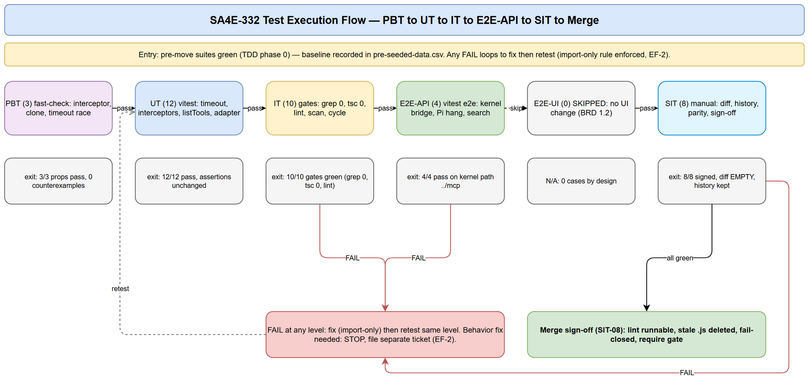
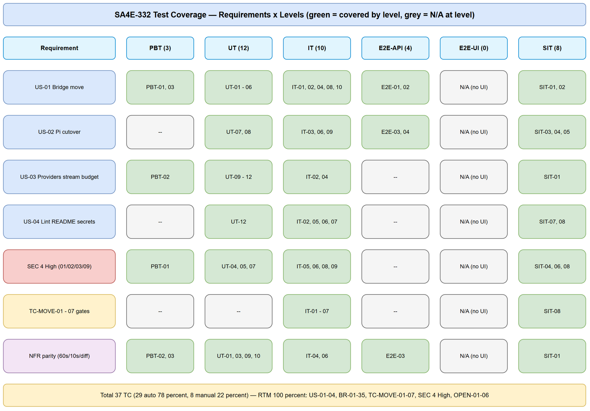

# Software Test Plan (STP)

## SDLC-Agents-4-Enterprise — SA4E-332: Shared kernel extraction (move McpBridge/providers/stream-handler out of langgraph)

---

## Document Information

| Field | Value |
|-------|-------|
| Jira Ticket | SA4E-332 |
| Title | Shared kernel extraction: move McpBridge/providers/stream-handler out of langgraph |
| Epic | SA4E-289 Migrate LangGraph -> Pi SDK (Option C) |
| Author | QA Agent |
| Version | 1.0 |
| Date | 2026-09-27 |
| Status | Draft |
| Related BRD | `C:\Users\ASUS\orca\workspaces\SDLC-Agents-4-Enterprise\SA4E-254\documents\SA4E-332\BRD.md` (v1.0, US-01 → US-04) |
| Related FSD | `C:\Users\ASUS\orca\workspaces\SDLC-Agents-4-Enterprise\SA4E-254\documents\SA4E-332\FSD.md` (v1.2, UC-01 → UC-04, BR-01 → BR-35, TC-MOVE-01 → TC-MOVE-07) |
| Related TDD | `C:\Users\ASUS\orca\workspaces\SDLC-Agents-4-Enterprise\SA4E-254\documents\SA4E-332\TDD.md` (v1.1 FINAL, kernel layout, McpBridgeCaller, cycle gate, lint B, TC-MOVE-01 → 07) |
| Related SECURITY-REVIEW | `C:\Users\ASUS\orca\workspaces\SDLC-Agents-4-Enterprise\SA4E-254\documents\SA4E-332\SECURITY-REVIEW.md` (v1.0, 0 Critical / 4 High / 5 Medium) |

---

## Author Tracking

| Role | Name - Position | Responsibility |
|------|-----------------|----------------|
| Author | QA Agent – QA Engineer | Create document |
| Peer Reviewer | TBD – Tech Lead | Review document |

---

## Revision History

| Version | Date | Author | Changes |
|---------|------|--------|---------|
| 1.0 | 2026-09-27 | QA Agent | Initiate document — from BRD v1.0 + FSD v1.2 + TDD v1.1 FINAL + SECURITY-REVIEW v1.0 |

---

## Sign-Off

| Name | Signature and date |
|------|--------------------|
| | ☐ I agree and confirm the test plan in this STP |
| | ☐ I agree and confirm the test plan in this STP |

---

## 1. Introduction

### 1.1 Purpose

This Test Plan covers ticket SA4E-332, the shared-kernel extraction step of Epic SA4E-289 (Option C: Pi is the target, LangGraph is the legacy to be retired). The work under test is a **move-as-is relocation** (move nguyên trạng): `mcp-bridge.ts`, `providers/` (12 files), `llm-provider.ts`, `stream-handler.ts`, `state-types.ts`, and canonical `context-budget` move from `langgraph/` / `pi-agent/` into the shared kernel `extension/src/mcp/` with **import-specifier-only diff**, plus a Pi transport cutover (`McpWrapperClient` → `McpBridge` via thin adapter `McpBridgeCaller`) with SEC-324-03 policy frozen, plus a lint + README freeze of `langgraph/`.

The plan proves **zero behavior change** (only moved files + import paths + one documented adapter + DI threading) and enforces the SECURITY-REVIEW merge conditions.

### 1.2 Test Objectives

- Verify every FSD use case (UC-01 → UC-04), business rule (BR-01 → BR-35), and FSD gate (TC-MOVE-01 → TC-MOVE-07, TC-BR-01/02, TC-PI-01 → 03, TC-PROV-01, TC-STREAM-01, TC-BUDGET-01, TC-E2E-01, TC-HIST-01) has at least one test case (RTM 100%).
- Verify move-as-is: `git diff` (excluding import-specifier lines + single `McpToolDefinition` ownership move) is EMPTY; frozen constants hold (bridge 60 000 / 10 000 ms; stream 50 ms / 100 cap; budget 4 / 2000 / 85% / 95%).
- Verify `McpBridge` behavior is unchanged after the move: timeout, interceptors (`_as_path` / `_base64_file`), `listTools`, `isAvailable`.
- Verify Pi cutover keeps SEC-324-03 semantics identical: `TOOL_ALLOWLIST`, deny-by-default chaining, approval hook routing, keys-only audit.
- Verify the 4 High security findings are tested: SEC-332-01 (`_as_path` intact after move + amplification tracked), SEC-332-02 (`_filename` intact + follow-up), SEC-332-03 (fail-open approval documented/wired), SEC-332-09 (`serverManager` fail-closed, no hardcoded fallback).
- Verify merge conditions: lint runnable (SEC-332-06), stale `.js` deleted (SEC-332-11 / TC-MOVE-07), `serverManager` fail-closed (SEC-332-09), `require.*langgraph` gate (SEC-332-05).
- Verify NFR parity: timeouts kept 60 s / 10 s, no perf claim beyond parity, no hard-coded secrets/URLs.

### 1.3 References

| Document | Location (absolute) |
|----------|---------------------|
| BRD SA4E-332 v1.0 (US-01 → US-04) | `C:\Users\ASUS\orca\workspaces\SDLC-Agents-4-Enterprise\SA4E-254\documents\SA4E-332\BRD.md` |
| FSD SA4E-332 v1.2 (UC/BR, import map 21 hits, OPEN-01 → 06) | `C:\Users\ASUS\orca\workspaces\SDLC-Agents-4-Enterprise\SA4E-254\documents\SA4E-332\FSD.md` |
| TDD SA4E-332 v1.1 FINAL (kernel layout, McpBridgeCaller, cycle gate, lint B) | `C:\Users\ASUS\orca\workspaces\SDLC-Agents-4-Enterprise\SA4E-254\documents\SA4E-332\TDD.md` |
| SECURITY-REVIEW v1.0 (0 Crit / 4 High / 5 Med, CONDITIONAL PASS) | `C:\Users\ASUS\orca\workspaces\SDLC-Agents-4-Enterprise\SA4E-254\documents\SA4E-332\SECURITY-REVIEW.md` |
| STC (companion) | `C:\Users\ASUS\orca\workspaces\SDLC-Agents-4-Enterprise\SA4E-254\documents\SA4E-332\STC.md` |

---

## 2. Test Strategy

### 2.1 Test Levels (MANDATORY — 6 levels)

| Level | Scope | Automation | Tools |
|-------|-------|------------|-------|
| PBT | Correctness properties (random inputs): interceptor recursion, deep-clone immutability, timeout race, budget conservativeness | Automated | fast-check + vitest |
| UT | Unit/edge tests: `callTool` timeout, `listTools`, interceptors, `isAvailable`, adapter, stream, budget, providers, URL policy | Automated | vitest (`extension/src/mcp/__tests__/`, `pi-agent/extensions/__tests__/`, `config/__tests__/`) |
| IT | Move gates + static gates (grep/tsc/lint/scan/cycle): TC-MOVE-01 → 07, `tsc`, ESLint freeze, secret scan, `madge` cycle, fail-closed, single type owner | Automated | vitest + shell gates (`grep`, `tsc -p ./`, `npx eslint src/`, `npx -y madge@8.0.0 --circular`) |
| E2E-API | Bridge E2E on real server/loopback: `drawio-convert.e2e`, `cross-process.e2e` (kernel path `../mcp/mcp-bridge`), Pi hang-fails-fast, search retry/fail-open | Automated | vitest (`vitest.e2e.config.ts`) + fetch / in-process `McpServerManager.invokeTool` |
| E2E-UI | Browser UI E2E (Playwright) | N/A — 0 cases | — |
| SIT | Manual exploratory / edge cases only: import-only diff review, history, policy-parity spot, approval/audit gaps, FROZEN README, merge sign-off | Manual | Repo review + VS Code + terminal |

Rationale for E2E-UI = 0: BRD §1.2 and FSD §3.x.5 state **no UI/screen change is expected** (Settings panel keys unchanged). There is no user-visible interface to drive with Playwright; all verifiable behavior is at module/gate/transport level.

### 2.2 Test Types

| Type | Description | Applicable |
|------|-------------|------------|
| Functional Testing | Verify UC-01 → UC-04 main/alternative/exception flows per FSD §3 | Yes |
| Regression Testing | `McpBridge` behavior unchanged (timeout/interceptors/listTools/isAvailable); provider/stream/budget suites green | Yes |
| Security Testing | 4 High (SEC-332-01/02/03/09) + lint/secret/cycle gates (SEC-332-05/06/09/11); SEC-324-03 parity | Yes |
| Performance Testing | Parity only — timeouts/debounce/buffer/budget constants frozen; no new perf claim (FSD §8) | Parity check only |
| Usability Testing | No UI change — not applicable | No |
| Compatibility Testing | Node/VS Code engine per `extension/package.json`; no browser matrix | No |

### 2.3 Test Approach

Risk-based, move-as-is-first: (1) baseline all related suites green pre-move; (2) types-first (`mcp-types.ts` before bridge); (3) per-phase gates (TDD §11 phases 0 → 6); (4) automated gates (grep/tsc/lint/scan/cycle) run before human review; (5) manual SIT limited to what cannot be automated (diff review, history, visual README, policy-parity judgment). Automation goal: 29/37 cases automated (78%); manual SIT kept to 8 cases that need human judgment. No production code is written by QA; existing suites are re-pointed (import paths only) per TDD §13.1.

### 2.4 E2E Automation Coverage (SIT minimization)

| Scenario Type | Classify As | Reason |
|--------------|-------------|--------|
| Old-path grep = 0, reverse-dep grep = 0, wrapper-consumer grep = 0, stale `.js` = 0 | IT (automated shell gates) | Deterministic text search, CI-runnable |
| `tsc` clean, lint fixture FAIL + tree PASS, secret/URL scan 0, `madge` 0 cycles | IT (automated) | Exit-code gates, no human judgment |
| Timeout/interceptors/listTools/isAvailable/adapter/provider/stream/budget | UT+PBT (automated vitest) | Existing suites with mocks (`vi.mock("vscode")`, `vi.mock("fs")`) |
| 2 e2e suites on kernel path, Pi hang-fails-fast, search retry/fail-open | E2E-API (automated vitest e2e) | Real server/loopback, no browser needed |
| `git diff` import-only review | SIT (manual) | Needs reviewer judgment on diff semantics |
| `git log --follow` history preserved | SIT (manual) | Human confirms history per moved file |
| Policy-parity spot + approval fail-open + validation-audit gap | SIT (manual) | Security judgment + follow-up ticket tracking |
| README FROZEN wording + merge-condition sign-off | SIT (manual) | Human reads wording, signs checklist |


*[Edit in draw.io](diagrams/test-execution-flow.drawio)*

### 2.5 Entry Criteria

| Level | Entry Criteria |
|-------|----------------|
| PBT/UT | Kernel files moved per TDD §11 phases 1–3; `tsc` compiles; mocks for `vscode`/`fs` available |
| IT | All importer rewrites done (TDD §5.5 rows 1–23); lint rule (Option B) + script fix applied; stale files deleted |
| E2E-API | IT gates green (grep 0, `tsc` 0, lint tree PASS); MCP/loopback server runnable for `listTools`; `McpBridgeCaller` wired |
| SIT | All automated levels executed at least once; `git diff` available for review; SECURITY-REVIEW merge conditions checklist open |

### 2.6 Exit Criteria

| Level | Exit Criteria |
|-------|---------------|
| PBT | 3/3 properties pass (1000+ random cases each, 0 counterexamples on frozen semantics) |
| UT | 12/12 pass; 0 assertion changes beyond import paths (EF-2: any other change → STOP, separate ticket) |
| IT | 10/10 gates green: `grep langgraph/core/mcp-bridge` = 0 hits; `grep from.*langgraph/` outside `src/langgraph/` = 0 files; `grep require.*langgraph` outside `src/langgraph/` = 0; wrapper-consumer prod grep = 0; `tsc` exit 0; lint fixture FAIL + tree PASS; secret/URL scan 0; `grep vscode/tool-registry extension/src/mcp/` = 0; `madge --circular` = 0; `serverManager`-missing throws |
| E2E-API | 4/4 pass with import-path-only edits (`../mcp/mcp-bridge` per DISC-02); Pi hang → `mcp_error` caused by `McpToolTimeoutError` (~60 s) |
| E2E-UI | N/A (0 cases — no UI change) |
| SIT | 8/8 signed; `git diff` (excl. specifiers + type-owner move) EMPTY; `git log --follow` shows history per moved file; follow-up security tickets filed for SEC-332-01/02/03/04/08/10 (blockers for SA4E-289 production wiring, not for this move) |
| Overall | 37/37 executed; 0 Critical defects open; pass rate ≥ 95%; RTM 100% |

---

## 3. Test Scope

### 3.1 Features In Scope

| # | Feature / Story | Priority | FSD Reference | Test Type |
|---|----------------|----------|---------------|-----------|
| 1 | US-01 — Move `McpBridge` to `extension/src/mcp/` + re-point all importers, behavior unchanged | High | UC-01, BR-01 → BR-06, TC-MOVE-01/02/04, TC-BR-01/02, TC-HIST-01 | UT + IT + E2E-API + SIT |
| 2 | US-02 — Pi adopts `McpBridge` (via `McpBridgeCaller`), retires `McpWrapperClient`, SEC-324-03 frozen | High | UC-02, BR-10 → BR-16, TC-MOVE-03, TC-PI-01/02/03 | UT + E2E-API + SIT |
| 3 | US-03 — Move providers / llm-provider / stream-handler / state-types / context-budget as-is | High | UC-03, BR-20 → BR-27, TC-PROV-01, TC-STREAM-01, TC-BUDGET-01 | PBT + UT |
| 4 | US-04 — Lint freeze (`no-restricted-imports` Option B) + README FROZEN + no hard-coded tokens | High | UC-04, BR-30 → BR-35, TC-MOVE-05/06/07, OPEN-01 → 06 | IT + SIT |
| 5 | Security — 4 High findings tested (interceptors intact, allowlist/approval/audit after cutover, cycle gate, lint gate) | High | SEC-332-01/02/03/09; SEC-332-05/06/11 (in-ticket gates) | UT + IT + SIT |
| 6 | Regression — `McpBridge` behavior unchanged (timeout / interceptors / listTools / isAvailable) | High | BR-02/03/04, TC-BR-01/02, existing `mcp-bridge.test.ts` TC-15 → TC-20 | PBT + UT + E2E-API |
| 7 | NFR parity — diff import-only, timeouts kept 60 s / 10 s, stream/budget constants frozen | Medium | FSD §8, BR-02/24/25 | PBT + UT + SIT |


*[Edit in draw.io](diagrams/test-coverage.drawio)*

### Diagram Index

| # | Diagram | Image | Source (editable) |
|---|---------|-------|-------------------|
| 1 | Test Coverage — requirements × levels | [test-coverage.png](diagrams/test-coverage.png) | [test-coverage.drawio](diagrams/test-coverage.drawio) |
| 2 | Test Execution Flow — PBT → UT → IT → E2E-API → SIT pipeline | [test-execution-flow.png](diagrams/test-execution-flow.png) | [test-execution-flow.drawio](diagrams/test-execution-flow.drawio) |

### 3.2 Features Out of Scope

| # | Feature | Reason |
|---|---------|--------|
| 1 | Any behavior refactor of moved modules | Hard rule "move nguyên trạng" (BRD §2.3 note); fixes filed as separate tickets |
| 2 | Deletion of pure-graph execution code (`workflow/`, executors, hooks, diagnostics) | SA4E-289 follow-up phase tickets, not SA4E-332 |
| 3 | Changes to SEC-324-03 policy semantics (allowlist contents, approval decisions, audit format) | Frozen; only transport underneath changes |
| 4 | Backend MCP server / protocol / new MCP tools | No server change in this ticket |
| 5 | UI/screen changes | No user-visible interface change expected |
| 6 | Fixing SEC-332-01/02/03/04/08/10 inside the move | Separate hardening tickets (tracked as SIT follow-ups); move preserves semantics byte-identically |
| 7 | E2E-UI browser tests | No UI surface; 0 cases by design |

### 3.3 RTM Summary (US / BR / TC-MOVE → test levels, 100%)

| Requirement | Source | Test Cases | Coverage |
|-------------|--------|------------|----------|
| US-01 (move bridge) | BRD 2.3, FSD 3.1 (UC-01, BR-01 → 06) | PBT-01, PBT-03, UT-01 → UT-06, IT-01, IT-02, IT-04, IT-08, IT-10, E2E-API-01, E2E-API-02, SIT-01, SIT-02 | ✅ |
| US-02 (Pi cutover) | BRD 2.3, FSD 3.2 (UC-02, BR-10 → 16) | UT-07, UT-08, IT-03, IT-06, IT-09, E2E-API-03, E2E-API-04, SIT-03, SIT-04, SIT-05 | ✅ |
| US-03 (providers/stream/types/budget) | BRD 2.3, FSD 3.3 (UC-03, BR-20 → 27) | PBT-02, UT-09, UT-10, UT-11, UT-12, IT-02 | ✅ |
| US-04 (lint freeze + README + secrets) | BRD 2.3, FSD 3.4 (UC-04, BR-30 → 35) | UT-12, IT-02, IT-05, IT-06, IT-07, SIT-07, SIT-08 | ✅ |
| TC-MOVE-01 (old path gone) | FSD §10 | IT-01 | ✅ |
| TC-MOVE-02 (no reverse deps) | FSD §10 | IT-02 | ✅ |
| TC-MOVE-03 (no wrapper consumers) | FSD §10 | IT-03 | ✅ |
| TC-MOVE-04 (compile clean) | FSD §10 | IT-04 | ✅ |
| TC-MOVE-05 (lint freeze proven) | FSD §10 | IT-05 | ✅ |
| TC-MOVE-06 (secret/URL scan) | FSD §10 | IT-06 | ✅ |
| TC-MOVE-07 (stale `.js` gone) | FSD §10 v1.2 DISC-03 | IT-07 | ✅ |
| TC-BR-01 (call timeout) | FSD §10 | PBT-03, UT-01 | ✅ |
| TC-BR-02 (list + interceptors) | FSD §10 | UT-02 → UT-06, PBT-01 | ✅ |
| TC-PI-01 (policy parity) | FSD §10 | UT-07, SIT-03 (+ re-mocked `mcp-bridge-extension.test.ts`) | ✅ |
| TC-PI-02 (search resilience) | FSD §10 | UT-08, E2E-API-04 | ✅ |
| TC-PI-03 (hang fails fast) | FSD §10 | E2E-API-03 | ✅ |
| TC-PROV-01 (provider matrix) | FSD §10 | UT-11, UT-12 | ✅ |
| TC-STREAM-01 (stream semantics) | FSD §10 | UT-09 | ✅ |
| TC-BUDGET-01 (budget math) | FSD §10 | PBT-02, UT-10 | ✅ |
| TC-E2E-01 (e2e on kernel bridge) | FSD §10 | E2E-API-01, E2E-API-02 | ✅ |
| TC-HIST-01 (history preserved) | FSD §10 | SIT-02 | ✅ |
| SEC-332-01 High (`_as_path` carried+amplified) | SECURITY-REVIEW | UT-04, PBT-01, SIT-06 (+ follow-up ticket gate SIT-08) | ✅ |
| SEC-332-02 High (`_filename` traversal) | SECURITY-REVIEW | UT-05, SIT-06 (+ follow-up ticket gate SIT-08) | ✅ |
| SEC-332-03 High (fail-open approval) | SECURITY-REVIEW | SIT-04, SIT-03 (+ entry-wiring check) | ✅ |
| SEC-332-09 High cond. (`serverManager` fail-closed) | SECURITY-REVIEW | IT-09, IT-06, IT-03 | ✅ |
| OPEN-01 (cycle gate) | FSD §11.6 / TDD §14 | IT-08 | ✅ |
| OPEN-02 (e2e DI accepted as-is) | FSD §11.6 / TDD §14 | E2E-API-01, E2E-API-02 | ✅ |
| OPEN-03 (lint script + ignores) | FSD §11.6 / TDD §14 | IT-05 | ✅ |
| OPEN-04 (`.js` suffix normalize) | FSD §11.6 / TDD §14 | IT-01, IT-02 | ✅ |
| OPEN-05 (test re-mock) | FSD §11.6 / TDD §14 | UT-07, SIT-03 | ✅ |
| OPEN-06 (stale file DELETE) | FSD §11.6 / TDD §14 | IT-07 | ✅ |

Full per-case traceability with step detail is in `STC.md` §10 (Requirements Traceability Matrix).

### 3.4 Test Cases Summary (MANDATORY)

| Level | Count | Automated | Manual |
|-------|-------|-----------|--------|
| PBT | 3 | 3 | 0 |
| UT | 12 | 12 | 0 |
| IT | 10 | 10 | 0 |
| E2E-API | 4 | 4 | 0 |
| E2E-UI | 0 | 0 | 0 |
| SIT | 8 | 0 | 8 |
| **Total** | **37** | **29 (78%)** | **8 (22%)** |

---

## 4. Test Environment

### 4.1 Environment Requirements

| Environment | Location | Purpose |
|-------------|----------|---------|
| DEV workstation | `C:\Users\ASUS\orca\workspaces\SDLC-Agents-4-Enterprise\SA4E-254\extension\` | Move + gates: `npm run compile` (`tsc -p ./` from `extension/`), `npm run test` (vitest), e2e via `vitest.e2e.config.ts`, `npm run lint` (`npx eslint src/` after OPEN-03 fix), grep/`madge` gates |
| CI | Extension pipeline | lint + compile + unit + e2e subsets (TDD §11 phase 6) |

### 4.2 Runtime Requirements

| Item | Version | Required |
|------|---------|----------|
| TypeScript (VS Code extension host) | ^5.4.0 | Yes |
| Node / VS Code engine | ^1.85.0 | Yes |
| vitest (unit + e2e) | ^4.1.8 | Yes |
| fast-check (PBT properties) | devDependency (proposed for PBT-01 → 03) | Yes for PBT |
| ESLint flat config (`typescript-eslint`) | ^8.67.0 (v9 semantics) | Yes |
| `madge` (cycle gate, pinned npx only — no `package.json` change) | 8.0.0 (`npx -y madge@8.0.0 --circular extension/src/mcp/`) | Yes |

### 4.3 Test Data Requirements

| Data Type | Description | Source | Preparation |
|-----------|-------------|--------|-------------|
| Move-gate baselines | Pre-move grep counts (21-hit import map), green suite list | `documents/SA4E-332/testdata/pre-seeded-data.csv` | Record before any `git mv` (TDD phase 0) |
| Bridge behavior rows | Timeout/interceptor/list/guard inputs + expected errors | `documents/SA4E-332/testdata/bridge-behavior-testdata.csv` | Mocks per healthy `mcp-bridge.test.ts` pattern |
| Pi cutover rows | Allowlist/chaining/approval/audit + retry/fail-open inputs | `documents/SA4E-332/testdata/pi-cutover-testdata.csv` | Re-mocked bridge fake (`callTool`/`listTools`/`isAvailable`) |
| Provider/stream/budget rows | Factory/URL-policy/stream/budget inputs + frozen constants | `documents/SA4E-332/testdata/providers-stream-budget-testdata.csv` | Existing suites + settings fixtures |
| Security gate rows | 4 High + merge-condition inputs | `documents/SA4E-332/testdata/security-gates-testdata.csv` | Interceptor payloads, hook-missing entry, scan fixtures |
| Manual SIT rows | Diff/history/README/checklist inputs | `documents/SA4E-332/testdata/manual-sit-testdata.csv` | Reviewer checklists |

Every STC test-case ID appears in at least one CSV (see STC Appendix verification).

### 4.4 External Dependencies

| System | Dependency | Mock/Stub Available |
|--------|-----------|---------------------|
| `IServerManager` / `RemoteBackendClient` (`invokeTool`, `port`, `status`) | Stable contract, untouched | Yes — `mcpManagerMock` (`status: "running"`, `port`, `invokeTool: vi.fn()`) in UT/PBT |
| MCP loopback HTTP (`POST http://127.0.0.1:{port}/mcp`, `tools/list`) | 10 s `AbortController` path | Yes — `global.fetch` mock in UT; real loopback in E2E-API |
| VS Code API (`workspace.workspaceFolders`, SecretStorage, `kiroSdlc.*` settings) | Workspace root for `documents/tmp/`; secrets/URLs | Yes — `vi.mock("vscode")`, `vi.mock("fs")` per healthy suite pattern |
| Workspace disk (`documents/tmp/`) | `_base64_file` save target | Yes — mocked `fs` (`existsSync`/`readFileSync`/`writeFileSync`/`mkdirSync`) |

---

## 5. Test Schedule

| Phase | Duration | Milestone |
|-------|----------|-----------|
| Test Planning (this STP + STC) | 1 day | STP + STC approved |
| Test Data Preparation (CSVs + baselines) | 0.5 day | `testdata/*.csv` ready; pre-move suites recorded green |
| Gate Execution PBT → UT → IT | 1 day | 25/25 automated lower-level gates green |
| E2E-API Execution | 0.5 day | 4/4 e2e pass on kernel path |
| SIT Execution (manual review + sign-off) | 1 day | 8/8 signed; follow-up security tickets filed |
| Defect Fix & Retest | 1 day buffer | All Critical/Major fixed; `git diff` import-only confirmed |
| Go / Merge | 0.5 day | Merge conditions all green (lint runnable, stale `.js` deleted, fail-closed, `require` gate) |

---

## 6. Resources & Responsibilities

| Role | Responsibility |
|------|----------------|
| Test Lead (QA) | Test planning (STP/STC), gate coordination, RTM 100% verification, reporting |
| QA Engineer | Test design + execution (PBT/UT/IT/E2E-API), CSV data, defect reporting, SIT checklist |
| BA | UAT support — N/A (no user-facing change); owns BRD US-01 → 04 clarification |
| Developer | Move implementation per TDD §11; bug fixing; keeps diff import-only; records fixture-FAIL + tree-PASS in PR |
| Security reviewer (SEC-324-03 owner) | Policy-parity sign-off (allowlist/approval/audit unchanged); confirms follow-up tickets for SEC-332-01/02/03/04/08/10 |
| Tech lead | Lint freeze (Option B) + README FROZEN + `madge` step ownership (OPEN-01/03); merge-condition sign-off |
| Tools | vitest + fast-check; `tsc`; ESLint flat config; `grep`; `madge@8.0.0` (npx pinned); `git log --follow` / `git diff` |

---

## 7. Risk & Mitigation

| # | Risk | Impact | Likelihood | Mitigation |
|---|------|--------|------------|------------|
| 1 | Circular import `mcp-bridge ↔ tool-registry` (`McpToolDefinition`) carried into kernel | High | Medium | Types-first (`mcp-types.ts` single owner); gates IT-08/IT-10 (`grep vscode/tool-registry` in `mcp/` = 0, `madge` 0) |
| 2 | `.js`-suffixed / relative-form imports missed (`kb-client.ts:3`, `tool-registry.ts:6`, context-probe) | Medium | Medium | Triple-pattern sweep (IT-01/IT-02 cover `langgraph/core/mcp-bridge`, `mcp-bridge\.js`, `\.\./core/mcp-bridge` + `require.*langgraph`) |
| 3 | Pi cutover changes error/timeout surface (search retry, extension error text) | High | Medium | Keep `withSearchTimeout`/`withRetry` wrappers; map to existing `mcp_error` shapes; UT-07/08 + E2E-API-03/04 |
| 4 | Unknown `McpWrapperClient` consumer left behind | Medium | Low | Prod grep = 0 (IT-03); fallback AF-1 deprecate + follow-up ticket |
| 5 | Providers move breaks lazy `require()` or `PROVIDER_BASE_URL_KEYS` wiring | High | Low | Whole-dir `git mv` (relatives preserved); UT-11/12 + full provider matrix |
| 6 | Lint false-positives break intra-`langgraph/` legacy imports | Medium | Medium | Option B override (`src/langgraph/**/*.ts` → rule off); IT-05 proves tree PASS |
| 7 | Hardcoded `127.0.0.1:9181` reintroduced (incl. `serverManager`-missing fallback) | High (cond.) | Medium | IT-06 + IT-09 (fail-closed throw, no fallback; URL grep = 0) |
| 8 | Scope creep: behavior "improvements" bundled into move | Medium | Medium | SIT-01 rejects any non-specifier diff; EF-2 STOP rule |
| 9 | Pi `_as_path` amplification (LLM-controlled params reach file-read) | High | Medium | Tested intact (UT-04/PBT-01/SIT-06) + P1 follow-up ticket before SA4E-289 production wiring (SIT-08) |
| 10 | Test file churn confusion (stale `extension/tests/` vs healthy suite) | Medium | Medium | IT-07 DELETEs both stale files; healthy suite moves to `mcp/__tests__/` |

---

## 8. Defect Management

### 8.1 Severity Levels

| Severity | Definition | Example (this ticket) |
|----------|-----------|-----------------------|
| Critical | Behavior change smuggled into move; SEC-324-03 policy outcome differs; hardcoded secret/URL in kernel | Assertion must change beyond import paths; allowlisted tool denied post-cutover |
| Major | Gate red: grep/tsc/lint/scan/cycle non-zero; e2e fails on kernel path | Missed importer; cycle carried; fixture never fails lint |
| Minor | README wording incomplete; log-shape nit | FROZEN README missing ticket ref |
| Trivial | Typo in comments/test names | Misspelled test title |

### 8.2 Priority Levels

| Priority | Definition | SLA (Fix Time) |
|----------|-----------|----------------|
| P1 | Blocks merge (any Critical; SEC-332-05/06/09/11 gates red) | Same day |
| P2 | Must fix before merge (Major gates) | 1 business day |
| P3 | Should fix if time permits (Minor) | 3 business days |
| P4 | Nice to fix, can defer (Trivial; hardening follow-ups are separate tickets) | Next ticket (SA4E-289 follow-ups) |

### 8.3 Defect Lifecycle

```
New → Open → In Progress → Fixed → Ready for Retest → Verified → Closed
                                                      → Reopened → In Progress
```

Move-specific rule: any fix that changes behavior (not just specifiers) is REJECTED from this ticket — file a separate ticket and keep this move import-only (EF-2).

---

## 9. Test Metrics & Reporting

### 9.1 Metrics

| Metric | Formula | Target |
|--------|---------|--------|
| Test Execution Rate | Executed / Total × 100% | 100% (37/37) |
| Pass Rate | Passed / Executed × 100% | ≥ 95% |
| Automation Rate | Automated / Total × 100% | 78% (29/37) |
| Defect Density | Defects / Test Cases | ≤ 0.1 |
| Critical Defect Count | Count of Critical severity | 0 |
| Defect Fix Rate | Fixed / Total Defects × 100% | ≥ 90% |
| RTM Coverage | Requirements with ≥1 TC / Total × 100% | 100% (US/BR/TC-MOVE/SEC/OPEN) |
| NFR Parity | Frozen constants + error strings byte-identical | 100% (60 000 / 10 000; 50 ms / 100; 4 / 2000 / 85% / 95%) |

### 9.2 Reporting Schedule

| Report | Frequency | Audience |
|--------|-----------|----------|
| Gate status (PBT/UT/IT/E2E-API) | Per phase completion | Dev + Tech lead |
| SIT checklist sign-off | End of SIT | Epic owner + Security reviewer |
| Test Completion Report | Merge readiness | All stakeholders |
| Execution tracking | Per-case rows | `C:\Users\ASUS\orca\workspaces\SDLC-Agents-4-Enterprise\SA4E-254\documents\SA4E-332\TEST-REPORT-SA4E-332.csv` (Status NOT_RUN → PASS/FAIL) |

---

## 10. Appendix

### Glossary

| Term | Definition |
|------|------------|
| Shared kernel | `extension/src/mcp/` — neutral home for code used by Pi and legacy LangGraph during migration |
| Move-as-is (move nguyên trạng) | Relocation with import-specifier-only diff; any other diff is rejected |
| McpBridge | Timeout-aware in-process wrapper over `IServerManager.invokeTool` with file interceptors and `tools/list` |
| McpBridgeCaller | NEW thin adapter satisfying `McpCaller` via `McpBridge.callTool` (sole intentional adaptation) |
| McpWrapperClient | Legacy Pi-side raw-HTTP client (hardcoded URL, no timeout) retired from Pi paths |
| SEC-324-03 | Allowlist + deny-dynamic-chaining + approval + keys-only audit (semantics frozen) |
| FROZEN | `langgraph/` post-extraction state: no new code/importers; phased deletion only |
| PBT/UT/IT/E2E-API/E2E-UI/SIT | Test levels per §2.1 (E2E-UI = 0 cases: no UI change) |

### Assumptions

- `extension/src/mcp/` is the agreed kernel home (team may rename 1:1 to `extension/src/shared/` with no requirement change — paths in TCs rename identically).
- Pre-move suites are green (TDD phase 0 baseline recorded) before any `git mv`.
- `madge` runs via pinned `npx -y madge@8.0.0` (no new dependency); `require()` edges are covered by the `require.*langgraph` grep gate (SEC-332-05/12).
- fast-check is added as a devDependency for the 3 PBT properties (no runtime dependency change).
- Follow-up hardening tickets (SEC-332-01/02/03/04/08/10) are filed before merge and block SA4E-289 production wiring, not this move itself (per SECURITY-REVIEW CONDITIONAL PASS).
