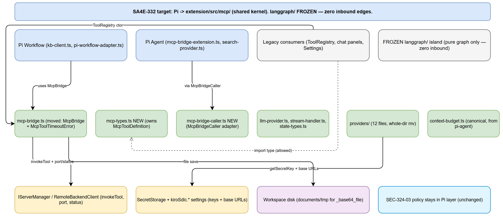
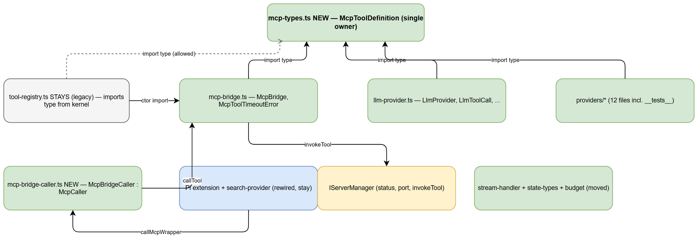
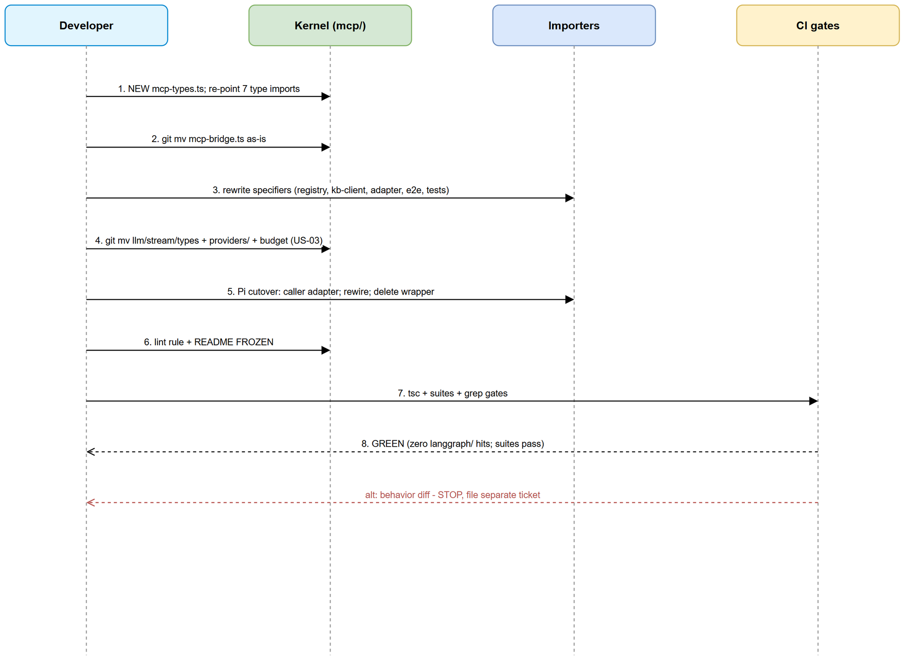
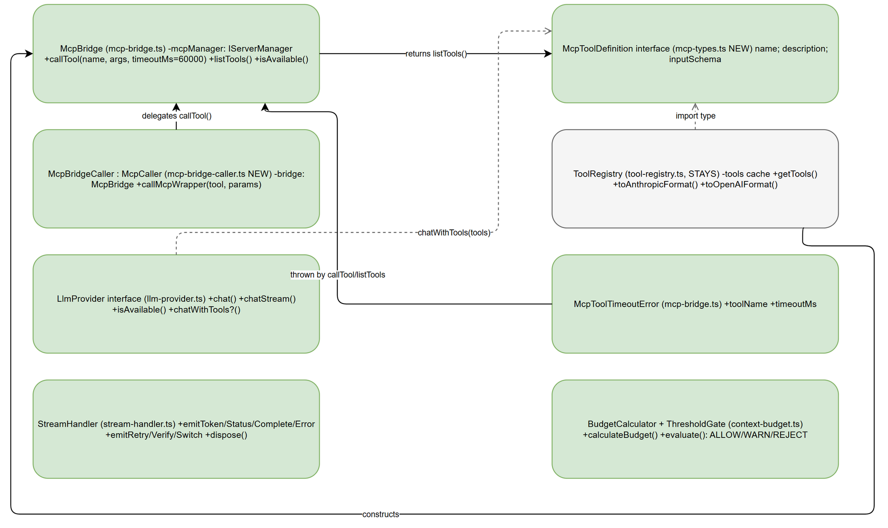

# Technical Design Document (TDD)

## SDLC-Agents-4-Enterprise — SA4E-332: Shared kernel extraction (Epic SA4E-289 Option C)

---

## Document Information

| Field | Value |
|-------|-------|
| Jira Ticket | SA4E-332 |
| Title | Shared kernel extraction: move McpBridge/providers/stream-handler out of langgraph |
| Epic | SA4E-289 Migrate LangGraph -> Pi SDK (Option C) |
| Author | SA Agent (Solution Architect) |
| Version | 1.1 |
| Date | 2026-09-27 |
| Status | Final (verified against FSD v1.2 — DISC-01/02/03 resolved, no design change) |
| Related BRD | `documents/SA4E-332/BRD.md` (US-01 → US-04) |
| Related FSD | `documents/SA4E-332/FSD.md` v1.2 (UC-01 → UC-04, BR-01 → BR-35) |
| Workspace (absolute) | `C:\Users\ASUS\orca\workspaces\SDLC-Agents-4-Enterprise\SA4E-254\documents\SA4E-332\` |

---

## Author Tracking

| Role | Name - Position | Responsibility |
|------|-----------------|----------------|
| Author | SA Agent – Solution Architect | Create document |
| Peer Reviewer | TBD – Tech Lead | Review document |

---

## Revision History

| Version | Date | Author | Changes |
|---------|------|--------|---------|
| 1.0 | 2026-09-27 | SA Agent | Initiate from BRD v1.0 + FSD v1.1 + verified code (SA4E-254). Closed OPEN-01→06, fixed kernel layout, full import map, lint option B. 3 discrepancies filed in DISCREPANCY.md (FSD not modified). |
| 1.1 | 2026-09-27 | SA Agent | Verify against FSD v1.2 (DISC-01/02/03 resolved by BA). No design change — TDD v1.0 decisions already match resolutions (DELETE stale test + artifact, corrected e2e depth `../mcp/mcp-bridge`, TC-MOVE-07 trace). Update FSD refs v1.1 → v1.2, add TC-MOVE-07 to checklist gate, mark Final. |

---

## Sign-Off

| Name | Signature and date |
|------|--------------------|
| | ☐ I agree and confirm the technical design in this TDD |
| | ☐ I agree and confirm the technical design in this TDD |

---

## 1. Introduction

> **Scope Boundary:** Functional requirements, business rules (BR-01 → BR-35), use cases (UC-01 → UC-04) and UI specs live in FSD v1.2. This TDD specifies HOW to implement them: kernel layout, class design, API mechanics, integration wiring, lint freeze, implementation order, error/security/test hooks. No behavior is designed here — every move is as-is.

### 1.1 Purpose

Reverse the dependency inversion violating Epic SA4E-289 Option C (Pi → `langgraph/` today) by extracting the shared kernel into `extension/src/mcp/`, re-pointing all importers, cutting Pi tool transport from `McpWrapperClient` to `McpBridge` with SEC-324-03 policy frozen, and freezing `langgraph/` with lint + README. Implements UC-01 → UC-04.

### 1.2 Scope

**In scope (technical):** kernel layout + 2 NEW files (`mcp-types.ts`, `mcp-bridge-caller.ts`); `git mv` of bridge / llm-provider / stream-handler / state-types / providers (12 files) / context-budget; per-file import rewrites (verified map in §5.5); `McpCaller` thin-adapter cutover + `BridgeOptions.serverManager` DI; deletion of `mcp-wrapper-client.ts`; flat-config `no-restricted-imports` (option B) + lint-script fix + `README FROZEN`; cycle/secret/grep CI gates.

**Out of scope:** any logic change; pure-graph deletion (SA4E-289 follow-ups); SEC-324-03 policy semantics; MCP protocol/backend; UI; DOCX export and Jira attach (SM owns per role boundaries).

### 1.3 Technology Stack

| Layer | Technology | Version |
|-------|-----------|---------|
| Language | TypeScript (VS Code extension host) | ^5.4.0 |
| Runtime | VS Code engine / Node (extension host, in-process) | ^1.85.0 |
| State/Workflow | Pi SDK (`@earendil-works/pi-agent-core`) + legacy LangGraph tree (frozen) | 0.80.10 |
| Validation | zod (kb-client), `validateProviderBaseUrl` SSRF guard | existing |
| Test | vitest (unit + e2e via `vitest.e2e.config.ts`) | ^4.1.8 |
| Lint | ESLint flat config (`typescript-eslint`) | ^8.67.0 (ESLint v9 semantics) |
| Build | tsc (`compile: tsc -p ./` from `extension/`) + esbuild | existing |
| Cycle check | `madge` via pinned `npx -y` (no new dependency, §7.5) | 8.0.0 (npx only) |

### 1.4 Design Principles

- **Move-as-is (move nguyên trạng):** `git mv` + import-specifier-only diff. Any behavior diff → STOP, file separate ticket.
- **Types first, values second:** `mcp-types.ts` is created before the bridge moves, so the kernel never carries the `mcp-bridge ↔ tool-registry` cycle.
- **Single owner per symbol:** `McpToolDefinition` lives only in `extension/src/mcp/mcp-types.ts` (closes FSD AF-2/AF-3).
- **Allowed direction only:** kernel → infrastructure; legacy → kernel (type-only). Never kernel → `langgraph/`.
- **Policy frozen, transport swapped:** SEC-324-03 decision order and payloads are byte-identical; only the transport line changes.
- **Fail-closed:** unknown provider, bad URL, missing secret, non-running server, budget overflow all throw/deny as today.

### 1.5 Constraints

- No new runtime dependencies. `madge` is npx-pinned only (not added to `package.json`).
- No `index.ts` barrel in the kernel (avoids re-export cycles; explicit deep imports).
- `.js`-suffixed imports are normalized to extensionless (OPEN-04 decision); grep + lint gates cover both spellings regardless.
- Two same-named test files exist (`extension/tests/` stale vs `src/langgraph/__tests__/` healthy) — disposition fixed in §13.1 / DISCREPANCY.md, not left ambiguous.
- FSD import-map row for the 2 e2e tests names the wrong depth (`../../mcp/...`) — corrected to `../mcp/...` in §5.5 (DISC-02).

### 1.6 References

| Document | Location |
|----------|----------|
| BRD SA4E-332 (US-01 → US-04) | `C:\Users\ASUS\orca\workspaces\SDLC-Agents-4-Enterprise\SA4E-254\documents\SA4E-332\BRD.md` |
| FSD SA4E-332 v1.2 (UC-01 → UC-04, BR-01 → BR-35) | `C:\Users\ASUS\orca\workspaces\SDLC-Agents-4-Enterprise\SA4E-254\documents\SA4E-332\FSD.md` |
| Discrepancy report (this design found 3) | `C:\Users\ASUS\orca\workspaces\SDLC-Agents-4-Enterprise\SA4E-254\documents\SA4E-332\DISCREPANCY.md` |
| Code evidence | `extension/src/langgraph/core/mcp-bridge.ts` (182), `llm-provider.ts` (89), `stream-handler.ts` (185), `state-types.ts` (36), `vscode/tool-registry.ts` (86), `providers/` (12 files), `pi-agent/context-budget.ts` (110), `pi-agent/extensions/mcp-bridge-extension.ts` (189), `mcp-wrapper-client.ts` (76), `pi-agent/context-retrieval/search-provider.ts` (137), `pi-workflow/kb-client.ts` (100), `pi-workflow-adapter.ts` (246), `pi-adapter-context-probe.ts` (44), `mcp-server-manager.ts`, `types/server-types.ts`, `config/backend-url.ts`, `models/LlmProviderConfig.ts`, `extension/eslint.config.js`, `extension/package.json` |

---

## 2. System Architecture

### 2.1 Architecture Overview

Before: `pi-workflow/` → `langgraph/core/` (reverse dependency); Pi agent → raw-fetch `mcp-wrapper-client` (hardcoded URL, no timeout); providers/llm/stream/types/budget scattered under `langgraph/` and `pi-agent/`.

After (this TDD): all shared modules live in `extension/src/mcp/`; every consumer arrow points at the kernel; `langgraph/` is a frozen island with zero inbound edges; Pi tool transport is `McpBridge` (timeout + interceptors + availability guard); SEC-324-03 stays enforced in the Pi layer above the transport.


*[Edit in draw.io](diagrams/architecture.drawio)*

### 2.2 Component Diagram

Kernel internals and the allowed legacy → kernel edges. `tool-registry.ts` STAYS in `langgraph/` but imports the value `McpBridge` and the type `McpToolDefinition` from the kernel (allowed direction). `mcp-bridge-caller.ts` is the single intentional signature adaptation in the ticket (FSD AF-2 thin adapter).


*[Edit in draw.io](diagrams/component.drawio)*

| Component | Responsibility | Location after ticket |
|-----------|---------------|----------------------|
| `mcp-bridge.ts` | Timeout-aware tool transport (`callTool`/`listTools`/`isAvailable`, interceptors) | `extension/src/mcp/` (moved) |
| `mcp-types.ts` (NEW) | Single owner of `McpToolDefinition` | `extension/src/mcp/` |
| `mcp-bridge-caller.ts` (NEW) | `McpBridgeCaller : McpCaller` thin adapter | `extension/src/mcp/` |
| `llm-provider.ts` / `stream-handler.ts` / `state-types.ts` | Provider interface / webview event bridge / domain types | `extension/src/mcp/` (moved) |
| `providers/` (12 files incl. `__tests__`) | Factory, registry, anthropic/openai/ollama/onnx, URL SSRF guard | `extension/src/mcp/providers/` (whole-dir move) |
| `context-budget.ts` | `BudgetCalculator` + `ThresholdGate` (pure, no imports) | `extension/src/mcp/` (from `pi-agent/`) |
| `tool-registry.ts` | `ToolRegistry` cache + format converters (consumer, STAYS) | `extension/src/langgraph/vscode/` (re-pointed) |
| Pi extension + search-provider | SEC-324-03 enforcement + retrieval (rewired, STAY) | `extension/src/pi-agent/` (unchanged paths) |
| `IServerManager` / `RemoteBackendClient` | `invokeTool`, `port`, `status` (STABLE contract, untouched) | `extension/src/` (untouched) |

### 2.3 Deployment Architecture

No containers, servers, or networks change. The extension runs in the VS Code extension host; `McpBridge` calls `invokeTool` in-process; only `listTools()` performs a loopback HTTP POST (`http://127.0.0.1:{port}/mcp`). Deployment consideration is therefore limited to: ship the moved files in the normal `.vsix` build (`vscode:prepublish` unchanged); no env/config change; rollback = revert the move commit (§10.3).

### 2.4 Communication Patterns

| From | To | Protocol | Pattern | Description |
|------|----|----------|---------|-------------|
| Pi / registry / panels | Kernel (`McpBridge`, providers, `StreamHandler`) | In-process TS calls | Sync (async/await) | Re-pointed imports only; signatures frozen |
| `McpBridge` | `IServerManager.invokeTool` | In-process | Sync | Unchanged delegation + `Promise.race` timeout |
| `McpBridge.listTools` | Local MCP HTTP (`127.0.0.1:{port}/mcp`) | JSON-RPC 2.0 `tools/list` | Sync + `AbortController` 10 s | Unchanged; port from `IServerManager.port` |
| Providers factory | SecretStorage / `kiroSdlc.*` settings | VS Code API | Sync read | `getSecretKey` + `PROVIDER_BASE_URL_KEYS`; frozen |
| `McpBridge` | Workspace disk (`documents/tmp/`) | `fs` | Sync | `_base64_file` save path; strings frozen |

---

## 3. API Design

> Functional contracts (parameters, business errors) are in FSD §3.x.6. This section fixes the technical mechanics: frozen signatures, the single intentional adaptation, DI threading, and error-code mapping.

### 3.1 API Overview

| # | Member | Kind | Description | Source |
|---|--------|------|-------------|--------|
| 1 | `McpBridge.callTool(name, args, timeoutMs=60_000): Promise<string>` | method (frozen) | Guard → clone → intercept → race → intercept | UC-01 |
| 2 | `McpBridge.listTools(): Promise<McpToolDefinition[]>` | method (frozen) | Guard → port → POST `tools/list` 10 s abort | UC-01 |
| 3 | `McpBridge.isAvailable(): boolean` | method (frozen) | `status === "running"`, no I/O | UC-01 |
| 4 | `McpCaller.callMcpWrapper(tool, params): Promise<unknown>` | interface (kept) | Satisfied by thin adapter, not renamed | UC-02 |
| 5 | `McpBridgeCaller` (NEW) | adapter class | `callMcpWrapper` → `bridge.callTool` | UC-02 |
| 6 | `createMcpSearchProvider(config, bridge)` | factory (signature changed) | `baseUrl?` param removed; bridge injected | UC-02 |
| 7 | `createExecuteHandler(bridge, ...)` | function (param type changed) | `McpWrapperClient` → `McpBridge`; order frozen | UC-02 |
| 8 | `mcpBridgeExtension({pi}, options: BridgeOptions & { serverManager })` | entry (DI added) | Builds `McpBridge` instead of `createMcpClient()` | UC-02 |

### 3.2 API: McpBridge (frozen surface)

**Implements:** UC-01, BR-02/03/04. Constructor `new McpBridge(mcpManager: IServerManager)` unchanged. `IServerManager` (`types/server-types.ts:8-18`): `{ status, pid, port, spawn/kill/restart/reconnect, invokeTool(name, args): Promise<string>, onStatusChange }` — stable, untouched.

| Member | Frozen behavior | Error mapping |
|--------|----------------|---------------|
| `callTool` | `isAvailable()` guard → deep clone (`JSON.parse(JSON.stringify())` — shallow spread forbidden, LangGraph state aliasing) → `interceptRequestArgs` (recursive incl. arrays; `_as_path` → base64 read, miss → `console.error` + drop key, never throw) → `Promise.race` with `timer.unref?.()` → `clearTimeout` on both paths → `interceptResponse` | `McpServerNotRunningError` (not running); `McpToolTimeoutError(name, timeoutMs)`; upstream `invokeTool` errors propagate |
| `listTools` | Guard + `port` null-check → POST `http://127.0.0.1:{port}/mcp` (`Content-Type: application/json`, body `{jsonrpc:"2.0", id:Date.now(), method:"tools/list", params:{}}`, `AbortController` 10 s) → non-OK `HTTP {status}: {text}`; `data.error` → `MCP error ({code}): {message}`; else `data.result?.tools ?? []` | `McpServerNotRunningError`; `McpToolTimeoutError("tools/list", 10_000)` on `AbortError`; rest rethrown as-is (`Date.now()` id kept) |
| `interceptResponse` | `JSON.parse` → `_base64_file: string` present: no workspace → `Proxy Error: Cannot save base64 file because workspace is undefined.`; else `mkdir -p {root}/documents/tmp`, filename `_filename` or `output_{Date.now()}.bin`, write base64 → `File saved successfully to: {outPath}`; write failure → `Proxy Error: Failed to save base64 file to disk ({reason})` (no base64 leak); non-JSON → raw passthrough | Never throws (all paths return string) |
| `McpToolTimeoutError` | `super("MCP tool '{name}' timed out after {ms}ms")`, `name = "McpToolTimeoutError"` | Export name + message frozen |

### 3.3 API: McpCaller adaptation (the one intentional change)

**Implements:** UC-02, BR-10→16. `McpBridge.callTool` returns `Promise<string>`, assignable to `McpCaller`'s `Promise<unknown>` — only the method name differs. Per FSD AF-2 (thin adapter, no `search-provider.ts` logic change), DEV creates:

```ts
// extension/src/mcp/mcp-bridge-caller.ts (NEW)
import type { McpBridge } from "./mcp-bridge";
import type { McpCaller } from "../pi-agent/context-retrieval/search-provider";

export class McpBridgeCaller implements McpCaller {
  constructor(private readonly bridge: McpBridge) {}
  callMcpWrapper(toolName: string, params: Record<string, unknown>): Promise<unknown> {
    return this.bridge.callTool(toolName, params); // string → unknown is safe; extractText() handles strings
  }
}

export function createMcpSearchProviderFromBridge(bridge: McpBridge, config: RetrievalConfig): McpSearchProvider {
  return new McpSearchProvider({ caller: new McpBridgeCaller(bridge), config });
}
```

Signature map (`callMcpWrapper` → `callTool`):

| Caller side (kept) | Bridge side (target) | Note |
|--------------------|---------------------|------|
| `callMcpWrapper(tool, params): Promise<unknown>` | `callTool(name, args, timeoutMs=60_000): Promise<string>` | Name adapted; return narrows safely |
| `createMcpSearchProvider(config, baseUrl?)` | `createMcpSearchProvider(config, bridge: McpBridge)` | `baseUrl` param deleted with the wrapper; no prod caller passes it (verified §5.5) |
| `createExecuteHandler(mcpClient: McpWrapperClient, ...)` | `createExecuteHandler(bridge: McpBridge, ...)` | Line 132 becomes `bridge.callTool(toolName, params)`; line 133 `typeof result === "string"` mapping kept (now always left branch, harmless) |
| `createMcpClient()` (no args, hardcoded URL) | `new McpBridge(serverManager)` | Entry receives `IServerManager` via `BridgeOptions.serverManager` (required; tests inject mock) |

Outer wrappers stay untouched on top: `withSearchTimeout` (`searchTimeoutMs`), `withRetry` (retry-once + `sleep(retryBackoffMs)` for `code_search`), `optional` (fail-open `[]` for `mem_search`), dedupe + `topK` slice.

### 3.4 API: Pi extension wiring (policy order frozen)

**Implements:** UC-02, BR-10→13. Decision order is code, not config — reviewer verifies line order, not just outcomes: chaining-deny (`DYNAMIC_TOOL_NAME` + `allowDynamicChaining !== true`) → `validateParams` → chained-target allowlist → `checkApproval` (`bridgeRequiresApproval`: `DYNAMIC_TOOL_NAME` + `mem_ingest` always) → `auditLog` (exactly one `BridgeAuditEntry {toolName, argKeys, decision}`, keys only) → transport. Deny payloads (`chaining_denied` / `validation` / `approval_denied`) return before any transport call; transport throws land in the existing `catch` → `mcp_error` (`Error invoking {tool}: {message}`, `cause` preserved). Pi approval flow and LangGraph `ToolApprovalGate`/`hookEngine.fire*` are NOT unified (different layers — FSD EF-6).


*[Edit in draw.io](diagrams/sequence-kernel-extract.drawio)*

---

## 4. Persistence Design

No database in scope. No DDL, indexes, migrations, or query plans. The analogue of migration safety is history preservation: every move uses `git mv`; gate TC-HIST-01 (`git log --follow` per moved file shows history). Module inventory (the logical model for this ticket) is in §5.4.

---

## 5. Class / Module Design

### 5.1 Package Structure (final)

```
extension/src/mcp/                 # shared kernel (target)
├── mcp-bridge.ts                  # MOVED from langgraph/core/ (McpBridge, McpToolTimeoutError)
├── mcp-types.ts                   # NEW — single owner of McpToolDefinition
├── mcp-bridge-caller.ts           # NEW — McpBridgeCaller : McpCaller + FromBridge factory
├── llm-provider.ts                # MOVED from langgraph/core/ (89 lines, as-is)
├── stream-handler.ts              # MOVED from langgraph/core/ (185 lines, as-is)
├── state-types.ts                 # MOVED from langgraph/core/ (36 lines; name KEPT, §5.8)
├── context-budget.ts              # MOVED from pi-agent/ (110 lines, pure, as-is)
├── providers/                     # MOVED whole dir from langgraph/providers/ (12 files incl. __tests__)
│   ├── index.ts / provider-registry.ts / provider-url-policy.ts
│   ├── anthropic-provider.ts / anthropic-helpers.ts
│   ├── openai-provider.ts / openai-helpers.ts
│   ├── ollama-provider.ts / ollama-tools.ts
│   ├── onnx-provider.ts / onnx-tokenizer.ts / BaseLlmProvider.ts
│   └── __tests__/                 # moves with dir; relative imports preserved
├── __tests__/
│   ├── mcp-bridge.test.ts         # MOVED from langgraph/__tests__/ (specifier → ../mcp-bridge)
│   └── stream-handler-events.test.ts # MOVED from langgraph/__tests__/ (depth preserved)
├── atlassian/ / PegaMcpTools.ts / devtools-bridge.ts / ...  # existing, untouched
extension/src/langgraph/           # FROZEN island (README + lint; phased deletion later)
├── vscode/tool-registry.ts        # STAYS — re-pointed to kernel (value + type), re-exports type
├── workflow/workflow-graph-data.ts# STAYS (pure graph)
├── diagnostics/* / hooks/*        # STAY (pure graph)
└── README.md                      # NEW — FROZEN notice (US-04)
```

No barrel `index.ts` is added to the kernel (explicit deep imports only — avoids re-export cycles and keeps the diff import-specifier-only).

### 5.2 Key Interfaces and New Files

```typescript
// extension/src/mcp/mcp-types.ts (NEW) — byte-identical shape to tool-registry.ts:9-13
export interface McpToolDefinition {
  name: string;
  description: string;
  inputSchema: Record<string, unknown>;
}
// NOTE: AnthropicTool + OpenAIFunction STAY in tool-registry.ts (registry format concerns, used only there).
```

`McpBridgeCaller` as sketched in §3.3. `tool-registry.ts` post-change: deletes its local `McpToolDefinition`, adds `import type { McpToolDefinition } from "../../mcp/mcp-types";` plus `export type { McpToolDefinition };` for backward-compat during phased deletion.


*[Edit in draw.io](diagrams/class.drawio)*

### 5.3 Moved-File Import Deltas (inside moved files)

| Moved file | Old specifier(s) | New specifier(s) |
|------------|------------------|------------------|
| `mcp/mcp-bridge.ts` | `../../mcp-server-manager`, `../../types/server-types`, `../../types`, `../vscode/tool-registry` (type) | `../mcp-server-manager`, `../types/server-types`, `../types`, `./mcp-types` (type) |
| `mcp/llm-provider.ts` | `../vscode/tool-registry` (type) | `./mcp-types` (type) |
| `mcp/stream-handler.ts` | `../../chat-panel/message-protocol` | `../chat-panel/message-protocol` |
| `mcp/state-types.ts` | `./llm-provider` (type) | `./llm-provider` (UNCHANGED — moves together) |
| `mcp/providers/*` | `../core/llm-provider` → `../llm-provider`; `../vscode/tool-registry` (type, 5 files) → `../mcp-types` | `../../models/LlmProviderConfig`, `../../config/backend-url`, lazy `require("./...")` UNCHANGED (same depth) |
| `mcp/context-budget.ts` | (no imports — pure) | (no change) |

### 5.4 Stay-or-Move List (US-03 decision, binding)

**MOVE to kernel:** `core/mcp-bridge.ts`, `core/llm-provider.ts`, `core/stream-handler.ts`, `core/state-types.ts`, entire `providers/` dir, canonical `pi-agent/context-budget.ts` (+ its consumers `session-configurator.ts`, `session-compactor.ts` re-point `./context-budget` → `../mcp/context-budget`; verify at implementation — no `langgraph/`-side budget duplicate was found by grep).

**STAY (frozen, deleted phase-by-phase under SA4E-289 follow-ups, never moved):** `langgraph/vscode/tool-registry.ts` (consumer), `langgraph/workflow/workflow-graph-data.ts`, `langgraph/diagnostics/*`, `langgraph/hooks/*`, `chat/engine/ToolApprovalGate` + `ToolApprovalClassifier` (outside `langgraph/`, untouched), `extension.ts:15` + `chat-panel-provider.ts:18` diagnostics imports, `panels/workflow-panel.ts:11` graph import, `chat/engine/__tests__/SessionManager.test.ts:10` `mock-kb-server` scaffold.

### 5.5 Complete Importer Rewrite Map (verified against code 2026-09-27)

| # | Importer | Old specifier | New specifier |
|---|----------|---------------|---------------|
| 1 | `langgraph/vscode/tool-registry.ts:6` | `../core/mcp-bridge` | `../../mcp/mcp-bridge` (+ type owner swap §5.2) |
| 2 | `pi-workflow/kb-client.ts:3` | `../langgraph/core/mcp-bridge.js` | `../../mcp/mcp-bridge` (drop `.js`, OPEN-04) |
| 3 | `pi-workflow/kb-client.ts:2` | `../types/server-types.js` | `../types/server-types` (normalize consistently) |
| 4 | `pi-workflow/pi-workflow-adapter.ts:7` | `../langgraph/core/mcp-bridge` | `../../mcp/mcp-bridge` |
| 5 | `pi-workflow-adapter.ts:8` | `../langgraph/core/stream-handler` | `../../mcp/stream-handler` |
| 6 | `pi-workflow-adapter.ts:11` | `../langgraph/core/llm-provider` (type-only) | `../../mcp/llm-provider` |
| 7 | `pi-workflow/pi-adapter-context-probe.ts:1` | `../langgraph/core/llm-provider.js` (type-only) | `../../mcp/llm-provider` |
| 8–9 | `__tests__/drawio-convert.e2e.test.ts:6`, `cross-process.e2e.test.ts:6` | `../langgraph/core/mcp-bridge` | `../mcp/mcp-bridge` (src-depth; FSD `../../` corrected — DISC-02) |
| 10 | `langgraph/__tests__/mcp-bridge.test.ts:28` | `../core/mcp-bridge` | File MOVES to `mcp/__tests__/`; specifier → `../mcp-bridge` |
| 11–17 | 7 type imports → kernel owner | `../vscode/tool-registry` in `mcp-bridge.ts:13`, `llm-provider.ts:8`, `anthropic-provider.ts:6`, `BaseLlmProvider.ts:7`, `ollama-provider.ts:7`, `ollama-tools.ts:6`, `openai-provider.ts:6` | `./mcp-types` (bridge/llm) or `../mcp-types` (providers) |
| 18–19 | `chat-panel/ChatStatusManager.ts:7`, `chat-panel-provider.ts:11` | `../langgraph/providers` | `../mcp/providers` |
| 20 | `services/LlmTestService.ts:7` | `../langgraph/providers` | `../mcp/providers` |
| 21 | `panels/settings/SettingsPanel.ts:9` | `../../langgraph/providers/provider-registry` | `../../mcp/providers/provider-registry` |
| 22–23 | `chat-panel/message-routing.ts:9`, `message-protocol.ts:18` | `../langgraph/core/state-types` | `../mcp/state-types` |

Sweep patterns (all three, not one): `langgraph/core/mcp-bridge`, `mcp-bridge\.js`, `\.\./core/mcp-bridge`; plus `langgraph/core/llm-provider(\.js)?` and `mcp-wrapper-client|McpWrapperClient|createMcpClient` (prod → 0).

### 5.6 Cycle Gate (mandatory, CI)

```text
grep -rn "vscode/tool-registry" extension/src/mcp/                                  # expect 0 hits
grep -rn "from.*langgraph/" extension/src --include=*.ts | grep -v "src/langgraph/"  # expect 0 files
npx -y madge@8.0.0 --circular extension/src/mcp/                                     # expect 0 cycles (OPEN-01)
```

### 5.7 Design Patterns

| Pattern | Where | Rationale |
|---------|-------|-----------|
| Adapter (thin) | `McpBridgeCaller : McpCaller` | Single intentional signature bridge; `search-provider.ts` logic untouched |
| Registry + Factory | `provider-registry.ts` + `createLlmProvider/createProviderByType` | Preserved as-is (incl. lazy `require`) |
| Fail-closed guards | `validateProviderBaseUrl`, `getSecretKey`, `isAvailable`, `ThresholdGate` | Security/budget semantics frozen |
| Observer (debounced buffer) | `StreamHandler` (50 ms, 100-cap, flush-first/immediate) | Streaming semantics frozen |

### 5.8 Naming Decisions (close OPEN-04 / OPEN-06)

- OPEN-04 (`.js` suffix): normalize to extensionless imports repo-wide for touched files (majority convention); gates cover both spellings.
- OPEN-06 (`state-types.ts` rename): KEEP the name (no `domain-types.ts` rename — avoids churn; the file moves together with its `llm-provider` import unchanged).
- `extension/tests/mcp-bridge.test.ts` + stale `.js` artifact: DELETE both (DISC-01/DISC-03); healthy suite moves to `mcp/__tests__/`.

---

## 6. Integration Design

No new integrations; all contracts stable. `McpServerManager` is an alias of `RemoteBackendClient` (`mcp-server-manager.ts:11`) exposing `IServerManager` — extraction keeps these contracts byte-identical. Credential/endpoint wiring is read-only via VS Code APIs (`SecretStorage.get` through `getSecretKey`, `workspace.getConfiguration("kiroSdlc")` through `PROVIDER_BASE_URL_KEYS` + `mcpServerPort` default 9181 / `mcpServerUrl`). The Pi-vs-LangGraph approval flows are explicitly NOT unified (§3.4). Extraction sequence: §3.4 diagram.

---

## 7. Security Design

### 7.1 SEC-324-03 Preservation (implements BR-10→13)

Frozen items (reviewer checks names, not just outcomes): `TOOL_ALLOWLIST` contents; `DYNAMIC_TOOL_NAME` deny-by-default (`allowDynamicChaining !== true` → `chaining_denied`); chained-target allowlist re-check when opted in; `bridgeRequiresApproval` (`DYNAMIC_TOOL_NAME` + `mem_ingest` always, else `requiresApproval`); approval-hook routing (`BridgeOptions.approvalHook`, absent hook = auto-approved as today); `BridgeAuditEntry` exactly once per invocation `{toolName, argKeys, decision}` — values never logged; `validateParams` runs before transport; error-text contract `Error invoking {tool}: {message}` with `cause`.

### 7.2 Secrets and Endpoints

| Secret / URL | Resolution (only legal sources) | Forbidden |
|--------------|--------------------------------|-----------|
| Provider API keys | `vscode.SecretStorage` via `getSecretKey` (`kiroSdlc.*ApiKey`) | Any literal |
| Provider base URLs | `PROVIDER_BASE_URL_KEYS` + per-provider `kiroSdlc.*` keys + `llmBaseUrl` fallback + registry default | Any literal |
| MCP endpoint | `IServerManager.port` → `kiroSdlc.mcpServerPort` (default 9181) → `kiroSdlc.mcpServerUrl` | Hardcoded `127.0.0.1:9181` (only `package.json` default allowed) |

Scan gates (expect 0): `grep -rn "ApiKey['\"]?\s*[:=]\s*['\"][^'\"]\+['\"]" extension/src/mcp extension/src/pi-agent extension/src/pi-workflow`; `grep -rn "127\.0\.0\.1:9181" extension/src`. `WorkspaceTrustGuard` (`services/WorkspaceTrustGuard.ts`, used by Atlassian/Pega credential paths) is untouched — the kernel adds no credential path.

### 7.3 Lint Freeze (US-04, option B — preserves BR-32 exactly)

```js
// extension/eslint.config.js — second config object, rules:
'no-restricted-imports': ['error', { patterns: [
  { group: ['**/langgraph/**', '**/langgraph'],
    message: 'SA4E-332: langgraph/ is FROZEN — import from extension/src/mcp/... instead (see extension/src/langgraph/README.md).' },
  { group: ['**/langgraph/**.js', '**/langgraph.js'],
    message: 'SA4E-332: langgraph/ is FROZEN (covers .js-suffixed imports like mcp-bridge.js) — import from extension/src/mcp/... instead.' },
]}],
// ...append override objects:
{ files: ['src/langgraph/**/*.ts'], rules: { 'no-restricted-imports': 'off' } },           // intra-legacy allowlist (BR-32)
{ files: ['src/**/__tests__/**/*.ts', 'tests/**/*.ts', 'src/**/__tests__/**/*'],
  rules: { 'no-restricted-imports': ['error', { patterns: [/* same two patterns */] }] } }, // tests ARE gated (OPEN-03)
```

Fix the unrunnable script (OPEN-03): `"lint": "npx eslint src/"` (drop `--ext .ts`, removed in v9); narrow `ignores` by deleting the `**/__tests__/**` blanket entry (keep `**/*.js` for build artifacts; stale checked-in `.js` is deleted per DISC-03).

### 7.4 README FROZEN

Write `extension/src/langgraph/README.md` with the exact FSD §3.4 wording (kernel paths as built, SA4E-289/SA4E-332 refs, no-new-importers rule, token/URL hygiene). Prove the rule: temp fixture import from `langgraph/` outside the allowlist FAILS `npm run lint` with the SA4E-332 message; full tree passes; record both outputs in the PR.

### 7.5 Cycle Guard (OPEN-01)

`npx -y madge@8.0.0 --circular extension/src/mcp/` as a CI step (pinned, no `package.json` change — not a new dependency). `no-restricted-imports` blocks new `langgraph/` edges; madge blocks future kernel-internal cycles (type-only cycles are runtime-invisible).

---

## 8. Performance & Scalability

Parity-only ticket — no tuning, no new claims. Frozen constants: bridge 60 000 / 10 000 ms; stream 50 ms debounce / 100-msg cap / flush-on-dispose / `emitDirect` flush-first; budget `CHARS_PER_TOKEN=4`, `MIN_RESERVE_TOKENS=2000` (forced floor + conservative flag), WARN >85 % / REJECT >95 % with exact message shapes. In-process `invokeTool` replacing raw HTTP fetch is expected equal-or-faster but is informational, never an acceptance claim. No caching/pooling changes.

---

## 9. Monitoring & Observability

No new contracts. Preserved: `BridgeAuditEntry` per invocation (keys only); `[McpBridge]` / `[Pi Extension]` log shapes; error codes (`McpServerNotRunningError`, `McpToolTimeoutError`, `approval_denied`, `chaining_denied`, `validation`, `mcp_error`); `ToolRegistry.getTools` fail-open `[]` with debug log; `adapter.listAvailableTools` fail-open `[]`.

---

## 10. Deployment Considerations

| Item | Value |
|------|-------|
| Env config | None (no new settings; `mcpServerPort`/`mcpServerUrl`/provider keys already exist) |
| Feature flags | None (pure relocation + transport swap under identical policy) |
| Rollback | Revert the move commit(s) — no data migration, no protocol change; phase-per-commit (§11) allows partial revert |
| Migration execution | N/A (no DB). File-history gate TC-HIST-01 replaces migration verification |

---

## 11. Implementation Checklist (safe order)

| Phase | Steps | Gate |
|-------|-------|------|
| 0. Baseline | Record green: `tsc` (from `extension/`: `npm run compile`), related suites (bridge, providers matrix, stream, budget, extension SEC-324-03, kb-client, 2 e2e); record grep baselines | All green before any `git mv` |
| 1. Types first | 1a. Create `mcp/mcp-types.ts`. 1b. Re-point all 7 `import type {McpToolDefinition}` + registry delete-local + re-export. 1c. `git mv langgraph/core/mcp-bridge.ts mcp/mcp-bridge.ts`; fix its 4 import lines (`../mcp-server-manager`, `../types/server-types`, `../types`, `./mcp-types`) | `tsc` 0; `grep vscode/tool-registry extension/src/mcp/` = 0 |
| 2. Bridge rewires | Update registry, kb-client (+`server-types.js` normalization), adapter (3 lines), context-probe, 2 e2e (`../mcp/mcp-bridge` — DISC-02); MOVE healthy test to `mcp/__tests__/` | Bridge + kb-client + 2 e2e suites pass, assertions unchanged |
| 3. US-03 moves | `git mv` llm-provider, stream-handler, state-types, whole `providers/`, `pi-agent/context-budget.ts` → `mcp/`; update ChatStatusManager, chat-panel-provider, LlmTestService, SettingsPanel, message-routing/protocol, session-configurator/compactor | Provider matrix + stream + budget suites pass; no default-URL/timeout change |
| 4. Pi cutover | NEW `mcp-bridge-caller.ts`; extension rewire (`BridgeOptions.serverManager` required) + factory change; DELETE `mcp-wrapper-client.ts` + its test; re-mock extension tests (§13.2) | SEC-324-03 suite identical outcomes; prod grep for wrapper symbols = 0 |
| 5. Freeze | Lint option B + script fix + ignores narrowing + README FROZEN + madge step; secret/URL scans | Fixture import FAILS lint w/ SA4E-332 message; tree passes; scans 0 |
| 6. Full verify | TC-MOVE-01→07 (incl. TC-MOVE-07 stale `.js` cleanup per FSD v1.2 DISC-03), TC-BR-01/02, TC-PI-01→03, TC-PROV-01, TC-STREAM-01, TC-BUDGET-01, TC-E2E-01, TC-HIST-01 (FSD §10) | All PASS; `git diff` (excl. specifiers + type-owner move) EMPTY |

---

## 12. Error Handling (preserved — no new behavior)

| Exception / Payload | Preserved behavior | Consumer mapping |
|---------------------|-------------------|------------------|
| `McpServerNotRunningError` ("MCP Server is not running.") | `callTool`/`listTools` guard; `listTools` additionally on null `port` | Pi → `mcp_error` with cause; registry/adapter fail-open `[]` |
| `McpToolTimeoutError(name, ms)` | `Promise.race` loss (default 60 000; `tools/list` 10 000 via `AbortError`) | Pi → `mcp_error` (fail fast ~60 s, never hang); search keeps retry/fail-open on top |
| `HTTP {status}` / `MCP error ({code})` | `listTools` upstream passthrough | Fail-open `[]`, no cache poisoning |
| `Proxy Error: ...` strings | Base64-save failure / missing workspace (never throws, never leaks base64) | Accepted as Pi `success:true` string (EF-6 — changing it is a separate ticket) |
| `approval_denied` / `chaining_denied` / `validation` | No transport call; audited `denied` | Unchanged payload shapes |
| `Unknown LLM provider type` / `[Security] Provider baseUrl...` / `ContextBudgetError` / REJECT/WARN texts | Factories/budget fail-closed with exact strings | Operator-facing, unchanged |

---

## 13. Test Hooks (for DEV — re-mock, don't re-analyze)

### 13.1 Disposition Map

| Test file | Action (this ticket) |
|-----------|---------------------|
| `src/langgraph/__tests__/mcp-bridge.test.ts` (229 lines, healthy) | MOVE to `src/mcp/__tests__/mcp-bridge.test.ts`; specifier → `../mcp-bridge`; assertions unchanged |
| `src/langgraph/__tests__/stream-handler-events.test.ts` | MOVE to `src/mcp/__tests__/`; depth preserved |
| `src/langgraph/providers/__tests__/*` (11 files) | Move with dir; no edits |
| `extension/tests/mcp-bridge.test.ts` + `extension/tests/mcp-bridge.test.js` | DELETE both (stale: import non-existent `base-node`/`core/state` — DISC-01/DISC-03) |
| `pi-agent/extensions/__tests__/mcp-wrapper-client.test.ts` | DELETE with the client |
| `pi-agent/extensions/__tests__/mcp-bridge-extension.test.ts:9,31,97` | Re-mock: `McpWrapperClient` → `McpBridge` fake (`callTool`/`listTools`/`isAvailable`); policy assertions identical |
| `src/__tests__/drawio-convert.e2e.test.ts`, `cross-process.e2e.test.ts` | Path-only (`../mcp/mcp-bridge`); direct construction accepted (OPEN-02 follow-up: shared DI fixture under SA4E-289) |
| Search-provider suites | Run against `McpBridgeCaller` + mocked bridge (retry/fail-open/dedupe/topK covered) |

### 13.2 Framework Notes

TypeScript + vitest throughout (`npm run test`, e2e via `vitest.e2e.config.ts`). Mocks: `vi.mock("vscode")` (workspaceFolders), `vi.mock("fs")` (existsSync/readFileSync/writeFileSync/mkdirSync) — same pattern as the healthy bridge suite. `timer.unref?.()` keeps CLI/e2e exits clean — do not remove.

---

## 14. Open Issues Disposition (FSD §11.6 → TDD decisions)

| ID | Decision |
|----|----------|
| OPEN-01 (cycle guard) | `madge@8.0.0` pinned npx step, §5.6/§7.5. No new dependency. |
| OPEN-02 (e2e DI) | Accepted as-is (path-only); follow-up fixture ticket under SA4E-289. |
| OPEN-03 (lint script + ignores) | Fixed in-ticket: script → `npx eslint src/`; drop `**/__tests__/**` ignore; add test-dir override; delete stale `.js` (DISC-03). |
| OPEN-04 (`.js` suffix) | Normalize to extensionless on touched files; gates cover both spellings. |
| OPEN-05 (test re-mock) | §13.1 map; extension policy assertions unchanged. |
| OPEN-06 (stale `extension/tests/` file) | DELETE file + `.js` artifact (DISC-01/DISC-03); healthy suite moves to kernel. |

---

## Diagram Index

| # | Diagram | Image | Source (editable) |
|---|---------|-------|-------------------|
| 1 | Architecture — kernel, consumers, infra, frozen island | [architecture.png](diagrams/architecture.png) | [architecture.drawio](diagrams/architecture.drawio) |
| 2 | Component — kernel internals + allowed legacy edges | [component.png](diagrams/component.png) | [component.drawio](diagrams/component.drawio) |
| 3 | Class — kernel classes, adapter, preserved errors | [class.png](diagrams/class.png) | [class.drawio](diagrams/class.drawio) |
| 4 | Sequence — kernel extraction order + CI gates | [sequence-kernel-extract.png](diagrams/sequence-kernel-extract.png) | [sequence-kernel-extract.drawio](diagrams/sequence-kernel-extract.drawio) |

Note: deployment and DB-schema diagrams are intentionally omitted — no infra or persistence change (§2.3, §4).

---

## Traceability (FSD → TDD)

| FSD | TDD |
|-----|-----|
| UC-01 / BR-01→06 | §3.2, §5.1→5.3, §5.5 rows 1–17, checklist phases 1–2 |
| UC-02 / BR-10→16 | §3.3, §3.4, §5.1 (`mcp-bridge-caller.ts`), §12, checklist phase 4 |
| UC-03 / BR-20→27 | §5.4 stay-or-move, §5.5 rows 18–23, checklist phase 3 |
| UC-04 / BR-30→35 | §7.2→7.4, checklist phase 5 |
| FSD §9 / §10 gates | §12, §13, checklist phase 6 |
| FSD §11.5 (type owner) | §5.2 (`mcp-types.ts` only; format types stay) |
| FSD §11.6 OPEN-01→06 | §14 + §5.8 |

---

## Glossary

| Term | Definition |
|------|------------|
| Shared kernel | `extension/src/mcp/` — neutral home for code used by Pi and legacy LangGraph during migration |
| Move-as-is | Relocation with import-specifier-only diff; any other diff is rejected |
| FROZEN | `langgraph/` post-extraction state: no new code/importers; phased deletion only |
| McpBridgeCaller | NEW thin adapter satisfying `McpCaller` via `McpBridge.callTool` (sole intentional adaptation) |
| SEC-324-03 | Allowlist + deny-dynamic-chaining + approval + audit (keys-only) — semantics frozen |
