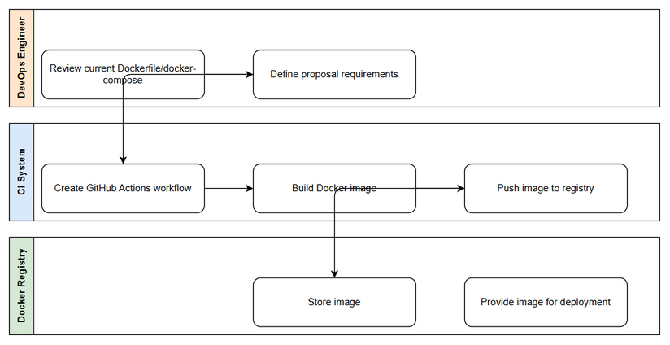
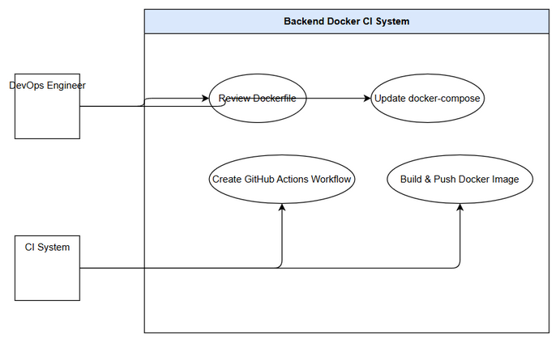

# Business Requirements Document (BRD)

## SDLC-Agents-4-Enterprise (Backend) — SA4E-335: Review backend Dockerfile/docker-compose and create CI to build Docker image

---

## Document Information

| Field | Value |
|-------|-------|
| Jira Ticket | SA4E-335 |
| Title | Review backend Dockerfile/docker-compose and create CI to build Docker image |
| Author | BA Agent |
| Version | 1.0 |
| Date | 2026-09-30 |
| Status | Draft |

---

## Author Tracking

| Role | Name - Position | Responsibility |
|------|-----------------|----------------|
| Author | BA Agent – Business Analyst | Create document |
| Peer Reviewer | TA Agent – Technical Architect | Review document |

---

## Revision History

| Version | Date | Author | Changes |
|---------|------|--------|---------|
| 1.0 | 2026-09-30 | BA Agent | Initiate document — auto-generated from Jira ticket SA4E-335 and linked ticket SA4E-44 |

---

## Sign-Off

| Name | Signature and date |
|------|--------------------|
| | ☐ I agree and confirm all criteria on this BRD as expected requirements |
| | ☐ I agree and confirm all criteria on this BRD as expected requirements |

---

## 1. Introduction

### 1.1 Scope

This change request hardens and automates the containerized delivery of the SDLC-Agents-4-Enterprise **backend** (Code Intelligence MCP server). It covers four business outcomes:

1. **Review** the current backend `Dockerfile` and `docker-compose.yml` against the newer containerization proposal captured in **SA4E-44**, and document the gaps and decisions.
2. **Update `docker-compose`** so it is fit for **production** operation (not just local dev/test), addressing secrets handling, resource limits, health checks, and restart policy.
3. **Create a GitHub Actions CI pipeline** that builds the multi-stage Docker image and **pushes** it to a container registry, so every merge produces a versioned, deployable artifact.
4. **Document** the build steps and the chosen registry so any engineer can reproduce a build and pull a released image.

The business value is operational rather than end-user facing: a **reproducible, secure, and automated** path from source code to a deployable container image. This improves maintainability, shortens time-to-deploy, reduces "works on my machine" incidents, and strengthens the security posture (non-root runtime, hermetic builds, no secrets baked into images).

### 1.2 Out of Scope

- **Runtime deployment/orchestration** to a live environment (Kubernetes manifests, cloud provisioning, CD promotion) — this CR delivers the image and CI, not the deploy.
- **Extension packaging** (VS Code/Kiro extension) — this CR is backend-only.
- **Application feature changes** — no functional behavior of the MCP server is modified.
- **Detailed implementation of the Dockerfile/CI YAML** — the concrete file contents and technical design are produced in the FSD/TDD phases; this BRD defines business requirements and decisions only.

### 1.3 Preliminary Requirement

- Access to the target **container registry** (GHCR / Docker Hub / ECR — see Dependencies) with credentials stored as CI secrets.
- The SA4E-44 proposal (base image and runtime dependency changes) is available as the reference baseline for the review.
- Existing artifacts to review: `backend/Dockerfile`, `backend/docker-compose.yml`.

---

## 2. Business Requirements

### 2.1 High Level Process Map

A DevOps engineer reviews the existing container assets against the SA4E-44 proposal, records the gaps and decisions, and updates the production compose file. A GitHub Actions pipeline then builds the multi-stage image on each qualifying change and pushes a versioned image to the container registry, from where it can be pulled for deployment. Build steps and the registry choice are documented so the process is repeatable. See the detailed business flow in section 2.3.

### 2.2 List of User Stories / Use Cases

| # | Story / Use Case / Epic | Priority | Source Ticket |
|---|-------------------------|----------|---------------|
| 1 | As a DevOps engineer, I want the backend Dockerfile/docker-compose reviewed against the SA4E-44 proposal so that base-image and dependency decisions are explicit and traceable | MUST HAVE | SA4E-335 |
| 2 | As a platform operator, I want a production-ready docker-compose so that the backend runs safely and reliably outside the developer laptop | MUST HAVE | SA4E-335 |
| 3 | As a DevOps engineer, I want a GitHub Actions pipeline that builds and pushes the Docker image so that every qualifying change yields a versioned, deployable artifact automatically | MUST HAVE | SA4E-335 |
| 4 | As an engineer joining the project, I want documented build steps and registry details so that I can reproduce a build and pull a released image without tribal knowledge | SHOULD HAVE | SA4E-335 |

---

### 2.3 Details of User Stories

---

#### Business Flow

**Step 1:** DevOps engineer reviews the current `backend/Dockerfile` and `backend/docker-compose.yml` against the SA4E-44 proposal (node:22-slim vs alpine, draw.io CLI runtime, pre-downloaded embedding model, hermetic build, workspaces root, non-root user).

**Step 2:** Engineer records gaps, risks, and decisions (base image choice, native-module compatibility, registry choice) as the agreed proposal baseline.

**Step 3:** Engineer updates `docker-compose.yml` for production readiness — secrets management, resource limits, backend health check, and restart policy.

**Step 4:** The CI system (GitHub Actions) is triggered on a qualifying change and builds the multi-stage Docker image (production target).

**Step 5:** CI tags the image (semver + commit metadata) and pushes it to the chosen container registry, authenticating with CI secrets.

**Step 6:** The registry stores the image and makes it available for deployment.

**Step 7:** Build steps and registry details are documented so the flow is reproducible by any engineer.

> **Note:** Registry authentication uses CI-managed secrets only; no credentials are baked into the image or committed to the repository. The build must remain hermetic (no non-deterministic network fetches at image-build time beyond pinned dependencies).

---

#### STORY 1: Review Dockerfile & docker-compose against SA4E-44 proposal

> As a DevOps engineer, I want the backend Dockerfile/docker-compose reviewed against the SA4E-44 proposal so that base-image and dependency decisions are explicit and traceable.

**Requirement Details:**

1. Compare the current Dockerfile (node:22-alpine, multi-stage base/deps/build/production/development/test, non-root user `sa4e` uid/gid 1001, PORT 48721, `wget /health` healthcheck, native deps python3/make/g++/git) against the SA4E-44 proposal.
2. Assess the SA4E-44 proposal items: switch to **node:22-slim** (glibc for `onnxruntime-node`), add **draw.io CLI v24.7.8** plus Electron/X11/xvfb runtime deps, **pre-download the embedding model** into `TRANSFORMERS_CACHE`, **strip `tree-sitter-jsp`** for a hermetic build, set `SERVER_WORKSPACES_ROOT=/app/workspaces`, retain non-root `sa4e`.
3. Produce a documented gap analysis and a set of explicit decisions (accept/modify/defer each proposal item) with rationale.

**Acceptance Criteria:**

1. A review outcome is documented that lists, for each SA4E-44 proposal item, a clear decision (adopt / adapt / defer) and its business/operational rationale.
2. The base-image decision (**alpine vs slim**) is recorded with the native-module compatibility justification (glibc requirement for `onnxruntime-node`).
3. The review confirms the non-root runtime user (`sa4e`) and the healthcheck are preserved.
4. Any item that increases image size or build time is flagged with its trade-off noted against the NFR targets in section 6.

---

#### STORY 2: Production-ready docker-compose

> As a platform operator, I want a production-ready docker-compose so that the backend runs safely and reliably outside the developer laptop.

**Requirement Details:**

1. Evaluate the current `docker-compose.yml` (postgres `pgvector/pgvector:pg16` + backend `production` target with `DATABASE_ADAPTER=postgresql`, task worker + code-intel env, onnx-runtime sidecar under the `embeddings` profile, `sa4e-network`, volumes `postgres_data` + `code_intel_data`) as a dev/test file and identify the production gaps.
2. Address the production gaps: **secrets management** (no plaintext secrets in the file), **resource limits** (CPU/memory), a **backend healthcheck** defined within compose, and a **restart policy**.

**Acceptance Criteria:**

1. The production compose references secrets via environment/secret mechanisms, with **no plaintext credentials** committed.
2. The backend service defines a **healthcheck** and a **restart policy** suitable for unattended operation.
3. **Resource limits** (CPU/memory) are defined for the backend and database services.
4. Persistent data (postgres, code-intel) remains on named volumes and survives container restarts.
5. The dev/test convenience (e.g., embeddings profile) remains available without weakening the production configuration.

---

#### STORY 3: GitHub Actions CI to build & push Docker image

> As a DevOps engineer, I want a GitHub Actions pipeline that builds and pushes the Docker image so that every qualifying change yields a versioned, deployable artifact automatically.

**Requirement Details:**

1. Create a GitHub Actions workflow that builds the **multi-stage** image (production target) for the backend.
2. Tag the image with a versioning scheme (semver + commit metadata) and **push** it to the chosen container registry, authenticating via CI secrets.
3. The pipeline runs automatically on the agreed trigger (e.g., merge to the main branch and/or tag) and fails visibly if the build or push fails.

**Acceptance Criteria:**

1. On a qualifying trigger, CI builds the backend image successfully using the multi-stage Dockerfile.
2. CI pushes the built image to the chosen registry using credentials from **CI secrets only** (never committed).
3. Pushed images carry a **traceable tag** (semver and/or commit SHA) so a running image maps back to a source revision.
4. A failed build or push **fails the pipeline** and is surfaced on the pull request / commit status.
5. No secrets appear in build logs or image layers.

---

#### STORY 4: Documentation of build steps & registry

> As an engineer joining the project, I want documented build steps and registry details so that I can reproduce a build and pull a released image without tribal knowledge.

**Requirement Details:**

1. Document the local and CI build steps for the backend image (targets, required build args, expected outputs).
2. Document the chosen registry, image naming/tagging convention, and how to pull a released image.

**Acceptance Criteria:**

1. Documentation exists that lets a new engineer build the image locally and understand each multi-stage target.
2. The registry name, image path, and tagging convention are documented, including how to pull a released image.
3. Documentation states the base-image decision and the required runtime dependencies (e.g., draw.io CLI) so the build is reproducible.

---

## 3. Dependencies

| Dependency | Type | Related Ticket | Description |
|------------|------|----------------|-------------|
| Container registry choice (GHCR / Docker Hub / ECR) | Infrastructure / Decision | SA4E-335 | The target registry must be selected and provisioned with push credentials before CI can push images. Drives auth mechanism and image path. |
| Base image decision — alpine vs slim | Infrastructure / Decision | SA4E-44 | node:22-slim (glibc) proposed to support `onnxruntime-node`; decision affects image size, build time, and native-module compatibility. |
| Native module compatibility (`onnxruntime-node`, `tree-sitter`) | System | SA4E-44 | glibc vs musl compatibility for native modules; `tree-sitter-jsp` stripped for hermetic build. |
| draw.io CLI runtime (Electron/X11/xvfb) v24.7.8 | System | SA4E-44 | Adds runtime OS dependencies and image size; required for diagram export capability. |
| Pre-downloaded embedding model (`TRANSFORMERS_CACHE`) | System | SA4E-44 | Model must be cached at build time to keep runtime offline/hermetic; increases image size. |
| GitHub Actions runner + CI secrets | Infrastructure | SA4E-335 | Registry credentials stored as repository/organization secrets; runner must support Docker Buildx for multi-stage builds. |
| Existing artifacts: `backend/Dockerfile`, `backend/docker-compose.yml` | System | SA4E-335 | The current files under review and update. |

---

## 4. Stakeholders

| Role | Name / Team | Responsibility | Source |
|------|-------------|----------------|--------|
| DevOps Engineer | Backend/Platform Team | Review artifacts, update compose, author CI pipeline | Ticket assignee |
| Platform Operator | Operations Team | Consume production compose, operate the deployed backend | Watcher |
| Technical Architect | TA Agent | Review technical soundness of the containerization proposal | Review chain |
| Reporter | SA4E-335 reporter | Requested the review + CI automation | Ticket reporter |

---

## 5. Risks and Assumptions

### 5.1 Risks

| Risk | Impact | Likelihood | Mitigation |
|------|--------|------------|------------|
| Base-image switch (alpine→slim) inflates image size | Medium | High | Measure size before/after; set an image-size NFR budget; use multi-stage to discard build deps. |
| Native module incompatibility (musl vs glibc) breaks runtime | High | Medium | Standardize on slim (glibc) per SA4E-44; verify `onnxruntime-node` loads in the production image. |
| Registry credentials leaked in CI logs or image layers | High | Low | Use CI secrets only; scan logs; never `COPY` credentials; verify no secrets in layers. |
| draw.io/Electron runtime deps increase attack surface and size | Medium | Medium | Install only required runtime packages; document rationale; keep non-root user. |
| Non-hermetic build (network fetch at build time) causes flaky/irreproducible builds | Medium | Medium | Pin dependencies; pre-download model; strip `tree-sitter-jsp`; fail build on unpinned fetches. |
| Production compose retains dev conveniences that weaken security | Medium | Medium | Separate/guard dev-only profiles; enforce secrets, limits, restart policy in production config. |

### 5.2 Assumptions

- The SA4E-44 proposal is the accepted baseline for base-image and runtime dependency direction.
- GitHub Actions is the CI platform and the repository can hold registry secrets.
- The backend continues to run as the non-root `sa4e` user (uid/gid 1001) on PORT 48721.
- Detailed Dockerfile/CI YAML content is defined later (FSD/TDD), not in this BRD.

---

## 6. Non-Functional Requirements

| Category | Requirement | Details |
|----------|-------------|---------|
| Performance (Image size) | Keep the production image within an agreed budget | Track image size before/after the slim + draw.io + model changes; flag regressions; multi-stage build discards build-only deps. |
| Performance (Build time) | Keep CI build within an agreed time budget | Use layer caching / Buildx cache; pre-download model to avoid runtime fetch; target a reasonable end-to-end CI duration. |
| Security | Non-root runtime and no baked secrets | Run as `sa4e` (uid/gid 1001); registry credentials via CI secrets only; no secrets in layers or logs. |
| Security | Minimal runtime dependencies | Install only required OS packages (draw.io/Electron/xvfb where needed); reduce attack surface. |
| Reproducibility | Hermetic, deterministic build | Pin dependencies; pre-cache embedding model (`TRANSFORMERS_CACHE`); strip `tree-sitter-jsp`; no non-deterministic network fetches at build time. |
| Reliability | Production compose resilience | Backend healthcheck + restart policy; resource limits; persistent named volumes for postgres + code-intel. |
| Traceability | Versioned, traceable images | Every pushed image tagged with semver and/or commit SHA mapping back to source. |
| Maintainability | Documented, reproducible process | Build steps and registry documented so any engineer can build and pull without tribal knowledge. |

---

## 7. Related Tickets

| Ticket Key | Summary | Status | Type | Relationship |
|------------|---------|--------|------|--------------|
| SA4E-335 | Review backend Dockerfile/docker-compose and create CI to build Docker image | In Progress | Task | Main ticket |
| SA4E-44 | Backend containerization proposal (node:22-slim, draw.io CLI, pre-downloaded model, hermetic build) | Reference | — | Provides the proposal baseline for the review |

---

## 8. Appendix

The current Dockerfile is a multi-stage build on `node:22-alpine` with stages base/deps/build/production/development/test, a non-root `sa4e` user (uid/gid 1001), PORT 48721, and a `wget /health` healthcheck. The SA4E-44 proposal moves to `node:22-slim` for glibc compatibility with `onnxruntime-node`, adds draw.io CLI v24.7.8 with Electron/X11/xvfb runtime deps, pre-downloads the embedding model into `TRANSFORMERS_CACHE`, strips `tree-sitter-jsp` for a hermetic build, and sets `SERVER_WORKSPACES_ROOT=/app/workspaces`. The current `docker-compose.yml` targets dev/test (postgres pgvector, backend production target, onnx sidecar under the embeddings profile) and requires production hardening.

### Diagrams

### Diagram Index

| # | Diagram | Image | Source (editable) |
|---|---------|-------|-------------------|
| 1 | Business Flow — Review → CI build → Registry | [business-flow.png](diagrams/business-flow.png) | [business-flow.drawio](diagrams/business-flow.drawio) |
| 2 | Use Case — DevOps & CI actors, 4 tasks | [use-case.png](diagrams/use-case.png) | [use-case.drawio](diagrams/use-case.drawio) |

### Glossary

| Term | Definition |
|------|------------|
| Multi-stage build | A Dockerfile technique using multiple `FROM` stages so build-only tooling is discarded from the final image, yielding a smaller, cleaner runtime image. |
| Base image | The starting OS/runtime layer of a container image (e.g., `node:22-alpine` vs `node:22-slim`); determines libc, size, and native-module compatibility. |
| Container registry | A service that stores and distributes container images (GHCR, Docker Hub, ECR); CI pushes images here and deployments pull from it. |
| CI pipeline | An automated workflow (GitHub Actions) that builds, tags, and pushes the image on qualifying changes. |
| Healthcheck | A container-level probe (e.g., `wget /health`) that reports whether the service is alive/ready. |
| Non-root user | A container runtime user (`sa4e`, uid/gid 1001) with reduced privileges to limit blast radius if compromised. |
| Hermetic build | A build that produces the same output from the same inputs with no non-deterministic network fetches, by pinning deps and pre-caching artifacts. |
| Image tag / semver | The label attached to a pushed image (semantic version and/or commit SHA) that maps a running image back to a source revision. |

### Reference Documents

| Document | Link / Location |
|----------|-----------------|
| Current backend Dockerfile | backend/Dockerfile |
| Current backend docker-compose | backend/docker-compose.yml |
| Containerization proposal | SA4E-44 |
