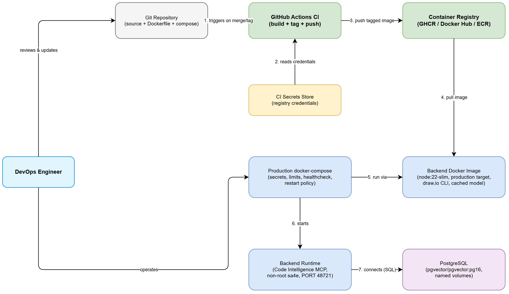
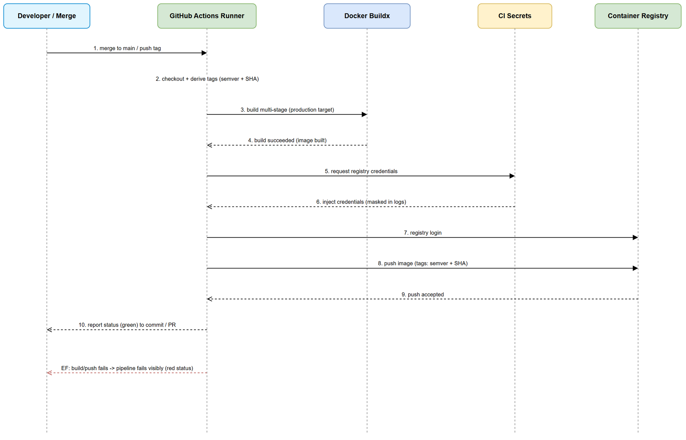
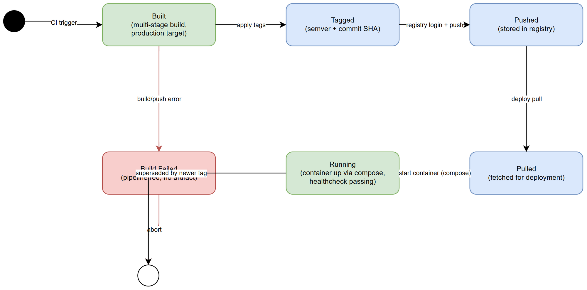

# Functional Specification Document (FSD)

## SDLC-Agents-4-Enterprise (Backend) — SA4E-335: Review backend Dockerfile/docker-compose and create CI to build Docker image

---

## Document Information

| Field | Value |
|-------|-------|
| Jira Ticket | SA4E-335 |
| Title | Review backend Dockerfile/docker-compose and create CI to build Docker image |
| Author | BA Agent (business sections) + TA Agent (technical enrichment) |
| Version | 1.1 |
| Date | 2026-10-01 |
| Status | Enriched (business specification + TA technical appendices) |
| Related BRD | BRD-v1-SA4E-335.docx |

---

## Revision History

| Version | Date | Author | Changes |
|---------|------|--------|---------|
| 1.0 | 2026-10-01 | BA Agent | Initial FSD draft — business/functional specification derived from the approved BRD (4 user stories). Technical API contracts and pseudocode deferred to TA enrichment. |
| 1.1 | 2026-10-01 | TA Agent | Technical enrichment: added §12 (Technical Appendix A — API/config contracts: Dockerfile build args/ENV, compose service/env/secret definitions, GitHub Actions inputs/secrets/outputs), §13 (Appendix B — Integration requirements: registry auth, CI triggers, tag scheme), §14 (Appendix C — CI build+push pseudocode), §15 (Appendix D — Codebase-vs-spec discrepancy log against the actual backend/Dockerfile + backend/docker-compose.yml), §16 (Appendix E — quantified NFR targets). Business sections and diagrams unchanged. |

---

## 1. Introduction

### 1.1 Purpose

This FSD specifies the functional behavior required to deliver SA4E-335: a reviewed and hardened containerization setup for the SDLC-Agents-4-Enterprise **backend** (Code Intelligence MCP server), a production-ready `docker-compose`, an automated GitHub Actions CI pipeline that builds and pushes a versioned Docker image, and the accompanying build documentation. It translates the business requirements captured in the BRD into concrete use cases, business rules, configuration specifications, and error-handling scenarios that engineers can build and test against.

This is a **DevOps / backend-only** change. There is **no end-user-facing UI**; therefore no UI Specifications or wireframes are included. The "actors" are engineers and automated systems (CI runner, container registry).

### 1.2 Scope

In scope (per BRD §1.1):

1. Documented gap analysis of `backend/Dockerfile` and `backend/docker-compose.yml` against the SA4E-44 containerization proposal, with an explicit decision (adopt / adapt / defer) for each proposal item.
2. A production-ready `docker-compose` configuration: secrets management, CPU/memory limits, backend healthcheck, restart policy — while preserving PostgreSQL `pgvector/pgvector:pg16`, named volumes (`postgres_data`, `code_intel_data`), and the dev-only `embeddings` profile.
3. A GitHub Actions CI workflow that builds the multi-stage image (`production` target), tags it with semver + commit SHA, and pushes it to the chosen container registry using CI secrets only, failing visibly on error.
4. Documentation of local + CI build steps and the registry choice/tagging convention.

Out of scope (per BRD §1.2): runtime deployment/orchestration (Kubernetes, cloud provisioning, CD promotion), extension packaging, application feature changes, and the concrete Dockerfile/CI YAML file contents (produced in TDD/implementation).

### 1.3 Definitions & Acronyms

| Term | Definition |
|------|------------|
| Multi-stage build | A Dockerfile technique with multiple `FROM` stages so build-only tooling is discarded from the final image. |
| Base image | The starting OS/runtime layer (`node:22-alpine` vs `node:22-slim`); determines libc, size, and native-module compatibility. |
| Container registry | A service storing/distributing container images (GHCR / Docker Hub / ECR). |
| CI pipeline | An automated GitHub Actions workflow that builds, tags, and pushes the image. |
| Healthcheck | A container-level probe (`wget /health`) reporting service liveness/readiness. |
| Non-root user | The container runtime user `sa4e` (uid/gid 1001) with reduced privileges. |
| Hermetic build | A build producing identical output from identical inputs, with no non-deterministic network fetches. |
| Image tag / semver | The label on a pushed image (semantic version and/or commit SHA) mapping it back to a source revision. |
| Production target | The `production` stage of the multi-stage Dockerfile — the runtime image shipped to the registry. |
| CI secret | A registry credential stored in the CI platform's secret store, never committed or printed. |

### 1.4 References

| Document | Location |
|----------|----------|
| BRD | BRD-v1-SA4E-335.docx |
| Containerization proposal | SA4E-44 |
| Current backend Dockerfile | backend/Dockerfile |
| Current backend docker-compose | backend/docker-compose.yml |

---

## 2. System Overview

### 2.1 System Context Diagram



The context shows the two human/automated actors and the artifacts they act on. The **DevOps engineer** reviews and updates the source repository (Dockerfile, compose) and operates the production compose. On a qualifying change, **GitHub Actions CI** reads registry credentials from the **CI secrets store**, builds the multi-stage backend image (`production` target), tags it, and pushes it to the **container registry**. A deployment pulls the image, and the **production docker-compose** starts the **backend runtime** (Code Intelligence MCP, non-root `sa4e`, PORT 48721) which connects to **PostgreSQL** (`pgvector/pgvector:pg16`) with persistent named volumes.

### 2.2 System Architecture

Three functional areas make up this change:

1. **Container image definition** — the multi-stage `Dockerfile`. The review (Story 1) evaluates the SA4E-44 proposal against the current file: base image `node:22-alpine` → `node:22-slim` (glibc for `onnxruntime-node`), addition of draw.io CLI v24.7.8 + Electron/X11/xvfb runtime deps, a pre-downloaded embedding model cached into `TRANSFORMERS_CACHE`, stripping `tree-sitter-jsp` for a hermetic build, `SERVER_WORKSPACES_ROOT=/app/workspaces`, retaining non-root `sa4e` uid/gid 1001, PORT 48721, and the `wget /health` healthcheck.
2. **Runtime composition** — the production `docker-compose` (Story 2). The current file is dev/test-oriented; production hardening adds secrets management, CPU/memory limits, a backend healthcheck, and a restart policy, while keeping PostgreSQL, named volumes, and the guarded dev-only `embeddings` profile.
3. **Delivery automation** — the GitHub Actions CI workflow (Story 3) and its documentation (Story 4). CI builds the `production` target, applies semver + commit-SHA tags, authenticates to the registry with CI secrets only, and pushes — failing visibly and never leaking secrets.

---

## 3. Functional Requirements

### 3.1 Feature: Containerization Gap Review & Decisions

**Source:** BRD Story 1 (Review Dockerfile & docker-compose against SA4E-44 proposal)

#### 3.1.1 Description

The DevOps engineer performs a structured comparison of the current backend container assets against the SA4E-44 proposal and records an explicit, traceable decision for each proposal item, together with the base-image compatibility rationale and any size/build-time trade-offs.

#### 3.1.2 Use Case

**Use Case ID:** UC-01
**Actor:** DevOps Engineer
**Preconditions:** The SA4E-44 proposal is available as the baseline; `backend/Dockerfile` and `backend/docker-compose.yml` exist and are readable.
**Postconditions:** A documented gap analysis exists listing, per SA4E-44 item, a decision (adopt / adapt / defer) with rationale; the base-image decision is recorded with native-module justification; non-root user and healthcheck are confirmed preserved.

**Main Flow:**

| Step | Actor | System | Description |
|------|-------|--------|-------------|
| 1 | Engineer reads current Dockerfile & compose | | Captures current baseline: `node:22-alpine`, stages base/deps/build/production/development/test, non-root `sa4e`, PORT 48721, `wget /health` healthcheck. |
| 2 | Engineer reads SA4E-44 proposal | | Lists proposal items (slim base, draw.io CLI, cached model, stripped `tree-sitter-jsp`, workspaces root). |
| 3 | Engineer compares each item | | Records gap: present / partially present / absent in current file. |
| 4 | Engineer decides per item | | Assigns adopt / adapt / defer with business/operational rationale (BR-01..BR-04). |
| 5 | Engineer records base-image decision | | Documents alpine→slim with glibc/`onnxruntime-node` justification (BR-02). |
| 6 | Engineer confirms invariants | | Confirms non-root `sa4e` uid/gid 1001 and healthcheck retained (BR-05). |
| 7 | Engineer flags trade-offs | | Notes items that increase image size/build time against NFR budgets (BR-06). |

**Alternative Flows:**

| ID | Condition | Steps |
|----|-----------|-------|
| AF-1 | A proposal item is deferred | Engineer records "defer" with the reason and a follow-up condition/ticket reference; item excluded from this change's build target. |
| AF-2 | A proposal item is adapted rather than adopted verbatim | Engineer documents the deviation and its rationale (e.g., a lighter runtime dependency set than proposed). |

**Exception Flows:**

| ID | Condition | Steps |
|----|-----------|-------|
| EF-1 | SA4E-44 proposal reference is unavailable | Halt the review; record a blocker; do not fabricate decisions. Escalate to obtain the baseline (BR-07). |
| EF-2 | A current-file invariant conflicts with a proposal item (e.g., musl-only assumption) | Flag the conflict as a High risk; require an explicit resolution decision before adoption. |

#### 3.1.3 Business Rules

| Rule ID | Rule | Source |
|---------|------|--------|
| BR-01 | Every SA4E-44 proposal item MUST receive exactly one recorded decision: adopt, adapt, or defer, each with a written rationale. | BRD Story 1 AC-1 |
| BR-02 | The base-image decision (alpine vs slim) MUST be recorded with the native-module compatibility justification (glibc required by `onnxruntime-node`). | BRD Story 1 AC-2 |
| BR-03 | `tree-sitter-jsp` MUST be stripped from the build to keep the build hermetic; the decision MUST be documented. | BRD Story 1 / NFR Reproducibility |
| BR-04 | The embedding model MUST be pre-downloaded into `TRANSFORMERS_CACHE` at build time so runtime is offline/hermetic. | BRD Story 1 / NFR Reproducibility |
| BR-05 | The review MUST confirm the non-root runtime user (`sa4e`, uid/gid 1001) and the `wget /health` healthcheck are preserved. | BRD Story 1 AC-3 |
| BR-06 | Any item that increases image size or build time MUST be flagged with its trade-off noted against the NFR budgets. | BRD Story 1 AC-4 |
| BR-07 | Decisions MUST NOT be fabricated; if the baseline is unavailable, the review is blocked and escalated. | BRD §5 Assumptions |

#### 3.1.4 Data Specifications

**Gap-analysis record (one row per proposal item):**

| Field | Type | Required | Validation | Description |
|-------|------|----------|------------|-------------|
| item | text | Y | Non-empty; matches an SA4E-44 proposal item | Name of the proposal item (e.g., "base image node:22-slim"). |
| currentState | enum | Y | one of {present, partial, absent} | Whether the item exists in the current Dockerfile/compose. |
| decision | enum | Y | one of {adopt, adapt, defer} | The recorded decision. |
| rationale | text | Y | Non-empty | Business/operational justification. |
| tradeOff | text | N | — | Size/build-time or security trade-off, if any. |
| riskLevel | enum | N | one of {low, medium, high} | Associated risk if applicable. |

#### 3.1.5 UI Specifications

Not applicable — this feature has no user interface (documentation artifact only).

#### 3.1.6 API Contract (Functional View)

Not applicable — no runtime API. The output is a documented decision record.

---

### 3.2 Feature: Production-Ready docker-compose

**Source:** BRD Story 2 (Production-ready docker-compose)

#### 3.2.1 Description

Transform the current dev/test `docker-compose.yml` into a production-safe configuration: no plaintext secrets, defined CPU/memory limits, a backend healthcheck, and a restart policy — while preserving PostgreSQL `pgvector/pgvector:pg16`, the named volumes, and the guarded dev-only `embeddings` profile.

#### 3.2.2 Use Case

**Use Case ID:** UC-02
**Actor:** DevOps Engineer (author) / Platform Operator (consumer)
**Preconditions:** The current `docker-compose.yml` exists; the backend `production` image target is buildable; secret values are available via the secret mechanism (not committed).
**Postconditions:** A production compose exists referencing secrets externally, with backend + database resource limits, a backend healthcheck, and a restart policy; persistent data remains on named volumes; the dev `embeddings` profile stays available without weakening production.

**Main Flow:**

| Step | Actor | System | Description |
|------|-------|--------|-------------|
| 1 | Engineer audits current compose | | Identifies plaintext `POSTGRES_PASSWORD` / `DATABASE_URL`, missing backend healthcheck, missing resource limits. |
| 2 | Engineer externalizes secrets | | Replaces plaintext credentials with secret references / injected env (BR-08). |
| 3 | Engineer adds backend healthcheck | | Defines a compose-level backend healthcheck aligned with `wget /health` on PORT 48721 (BR-09). |
| 4 | Engineer sets restart policy | | Applies an unattended-operation restart policy to backend and database (BR-10). |
| 5 | Engineer sets resource limits | | Defines CPU/memory limits for backend and database services (BR-11). |
| 6 | Engineer confirms volumes | | Confirms `postgres_data` + `code_intel_data` named volumes persist across restarts (BR-12). |
| 7 | Engineer guards dev profile | | Ensures `embeddings` profile is dev-only and does not weaken the production config (BR-13). |

**Alternative Flows:**

| ID | Condition | Steps |
|----|-----------|-------|
| AF-1 | A managed/external PostgreSQL is used in production | Backend points to the external database via secret-provided connection details; the compose `postgres` service is treated as dev-only, still without plaintext secrets. |
| AF-2 | Operator overrides resource limits per environment | Limits are parameterized via environment so an operator can tune them without editing the base compose. |

**Exception Flows:**

| ID | Condition | Steps |
|----|-----------|-------|
| EF-1 | A required secret is missing at startup | Startup fails fast with a clear message identifying the missing secret; no default plaintext fallback is used (BR-08). |
| EF-2 | Backend healthcheck stays unhealthy past its start period | Restart policy applies per the configured retries; if it keeps failing, the container is reported unhealthy for operator attention (BR-09, BR-10). |
| EF-3 | A named volume is missing/unmountable | Startup fails visibly; data must not silently fall back to an ephemeral layer (BR-12). |

#### 3.2.3 Business Rules

| Rule ID | Rule | Source |
|---------|------|--------|
| BR-08 | The production compose MUST reference secrets via a secret/injected-env mechanism; NO plaintext credentials may be committed. | BRD Story 2 AC-1 |
| BR-09 | The backend service MUST define a healthcheck (aligned with `wget /health` on PORT 48721). | BRD Story 2 AC-2 |
| BR-10 | The backend (and database) MUST define a restart policy suitable for unattended operation. | BRD Story 2 AC-2 |
| BR-11 | CPU and memory resource limits MUST be defined for the backend and database services. | BRD Story 2 AC-3 |
| BR-12 | Persistent data (postgres, code-intel) MUST remain on named volumes and survive container restarts. | BRD Story 2 AC-4 |
| BR-13 | Dev/test conveniences (e.g., the `embeddings` profile) MUST remain available WITHOUT weakening the production configuration. | BRD Story 2 AC-5 |

#### 3.2.4 Data / Configuration Specifications

**Backend service (production) — required configuration:**

| Field | Type | Required | Validation | Description |
|-------|------|----------|------------|-------------|
| image / build target | text | Y | Build target = `production` | The runtime image built from the multi-stage Dockerfile. |
| DATABASE_URL | secret-backed string | Y | Valid PostgreSQL URL; from secret, not literal | Connection to PostgreSQL; credentials injected via secret (BR-08). |
| DATABASE_ADAPTER | enum | Y | `postgresql` | Selects the PostgreSQL adapter. |
| PORT | integer | Y | 48721 | Backend listen port. |
| NODE_ENV | enum | Y | `production` | Runtime environment (current file sets `development` — must be `production`). |
| SERVER_WORKSPACES_ROOT | path | Y | `/app/workspaces` | Workspaces root per SA4E-44 (BR under Story 1). |
| healthcheck | object | Y | `wget /health`, interval/timeout/retries/start-period | Backend liveness/readiness probe (BR-09). |
| restart | enum | Y | e.g., `unless-stopped` / `always` | Restart policy for unattended operation (BR-10). |
| resources.limits (cpu, memory) | object | Y | Defined, non-empty | CPU/memory ceilings (BR-11). |
| volumes | list | Y | `code_intel_data:/app/.code-intel` | Persistent code-intel data (BR-12). |

**PostgreSQL service — required configuration:**

| Field | Type | Required | Validation | Description |
|-------|------|----------|------------|-------------|
| image | text | Y | `pgvector/pgvector:pg16` | Database image (unchanged). |
| POSTGRES_PASSWORD | secret-backed string | Y | From secret, not literal | DB password via secret (BR-08). |
| healthcheck | object | Y | `pg_isready` | DB readiness probe (existing, retained). |
| restart | enum | Y | e.g., `unless-stopped` | Restart policy (BR-10). |
| resources.limits (cpu, memory) | object | Y | Defined | CPU/memory ceilings (BR-11). |
| volumes | list | Y | `postgres_data:/var/lib/postgresql/data` | Persistent DB data (BR-12). |

**Dev-only `embeddings` profile:** retained under a `profiles: [embeddings]` guard so it is inactive by default in production (BR-13).

#### 3.2.5 UI Specifications

Not applicable — configuration file, no UI.

#### 3.2.6 API Contract (Functional View)

Not applicable — the backend's own runtime API is unchanged by this ticket. The healthcheck consumes the existing `GET /health` endpoint; its technical contract is documented in the TDD.

---

### 3.3 Feature: GitHub Actions CI — Build & Push Image

**Source:** BRD Story 3 (GitHub Actions CI to build & push Docker image)

#### 3.3.1 Description

An automated GitHub Actions workflow that, on a qualifying trigger (merge to main and/or tag), builds the multi-stage backend image (`production` target), tags it with semver + commit SHA, authenticates to the registry using CI secrets only, pushes it, reports status to the commit/PR, and fails visibly on any error without leaking secrets.

#### 3.3.2 Use Case

**Use Case ID:** UC-03
**Actor:** CI System (GitHub Actions runner); Developer triggers indirectly via merge/tag
**Preconditions:** The workflow exists on the repository; registry credentials are stored as CI secrets; the runner supports Docker Buildx; the `production` target builds successfully.
**Postconditions:** A traceably-tagged image is present in the registry (on success); the pipeline status (green/red) is surfaced on the commit/PR; no secrets appear in logs or image layers.

**Main Flow:** (see the sequence diagram in §6.1)

| Step | Actor | System | Description |
|------|-------|--------|-------------|
| 1 | Developer merges to main / pushes a tag | | Qualifying event fires (BR-14). |
| 2 | | CI runner checks out source & derives tags | Computes semver and/or commit-SHA tags (BR-16). |
| 3 | | CI builds the multi-stage `production` target | Uses Buildx; layer caching applied (BR-15, NFR build time). |
| 4 | | CI reads registry credentials from CI secrets | Secrets injected, masked in logs (BR-17, BR-18). |
| 5 | | CI logs in to the registry | Authenticated push session established. |
| 6 | | CI pushes the tagged image | Image stored in the registry (BR-16). |
| 7 | | CI reports green status | Success surfaced on commit/PR (BR-19). |

**Alternative Flows:**

| ID | Condition | Steps |
|----|-----------|-------|
| AF-1 | Trigger is a semver tag rather than a branch merge | The semver tag drives the primary image tag; the commit SHA is still attached as a secondary tag (BR-16). |
| AF-2 | Build cache is warm | CI reuses cached layers to meet the build-time budget; behavior/output is otherwise identical (NFR build time). |

**Exception Flows:**

| ID | Condition | Steps |
|----|-----------|-------|
| EF-1 | Build step fails (compile/native module/model download) | Pipeline stops, marks the run red, surfaces the failure on the commit/PR; no image is pushed (BR-19). |
| EF-2 | Registry authentication fails | Push is aborted; pipeline fails red; the credential value is NOT printed (BR-17, BR-18, BR-19). |
| EF-3 | Push fails (network/registry error) | Pipeline fails red with the registry error surfaced; no partial "success" is reported (BR-19). |
| EF-4 | A secret would be exposed in logs or layers | The run is treated as failed; secrets must be masked and never `COPY`-ed into layers (BR-18). |

#### 3.3.3 Business Rules

| Rule ID | Rule | Source |
|---------|------|--------|
| BR-14 | CI MUST run automatically on the agreed qualifying trigger (merge to main and/or tag). | BRD Story 3 detail 3 |
| BR-15 | CI MUST build the backend image using the multi-stage Dockerfile `production` target. | BRD Story 3 AC-1 |
| BR-16 | Every pushed image MUST carry a traceable tag (semver and/or commit SHA) mapping it back to a source revision. | BRD Story 3 AC-3 |
| BR-17 | CI MUST authenticate to the registry using CI secrets only; credentials MUST NEVER be committed. | BRD Story 3 AC-2 |
| BR-18 | No secrets may appear in build logs or image layers. | BRD Story 3 AC-5 |
| BR-19 | A failed build or push MUST fail the pipeline and be surfaced on the pull request / commit status. | BRD Story 3 AC-4 |

#### 3.3.4 Data Specifications

**CI inputs / configuration:**

| Field | Type | Required | Validation | Description |
|-------|------|----------|------------|-------------|
| trigger | enum | Y | one of {push to main, tag} | Event that starts the pipeline (BR-14). |
| buildTarget | text | Y | `production` | Multi-stage target built (BR-15). |
| imageTags | list | Y | ≥1 tag; includes semver and/or commit SHA | Tags applied to the pushed image (BR-16). |
| registryUrl | text | Y | Valid registry host/path | Destination registry (from decision — see BR-20). |
| registryCredentials | CI secret | Y | Sourced from CI secret store; masked | Auth for push (BR-17, BR-18). |

**CI outputs:**

| Field | Type | Description |
|-------|------|-------------|
| pushedImageRef | text | Fully-qualified image reference with tag(s) on success. |
| pipelineStatus | enum {green, red} | Result surfaced on the commit/PR (BR-19). |
| buildLog | text | Log with all secret values masked (BR-18). |

#### 3.3.5 UI Specifications

Not applicable — CI status is surfaced through the existing GitHub commit/PR status UI (no new UI built).

#### 3.3.6 API Contract (Functional View)

Not applicable at the business level — the registry push protocol and workflow YAML are technical concerns for the TDD.

---

### 3.4 Feature: Build & Registry Documentation

**Source:** BRD Story 4 (Documentation of build steps & registry)

#### 3.4.1 Description

Documentation enabling any engineer to build the backend image locally, understand each multi-stage target, and pull a released image from the chosen registry using the documented naming/tagging convention.

#### 3.4.2 Use Case

**Use Case ID:** UC-04
**Actor:** Engineer joining the project
**Preconditions:** The Dockerfile, compose, and CI workflow exist; the registry has been chosen.
**Postconditions:** Documentation exists covering local + CI build steps, each multi-stage target, the base-image decision and required runtime deps, and the registry name/image path/tagging convention with pull instructions.

**Main Flow:**

| Step | Actor | System | Description |
|------|-------|--------|-------------|
| 1 | Engineer opens the build docs | | Finds local build command(s) and the CI equivalent (BR-21). |
| 2 | Engineer reads target descriptions | | Understands base/deps/build/production/development/test targets (BR-21). |
| 3 | Engineer reads runtime-dep notes | | Learns base-image decision + required runtime deps (draw.io CLI etc.) for reproducibility (BR-22). |
| 4 | Engineer reads registry section | | Finds registry name, image path, tagging convention, and the pull command (BR-20, BR-23). |
| 5 | Engineer reproduces a build & pull | | Successfully builds locally and pulls a released image using the docs alone. |

**Alternative Flows:**

| ID | Condition | Steps |
|----|-----------|-------|
| AF-1 | Engineer only needs to pull (not build) | The registry/pull section stands alone and is sufficient without the local-build steps. |

**Exception Flows:**

| ID | Condition | Steps |
|----|-----------|-------|
| EF-1 | The registry choice is not yet finalized | Documentation records the decision as pending with the candidate options (GHCR / Docker Hub / ECR) and blocks the "pull a released image" claim until finalized (BR-20). |

#### 3.4.3 Business Rules

| Rule ID | Rule | Source |
|---------|------|--------|
| BR-20 | The chosen container registry MUST be selected and documented (name + image path) before the pull instructions can be considered complete. | BRD Dependencies; Story 4 AC-2 |
| BR-21 | Documentation MUST let a new engineer build the image locally and understand each multi-stage target. | BRD Story 4 AC-1 |
| BR-22 | Documentation MUST state the base-image decision and required runtime dependencies (e.g., draw.io CLI) so the build is reproducible. | BRD Story 4 AC-3 |
| BR-23 | The image naming/tagging convention MUST be documented, including how to pull a released image. | BRD Story 4 AC-2 |

#### 3.4.4 Data Specifications

**Documentation content checklist (each item present = pass):**

| Field | Type | Required | Description |
|-------|------|----------|-------------|
| localBuildSteps | text | Y | Commands + build args to build each relevant target locally. |
| ciBuildSteps | text | Y | How CI performs the equivalent build/push. |
| targetDescriptions | text | Y | Purpose of base/deps/build/production/development/test targets. |
| baseImageDecision | text | Y | alpine→slim decision + rationale. |
| runtimeDeps | text | Y | Required runtime deps (draw.io CLI, cached model). |
| registryName + imagePath | text | Y | Registry and full image path. |
| taggingConvention | text | Y | semver + commit-SHA scheme. |
| pullInstructions | text | Y | Command to pull a released image. |

#### 3.4.5 UI Specifications / API Contract

Not applicable — documentation artifact only.

---

## 4. Data Model

This ticket introduces no application data entities. The "data" is configuration and CI metadata rather than a persisted domain model. The relevant configuration/data structures are specified per feature in §3.x.4 (gap-analysis record, compose configuration, CI inputs/outputs, documentation checklist).

**Config/artifact relationships (logical):**

| From | To | Cardinality | Description |
|------|----|-------------|-------------|
| Dockerfile (production target) | Docker image | 1:N | One Dockerfile target produces many image builds over time. |
| Docker image build | Image tags | 1:N | One build carries one or more tags (semver, commit SHA). |
| CI workflow run | Docker image build | 1:1 | One qualifying run performs one build+push. |
| docker-compose (production) | Running services (backend, postgres) | 1:N | One compose orchestrates multiple runtime services. |
| Image tag | Source revision (commit) | 1:1 | Each tag maps a running image back to a single source revision (BR-16). |

---

## 5. Integration Specifications

### 5.1 External System: Container Registry (GHCR / Docker Hub / ECR)

| Attribute | Value |
|-----------|-------|
| Purpose | Store and distribute the built backend image so deployments can pull a versioned artifact. |
| Direction | Outbound (CI pushes) / Inbound at deploy time (pull). |
| Data Format | OCI/Docker image + tags. |
| Frequency | On qualifying CI trigger (merge to main and/or tag). |

**Data Exchange:**

| Our Data | External Data | Direction | Business Rule |
|----------|--------------|-----------|---------------|
| Tagged backend image | Stored image manifest + layers | Send (push) | Tags include semver + commit SHA (BR-16); auth via CI secret only (BR-17). |
| Registry credentials | Auth token/session | Send (login) | Sourced from CI secrets, masked in logs (BR-17, BR-18). |

### 5.2 External System: CI Secrets Store

| Attribute | Value |
|-----------|-------|
| Purpose | Provide registry credentials to the CI job without committing or printing them. |
| Direction | Inbound to the CI job. |
| Data Format | Masked environment values / secret references. |
| Frequency | Per CI run that pushes an image. |

### 5.3 Internal Dependency: PostgreSQL (`pgvector/pgvector:pg16`)

| Attribute | Value |
|-----------|-------|
| Purpose | Backend runtime datastore; orchestrated by the production compose. |
| Direction | Bidirectional (backend ↔ database at runtime). |
| Data Format | SQL over the PostgreSQL wire protocol. |
| Frequency | Continuous while the backend runs. |

---

## 6. Processing Logic

### 6.1 Process: CI Build & Push

**Trigger:** Merge to main branch and/or tag push (BR-14).
**Schedule:** Event-driven (no cron).
**Input:** Source revision, build target `production`, computed tags, registry credentials (CI secret).
**Output:** A tagged image in the registry (on success); pipeline status on the commit/PR.

**Processing Steps:**

| Step | Description | Error Handling |
|------|-------------|----------------|
| 1 | Checkout source and compute tags (semver + commit SHA). | If tag computation fails → fail red (EF-1). |
| 2 | Build the multi-stage `production` target with Buildx (cache-assisted). | Build failure → stop, no push, fail red (EF-1). |
| 3 | Read registry credentials from CI secrets (masked). | Missing secret → fail red without printing value (EF-2, EF-4). |
| 4 | Log in to the registry. | Auth failure → abort push, fail red (EF-2). |
| 5 | Push the tagged image. | Push failure → fail red, surface registry error, no partial success (EF-3). |
| 6 | Report green status to the commit/PR. | — |

**Sequence Diagram:**



### 6.2 Process: Docker Image Lifecycle (state)

The image moves through a defined lifecycle from build to running, with a failure path that produces no artifact.

**State Diagram:**



| State | Meaning | Entry Trigger |
|-------|---------|---------------|
| Built | Multi-stage `production` image produced. | CI trigger + successful build. |
| Tagged | semver + commit-SHA tags applied. | Build success. |
| Pushed | Image stored in the registry. | Registry login + push. |
| Pulled | Image fetched for a deployment. | Deploy pull. |
| Running | Container up via compose, healthcheck passing. | Compose start. |
| Build Failed | Pipeline red, no artifact produced. | Build or push error (EF path). |

---

## 7. Security Requirements

### 7.1 Authorization (who can do what)

| Role | Permissions | Scope |
|------|-------------|-------|
| DevOps Engineer | Review/update Dockerfile & compose; author CI workflow; operate production compose. | Repository + runtime configuration. |
| CI System (GitHub Actions) | Read registry secrets; build; push image. | CI job scope only, via CI secrets. |
| Platform Operator | Consume production compose; operate the deployed backend. | Runtime operation. |

### 7.2 Data Sensitivity Classification

| Data Type | Classification | Business Requirement |
|-----------|---------------|---------------------|
| Registry credentials | Restricted | CI secrets only; masked in logs; never in image layers or repo (BR-17, BR-18). |
| Database credentials | Restricted | Provided via secret mechanism in production compose; no plaintext committed (BR-08). |
| Docker image (built) | Internal | Stored in registry; access controlled by registry permissions. |
| Build logs | Internal | Must contain no secret values (BR-18). |

### 7.3 Runtime Security Invariants

| Invariant | Requirement | Business Rule |
|-----------|-------------|---------------|
| Non-root runtime | Backend runs as `sa4e` (uid/gid 1001). | BR-05 |
| Minimal runtime deps | Install only required OS packages (draw.io/Electron/xvfb where needed). | BRD NFR Security |
| Hermetic build | Pinned deps; pre-cached model; `tree-sitter-jsp` stripped; no non-deterministic fetches at build. | BR-03, BR-04 |

---

## 8. Non-Functional Requirements

| Category | Business Requirement | Acceptance Criteria |
|----------|---------------------|---------------------|
| Performance (image size) | Keep the production image within an agreed budget. | Image size measured before/after slim + draw.io + model changes; regressions flagged with trade-off (BR-06). |
| Performance (build time) | Keep CI build within an agreed time budget. | Layer/Buildx caching used; model pre-downloaded; end-to-end CI duration within the agreed target. |
| Security | Non-root runtime and no baked secrets. | Runs as `sa4e`; credentials via CI/compose secrets only; no secrets in layers/logs (BR-05, BR-08, BR-17, BR-18). |
| Reproducibility | Hermetic, deterministic build. | Pinned deps; pre-cached model; `tree-sitter-jsp` stripped; no non-deterministic build fetch (BR-03, BR-04). |
| Reliability | Production compose resilience. | Backend healthcheck + restart policy; resource limits; persistent named volumes (BR-09..BR-12). |
| Traceability | Versioned, traceable images. | Every pushed image tagged with semver and/or commit SHA (BR-16). |
| Maintainability | Documented, reproducible process. | Build steps + registry documented; a new engineer can build and pull (BR-20..BR-23). |

---

## 9. Error Handling (Operator/Engineer-Facing)

> This section defines the visible error scenarios and expected behavior for engineers and operators (there is no end-user UI). Technical logging specifications (levels, destinations, formats) are specified in the TDD.

### 9.1 Error Scenarios

| Scenario | Severity | Surfaced Message / Signal | Expected Behavior |
|----------|----------|---------------------------|-------------------|
| CI build fails (compile / native module / model download) | Critical | Red pipeline status on commit/PR with the failing step highlighted | No image pushed; engineer inspects the build log and fixes the cause (EF-1). |
| Registry authentication fails | Critical | Red pipeline status; auth error surfaced WITHOUT printing the credential | Push aborted; engineer verifies the CI secret; value never exposed (EF-2, EF-4). |
| Image push fails (network/registry error) | Critical | Red pipeline status with the registry error | No partial success reported; retry after resolving the registry issue (EF-3). |
| Secret would appear in logs/layers | Critical | Run treated as failed | Secrets masked; nothing sensitive `COPY`-ed into layers (BR-18). |
| Missing production secret at compose startup | Critical | Startup fails fast naming the missing secret | No plaintext default fallback; operator supplies the secret (EF-1 of UC-02). |
| Backend healthcheck stays unhealthy | Warning→Critical | Container reported unhealthy | Restart policy applies per retries; persistent failure flagged for operator attention (EF-2 of UC-02). |
| Named volume missing/unmountable | Critical | Startup fails visibly | No silent fallback to ephemeral storage; operator fixes the volume (EF-3 of UC-02). |
| SA4E-44 baseline unavailable during review | Blocker | Review blocked, escalated | Decisions not fabricated; baseline obtained before proceeding (EF-1 of UC-01, BR-07). |
| Registry choice not finalized | Warning | Docs mark registry as pending | Pull instructions withheld until the registry is chosen (EF-1 of UC-04, BR-20). |

### 9.2 Notification Requirements

| Event | Who is Notified | Channel | Timing |
|-------|-----------------|---------|--------|
| CI pipeline failure (build/push) | Author of the merge/tag + repo watchers | GitHub commit/PR status + standard CI notifications | Immediate |
| CI pipeline success (image pushed) | Commit/PR | GitHub commit/PR status | Immediate |
| Backend unhealthy in production | Platform Operator | Operator's existing monitoring channel (out of scope to build here) | Per healthcheck cadence |

---

## 10. Testing Considerations

| ID | Scenario | Input | Expected Output | Priority |
|----|----------|-------|-----------------|----------|
| TC-01 | Gap review produces a decision per SA4E-44 item | Current files + SA4E-44 proposal | Every item has adopt/adapt/defer + rationale; base-image justification recorded | High |
| TC-02 | Production compose has no plaintext secrets | Production `docker-compose` | No literal credentials; secrets referenced externally | High |
| TC-03 | Backend healthcheck + restart policy present | Production `docker-compose` | Backend healthcheck defined; restart policy set | High |
| TC-04 | Resource limits defined | Production `docker-compose` | CPU/memory limits on backend + database | Medium |
| TC-05 | Named volumes persist data | Restart backend/postgres containers | `postgres_data` + `code_intel_data` survive restart | High |
| TC-06 | CI builds production target on trigger | Merge to main / tag | `production` image built successfully | High |
| TC-07 | CI pushes traceably-tagged image | Successful build | Image in registry tagged with semver + commit SHA | High |
| TC-08 | CI uses secrets only, no leakage | CI run | Credentials from CI secrets; no secret in logs/layers | High |
| TC-09 | Failed build/push fails visibly | Broken build or bad credentials | Red pipeline status surfaced on commit/PR | High |
| TC-10 | Docs enable build + pull | Documentation only | New engineer builds locally and pulls a released image | Medium |

---

## 11. Appendix

### Diagrams


### Diagram Index

| # | Diagram | Image | Source (editable) |
|---|---------|-------|-------------------|
| 1 | System Context — CI / registry / backend / postgres | [system-context.png](diagrams/system-context.png) | [system-context.drawio](diagrams/system-context.drawio) |
| 2 | Sequence — CI build + push flow | [sequence-ci-build-push.png](diagrams/sequence-ci-build-push.png) | [sequence-ci-build-push.drawio](diagrams/sequence-ci-build-push.drawio) |
| 3 | State — Docker image lifecycle (built → tagged → pushed → pulled → running) | [state-image-lifecycle.png](diagrams/state-image-lifecycle.png) | [state-image-lifecycle.drawio](diagrams/state-image-lifecycle.drawio) |

### Change Log from BRD

- No scope deviations from the BRD. This FSD elaborates the four approved stories into UC-01..UC-04 with business rules BR-01..BR-23.
- Technical API contracts and pseudocode are intentionally deferred to the TA enrichment step (per the phase plan); this document is a technically-light business specification.
- Notable clarification: the current compose sets `NODE_ENV=development` on the backend service — the production configuration MUST set `NODE_ENV=production` (captured in §3.2.4).


---

## 12. Technical Appendix A — API / Config Contracts (TA Enrichment)

> This appendix specifies the concrete configuration contracts the implementation must satisfy. It is authored against the **actual** `backend/Dockerfile` and `backend/docker-compose.yml` in the repository, with the SA4E-44 proposal as the target baseline. Items that the current files do NOT yet contain are marked **(proposed — not in current file)**; §15 tracks these as discrepancies to resolve in TDD/implementation.

### 12.1 Dockerfile — Stage Contract

The current `backend/Dockerfile` is a single-base multi-stage build. The `production` target is the CI artifact. Contract per stage:

| Stage | `FROM` (current) | Purpose | Build inputs | Output consumed by |
|-------|------------------|---------|--------------|--------------------|
| `base` | `node:22-alpine` | Shared workdir + native toolchain (`apk add python3 make g++ git`) | — | `deps`, `build`, `development`, `test` |
| `deps` | `base` | Production `node_modules` via `npm ci --omit=dev` | `package.json`, `package-lock.json` | `production` (`COPY --from=deps /app/node_modules`) |
| `build` | `base` | Compile TS → `dist/` via `npm run build` | `package.json`, `package-lock.json`, `tsconfig.json`, `src/` | `production` (`COPY --from=build /app/dist`, `/app/package.json`) |
| `production` | `node:22-alpine` | **Runtime image (CI push target)** — runtime dep `git`; non-root `sa4e`; `dist/index.js` entrypoint | `deps` + `build` artifacts | Container registry / compose `backend` |
| `development` | `base` | Hot-reload dev (`tsx watch`) non-root | full `src/` | `docker-compose.dev.yml` |
| `test` | `base` | Vitest suite in-container (non-root) | `src/`, `tests/`, `.env.test` | local/CI test run (`--target test`) |

### 12.2 Dockerfile — Build Args (contract)

The current Dockerfile declares **no `ARG`s**. The CI build MUST NOT depend on build args to select the target; the target is selected via `--target production`. If the SA4E-44 proposal items are adopted, the following build-arg contract is introduced (all optional, with defaults so a bare `docker build --target production .` still succeeds):

| Build ARG | Default | Allowed values | Consumed at | Status |
|-----------|---------|----------------|-------------|--------|
| `NODE_VERSION` | `22` | `22` | `FROM node:${NODE_VERSION}-*` | proposed (pin base tag) |
| `DRAWIO_CLI_VERSION` | `24.7.8` | pinned semver | `production` runtime dep install | **(proposed — not in current file)** |
| `TRANSFORMERS_CACHE` | `/app/.cache/transformers` | absolute path | `build` (model pre-download) + `production` ENV | **(proposed — not in current file)** |
| `EMBEDDING_MODEL` | (project default) | HF model id | `build` (model pre-download) | **(proposed — not in current file)** |

> Rule (TA): build args are **build-time only** and MUST NOT carry secrets. Registry credentials are supplied at `docker login` time by CI, never as `ARG`/`ENV` (BR-17, BR-18).

### 12.3 Dockerfile — Runtime ENV Contract (`production` stage)

| ENV | Current value | Required value | Notes |
|-----|---------------|----------------|-------|
| `NODE_ENV` | `production` | `production` | ✅ correct in Dockerfile (compose overrides to `development` — see §15). |
| `PORT` | `48721` | `48721` | Listen port; `EXPOSE 48721`. |
| `TRANSFORMERS_CACHE` | *(absent)* | `/app/.cache/transformers` | **(proposed)** points runtime at the pre-cached model for offline/hermetic operation (BR-04). |
| `SERVER_WORKSPACES_ROOT` | *(absent)* | `/app/workspaces` | **(proposed)** per SA4E-44; must be created + `chown sa4e` if adopted. |

### 12.4 Dockerfile — Healthcheck Contract (current, retained)

```
HEALTHCHECK --interval=30s --timeout=5s --start-period=10s --retries=3 \
  CMD wget --no-verbose --tries=1 --spider http://localhost:48721/health || exit 1
```

| Parameter | Value | Meaning |
|-----------|-------|---------|
| interval | 30s | probe cadence once started |
| timeout | 5s | max probe duration before it counts as a failure |
| start-period | 10s | grace window during boot (failures not counted) |
| retries | 3 | consecutive failures before `unhealthy` |
| probe | `GET /health` (200 ⇒ healthy) | consumes the existing backend health endpoint |

### 12.5 docker-compose — Service / ENV / Secret Contract

The compose contract below reconciles the current file with the production requirements (BR-08..BR-13). "Secret-backed" means the value MUST come from a Docker secret file or an injected environment variable resolved outside the repo — never a committed literal.

**`backend` service (production target):**

| Key | Current | Required (production) | Rule |
|-----|---------|-----------------------|------|
| `build.target` | `production` | `production` | BR-15 |
| `environment.NODE_ENV` | `development` | `production` | **fix** — see §15 D-1 |
| `environment.PORT` | `48721` | `48721` | — |
| `environment.DATABASE_URL` | plaintext literal | secret-backed (`DATABASE_URL_FILE` / injected) | BR-08 / §15 D-2 |
| `environment.DATABASE_ADAPTER` | `postgresql` | `postgresql` | — |
| `environment.TASK_WORKER_*` | literals (enabled, 5000ms, 3, 1000ms) | same, non-secret | — |
| `environment.CODE_INTEL_*` | literals (enabled, 100, 30000ms) | same, non-secret | — |
| `environment.ONNX_RUNTIME_URL` | `http://onnx-runtime:8080` | present only when `embeddings` profile active | AF-1 dev-only |
| `healthcheck` | *(absent — Dockerfile only)* | compose-level healthcheck mirroring §12.4 | BR-09 / §15 D-3 |
| `deploy.resources.limits` | *(absent)* | `cpus` + `memory` defined | BR-11 / §15 D-4 |
| `restart` | `unless-stopped` | `unless-stopped` | ✅ BR-10 |
| `volumes` | `code_intel_data:/app/.code-intel` | unchanged | BR-12 |
| `depends_on.postgres` | `condition: service_healthy` | unchanged | — |

**`postgres` service:**

| Key | Current | Required (production) | Rule |
|-----|---------|-----------------------|------|
| `image` | `pgvector/pgvector:pg16` | unchanged | — |
| `environment.POSTGRES_DB` | `sa4e_db` (literal) | literal OK (non-secret) | — |
| `environment.POSTGRES_USER` | `sa4e_user` (literal) | literal OK (non-secret) | — |
| `environment.POSTGRES_PASSWORD` | plaintext literal | secret-backed (`POSTGRES_PASSWORD_FILE`) | BR-08 / §15 D-2 |
| `healthcheck` | `pg_isready` (present) | unchanged | ✅ |
| `restart` | *(absent)* | `unless-stopped` | BR-10 / §15 D-5 |
| `deploy.resources.limits` | *(absent)* | `cpus` + `memory` defined | BR-11 / §15 D-4 |
| `volumes` | `postgres_data` + init.sql mount | unchanged | BR-12 |

**`onnx-runtime` service:** `image: mcr.microsoft.com/onnxruntime/server:latest`, guarded by `profiles: [embeddings]` — dev-only, inactive by default (BR-13). ✅ correct in current file.

**Secret definitions (proposed `secrets:` block):**

| Secret | Backing | Mounted into | Consumed as |
|--------|---------|--------------|-------------|
| `postgres_password` | file `./secrets/postgres_password` (git-ignored) or external secret | `postgres`, `backend` | `POSTGRES_PASSWORD_FILE`, composed into `DATABASE_URL` |
| `database_url` | external/injected | `backend` | `DATABASE_URL_FILE` |

### 12.6 GitHub Actions — Workflow Inputs / Secrets / Outputs Contract

**Triggers (`on:`):**

| Event | Filter | Purpose | Rule |
|-------|--------|---------|------|
| `push` | `branches: [main]` | build+push on merge to main | BR-14 |
| `push` | `tags: ['v*.*.*']` | build+push on semver release tag | BR-14 / BR-16 |
| `pull_request` | `branches: [main]` | build-only validation (no push) | BR-19 (fail-visible) |

**Job-level permissions (for GHCR default):** `contents: read`, `packages: write`.

**Secrets contract:**

| Secret | Required when registry = | Purpose | Rule |
|--------|--------------------------|---------|------|
| `GITHUB_TOKEN` (built-in) | GHCR | login to `ghcr.io` | BR-17 |
| `REGISTRY_USERNAME` | Docker Hub | `docker login` user | BR-17 |
| `REGISTRY_TOKEN` | Docker Hub | `docker login` token/password | BR-17 / BR-18 (masked) |
| `AWS_*` / OIDC role | ECR | `aws ecr get-login-password` | BR-17 |

**Workflow inputs / config variables:**

| Name | Type | Default | Description |
|------|------|---------|-------------|
| `REGISTRY` | var | `ghcr.io` | Registry host (decision pending — BR-20). |
| `IMAGE_NAME` | var | `${{ github.repository }}/backend` | Full image path. |
| `BUILD_TARGET` | const | `production` | Multi-stage target built (BR-15). |
| `BUILD_CONTEXT` | const | `backend/` | Docker build context (Dockerfile lives in `backend/`). |

**Outputs:**

| Output | Type | Description | Rule |
|--------|------|-------------|------|
| `image-ref` | string | Fully-qualified pushed reference incl. all tags (on push jobs) | BR-16 |
| `image-digest` | string | Immutable `sha256:` digest from buildx/push | traceability |
| `tags` | string (newline list) | All applied tags (semver + `sha-<short>`) | BR-16 |
| job status | green/red | Surfaced on commit/PR | BR-19 |

---

## 13. Technical Appendix B — Integration Requirements (TA Enrichment)

### 13.1 Container Registry Authentication

| Registry (candidate) | Auth mechanism | Login command (CI) | Credential source |
|----------------------|----------------|--------------------|-------------------|
| GHCR (`ghcr.io`) — recommended default | Built-in `GITHUB_TOKEN` (`packages: write`) | `docker login ghcr.io -u ${{ github.actor }} --password-stdin` | Ephemeral job token; no stored secret needed |
| Docker Hub | Username + access token | `docker login -u $REGISTRY_USERNAME --password-stdin` | `secrets.REGISTRY_USERNAME`, `secrets.REGISTRY_TOKEN` |
| Amazon ECR | OIDC → `aws ecr get-login-password` | `aws ecr get-login-password \| docker login --username AWS --password-stdin <acct>.dkr.ecr.<region>.amazonaws.com` | OIDC role assumption (no long-lived keys) |

**Rules:** credentials are read from the CI secret store only, passed via `--password-stdin` (never as an inline argument that could log), and masked in output (BR-17, BR-18). No credential is written to any Docker layer.

### 13.2 CI Trigger Events

| Trigger | Behavior | Push image? |
|---------|----------|-------------|
| `push` → `main` | Build `production` target, tag `sha-<short>` (+ `latest`), push | Yes |
| `push` → tag `v*.*.*` | Build `production`, tag semver (`v1.2.3`, `1.2`, `1`) + `sha-<short>`, push | Yes |
| `pull_request` → `main` | Build `production` only to validate compilation/native modules; do NOT push (no secrets on PR from forks) | No |

### 13.3 Image Tag Scheme (semver + commit SHA)

| Tag form | Example | When applied | Meaning |
|----------|---------|--------------|---------|
| `sha-<short>` | `sha-a1b2c3d` | every push build | immutable mapping to the exact commit (BR-16) |
| `vMAJOR.MINOR.PATCH` | `v1.4.0` | semver tag push | released version |
| `MAJOR.MINOR`, `MAJOR` | `1.4`, `1` | semver tag push | moving convenience tags |
| `latest` | `latest` | push to `main` only | newest main build (never from a PR) |
| `<digest>` | `sha256:…` | always (implicit) | content-addressable pull-by-digest for deploys |

Every image carries at minimum `sha-<short>` so any running image is traceable to a single source revision (BR-16).

---

## 14. Technical Appendix C — CI Build & Push Pseudocode (TA Enrichment)

> Language-agnostic pseudocode for the workflow logic of §6.1 / UC-03. Fail-visible: any non-zero step aborts the job red and pushes no image (BR-19). Secrets are read from the CI store and never printed (BR-17, BR-18).

```
FUNCTION ci_build_and_push(event):
    # ---- Step 1: checkout & derive tags (BR-14, BR-16) ----
    checkout(repo, ref = event.ref)              # full history for tag context
    shortSha  = git_rev_parse_short(event.sha)   # e.g. a1b2c3d
    tags = [ "sha-" + shortSha ]

    IF event.type == "tag" AND matches(event.ref, "v*.*.*"):
        semver = strip_prefix(event.ref, "refs/tags/")   # v1.4.0
        tags += [ semver, major_minor(semver), major(semver) ]  # 1.4.0-derived
    ELIF event.type == "push" AND event.branch == "main":
        tags += [ "latest" ]

    IF event.type == "pull_request":
        pushEnabled = false          # PR = build-only validation
    ELSE:
        pushEnabled = true

    # ---- Step 2: build multi-stage production target (BR-15, NFR build time) ----
    setup_buildx()                                # enable layer cache backend
    TRY:
        build_result = docker_buildx_build(
            context     = "backend/",
            dockerfile  = "backend/Dockerfile",
            target      = "production",           # CI artifact stage
            tags        = qualify(REGISTRY, IMAGE_NAME, tags),
            cache_from  = registry_cache,         # warm-cache reuse
            cache_to    = registry_cache,
            load_or_push = (pushEnabled ? "push" : "load")   # single build, no rebuild
        )
    CATCH buildError:
        report_status(event, RED, step = "build", detail = buildError.summary)
        FAIL_JOB()                                # EF-1: no image produced

    # ---- Step 3: read registry credentials from CI secrets (BR-17, BR-18) ----
    IF pushEnabled:
        creds = read_ci_secret(registry_credential_key)   # masked; never echoed
        IF creds == NULL:
            report_status(event, RED, step = "auth", detail = "missing CI secret")
            FAIL_JOB()                            # EF-2/EF-4: no value printed

        # ---- Step 4: login (credentials via stdin, masked) ----
        TRY:
            docker_login(REGISTRY, username = creds.user, password_stdin = creds.token)
        CATCH authError:
            report_status(event, RED, step = "auth", detail = "login failed")  # no secret in msg
            FAIL_JOB()                            # EF-2

        # ---- Step 5: push already done by buildx push; verify digest (BR-16) ----
        digest = build_result.digest             # sha256:...
        IF digest == NULL:
            report_status(event, RED, step = "push", detail = "no digest / push incomplete")
            FAIL_JOB()                            # EF-3: no partial success

        emit_output("image-ref",    qualify(REGISTRY, IMAGE_NAME, tags))
        emit_output("image-digest", digest)
        emit_output("tags",         join(tags, "\n"))

    # ---- Step 6: report green (BR-19) ----
    report_status(event, GREEN, step = (pushEnabled ? "push" : "build-validate"))
    RETURN SUCCESS
```

**Design notes (TA):**
- Single buildx invocation with `--push` avoids a build-then-separate-push race and guarantees the pushed image equals the built image.
- On `pull_request`, the build validates the `production` target compiles (catches native-module/model-download regressions) without exposing push secrets to fork PRs.
- Credential reads and `docker login` occur **after** a successful build, so a broken build never touches secrets.
- All failure branches call `report_status(RED)` before `FAIL_JOB()` so the commit/PR always reflects the true outcome (no silent failure).

---

## 15. Technical Appendix D — Codebase-vs-Spec Discrepancy Log (TA Review)

> Result of reviewing the FSD/BRD business narrative and the SA4E-44 proposal against the **actual** `backend/Dockerfile` and `backend/docker-compose.yml` at review time. Discrepancies are corrections/clarifications for the TDD; none change business scope.

| ID | Where | Spec/proposal says | Actual codebase | Correction (for TDD) | Severity |
|----|-------|--------------------|-----------------|----------------------|----------|
| D-1 | compose `backend.environment.NODE_ENV` | Production must be `production` (§3.2.4) | `NODE_ENV: development` | Set `NODE_ENV=production` in the production compose; Dockerfile already sets `production` correctly. | High |
| D-2 | compose secrets | No plaintext credentials (BR-08) | `POSTGRES_PASSWORD` and full `DATABASE_URL` are committed plaintext literals | Move to Docker secrets / injected env (`*_FILE`); remove literals from the committed file. | High |
| D-3 | compose `backend.healthcheck` | Backend healthcheck defined in compose (BR-09) | No compose-level healthcheck (only the Dockerfile `HEALTHCHECK` exists) | Add a compose `healthcheck` mirroring §12.4 so orchestration sees backend health even if image healthcheck is overridden. | Medium |
| D-4 | compose resource limits | CPU/memory limits on backend + db (BR-11) | No `deploy.resources.limits` on any service | Add `deploy.resources.limits.{cpus,memory}` to `backend` and `postgres`. | Medium |
| D-5 | compose `postgres.restart` | Restart policy for unattended operation (BR-10) | `postgres` has **no** `restart`; only `backend` has `unless-stopped` | Add `restart: unless-stopped` to `postgres`. | Low |
| D-6 | Dockerfile base image | SA4E-44: `node:22-slim` (glibc for `onnxruntime-node`) | Current `production`/`base` use `node:22-alpine` (musl) | Base-image switch is a **proposed** decision (Story 1), NOT yet applied. Record the adopt/adapt/defer decision + native-module verification in TDD. | High |
| D-7 | Dockerfile draw.io CLI + Electron/X11/xvfb | SA4E-44: install draw.io CLI v24.7.8 runtime deps | Current `production` installs only `git` at runtime | draw.io runtime deps are **proposed — not present**. If diagram export is required at runtime, add in TDD; otherwise defer with rationale (image-size trade-off). | Medium |
| D-8 | Dockerfile embedding model cache | SA4E-44: pre-download model into `TRANSFORMERS_CACHE` | No model pre-download; `TRANSFORMERS_CACHE` unset | **Proposed — not present.** Adopt in `build` stage + set runtime `ENV` if offline/hermetic embedding is required (BR-04). | Medium |
| D-9 | Dockerfile `tree-sitter-jsp` strip | SA4E-44: strip for hermetic build (BR-03) | No strip step present | **Proposed — not present.** Add a build-stage prune/override if the dep triggers a non-deterministic fetch. | Low |
| D-10 | `SERVER_WORKSPACES_ROOT=/app/workspaces` | SA4E-44 / §3.2.4 | Not set in Dockerfile or compose | **Proposed — not present.** If adopted, create the dir and `chown sa4e`; add ENV in `production` stage. | Low |
| D-11 | compose comment "Node.js 20" / "PostgreSQL 15" | — | Comments say Node 20 / PG 15 but image is `node:22-*` / `pgvector:pg16` | Cosmetic: correct the misleading comments during implementation. | Info |
| D-12 | compose `version: "3.9"` | — | Present; obsolete in Compose v2 (ignored, may warn) | Optional: drop the `version` key to silence the deprecation warning. | Info |

**Net:** the current files are a working **dev/test** baseline. The production-hardening items (D-1..D-5) are the concrete Story-2 gaps to close; the SA4E-44 image items (D-6..D-10) remain **proposed decisions** for the Story-1 review to adopt/adapt/defer in the TDD — the FSD narrative must not be read as asserting they already exist in the repo.

---

## 16. Technical Appendix E — Quantified Non-Functional Targets (TA Enrichment)

> Concrete, measurable targets replacing the "agreed budget" placeholders in §8. Baselines to be measured on the current `node:22-alpine` `production` image at implementation start; targets apply to the shipped `production` image.

### 16.1 Image Size Budget

| Metric | Target | Measurement | Rule |
|--------|--------|-------------|------|
| `production` image (current alpine baseline, no draw.io/model) | ≤ 400 MB compressed | `docker image inspect` / registry manifest size | BR-06 baseline |
| `production` image IF slim + draw.io CLI + Electron/xvfb adopted (D-6/D-7) | ≤ 1.2 GB compressed | same | BR-06 trade-off ceiling |
| `production` image IF cached embedding model adopted (D-8) | + model size budget ≤ 500 MB (declared per model) | measure delta before/after cache step | BR-06 |
| Regression gate | Any single change adding > 100 MB MUST be flagged with trade-off note | CI size diff vs previous main image | BR-06 |

### 16.2 Build Time Budget

| Metric | Target | Condition |
|--------|--------|-----------|
| Cold CI build (empty cache) — alpine baseline | ≤ 8 min end-to-end | no layer cache |
| Warm CI build (cache hit) | ≤ 3 min end-to-end | buildx `cache_from` warm |
| Cold build IF model pre-download adopted (D-8) | ≤ 12 min | includes one-time model fetch into cache layer |
| Model fetch | one-time at build only; **zero** runtime fetch | hermetic runtime (BR-04) |

### 16.3 Healthcheck Timing (backend)

| Parameter | Value | Rationale |
|-----------|-------|-----------|
| interval | 30s | steady-state probe cadence (matches Dockerfile §12.4) |
| timeout | 5s | a healthy `/health` returns well under this |
| start-period | 10s (raise to 30s if model load slows boot) | boot grace before failures count |
| retries | 3 | ⇒ `unhealthy` after ~90s of continuous failure |
| readiness definition | `GET /health` returns HTTP 200 | container ready to serve MCP traffic |
| compose healthcheck (D-3) | mirror the above at compose level | orchestration-visible health (BR-09) |

### 16.4 Resource Limits (compose, D-4)

| Service | CPU limit (target) | Memory limit (target) | Rationale |
|---------|--------------------|-----------------------|-----------|
| `backend` | 1.0 vCPU (burst) | 1 GB (2 GB if embedding model loaded in-process) | MCP server + task worker + code-intel batch |
| `postgres` | 1.0 vCPU | 1 GB | pgvector workload; tune per data volume |

> These are starting targets to be tuned against measured load; they satisfy BR-11 (limits defined) and are parameterizable per environment (UC-02 AF-2).
