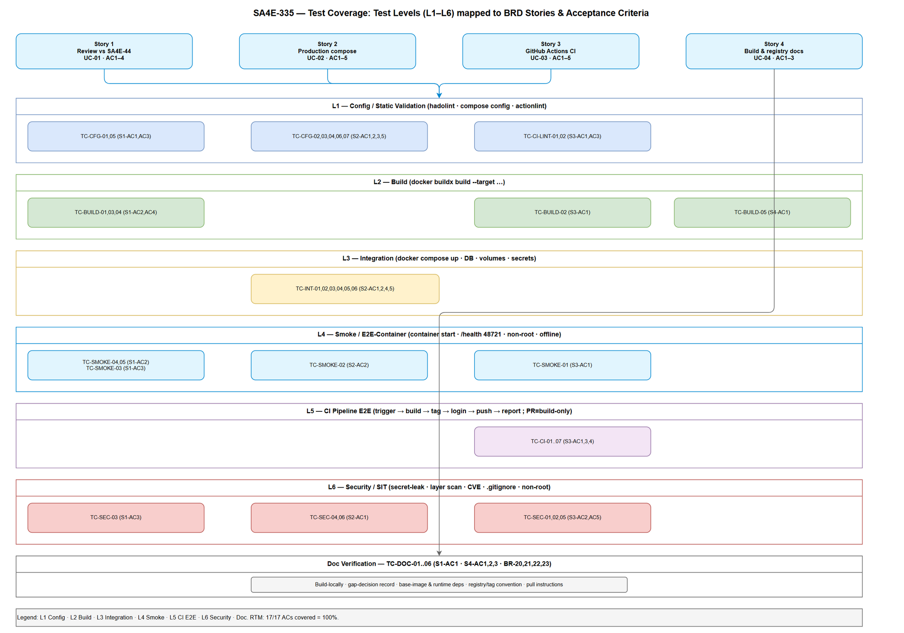
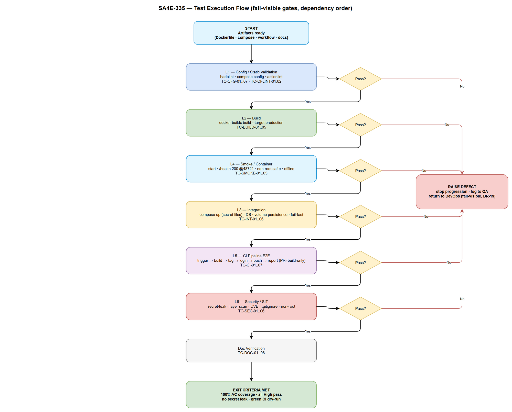

# System Test Plan (STP)

## SDLC-Agents-4-Enterprise (Backend) — SA4E-335: Review backend Dockerfile/docker-compose and create CI to build Docker image

---

## Document Information

| Field | Value |
|-------|-------|
| Jira Ticket | SA4E-335 |
| Title | Review backend Dockerfile/docker-compose and create CI to build Docker image |
| Author | QA Agent |
| Version | 1.1 |
| Date | 2026-10-01 |
| Status | Revised after BA review (RTM updated; pending BA re-review) |
| Related BRD | BRD-v1-SA4E-335.docx |
| Related FSD | FSD-v1-SA4E-335.docx (v1.1) |
| Related TDD | TDD-v1-SA4E-335.docx (v1.0) |

---

## Revision History

| Version | Date | Author | Changes |
|---------|------|--------|---------|
| 1.0 | 2026-10-01 | QA Agent | Initial System Test Plan derived from BRD (4 stories, 17 acceptance criteria), FSD (UC-01..UC-04, BR-01..BR-23), and TDD (Dockerfile multi-stage, production docker-compose, GitHub Actions CI). Defines test strategy, scope, test levels adapted for a DevOps deliverable, RTM (100% AC coverage), environment, data (CSV), risks, and entry/exit criteria. Two draw.io diagrams (test-coverage, test-execution-flow). |
| 1.1 | 2026-10-01 | QA Agent | Addressed BA review (CHANGES_REQUESTED). Updated RTM to reference 5 new STC cases closing BR-03 (TC-CFG-08), BR-07 / UC-01 EF-1 (TC-DOC-07), UC-02 EF-3 (TC-INT-07), UC-03 EF-2 (TC-CI-08), UC-03 EF-3 (TC-CI-09). Updated level counts and coverage note; all BRs + key EFs now explicitly covered. |

---

## 1. Introduction

### 1.1 Purpose

This STP defines the testing strategy for SA4E-335, a **DevOps / backend-only** deliverable comprising three declarative artifacts and their documentation:

1. `backend/Dockerfile` — multi-stage image whose `production` stage is the CI push target.
2. `backend/docker-compose.yml` — production-hardened runtime composition (backend + PostgreSQL).
3. `.github/workflows/build-push-backend.yml` — GitHub Actions CI that builds, tags, and pushes the image.
4. Build & registry documentation (Story 4).

Because the deliverable is infrastructure-as-code rather than application features, the test strategy centres on **image build tests, compose config validation, CI workflow lint/dry-run, image smoke tests, security-scan checks, and integration** — not on unit tests of application business logic (the MCP server behaviour is unchanged by this ticket).

### 1.2 Scope

**In scope:**

- Docker image build (all relevant multi-stage targets, especially `production`).
- docker-compose configuration validation (production hardening: secrets, limits, healthcheck, restart, volumes, profiles).
- GitHub Actions workflow validation (YAML lint, `act`/dry-run or static assertions, trigger/tag logic, fail-visible behaviour, secret masking).
- Image smoke tests (container starts, `/health` responds on 48721, non-root `sa4e` uid/gid 1001, hermetic/offline runtime).
- Security-scan checks (no secrets in layers/logs, non-root, minimal surface, `./secrets/*` git-ignored, optional CVE scan gate).
- Integration (compose up with secret files, backend ↔ PostgreSQL, named-volume persistence; end-to-end CI build → tag → push → pull).
- Build & registry documentation verification.

**Out of scope** (per BRD §1.2 / FSD §1.2):

- Runtime deployment/orchestration to a live environment (Kubernetes, cloud provisioning, CD promotion).
- Extension packaging; application feature changes to the MCP server.
- Testing of the application's own domain logic (unchanged by this ticket).

### 1.3 References

| Document | Location |
|----------|----------|
| BRD | BRD-v1-SA4E-335.docx (4 stories, 17 acceptance criteria) |
| FSD | FSD-v1-SA4E-335.docx v1.1 (UC-01..UC-04, BR-01..BR-23, §12–16 TA appendices) |
| TDD | TDD-v1-SA4E-335.docx v1.0 (Dockerfile, compose, CI job graph, security design) |
| Security Review | SECURITY-REVIEW.md (SEC-01..SEC-13; Phase 3.7) |
| Diagram standard | .kiro/steering/shared-diagrams.md |

---

## 2. Test Strategy

### 2.1 Approach

Testing follows a **shift-left, pipeline-mirroring** approach: every artifact is validated in the same order the CI pipeline exercises it (build → config validate → lint/dry-run → smoke → security scan → integration). Static validation precedes dynamic validation so configuration defects are caught before any container is started. Each test case traces to at least one BRD acceptance criterion or FSD business rule (see §7 RTM).

### 2.2 Test Levels (adapted for a DevOps deliverable)

The standard 6-level test pyramid is mapped onto infrastructure-as-code artifacts. There is no application code change, so classic unit tests are replaced by **config/static validation** and the integration/E2E layers dominate.

| Level | Standard meaning | SA4E-335 adaptation | Example |
|-------|------------------|---------------------|---------|
| **L1 — Static / Config Validation (PBT-equivalent)** | Property-based / static checks | Dockerfile lint, `docker compose config` schema validation, actionlint on the workflow, tag-scheme property checks | TC-CFG-xx, TC-CI-LINT-xx |
| **L2 — Build (UT-equivalent)** | Unit tests | Docker image build of each target; `production` build succeeds; build args have safe defaults | TC-BUILD-xx |
| **L3 — Integration (IT)** | Component integration | compose up with secret files; backend ↔ PostgreSQL; named-volume persistence; fail-fast on missing secret | TC-INT-xx |
| **L4 — Smoke / E2E-Container** | API E2E | Container starts; `/health` 200 on 48721; non-root; offline runtime | TC-SMOKE-xx |
| **L5 — CI E2E (pipeline)** | UI/system E2E | End-to-end workflow dry-run/`act`: trigger → build → tag → login → push → report; PR = build-only | TC-CI-xx |
| **L6 — Security / SIT** | System integration & manual | Secret-leak scans, layer inspection, non-root verification, CVE scan, `.gitignore` enforcement | TC-SEC-xx |

### 2.3 Automation Strategy

| Level | Automation | Tooling |
|-------|-----------|---------|
| L1 Config/Static | Automated | `hadolint` (Dockerfile), `docker compose config`, `actionlint`/`yamllint`, grep-based property checks + CSV-driven cases |
| L2 Build | Automated | `docker buildx build --target <stage>` with assertions on exit code / image presence |
| L3 Integration | Automated | `docker compose up`, `pg_isready`, volume-persistence script, missing-secret negative test |
| L4 Smoke | Automated | `docker run` + `curl`/`wget /health`, `id`/`whoami` for non-root, network-off run |
| L5 CI pipeline | Semi-automated | `act` local runner or branch/tag dry-run on a sandbox; static assertions on workflow outputs |
| L6 Security | Semi-automated | `docker history`/`dive` layer scan, `grep` secret scan on logs/layers, `trivy`/`grype` CVE scan, `git check-ignore` |

Fully-manual exploratory checks (SIT) are limited to visual confirmation of CI status surfacing on the commit/PR and documentation walkthrough.

---

## 3. Test Environment

| Component | Specification |
|-----------|---------------|
| OS / Runtime | Linux CI runner (ubuntu-latest) + local Windows/Linux dev with Docker Engine + Buildx |
| Docker | Docker Engine ≥ 24, Buildx plugin, Compose v2 |
| Registry (test) | GHCR sandbox namespace (default) or a local registry (`registry:2`) for push dry-runs |
| CI | GitHub Actions; `act` for local workflow execution; a disposable sandbox branch/tag for live dry-run |
| Database | `pgvector/pgvector:pg16` container |
| Lint tools | `hadolint`, `actionlint`, `yamllint`, `shellcheck` |
| Security tools | `trivy` (or `grype`), `dive`, `docker history`, `git check-ignore` |
| Secrets (test) | Dummy secret files under `./secrets/` (git-ignored); dummy registry token in a sandbox CI secret |
| Backend port | 48721 (as `EXPOSE`d) |

**Test data location:** `documents/SA4E-335/*.csv` (tag-scheme cases, config-validation cases, healthcheck cases).

---

## 4. Entry & Exit Criteria

### 4.1 Entry Criteria

- BRD, FSD, TDD approved and available.
- `backend/Dockerfile`, `backend/docker-compose.yml`, and `.github/workflows/build-push-backend.yml` implemented (or stub-present) for the artifact under test.
- Test environment (Docker, Buildx, lint & security tools) provisioned.
- Dummy secret files and sandbox registry credentials available.

### 4.2 Exit Criteria

- 100% of BRD acceptance criteria mapped to ≥1 executed test case (RTM, §7).
- All **High**-priority test cases **Pass**; no open Critical/High defect.
- No secret value present in any build log or image layer (TC-SEC-01/02).
- `production` image builds, runs as non-root, and `/health` returns 200 on 48721.
- CI dry-run demonstrates fail-visible behaviour on a forced build/auth/push failure.
- Medium/Low defects triaged with an agreed disposition (fix or accept).

---

## 5. Test Levels Coverage Summary

| Level | Area | # Test Cases | Priority mix |
|-------|------|-------------|--------------|
| L1 Config/Static | Dockerfile + compose + workflow validation | 10 | High/Medium |
| L2 Build | Image build (targets, args, hermetic) | 5 | High |
| L3 Integration | compose up, DB, volumes, secrets | 7 | High/Medium |
| L4 Smoke | Container start, /health, non-root, offline | 5 | High |
| L5 CI pipeline | Trigger/tag/push/report, PR build-only, auth/push failure | 9 | High/Medium/Low |
| L6 Security | Secret leak, layers, CVE, .gitignore | 6 | High/Medium |
| **Total (L1–L6 functional)** | | **42** + 1 (TC-DOC in L-group) | |

> Functional L1–L6 total is 43 (including TC-CFG-08, TC-INT-07, TC-CI-08, TC-CI-09); the 7 documentation-verification cases (TC-DOC-01..07) bring the grand total to 50. See STC.md "Test Case Summary by Level".

Detailed test cases are in `STC.md`.

---

## 6. Test Coverage Diagram

---

## 7. Requirements Traceability Matrix (RTM)

Every BRD acceptance criterion (grouped by story) maps to one or more test case IDs. Target: **100% coverage**. FSD business rules (BR-xx) are shown for cross-reference.

### 7.1 Story 1 — Review Dockerfile & docker-compose against SA4E-44 (UC-01)

| BRD AC | Description | FSD BR | Test Case IDs |
|--------|-------------|--------|---------------|
| S1-AC1 | Decision (adopt/adapt/defer) + rationale per SA4E-44 item | BR-01, BR-03, BR-07 | TC-CFG-01, TC-DOC-02, TC-CFG-08 (BR-03), TC-DOC-07 (BR-07 / UC-01 EF-1) |
| S1-AC2 | Base-image decision (alpine vs slim) recorded with glibc/`onnxruntime-node` justification | BR-02 | TC-BUILD-01, TC-SMOKE-05, TC-DOC-03 |
| S1-AC3 | Non-root `sa4e` + healthcheck confirmed preserved | BR-05 | TC-SMOKE-03, TC-CFG-05, TC-SEC-03 |
| S1-AC4 | Items increasing image size/build time flagged vs NFR budgets | BR-06 | TC-BUILD-04, TC-DOC-04 |

### 7.2 Story 2 — Production-ready docker-compose (UC-02)

| BRD AC | Description | FSD BR | Test Case IDs |
|--------|-------------|--------|---------------|
| S2-AC1 | No plaintext credentials; secrets referenced externally | BR-08 | TC-CFG-06, TC-SEC-04, TC-INT-05 |
| S2-AC2 | Backend healthcheck + restart policy defined | BR-09, BR-10 | TC-CFG-02, TC-CFG-03, TC-SMOKE-02 |
| S2-AC3 | CPU/memory resource limits on backend + database | BR-11 | TC-CFG-04 |
| S2-AC4 | Named volumes persist data across restarts (and fail visibly if a volume is missing/unmountable — UC-02 EF-3) | BR-12 | TC-INT-03, TC-INT-04, TC-INT-07 (UC-02 EF-3) |
| S2-AC5 | Dev `embeddings` profile available without weakening production | BR-13 | TC-CFG-07, TC-INT-06 |

### 7.3 Story 3 — GitHub Actions CI build & push (UC-03)

| BRD AC | Description | FSD BR | Test Case IDs |
|--------|-------------|--------|---------------|
| S3-AC1 | CI builds `production` target on qualifying trigger | BR-14, BR-15 | TC-CI-01, TC-CI-02, TC-BUILD-02 |
| S3-AC2 | CI pushes using CI secrets only, never committed (incl. registry auth-failure path — UC-03 EF-2) | BR-17, BR-18 | TC-CI-05, TC-SEC-01, TC-CI-08 (UC-03 EF-2) |
| S3-AC3 | Pushed image carries traceable tag (semver and/or SHA) | BR-16 | TC-CI-03, TC-CI-04, TC-CI-LINT-02 |
| S3-AC4 | Failed build/push fails pipeline, surfaced on PR/commit (build fail EF-1, push fail EF-3) | BR-19 | TC-CI-06, TC-CI-07, TC-CI-09 (UC-03 EF-3) |
| S3-AC5 | No secrets in build logs or image layers (incl. masked credential on auth failure) | BR-18 | TC-SEC-01, TC-SEC-02, TC-CI-08 (UC-03 EF-2) |

### 7.4 Story 4 — Build & registry documentation (UC-04)

| BRD AC | Description | FSD BR | Test Case IDs |
|--------|-------------|--------|---------------|
| S4-AC1 | Docs let a new engineer build locally + understand each target | BR-21 | TC-DOC-01, TC-BUILD-05 |
| S4-AC2 | Registry name, image path, tagging convention, pull instructions documented | BR-20, BR-23 | TC-DOC-05, TC-DOC-06 |
| S4-AC3 | Base-image decision + required runtime deps documented for reproducibility | BR-22 | TC-DOC-03, TC-DOC-04 |

### 7.5 Coverage Summary

| Story | ACs | ACs covered | Coverage |
|-------|-----|-------------|----------|
| Story 1 | 4 | 4 | 100% |
| Story 2 | 5 | 5 | 100% |
| Story 3 | 5 | 5 | 100% |
| Story 4 | 3 | 3 | 100% |
| **Total** | **17** | **17** | **100%** |

All 23 FSD business rules (BR-01..BR-23) are referenced by at least one test case through the mappings above — including BR-03 (TC-CFG-08) and BR-07 (TC-DOC-07), which were added after BA review. Key exception flows are explicitly covered: UC-01 EF-1 (TC-DOC-07), UC-02 EF-1 (TC-INT-05), UC-02 EF-3 (TC-INT-07), UC-03 EF-1 (TC-CI-06), UC-03 EF-2 (TC-CI-08), UC-03 EF-3 (TC-CI-09), UC-04 EF-1 (TC-DOC-05/06).

---

## 8. Test Execution Flow

The flow runs the levels in dependency order; a failing gate stops progression and raises a defect, mirroring the fail-visible CI principle (BR-19).

---

## 9. Test Data

Test data is maintained as CSV files so cases are data-driven and repeatable.

| File | Purpose | Used by |
|------|---------|---------|
| `testdata/test-data-tag-scheme.csv` | Input ref/event → expected image tags (semver, SHA, latest, PR) | TC-CI-03, TC-CI-04, TC-CI-LINT-02 |
| `testdata/test-data-config-validation.csv` | compose/Dockerfile config keys + tree-sitter-jsp strip/decision + baseline-availability → expected validation outcome | TC-CFG-01..08, TC-DOC-07, TC-SEC-04 |
| `testdata/test-data-healthcheck.csv` | Healthcheck scenario → expected container health state | TC-SMOKE-02, TC-INT-02 |

---

## 10. Risks & Mitigations (test-specific)

| Risk | Impact | Mitigation |
|------|--------|------------|
| Live registry push not permitted in CI test | Can't fully verify push | Use a local `registry:2` or GHCR sandbox namespace; otherwise assert via `act` dry-run + buildx `--push=false` with digest check |
| `onnxruntime-node` fails to load on slim | Smoke test red | TC-SMOKE-05 explicitly loads native module; blocks exit criteria if failing |
| Secret-leak false negatives | Security gap missed | Combine log grep + `dive`/`docker history` layer inspection (TC-SEC-01/02) |
| Non-deterministic model download at build | Flaky build test | Verify hermetic build: no network at runtime (TC-SMOKE-04); model pre-cached in `build` stage |
| `act` behaviour differs from hosted runner | CI test gives false pass | Supplement `act` with a one-off sandbox branch/tag dry-run before exit |

---

## 11. Roles & Responsibilities

| Role | Responsibility |
|------|----------------|
| QA Agent | Author STP/STC, execute test cases, report results |
| DevOps Engineer | Provide artifacts, fix build/compose/CI defects |
| BA Agent | Review test cases for business coverage (gate) |
| Security Agent | Advise on security-scan checks (SEC findings) |
| SM | Coordinate phase, verify quality gate |

---

## 12. Appendix — Diagram Index

| # | Diagram | Image | Source (editable) |
|---|---------|-------|-------------------|
| 1 | Test Coverage — levels (L1 config → L6 security) mapped to BRD stories & ACs | [test-coverage.png](diagrams/test-coverage.png) | [test-coverage.drawio](diagrams/test-coverage.drawio) |
| 2 | Test Execution Flow — build → config validate → lint/dry-run → smoke → security → integration, with fail-visible gates | [test-execution-flow.png](diagrams/test-execution-flow.png) | [test-execution-flow.drawio](diagrams/test-execution-flow.drawio) |

### Reference Documents

| Document | Location |
|----------|----------|
| BRD | BRD-v1-SA4E-335.docx |
| FSD | FSD-v1-SA4E-335.docx |
| TDD | TDD-v1-SA4E-335.docx |
| Security Review | SECURITY-REVIEW.md |
| Test cases | STC.md |
