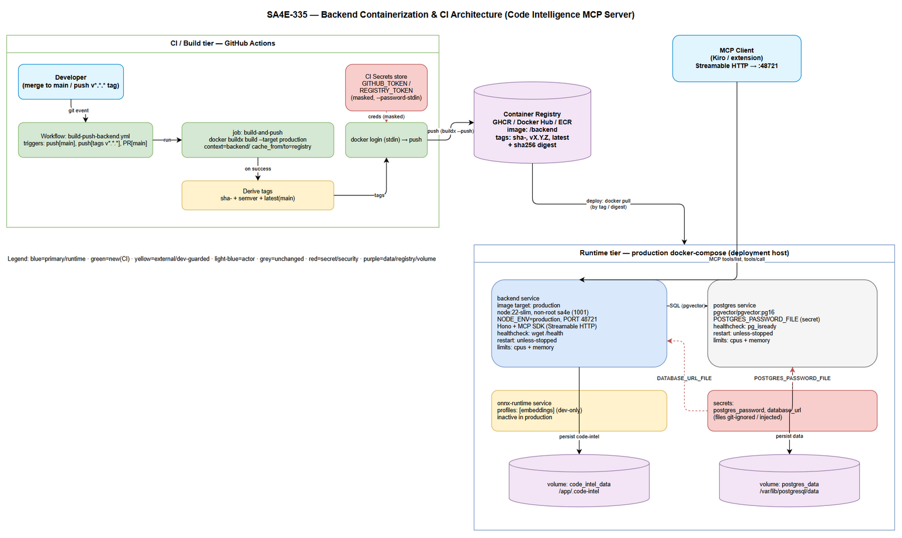
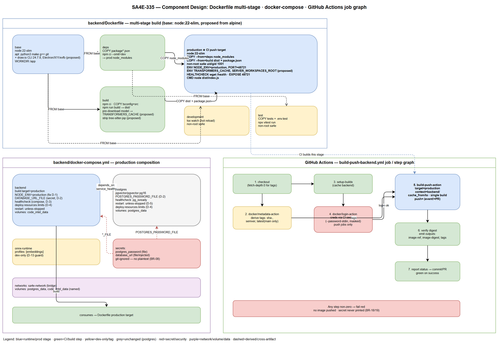

# Technical Design Document (TDD)

## SDLC-Agents-4-Enterprise (Backend) — SA4E-335: Review backend Dockerfile/docker-compose and create CI to build the Docker image

---

## Document Information

| Field | Value |
|-------|-------|
| Jira Ticket | SA4E-335 |
| Title | Review backend Dockerfile/docker-compose and create CI to build Docker image |
| Author | SA Agent (Solution Architect) |
| Version | 1.0 |
| Date | 2026-10-01 |
| Status | Draft (pending Security Design Review + BA consistency review) |
| Related BRD | BRD-v1-SA4E-335.docx |
| Related FSD | FSD-v1-SA4E-335.docx (v1.1 — BA business sections + TA technical appendices) |
| Reference | SA4E-44 — accepted containerization baseline |

---

## Revision History

| Version | Date | Author | Changes |
|---------|------|--------|---------|
| 1.0 | 2026-10-01 | SA Agent | Initial technical design derived from FSD v1.1 (UC-01..UC-04, BR-01..BR-23, discrepancy log D-1..D-12) and the real `backend/Dockerfile` + `backend/docker-compose.yml`. Covers Dockerfile multi-stage layout, production docker-compose, GitHub Actions CI job graph, API/config design, error handling, security design, and an implementation checklist. Two draw.io diagrams (architecture, component). |

---

## 1. Introduction

### 1.1 Purpose

This TDD is the engineering blueprint for SA4E-335. It converts the FSD's functional requirements and the SA4E-44 containerization baseline into concrete, buildable technical decisions for three artifacts:

1. **`backend/Dockerfile`** — the multi-stage image definition whose `production` stage is the CI push target.
2. **`backend/docker-compose.yml`** (production form) — the runtime composition (backend + PostgreSQL, secrets, limits, healthcheck, restart policy, named volumes).
3. **`.github/workflows/build-push-backend.yml`** — the GitHub Actions CI job graph that builds the `production` target, tags it (semver + commit SHA), authenticates with CI secrets only, and pushes to the chosen registry.

This is a **DevOps / backend-only** design. There is no end-user UI. The consumers are engineers, the CI runner, the container registry, and the running MCP server (Code Intelligence, Hono + MCP SDK, Streamable HTTP on port 48721).

### 1.2 Scope

In scope: the technical design of the three artifacts above, the API/config contracts they must satisfy, error handling, and the security design (secrets management, non-root runtime, image supply chain, port/network exposure).

Out of scope (per BRD §1.2 / FSD §1.2): runtime deployment/orchestration (Kubernetes, cloud provisioning, CD promotion), extension packaging, and any application feature change to the MCP server. The registry *choice* remains a decision (BR-20) — this design defaults to **GHCR** and keeps the workflow registry-parameterized so a different registry needs only configuration changes, not code changes.

### 1.3 Design Inputs (traceability)

| Input | Drives |
|-------|--------|
| BRD Stories 1–4 | The four functional areas (review, compose, CI, docs). |
| FSD UC-01..UC-04, BR-01..BR-23 | Component behavior and acceptance criteria. |
| FSD §12–16 (TA appendices) | Concrete config/API contracts, integration, pseudocode, discrepancy log, NFR targets. |
| FSD §15 discrepancy log (D-1..D-12) | The exact production-hardening deltas this design must close. |
| Real `backend/Dockerfile` | Current stage layout, base image, non-root user, healthcheck (design baseline). |
| Real `backend/docker-compose.yml` | Current services, env, volumes, network (design baseline). |
| SA4E-44 | Target baseline: slim base, draw.io CLI, cached model, hermetic build, workspaces root. |

---

## 2. Architecture Overview

### 2.1 Architecture Diagram



### 2.2 Narrative

The system spans two logical tiers connected by a container registry:

**CI / Build tier (GitHub Actions).** A qualifying git event (merge to `main`, or a `v*.*.*` tag push) triggers the `build-push-backend.yml` workflow. A single `docker buildx build --target production` produces the runtime image from the multi-stage Dockerfile, using the `backend/` build context and a registry-backed layer cache. Tags (`sha-<short>`, semver, and `latest` on main) are derived, registry credentials are read from the CI secrets store (masked, via `--password-stdin`), the runner logs in, and buildx pushes the image. Any non-zero step fails the run **red** and pushes nothing (fail-visible, BR-19). Pull-request builds validate the `production` target compiles but never push and never touch secrets.

**Registry (bridge).** The registry (GHCR by default; Docker Hub / ECR supported by configuration) stores the image manifest, layers, and an immutable `sha256` digest. Every image carries at least `sha-<short>` so a running container is always traceable to a source revision (BR-16).

**Runtime tier (production docker-compose).** A deployment pulls the image by tag or digest. The production compose starts the `backend` service (node:22-slim, non-root `sa4e` uid/gid 1001, `NODE_ENV=production`, PORT 48721, Hono + MCP SDK over Streamable HTTP) with a compose-level healthcheck, a restart policy, and CPU/memory limits. It connects over `sa4e-network` to `postgres` (`pgvector/pgvector:pg16`). Credentials arrive via Docker secrets (`*_FILE`), never as committed plaintext. Persistent state lives on named volumes `postgres_data` and `code_intel_data`. The `onnx-runtime` service stays guarded behind `profiles: [embeddings]` — dev-only, inactive in production. MCP clients (Kiro / the extension) reach the backend over Streamable HTTP on :48721.

### 2.3 Key Architectural Decisions

| ID | Decision | Rationale | Trade-off / Risk |
|----|----------|-----------|------------------|
| AD-1 | **Base image `node:22-slim`** (Debian glibc), adopting SA4E-44 from the current `node:22-alpine` (musl). | `onnxruntime-node` and other native modules require glibc; slim avoids musl incompatibility (BR-02, FSD D-6). | Larger image than alpine; bounded by the §12 size budget. Verify `onnxruntime-node` loads in the `production` image. |
| AD-2 | **Keep the six-stage layout** (`base`, `deps`, `build`, `production`, `development`, `test`); `production` is the sole CI push target. | Preserves the working baseline; build-only tooling is discarded from the runtime image (BR-15). | None material; retains existing behavior. |
| AD-3 | **Single buildx invocation with `--push`** (no separate build-then-push). | Guarantees the pushed image equals the built image; avoids a build/push race. | Requires Buildx on the runner (already a dependency). |
| AD-4 | **Default registry = GHCR**, workflow registry-parameterized (`REGISTRY`, `IMAGE_NAME` vars). | GHCR needs only the built-in `GITHUB_TOKEN` (no stored secret); registry choice (BR-20) stays a config change. | If GHCR is rejected, set the vars + add the registry's secret; no code change. |
| AD-5 | **Secrets via Docker secrets / injected env (`*_FILE`)** in compose; CI secrets only in the workflow. | Removes committed plaintext (D-2, BR-08); credentials never enter image layers or logs (BR-17, BR-18). | Operators must provision secret files/injected env before startup (fail-fast if missing). |
| AD-6 | **draw.io CLI + Electron/X11/xvfb, cached embedding model, `tree-sitter-jsp` strip, `SERVER_WORKSPACES_ROOT`** are **conditional-adopt** (SA4E-44 items D-7..D-10). | These are runtime capabilities not present in the current file; adopt only if the runtime needs them, else defer with a documented image-size rationale. | Each adopted item enlarges the image / build time (§12 budgets). Guarded behind build args with safe defaults so a bare build still succeeds. |
| AD-7 | **PR builds are build-only (no push, no secrets).** | Catches native-module / model-download regressions early without exposing push secrets to fork PRs (BR-18/19). | PRs do not produce a published artifact (by design). |

---

## 3. Component / Module Design

The "modules" of this ticket are declarative artifacts. Each subsection specifies the concrete structure the implementation must produce.

### 3.1 Component Diagram



### 3.2 `backend/Dockerfile` — Multi-stage Layout

The design keeps the current stage graph and hardens the `production` runtime stage toward the SA4E-44 baseline. Base-image change (AD-1) and the SA4E-44 capability items (AD-6) are applied here.

| Stage | `FROM` | Purpose | Key steps | Consumed by |
|-------|--------|---------|-----------|-------------|
| `base` | `node:22-slim` (was `node:22-alpine`) | Shared workdir + build toolchain | `apt-get install -y --no-install-recommends python3 make g++ git` (glibc toolchain for native modules); optional draw.io CLI + Electron/X11/xvfb runtime deps (AD-6) | `deps`, `build`, `development`, `test` |
| `deps` | `base` | Production dependencies | `COPY package.json package-lock.json`; `npm ci --omit=dev` | `production` (`COPY --from=deps /app/node_modules`) |
| `build` | `base` | Compile + hermetic prep | `npm ci`; `COPY tsconfig.json src/`; `npm run build` → `dist/`; **(AD-6)** pre-download embedding model into `TRANSFORMERS_CACHE`; strip `tree-sitter-jsp` to keep the build hermetic (BR-03, BR-04) | `production` (`COPY --from=build /app/dist`, `/app/package.json`, and the cached model dir) |
| **`production`** ★ | `node:22-slim` | **Runtime image — CI push target** | runtime deps only; `COPY --from=deps node_modules`; `COPY --from=build dist/ + package.json`; create non-root `sa4e` (uid/gid 1001) + `/app/.code-intel` (and `/app/workspaces` if AD-6); `USER sa4e`; `ENV NODE_ENV=production PORT=48721` (+ `TRANSFORMERS_CACHE`, `SERVER_WORKSPACES_ROOT` if AD-6); `EXPOSE 48721`; `HEALTHCHECK wget /health`; `CMD ["node","dist/index.js"]` | registry / compose `backend` |
| `development` | `base` | Hot-reload dev (non-root) | `npm ci`; `COPY tsconfig+src`; `USER sa4e`; `CMD npx tsx watch ... src/index.ts` | `docker-compose.dev.yml` |
| `test` | `base` | In-container Vitest (non-root) | `npm ci`; `COPY tsconfig+src+tests+.env.test`; `USER sa4e`; `CMD npx vitest run` | local / CI `--target test` |

**Design rules for the Dockerfile:**

- **Non-root invariant preserved (BR-05):** the `production`, `development`, and `test` stages all switch to `USER sa4e` (uid/gid 1001) after `chown`. The runtime process never runs as root.
- **Base-image migration (AD-1):** the alpine `apk add` lines become Debian `apt-get install --no-install-recommends` with an `apt-get clean && rm -rf /var/lib/apt/lists/*` in the same layer to keep the image lean.
- **Build args with safe defaults (AD-6):** `NODE_VERSION=22`, `DRAWIO_CLI_VERSION=24.7.8`, `TRANSFORMERS_CACHE=/app/.cache/transformers`, `EMBEDDING_MODEL=<project default>`. Build args are build-time only and MUST NOT carry secrets. A bare `docker build --target production .` must still succeed.
- **Hermetic build (BR-03, BR-04):** the model is fetched once in the `build` stage into `TRANSFORMERS_CACHE` and copied into `production`; runtime performs **zero** network fetch. `tree-sitter-jsp` is stripped/overridden if it triggers a non-deterministic fetch.
- **Healthcheck retained verbatim** (see §4.3).

### 3.3 `backend/docker-compose.yml` — Production Composition

The design closes the Story-2 gaps from the discrepancy log (D-1..D-5) while preserving the working baseline (PostgreSQL image, named volumes, dev `embeddings` profile).

**`backend` service:**

| Key | Current | Target (production) | Discrepancy / Rule |
|-----|---------|---------------------|--------------------|
| `build.target` | `production` | `production` | BR-15 |
| `environment.NODE_ENV` | `development` | **`production`** | **D-1** (High) — fix |
| `environment.PORT` | `48721` | `48721` | — |
| `environment.DATABASE_URL` | plaintext literal | **`DATABASE_URL_FILE`** (secret) | **D-2** (High), BR-08 |
| `environment.DATABASE_ADAPTER` | `postgresql` | `postgresql` | — |
| `environment.TASK_WORKER_*` / `CODE_INTEL_*` | literals | unchanged (non-secret) | — |
| `environment.ONNX_RUNTIME_URL` | always set | only when `embeddings` active | dev-only (BR-13) |
| `healthcheck` | absent (Dockerfile only) | **compose-level** healthcheck mirroring §4.3 | **D-3** (Medium), BR-09 |
| `deploy.resources.limits` | absent | **`cpus` + `memory` defined** | **D-4** (Medium), BR-11 |
| `restart` | `unless-stopped` | `unless-stopped` | BR-10 ✅ |
| `depends_on.postgres` | `condition: service_healthy` | unchanged | — |
| `volumes` | `code_intel_data:/app/.code-intel` | unchanged | BR-12 |

**`postgres` service:**

| Key | Current | Target (production) | Discrepancy / Rule |
|-----|---------|---------------------|--------------------|
| `image` | `pgvector/pgvector:pg16` | unchanged | — |
| `environment.POSTGRES_DB` / `POSTGRES_USER` | literals | literals OK (non-secret) | — |
| `environment.POSTGRES_PASSWORD` | plaintext literal | **`POSTGRES_PASSWORD_FILE`** (secret) | **D-2** (High), BR-08 |
| `healthcheck` | `pg_isready` | unchanged | ✅ |
| `restart` | absent | **`unless-stopped`** | **D-5** (Low), BR-10 |
| `deploy.resources.limits` | absent | **`cpus` + `memory` defined** | **D-4** (Medium), BR-11 |
| `volumes` | `postgres_data` + init.sql | unchanged | BR-12 |

**`onnx-runtime` service:** unchanged — `image: mcr.microsoft.com/onnxruntime/server:latest`, guarded by `profiles: [embeddings]`, dev-only, inactive by default (BR-13). ✅

**Top-level additions:**

```yaml
secrets:
  postgres_password:
    file: ./secrets/postgres_password        # git-ignored; or external secret
  database_url:
    file: ./secrets/database_url              # git-ignored; or injected

volumes:
  postgres_data:
  code_intel_data:

networks:
  sa4e-network:
    driver: bridge
```

**Design rules for compose:**

- **No plaintext credentials (BR-08):** `DATABASE_URL` / `POSTGRES_PASSWORD` are supplied via `*_FILE` secrets. The application reads the `_FILE` variant (or composes `DATABASE_URL` from the mounted password) — never a committed literal.
- **Fail-fast on missing secret (UC-02 EF-1):** if a required secret file is absent, the service fails to start with a clear message naming the missing secret; there is no plaintext default fallback.
- **Resource limits are parameterizable** (AF-2) via env-substituted defaults so an operator can tune per environment without editing the base file.
- **Cosmetic cleanups** (D-11, D-12): correct the misleading "Node.js 20 / PostgreSQL 15" comments; drop the obsolete `version: "3.9"` key.

### 3.4 `.github/workflows/build-push-backend.yml` — CI Job Graph

The design is a single job with an ordered step graph (§3.2 component diagram, right lane). Fail-visible: any non-zero step ends the run red and pushes nothing (BR-19).

**Triggers (`on:`):**

| Event | Filter | Behavior | Push? | Rule |
|-------|--------|----------|-------|------|
| `push` | `branches: [main]` | build `production`, tag `sha-<short>` + `latest`, push | Yes | BR-14, BR-16 |
| `push` | `tags: ['v*.*.*']` | build `production`, tag semver (`vX.Y.Z`, `X.Y`, `X`) + `sha-<short>`, push | Yes | BR-14, BR-16 |
| `pull_request` | `branches: [main]` | build `production` only (validate); no push | No | BR-18/19, AD-7 |

**Step graph (`build-and-push` job):**

| # | Step | Action / command | Fail-visible behavior |
|---|------|------------------|-----------------------|
| 1 | Checkout | `actions/checkout` (`fetch-depth: 0` so semver tags resolve) | tag/context error → red (EF-1) |
| 2 | Derive tags | `docker/metadata-action` → `sha-<short>`, semver, `latest` (main only) | tag computation error → red |
| 3 | Setup Buildx | `docker/setup-buildx-action` (registry cache backend) | setup error → red |
| 4 | Registry login | `docker/login-action` (creds from CI secrets, `--password-stdin`, masked) — **push jobs only** | missing secret / auth fail → red, value never printed (EF-2, EF-4) |
| 5 | Build & push | `docker/build-push-action`: `context=backend/`, `file=backend/Dockerfile`, `target=production`, `cache-from`/`cache-to`, `push=${{ github.event_name != 'pull_request' }}`, `tags=<from step 2>` | build/push error → red, no partial success (EF-1, EF-3) |
| 6 | Verify + outputs | assert `digest` present; emit `image-ref`, `image-digest`, `tags` | missing digest → red (EF-3) |
| 7 | Report status | green surfaced on commit/PR | — |

**Job-level permissions (GHCR default):** `contents: read`, `packages: write`.

**Design rules for CI:**

- Credential read and `docker login` happen **after** a successful build (step 4 gates step 5's push), so a broken build never touches secrets (AD-7).
- The single buildx `--push` (step 5) guarantees built image = pushed image (AD-3).
- Registry host/path come from repo **variables** (`REGISTRY`, `IMAGE_NAME`), not code, so the registry decision (BR-20) is configuration.

---

## 4. API / Configuration Design

There is no new application API. The "API surface" of this ticket is the set of configuration contracts the three artifacts expose.

### 4.1 Dockerfile Build-Arg Contract

| Build ARG | Default | Allowed | Consumed at | Secret? |
|-----------|---------|---------|-------------|---------|
| `NODE_VERSION` | `22` | `22` | `FROM node:${NODE_VERSION}-slim` | No |
| `DRAWIO_CLI_VERSION` | `24.7.8` | pinned semver | `base`/`production` runtime dep install (AD-6) | No |
| `TRANSFORMERS_CACHE` | `/app/.cache/transformers` | absolute path | `build` (pre-download) + `production` ENV | No |
| `EMBEDDING_MODEL` | project default | HF model id | `build` (pre-download) | No |

Build args are **build-time only** and MUST NOT carry secrets (BR-17). Registry credentials are supplied at `docker login` time by CI, never as `ARG`/`ENV`.

### 4.2 Runtime ENV Contract (`production` stage)

| ENV | Value | Notes |
|-----|-------|-------|
| `NODE_ENV` | `production` | Dockerfile correct; compose overridden to `production` (fixes D-1). |
| `PORT` | `48721` | Listen port; `EXPOSE 48721`. |
| `DATABASE_URL` | secret-backed | from `DATABASE_URL_FILE` or composed from mounted password (BR-08). |
| `DATABASE_ADAPTER` | `postgresql` | selects the PostgreSQL adapter. |
| `TRANSFORMERS_CACHE` | `/app/.cache/transformers` | (AD-6) points runtime at the pre-cached model (BR-04). |
| `SERVER_WORKSPACES_ROOT` | `/app/workspaces` | (AD-6) per SA4E-44; dir created + `chown sa4e` if adopted. |

### 4.3 Healthcheck Contract (Dockerfile + compose)

```dockerfile
HEALTHCHECK --interval=30s --timeout=5s --start-period=10s --retries=3 \
  CMD wget --no-verbose --tries=1 --spider http://localhost:48721/health || exit 1
```

| Parameter | Value | Meaning |
|-----------|-------|---------|
| interval | 30s | steady-state probe cadence |
| timeout | 5s | max probe duration before it counts as a failure |
| start-period | 10s | boot grace window (failures not counted) |
| retries | 3 | consecutive failures before `unhealthy` |
| probe | `GET /health` (200 ⇒ healthy) | consumes the existing backend health endpoint |

The compose-level healthcheck (D-3) mirrors these values so orchestration observes backend health even if the image healthcheck is overridden.

### 4.4 GitHub Actions Config Contract

| Name | Kind | Default | Purpose |
|------|------|---------|---------|
| `REGISTRY` | repo variable | `ghcr.io` | registry host (BR-20 decision as config) |
| `IMAGE_NAME` | repo variable | `${{ github.repository }}/backend` | full image path |
| `BUILD_TARGET` | const | `production` | multi-stage target (BR-15) |
| `BUILD_CONTEXT` | const | `backend/` | Docker build context |
| `GITHUB_TOKEN` | built-in secret | — | GHCR login (BR-17) |
| `REGISTRY_USERNAME` / `REGISTRY_TOKEN` | secret | — | Docker Hub login (if chosen) |
| `AWS_*` / OIDC role | secret / OIDC | — | ECR login (if chosen) |

**Outputs:** `image-ref` (fully-qualified ref incl. tags), `image-digest` (`sha256:…`), `tags` (newline list), and job status (green/red on commit/PR).

### 4.5 Image Tag Scheme

| Tag form | Example | When | Meaning |
|----------|---------|------|---------|
| `sha-<short>` | `sha-a1b2c3d` | every push build | immutable commit mapping (BR-16) |
| `vMAJOR.MINOR.PATCH` | `v1.4.0` | semver tag push | released version |
| `MAJOR.MINOR`, `MAJOR` | `1.4`, `1` | semver tag push | moving convenience tags |
| `latest` | `latest` | push to `main` only | newest main build (never from a PR) |
| `<digest>` | `sha256:…` | always (implicit) | content-addressable pull for deploys |

---

## 5. Error Handling

There is no end-user UI; errors surface to engineers (CI status), operators (compose startup / healthcheck), and the container runtime.

### 5.1 CI Error Handling (fail-visible, BR-19)

| Scenario | Detection | Behavior | FSD ref |
|----------|-----------|----------|---------|
| Build fails (compile / native module / model download) | non-zero from step 5 build | job red, no image pushed, failing step highlighted on commit/PR | EF-1 |
| Registry auth fails | non-zero from step 4 login | push aborted, job red; credential value never printed | EF-2, EF-4 |
| Push fails (network/registry) | non-zero from step 5 push | job red with registry error; no partial success | EF-3 |
| Secret would appear in logs/layers | masking + no-`COPY`-secret review | run treated as failed; secrets masked; nothing sensitive in layers | BR-18 |
| Missing digest after push | step 6 assertion | job red (push incomplete) | EF-3 |

**Principle:** every failure branch reports RED to the commit/PR **before** failing the job, so status always reflects the true outcome — no silent failure. Credential reads occur only after a successful build.

### 5.2 Runtime / Compose Error Handling

| Scenario | Detection | Behavior | FSD ref |
|----------|-----------|----------|---------|
| Missing production secret at startup | `*_FILE` not present | service fails fast naming the missing secret; no plaintext fallback | UC-02 EF-1, BR-08 |
| Backend healthcheck stays unhealthy past start-period | 3 consecutive `/health` failures | container marked `unhealthy`; restart policy applies per retries; persistent failure flagged for operator | UC-02 EF-2, BR-09/10 |
| Named volume missing/unmountable | compose mount failure | startup fails visibly; no silent fallback to ephemeral storage | UC-02 EF-3, BR-12 |
| PostgreSQL not ready | `depends_on: service_healthy` + `pg_isready` | backend waits for DB health before starting | — |

### 5.3 Logging

- CI logs mask all secret values (BR-18); log level is the runner default.
- Runtime logging uses the existing backend logger (Pino, per AGENTS.md). No secret values are logged. Detailed log destinations/formats are the application's existing behavior and unchanged by this ticket.

---

## 6. Security Design

### 6.1 Secrets Management

| Surface | Mechanism | Rule |
|---------|-----------|------|
| CI → registry | Credentials from the CI secret store only (`GITHUB_TOKEN` for GHCR; `REGISTRY_*` / OIDC otherwise), passed via `--password-stdin`, masked in logs | BR-17, BR-18 |
| Compose → services | Docker secrets / injected env (`POSTGRES_PASSWORD_FILE`, `DATABASE_URL_FILE`); secret files git-ignored | BR-08, D-2 |
| Build time | No secrets in `ARG`/`ENV`; no `COPY` of credentials into any layer | BR-17, BR-18 |

Fail-fast is the default: missing secrets stop startup rather than falling back to a plaintext default.

### 6.2 Non-root Runtime

- The `production` (and `development`/`test`) stages run as `sa4e` (uid/gid 1001) after `chown` (BR-05). The runtime process never runs as root, limiting blast radius.
- Only writable paths the process needs (`/app/.code-intel`, and `/app/workspaces` if AD-6) are `chown`ed to `sa4e`.

### 6.3 Image Supply Chain

- **Hermetic, deterministic build (BR-03, BR-04):** pinned dependencies (`npm ci` against `package-lock.json`), model pre-cached at build time (zero runtime fetch), `tree-sitter-jsp` stripped to avoid non-deterministic fetches.
- **Traceability (BR-16):** every image carries `sha-<short>` plus an immutable `sha256` digest, mapping a running container to a single source revision.
- **Minimal runtime surface:** `apt-get --no-install-recommends`, cleaned apt lists, runtime-only packages; draw.io/Electron/xvfb installed **only if** the runtime needs them (AD-6), with the image-size trade-off documented.
- **Pinned base + tooling:** base image and draw.io CLI version pinned (build args) to keep builds reproducible.
- Optional (recommended, out of the mandatory scope): add an image vulnerability scan step (e.g., Trivy) in CI — flagged for the security review as a hardening candidate.

### 6.4 Port / Network Exposure

- The backend exposes only PORT **48721** (`EXPOSE 48721`); no other ports are opened by the runtime image.
- Services communicate over the internal `sa4e-network` bridge. In production, only the backend port is published to the host; the `postgres` port should **not** be published externally (dev-only convenience) — this is a hardening note for the compose implementation.
- The dev-only `onnx-runtime` sidecar stays behind `profiles: [embeddings]` and is never active in production (BR-13), so it adds no production attack surface.

### 6.5 Security Findings Handed to the Security Design Review (Phase 3.7)

| # | Item | Severity | Note |
|---|------|----------|------|
| S-1 | Confirm `postgres` port is not published to the host in production compose | Medium | design note in §6.4 — verify in implementation |
| S-2 | Consider adding a CI image vulnerability scan (Trivy/Grype) | Low | recommended supply-chain hardening (§6.3) |
| S-3 | draw.io/Electron/xvfb runtime deps enlarge attack surface if adopted (AD-6) | Medium | adopt only if runtime needs diagram export; else defer with rationale |
| S-4 | Verify secret files are git-ignored and never committed | High | enforce `.gitignore` for `./secrets/*` |

---

## 7. Implementation Checklist

**Dockerfile (`backend/Dockerfile`):**

- [ ] Migrate `base` and `production` to `node:22-slim`; replace `apk add` with `apt-get install --no-install-recommends python3 make g++ git` + apt cleanup (AD-1).
- [ ] Add build args `NODE_VERSION`, `DRAWIO_CLI_VERSION`, `TRANSFORMERS_CACHE`, `EMBEDDING_MODEL` with safe defaults (AD-6).
- [ ] (AD-6, conditional) install pinned draw.io CLI + Electron/X11/xvfb runtime deps; pre-download embedding model into `TRANSFORMERS_CACHE` in `build`, copy into `production`; strip `tree-sitter-jsp`.
- [ ] (AD-6, conditional) set `ENV TRANSFORMERS_CACHE`, `SERVER_WORKSPACES_ROOT=/app/workspaces`; create + `chown sa4e` the workspaces dir.
- [ ] Preserve non-root `sa4e` uid/gid 1001 in `production`/`development`/`test` (BR-05).
- [ ] Keep `EXPOSE 48721`, the `wget /health` HEALTHCHECK, and `CMD ["node","dist/index.js"]`.
- [ ] Verify `onnxruntime-node` loads in the slim `production` image (AD-1 risk).

**docker-compose (`backend/docker-compose.yml`):**

- [ ] Set backend `NODE_ENV=production` (D-1).
- [ ] Move `DATABASE_URL` / `POSTGRES_PASSWORD` to `*_FILE` secrets; add top-level `secrets:` block; git-ignore `./secrets/*` (D-2, BR-08, S-4).
- [ ] Add compose-level backend `healthcheck` mirroring §4.3 (D-3, BR-09).
- [ ] Add `deploy.resources.limits.{cpus,memory}` to `backend` and `postgres` (D-4, BR-11).
- [ ] Add `restart: unless-stopped` to `postgres` (D-5, BR-10).
- [ ] Do not publish the `postgres` port to the host in production (S-1).
- [ ] Keep named volumes `postgres_data`, `code_intel_data`; keep `onnx-runtime` under `profiles: [embeddings]` (BR-12, BR-13).
- [ ] Fix "Node 20 / PG 15" comments; drop obsolete `version:` key (D-11, D-12).

**GitHub Actions (`.github/workflows/build-push-backend.yml`):**

- [ ] Triggers: `push` [main], `push` tags `v*.*.*`, `pull_request` [main] (BR-14).
- [ ] Job permissions `contents: read`, `packages: write` (GHCR).
- [ ] Steps: checkout (`fetch-depth: 0`) → metadata tags → setup-buildx → login (push only) → build-push (`target=production`, `context=backend/`, `push=${{ event != PR }}`, cache) → verify digest → report (BR-15/16/19).
- [ ] Registry as repo variables `REGISTRY`, `IMAGE_NAME` (default GHCR) (AD-4, BR-20).
- [ ] Credentials via CI secrets + `--password-stdin`, masked; no secret in logs/layers (BR-17, BR-18).
- [ ] (S-2, optional) add an image vulnerability scan step.

**Documentation (Story 4):**

- [ ] Document local + CI build commands per target, base-image decision, required runtime deps (BR-21, BR-22).
- [ ] Document registry name, image path, tag scheme, and pull command (BR-20, BR-23).

**Verification:**

- [ ] `docker build --target production backend/` succeeds; image runs as non-root; `/health` returns 200.
- [ ] `docker compose` (production form) starts with secret files; fails fast when a secret is missing.
- [ ] CI green on a test branch/tag; image appears in the registry with `sha-<short>` (+ semver on a tag); no secret in logs.

---

## 8. Traceability Matrix (Design → Requirement)

| Design element | Covers |
|----------------|--------|
| §3.2 Dockerfile layout, AD-1/AD-6 | UC-01, BR-01..BR-06, D-6..D-10 |
| §3.3 production compose, AD-5 | UC-02, BR-08..BR-13, D-1..D-5 |
| §3.4 CI job graph, AD-3/AD-4/AD-7 | UC-03, BR-14..BR-19, BR-20 |
| §4 API/config contracts | FSD §12 API/config; BR-08/09/15/16/17 |
| §5 Error handling | FSD §9; EF-1..EF-4 (UC-01..UC-03) |
| §6 Security design | FSD §7; BR-05/08/17/18; risks §5.1 |
| §7 Implementation checklist + §3.4 docs | UC-04, BR-20..BR-23 |

---

## 9. Appendix — Diagram Index

| # | Diagram | Image | Source (editable) |
|---|---------|-------|-------------------|
| 1 | Architecture — CI tier · registry · runtime tier (backend/postgres, secrets, volumes, MCP client) | [architecture.png](diagrams/architecture.png) | [architecture.drawio](diagrams/architecture.drawio) |
| 2 | Component — Dockerfile multi-stage · docker-compose composition · GitHub Actions job graph | [component.png](diagrams/component.png) | [component.drawio](diagrams/component.drawio) |

### Reference Documents

| Document | Location |
|----------|----------|
| BRD | BRD-v1-SA4E-335.docx |
| FSD | FSD-v1-SA4E-335.docx |
| Current backend Dockerfile | backend/Dockerfile |
| Current backend docker-compose | backend/docker-compose.yml |
| Containerization baseline | SA4E-44 |
