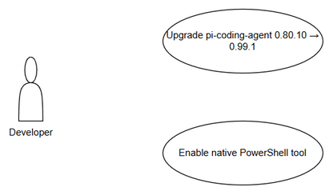
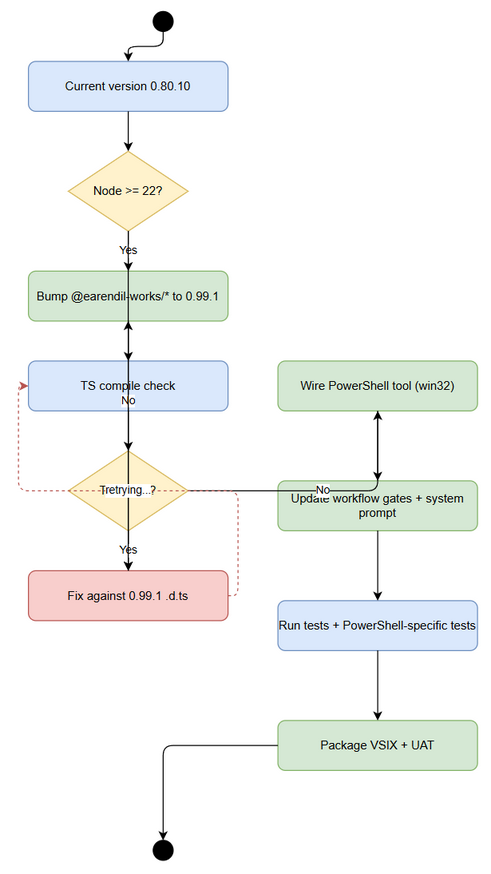

# Business Requirements Document (BRD)

## SA4E-336 — Upgrade pi-coding-agent 0.80.10 → 0.99.1 + native PowerShell tool

---

## Document Information

| Field | Value |
|-------|-------|
| Jira Ticket | SA4E-336 |
| Title | Upgrade pi-coding-agent 0.80.10 → 0.99.1 + native PowerShell tool |
| Author | BA Agent |
| Version | 1.0 |
| Date | 2026-09-30 |
| Status | Draft |

---

## Author Tracking

| Role | Name - Position | Responsibility |
|------|-----------------|----------------|
| Author | BA Agent | Create document |
| Peer Reviewer | To be assigned | Review document |

---

## Revision History

| Version | Date | Author | Changes |
|---------|------|--------|---------|
| 1.0 | 2026-09-30 | BA Agent | Initiate document — auto-generated from Jira ticket SA4E-336 and linked tickets |

---

## Sign-Off

| Name | Signature and date |
|------|--------------------|
| | ☐ I agree and confirm all criteria on this BRD as expected requirements |
| | ☐ I agree and confirm all criteria on this BRD as expected requirements |

---

## 1. Introduction

### 1.1 Scope

Upgrade pi-coding-agent from 0.80.10 to 0.99.1 to enable native PowerShell tool, replacing fragile Windows Git-Bash workaround. The upgrade requires bumping all @earendil-works/* packages to 0.99.1 in lockstep, wiring createPowerShellTool on Windows instead of createBashTool, updating workflow gates, system prompts, tool classification, and verification tests. Reference document: documents/UPGRADE-pi-0.99-powershell-tool.md. Epic: SA4E-289 — Migrate LangGraph Workflow Engine to Pi SDK.

### 1.2 Out of Scope

Node engine upgrade is out of scope unless 0.99.1 requires Node ≥22; confirmation needed before proceeding. No changes to non-Windows platforms beyond keeping bash. No functional changes to Pi SDK APIs beyond compatibility fixes.

### 1.3 Preliminary Requirement

No additional preliminary requirements identified. Pi SDK 0.99.1 must be compatible with current Node engine. Workspace must be on upgrade branch.

---

## 2. Business Requirements

### 2.1 High Level Process Map

The upgrade process involves dependency bump, API surface audit, PowerShell tool wiring, workflow gate updates, system prompt adaptation, session tool loadout adjustment, and UAT verification. High-level flow is shown in diagrams/use-case.png and diagrams/business-flow.png.

*[Edit in draw.io](diagrams/use-case.drawio)*

*[Edit in draw.io](diagrams/business-flow.drawio)*

### 2.2 List of User Stories / Use Cases

| # | Story / Use Case / Epic | Priority | Source Ticket |
|---|-------------------------|----------|---------------|
| 1 | As a developer, I want pi-coding-agent upgraded to 0.99.1 so that native PowerShell tool is available on Windows | MUST HAVE | SA4E-336 |
| 2 | As a developer, I want bash workaround removed on Windows so that path commands work natively with c:\ paths | MUST HAVE | SA4E-336 |
| 3 | As a QA engineer, I want automated verification tests to confirm PowerShell tool name and behavior so that regressions are prevented | SHOULD HAVE | SA4E-336 |
| 4 | As a product owner, I want workflow gates to classify powershell like bash for approval so that security policy remains consistent | MUST HAVE | SA4E-336 |

---

### 2.3 Details of User Stories

---

#### Business Flow

**Step 1:** Identify current pi-coding-agent version 0.80.10 and dependency cluster

**Step 2:** Bump all @earendil-works/* packages to 0.99.1 in root/package.json and extension/package.json

**Step 3:** Run TypeScript compile to detect API surface breakage

**Step 4:** Replace createBashTool with OS-aware shell selection: createPowerShellTool on win32, createBashTool otherwise

**Step 5:** Remove Git-Bash shellPath pin and normalizeBashCommandPaths spawnHook for Windows

**Step 6:** Update workflow gate READ_ONLY_TOOLS and DANGEROUS_TOOLS to include powershell

**Step 7:** Update system prompt to PowerShell dialect on Windows

**Step 8:** Update session tool loadout and classifyTool mapping

**Step 9:** Run unit tests and add powershell-specific tests

**Step 10:** Package VSIX, install, UAT with full project review

> **Note:** All changes must be done on a branch. High-risk major bump 0.80 → 0.99.

---

#### STORY 1: Upgrade pi-coding-agent to 0.99.1

> As a developer, I want pi-coding-agent upgraded to 0.99.1 so that native PowerShell tool is available on Windows

**Requirement Details:**

1. Upgrade @earendil-works/pi-coding-agent to 0.99.1
2. Upgrade peer packages @earendil-works/pi-agent-core, @earendil-works/pi-ai, @earendil-works/pi-tui, @earendil-works/chord, @earendil-works/pi-mcp, @earendil-works/pi-codemode to 0.99.1
3. Verify single resolved version with npm ls, no duplicate trees

**Data Fields (if applicable):**

| Field | Type | Required | Description | Example |
|-------|------|----------|-------------|---------|
| packageName | string | Yes | NPM package name | @earendil-works/pi-coding-agent |
| currentVersion | semver | Yes | Installed version | 0.80.10 |
| targetVersion | semver | Yes | Desired version | 0.99.1 |

**Acceptance Criteria:**

1. npm ls @earendil-works/pi-agent-core shows exactly one version 0.99.1
2. npx tsc --noEmit -p extension/tsconfig.json passes with 0 errors
3. No duplicate pi-agent-core instances exist

**UI Specifications (if applicable):**

N/A

**Validation Rules (if applicable):**

- Version must be semver compatible
- All @earendil-works/* packages must match version

**Error Handling (if applicable):**

- Type errors must be fixed against 0.99.1 .d.ts, no `as any` shortcuts

---

#### STORY 2: Enable native PowerShell tool on Windows

> As a developer, I want bash workaround removed on Windows so that path commands work natively with c:\ paths

**Requirement Details:**

1. In extension/src/pi-workflow/pi-coding-tools.ts createWorkspaceTools, select shellTool based on process.platform
2. On win32 use m.createPowerShellTool(workspaceRoot), else m.createBashTool(workspaceRoot)
3. Retire resolveGitBashPath and normalizeBashCommandPaths for Windows
4. Update system prompt to PowerShell dialect on Windows

**Acceptance Criteria:**

1. On win32, createWorkspaceTools returns tool named "powershell"
2. On non-win32, tool named "bash" is returned
3. PowerShell toolSystemPromptContribution is used
4. Path commands execute with c:\... without translation errors

**Validation Rules:**

- Tool name must be "powershell" on Windows
- No shellPath option passed to createPowerShellTool

**Error Handling:**

- If pwsh.exe not found, fallback to Windows PowerShell

---

#### STORY 3: Update workflow gates and classification

> As a product owner, I want workflow gates to classify powershell like bash for approval so that security policy remains consistent

**Requirement Details:**

1. Update pi-workflow-gate.ts READ_ONLY_TOOLS and DANGEROUS_TOOLS to include powershell
2. Update turn-budget-guard.ts buildFailureSteerCorrection to be shell-aware
3. Update StreamProtocolAdapter classifyTool to map powershell → shell
4. Update session tool loadout in pi-agent-session-host.ts

**Acceptance Criteria:**

1. Autopilot auto-approves read-only powershell operations
2. Destructive PowerShell commands require approval
3. UI renders TOOL powershell correctly

---

---

## 3. Dependencies

| Dependency | Type | Related Ticket | Description |
|------------|------|----------------|-------------|
| @earendil-works/pi-coding-agent 0.99.1 | System | SA4E-336 | Native PowerShell tool provider |
| @earendil-works/pi-agent-core 0.99.1 | System | SA4E-336 | Agent core APIs |
| Node engine compatibility | Infrastructure | SA4E-336 | Verify Node ≥22 if required |
| Epic SA4E-289 | Epic | SA4E-289 | Pi SDK migration |

---

## 4. Stakeholders

| Role | Name / Team | Responsibility | Source |
|------|-------------|----------------|--------|
| Reporter/Creator | Duc Nguyen Minh | Initiated upgrade | SA4E-336 |
| BA | BA Agent | BRD creation | SA4E-336 |

---

## 5. Risks and Assumptions

### 5.1 Risks

| Risk | Impact | Likelihood | Mitigation |
|------|--------|------------|------------|
| API surface breakage in 0.99.1 | High | Medium | Run tsc --noEmit, review .d.ts |
| Node engine incompatibility | High | Low | Verify engines.node before bump |
| Duplicate pi-agent-core instances | High | Medium | npm ls verification step |
| Test failures due to tool name change | Medium | Medium | Update tests for 'powershell' |

### 5.2 Assumptions

- PowerShell tool is available in pi-coding-agent 0.99.1
- Workspace uses Windows platform for PowerShell feature
- Existing bash workaround can be safely removed on Windows

---

## 6. Non-Functional Requirements

| Category | Requirement | Details |
|----------|-------------|---------|
| Performance | No regression in tool startup | Measure UAT |
| Security | Approval gates must cover powershell destructive commands | Same as bash |
| Scalability | N/A | |
| Availability | N/A | |

> If no non-functional requirements are identified from the tickets, state: "No specific non-functional requirements identified. To be confirmed with technical team."

---

## 7. Related Tickets

| Ticket Key | Summary | Status | Type | Relationship |
|------------|---------|--------|------|--------------|
| SA4E-336 | Upgrade pi-coding-agent 0.80.10 → 0.99.1 + native PowerShell tool | In Progress | Task | Main ticket |
| SA4E-289 | Migrate LangGraph Workflow Engine to Pi SDK (Option C) | In Progress | Epic | Epic |

---

## 8. Appendix

### Glossary

| Term | Definition |
|------|------------|
| pi-coding-agent | Earendil Works coding agent SDK |
| PowerShell tool | Native Windows PowerShell execution tool |
| Git-Bash workaround | Previous shellPath + spawnHook path translation |

### Reference Documents

| Document | Link / Location |
|----------|-----------------|
| Upgrade Guide | documents/UPGRADE-pi-0.99-powershell-tool.md |
| BRD Template | documents/templates/BRD-TEMPLATE.md |
