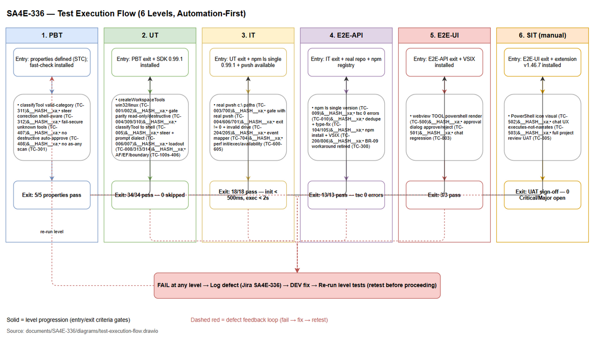
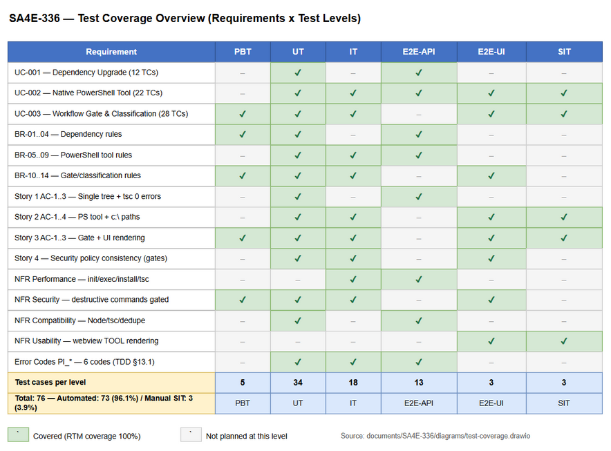

# Software Test Plan (STP)

## SDLC-Agents-4-Enterprise (pi-coding-agent) — SA4E-336: Upgrade pi-coding-agent 0.80.10 → 0.99.1 + native PowerShell tool

---

## Document Information

| Field | Value |
|-------|-------|
| Jira Ticket | SA4E-336 |
| Title | Upgrade pi-coding-agent 0.80.10 → 0.99.1 + native PowerShell tool |
| Author | QA Agent |
| Version | 1.2 |
| Date | 2026-10-01 |
| Status | Draft |
| Related BRD | documents/SA4E-336/BRD.md (v1.0) |
| Related FSD | documents/SA4E-336/FSD.md (v2.1) |
| Related TDD | documents/SA4E-336/TDD.md (v1.2) |

---

## Author Tracking

| Role | Name - Position | Responsibility |
|------|-----------------|----------------|
| Author | QA Agent – QA Engineer | Create document |
| Peer Reviewer | To be assigned – Business Analyst (BA) | Review business coverage |

---

## Revision History

| Version | Date | Author | Changes |
|---------|------|--------|---------|
| 1.0 | 2026-10-01 | QA Agent | Initiate document — auto-generated from BRD, FSD, and TDD |
| 1.1 | 2026-10-01 | QA Agent | Reconciled to TDD v1.1 per DISCREPANCY.md OPEN-2 — mode-scoped bash/gate assertions (TC-309/TC-606/TC-701/TC-804), fail-secure glossary §1.2/§2.3/§10.2 aligned to TDD v1.1 §1.4, +2 bash regression test cases (TC-807/TC-808 from TDD §11.3), test data CSV re-scoped |
| 1.2 | 2026-10-01 | QA Agent | Re-scoped to TDD v1.2 (allowlist-of-safe posture, SEC-02) + SECURITY-REVIEW.md. Removed "identical to bash"/"DANGEROUS_TOOL_PATTERNS for powershell" framing (§1.1/§2.2/§2.3). Added +10 security test cases (TC-110..115, TC-315, TC-410, TC-608, TC-609): destructive-category coverage, bypass-resistance, ordering invariant, malformed input, unwired getMode regression, allowlist authority, audit log, dependency supply-chain gate. Updated test counts (78 → 88), §2.6/§2.7 exit criteria, §3.1 security scope, glossary. Related TDD → v1.2. |

---

## Sign-Off

| Name | Signature and date |
|------|--------------------|
| | ☐ I agree and confirm the test plan in this STP |
| | ☐ I agree and confirm the test plan in this STP |

---

## 1. Introduction

### 1.1 Purpose

This Test Plan defines the test strategy, scope, schedule, and resources for verifying the upgrade of `@earendil-works/pi-coding-agent` from `0.80.10` to `0.99.1`, enabling the native `powershell` tool on Windows and replacing the fragile Git-Bash workaround (`shellPath` pin + `normalizeBashCommandPaths` spawnHook).

The verification covers five change areas defined in FSD §3:

1. **Dependency Upgrade** — all `@earendil-works/*` packages bumped to `0.99.1` in lockstep (FSD §3.1)
2. **Native PowerShell Tool** — OS-aware shell selection: `createPowerShellTool` on `win32`, `createBashTool` otherwise (FSD §3.2)
3. **Workflow Gate & Classification Update** — powershell gated by command content under an **allowlist-of-safe** posture (`DESTRUCTIVE_PS_PATTERNS` checked first, `READONLY_PS_PATTERNS` is the auto-approval authority, `normalizePsCommand` decode step), `classifyTool`, `buildFailureSteerCorrection`, session loadout (FSD §3.3, §3.5; TDD v1.2 §3.2/§7.3)
4. **System Prompt Update** — PowerShell dialect on Windows, bash dialect on non-Windows (FSD §3.4)
5. **Verification Tests** — PBT/UT/IT/E2E automation plus manual UAT (FSD §10)

### 1.2 Test Objectives

- Verify all functional requirements from FSD §3 are implemented correctly (UC-001, UC-002, UC-003)
- Validate all 14 business rules BR-01 → BR-14 are enforced (FSD §3.1.3, §3.2.3, §3.3.3)
- Confirm the PowerShell tool executes native Windows commands with `c:\...` paths without dialect translation errors
- Confirm security policy consistency (BRD Story 4; TDD v1.2 §7.2 allowlist-of-safe): PowerShell auto-approves ONLY on a positive `READONLY_PS_PATTERNS` match in **both** modes; destructive, empty, unrecognized, encoded, or obfuscated PowerShell commands require approval in **both** modes (`DESTRUCTIVE_PS_PATTERNS` checked first + deny-by-default, mode-independent); bash behavior is **NOT identical to PS** — unchanged from pre-upgrade (Supervised → pend, Autopilot → auto-approve non-destructive, BRD §1.2)
- Verify security-review findings SEC-01..SEC-10 (SECURITY-REVIEW.md): destructive-category coverage matrix, bypass-resistance matrix, ordering invariant, malformed-input fail-secure, unwired-mode regression, audit-log completeness, dependency supply-chain gate
- Verify all 10 BRD acceptance criteria (Stories 1–3) pass
- Verify non-functional requirements from FSD §8 are met with measurable targets (init < 500ms, exec < 2s, `tsc` 0 errors, no duplicate peers)
- Maximize automation (6 test levels: PBT, UT, IT, E2E-API, E2E-UI) so manual SIT is reduced to visual/UX-only verification
- Prevent regressions: existing tools, bash dialect on non-Windows, and existing vitest suite must keep passing

### 1.3 References

| Document | Location |
|----------|----------|
| BRD | documents/SA4E-336/BRD.md |
| FSD | documents/SA4E-336/FSD.md |
| TDD | documents/SA4E-336/TDD.md |
| Upgrade Guide | documents/UPGRADE-pi-0.99-powershell-tool.md |
| STP Template | documents/templates/STP-TEMPLATE.md |
| STC | documents/SA4E-336/STC.md |
| Test Data | documents/SA4E-336/testdata/*.csv |

---

## 2. Test Strategy

### 2.1 Test Levels

This is an extension-only upgrade (no REST API, no database). The 6-level strategy maps each level to what can be automated for this ticket:

| Level | Scope | Automation | Tools |
|-------|-------|------------|-------|
| PBT | Correctness properties (random inputs): fail-secure classification, shell-aware corrections, prompt normalization | Automated | fast-check + vitest |
| UT | Unit/edge case tests for 6 functions: `createWorkspaceTools`, `classifyToolCall`, `classifyTool`, `buildFailureSteerCorrection`, `buildWorkspaceSystemPrompt`, `getSessionToolLoadout` | Automated | vitest |
| IT | Integration with real pi-coding-agent 0.99.1 SDK + real pwsh.exe execution (in-process) | Automated | vitest + real SDK 0.99.1 + pwsh |
| E2E-API | SDK/build-level E2E: real npm/tsc/grep/VSIX commands on the real repo; tool creation/execution lifecycle; approval-decision checks (auth-equivalent) | Automated | vitest + exec (PowerShell) |
| E2E-UI | Webview UI E2E: TOOL event rendering, approval dialog interaction | Automated | vitest webview harness / Playwright |
| SIT | Manual exploratory / visual-only: icon rendering, chat UX, full project review UAT | Manual | VS Code/Kiro + Browser |

**Level prefixes used in STC:** PBT-01…, UT-01…, IT-01…, E2E-API-01…, E2E-UI-01…, SIT-01… (each maps 1:1 to a TC-NNN ID — see STC Test Case Summary).

### 2.2 Test Types

| Type | Description | Applicable |
|------|-------------|------------|
| Functional Testing | Verify features work per FSD use cases UC-001 → UC-003 | Yes |
| Regression Testing | Ensure existing tools, bash dialect, and existing vitest suite are not broken | Yes |
| Performance Testing | Verify tool init < 500ms, command execution < 2s, npm install < 120s, tsc < 60s (FSD §10.3) | Yes |
| Security Testing | Verify the allowlist-of-safe approval gate for PowerShell (destructive/unparseable/empty/unrecognized pend; only `READONLY_PS_PATTERNS` auto-approve) + SEC-01..SEC-10 findings (destructive-category coverage, bypass-resistance, ordering invariant, malformed input, audit log, supply-chain) — BRD Story 4, FSD §7.3, SECURITY-REVIEW.md, TDD v1.2 §3.2/§7.3/§8.4 | Yes |
| Usability Testing | Verify webview renders `TOOL powershell` correctly (OI-6, FSD §8 Usability) | Yes |
| Compatibility Testing | Verify Node 22.x engine, VS Code ^1.85.0, single resolved `pi-agent-core` | Yes |

### 2.3 Test Approach

- **Automation-first (risk-based):** the 0.80 → 0.99 major bump is high-risk; PBT + UT run first to catch API surface breakage cheaply, then IT with the real SDK 0.99.1, then E2E build-level verification, and only visual/UX checks remain manual.
- **Real dependencies over mocks:** IT tests use the real `pi-coding-agent@0.99.1` SDK and real `pwsh.exe`. Mocks are acceptable only for external services that cannot run locally (none in this ticket beyond SDK factory error injection in UT).
- **Fail-secure verification (allowlist-of-safe per TDD v1.2 §3.2/§8.4):** classification tests assert that (a) PowerShell auto-approves IFF the normalized command is understandable, non-destructive, AND matches `READONLY_PS_PATTERNS` — everything else (destructive, empty, unrecognized, encoded, obfuscated, malformed input) PENDS in BOTH modes (NFR-SEC-01/02, deny-by-default); (b) `DESTRUCTIVE_PS_PATTERNS` is checked FIRST and is mode-independent (BR-11); the powershell branch returns explicitly and never falls through to a read-only/Autopilot auto-approve (SEC-04 ordering invariant); (c) an unwired `getMode()` defaults to Supervised → pend (SEC-09); (d) non-powershell unknown tools are **unknown-safe** in `ToolApprovalClassifier` (pend under Supervised, auto-approve under Autopilot). Tests verify these outcomes against the TDD v1.2 §7.2 matrix — PowerShell has NO fail-open path and is NOT identical to bash.
- **Cross-platform matrix:** `win32` behavior verified on the Windows dev machine; non-`win32` behavior verified via platform mocking (`mockPlatform('linux')` helper — TDD §11.4) plus one manual SIT check if a Linux/mac machine is available.
- **Regression safety net:** the full existing vitest suite must pass before packaging (`vitest run` — TC-800).

### 2.4 E2E Automation Coverage

SIT scenarios classified per automation feasibility — goal: minimize manual SIT to visual/UX-only:

| SIT Scenario Type | Classify As | Rationale |
|-------------------|-------------|-----------|
| Tool creation lifecycle (create → execute → fallback) | **E2E-API** | Deterministic; real SDK + real commands |
| Approval-decision checks (auto-approve vs require-approval) | **E2E-API** | Decision logic verifiable without browser |
| Build verification (npm ls, tsc, VSIX packaging) | **E2E-API** | CLI commands, fully scriptable |
| Webview TOOL event rendering + approval dialog | **E2E-UI** | DOM-assertable via webview message protocol |
| PowerShell icon/label visual rendering (OI-6) | **SIT (manual)** | Needs human eyes on icon appearance |
| Chat UX: agent executes PowerShell instead of narrating | **SIT (manual)** | Behavioral judgment |
| Full project review UAT (TDD §12 Phase 7 step 40) | **SIT (manual)** | End-to-end human acceptance |

### 2.5 Entry Criteria

| Level | Entry Criteria |
|-------|---------------|
| PBT | Properties defined in STC; `fast-check` installed; branch checked out |
| UT | PBT passed; pi-coding-agent 0.99.1 installed; code compiles |
| IT | UT passed (100%); real SDK 0.99.1 resolved via `npm ls`; pwsh available on Windows |
| E2E-API | IT passed; real workspace repo available; npm registry accessible |
| E2E-UI | E2E-API passed; VSIX built and installed into VS Code/Kiro |
| SIT | E2E-UI passed; extension v1.46.7 installed; test workspace prepared |

### 2.6 Exit Criteria

| Level | Exit Criteria |
|-------|--------------|
| PBT | 100% properties pass (5/5) |
| UT | 100% tests pass (42/42); 0 skipped |
| IT | 100% tests pass (21/21); PowerShell init < 500ms; exec < 2s |
| E2E-API | 100% tests pass (14/14); `tsc --noEmit` 0 errors; single `pi-agent-core`; `npm audit` 0 High/Critical (SEC-07) |
| E2E-UI | 100% tests pass (3/3) |
| SIT | All 3 manual scenarios passed; UAT sign-off obtained; 0 Critical/Major defects open |

### 2.7 Test Cases Summary

| Level | Count | Automated | Manual |
|-------|-------|-----------|--------|
| PBT | 5 | 5 | 0 |
| UT | 42 | 42 | 0 |
| IT | 21 | 21 | 0 |
| E2E-API | 14 | 14 | 0 |
| E2E-UI | 3 | 3 | 0 |
| SIT | 3 | 0 | 3 |
| **Total** | **88** | **85 (96.6%)** | **3 (3.4%)** |

**Test Execution Flow:**


*[Edit in draw.io](diagrams/test-execution-flow.drawio)*

---

## 3. Test Scope

### 3.1 Features In Scope

| # | Feature / Story | Priority | FSD Reference | Test Type |
|---|----------------|----------|---------------|-----------|
| 1 | Dependency Upgrade — pi-coding-agent 0.80.10 → 0.99.1 (UC-001) | High | FSD §3.1 (BR-01, BR-02, BR-03, BR-04) | Functional, PBT, E2E-API |
| 2 | Native PowerShell Tool on Windows (UC-002) | High | FSD §3.2 (BR-05 → BR-09) | Functional, IT, E2E-API, E2E-UI, SIT |
| 3 | Workflow Gate & Classification Update — allowlist-of-safe for powershell (UC-003) | High | FSD §3.3 (BR-10 → BR-13); TDD v1.2 §3.2/§7.3 | Functional, PBT, UT, IT, E2E-UI, SIT |
| 3a | Security hardening — SEC-01..SEC-10 (destructive-category coverage, bypass-resistance, ordering invariant, malformed-input, audit log, supply-chain) | High | SECURITY-REVIEW.md; TDD v1.2 §7.3/§8.4/§9.1 | Security, UT, IT, E2E-API |
| 4 | System Prompt Update — PowerShell dialect (UC-002) | Medium | FSD §3.4 (BR-08) | Functional, IT |
| 5 | Session Tool Loadout Update (UC-003) | High | FSD §3.5 (BR-14) | Functional, IT |
| 6 | Non-Functional Requirements (FSD §8) | Medium | FSD §8, §10.3 | Performance, Security, Compatibility |
| 7 | Regression safety net — existing tools/bash/vitest suite | Medium | FSD §10, TDD §11 | Regression |

**Test Coverage Overview:**


*[Edit in draw.io](diagrams/test-coverage.drawio)*

### 3.2 Features Out of Scope

| # | Feature | Reason |
|---|---------|--------|
| 1 | Node engine upgrade | Out of scope per BRD §1.2 unless 0.99.1 requires Node ≥22 — resolved: root `package.json` already specifies `engines.node: 22.x` (TDD §15.2 Q1) |
| 2 | Non-Windows platform changes beyond keeping bash | BRD §1.2 — bash behavior must remain unchanged (verified by regression, not modified) |
| 3 | Pi SDK API functional changes beyond compatibility fixes | BRD §1.2 — 0.99.1 APIs used as-is |
| 4 | `backend/` (Hono) or `knowledge/` modules | FSD §1.2 — this ticket is extension-only |
| 5 | LangGraph workflow engine internals (non-tool paths) | Epic SA4E-289 covers Pi SDK migration separately; only tool classification/gates tested here |
| 6 | Model registry / context budgeting (SA4E-324/325/330) | Separate tickets, already tested and reviewed in their own cycle |

---

## 4. Test Environment

### 4.1 Environment Requirements

| Environment | Location | Database | Purpose |
|-------------|----------|----------|---------|
| DEV (automated) | Windows dev machine — `C:\projects\kiro\SDLC-Agents-4-Enterprise` | None (in-memory only) | PBT, UT, IT, E2E-API, E2E-UI |
| SIT/UAT | Same machine + VS Code/Kiro with extension v1.46.7 installed | None | Manual SIT, UAT |

| Component | Version | Required |
|-----------|---------|----------|
| OS | Windows 10/11 (win32) | Yes |
| Node.js | 22.x (per root `package.json` engines) | Yes |
| npm | 10.x | Yes |
| pi-coding-agent | 0.99.1 (all `@earendil-works/*` in lockstep) | Yes |
| pwsh (PowerShell Core) | 7.x (fallback: Windows PowerShell 5.1) | Yes |
| VS Code / Kiro | ^1.85.0 | Yes (E2E-UI, SIT) |
| draw.io CLI | installed at `C:\Program Files\draw.io\draw.io.exe` | No (evidence only) |

### 4.2 Browser / Device Requirements

| Browser | Version | OS | Required |
|---------|---------|-----|----------|
| Chromium (webview host) | Bundled with VS Code/Kiro | Windows | Yes — webview rendering tests (E2E-UI, SIT) |
| Playwright Chromium | Latest | Windows | No — optional for E2E-UI automation |

### 4.3 Test Data Requirements

| Data Type | Description | Source | Preparation |
|-----------|-------------|--------|-------------|
| Dependency versions | `0.80.10` (before), `0.99.1` (target) for 7 `@earendil-works/*` packages | testdata/dependency-upgrade-testdata.csv | Seed `package.json` per test case |
| PowerShell commands | Read-only (`Get-ChildItem`, `Get-Content`, `Test-Path`) and destructive (`Remove-Item -Recurse`, `Stop-Process`) with exact/lowercase/mixed-case variants | testdata/powershell-tool-testdata.csv | Used by IT + PBT directly |
| Workflow gate inputs | Tool names + commands + modes for approval decisions (allowlist-of-safe) | testdata/workflow-gate-testdata.csv | Used by UT/IT |
| Destructive catalog | One sample per destructive category (SEC-01) | testdata/destructive-catalog-testdata.csv | Used by UT (TC-110/TC-310) |
| Bypass vectors | Encode/iex/call-op/escape/concat/cmd/download+exec (SEC-03) | testdata/bypass-vectors-testdata.csv | Used by UT (TC-111/TC-410) |
| Safe allowlist | `READONLY_PS_PATTERNS` matches + smuggle negatives (SEC-02) | testdata/allowlist-safe-testdata.csv | Used by UT (TC-004/TC-315) |
| Malformed input | Renamed/missing/wrong-type `command` field (SEC-08) | testdata/malformed-input-testdata.csv | Used by UT (TC-113/TC-406) |
| Boundary values | Empty/relative/non-existent workspace roots, empty toolName/command, >260-char paths | testdata/powershell-tool-testdata.csv, testdata/workflow-gate-testdata.csv | Used by UT/IT |
| Session loadout expectations | Expected tool allowlists per platform | testdata/session-loadout-testdata.csv | Used by UT/IT |
| System prompt expectations | Expected dialect fragments per platform | testdata/system-prompt-testdata.csv | Used by UT |

### 4.4 External Dependencies

| System | Dependency | Mock/Stub Available |
|--------|-----------|---------------------|
| npm registry | Access to fetch `@earendil-works/*@0.99.1` | No — real registry required (E2E-API) |
| pi-coding-agent SDK 0.99.1 | `createPowerShellTool`, `createBashTool`, types | UT mocks factory errors only (TC-101, TC-203); IT uses real SDK |
| pwsh.exe / Windows PowerShell | Shell execution target | Real executable required; PW 5.1 fallback tested via SDK (TC-100) |
| VS Code/Kiro webview | UI rendering target | Real webview required (E2E-UI, SIT) |

---

## 5. Test Schedule

| Phase | Start Date | End Date | Duration | Milestone |
|-------|-----------|----------|----------|-----------|
| Test Planning | 2026-10-01 | 2026-10-01 | 0.5 day | STP + STC approved (BA review) |
| Test Data Preparation | 2026-10-01 | 2026-10-01 | 0.5 day | 13 CSV test data files ready |
| PBT + UT Execution | 2026-10-02 | 2026-10-02 | 0.5 day | 47 automated tests pass |
| IT Execution | 2026-10-02 | 2026-10-03 | 0.5 day | 21 integration tests pass |
| E2E-API + E2E-UI Execution | 2026-10-03 | 2026-10-03 | 0.5 day | 17 E2E tests pass |
| Defect Fix & Retest | 2026-10-04 | 2026-10-04 | 1 day | All Critical/Major fixed |
| SIT (Manual UAT) | 2026-10-06 | 2026-10-06 | 0.5 day | UAT sign-off |
| Go-Live (merge + package) | 2026-10-07 | 2026-10-07 | 0.5 day | VSIX packaged, ticket done |

---

## 6. Resources & Responsibilities

| Role | Name | Responsibility |
|------|------|---------------|
| Test Lead | QA Agent | Test planning, coordination, reporting |
| QA Engineer | QA Agent | Test case design, execution, defect reporting |
| BA | BA Agent | UAT support, acceptance criteria clarification, business-coverage review of STC/STP |
| Developer | DEV Agent | Bug fixing, unit test coverage, type fixes per 0.99.1 `.d.ts` |
| DevOps | DevOps Agent | VSIX packaging support, environment setup |
| Scrum Master | SM Agent | Orchestration, review gates, Jira updates |

| Tool | Purpose |
|------|---------|
| vitest ^4.1.8 | PBT, UT, IT, E2E-API test runner |
| fast-check | Property-based testing |
| PowerShell 7 (pwsh) | Real command execution in IT/E2E-API |
| Jira (SA4E-336) | Defect tracking |
| draw.io | Diagrams (test coverage, execution flow) |
| documents/SA4E-336/testdata/*.csv | Test data management |

---

## 7. Risk & Mitigation

| # | Risk | Impact | Likelihood | Mitigation |
|---|------|--------|------------|------------|
| 1 | API surface breakage in 0.99.1 (`BeforeToolCallContext`, `AgentEvent`, `ToolDefinition` — TDD OI-3/4/5) | High | Medium | PBT + UT + `tsc --noEmit` run first (TC-010); review `.d.ts`; no `as any` (TC-301) |
| 2 | Duplicate `pi-agent-core` instances after bump | High | Medium | `npm ls` verification (TC-009, TC-303); `npm dedupe` fallback (TC-104) |
| 3 | New transitive deps (`chord`, `pi-mcp`, `pi-codemode`) conflict | Medium | Medium | Covered by `npm install` success test (TC-200) + version consistency (TC-300) |
| 4 | Test failures due to tool name change (bash → powershell) | Medium | High | All tests updated for `powershell` per STC; regression suite (TC-800 → TC-806) |
| 5 | pwsh.exe not found on target machine | Medium | Low | PW 5.1 fallback verified (TC-100); bash fallback verified (TC-101, TC-203) |
| 6 | Platform-specific behavior untestable on single OS | Medium | Medium | `mockPlatform()` helper (TDD §11.4) for non-win32 paths; 1 manual SIT if Linux available |
| 7 | Timeline compression (upgrade is on critical path for Epic SA4E-289) | Medium | Low | Automation-first strategy: 96.6% automated; manual SIT limited to 3 scenarios |
| 8 | Denylist incompleteness / bypass (SEC-01/03) undermines gate | High | Medium | Allowlist-of-safe posture (SEC-02) — gate relies on positive `READONLY_PS_PATTERNS` not denylist completeness; destructive-category matrix (TC-110) + bypass-resistance matrix (TC-111) + normalization (TC-410) |
| 9 | New transitive deps (`chord`, `pi-mcp`, `pi-codemode`) RCE/supply-chain risk (SEC-07) | High | Medium | Blocking DEV gate: `npm audit`, exact pins, single-version, `pi-codemode` capability + egress check (TC-609) |

---

## 8. Defect Management

### 8.1 Severity Levels

| Severity | Definition | Example |
|----------|-----------|---------|
| Critical | Extension crash, PowerShell tool completely unavailable, security gate bypass | Destructive PowerShell command auto-approved (AF-2 UC-003) |
| Major | Feature not working, workaround exists | `createWorkspaceTools` returns `bash` on win32; `classifyTool("powershell")` returns wrong category |
| Minor | UI issue, cosmetic defect | PowerShell icon renders slightly misaligned in webview |
| Trivial | Typo, minor alignment issue | Dialect guidance message typo |

### 8.2 Priority Levels

| Priority | Definition | SLA (Fix Time) |
|----------|-----------|----------------|
| P1 | Must fix immediately | 4 hours |
| P2 | Must fix before release | 1 business day |
| P3 | Should fix if time permits | 3 business days |
| P4 | Nice to fix, can defer | Next release |

### 8.3 Defect Lifecycle

```
New → Open → In Progress → Fixed → Ready for Retest → Verified → Closed
                                                      → Reopened → In Progress
```

### 8.4 SLA by Severity

| Severity | Fix SLA | Retest SLA |
|----------|---------|------------|
| Critical | 4 hours | Same day |
| Major | 1 business day | 1 business day |
| Minor | 3 business days | On next run |
| Trivial | Next release | On next run |

---

## 9. Test Metrics & Reporting

### 9.1 Metrics

| Metric | Formula | Target |
|--------|---------|--------|
| Test Execution Rate | Executed / Total × 100% | 100% (88/88) |
| Pass Rate | Passed / Executed × 100% | ≥ 95% |
| Defect Density | Defects / Test Cases | ≤ 0.1 |
| Critical Defect Count | Count of Critical severity | 0 |
| Defect Fix Rate | Fixed / Total Defects × 100% | ≥ 90% |
| Requirements Coverage | Covered requirements / Total requirements × 100% | 100% (RTM in STC §10) |
| Automation Coverage | Automated / Total × 100% | ≥ 95% (achieved: 96.6%) |
| PowerShell fallback rate | Fallback events / total PS tool creations | < 5% (FSD §8.3) |

### 9.2 Reporting Schedule

| Report | Frequency | Audience |
|--------|-----------|----------|
| Test Execution Status (TEST-REPORT CSV) | Per run | SM + project team |
| Defect Summary | Daily during fix cycle | DEV + SM |
| Test Completion Report | End of SIT/UAT | All stakeholders |

---

## 10. Appendix

### 10.1 Diagram Index

| # | Diagram | Source File (.drawio) | PNG | Embedded In |
|---|---------|----------------------|-----|-------------|
| 1 | Test Coverage Overview | documents/SA4E-336/diagrams/test-coverage.drawio | diagrams/test-coverage.png | STP §3.1 |
| 2 | Test Execution Flow | documents/SA4E-336/diagrams/test-execution-flow.drawio | diagrams/test-execution-flow.png | STP §2.7 |
| 3 | Use Case Diagram (existing) | documents/SA4E-336/diagrams/use-case.drawio | diagrams/use-case.png | BRD §2.1 |
| 4 | Business Flow (existing) | documents/SA4E-336/diagrams/business-flow.drawio | diagrams/business-flow.png | BRD §2.1 |
| 5 | Architecture (existing, TDD) | documents/SA4E-336/diagrams/architecture.drawio | diagrams/architecture.png | TDD §2.1 |
| 6 | Component Diagram (existing, TDD) | documents/SA4E-336/diagrams/component.drawio | diagrams/component.png | TDD §2.2 |
| 7 | Class Diagram (existing, TDD) | documents/SA4E-336/diagrams/class-diagram.drawio | diagrams/class-diagram.png | TDD §5.4 |
| 8 | Sequence — PowerShell creation (existing, TDD) | documents/SA4E-336/diagrams/sequence-upgrade.drawio | diagrams/sequence-upgrade.png | TDD §6.1 |
| 9 | Sequence — Gates (existing, TDD) | documents/SA4E-336/diagrams/sequence-gates.drawio | diagrams/sequence-gates.png | FSD §3.3 |

### 10.2 Glossary

| Term | Definition |
|------|------------|
| PBT | Property-Based Testing (fast-check, random inputs) |
| UT | Unit Testing |
| IT | Integration Testing (real SDK + real pwsh, in-process) |
| E2E-API | SDK/build-level end-to-end testing (real commands on real repo) |
| E2E-UI | Webview UI end-to-end testing |
| SIT | System Integration Testing (manual, visual/UX only) |
| UAT | User Acceptance Testing |
| STP | Software Test Plan |
| STC | Software Test Cases |
| RTM | Requirements Traceability Matrix |
| pwsh | PowerShell Core (cross-platform); falls back to Windows PowerShell 5.1 |
| Git-Bash workaround | Previous `shellPath` pin + `normalizeBashCommandPaths` spawnHook translating `c:\` → `/c/` |
| Fail-secure | Allowlist-of-safe for powershell (TDD v1.2 §3.2/§8.4): a PS command auto-approves IFF understandable + non-destructive + matches `READONLY_PS_PATTERNS`; everything else (destructive, empty, unrecognized, encoded, obfuscated, malformed) PENDS in BOTH modes (deny-by-default, no fail-open path — NFR-SEC-01/02). Destructive check runs FIRST, mode-independent (BR-11); unwired `getMode()` → Supervised → pend (SEC-09). Non-powershell unknown tools are **unknown-safe** (pend under Supervised, auto-approve under Autopilot — deliberate MCP design) |
| Allowlist-of-safe | SEC-02 posture (TDD v1.2 §3.2): `READONLY_PS_PATTERNS` is the sole authority for powershell auto-approval; a denylist (`DESTRUCTIVE_PS_PATTERNS`) is a defense-in-depth fast-path + audit attribution, not the correctness basis |
| normalizePsCommand | SEC-03 normalization (TDD §7.3.1): decodes `-EncodedCommand`/`-enc`/`-e`, strips backtick/caret escapes, collapses whitespace, lower-cases; `decoded=false` for undecodable/obfuscated commands → fail-secure pend |

### 10.3 Assumptions

- PowerShell tool is available in pi-coding-agent 0.99.1 (BRD §5.2)
- Workspace uses Windows platform for PowerShell feature; non-win32 verified via platform mocking
- Existing bash workaround can be safely removed on Windows (BRD §5.2)
- npm registry access is available for the 0.99.1 dependency fetch
- All `@earendil-works/*` packages release 0.99.1 in lockstep (single resolved version achievable)
