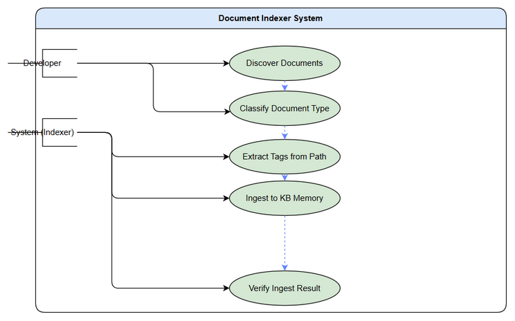
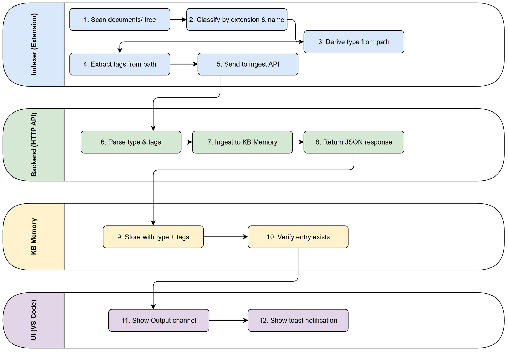

# Business Requirements Document (BRD)

## SA4E-337 — Document Indexer: Index không ingest vào KB Memory + thiếu tags

---

## Document Information

| Field | Value |
|-------|-------|
| Jira Ticket | SA4E-337 |
| Title | Document Indexer: Index khong ingest vao KB Memory + thieu tags |
| Author | BA Agent |
| Version | 1.0 |
| Date | 2026-10-04 |
| Status | Draft |

---

## Author Tracking

| Role | Name - Position | Responsibility |
|------|-----------------|----------------|
| Author | BA Agent – Business Analyst | Create document |
| Peer Reviewer | SA Agent – System Analyst | Review document |

---

## Revision History

| Version | Date | Author | Changes |
|---------|------|--------|---------|
| 1.0 | 2026-10-04 | BA Agent | Initiate document — auto-generated from Jira ticket SA4E-337 |

---

## Sign-Off

| Name | Signature and date |
|------|--------------------|
| | ☐ I agree and confirm all criteria on this BRD as expected requirements |
| | ☐ I agree and confirm all criteria on this BRD as expected requirements |

---

## 1. Introduction

### 1.1 Scope

This BRD defines the requirements for fixing the Document Indexer component of the SDLC Agents 4 Enterprise system. The Indexer discovers workspace documents but fails to ingest them into KB Memory — it detects 1727 files but only 3 entries exist in KB Memory. The root cause is in `handleIngestDocsFromTemp` which hardcodes document type as `CONTEXT`, does not pass tags, and does not verify ingest results. The fix includes: deriving document type from file path, extracting tags from path, verifying ingest results, and processing `.drawio` files.

**In scope:**
- Fix type derivation logic (hardcoded CONTEXT → infer from file path)
- Fix tag extraction (none → extract from path structure)
- Fix ingest result verification (none → parse JSON response)
- Add `.drawio` file support to document walk
- Add fallback tag extraction for edge cases
- Update UI to show indexing results

**Out of Scope:**
- Changes to the backend Knowledge Service API
- Changes to the Pega rule indexing pipeline
- Changes to the Jira project indexing pipeline
- Code refactoring unrelated to the indexing/ingest flow

### 1.3 Preliminary Requirement

- The `IndexingService` and `DocumentIndexer` modules must be accessible for modification
- The `IndexerHttpClient.ingestDocuments` API must support type and tags parameters
- The KB Memory backend must accept `type` and `tags` fields in the ingest payload
- Existing UT tests (UT-010..017, IT-009..012) must pass after changes

---

## 2. Business Requirements

### 2.1 High Level Process Map

The document indexing workflow follows these steps:

1. **Workspace Scan** — Indexer walks the `documents/` directory tree, discovering all indexable files
2. **File Classification** — Each file is classified by extension (format) and by filename pattern (document type)
3. **Type Derivation** — Document type is inferred from the filename (e.g., `BRD.md` → `REQUIREMENT`, `FSD.docx` → `REQUIREMENT`, `TDD.pdf` → `ARCHITECTURE`)
4. **Tag Extraction** — Tags are extracted from the folder path structure (e.g., `documents/SA4E-337/` → ticket tag `SA4E-337`)
5. **Ingest to KB** — Documents are sent to the backend `ingestDocuments` API with type and tags
6. **Result Verification** — The ingest response is parsed and verified; failures are logged
7. **UI Display** — Results are shown in the VS Code Output channel and via information message


*[Edit in draw.io](diagrams/use-case.drawio)*


*[Edit in draw.io](diagrams/business-flow.drawio)*

### 2.2 List of User Stories / Use Cases

| # | Story / Use Case / Epic | Priority | Source Ticket |
|---|-------------------------|----------|---------------|
| 1 | As a developer, I want document types to be automatically derived from file names so that documents are correctly classified without manual configuration | MUST HAVE | SA4E-337 |
| 2 | As a developer, I want tags to be automatically extracted from the folder path so that KB entries are searchable by ticket and project | MUST HAVE | SA4E-337 |
| 3 | As a developer, I want ingest results to be verified so that I can confirm documents were successfully indexed into KB Memory | MUST HAVE | SA4E-337 |
| 4 | As a developer, I want drawio diagram files to be included in the document index so that design artifacts are discoverable | SHOULD HAVE | SA4E-337 |
| 5 | As a developer, I want a fallback tag extraction mechanism so that documents without clear path-based tags still get indexed | SHOULD HAVE | SA4E-337 |
| 6 | As a user, I want the indexing UI to display results so that I can verify the indexing completed successfully | MUST HAVE | SA4E-337 |

---

### 2.3 Details of User Stories

---

#### Business Flow

```
Workspace Scan → File Classification → Type Derivation → Tag Extraction → Ingest to KB → Result Verification → UI Display
```

**Step 1:** The Indexer scans the `documents/` directory recursively, discovering all files with indexable extensions (`.md`, `.docx`, `.pdf`, `.drawio`, etc.).

**Step 2:** Each discovered file is classified by its extension (format) and by its base filename pattern (document type). Known patterns: `BRD*` → REQUIREMENT, `FSD*` → REQUIREMENT, `TDD*` → ARCHITECTURE, `STP*` → PROCEDURE, etc. Unknown patterns default to CONTEXT.

**Step 3:** Document type is derived from the filename by matching against known document type patterns (BRD, FSD, TDD, STP, STC, DPG, RLN, UG, TEST-REPORT, DISCREPANCY, SECURITY-REPORT). If no match, the type defaults to CONTEXT.

**Step 4:** Tags are extracted from the folder path. The folder name immediately under `documents/` is treated as the ticket key (e.g., `documents/SA4E-337/` → tag `SA4E-337`). If the folder name does not match a ticket key pattern, a fallback tag extraction uses the parent directory name.

**Step 5:** Documents are sent to the backend `ingestDocuments` API with the derived type and extracted tags. The API returns a JSON response with ingestion status.

**Step 6:** The ingest result is verified by parsing the JSON response. Success/failure counts are computed and any unconvertible files are reported.

**Step 7:** Results are displayed in the VS Code Output channel ("SDLC Indexing") and via an information message toast. The user can click "Open Output" to view details.

> **Note:** The denylisted folders (`diagrams`, `testdata`, `templates`, `node_modules`, `.git`) are excluded from scanning. Hidden folders (starting with `.`) are also excluded.

---

#### STORY 1: Derive document type from file path (Bug Fix #1)

> **User Story:** As a developer, I want document types to be automatically derived from file names so that documents are correctly classified without manual configuration.

**Requirement Details:**
- Replace the hardcoded `type = "CONTEXT"` in `handleIngestDocsFromTemp` with `inferTypeFromPath(fileName)`
- The function matches the base filename (without extension, uppercased) against known document type patterns: `BRD`, `FSD`, `TDD`, `STP`, `STC`, `DPG`, `RLN`, `UG`, `TEST-REPORT`, `DISCREPANCY`, `SECURITY-REPORT`
- Matching rules: exact match, or starts with `{KEY}-`, or starts with `{KEY}_`, or starts with `{KEY}`
- If no match, default to `CONTEXT`
- The `DOCUMENT_TYPES` mapping table must be maintained in a single source of truth

**Data Fields:**

| Field | Type | Required | Description | Example |
|-------|------|----------|-------------|---------|
| fileName | string | Yes | The full filename of the discovered document | `BRD.md`, `FSD-v2-SA4E-337.docx` |
| baseName | string | Yes | Filename without extension, uppercased | `BRD`, `FSD-V2-SA4E-337` |
| docType | string | Yes | Derived document type | `REQUIREMENT`, `ARCHITECTURE`, `PROCEDURE`, `CONTEXT` |

**Acceptance Criteria:**

1. `BRD.md` → type = `REQUIREMENT`
2. `FSD.docx` → type = `REQUIREMENT`
3. `TDD.pdf` → type = `ARCHITECTURE`
4. `STP.xlsx` → type = `PROCEDURE`
5. `meeting-notes.docx` → type = `CONTEXT` (no matching pattern)
6. `TDD-v1-KSA-26.docx` → type = `ARCHITECTURE` (prefix match)
7. `BRD_STORY_8.md` → type = `REQUIREMENT` (underscore separator match)

**UI Specifications:**

| No. | Name | Type | Required | Description | Note |
|-----|------|------|----------|-------------|------|
| 1 | Output Channel | VS Code Output Channel | Yes | Displays indexing results including type for each file | "SDLC Indexing" channel |

**Validation Rules:**
- File extension must be in the INDEXABLE_EXTENSIONS set before type inference is attempted
- Type inference is case-insensitive (filename is uppercased before matching)

**Error Handling:**
- If type inference fails for any reason, default to `CONTEXT` (never fail the entire ingest)

---

#### STORY 2: Extract tags from folder path (Bug Fix #2)

> **User Story:** As a developer, I want tags to be automatically extracted from the folder path so that KB entries are searchable by ticket and project.

**Requirement Details:**
- Replace the empty/no tags in `handleIngestDocsFromTemp` with `extractTagsFromPath(relativePath, ticket)`
- The folder name immediately under `documents/` is the primary tag (ticket key pattern: `{PROJECT}-{NUMBER}`)
- If the folder name does not match a ticket key pattern, use the folder name as a generic tag
- Tags are passed as an array to the ingest API
- If no tags can be extracted, apply `fallbackTagExtraction()` which uses the parent directory name

**Data Fields:**

| Field | Type | Required | Description | Example |
|-------|------|----------|-------------|---------|
| relativePath | string | Yes | Path relative to `documents/` root | `SA4E-337/BRD.md` |
| ticket | string | Yes | Ticket key extracted from folder name | `SA4E-337` |
| tags | string[] | Yes | Array of extracted tags | `["SA4E-337", "REQUIREMENT"]` |

**Acceptance Criteria:**

1. File at `documents/SA4E-337/BRD.md` → tags = `["SA4E-337"]`
2. File at `documents/SA4E-337/diagrams/use-case.drawio` → tags = `["SA4E-337"]` (drawio now included)
3. File at `documents/GRAPH-EMAIL/BRD.md` → tags = `["GRAPH-EMAIL"]` (non-ticket folder name still works)
4. File at `documents/overview.md` (root level) → tags = `["documents"]` (fallback)

**UI Specifications:**

| No. | Name | Type | Required | Description | Note |
|-----|------|------|----------|-------------|------|
| 1 | Tag Display | VS Code Output Channel | Yes | Shows tags associated with each indexed file | Included in indexing summary |

**Validation Rules:**
- Tags must be non-empty arrays (always at least one tag per document)
- Ticket key pattern: `{PROJECT}-{NUMBER}` where PROJECT is uppercase letters and NUMBER is digits

**Error Handling:**
- If tag extraction fails, use `fallbackTagExtraction()` with the parent directory name
- Never ingest a document with zero tags

---

#### STORY 3: Verify ingest result (Bug Fix #3)

> **User Story:** As a developer, I want ingest results to be verified so that I can confirm documents were successfully indexed into KB Memory.

**Requirement Details:**
- Parse the JSON response from `IndexerHttpClient.ingestDocuments()`
- Extract success/failure counts from the response
- Log any unconvertible files with reasons
- Return a structured summary including ingested count, converted count, and skipped count
- The `buildSummary` method formats the results for display

**Data Fields:**

| Field | Type | Required | Description | Example |
|-------|------|----------|-------------|---------|
| totalDiscovered | number | Yes | Total files found by discovery | 1727 |
| directIngested | number | Yes | Markdown + text files ingested directly | 150 |
| serverConverted | number | Yes | Binary files converted by server | 25 |
| skipped | number | Yes | Binary files the server could not convert | 5 |
| apiSummary | string | Yes | Summary text from the API response | "✅ 175/180 documents ingested" |

**Acceptance Criteria:**

1. After indexing, the Output channel shows: total discovered, direct ingested, converted, skipped
2. If server returns unconvertible files, they are listed with reasons
3. The summary line shows the API's overall result
4. If API returns an error, the error is logged and the user is notified

**UI Specifications:**

| No. | Name | Type | Required | Description | Note |
|-----|------|------|----------|-------------|------|
| 1 | Summary Title | VS Code Output Channel | Yes | Title matching selected operations | "Workspace Indexing Summary" |
| 2 | Results List | VS Code Output Channel | Yes | Line-by-line results per file | Includes emoji indicators (✅, ⚠️, 📤) |
| 3 | Next Steps | VS Code Output Channel | Yes | Post-indexing guidance | Lists what happens next for each option |
| 4 | Information Toast | VS Code Notification | Yes | "📋 Indexing complete — see Output panel." | With "Open Output" action button |

**Validation Rules:**
- The API response must be valid JSON; if parsing fails, treat as failure
- Unconvertible files must have a `reason` field in the response
- Skipped count = binary docs - serverConverted (never negative)

**Error Handling:**
- If API returns non-OK status, log error and show warning in Output channel
- If JSON parsing fails, show "⚠️ Could not parse ingest response" in Output channel
- If no files are discovered, return "ℹ️ No documents found in documents/ folder"

---

#### STORY 4: Include drawio files in document indexing (Bug Fix #4)

> **User Story:** As a developer, I want drawio diagram files to be included in the document index so that design artifacts are discoverable.

**Requirement Details:**
- Add `.drawio` to the `INDEXABLE_EXTENSIONS` set in `indexer-discovery.ts`
- Ensure `.drawio` files are discovered during recursive directory scanning
- `.drawio` files are treated as binary documents (server-side conversion)
- The `FOLDER_DENYLIST` excludes the `diagrams/` folder, but `.drawio` files inside it should still be indexed when not in a denylisted folder
- Note: The `diagrams` folder denylist means files directly under `documents/{TICKET}/diagrams/` are excluded, but `.drawio` files at other locations are included

**Data Fields:**

| Field | Type | Required | Description | Example |
|-------|------|----------|-------------|---------|
| extension | string | Yes | File extension | `.drawio` |
| format | string | Yes | Format identifier | `drawio` |
| type | string | Yes | Document type (always CONTEXT for .drawio) | `CONTEXT` |

**Acceptance Criteria:**

1. `.drawio` files are discovered during directory scan
2. `.drawio` files are classified as format `drawio` and type `CONTEXT`
3. `.drawio` files in denylisted folders (`diagrams`, `testdata`, `templates`) are excluded
4. `.drawio` files are sent to the server for conversion (binary docs path)

**UI Specifications:**

| No. | Name | Type | Required | Description | Note |
|-----|------|------|----------|-------------|------|
| 1 | Server Converted Count | VS Code Output Channel | Yes | Number of binary files converted by server | Includes .drawio files |

**Validation Rules:**
- `.drawio` extension must be added to `INDEXABLE_EXTENSIONS`
- `.drawio` files must pass the denylist check (not in `diagrams/`, `testdata/`, `templates/`, `node_modules/`, `.git/`)

**Error Handling:**
- If `.drawio` file cannot be read, skip it and log warning
- If server cannot convert `.drawio`, it appears in the unconvertible list with reason

---

#### STORY 5: Fallback tag extraction (Bug Fix #5)

> **User Story:** As a developer, I want a fallback tag extraction mechanism so that documents without clear path-based tags still get indexed.

**Requirement Details:**
- If `extractTagsFromPath()` cannot extract a ticket-key-pattern tag from the folder name, use `fallbackTagExtraction()`
- The fallback uses the immediate parent folder name as the tag
- If the parent folder is `documents` itself (file at root), use `documents` as the tag
- Fallback tags are always applied as a secondary tag alongside any primary tag

**Data Fields:**

| Field | Type | Required | Description | Example |
|-------|------|----------|-------------|---------|
| parentFolder | string | Yes | Immediate parent folder name | `SA4E-337`, `attachments` |
| fallbackTag | string | Yes | Tag derived from parent folder | `attachments` |

**Acceptance Criteria:**

1. File at `documents/SA4E-337/BRD.md` → primary tag `SA4E-337`, no fallback needed
2. File at `documents/SA4E-337/attachments/spec.pdf` → tags = `["SA4E-337", "attachments"]`
3. File at `documents/overview.md` → tags = `["documents"]` (root level fallback)

**UI Specifications:**

| No. | Name | Type | Required | Description | Note |
|-----|------|------|----------|-------------|------|
| 1 | Fallback Tag Indicator | VS Code Output Channel | No | Indicates when fallback tag is used | Shown in debug/detail mode |

**Validation Rules:**
- Fallback tag must be a non-empty string
- Fallback tag must not duplicate an already-extracted tag
- Fallback tag must not be a denylisted folder name

**Error Handling:**
- If fallback also fails, use `["unknown"]` as the tag (always at least one tag)

---

#### STORY 6: Updated UI to show indexing results (Bug Fix #6)

> **User Story:** As a user, I want the indexing UI to display results so that I can verify the indexing completed successfully.

**Requirement Details:**
- Update `showIndexResults()` in `indexer.ts` to display document indexing results
- The summary title matches the selected operations (e.g., "Document Indexing Summary", "Workspace Indexing Summary")
- Results are appended to the "SDLC Indexing" Output channel
- Next steps are shown for each selected operation
- An information message toast appears with "Open Output" action

**Data Fields:**

| Field | Type | Required | Description | Example |
|-------|------|----------|-------------|---------|
| summaryTitle | string | Yes | Title based on selected options | "Document Indexing Summary" |
| results | string[] | Yes | Array of result lines from each operation | `["✅ Documents: 15 discovered", ...]` |
| options | string[] | Yes | Selected indexing options | `["documents", "code", "sync"]` |

**Acceptance Criteria:**

1. Output channel shows the summary title matching selected operations
2. Each operation's results are displayed line by line
3. Next steps section shows guidance for each selected operation
4. Information toast appears after indexing completes
5. Clicking "Open Output" opens the Output channel
6. Salesforce project detection shows additional SF-specific summary when detected

**UI Specifications:**

| No. | Name | Type | Required | Description | Note |
|-----|------|------|----------|-------------|------|
| 1 | Output Channel | VS Code Output Channel | Yes | "SDLC Indexing" channel with full results | Auto-shown during indexing |
| 2 | Information Toast | VS Code Notification | Yes | "📋 Indexing complete — see Output panel." | With "Open Output" button |
| 3 | Salesforce Summary | VS Code Output Channel | Conditional | SF-specific component counts | Only when SFDX project detected |

**Validation Rules:**
- The toast only appears after indexing completes (not during)
- The "Open Output" button must open the correct Output channel
- Results must be appended atomically to avoid interleaving with other output

**Error Handling:**
- If Output channel creation fails, results are still returned but not displayed
- If toast display fails, results are still in the Output channel

---

## 3. Dependencies

| Dependency | Type | Related Ticket | Description |
|------------|------|----------------|-------------|
| IndexerHttpClient.ingestDocuments API | System | SA4E-337 (self) | Must support type and tags parameters in ingest payload |
| KB Memory Backend | System | SA4E-85 | Knowledge Service must accept type and tags fields |
| VS Code Output Channel API | Infrastructure | N/A | Used for displaying indexing results |
| IndexingService concurrency guard | System | SA4E-300 | IndexingService must handle concurrent indexing requests |
| Backend TaskWorker | System | SA4E-101 | Progress polling for LLM analysis status |
| Pega Indexing pipeline | System | SA4E-230 | Pega code intelligence discovery must not be affected |

---

## 4. Stakeholders

| Role | Name / Team | Responsibility | Source |
|------|-------------|----------------|--------|
| Reporter | Duc Nguyen Minh | Bug report, requirements validation | Jira Reporter |
| Developer | DEV Agent | Implementation of bug fixes | Jira Assignee (TBD) |
| System Analyst | SA Agent | Technical specification, TDD | SDLC Pipeline |
| QA Agent | QA Agent | Test planning, STC/STP | SDLC Pipeline |
| Scrum Master | SM Agent | Orchestration, status tracking | SDLC Pipeline |

---

## 5. Risks and Assumptions

### 5.1 Risks

| Risk | Impact | Likelihood | Mitigation |
|------|--------|------------|------------|
| Ingest API does not accept type/tags parameters | High | Medium | Verify API contract with backend team before implementation; add API adapter if needed |
| Type inference misclassifies documents | Medium | Low | Maintain comprehensive DOCUMENT_TYPES mapping; add UT tests for edge cases |
| Tag extraction from path fails for non-standard folder structures | Medium | Medium | Fallback mechanism ensures at least one tag per document |
| .drawio files are large and slow indexing | Low | Low | Binary docs are server-side converted; progress reporting already exists |
| Existing UT tests break after changes | Medium | Low | Run full test suite after changes; UT-010..017, IT-009..012 cover the affected logic |

### 5.2 Assumptions

- The `IndexerHttpClient.ingestDocuments` method can accept `type` and `tags` in the document payload
- The KB Memory backend can store and index documents with custom type and tags
- The folder structure under `documents/` follows the convention `documents/{TICKET-KEY}/`
- The existing `INDEXABLE_EXTENSIONS` set is the authoritative list of file types to index
- The `FOLDER_DENYLIST` correctly identifies folders that should never be indexed

---

## 6. Non-Functional Requirements

| Category | Requirement | Details |
|----------|-------------|---------|
| Performance | Indexing 1727 files must complete in under 5 minutes | Current discovery is fast; ingest latency depends on backend API |
| Scalability | Must handle workspaces with 5000+ files | Recursive BFS scan is O(n); no recursive depth limits |
| Reliability | Ingest verification must detect and report failures | Parse JSON response; log unconvertible files with reasons |
| Security | No unauthorized file access | Only files under `documents/` root are scanned; denylist prevents access to config dirs |
| Maintainability | Type mapping in single source of truth | `DOCUMENT_TYPES` constant in `indexer-discovery.ts` |
| Usability | UI must clearly show indexing results | Output channel + toast notification with action button |
| Testability | All 6 bug fixes must have corresponding UT/IT coverage | UT-010..017, IT-009..012 already cover document discovery |

---

## 7. Related Tickets

| Ticket Key | Summary | Status | Type | Relationship |
|------------|---------|--------|------|--------------|
| SA4E-337 | Document Indexer: Index khong ingest vao KB Memory + thieu tags | In Progress | Bug | Main ticket |
| SA4E-85 | Knowledge Service: threads/checkpoints/agents REST API | — | Epic | Backend dependency |
| SA4E-300 | IndexingService concurrency guard + polling | — | Task | System dependency |
| SA4E-230 | Pega CodeIntelligence discovery | — | Feature | System dependency |
| SA4E-101 | TaskWorker progress polling | — | Task | System dependency |

---

## 8. Appendix

### Diagram Index

| Diagram | Type | File | Description |
|---------|------|------|-------------|
| Use Case Diagram | UML Use Case | `diagrams/use-case.drawio` | Actors and use cases for document indexing |
| Business Flow Swimlane | Swimlane | `diagrams/business-flow.drawio` | End-to-end flow across Indexer, Backend, KB Memory, UI |

### Glossary

| Term | Definition |
|------|------------|
| Indexer | The VS Code extension component that discovers and ingests workspace documents into KB Memory |
| KB Memory | The knowledge base system that stores indexed documents for AI agent context |
| handleIngestDocsFromTemp | The buggy function that hardcodes type CONTEXT and skips tags |
| inferTypeFromPath | Fix #1: derives document type from filename pattern matching |
| extractTagsFromPath | Fix #2: extracts tags from the folder path structure |
| fallbackTagExtraction | Fix #5: fallback mechanism using parent folder name as tag |
| DOCUMENT_TYPES | Mapping table of filename prefixes to document type constants |
| FOLDER_DENYLIST | Set of folder names excluded from document scanning |
| INDEXABLE_EXTENSIONS | Set of file extensions that the indexer will process |

### Reference Documents

| Document | Link / Location |
|----------|-----------------|
| Jira Ticket SA4E-337 | https://jiraassist.atlassian.net/browse/SA4E-337 |
| indexer.ts | `extension/src/indexer.ts` |
| indexer-discovery.ts | `extension/src/indexer-discovery.ts` |
| DocumentIndexer.ts | `extension/src/services/DocumentIndexer.ts` |
| indexer.test.ts | `extension/src/__tests__/indexer.test.ts` |
| BRD Template | `documents/templates/BRD-TEMPLATE.md` |