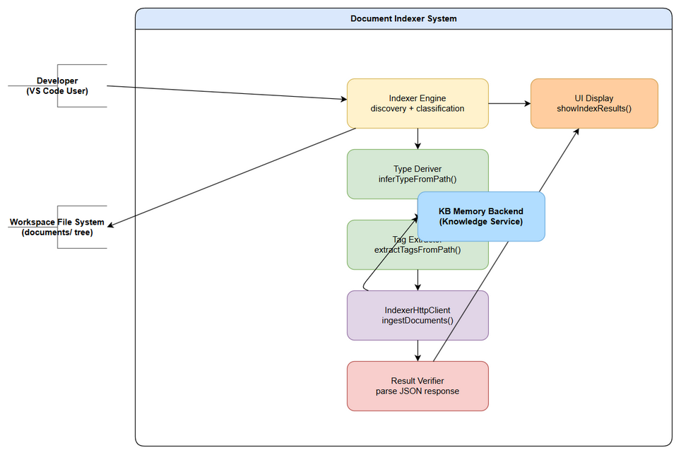

# Functional Specification Document (FSD)

## SA4E-337 — Document Indexer: Fix auto-ingest into KB Memory with correct type/tags

---

## Document Information

| Field | Value |
|-------|-------|
| Jira Ticket | SA4E-337 |
| Title | Document Indexer: Index khong ingest vao KB Memory + thieu tags |
| Author | BA Agent |
| Version | 1.0 |
| Date | 2026-10-04 |
| Status | Draft |
| Related BRD | documents/SA4E-337/BRD.md |

---

## Revision History

| Version | Date | Author | Changes |
|---------|------|--------|---------|
| 1.0 | 2026-10-04 | BA Agent | Initiate from BRD + code intelligence |

---

## 1. Introduction

### 1.1 Purpose

This FSD specifies the functional requirements for fixing the Document Indexer component of the SDLC Agents 4 Enterprise system. The Indexer discovers workspace documents but fails to ingest them into KB Memory — it detects 1727 files but only 3 entries exist in KB Memory. This document defines **how** the system should implement the 6 bug fixes to ensure correct document type derivation, tag extraction, ingest verification, drawio file support, fallback tag extraction, and UI result display.

### 1.2 Scope

**In scope (from BRD §1):**
- Fix type derivation logic (hardcoded CONTEXT → infer from file path)
- Fix tag extraction (none → extract from path structure)
- Fix ingest result verification (none → parse JSON response)
- Add `.drawio` file support to document walk
- Add fallback tag extraction for edge cases
- Update UI to show indexing results

**Out of scope:**
- Changes to the backend Knowledge Service API (SA4E-85)
- Changes to the Pega rule indexing pipeline (SA4E-230)
- Changes to the Jira project indexing pipeline
- Code refactoring unrelated to the indexing/ingest flow

### 1.3 Definitions & Acronyms

| Term | Definition |
|------|------------|
| Indexer | The VS Code extension component that discovers and ingests workspace documents into KB Memory |
| KB Memory | The knowledge base system (backend Knowledge Service + SQLite) that stores indexed documents |
| handleIngestDocsFromTemp | The buggy function that hardcodes type CONTEXT and skips tags |
| inferTypeFromPath | Fix #1: derives document type from filename pattern matching |
| extractTagsFromPath | Fix #2: extracts tags from the folder path structure |
| fallbackTagExtraction | Fix #5: fallback mechanism using parent folder name as tag |
| DOCUMENT_TYPES | Mapping table of filename prefixes to document type constants |
| FOLDER_DENYLIST | Set of folder names excluded from document scanning |
| INDEXABLE_EXTENSIONS | Set of file extensions that the indexer will process |
| IndexerHttpClient | VS Code extension class that sends ingest requests to backend |
| DocEntry | Interface representing a discovered document with path, type, tags |

### 1.4 References

| Document | Location |
|----------|----------|
| BRD | documents/SA4E-337/BRD.md |
| indexer.ts | `extension/src/indexer.ts` |
| indexer-discovery.ts | `extension/src/indexer-discovery.ts` |
| DocumentIndexer.ts | `extension/src/services/DocumentIndexer.ts` |
| indexer.test.ts | `extension/src/__tests__/indexer.test.ts` |
| Knowledge Module | `.analysis/code-intelligence/modules/knowledge.md` |

---

## 2. System Overview

### 2.1 System Context Diagram


*[Edit in draw.io](diagrams/system-context.drawio)*

The Document Indexer system sits within the VS Code Extension boundary. The Developer triggers indexing, the Indexer scans the workspace file system, classifies documents, derives types, extracts tags, and sends them to the Backend Knowledge Service API. The Backend persists entries into KB Memory (SQLite). Results are displayed back in the VS Code UI via the Output channel and notification toast.

### 2.2 System Architecture

**Components:**
1. **VS Code Extension (Frontend)** — `indexer.ts`, `indexer-discovery.ts`, `indexer-ui.ts`
2. **IndexerHttpClient** — HTTP client for backend ingest API
3. **Backend Knowledge Service** — `backend/src/knowledge/` (Hono routes, KnowledgeService, KnowledgeDb)
4. **KB Memory** — SQLite database (`<workspace>/.code-intel/knowledge.db`)

**Data flow:**
```
Workspace Scan → File Classification → Type Derivation → Tag Extraction → Ingest API → Result Verification → UI Display
```

---

## 3. Functional Requirements

### 3.1 Feature: Derive Document Type from File Path

**Source:** BRD §2.3 STORY 1 (Bug Fix #1)

#### 3.1.1 Description

Replace the hardcoded `type = "CONTEXT"` in `handleIngestDocsFromTemp` with `inferTypeFromPath(fileName)`. The function matches the base filename (without extension, uppercased) against known document type patterns.

#### 3.1.2 Use Case

**Use Case ID:** UC-01
**Actor:** Developer (triggering index) / Indexer Extension (automated)
**Preconditions:** File discovered by Indexer with indexable extension
**Postconditions:** Document type derived and attached to DocEntry

**Main Flow:**

| Step | Actor | System | Description |
|------|-------|--------|-------------|
| 1 | Developer | Indexer Extension | Triggers workspace indexing command |
| 2 | | Indexer Extension | Discovers files in `documents/` directory tree |
| 3 | | Indexer Extension | For each file, calls `inferTypeFromPath(fileName)` |
| 4 | | Type Deriver | Extracts baseName (filename without extension, uppercased) |
| 5 | | Type Deriver | Matches baseName against DOCUMENT_TYPES mapping |
| 6 | | Type Deriver | Returns matched type or CONTEXT as default |
| 7 | | Indexer Extension | Attaches derived type to DocEntry |

**Alternative Flows:**

| ID | Condition | Steps |
|----|-----------|-------|
| AF-1 | Filename matches ticket-key prefix (e.g., `TDD-v1-KSA-26.docx`) | Match on `{KEY}-` prefix → type = ARCHITECTURE |
| AF-2 | Filename uses underscore separator (e.g., `BRD_STORY_8.md`) | Match on `{KEY}_` prefix → type = REQUIREMENT |
| AF-3 | Unknown filename pattern (e.g., `meeting-notes.docx`) | No match → default to CONTEXT |

**Exception Flows:**

| ID | Condition | Steps |
|----|-----------|-------|
| EF-1 | Type inference throws unexpected error | Catch error → default to CONTEXT → log warning → continue indexing |
| EF-2 | File extension not in INDEXABLE_EXTENSIONS | Skip type inference → skip file entirely |

#### 3.1.3 Business Rules

| Rule ID | Rule | Source |
|---------|------|--------|
| BR-01 | Document type MUST be derived from filename, never hardcoded | BRD §2.3 STORY 1 |
| BR-02 | Unknown filenames default to CONTEXT type (never fail) | BRD §2.3 STORY 1 |
| BR-03 | DOCUMENT_TYPES mapping must be maintained in a single source of truth (`indexer-discovery.ts`) | BRD §2.3 STORY 1 |
| BR-04 | Type inference is case-insensitive (filename uppercased before matching) | BRD §2.3 STORY 1 |
| BR-05 | File extension must be in INDEXABLE_EXTENSIONS before type inference is attempted | BRD §2.3 STORY 1 |

**DOCUMENT_TYPES mapping:**

| Filename Pattern | Derived Type |
|------------------|-------------|
| `BRD*` | REQUIREMENT |
| `FSD*` | REQUIREMENT |
| `TDD*` | ARCHITECTURE |
| `STP*` | PROCEDURE |
| `STC*` | PROCEDURE |
| `DPG*` | PROCEDURE |
| `RLN*` | PROCEDURE |
| `UG*` | PROCEDURE |
| `TEST-REPORT*` | PROCEDURE |
| `DISCREPANCY*` | DOCUMENTATION |
| `SECURITY-REPORT*` | DOCUMENTATION |
| Any other | CONTEXT |

#### 3.1.4 Data Specifications

**Input Data:**

| Field | Type | Required | Validation | Description |
|-------|------|----------|------------|-------------|
| fileName | string | Yes | Must be non-empty string | Full filename of discovered document |
| baseName | string | Yes | Derived: fileName without extension, uppercased | Used for pattern matching |
| docType | string | Yes | One of: REQUIREMENT, ARCHITECTURE, PROCEDURE, DOCUMENTATION, CONTEXT | Derived document type |

**Output Data:**

| Field | Type | Description |
|-------|------|-------------|
| docType | string | The derived document type for the DocEntry |

#### 3.1.5 UI Specifications

**Screen: VS Code Output Channel ("SDLC Indexing")**

| No. | Element | Type | Required | Behavior | Validation |
|-----|---------|------|----------|----------|------------|
| 1 | Type Display | Output Channel line | Yes | Shows derived type per file | e.g., `✅ BRD.md → type=REQUIREMENT` |

#### 3.1.6 API Contract

**Endpoint:** `POST /api/v1/ingestDocuments` (backend Knowledge Service)
**Purpose:** Submit documents for ingestion with type and tags

**Input Parameters:**

| Parameter | Type | Required | Business Rule | Description |
|-----------|------|----------|---------------|-------------|
| docs | DocEntry[] | Yes | BR-01, BR-03 | Array of documents to ingest |
| docs[].path | string | Yes | — | Absolute file path |
| docs[].type | string | Yes | BR-01 | Derived document type |
| docs[].tags | string[] | Yes | BR-05 | Array of tags |

**Output Data:**

| Field | Type | Description |
|-------|------|-------------|
| success | boolean | Overall ingest success |
| ingested | number | Count of successfully ingested docs |
| converted | number | Count of server-converted binary docs |
| skipped | number | Count of skipped docs |
| unconvertible | string[] | List of files that could not be converted |

**Business Error Scenarios:**

| Scenario | User Message | Trigger Condition |
|----------|-------------|-------------------|
| API returns error | "⚠️ Ingest API error — check Output panel" | Backend returns non-OK status |
| Invalid JSON response | "⚠️ Could not parse ingest response" | Response is not valid JSON |
| No files discovered | "ℹ️ No documents found in documents/ folder" | No indexable files found |

---

### 3.2 Feature: Extract Tags from Folder Path

**Source:** BRD §2.3 STORY 2 (Bug Fix #2)

#### 3.2.1 Description

Replace the empty/no tags in `handleIngestDocsFromTemp` with `extractTagsFromPath(relativePath, ticket)`. Tags are extracted from the folder path structure. If no ticket-key pattern is found, `fallbackTagExtraction()` is used.

#### 3.2.2 Use Case

**Use Case ID:** UC-02
**Actor:** Indexer Extension (automated)
**Preconditions:** File discovered with relative path under `documents/`
**Postconditions:** Tags array attached to DocEntry

**Main Flow:**

| Step | Actor | System | Description |
|------|-------|--------|-------------|
| 1 | | Indexer Extension | Determines relative path from `documents/` root |
| 2 | | Indexer Extension | Calls `extractTagsFromPath(relativePath, ticket)` |
| 3 | | Tag Extractor | Splits path into folder segments |
| 4 | | Tag Extractor | Checks first folder segment against ticket key pattern `{PROJECT}-{NUMBER}` |
| 5 | | Tag Extractor | If match → uses as primary tag |
| 6 | | Tag Extractor | If no match → calls `fallbackTagExtraction()` |
| 7 | | Tag Extractor | Returns tags array (always non-empty) |

**Alternative Flows:**

| ID | Condition | Steps |
|----|-----------|-------|
| AF-1 | Folder name matches ticket key (e.g., `SA4E-337`) | Primary tag = `SA4E-337` |
| AF-2 | Folder name does NOT match ticket key (e.g., `attachments`) | Fallback → parent folder name as secondary tag |
| AF-3 | File at root level (`documents/overview.md`) | Fallback → `documents` as tag |

**Exception Flows:**

| ID | Condition | Steps |
|----|-----------|-------|
| EF-1 | Both primary and fallback extraction fail | Use `["unknown"]` as tag (always at least one tag) |
| EF-2 | Parent folder is a denylisted folder | Skip denylisted folder, use grandparent as fallback |

#### 3.2.3 Business Rules

| Rule ID | Rule | Source |
|---------|------|--------|
| BR-06 | Tags MUST be extracted from folder path, never empty | BRD §2.3 STORY 2 |
| BR-07 | Ticket key pattern: `{PROJECT}-{NUMBER}` (uppercase letters + digits) | BRD §2.3 STORY 2 |
| BR-08 | Fallback tag MUST be a non-empty string | BRD §2.3 STORY 2 |
| BR-09 | Fallback tag MUST NOT duplicate an already-extracted tag | BRD §2.3 STORY 2 |
| BR-10 | Fallback tag MUST NOT be a denylisted folder name | BRD §2.3 STORY 2 |
| BR-11 | Every document MUST have at least one tag | BRD §2.3 STORY 2 |

#### 3.2.4 Data Specifications

**Input Data:**

| Field | Type | Required | Validation | Description |
|-------|------|----------|------------|-------------|
| relativePath | string | Yes | Path relative to `documents/` root | e.g., `SA4E-337/BRD.md` |
| ticket | string | Yes | Ticket key from folder name | e.g., `SA4E-337` |

**Output Data:**

| Field | Type | Description |
|-------|------|-------------|
| tags | string[] | Array of extracted tags, always non-empty |

#### 3.2.5 UI Specifications

**Screen: VS Code Output Channel**

| No. | Element | Type | Required | Behavior | Validation |
|-----|---------|------|----------|----------|------------|
| 1 | Tag Display | Output Channel line | Yes | Shows tags per file | e.g., `📎 Tags: SA4E-337` |
| 2 | Fallback Indicator | Output Channel line | No | Shows when fallback tag used | e.g., `⚠️ Fallback tag: attachments` |

#### 3.2.6 API Contract

**Endpoint:** `POST /api/v1/ingestDocuments`
**Purpose:** Submit documents with extracted tags

**Input Parameters:**

| Parameter | Type | Required | Business Rule | Description |
|-----------|------|----------|---------------|-------------|
| docs[].tags | string[] | Yes | BR-06, BR-11 | Tags array from path extraction |

**Business Error Scenarios:**

| Scenario | User Message | Trigger Condition |
|----------|-------------|-------------------|
| Empty tags array | Internal fallback to `["unknown"]` | BR-11 enforcement |
| Denylisted fallback tag | Skip denylisted, use grandparent | BR-10 enforcement |

---

### 3.3 Feature: Verify Ingest Result

**Source:** BRD §2.3 STORY 3 (Bug Fix #3)

#### 3.3.1 Description

Parse the JSON response from `IndexerHttpClient.ingestDocuments()`, extract success/failure counts, log unconvertible files with reasons, and return a structured summary.

#### 3.3.2 Use Case

**Use Case ID:** UC-03
**Actor:** Indexer Extension (automated)
**Preconditions:** Ingest API call completed
**Postconditions:** Verification results displayed in UI

**Main Flow:**

| Step | Actor | System | Description |
|------|-------|--------|-------------|
| 1 | | Indexer Extension | Receives response from `ingestDocuments()` |
| 2 | | Result Verifier | Parses JSON response |
| 3 | | Result Verifier | Extracts success/failure counts |
| 4 | | Result Verifier | Logs unconvertible files with reasons |
| 5 | | Result Verifier | Returns structured summary |
| 6 | | UI Display | Calls `showIndexResults()` with summary |

**Alternative Flows:**

| ID | Condition | Steps |
|----|-----------|-------|
| AF-1 | API returns success | Show ✅ count in Output channel |
| AF-2 | API returns partial success | Show ⚠️ count with details |
| AF-3 | API returns failure | Show ❌ count + reasons |

**Exception Flows:**

| ID | Condition | Steps |
|----|-----------|-------|
| EF-1 | JSON parsing fails | Show "⚠️ Could not parse ingest response" |
| EF-2 | API returns non-OK status | Log error, show warning in Output channel |
| EF-3 | No files discovered | Return "ℹ️ No documents found in documents/ folder" |
| EF-4 | API timeout | Log timeout error, notify user |

#### 3.3.3 Business Rules

| Rule ID | Rule | Source |
|---------|------|--------|
| BR-12 | API response MUST be parsed as JSON; if parsing fails, treat as failure | BRD §2.3 STORY 3 |
| BR-13 | Unconvertible files MUST have a `reason` field in the response | BRD §2.3 STORY 3 |
| BR-14 | Skipped count = binary docs - serverConverted (never negative) | BRD §2.3 STORY 3 |
| BR-15 | Summary MUST include: total discovered, direct ingested, converted, skipped | BRD §2.3 STORY 3 |

#### 3.3.4 Data Specifications

**Input Data:**

| Field | Type | Required | Validation | Description |
|-------|------|----------|------------|-------------|
| apiResponse | string | Yes | Must be valid JSON | Raw response from ingest API |

**Output Data:**

| Field | Type | Description |
|-------|------|-------------|
| totalDiscovered | number | Total files found by discovery |
| directIngested | number | Markdown + text files ingested directly |
| serverConverted | number | Binary files converted by server |
| skipped | number | Binary files the server could not convert |
| apiSummary | string | Summary text from the API response |
| unconvertible | string[] | List of files with reasons |

#### 3.3.5 UI Specifications

**Screen: VS Code Output Channel ("SDLC Indexing")**

| No. | Name | Type | Required | Description | Validation |
|-----|------|------|----------|-------------|------------|
| 1 | Summary Title | Output Channel | Yes | Title matching selected operations | e.g., "Document Indexing Summary" |
| 2 | Results List | Output Channel | Yes | Line-by-line results per file | Includes emoji indicators (✅, ⚠️, 📤) |
| 3 | Next Steps | Output Channel | Yes | Post-indexing guidance | Lists what happens next for each option |
| 4 | Information Toast | VS Code Notification | Yes | "📋 Indexing complete — see Output panel." | With "Open Output" action button |

#### 3.3.6 API Contract

**Endpoint:** `POST /api/v1/ingestDocuments`
**Purpose:** Verify ingest results from API response

**Input Parameters:**

| Parameter | Type | Required | Business Rule | Description |
|-----------|------|----------|---------------|-------------|
| docs | DocEntry[] | Yes | BR-15 | Documents to ingest |

**Output Data:**

| Field | Type | Description |
|-------|------|-------------|
| success | boolean | Overall success flag |
| ingested | number | Successfully ingested count |
| converted | number | Server-converted count |
| skipped | number | Skipped count |
| unconvertible | Array<{file: string, reason: string}> | Failed files with reasons |

**Business Error Scenarios:**

| Scenario | User Message | Trigger Condition |
|----------|-------------|-------------------|
| JSON parse failure | "⚠️ Could not parse ingest response" | Response is not valid JSON (BR-12) |
| API error | "⚠️ Ingest API error" | Backend returns error status |
| Unconvertible files | Listed with reasons | BR-13 enforcement |

---

### 3.4 Feature: Include drawio Files in Document Indexing

**Source:** BRD §2.3 STORY 4 (Bug Fix #4)

#### 3.4.1 Description

Add `.drawio` to the `INDEXABLE_EXTENSIONS` set in `indexer-discovery.ts`. Ensure `.drawio` files are discovered during recursive directory scanning and classified as format `drawio` and type `CONTEXT`.

#### 3.4.2 Use Case

**Use Case ID:** UC-04
**Actor:** Indexer Extension (automated)
**Preconditions:** `.drawio` files exist in workspace
**Postconditions:** `.drawio` files included in indexing and sent to server for conversion

**Main Flow:**

| Step | Actor | System | Description |
|------|-------|--------|-------------|
| 1 | | Indexer Extension | Scans directory tree recursively |
| 2 | | Indexer Extension | Discovers `.drawio` files |
| 3 | | Indexer Extension | Checks denylist (excludes `diagrams/`, `testdata/`, `templates/`) |
| 4 | | Indexer Extension | Classifies as format `drawio`, type `CONTEXT` |
| 5 | | Indexer Extension | Sends to server for binary conversion |

**Alternative Flows:**

| ID | Condition | Steps |
|----|-----------|-------|
| AF-1 | `.drawio` file in non-denylisted folder | Included in indexing |
| AF-2 | `.drawio` file in denylisted folder (`diagrams/`) | Excluded from indexing |

**Exception Flows:**

| ID | Condition | Steps |
|----|-----------|-------|
| EF-1 | `.drawio` file cannot be read | Skip file, log warning |
| EF-2 | Server cannot convert `.drawio` | Appears in unconvertible list with reason |

#### 3.4.3 Business Rules

| Rule ID | Rule | Source |
|---------|------|--------|
| BR-16 | `.drawio` extension MUST be added to INDEXABLE_EXTENSIONS | BRD §2.3 STORY 4 |
| BR-17 | `.drawio` files in denylisted folders MUST be excluded | BRD §2.3 STORY 4 |
| BR-18 | `.drawio` files are treated as binary documents (server-side conversion) | BRD §2.3 STORY 4 |
| BR-19 | `.drawio` files classified as format `drawio` and type `CONTEXT` | BRD §2.3 STORY 4 |

#### 3.4.4 Data Specifications

**Input Data:**

| Field | Type | Required | Validation | Description |
|-------|------|----------|------------|-------------|
| extension | string | Yes | Must be `.drawio` | File extension |
| format | string | Yes | Must be `drawio` | Format identifier |
| type | string | Yes | Must be `CONTEXT` | Document type for .drawio |

**Output Data:**

| Field | Type | Description |
|-------|------|-------------|
| serverConverted | number | Count of `.drawio` files successfully converted |

#### 3.4.5 UI Specifications

**Screen: VS Code Output Channel**

| No. | Name | Type | Required | Description | Validation |
|-----|------|------|----------|-------------|------------|
| 1 | Server Converted Count | Output Channel | Yes | Number of binary files converted by server | Includes `.drawio` files |

#### 3.4.6 API Contract

**Endpoint:** `POST /api/v1/ingestDocuments`
**Purpose:** Submit `.drawio` files for server-side conversion

**Input Parameters:**

| Parameter | Type | Required | Business Rule | Description |
|-----------|------|----------|---------------|-------------|
| docs[].format | string | Yes | BR-19 | Format identifier: `drawio` |
| docs[].type | string | Yes | BR-19 | Always `CONTEXT` for `.drawio` |

---

### 3.5 Feature: Fallback Tag Extraction

**Source:** BRD §2.3 STORY 5 (Bug Fix #5)

#### 3.5.1 Description

If `extractTagsFromPath()` cannot extract a ticket-key-pattern tag from the folder name, use `fallbackTagExtraction()` which uses the immediate parent folder name as the tag.

#### 3.5.2 Use Case

**Use Case ID:** UC-05
**Actor:** Indexer Extension (automated)
**Preconditions:** Tag extraction from path did not yield a ticket-key-pattern tag
**Postconditions:** Fallback tag applied as secondary tag

**Main Flow:**

| Step | Actor | System | Description |
|------|-------|--------|-------------|
| 1 | | Tag Extractor | `extractTagsFromPath()` cannot find ticket-key pattern |
| 2 | | Tag Extractor | Calls `fallbackTagExtraction()` |
| 3 | | Fallback Extractor | Uses immediate parent folder name as tag |
| 4 | | Fallback Extractor | If parent is `documents` itself → use `documents` as tag |
| 5 | | Tag Extractor | Applies fallback as secondary tag alongside primary |

**Alternative Flows:**

| ID | Condition | Steps |
|----|-----------|-------|
| AF-1 | Parent folder is not denylisted | Use parent folder name as fallback tag |
| AF-2 | Parent folder is `documents` (root level) | Use `documents` as fallback tag |

**Exception Flows:**

| ID | Condition | Steps |
|----|-----------|-------|
| EF-1 | Fallback also fails | Use `["unknown"]` as tag (always at least one tag) |
| EF-2 | Fallback tag duplicates existing tag | Skip duplicate, keep only unique tags |

#### 3.5.3 Business Rules

| Rule ID | Rule | Source |
|---------|------|--------|
| BR-20 | Fallback tag MUST use immediate parent folder name | BRD §2.3 STORY 5 |
| BR-21 | If parent is `documents` → use `documents` as tag | BRD §2.3 STORY 5 |
| BR-22 | Fallback tags MUST NOT duplicate already-extracted tags | BRD §2.3 STORY 5 |
| BR-23 | Fallback tags MUST NOT be denylisted folder names | BRD §2.3 STORY 5 |
| BR-24 | If fallback also fails → use `["unknown"]` | BRD §2.3 STORY 5 |

#### 3.5.4 Data Specifications

**Input Data:**

| Field | Type | Required | Validation | Description |
|-------|------|----------|------------|-------------|
| parentFolder | string | Yes | Must be non-empty | Immediate parent folder name |
| fallbackTag | string | Yes | Must be non-empty, not duplicate, not denylisted | Tag derived from parent folder |

**Output Data:**

| Field | Type | Description |
|-------|------|-------------|
| tags | string[] | Combined primary + fallback tags (unique, non-empty) |

---

### 3.6 Feature: Updated UI to Show Indexing Results

**Source:** BRD §2.3 STORY 6 (Bug Fix #6)

#### 3.6.1 Description

Update `showIndexResults()` in `indexer.ts` to display document indexing results. The summary title matches the selected operations. Results are appended to the "SDLC Indexing" Output channel. An information message toast appears with "Open Output" action.

#### 3.6.2 Use Case

**Use Case ID:** UC-06
**Actor:** Developer (VS Code User)
**Preconditions:** Indexing operation completed
**Postconditions:** Results displayed in Output channel and toast notification

**Main Flow:**

| Step | Actor | System | Description |
|------|-------|--------|-------------|
| 1 | Developer | Indexer Extension | Indexing operation completes |
| 2 | | UI Display | `showIndexResults()` called with results |
| 3 | | UI Display | Summary title matches selected operations |
| 4 | | UI Display | Results appended to "SDLC Indexing" Output channel |
| 5 | | UI Display | Information toast appears with "Open Output" action |
| 6 | Developer | VS Code | Clicks "Open Output" → Output channel revealed |

**Alternative Flows:**

| ID | Condition | Steps |
|----|-----------|-------|
| AF-1 | Salesforce project detected | Show additional SF-specific summary |
| AF-2 | Output channel creation fails | Results still returned but not displayed |
| AF-3 | Toast display fails | Results still in Output channel |

**Exception Flows:**

| ID | Condition | Steps |
|----|-----------|-------|
| EF-1 | Toast display throws error | Catch error → results still in Output channel |
| EF-2 | "Open Output" action fails | Log error → manual navigation suggested |

#### 3.6.3 Business Rules

| Rule ID | Rule | Source |
|---------|------|--------|
| BR-25 | Toast only appears AFTER indexing completes (not during) | BRD §2.3 STORY 6 |
| BR-26 | "Open Output" button MUST open the correct Output channel | BRD §2.3 STORY 6 |
| BR-27 | Results MUST be appended atomically to avoid interleaving | BRD §2.3 STORY 6 |
| BR-28 | Summary title MUST match selected operations | BRD §2.3 STORY 6 |

#### 3.6.4 Data Specifications

**Input Data:**

| Field | Type | Required | Validation | Description |
|-------|------|----------|------------|-------------|
| summaryTitle | string | Yes | Based on selected options | e.g., "Document Indexing Summary" |
| results | string[] | Yes | Array of result lines from each operation | `["✅ Documents: 15 discovered", ...]` |
| options | string[] | Yes | Selected indexing options | `["documents", "code", "sync"]` |

**Output Data:**

| Field | Type | Description |
|-------|------|-------------|
| toastShown | boolean | Whether the information toast was displayed |
| outputChannelOpened | boolean | Whether the Output channel was opened |

#### 3.6.5 UI Specifications

**Screen: VS Code Output Channel + Notification Toast**

| No. | Element | Type | Required | Behavior | Validation |
|-----|---------|------|----------|----------|------------|
| 1 | Output Channel | VS Code Output Channel | Yes | "SDLC Indexing" channel with full results | Auto-shown during indexing |
| 2 | Information Toast | VS Code Notification | Yes | "📋 Indexing complete — see Output panel." | With "Open Output" button |
| 3 | Salesforce Summary | VS Code Output Channel | Conditional | SF-specific component counts | Only when SFDX project detected |
| 4 | Open Output Button | Toast action button | Yes | Opens Output channel | Must connect to correct channel |

#### 3.6.6 API Contract

No direct API call — this is a UI display function. Data flows from the ingest result summary to `showIndexResults()`.

**Input Parameters:**

| Parameter | Type | Required | Business Rule | Description |
|-----------|------|----------|---------------|-------------|
| results | string[] | Yes | BR-27 | Result lines from each operation |
| options | string[] | Yes | BR-28 | Selected indexing options |
| isSfdxProject | boolean | No | BR-28 | Salesforce project detection flag |

---

## 4. Data Model

### 4.2 Logical Entities

#### Entity: DocEntry

| Attribute | Type | Required | Business Rule | Description |
|-----------|------|----------|---------------|-------------|
| path | string | Yes | BR-01 | Absolute file path |
| fileName | string | Yes | BR-01 | Full filename |
| baseName | string | Yes | BR-01 | Filename without extension, uppercased |
| extension | string | Yes | BR-16 | File extension |
| format | string | Yes | BR-19 | Format identifier |
| type | string | Yes | BR-01, BR-19 | Derived document type |
| tags | string[] | Yes | BR-06, BR-11 | Array of extracted tags |
| relativePath | string | Yes | BR-06 | Path relative to `documents/` root |
| ticket | string | Yes | BR-07 | Ticket key from folder name |

**Relationships:**

| From Entity | To Entity | Cardinality | Description |
|-------------|-----------|-------------|-------------|
| DocEntry | KB Memory | 1:N | One document ingested into KB as one or more entries |
| DocEntry | Type Deriver | 1:1 | Each DocEntry passes through type derivation |
| DocEntry | Tag Extractor | 1:1 | Each DocEntry passes through tag extraction |

---

## 5. Integration Specifications

### 5.1 External System: Backend Knowledge Service

| Attribute | Value |
|-----------|-------|
| Purpose | Accept document ingestion with type and tags |
| Direction | Outbound (from Extension to Backend) |
| Data Format | JSON |
| Frequency | On-demand (per indexing trigger) |

**Data Exchange:**

| Our Data | External Data | Direction | Business Rule |
|----------|--------------|-----------|---------------|
| docs[].type | type field | Send | BR-01: derived from filename |
| docs[].tags | tags field | Send | BR-06: extracted from path |
| JSON response | ingest result | Receive | BR-12: must parse JSON |

**API Endpoint:** `POST /api/v1/ingestDocuments`

**Request Body:**
```json
{
  "docs": [
    {
      "path": "C:/projects/.../documents/SA4E-337/BRD.md",
      "fileName": "BRD.md",
      "baseName": "BRD",
      "extension": ".md",
      "format": "markdown",
      "type": "REQUIREMENT",
      "tags": ["SA4E-337"],
      "relativePath": "SA4E-337/BRD.md"
    }
  ]
}
```

**Response Body:**
```json
{
  "success": true,
  "ingested": 150,
  "converted": 25,
  "skipped": 5,
  "unconvertible": [
    {"file": "diagrams/use-case.drawio", "reason": "conversion failed"}
  ]
}
```

### 5.2 External System: VS Code Output Channel

| Attribute | Value |
|-----------|-------|
| Purpose | Display indexing results to developer |
| Direction | Outbound (from Extension to UI) |
| Data Format | Text + emoji indicators |
| Frequency | On-demand (after indexing completes) |

---

## 6. Processing Logic

### 6.1 Document Indexing Workflow

**Trigger:** Developer invokes "Index Workspace" or "Index Documents" command in VS Code
**Schedule:** On-demand (manual trigger)
**Input:** Workspace file system (`documents/` directory tree)
**Output:** Ingested documents in KB Memory + UI result display

**Processing Steps:**

| Step | Description | Error Handling |
|------|-------------|----------------|
| 1 | Scan `documents/` directory recursively (BFS) | Log error, continue with other files |
| 2 | Filter by INDEXABLE_EXTENSIONS | Skip non-indexable files |
| 3 | Exclude denylisted folders (`diagrams`, `testdata`, `templates`, `node_modules`, `.git`) | Skip denylisted files |
| 4 | For each file, call `inferTypeFromPath(fileName)` | Default to CONTEXT on error (BR-02) |
| 5 | For each file, call `extractTagsFromPath(relativePath, ticket)` | Fallback to `fallbackTagExtraction()` (BR-08) |
| 6 | Build DocEntry array with type + tags | Validate tags non-empty (BR-11) |
| 7 | Call `IndexerHttpClient.ingestDocuments(docs)` | Log API error, notify user (EF-2) |
| 8 | Parse JSON response from API | If parse fails → show warning (EF-1) |
| 9 | Compute summary: total, ingested, converted, skipped | BR-15 |
| 10 | Call `showIndexResults(summary, options)` | Catch UI display errors (EF-1) |

---

## 7. Security Requirements

### 7.1 Authentication & Authorization

| Role | Permissions | Screens/Features |
|------|-------------|-------------------|
| Developer | Read/Write | Trigger indexing, view results |
| System (Indexer) | Read/Write | Automated file scanning and ingest |

### 7.2 Data Sensitivity Classification

| Data Type | Classification | Business Requirement |
|-----------|---------------|---------------------|
| Document content | Internal | Workspace files are user-owned |
| Ticket keys (tags) | Internal | Derived from folder structure |
| API responses | Internal | Transient, not persisted |

### 7.3 Audit Trail

| Event | Logged Fields | Retention | Business Reason |
|-------|--------------|-----------|-----------------|
| Document indexed | fileName, type, tags, timestamp | Session only | Debugging indexing issues |
| Ingest API call | Request/response summary | Session only | Troubleshooting ingest failures |
| Fallback tag used | fileName, fallbackTag | Session only | Identifying path structure issues |

---

## 8. Non-Functional Requirements

| Category | Business Requirement | Acceptance Criteria |
|----------|---------------------|---------------------|
| Performance | Indexing 1727 files must complete in under 5 minutes | Discovery is fast; ingest latency depends on backend API |
| Scalability | Must handle workspaces with 5000+ files | Recursive BFS scan is O(n); no recursive depth limits |
| Reliability | Ingest verification must detect and report failures | Parse JSON response; log unconvertible files with reasons |
| Security | No unauthorized file access | Only files under `documents/` root are scanned; denylist prevents access to config dirs |
| Maintainability | Type mapping in single source of truth | `DOCUMENT_TYPES` constant in `indexer-discovery.ts` |
| Usability | UI must clearly show indexing results | Output channel + toast notification with action button |
| Testability | All 6 bug fixes must have corresponding UT/IT coverage | UT-010..017, IT-009..012 already cover document discovery |

---

## 9. Error Handling

### 9.1 Error Scenarios

| Scenario | Severity | User Message | Expected Behavior |
|----------|----------|-------------|-------------------|
| Type inference error | Warning | "⚠️ Type inference failed for {file}, defaulting to CONTEXT" | Default to CONTEXT, continue indexing |
| Tag extraction fails | Warning | "⚠️ Tag extraction failed for {file}, using fallback" | Use fallbackTagExtraction() |
| API returns error | Error | "⚠️ Ingest API error — check Output panel" | Log error, notify user |
| JSON parsing fails | Error | "⚠️ Could not parse ingest response" | Treat as failure, log details |
| No files discovered | Info | "ℹ️ No documents found in documents/ folder" | Return early, no ingest attempted |
| Output channel creation fails | Warning | (silent) | Results still returned, not displayed |
| Toast display fails | Warning | (silent) | Results still in Output channel |
| .drawio file read error | Warning | "⚠️ Could not read {file}, skipping" | Skip file, log warning |
| Server cannot convert .drawio | Warning | "⚠️ Server could not convert {file}" | Appears in unconvertible list |
| Fallback also fails | Error | "⚠️ Tag extraction failed for {file}, using 'unknown'" | Use ["unknown"] as tag |

### 9.2 Notification Requirements

| Event | Who is Notified | Channel | Timing |
|-------|----------------|---------|--------|
| Indexing complete | Developer | VS Code Toast | After indexing finishes |
| API error | Developer | VS Code Toast + Output Channel | Immediately on error |
| Unconvertible files | Developer | VS Code Output Channel | After indexing finishes |

---

## 10. Testing Considerations

### 10.1 Test Scenarios

| ID | Scenario | Input | Expected Output | Priority |
|----|----------|-------|-----------------|----------|
| TC-01 | Type inference: BRD.md | fileName=`BRD.md` | type=`REQUIREMENT` | High |
| TC-02 | Type inference: FSD.docx | fileName=`FSD.docx` | type=`REQUIREMENT` | High |
| TC-03 | Type inference: TDD.pdf | fileName=`TDD.pdf` | type=`ARCHITECTURE` | High |
| TC-04 | Type inference: STP.xlsx | fileName=`STP.xlsx` | type=`PROCEDURE` | High |
| TC-05 | Type inference: meeting-notes.docx | fileName=`meeting-notes.docx` | type=`CONTEXT` (no match) | High |
| TC-06 | Type inference: TDD-v1-KSA-26.docx | fileName=`TDD-v1-KSA-26.docx` | type=`ARCHITECTURE` (prefix match) | Medium |
| TC-07 | Type inference: BRD_STORY_8.md | fileName=`BRD_STORY_8.md` | type=`REQUIREMENT` (underscore match) | Medium |
| TC-08 | Tag extraction: ticket folder | relativePath=`SA4E-337/BRD.md` | tags=`["SA4E-337"]` | High |
| TC-09 | Tag extraction: drawio in ticket folder | relativePath=`SA4E-337/diagrams/use-case.drawio` | tags=`["SA4E-337"]` | High |
| TC-10 | Tag extraction: non-ticket folder | relativePath=`GRAPH-EMAIL/BRD.md` | tags=`["GRAPH-EMAIL"]` | Medium |
| TC-11 | Tag extraction: root level file | relativePath=`overview.md` | tags=`["documents"]` (fallback) | Medium |
| TC-12 | Tag extraction: nested folder | relativePath=`SA4E-337/attachments/spec.pdf` | tags=`["SA4E-337", "attachments"]` | Medium |
| TC-13 | Tag extraction: no ticket pattern | relativePath=`attachments/spec.pdf` | tags includes fallback `attachments` | Medium |
| TC-14 | Fallback tag extraction | parentFolder=`attachments` | fallbackTag=`attachments` | Medium |
| TC-15 | Fallback tag deduplication | tags=`["SA4E-337"]`, fallback=`SA4E-337` | tags=`["SA4E-337"]` (no duplicate) | Medium |
| TC-16 | Fallback tag denylist | parentFolder=`diagrams` | skip, use grandparent | Medium |
| TC-17 | Ingest verification: success | API returns {success:true, ingested:5} | Summary shows 5 ingested | High |
| TC-18 | Ingest verification: partial | API returns {success:true, ingested:3, skipped:2} | Summary shows 3 ingested, 2 skipped | High |
| TC-19 | Ingest verification: API error | API returns error status | Log error, show warning | High |
| TC-20 | Ingest verification: JSON parse fail | API returns invalid JSON | "⚠️ Could not parse ingest response" | High |
| TC-21 | .drawio file included | File `docs/SA4E-337/diagrams/use-case.drawio` | Discovered, classified as drawio/CONTEXT | High |
| TC-22 | .drawio file in denylisted folder | File in `diagrams/` folder | Excluded from indexing | High |
| TC-23 | UI display: normal results | Indexing completes with results | Output channel shows summary + toast | High |
| TC-24 | UI display: Salesforce detected | SFDX project detected | SF-specific summary shown | Medium |
| TC-25 | UI display: toast action | Click "Open Output" | Output channel revealed | Medium |
| TC-26 | No files discovered | Empty documents/ folder | "ℹ️ No documents found" | Medium |
| TC-27 | Type inference error | Unexpected error in inferTypeFromPath | Default to CONTEXT, log warning | Medium |
| TC-28 | Tag extraction returns empty | extractTagsFromPath returns [] | Fallback applied, never empty | High |
| TC-29 | Concurrent indexing | Multiple indexing triggers | Handled by IndexingService concurrency guard (SA4E-300) | Medium |
| TC-30 | End-to-end: 1727 files | Full workspace scan | All files discovered, typed, tagged, ingested, verified, displayed | High |

---

## 11. Appendix

### Diagram Index

| Diagram | Type | File | Description |
|---------|------|------|-------------|
| System Context Diagram | System Context | `diagrams/system-context.drawio` | System boundary, actors, external systems |
| Sequence - UC-01 (Derive Type) | UML Sequence | `diagrams/sequence-uc1.drawio` | Document type derivation flow |
| Sequence - UC-02 (Extract Tags) | UML Sequence | `diagrams/sequence-uc2.drawio` | Tag extraction with fallback |
| Sequence - UC-03 (Verify Ingest) | UML Sequence | `diagrams/sequence-uc3.drawio` | Ingest result verification flow |
| State Diagram - Document | UML State | `diagrams/state-document.drawio` | Document lifecycle states |
| Use Case Diagram | UML Use Case | `diagrams/use-case.drawio` | Actors and use cases (from BRD) |
| Business Flow Swimlane | Swimlane | `diagrams/business-flow.drawio` | End-to-end flow (from BRD) |
| Activity - Indexing | Activity | `diagrams/activity-indexing.drawio` | Document indexing processing logic |

### Change Log from BRD

| Change | Reason |
|--------|--------|
| Added Use Case IDs (UC-01..UC-06) | FSD requires formal use case identification |
| Added Business Rules (BR-01..BR-28) | FSD requires traceable business rules |
| Added API Specifications | BRD mentioned API but no contract details |
| Added Error Handling section | BRD had error handling per story but not centralized |
| Added Testing Considerations | FSD requires test scenarios |
| Added Processing Logic (Section 6) | FSD requires processing logic with activity diagrams |
| Added Security Requirements (Section 7) | FSD requires security section |
| Added Data Model (Section 4) | FSD requires logical data model |
| Added Integration Specifications (Section 5) | FSD requires integration details |

---

> **Revision Note:** FSD v1.0 generated from BRD SA4E-337 with code intelligence data from `.analysis/code-intelligence/project-structure.md` and `.analysis/code-intelligence/modules/knowledge.md`. All 6 bug fixes from BRD are covered with Use Cases, Business Rules, API contracts, Error Handling, and diagrams.
