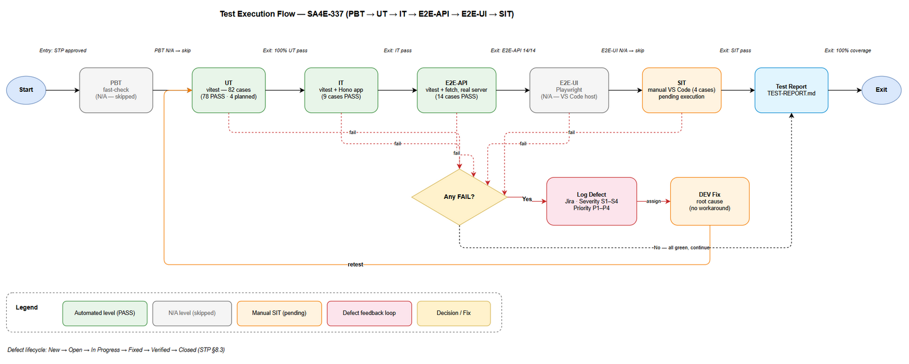
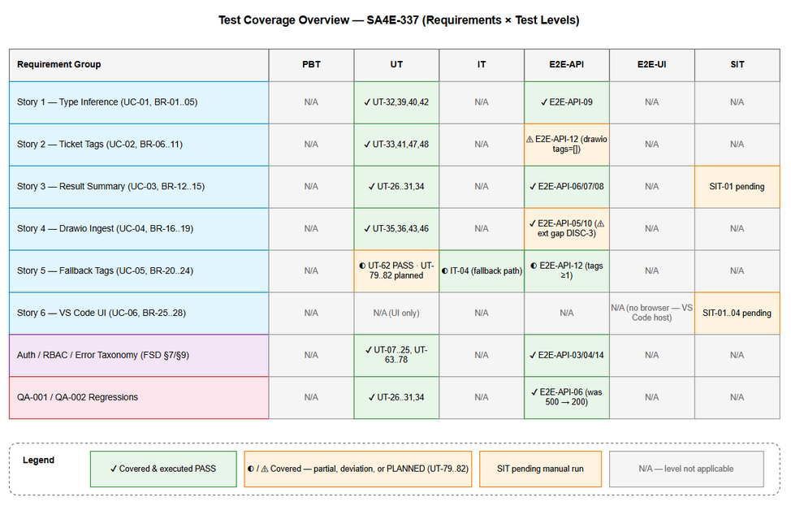

# Software Test Plan (STP)

## SDLC-Agents-4-Enterprise — SA4E-337: Document Indexer — Index không ingest vào KB Memory + thiếu tags (Bug Fix)

---

## Document Information

| Field | Value |
|-------|-------|
| Jira Ticket | SA4E-337 |
| Title | Document Indexer: Fix auto-ingest into KB Memory with correct type/tags |
| Author | QA Agent |
| Version | 1.0 |
| Date | 2026-10-05 |
| Status | Draft — pending BA review (Review Gate) |
| Related BRD | BRD-v1.0-SA4E-337.docx |
| Related FSD | FSD.md (v1.0) — documents/SA4E-337/FSD.md |
| Related TDD | TDD-v1.1-SA4E-337.docx |

---

## Author Tracking

| Role | Name - Position | Responsibility |
|------|-----------------|----------------|
| Author | QA Agent – QA Engineer | Create document |
| Peer Reviewer | BA Agent – Business Analyst | Business-coverage review of STC/RTM (Review Gate) |
| Coordinator | Scrum Master | Orchestrate review gate, quality gates |

---

## Revision History

| Version | Date | Author | Changes |
|---------|------|--------|---------|
| 1.0 | 2026-10-05 | QA Agent | Initiate document — auto-generated from BRD, FSD, and TDD |

---

## Sign-Off

| Name | Signature and date |
|------|--------------------|
| | ☐ I agree and confirm the test plan in this STP |
| | ☐ I agree and confirm the test plan in this STP |

---

## 1. Introduction

### 1.1 Purpose

This Software Test Plan defines the test strategy, scope, environment, schedule, and metrics for verifying the SA4E-337 bug-fix release of the Document Indexer subsystem (extension ↔ backend ingest pipeline).

SA4E-337 fixes six (6) defects in the document indexing → KB Memory ingest pipeline (root cause: `handleIngestDocsFromTemp` hardcodes `type = "CONTEXT"`, passes no tags, and never verifies the ingest result), plus two QA-discovered defects (QA-001 CRITICAL, QA-002 MAJOR). This plan verifies all six fixed bugs, the six BRD user stories, FSD use cases UC-01..UC-06 and business rules BR-01..BR-28, and guards against regressions on the four (4) modified source files.

### 1.2 Test Objectives

- Verify Bug #1–#6 fixes behave per BRD §2.3 acceptance criteria and FSD §3 specifications (type derivation, tag extraction, result verification, `.drawio` inclusion, fallback tags, UI results).
- Verify QA-001 fix: `/api/index/ingest-docs` uses `getToolHandlers().get('mem_ingest_file')` (never `getDispatcher()`), fails closed with 503/`failedFiles` — never HTTP 500.
- Verify QA-002: happy-path unit coverage exists for the ingest route (200 `{ingested, errors, total}`).
- Validate all 28 business rules (BR-01..BR-28) and all FSD test scenarios (FSD §10 TC-01..TC-30).
- Enforce security gates: 401 (auth), 400 (`X-Project-Id` missing), 403 (`KB_WRITE`/grant scope), path traversal rejection (`EACCES`).
- Ensure no regression on modified files: `api-index.ts`, `api-index-ingest.ts`, `TaskWorker.ts`, `indexer.ts`, `IndexerHttpClient.ts`.
- Provide an executable Requirements Traceability Matrix (RTM) with 100% requirement coverage for BA review.

### 1.3 References

| Document | Location |
|----------|----------|
| BRD | documents/SA4E-337/BRD.md → BRD-v1.0-SA4E-337.docx |
| FSD | documents/SA4E-337/FSD.md |
| TDD | documents/SA4E-337/TDD.md → TDD-v1.1-SA4E-337.docx |
| Discrepancy Report | documents/SA4E-337/DISCREPANCY.md (DISC-1..DISC-8) |
| STC (Test Cases) | documents/SA4E-337/STC.md → STC-v1.0-SA4E-337.xlsx |
| E2E Evidence | %TEMP%/opencode/sa4e337-e2e-results.json (14/14 PASS) |
| E2E Script | %TEMP%/opencode/sa4e337-e2e-test.mjs |
| Unit Evidence | Fresh runs 2026-10-05: 34/34, 14/14, 23/23, 23/23 PASS (see §9.3) |

---
## 2. Test Strategy

### 2.1 Test Levels

This plan uses the six-level SDLC test model. Levels that do not apply to SA4E-337 are explicitly marked with the reason (this is a backend/extension bug-fix with no browser UI).

| Level | Scope | Automation | Tools |
|-------|-------|------------|-------|
| PBT | Correctness properties (random inputs) | N/A — 0 cases | fast-check (available, not applicable) |
| UT | Unit/edge case tests for helpers, routes (Hono `app.request()` in-process), discovery, TaskWorker | Automated | vitest |
| IT | Component integration with real SQLite DB (TaskWorker queue lifecycle) | Automated | vitest |
| E2E-API | REST endpoint E2E against a real running server (session auth, ingest, KB rows) | Automated | vitest/fetch (Node script) |
| E2E-UI | Browser UI E2E | N/A — 0 cases | Playwright (admin web only — not applicable) |
| SIT | Manual exploratory testing of the VS Code extension UI (Output channel, toast) | Manual | VS Code / Kiro |

**Level applicability notes:**

- **PBT = 0 (N/A):** the fixed logic is deterministic string/path mapping (`inferTypeFromPath`, `extractTagsFromPath`, `summarizeIngestResult`) covered by exhaustive pattern tables in UT; no random-input domain (no parser, no numeric invariant) justifies property-based tests for this bug-fix.
- **E2E-UI = 0 (N/A):** Bug #6 renders inside the **VS Code extension host** (Output channel + notification toast) — not a browser page; Playwright in this repo only targets the admin web UI (TDD §11.1/§11.5). Manual SIT covers it.
- **IT vs UT:** route-level tests that use the Hono `app.request()` in-process harness are counted under UT (they run in `vitest run src/`, no external process). IT is reserved for TaskWorker tests that exercise a real database (`*.it.test.ts`, `npm run test:integration` pattern).
- **UAT:** not a separate automated level — BA performs business-coverage review of STC/RTM (Review Gate) and accepts the SIT result.

### 2.2 Test Types

| Type | Description | Applicable |
|------|-------------|------------|
| Functional Testing | Verify features per FSD UC-01..UC-06, BR-01..BR-28, TC-01..TC-30 | Yes |
| Regression Testing | Modified files: api-index, api-index-ingest, TaskWorker, indexer, IndexerHttpClient | Yes |
| Security Testing | 401/400/403 gates, path traversal (`EACCES`), tenant scope (`X-Project-Id`), BOLA | Yes |
| Non-Functional — Performance | 1727-file scan < 5 min (FSD §8) | Deferred — see §3.2 Out of Scope |
| Usability Testing | Output channel, toast, Open Output action | Yes — via manual SIT |
| Compatibility Testing | Browser/device matrix | N/A — VS Code desktop, no browser UI |

### 2.3 Test Approach

- **Automated-first, evidence-based.** All deterministic server-side and discovery behaviour is automated (UT/IT/E2E-API). Only visual/UX behaviour that requires human judgment in the VS Code host remains manual (SIT).
- **Isolated test environment.** E2E runs against a real backend instance on port **48721** with an **isolated SQLite data dir** (`%TEMP%/opencode/sa4e337-sqlite-data`) — never the production PostgreSQL KB (guardrail: test stack must not touch prod data).
- **Real dependencies, minimal mocks.** E2E-API exercises real HTTP + real DB rows (`knowledge_entries`); UT mocks only session/JWT middleware seams (`mockGrantedCaller()` harness). Acceptable per test-level rules: local infra (SQLite, Hono) is real; only auth context is stubbed at unit level.
- **Fail-closed verification.** Ingest results are asserted on `{ingested, errors, total, failedFiles}` semantics (`summarizeIngestResult` fail-closed: `isError`/`"Error:"`/`status≠ingested` must never count as `ingested`).
- **Defect feedback loop.** Fail → fix (dev) → retest same case → regression guard added (QA-001 case deliberately omits `getDispatcher` so the defect can never silently return).

### 2.4 Test Cases Summary

| Level | Count | Automated | Manual |
|-------|-------|-----------|--------|
| PBT | 0 | 0 | 0 |
| UT | 82 | 82 | 0 |
| IT | 9 | 9 | 0 |
| E2E-API | 14 | 14 | 0 |
| E2E-UI | 0 | 0 | 0 |
| SIT | 4 | 0 | 4 |
| **Total** | **109** | **105 (96.3%)** | **4 (3.7%)** |

**Execution status (as of 2026-10-05):**

| Status | Count | Detail |
|--------|-------|--------|
| PASS (executed) | 101 | UT 78 + IT 9 + E2E-API 14 — all green (see §9.3 evidence) |
| NOT_RUN — planned unit (DEV to implement) | 4 | UT-79..UT-82 close identified coverage gaps (Bug #5 fallback, BR-12 client parse, nested/root tags) |
| NOT_RUN — manual SIT | 4 | SIT-01..SIT-04 — VS Code session required (Phase 6) |

### 2.5 Entry Criteria

| Level | Entry Criteria |
|-------|---------------|
| PBT | N/A — level not applicable (see §2.1) |
| UT | Source code for fixes present in working tree; vitest configured (`npm run test:unit` / package `vitest run`) |
| IT | Testkit available (`sa4e-testkit.ts`); SQLite temp DB creatable |
| E2E-API | Backend boots on port 48721 (`/health` → `modules.memory=ready`); isolated SQLite data dir created; test staging files prepared (9 files) |
| E2E-UI | N/A — level not applicable (see §2.1) |
| SIT | Extension installed in VS Code/Kiro host; backend reachable; STC signed off by BA (Review Gate APPROVED) |
| UAT (BA review) | STP + STC + RTM delivered; BRD/FSD baselines frozen |

### 2.6 Exit Criteria

| Level | Exit Criteria |
|-------|---------------|
| UT | 100% of defined UT cases executed; ≥ 95% pass; all SA4E-337-specific cases PASS |
| IT | 100% executed, 0 failures |
| E2E-API | 14/14 PASS on isolated env; evidence JSON written |
| SIT | 4/4 executed with screenshots/evidence recorded in TEST-REPORT; 0 Critical/Major open |
| UAT (BA) | RTM coverage = 100% for BRD AC / FSD UC / BR / TC-01..TC-30; BA verdict = APPROVED |
| Overall | 0 open Critical defects; ≤ 2 open Major defects with agreed workaround; TEST-REPORT completed |



---

## 3. Test Scope

### 3.1 Features In Scope

| # | Feature / Story | Priority | FSD Reference | Test Type |
|---|----------------|----------|---------------|-----------|
| 1 | Bug #1 — Derive document type from file path (`inferTypeFromPath`) | MUST HAVE | UC-01, BR-01..BR-05, Story 1 | Functional (UT + E2E-API) |
| 2 | Bug #2 — Extract tags from folder path (`extractTagsFromPath`) | MUST HAVE | UC-02, BR-06..BR-11, Story 2 | Functional (UT + E2E-API) |
| 3 | Bug #3 — Verify ingest result (`{ingested, errors, total, failedFiles}`) | MUST HAVE | UC-03, BR-12..BR-15, Story 3 | Functional (UT + E2E-API) |
| 4 | Bug #4 — Include `.drawio` files in document indexing | SHOULD HAVE | UC-04, BR-16..BR-19, Story 4 | Functional (UT + E2E-API) |
| 5 | Bug #5 — Fallback tag extraction when LLM unavailable | SHOULD HAVE | UC-05, BR-20..BR-24, Story 5 | Functional (UT planned + E2E-API) |
| 6 | Bug #6 — UI shows indexing results (Output channel + toast) | MUST HAVE | UC-06, BR-25..BR-28, Story 6 | Usability (manual SIT) |
| 7 | QA-001 (CRITICAL) — `mem.getDispatcher()` → `getToolHandlers().get('mem_ingest_file')`, fail-closed summary | MUST HAVE | TDD §6.2, §12 | Functional + Security (UT + E2E-API) |
| 8 | QA-002 (MAJOR) — happy-path unit coverage for ingest route | MUST HAVE | TDD §11.4 | Functional (UT) |
| 9 | Security gates — 401 / 400 `PROJECT_REQUIRED` / 403 `KB_WRITE` / grant scope / `EACCES` traversal | MUST HAVE | FSD §7, TDD §7 | Security (UT + E2E-API) |
| 10 | Regression — modified files: `api-index.ts`, `api-index-ingest.ts`, `TaskWorker.ts`, `indexer.ts`, `IndexerHttpClient.ts` | MUST HAVE | TDD §5.1 | Regression (UT + IT) |



### 3.2 Features Out of Scope

| # | Feature | Reason |
|---|---------|--------|
| 1 | Performance run with 1727 files < 5 min (FSD §8) | Requires full-workspace scale fixture; risk-based deferral — tracked as follow-up (R-7) |
| 2 | Playwright browser E2E (E2E-UI level) | No browser UI in scope; VS Code extension host is not Playwright-testable (TDD §11.5) |
| 3 | Property-based testing (PBT level) | Deterministic mapping logic; exhaustive tables in UT suffice (see §2.1) |
| 4 | Semantic quality of LLM-generated tags | Tags asserted as non-empty + task COMPLETED only; content quality is out of functional scope |
| 5 | Fixing FSD↔implementation discrepancies DISC-1..DISC-8 | Tracked in DISCREPANCY.md — BA/SA scope, not test scope; noted in Risk R-5 |
| 6 | Deep Pega sync functionality (`sync-pega-rules`) beyond auth/RBAC gates | Belongs to Pega feature tickets; only 403/202 gates verified here (UT-22/UT-23) |
| 7 | Admin web UI / browser compatibility matrix | Unrelated to Document Indexer |
| 8 | Salesforce-specific summary details (SIT-04 conditional) | Executed only if an SFDX project fixture is available; otherwise documented as skipped |

---
## 4. Test Environment

### 4.1 Environment Requirements

| Environment | URL | Database | Purpose |
|-------------|-----|----------|---------|
| E2E (isolated) | http://127.0.0.1:48721 (backend, `npx tsx backend/src/index.ts`) | SQLite isolated dir: `%TEMP%/opencode/sa4e337-sqlite-data/index.db` | UT/E2E-API execution — **must not** use production PostgreSQL |
| KB (knowledge base, read/write via tools) | code-intel MCP (localhost:9181 wrapper → 48721) | PostgreSQL `sa4e_db` @ pgvector-db:5432 | KB ingest of STP/STC (planning artifacts only — no test writes) |
| VS Code / Kiro host | Local desktop, extension `sdlc-agents-4-enterprise` | — | Manual SIT (Output channel, toast) |
| SIT / UAT | Not applicable (no hosted web UI) | — | BA Review Gate (document-based UAT) |

### 4.2 Browser / Device Requirements

| Browser | Version | OS | Required |
|---------|---------|-----|----------|
| — | — | Windows 10/11 (VS Code / Kiro desktop) | Yes — SIT runs in VS Code host, not a browser |
| Chromium (draw.io CLI export) | draw.io desktop 24.x | Windows | Yes — diagram PNG export only (tooling, not product under test) |

### 4.3 Test Data Requirements

| Data Type | Description | Source | Preparation |
|-----------|-------------|--------|-------------|
| Staged ingest files | 9 files: `BRD.md, DPG.md, FSD.md, RLN.md, STC.md, STP.md, TDD.md, UG.md, test-coverage.drawio` placed in `resolveIndexTempBase(userId, projectId, 'batch-docs')` | E2E script (`sa4e337-e2e-test.mjs`) | Created by E2E-05 step; CSV: `testdata/pre-seeded-testdata.csv` |
| Type-inference inputs | `BRD.md, FSD.docx, TDD.pdf, STP.xlsx, meeting-notes.docx, TDD-v1-KSA-26.docx, BRD_STORY_8.md` | `testdata/type-inference-testdata.csv` | Unit fixtures (in-test temp dirs) |
| Tag-extraction paths | `SA4E-337/BRD.md, GRAPH-EMAIL/BRD.md, overview.md, SA4E-337/attachments/spec.pdf, attachments/spec.pdf` | `testdata/tag-extraction-testdata.csv` | Unit fixtures |
| Auth negative data | no header / corrupted Bearer / missing `X-Project-Id` | `testdata/auth-testdata.csv` | E2E steps E2E-API-03/04/14 |
| API response fixtures | `{success, ingested, errors, total, failedFiles}` variants, invalid JSON, non-OK status | `testdata/ingest-verification-testdata.csv` | Unit mocks (planned UT-81) |
| Test project & session | project id `SA4E-337`, admin session with `KB_WRITE` (perms=15) | E2E-02 session creation | Runtime-created; cleaned in `afterAll` |

### 4.4 External Dependencies

| System | Dependency | Mock/Stub Available |
|--------|-----------|---------------------|
| PostgreSQL KB (`sa4e_db`) | Not used during test execution (guardrail) — used only for planning-artifact ingest | Yes — isolated SQLite substitutes it for tests |
| LLM / tagAnalyzer | Async `TAG_ENRICHMENT` may run analyzer or fallback heuristics | Partial — tests assert non-empty tags + `COMPLETED` tasks, not tag content |
| Jira (Atlassian MCP) | Attaching STP/STC deliverables to SA4E-337 (step 9 of planning workflow) | Live MCP tool `jira_attach_file` |
| draw.io CLI | Export `.drawio` → `.png` for STP embeds | `C:\Program Files\draw.io\draw.io.exe` |

---

## 5. Test Schedule

| Phase | Start Date | End Date | Duration | Milestone |
|-------|-----------|----------|----------|-----------|
| Test Planning (STP + STC + RTM + test data CSVs) | 2026-10-05 | 2026-10-05 | 1 day | STP + STC delivered |
| BA Review Gate (business coverage of RTM) | 2026-10-05 | 2026-10-06 | 1 day | BA verdict APPROVED |
| Automated execution (UT/IT/E2E-API) — initial run | 2026-10-05 | 2026-10-05 | Same day | 101/101 PASS (evidence captured) |
| Gap tests implementation (UT-79..UT-82) | 2026-10-06 | 2026-10-06 | 1 day | DEV implements, QA verifies |
| Manual SIT execution (SIT-01..SIT-04) | 2026-10-06 | 2026-10-06 | 0.5 day | SIT sign-off + evidence screenshots |
| Defect Fix & Retest | 2026-10-06 | 2026-10-07 | 1–2 days | All Critical/Major fixed & retested |
| Test Report + DOCX/XLSX export | 2026-10-07 | 2026-10-07 | 1 day | TEST-REPORT-v1.0-SA4E-337.docx |
| UAT (BA acceptance) / Go-Live readiness | 2026-10-07 | 2026-10-08 | 1 day | BA sign-off, Jira transition |

---

## 6. Resources & Responsibilities

| Role | Name | Responsibility |
|------|------|---------------|
| Test Lead / QA Engineer | QA Agent | Test planning (STP/STC/RTM), automated + manual execution, defect reporting, TEST-REPORT |
| Peer Reviewer | BA Agent | Review Gate: business coverage of STC/RTM vs BRD/FSD (APPROVED / CHANGES REQUESTED) |
| Coordinator | Scrum Master | Orchestrate Review Gate, quality gates, Jira transitions, RUN-LOG |
| Developer | DEV Agent | Implement gap tests UT-79..UT-82; fix defects found in Phase 6 |
| DevOps | DevOps Agent | Environment stability (backend boot, isolated SQLite data dir), CI wiring |
| Tools | — | vitest (UT/IT), Node E2E script + fetch (E2E-API), VS Code host (SIT), draw.io CLI (diagrams), MCP (`export_docx`, `jira_attach_file`, `mem_ingest_file`) |

---

## 7. Risk & Mitigation

| # | Risk | Impact | Likelihood | Mitigation |
|---|------|--------|------------|------------|
| R-1 | Bug #4 half-delivered (DISC-3): extension `indexer-discovery.ts` still skips `.drawio`; only backend temp-walk accepts it | High | High (known) | E2E stages `.drawio` directly at backend; DISC-3 explicitly tracked; BA/SM decide scope before close |
| R-2 | Production-PostgreSQL schema drift found during planning: missing `tool_usage` table crashed the backend (unhandled rejection in `incrementToolUsage`) | Critical | Confirmed 2026-10-05 | Additive DDL repair applied to dev KB; defects D-NEW-1/D-NEW-2 raised for DEV (see §8.4); tests kept on isolated SQLite |
| R-3 | Async `TAG_ENRICHMENT` timing — tags appear after queue completes; flaky assertions | Medium | Medium | E2E polls until tasks `COMPLETED` (observed 9/9); assert non-empty tags, not exact content |
| R-4 | Bug #5 `fallbackTagExtraction` (`!tagAnalyzer` branch) has no direct executed test | Medium | Confirmed | Planned UT-79/UT-80 (DEV to implement) closes the gap before exit; RTM marks status explicitly |
| R-5 | FSD↔implementation discrepancies (DISC-1..DISC-8): FSD API contract `POST /api/v1/ingestDocuments` does not exist; tags client-side vs server-side | High | Known | Test against **actual** endpoints (`/api/index/documents`, `/api/index/ingest-docs`); discrepancies logged for BA/SA — tests never assert the non-existent contract |
| R-6 | Test writes leaking into production KB | High | Low | Guardrail: E2E only on isolated SQLite dir; PostgreSQL KB receives planning artifacts (STP/STC) only |
| R-7 | 1727-file performance NFR untested (out of scope) | Low | Certain | Documented in §3.2; follow-up ticket recommended at release review |
| R-8 | Timeline pressure — SIT needs a human VS Code session | Medium | Medium | SIT kept to 4 focused cases; evidence checklist in TEST-REPORT |

---
## 8. Defect Management

### 8.1 Severity Levels

| Severity | Definition | Example (SA4E-337) |
|----------|-----------|---------------------|
| Critical | System crash, data loss, security breach | QA-001: `mem.getDispatcher is not a function` → HTTP 500, ingest pipeline dead; unhandled promise crash (D-NEW-2) |
| Major | Feature not working, workaround exists | Bug #1–#3 (wrong type, empty tags, unverified results); D-NEW-1 (`tool_usage` missing on PostgreSQL) |
| Minor | UI issue, cosmetic defect | Summary title wording, emoji indicator mismatch |
| Trivial | Typo, minor alignment issue | Log message typo |

### 8.2 Priority Levels

| Priority | Definition | SLA (Fix Time) |
|----------|-----------|----------------|
| P1 | Must fix immediately | 4 hours |
| P2 | Must fix before release | 1 business day |
| P3 | Should fix if time permits | 3 business days |
| P4 | Nice to fix, can defer | Next release |

### 8.3 Defect Lifecycle

```
New → Open → In Progress → Fixed → Ready for Retest → Verified → Closed
                                                     → Reopened → In Progress
```

### 8.4 Current Defects (SA4E-337)

| ID | Severity / Priority | Summary | Status | Evidence |
|----|---------------------|---------|--------|----------|
| Bug #1 | Major / P2 | Type hardcoded `CONTEXT` for all documents | **Fixed** | E2E-API-09: 8/8 types correct, `CONTEXT=0` |
| Bug #2 | Major / P2 | Tags not passed, left empty | **Fixed** | E2E-API-12: 8/8 `.md` tagged after async enrichment |
| Bug #3 | Major / P2 | Ingest result not verified client-side | **Fixed** | E2E-API-07: `{ingested:9, errors:0, total:9, failedFiles:[]}` |
| Bug #4 | Major / P2 | `.drawio` excluded from indexing | **Fixed (partial — DISC-3)** | E2E-API-10: row `type=CONTEXT`; extension discovery gap tracked as R-1 |
| Bug #5 | Major / P3 | No fallback tag extraction when LLM unavailable | **Fixed — test gap** | Code present (`TaskWorker.ts:374`); direct test = planned UT-79/80 |
| Bug #6 | Major / P2 | UI shows no KB ingest result | **Fixed — pending SIT** | Implementation in `indexer.ts`; SIT-01..SIT-02 verify manually |
| QA-001 | **Critical** / P1 | `mem.getDispatcher()` undefined → HTTP 500 on `/api/index/ingest-docs` | **Fixed** | UT-26..UT-31 + E2E-API-06 (regression: was 500, now 200); route mocks omit `getDispatcher` deliberately |
| QA-002 | Major / P2 | Missing happy-path unit test for ingest route | **Fixed** | UT-26 (happy path 200) + UT-27 (args contract) added |
| D-NEW-1 | Major / P2 | PostgreSQL schema drift: `ensure-postgres-schema.ts` never creates `tool_usage` (only `mcp_tools`) | **Open — raised 2026-10-05** | Backend crash log: `error: relation "tool_usage" does not exist` |
| D-NEW-2 | Critical / P1 | `MemoryEngine.incrementToolUsage()` promise rejection is not caught (`trackToolUsage` has sync-only try/catch) → Node process exits on first tool call | **Open — raised 2026-10-05** | Same crash log; `toolUsageTracker.ts:11-21` vs `engine/core.ts:292` |

> D-NEW-1 / D-NEW-2 were discovered while booting the backend for planning-tooling (KB ingest, DOCX export). Both are outside the SA4E-337 product scope but must be logged in Jira by SM/DEV — see §10.3 Evidence Index for logs.

---

## 9. Test Metrics & Reporting

### 9.1 Metrics

| Metric | Formula | Target |
|--------|---------|--------|
| Test Execution Rate | Executed / Total × 100% | 100% at exit (105/109 automated executed + 4 SIT) |
| Pass Rate | Passed / Executed × 100% | ≥ 95% (observed: 101/101 = 100% on executed set) |
| Automation Rate | Automated / Total × 100% | ≥ 90% (observed: 105/109 = 96.3%) |
| Requirement Coverage | RTM covered requirements / total × 100% | 100% (STC §10 RTM) |
| Defect Density | Defects / Test Cases | ≤ 0.1 (10 defects / 109 cases ≈ 0.09) |
| Critical Defect Count | Count of Critical severity open at exit | 0 |
| Defect Fix Rate | Fixed / Total Defects × 100% | ≥ 90% (8/10 fixed at planning time) |

### 9.2 Reporting Schedule

| Report | Frequency | Audience |
|--------|-----------|----------|
| Test Planning deliverables (STP/STC/RTM/CSV) | Once — 2026-10-05 | SM, BA, Jira SA4E-337 |
| Daily Test Status (Phase 6) | Daily during execution | Project team |
| TEST-REPORT-v1.0-SA4E-337 | End of SIT | All stakeholders |
| Defect updates (D-NEW-1/2 → Jira) | Immediate | SM, DEV |

### 9.3 Execution Evidence Summary (2026-10-05)

| Suite | Command | Result | Time |
|-------|---------|--------|------|
| UT — `api-index-errors.test.ts` | `npx vitest run src/server/routes/__tests__/api-index-errors.test.ts` (backend) | **34/34 PASS** | 08:32 |
| UT — `indexer.test.ts` | `npx vitest run src/__tests__/indexer.test.ts` (extension) | **14/14 PASS** | 08:32 |
| UT + IT — `TaskWorker.test.ts` + `TaskWorker.it.test.ts` | `npx vitest run …` (backend) | **23/23 PASS** | 08:36 |
| UT — `IndexerHttpClient.error/token-refresh.test.ts` | `npx vitest run …` (extension) | **23/23 PASS** (16 cases incl. `it.each` rows) | 08:39 |
| E2E-API — full pipeline | `sa4e337-e2e-test.mjs` vs isolated backend | **14/14 PASS** — `%TEMP%/opencode/sa4e337-e2e-results.json` | 06:57 |
| SIT — VS Code manual | Pending (Phase 6) | NOT_RUN (4 cases) | — |

---

## 10. Appendix

### Glossary

| Term | Definition |
|------|------------|
| STP | Software Test Plan |
| STC | Software Test Cases |
| SIT | System Integration Testing (manual exploratory / VS Code UI) |
| UAT | User Acceptance Testing (BA document review for this ticket) |
| KB Memory | Knowledge Base Memory (PostgreSQL `knowledge_entries` via `mem_ingest_file`) |
| E2E-API / E2E-UI | End-to-end tests at REST level / browser UI level |
| RTM | Requirements Traceability Matrix |
| DENYLIST | Folders excluded from scanning: `diagrams`, `testdata`, `templates`, `node_modules`, `.git` + hidden dirs |

### Assumptions

- Backend source with all 6 fixes + QA-001 fix is present in the working tree (uncommitted) — tests run against it.
- The isolated E2E backend (SQLite) faithfully reproduces production behaviour for the endpoints under test; PostgreSQL-only behaviours (schema drift) are handled as separate defects (D-NEW-1/2), not test failures.
- FSD endpoint contract discrepancies (DISC-1) are resolved in favour of **actual** endpoints; FSD will be corrected by BA/SA separately.
- BA Review Gate (APPROVED) is required before STC is treated as final (see Review Gate note in STC).

### 10.1 Evidence Index

| Artifact | Path |
|----------|------|
| E2E results (14/14) | `%TEMP%/opencode/sa4e337-e2e-results.json` |
| E2E script | `%TEMP%/opencode/sa4e337-e2e-test.mjs` |
| Isolated test DB | `%TEMP%/opencode/sa4e337-sqlite-data/index.db` (kept — 9 KB rows for SM inspection) |
| Backend boot log (crash evidence D-NEW-1/2) | `%TEMP%/opencode/sa4e337-kb-backend-err.log` |
| STC test data CSVs | `documents/SA4E-337/testdata/*.csv` |
| Execution tracking sheet | `documents/SA4E-337/TEST-REPORT-SA4E-337.csv` |
| Screenshots (SIT) | `documents/SA4E-337/evidence/` |

### 10.2 Diagram Index

| Diagram | File | Section |
|---------|------|---------|
| Test Coverage — requirements × test levels | `diagrams/test-coverage.png` (`.drawio`) | §3.1 |
| Test Execution Flow — level pipeline with entry/exit gates & defect loop | `diagrams/test-execution-flow.png` (`.drawio`) | §2.6 |
| (Reference) Architecture / Sequence / State — from BRD/FSD/TDD | `diagrams/architecture.*`, `sequence-e2e.*`, `state-enrichment.*`, … | TDD §15 |

### 10.3 Related Documents

- STC: `documents/SA4E-337/STC.md` → `STC-v1.0-SA4E-337.xlsx`
- Discrepancy Report: `documents/SA4E-337/DISCREPANCY.md`
- STATUS: `documents/SA4E-337/STATUS.json`
