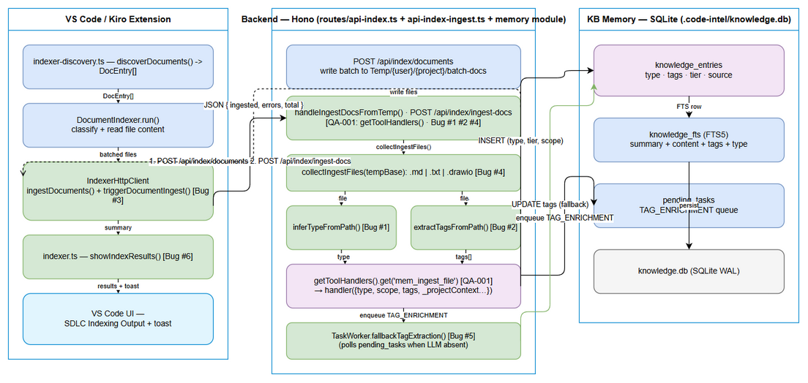
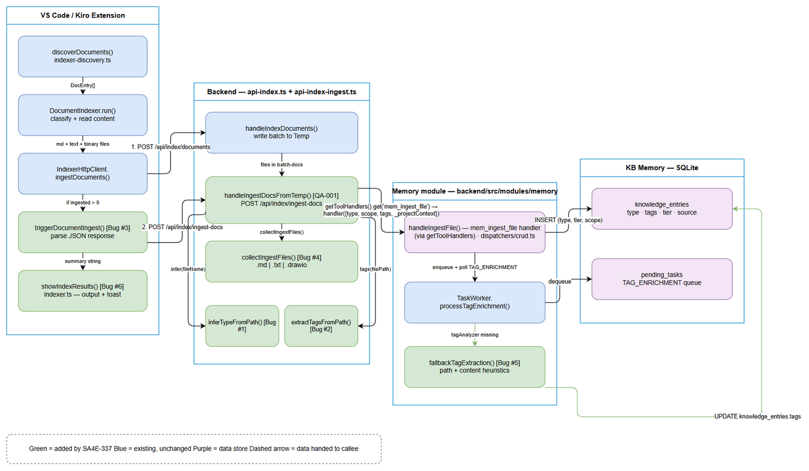
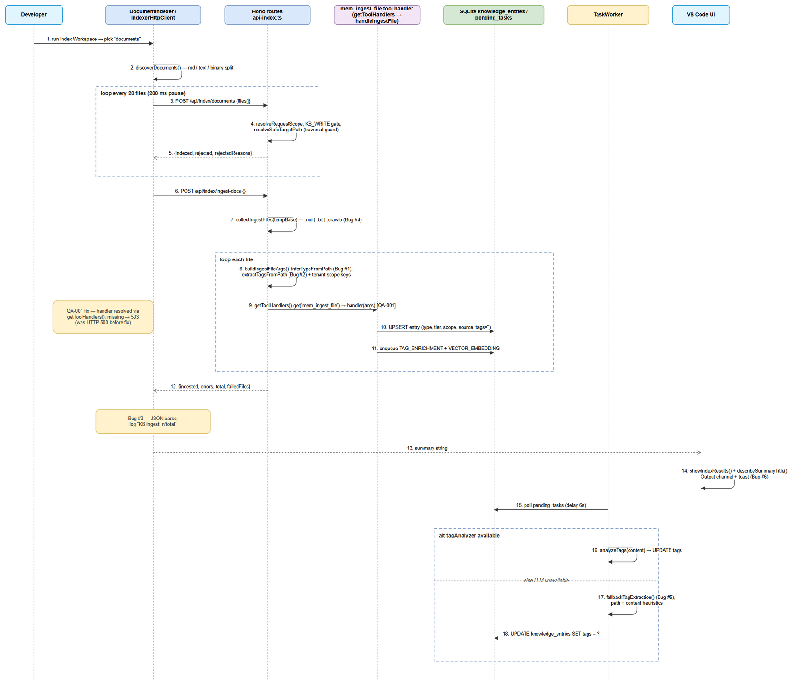
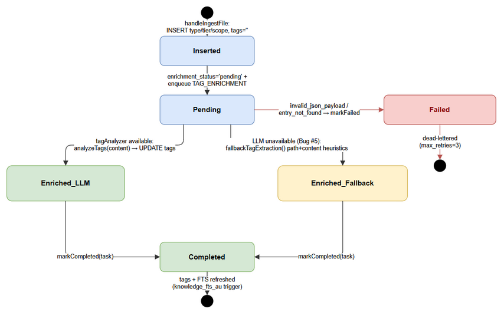
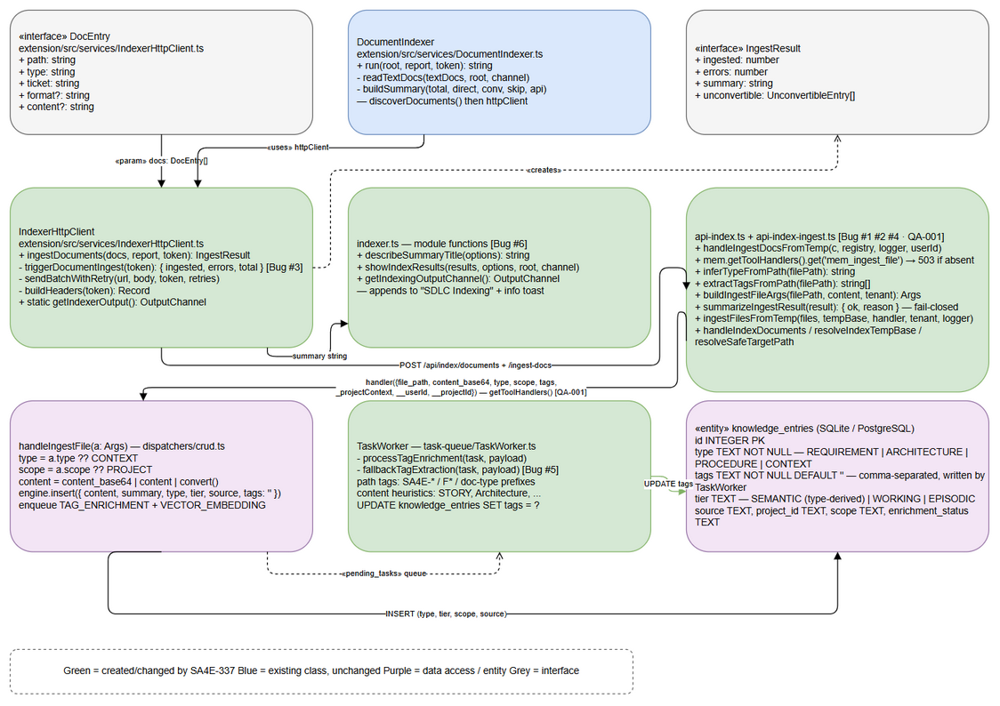

# Technical Design Document (TDD)

## SA4E-337 — Document Indexer: Fix auto-ingest into KB Memory with correct type/tags

---

## Document Information

| Field | Value |
|-------|-------|
| Jira Ticket | SA4E-337 |
| Title | Document Indexer: Index khong ingest vao KB Memory + thieu tags |
| Author | SA Agent |
| Version | 1.1 |
| Date | 2026-10-05 |
| Status | Final (retroactive — design reflects code as fixed for QA defect SA4E-337-QA-001) |
| Related BRD | documents/SA4E-337/BRD.md |
| Related FSD | documents/SA4E-337/FSD.md |
| Implementation Status | 6/6 bug fixes merged (`STATUS.json` → `phases.implementation = done`) |

> **Retroactive notice:** this TDD documents the design **as implemented**. Code verified against
> `backend/src/server/routes/api-index.ts`, `backend/src/server/routes/api-index-ingest.ts`,
> `backend/src/modules/memory/MemoryModule.ts`, `backend/src/modules/memory/task-queue/TaskWorker.ts`,
> `backend/src/modules/memory/dispatchers/crud.ts`, `extension/src/services/IndexerHttpClient.ts`,
> `extension/src/services/DocumentIndexer.ts`, `extension/src/indexer.ts`, `extension/src/indexer-discovery.ts`
> on 2026-10-05. Where the implementation deviates from FSD, the deviation is recorded in
> **Section 14** and in `documents/SA4E-337/DISCREPANCY.md`.
>
> **v1.1 update (defect SA4E-337-QA-001):** the original v1.0 §6.2 described a call to
> `mem.getDispatcher().dispatch(...)` — a method that does **not** exist on `MemoryModule`
> (it only exposes the `dispatcher` field and `setDispatcher()`), so `POST /api/index/ingest-docs`
> always failed with HTTP 500 (`mem.getDispatcher is not a function`). This revision corrects
> §6.2 (and §3.2/§5/§12) to the implemented design: `mem.getToolHandlers().get('mem_ingest_file')`
> with the full SA4E-337 args contract, and documents the new
> `backend/src/server/routes/api-index-ingest.ts` module (SRP split, per-file isolation,
> fail-closed `summarizeIngestResult()`).

---

## Author Tracking

| Agent | Role | Output |
|-------|------|--------|
| BA Agent | Requirements | BRD.md v1.0 |
| BA Agent | Specification | FSD.md v1.0 |
| DEV Agent | Implementation | 4 source files modified (6 bug fixes) |
| SA Agent | Design | TDD.md v1.0 (this document) + diagrams/architecture + diagrams/component + diagrams/class-diagram |

---

## Revision History

| Version | Date | Author | Changes |
|---------|------|--------|---------|
| 1.0 | 2026-10-05 | SA Agent | Initial TDD (retroactive). Architecture, API, data model, class design, security, E2E test architecture for the 6 bug fixes. |
| 1.1 | 2026-10-05 | SA Agent | Fix §6.2 design mismatch after defect SA4E-337-QA-001: `mem.getDispatcher().dispatch(...)` (nonexistent method → HTTP 500) replaced by `mem.getToolHandlers().get('mem_ingest_file')` with full args (`type`, `tags`, `scope`, `_projectContext`, `__userId`, `__projectId`). Document new `api-index-ingest.ts` module (§1.2, §2.2, §5.1, §5.2, §5.3), fail-closed `summarizeIngestResult()` verification (§3.2, §5.4, §12), updated diagrams. |

---

## 1. Introduction

### 1.1 Purpose

The Document Indexer discovered 1727 workspace files but produced only 3 KB Memory entries.
Root cause (from `STATUS.json` → `bugfix.rootCause`): **`handleIngestDocsFromTemp` hardcoded
`type = CONTEXT`, passed no tags, and never verified the ingest result**. This TDD specifies the
technical design of the fix — how document type derivation, tag extraction, ingest verification,
`.drawio` support, fallback tag extraction, and UI result display are implemented across the
VS Code extension and the Hono backend.

A subsequent QA defect (**SA4E-337-QA-001**, found after the initial fix merged) showed the
route's memory-module entry point `mem.getDispatcher()` **does not exist** on `MemoryModule`,
so `/api/index/ingest-docs` returned HTTP 500 for every call — none of the 6 bug fixes were
reachable. Version 1.1 of this TDD corrects §6.2 to the implemented design
(`mem.getToolHandlers().get('mem_ingest_file')`) and documents the refactored ingest module
`backend/src/server/routes/api-index-ingest.ts`.

### 1.2 Scope

**In scope:**

| Bug | Fix | Primary file |
|-----|-----|--------------|
| #1 | Type derivation `inferTypeFromPath()` | `backend/src/server/routes/api-index-ingest.ts` |
| #2 | Tag extraction `extractTagsFromPath()` | `backend/src/server/routes/api-index-ingest.ts` |
| #3 | Ingest result verification (JSON parse) | `extension/src/services/IndexerHttpClient.ts` |
| #4 | `.drawio` inclusion in ingest walk (`isIngestableFile()` / `collectIngestFiles()`) | `backend/src/server/routes/api-index-ingest.ts` |
| #5 | Fallback tag extraction (LLM unavailable) | `backend/src/modules/memory/task-queue/TaskWorker.ts` |
| #6 | UI result display `showIndexResults()` | `extension/src/indexer.ts` |
| QA-001 | Memory-module entry point: `getToolHandlers().get('mem_ingest_file')` instead of nonexistent `getDispatcher()` (HTTP 500 → fixed) | `backend/src/server/routes/api-index.ts` + `api-index-ingest.ts` |

**Out of scope:** backend Knowledge Service API redesign (SA4E-85); Pega rule indexing (SA4E-230);
Jira ticket indexing pipeline; refactoring unrelated to the index/ingest flow; new DB migrations
(no schema change — see Section 4).

### 1.3 Technology Stack

| Layer | Technology | Evidence |
|-------|-----------|----------|
| Extension | TypeScript, VS Code extension API (OutputChannel, QuickPick, window.showInformationMessage) | `extension/src/indexer.ts` |
| HTTP client | Native `fetch` + `AbortSignal.timeout`, singleton OutputChannel | `IndexerHttpClient.ts` |
| Backend | Hono routes on Node, pino logger | `backend/src/server/routes/api-index.ts` |
| Memory module | ModuleRegistry → `getToolHandlers().get('mem_ingest_file')` (decorated: `withErrorHandling(withScopeContext(withResultFormat(...)))`) → `MemoryEngine.insert()` | `MemoryModule.ts`, `dispatchers/crud.ts` |
| Async enrichment | `pending_tasks` queue polled by `TaskWorker` (first poll delayed 6 s) | `TaskWorker.ts` |
| Storage | SQLite (WAL) `.code-intel/knowledge.db`, knex migrations, FTS5 | `migrations/000-init-system-tables.cjs` |
| Tests | vitest (unit + integration + e2e), in-repo `sa4e-testkit` | `backend/tests/`, `extension/src/__tests__/` |

### 1.4 Design Principles

1. **Derive at the server, once** — KB `type` and `tags` are derived in
   `handleIngestDocsFromTemp` from the canonical temp path; the client-sent `DocEntry.type` is not
   trusted for persistence (single source of truth).
2. **Two-phase staging (SA4E-99)** — write phase (`POST /api/index/documents`) and ingest phase
   (`POST /api/index/ingest-docs`) are separate: the backend ingests each temp file exactly once
   after all batches are written (no per-file KB write during batching).
3. **Fail-safe defaults, never fail the run** — unknown filename → `CONTEXT` (BR-02); LLM absent →
   heuristic fallback tags (Bug #5); JSON parse failure → treated as failure but indexing continues.
4. **Reuse existing security infra** — session auth, `KB_WRITE` RBAC, JWT project binding, path
   sanitizer: no new framework (SA4E-300 pattern).
5. **No new dependencies** — all fixes are pure TypeScript within existing modules.

### 1.5 Constraints

- `mem_ingest_file` tool schema exposes only `{ file_path, content_base64, type }` — `tags` and
  `scope` are passed by the route but **`handleIngestFile` ignores `a.tags`** and persists
  `tags = ''` (Section 4.3, Section 14 DISC-2). Tags materialize asynchronously via
  `TAG_ENRICHMENT` / `fallbackTagExtraction`.
- **Only supported entry point into the memory module for routes** is
  `MemoryModule.getToolHandlers()` (returns `Map<string, ToolHandler>`; each handler is decorated
  with `withErrorHandling → withScopeContext → withResultFormat`). `MemoryModule` exposes **no
  `getDispatcher()` method** — calling it throws `TypeError` → HTTP 500 (defect SA4E-337-QA-001,
  see §6.2). Calling the bare `mem.dispatcher.dispatch()` instead would skip `withScopeContext()`
  and write `project_id = NULL` (tenant leak) — also forbidden.
- Retroactive document: code is already merged; design must match code, not the other way around.
- FSD Section 3.1.6/5.1 API contract (`POST /api/v1/ingestDocuments`) does not exist in the
  codebase — the real endpoints are `/api/index/documents` + `/api/index/ingest-docs`
  (Section 14 DISC-1).

### 1.6 References

| Ref | Document / File |
|-----|-----------------|
| BRD | `documents/SA4E-337/BRD.md` (6 stories, §2.3) |
| FSD | `documents/SA4E-337/FSD.md` (UC-01..UC-06, BR-01..BR-28) |
| STATUS | `documents/SA4E-337/STATUS.json` |
| Backend route | `backend/src/server/routes/api-index.ts` |
| Ingest helpers (QA-001) | `backend/src/server/routes/api-index-ingest.ts` |
| Memory module tool handlers | `backend/src/modules/memory/MemoryModule.ts` (`getToolHandlers()`) |
| Memory dispatcher | `backend/src/modules/memory/dispatchers/crud.ts` |
| Task worker | `backend/src/modules/memory/task-queue/TaskWorker.ts` |
| HTTP client | `extension/src/services/IndexerHttpClient.ts` |
| Document runner | `extension/src/services/DocumentIndexer.ts` |
| Discovery | `extension/src/indexer-discovery.ts` |
| UI | `extension/src/indexer.ts` |
| Schema | `backend/src/database/migrations/000-init-system-tables.cjs` |
| Code intelligence | `.analysis/code-intelligence/project-structure.md` |

---

## 2. System Architecture

### 2.1 Architecture Overview

The fix spans two processes — the **VS Code / Kiro extension** (client) and the **backend Hono
server** (owner of KB Memory). The index flow is a two-phase pipeline: *staged write* then
*single-pass KB ingest*, followed by *asynchronous tag enrichment*.


*[Edit in draw.io](diagrams/architecture.drawio)*

**Data flow (FSD §2.2, as implemented):**

```
Workspace Scan → File Classification → Staged Temp Write → (server) Type Derivation
→ Tag Extraction → mem_ingest_file (scoped tool handler) → pending_tasks TAG_ENRICHMENT
→ Result JSON → UI Display
```

### 2.2 Component Diagram


*[Edit in draw.io](diagrams/component.drawio)*

| Component | Location | Responsibility | Bug |
|-----------|----------|----------------|-----|
| `discoverDocuments()` | `extension/src/indexer-discovery.ts` | BFS scan of `documents/`, denylist, `DOCUMENT_TYPES` classification, ticket label | — |
| `DocumentIndexer.run()` | `extension/src/services/DocumentIndexer.ts` | Split markdown/text (read locally) vs binary (server convert), build summary | — |
| `IndexerHttpClient.ingestDocuments()` | `extension/src/services/IndexerHttpClient.ts` | Batched temp write (20/batch, 200 ms pause, retry 3→2), then trigger KB ingest | #3 |
| `triggerDocumentIngest()` | `extension/src/services/IndexerHttpClient.ts` | `POST /api/index/ingest-docs`, `JSON.parse` → `{ ingested, errors, total }` | #3 |
| `handleIndexDocuments()` | `backend/src/server/routes/api-index.ts` | Write batch to `Temp/{user}/{project}/batch-docs/` via `resolveSafeTargetPath` | — |
| `handleIngestDocsFromTemp()` | `backend/src/server/routes/api-index.ts` | Resolve scoped `mem_ingest_file` handler via `getToolHandlers()` (QA-001; missing/not-ready → 503) → delegate to `ingestFilesFromTemp()` → `{ ingested, errors, total, failedFiles }` | #1 #2 #4 QA-001 |
| `inferTypeFromPath()` | `backend/src/server/routes/api-index-ingest.ts` | Regex on basename → `REQUIREMENT / ARCHITECTURE / PROCEDURE / CONTEXT` | #1 |
| `extractTagsFromPath()` | `backend/src/server/routes/api-index-ingest.ts` | Path segments → `sa4e`, `sa4e-337`, `feature`, `f3`… | #2 |
| `isIngestableFile()` / `collectIngestFiles()` | `backend/src/server/routes/api-index-ingest.ts` | `.md` / `.txt` / `.drawio` filter + recursive temp walk (single pass) | #4 |
| `buildIngestFileArgs()` | `backend/src/server/routes/api-index-ingest.ts` | Handler args: `{ file_path, content_base64, type, scope: 'PROJECT', tags, _projectContext, __userId, __projectId }` (tenant scope keys — QA-001) | QA-001 |
| `summarizeIngestResult()` | `backend/src/server/routes/api-index-ingest.ts` | Fail-closed verdict on each handler result (5 branches: `isError` / empty / `Error:` / JSON `status≠ingested` / ok) — prevents `ingested++` on failures | QA-001 |
| `ingestOneFile()` / `ingestFilesFromTemp()` | `backend/src/server/routes/api-index-ingest.ts` | Per-file isolation: read → handler → verify → count; one bad file never aborts the run | QA-001 |
| `handleIngestFile()` | `backend/src/modules/memory/dispatchers/crud.ts` | UPSERT entry (`type`, `tier`, `scope`, `source`), `tags=''`, enqueue enrichment | — |
| `processTagEnrichment()` | `backend/src/modules/memory/task-queue/TaskWorker.ts` | LLM tag analysis when `tagAnalyzer` available, else fallback | #5 |
| `fallbackTagExtraction()` | `backend/src/modules/memory/task-queue/TaskWorker.ts` | Path + content heuristics → `UPDATE knowledge_entries.tags` | #5 |
| `showIndexResults()` / `describeSummaryTitle()` | `extension/src/indexer.ts` | Summary title per selected ops, results + next steps, toast with "Open Output" | #6 |

### 2.3 Deployment Architecture

No deployment change. Both processes run on the developer machine:

- **Backend**: Node/Hono service, default `http://127.0.0.1:48721`
  (`extension/src/config/backend-url.ts → DEFAULT_BACKEND_URL`), overridable via `backend.url` setting.
- **Extension**: VS Code/Kiro extension host; talks to backend over HTTP with Bearer session/JWT.
- **Storage**: single SQLite file `.code-intel/knowledge.db` (WAL) shared by backend routes,
  dispatcher and `TaskWorker`. PostgreSQL (`pg`) remains an alternative adapter; nothing in this
  fix is engine-specific (all SQL goes through the adapter).
- **Temp staging**: `{indexTempDir}/{userId}/{projectId}/batch-docs/` where `indexTempDir` =
  `CODE_INTEL_INDEX_TEMP_DIR` or `os.tmpdir()/CodeIntel`.

### 2.4 Communication Patterns & End-to-End Request Flow

- **Sync**: extension → backend REST/JSON — one round-trip per batch write + one round-trip for
  ingest (`AbortSignal.timeout(60000)` on the ingest trigger).
- **Async**: backend → `pending_tasks` queue; `TaskWorker` polls (first poll delayed 6 s to allow
  LLM health-check / `setTagAnalyzer`), executes `TAG_ENRICHMENT` (LLM) or fallback, then
  `UPDATE knowledge_entries SET tags = ?`.
- **Backpressure**: `INDEX_CONCURRENCY_LIMIT = 3` returns `429` — enforced on `POST /api/index/source`
  only (Section 3.3).


*[Edit in draw.io](diagrams/sequence-e2e.drawio)*

---

## 3. API Design

> **FSD contract vs reality:** FSD §3.1.6/§5.1 specifies `POST /api/v1/ingestDocuments`.
> That endpoint does not exist. The implemented contract is two endpoints under
> `/api/index/*` (see mapping in Section 3.4 and DISC-1 in Section 14). This section documents
> the **actual** contract verified in `api-index.ts`.

### 3.1 `POST /api/index/documents` — staged write (batch)

Writes file contents into the per-user/per-project temp staging area. It does **not** touch KB.

**Headers**

| Header | Required | Value |
|--------|----------|-------|
| `Authorization` | Yes | `Bearer <session-or-JWT-token>` |
| `X-Project-Id` | Yes | project id (fail-closed if missing → 400 `PROJECT_REQUIRED`) |
| `X-Workspace-Root` | No | display/scan hint only — never identity |
| `Content-Type` | Yes | `application/json` |

**Request body**

```json
{
  "files": [
    {
      "path": "documents/SA4E-337/BRD.md",
      "content": "# Functional Specification Document (FSD)\n..."
    }
  ]
}
```

| Field | Type | Required | Validation |
|-------|------|----------|------------|
| `files` | `SourceFile[]` | Yes | must be an array (`400` otherwise) |
| `files[].path` | string | Yes | relative path; `resolveSafeTargetPath()` rejects absolute paths, drive letters, `..`, null bytes, URI-encoded traversal; result must stay inside `tempBase` |
| `files[].content` | string | Yes | UTF-8 text (binary docs arrive as converted text or are listed without content) |

**Success response — 200**

```json
{
  "indexed": 150,
  "rejected": [],
  "rejectedReasons": []
}
```

| Field | Type | Description |
|-------|------|-------------|
| `indexed` | number | files written to `batch-docs/` |
| `rejected` | string[] | unsafe `path` values refused |
| `rejectedReasons` | `{file, code, message}[]` | `EACCES` for traversal, OS error codes for I/O failures |

**Error responses** (standard envelope `{ error, details, action }`)

| Status | `error` | Trigger |
|--------|---------|---------|
| 400 | `files array required` | body missing/not array |
| 400 | `X-Project-Id required for indexing` | missing `X-Project-Id` (`indexError` maps `PROJECT_REQUIRED`) |
| 401 | `Unauthorized` | missing/invalid Bearer token (`requireAuth` → `validateSession`) |
| 403 | `Forbidden` | principal lacks `KB_WRITE`, or JWT project outside grant (`verifyIndexProjectBinding`) |
| 500 | `Internal error` / `Disk full` / `Permission denied` | write failure (`indexError` maps `ENOSPC`/`EACCES`) |

**Example (rejected traversal)**

```json
{
  "indexed": 3,
  "rejected": ["../../etc/passwd"],
  "rejectedReasons": [
    { "file": "../../etc/passwd", "code": "EACCES",
      "message": "Unsafe path: must be a relative path staying within the temp directory" }
  ]
}
```

### 3.2 `POST /api/index/ingest-docs` — KB ingest from temp (single pass)

**Headers:** same as §3.1 (`Authorization`, `X-Project-Id` required).
**Body:** `{}` (empty JSON object — all inputs are server-side).

**Processing (server):**

1. `resolveRequestScope(c)` → `requireProjectId` (fail-closed).
2. `requireIndexPermission(c, userId, 'KB_WRITE')` + `verifyIndexProjectBinding`.
3. `resolveIndexTempBase(userId, projectId, 'batch-docs')`; if missing → early return.
4. `collectIngestFiles(tempBase)` collecting `*.md | *.txt | *.drawio` (**Bug #4**, `isIngestableFile`).
5. Resolve the memory-module tool handler (**QA-001**):
   `const mem = registry.getModule('memory')` (typed `IModule`, no `any`) → status must be
   `ready` else `503` → `const ingestHandler = mem.getToolHandlers().get('mem_ingest_file')`
   → handler absent → `503 { details: 'mem_ingest_file tool handler is unavailable' }`.
   *(The previous `mem.getDispatcher().dispatch(...)` call referenced a nonexistent method —
   HTTP 500 on every request; see §6.2.)*
6. `ingestFilesFromTemp(files, tempBase, ingestHandler, tenant, logger)` — per file:
   `inferTypeFromPath(filePath)` (**Bug #1**) + `extractTagsFromPath(filePath)` (**Bug #2**) →
   `buildIngestFileArgs()` → `handler({ file_path, content_base64, type, scope: 'PROJECT',
   tags: tags.join(','), _projectContext: { userId, projectId }, __userId, __projectId })`
   (tenant scope keys are required — `withScopeContext()` prefers `_projectContext`,
   canonical fallback `__userId`/`__projectId`).
7. `summarizeIngestResult(result)` verifies the result **before** counting: the decorated
   handler chain (`withErrorHandling → withScopeContext → withResultFormat`) never throws —
   failures surface as `{ isError: true }`, a `"Error: ..."` string, or JSON
   `{ status: 'unconvertible' | ... }` → classified as failure (fail-closed, empty = failure).
8. Aggregate `{ ingested, errors, total, failedFiles }` (per-file isolation — one bad file
   never aborts the run).

**Success response — 200**

```json
{
  "ingested": 150,
  "errors": 2,
  "total": 152,
  "failedFiles": [
    { "file": "SA4E-337/attachments/spec.pdf", "reason": "no-tool" }
  ]
}
```

Empty staging area (not an error):

```json
{ "ingested": 0, "message": "No documents in Temp folder" }
```

**Error responses**

| Status | `error` | Trigger |
|--------|---------|---------|
| 400 | `X-Project-Id required for indexing` | missing project identity |
| 401 | `Unauthorized` | no/invalid Bearer token |
| 403 | `Forbidden` | missing `KB_WRITE` or project outside JWT grant |
| 503 | `Memory module not ready` | memory module status ≠ `ready`, **or** `getToolHandlers()` map has no `mem_ingest_file` entry (`details: 'mem_ingest_file tool handler is unavailable'`) |
| 500 | `Error ingesting documents from Temp` | unexpected exception (`indexError`) |

**Type derivation rules (Bug #1 — `inferTypeFromPath`, uppercased basename, regex prefix):**

| Pattern (basename, uppercased) | Type |
|--------------------------------|------|
| `^BRD`, `^FSD` | `REQUIREMENT` |
| `^TDD` | `ARCHITECTURE` |
| `^STP\|^STC\|^DPG\|^RLN\|^UG\|^RUN-LOG` | `PROCEDURE` |
| everything else (incl. `.drawio`, `meeting-notes.md`) | `CONTEXT` |

**Tag extraction rules (Bug #2 — `extractTagsFromPath`, path segments, `\` → `/`):**

| Segment pattern | Tags added |
|-----------------|------------|
| `^SA4E-\d+$` (case-insensitive) | `sa4e`, lowercased key (e.g. `sa4e-337`) |
| `^F\d+$` (case-insensitive) | `feature`, lowercased key (e.g. `f3`) |
| no match | `[]` — server passes empty list; final tags come from `TAG_ENRICHMENT` / `fallbackTagExtraction` (§4.3) |

Example: `Temp/{u}/{p}/batch-docs/documents/SA4E-337/BRD.md` → tags `sa4e, sa4e-337`.

### 3.3 Cross-cutting API behaviour

| Concern | Behaviour |
|---------|-----------|
| Auth | Every `/api/index/*` route: `requireAuth` → opaque session via `validateSession`, else `401 {error, details, action}` |
| Authorization | `getUserPermissions(userId)` must include `KB_WRITE` (fail-closed on DB error → 403) |
| Tenant binding | `verifyJwtToken` + `allowedProjectsFromClaims`: opaque session tokens carry no per-project grant (global gate only, documented PO risk-accept); JWT principals must have `pid/pids` covering `X-Project-Id` |
| Rate limiting | `INDEX_CONCURRENCY_LIMIT = 3` → `429 {error:'Server busy', retryAfter: 2}` — **enforced only on `POST /api/index/source`**; `/documents` and `/ingest-docs` rely on the client's single-flight sequencing (Section 8.4) |
| Error envelope | always `{ error: string, details: string, action: string }`; `details` truncated to 2000 chars |
| Pagination | none (batch-oriented, not resource-oriented) |
| Idempotency | re-running ingest is safe: `handleIngestFile` deletes prior entries/graph nodes/tasks with the same `source` (+ `project_id`) before inserting (SA4E-163 `UNIQUE(source, project_id)` UPSERT) |

### 3.4 FSD contract mapping

| FSD (§3.1.6, §5.1) | Implemented | Note |
|--------------------|-------------|------|
| `POST /api/v1/ingestDocuments` | `POST /api/index/documents` **then** `POST /api/index/ingest-docs` | DISC-1 |
| `docs[]` with `path, type, tags, relativePath` | `files[]` with `path, content` only — type/tags derived server-side | DISC-6 |
| response `{ success, ingested, converted, skipped, unconvertible }` | write `{indexed, rejected, rejectedReasons}` + ingest `{ingested, errors, total, failedFiles}` | DISC-1 |
| client verifies JSON (BR-12) | `triggerDocumentIngest()` parses JSON, logs `KB ingest: n/total, e errors`, returns zeros on failure | Bug #3 ✅ |

---

## 4. Database Design

### 4.1 Change Impact: **none**

SA4E-337 introduces **no new tables, columns, or indexes** and requires **no migration**. The fix
writes into the existing KB schema; deployment Section 10.4 confirms zero migration steps.

### 4.2 Existing tables used (actual DDL, `000-init-system-tables.cjs`)

```sql
CREATE TABLE IF NOT EXISTS knowledge_entries (
  id INTEGER PRIMARY KEY AUTOINCREMENT,
  content TEXT NOT NULL,
  summary TEXT NOT NULL,
  type TEXT NOT NULL,                       -- Bug #1 target: REQUIREMENT|ARCHITECTURE|PROCEDURE|CONTEXT
  tier TEXT NOT NULL DEFAULT 'WORKING',     -- derived: tierForType(type)
  scope TEXT NOT NULL DEFAULT 'USER',       -- ingest path forces 'PROJECT'
  user_id TEXT DEFAULT NULL,
  project_id TEXT DEFAULT NULL,             -- from X-Project-Id (tenant binding)
  source TEXT,                              -- temp file path — idempotency key
  source_ref TEXT,
  tags TEXT NOT NULL DEFAULT '',            -- Bug #2/#5 target: comma-separated list
  confidence REAL NOT NULL DEFAULT 1.0,
  access_count INTEGER NOT NULL DEFAULT 0,
  created_at TEXT NOT NULL DEFAULT (datetime('now')),
  updated_at TEXT NOT NULL DEFAULT (datetime('now')),
  last_accessed_at TEXT,
  expires_at TEXT,
  pinned INTEGER NOT NULL DEFAULT 0,
  pin_order INTEGER NOT NULL DEFAULT 0,
  structured_map TEXT NOT NULL DEFAULT '{}',
  quality_score INTEGER DEFAULT NULL,
  archived INTEGER NOT NULL DEFAULT 0,
  agent_name TEXT DEFAULT NULL,
  owner TEXT DEFAULT NULL,
  needs_verification INTEGER NOT NULL DEFAULT 0,
  epoch_id TEXT DEFAULT NULL,
  superseded_by INTEGER DEFAULT NULL
);

CREATE VIRTUAL TABLE IF NOT EXISTS knowledge_fts USING fts5(
  summary, content, tags, type,
  content=knowledge_entries, content_rowid=id,
  tokenize='porter unicode61'
);
-- triggers knowledge_fts_ai / _ad / _au keep FTS in sync on INSERT/DELETE/UPDATE
-- (UPDATE tags by TaskWorker therefore refreshes the tags FTS column automatically)

CREATE TABLE IF NOT EXISTS pending_tasks (
  id INTEGER PRIMARY KEY,
  task_type TEXT NOT NULL,                 -- 'TAG_ENRICHMENT' | 'VECTOR_EMBEDDING'
  entry_id INTEGER NOT NULL,
  status TEXT NOT NULL DEFAULT 'pending',  -- pending → running → completed | failed
  payload TEXT NOT NULL,                   -- { entry_id, content, existing_tags, options }
  error TEXT, error_message TEXT,
  retry_count INTEGER NOT NULL DEFAULT 0,
  max_retries INTEGER NOT NULL DEFAULT 3,
  priority INTEGER NOT NULL DEFAULT 5,
  created_at TEXT NOT NULL DEFAULT (datetime('now')),
  started_at, completed_at, updated_at, claimed_at, dead_lettered_at TEXT,
  FOREIGN KEY (entry_id) REFERENCES knowledge_entries(id) ON DELETE CASCADE
);
CREATE INDEX IF NOT EXISTS idx_pending_tasks_status_created ON pending_tasks(status, created_at);
CREATE INDEX IF NOT EXISTS idx_pending_tasks_entry_id ON pending_tasks(entry_id);
```

### 4.3 Write paths exercised by this fix

| Step | Statement | Location |
|------|-----------|----------|
| Ingest | `engine.insert({ content, summary, type, tier: tierForType(type), scope, user_id, project_id, source: filePath, tags: '' })` — UPSERT on `UNIQUE(source, project_id)` | `crud.ts → handleIngestFile` |
| Mark pending | `UPDATE knowledge_entries SET enrichment_status = 'pending' WHERE id = ?` | `handleIngestFile` |
| Enqueue | `INSERT pending_tasks (TAG_ENRICHMENT, payload {existing_tags: ''})` + optional `VECTOR_EMBEDDING` | `handleIngestFile` |
| Tags (LLM) | `UPDATE knowledge_entries SET tags = ? WHERE id = ? AND enrichment_status = 'pending'` | `TaskWorker.processTagEnrichment` |
| Tags (fallback, Bug #5) | `UPDATE knowledge_entries SET tags = ? WHERE id = ?` (merges `existing_tags` + derived) | `TaskWorker.fallbackTagExtraction` |

> ⚠️ **Design fact:** the `tags` argument computed by `buildIngestFileArgs()`
> (`extractTagsFromPath(...).join(',')`, sent by `handleIngestDocsFromTemp`) is dropped in
> `handleIngestFile` (`tags: ''` at insert). Effective tags therefore always come from the async
> enrichment step — LLM analysis of `content`, or the path/content heuristics of
> `fallbackTagExtraction` (which reads `payload.source` = temp path, preserving `SA4E-*` /
> doc-type tags). See DISC-2.

**`tierForType()` mapping** (`dispatchers/helpers.ts`): `REQUIREMENT | ARCHITECTURE | PROCEDURE |
API_DESIGN → SEMANTIC`; `DECISION | LESSON_LEARNED | ERROR_PATTERN → EPISODIC`; else `WORKING`.

### 4.4 Query patterns

| # | Pattern | Plan notes |
|---|---------|------------|
| Q1 | UPSERT by `source` (+ `project_id`) | backed by the SA4E-163 uniqueness on `(source, project_id)` — one row per file; re-ingest replaces content instead of duplicating |
| Q2 | `UPDATE knowledge_entries SET tags = ? WHERE id = ?` (PK lookup) | O(1); triggers `knowledge_fts_au` → tags searchable via FTS immediately |
| Q3 | `SELECT ... FROM pending_tasks WHERE status = 'pending' ORDER BY created_at` | covered by `idx_pending_tasks_status_created` |
| Q4 | FTS search `knowledge_fts(tags, type, ...)` | refreshed by triggers — no manual reindex |
| Q5 | Stale cleanup `DELETE FROM knowledge_entries WHERE source = ? [AND project_id = ?]` before insert | graph nodes + stale `pending_tasks` deleted first (FK ordering, D3 fix) |

### 4.5 Data volume

| Metric | Estimate |
|--------|----------|
| Files discovered per workspace run | ~1727 (BRD baseline) |
| `knowledge_entries` growth | ≈1 row per indexable file (deduped by `source`) |
| `pending_tasks` peak | 2 tasks/entry (`TAG_ENRICHMENT` + `VECTOR_EMBEDDING`), drained by worker poll |
| FTS rows | 1:1 with entries, maintained by triggers |

### 4.6 Entity lifecycle (KB entry enrichment)


*[Edit in draw.io](diagrams/state-enrichment.drawio)*

---

## 5. Class / Module Design

### 5.1 Package Structure (files touched by SA4E-337)

```
extension/src/
├── indexer-discovery.ts          # discoverDocuments(), DOCUMENT_TYPES, INDEXABLE_EXTENSIONS (unchanged)
├── indexer.ts                    # [Bug #6] showIndexResults(), describeSummaryTitle()
└── services/
    ├── DocumentIndexer.ts        # run(), readTextDocs(), buildSummary() (unchanged)
    └── IndexerHttpClient.ts      # [Bug #3] ingestDocuments(), triggerDocumentIngest()

backend/src/
├── server/routes/
│   ├── api-index.ts              # [QA-001] handleIngestDocsFromTemp (route wiring: resolve
│   │                             #   getToolHandlers().get('mem_ingest_file') + 503 guards,
│   │                             #   delegate to ingestFilesFromTemp), handleIndexDocuments,
│   │                             #   writeFilesPhase, resolveIndexTempBase, resolveSafeTargetPath,
│   │                             #   sanitizePathSegment, registerIndexRoutes, indexError
│   ├── api-index-ingest.ts       # [NEW — Bug #1 #2 #4 + QA-001, SRP split, ~190 LOC]
│   │                             #   inferTypeFromPath, extractTagsFromPath, isIngestableFile,
│   │                             #   collectIngestFiles, buildIngestFileArgs,
│   │                             #   summarizeIngestResult, ingestOneFile, ingestFilesFromTemp,
│   │                             #   IngestTenant, IngestOutcome
│   └── __tests__/api-index-errors.test.ts   # auth/path unit tests + QA-001 root-cause guard
│                                             # (mock MemoryModule deliberately has NO getDispatcher)
└── modules/memory/
    ├── MemoryModule.ts           # getToolHandlers() — withErrorHandling(withScopeContext(
    │                             #   withResultFormat(dispatch)))  ← QA-001 entry point
    ├── dispatchers/crud.ts       # handleIngestFile() (consumes type/scope; ignores tags)
    ├── dispatchers/helpers.ts    # tierForType(), inferOwner(), resolvePath()
    └── task-queue/TaskWorker.ts  # [Bug #5] processTagEnrichment(), fallbackTagExtraction()
```

### 5.2 Key Interfaces (actual TypeScript)

```typescript
// extension/src/services/IndexerHttpClient.ts
export interface DocEntry {
  path: string;        // relative path e.g. documents/SA4E-337/BRD.md
  type: string;        // classified client-side (server re-derives on ingest)
  ticket: string;      // folder label (e.g. SA4E-337 / documents / GRAPH-EMAIL)
  format?: string;     // 'markdown' | 'text' | extension-derived
  content?: string;    // loaded for md/text; undefined for binary (server converts)
}

export interface FileEntry { path: string; content: string; }        // /api/index/documents body
export interface UnconvertibleEntry { file: string; reason: string; }

export interface IngestResult {
  ingested: number;
  errors: number;
  summary: string;                       // "✅ Indexed: n files, 📚 KB: n ingested"
  unconvertible: UnconvertibleEntry[];
}

// extension/src/services/IndexerHttpClient.ts (Bug #3 — actual return)
private async triggerDocumentIngest(token?: string):
  Promise<{ ingested: number; errors: number; total: number }>
```

```typescript
// backend/src/server/routes/api-index-ingest.ts (pure helpers — Bug #1/#2/#4 + QA-001)
export interface IngestTenant { userId: string; projectId: string; }
export interface IngestOutcome {
  ingested: number; errors: number; total: number;
  failedFiles: { file: string; reason: string }[];
}
export function inferTypeFromPath(filePath: string): string
export function extractTagsFromPath(filePath: string): string[]
export function isIngestableFile(fileName: string): boolean
export function collectIngestFiles(tempBase: string): string[]
export function buildIngestFileArgs(filePath: string, content: string,
                                    tenant: IngestTenant): Record<string, unknown>
export function summarizeIngestResult(result: ToolResult | null | undefined):
  { ok: boolean; reason: string }                       // fail-closed, 5 branches
export async function ingestFilesFromTemp(files: string[], tempBase: string,
    handler: ToolHandler, tenant: IngestTenant, logger: Logger): Promise<IngestOutcome>

// backend/src/server/routes/api-index.ts (route wiring — QA-001 fix)
//   const mem = registry.getModule('memory');                       // IModule, no `any`
//   if (!mem || mem.status !== 'ready') → 503 'Memory module not ready'
//   const ingestHandler = mem.getToolHandlers().get('mem_ingest_file');
//   if (!ingestHandler) → 503 { details: 'mem_ingest_file tool handler is unavailable' }
export function resolveIndexTempBase(userId?: string, projectId?: string, subdir: string): string
export function resolveSafeTargetPath(tempBase: string, rawPath: string): string | null
export function sanitizePathSegment(segment?: string, fallback: string): string
export function registerIndexRoutes(app: Hono, registry: ModuleRegistry, logger: Logger): void
```

```typescript
// backend/src/modules/memory/task-queue/TaskWorker.ts (Bug #5)
private async processTagEnrichment(task: PendingTask, payload: any): Promise<void>
private async fallbackTagExtraction(task: PendingTask, payload: any): Promise<void>
// fallback inputs: payload.source (path segments) + payload.content (#### STORY, ## Architecture, ...)
// output: UPDATE knowledge_entries SET tags = ? WHERE id = ?  → markCompleted(task.id)
```


*[Edit in draw.io](diagrams/class-diagram.drawio)*

### 5.3 Design Patterns Used

| Pattern | Where | Why |
|---------|-------|-----|
| Two-phase staging (write → ingest) | `/documents` + `/ingest-docs` | one KB pass per run; retryable write phase without duplicate inserts (SA4E-99) |
| Single-responsibility module split | ingest helpers extracted to `api-index-ingest.ts`; `api-index.ts` keeps route wiring + auth gates only (SRP) | route file stays small; helpers unit-tested without Hono (`api-index-errors.test.ts` imports them directly) |
| Scoped tool-handler entry (QA-001) | `mem.getToolHandlers().get('mem_ingest_file')` — decorated `withErrorHandling(withScopeContext(withResultFormat(dispatch)))` | the ONLY supported memory-module entry point; injects trusted tenant scope → `knowledge_entries.project_id` populated. `getDispatcher()` does not exist; bare `mem.dispatcher.dispatch()` would leak `project_id = NULL` |
| Fail-closed result verification (QA-001) | `summarizeIngestResult()` before `ingested++` | handler chain never throws — verdict derived from `isError` / `"Error:"` prefix / JSON `status ≠ 'ingested'` / empty content; fixes the "count successes unconditionally" bug |
| Per-file isolation | `ingestOneFile()` catch → `failedFiles[{file, reason}]` | one bad file never aborts the run (SA4E-99) |
| Pure helper functions | `inferTypeFromPath`, `extractTagsFromPath`, `summarizeIngestResult`, `describeSummaryTitle` | unit-testable without Hono/VS Code context (≤20 LOC each) |
| Fail-closed authorization guards | `requireAuth` → `requireIndexPermission` → `verifyIndexProjectBinding` (composed per route) | consistent gate ordering; reused SA4E-300 infra |
| Strategy (with fallback) | `processTagEnrichment`: LLM `TagAnalyzerService` → `fallbackTagExtraction` heuristics | degradation path when LLM/health-check unavailable (Bug #5) |
| Idempotent UPSERT | `UNIQUE(source, project_id)` replace-on-ingest | re-index replaces rows instead of duplicating |
| Background enrichment queue | `pending_tasks` + polling worker | keeps `/ingest-docs` latency independent of LLM |
| Aggregate result object | `IngestResult`, `{ingested, errors, total, failedFiles}` | feeds UI summary (Bug #3/#6) |

### 5.4 Exception / Error Strategy

- **Backend**: route body wrapped in `try/catch` → `indexError(c, err, logger, context)` which
  special-cases `PROJECT_REQUIRED` → 400 and `ENOSPC`/`EACCES` → 500 with actionable `action`;
  details truncated to 2000 chars. Per-file ingest failures are collected (`failedFiles`) and do
  **not** abort the batch.
- **Ingest result verification (QA-001)**: the decorated handler chain
  (`withErrorHandling → withScopeContext → withResultFormat`) **never throws** — failures come
  back as `{ isError: true }` or as strings (`"Error: file not found"`,
  `{"status":"unconvertible","reason":"no-tool"}`). `summarizeIngestResult()` therefore
  classifies every result fail-closed (empty content = failure) and only `ok` results increment
  `ingested`; failures are logged
  `logger.warn({ file, reason }, '[ingest-docs] Failed to ingest document')` and pushed to
  `failedFiles`.
- **Extension**: `triggerDocumentIngest` catches fetch/timeout errors → logs
  `⚠️ Document ingest error: ...` → returns `{ingested:0, errors:0, total:0}` (run continues);
  non-OK status logged as `⚠️ Document ingest failed: status N`.
- **Worker**: `JSON.parse(payload)` failure → `markFailed(task.id, 'invalid_json_payload')`;
  missing entry → `entry_not_found`; fallback extraction errors are logged (`logger.warn`) but the
  task still `markCompleted` so the queue does not stall.

---

## 6. Integration Design

### 6.1 Extension ↔ Backend (HTTP)

| Setting | Value | Source |
|---------|-------|--------|
| Base URL | `http://127.0.0.1:48721` (configurable `backend.url`) | `config/backend-url.ts` |
| Auth header | `Authorization: Bearer <token>` via `buildHeaders()` | `IndexerHttpClient` |
| Batch size | 20 files per `POST /api/index/documents` (`DOCS_BATCH_SIZE`), `200 ms` pause between batches | `ingestDocuments()` |
| Retry | `sendBatchWithRetry(url, body, token, 3)` for writes; ingest trigger has no retry (single call) | `IndexerHttpClient` |
| Timeout | `AbortSignal.timeout(60000)` on `/api/index/ingest-docs` | `triggerDocumentIngest` |
| Backoff/failure | write batch failure → `errors += entries.length` + Output line `⚠️ Doc batch N: ...`, channel auto-shown | `ingestDocuments()` |

**Message format:** JSON over HTTP, `Content-Type: application/json`; responses are plain JSON
(no SSE). Progress is reported client-side via `vscode.Progress` (`report.report({message})`).

### 6.2 Backend ↔ Memory module (scoped tool-handler call)

> **v1.1 correction — defect SA4E-337-QA-001.** The previous revision of this section described
> `mem.getDispatcher().dispatch('mem_ingest_file', {...})`. `MemoryModule` has **no
> `getDispatcher()` method** (it only exposes the public `dispatcher` field and `setDispatcher()`),
> so that call threw `TypeError: mem.getDispatcher is not a function` → **every**
> `POST /api/index/ingest-docs` returned HTTP 500 and none of the 6 bug fixes were reachable.
> The implemented — and only supported — entry point is `MemoryModule.getToolHandlers()`.

**Actual flow (verified in `api-index.ts` + `api-index-ingest.ts`):**

```
handleIngestDocsFromTemp (api-index.ts)
  → registry.getModule('memory')                 // typed IModule (no `any`)
      if (!mem || mem.status !== 'ready')
        → 503 { error: 'Memory module not ready',
                details: 'Memory service is initializing',
                action: 'Retry after a short delay' }
  → ingestHandler = mem.getToolHandlers().get('mem_ingest_file')     // ← QA-001 FIX
      if (!ingestHandler)
        → 503 { error: 'Memory module not ready',
                details: 'mem_ingest_file tool handler is unavailable',
                action: 'Retry after a short delay' }
  → ingestFilesFromTemp(files, tempBase, ingestHandler,
                        { userId, projectId: scope.projectId }, logger)   // api-index-ingest.ts
      per file (sequential, isolated):
        content = fs.readFileSync(filePath, 'utf-8')
        result  = await ingestHandler(buildIngestFileArgs(filePath, content, tenant))
        where args = {
          file_path:          filePath,
          content_base64:     base64(content),
          type:               inferTypeFromPath(filePath),        // Bug #1 (SA4E-337 contract)
          scope:              'PROJECT',
          tags:               extractTagsFromPath(filePath).join(','),   // Bug #2
          _projectContext:    { userId, projectId },  // withScopeContext() PREFERS this key
          __userId:           userId,                 // canonical fallback (stampScope shape)
          __projectId:        projectId,              //   → knowledge_entries.project_id set
        }
        verdict = summarizeIngestResult(result)      // fail-closed — BEFORE counting
        if (verdict.ok) ingested++
        else { errors++; failedFiles.push({ file, reason: verdict.reason }) }
  → { ingested, errors, total, failedFiles[] }
```

**Inside the handler (`MemoryModule.getToolHandlers()`):**

```ts
withErrorHandling(logger, 'mem_ingest_file')(     // catches all throws → { isError: true }
  withScopeContext(this.dispatcher)(              // injects tenant scope from args
    withResultFormat(                             // normalizes to ToolResult { content, isError }
      async (args) => this.dispatcher.dispatch('mem_ingest_file', args),
    ),
  ),
)
```

- The chain **never throws** — hence `summarizeIngestResult()` must inspect
  `isError` / `"Error:"` prefix / JSON `status !== 'ingested'` / empty content
  (5 branches, fail-closed) before incrementing `ingested`.
- `withScopeContext()` reads the trusted scope keys from the args
  (`_projectContext` first, `__userId`/`__projectId` as canonical fallback) and injects it into
  the dispatcher → `knowledge_entries.project_id` is populated.

**Why not the alternatives:**

| Alternative | Verdict |
|-------------|---------|
| `mem.getDispatcher().dispatch(...)` | ❌ method does not exist → `TypeError` → HTTP 500 (**QA-001 root cause**) |
| `mem.dispatcher.dispatch(...)` (bare field) | ❌ skips `withScopeContext()` → `project_id = NULL` → tenant-isolation leak |
| `mem.getToolHandlers().get('mem_ingest_file')` | ✅ implemented — scoped, decorated, uniform `ToolResult` |

### 6.3 Backend ↔ TaskWorker (async queue)

| Aspect | Configuration |
|--------|---------------|
| Trigger | `handleIngestFile` creates `TAG_ENRICHMENT` (+ `VECTOR_EMBEDDING` when embedding available) |
| Poll | worker loop with **6 s initial delay** (LLM health check / `setTagAnalyzer` init) |
| Payload | `{ entry_id, content, existing_tags, options: { threshold: 0.6, autoApply: true } }` |
| Retry | `max_retries = 3`, status `failed` with `error` code |
| Failure isolation | one bad payload marks that task failed; queue continues |

### 6.4 Fallback strategy summary

| Failure | Fallback |
|---------|----------|
| Unknown filename | type `CONTEXT` (BR-02) |
| No ticket-key tag segment | no server tags → async fallback/LLM tags; never blocks ingest |
| LLM/`tagAnalyzer` unavailable | `fallbackTagExtraction()` path + content heuristics (Bug #5) |
| Non-OK / invalid JSON from ingest API | zeros + Output warning; summary still rendered (Bug #3) |
| Missing memory module | `503 Memory module not ready` + retry guidance |
| `mem_ingest_file` handler absent from `getToolHandlers()` map | `503` with `details: 'mem_ingest_file tool handler is unavailable'` (QA-001 guard) |
| Handler result indicates failure (`isError` / `"Error:"` / `status≠ingested`) | counted in `errors` + `failedFiles[{file, reason}]`; run continues (§6.2) |
| Unsafe client path | rejected file reported in `rejectedReasons`, run continues |

### 6.5 Circuit breaker

None. The pipeline is single-caller (one VS Code command) and bounded by batch size + worker
retries; introducing a breaker would be a new dependency with no failure mode to protect against
(see constraint §1.4.5).

---

## 7. Security Design

### 7.1 Authentication

Every `/api/index/*` route runs `requireAuth(c)` **before** any handler work:

1. Read `Authorization: Bearer <token>` (empty → `401 Unauthorized / "Provide valid Bearer token"`).
2. `validateSession(token)` (opaque admin/session token) — invalid/expired → 401.

### 7.2 Authorization (layered, fail-closed)

Order inside `handleIndexDocuments` / `handleIngestDocsFromTemp` (SA4E-300 SEC High #1):

```
resolveRequestScope(c)                // X-Project-Id required — PROJECT_REQUIRED → 400
requireIndexPermission(c, userId, 'KB_WRITE')   // getUserPermissions; DB error → 403 (fail-closed)
verifyIndexProjectBinding(c, projectId)         // JWT pid/pids must cover projectId → 403
```

| Gate | Rule | Notes |
|------|------|-------|
| `KB_WRITE` | same permission id used by `kb-tags.ts`, `kb-operations.ts` | no new permission invented |
| Tenant binding | `verifyJwtToken` + `allowedProjectsFromClaims`; opaque session tokens carry no per-project grant → allowed at global gate only | documented PO risk-accept (no membership table) |

### 7.3 Input validation & path safety

`resolveSafeTargetPath(tempBase, rawPath)` (write phase) rejects, in order:
null bytes; URI-encoded traversal (`decodeURIComponent` then re-check); Windows drive-absolute
(`C:\`, `C:/`); leading `/` or `\`; `path.normalize` absolute results; any `..` segment in raw,
normalized, or decoded form; and finally verifies `path.relative(tempBase, target)` stays inside
tempBase. Rejections surface as `rejectedReasons[]` with `code: 'EACCES'` and are logged via
`logger.warn({rejectedReasons, projectId})`.

Additionally: `sanitizePathSegment()` strips every char outside `[A-Za-z0-9._-]` from
`userId`/`projectId` before they join a filesystem path (empty/`.`/`..` → fallback). Null bytes are
stripped from document text before insert (SA4E-53, PostgreSQL `0x00` rejection).

### 7.4 Data protection

| Aspect | Implementation |
|--------|----------------|
| In transit | HTTP to `127.0.0.1` loopback only by default (no TLS needed on-box); remote backends configured by user |
| At rest | SQLite file in workspace `.code-intel/` — inherits workspace permissions |
| Sensitivity | workspace documents = Internal (FSD §7.2); API responses transient |
| Audit | `engine.auditLog('INGEST_FILE')` per ingest; pino logs for `[index]`, `[ingest-docs]`; rejected-path warnings include `projectId` |

### 7.5 Non-goals

No new auth framework, no secrets in code, no permission escalation introduced by this ticket.

---

## 8. Performance & Scalability

### 8.1 Performance targets (BRD/FSD NFR)

| Target | Design answer |
|--------|---------------|
| 1727 files < 5 min | discovery is O(n) BFS; write phase = ~87 HTTP calls at batch 20; ingest phase = 1 HTTP call + in-process loop (no per-file HTTP) |
| 5000+ files | batch size fixed at 20 with 200 ms inter-batch pause → bounded memory (only one batch `FileEntry[]` alive at a time) |
| Single ingest pass | `collectIngestFiles()` walks temp **once**, then `ingestFilesFromTemp()` loops over the file list (SA4E-99) |

### 8.2 Bottleneck analysis

| Phase | Cost | Mitigation |
|-------|------|-----------|
| Discovery | file system BFS | denylist prunes `diagrams/testdata/templates/node_modules/.git` + dot-folders |
| Write phase | N/20 HTTP round-trips | batch + retry(3) with backoff |
| Ingest phase | N × (read file + `engine.insert` + 2 task inserts + graph upsert) | synchronous but DB-local; 60 s client timeout; per-file failures isolated |
| Enrichment | N LLM/heuristic tasks | async worker; fallback path is CPU-only heuristics (no network) |

### 8.3 Concurrency model

- `INDEX_CONCURRENCY_LIMIT = 3` guards `POST /api/index/source` with `429 + retryAfter: 2`.
- `/api/index/documents` and `/api/index/ingest-docs` are **not** individually throttled; the
  extension runs them single-flight (sequential batches → one ingest call), and `IndexingService`
  prevents overlapping index commands (SA4E-300/SA4E-300 concurrency guard, TC-29).
- SQLite WAL: writer is the single backend process; `TaskWorker` shares the same adapter.

### 8.4 Horizontal scaling

Not applicable — single-user local tool. The design scales *vertically* (larger workspaces) via
batching + async enrichment; nothing here assumes multiple ingest replicas.

### 8.5 Query optimization notes

No slow queries introduced: all statements are PK/`source`-keyed (Section 4.4). FTS stays current
via triggers instead of re-scan.

---

## 9. Monitoring & Observability

### 9.1 Logging (pino, structured)

| Logger | Event | Fields |
|--------|-------|--------|
| `api-index` | `[index] rejected unsafe paths` | `rejectedReasons[{file, code, message}]`, `projectId` |
| `api-index` | `[index] permission lookup failed — denying` / `missing required permission` | `err`, `userId`, `permissionId` |
| `api-index` | `[index] project outside principal grant — rejected` | `projectId`, `sub` |
| `api-index` | `[ingest-docs] Failed to ingest document` | `file` + `reason` (result verdict) or `err` (thrown), from `ingestOneFile()` |
| `api-index` | `[ingest-docs] Document ingest complete` | **`ingested`, `errors`, `total`** |
| TaskWorker | `Fallback tag extraction applied` | `entry_id`, `tags` |
| TaskWorker | `Fallback tag extraction failed` | `err`, `entry_id` |

Client-side logs go to the **"SDLC Indexing"** Output channel: per-file `📄 Text read`,
`📤 Server-convert`, `⚠️ Cannot read`, batch failures, and the verification line
`KB ingest: {ingested}/{total} files ingested, {errors} errors` (Bug #3).

### 9.2 Metrics to collect (from logs — no new telemetry dependency)

| Metric | Healthy | Alert |
|--------|---------|-------|
| `ingest.total` vs `ingest.ingested` ratio | ≥ 0.95 | < 0.9 → investigate `failedFiles` reasons |
| `ingest.errors` per run | 0 | > 0 sustained → check memory module status / converter |
| `rejectedReasons` count | 0 | > 0 → traversal/path bug or client regression |
| 403 rate on `/api/index/*` | 0 | > 0 → permission regression (SA4E-300 gate) |
| `fallbackTagExtraction` log frequency | occasional | dominant path → LLM health-check failing |
| `pending_tasks` backlog (`status='pending'` age) | drained within minutes | > 15 min → worker not polling / crashed |

### 9.3 Health checks

- `GET /api/index/progress` (authenticated) — existing index progress endpoint.
- Memory module readiness is self-reported (`status === 'ready'`) and surfaced as `503` with
  `action: "Retry after a short delay"`.
- E2E smoke: empty-run returns `"ℹ️ No documents found in documents/ folder"` (proves discovery +
  HTTP path without touching KB).

---

## 10. Deployment

### 10.1 Environment configuration

| Variable / setting | Default | Required by fix |
|--------------------|---------|-----------------|
| `backend.url` (VS Code setting) | `http://127.0.0.1:48721` | yes (already exists) |
| `CODE_INTEL_INDEX_TEMP_DIR` / `config.indexTempDir` | `os.tmpdir()/CodeIntel` | existing — staging base |
| `X-Project-Id` header | sent by extension | existing tenant identity |
| — | no new env vars introduced | |

### 10.2 Feature flags

None. All six fixes are unconditional code paths (flagging a bug fix would allow the bug to persist).

### 10.3 Rollback strategy

1. Revert the modified files (git): `api-index.ts`, `api-index-ingest.ts` (new in this fix),
   `TaskWorker.ts`, `IndexerHttpClient.ts`, `indexer.ts`.
2. No DB rollback needed (no schema change) — entries ingested with derived `type` remain valid
   (`CONTEXT` was the previous universal value; correct types are supersets of behaviour).
3. Extension-only rollback (client) is **not** sufficient for Bug #1/#2/#4/#5 (server-side); full
   rollback requires both artifacts — deploy them together.

### 10.4 Migration plan

**Zero migrations.** `knex` schema unchanged; no `ALTER`, no backfill. Verify post-deploy by
checking `knowledge_entries.type != 'CONTEXT'` for known BRD/FSD/TDD files and non-empty `tags`
after enrichment completes.

### 10.5 Release checklist

- [ ] Backend + extension released in the same version (contract §3.2 must exist server-side first)
- [ ] Run one full "Index Documents" on a real workspace; confirm `📚 KB: n ingested` (Bug #3)
- [ ] Spot-check 3 rows: `type` (REQUIREMENT/ARCHITECTURE/PROCEDURE), `tags` non-empty, FTS hit
- [ ] Confirm Output channel summary + toast (Bug #6)

---

## 11. E2E Test Architecture

### 11.1 Framework & Language

- **Framework:** vitest (`npm run test`, `test:unit`, `test:integration`, `test:e2e-api`);
  Playwright only for the admin web UI (`test:e2e-ui`) — **not** applicable to VS Code extension UI.
- **Language:** TypeScript everywhere (shares types with production code).
- **HTTP client:** native `fetch` against the running server (`BASE_URL`), or Hono
  `app.request()` for in-process unit/route tests (pattern used by
  `backend/src/server/routes/__tests__/api-index-errors.test.ts`).
- **Extension tests:** `extension` package → `vitest run` (`extension/src/__tests__/`),
  e2e config `vitest.e2e.config.ts`.

### 11.2 Test Structure

| Layer | Location | Command |
|-------|----------|---------|
| Unit (backend) | `backend/src/**/__tests__/*.test.ts` | `npm run test:unit` |
| Unit (extension) | `extension/src/__tests__/*.test.ts` (incl. `indexer.test.ts` UT-010..017) | `npm test` (extension) |
| Integration | `backend/tests/integration/*.it.test.ts` | `npm run test:integration` |
| E2E-API | `backend/tests/e2e/*.e2e.test.ts` | `npm run test:e2e-api` |
| E2E-UI | admin web only (`*.e2e` / Playwright) | `npm run test:e2e-ui` |

### 11.3 Reusable Components (existing — reuse, do not rebuild)

- **Shared E2E config** — `backend/tests/e2e/setup/e2e-config.ts`:
  `E2E_PORT` (dynamic, written by `global-setup` to `%TEMP%/sa4e-e2e-port.txt`),
  `BASE_URL`, `API_URL = BASE_URL + /api/admin`, `E2E_PASSWORD = 'test-admin-pw-01'`.
  **Never hardcode a port.**
- **Setup** — `backend/tests/e2e/setup/global-setup.ts` (boots server, assigns port),
  `env-setup.ts`.
- **Auth pattern** — `POST ${API_URL}/auth/login` with admin credentials → `{ token }`
  → `Authorization: Bearer ${token}` (see `admin-api.e2e.test.ts`, `multi-tenant.e2e.test.ts`).
- **Route-test harness (unit)** — `makeApp()` + mocked `validateSession` / `getUserPermissions` /
  `verifyJwtToken` + `mockGrantedCaller()` in `api-index-errors.test.ts` (copy this file's setup).
- **Test kit** — `backend/src/__tests__/sa4e-testkit.ts`: `makeTempDb()`, `stubModule()`,
  `silentLogger()` for memory-module-backed tests.
- **Extension discovery fixtures** — `indexer.test.ts` builds a temp `documents/` tree with
  `fs.mkdtempSync(os.tmpdir()/indexer-test-)` (UT-010..017, IT-009..012 already assert denylist,
  classification, ticket extraction).

### 11.4 E2E-API Test Design for SA4E-337

**File:** `backend/tests/e2e/index-documents.e2e.test.ts` (new)

| Case | Steps | Expected |
|------|-------|----------|
| E2E-01 happy path | login → `POST /api/index/documents` with 3 seeded `.md` → `POST /api/index/ingest-docs` | write `{indexed:3}`; ingest `{ingested:3, errors:0, total:3}` |
| E2E-02 type derivation (UC-01/BR-01..05) | ingest files `BRD-x.md`, `TDD-x.md`, `STP-x.md`, `note.md` | KB rows `type` = REQUIREMENT / ARCHITECTURE / PROCEDURE / CONTEXT |
| E2E-03 tags (UC-02/BR-06..11) | seed path containing `SA4E-999/` | after enrichment, `tags` contains `sa4e` + `sa4e-999` (fallback path — LLM off) |
| E2E-04 ingest verification (UC-03/BR-12..15) | call ingest endpoint, assert response is parseable JSON with `ingested/errors/total` | `{ingested, errors, total}` present; `total` = files written |
| E2E-05 `.drawio` walk (UC-04/BR-16..19) | stage a `.drawio` file directly under `batch-docs/` → ingest | file counted in `total`, ingested as `type=CONTEXT` |
| E2E-06 denial (security) | no token / no `X-Project-Id` / user without `KB_WRITE` | 401 / 400 `PROJECT_REQUIRED` / 403 |
| E2E-07 path traversal | `POST /api/index/documents` with `path: "../../evil.md"` | `rejected` + `rejectedReasons[0].code='EACCES'`, no file outside temp |
| E2E-08 empty staging | ingest with no temp dir | `{ingested:0, message:'No documents in Temp folder'}` |
| E2E-09 memory-not-ready | registry module status `initializing` (stub) | 503 `{error:'Memory module not ready'}` |
| E2E-10 handler unavailable (QA-001) | memory `ready` but `getToolHandlers()` returns a map without `mem_ingest_file` | 503 `details: 'mem_ingest_file tool handler is unavailable'`; no `TypeError`, no 500 |
| E2E-11 result verification (QA-001) | handler returns `{isError:true}` / `"Error: ..."` / `{"status":"unconvertible"}` | counted in `errors` + `failedFiles[{file, reason}]`, **not** in `ingested` (fail-closed `summarizeIngestResult`) |

> **Regression guard:** `backend/src/server/routes/__tests__/api-index-errors.test.ts` mocks the
> memory module with `getToolHandlers()` and **deliberately omits `getDispatcher`** — a root-cause
> guard so the QA-001 defect (`mem.getDispatcher is not a function`) can never silently return.

**Auth setup:** `loginAdmin()` helper → `token`; every request sends
`Authorization: Bearer <token>` + `X-Project-Id: <test-project>`.

**Data cleanup:** delete `resolveIndexTempBase(userId, projectId, 'batch-docs')` after the suite;
`DELETE FROM knowledge_entries WHERE source LIKE '<tempBase>/%'` (and its `graph_nodes` /
`pending_tasks` children) in `afterAll`; use a dedicated test project id to avoid cross-suite bleed.

### 11.5 E2E-UI / Extension Test Design

Bug #6 (`showIndexResults`, toast, `describeSummaryTitle`) runs inside the VS Code extension host —
**not** Playwright-testable. Cover it as:

- **Unit** — `extension/src/__tests__/indexer.test.ts` (extend): assert
  `describeSummaryTitle(['documents']) === 'Document Indexing Summary'`,
  `describeSummaryTitle(['code','documents']) === 'Workspace Indexing Summary'`,
  and summary line ordering (title → results → Next Steps → toast text).
- **Unit** — `IndexerHttpClient.triggerDocumentIngest` with a mocked `fetch`: OK + valid JSON,
  OK + invalid JSON (returns zeros, logs warning — BR-12), non-OK status, timeout.
- **Manual UI test** — run `Index Workspace → documents`, verify Output channel content and the
  `📋 Indexing complete — see Output panel.` toast with working **Open Output** action
  (record in test report).

**New helpers needed:** `loginAdmin()` (backend e2e), `postIndex(url, body, token, projectId)`,
`seedTempDocs(files)`; extension: `mockFetch(response)` fixture. **Reused:** `e2e-config.ts`,
`mockGrantedCaller()` harness, `mkdtemp` fixture pattern from `indexer.test.ts`.

---

## 12. Error Handling (consolidated)

| Scenario | Severity | Response / message | Behaviour | Ref |
|----------|----------|--------------------|-----------|-----|
| Type inference falls through | Low | (none) | default `CONTEXT`, run continues | BR-02 |
| No ticket-key tag segment | Low | — | server tags `[]` → async enrichment/fallback fills them | BR-11 |
| LLM unavailable during enrichment | Medium | log `Fallback tag extraction applied` | heuristic tags from `payload.source` + content | Bug #5 |
| `JSON.parse` of ingest response fails | High | `⚠️ Document ingest error: ...` | return `{ingested:0,...}`, run continues | BR-12 |
| `/ingest-docs` non-OK status | High | `⚠️ Document ingest failed: status N` | zeros + Output channel line | Bug #3 |
| Per-file ingest throws | Medium | `failedFiles[{file, reason}]`, `logger.warn` | counted in `errors`, batch continues | §3.2 |
| Handler result indicates failure (`isError` / `"Error:"` / `status≠ingested`) | Medium | `failedFiles[{file, reason}]` | `summarizeIngestResult()` fail-closed → NOT counted as `ingested` | §6.2 (QA-001) |
| `mem_ingest_file` handler missing from `getToolHandlers()` map | High | 503 `details: 'mem_ingest_file tool handler is unavailable'` | no partial writes; **never** 500 (QA-001) | §6.2 |
| Unsafe write path | High | `rejectedReasons[{code:'EACCES'}]` | file skipped + warned | §7.3 |
| Missing `X-Project-Id` | High | 400 `X-Project-Id required for indexing` | fail-closed | §7.2 |
| Missing/invalid token | High | 401 `{error, details, action}` | request rejected before handler | §7.1 |
| Missing `KB_WRITE` / project outside grant | High | 403 | request rejected | §7.2 |
| Memory module not ready | Medium | 503 + `action: Retry after a short delay` | no partial writes | §3.2 |
| Concurrent index requests > 3 | Medium | 429 + `retryAfter: 2` | only `/api/index/source` | §3.3 |
| Bad enrichment payload | Medium | `markFailed('invalid_json_payload')` | task isolated, queue continues | §5.4 |
| Empty `documents/` folder | Info | `ℹ️ No documents found in documents/ folder` | early return, no HTTP ingest | FSD EF-3 |
| Output/toast display failure | Low | silent | results still in Output channel | FSD §3.6 EF |

---

## 13. Traceability Matrix (FSD → TDD → Code)

| FSD UC | Business Rules | TDD Section | Implementation |
|--------|----------------|-------------|----------------|
| UC-01 Derive type | BR-01..BR-05 | §3.2, §5.2, §12 | `api-index-ingest.ts → inferTypeFromPath()` (Bug #1) |
| UC-02 Extract tags | BR-06..BR-11 | §3.2, §4.3, §12 | `api-index-ingest.ts → extractTagsFromPath()` (Bug #2) |
| UC-03 Verify ingest | BR-12..BR-15 | §3.2, §6.1, §12 | `IndexerHttpClient.ts → triggerDocumentIngest()` (Bug #3) + server-side `summarizeIngestResult()` (QA-001) |
| UC-04 `.drawio` files | BR-16..BR-19 | §3.2, §12 | `api-index-ingest.ts → collectIngestFiles()/isIngestableFile()` (Bug #4) — **partial, see DISC-3** |
| UC-05 Fallback tags | BR-20..BR-24 | §4.3, §5.3, §6.4 | `TaskWorker.ts → fallbackTagExtraction()` (Bug #5) |
| UC-06 UI results | BR-25..BR-28 | §2.4, §11.5, §12 | `indexer.ts → showIndexResults()/describeSummaryTitle()` (Bug #6) |
| QA-001 (defect) | — | §1.5, §6.2, §12 | `api-index.ts → mem.getToolHandlers().get('mem_ingest_file')` + `api-index-ingest.ts → buildIngestFileArgs()/summarizeIngestResult()` |
| FSD §6 Processing | — | §2.4 sequence | two-phase flow as documented |
| FSD §7 Security | — | §7 | gates verified in `registerIndexRoutes` |
| FSD §8 NFR | — | §8, §9 | batching, limits, log metrics |
| FSD §10 TC-01..TC-30 | — | §11.4, §11.5 | E2E/API + unit design (Section 11) |

---

## 14. FSD ↔ Implementation Discrepancy Notes

Full report: **`documents/SA4E-337/DISCREPANCY.md`** (severity + recommended FSD fix per item).
Summary:

| ID | Severity | One-line |
|----|----------|----------|
| DISC-1 | High | FSD API contract `POST /api/v1/ingestDocuments` does not exist — real endpoints are `POST /api/index/documents` + `POST /api/index/ingest-docs` |
| DISC-2 | High | `handleIngestFile` ignores the `tags` argument (INSERT `tags=''`); Bug #2's tags only persist indirectly via `TAG_ENRICHMENT` / `fallbackTagExtraction` |
| DISC-3 | High | FSD BR-16 requires `.drawio` in `INDEXABLE_EXTENSIONS` (`indexer-discovery.ts`); only the backend temp walk got `.drawio` — extension discovery still skips `.drawio` (and `diagrams/`), so Bug #4 is only half-delivered |
| DISC-4 | Medium | Type derivation exists twice with different tables (extension `DOCUMENT_TYPES` vs server `inferTypeFromPath`); server wins, `TEST-REPORT`/`DOCUMENTATION` differ |
| DISC-5 | Medium | FSD BR-07 generic `{PROJECT}-{NUMBER}`; implementation hardcodes `^SA4E-\d+$` (both server + worker) → non-SA4E tickets get no ticket tag |
| DISC-6 | Medium | FSD puts tag extraction client-side on `DocEntry`; real `DocEntry` has no `tags` field — extraction is server-side from the temp path |
| DISC-7 | Low | FSD fallback = "no ticket key in folder"; actual fallback trigger = "LLM `tagAnalyzer` unavailable", different implementation/location |
| DISC-8 | Low | FSD `DOCUMENTATION` type (`DISCREPANCY*`, `SECURITY-REPORT*`) does not exist in backend; mappings differ from FSD table |

**No Critical discrepancies** — data model (Section 4) matches the real schema; no DB impact.

---

## 15. Diagram Index

| Diagram | Type | Files | Section |
|---------|------|-------|---------|
| Architecture — ingest pipeline | draw.io (PNG) | `diagrams/architecture.{drawio,png}` | §2.1 |
| Component overview | draw.io (PNG) | `diagrams/component.{drawio,png}` | §2.2 |
| Request flow — end-to-end | draw.io (PNG) | `diagrams/sequence-e2e.{drawio,png}` | §2.4 |
| Class structure | draw.io (PNG) | `diagrams/class-diagram.{drawio,png}` | §5.3 |
| KB entry enrichment lifecycle | draw.io (PNG) | `diagrams/state-enrichment.{drawio,png}` | §4.6 |
| Reused: System Context | draw.io | `diagrams/system-context.{drawio,png}` | FSD §2.1 |
| Reused: Sequence UC-01..03 | draw.io | `diagrams/sequence-uc{1,2,3}.{drawio,png}` | FSD §3.1–3.3 |
| Reused: State — Document | draw.io | `diagrams/state-document.{drawio,png}` | FSD §4 |
| Reused: Use Case / Business Flow | draw.io | `diagrams/use-case.*`, `diagrams/business-flow.*` | BRD |

---

## 16. Appendix

### 16.1 Glossary

| Term | Definition |
|------|------------|
| Temp / staging | `{indexTempDir}/{userId}/{projectId}/batch-docs/` — files written before KB ingest |
| `mem_ingest_file` | memory-module tool **handler** (via `MemoryModule.getToolHandlers()`) that inserts a KB entry from a file path (+ optional base64 content) |
| `getToolHandlers()` | `MemoryModule` method returning `Map<string, ToolHandler>`; each handler decorated `withErrorHandling(withScopeContext(withResultFormat(...)))` — the only supported route entry point (QA-001) |
| `summarizeIngestResult()` | fail-closed classifier of `mem_ingest_file` handler results — decides `ingested` vs `failedFiles` (§6.2) |
| `TAG_ENRICHMENT` | async `pending_tasks` job that computes tags (LLM) or applies heuristics (fallback) |
| `KB_WRITE` | admin permission id gating KB writes (also used by `kb-tags`, `kb-operations`) |
| Denylist | `FOLDER_DENYLIST = {diagrams, testdata, templates, node_modules, .git}` |

### 16.2 Assumptions

1. Retroactive TDD: code reviewed on 2026-10-05 is the shipped behaviour; deviations are reported
   (Section 14) rather than designed around.
2. Backend port `48721` and temp-dir conventions are pre-existing configuration (SA4E-99/SA4E-300).
3. LLM tag analysis may be unavailable (offline / health-check failing) — hence Bug #5's fallback.

### 16.3 Open Questions (for BA/PO)

1. DISC-3: should `.drawio` also be added to `INDEXABLE_EXTENSIONS` + classification in
   `indexer-discovery.ts` to complete Bug #4 end-to-end? (recommended: yes, as a follow-up fix)
2. DISC-2: should `handleIngestFile` honour `a.tags` at insert time (faster, deterministic tags)?
   (recommended: yes — small change, removes reliance on async enrichment)
3. DISC-5: generalise ticket-key regex from `SA4E-\d+` to any project key?
