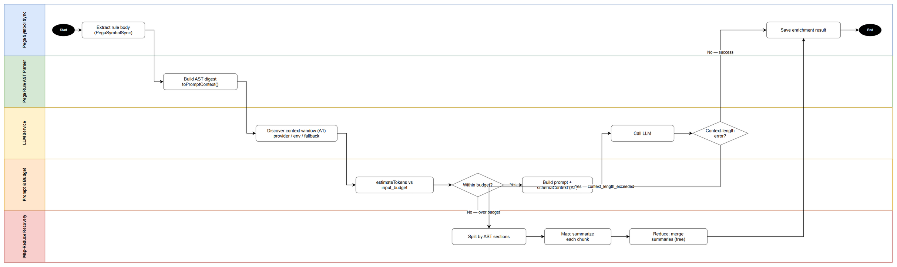
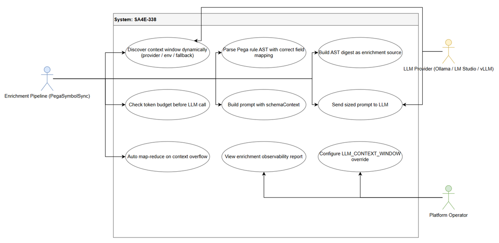

# Business Requirements Document (BRD)

## SDLC Agents 4 Enterprise — SA4E-338: [pega][enrichment] AST digest thay text dump — fix vượt LLM context window cho Pega rule enrichment

---

## Document Information

| Field | Value |
|-------|-------|
| Jira Ticket | SA4E-338 |
| Title | [pega][enrichment] AST digest thay text dump — fix vượt LLM context window cho Pega rule enrichment |
| Author | BA Agent |
| Version | 2.0 |
| Date | 2026-10-05 |
| Status | Draft |
| Issue Type | Story |
| Priority | Medium |
| Status (Jira) | In Progress |
| Labels | ast-digest, context-window, enrichment, pega |

---

## Author Tracking

| Role | Name - Position | Responsibility |
|------|-----------------|----------------|
| Author | BA Agent – Business Analyst | Create document |
| Peer Reviewer | Duc Nguyen Minh – Product Owner / Reporter | Review document |

---

## Revision History

| Version | Date | Author | Changes |
|---------|------|--------|---------|
| 1.0 | 2026-10-05 | BA Agent | Initiate document — auto-generated from Jira ticket SA4E-338, its comment (related tickets), and documents/SA4E-338/REFERENCE-ANALYSIS.md |
| 2.0 | 2026-10-05 | BA Agent | Fix OI-01 Ollama field path — `POST /api/show` key là arch-suffixed (`*.context_length` trong `model_info`, resolver match `/(^|\.)context_length$/` → max); gỡ exact-match sai khỏi Plan A1, Business Flow Step 3, US1 details, Data Fields. Schemas xem FSD §5.5 |

---

## Sign-Off

| Name | Signature and date |
|------|--------------------|
| | ☐ I agree and confirm all criteria on this BRD as expected requirements |
| | ☐ I agree and confirm all criteria on this BRD as expected requirements |

---

## 1. Introduction

### 1.1 Scope

Enrichment Pega rule hiện đang **vượt LLM context window** — lệnh gọi LLM fail sau 3 lần retry vô ích. Vấn đề nằm ở 5 root causes (Source: SA4E-338):

1. **`truncateToTokens` word-count sai** — `CodeEnrichmentPromptBuilder.ts:196-201` đếm whitespace words ≠ tokens, đồng thời cắt thô ở PEGA path (`builder:186-189`).
2. **Không config context window** — không query từ LLM provider (hardcode; default `maxTokens` chỉ 800).
3. **`PegaContentExtractor` không cap** value/Java block — block lớn bị đổ thẳng vào prompt.
4. **Không nhận diện context-length error** — retry 3 lần vô ích, fail im lặng.
5. **`schemaContext` là dead code** — được set ở `Handler:81` nhưng builder không đọc (FSD SA4E-214 hứa wire nhưng chưa làm).

Kèm theo các bug trong `PegaRuleAstParser` làm digest sai / phọt MB vào prompt:

- `buildActivity:215` đọc `json.steps` — data thật 377/380 rules dùng `pySteps` → children rỗng (cùng bug tại `PegaLogicNormalizer:25`).
- `buildDataTransform:230` đọc `pyActions` — data thật dùng `pyProperties` (pyActionName).
- `buildDecision:305` đọc `pyDecisionTableRows/pyRows` — data thật dùng `pyDecisionRules`.
- `getBuilder:166-192` thiếu mapping `Rule-Obj-DecisionTable` → rơi vào `buildGeneric`.
- `renderPropertyValue:15` / `formatNodes:509` `JSON.stringify` object lớn → phọt MB text vào prompt.

**Phạm vi thay đổi (Solution Plan v3 — KHÔNG cắt text, KHÔNG truncation):**

| Plan | Nội dung | Điểm chính |
|------|----------|-----------|
| A1 | Context window động | `LLMService.getContextWindow()` — Ollama `POST /api/show` → key `*.context_length` trong `model_info` (arch-suffixed; resolver: key match `/(^|\.)context_length$/` → lấy max — chi tiết xem FSD §5.5 / OI-01); LM Studio `GET /api/v0/models` → `max_context_length`; vLLM `/v1/models` → `max_model_len`; env override `LLM_CONTEXT_WINDOW`; fallback 8192 + warn |
| A2 | Fix AST parser | Đọc đúng `pySteps`/`pyProperties`/`pyDecisionRules`; thêm builder cho `Rule-Obj-DecisionTable`; cap `renderPropertyValue`/`formatNodes` |
| A3 | Wire schemaContext | `CodeEnrichmentPromptBuilder` đọc `schemaContext` từ Handler vào prompt |
| B | AST digest làm enrichment source | Đổi nguồn tại `PegaSymbolSync:114/133` từ raw body → `PegaRuleAstParser.toPromptContext()`; layout nodes (Section layout/HTML bulk) → aggregated outline, logic giữ nguyên vẹn |
| C | Budget-aware prompt | `TokenBudgetManager.estimateTokens` + window thực tế; bỏ truncate PEGA path |
| D | Error handling + auto map-reduce | `isContextLengthError()` → tự split theo AST sections rồi map-reduce (tái dùng pattern `analyzeWithChunking`), không fail, không cắt nội dung |
| E | tree-sitter cho code nhúng | java/jsp qua `GrammarRegistry` (không thêm JSON grammar) |
| F | Verify | `npm test` + `npm run lint`; re-enrich qua `scripts/reenrich-pega*.ts`; ingest docs vào memory |

**Data đối tượng:** rules thật tại `C:\projects\Pega\PegaPlatfrom\rules` — 1578 rules:

- `Rule-HTML-Section`: n=153 / 51.4MB / avg 344KB — HomeTabMain 3.4MB ≈ 47k leaf nodes nhưng chỉ 217KB string → bulk là keys/punctuation, KHÔNG phải logic.
- `Rule-Obj-Activity`: n=380 / 30.3MB / avg 82KB — GetDBobjects 1.4MB nhưng chỉ 43 steps → AST digest ≈ 6KB.

### 1.2 Out of Scope

- Thêm JSON grammar cho tree-sitter (Plan E chỉ dùng java/jsp qua `GrammarRegistry` có sẵn).
- Thay đổi quy trình enrichment non-Pega (source code TypeScript / SA4E-106 / SA4E-107).
- Thay đổi quy trình on-demand KB entry enrichment (SA4E-155).
- Thay đổi giao diện web-admin / cấu hình rate limit.

### 1.3 Preliminary Requirement

- `LLMService` đã kết nối được ít nhất 1 provider (Ollama / LM Studio / vLLM) và provider API `show`/`models` khả dụng.
- `TokenBudgetManager.estimateTokens` đã tồn tại và hoạt động (dùng làm nguồn ước lượng token thật).
- Rules data tại `C:\projects\Pega\PegaPlatfrom\rules` (1578 rules) khả dụng cho re-enrich verification.
- Pattern `analyzeWithChunking` đã có sẵn để tái dùng cho map-reduce.
- Baseline `npm test` + `npm run lint` pass trước khi sửa (để đo regression).

---

## 2. Business Requirements

### 2.1 High Level Process Map

Luồng enrichment mới thay thế cơ chế text-dump + truncate bằng **AST digest + budget check + auto map-reduce**: extract rule → AST digest → khám phá context window động → ước lượng token vs budget → nếu vượt budget hoặc LLM trả context-length error thì tự split theo AST sections và map-reduce → kết quả được lưu, không cắt nội dung logic.

*[Edit in draw.io](diagrams/business-flow.drawio)*

**Use Case Diagram** — các bên liên quan và chức năng cung cấp:

*[Edit in draw.io](diagrams/use-case.drawio)*

### 2.2 List of User Stories / Use Cases

| # | Story / Use Case / Epic | Priority | Source Ticket |
|---|-------------------------|----------|---------------|
| US1 | As a platform operator, I want the system to discover the actual LLM context window dynamically from the provider (with env override and safe fallback) so that enrichment prompts are sized correctly without hardcoded limits | MUST HAVE | SA4E-338 (Plan A1) |
| US2 | As the enrichment pipeline, I want PegaRuleAstParser to read the real field names (pySteps / pyProperties / pyDecisionRules) and to build a dedicated digest for Rule-Obj-DecisionTable so that the AST digest reflects the actual rule content instead of empty children | MUST HAVE | SA4E-338 (Plan A2 — bugs) |
| US3 | As the enrichment pipeline, I want the AST digest (toPromptContext) — not the raw rule body — to be the enrichment source, with layout/HTML bulk compressed to an aggregated outline while logic nodes stay intact, so that large rules (3.4MB) fit the context window without any logic content being cut | MUST HAVE | SA4E-338 (Plan B) |
| US4 | As the enrichment pipeline, I want a budget-aware prompt that estimates real tokens before calling the LLM and automatically falls back to map-reduce (split by AST sections) when the budget is exceeded or a context-length error occurs, so that enrichment never fails silently and never truncates logic | MUST HAVE | SA4E-338 (Plan C + D) |
| US5 | As an LLM consuming the enrichment prompt, I want the schemaContext (produced per SA4E-214) to actually appear in the prompt so that schema guidance reaches the model instead of being dead code | SHOULD HAVE | SA4E-338 (Plan A3) / SA4E-214 |

---

### 2.3 Details of User Stories

#### Business Flow

**Step 1:** `PegaSymbolSync` extract rule body từ rules repository (1578 rules — Plan B đổi nguồn tại `PegaSymbolSync:114/133`).

**Step 2:** `PegaRuleAstParser.toPromptContext()` dựng **AST digest** từ rule — layout nodes (Section layout / HTML bulk keys+punctuation) được nén thành aggregated outline; logic nodes (steps, conditions, expressions) giữ nguyên vẹn.

**Step 3:** `LLMService.getContextWindow()` khám phá context window động: Ollama `POST /api/show` → key `*.context_length` trong `model_info` (arch-suffixed, resolver match `/(^|\.)context_length$/` → max; xem FSD §5.5 / OI-01); LM Studio `GET /api/v0/models` → `max_context_length`; vLLM `/v1/models` → `max_model_len`; nếu có env `LLM_CONTEXT_WINDOW` thì ưu tiên env; không query được → fallback 8192 + warn log.

**Step 4:** `TokenBudgetManager.estimateTokens()` ước lượng token thật của digest + prompt overhead, so với `input_budget = context_window − reserved_output_tokens − prompt_overhead`.

**Step 5 (Decision 1):** `Within budget?`
- **Yes** → chuyển Step 6.
- **No (over budget)** → chuyển Step 8 (map-reduce chủ động, CANH NGƯỠNG trước khi overflow — không đợi lỗi).

**Step 6:** `CodeEnrichmentPromptBuilder` dựng prompt: AST digest + `schemaContext` (Plan A3) — bỏ hẳn truncate ở PEGA path (Plan C).

**Step 7:** Gửi prompt tới LLM. **(Decision 2):** LLM có trả `context_length_exceeded` không?
- **No (thành công)** → Step 10.
- **Yes** → `isContextLengthError()` nhận diện → chuyển Step 8 (auto-recovery, không retry vô ích, không fail im lặng).

**Step 8:** Split digest theo **AST sections** (structural chunking theo ranh giới section/step — không chia theo character/token thuần).

**Step 9:** **Map-reduce** (tái dùng pattern `analyzeWithChunking`): Map — tóm tắt từng chunk vừa window; Reduce — gộp các summary (recursive/tree summarize nếu summary cuối vẫn quá budget) → kết quả cuối.

**Step 10:** Lưu enrichment result vào symbol (save), ghi báo cáo observability (chunk nào bị compact, bao nhiêu token freed) → **End**.

> **Note:** Logic nodes là **pinned content** — KHÔNG BAO GIỜ bị drop; chỉ layout/HTML bulk được aggregated outline. Mọi reduction strategy phải có report có cấu trúc; nếu mọi strategy không giảm được budget → fail-fast `BudgetError` có cấu trúc (không im lặng).

---

#### STORY 1: Context Window Discovery Động

> As a platform operator, I want the system to discover the actual LLM context window dynamically from the provider (with env override and safe fallback) so that enrichment prompts are sized correctly without hardcoded limits.

**Requirement Details:**

1. `LLMService.getContextWindow()` trả về context window (token) của model đang dùng, theo thứ tự ưu tiên: (1) env override `LLM_CONTEXT_WINDOW`, (2) query provider API, (3) fallback mặc định.
2. Hỗ trợ 3 provider (Source: SA4E-338 Plan A1):
   - **Ollama**: `POST /api/show` → key `*.context_length` trong `model_info` (arch-suffixed — resolver: key match `/(^|\.)context_length$/` → lấy max; chi tiết schemas xem FSD §5.5 / OI-01)
   - **LM Studio**: `GET /api/v0/models` → `max_context_length`
   - **vLLM**: `GET /v1/models` → `max_model_len`
3. Không query được (provider down, API khác format) → fallback `8192` + **warn log** (không crash).
4. Giá trị discovery được cache trong phiên làm việc (không query lại mỗi symbol) nhưng phải invalidate khi đổi model/provider.
5. Không còn hardcode context window; default `maxTokens` 800 hiện tại không còn là nguồn quyết định kích thước prompt.

**Data Fields (if applicable):**

| Field | Type | Required | Description | Example |
|-------|------|----------|-------------|---------|
| `LLM_CONTEXT_WINDOW` | number (env) | No | Env override — ưu tiên cao nhất, ghi đè provider query | `32768` |
| `context_window` | number | Yes | Context window (token) sau khi discovery | `8192` |
| `window_source` | enum | Yes | Nguồn giá trị: `env` / `provider` / `fallback` | `provider` |
| `provider` | enum | Yes | Đang dùng provider nào | `ollama` |
| `model_info.<arch>.context_length` | number | No | Field của Ollama `/api/show` — key arch-suffixed trong `model_info` (vd `qwen2.context_length`); resolver match `/(^|\.)context_length$/` → max (xem FSD §5.5 / OI-01) | `131072` |
| `max_context_length` | number | No | Field của LM Studio `/api/v0/models` | `8192` |
| `max_model_len` | number | No | Field của vLLM `/v1/models` | `16384` |
| `reserved_output_tokens` | number | Yes | Số token reserved cho output khi tính budget | `1024` |

**Acceptance Criteria:**

1. Context window lấy động từ LLM provider (không hardcode) + env override `LLM_CONTEXT_WINDOW` có hiệu lực (Source: AC SA4E-338).
2. Với từng provider Ollama / LM Studio / vLLM, `getContextWindow()` trả đúng field tương ứng của provider đó.
3. Provider không phản hồi / API lỗi → trả về fallback `8192` kèm warn log, enrichment vẫn tiếp tục (không crash).
4. Env override được set → giá trị env thắng mọi nguồn khác.
5. Đổi model/provider trong phiên → giá trị discovery được invalidate và query lại.

**Validation Rules (if applicable):**

- `LLM_CONTEXT_WINDOW` nếu set phải là số nguyên dương; không hợp lệ → warn + bỏ qua override (dùng provider/fallback).
- `context_window` cuối cùng phải `> reserved_output_tokens + prompt_overhead`; nếu không → fallback + warn.

**Error Handling (if applicable):**

- Provider API timeout / connection refused → fallback 8192 + warn log, không fail enrichment.
- Response thiếu field context length → fallback 8192 + warn log.
- Fallback 8192 quá nhỏ so với digest → được Step budget/map-reduce (US4) xử lý — không cắt nội dung.

---

#### STORY 2: Fix AST Parser Đọc Đúng Field Thật Của Pega

> As the enrichment pipeline, I want PegaRuleAstParser to read the real field names (pySteps / pyProperties / pyDecisionRules) and to build a dedicated digest for Rule-Obj-DecisionTable so that the AST digest reflects the actual rule content instead of empty children.

**Requirement Details:**

1. Sửa các bug đọc sai field trên data thật (Source: SA4E-338 — Bug list):

| Location | Đang đọc (sai) | Data thật | Hành động |
|----------|----------------|-----------|-----------|
| `buildActivity:215` | `json.steps` | `pySteps` (377/380 rules) | Đọc `pySteps`; sửa cùng bug tại `PegaLogicNormalizer:25` |
| `buildDataTransform:230` | `pyActions` | `pyProperties` (pyActionName) | Đọc `pyProperties` |
| `buildDecision:305` | `pyDecisionTableRows` / `pyRows` | `pyDecisionRules` | Đọc `pyDecisionRules` |
| `getBuilder:166-192` | thiếu mapping | `Rule-Obj-DecisionTable` | Thêm builder riêng (không rơi vào `buildGeneric`) |
| `renderPropertyValue:15` / `formatNodes:509` | `JSON.stringify` object lớn | — | Cap độ dài output (không phọt MB vào prompt) |

2. `PegaContentExtractor` cap value/Java block (root cause #3) — block lớn không được đổ thô vào prompt.
3. Sau fix, AST digest của Activity chứa đủ children steps (trước: children rỗng → digest vô nghĩa).
4. Plan E: code nhúng java/jsp được parse qua `GrammarRegistry` (không thêm JSON grammar — out of scope).

**Data Fields (if applicable):**

| Field | Type | Required | Description | Example |
|-------|------|----------|-------------|---------|
| `pySteps` | array | Yes (Activity) | Steps thật của Rule-Obj-Activity — nguồn children AST | `[{...}]` |
| `pyProperties` | array | Yes (DataTransform) | Actions thật (pyActionName) | `[{pyActionName: "Set"}]` |
| `pyDecisionRules` | array | Yes (Decision) | Rows thật của decision rules | `[{...}]` |
| `pxObjClass` | string | Yes | Rule class — quyết định builder nào được chọn | `Rule-Obj-DecisionTable` |
| rendered property value | string | Yes | Output đã cap — không vượt giới hạn cho phép | (capped string) |

**Acceptance Criteria:**

1. Đọc đúng `pySteps` / `pyProperties` trên data thật (Source: AC SA4E-338).
2. `Rule-Obj-DecisionTable` được build bởi builder riêng (không rơi vào `buildGeneric`).
3. Activity digest có children steps (không còn rỗng) — kiểm chứng trên data thật 380 Activity rules.
4. `renderPropertyValue` / `formatNodes` không thể đẩy object lớn hàng MB vào prompt (đã cap).
5. `npm test` + `npm run lint` pass (Source: AC SA4E-338).

**Validation Rules (if applicable):**

- Fallback khi field thật không tồn tại: thử field cũ (`steps`/`pyActions`) để tương thích ngược dữ liệu legacy, rồi mới `buildGeneric`.
- Giá trị render cap theo giới hạn cấu hình; object lồng nhau depth quá ngưỡng → render dạng outline (không `JSON.stringify` toàn bộ).

**Error Handling (if applicable):**

- Rule thiếu toàn bộ field kỳ vọng → buildGeneric với outline tối thiểu (không crash).
- Rule class không có builder mapping → log warn + buildGeneric (giữ hành vi hiện tại, có quan sát được).

---

#### STORY 3: AST Digest Làm Enrichment Source (Không Cắt Nội Dung Logic)

> As the enrichment pipeline, I want the AST digest (toPromptContext) — not the raw rule body — to be the enrichment source, with layout/HTML bulk compressed to an aggregated outline while logic nodes stay intact, so that large rules (3.4MB) fit the context window without any logic content being cut.

**Requirement Details:**

1. Đổi nguồn enrichment tại `PegaSymbolSync:114/133` từ **raw body** → `PegaRuleAstParser.toPromptContext()` (Source: SA4E-338 Plan B).
2. **Layout nodes** (Section layout / HTML bulk — keys + punctuation, KHÔNG phải logic) → aggregated outline (dạng tóm tắt cấu trúc).
3. **Logic nodes** (steps, conditions, expressions) → giữ nguyên vẹn — đây là **pinned content**, không bao giờ bị drop hay cắt (pattern PinnedPriority — REFERENCE-ANALYSIS Ref 2).
4. Bằng chứng từ data (Source: SA4E-338 Data section):
   - HomeTabMain 3.4MB ≈ 47k leaf nodes nhưng chỉ 217KB string → bulk là keys/punctuation → aggregated outline là đúng chiến lược.
   - GetDBobjects 1.4MB nhưng chỉ 43 steps → AST digest ≈ 6KB (giảm ~230x).
5. Không truncation, không cắt text (Plan v3 nguyên tắc: KHÔNG cắt text, KHÔNG truncation).

**Data Fields (if applicable):**

| Field | Type | Required | Description | Example |
|-------|------|----------|-------------|---------|
| `raw_body` | string | No (nguồn cũ) | Raw rule body — NGUỒN CŨ, bị thay thế | 3.4MB JSON |
| `ast_digest` | string | Yes | Output `toPromptContext()` — nguồn mới | ≈6KB text |
| `outline_nodes` | array | Yes | Các layout node đã aggregated | `[outline]` |
| `logic_nodes` | array | Yes | Các logic node giữ nguyên vẹn (pinned) | `[step1..step43]` |
| `digest_source` | enum | Yes | `raw` → `ast` — cờ ghi nhận nguồn | `ast` |

**Acceptance Criteria:**

1. Rule 3.4MB (HomeTabMain) enrich thành công, KHÔNG cắt nội dung logic (Source: AC SA4E-338).
2. Nguồn enrichment tại `PegaSymbolSync:114/133` là AST digest (không còn raw body).
3. Layout/HTML bulk được biểu diễn dạng aggregated outline; mọi logic node (steps, conditions, expressions) xuất hiện đầy đủ trong digest.
4. Digest của GetDBobjects (~1.4MB raw) ở mức ~KB (cùng thứ độ với 6KB tham chiếu), không còn MB.
5. Re-enrich toàn bộ Pega rules qua `scripts/reenrich-pega*.ts` không có rule nào fail vì vượt window do cắt/giật (Source: Plan F).

**Validation Rules (if applicable):**

- Nếu digest vẫn > input budget → bàn giao cho US4 (budget check + map-reduce), KHÔNG cắt bớt logic nodes để cho vừa.
- Tỷ lệ nén của layout nodes phải ≥ ngưỡng kỳ vọng (vd. bulk keys/punctuation không được đẩy nguyên si vào digest).

**Error Handling (if applicable):**

- `toPromptContext()` lỗi (rule hỏng) → log lỗi theo rule key, chuyển sang fallback outline tối thiểu, không dừng cả batch.
- Rule không có logic node (Section thuần layout) → digest = aggregated outline (hợp lệ, vẫn enrich).

---

#### STORY 4: Budget-Aware Prompt + Auto Map-Reduce Khi Vượt Budget

> As the enrichment pipeline, I want a budget-aware prompt that estimates real tokens before calling the LLM and automatically falls back to map-reduce (split by AST sections) when the budget is exceeded or a context-length error occurs, so that enrichment never fails silently and never truncates logic.

**Requirement Details:**

1. **Budget math** (Source: REFERENCE-ANALYSIS Ref 2 — context-window-manager): `input_budget = context_window − reserved_output_tokens − prompt_overhead`.
2. **Token counting thật** bằng `TokenBudgetManager.estimateTokens` — KHÔNG word-count (khác với `truncateToTokens` hiện tại đang đếm whitespace words).
3. **Bỏ truncate ở PEGA path** (`builder:186-189`) — Plan C: không cắt thô nữa (Source: root cause #1).
4. **Trigger warning sớm** ở ngưỡng ContextFraction (ví dụ 80% budget) — log/warn trước khi overflow, không đợi lỗi (Source: REFERENCE-ANALYSIS Ref 1 — SummarizationMiddleware `ContextFraction`).
5. **Auto map-reduce** (Source: SA4E-338 Plan D): `isContextLengthError()` nhận diện context-length error → tự split theo AST sections → map-reduce (tái dùng pattern `analyzeWithChunking`), không fail, không cắt nội dung.
6. **Structural chunking** theo AST sections (ranh giới section/step) thay vì chia character/token thuần (Source: REFERENCE-ANALYSIS Ref 3 — strategic chunking).
7. **Tree/recursive reduce**: summary cuối vẫn quá budget → recursive summarize tiếp (Source: REFERENCE-ANALYSIS Ref 3 — TreeSummarize).
8. **Ordered reduction pipeline**: AST digest (structural compress) → map-reduce theo AST sections → fail-fast `BudgetError` có cấu trúc nếu mọi strategy không giảm được (Source: REFERENCE-ANALYSIS Ref 2).
9. **Không retry vô ích**: context-length error KHÔNG được retry nguyên prompt 3 lần nữa — chuyển thẳng map-reduce.

**Data Fields (if applicable):**

| Field | Type | Required | Description | Example |
|-------|------|----------|-------------|---------|
| `estimated_tokens` | number | Yes | `TokenBudgetManager.estimateTokens(prompt)` | `7450` |
| `context_window` | number | Yes | Từ US1 (discovery động) | `8192` |
| `input_budget` | number | Yes | `window − reserved_output − overhead` | `7000` |
| `budget_utilization` | percent | Yes | `estimated_tokens / input_budget` | `0.83` |
| `chunks[]` | array | Conditional | Các AST section sau split | `[{section, tokens}]` |
| `reduction_report` | object | Yes | Report: chunk nào compact, token freed, strategy dùng | `{freed: 12000}` |
| `is_context_length_error` | boolean | Yes | Kết quả `isContextLengthError(error)` | `true` |

**Acceptance Criteria:**

1. Context-length error → auto map-reduce, không fail im lặng (Source: AC SA4E-338).
2. Budget được ước lượng bằng token thật (`estimateTokens`), không phải word-count.
3. Prompt vượt budget bị phát hiện TRƯỚC khi gửi LLM (chủ động) hoặc khi LLM trả context-length error (thụ động) — cả hai đường đều dẫn đến map-reduce.
4. Không còn truncate ở PEGA path — nội dung logic không bị cắt ở bất kỳ bước nào.
5. Khi warn ngưỡng 80% budget được trigger → log cảnh báo xuất hiện (observability).
6. Map-reduce tái dùng pattern `analyzeWithChunking` (không viết lại từ đầu — no-workaround rule).
7. `npm test` + `npm run lint` pass (Source: AC SA4E-338).

**Validation Rules (if applicable):**

- `estimated_tokens ≤ input_budget` → gửi 1 LLM call bình thường.
- `estimated_tokens > input_budget` → bắt buộc đi map-reduce, không gửi thẳng.
- Pinned logic nodes phải xuất hiện trong ít nhất 1 chunk — không chunk nào được loại bỏ hoàn toàn logic.
- `reduction_report` phải được ghi cho mọi lần map-reduce (không có trường hợp im lặng).

**Error Handling (if applicable):**

- Context-length error từ LLM → `isContextLengthError()` = true → split theo AST sections → map-reduce (không retry nguyên prompt).
- Mọi reduction strategy đã chạy mà vẫn vượt budget → fail-fast `BudgetError` có cấu trúc (message + context rõ ràng), không fail im lặng.
- Map một chunk lỗi (LLM timeout) → retry theo chunk (không retry cả batch), chunk lỗi được đánh dấu trong report.
- Chunks > 1 tầng reduce (tree) vẫn vượt → BudgetError + report các tầng đã thử.

---

#### STORY 5: Wire schemaContext Vào Prompt

> As an LLM consuming the enrichment prompt, I want the schemaContext (produced per SA4E-214) to actually appear in the prompt so that schema guidance reaches the model instead of being dead code.

**Requirement Details:**

1. `schemaContext` đang được set tại `Handler:81` nhưng `CodeEnrichmentPromptBuilder` không đọc — **dead code** (Source: SA4E-338 root cause #5).
2. FSD SA4E-214 đã hứa wire nhưng chưa làm — ticket này hoàn thành cam kết đó.
3. Builder đọc `schemaContext` từ Handler và chèn vào prompt (Plan A3).
4. schemaContext tới từ SA4E-214 (Extension-driven Schema Creation for Pega Rule Types — on-the-fly LLM-enriched schemas).

**Data Fields (if applicable):**

| Field | Type | Required | Description | Example |
|-------|------|----------|-------------|---------|
| `schemaContext` | string/object | No (nullable) | Schema guidance từ SA4E-214, set tại Handler:81 | `{ruleType: "Rule-Obj-Activity", ...}` |
| `schema_context_present` | boolean | Yes | Cờ observability — xác nhận xuất hiện trong prompt | `true` |

**Acceptance Criteria:**

1. `schemaContext` xuất hiện trong prompt (Source: AC SA4E-338).
2. Với rule có schemaContext được set → prompt chứa section schema guidance (kiểm tra bằng log/inspection).
3. Với rule không có schemaContext (null) → prompt vẫn build bình thường (không crash, không section rỗng).
4. schemaContext không làm prompt vượt budget quá ngưỡng mà budget check (US4) không phát hiện — schemaContext được tính vào `estimateTokens`.

**Validation Rules (if applicable):**

- `schemaContext` null/undefined → bỏ qua section, prompt hợp lệ.
- `schemaContext` có mặt → bắt buộc nằm trong thành phần được `estimateTokens` đếm (part of prompt_overhead thực).

**Error Handling (if applicable):**

- `schemaContext` sai format → warn log + bỏ section (không fail enrichment).
- Handler không set schemaContext → coi như null (hành vi hiện tại, nhưng không còn là dead code vì builder đã đọc).

---

## 3. Dependencies

| Dependency | Type | Related Ticket | Description |
|------------|------|----------------|-------------|
| LLM Enrichment cho Source Code Symbols | System | SA4E-106 | Nền tảng enrichment symbols — cùng hạ tầng LLM enrichment |
| LLM Enrichment cho Source Code Index | System | SA4E-107 | `truncateToTokens` gốc nằm tại đây — cần đối chiếu khi thay cơ chế sizing |
| On-demand KB entry enrichment | System | SA4E-155 | Priority queue + timeout + extension LLM fallback — không đổi quy trình nhưng dùng chung LLMService |
| Schema Creation cho Pega Rule Types | System | SA4E-214 | Nguồn `schemaContext` (US5 wire vào prompt) |
| Self-learning Pega rule understanding | System | SA4E-222 | Hiểu rule Pega — dùng chung kết quả enrichment |
| Migrate Pega rules to symbols | System | SA4E-171 | `PegaSymbolSync` (điểm đổi nguồn Plan B tại :114/:133) |
| Epic: merge pega-rule-parser | System | SA4E-232 | Nguồn `PegaRuleAstParser` (Plan A2 sửa tại đây) |
| `CodeEnrichmentPromptBuilder` | Codebase | SA4E-338 | Sửa `truncateToTokens` (:196-201), bỏ truncate PEGA path (:186-189), đọc `schemaContext` |
| `PegaSymbolSync` | Codebase | SA4E-338 | Đổi nguồn enrichment raw body → AST digest (:114/:133) |
| `PegaRuleAstParser` | Codebase | SA4E-338 | Fix field mapping (pySteps/pyProperties/pyDecisionRules), builder DecisionTable, cap render |
| `LLMService` | Codebase | SA4E-338 | `getContextWindow()` — Ollama/LM Studio/vLLM API, env override, fallback 8192 |
| `TokenBudgetManager` | Codebase | SA4E-338 | `estimateTokens` — nguồn ước lượng token thật cho budget math |
| `PegaContentExtractor` / `PegaLogicNormalizer` | Codebase | SA4E-338 | Cap value/Java block; sửa cùng bug `PegaLogicNormalizer:25` |
| `GrammarRegistry` (tree-sitter) | Codebase | SA4E-338 | Parse code nhúng java/jsp (Plan E) — không thêm JSON grammar |
| Pattern `analyzeWithChunking` | Codebase | SA4E-338 | Tái dùng cho auto map-reduce (Plan D) — no-workaround rule |
| Pega rules data (1578 rules) | Data | N/A | `C:\projects\Pega\PegaPlatfrom\rules` — dùng cho verify + re-enrich |
| Re-enrich scripts | Infrastructure | SA4E-338 | `scripts/reenrich-pega*.ts` — verify sau thay đổi (Plan F) |
| Reference Analysis | Document | N/A | `documents/SA4E-338/REFERENCE-ANALYSIS.md` — 4 dự án tham chiếu + patterns cần adopt |

---

## 4. Stakeholders

| Role | Name / Team | Responsibility | Source |
|------|-------------|----------------|--------|
| Reporter / Creator | Duc Nguyen Minh | Chủ ticket, phê duyệt requirement | SA4E-338 reporter + creator |
| Watcher | (1 watcher — Duc Nguyen Minh) | Theo dõi tiến độ | SA4E-338 watches |
| Assignee | Chưa phân công | Sẽ là DEV thực hiện Plan A1–F | SA4E-338 assignee = null |
| Consumers | QA / SA / DEV agents | Đọc BRD/FSD qua KB | SDLC pipeline |

> **Note:** Ticket SA4E-338 chưa có assignee và không có issue links chính thức trên UI — danh sách related tickets lấy từ comment của reporter (xem Section 7).

---

## 5. Risks and Assumptions

### 5.1 Risks

| Risk | Impact | Likelihood | Mitigation |
|------|--------|------------|------------|
| Map-reduce tốn token hơn (~500k vs ~80k cho clustering — REFERENCE-ANALYSIS Ref 1) | Medium | High | Chấp nhận được vì đây là one-shot enrichment; ghi nhận trong reduction report để theo dõi |
| API provider mỗi nơi một format (Ollama/LM Studio/vLLM) — thay đổi bất ngờ | High | Medium | Fallback 8192 + warn; env override `LLM_CONTEXT_WINDOW` như lối thoát thủ công |
| Fix field mapping làm digest thay đổi → kết quả enrichment cũ không còn tương thích | Medium | High | Re-enrich toàn bộ qua `scripts/reenrich-pega*.ts` (Plan F); fallback đọc field cũ (legacy) |
| Aggregated outline cho layout nodes có thể làm mất thông tin layout hữu ích (ngoài logic) | Medium | Low | Scope xác định: mất thông tin layout là chấp nhận được — logic nodes mới là pinned; verify bằng re-enrich |
| Fallback 8192 sai với model lớn hơn → map-reduce chạy thừa | Low | Medium | Warn log khi fallback; ContextFraction 80% warning để quan sát sớm |
| Sửa `PegaRuleAstParser` (SA4E-232 — epic merge) đụng code đang phát triển bởi ticket khác | High | Medium | Coordinate với SA4E-232; thay đổi theo builder mapping có kiểm thử riêng |

### 5.2 Assumptions

- Plan A1–F đã được chốt trong ticket — BRD không mở rộng giải pháp mới ngoài các pattern đã tham chiếu (REFERENCE-ANALYSIS).
- `TokenBudgetManager.estimateTokens` đủ chính xác làm nguồn ước lượng (không cần Anthropic count_tokens API).
- Pattern `analyzeWithChunking` hiện có thể tái dùng nguyên vẹn cho map-reduce.
- Data 1578 rules là tập verify representative (Section: `Rule-HTML-Section` n=153, `Rule-Obj-Activity` n=380).
- Enrichment là one-shot batch — độ trễ do map-reduce không ảnh hưởng user experience real-time.
- Nguyên tắc "KHÔNG cắt text, KHÔNG truncation" là ràng buộc kinh doanh bắt buộc (không thương lượng).

---

## 6. Non-Functional Requirements

| Category | Requirement | Details |
|----------|-------------|---------|
| Performance — token budget accuracy | Budget tính bằng token thật, không word-count | `TokenBudgetManager.estimateTokens`; `input_budget = context_window − reserved_output_tokens − prompt_overhead` (REFERENCE-ANALYSIS Ref 2) |
| Performance — early warning | Cảnh báo trước khi overflow | Trigger warn ở ContextFraction ~80% budget — log trước khi lỗi xảy ra (Ref 1) |
| Correctness — no logic truncation | KHÔNG BAO GIỜ cắt nội dung logic | Logic nodes = pinned content; chỉ layout/HTML bulk được aggregated outline; bỏ truncate PEGA path (Plan C) |
| Reliability — auto-recovery | Context-length error → tự phục hồi | Auto map-reduce theo AST sections, không fail im lặng, không retry 3 lần vô ích (Plan D) |
| Reliability — fail-fast có cấu trúc | Mọi strategy thất bại → lỗi rõ ràng | `BudgetError` có cấu trúc (không im lặng) — REFERENCE-ANALYSIS Ref 2 |
| Observability — reduction report | Báo cáo mỗi lần reduction | Chunk nào bị compact, bao nhiêu token freed, strategy nào chạy (Ref 2 structured report) |
| Observability — window source | Biết context window từ đâu | Ghi `window_source` (env/provider/fallback) + warn khi fallback |
| Maintainability | Tái dùng pattern có sẵn | Map-reduce tái dùng `analyzeWithChunking`; không viết wrapper mới (no-workaround rule) |
| Compatibility | Không hardcode model limits | Env override `LLM_CONTEXT_WINDOW`; fallback 8192 + warn; hỗ trợ Ollama / LM Studio / vLLM |
| Quality gate | Kiểm thử tự động pass | `npm test` + `npm run lint` pass (AC SA4E-338); re-enrich verify trên data thật (Plan F) |

---

## 7. Related Tickets

| Ticket Key | Summary | Status | Type | Relationship |
|------------|---------|--------|------|--------------|
| SA4E-338 | [pega][enrichment] AST digest thay text dump — fix vượt LLM context window cho Pega rule enrichment | In Progress | Story | Main ticket |
| SA4E-106 | LLM Enrichment cho Source Code Symbols | To be confirmed | Story | relates to — cùng hạ tầng LLM enrichment (từ comment SA4E-338) |
| SA4E-107 | LLM Enrichment cho Source Code Index (truncateToTokens tại đây) | To be confirmed | Story | relates to — nguồn gốc `truncateToTokens` |
| SA4E-155 | On-demand KB entry enrichment với priority queue + timeout + extension LLM fallback | To be confirmed | Story | relates to — dùng chung LLMService |
| SA4E-214 | Extension-driven Schema Creation for Pega Rule Types | To be confirmed | Story | relates to — nguồn `schemaContext` (US5) |
| SA4E-222 | Self-learning Pega rule understanding | To be confirmed | Story | relates to — consumer kết quả hiểu rule |
| SA4E-171 | Migrate Pega rules to symbols (PegaSymbolSync) | To be confirmed | Story | relates to — code điểm Plan B thay đổi (:114/:133) |
| SA4E-232 | Epic: merge pega-rule-parser (nguồn PegaRuleAstParser) | To be confirmed | Epic | relates to — nguồn parser bị fix (Plan A2) |

> **Note:** SA4E-338 hiện có `issuelinks: []` trên Jira — các relationship trên lấy từ comment của reporter (tool limitation, chưa thêm dạng links UI).

---

## 8. Appendix

### Glossary

| Term | Definition |
|------|------------|
| AST Digest | Bản nén có cấu trúc của Pega rule dựng bởi `PegaRuleAstParser.toPromptContext()` — layout nodes gộp thành aggregated outline, logic nodes giữ nguyên vẹn; dùng làm nguồn enrichment thay cho raw text dump |
| Context Window | Số token tối đa mà model LLM chấp nhận cho 1 request; khám phá động từ provider (Ollama `context_length` / LM Studio `max_context_length` / vLLM `max_model_len`), env override `LLM_CONTEXT_WINDOW`, fallback 8192 |
| Token Budget | `input_budget = context_window − reserved_output_tokens − prompt_overhead` — ngưỡng token cho phép của prompt; ước lượng bằng `TokenBudgetManager.estimateTokens` (token thật, không word-count) |
| Map-Reduce (enrichment) | Cơ chế auto-recovery: split digest theo AST sections → Map tóm tắt từng chunk → Reduce gộp summary (recursive nếu cần); tái dùng pattern `analyzeWithChunking` |
| Pinned Logic | Logic nodes (steps, conditions, expressions) bắt buộc được bảo toàn — KHÔNG BAO GIỜ bị drop/cắt bởi bất kỳ reduction strategy nào (pattern PinnedPriority) |
| Enrichment | Quy trình gán metadata do LLM sinh ra (summary, pseudo code, tags) cho symbol/rule sau khi index — tại đây áp dụng cho Pega rules |
| schemaContext | Schema guidance do SA4E-214 sinh ra, set tại `Handler:81` — phải được `CodeEnrichmentPromptBuilder` đọc vào prompt (trước là dead code) |
| Context-Length Error | LLM trả lỗi vượt window (`context_length_exceeded`) — nhận diện bởi `isContextLengthError()` để chuyển map-reduce thay vì retry vô ích |
| ContextFraction | Ngưỡng % budget (vd. 80%) trigger warning trước khi overflow — pattern từ LangChain SummarizationMiddleware |
| BudgetError | Lỗi fail-fast có cấu trúc khi mọi reduction strategy vẫn không đưa prompt về trong budget — tuyệt đối không fail im lặng |

### Diagram Index

| # | Diagram | Image | Source (editable) |
|---|---------|-------|-------------------|
| 1 | Business Flow — Pega enrichment với AST digest + map-reduce |  | [business-flow.drawio](diagrams/business-flow.drawio) |
| 2 | Use Case Diagram |  | [use-case.drawio](diagrams/use-case.drawio) |

### Reference Documents

| Document | Link / Location |
|----------|-----------------|
| Jira ticket SA4E-338 | https://jiraassist.atlassian.net/browse/SA4E-338 |
| Reference Analysis (4 dự án tham chiếu) | documents/SA4E-338/REFERENCE-ANALYSIS.md |
| BRD Template | documents/templates/BRD-TEMPLATE.md |
| Related BRD SA4E-214 (schemaContext) | documents/SA4E-214/BRD.md |
| Related BRD SA4E-106 (LLM Enrichment Symbols) | documents/SA4E-106/BRD.md |
| Related BRD SA4E-107 (LLM Enrichment Source Code Index) | documents/SA4E-107/BRD.md |
| Related BRD SA4E-155 (On-demand KB enrichment) | documents/SA4E-155/BRD.md |

### Reference Projects & Adopted Patterns (from REFERENCE-ANALYSIS.md)

| # | Reference Project | Pattern adopt cho SA4E-338 |
|---|-------------------|----------------------------|
| 1 | LangChain — map-reduce summarization + SummarizationMiddleware | Window phải biết trước; trigger theo ContextFraction trước khi overflow; keep policy bảo toàn message quan trọng |
| 2 | context-window-manager (srathish) — budget pipeline | Budget math minh bạch; token counting thật (không word-count); PinnedPriority invariant; BudgetError fail-fast có cấu trúc; reduction report |
| 3 | LlamaIndex — Context Window Optimization + Tree Summarize | Strategic chunking theo ranh giới cấu trúc; recursive summarize giảm dần; thay truncate bằng summarization |
| 4 | LangChain Context Engineering | Compress (token-heavy content được summarize) + Isolate (giữ structure ngoài window, expose có kiểm soát — tương tự AST digest) |
