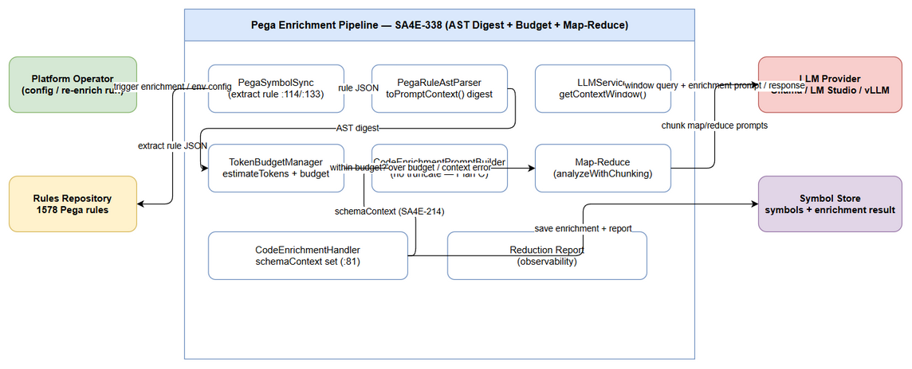
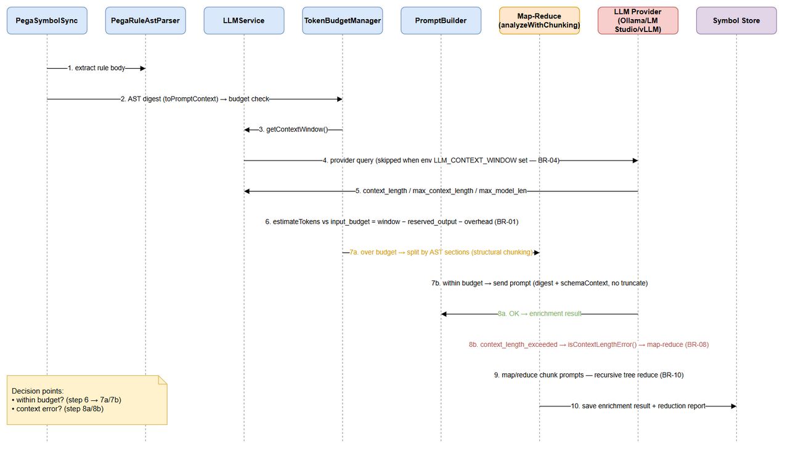
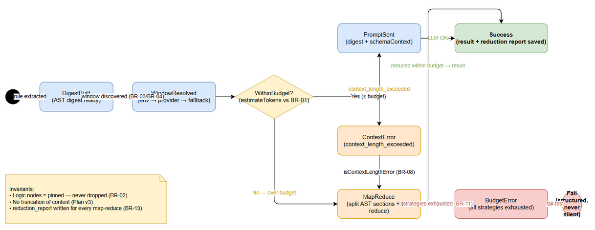

# Functional Specification Document (FSD)

## SDLC Agents 4 Enterprise — SA4E-338: [pega][enrichment] AST digest thay text dump — fix vượt LLM context window cho Pega rule enrichment

---

## Document Information

| Field | Value |
|-------|-------|
| Jira Ticket | SA4E-338 |
| Title | [pega][enrichment] AST digest thay text dump — fix vượt LLM context window cho Pega rule enrichment |
| Author | BA Agent |
| Version | 1.2 |
| Date | 2026-10-05 |
| Status | Reviewed & Technically Enriched (BA draft + TA enrichment) |
| Issue Type | Story |
| Priority | Medium |
| Labels | ast-digest, context-window, enrichment, pega |
| Related BRD | documents/SA4E-338/BRD.md |
| Document Scope | Functional specification **with technical enrichment** (provider API contracts §5.5, internal function contracts §5.6, pseudocode §6.4, physical data mapping §4.2, quantified NFR §8, open issues §11.4) |

---

## Author Tracking

| Role | Name - Position | Responsibility |
|------|-----------------|----------------|
| Author | BA Agent – Business Analyst | Create document |
| Peer Reviewer | Duc Nguyen Minh – Product Owner / Reporter | Review document |
| Technical Enricher | TA Agent – Technical Analyst | Add technical sections (data model physical, API schemas) |

---

## Revision History

| Version | Date | Author | Changes |
|---------|------|--------|---------|
| 1.0 | 2026-10-05 | BA Agent | Initial draft — generated from BRD v1.0 (SA4E-338), REFERENCE-ANALYSIS.md, and verified inspection of current codebase (PegaRuleAstParser, CodeEnrichmentPromptBuilder, PegaSymbolSync, LLMService, TokenBudgetManager) |
| 1.1 | 2026-10-05 | TA Agent | **Technical enrichment (no BA content removed):** added Alternative/Exception flows to UC-1…UC-5; added §5.5 Provider HTTP API Contracts (Ollama/LM Studio/vLLM request+response schemas, error shapes, `LLM_CONTEXT_WINDOW`); added §5.6 Internal Function Contracts (`getContextWindow`, `isContextLengthError`, `toPromptContext`, `estimateTokens`, `analyzeWithChunking` reuse); added §6.4 pseudocode (4 blocks); added §4.2 physical data mapping verified against `pg-schema-ensure.ts`; quantified NFR (retry budgets, reduce/chunk caps, discovery timeout, token-accuracy one-sided bound); added ERR-12, TC-19…TC-26; added §11.4 Open Issues (OI-01…OI-09) with owners/dates; TA notes on field-path and estimator discrepancies |
| 1.2 | 2026-10-05 | BA Agent | Fix DISC-1, DISC-3 (discrepancy Low): (1) documented `LLMService` second-layer default `?? 2048` in OI-06 + §5.6.1 (env unset → 800; config/defaults undefined → 2048 defensive fallback); (2) corrected re-enrich script paths to `backend/scripts/reenrich-pega*.ts` (7 occurrences). No other content changed. |

---

## Sign-Off

| Name | Signature and date |
|------|--------------------|
| | ☐ I agree and confirm all criteria on this FSD as expected specification |
| | ☐ I agree and confirm all criteria on this FSD as expected specification |

---

## 1. Introduction

### 1.1 Purpose

This FSD specifies the **functional behavior** of the Pega rule enrichment pipeline changes required by SA4E-338: replace the raw text-dump + truncation mechanism with an **AST digest + token budget + auto map-reduce** mechanism so that enrichment prompts never exceed the LLM context window and no logic content is ever truncated.

It defines: use cases with main/alternative/exception flows (UC-1…UC-5), business rules (BR-01…BR-20), data specifications, integration contracts (business view), processing logic, error handling, and non-functional targets. Physical implementation details (DDL, JSON schema, timeout/retry configuration) belong to the TDD and will be added by the TA agent.

### 1.2 Scope

**In Scope (Solution Plan v3 — Source: SA4E-338):**

| Plan | Functional Content |
|------|--------------------|
| A1 | Dynamic context window discovery — `LLMService.getContextWindow()`: Ollama `POST /api/show` → `model_info.context_length`; LM Studio `GET /api/v0/models` → `max_context_length`; vLLM `GET /v1/models` → `max_model_len`; env override `LLM_CONTEXT_WINDOW`; fallback 8192 + warn |
| A2 | Fix AST parser field mapping (`pySteps` / `pyProperties` / `pyDecisionRules`), dedicated `Rule-Obj-DecisionTable` builder, cap rendered property values |
| A3 | Wire `schemaContext` (SA4E-214) from Handler into `CodeEnrichmentPromptBuilder` prompt |
| B | AST digest as enrichment source — change `PegaSymbolSync:114/133` from raw body to `PegaRuleAstParser.toPromptContext()`; layout/HTML bulk → aggregated outline; logic nodes pinned |
| C | Budget-aware prompt — `TokenBudgetManager.estimateTokens` + real window; remove truncation on PEGA path |
| D | Error handling + auto map-reduce — `isContextLengthError()` → split by AST sections → map-reduce (reuse `analyzeWithChunking`), no silent failure, no content cut |
| E | tree-sitter for embedded java/jsp code via `GrammarRegistry` (no new JSON grammar) |
| F | Verify — `npm test` + `npm run lint`; re-enrich via `backend/scripts/reenrich-pega*.ts`; ingest docs |

**Out of Scope (Source: BRD §1.2):**

- Adding a JSON grammar for tree-sitter.
- Changes to non-Pega enrichment flows (TypeScript source code / SA4E-106 / SA4E-107).
- Changes to on-demand KB entry enrichment workflow (SA4E-155).
- Web-admin UI changes or rate-limit configuration changes.

### 1.3 Definitions & Acronyms

| Term | Definition |
|------|------------|
| AST Digest | Structured compression of a Pega rule produced by `PegaRuleAstParser.toPromptContext()` — layout nodes folded into an aggregated outline, logic nodes kept intact; replaces raw text dump as enrichment source |
| Context Window | Max tokens the LLM accepts per request; discovered dynamically (provider field / env override / fallback 8192) |
| Token Budget | `input_budget = context_window − reserved_output_tokens − prompt_overhead`; estimated with `TokenBudgetManager.estimateTokens` (real tokens, not word count) |
| Map-Reduce (enrichment) | Auto-recovery: split digest by AST sections → map (summarize each chunk) → reduce (merge summaries, recursive if needed); reuses `analyzeWithChunking` |
| Pinned Logic | Logic nodes (steps, conditions, expressions) that must NEVER be dropped by any reduction strategy |
| Context-Length Error | LLM error `context_length_exceeded`; recognized by `isContextLengthError()` to route to map-reduce instead of useless retries |
| ContextFraction | Warning threshold (% of input budget, e.g. 80%) triggered before overflow |
| BudgetError | Structured fail-fast error when all reduction strategies still exceed budget — never silent |
| schemaContext | Schema guidance produced per SA4E-214, set at `CodeEnrichmentHandler:81`; must appear in the prompt (previously dead code) |
| AC / UC / BR | Acceptance Criteria / Use Case / Business Rule |

### 1.4 References

| Document | Location |
|----------|----------|
| BRD SA4E-338 | documents/SA4E-338/BRD.md |
| Reference Analysis (4 reference projects) | documents/SA4E-338/REFERENCE-ANALYSIS.md |
| Jira ticket SA4E-338 | https://jiraassist.atlassian.net/browse/SA4E-338 |
| Related BRD SA4E-214 (schemaContext source) | documents/SA4E-214/BRD.md |
| Related BRD SA4E-171 (PegaSymbolSync) | documents/SA4E-171/BRD.md |
| FSD Template | documents/templates/FSD-TEMPLATE.md |

---
## 2. System Overview

### 2.1 System Context Diagram


*[Edit in draw.io](diagrams/system-context.drawio)*

The system under specification is the **Pega enrichment pipeline** (backend, no UI). Interactions:

| Actor / External System | Direction | Interaction |
|-------------------------|-----------|-------------|
| Platform Operator | Inbound | Starts/indexes Pega rules (via `backend/scripts/reenrich-pega*.ts` or re-index), configures `LLM_CONTEXT_WINDOW` env override; receives warn/error logs and reduction reports |
| LLM Provider (Ollama / LM Studio / vLLM) | Outbound | (a) Window discovery query (`/api/show`, `/api/v0/models`, `/v1/models`); (b) enrichment prompt execution; (c) map-reduce chunk prompts |
| Rules Repository | Inbound | Source of 1578 real Pega rules (`C:\projects\Pega\PegaPlatfrom\rules`) — rule JSON extracted by `PegaSymbolSync` |
| Symbol Store | Outbound | Persistence target: symbols + enrichment results + reduction/observability reports |

### 2.2 System Architecture

Components involved (all in `backend/src`, paths verified 2026-10-05):

| Component | Path | Role in this feature |
|-----------|------|----------------------|
| `PegaSymbolSync` | `modules/pega/PegaSymbolSync.ts` | Extracts rule body; **Plan B change at :114/:133** — source switched from raw content to AST digest; queues enrichment task |
| `PegaRuleAstParser` | `modules/pega/PegaRuleAstParser.ts` | `toPromptContext()` (:450) builds AST digest; `getBuilder` (:166) selects per-class builder; **Plan A2 fixes** field mapping + DecisionTable builder + render cap |
| `PegaContentExtractor` | `modules/pega/PegaContentExtractor.ts` | Caps value/Java blocks (root cause #3) |
| `PegaLogicNormalizer` | `modules/pega/PegaLogicNormalizer.ts` | Same field bug at :25 — fixed alongside Plan A2 |
| `LLMService` | `modules/memory/llm/LLMService.ts` | Multi-provider facade (ollama / lmstudio / openai-compatible…); **Plan A1 adds `getContextWindow()` + `isContextLengthError()`** |
| `TokenBudgetManager` | `engine/context/token-budget-manager.ts` | `estimateTokens` — real token estimation for budget math |
| `CodeEnrichmentPromptBuilder` | `engine/enrichment/CodeEnrichmentPromptBuilder.ts` | Builds prompts; `truncateToTokens` (:196-201) is word-count based; PEGA path truncation (:186-189) **removed by Plan C**; **Plan A3** reads `schemaContext` |
| `CodeEnrichmentHandler` | `engine/enrichment/CodeEnrichmentHandler.ts` | Sets `schemaContext` at :81 (currently dead code — wired by Plan A3) |
| Map-reduce pattern | `modules/memory/llm/analyzer.ts` | `analyzeWithChunking` — **reused** for auto map-reduce (Plan D, no new wrapper) |
| tree-sitter `GrammarRegistry` | engine parsers | Parses embedded java/jsp code (Plan E) |

**Data stores:** PostgreSQL symbol store (symbols, body content, enrichment tasks) — physical DDL to be specified in TDD §4 by TA.

> **Note (TA, updated v1.1):** `.analysis/code-intelligence/project-structure.md` exists but covers only the Knowledge module (no `modules/*.md` for `pega/` or `engine/enrichment/`). Component paths above — and every line reference used in §4.2/§5.5/§5.6/§6.4 — were therefore **verified by direct source inspection on 2026-10-05** (LLMService, LLMInitializer, ollama/openai adapters, llm-error, analyzer, token-budget-manager, PegaSymbolSync, PegaRuleAstParser, PegaContentExtractor, CodeEnrichmentHandler, CodeEnrichmentPromptBuilder, TaskWorker, pg-schema-ensure). Absence of `getContextWindow()` / `isContextLengthError()` / `LLM_CONTEXT_WINDOW` in `backend/src` was confirmed by grep — they are **to be built** by this ticket.

---
## 3. Functional Requirements

### 3.0 Use Case Overview

| UC | Name | Source Story | Priority |
|----|------|--------------|----------|
| UC-1 | Discover Context Window | US1 (Plan A1) | MUST HAVE |
| UC-2 | Build AST Digest | US2 + US3 (Plan A2 + B) | MUST HAVE |
| UC-3 | Budget Check & Prompt Build | US4 part (Plan C + A3) | MUST HAVE |
| UC-4 | Map-Reduce Recovery | US4 part (Plan D) | MUST HAVE |
| UC-5 | Wire schemaContext | US5 (Plan A3 / SA4E-214) | SHOULD HAVE |

### 3.1 UC-1: Discover Context Window

**Source:** BRD STORY 1 (US1) — Plan A1
**Actor:** Enrichment Pipeline (primary), LLM Provider (external), Platform Operator (configures env override)
**Preconditions:** LLM provider configured (`LLM_PROVIDER`), provider API reachable or fallback acceptable.
**Postconditions:** `contextWindow` + `windowSource` available for budget calculation; value cached for the session.

**Main Flow:**

| Step | Actor | System | Description |
|------|-------|--------|-------------|
| 1 | Pipeline | | Request context window for current model/provider |
| 2 | | System | Read env `LLM_CONTEXT_WINDOW` — if valid positive integer → use it, `windowSource=env`, skip provider query (BR-04) |
| 3 | | System | No valid env → query provider API per provider type (BR-19): Ollama `POST /api/show` → `model_info.context_length`; LM Studio `GET /api/v0/models` → `max_context_length`; vLLM `GET /v1/models` → `max_model_len` |
| 4 | | System | Validate: `contextWindow > reserved_output_tokens + prompt_overhead` (BR-20) |
| 5 | | System | Cache value for session (`windowSource=provider`) — no re-query per symbol (BR-06) |
| 6 | | System | Return `contextWindow` to budget check (UC-3) |

**Alternative Flows:**

| ID | Condition | Steps |
|----|-----------|-------|
| AF-1.1 | Env `LLM_CONTEXT_WINDOW` set and valid | Step 2 → use env value (`windowSource=env`), skip steps 3-4 |
| AF-1.2 | Model or provider changed within session | Invalidate cache → re-run from step 3 (BR-06) |
| AF-1.3 | Validation in step 4 fails (window ≤ reserved + overhead) | Fall back to default 8192 + warn (BR-03, BR-20) |
| AF-1.4 | Cache hit — same `provider:model:baseUrl` already discovered this session | Return cached `WindowInfo` immediately — **0 provider calls** (BR-06) |

<!-- TA enrichment -->
**Exception Flows:**

| ID | Condition | Steps |
|----|-----------|-------|
| EF-1.1 | Provider down / connection refused / timeout — including **mid-session re-discovery after a model change (AF-1.2)** | Return fallback 8192 + warn log (`windowSource=fallback`); enrichment continues — oversize handled by UC-4 (BR-03). Discovery call bounded by 5s timeout (§8) |
| EF-1.2 | Provider response missing context-length field | Same as EF-1.1 (BR-03) |
| EF-1.3 | Env `LLM_CONTEXT_WINDOW` invalid (non-integer, ≤0, e.g. `8k`, `-5`) | Warn log + ignore override → continue with step 3 (BR-04) |
| EF-1.4 | Provider auth failure — HTTP 401/403 on discovery (LM Studio/vLLM secured with `LLM_API_KEY`) | Warn `window discovery auth failed` → fallback 8192 + continue; operator remedies = set correct `LLM_API_KEY` or set `LLM_CONTEXT_WINDOW` (§5.5) |
| EF-1.5 | Model not found (Ollama `/api/show` → 404 `model not found`) or response body not valid JSON | Warn + fallback 8192 (BR-03) — enrichment continues (§5.5 error table) |
| EF-1.6 | Field present but non-numeric / `null` / ≤ 0 (e.g. `"context_length": "4096"`) | Treat as missing → EF-1.2 path (strict parse: positive integer required) |
| EF-1.7 | Provider discovery succeeds but value fails BR-20 on **the fallback itself** (8192 ≤ reserved + overhead — misconfigured huge `LLM_MAX_TOKENS`) | Return 8192 anyway + **error** log; every prompt lands in UC-4 → atomic chunk still over → structured `BudgetError` (visible, never silent) |

**Data Specifications:**

**Input:**

| Field | Type | Required | Validation | Description |
|-------|------|----------|------------|-------------|
| `LLM_CONTEXT_WINDOW` | number (env) | No | Positive integer; invalid → warn + ignore (EF-1.3) | Highest-priority override, e.g. `32768` |
| `provider` | enum | Yes | `ollama` / `lmstudio` / `vllm` (+ OpenAI-compatible) | Active provider from config |

**Output:**

| Field | Type | Description |
|-------|------|-------------|
| `contextWindow` | number | Final window (token) after discovery, e.g. `8192` |
| `windowSource` | enum | `env` / `provider` / `fallback` |
| `providerFieldUsed` | string | Field read: `model_info.context_length` / `max_context_length` / `max_model_len` |

**UI Specifications:** N/A — backend pipeline, no UI (per ticket scope).

**API Contract (Functional View):** Provider endpoints consumed (business view):

| Provider | Endpoint | Response Field | Direction |
|----------|----------|----------------|-----------|
| Ollama | `POST /api/show` | `model_info.<arch>.context_length` (see TA Note) | Receive |
| LM Studio | `GET /api/v0/models` | `data[].max_context_length` | Receive |
| vLLM | `GET /v1/models` | `data[].max_model_len` | Receive |
| Any | env `LLM_CONTEXT_WINDOW` | — (override, highest priority) | Config |

> **TA Note (field path):** Plan A1 / BRD US1 writes `model_info.context_length`. Against the real Ollama `/api/show` contract the key is **architecture-suffixed** (`model_info["qwen2.context_length"]`, `model_info["llama.context_length"]`, …) — an exact-match `model_info.context_length` is usually `undefined` → permanent silent fallback to 8192. Required resolver: pick the `model_info` entry whose key `endsWith('.context_length')` (largest value if several). Full request/response schemas, status codes and error bodies: **§5.5**. Tracked as OI-01.

**Business Error Scenarios:**

| Scenario | Operator-visible Message | Trigger Condition |
|----------|--------------------------|-------------------|
| Window fallback | `WARN context window fallback to 8192 (provider unreachable or field missing)` | EF-1.1 / EF-1.2 (BR-03) |
| Invalid env override | `WARN LLM_CONTEXT_WINDOW invalid — ignoring override` | EF-1.3 (BR-04) |

### 3.2 UC-2: Build AST Digest

**Source:** BRD STORY 2 (US2) + STORY 3 (US3) — Plan A2 + Plan B
**Actor:** Enrichment Pipeline (`PegaSymbolSync` → `PegaRuleAstParser`)
**Preconditions:** Rule JSON available from Rules Repository.
**Postconditions:** AST digest produced — logic nodes intact (pinned), layout bulk compressed; `digestSource=ast`.

**Main Flow:**

| Step | Actor | System | Description |
|------|-------|--------|-------------|
| 1 | Pipeline | | `PegaSymbolSync` extracts rule body from Rules Repository (Plan B source at :114/:133) |
| 2 | | Parser | Select builder by `pxObjClass` via `getBuilder` — `Rule-Obj-DecisionTable` gets dedicated builder (no longer falls into `buildGeneric`) |
| 3 | | Parser | Read **real** fields: Activity → `pySteps` (377/380 rules); DataTransform → `pyProperties` (pyActionName); Decision → `pyDecisionRules` (BR-14) |
| 4 | | Parser | Classify nodes: layout/HTML bulk → **aggregated outline** (BR-05); logic nodes (steps, conditions, expressions) → **kept intact, pinned** (BR-02) |
| 5 | | Parser | Cap rendered property values — never `JSON.stringify` large objects raw (BR-17) |
| 6 | | Parser | `toPromptContext()` renders final digest (≈KB for 1.4MB raw rules) |
| 7 | | Pipeline | Hand digest to UC-3; record `digestSource=ast` |

**Alternative Flows:**

| ID | Condition | Steps |
|----|-----------|-------|
| AF-2.1 | Real field missing (legacy data) | Try legacy field (`steps` / `pyActions`) → then `buildGeneric` (BR-14) |
| AF-2.2 | Rule is pure layout (Section, no logic nodes) | Digest = aggregated outline — valid, still enriched |
| AF-2.3 | Embedded java/jsp code | Parse via `GrammarRegistry` tree-sitter (Plan E) — no JSON grammar added |

**Exception Flows:**

| ID | Condition | Steps |
|----|-----------|-------|
| EF-2.1 | Rule JSON broken / `toPromptContext()` throws | Log error with rule key → minimal outline fallback → skip rule, batch continues (never stops whole batch) |
| EF-2.2 | `pxObjClass` has no builder mapping | Warn log + `buildGeneric` (observable, current behavior preserved) |
| EF-2.3 | Digest still exceeds input budget | **No logic cut** — hand over to UC-4 map-reduce (BR-02 invariant) |
| EF-2.4 | Rule JSON > 5MB (`MAX_RULE_SIZE_BYTES`, PegaSymbolSync:21) | Skipped at sync **before** digest build (SEC-06 existing behavior) — rule never reaches enrichment; warn with `fqn` + size. Note: HomeTabMain (3.4MB) is under the cap and MUST be digested (AC) |
| EF-2.5 | A single logic node alone renders larger than `inputBudget` (e.g. one giant Java block) | Digest keeps the node intact (BR-02) → UC-4 `AF-4.3` re-splits at child level; if the node is atomic → counts toward `BudgetError` (BR-11), never silently trimmed (BR-16/BR-17 cap affects *rendering width*, not node removal) |

**Data Specifications:**

**Input:**

| Field | Type | Required | Validation | Description |
|-------|------|----------|------------|-------------|
| `pxObjClass` | string | Yes | Known rule class → builder mapping | e.g. `Rule-Obj-Activity`, `Rule-Obj-DecisionTable` |
| `pySteps` | array | Yes (Activity) | Fallback: `steps` (BR-14) | Real steps of Activity rules |
| `pyProperties` | array | Yes (DataTransform) | Fallback: `pyActions` (BR-14) | Real actions (pyActionName) |
| `pyDecisionRules` | array | Yes (Decision) | Fallback: `pyDecisionTableRows`/`pyRows` (BR-14) | Real decision rows |

**Output:**

| Field | Type | Description |
|-------|------|-------------|
| `astDigest` | string | Output of `toPromptContext()` — enrichment source (target ≈ KB-range, not MB) |
| `outlineNodes` | array | Compressed layout nodes (aggregated outline) |
| `logicNodes` | array | Pinned logic nodes — complete, never dropped |
| `digestSource` | enum | `raw` → `ast` flag for observability |

**UI Specifications:** N/A — backend pipeline.

---
### 3.3 UC-3: Budget Check & Prompt Build

**Source:** BRD STORY 4 (US4, Plan C) + STORY 5 (part) — budget math & pre-flight sizing
**Actor:** Enrichment Pipeline (`TokenBudgetManager` + `CodeEnrichmentPromptBuilder`)
**Preconditions:** AST digest available (UC-2); context window resolved (UC-1).
**Postconditions:** Prompt built within budget and sent — OR — routed to UC-4 for map-reduce. No content truncated at any point.

**Main Flow:**

| Step | Actor | System | Description |
|------|-------|--------|-------------|
| 1 | System | | `estimateTokens(digest + prompt overhead + schemaContext)` using `TokenBudgetManager` — real tokens, never word-count (BR-07) |
| 2 | System | | Compute `input_budget = context_window − reserved_output_tokens − prompt_overhead` (BR-01) |
| 3 | System | | Compute `budgetUtilization = estimatedTokens / input_budget`; if ≥ 0.80 → **warn log** (ContextFraction early warning, BR-12) |
| 4 | System | | Decision: `estimatedTokens ≤ input_budget`? |
| 5a | System | | **Yes** → build prompt: digest + `schemaContext` (UC-5) + instructions; PEGA path truncation removed (BR-16) → send to LLM |
| 5b | System | | **No** → route to UC-4 map-reduce **before** sending (proactive — do not wait for provider error) |

**Alternative Flows:**

| ID | Condition | Steps |
|----|-----------|-------|
| AF-3.1 | Utilization between 80% and 100% | Send normally, but warn log emitted at step 3 (observability, BR-12) |
| AF-3.2 | `schemaContext` is null/undefined | Omit schema section — prompt remains valid (BR-15) |
| AF-3.3 | `contextWindow = 8192` from fallback (EF-1.1) while digest is large | Normal flow — proactive route (step 5b) fires more often; this is the designed behavior (BR-03 note: fallback is *safe*, only less efficient) |

**Exception Flows:**

| ID | Condition | Steps |
|----|-----------|-------|
| EF-3.1 | LLM responds `context_length_exceeded` despite estimate | `isContextLengthError()` = true → **no retry of same prompt** → route to UC-4 (passive path, BR-08) |
| EF-3.2 | LLM provider unreachable / timeout (`isConnectivityFailure` in `llm-error.ts`) | Propagate structured error (§9) — task-level retry per `pending_tasks.max_retries=3`; whole-batch retry forbidden; **never routed to UC-4** (connectivity ≠ budget problem) |
| EF-3.3 | Estimate differs from provider-side count | Budget re-evaluated; if provider still rejects → EF-3.1 path (estimate accuracy target in §8) |
| EF-3.4 | **Provider error other than context-length** — HTTP 429 rate-limit, 500/502/503, 401/403 auth, malformed/empty body | NOT a budget problem → **UC-4 is not invoked**; follow retry policy: transient (429/5xx/timeouts) → per-chunk/per-task retry with backoff, then structured failure (ERR-07/§9); auth (401/403) → fail fast with operator-visible config error (no retry storm) |
| EF-3.5 | LLM returns 200 but body is empty / not parseable JSON | Existing 3-tier parse fallback in `CodeEnrichmentHandler.parseResponse` (JSON → code-fence → regex); if still no `summary` → structured `failed` status for that symbol, batch continues |
| EF-3.6 | `inputBudget ≤ 0` (window ≤ reserved + overhead, e.g. misconfigured `LLM_MAX_TOKENS`) | Skip sending entirely → route to UC-4 step 1; atomic chunk cannot fit → `BudgetError` (EF-1.7 chain) — never send a provably over-size prompt |

**Data Specifications:**

**Input:**

| Field | Type | Required | Validation | Description |
|-------|------|----------|------------|-------------|
| `astDigest` | string | Yes | Non-empty | From UC-2 |
| `contextWindow` | number | Yes | > 0 (from UC-1) | Window in tokens |
| `reservedOutputTokens` | number | Yes | ≥ 0, default example `1024` | Reserved for completion |
| `schemaContext` | string/object | No | Null → omit section (BR-15) | From UC-5 |

**Output:**

| Field | Type | Description |
|-------|------|-------------|
| `estimatedTokens` | number | `estimateTokens(prompt)`, e.g. `7450` |
| `inputBudget` | number | `window − reserved_output − overhead`, e.g. `7000` |
| `budgetUtilization` | decimal | `estimatedTokens / inputBudget`, e.g. `0.83` |
| `withinBudget` | boolean | Routing decision for step 4 |
| `promptText` | string | Final prompt (digest + schemaContext + instructions), un-truncated |

**UI Specifications:** N/A — backend pipeline.

### 3.4 UC-4: Map-Reduce Recovery (over budget or context error)

**Source:** BRD STORY 4 (US4, Plan D) — REFERENCE-ANALYSIS Ref 1/2/3
**Actor:** Enrichment Pipeline (reuses `analyzeWithChunking`), LLM Provider
**Preconditions:** Trigger received — either proactive (UC-3 step 5b over budget) or reactive (EF-3.1 context-length error).
**Postconditions:** Final result within budget delivered with `mapReduceReport` — OR — structured `BudgetError` raised (never silent).

**Main Flow:**

| Step | Actor | System | Description |
|------|-------|--------|-------------|
| 1 | System | | Split digest by **AST sections** (section/step boundaries — structural chunking, BR-09); never split mid-logic-node |
| 2 | System | | Verify pinned coverage: every logic node appears in ≥ 1 chunk (BR-02) |
| 3 | System | | **Map:** summarize each chunk sized to `inputBudget`; per-chunk failure → retry that chunk only (BR-18) |
| 4 | System | | **Reduce:** merge chunk summaries; if merged result > budget → recursive (tree) summarize again (BR-10) |
| 5 | System | | Ordered reduction pipeline: AST digest (structural compress) → map-reduce by sections → structured `BudgetError` if still over (BR-11) |
| 6 | System | | Write `mapReduceReport`: chunks compacted, tokens freed, strategy used, rounds (BR-13) |
| 7 | System | | Deliver merged result to UC-3 output → save (Step 10 of business flow) |

**Alternative Flows:**

| ID | Condition | Steps |
|----|-----------|-------|
| AF-4.1 | Trigger is proactive (over budget, no call made yet) | Skip context-error detection; go directly to step 1 |
| AF-4.2 | First reduce still > budget | Repeat step 4 (tree reduce) until within budget, **max 3 rounds**, or BR-11 fail-fast (§8 reduction bounds) |
| AF-4.3 | Single chunk exceeds budget even alone | Re-split that chunk at child AST section level; if atomic (one logic node, EF-2.5) → counts toward BudgetError path |
| AF-4.4 | Chunk count for one rule exceeds **32 chunks** (§8) | Stop splitting and proceed to reduce; if merged result still over after 3 rounds → `BudgetError` (prevents runaway chunking on huge rules) |

**Exception Flows:**

| ID | Condition | Steps |
|----|-----------|-------|
| EF-4.1 | All reduction strategies exhausted | Raise structured `BudgetError` (message + context + rounds tried) — fail-fast, never silent (BR-11); **routed as terminal (non-retryable) task error — see §6.4 P4 / OI-05** |
| EF-4.2 | One chunk's map call fails (LLM timeout / 5xx / 429) | Retry **that chunk only** with backoff, ≤ 2 retries (3 attempts total, BR-18); mark `status=failed` in report after exhaustion; batch not retried as a whole; enrichment result degrades (fallback summary for that chunk) but still saves |
| EF-4.3 | Pinned logic node missing from every chunk | Violation of BR-02 → abort with structured error (invariant check) |
| EF-4.4 | Context-length error arrives during reduce | Re-apply step 4 with smaller grouping (AF-4.3); exhausted → EF-4.1 |
| EF-4.5 | **Provider error that is NOT context-length** during map/reduce (429/5xx/connectivity/auth) | Not a budget condition: (a) transient (429/5xx/timeout) → retry per-chunk per EF-4.2; (b) auth 401/403 → abort reduction immediately with config error (no chunk retries); (c) never classified as `BudgetError`, never triggers extra re-splitting; still writes a `mapReduceReport` with each chunk's failure status (BR-13) |
| EF-4.6 | Map-reduce exceeds global bounds — > 32 chunks **or** > 3 tree-reduce rounds (§8) | Convert to `BudgetError` with `roundsTried`/`chunksTried` in report — guarantees termination (BR-11) |
| EF-4.7 | Chunk map keeps failing with context-length error after one re-split, and node is atomic | → EF-4.1 `BudgetError` (BR-02/BR-11 interplay: cannot cut the node, cannot fit → structured fail) |

**Data Specifications:**

**Input:**

| Field | Type | Required | Validation | Description |
|-------|------|----------|------------|-------------|
| `astDigest` | string | Yes | Non-empty | Oversize digest to reduce |
| `trigger` | enum | Yes | `proactive_over_budget` / `context_length_error` | Routing reason |
| `isContextLengthError` | boolean | Yes | Result of `isContextLengthError(error)` | From EF-3.1 |

**Output:**

| Field | Type | Description |
|-------|------|-------------|
| `chunks[]` | array | AST-section chunks: `{section, tokens, status}` |
| `mapReduceReport` | object | `{chunksCompacted, tokensFreed, strategy, reduceRounds, chunkStatus[]}` — mandatory (BR-13) |
| `mergedResult` | string | Final reduced result within budget |
| `budgetError` | object (conditional) | Structured error when exhausted: `{message, context, roundsTried}` (BR-11) |

**UI Specifications:** N/A — backend pipeline.

### 3.5 UC-5: Wire schemaContext into Prompt

**Source:** BRD STORY 5 (US5) — Plan A3 / SA4E-214 commitment
**Actor:** `CodeEnrichmentHandler` → `CodeEnrichmentPromptBuilder`
**Preconditions:** Handler has run `loadOrCreateSchemaContext(ruleType, bodyText)` (:81).
**Postconditions:** Prompt contains schema guidance section when `schemaContext` exists; absence is explicit, never a crash.

**Main Flow:**

| Step | Actor | System | Description |
|------|-------|--------|-------------|
| 1 | Handler | | Sets `context.schemaContext` at :81 (produced per SA4E-214) |
| 2 | Builder | | Reads `schemaContext` (fixes dead-code root cause #5) |
| 3 | Builder | | If present → insert schema guidance section into prompt; set `schemaContextPresent=true` (observability flag) |
| 4 | Budget | | `schemaContext` tokens are included in `estimateTokens` — it is part of real `prompt_overhead` (BR-15) |

**Alternative Flows:**

| ID | Condition | Steps |
|----|-----------|-------|
| AF-5.1 | `schemaContext` null/undefined | Skip section; prompt valid; `schemaContextPresent=false` |
| AF-5.2 | Handler never sets schemaContext | Behave as AF-5.1 — but builder still reads the field (no longer dead code) |

**Exception Flows:**

| ID | Condition | Steps |
|----|-----------|-------|
| EF-5.1 | `schemaContext` malformed / wrong format | Warn log + omit section — enrichment continues (never fail enrichment) |
| EF-5.2 | Including schemaContext would exceed budget | Normal UC-3/UC-4 path applies — schemaContext counted like any prompt part (BR-15) |
| EF-5.3 | On-the-fly schema creation fails (`PegaSchemaCreator.createSchemaOnTheFly` throws / LLM timeout, Handler:104-113) | Existing behavior preserved: log at **debug** (non-fatal), return `undefined` → AF-5.1 path; the enrichment LLM call still proceeds without schema guidance |
| EF-5.4 | `ruleType` unresolvable (signature empty → `split(':')[0]` = `''`, Handler:80) | `loadOrCreateSchemaContext` returns `undefined` early (Handler:96) → AF-5.1 path; no LLM schema-creation call is attempted |

**Data Specifications:**

**Input:**

| Field | Type | Required | Validation | Description |
|-------|------|----------|------------|-------------|
| `schemaContext` | string/object | No (nullable) | Null → omit; malformed → warn + omit (EF-5.1) | Schema guidance from SA4E-214, e.g. `{ruleType: "Rule-Obj-Activity", ...}` |

**Output:**

| Field | Type | Description |
|-------|------|-------------|
| `schemaContextSection` | string | Rendered section inside prompt (conditional) |
| `schemaContextPresent` | boolean | Observability flag — confirms presence in prompt |

**UI Specifications:** N/A — backend pipeline.

---
### 3.6 Business Rules Register

| Rule ID | Rule | Source | UC |
|---------|------|--------|----|
| BR-01 | `input_budget = context_window − reserved_output_tokens − prompt_overhead` | REFERENCE-ANALYSIS Ref 2 / BRD US4 | UC-3 |
| BR-02 | Logic nodes (steps, conditions, expressions) are **pinned** — never dropped or cut by any reduction strategy; every map-reduce run must keep all logic nodes in ≥ 1 chunk | BRD US3/US4 (PinnedPriority) | UC-2, UC-4 |
| BR-03 | Provider discovery fails → fallback window `8192` + **warn log**; enrichment continues (no crash) | BRD US1 / Plan A1 | UC-1 |
| BR-04 | Env `LLM_CONTEXT_WINDOW` has highest priority; must be positive integer — invalid → warn + ignore override | BRD US1 | UC-1 |
| BR-05 | Layout/HTML bulk (keys + punctuation) → **aggregated outline**; only layout is compressed, not logic | BRD US3 / Data evidence | UC-2 |
| BR-06 | Discovered window cached per session — no per-symbol provider query; invalidated on model/provider change | BRD US1 item 4 | UC-1 |
| BR-07 | Token estimation uses `TokenBudgetManager.estimateTokens` (real tokens) — **word-count forbidden** (root cause #1) | BRD US4 item 2 | UC-3 |
| BR-08 | Context-length error → immediate map-reduce; **retry of the same full prompt forbidden** (no 3 useless retries, no silent fail) | BRD US4 item 9 / Plan D | UC-3, UC-4 |
| BR-09 | Structural chunking splits at **AST section/step boundaries** — never by raw character/token count | REFERENCE-ANALYSIS Ref 3 / BRD US4 item 6 | UC-4 |
| BR-10 | If reduced summary still exceeds budget → recursive (tree) summarize until within budget | REFERENCE-ANALYSIS Ref 3 / BRD US4 item 7 | UC-4 |
| BR-11 | Ordered reduction pipeline: AST digest → map-reduce → **structured `BudgetError` fail-fast** (never silent) | REFERENCE-ANALYSIS Ref 2 / BRD US4 item 8 | UC-4 |
| BR-12 | Warn at ContextFraction ≥ 80% of `input_budget` — log **before** overflow, not after | REFERENCE-ANALYSIS Ref 1 / BRD US4 item 4 | UC-3 |
| BR-13 | `mapReduceReport` mandatory for **every** map-reduce run (chunks compacted, tokens freed, strategy, rounds) | REFERENCE-ANALYSIS Ref 2 / BRD NFR | UC-4 |
| BR-14 | Missing real field → try legacy field (`steps`/`pyActions`) → then `buildGeneric` (backward compatible) | BRD US2 validation | UC-2 |
| BR-15 | `schemaContext` null → omit section; present → counted inside `estimateTokens` (part of real prompt overhead) | BRD US5 validation | UC-3, UC-5 |
| BR-16 | **No truncation** on the PEGA prompt path — root-cause fix (Plan C) | BRD root cause #1 / Plan C | UC-3 |
| BR-17 | `renderPropertyValue` / `formatNodes` cap output size — `JSON.stringify` of large objects forbidden; deep nesting rendered as outline | BRD US2 bug list | UC-2 |
| BR-18 | Failure during map → retry **the failing chunk only** — whole-batch retry forbidden | BRD US4 error handling | UC-4 |
| BR-19 | Provider field mapping: Ollama `model_info.context_length` / LM Studio `max_context_length` / vLLM `max_model_len` | BRD US1 item 2 (Plan A1) | UC-1 |
| BR-20 | Final `contextWindow` must exceed `reserved_output_tokens + prompt_overhead` — else fallback + warn | BRD US1 validation rules | UC-1 |

### 3.7 UI Specifications

**N/A** — SA4E-338 is a backend enrichment pipeline change. No screens, forms, or wireframes are in scope (explicitly confirmed: no web-admin changes — Out of Scope §1.2).

---

## 4. Data Model

> **Note:** Logical (business) view only. Physical DDL, indexes, and migration scripts → TDD §4 (SA agent). **v1.1 (TA): §4.1 entities below are now verified against the actual schema/code (see §4.2)** — `pg-schema-ensure.ts`, `PegaSymbolSync.storeBodyEmbedding`, `CodeEnrichmentHandler.storeResults`, `pending_tasks` DDL; the only unresolved items are the two missing fields tracked as OI-02.

### 4.1 Logical Entities

#### Entity: CONTEXT_WINDOW_INFO

| Attribute | Type | Required | Business Rule | Description |
|-----------|------|----------|---------------|-------------|
| `contextWindow` | number | Y | BR-03, BR-04, BR-19, BR-20 | Final window (tokens) |
| `windowSource` | enum(`env`/`provider`/`fallback`) | Y | BR-04, BR-03 | Where the value came from |
| `provider` | enum | Y | BR-19 | Active provider |
| `providerFieldUsed` | string | N | BR-19 | Field read from provider |
| `reservedOutputTokens` | number | Y | BR-01 | Reserved for output |
| `cachedAt` / `modelKey` | timestamp / string | Y | BR-06 | Session cache identity for invalidation |

#### Entity: AST_DIGEST

| Attribute | Type | Required | Business Rule | Description |
|-----------|------|----------|---------------|-------------|
| `symbolId` | number | Y | — | Symbol being enriched |
| `digestText` | string | Y | BR-05, BR-02 | `toPromptContext()` output |
| `digestSource` | enum(`raw`→`ast`) | Y | Plan B | Source switch flag |
| `outlineNodes` | array | Y | BR-05 | Compressed layout outline |
| `logicNodes` | array | Y | BR-02 | Pinned logic — complete |
| `estimatedTokens` | number | Y | BR-07 | `estimateTokens(digest)` |

#### Entity: BUDGET_CHECK

| Attribute | Type | Required | Business Rule | Description |
|-----------|------|----------|---------------|-------------|
| `inputBudget` | number | Y | BR-01 | Allowed input tokens |
| `estimatedTokens` | number | Y | BR-07 | Measured prompt size |
| `budgetUtilization` | decimal | Y | BR-12 | Ratio; ≥0.80 triggers warn |
| `withinBudget` | boolean | Y | BR-01 | Routing decision |
| `trigger` | enum(`proactive`/`context_error`) | Y | BR-08 | Why map-reduce started |

#### Entity: MAP_REDUCE_REPORT

| Attribute | Type | Required | Business Rule | Description |
|-----------|------|----------|---------------|-------------|
| `chunks[]` | array(`section`,`tokens`,`status`) | Y | BR-09, BR-13 | AST-section chunks + outcomes |
| `reduceRounds` | number | Y | BR-10 | Tree-reduce depth used |
| `tokensFreed` | number | Y | BR-13 | Reduction achieved |
| `strategy` | string | Y | BR-11, BR-13 | Strategy(ies) executed |
| `pinnedLogicIntact` | boolean | Y | BR-02 | Invariant verification result |
| `budgetError` | object | Conditional | BR-11 | Present only on fail-fast |

#### Entity: ENRICHMENT_RESULT

| Attribute | Type | Required | Business Rule | Description |
|-----------|------|----------|---------------|-------------|
| `symbolId` | number | Y | — | Target symbol |
| `resultText` | string | Y | BR-02 | Final enrichment (un-truncated logic) |
| `schemaContextPresent` | boolean | Y | BR-15 | Observability flag |
| `status` | enum(`success`/`budget_error`/`failed`) | Y | BR-11 | Terminal state (see §6.3) |
| `savedAt` | timestamp | Y | — | Persistence time |

**Relationships:**

| From Entity | To Entity | Cardinality | Description |
|-------------|-----------|-------------|-------------|
| AST_DIGEST | BUDGET_CHECK | 1:1 | One digest → one budget evaluation per attempt |
| BUDGET_CHECK | MAP_REDUCE_REPORT | 1:0..N | Map-reduce only when over budget/context error; ≥0 reports |
| MAP_REDUCE_REPORT | ENRICHMENT_RESULT | 1:1 | Result produced either directly or via reduction |
| CONTEXT_WINDOW_INFO | BUDGET_CHECK | 1:N | Window reused across budget checks in session |

<!-- TA enrichment -->
### 4.2 Physical Mapping (verified against codebase — 2026-10-05)

> Replaces the earlier "UNVERIFIED" status for the entities below: each row was checked against `backend/src/database/migration/pg-schema-ensure.ts`, `PegaSymbolSync.ts`, `CodeEnrichmentHandler.ts` and `TaskWorker.ts`. Logical entities in §4.1 that map to **no existing column** are flagged `(OI-02)` — physical decision deferred to TDD §4.

| Logical Entity (§4.1) | Physical Store | Columns / Location (verified) | Notes |
|-----------------------|----------------|-------------------------------|-------|
| `AST_DIGEST.digestText` | `body_embeddings` | `project_id, symbol_id, chunk_index=0, embedding BYTEA (utf-8 digest), token_count INTEGER` + `UNIQUE(project_id, symbol_id, chunk_index)` | Plan B writes digest via `storeBodyEmbedding` (PegaSymbolSync:114/:133 → :265-288); `token_count = ceil(len/4)` (same heuristic as `estimateTokens`); read back by `CodeEnrichmentHandler.loadBodyText` (:214-221, chunk_index=0) |
| `AST_DIGEST.digestSource` | **no column exists** | — | Persist decision OI-02 (candidates: `symbols.enrichment_meta` JSON, payload flag on `pending_tasks`, or log-only) |
| `ENRICHMENT_RESULT.resultText` (summary) | `symbols` | `summary TEXT` | `storeResults` UPDATE (Handler:309-313) |
| `ENRICHMENT_RESULT` pseudo code / tags | `symbols` | `pseudo_code TEXT` (capped 2000 chars, Handler:22/:301-303), `llm_tags TEXT (JSON array)` | last-write-wins overwrite on re-enrich (Handler:307-308) |
| `ENRICHMENT_RESULT.status` | `symbols` + `pending_tasks` | `symbols.enrichment_status TEXT` (`'COMPLETED'` on success); `pending_tasks.status` (`pending/processing/completed/failed`), `error`, `error_message`, `retry_count`, `max_retries DEFAULT 3` | `budget_error` terminal state ⇒ `pending_tasks.status='failed'` + `retry_count` unchanged (see §6.4 P4) |
| `ENRICHMENT_RESULT.savedAt` | `symbols` | `enriched_at TEXT` (ISO-8601) | Handler:306/:311 |
| `CONTEXT_WINDOW_INFO` | in-memory | `LLMService` private cache keyed `provider:model:baseUrl` | Session-scoped, **not persisted** (BR-06); lost on restart ⇒ one discovery call after restart is expected |
| `BUDGET_CHECK` | ephemeral | computed per attempt (log only) | Persist decision OI-02 |
| `MAP_REDUCE_REPORT` | **no column exists** | — | BR-13 requires it stored *with* the result ⇒ OI-02 must decide (recommended: `symbols.enrichment_meta JSON` carrying `{digestSource, budgetCheck, mapReduceReport}`) |
| `schemaContext` source | `knowledge_entries` | legacy: `type='PEGA_SCHEMA_ENRICHED'`, `source='pega-schema-enriched/{ruleType}'`; canonical: `SchemaStorageService.find()` key `pega-schema:{ruleType}` | Handler:117-138 (dual lookup) |
| Symbol identity (input) | `symbols` | `id, project_id, file_id, name, kind, signature, parent_symbol, doc_comment` (+ `file_path`, `parent_symbol_id`) | read by `loadContext` (Handler:183-190) |

**Schema-change impact:** only OI-02 requires DDL (one nullable JSON column or one table); everything else uses existing columns — no migration for the core A1–A3/B/C/E plans.

---

## 5. Integration Specifications

> **Note:** Business view — what data is exchanged. Timeout/retry/circuit-breaker/connection details → TDD §6 (TA agent).

### 5.1 External System: LLM Provider (Ollama / LM Studio / vLLM)

| Attribute | Value |
|-----------|-------|
| Purpose | (a) Discover context window; (b) execute enrichment prompts; (c) map-reduce chunk prompts |
| Direction | Bidirectional |
| Data Format | JSON (provider-specific REST) |
| Frequency | Window: once per session (cached); Prompts: per rule (batch enrichment) |

**Data Exchange:**

| Our Data | External Data | Direction | Business Rule |
|----------|--------------|-----------|---------------|
| model name / provider type | `context_length` fields (BR-19) | Receive | Window discovery (UC-1) |
| digest prompt + schemaContext | enrichment completion | Send/Receive | UC-3; no truncation (BR-16) |
| chunk prompts | chunk summaries | Send/Receive | UC-4; per-chunk retry (BR-18) |
| error payload `context_length_exceeded` | — | Receive | `isContextLengthError` → UC-4 (BR-08) |

### 5.2 External System: Rules Repository (Pega rules)

| Attribute | Value |
|-----------|-------|
| Purpose | Source of rules to enrich — 1578 rules at `C:\projects\Pega\PegaPlatfrom\rules` |
| Direction | Inbound |
| Data Format | Pega rule JSON |
| Frequency | On sync / re-enrich run (`backend/scripts/reenrich-pega*.ts`) |

**Data Exchange:**

| Our Data | External Data | Direction | Business Rule |
|----------|--------------|-----------|---------------|
| — | rule JSON (`pxObjClass`, `pySteps`, `pyProperties`, `pyDecisionRules`, layout bulk) | Receive | UC-2 field mapping (BR-14, BR-17) |

### 5.3 External System: Symbol Store (PostgreSQL)

| Attribute | Value |
|-----------|-------|
| Purpose | Persist symbols, extracted content, enrichment results, reports |
| Direction | Outbound |
| Data Format | Relational rows |
| Frequency | Per rule during sync/enrichment |

**Data Exchange:**

| Our Data | External Data | Direction | Business Rule |
|----------|--------------|-----------|---------------|
| digest / body content | symbol body store | Send | Plan B source switch at `PegaSymbolSync:114/133` |
| enrichment result + `mapReduceReport` | enrichment output | Send | Step 10 of business flow; BR-13 |

### 5.4 Internal Integration: schemaContext (SA4E-214)

| Attribute | Value |
|-----------|-------|
| Purpose | Deliver schema guidance into the enrichment prompt (completes SA4E-214 FSD commitment) |
| Direction | Inbound (Handler → Builder) |
| Data Format | string/object (schema guidance) |
| Frequency | Per enrichment request |

**Data Exchange:**

| Our Data | External Data | Direction | Business Rule |
|----------|--------------|-----------|---------------|
| `context.schemaContext` (set at `CodeEnrichmentHandler:81`) | prompt schema section | Send | UC-5; BR-15 |

<!-- TA enrichment -->
### 5.5 Provider HTTP API Contracts (window discovery + completion errors)

> Base URLs come from the live config path used by enrichment: `LLMInitializer.buildLLMConfig()` (env `LLM_BASE_URL`, default `http://localhost:1234/v1` for `lmstudio`; `LLMService.DEFAULT_CONFIGS.ollama` = `http://localhost:11434`). All discovery calls carry a **5000 ms timeout** (`AbortSignal.timeout`) and are executed at most once per session per `provider:model:baseUrl` (BR-06).

#### 5.5.1 Ollama — `POST {baseUrl}/api/show`

| Item | Value |
|------|-------|
| Purpose | Discover `contextWindow` for the configured model (Plan A1) |
| Headers | `Content-Type: application/json` (no auth by default) |
| Timeout | 5000 ms → on expiry: EF-1.1 |

**Request body:**

```json
{ "model": "qwen2.5:7b-instruct-q4_K_M" }
```

> Compatibility: Ollama ≥ v0.5 accepts `model`; older builds only accept `name`. Implementation must send `model` first and retry once with `{ "name": "<model>" }` on 400/404 (OI-01 verifies deployed version).

**Success response — 200 (relevant subset):**

```json
{
  "model": "qwen2.5:7b-instruct-q4_K_M",
  "details": { "family": "qwen2", "parameter_size": "7.6B", "quantization_level": "Q4_K_M" },
  "model_info": {
    "general.architecture": "qwen2",
    "general.file_type": 15,
    "qwen2.context_length": 32768,
    "qwen2.embedding_length": 3584
  },
  "parameters": "num_ctx 8192\nstop \"<|eot|>\"",
  "template": "..."
}
```

**Field extraction (BR-19):** `model_info` → find key matching `/(^|\.)context_length$/` … **resolved as:** `Object.entries(model_info).filter(([k]) => k.endsWith('.context_length'))` → take **max** value; result is a positive integer (EF-1.6 if not). `providerFieldUsed = "model_info.qwen2.context_length"` (actual key, for observability).

**Error responses:**

| HTTP | Body | Handling |
|------|------|----------|
| 404 | `{"error":"model 'x' not found, try pulling it first"}` | EF-1.5 → fallback 8192 + warn |
| 400 | `{"error":"invalid request body"}` (e.g. wrong key `name`/`model`) | Retry with alternate key once; still failing → EF-1.5 |
| non-JSON / connection reset | — | EF-1.1 → fallback |

#### 5.5.2 LM Studio — `GET {baseUrl}/api/v0/models`

| Item | Value |
|------|-------|
| Purpose | Discover `contextWindow` (Plan A1) — the OpenAI-compat `GET /v1/models` on LM Studio does **not** carry context length, hence the `/api/v0` endpoint |
| Base URL derivation | From `LLM_BASE_URL` (default `http://localhost:1234/v1`) → strip trailing `/v1` → `http://localhost:1234/api/v0/models` |
| Headers | `Content-Type: application/json`; `Authorization: Bearer {LLM_API_KEY}` only when key configured (defensive) |
| Timeout | 5000 ms → EF-1.1 |

**Request:** GET, no body, no query params.

**Success response — 200 (relevant subset):**

```json
{
  "data": [
    {
      "id": "qwen2.5-7b-instruct",
      "object": "model",
      "created": 1712000000,
      "owned_by": "lmstudio",
      "state": "loaded",
      "max_context_length": 32768,
      "window_context_length": 32768,
      "loaded_context_length": 32768
    }
  ]
}
```

**Field extraction (BR-19):** select `data[]` whose `id` equals configured `LLM_MODEL`; if no match → use the entry with `state == "loaded"`, else `data[0]` (warn `model not in list — using first`). Read `max_context_length`; fallback chain: `window_context_length` → `loaded_context_length`. `providerFieldUsed = "data[].max_context_length"`.

**Error responses:**

| HTTP | Body / Condition | Handling |
|------|------------------|----------|
| 404 | endpoint absent (LM Studio build without `/api/v0`) | EF-1.5 → fallback 8192 + warn (OI-09: confirm acceptable vs version gate) |
| 401/403 | `{"error":{...}}` when key required | EF-1.4 → fallback + auth warn |
| 200 with `data: []` | no models loaded | EF-1.2 → fallback + warn |

#### 5.5.3 vLLM — `GET {baseUrl}/v1/models`

| Item | Value |
|------|-------|
| Purpose | Discover `contextWindow` (Plan A1) |
| Base URL | OpenAI-compatible, e.g. `http://localhost:8000/v1` (from `LLM_BASE_URL`) |
| Headers | `Authorization: Bearer {LLM_API_KEY}` when vLLM started with `--api-key` |
| Timeout | 5000 ms → EF-1.1 |

**Request:** GET, no body.

**Success response — 200 (relevant subset):**

```json
{
  "object": "list",
  "data": [
    {
      "id": "meta-llama/Llama-3.1-8B-Instruct",
      "object": "model",
      "created": 1712000000,
      "owned_by": "vllm",
      "root": "meta-llama/Llama-3.1-8B-Instruct",
      "parent": null,
      "max_model_len": 131072,
      "permission": [ { "id": "modelperm-...", "object": "permission", "allow_create_engine": false } ]
    }
  ]
}
```

**Field extraction (BR-19):** select `data[]` by `id == LLM_MODEL` (else `data[0]` + warn) → `max_model_len` (positive integer; EF-1.6 otherwise). `providerFieldUsed = "data[].max_model_len"`.

> **TA Note:** `max_model_len` is a **vLLM extension** — plain OpenAI `/v1/models` omits it. Providers that omit it hit EF-1.2 (fallback 8192 + warn), which is correct BR-03 behavior, not a defect.

**Error responses:**

| HTTP | Body | Handling |
|------|------|----------|
| 401 | `{"object":"error","message":"Incorrect API key provided","type":"invalid_request_error","code":null}` | EF-1.4 → fallback + auth warn |
| 404 | `{"object":"error","message":"Model ... does not exist",...}` | EF-1.5 → fallback |

#### 5.5.4 Env override — `LLM_CONTEXT_WINDOW`

| Item | Value |
|------|-------|
| Type / example | positive integer env var, e.g. `LLM_CONTEXT_WINDOW=32768` |
| Priority | Highest — skips 5.5.1–5.5.3 entirely (AF-1.1, BR-04) |
| Read timing | At cache fill; changing it requires cache invalidation/restart (documented operational note) |
| Invalid value | `8k`, `-5`, `0`, `""` → EF-1.3 warn + ignore |

#### 5.5.5 Completion endpoint — context-length error shapes (consumed by `isContextLengthError`, §5.6.2)

Enrichment prompts already go through the existing adapters: Ollama `POST /api/chat` (OllamaAdapter:10) and OpenAI-compatible `POST {baseUrl}/chat/completions` (OpenAIAdapter:9). The **error bodies** that must be recognized:

| Provider | HTTP | Representative body | Recognize via |
|----------|------|---------------------|---------------|
| OpenAI | 400 | `{"error":{"message":"This model's maximum context length is 8192 tokens. However, you requested ...","type":"invalid_request_error","code":"context_length_exceeded"}}` | `error.code == "context_length_exceeded"` |
| vLLM | 400 | `{"object":"error","message":"This model's maximum context length is 131072 tokens. However, you requested ...","type":"BadRequestError","code":"context_length_exceeded"}` | `code` field |
| LM Studio / llama.cpp | 400/500 | OpenAI-style wrapper; wording e.g. `prompt is too long: N tokens > M maximum` / `exceeds the maximum context length` — `code` may be absent | message regex |
| Ollama | 400/500 | `{"error":"<plain string, version-dependent wording>"}` (e.g. mentions of `context length`, `num_ctx`, `prompt is too long`); **some versions truncate silently instead of erroring** | message regex; silent-truncation case is covered by the *proactive* path UC-3 (OI-07) |

Non-context errors — **must NOT** be classified as context-length (else UC-4 would mask them, EF-3.4/EF-4.5): HTTP 401/403 (auth), 404 (model), 429 (rate limit), connectivity failures (`isConnectivityFailure`, `llm-error.ts`), 5xx without context wording, JSON parse errors.

### 5.6 Internal Function Contracts

> New/enabled functions of SA4E-338. These are the contracts DEV codes against; the TDD owns exact file placement.

#### 5.6.1 `LLMService.getContextWindow(): Promise<WindowInfo>` (Plan A1 — does not exist yet)

```ts
type WindowSource = 'env' | 'provider' | 'fallback';

interface WindowInfo {
  contextWindow: number;            // tokens, always > 0
  windowSource: WindowSource;       // BR-03/BR-04 observability
  provider: LLMProvider;            // active provider
  providerFieldUsed?: string;       // e.g. 'model_info.qwen2.context_length' (BR-19)
  reservedOutputTokens: number;     // = config.maxTokens (env LLM_MAX_TOKENS, default 800; second-layer code fallback ?? 2048 if config/defaults undefined — see OI-06)
  modelKey: string;                 // cache key: `${provider}:${model}:${baseUrl}`
  cachedAt: string;                 // ISO timestamp
}
```

| Contract item | Requirement |
|---------------|-------------|
| Guarantees | **Never throws.** Every failure path resolves to `{ windowSource: 'fallback', contextWindow: 8192 }` + warn (BR-03) |
| Cache | Per `modelKey` (BR-06) — 1 provider call per session; invalidation on `provider`/`model`/`baseUrl` change (AF-1.2) |
| Timeout | 5000 ms per provider query (§5.5) |
| Purity | No LLM generation call — only metadata endpoints (5.5.1–5.5.3) |
| Input | none (reads `this.config` + `process.env.LLM_CONTEXT_WINDOW`) |
| Validation | BR-20: provider/env value must exceed `reservedOutputTokens + promptOverhead`; else EF-1.3/AF-1.3 → fallback |

#### 5.6.2 `LLMService.isContextLengthError(err: unknown): boolean` (Plan D — does not exist yet)

| Contract item | Requirement |
|---------------|-------------|
| Returns `true` | (a) parsed body `error.code === 'context_length_exceeded'` (OpenAI/vLLM) **OR** (b) flattened message (walk `err.cause` chain, reuse `describeError` from `llm-error.ts`) matches `/context[_ -]?length/i` ∨ `/maximum context/i` ∨ `/prompt is too long/i` ∨ `/exceeds .{0,40}(context|window)/i` |
| Returns `false` | connectivity failures (`isConnectivityFailure`), 401/403/404/429, non-error inputs, `null` |
| Must not | mutate the error, log full prompt content (§7.2), or be called more than once per failed attempt |
| Caller duty | `true` → route UC-4 immediately, **0 retries of the same prompt** (BR-08); `false` → normal error handling (EF-3.2/EF-3.4) |

#### 5.6.3 `PegaRuleAstParser.toPromptContext(ast, maxDepth?): string` (existing, Plan B source switch)

| Contract item | Requirement |
|---------------|-------------|
| Signature | `toPromptContext(ast: PegaRuleAst, maxDepth?: number): string` — pure, deterministic (PegaRuleAstParser:450) |
| Output sections | header (`Rule:`/`Applies to:`/`Ruleset:`/`Label:`) → `Properties:` → `Structure:` → `References to other rules:` |
| Invariant | Every logic child (Step/Action/DecisionRow/Expression…) appears **complete** — never elided (BR-02); `maxDepth` only bounds *layout* nesting, hitting depth 0 renders `...` for **layout** subtrees only (BR-05) |
| Capping | `renderPropertyValue` (PegaRuleAstParser:11) must cap rendered value width + render deep objects as outline — no raw `JSON.stringify` of large objects (BR-17, Plan A2) |
| Section contract for chunking | `Structure:` top-level children are the **split boundaries** used by UC-4 (BR-09) — see §6.4 P3 |
| Errors | throw → caller applies EF-2.1 (minimal-outline fallback), never crashes batch |

#### 5.6.4 `TokenBudgetManager.estimateTokens(content): number` (existing — single source of truth, BR-07)

| Contract item | Requirement |
|---------------|-------------|
| Signature | `estimateTokens(content: string \| object): number` — object is `JSON.stringify`-ed first (token-budget-manager:14-17) |
| Current impl | `Math.ceil(text.length / 4)` — a **token-equivalent heuristic**, not a true tokenizer |
| Accuracy NFR | ±10% vs provider count, one-sided safety (§8); divisor discrepancy (`/4` here vs `/3` in `analyzer.ts:73` vs `/4` in `PegaSymbolSync:269`) → OI-03 |
| Forbidden | any whitespace-word counting (`truncateToTokens` style, root cause #1) on the PEGA path |

#### 5.6.5 `analyzeWithChunking` reuse (Plan D)

| Contract item | Requirement |
|---------------|-------------|
| Reference impl | `TagAnalyzerService.analyzeWithChunking(content, context, chunkSize=6000, overlap=200)` (analyzer.ts:249-279): sequential `for-of` chunks → per-chunk LLM call in `try/catch` → per-chunk fallback → merged result |
| Reuse requirement (BRD Plan D / no-workaround) | Enrichment map-reduce must follow **the same pattern** — not a from-scratch different mechanism |
| Known mismatch | The existing method is typed to `TagAnalysisResult` and hardwires the tag `SYSTEM_PROMPT`/`analyzeWithLLM` — it cannot be called verbatim for `PEGA_SUMMARY` prompts |
| Required resolution | Generalize into a shared helper `chunkedReduce<T>(chunks, mapFn, mergeFn, retryPolicy)` used by **both** `TagAnalyzerService` and enrichment (one mechanism, no duplicated loop) — confirm with SA (OI-04) |
| Enrichment merge semantics | Unlike analyzer's tag-union, enrichment merge = keep first non-empty `summary` + merge `tags` (union, ≤8) + concatenate section digests for `pseudo_code`, preserving pinned-node order (BR-02) |

#### 5.6.6 Budget math (BR-01) — one place, documented inputs

```ts
inputBudget      = contextWindow        // §5.6.1 (env > provider > 8192)
                 - reservedOutputTokens // config.maxTokens (LLM_MAX_TOKENS, default 800 — OI-06)
                 - promptOverhead;      // estimateTokens(system prompt + schemaContext + static instructions + envelope)
estimatedTokens  = estimateTokens(astDigest);          // BR-07
budgetUtilization= estimatedTokens / inputBudget;      // warn at >= 0.80 (BR-12)
withinBudget     = estimatedTokens <= inputBudget;     // BR-01 routing
```

---
## 6. Processing Logic

### 6.1 Enrichment Pipeline (main process)

**Trigger:** Rule synced (`createEnrichmentTaskIfNeeded` in `PegaSymbolSync`) or manual re-enrich (`backend/scripts/reenrich-pega*.ts`)
**Schedule:** Batch/on-demand (not a cron job)
**Input:** Rule JSON from Rules Repository
**Output:** Enrichment result saved to symbol + `mapReduceReport` (observability)

**Processing Steps (maps 1:1 to the BRD 10-step Business Flow):**

| Step | Description | Business Rule | Error Handling |
|------|-------------|---------------|----------------|
| 1 | `PegaSymbolSync` extracts rule body (Plan B source at :114/:133) | — | Rule invalid → skip rule, batch continues |
| 2 | `PegaRuleAstParser.toPromptContext()` builds AST digest — layout→outline, logic pinned | BR-02, BR-05, BR-17 | EF-2.1: log + minimal outline, continue |
| 3 | `LLMService.getContextWindow()` discovers window (env → provider → fallback) | BR-03, BR-04, BR-19, BR-20 | EF-1.1/1.2: fallback 8192 + warn |
| 4 | `TokenBudgetManager.estimateTokens` vs `input_budget` | BR-01, BR-07 | Estimation error → EF-3.3 path |
| 5 | **Decision 1:** within budget? | BR-12 (warn ≥80%) | No → step 8 (proactive map-reduce) |
| 6 | Build prompt: digest + schemaContext (no truncation) | BR-15, BR-16 | Build error → structured error (§9) |
| 7 | Send prompt. **Decision 2:** `context_length_exceeded`? | BR-08 | Yes → `isContextLengthError()` → step 8 |
| 8 | Split digest by AST sections (structural chunking) | BR-09 | EF-4.3: pinned-coverage invariant check |
| 9 | Map-reduce (reuse `analyzeWithChunking`): map chunks → reduce summaries → tree reduce if needed | BR-10, BR-11, BR-18 | EF-4.1: structured `BudgetError` fail-fast |
| 10 | Save result + write reduction report → **End** | BR-13 | Save failure → retry save only (reported) |

### 6.2 Sequence — enrichment flow


*[Edit in draw.io](diagrams/sequence-enrichment.drawio)*

**Narrative sequence:**

1. `PegaSymbolSync` extracts the rule body and hands the raw JSON to `PegaRuleAstParser`.
2. Parser produces the **AST digest** (`toPromptContext`) and the digest enters the **budget check**.
3. `TokenBudgetManager` asks `LLMService.getContextWindow()`; `LLMService` queries the provider (Ollama/LM Studio/vLLM) — *skipped when env `LLM_CONTEXT_WINDOW` is set (BR-04)* — and receives the context-length field (BR-19).
4. Budget computed (`BR-01`) and compared: `estimatedTokens` vs `input_budget`.
5. **Branch (within budget):** `PromptBuilder` builds the full prompt (digest + schemaContext, no truncation — BR-16) and sends it to the LLM Provider; an OK response returns the enrichment result.
6. **Branch (over budget — proactive):** digest is split by AST sections before any call (BR-09).
7. **Branch (context error — reactive):** provider returns `context_length_exceeded`; `isContextLengthError()` routes straight to map-reduce with **no full-prompt retry** (BR-08).
8. Map-reduce executes chunk prompts with recursive tree reduce (BR-10), then the final result **and the reduction report** are saved to the Symbol Store (BR-13).

### 6.3 State Diagram — enrichment state machine


*[Edit in draw.io](diagrams/state-enrichment.drawio)*

| State | Description | Incoming | Outgoing |
|-------|-------------|----------|----------|
| `DigestBuilt` | AST digest ready (UC-2 complete) | Rule extracted | → `WindowResolved` |
| `WindowResolved` | Context window known (UC-1 complete) | DigestBuilt | → `WithinBudget?` decision |
| `WithinBudget?` | Budget decision (UC-3) | WindowResolved | Yes → `PromptSent`; No → `MapReduce` |
| `PromptSent` | Prompt dispatched to LLM | Within budget | OK → `Success`; `context_length_exceeded` → `ContextError` |
| `ContextError` | Context-length error recognized | PromptSent | → `MapReduce` (BR-08) |
| `MapReduce` | Split + map + reduce (UC-4) | Over budget / ContextError | Reduced → `Success`; exhausted → `BudgetError` |
| `Success` | Result + report saved (terminal) | PromptSent / MapReduce | — |
| `BudgetError` | All strategies failed (BR-11) | MapReduce | → `Fail` (structured, never silent) |
| `Fail` | Terminal failure with structured error | BudgetError | — |

**State invariants:** logic nodes remain pinned across **all** states (BR-02); no state performs content truncation (BR-16); every transition into `MapReduce` produces a `mapReduceReport` (BR-13).

<!-- TA enrichment -->
### 6.4 Pseudocode (TypeScript — project language)

> Four blocks for the complex logic: **P1** window discovery + cache invalidation, **P2** budget check + ordered reduction pipeline, **P3** AST-section chunking + map-reduce (reusing `analyzeWithChunking` pattern), **P4** error routing incl. TaskWorker retry interaction. Line refs point at current code; `LLMService.getContextWindow` / `isContextLengthError` / the reduce pipeline do **not** exist yet (verified by grep, 2026-10-05).

#### P1 — `getContextWindow()` discovery + cache invalidation [Implements: US1/Plan A1; BR-03, BR-04, BR-06, BR-19, BR-20]

```typescript
const FALLBACK_WINDOW = 8192;
const DISCOVERY_TIMEOUT_MS = 5000;

// cache key = provider:model:baseUrl  (invalidate on ANY component change → AF-1.2)
private windowCache = new Map<string, WindowInfo>();

async getContextWindow(): Promise<WindowInfo> {          // NEVER throws (contract §5.6.1)
  // 0) env override — highest priority, cache-independent (BR-04, AF-1.1)
  const rawEnv = process.env.LLM_CONTEXT_WINDOW;
  if (rawEnv !== undefined) {
    const env = parsePositiveInt(rawEnv);                       // strict: integer > 0
    if (env === null) warn('LLM_CONTEXT_WINDOW invalid — ignoring override');   // EF-1.3
    else return { contextWindow: env, windowSource: 'env',
                  provider: cfg.provider, reservedOutputTokens: cfg.maxTokens,
                  modelKey: key(), cachedAt: now() };
  }

  // 1) session cache — 1 provider call per session (BR-06, AF-1.4)
  const hit = this.windowCache.get(key());
  if (hit) return hit;

  // 2) provider discovery (BR-19) with 5s timeout (§5.5)
  let info: WindowInfo;
  try {
    const { field, raw } = await withTimeout(this.queryProviderField(), DISCOVERY_TIMEOUT_MS);
    //   queryProviderField() switch(cfg.provider):
    //     ollama  → POST {base}/api/show {model}            → model_info[<arch>.context_length]  (max of *.context_length keys)
    //     lmstudio→ GET  {base}/api/v0/models               → data[id==model].max_context_length
    //     vllm    → GET  {base}/v1/models                   → data[id==model].max_model_len
    const value = parsePositiveInt(raw);                        // EF-1.6: null/<=0/non-numeric
    if (value === null) throw new Error(`field ${field} missing or invalid`);
    if (value <= cfg.maxTokens + EST_PROMPT_OVERHEAD)
      throw new Error(`window ${value} fails BR-20 validation`);            // AF-1.3
    info = { contextWindow: value, windowSource: 'provider', providerFieldUsed: field,
             provider: cfg.provider, reservedOutputTokens: cfg.maxTokens,
             modelKey: key(), cachedAt: now() };
  } catch (err) {                                               // EF-1.1/1.2/1.4/1.5 — swallowed by design
    warn(`context window fallback to ${FALLBACK_WINDOW} (${describeError(err)})`);   // BR-03
    if (FALLBACK_WINDOW <= cfg.maxTokens + EST_PROMPT_OVERHEAD)
      error('fallback window also fails BR-20 — every prompt will route to reduction (EF-1.7)');
    info = { contextWindow: FALLBACK_WINDOW, windowSource: 'fallback',
             provider: cfg.provider, reservedOutputTokens: cfg.maxTokens,
             modelKey: key(), cachedAt: now() };
  }
  this.windowCache.set(key(), info);
  return info;
}

// Cache invalidation (AF-1.2): whenever cfg.provider | cfg.model | cfg.baseUrl changes
//   → this.windowCache.delete(oldKey); next call re-runs step 2. Env is re-read only on
//     cache fill — operator applies new LLM_CONTEXT_WINDOW via restart/cache clear.
```

#### P2 — budget check + ordered reduction pipeline [Implements: US4/Plan C+D; BR-01, BR-07, BR-08, BR-11, BR-12, BR-16]

```typescript
const CONTEXT_FRACTION_WARN = 0.80;   // BR-12
const MAX_REDUCE_ROUNDS     = 3;      // §8 reduction bounds (EF-4.6)
const MAX_CHUNKS_PER_RULE   = 32;     // §8 reduction bounds (AF-4.4)

type Outcome = { kind: 'success'; text: string; report: MapReduceReport | null }
             | { kind: 'budget_error'; error: BudgetError; report: MapReduceReport };

async function enrichWithBudget(digest: string, ast: PegaRuleAst, b: BuildCtx): Promise<Outcome> {
  const w    = await llm.getContextWindow();                      // UC-1 (P1, cached)
  const overhead = estimateTokens(buildPrompt(b, ''));            // static: system + schemaContext + envelope
  const budget   = w.contextWindow - w.reservedOutputTokens - overhead;   // BR-01
  const estimated = estimateTokens(digest);                       // BR-07 — single source, NO word count
  const utilization = estimated / budget;

  if (budget > 0 && utilization >= CONTEXT_FRACTION_WARN)          // BR-12 — warn BEFORE any overflow
    warn(`budget utilization ${(utilization * 100) | 0}% (${estimated}/${budget})`);
  if (budget <= 0) return reduce(ast, digest, 'proactive_over_budget', budget);  // EF-3.6 — never send provably over-size

  if (estimated <= budget) {                                      // UC-3 main path
    const messages = buildPrompt(b, digest);                      // BR-16 — NO truncation on PEGA path
    try {
      const resp = await llm.complete(messages);                  // exactly 1 attempt
      return { kind: 'success', text: resp.content, report: null };
    } catch (err) {
      if (!llm.isContextLengthError(err))                         // EF-3.2/EF-3.4 — NOT a budget problem
        throw wrapProviderError(err);                             // → §9 error handling, task retry (transient)
      // EF-3.1 passive path — BR-08: NO retry of the same full prompt
      return reduce(ast, digest, 'context_length_error', budget);
    }
  }
  return reduce(ast, digest, 'proactive_over_budget', budget);    // UC-3 step 5b — BEFORE any LLM call
}

// ── Ordered pipeline (BR-11): strategy #1 = AST digest (structural compress, Plan B/C —
//    already applied before this function) → strategy #2 = map-reduce by AST sections →
//    strategy #3 = structured BudgetError fail-fast. Never silent.
async function reduce(ast, digest, trigger, budget): Promise<Outcome> {
  const report: MapReduceReport = {
    trigger, strategy: 'ast_sections_map_reduce', chunks: [],
    reduceRounds: 0, chunksCompacted: 0, tokensFreed: 0, pinnedLogicIntact: false,
  };                                                             // BR-13 — report exists from round 0
  try {
    let chunks = chunkByAstSections(ast, budget);                // BR-09 (P3)
    if (chunks.length > MAX_CHUNKS_PER_RULE) {                   // AF-4.4
      warn(`chunks ${chunks.length} > ${MAX_CHUNKS_PER_RULE} — capping split`);
      chunks = chunks.slice(0, MAX_CHUNKS_PER_RULE);
    }
    report.pinnedLogicIntact = verifyPinnedCoverage(ast, chunks);// BR-02 → false ⇒ throws (EF-4.3)

    let summaries = await mapChunks(chunks, budget, report);     // P3 — per-chunk retry ≤ 2 (BR-18)

    while (estimateTokens(summaries) > budget) {                 // BR-10 tree/recursive reduce
      if (++report.reduceRounds > MAX_REDUCE_ROUNDS)             // EF-4.6 — guaranteed termination
        throw new BudgetError(`still over budget after ${report.reduceRounds - 1} rounds`,
                              { strategyList: report.strategy, chunksTried: report.chunks.length });
      summaries = await reduceStep(summaries, budget, report);   // group → fewer, smaller summaries
    }
    report.tokensFreed = estimateTokens(digest) - estimateTokens(summaries);
    return { kind: 'success', text: summaries, report };         // BR-13 — report ALWAYS returned
  } catch (err) {
    if (err instanceof BudgetError)                              // EF-4.1 / EF-4.7
      return { kind: 'budget_error', error: err.attachReport(report), report };
    throw wrapProviderError(err);                                // EF-4.5 non-context → §9
  }
}
```

#### P3 — AST-section chunking + map (reuses `analyzeWithChunking` pattern) [Implements: US4 items 5-7; BR-02, BR-09, BR-18; §5.6.5]

```typescript
interface Chunk { sections: AstNode[]; tokens: number; logicNodeIds: string[];
                  status: 'pending' | 'ok' | 'failed'; attempts: number }

// Structural chunking — split ONLY on top-level AST children boundaries (Step / Action /
// DecisionRow / Layout-outline …), NEVER mid-node and NEVER by raw char/token count (BR-09).
function chunkByAstSections(ast: PegaRuleAst, budget: number): Chunk[] {
  const chunks: Chunk[] = [];
  let cur = newChunk();
  for (const child of ast.children) {                            // children = digest "Structure:" blocks
    const t = estimateTokens(renderNode(child));                 // BR-07
    if (cur.sections.length > 0 && cur.tokens + t > budget) {    // pack greedily to fill the window
      chunks.push(cur); cur = newChunk();
    }
    cur.sections.push(child);
    cur.tokens += t;
    if (isLogicNode(child)) cur.logicNodeIds.push(child.id);     // pinned bookkeeping (BR-02)
  }
  if (cur.sections.length) chunks.push(cur);
  return chunks;
}

// Map phase — SAME control shape as TagAnalyzerService.analyzeWithChunking (analyzer.ts:249-279):
// sequential for-of over chunks, per-chunk try/catch, per-chunk failure isolated, merge at end.
// Difference: mapFn/mergeFn are injected (see §5.6.5 / OI-04) so the PEGA prompt is used, not the tag prompt.
async function mapChunks(chunks: Chunk[], budget: number, report: MapReduceReport): Promise<string> {
  const results: string[] = [];
  for (const chunk of chunks) {                                  // sequential — no whole-batch retry (BR-18)
    for (let attempt = 0; attempt <= MAX_CHUNK_RETRY /* =2 */; attempt++) {
      chunk.attempts++;
      try {
        const summary = await summarizeChunk(chunk, budget);     // LLM call sized to inputBudget
        chunk.status = 'ok'; results.push(summary); break;
      } catch (err) {
        if (llm.isContextLengthError(err) && attempt === 0) {    // AF-4.3 — re-split at child level once
          const sub = chunk.sections.flatMap(n => isLogicNode(n) ? splitNodeChildren(n) : [n]);
          if (sub.length > 1) { results.push(...await mapChunks(pack(sub, budget), budget, report)); break; }
          // atomic logic node that still overflows → falls through to retry → EF-4.7 BudgetError
        }
        if (!llm.isContextLengthError(err) && isAuthError(err))  // EF-4.5(b) — abort, no retry storm
          throw wrapProviderError(err);
        if (attempt === MAX_CHUNK_RETRY) {                       // EF-4.2 — mark, degrade, continue
          chunk.status = 'failed';
          results.push(fallbackSectionSummary(chunk));           // report records status=failed (BR-13)
        } else {
          await backoff(200 * 2 ** attempt);                     // transient: 429/5xx/timeout only
        }
      }
    }
    report.chunks.push({ section: chunk.sections[0]?.type ?? '?',
                         tokens: chunk.tokens, status: chunk.status, attempts: chunk.attempts });
  }
  report.chunksCompacted = report.chunks.filter(c => c.status === 'ok').length;
  return mergeSummaries(results);                                // summary: first non-empty; tags: union ≤8;
}                                                                // pseudo_code: ordered concatenation (BR-02)
```

#### P4 — attempt error routing ↔ TaskWorker retry [Implements: US4 error handling; BR-08, BR-11; TaskWorker.ts:655-666]

```typescript
// Context inside enrichSymbol() (CodeEnrichmentHandler:67-88), after digest build:
const outcome = await enrichWithBudget(digest, ast, buildCtx);

if (outcome.kind === 'success') {
  await storeResults(symbolId, outcome);       // symbols.summary/pseudo_code/llm_tags/enrichment_status
                                               // + OI-02: persist outcome.report with the result (BR-13)
} else {
  // BudgetError: persist report FIRST (BR-13 — failed reductions are reported too), then fail terminal
  await persistReport(symbolId, outcome.report, { status: 'budget_error' });   // OI-02 storage decision
  throw toBudgetTaskError(outcome.error);      // → see nonRetryable handling below (terminal)
}
// Transient provider errors (EF-3.2/EF-3.4/EF-4.5) are thrown from enrichWithBudget/reduce and
// propagate here untouched → TaskWorker retries at task level (≤3) as today.

// TaskWorker.handleTaskError (current code, TaskWorker.ts:655-666):
//   nonRetryable = msg includes invalid_json | invalid_payload | entry_not_found | symbol_not_found
//   if (nonRetryable || retry_count + 1 >= max_retries /*3*/) → markFailed   else → retry
//
// REQUIREMENT: BudgetError must be TERMINAL (fail-fast, BR-11) — a plain message would NOT match
// nonRetryable and would burn 3 pointless task retries. Therefore:
//   1) toBudgetTaskError() throws `new Error('budget_error: ' + message + ' | rounds=' + n)`
//   2) handleTaskError() nonRetryable set is extended with 'budget_error'  → markFailed, NO resetForRetry
// Tracked as OI-05 (small TaskWorker change owned by DEV).
//
// INVARIANT (BR-08): context-length errors NEVER reach this function — absorbed by reduce() inside
// enrichWithBudget → pending_tasks.retry_count stays 0 for them (root cause #4 closed, TC-24).
// Per-chunk retries inside reduce stay ≤2 (EF-4.2).
```

---

## 7. Security Requirements

> **Note:** Business-level requirements. Technical implementation (JWT, encryption, validation) → TDD §7 (TA agent).

### 7.1 Authentication & Authorization

| Role | Permissions | Features |
|------|-------------|----------|
| Platform Operator | Run re-enrich scripts / re-index; configure `LLM_CONTEXT_WINDOW`; read logs & reports | Pipeline trigger, observability |
| System (pipeline internals) | Call provider APIs, read/write symbol store | Automated — no interactive auth |

No new UI roles are introduced (Out of Scope §1.2).

### 7.2 Data Sensitivity Classification

| Data Type | Classification | Business Requirement |
|-----------|---------------|---------------------|
| Pega rule content (digest, logic) | Internal | Sent to configured LLM provider only (local providers typical: Ollama/LM Studio/vLLM); never logged in full |
| LLM provider config / env values | Internal | Read from env/config; values not embedded in prompts or logs |
| Enrichment results | Internal | Stored in project-scoped symbol store |

### 7.3 Audit Trail

| Event | Logged Fields | Retention | Business Reason |
|-------|--------------|-----------|-----------------|
| Window discovery | `windowSource`, `contextWindow`, provider (warn if fallback) | Per existing log retention | BR-03/BR-04 diagnosability |
| Budget warning | `estimatedTokens`, `inputBudget`, `budgetUtilization` | Per existing log retention | BR-12 early-warning evidence |
| Map-reduce run | `mapReduceReport` (chunks, tokensFreed, strategy, rounds) | Stored with enrichment result | BR-13 structured report — no silent reduction |
| BudgetError | message + context + roundsTried | Per existing log retention | BR-11 fail-fast evidence |

---

## 8. Non-Functional Requirements

| Category | Requirement | Acceptance Criteria (measurable) |
|----------|-------------|----------------------------------|
| Performance — token accuracy | Budget uses real token estimation, never word-count | `estimateTokens` is the single source; deviation vs provider-side count stays within ±10% (draft target — TA to confirm in TDD); 0 word-count call sites remain in PEGA path |
| Performance — window caching | Provider window queried once per session, not per symbol | 1 discovery call per session/model; invalidated only on model/provider change (BR-06) |
| Performance — latency | Enrichment is one-shot batch — map-reduce latency tolerated | No real-time SLA (BRD assumption); per-rule enrichment completes or fails with structured status — no indefinite hangs |
| Correctness — no logic truncation | Logic content never cut anywhere | Re-enrich all 1578 rules: **0** rules lose logic nodes; `pinnedLogicIntact=true` on every report |
| Correctness — sizing | Prompts fit window | Rule 3.4MB (HomeTabMain) enriches successfully; GetDBobjects digest ≈ KB (≈6KB reference), never MB |
| Reliability — auto recovery | Context error self-heals | `context_length_exceeded` → map-reduce; **0** silent failures; **0** full-prompt retries |
| Reliability — fail-fast | Exhausted strategies produce structured error | `BudgetError` contains message + context + roundsTried whenever triggered |
| Observability — report | Every reduction reported | `mapReduceReport` present in **100%** of map-reduce runs (BR-13) |
| Observability — window source | Operators know where window came from | `windowSource` logged on every discovery; warn on `fallback` |
| Compatibility | 3 providers supported without hardcode | Ollama / LM Studio / vLLM each return correct field (BR-19); env override honored (BR-04) |
| Quality gate | Automated checks pass | `npm test` + `npm run lint` pass (AC SA4E-338); re-enrich via `backend/scripts/reenrich-pega*.ts` shows no window-overflow failures |
| Maintainability | Reuse existing patterns | Map-reduce reuses `analyzeWithChunking` — no new wrapper (no-workaround rule) |

<!-- TA enrichment — quantified targets added by TA (all measurable in Plan F verification) -->

| Category | Requirement | Acceptance Criteria (measurable) |
|----------|-------------|----------------------------------|
| Performance — token accuracy (one-sided) | Estimation must not **under**-count (under-count ⇒ overflow) | `estimateTokens` within **±10%** of provider-side count for ≥ **95%** of prompts across the 1578-rule corpus; under-count never worse than **−10%** (apply a safety factor if measurement shows the `len/4` heuristic runs low on Pega digests — OI-03); 0 word-count call sites on PEGA path |
| Performance — discovery latency | Window discovery never stalls the pipeline | Provider query timeout **5000 ms**; worst-case time-to-`WindowInfo` (incl. fallback) **≤ 5 s**; **≤ 1** provider discovery call per `provider:model:baseUrl` per session |
| Reliability — retry budget | No useless retries (root cause #4) | context-length errors: **0** full-prompt retries **and 0** task retries (`pending_tasks.retry_count = 0`); transient chunk errors: **≤ 2** retries/chunk (3 attempts); transient task errors: **≤ 3** (`max_retries=3`); `BudgetError`: **0** retries (terminal, OI-05) |
| Reliability — reduction termination | Reduction always finishes | **≤ 3** tree-reduce rounds **and ≤ 32** chunks per rule; exceeding either ⇒ `BudgetError` (EF-4.6); no infinite loop possible |
| Observability — report on failure | Reports exist for failed reductions too | `mapReduceReport` written on **100%** of map-reduce runs including the `BudgetError` outcome (BR-13 extended) |
| Correctness — digest sizing | Digest is KB-scale for the reference rules | GetDBobjects (1.4MB raw) digest **≤ 8KB** (BRD reference ≈6KB ±30%); 0 digests in MB range |
| Coverage — re-enrich corpus | Whole corpus passes | **1578/1578** rules processed by `backend/scripts/reenrich-pega*.ts`; **0** window-overflow failures; **100%** `digestSource='ast'`; **0** rules lose logic nodes |

---
## 9. Error Handling (User-Facing)

> **Note:** "User" = Platform Operator (log/report consumer). Technical logging spec (levels, destinations, formats) → TDD §9.

### 9.1 Error Scenarios

| ID | Scenario | Severity | Operator-visible Message | Expected Behavior |
|----|----------|----------|--------------------------|-------------------|
| ERR-01 | Provider unreachable / field missing during discovery | Warning | `context window fallback to 8192 (provider unreachable or field missing)` | Use fallback, continue (BR-03) |
| ERR-02 | Invalid `LLM_CONTEXT_WINDOW` env | Warning | `LLM_CONTEXT_WINDOW invalid — ignoring override` | Ignore env, query provider (BR-04) |
| ERR-03 | Budget utilization ≥ 80% | Warning | `budget utilization 83% (7450/7000) — approaching context limit` | Continue; log before any overflow (BR-12) |
| ERR-04 | Proactive over-budget detection | Info | `prompt over budget → map-reduce by AST sections (chunks=12)` | Route to UC-4 before sending (BR-01) |
| ERR-05 | Provider returns `context_length_exceeded` | Warning | `context length exceeded → auto map-reduce (no full-prompt retry)` | `isContextLengthError()` → UC-4 (BR-08) |
| ERR-06 | All reduction strategies exhausted | Critical | `BudgetError: still over budget after N rounds — strategy list: …` | Structured fail-fast for that rule; batch continues (BR-11) |
| ERR-07 | Single chunk map failure (LLM timeout) | Warning | `chunk <section> map failed after retry — marked in report` | Retry chunk only; mark status (BR-18, BR-13) |
| ERR-08 | Broken rule JSON during digest build | Warning | `AST digest failed for <ruleKey> — minimal outline fallback` | Skip rule, batch continues |
| ERR-09 | Unknown `pxObjClass` (no builder) | Warning | `no builder for <pxObjClass> — using buildGeneric` | Generic outline, enrich anyway |
| ERR-10 | Malformed `schemaContext` | Warning | `schemaContext malformed — section omitted` | Omit section, enrichment continues (BR-15) |
| ERR-11 | Pinned-logic invariant violated | Critical | `pinned logic missing from all chunks — aborting reduction` | Abort reduction with structured error (BR-02) |
| ERR-12 | Provider auth failure (401/403) during discovery **or** during map/reduce | Warning | `LLM provider auth failed (401) — check LLM_API_KEY or set LLM_CONTEXT_WINDOW` | Discovery → fallback 8192 (EF-1.4); during reduction → abort immediately, no chunk retries (EF-4.5b) |
| ERR-13 | Non-context provider error during map/reduce after chunk retries exhausted | Error | `chunk <section> failed after 3 attempts (HTTP 503) — marked in report, other chunks unaffected` | Chunk `status=failed` in report, degradation fallback used, batch continues (EF-4.2/EF-4.5) |
| ERR-14 | Reduction bounds exceeded (>3 rounds or >32 chunks) | Critical | `BudgetError: reduction bound exceeded (rounds=N, chunks=M) — strategy list: ast_sections_map_reduce` | Terminal fail-fast for that rule; report persisted (EF-4.6, BR-11) |

### 9.2 Notification Requirements

| Event | Who is Notified | Channel | Timing |
|-------|----------------|---------|--------|
| ERR-06 / ERR-11 / ERR-14 (critical) | Platform Operator | Backend log (error level) | Immediate |
| ERR-01/02/03/05/07/08/09/10/12 (warning) | Platform Operator | Backend log (warn level) | Immediate |
| ERR-13 (error, degraded result) | Platform Operator | Backend log (error level) + chunk status in `mapReduceReport` | At reduction completion |
| Map-reduce completion | Stored with result | `mapReduceReport` in symbol store (per OI-02 storage decision) | At save (Step 10) |

No email/SMS notifications — pipeline is backend-operated (no UI scope).

---

## 10. Testing Considerations

### 10.1 Test Scenarios

| ID | Scenario | Input | Expected Output | Priority |
|----|----------|-------|-----------------|----------|
| TC-01 | Window discovery per provider | Ollama `/api/show` response with `context_length: 131072` | `contextWindow=131072`, `windowSource=provider` | High |
| TC-02 | Env override wins | `LLM_CONTEXT_WINDOW=32768` + reachable provider | `contextWindow=32768`, `windowSource=env`, no provider call | High |
| TC-03 | Fallback on provider failure | Provider down | `contextWindow=8192`, `windowSource=fallback`, warn logged, pipeline continues | High |
| TC-04 | Invalid env value ignored | `LLM_CONTEXT_WINDOW=-5` | Warn + provider query proceeds (BR-04) | Medium |
| TC-05 | Activity digest has real steps | Rule-Obj-Activity with `pySteps` (data thật) | Children steps present — not empty | High |
| TC-06 | DecisionTable dedicated builder | `pxObjClass=Rule-Obj-DecisionTable` | Built by dedicated builder, not `buildGeneric` | High |
| TC-07 | Legacy field fallback | Rule with only `steps` (no `pySteps`) | Digest built via legacy field (BR-14) | Medium |
| TC-08 | Large rule digest size | GetDBobjects (~1.4MB raw) | Digest ≈ KB (reference ≈6KB), not MB | High |
| TC-09 | No logic truncation on 3.4MB rule | HomeTabMain 3.4MB | Enriches OK; all logic nodes present; layout as outline | High |
| TC-10 | Proactive over-budget → map-reduce | `estimatedTokens > inputBudget` | No LLM call with full prompt; map-reduce triggered; report written | High |
| TC-11 | Context error → map-reduce (no useless retry) | LLM returns `context_length_exceeded` | Exactly 0 full-prompt retries; map-reduce runs; result saved | High |
| TC-12 | BudgetError fail-fast | All strategies exhausted (simulated) | Structured `BudgetError` with roundsTried; not silent | High |
| TC-13 | schemaContext appears in prompt | `schemaContext` set at Handler | Prompt contains schema section; `schemaContextPresent=true` | Medium |
| TC-14 | schemaContext null | No schemaContext | Prompt builds; no empty section; no crash | Medium |
| TC-15 | 80% budget warning | Utilization ≥ 0.80 | Warn log emitted before send | Medium |
| TC-16 | Reduction report completeness | Any map-reduce run | `mapReduceReport` has chunks, tokensFreed, strategy, rounds | High |
| TC-17 | Quality gate | Full suite | `npm test` + `npm run lint` pass | High |
| TC-18 | Re-enrich verification | 1578 rules via `backend/scripts/reenrich-pega*.ts` | 0 rules fail from window overflow; digest sources = `ast` | High |

<!-- TA enrichment — TC-19…TC-26 cover the contracts/pseudocode added in §5.5/§5.6/§6.4 -->

| ID | Scenario | Input | Expected Output | Priority |
|----|----------|-------|-----------------|----------|
| TC-19 | Ollama arch-suffixed field (OI-01) | `/api/show` 200 with `model_info: {"qwen2.context_length": 32768}` (no literal `context_length`) | `contextWindow=32768`, `windowSource=provider`, `providerFieldUsed=model_info.qwen2.context_length` — **not** fallback | High |
| TC-20 | LM Studio discovery | `/api/v0/models` 200 with `data[0].max_context_length=32768` and `id == LLM_MODEL` | `contextWindow=32768`, `windowSource=provider` | High |
| TC-21 | vLLM discovery | `/v1/models` 200 with `data[0].max_model_len=131072` | `contextWindow=131072`, `windowSource=provider` | High |
| TC-22 | Discovery auth failure | `/api/v0/models` → 401 | Warn (ERR-12) + `windowSource=fallback` 8192, pipeline continues (EF-1.4) | Medium |
| TC-23 | Non-context error does NOT map-reduce | LLM returns HTTP 503 on a within-budget prompt | 0 map-reduce runs, 0 re-splits; task-level transient retry ≤3; report absent (EF-3.4) | High |
| TC-24 | Context error consumes no task retries | LLM returns `context_length_exceeded` once | `pending_tasks.retry_count` stays **0**; map-reduce completes within same attempt; result saved (P4/BR-08) | High |
| TC-25 | BudgetError is terminal | Simulated: digest + atomic node cannot fit after 3 rounds | Error message starts `budget_error:`; `handleTaskError` → `markFailed` **without** `resetForRetry`; `retry_count` unchanged (OI-05) | High |
| TC-26 | Reduction bounds terminate | Synthetic rule producing >32 chunks / >3 rounds | `BudgetError` with `roundsTried`/`chunksTried`; loop exits (EF-4.6) | High |
| TC-27 | Discovery timeout bounded | Provider socket never responds | `WindowInfo` returned in ≤ 5s with `windowSource=fallback` (§8) | Medium |
| TC-28 | Estimator accuracy sampling | 100 prompts from corpus vs provider `usage.prompt_tokens` | ≥95% within ±10%; none under-estimated by >10% (OI-03 validation) | Medium |

---

## 11. Appendix

### Diagram Index

| # | Diagram | Image | Source (editable) |
|---|---------|-------|-------------------|
| 1 | System Context — actors & external systems |  | [system-context.drawio](diagrams/system-context.drawio) |
| 2 | Sequence — enrichment flow (digest → budget → LLM → map-reduce → save) |  | [sequence-enrichment.drawio](diagrams/sequence-enrichment.drawio) |
| 3 | State — enrichment state machine |  | [state-enrichment.drawio](diagrams/state-enrichment.drawio) |

Related diagrams (BRD): [business-flow.drawio](diagrams/business-flow.drawio), [use-case.drawio](diagrams/use-case.drawio) — see BRD §2.1.

### Source of Information

| Source | Usage |
|--------|-------|
| BRD v1.0 (documents/SA4E-338/BRD.md) | Primary — all 5 user stories, ACs, 10-step business flow, NFRs |
| REFERENCE-ANALYSIS.md | Adopted patterns (budget math, ordered pipeline, pinned logic, tree reduce, structural chunking) |
| Jira SA4E-338 | Ticket metadata (via BRD — direct Jira MCP fetch unavailable this session: child MCP servers = 0) |
| Code inspection (2026-10-05) | Verified file locations & current bugs: `PegaRuleAstParser` (real fields missing at :121/:305, no DecisionTable builder at :166-178, uncapped `renderPropertyValue` :11), `CodeEnrichmentPromptBuilder` (`truncateToTokens` :196-201, PEGA call site :187), `PegaSymbolSync` :114/:133, `CodeEnrichmentHandler` :81 (`schemaContext`), `analyzeWithChunking` in `modules/memory/llm/analyzer.ts` |
| TA re-verification (2026-10-05, v1.1) | Source of §4.2 physical mapping + §5.5/§5.6 contracts + §6.4 pseudocode: `pg-schema-ensure.ts` (symbols/body_embeddings DDL), `000-init-system-tables.cjs` (`pending_tasks.retry_count/max_retries=3`), `TaskWorker.handleTaskError` :655-666 (nonRetryable set), `LLMInitializer.buildLLMConfig` :26-63 (`LLM_MAX_TOKENS` default 800, LM Studio default base URL), `OllamaAdapter`/`OpenAIAdapter` endpoints + error throws, `llm-error.ts` (`describeError`/`isConnectivityFailure`), `token-budget-manager.ts:14` (`len/4`), `analyzer.ts:73` (`len/3`), `PegaContentExtractor` caps (:25/:28), grep confirming `getContextWindow`/`isContextLengthError`/`LLM_CONTEXT_WINDOW` absent |

### Change Log from BRD

> **TA Note (line refs):** the v1.0 row above cites "real fields missing at :121/:305". Verified 2026-10-05, the **field-read bug sites** are `PegaRuleAstParser:215` (`buildActivity` → `json.steps`), `:230` (`buildDataTransform` → `json.pyActions`), `:305` (`buildDecision` → `pyDecisionTableRows/pyRows`), plus `:121` (`extractReferences` → `json.pyActions`, same field family). `getBuilder` at `:166-192` indeed has no `Rule-Obj-DecisionTable` entry (falls through to `buildGeneric:192`). Behavior requirements unchanged — DEV should patch all four read sites (BRD bug list is the authority).

| Topic | Deviation / Clarification in FSD |
|-------|----------------------------------|
| Story → Use Case mapping | BRD's 5 stories restructured into UC-1…UC-5 (US4 split across UC-3 budget-check and UC-4 map-reduce for flow clarity); no requirement dropped |
| Business Rules | BRD validation/error rules extracted into a numbered register (BR-01…BR-20) with UC traceability |
| Source line numbers | BRD cites ticket-era line numbers; FSD records current-code verified locations (see Source of Information) — behavior requirements unchanged |
| Data model | Logical only; physical DDL deferred to TDD (TA) — marked UNVERIFIED (code-intelligence index empty) |
| UI sections | Explicitly N/A (backend pipeline) instead of empty placeholders |
| Test scenarios | TC-01…TC-18 derived 1:1 from BRD ACs + FSD exception flows; STC remains QA's artifact |
| TA additions (v1.1) | UC alt/exception flows extended; §5.5/§5.6 contracts, §6.4 pseudocode, §4.2 physical mapping, quantified NFR, ERR-12…14, TC-19…TC-28, Open Issues — all additive, BRD wording preserved (annotated where it diverges from real provider APIs) |

<!-- TA enrichment -->
### Open Issues (unresolved technical decisions)

| ID | Issue | Why it blocks / matters | Owner | Target Date | Status |
|----|-------|-------------------------|-------|-------------|--------|
| OI-01 | **Ollama field path.** BRD/Plan A1 says `model_info.context_length`; real `/api/show` uses arch-suffixed keys (`qwen2.context_length`, `llama.context_length`, …). Confirm resolver = pick `model_info` keys `endsWith('.context_length')` (max wins) + supported Ollama version + `model` vs `name` request key | Without it discovery always misses → silent permanent fallback 8192 (feature degrades, AC 2 untestable) | TA + DEV | 2026-10-07 (before TDD §6) | Open |
| OI-02 | **Persistence of `digestSource` + `mapReduceReport` + budget metrics.** No columns exist (`symbols` has only `summary/pseudo_code/llm_tags/enrichment_status/enriched_at`). Decide: nullable `symbols.enrichment_meta JSON` vs new table vs log-only | BR-13 requires the report stored with the result; AC "digest sources = `ast`" needs a queryable field | SA (TDD §4) + PO | 2026-10-08 | Open |
| OI-03 | **Token estimator divisor.** `TokenBudgetManager` = `len/4`; `TagAnalyzerService.analyzeTags` = `len/3`; `storeBodyEmbedding` `token_count` = `len/4`. Pick one constant + safety factor; validate ±10% on corpus (TC-28) | Inconsistent divisors → budget math disagrees with chunk trigger; `len/4` likely under-counts dense digest text (overflow risk) | TA + DEV | 2026-10-08 | Open |
| OI-04 | **`analyzeWithChunking` reuse feasibility.** Existing method is typed to `TagAnalysisResult` and hardwires the tag prompt — cannot be called verbatim for `PEGA_SUMMARY`. Options: (a) generalize to shared `chunkedReduce<T>(chunks, mapFn, mergeFn)` used by both callers ✅ preferred, (b) enrichment-local loop following the same pattern | BRD Plan D demands reuse (no-workaround); (b) risks duplicating the loop | SA + DEV | 2026-10-08 | Open |
| OI-05 | **BudgetError must be non-retryable.** `TaskWorker.handleTaskError` nonRetryable set (`TaskWorker.ts:656-659`) = `invalid_json/invalid_payload/entry_not_found/symbol_not_found` — a plain `BudgetError` would burn 3 task retries, contradicting fail-fast (BR-11) | Requires message prefix `budget_error:` + 1-line nonRetryable extension (P4) | DEV | 2026-10-09 | Open |
| OI-06 | **`reserved_output_tokens` default.** BRD example = 1024; code = `LLM_MAX_TOKENS` default **800** (`LLMInitializer:37`, `admin/config:36`) with adapter fallbacks 200 (`OllamaAdapter:30`) / 500 (`OpenAIAdapter:14`). Confirm 800 and align adapter fallbacks. **Second-layer code fallback (DISC-1):** `LLMService.ts:46` — `maxTokens: config?.maxTokens ?? defaults.maxTokens ?? 2048` (same `?? 2048` at `analyzer.ts:72`): layer 1 = env `LLM_MAX_TOKENS` set → use it, not set → **800**; layer 2 = if both `config.maxTokens` and `defaults.maxTokens` are undefined → **2048** (defensive, unreachable in normal operation — primary default remains 800) | Wrong reservation shifts every `inputBudget`; affects BR-01/BR-20 math | PO + DEV | 2026-10-07 | Open |
| OI-07 | **Provider error-shape verification** for the deployed Ollama/LM Studio/vLLM versions — especially Ollama versions that *silently truncate* instead of returning a context error | Silent truncation ⇒ passive path (EF-3.1) never fires; proactive path (UC-3) is the safety net — verify both in Phase 6 | QA | Phase 6 (pre sign-off) | Open |
| OI-08 | **Scope of `truncateToTokens` fix.** Word-count truncation also runs on CLASS/FUNCTION paths (`builder:154/:165`); BRD forbids it only on the PEGA path and lists SA4E-106/107 out of scope | Confirm non-PEGA paths stay as-is this ticket (documented debt) | PO | 2026-10-07 | Open |
| OI-09 | **LM Studio endpoint availability.** Older builds lack `/api/v0/models` (404). Accept BR-03 fallback + warn, or gate by version? | Decides whether §5.5.2 needs a version probe | DEV | 2026-10-08 | Open |

### TA Disagreements / Annotations on BA Draft (v1.0)

| # | BA draft statement | TA position |
|---|--------------------|-------------|
| 1 | `model_info.context_length` (BRD US1 + FSD §3.1/§1.2) | Field is arch-suffixed in the real API → kept the BRD wording for traceability but annotated at §3.1 + §5.5.1 and made OI-01 blocking |
| 2 | "`estimateTokens` = real tokens" (BRD US4 item 2 / FSD BR-07) | It is a **token-equivalent heuristic** (`ceil(len/4)`), not a tokenizer run. Requirements stand (vs word-count), but the ±10% NFR is now written as a measurable target with TC-28 + OI-03 rather than an assumption |
| 3 | "Map-reduce reuses `analyzeWithChunking` verbatim" (FSD §8 Maintainability) | Not possible as-is (type/prompt mismatch) → required refactor to shared `chunkedReduce` recorded as OI-04; the *pattern* reuse requirement is preserved |
| 4 | Root cause #4 "3 useless retries" | Root mechanism identified in code: `pending_tasks.max_retries=3` + `handleTaskError` retry loop. Spec now closes it explicitly (P4, TC-24, OI-05) — retries must be measured via `retry_count`, not inferred |
| 5 | Data model marked "UNVERIFIED" | Now verified column-by-column (§4.2); remaining gaps are the two known missing fields (OI-02), not uncertainty |
| 6 | BRD `reserved_output_tokens` example 1024 | Code default is 800 → OI-06 to reconcile before TDD freezes the budget math |
| 7 | No provider auth/timeouts in draft | Added: 5s discovery timeout, 401/403 handling (EF-1.4/EF-4.5b), 429/5xx non-budget classification (EF-3.4/EF-4.5) |

---

*End of FSD v1.2 (BA draft + TA technical enrichment) — SA4E-338*