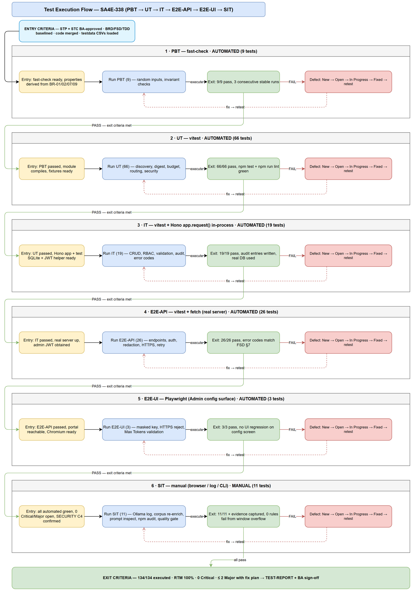
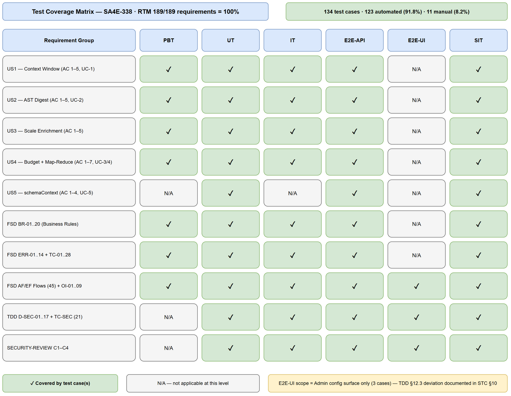

# Software Test Plan (STP)

## SDLC-Agents-4-Enterprise — SA4E-338: [pega][enrichment] AST digest thay text dump — fix vượt LLM context window cho Pega rule enrichment

---

## Document Information

| Field | Value |
|-------|-------|
| Jira Ticket | SA4E-338 |
| Title | [pega][enrichment] AST digest thay text dump — fix vượt LLM context window cho Pega rule enrichment |
| Author | QA Agent |
| Version | 1.1 |
| Date | 2026-10-05 |
| Status | BA review round 1 applied (CHANGES REQUESTED → fixed) — awaiting BA re-approval |
| Related BRD | BRD-v2.0-SA4E-338.docx |
| Related FSD | FSD-v1.2-SA4E-338.docx |
| Related TDD | TDD-v2.0-SA4E-338.docx |
| Related STC | STC.md (138 test cases) |

---

## Author Tracking

| Role | Name - Position | Responsibility |
|------|-----------------|----------------|
| Author | QA Agent – QA Engineer | Create STP + STC documents |
| Peer Reviewer | BA Agent – Business Analyst | RTM business-coverage review (Review Gate) |

---

## Revision History

| Version | Date | Author | Changes |
|---------|------|--------|---------|
| 1.0 | 2026-10-05 | QA Agent | Initiate document — auto-generated from BRD-v2.0, FSD-v1.2, TDD-v2.0, SECURITY-REVIEW |
| 1.1 | 2026-10-05 | QA Agent | BA review round 1 (CHANGES REQUESTED) applied to STC + this STP: added UT-09b, IT-20, IT-21, E2E-API-27; RTM labels corrected (EF-2.4, AF-5.2/EF-5.2, AF-1.2/AF-1.4, TC-09/TC-23/TC-28, OI-09, FSD §9 source, BR-14, SEC-338-01..19); counts 134 → **138** (automation 127 = **92.0%**) |

---

## Sign-Off

| Name | Signature and date |
|------|--------------------|
| | ☐ I agree and confirm the test plan in this STP |
| | ☐ I agree and confirm the test plan in this STP |

> ⏳ **Review Gate:** STC RTM (§12) awaits **BA approval** before test planning is final.

---

## 1. Introduction

### 1.1 Purpose

This test plan defines the strategy, scope, schedule, resources, and quality gates for verifying **SA4E-338** — the Pega rule enrichment pipeline changes that (a) replace raw text dumps with an **AST digest** so prompt sizes fit within the LLM provider **context window**, (b) add **dynamic context-window discovery** with env override, (c) add **budget-aware prompt construction** with proactive/reactive **map-reduce recovery**, and (d) wire **`schemaContext`** into the enrichment prompt. It also covers the security hardening conditions (C1–C4) raised by SECURITY-REVIEW.

### 1.2 Test Objectives

- Verify all 26 BRD Acceptance Criteria across the 5 User Stories (US1–US5).
- Exercise all 20 Business Rules (BR-01..20), 45 Alternative/Exception flows, 14 Error codes, 28 FSD test scenarios, and 9 Open Issues.
- Validate TDD security design decisions `D-SEC-01..17` and security scenarios `TC-SEC-*`, including SECURITY-REVIEW conditions C1–C4.
- Guarantee **no silent truncation** on the PEGA prompt path, **no full-prompt retry** on context-length errors, and **pinned logic nodes** never dropped from digests.
- Achieve **100% requirement coverage** via the STC Requirements Traceability Matrix (RTM).
- Maximize automation: target **≥ 90% automated** test cases (achieved: 127/138 = **92.0%**), leaving only visual/timing/log-inspection scenarios manual.

### 1.3 References

| Document | Location |
|----------|----------|
| BRD | documents/SA4E-338/BRD.md (v2.0) → BRD-v2.0-SA4E-338.docx |
| FSD | documents/SA4E-338/FSD.md (v1.2) → FSD-v1.2-SA4E-338.docx |
| TDD | documents/SA4E-338/TDD.md (v2.0) → TDD-v2.0-SA4E-338.docx |
| Security Review | documents/SA4E-338/SECURITY-REVIEW.md (findings SEC-338-01..19, conditions C1–C4) |
| Test Cases | documents/SA4E-338/STC.md (138 TC, RTM §12) |
| Test Data | documents/SA4E-338/testdata/*.csv (8 files) |
| Diagrams | documents/SA4E-338/diagrams/*.png |

---

## 2. Test Strategy

### 2.1 Test Levels

Six-level model. **Every automated level runs in CI**; SIT is manual-only.

| Level | Scope | Automation | Tools |
|-------|-------|------------|-------|
| PBT | Correctness properties (random inputs): budget math, chunk bounds, digest pinning, redaction | Automated | fast-check ^4.9.0 |
| UT | Unit/edge cases: discovery, error classification, digest builders, prompt build, routing, security | Automated | vitest |
| IT | API integration (Hono app in-process + real SQLite) | Automated | vitest + Hono `app.request()` |
| E2E-API | REST endpoint E2E (real server, JWT, real config/DB) | Automated | vitest + fetch |
| E2E-UI | Browser UI E2E (Admin Portal config surface) | Automated | Playwright |
| SIT | Manual exploratory / visual / log-inspection / quality gates only | Manual | Browser + CLI |

**Test pipeline flow** (entry/exit criteria + defect feedback loops):



#### E2E Automation Coverage (SIT → E2E classification)

Goal: minimize manual SIT to visual/UX/log-only tests.

| Scenario Type | Classified As | Examples in this ticket |
|--------------|---------------|-------------------------|
| API response verification (status, body, headers) | E2E-API | discovery endpoints, retry/failure APIs, auth errors |
| RBAC/auth checks (401/403/429) | E2E-API | IT-09/E2E-API-06..08, project-scope 403 |
| CRUD/config persistence via API | E2E-API | E2E-API-13..16 config read/write, env override |
| Regression — existing enrichment features | E2E-UI | admin config masking, HTTPS validation |
| Form validation (invalid input) | E2E-UI | E2E-UI-02/03 endpoint URL + Max Tokens validation |
| Confirmation/state badges | E2E-UI | E2E-UI-01 masked `••• (saved)` |
| **Real provider/LLM behavior, log inspection, DB row inspection** | SIT (manual) | SIT-01..07, SIT-09 |
| **Quality gates (`npm test`, `npm run lint`, `npm audit`)** | SIT (manual) | SIT-08, SIT-11 |
| **Visual/layout/UX judgment** | SIT (manual) | SIT-10 admin portal smoke |

**Deviation note (TDD §12.3):** TDD stated "no Playwright"; this plan adds **3 E2E-UI tests** covering only the Admin-UI configuration surface (D-SEC-05a/06, condition C2 — mask + HTTPS enforcement). Approved deviation documented in STC §10; reduces manual verification of security-critical form behavior.

#### STP Test Cases Summary

| Level | Count | Automated | Manual |
|-------|-------|-----------|--------|
| PBT | 9 | 9 | 0 |
| UT | 67 | 67 | 0 |
| IT | 21 | 21 | 0 |
| E2E-API | 27 | 27 | 0 |
| E2E-UI | 3 | 3 | 0 |
| SIT | 11 | 0 | 11 |
| **Total** | **138** | **127 (92.0%)** | **11 (8.0%)** |

### 2.2 Test Types

| Type | Description | Applicable |
|------|-------------|------------|
| Functional Testing | FSD UC-1..5, BR-01..20, ERR-01..14 | Yes |
| Integration Testing | Hono routes, SQLite persistence, config/env wiring | Yes |
| Regression Testing | Existing enrichment (C4 corpus, non-Pega CLASS/FUNCTION rules) | Yes |
| Security Testing | D-SEC-01..17, TC-SEC-*, C1–C4 (redaction, HTTPS, RBAC, rate limit, injection) | Yes |
| Non-Functional (Performance/Reliability) | Retry budgets, bounded map-reduce, token estimation accuracy ≤ 10% | Yes |
| Usability Testing | Admin config UI masking/validation (E2E-UI + SIT-10) | Yes |
| Compatibility Testing | Browser coverage limited to Chromium (Playwright) | No (out of scope) |

### 2.3 Test Approach

- **Risk-based ordering:** PBT/UT first (cheapest, highest defect yield for budget math and digest pinning), then IT (real routing + SQLite), then E2E-API (real server + JWT), E2E-UI (browser), SIT last (manual, expensive).
- **Automate-first:** any SIT scenario with deterministic input/output is classified as E2E-API or E2E-UI (see §2.1 table). SIT retains only scenarios requiring human judgment: real-LLM output quality, log inspection, visual smoke, and CI quality gates.
- **Security-first execution:** IT-09..IT-18 (RBAC/rate-limit/redaction/HTTPS/masking) run before any bulk re-enrichment SIT (condition C4).
- **Defect feedback:** any failure at a level blocks exit criteria; fix → retest affected level → regression sweep at next level (flow diagram §2.1).
- **Implementation state:** at planning time (2026-10-05) `getContextWindow` / `isContextLengthError` / `LLM_CONTEXT_WINDOW` are absent from `backend/src` (Phase 5 not started) → **all 138 cases start `NOT_RUN` by design**; execution occurs in Phase 6.

### 2.4 Entry Criteria

| Level | Entry Criteria |
|-------|---------------|
| PBT | Test framework installed (fast-check ^4.9.0 present in `backend/package.json`); `npm run test:unit` green baseline |
| UT | Phase 5 code merged for the unit under test; existing suite green; test data CSVs prepared |
| IT | Hono app boots with test SQLite; auth helper issues JWT; `npm run test:integration` runnable |
| E2E-API | Real server starts on `E2E_PORT` (port file at `PORT_FILE_PATH`); admin seed user with `E2E_PASSWORD` exists; `npm run test:e2e-api` runnable |
| E2E-UI | `npm run test:e2e-ui` (Playwright) configured; admin portal reachable at `ADMIN_URL`; Chromium installed |
| SIT | All automated levels (PBT→E2E-UI) pass with **0 Critical/0 Major open defects**; `C:\projects\Pega\PegaPlatfrom\rules` corpus available; Ollama endpoint available for SIT-01; SECURITY-REVIEW C4 confirmed before bulk re-enrichment (SIT-02) |
| UAT (BA) | STP + STC BA-approved (Review Gate); SIT sign-off obtained |

### 2.5 Exit Criteria

| Level | Exit Criteria |
|-------|--------------|
| PBT | 9/9 properties pass; no flaky run in 3 consecutive CI runs |
| UT | 67/67 pass; `npm test` (vitest) green; `npm run lint` green |
| IT | 21/21 pass against real Hono routing + real SQLite (no `vi.fn()` on DB); audit entries verified |
| E2E-API | 27/27 pass against real server; 0 unhandled crashes; all error codes match FSD §9 |
| E2E-UI | 3/3 pass in Chromium; no critical UI regression |
| SIT | 11/11 executed with evidence in `evidence/`; 0 Critical open; ≤ 2 Major open with fix plan; **re-enrich corpus: 0 rules fail from window overflow** (BRD US3 AC-5) |
| Overall | RTM 100% covered with PASS (or approved waiver); Test Completion Report issued; BA sign-off on UAT |

---

## 3. Test Scope

### 3.1 Features In Scope

| # | Feature / Story | Priority | FSD Reference | Test Type |
|---|----------------|----------|---------------|-----------|
| 1 | US1 — Dynamic LLM context window (discovery + env override + fallback 8192) | High | UC-1, BR-03/04/06/19/20, TC-19..21 | Functional, IT, E2E-API |
| 2 | US2 — AST digest replaces text dump (real fields, caps, decision-table builder) | High | UC-2, BR-02/05/14/17, TC-05..08 | Functional, PBT, UT |
| 3 | US3 — Enrichment with digest at scale (HomeTabMain 3.4 MB, corpus 1578 rules) | High | UC-2/UC-3, US3 AC-1..5, TC-18/28 | Functional, E2E-API, SIT |
| 4 | US4 — Budget-aware prompt + auto map-reduce recovery | High | UC-3/UC-4, BR-01/07/08/09/10/11/12/13/16, TC-10..12 | Functional, PBT, IT, E2E-API |
| 5 | US5 — Wire `schemaContext` into prompt | Medium | UC-5, BR-15, TC-13/14 | Functional, UT, E2E-API |
| 6 | Security hardening (SECURITY-REVIEW C1–C4, D-SEC-01..17) | High | TDD §7, TC-SEC-* | Security, IT, E2E-API, E2E-UI |
| 7 | Observability: budget warn, `mapReduceReport`, enrichment_meta persistence | Medium | BR-12/13, OI-02, ERR-03..06 | Functional, SIT |
| 8 | Error routing & retry budgets (terminal vs transient, bounded retries) | High | OI-05, ERR-07/12/13/14, TC-09/23/25 | Functional, IT, E2E-API |
| 9 | Quality gates (`npm test`, `npm run lint`, `npm audit`) | High | BRD US2 AC-5, US4 AC-7, C3 | Non-functional, SIT |



### 3.2 Features Out of Scope

| # | Feature | Reason |
|---|---------|--------|
| 1 | LLM model output *quality* scoring (semantic correctness of generated pseudo-code) | Subjective; BA/UAT judges sample outputs (SIT-03 manual spot-check only) |
| 2 | Multi-browser compatibility (Firefox/WebKit/Safari) | Chromium-only per project convention |
| 3 | Load/performance stress testing (RPS, concurrent users) | Single-user enrichment pipeline; no perf NFR in BRD/FSD |
| 4 | Non-Pega enrichment routes (CLASS/FUNCTION legacy) — beyond regression sanity | Owned by other tickets; SIT-09 runs one regression case only |
| 5 | Production Ollama/LM Studio/vLLM clusters | Test uses local/stubbed endpoints; provider field mapping verified against fixtures |
| 6 | SA4E-214 (schemaContext *source*) | Dependency provides schemaContext; only wiring (UC-5) is in scope |
| 7 | Deployment/rollback procedures | Phase 7 DevOps scope (DPG) |

---

## 4. Test Environment

### 4.1 Environment Requirements

| Environment | URL / Source | Database | Purpose |
|-------------|--------------|----------|---------|
| Local dev (IT) | In-process Hono `app.request()` — no real port | SQLite (test, in-process) | Integration tests |
| E2E (real server) | `BASE_URL` / `API_URL` from `backend/tests/e2e/setup/e2e-config.ts` (`E2E_PORT` + `PORT_FILE_PATH`) | SQLite test DB on E2E server | E2E-API |
| Admin Portal (E2E-UI) | `ADMIN_URL` (same E2E server) | same as E2E | Playwright browser tests |
| SIT | `localhost` dev server + CLI | dev SQLite | Manual exploratory |
| Provider endpoints | Ollama `http://localhost:11434`, LM Studio, vLLM — or wiremock/fixture servers | — | UC-1 discovery (UT/IT/E2E-API stubs; SIT-01 real Ollama) |

**Config / env vars used by tests:**

| Variable | Purpose | Test values |
|----------|---------|-------------|
| `LLM_CONTEXT_WINDOW` | Hard env override (BR-04) | `64000` (valid), `abc` / `-5` / empty (invalid → UT-02/PBT-07) |
| `LLM_ALLOW_INSECURE_HTTP` | HTTPS enforcement exception (D-SEC-05c) | unset (reject), `1` (allow + warn) |
| `E2E_PORT`, `PORT_FILE_PATH`, `BASE_URL`, `ADMIN_URL`, `API_URL` | E2E server discovery | from `e2e-config.ts` |
| `E2E_PASSWORD` | Admin login seed | `test-admin-pw-01` |

### 4.2 Browser / Device Requirements

| Browser | Version | OS | Required |
|---------|---------|-----|----------|
| Chromium (Playwright bundled) | latest bundled | Windows 10/11 | Yes (E2E-UI) |
| Chrome (manual SIT) | 120+ | Windows 10/11 | Yes (SIT-10) |

### 4.3 Test Data Requirements

Source of truth: `documents/SA4E-338/testdata/*.csv` — **8 files, 169 rows** (every TC ID appears in ≥ 1 row).

| Data Type | Description | Source | Preparation |
|-----------|-------------|--------|-------------|
| Pre-seeded users/projects | Admin + non-admin actors, project scoping for D-SEC-03 | `pre-seeded-data.csv` | Seed before IT/E2E (JWT with/without `pid`) |
| Pega rule corpus | `HomeTabMain` (3.4 MB layout), `GetDBobjects`, DecisionTable, broken JSON, pure-layout rule, **oversized 6 MB fixture (IT-20, EF-2.4)** | `C:\projects\Pega\PegaPlatfrom\rules` + `pega-samples.ts` fixtures | Copy fixtures into test project; index via `PegaRuleAstParser` |
| Context-window fixtures | Ollama/LM Studio/vLLM response bodies (incl. Ollama `{model}`→`{name}` retry case EF-1.5, arch-suffixed models OI-01, **LM Studio 404 endpoint-absent UT-09b/OI-09**) | `context-window-testdata.csv` | Stub provider server returns fixture by row |
| Budget/prompt cases | Window/budget boundary values, utilization thresholds (79%/80%/100%), schemaContext variants, **corpus token-accuracy sampling ±10% (E2E-API-27 / FSD TC-28)** | `budget-prompt-testdata.csv` | Feeds PBT-01..03, UT-30..40, E2E-API-26/27 |
| Map-reduce cases | Chunk sizes, oversized atomic node, retry/auth/transient failures, reduction-round exhaustion, **shared `chunkedReduce<T>` structure check (IT-21)** | `map-reduce-testdata.csv` | Feeds PBT-05/09, UT-41..52, IT-21 |
| Security cases | Secret strings (API keys), insecure `http://` URLs, forged `X-Project-Id`, injection payloads, oversized error bodies | `security-testdata.csv` | Feeds D-SEC/TC-SEC cases; verify zero leakage |
| Routing matrix | Error classification inputs (context vs transient vs terminal) + expected routing | `routing-testdata.csv` | Feeds UT-12..16, IT-07 |
| Enrichment lifecycle payloads | Create/read/update enrichment records + `enrichment_meta` shapes | `enrichment-testdata.csv` | Feeds IT-01..03, SIT-07 |

### 4.4 External Dependencies

| System | Dependency | Mock/Stub Available |
|--------|-----------|---------------------|
| Ollama API | `POST /api/show` (model_info.*.context_length), `/api/tags` fallback | Yes — fixture JSON from `context-window-testdata.csv` |
| LM Studio API | `GET /api/v0/models` (`max_context_length` chain) | Yes — fixture |
| vLLM API | `GET /v1/models` (`max_model_len`, select by `id == LLM_MODEL`) | Yes — fixture |
| LLM inference endpoint | Chat completion (context-length error bodies, 5xx, timeout) | Yes — stub for UT/IT/E2E-API; real Ollama for SIT-01 |
| Pega rules corpus | Real rules incl. HomeTabMain | Yes — `C:\projects\Pega\PegaPlatfrom\rules` |
| pi-subagents / npm audit | Security C3 dependency scan | CLI (`npm audit --omit=dev`), SIT-08 |

---

## 5. Test Schedule

> Estimated relative timeline (dates finalized by SM when Phase 6 starts).

| Phase | Offset | Duration | Milestone / Deliverable |
|-------|--------|----------|-------------------------|
| Test Planning (this STP + STC) | D0 | 2 days | STP + STC + testdata + diagrams ready |
| **BA Review Gate (RTM)** | D+1 | 3–5 days | BA verdict APPROVED → planning final |
| Test Data Preparation | D+2 | 1 day | 8 CSVs loaded, fixtures seeded |
| Phase 5 Implementation (DEV) | — | Dev-managed | Code merged; entry criteria met |
| PBT + UT Execution | after merge | 0.5 day | 76/76 automated pass |
| IT Execution | after UT | 0.5 day | 21/21 pass (real routing + SQLite) |
| E2E-API + E2E-UI Execution | after IT | 0.5 day | 30/30 pass |
| SIT Execution (manual) | after E2E | 2 days | SIT report + evidence; C4 confirmed before SIT-02 |
| Defect Fix & Retest | rolling | per severity SLA | 0 Critical / ≤ 2 Major open |
| Test Completion Report | end | 1 day | TEST-REPORT + sign-off |

**Milestones:** ① STP/STC BA-approved · ② automated suite 127/127 green · ③ SIT 11/11 with evidence · ④ Test Completion Report.

---

## 6. Resources & Responsibilities

| Role | Name | Responsibility |
|------|------|---------------|
| Test Lead / QA Agent | QA Agent | STP/STC creation, RTM, automation suite (PBT→E2E), SIT execution, defect reporting |
| BA | BA Agent | **Review Gate** on STC RTM (business coverage, semantics, edge cases, scope) — approval required before planning is final |
| SM | Scrum Master | Orchestrates review gate, relays verdict, tracks RUN-LOG, quality gates |
| Developer | DEV Agent | Phase 5 implementation; fix defects per SLA; unit test coverage |
| SA | SA Agent | TDD authority — clarify D-SEC/TC-SEC ambiguities found during testing |
| DevOps | DevOps Agent | CI wiring for test levels, `npm audit` gate (C3), environment |
| Security | Security Agent | Verifies C1–C4 closure evidence (SECURITY-REVIEW conditions) |

**Tools:** vitest (UT/IT/E2E-API), fast-check (PBT), Playwright (E2E-UI), Hono `app.request()` (IT), CSV test data in `testdata/`, evidence in `evidence/`, bug tracking via Jira, KB via `mem_ingest_file`.

---

## 7. Risk & Mitigation

| # | Risk | Impact | Likelihood | Mitigation |
|---|------|--------|------------|------------|
| 1 | Phase 5 not started — implementation absent at planning time | High | High | All TC set `NOT_RUN` by design; STC frozen as *planned* state; Phase 6 executes after merge |
| 2 | BA Review Gate rejects RTM (coverage/semantics gaps) | High | Medium | RTM pre-verified against 189 requirement instances (100%); max 2 fix→re-review iterations; escalate ambiguity to SM/BA — QA does not guess |
| 3 | Real provider variability (Ollama field shapes differ per version) | Medium | Medium | Fixture-driven tests pin expected fields per TDD §3.7 (OI-01 resolver covers arch-suffixed MAX); SIT-01 spot-checks real Ollama |
| 4 | Large corpus (1578 rules) re-enrichment slow / cost in SIT-02 | Medium | Medium | Run once at end; confirm C4 retry-limit first; timebox; keep smaller samples for interim runs |
| 5 | Context-length errors hard to reproduce deterministically | High | Medium | Stubbed provider error bodies (`routing-testdata.csv`); both proactive (budget) and reactive (provider error) paths covered by IT/E2E-API |
| 6 | Flaky Playwright/E2E (port file race, server startup) | Medium | Low | Reuse existing `e2e-config.ts` port-file pattern; retry-once at runner level; isolate E2E-UI to config surface only |
| 7 | Security regression (secret leakage) slips to release | High | Low | Dedicated security cases (UT-55..66, IT-13..18, E2E-API-06..15) are exit-blocking; C2/C3 evidence required for SIT sign-off |
| 8 | Test data drift vs fixtures | Low | Medium | CSVs are single source of truth; test code reads same fixtures; regenerate on FSD change |

---

## 8. Defect Management

### 8.1 Severity Levels

| Severity | Definition | Example |
|----------|-----------|---------|
| Critical | Data loss, security breach, pipeline-wide failure, silent truncation of enrichment | Secret leaked to log/DB; all 1578 rules fail enrichment from window overflow; pinned logic node dropped |
| Major | Feature broken, workaround exists, wrong business behavior | Env override ignored; map-reduce not triggered on context error; provider field mapping wrong → always 8192 |
| Minor | Limited-impact functional issue, cosmetic, log wording | 80% warn message inaccurate; malformed schemaContext warns incorrectly but enrichment continues |
| Trivial | Typo, minor alignment, nit | Comment/label typo in dashboard |

### 8.2 Priority Levels

| Priority | Definition | SLA (Fix Time) |
|----------|-----------|----------------|
| P1 | Must fix immediately (Critical + blocker) | 4 hours |
| P2 | Must fix before release (Major) | 1 business day |
| P3 | Should fix if time permits (Minor) | 3 business days |
| P4 | Nice to fix, can defer (Trivial) | Next release |

### 8.3 Defect Lifecycle

```
New → Open → In Progress → Fixed → Ready for Retest → Verified → Closed
                                                     → Reopened → In Progress
```

- Defects reference TC ID + requirement (e.g., `UT-43 / BR-02`).
- Security defects (D-SEC/TC-SEC failures) require Security Agent acknowledgment before Close.
- Verified by the same test case that found it + regression at next level.

---

## 9. Test Metrics & Reporting

### 9.1 Metrics

| Metric | Formula | Target |
|--------|---------|--------|
| Test Execution Rate | Executed / Total × 100% | 100% (138/138) |
| Pass Rate | Passed / Executed × 100% | ≥ 95% |
| Automation Coverage | Automated / Total × 100% | ≥ 90% (**achieved at planning: 92.0%**) |
| Requirement Coverage (RTM) | Covered requirements / Total × 100% | **100% (189/189)** |
| Defect Density | Defects / Test Cases | ≤ 0.1 |
| Critical Defect Count | Count of Critical severity at exit | 0 |
| Defect Fix Rate | Fixed / Total Defects × 100% | ≥ 90% |
| Corpus Overflow Failure Rate (US3 AC-5) | Rules failed from window overflow / 1578 | 0% (SIT-02) |

### 9.2 Reporting Schedule

| Report | Frequency | Audience |
|--------|-----------|----------|
| Automated suite status (CI) | Per commit | DEV + SM |
| Daily Test Status | Daily during execution | Project team |
| Defect Summary | Daily | Dev team + SM |
| SIT-REPORT-SA4E-338 | End of SIT | All stakeholders |
| TEST-REPORT-SA4E-338 (final) | End of Phase 6 | All stakeholders — SM attaches DOCX to Jira |

---

## 10. Appendix

### 10.1 Diagram Index

| # | Diagram | Image | Source (editable) | Purpose |
|---|---------|-------|-------------------|---------|
| 1 | Test Coverage | [test-coverage.png](diagrams/test-coverage.png) | [test-coverage.drawio](diagrams/test-coverage.drawio) | Requirements × test-level coverage matrix |
| 2 | Test Execution Flow | [test-execution-flow.png](diagrams/test-execution-flow.png) | [test-execution-flow.drawio](diagrams/test-execution-flow.drawio) | Pipeline swimlanes, entry/exit gates, defect loops |

*[Edit in draw.io](diagrams/test-coverage.drawio) · [Edit in draw.io](diagrams/test-execution-flow.drawio)*

### 10.2 Test File Map (planned paths)

| Level | Location |
|-------|----------|
| PBT | `backend/src/**/__tests__/*.property.test.ts` |
| UT | `backend/src/**/__tests__/*.test.ts` |
| IT | `backend/tests/integration/pega-enrichment-context-window.it.test.ts` (+ security/routing IT files) |
| E2E-API | `backend/tests/e2e/pega-enrichment-context.e2e.test.ts`, `admin-config-security.e2e.test.ts` |
| E2E-UI | `backend/tests/e2e/llm-config-security.ui.e2e.test.ts` (helpers: `tests/e2e/setup/`) |
| SIT | Manual — evidence → `documents/SA4E-338/evidence/` |

### 10.3 Commands

| Purpose | Command (from `backend/`) |
|---------|---------------------------|
| Full unit+integration | `npm test` |
| Lint gate | `npm run lint` |
| Integration only | `npm run test:integration` |
| E2E-API | `npm run test:e2e-api` |
| E2E-UI | `npm run test:e2e-ui` |
| Audit (C3) | `npm audit --omit=dev` |

### 10.4 Glossary

| Term | Definition |
|------|------------|
| STP | Software Test Plan |
| STC | Software Test Cases |
| PBT | Property-Based Testing |
| IT | Integration Test (in-process Hono) |
| E2E | End-to-End test |
| SIT | System Integration Testing (manual) |
| RTM | Requirements Traceability Matrix |
| AST digest | Structured summary of a rule built from parsed AST fields (replaces raw text dump) |
| map-reduce recovery | Chunk → summarize → reduce pipeline when prompt exceeds context window |

### 10.5 Assumptions

- Phase 5 (DEV) will implement against TDD v2.0 contracts; STC test file paths are *planned* and may be adjusted by DEV while keeping TC coverage.
- Test corpus `C:\projects\Pega\PegaPlatfrom\rules` remains available on the QA machine.
- BA Review Gate result will be recorded before execution begins; unresolved requirement ambiguity escalates to SM/BA (QA does not invent behavior).
- Provider APIs follow TDD §3.7 field mappings; if a provider changes shapes, fixtures + OI-01 resolver tests document the delta.
