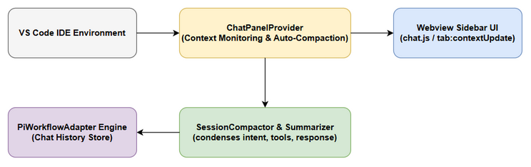

# Functional Specification Document (FSD)

## SDLC Agents 4 Enterprise (Extension) — SA4E-339: Fix Automatic Session Compaction Hook in ChatPanelProvider

---

## Document Information

| Field | Value |
|-------|-------|
| Jira Ticket | SA4E-339 |
| Title | Fix Automatic Session Compaction Hook in ChatPanelProvider |
| Author | ba-agent (draft) & ta-agent (technical enrichment) |
| Version | 1.2 |
| Date | 2026-10-07 |
| Status | Draft (Needs Revision) — Round-4 remediation applied, pending SM re-review |
| Issue Type | Bug |
| Priority | High |
| Component | `extension/src/chat-panel`, `extension/src/pi-agent` |
| Related BRD | documents/SA4E-339/BRD.md |
| Related TDD | documents/SA4E-339/TDD.md |
| Related STC | documents/SA4E-339/STC.md |
| Related STP | documents/SA4E-339/STP.md |
| Review Work Order | documents/SA4E-339/REVIEW-REPORT.md (§3 R3 FSD-01…FSD-06, §2 D-2a) |

---

## Revision History

| Version | Date | Author | Changes |
|---------|------|--------|---------|
| 1.0 | 2026-10-07 | ba-agent | Initial draft from BRD SA4E-339 |
| 1.1 | 2026-10-07 | ta-agent | Technical enrichment (component specs, use cases, BRs, API contracts, traceability) |
| 1.2 | 2026-10-07 | ta-agent | **Round-4 remediation** (REVIEW-REPORT §3 R3): **FSD-01** rebuilt Use Case table — every row now has exactly 6 columns, UC-06/UC-07 rewritten to real code behavior (no fabricated "log warning"); **FSD-02** BR↔AC traceability fixed (BR-04→AC-03, BR-05→AC-02) and BR-08 added for AC-05; **FSD-03** documented the real trigger formula `normalizeUsageToFraction(round(percentage))` and the **94.5% boundary** per D-2a; **FSD-04** corrected output contract to the real `CompactionResult` (8 fields, `action ∈ compact\|warn\|none`); **FSD-05** header + section numbering normalized to `documents/templates/FSD-TEMPLATE.md`, status kept truthful; **FSD:104-108** traceability matrix re-pointed to section numbers verified inside this file (both the FSD column and the TDD column). |

---

## 1. Introduction

### 1.1 Purpose

This specification defines the functional behavior of automatic session compaction inside the VS Code extension chat panel: when context-window consumption reaches the compaction threshold during an active turn, `ChatPanelProvider` must consult `SessionCompactor`, replace the conversation history with a summary plus the most recent messages, and refresh the webview context meter — instead of letting the session overflow and show the red *"Context window is full. Start new tab"* banner (BRD §1).

It defines use cases UC-01…UC-08 with alternative/exception flows (§3.1.2), business rules BR-01…BR-08 (§3.1.3), data specifications (§3.1.4), the functional API contract of `SessionCompactor.compact()` and the `tab:contextUpdate` payload (§3.1.6), processing logic with pseudocode (§6.1), and the quantified non-functional targets (§8). Physical implementation detail (exact insertion points, helper signatures) belongs to the TDD.

### 1.2 Scope

**In scope:**

- Wiring `SessionCompactor` into `ChatPanelProvider.updateContextUsageAfterTurn()` (`extension/src/chat-panel/chat-panel-provider.ts`).
- Automatic trigger when `usageFraction >= 0.95` **and** `messages.length > 2`.
- Replacing engine chat history via `engine.setChatHistory()` with `[summaryMessage, ...last 2 messages]`.
- Recounting tokens after compaction and broadcasting `tab:contextUpdate` to the webview.
- Strict usage normalization and summary-role sanitization (SEC-330-01, SEC-330-02).
- **Verification through unit/integration tests**: the compaction suite `extension/src/chat-panel/__tests__/chat-panel-provider.compaction.test.ts` plus the existing regression suite `extension/src/__tests__/chat`, with an AC ↔ STC ↔ test-name mapping **[Implements: AC-05]**.

**Out of scope:**

- Changing the summarizer prompt/quality logic (`extension/src/pi-agent/summarizer.ts`) beyond using it as-is.
- The red overflow banner implementation (pre-existing behavior, BRD §1).
- Persistence of summaries across tabs/sessions.
- Phantom API `engine.getDetectedModelId()` — see Open Issue **OI-01** (decision D-1, owned by sa-agent + dev-agent).

### 1.3 Definitions & Acronyms

| Term | Definition |
|------|------------|
| `usageFraction` | Context usage expressed as a fraction in `[0, 1]`; the only unit accepted by `SessionMonitor.shouldCompact()`. |
| `percentage` | Context usage on the 0–100 scale. **Always an integer** — produced by `Math.round(...)` in `ContextUsageTracker.getUsagePayload()` / `pct()`. |
| `COMPACT_USAGE_THRESHOLD` | `0.95` — constant defined at `session-compactor.ts:11`; single source of truth for the compaction trigger. |
| `WARN_USAGE_THRESHOLD` | `0.85` — constant at `session-compactor.ts:12`; usage in `[0.85, 0.95)` yields `action = 'warn'` (no cut). |
| `COMPACT_TARGET_USAGE` | `0.70` — target usage after a successful compaction (BRD NFR-03). |
| `RECENT_MESSAGES_KEPT` | `2` — number of most recent messages kept after the summary. |
| `CompactionAction` | `'compact' \| 'warn' \| 'none'` (union type, `session-compactor.ts:39`). |
| SEC-330-01 / SEC-330-02 | Security controls **inherited from SA4E-330 §Security** (role-elevation prevention / usage-scale contract). See §7. |
| D-2a | Review decision: **keep the code** (`normalizeUsageToFraction(percentage)` + round-before-normalize) and make the documents match the code — `REVIEW-REPORT.md` §2 D-2. |

### 1.4 References

| Document / Artifact | Location |
|----------|----------|
| BRD | documents/SA4E-339/BRD.md |
| TDD | documents/SA4E-339/TDD.md |
| STC | documents/SA4E-339/STC.md |
| STP | documents/SA4E-339/STP.md |
| Review work order | documents/SA4E-339/REVIEW-REPORT.md |
| FSD template | documents/templates/FSD-TEMPLATE.md |
| Compactor implementation | `extension/src/pi-agent/session-compactor.ts` |
| Usage tracker | `extension/src/chat-panel/context-usage-tracker.ts` |
| Wiring implementation | `extension/src/chat-panel/chat-panel-provider.ts` (`updateContextUsageAfterTurn`, lines 168–273) |
| Summary formatting | `extension/src/pi-agent/summarizer.ts` (`formatSummaryMessage`) |

---

## 2. System Overview

### 2.1 System Context Diagram



*Figure 1: System Context Diagram of ChatPanelProvider & Extension Subsystems.*

The extension interacts with: the **LLM engine** (chat history read/write), the **webview** (context meter via `tab:contextUpdate`), and the **MCP tool registry** (tool-definition token accounting inherited from SA4E-182). Compaction is an in-process operation — no external service is called by the FSD-visible contract (the `Summarizer` may call the local model; its failure is handled as non-fatal, §9).

### 2.2 System Architecture

| Component | File | Responsibility |
|-----------|------|----------------|
| `ChatPanelProvider` | `extension/src/chat-panel/chat-panel-provider.ts` | Owns the turn lifecycle; `updateContextUsageAfterTurn()` computes usage, opens the compaction gate, applies the result, broadcasts to the webview. Holds `private sessionCompactor = new SessionCompactor()`. |
| `SessionMonitor` | `extension/src/pi-agent/session-compactor.ts:73` | Pure decision function `shouldCompact(usage) → 'compact' \| 'warn' \| 'none'`; enforces threshold + SEC-330-02 guard. |
| `SessionCompactor` | `extension/src/pi-agent/session-compactor.ts:90` | `compact(session) → CompactionResult`; summarize → keep `[summary, ...last 2]` → metrics; fallback truncate on throw. |
| `Summarizer` / `formatSummaryMessage` | `extension/src/pi-agent/summarizer.ts` | Produces the summary and emits it as a **`role: 'user'`** message prefixed with `[compaction]` (SEC-330-01). |
| `ContextUsageTracker` | `extension/src/chat-panel/context-usage-tracker.ts` | Counts conversation / mcpTools / steering tokens, produces `ContextUsagePayload` with **integer** percentages. |
| Webview (chat.js) | webview assets | Renders the context meter from `tab:contextUpdate`. |

**Data flow (one turn):** engine turn completes → `updateContextUsageAfterTurn()` → tracker recount → `usageFraction = normalizeUsageToFraction(payload.total.percentage)` → gate `shouldCompact === 'compact' && messages.length > 2` → `compact()` → `setChatHistory()` + recount + refetch payload → broadcast `tab:contextUpdate`.

> **TA Note (preserved SA4E-182 behavior):** the steering-token block (`steeringCounted`) and the MCP tool-definition block (`toolDefinitionsCounted`) at `chat-panel-provider.ts:191-214` are **not** part of this feature and MUST remain untouched by the implementation (REVIEW-REPORT DEV-02).

---

## 3. Functional Requirements

### 3.1 Feature: Automatic Session Compaction on Context-Window Saturation

**Source:** BRD §3 (AC-01…AC-05), BRD §5 (NFR-01…NFR-03), BRD §4 (proposed technical fix)

#### 3.1.1 Description

After every LLM turn, `ChatPanelProvider.updateContextUsageAfterTurn()` recounts token usage and — if the context window is saturated — compacts the session automatically.

**Trigger formula (D-2a — documents follow the code):**

```typescript
// 1) Tracker produces an INTEGER percentage (round happens FIRST)
//    context-usage-tracker.ts:86 and :125
const percentage = Math.min(100, Math.round((total / this.maxTokens) * 100)); // 0..100

// 2) Wiring normalizes it (chat-panel-provider.ts:218)
const usageFraction = normalizeUsageToFraction(payload.total.percentage);

// Composite, i.e. what actually runs:
//    usageFraction = normalizeUsageToFraction(round(ratio * 100))
```

```typescript
// session-compactor.ts:66-71
export function normalizeUsageToFraction(percent: number | undefined | null): number {
  if (typeof percent !== 'number' || !Number.isFinite(percent) || percent < 0) return 0;
  return percent > 100 ? 1 : percent / 100;      // SEC-330-02 clamp
}

// session-compactor.ts:74-87
static shouldCompact(usage: number): CompactionAction {
  if (invalid) return 'none';
  if (usage > 1) { logger.warn(...); return 'warn'; }   // percent-scale misuse guard
  if (usage >= COMPACT_USAGE_THRESHOLD) return 'compact'; // >= 0.95
  return usage >= WARN_USAGE_THRESHOLD ? 'warn' : 'none'; // >= 0.85
}
```

**Boundary behavior (verified against code — `Math.round(94.5) === 95`, `Math.round(94.4) === 94`):**

| Underlying usage (ratio) | `percentage` after `Math.round` | `usageFraction` | `shouldCompact()` | Auto-compact? |
|---|---|---|---|---|
| 0.940 (94.0%) | 94 | 0.94 | `'warn'` | No |
| **0.944 (94.4%)** | **94** | **0.94** | `'warn'` | **No** |
| **0.945 (94.5%)** | **95** | **0.95** | `'compact'` | **Yes** |
| 0.950 (95.0%) | 95 | 0.95 | `'compact'` | Yes |
| 1.000 (100%) | 100 | 1.00 | `'compact'` | Yes |

> **Boundary rule (normative):** the effective auto-compact boundary is **94.5% of the context window**, not 95.000%. Because rounding to an integer percentage happens **before** normalization, a session at exactly **94.5% rounds to 95 -> 0.95 -> `'compact'`**, while **94.4% rounds to 94 -> 0.94 -> `'warn'` -> no compaction**.
>
> **Precision note:** rounding MUST precede normalization. A *raw, unrounded* `94.5` fed straight into `normalizeUsageToFraction(94.5)` yields `0.945` -> `'warn'` (no compaction). In the production pipeline this never occurs because `ContextUsageTracker` always returns an integer percentage; direct-fraction inputs are covered by STC-339-05 / STC-339-10.

**Gate conditions (all must hold, `chat-panel-provider.ts:221`):**

1. `SessionMonitor.shouldCompact(usageFraction) === 'compact'` (i.e. `usageFraction >= 0.95`), **and**
2. `messages.length > 2` (there is something safe to cut).

**Application conditions (`chat-panel-provider.ts:250`):**

3. `compResult.action === 'compact'` **and** `compResult.session.messages.length > 0`.

#### 3.1.2 Use Case

All use cases share: **Actor:** System (`ChatPanelProvider`, no human interaction); **Trigger:** completion of an LLM turn (or a direct unit-test invocation); **Precondition:** extension chat panel active; **Postcondition:** the chat view remains usable and the webview holds the latest `tab:contextUpdate`.

| UC ID | Actor | Trigger | Main Flow | Exception Flow | Expected Result |
|---|---|---|---|---|---|
| **UC-01** | System (`ChatPanelProvider`) | `updateContextUsageAfterTurn()` after an LLM turn | `usageFraction < 0.95` -> `SessionMonitor.shouldCompact()` returns `'none'` (or `'warn'` when `>= 0.85`) -> compaction gate stays closed and `compact()` is never invoked | None | Chat history untouched; `tab:contextUpdate` broadcast with the current usage. |
| **UC-02** | System (`ChatPanelProvider`) | `updateContextUsageAfterTurn()` after an LLM turn | `usageFraction >= 0.95` AND `messages.length > 2` -> gate opens -> `buildCompactableSession()` -> `compact()` returns `action = 'compact'` with `session.messages.length > 0` -> `engine.setChatHistory()` writes summary + last 2 messages -> `updateFromMessages()` recounts -> payload refetched -> broadcast | AF-1: `setChatHistory` is not a function (`typeof` guard at `chat-panel-provider.ts:251`) -> engine-history write skipped silently (no log exists in code), recount and the `Auto-compaction complete` debug log still run, no crash. EF-1: any throw -> outer catch, see UC-08 | History becomes `[summary(user role, [compaction] prefix), ...last 2 messages]`; `tokensSaved > 0`; webview usage reduced toward `COMPACT_TARGET_USAGE` (< 70%). |
| **UC-03** | System (`ChatPanelProvider`) | `updateContextUsageAfterTurn()` after an LLM turn | `usageFraction >= 0.95` but `messages.length <= 2` -> guard `messages.length > 2` fails -> `compact()` is not invoked | None | No compaction; history preserved verbatim (nothing safe left to cut). |
| **UC-04** | System (`ChatPanelProvider`) | `updateContextUsageAfterTurn()` called while the engine is unavailable | `this.engine` is null/undefined -> immediate `return` before tracking, compaction or broadcast | None | No exception, no broadcast, no state change. |
| **UC-05** | System (`ChatPanelProvider`) | `applyCompactionAndRecount()` right after `compact()` returned `action = 'compact'` | `compResult.session.messages.length === 0` -> the `&&` guard fails -> `setChatHistory` **and** the recount are both skipped | Defensive branch only: the compactor always returns at least one message (summary, or the last-2 slice), so the path is unreachable in normal operation — it is a contract guard, not a logged event | History and usage state remain unchanged; the turn completes normally. |
| **UC-06** | System (`ChatPanelProvider`) | `applyCompactionAndRecount()` receives a `CompactionResult` | `compResult.action` is `'warn'` (usage in `[0.85, 0.95)`, or a fraction `> 1.0` = percent-scale misuse) or `'none'` (usage `< 0.85`, negative, non-finite) -> `action === "compact"` evaluates false -> `setChatHistory` skipped **and** recount skipped -> **messages are NOT cut, history stays intact** | None (no user-visible error). The compactor itself may emit `logger.warn('Session usage warning - approaching compaction threshold')` for `'warn'` — that log lives inside `session-compactor.ts:98`, not in the wiring | History and tokens unchanged; only the ordinary `tab:contextUpdate` with unchanged values is broadcast; compaction is deferred to a later turn. Reachable when `compact()` is called directly (unit tests); unreachable through the UC-02 gate because the gate already required `'compact'`. **[STC-339-08]** |
| **UC-07** | System (`ChatPanelProvider`) | Immediately after a successful compaction, the payload is refetched (`payload = getUsagePayload(tabId)`, `chat-panel-provider.ts:225`) | If the recomputed `usageFraction` is still `>= 0.95` — summary still large, or the `mcpTools` + `steering` share alone reaches the threshold (conversation tokens are only one component of `total`) — the turn finishes normally and the gate is evaluated again on the **next** turn, re-attempting compaction while `messages.length > 2` | EF-1: `compactNow()` throws -> `truncateResult()` fallback keeps only the last 2 messages and returns `action = 'compact'`, `truncated = true`, `qualityScore = 0`. EF-2: if `messages.length <= 2` the gate stays closed -> usage stays `>= 95%` in the UI and the pre-existing overflow behavior from BRD §1 applies | Chat never crashes; the UI always shows the true (possibly still high) usage; **no retry loop inside a single turn** — the gate is evaluated exactly once per turn. |
| **UC-08** | System (`ChatPanelProvider`) | Any exception anywhere inside `updateContextUsageAfterTurn()` (tracking, compaction, broadcast) | Outer `catch (err)` -> `debugLog("[ChatPanel] updateContextUsageAfterTurn error (non-fatal): ...")` (`chat-panel-provider.ts:242-244`) | None — errors are swallowed by design (NFR-02) | Chat view keeps working; no user-facing error; no crash. |

#### 3.1.3 Business Rules

| ID | Description | Traceability | Priority |
|---|---|---|---|
| **BR-01** | Compaction MUST be triggered automatically when `usageFraction >= COMPACT_USAGE_THRESHOLD` (0.95), evaluated once per turn through `SessionMonitor.shouldCompact()` (no duplicated magic number). Effective boundary is **94.5%** of the window because the percentage is rounded before normalization (§3.1.1). | [Implements: AC-02] | High |
| **BR-02** | A compacted history MUST consist of exactly 1 summary message plus the last `RECENT_MESSAGES_KEPT` (2) messages — never fewer recent messages, never zero history. | [Implements: AC-03] | High |
| **BR-03** | Usage after a successful compaction MUST target `< COMPACT_TARGET_USAGE` (0.70) of the context window. | [Implements: AC-04] | Medium |
| **BR-04** | The compaction summary message MUST be emitted with `role: 'user'` and the `[compaction]` prefix; it MUST NEVER be emitted as `role: 'system'`. | [Implements: AC-03] [Security: SEC-330-01] | Critical |
| **BR-05** | Usage MUST be normalized to a fraction in `[0, 1]` before any threshold comparison; percent-scale values `> 100` MUST be clamped to `1`, and invalid input (non-finite/negative) MUST yield `0` so compaction can never be triggered by garbage input. | [Implements: AC-02] [Security: SEC-330-02] | Critical |
| **BR-06** | `SessionCompactor` MUST be instantiated and consulted inside `updateContextUsageAfterTurn()`; any failure in that path MUST be non-fatal (logged, never thrown to the UI). | [Implements: AC-01] | High |
| **BR-07** | Compaction latency MUST be `<= COMPACTION_TIME_BUDGET_MS` (300 ms). | [Implements: AC-01] | Medium |
| **BR-08** | A compaction test suite MUST exist at `extension/src/chat-panel/__tests__/chat-panel-provider.compaction.test.ts`, every STC-339-* case MUST map to at least one real test name, and the regression suite `extension/src/__tests__/chat` MUST pass with 0 failures (AC ↔ STC ↔ test-name mapping required). | [Implements: AC-05] | High |

**Coverage check:** AC-01 → BR-06, BR-07 · AC-02 → BR-01, BR-05 · AC-03 → BR-02, BR-04 · AC-04 → BR-03 · AC-05 → BR-08. Every BR traces to ≥ 1 AC; every AC has ≥ 1 BR.

#### 3.1.4 Data Specifications

**Input Data — `CompactableSession` (built by `buildCompactableSession`, `chat-panel-provider.ts:262-273`):**

| Field | Type | Required | Validation / Business Rule | Description |
|-------|------|----------|------------|-------------|
| `modelId` | `string` | Y | BR-06 | Wiring currently passes the fixed literal `"default"` — see OI-01 / D-1. |
| `contextWindow` | `number` | Y | BR-05 | `payload.maxTokens` (synced from the detected window). |
| `usage` | `number` | Y | BR-01, BR-05 | `usageFraction` — a fraction in `[0, 1]`, never a percentage. |
| `messages` | `SessionMessage[]` | Y | BR-02 | `{ role: 'user' / 'assistant' / 'system' / 'tool', content: string, toolName?: string }`; non-string content is `JSON.stringify`-ed. |
| `summary` | `CompactionSummary?` | N | BR-04 | Prior summary for chaining: `{ intent: string, toolsUsed: string[], lastResponse: string }`. |

**Output Data — `CompactionResult` (see §3.1.6.A):** `session`, `action`, `summary?`, `tokensSaved`, `usageAfter`, `latencyMs`, `qualityScore`, `truncated`.

#### 3.1.5 UI Specifications

**Screen: Chat panel context meter (webview)**

| No. | Element | Type | Required | Behavior | Validation |
|-----|---------|------|----------|----------|------------|
| 1 | Context meter (conversation / mcpTools / steering) | Bar + percentage | Y | Refreshed on every `tab:contextUpdate`; reflects the reduced token count after compaction (target < 70%) | Percentages are integers 0–100 produced by the tracker |
| 2 | Total token counter | Text | Y | Shows `tokenCount / maxTokens` | `maxTokens` from the payload, synced with the detected window |
| 3 | Threshold badge (`safe` / `warning` / `critical` / `full`) | Badge | Y | Derived from `percentage / 100` (`context-usage-tracker.ts:128-134`) | Not recomputed by this feature |
| 4 | Red "Context window is full. Start new tab" banner | Banner | N | Must become **rare**: auto-compaction fires at 94.5%+ before overflow. Pre-existing component — unchanged by this ticket | Out of scope for modification |

No new UI element is introduced by SA4E-339; the feature is complete when the existing meter shows the post-compaction value without the user opening a new tab (AC-04).

#### 3.1.6 API Contract (Functional View)

> **Note:** This section defines the functional contract (data in/out + business error scenarios). Technical detail (insertion points, helper signatures) lives in TDD §2.

##### A. `SessionCompactor.compact(session: CompactableSession): CompactionResult`

**Source of truth:** `extension/src/pi-agent/session-compactor.ts:49-58` (type) and `:93-114` (method). **The exported type name is `CompactionResult` — NOT `CompactResult`.**

**Input:** `CompactableSession` — see §3.1.4.

**Output: `CompactionResult` (all 8 fields, exact types):**

| Field | Type | Description |
|-------|------|-------------|
| `session` | `CompactableSession` | Resulting session. On `'compact'`: `messages = [formatSummaryMessage(summary), ...messages.slice(-2)]`, plus updated `summary` and `usage`. Otherwise the input session unchanged. |
| `action` | `'compact' / 'warn' / 'none'` | Decision echo of `SessionMonitor.shouldCompact()`. `'warn'` is a real value (usage in `[0.85, 0.95)` or fraction `> 1.0`) — the wiring only proceeds on `'compact'`. |
| `summary` | `CompactionSummary?` | Present only when summarization ran; `{ intent, toolsUsed, lastResponse }`. |
| `tokensSaved` | `number` | `max(0, originalTokens - keptTokens)`; `0` on `'warn'`/`'none'` and on the truncate fallback. |
| `usageAfter` | `number` | Estimated fraction after compaction, clamped to `[0, 1]`; equals `session.usage` on no-op. |
| `latencyMs` | `number` | Elapsed time; must stay `<= 300` (BR-07). |
| `qualityScore` | `number` | `[0, 1]`; `1` for no-op, `0` for the truncate fallback, otherwise computed from non-empty intent/tools/lastResponse. |
| `truncated` | `boolean` | `true` only for the `truncateResult()` fallback (compaction threw). |

**Business error scenarios:**

| Scenario | User Message | Trigger Condition |
|----------|-------------|-------------------|
| Usage in warn zone | None (silent) | `shouldCompact()` returns `'warn'` -> `action = 'warn'`, `tokensSaved = 0`, history untouched [BR-01] |
| Percent-scale / invalid input | None (silent, `logger.warn` in code) | fraction `> 1.0` -> `'warn'`; non-finite/negative -> `'none'` [BR-05, SEC-330-02] |
| Summarization throws | None (non-fatal) | `compactNow()` throws -> `truncateResult()`: `truncated = true`, `qualityScore = 0`, last 2 messages kept [UC-07 EF-1] |
| `setChatHistory` absent | None (silent) | `typeof` guard skips the write, recount still runs [UC-02 AF-1] |

##### B. Webview payload: `tab:contextUpdate`

**Source of truth:** `chat-panel-provider.ts:229-241`.

```json
{
  "type": "tab:contextUpdate",
  "payload": {
    "tabId": "default",
    "tokenCount": 0,
    "maxTokens": 0,
    "breakdown": { "conversation": 0, "mcpTools": 0, "steering": 0 }
  }
}
```

| Field | Type | Description |
|-------|------|-------------|
| `payload.tabId` | `string` | Currently always `"default"` in this path. |
| `payload.tokenCount` | `number` | `payload.total.tokens` — **raw token count**, recomputed after compaction. |
| `payload.maxTokens` | `number` | Context window size (synced from the detected window). |
| `payload.breakdown.conversation` | `number` | **Integer percentage 0–100** (`Math.round`), conversation share. |
| `payload.breakdown.mcpTools` | `number` | Integer percentage 0–100, MCP tool-definition share. |
| `payload.breakdown.steering` | `number` | Integer percentage 0–100, steering/system-prompt share. |

**Business error scenarios:** if the broadcast throws, the outer catch of UC-08 logs it as non-fatal; the webview keeps the previous values.

---

## 4. Data Model

> **Note:** SA4E-339 introduces **no persistent storage** — all entities are in-memory structures of the extension host. Physical/serialization detail belongs to TDD §4.

### 4.1 Entity Relationship Diagram

No ER diagram is required (no database entities are added or altered). The structural dependency view is covered by Figure 1 (§2.1) and the TDD class diagram (`diagrams/class.png`).

### 4.2 Logical Entities

#### Entity: `SESSION_MESSAGE`

| Attribute | Type | Required | Business Rule | Description |
|-----------|------|----------|---------------|-------------|
| `role` | enum `user / assistant / system / tool` | Y | BR-04 | Message author. The summary message is forced to `user`. |
| `content` | `string` | Y | — | Non-string content is `JSON.stringify`-ed when the session is built. |
| `toolName` | `string?` | N | — | Present on tool-result messages. |

#### Entity: `COMPACTION_SUMMARY`

| Attribute | Type | Required | Business Rule | Description |
|-----------|------|----------|---------------|-------------|
| `intent` | `string` | Y | BR-04 | Capped at 150 chars (`INTENT_MAX_CHARS`, `summarizer.ts:10`). |
| `toolsUsed` | `string[]` | Y | — | Tool names used in the conversation; each capped at 64 chars. |
| `lastResponse` | `string` | Y | BR-04 | Capped at 250 chars (`RESPONSE_MAX_CHARS`, `summarizer.ts:11`). |

#### Entity: `COMPACTABLE_SESSION` (input)

| Attribute | Type | Required | Business Rule | Description |
|-----------|------|----------|---------------|-------------|
| `modelId` | `string` | Y | BR-06 | Fixed `"default"` in the current wiring (OI-01). |
| `contextWindow` | `number` | Y | BR-05 | `maxTokens`. |
| `usage` | `number` | Y | BR-01, BR-05 | Fraction in `[0, 1]`. |
| `messages` | `SESSION_MESSAGE[]` | Y | BR-02 | Snapshot of engine history. |
| `summary` | `COMPACTION_SUMMARY?` | N | — | Chained from a previous compaction. |

#### Entity: `COMPACTION_RESULT` (output — contract of §3.1.6.A)

| Attribute | Type | Required | Business Rule | Description |
|-----------|------|----------|---------------|-------------|
| `session` | `COMPACTABLE_SESSION` | Y | BR-02 | Session with the resulting message list. |
| `action` | `'compact' / 'warn' / 'none'` | Y | BR-01 | Decision echo; only `'compact'` proceeds. |
| `summary` | `COMPACTION_SUMMARY?` | N | BR-04 | Set when summarization ran. |
| `tokensSaved` | `number` | Y | — | `>= 0`; `0` on no-op/fallback. |
| `usageAfter` | `number` | Y | BR-03 | Fraction in `[0, 1]` after compaction. |
| `latencyMs` | `number` | Y | BR-07 | Must be `<= 300`. |
| `qualityScore` | `number` | Y | — | `[0, 1]`; `0` on the truncate fallback. |
| `truncated` | `boolean` | Y | — | `true` only on the truncate fallback. |

**Relationships:**

| From Entity | To Entity | Cardinality | Description |
|-------------|-----------|-------------|-------------|
| `COMPACTION_RESULT` | `COMPACTABLE_SESSION` | 1:1 | Result wraps the resulting session. |
| `COMPACTION_RESULT` | `COMPACTION_SUMMARY` | 0:1 | Optional summary produced by this run. |
| `COMPACTABLE_SESSION` | `SESSION_MESSAGE` | 1:N | Message list, cut to `1 + RECENT_MESSAGES_KEPT` on success. |

---

## 5. Integration Specifications

> **Note:** All integration points below are **in-process** (extension host). There is no network boundary introduced by SA4E-339.

### 5.1 Integration: LLM Engine chat history (bidirectional, in-process)

| Attribute | Value |
|-----------|-------|
| Purpose | Read the conversation to compact; write the compacted history back |
| Direction | Bidirectional (`getChatHistory` out, `setChatHistory` in) |
| Data Format | `SessionMessage[]` (in-memory objects) |
| Frequency | Once per LLM turn |

**Data Exchange:**

| Our Data | External Data | Direction | Business Rule |
|----------|--------------|-----------|---------------|
| `messages` snapshot | `engine.getChatHistory()` | Read | Guarded with an empty-array fallback (`\|\| []`); null engine returns early [UC-04] |
| `compResult.session.messages` | `engine.setChatHistory(...)` | Write | Only when `action === 'compact'` and messages non-empty [UC-02, UC-05, UC-06]; `typeof` guard prevents a crash when the method is absent [UC-02 AF-1] |
| `payload.maxTokens` | `engine.getDetectedContextWindow()` | Read | Positive values are pushed into the tracker before computing usage |

**Failure handling:** any throw inside the exchange is caught by the outer `try/catch` and logged as non-fatal (`chat-panel-provider.ts:242-244`) [UC-08].

### 5.2 Integration: Webview context meter (outbound)

| Attribute | Value |
|-----------|-------|
| Purpose | Keep the user-visible context meter truthful after compaction |
| Direction | Outbound (extension host to webview) |
| Data Format | JSON message `{ type: "tab:contextUpdate", payload: {...} }` |
| Frequency | Once per turn — **always**, independent of whether compaction fired |

**Data Exchange:**

| Our Data | External Data | Direction | Business Rule |
|----------|--------------|-----------|---------------|
| `payload.tokenCount`, `payload.maxTokens`, `payload.breakdown.*` | `contextUsageTracker.getUsagePayload(tabId)` | Send | After a compaction the payload is **refetched** before the broadcast (`chat-panel-provider.ts:225`) so the meter shows post-compaction values [AC-04, BR-03] |
| — | Webview `handleContextUpdate` | Receive (webview side) | Existing consumer — unchanged by this ticket |

**Failure handling:** a broadcast error is logged by UC-08's catch; previous webview values remain (no crash — the next turn re-broadcasts).

### 5.3 Integration: `Summarizer` (outbound, in-process)

| Attribute | Value |
|-----------|-------|
| Purpose | Condense the conversation into `intent` / `toolsUsed` / `lastResponse` |
| Direction | Outbound (`SessionCompactor` to `Summarizer`) |
| Data Format | `SessionMessage[]` in, `CompactionSummary` out |
| Frequency | Only when `shouldCompact() === 'compact'` |

**Data Exchange:**

| Our Data | External Data | Direction | Business Rule |
|----------|--------------|-----------|---------------|
| `session.messages`, previous `session.summary` | `summarizer.summarize(...)` | Send | Summary chaining allowed [§4.2] |
| `CompactionSummary` | `formatSummaryMessage(summary)` | Receive | Emitted as `role: 'user'` with the `[compaction]` prefix [SEC-330-01, BR-04] |

**Failure handling:** a throw inside `compactNow()` triggers the `truncateResult()` fallback (`truncated = true`, last 2 messages kept) — it never propagates to the UI [UC-07 EF-1].

---

## 6. Processing Logic

### 6.1 Process: `updateContextUsageAfterTurn` (auto-compaction)

**Trigger:** completion of an LLM turn in the chat panel.
**Input:** engine chat history + current tracker counters.
**Output:** updated engine history (on compaction) + a `tab:contextUpdate` broadcast.
**Error posture:** the whole process is wrapped in one outer `try/catch`; every step is non-fatal.

**Processing Steps:**

| Step | Description | Error Handling |
|------|-------------|----------------|
| 1 | Guard: `engine` null/undefined -> `return` [UC-04] | None needed (no side effect yet) |
| 2 | Sync `maxTokens` from `engine.getDetectedContextWindow()` when `> 0` | Invalid/zero window is ignored (tracker keeps its value) |
| 3 | Read `messages` from `engine.getChatHistory()` (empty-array fallback); recount conversation tokens; count steering once (`steeringCounted`); count MCP tool definitions once (`toolDefinitionsCounted`) — **SA4E-182 blocks, preserved as-is** | Tool-definition fetch is `void ... .catch(() => {})` (non-fatal) |
| 4 | `payload = getUsagePayload(tabId)`; `usageFraction = normalizeUsageToFraction(payload.total.percentage)` [BR-05] | Normalizer maps invalid input to `0` (never triggers compaction) |
| 5 | Gate: `shouldCompact(usageFraction) === 'compact' && messages.length > 2` [BR-01; UC-01, UC-03] | Gate closed -> skip to step 9 |
| 6 | `buildCompactableSession(maxTokens, usageFraction, messages)` | Content coercion (`JSON.stringify`) prevents type errors |
| 7 | `result = sessionCompactor.compact(session)` | Internal `try/catch` -> `truncateResult()` fallback (`truncated = true`) [UC-07 EF-1] |
| 8 | If `result.action === 'compact' && result.session.messages.length > 0`: `setChatHistory` (typeof-guarded) -> recount -> debug log [UC-02, UC-05, UC-06]; then **refetch** `payload` | Guard skips the write when the API is absent; outer catch handles the rest [UC-08] |
| 9 | Broadcast `tab:contextUpdate` with `tokenCount`, `maxTokens`, `breakdown` percentages [AC-04] | Outer catch logs `error (non-fatal)` [UC-08] |

**Pseudocode (insertion-point style; mirrors `chat-panel-provider.ts:168-273`):**

```typescript
private updateContextUsageAfterTurn(): void {
  try {
    const engine = this.engine;
    if (!engine) return;                                  // UC-04
    // ... SA4E-182 blocks preserved: steeringCounted, toolDefinitionsCounted ...

    let payload = this.contextUsageTracker.getUsagePayload(tabId);
    const usageFraction = normalizeUsageToFraction(payload.total.percentage); // BR-05 / D-2a

    if (SessionMonitor.shouldCompact(usageFraction) === 'compact' && messages.length > 2) {
      this.applyCompactionAndRecount(tabId, payload.maxTokens, usageFraction, messages);
      payload = this.contextUsageTracker.getUsagePayload(tabId);             // refetch, AC-04
    }
    this.sendToWebview({ type: 'tab:contextUpdate', payload: { /* see 3.1.6.B */ } });
  } catch (err) {                                        // UC-08
    debugLog(`[ChatPanel] updateContextUsageAfterTurn error (non-fatal): ${err.message}`);
  }
}

private applyCompactionAndRecount(tabId, maxTokens, usageFraction, messages): void {
  const result = this.sessionCompactor.compact(this.buildCompactableSession(maxTokens, usageFraction, messages));
  if (result.action !== 'compact' || result.session.messages.length === 0) return; // UC-05 / UC-06
  if (typeof (this.engine as any).setChatHistory === 'function') {                   // UC-02 AF-1
    (this.engine as any).setChatHistory(result.session.messages);
  }
  this.contextUsageTracker.updateFromMessages(tabId, result.session.messages.map(m => ({ content: m.content || '' })));
}
```

**Activity flow:** see Figure 2 (`diagrams/sequence.png`) for the ordered call sequence and Figure 3 (`diagrams/state.png`) for the context-window state machine (`safe -> warning -> critical -> auto-compacting`).

---

## 7. Security Requirements

> **Note:** SEC-330-01 and SEC-330-02 are **inherited from SA4E-330 §Security** (provenance recorded in TDD §4). This section restates the business-level requirements; implementation detail lives in TDD §4.

### 7.1 Security Controls

| ID | Requirement | Implementation Anchor | Verification |
|----|-------------|----------------------|--------------|
| **SEC-330-01** (Role Elevation Prevention) | The compaction summary MUST be formatted with `role: 'user'` and the `[compaction]` prefix. Raw summarizer text MUST NEVER be injected as `role: 'system'` (prompt-injection / privilege boundary). | `formatSummaryMessage` — `summarizer.ts:58-64` (role hardcoded to `'user'` at `:63`), invoked from `session-compactor.ts:120` | STC-339-09 |
| **SEC-330-02** (Usage Scale Contract) | Usage input MUST be normalized to a fraction in `[0, 1]` before any threshold comparison. Percent-scale values `> 100` are clamped to `1`; negative/non-finite input yields `0`; a raw fraction `> 1.0` passed to `shouldCompact()` is rejected with `'warn'` (compaction-trigger abuse guard). | `normalizeUsageToFraction` — `session-compactor.ts:66-71`; guard in `SessionMonitor.shouldCompact` — `:78-82` | STC-339-10 |

### 7.2 Data Sensitivity Classification

| Data Type | Classification | Business Requirement |
|-----------|---------------|---------------------|
| Conversation history and summary text | Internal | Stays in the extension-host process; never leaves the machine by this feature |
| Context usage counters | Internal | Display-only; no PII |

### 7.3 Audit Trail

| Event | Logged Fields | Retention | Business Reason |
|-------|--------------|-----------|-----------------|
| Compaction triggered | `usageFraction`, `messages.length` (`debugLog`) | Session debug log | Diagnose threshold behavior |
| Compaction completed | `tokensSaved` (`debugLog`) | Session debug log | Prove AC-03/AC-04 effect |
| Percent-scale misuse | `usage` value (`logger.warn` in `shouldCompact`) | Session log | Detect SEC-330-02 violations |
| Non-fatal error | `error.message` (`debugLog`) | Session debug log | UC-08 evidence |

---

## 8. Non-Functional Requirements

| Category | Business Requirement | Acceptance Criteria |
|----------|---------------------|---------------------|
| Performance | Compaction must not delay the chat turn noticeably | `latencyMs <= 300` (`COMPACTION_TIME_BUDGET_MS`) for the `compact()` call, measured by `CompactionResult.latencyMs` [BR-07, NFR-01] |
| Effectiveness | After a successful compaction the context meter must drop below the critical zone | `usageAfter < 0.70` target for the conversation share [BR-03, NFR-03]; if not reached, UC-07 behavior applies |
| Resilience | Compaction failures must never break the chat | 0 unhandled exceptions; every path logs via `debugLog`/`logger.warn` and continues [BR-06, NFR-02, UC-08] |
| Correctness of threshold | Single source of truth for the trigger | Exactly one constant `COMPACT_USAGE_THRESHOLD = 0.95`, referenced through `SessionMonitor.shouldCompact()`; effective boundary documented as **94.5%** (§3.1.1) [BR-01] |
| Regression safety | Existing SA4E-182 accounting must not regress | `steeringCounted` / `toolDefinitionsCounted` blocks untouched; `extension/src/__tests__/chat` passes with 0 failures [AC-05, BR-08] |
| Availability | Feature must work offline | No external network dependency in the compaction wiring (the summarizer uses the local model) |

---

## 9. Error Handling (User-Facing)

> **Note:** SA4E-339 deliberately introduces **no new user-facing error**. Technical logging detail is in TDD §3.

### 9.1 Error Scenarios

| Scenario | Severity | User Message | Expected Behavior |
|----------|----------|-------------|-------------------|
| Engine unavailable when the turn ends | Info | None | Early return; meter unchanged [UC-04] |
| `usage >= 95%` but `<= 2` messages | Warning | None | No compaction; if the engine later rejects the request, the pre-existing "Context window is full" banner from BRD §1 applies [UC-03, UC-07 EF-2] |
| `compact()` returns `'warn'` / `'none'` | Info | None | History untouched; meter refreshed with unchanged values [UC-06] |
| Summarization throws | Warning | None | Truncate fallback (last 2 messages), `truncated = true`; chat keeps working [UC-07 EF-1] |
| `setChatHistory` missing on the engine | Info | None | Silent skip of the history write; recount still runs [UC-02 AF-1] |
| Any unexpected exception in the turn hook | Warning | None | `debugLog(... error (non-fatal) ...)`; chat view continues [UC-08] |

### 9.2 Notification Requirements

| Event | Who is Notified | Channel | Timing |
|-------|----------------|---------|--------|
| Compaction completed | Developer (debug log only) | `debugLog` | Immediate |
| Compaction skipped / warn zone | Developer (debug / `logger.warn`) | logger | Immediate |
| Usage still `>= 95%` after compaction | End user via the existing context meter (not a toast) | Webview meter | Next broadcast |

---

## 10. Testing Considerations

### 10.1 Test Scenarios

Test implementation is owned by dev-agent (DEV-03) against STC IDs owned by qa-agent; this section records the **functional** expectations the tests must assert.

| ID | Scenario | Input | Expected Output | Priority | STC |
|----|----------|-------|-----------------|----------|-----|
| TC-01 | Below threshold | usage ratio 0.10, 10 messages | No `compact()` call; history unchanged | High | STC-339-01 |
| TC-02 | Threshold met, enough messages | usage ratio >= 0.95, 5 messages | History = summary + 2 recent messages; `tokensSaved > 0`; usage drops toward < 70% | High | STC-339-02 |
| TC-03 | Webview broadcast | Compaction completed | `tab:contextUpdate` payload matches §3.1.6.B exactly (integer breakdown percentages) | High | STC-339-03 |
| TC-04 | Non-fatal error | `setChatHistory` throws | Logged as non-fatal; chat continues; no unhandled rejection | High | STC-339-04 |
| TC-05 | **94.5% boundary** | underlying ratio 0.945 (rounds to 95) vs 0.944 (rounds to 94) | 0.945 -> `'compact'`; 0.944 -> `'warn'`, no cut. Composite formula: `normalizeUsageToFraction(round(ratio * 100))` | High | STC-339-05 |
| TC-06 | Exactly 2 messages at >= 95% | 2 messages, usage >= 0.95 | Gate closed; history preserved | High | STC-339-06 |
| TC-07 | Engine null | `this.engine = null` | Immediate return, no throw | High | STC-339-07 |
| TC-08 | `action != 'compact'` / empty messages | `compact()` returns `'warn'`/`'none'`, or 0 messages | History byte-identical; no `setChatHistory` call | High | STC-339-08 |
| TC-09 | SEC-330-01 | Successful compaction | Summary message `role === 'user'` and `content.startsWith('[compaction]')`; never `'system'` | Critical | STC-339-09 |
| TC-10 | SEC-330-02 | Raw percent-scale input 105 | Normalized/clamped into `[0, 1]`; `shouldCompact` never returns `'compact'` for a raw fraction `> 1.0` | Critical | STC-339-10 |
| TC-11 | AC-05 regression | Full `extension/src/__tests__/chat` suite | 0 failures; mapping AC ↔ STC ↔ test name present in TEST-REPORT | High | STC-339-11 |

**Entry criteria:** build green (`npx tsc --noEmit` = 0 errors) and STC frozen (QA-03). **Exit criteria:** every TC has >= 1 executed test, 0 failures, 0 skipped/only tests.

---

## 11. Appendix

### 11.1 Diagrams

| Figure | Diagram | File |
|--------|---------|------|
| Figure 1 | System Context Diagram | [system-context.png](diagrams/system-context.png) (`.drawio` source: `diagrams/system-context.drawio`) |
| Figure 2 | Execution Sequence (auto-compaction on turn completion) | [sequence.png](diagrams/sequence.png) (`.drawio`: `diagrams/sequence.drawio`) |
| Figure 3 | Context Window State Machine | [state.png](diagrams/state.png) (`.drawio`: `diagrams/state.drawio`) |
| (BRD) | Use Case Diagram | `diagrams/use-case.png` (`.drawio`) — owned by BRD §8.1 |
| (BRD) | Business Flow Diagram | `diagrams/business-flow.png` (`.drawio`) — owned by BRD §8.1 |
| (TDD) | Architecture / Component / Class diagrams | `diagrams/architecture.png`, `component.png`, `class.png` — owned by TDD §1.1 |
| (STP) | Test coverage / execution flow | `diagrams/test-coverage.png`, `test-execution-flow.png` — owned by STP |

### 11.2 Traceability Matrix (BRD AC → FSD → TDD → STC)

> All **FSD Section** cells below were verified against the section headings actually present in **this file**; all **TDD Section** cells were verified against `documents/SA4E-339/TDD.md` (§1 diagrams, §2.1 imports, §2.2 property, §2.3 method logic, §3 error handling, §4 security design, §5 checklist).

| BRD AC | FSD Section | TDD Section | STC ID |
|---|---|---|---|
| AC-01 (instantiate/consult `SessionCompactor`) | §2.2, §6.1 (steps 5–8), §3.1.3 (BR-06, BR-07) | §2.2, §2.3 | STC-339-04 |
| AC-02 (`usage >= COMPACT_USAGE_THRESHOLD` → auto-compact) | §3.1.1 (formula + 94.5% boundary), §3.1.2 (UC-01, UC-02, UC-03, UC-06), §3.1.3 (BR-01, BR-05), §6.1 (step 5) | §2.3 | STC-339-01, STC-339-02, STC-339-05 |
| AC-03 (summary + 2 messages replace history) | §3.1.2 (UC-02), §3.1.3 (BR-02, BR-04), §4.2, §5.1 | §2.3 | STC-339-06, STC-339-08 |
| AC-04 (webview meter updated, < 70% target) | §3.1.5, §3.1.6.B, §5.2, §3.1.3 (BR-03), §8 | §2.3 | STC-339-03 |
| AC-05 (test suites pass, mapping present) | §1.2, §3.1.3 (BR-08), §10 | §5 | STC-339-11 |

### 11.3 Change Log from BRD (deviations & clarifications)

| # | BRD Statement | FSD Clarification | Rationale |
|---|---|---|---|
| 1 | BRD §4 execution flow step 1: `usageFraction = totalTokens / maxTokens` | Replaced by `usageFraction = normalizeUsageToFraction(round(percentage))` | **Decision D-2a** — documents follow the code; the tracker percentage is already `Math.round`-ed, so the composite formula and the **94.5%** boundary are the real behavior (§3.1.1) |
| 2 | BRD AC-02 phrasing "exceeds 0.95" | Specified as `>= 0.95` (`usage >= COMPACT_USAGE_THRESHOLD`) | Matches `session-compactor.ts:83`; also tracked as BRD-01 for the BA |
| 3 | BRD does not specify the `warn` zone | FSD adds `'warn'` semantics (0.85–0.95, and fraction `> 1.0`) and the resulting no-cut behavior (UC-06) | Real behavior of `SessionMonitor.shouldCompact()` |
| 4 | BRD AC-05 references only the pre-existing chat suite | FSD adds the new compaction test file + mapping requirement (BR-08) | BRD-02/BRD-05 (BA-owned) must keep both paths |
| 5 | Security control IDs `SEC-330-01/02` | Recorded as **inherited from SA4E-330 §Security** | TDD-06 provenance convention |

### 11.4 Open Issues

| ID | Issue | Owner | Target |
|----|-------|-------|--------|
| OI-01 | Decision **D-1** (phantom `engine.getDetectedModelId()`, REVIEW-REPORT XC-1): FSD keeps `modelId: "default"` as the interim value; a real accessor (D-1b) would require a TDD update. Build is currently red until DEV-01/TDD-02 land. | sa-agent + dev-agent | Before commit of SA4E-339 |
| OI-02 | BRD §7 traceability cells still point at the *pre-template* section numbers of this FSD (e.g. `§4 (BR-01)`, `§5.2`, `§2.1`). The FSD column of §11.2 above is the corrected reference; BRD must be re-pointed by its owner. | ba-agent | Round-4 remediation |
| OI-03 | `SEC-330-01/02` ID provenance must stay synchronized across FSD / TDD / STC (inherited vs renumbered to `SEC-339-*`). | sa-agent (TDD-06) | Round-4 remediation |
| OI-04 | Boundary test data for TC-05 (94.5% / 94.4%) must be materialized as concrete token counts in `testdata/*.csv` by qa-agent so dev-agent can assert exact rounding. | qa-agent (QA-03) | Before DEV-03 |
| OI-05 | STC-339-05 currently states the boundary expectation as "depends on D-2"; with D-2a fixed the expected outcome is now known (**94.5% → compact**). STC wording should be tightened by its owner. | qa-agent | Before DEV-03 |

---

*End of FSD — SA4E-339 v1.2 (Round-4 remediation). Status: Draft (Needs Revision), pending SM re-review.*
