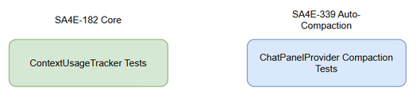
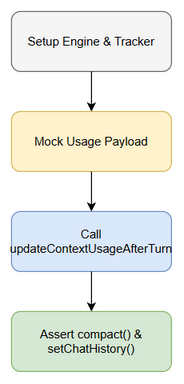

# [SA4E-339] Software Test Plan (STP)
**Version:** 1.2  
**Status:** Draft (Under Review)  
**Author:** qa-agent  
**Ticket:** SA4E-339  

---

## 1. Test Strategy & Scope
**Objective**: Validate automatic session compaction in `ChatPanelProvider` when context window usage reaches the compaction threshold (`COMPACT_USAGE_THRESHOLD = 0.95`). Because `ContextUsageTracker` rounds the percentage (`Math.round`), the **effective trigger boundary is 94.5% of true token usage** — see STC §1.2.

### 1.1 Test Levels
1. **Unit Testing**: Focus on isolated logic of `updateContextUsageAfterTurn` and its boundary conditions (usage 94.5% vs 95%). Tool: Vitest.
2. **Integration Testing**: Validate `ChatPanelProvider` integration with `SessionCompactor` and `ContextUsageTracker`. Verify webview payload structure `tab:contextUpdate`. Tool: Vitest.
3. **System Testing**: End-to-end execution of chat message ingestion causing overflow and observing UI updates and engine history updates. Tool: Vitest.
4. **Regression Testing**: Ensure existing tests in `extension/src/__tests__/chat` still pass, covering SA4E-182 logic (steering + MCP tools). Tool: Vitest.
5. **Security Testing**: Verify role elevation prevention (SEC-330-01) and percentage normalization (SEC-330-02).
6. **Performance Testing**: Verify compaction latency remains under $300\text{ms}$.

## 2. Test Environment
- **Framework**: Vitest
- **Target Path**: `extension/src/chat-panel/__tests__/`
- **New Test File**: `extension/src/chat-panel/__tests__/chat-panel-provider.compaction.test.ts`
- **Test Data**: CSV test data located in `testdata/compaction-data.csv` mapping various usage levels to expected behavior.

## 3. Entry and Exit Criteria
- **Entry Criteria**: 
  - Code changes for SA4E-339 are completed and build successfully.
  - TDD and FSD are finalized and aligned with the codebase.
- **Exit Criteria**: 
  - 0 test failures (`npm test` passes completely).
  - All STCs map 1-1 to implemented tests.
  - Test diagrams are valid and generated.

## 4. Requirement Traceability Matrix (RTM)

| Requirement ID | Requirement Type | Covered by STC | Target Test Level |
|---|---|---|---|
| AC-01 | Functional | STC-339-04, STC-339-12, STC-339-15 | Unit / Integration |
| AC-02 | Functional | STC-339-01, 02, 05, 06, 07, 08, 14 | Unit / Integration |
| AC-03 | Functional | STC-339-06, 08, 13 | Integration |
| AC-04 | Functional | STC-339-03, 14 | Integration |
| AC-05 | Regression | STC-339-11 | Regression |
| BR-01 | Business Rule | STC-339-01, 02, 05, 06, 14 | Unit / Integration |
| BR-02 | Business Rule | STC-339-02, 06 | Integration |
| BR-03 | Business Rule | STC-339-02 | Integration |
| BR-04 | Security | STC-339-09 | Security |
| BR-05 | Security | STC-339-10 | Security / Unit |
| BR-06 | Non-Functional | STC-339-04, STC-339-15 | Integration |
| BR-07 | Performance | STC-339-12 | Performance |
| UC-01…UC-08 | Use Case | STC-339-01…08, 13, 14, 15 (see STC §3.3) | Unit / Integration |
| SEC-330-01 | Security | STC-339-09 | Security |
| SEC-330-02 | Security | STC-339-10 | Security / Unit |

> Full AC/BR/UC/SEC → STC mapping lives in **STC.md §3 (RTM)** — 5/5 AC, 7/7 BR, 8/8 UC, 2/2 SEC = 100%.

## 5. Test Diagrams

Both test diagrams are draw.io-native (`drawio`-only, XML validated: balanced `<mxGraphModel>` tags, every edge carries a `<mxGeometry>` child, 0 Mermaid) and have been exported to PNG.

### 5.1 Diagram Index
| Figure | Name | Image (PNG) | Source (draw.io) | Description |
|---|---|---|---|---|
| Figure 1 | Test Coverage Diagram | `diagrams/test-coverage.png` | `diagrams/test-coverage.drawio` | Outlines the test coverage boundaries (SA4E-182 tracker tests vs SA4E-339 compaction tests). |
| Figure 2 | Test Execution Flow Diagram | `diagrams/test-execution-flow.png` | `diagrams/test-execution-flow.drawio` | Sequence of test execution: setup → mock payload → call `updateContextUsageAfterTurn` → assert `compact()` / `setChatHistory()`. |

**Reference check (round 4):** all 4 references above resolve to existing files — 2 × `.png` (exported 2026-10-07) + 2 × `.drawio` (XML validated).

### 5.2 Figure 1 — Test Coverage Diagram

*Figure 1: Test Coverage — SA4E-182 (`context-usage-tracker`) vs SA4E-339 (ChatPanelProvider compaction) suites.*

### 5.3 Figure 2 — Test Execution Flow Diagram

*Figure 2: Test Execution Flow — Setup Engine & Tracker → Mock Usage Payload → Call `updateContextUsageAfterTurn` → Assert `compact()` & `setChatHistory()`.*
