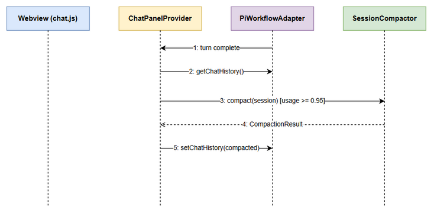
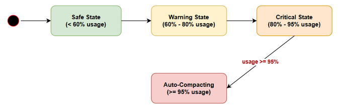
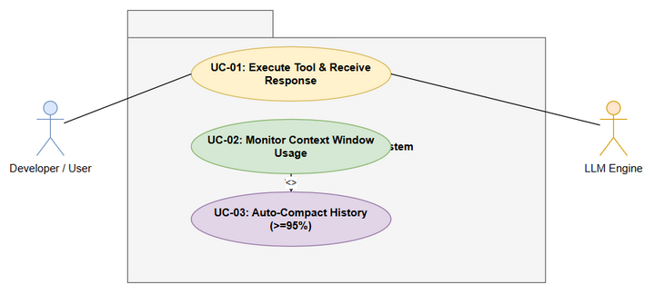

# [SA4E-339] User Guide (UG)
**Version:** 1.0
**Status:** Draft — pending SM review
**Author:** ba-agent
**Ticket:** SA4E-339 — Fix Automatic Session Compaction Hook in ChatPanelProvider

---

## 1. Tóm tắt tính năng (Feature Summary)

Trước đây, khi cuộc trò chuyện trong chat panel của extension tiêu thụ hết context window (≥95–100%), người dùng thấy banner đỏ `Context window is full. Start new tab` và **bắt buộc phải mở tab mới** — mất toàn bộ ngữ cảnh hội thoại.

**Từ SA4E-339**, extension sẽ **tự động nén (auto-compaction)** session khi token usage chạm ngưỡng: thay vì overflow, hội thoại được tóm tắt lại thành 1 message summary + 2 message gần nhất, và context meter giảm về mức an toàn (<70%) — **không cần mở tab mới, không gián đoạn**.

| Trước | Sau |
|---|---|
| Banner đỏ "Context window is full" | Tự động nén, chat tiếp tục |
| Mất ngữ cảnh, phải mở tab mới | Giữ nguyên ý chính qua summary |
| Context meter kẹt ở 100% | Meter giảm về <70% sau nén |

---

## 2. Cách hoạt động (How It Works)

Sau **mỗi lượt LLM turn** (trả lời hoặc tool execution), `ChatPanelProvider.updateContextUsageAfterTurn()` sẽ:

1. Đếm lại token usage (conversation + MCP tools + steering).
2. Chuẩn hóa usage về fraction `[0, 1]` — kiểm soát bảo mật SEC-330-02.
3. Kiểm tra ngưỡng qua `SessionMonitor.shouldCompact()` — **nguồn duy nhất** của hằng `COMPACT_USAGE_THRESHOLD = 0.95`.
4. Nếu `usageFraction >= 0.95` **và** có >2 messages → chạy `SessionCompactor.compact()`.
5. Kết quả nén: `[summary (role 'user', prefix [compaction]), ...2 messages gần nhất]` → ghi lại vào engine history.
6. Đếm lại token và gửi `tab:contextUpdate` tới webview → context meter cập nhật.

### Luồng xử lý


*Hình 1: Trình tự thực thi auto-compaction khi kết thúc một lượt turn.*

### State machine của context window


*Hình 2: Context window chuyển giữa các vùng Safe → Warning (≥85%) → Critical (≥95%) → Auto-Compacting.*

---

## 3. Cấu hình & Ngưỡng (Configuration & Thresholds)

| Tham số | Giá trị | Ý nghĩa |
|---|---|---|
| `COMPACT_USAGE_THRESHOLD` | `0.95` | Ngưỡng kích hoạt nén tự động (`session-compactor.ts:11`) |
| `WARN_USAGE_THRESHOLD` | `0.85` | Ngưỡng cảnh báo (vùng vàng) — chưa nén |
| `COMPACT_TARGET_USAGE` | `0.70` | Mục tiêu usage sau khi nén thành công |
| `RECENT_MESSAGES_KEPT` | `2` | Số message gần nhất được giữ lại sau summary |
| `COMPACTION_TIME_BUDGET_MS` | `300` | Ngân sách latency tối đa cho một lần nén |
| Intent cap / Response cap | 150 / 250 chars | Giới hạn độ dài summary |

### ⚠️ Boundary 94.5% — hành vi thật cần biết

`ContextUsageTracker` tính `percentage = Math.round((tokens / maxTokens) * 100)` (số nguyên percent) **trước khi** normalize. Vì vậy:

| Usage thật | Sau `Math.round` | Fraction | Kết quả |
|---|---|---|---|
| 94.4% | 94 | 0.94 | ⚪ Chỉ cảnh báo — **chưa nén** |
| **94.5%** | **95** | **0.95** | 🔵 **NÉN** (round-up) |
| 95.0% | 95 | 0.95 | 🔵 NÉN |
| 100% | 100 | 1.00 | 🔵 NÉN |

→ **Ngưỡng kích hoạt hiệu quả là 94.5%** usage thật (không phải 95.000%).

### Điều kiện phụ để nén

- History phải có **>2 messages** — nếu chỉ còn ≤2 messages thì không có gì an toàn để cắt, nén bị bỏ qua.

---

## 4. Hướng dẫn verify (Verification Guide)

### 4.1 Kiểm tra compaction tự động chạy

1. Mở chat panel, trò chuyện đến khi context meter vượt ~94.5%.
2. Quan sát: sau lượt trả lời cuối, **không** thấy banner đỏ "Context window is full".
3. Context meter **giảm** về mức thấp hơn (mục tiêu <70%).
4. Hội thoại hiển thị 1 message tóm tắt (prefix `[compaction]`) + 2 message gần nhất.

### 4.2 Kiểm tra bằng log (developer)

Bật debug log, tìm các dòng:
```
[ChatPanel] Triggering auto-compaction: usageFraction=..., messages=...
[ChatPanel] Auto-compaction complete: tokensSaved=..., newTotal=...
```

### 4.3 Chạy test suite

```powershell
cd extension
npx vitest run src/chat-panel/__tests__/chat-panel-provider.compaction.test.ts   # 11/11 PASSED
npx vitest run src/__tests__/chat                                                 # 178/178 PASSED
npx tsc --noEmit                                                                  # 0 errors
```

Kết quả chi tiết: xem `TEST-REPORT.md` (full suite 249 files / 2395 tests / 0 fail).

### Use Case tổng quan


*Hình 3: Use Case Diagram — Context Window Monitoring & Auto-Compaction.*

---

## 5. Troubleshooting / FAQ

### ❓ Compaction không trigger dù usage ≥ 95%?

Kiểm tra theo thứ tự:
1. **History ≤2 messages** → nén bị bỏ qua (đúng thiết kế, không có gì để cắt).
2. Meter hiển thị nhưng engine chưa sync `maxTokens` thật → usage fraction tính lệch; sau lượt `ensureGraph()` đầu tiên window sẽ được detect.
3. Xem debug log có dòng `Triggering auto-compaction` không — nếu có nhưng history không đổi, xem tiếp `Auto-compaction complete`.

### ❓ Context meter không cập nhật sau nén?

- Message `tab:contextUpdate` được gửi **mọi lượt turn** (kể cả khi không nén). Nếu meter kẹt: lỗi broadcast được log non-fatal, lượt turn sau sẽ gửi lại.

### ❓ Lỗi im lặng (silent errors)?

Mọi lỗi trong luồng compaction là **non-fatal** (NFR-02): được log qua `debugLog` và chat tiếp tục hoạt động — không crash, không toast lỗi. Đây là hành vi chủ đích.

### ❓ Tóm tắt bị cắt cụt / chất lượng thấp?

- Summary giới hạn: intent ≤150 chars, lastResponse ≤250 chars.
- Nếu summarizer lỗi → fallback **truncate**: giữ 2 messages cuối, `truncated = true`, `qualityScore = 0` — chat vẫn chạy.

### ❓ Tại sao nén kích hoạt ở 94.5% thay vì 95%?

Vì percent được làm tròn (`Math.round`) **trước** khi normalize — 94.5% round lên 95 → chạm ngưỡng. Xem §3 boundary table.

---

## 6. Known Limitations

1. **Ngưỡng hardcode**: `COMPACT_USAGE_THRESHOLD = 0.95` là hằng số trong code, chưa cấu hình được qua settings.
2. **Engine null guard**: nếu engine chưa khởi tạo khi turn kết thúc, lượt kiểm tra đó bị bỏ qua (return sớm) — an toàn nhưng không nén.
3. **Tóm tắt không persist**: summary không được lưu giữa các tab/session — mỗi tab tự nén độc lập.
4. **modelId cố định `"default"`**: hiện wiring truyền `"default"` (quyết định D-1a); accessor model-id thật chưa có trong engine.
5. **No-op nếu action ≠ 'compact'**: result `'warn'`/`'none'` → history giữ nguyên, chỉ meter được refresh.

---

## 7. Tham khảo (References)

| Tài liệu | Vị trí |
|---|---|
| BRD (yêu cầu nghiệp vụ) | `documents/SA4E-339/BRD.md` |
| FSD (spec chức năng) | `documents/SA4E-339/FSD.md` |
| TDD (thiết kế kỹ thuật) | `documents/SA4E-339/TDD.md` |
| STP/STC (kế hoạch & case test) | `documents/SA4E-339/STP.md`, `STC.md` |
| TEST-REPORT (kết quả test) | `documents/SA4E-339/TEST-REPORT.md` |
| Code — compactor | `extension/src/pi-agent/session-compactor.ts` |
| Code — wiring | `extension/src/chat-panel/chat-panel-provider.ts` (`updateContextUsageAfterTurn`) |

---

*End of User Guide — SA4E-339 v1.0*
