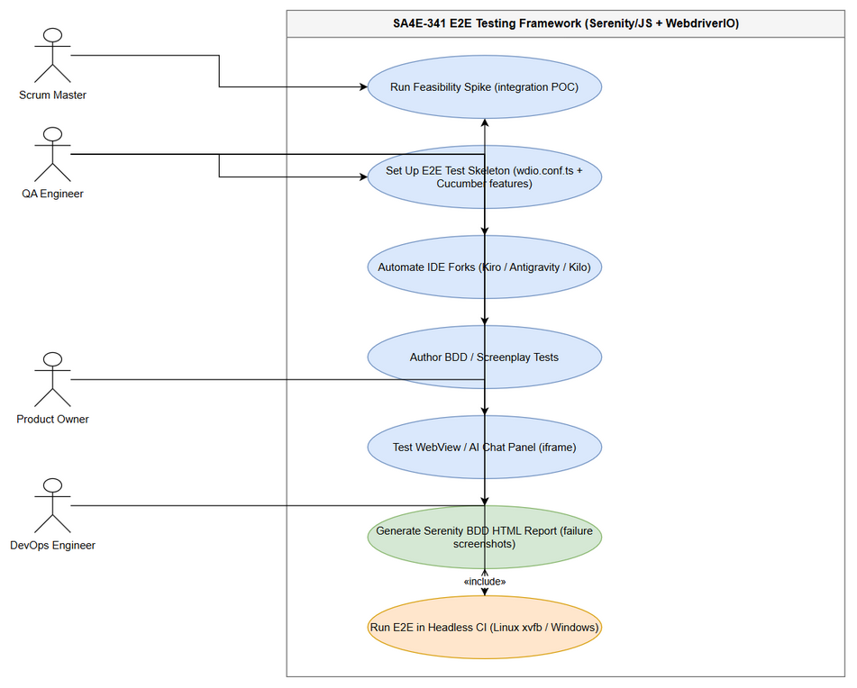
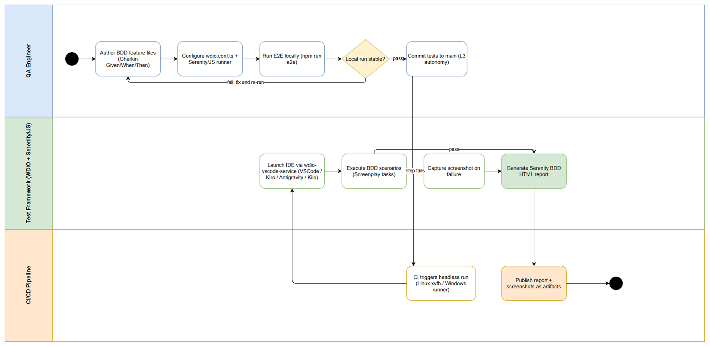

# Business Requirements Document (BRD)

## SDLC-Agents-4-Enterprise E2E Testing Framework — SA4E-341: [E2E Testing] Serenity/JS + wdio-vscode-service for VSCode-based IDEs (Kiro/Antigravity/Kilo)

---

## Document Information

| Field | Value |
|-------|-------|
| Jira Ticket | SA4E-341 |
| Title | [E2E Testing] Serenity/JS + wdio-vscode-service for VSCode-based IDEs (Kiro/Antigravity/Kilo) |
| Type | Epic |
| Priority | Medium |
| Labels | e2e-testing, serenity-js, vscode, wdio |
| Author | BA Agent |
| Version | 1.0 |
| Date | 2026-10-09 |
| Status | Draft |

---

## Author Tracking

| Role | Name - Position | Responsibility |
|------|-----------------|----------------|
| Author | BA Agent – Business Analyst (SDLC pipeline) | Create document |
| Peer Reviewer | SM Agent – Scrum Master (SDLC pipeline) | Review document |

---

## Revision History

| Version | Date | Author | Changes |
|---------|------|--------|---------|
| 1.0 | 2026-10-09 | BA Agent | Initiate document — auto-generated from Jira ticket SA4E-341 and predecessor spike ticket SA4E-340 |

---

## Sign-Off

| Name | Signature and date |
|------|--------------------|
| | ☐ I agree and confirm all criteria on this BRD as expected requirements |
| | ☐ I agree and confirm all criteria on this BRD as expected requirements |

---

## 1. Introduction

### 1.1 Scope

SA4E-341 establishes a Behavior-Driven Development (BDD) end-to-end (E2E) testing framework for VSCode and IDEs forked from VSCode (Kiro, Antigravity IDE, Kilo, etc.). The technology stack mandated by the ticket is **WebdriverIO + wdio-vscode-service + Serenity/JS (Cucumber + Screenplay Pattern)** (source: SA4E-341).

**Business Objectives (SMART):**

1. By the end of the epic, the BDD E2E framework runs against VSCode and at least one VSCode-based IDE fork (Kiro, Antigravity IDE, or Kilo) and can be started with a single npm command.
2. Within 1 working day of spike start, a feasibility spike documents go/no-go findings for all 4 risk areas defined in SA4E-341: (a) IDE fork WebDriver/CDP attach, (b) chromedriver ↔ Electron version mapping, (c) webview/iframe handling by WebdriverIO, (d) headless CI (Linux xvfb / Windows runner).
3. At least 5 BDD Gherkin scenarios, implemented with the Screenplay Pattern, cover core IDE/extension user journeys before epic completion.
4. 100% of failed test steps have automatic screenshots attached in the Serenity BDD HTML report, and every test run produces the report.
5. By epic completion, the E2E suite executes headless in CI (Linux xvfb) and completes within a 15-minute budget, publishing the Serenity report as a pipeline artifact.

**In Scope** (the 7 stories listed in SA4E-341 "Phạm vi"):

1. Integration spike — Serenity/JS + wdio-vscode-service (Story 1)
2. Test skeleton setup (Story 2)
3. IDE fork spike (Story 3)
4. BDD/Screenplay test authoring (Story 4)
5. WebView tests (Story 5)
6. Serenity HTML report + automatic failure screenshots (Story 6)
7. Headless CI execution (Story 7)

### 1.2 Out of Scope

SA4E-341 does not explicitly list exclusions. Based on ticket context (current test setup and pipeline boundaries), the following are treated as out of scope — **to be confirmed with stakeholders**:

- Migrating existing extension tests (`@vscode/test-electron`) or backend Node tests into the new Serenity/JS framework (existing tests must keep passing unchanged).
- Performance / load testing of the extension or backend.
- Functional changes to production code in `extension/` or `backend/` (this epic delivers testing capability only).
- Automation of non-VSCode-based IDEs (e.g., JetBrains family).
- Integration with defect-tracking or test-management tools beyond publishing CI artifacts.

### 1.3 Preliminary Requirement

Prerequisites that must be in place before implementation (source: SA4E-341 pipeline context and SA4E-340):

- Node.js + npm environment available on development machines and CI runners.
- Repository `SDLC-Agents-4-Enterprise` containing `extension/` (TypeScript VSCode extension) and `backend/` (TypeScript MCP server); current test setup (`@vscode/test-electron` for extension tests, Node for backend tests) must remain functional.
- Installed IDE binaries for VSCode and target forks (Kiro, Antigravity IDE, Kilo) for spike execution.
- CI runners: Linux (with xvfb for virtual display) and/or Windows runner.
- Access to reference documentation: Serenity/JS handbook, wdio-vscode-service repository, VSCode extension testing API, wdio-electron-service docs (see Appendix — Reference Documents).
- SA4E-340 spike findings (Serenity/JS evaluation) as baseline input: Serenity/JS (TypeScript) is highly compatible with the VSCode ecosystem; there is no single "Serenity/JS extension" — the Cucumber route requires `Cucumber for VSCode` and `CucumberJS Test Runner` extensions; tests can be run/debugged via VSCode UI or terminal.

---
## 2. Business Requirements

### 2.1 High Level Process Map

The end-to-end business process for SA4E-341 spans three swimlanes — the **QA Engineer** (authors and maintains BDD scenarios), the **Test Framework** (WebdriverIO + wdio-vscode-service + Serenity/JS, which launches the IDE, executes scenarios, captures failure screenshots, and generates the Serenity BDD HTML report), and the **CI/CD Pipeline** (triggers headless runs and publishes report artifacts).

High-level process:

1. QA Engineer authors BDD feature files and configures the framework.
2. The framework launches the target IDE (VSCode or a fork) via wdio-vscode-service and executes scenarios with Screenplay tasks.
3. On failure, Serenity/JS captures screenshots automatically; after each run it generates the Serenity BDD HTML report.
4. Stable tests are committed to `main` (Autonomy Level 3); CI runs the suite headless on every push and publishes the report as an artifact.

*[Edit in draw.io](diagrams/use-case.drawio)*

*[Edit in draw.io](diagrams/business-flow.drawio)*

### 2.2 List of User Stories / Use Cases

| # | Story / Use Case / Epic | Priority | Source Ticket |
|---|-------------------------|----------|---------------|
| 1 | US-01: As a QA Engineer, I want a feasibility spike validating the Serenity/JS + WebdriverIO + wdio-vscode-service integration, so that the team commits to the stack with evidence instead of assumptions. | MUST HAVE | SA4E-341 |
| 2 | US-02: As a QA Engineer, I want a committed E2E test skeleton (wdio.conf.ts, Cucumber features, Serenity/JS configuration), so that tests can be authored and executed with a single npm command. | MUST HAVE | SA4E-341 |
| 3 | US-03: As a QA Engineer, I want a spike proving whether VSCode-based IDE forks (Kiro/Antigravity/Kilo) allow WebDriver/CDP attach, so that the automation scope per IDE is known early. | MUST HAVE | SA4E-341 |
| 4 | US-04: As a QA Engineer, I want BDD Gherkin scenarios implemented with the Screenplay Pattern, so that E2E tests are readable, reusable, and maintainable. | MUST HAVE | SA4E-341 |
| 5 | US-05: As a QA Engineer, I want verified WebdriverIO interaction with webview/iframe panels (e.g., AI chat panel), so that coverage limits inside IDE webviews are known and documented. | SHOULD HAVE | SA4E-341 |
| 6 | US-06: As a Product Owner, I want Serenity BDD HTML reports with automatic screenshots on failure, so that E2E failures are diagnosed quickly without manual reproduction. | MUST HAVE | SA4E-341 |
| 7 | US-07: As a DevOps Engineer, I want headless CI execution (Linux xvfb / Windows runner), so that E2E tests run automatically on every pipeline run. | SHOULD HAVE | SA4E-341 |

> **Note:** SA4E-341 defines the epic scope as 7 stories without individually numbered acceptance criteria; the acceptance criteria in Section 2.3 are derived by the BA Agent from the epic's story list, risk list ("Rủi ro cần Spike"), and context (SA4E-340). Priorities are BA-assigned based on the spike-first sequencing described in the ticket.
### 2.3 Details of User Stories

---

#### Business Flow

**Step 1:** QA Engineer authors BDD feature files (Gherkin Given/When/Then) describing expected IDE/extension behavior.

**Step 2:** QA Engineer configures `wdio.conf.ts` with `wdio-vscode-service` (IDE control: Workbench, EditorView, webviews) and the `@serenity-js/webdriverio` framework runner (source: SA4E-341 "Bối cảnh").

**Step 3:** QA Engineer runs the E2E suite locally with a single npm command — wdio-vscode-service launches the IDE (VSCode or fork).

**Step 4:** WebdriverIO executes scenarios via Serenity/JS Screenplay tasks, interacting with the Workbench, EditorView, and webview/iframe panels.

**Step 5:** On any failed step, Serenity/JS captures a screenshot automatically.

**Step 6:** After the run, Serenity/JS generates the Serenity BDD HTML report.

**Step 7:** QA Engineer commits stable tests to `main` (Autonomy Level 3 — unattended, no feature branch; per SA4E-341 pipeline context).

**Step 8:** CI pipeline triggers a headless run (Linux xvfb / Windows runner) on push.

**Step 9:** CI publishes the Serenity HTML report and screenshots as pipeline artifacts; the team reviews results.

> **Note:** IDE fork attach capability, chromedriver ↔ Electron version mapping, and webview support are **unknowns** that must be resolved by the spikes (US-01, US-03, US-05) **before** full-scale test authoring (US-04). If a spike yields a no-go for an area, the corresponding scope is reduced and the fallback documented.

---

#### STORY 1: Feasibility Spike — Serenity/JS + wdio-vscode-service Integration

> As a QA Engineer, I want a feasibility spike validating the Serenity/JS + WebdriverIO + wdio-vscode-service integration, so that the team commits to the stack with evidence instead of assumptions.

**Requirement Details:**

1. Execute a minimal Proof-of-Concept scenario on top of WebdriverIO with `wdio-vscode-service` (controls VSCode and exposes Workbench, EditorView, etc.) and `@serenity-js/webdriverio` as framework runner/reporting layer (source: SA4E-341 "Bối cảnh").
2. Validate the 4 risk areas from SA4E-341 "Rủi ro cần Spike": (a) IDE fork allows WebDriver/CDP attach; (b) chromedriver ↔ Electron version mapping; (c) how far WebdriverIO handles webview/iframe (AI chat panel); (d) CI headless (Linux xvfb / Windows runner).
3. Incorporate SA4E-340 findings: no dedicated Serenity/JS extension exists — the Cucumber route requires `Cucumber for VSCode` + `CucumberJS Test Runner` extensions; run/debug via VSCode UI or terminal.

**Data Fields (spike findings register):**

| Field | Type | Required | Description | Example |
|-------|------|----------|-------------|---------|
| risk_area | String | Yes | One of the 4 spike risk areas | chromedriver-electron-mapping |
| ide | String | Yes | IDE under test | Kiro |
| result | Enum | Yes | go / no-go / blocked | go |
| chromedriver_version | String | No | chromedriver version matched to the IDE's Electron | 121.0.6167.85 |
| evidence_path | String | Yes | Path to committed spike artifacts | documents/SA4E-341/spikes/ |
| notes | String | No | Observations, workarounds, references | CDP attach works with --remote-debugging-port |

**Acceptance Criteria:**

1. A runnable POC scenario executes against VSCode (Kiro) via wdio-vscode-service within 1 working day of spike start (SMART objective 2).
2. The spike report documents a go/no-go result for all 4 risk areas, each with evidence.
3. Spike artifacts (config, scenario, findings register) are committed to the repository.
4. The stack decision is recorded and signed off by SA and QA agents (per SA4E-340 "Hành động tiếp theo").

**UI Specifications:** N/A — spike activity; no production UI is modified.

**Validation Rules:**

- Every go/no-go must reference committed evidence (no verbal-only conclusions).

**Error Handling:**

- IDE fork does not allow WebDriver/CDP attach: spike records result = "blocked" and recommends a fallback (wdio-electron-service or manual test scripts) — source: SA4E-341 risk 1.

---

#### STORY 2: E2E Test Skeleton Setup

> As a QA Engineer, I want a committed E2E test skeleton (wdio.conf.ts, Cucumber features, Serenity/JS configuration), so that tests can be authored and executed with a single npm command.

**Requirement Details:**

1. Create the test skeleton: `wdio.conf.ts` wired to `wdio-vscode-service` + `@serenity-js/webdriverio` + `@serenity-js/cucumber`; `features/` directory with at least one sample `.feature` file and step definitions; Serenity/JS cast/crew configuration.
2. Add npm scripts so the entire E2E flow (launch IDE → run scenario → produce report) runs with one command (e.g., `npm run e2e`).
3. Add devDependencies: WebdriverIO, wdio-vscode-service, Serenity/JS packages (core, webdriverio, cucumber), Cucumber, chromedriver.
4. The skeleton must not break the existing test setup: extension tests (`@vscode/test-electron`) and backend Node tests keep passing (source: SA4E-341 pipeline context).

**Data Fields (configuration artifacts):**

| Field | Type | Required | Description | Example |
|-------|------|----------|-------------|---------|
| IDE_TYPE | String (env var) | Yes | Target IDE type for wdio-vscode-service | kiro / code / antigravity |
| IDE_BINARY_PATH | String (env var) | Yes | Path to the IDE executable | C:\Users\...\Kiro.exe |
| E2E_BASE_URL | String (env var) | No | Workspace/folder opened by the IDE under test | C:\projects\demo |
| wdio.conf.ts | File | Yes | WDIO configuration | repo/e2e/wdio.conf.ts |
| features/*.feature | File | Yes | Gherkin scenarios | repo/e2e/features/sample.feature |

**Acceptance Criteria:**

1. `npm run e2e` executes the skeleton suite end-to-end (launch IDE → run ≥1 scenario → produce report) and exits 0 on a stable run.
2. The skeleton is committed to `main` and its directory layout is documented in the repository README.
3. Existing extension tests (`@vscode/test-electron`) and backend Node tests remain unaffected and pass.
4. Configuration is parameterized via environment variables (IDE_TYPE, IDE_BINARY_PATH) — no hardcoded machine-specific paths committed.

**UI Specifications:** N/A — test infrastructure.

**Validation Rules:**

- The configuration must validate that `IDE_BINARY_PATH` exists before starting a run and fail fast with a clear message if missing.

**Error Handling:**

- Missing IDE binary: fail fast with an error naming the expected environment variable and setup instructions.
- Missing/incompatible chromedriver: rely on wdio-vscode-service auto-detection; otherwise raise an explicit version-mapping error referencing the mapping table (Story 3).
---

#### STORY 3: IDE Fork Spike (Kiro / Antigravity / Kilo)

> As a QA Engineer, I want a spike proving whether VSCode-based IDE forks (Kiro/Antigravity/Kilo) allow WebDriver/CDP attach, so that the automation scope per IDE is known early.

**Requirement Details:**

1. For each target IDE fork (Kiro, Antigravity IDE, Kilo), verify whether the fork allows WebDriver/CDP attach (source: SA4E-341 risk 1).
2. For each IDE, document the chromedriver ↔ Electron version mapping (source: SA4E-341 risk 2).
3. Record IDE binary paths and versions so the CI configuration (Story 7) can be parameterized.
4. For each IDE where attach succeeds, execute at least one smoke scenario proving end-to-end control (launch → interact → assert).

**Data Fields (per-IDE compatibility matrix):**

| Field | Type | Required | Description | Example |
|-------|------|----------|-------------|---------|
| ide | String | Yes | IDE name | Antigravity IDE |
| ide_version | String | Yes | Installed IDE version | 0.9.2 |
| cdp_attach | Enum | Yes | go / no-go / blocked | go |
| electron_version | String | Yes | Electron runtime of the IDE | 32.2.0 |
| chromedriver_version | String | Yes | Matching chromedriver | 128.0.6613.84 |
| smoke_scenario | String | Yes | Committed smoke test reference | features/smoke/launch.feature |
| notes | String | No | Blockers, workarounds, upstream issues | Requires --disable-gpu on Linux |

**Acceptance Criteria:**

1. The compatibility matrix is completed for Kiro, Antigravity IDE, and Kilo — or each is explicitly marked "not installable / not testable" with a reason.
2. Every IDE marked "go" has ≥1 executed smoke scenario committed to the repository proving WebDriver/CDP attach.
3. The chromedriver ↔ Electron version mapping table is committed and referenced from the framework configuration documentation (Story 2).
4. IDEs that cannot be automated are explicitly listed as out of automation scope in this BRD's revision or the FSD.

**UI Specifications:** N/A — spike activity.

**Validation Rules:**

- Each matrix row must be backed by an executed smoke test or a documented blocker (no assumptions).

**Error Handling:**

- Fork blocks CDP attach: mark result = "blocked", record the upstream limitation, and exclude that IDE from the automation matrix — source: SA4E-341 risk 1.

---

#### STORY 4: BDD / Screenplay Test Authoring

> As a QA Engineer, I want BDD Gherkin scenarios implemented with the Screenplay Pattern, so that E2E tests are readable, reusable, and maintainable.

**Requirement Details:**

1. Author Gherkin feature files (Given/When/Then) covering core IDE/extension user journeys — the BDD benefit listed in SA4E-341 "Lợi ích".
2. Implement all step logic with Serenity/JS Screenplay Pattern constructs: Actors, Tasks, Questions (the Screenplay benefit from SA4E-341 "Lợi ích").
3. Build reusable Screenplay tasks for common IDE interactions (open Workbench, open editor, execute an extension command, read output).
4. Wire `@serenity-js/cucumber` as the glue between Gherkin steps and Screenplay tasks (per SA4E-340, install `Cucumber for VSCode` + `CucumberJS Test Runner` extensions for the authoring experience).

**Data Fields (test artifacts and conventions):**

| Field | Type | Required | Description | Example |
|-------|------|----------|-------------|---------|
| feature_file | File | Yes | Gherkin scenario file | features/workbench/open-editor.feature |
| step_definition | File | Yes | Glue between Gherkin and Screenplay | features/step_definitions/*.ts |
| actor | Code construct | Yes | Named actor driving the browser/IDE | actorCalled("QA") |
| task | Code construct | Yes | Reusable composite interaction | OpenEditor.at("path/to/file.ts") |
| question | Code construct | Yes | Read state for assertions | Text.of(Editor.activeTab()) |

**Acceptance Criteria:**

1. At least 5 Gherkin scenarios cover core extension/IDE user journeys (SMART objective 3), all written in Given/When/Then.
2. 100% of step logic is implemented as Screenplay Tasks/Questions — no raw WebdriverIO commands inside step definitions.
3. The suite passes locally with a flaky failure rate below 5% over 10 consecutive runs.
4. Scenarios are reviewed by the SA agent against the FSD once it is available (traceability).

**UI Specifications:** N/A — tests exercise the IDE UI but define no new UI.

**Validation Rules:**

- Gherkin lint: declarative steps, one Given/When/Then block per scenario, no implementation detail in feature text.
- Screenplay naming convention: Tasks are verbs, Questions are noun phrases.

**Error Handling:**

- Flaky scenario: retry limit (2) configured in wdio.conf; persistent flakiness is logged and raised as a defect ticket instead of being masked by retries.

---

#### STORY 5: WebView / AI Chat Panel Testing

> As a QA Engineer, I want verified WebdriverIO interaction with webview/iframe panels (e.g., AI chat panel), so that coverage limits inside IDE webviews are known and documented.

**Requirement Details:**

1. Evaluate how far WebdriverIO handles webview/iframe content inside VSCode-based IDEs, including the AI chat panel (source: SA4E-341 risk 3).
2. Produce a webview inventory: for each panel of interest, the iframe/context-switching strategy and whether it is automatable.
3. Where technically feasible, author ≥1 automated scenario exercising a webview interaction.
4. Document the coverage boundary: panels that cannot be automated are listed for manual testing (per the no-workaround rule — limitations are reported, not masked).

**Data Fields (webview inventory):**

| Field | Type | Required | Description | Example |
|-------|------|----------|-------------|---------|
| panel | String | Yes | IDE panel/webview under evaluation | AI chat panel |
| strategy | String | Yes | How WebdriverIO reaches the content | switchFrame / webview context API |
| automatable | Enum | Yes | Yes / Partial / No | Partial |
| scenario_ref | String | No | Committed automated scenario | features/webview/chat-panel.feature |
| manual_checklist | String | No | Manual test steps for non-automatable panels | documents/SA4E-341/manual-webview-checks.md |

**Acceptance Criteria:**

1. The evaluation documents WebdriverIO's webview/iframe handling capability for each target IDE (Kiro/Antigravity/Kilo).
2. At least 1 automated scenario exercises a webview interaction where technically feasible.
3. The coverage boundary is documented — every panel marked "No" has a manual testing checklist instead.
4. Findings are fed back into the FSD risk section for the next pipeline phase.

**UI Specifications:** N/A — evaluation activity; panels tested are existing IDE UI.

**Validation Rules:**

- Each "automatable = Partial/Yes" claim must be backed by an executed scenario or documented strategy.

**Error Handling:**

- Webview context switch unsupported: record the limitation in the inventory and route the panel to manual testing — source: SA4E-341 risk 3.
---

#### STORY 6: Serenity BDD HTML Report + Failure Screenshots

> As a Product Owner, I want Serenity BDD HTML reports with automatic screenshots on failure, so that E2E failures are diagnosed quickly without manual reproduction.

**Requirement Details:**

1. Configure the Serenity/JS reporter to emit the **Serenity BDD HTML report** for every test run (the reporting benefit in SA4E-341 "Lợi ích").
2. Configure **automatic screenshot capture on every failed step** — screenshots embedded in the report without manual intervention (SA4E-341 "Lợi ích").
3. The report must open standalone in any browser (static HTML, no server required).
4. CI publishes the report and screenshots as pipeline artifacts (linked to Story 7).

**Data Fields (report artifacts):**

| Field | Type | Required | Description | Example |
|-------|------|----------|-------------|---------|
| report_index | File | Yes | Serenity BDD HTML report entry point | target/site/serenity/index.html |
| screenshots_dir | Directory | Yes | Captured failure screenshots | target/site/serenity/pages/ |
| results_json | File | Yes | Raw Serenity JSON results (fallback if HTML fails) | target/site/serenity/serenity-summary.json |
| screenshot_on | Behavior | Yes | When screenshots are taken | every failed step |

**Acceptance Criteria:**

1. Every test run (local or CI, pass or fail) produces a Serenity BDD HTML report at a documented path.
2. 100% of failed steps have an attached screenshot visible in the report (SMART objective 4).
3. Report generation completes in under 60 seconds for a suite of up to 50 scenarios.
4. The report opens standalone in a browser with no server needed; CI publishes it as a pipeline artifact.

**UI Specifications (report viewer):**

| No. | Name | Type | Required | Description | Note |
|-----|------|------|----------|-------------|------|
| 1 | Scenario results list | Table | Yes | Each scenario with pass/fail status | Standalone HTML |
| 2 | Failure screenshot | Image | Yes | Screenshot attached to failed steps | Auto-captured by Serenity/JS |
| 3 | Step timeline | Table | No | Step-by-step execution detail | Serenity BDD standard output |

**Validation Rules:**

- Screenshot files must be referenced from the report HTML and committed/published alongside it.

**Error Handling:**

- Screenshot capture fails: the test still fails with the original error; the capture failure is logged in the report — the original failure is never masked.
- HTML report generation fails: raw Serenity JSON results are retained and published as fallback evidence.

---

#### STORY 7: Headless CI Execution

> As a DevOps Engineer, I want headless CI execution (Linux xvfb / Windows runner), so that E2E tests run automatically on every pipeline run.

**Requirement Details:**

1. Add a CI job that runs the E2E suite headless: Linux runner with xvfb virtual display; Windows runner validated or explicitly deferred with a documented reason (source: SA4E-341 risk 4).
2. The job runs on push (Autonomy Level 3 — work happens on `main`; per SA4E-341 pipeline context).
3. Serenity HTML report + screenshots are published as artifacts on every run (pass or fail).
4. IDE binary and type are provided via CI environment variables (from Story 2/3 data fields).

**Data Fields (CI variables):**

| Field | Type | Required | Description | Example |
|-------|------|----------|-------------|---------|
| IDE_TYPE | String (env var) | Yes | Target IDE for the CI run | kiro |
| IDE_BINARY_PATH | String (env var) | Yes | IDE executable path on the runner | /usr/bin/kiro |
| DISPLAY | String (env var) | Yes (Linux) | xvfb virtual display | :99 |
| E2E_HEADLESS | String (env var) | Yes | Headless execution flag | true |

**Acceptance Criteria:**

1. The E2E job executes headless on a Linux CI runner using xvfb and the job exit code reflects the suite result.
2. The Windows runner path is validated, OR explicitly deferred with a documented reason (risk 4 requires a spike).
3. Serenity report + screenshots are published as artifacts on every run (pass or fail).
4. The E2E stage completes within a 15-minute budget for a suite of up to 50 scenarios (SMART objective 5).
5. No secrets appear in logs; any credentials are provided via environment variables only.

**UI Specifications:** N/A — CI infrastructure.

**Validation Rules:**

- The job must fail fast with an installation hint if xvfb is missing on a Linux runner.
- IDE launch timeout in CI must dump IDE/WDIO logs as artifacts for diagnosis.

**Error Handling:**

- xvfb missing: job fails fast with an explicit installation hint.
- IDE launch timeout in CI: logs and partial report published; job marked failed — no silent retries beyond the configured retry limit (2).
---

## 3. Dependencies

| Dependency | Type | Related Ticket | Description |
|------------|------|----------------|-------------|
| WebdriverIO + wdio-vscode-service + Serenity/JS npm packages | External | SA4E-341 | Core stack mandated by the ticket; versions must be pinned after the chromedriver ↔ Electron mapping spike |
| chromedriver ↔ Electron version mapping | System | SA4E-341 | Each IDE fork's Electron runtime must match a compatible chromedriver (risk 2) |
| SA4E-340 spike findings | Internal | SA4E-340 | Serenity/JS evaluation results (compatibility, extension setup) are the baseline input for this epic |
| Existing test setup (`@vscode/test-electron`, Node) | System | SA4E-341 | Must remain functional; the new E2E framework is additive |
| CI runners (Linux xvfb / Windows) | Infrastructure | SA4E-341 | Required for headless execution (Story 7) |
| IDE binaries (VSCode, Kiro, Antigravity IDE, Kilo) | Infrastructure | SA4E-341 | Required for local spikes and CI runs |
| Serenity/JS handbook + wdio-vscode-service docs | External | SA4E-341 | Reference material listed in the ticket |

---

## 4. Stakeholders

| Role | Name / Team | Responsibility | Source |
|------|-------------|----------------|--------|
| Scrum Master (SM-Agent) | SDLC pipeline team | Pipeline coordination, ticket transitions, quality gates | SA4E-341 pipeline context |
| QA Engineer / QA-Agent | SDLC pipeline team | Spike execution, E2E test authoring, framework ownership | SA4E-341 scope; SA4E-340 next actions |
| SA Agent (Solution Architect) | SDLC pipeline team | Architecture review, CI/CD integration of the framework | SA4E-340 "Hành động tiếp theo" |
| Dev Agent (Developer) | SDLC pipeline team | POC implementation support once SA/QA approve | SA4E-340 "Hành động tiếp theo" |
| DevOps Agent | SDLC pipeline team | Headless CI job setup and artifact publishing (Story 7) | SA4E-341 story 7 |
| Product Owner | SDLC project | Accepts report quality and framework outcomes | Inferred from report-quality acceptance criteria (US-06) |

> **Note:** No named individual assignees/reporters/watchers are present in the SA4E-341 ticket data; stakeholders are listed by role as recorded in SA4E-341 and SA4E-340.

---

## 5. Risks and Assumptions

### 5.1 Risks

| Risk | Impact | Likelihood | Mitigation |
|------|--------|------------|------------|
| IDE forks (Kiro/Antigravity/Kilo) may not allow WebDriver/CDP attach (SA4E-341 risk 1) | High | Medium | Run the IDE fork spike (Story 3) first; fallback to wdio-electron-service or manual test scripts for non-attachable IDEs |
| chromedriver ↔ Electron version mismatch breaks automation (SA4E-341 risk 2) | High | Medium | Pin package versions; use wdio-vscode-service auto-detection; commit and maintain the version mapping table |
| WebdriverIO cannot fully handle webview/iframe content such as the AI chat panel (SA4E-341 risk 3) | Medium | Medium | WebView spike (Story 5); document the coverage boundary; route non-automatable panels to manual testing |
| CI headless environment differences (Linux xvfb / Windows runner) cause instability (SA4E-341 risk 4) | Medium | Medium | CI spike (Story 7); fail-fast validation; publish logs as artifacts for diagnosis |
| No dedicated Serenity/JS extension exists — authoring setup is indirect (SA4E-340 finding) | Low | High (confirmed) | Install `Cucumber for VSCode` + `CucumberJS Test Runner`; document setup in the repository README |
| E2E tests become flaky, eroding trust in the suite | Medium | Medium | Screenplay Pattern with explicit waits; retry limit (2); flaky rate tracked (<5% over 10 runs); defects raised instead of masking |

### 5.2 Assumptions

- IDE forks are based on VSCode, so wdio-vscode-service compatibility is expected to transfer (to be verified by Story 3).
- The team has Node.js + npm and access to install the required npm packages.
- Linux CI runners with xvfb (or the ability to install it) are available.
- SA4E-340's compatibility conclusion ("Serenity/JS tương thích cực tốt với hệ sinh thái VSCode") remains valid.
- Autonomy Level 3 applies: work proceeds on `main` without feature branches, and no automatic commits occur unless quality gates pass.
- Serenity/JS BDD HTML reports are static HTML and viewable without a server.

---
## 6. Non-Functional Requirements

| Category | Requirement | Details |
|----------|-------------|---------|
| Performance | E2E suite duration | ≤ 15 minutes on CI for a suite of up to 50 scenarios; single scenario ≤ 60 seconds (typical) |
| Performance | Report generation | Serenity BDD HTML report generated < 60 seconds for ≤ 50 scenarios |
| Reliability | Flaky failure rate | < 5% flaky failures across 10 consecutive local runs; retry limit 2 per scenario |
| Portability | OS support | Windows 10+ (development), Linux x64 with xvfb (CI); Windows runner validated or explicitly deferred |
| Maintainability | Test reuse | 100% of step logic as reusable Screenplay Tasks/Questions; Gherkin lint enforced; no raw WDIO commands in step definitions |
| Scalability | Suite growth | Framework supports ≥ 50 scenarios without configuration change (parameterized via env vars) |
| Security | Secrets handling | Credentials and machine-specific paths via environment variables only; no secrets committed or logged |
| Security | Test isolation | Tests must not modify repository or workspace state outside dedicated test fixtures |

---

## 7. Related Tickets

| Ticket Key | Summary | Status | Type | Relationship |
|------------|---------|--------|------|--------------|
| SA4E-341 | [E2E Testing] Serenity/JS + wdio-vscode-service cho VSCode-based IDEs (Kiro/Antigravity/Kilo) | In Progress | Epic | Main ticket |
| SA4E-340 | Evaluate Serenity/JS for E2E Testing in VSCode Environments | BACKLOG (DISCOVERY) | Spike/Task | Relates to — predecessor spike that evaluated Serenity/JS; its findings feed SA4E-341 |

---

## 8. Appendix

Additional notes extracted from the tickets:

- Serenity/JS runs on top of WebdriverIO/Playwright/Cucumber and adds Screenplay Pattern + reporting; `wdio-vscode-service` is a WebdriverIO service that controls VSCode and exposes Workbench, EditorView, etc.; `@serenity-js/webdriverio` is the framework runner/reporting layer on WDIO (source: SA4E-341 "Bối cảnh").
- Per SA4E-340: there is no single "Serenity/JS extension" — for the Cucumber route install `Cucumber for VSCode` and `CucumberJS Test Runner`; run/debug via VSCode UI or terminal; a Dev-Agent POC follows SA/QA sign-off.

### Glossary

| Term | Definition |
|------|------------|
| BDD | Behavior-Driven Development — specification by Gherkin scenarios (Given/When/Then) shared between business and engineering |
| Gherkin | Business-readable DSL used in `.feature` files for BDD scenarios |
| Serenity/JS | TypeScript test framework layered on WebdriverIO/Playwright/Cucumber providing Screenplay Pattern and rich HTML reporting |
| Screenplay Pattern | Test design pattern organizing automation as Actors, Tasks, Questions for readability and reuse |
| WebdriverIO (WDIO) | Browser/IDE automation runner used as the execution engine |
| wdio-vscode-service | WebdriverIO service that launches and controls VSCode/forks, exposing Workbench, EditorView, WebView page objects |
| CDP | Chrome DevTools Protocol — the debugging/automation protocol used to attach to Electron/Chromium apps |
| Electron | Runtime on which VSCode and its forks are built |
| WebView | Embedded web content panel inside the IDE (e.g., AI chat panel), typically rendered in an iframe |
| Workbench | The main VSCode UI shell (menus, side bars, panels) |
| EditorView | VSCode page object representing the editor area |
| xvfb | X virtual framebuffer — virtual display server enabling GUI apps to run headless on Linux |
| IDE Fork | An IDE derived from VSCode source (Kiro, Antigravity IDE, Kilo) |
| E2E | End-to-end testing — exercising the application through its real UI |
| Flaky Test | A test that intermittently fails without a product defect |

### Reference Documents

| Document | Link / Location |
|----------|-----------------|
| Serenity/JS Handbook | https://serenity-js.org/handbook/ |
| wdio-vscode-service (community) | https://github.com/webdriverio-community/wdio-vscode-service |
| VSCode — Testing Extensions API | https://code.visualstudio.com/api/working-with-extensions/testing-extension |
| wdio-electron-service | https://webdriver.io/docs/wdio-electron-service/ |
| SA4E-341 Jira ticket data | documents/SA4E-341/JIRA_TICKET.md |
| SA4E-340 spike ticket data | documents/SA4E-340/JIRA_TICKET.md |

### Diagram Index

| Diagram | Source (draw.io) | Rendered (PNG) | Description |
|---------|------------------|----------------|-------------|
| Use Case Diagram | diagrams/use-case.drawio | diagrams/use-case.png | Actors (QA Engineer, DevOps Engineer, Product Owner, Scrum Master) vs the 7 use cases of the E2E framework |
| Business Flow — Cross-functional Swimlane | diagrams/business-flow.drawio | diagrams/business-flow.png | End-to-end BDD E2E flow across QA Engineer, Test Framework (WDIO + Serenity/JS), and CI/CD Pipeline lanes |