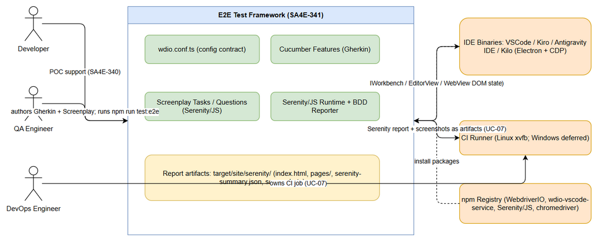
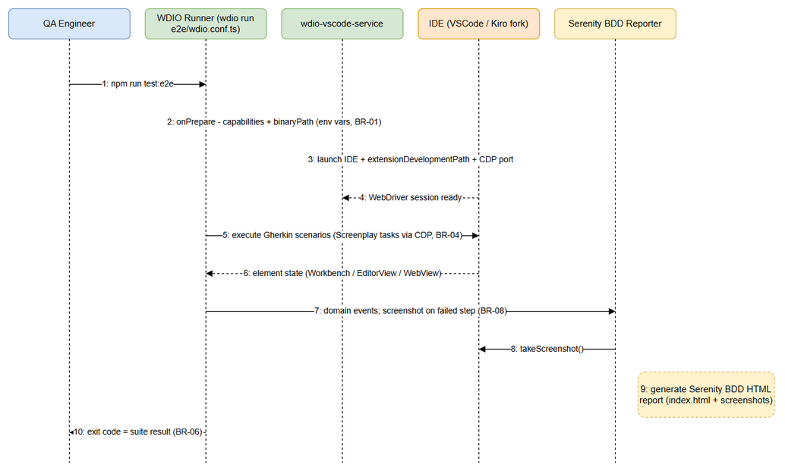
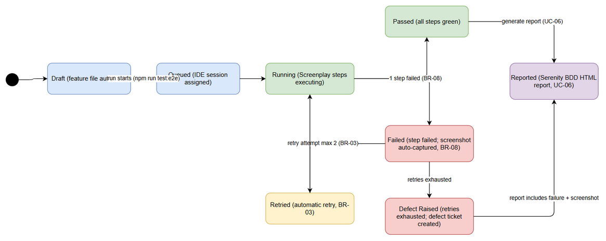

# Functional Specification Document (FSD)

## SDLC-Agents-4-Enterprise E2E Testing Framework — SA4E-341: [E2E Testing] Serenity/JS + wdio-vscode-service for VSCode-based IDEs (Kiro/Antigravity/Kilo)

---

## Document Information

| Field | Value |
|-------|-------|
| Jira Ticket | SA4E-341 |
| Title | [E2E Testing] Serenity/JS + wdio-vscode-service for VSCode-based IDEs (Kiro/Antigravity/Kilo) |
| Type | Epic |
| Priority | Medium |
| Author | BA Agent |
| Version | 1.0 (Draft) |
| Date | 2026-10-09 |
| Status | Draft |
| Related BRD | BRD-v1.0-SA4E-341 (documents/SA4E-341/BRD.md) — primary input |
| Labels | e2e-testing, serenity-js, vscode, wdio |

---

## Revision History

| Version | Date | Author | Changes |
|---------|------|--------|---------|
| 1.0 | 2026-10-09 | BA Agent | Initiate document — derived from BRD v1.0 (SA4E-341), Jira ticket SA4E-341, and predecessor spike SA4E-340 |

---

## 1. Introduction

### 1.1 Purpose

This FSD specifies HOW the BDD E2E testing framework defined in BRD v1.0 (SA4E-341) is functionally implemented:

- The WebdriverIO configuration contract (`wdio.conf.ts`) and environment-variable parameterization.
- The wdio-vscode-service integration that launches and controls VSCode-based IDEs (VSCode, Kiro, Antigravity IDE, Kilo).
- The Serenity/JS Screenplay surface (Actors, Tasks, Questions, Abilities) that implements Gherkin steps.
- The report pipeline that produces the Serenity BDD HTML report with automatic failure screenshots.
- The headless CI execution path (Linux xvfb primary; Windows runner validated or deferred).

The framework is a **test-infrastructure deliverable**: it does not modify production code in `extension/` or `backend/`, and it must keep the existing test setup (`@vscode/test-electron` extension tests, Node backend tests) functional (source: SA4E-341 pipeline context).

### 1.2 Scope

**In scope — UC-01..UC-07 map 1:1 to the 7 BRD Stories (BRD §1.1, §2.3):**

| UC | BRD Story | Functional Area |
|----|-----------|-----------------|
| UC-01 | Story 1 | Integration spike — Serenity/JS + wdio-vscode-service |
| UC-02 | Story 2 | E2E test skeleton setup (wdio.conf.ts, features, npm scripts) |
| UC-03 | Story 3 | IDE fork spike — Kiro / Antigravity / Kilo (CDP attach + chromedriver mapping) |
| UC-04 | Story 4 | BDD / Screenplay test authoring (≥ 5 Gherkin scenarios) |
| UC-05 | Story 5 | WebView / AI chat panel testing (coverage boundary) |
| UC-06 | Story 6 | Serenity BDD HTML report + automatic failure screenshots |
| UC-07 | Story 7 | Headless CI execution (Linux xvfb / Windows runner) |

**Out of scope (from BRD §1.2, to be confirmed with stakeholders):**

- Migrating existing `@vscode/test-electron` extension tests or backend Node tests into the Serenity/JS framework — existing tests keep passing unchanged.
- Performance / load testing of the extension or backend.
- Functional changes to production code (`extension/`, `backend/`).
- Automation of non-VSCode-based IDEs (e.g., JetBrains family).
- Integration with defect-tracking / test-management tools beyond publishing CI artifacts.

### 1.3 Definitions & Acronyms

| Term | Definition |
|------|------------|
| BDD / Gherkin | Behavior-Driven Development; business-readable Given/When/Then scenarios in `.feature` files |
| Serenity/JS | TypeScript test framework layered on WebdriverIO/Cucumber providing Screenplay Pattern + HTML reporting |
| Screenplay Pattern | Test design pattern organizing automation as Actors, Tasks, Questions, Abilities |
| WebdriverIO (WDIO) | Browser/IDE automation runner used as the execution engine (`wdio run`) |
| wdio-vscode-service | WebdriverIO service that launches and controls VSCode/forks, exposing Workbench, EditorView, WebView page objects |
| CDP | Chrome DevTools Protocol — debugging/automation protocol used to attach to Electron/Chromium apps |
| Electron | Runtime on which VSCode and its forks are built; requires a matching chromedriver |
| WebView | Embedded web content panel inside the IDE (e.g., AI chat panel), typically rendered in an iframe |
| Workbench / EditorView | wdio-vscode-service page objects: main IDE UI shell / editor area |
| xvfb | X virtual framebuffer — virtual display enabling GUI apps to run headless on Linux |
| Cucumber | BDD runner; glue between Gherkin steps and Serenity/JS Screenplay tasks |
| Flaky Test | A test that intermittently fails without a product defect |

### 1.4 References

| Document | Location |
|----------|----------|
| BRD (primary input) | documents/SA4E-341/BRD.md |
| Jira ticket data | documents/SA4E-341/JIRA_TICKET.md |
| Predecessor spike (Serenity/JS evaluation) | documents/SA4E-340/JIRA_TICKET.md |
| Serenity/JS Handbook | https://serenity-js.org/handbook/ |
| wdio-vscode-service (community) | https://github.com/webdriverio-community/wdio-vscode-service |
| VSCode — Testing Extensions API | https://code.visualstudio.com/api/working-with-extensions/testing-extension |
| wdio-electron-service (fallback) | https://webdriver.io/docs/wdio-electron-service/ |

---

## 2. System Overview

### 2.1 System Context

*[Edit in draw.io](diagrams/system-context.drawio)*

The E2E framework lives inside the SDLC-Agents-4-Enterprise monorepo (npm workspaces: `backend`, `extension`; Node 22.x) as a self-contained `e2e/` directory plus generated report artifacts under `target/site/serenity/`. It interacts with:

**Actors:**

| Actor | Interaction |
|-------|-------------|
| QA Engineer | Authors Gherkin features + Screenplay code, runs `npm run test:e2e` locally, reviews the Serenity report, executes spikes (UC-01, UC-03, UC-05) |
| Developer | Supports the POC after SA/QA sign-off (SA4E-340 next actions) |
| DevOps Engineer | Owns the headless CI job and artifact publishing (UC-07) |
| Product Owner | Consumes the Serenity BDD HTML report quality (UC-06) |

**External systems:**

| System | Interaction |
|--------|-------------|
| IDE binaries (VSCode, Kiro, Antigravity IDE, Kilo) | Launched and controlled by wdio-vscode-service over WebDriver/CDP; return Workbench/EditorView/WebView DOM state |
| CI Runner (Linux xvfb primary; Windows validated or deferred) | Triggers headless runs on push; receives report + screenshot artifacts |
| npm Registry | Supplies WebdriverIO, wdio-vscode-service, Serenity/JS, Cucumber, chromedriver packages |

### 2.2 System Architecture

Layered architecture of the framework:

1. **Execution layer** — WebdriverIO CLI (`wdio run e2e/wdio.conf.ts`): parses the config contract, spawns IDE sessions, executes Gherkin specs, applies the retry policy (limit 2, BR-03).
2. **IDE control layer** — wdio-vscode-service: launches the target IDE binary with `--extensionDevelopmentPath` and a CDP port, auto-detects the chromedriver matching the IDE Electron runtime, exposes page objects (Workbench, EditorView, WebView) and VSCode-specific commands.
3. **Framework / reporting layer** — `@serenity-js/webdriverio` as the WDIO framework adapter; `@serenity-js/cucumber` as Gherkin glue; Serenity/JS cast + Screenplay runtime; Serenity BDD reporter (`@serenity-js/serenity-bdd`) generating the HTML report with automatic failure screenshots.
4. **Authoring layer** — `e2e/features/*.feature` (Gherkin) + `e2e/features/step_definitions/*.ts` (delegation only — BR-04) + `e2e/src/screenplay/{tasks,questions,interactions}` (reusable constructs).
5. **Artifacts layer** — `target/site/serenity/` (index.html, per-scenario pages, screenshots, serenity-summary.json) produced locally on every run and published by CI on every push.

Compatibility constraints carried over from the BRD: the framework must not break `@vscode/test-electron` extension tests or backend Node tests; production code is untouched; all machine-specific configuration is injected via environment variables (BR-01, BR-02).

---

## 3. Functional Requirements (Use Cases UC-01..UC-07)

Each UC below maps 1:1 to a BRD Story (traceability column "Source"). Framework run overview:

*[Edit in draw.io](diagrams/sequence-e2e-run.drawio)*

### 3.1 UC-01: Integration Spike - Serenity/JS + wdio-vscode-service

**Source:** BRD Story 1. **Actor:** QA Engineer.
**Preconditions:** Node.js 22.x + npm available; repository cloned; VSCode and/or Kiro binaries installed; SA4E-340 findings reviewed.
**Postconditions:** POC scenario executed against VSCode (Kiro) within 1 working day of spike start; go/no-go recorded for all 4 risk areas with committed evidence; stack decision signed off by SA and QA agents.

**Main Flow:**

| Step | Actor | System | Description |
|------|-------|--------|-------------|
| 1 | QA Engineer | | Creates a minimal POC: wdio.conf.ts + 1 sample .feature + 1 step definition wired to @serenity-js/webdriverio |
| 2 | | wdio-vscode-service | Launches the IDE (VSCode/Kiro) with extension-development args and a CDP port; auto-detects matching chromedriver |
| 3 | | WebdriverIO | Executes the POC scenario via Serenity/JS Screenplay tasks (Workbench / EditorView interaction) |
| 4 | QA Engineer | | Records go/no-go per risk area (a) CDP attach, (b) chromedriver-Electron mapping, (c) webview/iframe, (d) CI headless - each with evidence path in the spike findings register |
| 5 | QA Engineer | | Commits spike artifacts (config, scenario, findings register) to documents/SA4E-341/spikes/ |

**Alternative Flows:**

| ID | Condition | Steps |
|----|-----------|-------|
| AF-1 | POC fails on chromedriver-Electron version mismatch | Pin a matching chromedriver version per UC-03 mapping table and re-run; record the mapping in the findings register |

**Exception Flows:**

| ID | Condition | Steps |
|----|-----------|-------|
| EF-1 | IDE fork refuses WebDriver/CDP attach | Record result = "blocked" with evidence; recommend fallback (wdio-electron-service or manual test scripts); reduce automation scope for that IDE (BRD risk 1) |

### 3.2 UC-02: E2E Test Skeleton Setup

**Source:** BRD Story 2. **Actor:** QA Engineer.
**Preconditions:** UC-01 yields go for at least VSCode/Kiro; npm workspace layout (backend, extension) unchanged.
**Postconditions:** npm run test:e2e executes the skeleton end-to-end (launch IDE, run at least 1 scenario, produce report) and exits 0 on a stable run; existing @vscode/test-electron and backend Node tests unaffected; configuration parameterized via env vars - no hardcoded paths committed.

**Main Flow:**

| Step | Actor | System | Description |
|------|-------|--------|-------------|
| 1 | QA Engineer | | Creates the e2e/ skeleton: wdio.conf.ts, features/sample.feature, features/step_definitions/*.ts, Serenity cast (e2e/src/cast.ts), Serenity BDD reporter config |
| 2 | QA Engineer | | Adds npm scripts test:e2e, test:e2e:report, test:e2e:clean (contract in 6.4) |
| 3 | QA Engineer | | Sets E2E_IDE + E2E_IDE_BINARY_PATH environment variables (BR-01) |
| 4 | | WebdriverIO + wdio-vscode-service | Validates env/binary (fail fast, BR-01), launches the IDE, executes scenarios via Screenplay, Serenity writes the report to target/site/serenity/ |
| 5 | QA Engineer | | Commits the skeleton to main; documents the directory layout in the repository README |

**Alternative Flows:**

| ID | Condition | Steps |
|----|-----------|-------|
| AF-1 | Target fork not yet available locally | Skeleton executes with E2E_IDE=code (VSCode binary) while fork support remains gated by UC-03 |

**Exception Flows:**

| ID | Condition | Steps |
|----|-----------|-------|
| EF-1 | E2E_IDE_BINARY_PATH missing or invalid | Fail fast with a console error naming the expected env var and setup instructions; run aborts before IDE launch (BR-01) |
| EF-2 | chromedriver missing or incompatible | Rely on wdio-vscode-service auto-detection; if it fails, raise an explicit version-mapping error referencing the UC-03 mapping table |

### 3.3 UC-03: IDE Fork Spike (Kiro / Antigravity / Kilo)

**Source:** BRD Story 3. **Actor:** QA Engineer.
**Preconditions:** IDE fork binaries installed (or explicitly marked not installable); UC-01 stack decision signed off.
**Postconditions:** Compatibility matrix completed for Kiro, Antigravity IDE, Kilo (cdp_attach + Electron version + chromedriver mapping + smoke scenario refs) or each marked "not installable / not testable" with a reason; IDEs that cannot be automated are excluded from the automation matrix.

**Main Flow:**

| Step | Actor | System | Description |
|------|-------|--------|-------------|
| 1 | QA Engineer | | Launches each fork binary with CDP attach flags and probes WebDriver attach |
| 2 | QA Engineer | | Records electron_version and the matching chromedriver_version per IDE |
| 3 | QA Engineer | | For each attachable IDE, executes at least 1 smoke scenario (launch - interact - assert) committed to the repository |
| 4 | QA Engineer | | Commits the compatibility matrix + smoke scenarios; framework configuration documentation references the mapping table |

**Alternative Flows:**

| ID | Condition | Steps |
|----|-----------|-------|
| AF-1 | IDE not installable on available machines | Matrix row marked "not installable" with reason; IDE excluded from the automation matrix |

**Exception Flows:**

| ID | Condition | Steps |
|----|-----------|-------|
| EF-1 | Fork blocks CDP attach | Mark result = "blocked", record the upstream limitation, exclude the IDE from the automation scope; document the fallback (wdio-electron-service / manual scripts) (BRD risk 1) |

### 3.4 UC-04: BDD / Screenplay Test Authoring

**Source:** BRD Story 4. **Actor:** QA Engineer.
**Preconditions:** UC-02 skeleton committed; UC-01/UC-03 go for target IDEs; at least 5 core IDE/extension journeys identified.
**Postconditions:** At least 5 Gherkin scenarios pass locally with flaky rate below 5% over 10 consecutive runs; 100% of step logic implemented as Screenplay Tasks/Questions; scenarios reviewed by SA agent against this FSD.

**Main Flow:**

| Step | Actor | System | Description |
|------|-------|--------|-------------|
| 1 | QA Engineer | | Authors .feature files in declarative Gherkin (Given/When/Then), one block per scenario, no implementation detail in feature text |
| 2 | QA Engineer | | Implements all step logic as reusable Screenplay Tasks (verb naming, e.g., OpenEditor.at("path/to/file.ts")) and Questions (noun phrases, e.g., Text.of(Editor.activeTab())) |
| 3 | | @serenity-js/cucumber | Maps Gherkin steps to Screenplay tasks; step definitions delegate only - no raw WebdriverIO commands inside step definitions (BR-04) |
| 4 | QA Engineer | | Runs the suite 10 consecutive times locally; tracks flaky failure rate (below 5% threshold) |
| 5 | QA Engineer | | Submits scenarios for SA review against the FSD (traceability) |

**Alternative Flows:**

| ID | Condition | Steps |
|----|-----------|-------|
| AF-1 | A journey requires webview interaction | Route the scenario to UC-05 strategy before implementation |

**Exception Flows:**

| ID | Condition | Steps |
|----|-----------|-------|
| EF-1 | Flaky scenario | Retry limit 2 configured in wdio.conf.ts (BR-03); persistent flakiness is logged and raised as a defect ticket instead of being masked by retries |

### 3.5 UC-05: WebView / AI Chat Panel Testing

**Source:** BRD Story 5. **Actor:** QA Engineer.
**Preconditions:** UC-02 skeleton committed; target IDE running; webview panels of interest identified (e.g., the extension AI chat panel rendered by extension/src/webview/components/ChatPanel.svelte).
**Postconditions:** Webview inventory produced (panel, strategy, automatable Yes/Partial/No, scenario_ref, manual_checklist); at least 1 automated webview scenario where technically feasible; coverage boundary documented; findings fed into the risk register for the next pipeline phase.

**Main Flow:**

| Step | Actor | System | Description |
|------|-------|--------|-------------|
| 1 | QA Engineer | | Enumerates target panels/webviews (AI chat panel, output panels, extension webviews) |
| 2 | QA Engineer | | Probes how far WebdriverIO reaches webview content: switchFrame / webview context API per IDE (Kiro/Antigravity/Kilo) |
| 3 | QA Engineer | | Where feasible, authors at least 1 automated scenario exercising a webview interaction (e.g., open extension chat panel, send a message, assert reply render) |
| 4 | QA Engineer | | Records the webview inventory: panel, strategy, automatable enum, committed scenario_ref, manual_checklist for non-automatable panels |
| 5 | QA Engineer | | Documents the coverage boundary - every panel marked "No" gets a manual testing checklist (per the no-workaround rule - limitations are reported, not masked) |

**Alternative Flows:**

| ID | Condition | Steps |
|----|-----------|-------|
| AF-1 | Partial automation possible | Some assertions automated inside the webview; remaining interactions documented as manual steps in manual_checklist |

**Exception Flows:**

| ID | Condition | Steps |
|----|-----------|-------|
| EF-1 | Webview context switch unsupported by WebdriverIO | Record the limitation in the inventory; route the panel to manual testing (BRD risk 3) |

### 3.6 UC-06: Serenity BDD HTML Report + Failure Screenshots

**Source:** BRD Story 6. **Actor:** QA Engineer (configurator), Product Owner (consumer).
**Preconditions:** UC-02 skeleton with Serenity BDD reporter configured.
**Postconditions:** Every test run (local or CI, pass or fail) produces a report at target/site/serenity/index.html; 100% of failed steps have an attached screenshot; the report opens standalone in any browser; CI publishes report + screenshots as artifacts.

**Main Flow:**

| Step | Actor | System | Description |
|------|-------|--------|-------------|
| 1 | | Serenity/JS runtime | Emits domain events during the run (task started, finished, failed) |
| 2 | | Serenity/JS runtime | On every failed step, captures a screenshot automatically (screenshot_on: every failed step) |
| 3 | | Serenity BDD reporter | At run end, generates index.html + per-scenario pages (pages/) + serenity-summary.json under target/site/serenity/ |
| 4 | QA / Product Owner | | Opens the report standalone in any browser (static HTML, no server required) |
| 5 | | CI pipeline | Publishes the report and screenshots as pipeline artifacts (linked to UC-07) |

**Alternative Flows:**

| ID | Condition | Steps |
|----|-----------|-------|
| AF-1 | HTML report generation fails | Raw serenity-summary.json results are retained and published as fallback evidence |

**Exception Flows:**

| ID | Condition | Steps |
|----|-----------|-------|
| EF-1 | Screenshot capture fails | The test still fails with the original error; the capture failure is logged in the report - the original failure is never masked (BR-08) |

**UI Specifications (generated report viewer - the only UI artifact of this epic):**

| No. | Name | Type | Required | Behavior | Note |
|-----|------|------|----------|----------|------|
| 1 | Scenario results list | Table | Yes | Each scenario with pass/fail status | Standalone HTML |
| 2 | Failure screenshot | Image | Yes | Screenshot attached to failed steps | Auto-captured by Serenity/JS |
| 3 | Step timeline | Table | No | Step-by-step execution detail | Serenity BDD standard output |

### 3.7 UC-07: Headless CI Execution

**Source:** BRD Story 7. **Actor:** DevOps Engineer.
**Preconditions:** UC-02/UC-06 done; Linux CI runner with xvfb available; IDE binary present on the runner.
**Postconditions:** The E2E job runs headless on push (Autonomy Level 3 - main branch); exit code reflects the suite result; Serenity report + screenshots published as artifacts on every run; stage completes within a 15-minute budget for up to 50 scenarios.

**Main Flow:**

| Step | Actor | System | Description |
|------|-------|--------|-------------|
| 1 | | CI pipeline | Triggers on push to main (Autonomy Level 3) |
| 2 | | CI pipeline | Validates xvfb presence - fail fast with an installation hint if missing |
| 3 | DevOps Engineer | | Provides IDE_TYPE/IDE_BINARY_PATH/DISPLAY=:99/E2E_HEADLESS=true as CI environment variables (from UC-02/UC-03 data fields) |
| 4 | | WebdriverIO | npm run test:e2e executes the suite headless against the configured IDE |
| 5 | | CI pipeline | Publishes target/site/serenity/ + screenshots as artifacts on every run (pass or fail) |

**Alternative Flows:**

| ID | Condition | Steps |
|----|-----------|-------|
| AF-1 | Windows runner | Validated in a spike; if not validated, explicitly deferred with a documented reason (BRD risk 4 requires a spike) |

**Exception Flows:**

| ID | Condition | Steps |
|----|-----------|-------|
| EF-1 | xvfb missing on Linux runner | Job fails fast with an explicit installation hint before test execution |
| EF-2 | IDE launch timeout in CI | IDE/WDIO logs dumped as artifacts for diagnosis; job marked failed; no silent retries beyond the configured retry limit (2, BR-03) |

---

## 4. Business Rules

| Rule ID | Rule | Source |
|---------|------|--------|
| BR-01 | Target IDE type and binary path are provided via environment variables E2E_IDE and E2E_IDE_BINARY_PATH - no machine-specific paths hardcoded in committed configuration; a run fails fast if the binary path does not exist | BRD Story 2 |
| BR-02 | Credentials and secrets are provided via environment variables only; no secrets committed to the repository or printed in logs | BRD Story 7 |
| BR-03 | Retry limit is 2 per scenario in wdio.conf.ts; persistent flakiness is logged and raised as a defect ticket instead of being masked by retries | BRD Story 4, Story 7 |
| BR-04 | 100% of step logic is implemented as Serenity/JS Screenplay Tasks/Questions; raw WebdriverIO commands are prohibited inside step definitions (they delegate only) | BRD Story 4 |
| BR-05 | Tests must not modify repository or workspace state outside dedicated test fixtures (temp directories, temporary user settings/profiles) | BRD NFR (Security - test isolation) |
| BR-06 | A single scenario completes in 60 seconds or less (typical); the CI E2E stage completes within 15 minutes for a suite of up to 50 scenarios | BRD NFR (Performance) |
| BR-07 | Every go/no-go spike conclusion must reference committed evidence (config, scenario, findings register) - no verbal-only conclusions | BRD Story 1, Story 3 |
| BR-08 | Every failed step must have an automatic screenshot; a screenshot-capture failure never masks the original failure | BRD Story 6 |

---

## 5. Data Specifications

### 5.1 Feature / Directory Structure

| Path | Purpose | Required |
|------|---------|----------|
| e2e/wdio.conf.ts | WDIO + wdio-vscode-service + Serenity/JS configuration (schema in 5.2) | Yes |
| e2e/features/*.feature | Gherkin scenarios (at least 5 by epic completion, UC-04) | Yes |
| e2e/features/step_definitions/*.ts | Glue: Gherkin steps to Screenplay tasks (delegation only, BR-04) | Yes |
| e2e/src/screenplay/tasks/*.ts | Reusable composite interactions (open Workbench, open editor, run command, read output) | Yes |
| e2e/src/screenplay/questions/*.ts | State questions for assertions (active tab text, panel visibility) | Yes |
| e2e/src/screenplay/interactions/*.ts | Low-level interactions shared by tasks | No |
| e2e/src/cast.ts | Serenity cast - actor roster and abilities | Yes |
| e2e/tsconfig.json | TypeScript config for the e2e code | Yes |
| target/site/serenity/ | Generated Serenity BDD report output (structure in 5.3) | Generated |
| documents/SA4E-341/spikes/ | Committed spike artifacts (config, scenarios, findings register, UC-01/UC-03) | Yes |

### 5.2 wdio.conf.ts Schema (configuration contract)

| Key | Type | Required | Values / Validation | Purpose |
|-----|------|----------|---------------------|---------|
| runner | string | Yes | "local" | WDIO local runner |
| specs | string[] | Yes | ["features/**/*.feature"] | Gherkin discovery |
| maxInstances | number | Yes | 1 | IDE E2E sessions are serialized (one IDE instance) |
| capabilities.browserName | string | Yes | "vscode" (or "chromium" for standalone webview checks) | IDE selection for wdio-vscode-service |
| capabilities["wdio-vscode-service:options"] | object | Yes | { binaryPath, extensionPath, workspacePath, vscodeArgs, userSettings, version } - binaryPath/workspacePath/userSettings resolved from env vars E2E_IDE_BINARY_PATH / E2E_BASE_URL (BR-01) | IDE launch args: custom fork binary, extension under development, workspace, user settings |
| services | string[] | Yes | ["vscode"] | Enables wdio-vscode-service |
| framework | string | Yes | "@serenity-js/webdriverio" | Serenity/JS framework adapter (Screenplay + reporting) |
| frameworkOptions.cucumberOpts | object | Yes | { features, stepDefinitions, retry: 2 (BR-03), failFast env-driven } | Cucumber glue + retry policy |
| reporters / reporting services | list | Yes | @serenity-js/serenity-bdd (Serenity BDD HTML) + @serenity-js/console-reporter | HTML report generation per run |
| outputDir / serenity output | string | Yes | "target/site/serenity" | Report output root |
| baseUrl | string | No | from E2E_BASE_URL | Workspace/folder opened by the IDE under test |
| logLevel | string | Yes | "warn" locally; "info" in CI for diagnosis | Logging verbosity |

**Environment variable schema:**

| Variable | Type | Required | Values / Validation | Purpose |
|----------|------|----------|---------------------|---------|
| E2E_IDE | string | Yes | kiro / code / antigravity / kilo | Target IDE type for wdio-vscode-service (BR-01) |
| E2E_IDE_BINARY_PATH | string | Yes | Must exist on the machine/runner; fail fast if missing | Path to the IDE executable (BR-01) |
| E2E_BASE_URL | string | No | Must exist if provided | Workspace/folder opened by the IDE under test |
| E2E_HEADLESS | string | Yes (CI) | true / false | Headless execution flag |
| DISPLAY | string | Yes (Linux CI) | e.g., :99 | xvfb virtual display (UC-07) |

### 5.3 Serenity Report Structure

| Path / File | Type | Description |
|-------------|------|-------------|
| target/site/serenity/index.html | File | Serenity BDD HTML report entry point - opens standalone in any browser (no server required) |
| target/site/serenity/pages/ | Directory | Per-scenario result pages + embedded failure screenshots |
| target/site/serenity/serenity-summary.json | File | Raw Serenity JSON results (fallback evidence if HTML generation fails) |
| screenshot_on | Behavior | Screenshots captured on every failed step (BR-08) |

**Scenario lifecycle states:**

*[Edit in draw.io](diagrams/state-scenario.drawio)*

| State | Meaning | Exit transitions |
|-------|---------|------------------|
| Draft | Feature file authored, not yet executed | Queued (on run start) |
| Queued | Picked up by WDIO; IDE session assigned | Running |
| Running | Steps executing via Screenplay tasks | Passed / Failed |
| Passed | All steps green | Reported |
| Failed | At least 1 step failed; screenshot auto-captured (BR-08) | Retried (retry attempt at most 2, BR-03) / Defect Raised |
| Retried | Automatic retry in progress | Running |
| Defect Raised | Retries exhausted; defect ticket created; persistent flakiness logged | terminal (per run) |
| Reported | Included in the Serenity BDD HTML report (UC-06) | terminal (per run) |

---

## 6. API / Integration Specifications

### 6.1 External System: Target IDE binaries (VSCode / Kiro / Antigravity / Kilo)

| Attribute | Value |
|-----------|-------|
| Purpose | IDE under test - launched and controlled by the framework over WebDriver/CDP |
| Direction | Outbound (framework to IDE) + Inbound (element state and screenshots back) |
| Data Format | WebDriver / Chrome DevTools Protocol (JSON over HTTP/WebSocket) |
| Frequency | On-demand, per test run (serialized, maxInstances=1) |

**Data Exchange:**

| Our Data | External Data | Direction | Business Rule |
|----------|--------------|-----------|---------------|
| E2E_IDE + E2E_IDE_BINARY_PATH (capabilities binaryPath/workspacePath) | IDE executable + Electron runtime + CDP endpoint | Send | Launch flags: extension-development path, CDP port (BR-01) |
| Screenplay interactions (Workbench/EditorView/WebView) | IDE DOM state | Receive | Via WebDriver/CDP session |
| Screenshot request | PNG screenshot bytes | Receive | On every failed step (BR-08) |

### 6.2 wdio-vscode-service API Surface (functional view)

| API / Page Object | Purpose | Used by |
|-------------------|---------|---------|
| Workbench | Main IDE UI shell control - menus, side bars, panels, quick access | UC-01, UC-04 tasks |
| EditorView | Editor area control - open file, active tab, read content | UC-01, UC-04 tasks/questions |
| WebView page object / switchFrame | Reach webview iframe content (AI chat panel, extension webviews) | UC-05 |
| VSCode command execution (workbench commands) | Run extension commands inside the IDE | UC-04 |
| chromedriver auto-detection | Match the IDE Electron runtime to a compatible chromedriver at launch | UC-02, UC-03 |

### 6.3 Serenity/JS Screenplay Surface

| Construct | Package | Purpose | Convention / Example |
|-----------|---------|---------|---------------------|
| Actor / cast | @serenity-js/core + e2e/src/cast.ts | Named actor driving the IDE | actorCalled("QA") |
| Ability: BrowseTheWebWithWebdriverIO | @serenity-js/webdriverio | Binds the actor to the WDIO browser/IDE session | Assigned in the cast |
| Task | @serenity-js/* | Reusable composite interaction | Verb naming - OpenEditor.at("path/to/file.ts") |
| Question | @serenity-js/* | Read state for assertions | Noun phrase - Text.of(Editor.activeTab()) |
| Expectations | @serenity-js/assertions | Ensure / See verifications on Questions | Ensure.that(Text.of(...), equals("...")) |
| Cucumber glue | @serenity-js/cucumber | Maps Gherkin steps to Screenplay tasks | Step definitions delegate only (BR-04) |
| Serenity BDD reporter | @serenity-js/serenity-bdd | HTML report + automatic failure screenshots per run | Every run, pass or fail (UC-06) |

### 6.4 npm Scripts Interface

| Script | Purpose | Behavior |
|--------|---------|----------|
| npm run test:e2e | One-command E2E run | Validates env/binary (fail fast, BR-01) - launches the IDE - executes Gherkin scenarios via Screenplay - generates the Serenity report to target/site/serenity/; exit code = suite result |
| npm run test:e2e:report | Open the generated report | Opens target/site/serenity/index.html standalone in the default browser (no server required) |
| npm run test:e2e:clean | Clean report artifacts | Removes target/site/serenity/ before a fresh run |

> Note: BRD Section 2.3 (Story 2) used "npm run e2e" as an example ("e.g."). This FSD fixes the script names above - a naming clarification, no behavior change (see Section 9.2 Change Log from BRD).

---

## 7. Error Handling (User-Facing)

### 7.1 Error Scenarios

| Scenario | Severity | User Message / Signal | Expected Behavior |
|----------|----------|----------------------|-------------------|
| E2E_IDE_BINARY_PATH missing or invalid | Critical | Fail-fast console error naming the expected env var + setup instructions | Run aborts before IDE launch; exit code not 0 (BR-01) |
| IDE launch timeout (CI) | Critical | WDIO timeout error; IDE/WDIO logs dumped as artifacts | Job marked failed; no silent retries beyond retry limit 2 (BR-03) |
| chromedriver-Electron version mismatch | Critical | Version-mapping error referencing the UC-03 mapping table | Pin a compatible chromedriver; run blocked until fixed |
| Webview context switch unsupported | Warning | Limitation logged in the webview inventory | Panel routed to manual testing (no-workaround rule) |
| Screenshot capture failure | Warning | Capture failure logged in the Serenity report | Original failure preserved and reported - never masked (BR-08) |
| HTML report generation failure | Warning | Raw serenity-summary.json retained | JSON results published as fallback evidence (UC-06 AF-1) |
| Flaky scenario | Warning | Retry (2) then persistent-failure flag in logs | Defect ticket raised instead of masking (BR-03) |
| xvfb missing on Linux CI runner | Critical | Installation hint (install xvfb) | Job fails fast before test execution (UC-07 EF-1) |

### 7.2 Notification Requirements

| Event | Who is Notified | Channel | Timing |
|-------|-----------------|---------|--------|
| Suite failure on push | QA Engineer + DevOps + SM | CI job status + Serenity report artifact | Immediate, per push |
| IDE fork no-go / blocked (spike result) | SA Agent + QA Engineer + SM | Spike findings register + ticket comment | At spike completion |
| Persistent flakiness (defect raised) | QA Engineer + SM | Defect ticket + Serenity report | When retries exhausted |

---

## 8. Non-Functional Requirements (Quantified)

| Category | Business Requirement | Acceptance Criteria (measurable) |
|----------|---------------------|----------------------------------|
| Performance | E2E suite duration | CI stage 15 minutes or less for a suite of up to 50 scenarios; single scenario 60 seconds or less (typical) (BR-06) |
| Performance | Report generation | Serenity BDD HTML report generated in under 60 seconds for up to 50 scenarios |
| Reliability | Flaky failure rate | Below 5% flaky failures across 10 consecutive local runs; retry limit 2 per scenario (BR-03) |
| Portability | OS support | Windows 10+ (development); Linux x64 with xvfb (CI); Windows runner validated or explicitly deferred with documented reason |
| Maintainability | Test reuse | 100% of step logic as reusable Screenplay Tasks/Questions; Gherkin lint enforced; no raw WDIO commands in step definitions (BR-04) |
| Scalability | Suite growth | Framework supports 50+ scenarios without configuration change (parameterized via env vars, BR-01) |
| Security | Secrets handling | Credentials and machine-specific paths via environment variables only; no secrets committed or logged (BR-02) |
| Security | Test isolation | Tests do not modify repository or workspace state outside dedicated test fixtures (BR-05) |

---

## 9. Appendix

### 9.1 Diagram Index

| Diagram | Source (draw.io) | Rendered (PNG) | Description |
|---------|------------------|----------------|-------------|
| System Context | diagrams/system-context.drawio | diagrams/system-context.png | E2E framework boundary: actors (QA/DevOps/Developer), CI Runner, IDE binaries (VSCode/Kiro/Antigravity/Kilo), npm Registry |
| Sequence - E2E Run | diagrams/sequence-e2e-run.drawio | diagrams/sequence-e2e-run.png | npm run test:e2e flow: WDIO Runner - wdio-vscode-service - IDE - Serenity BDD Reporter (launch, execute, screenshot, report) |
| State - Scenario Lifecycle | diagrams/state-scenario.drawio | diagrams/state-scenario.png | Scenario states: Draft - Queued - Running - Passed/Failed - Retried (max 2) - Reported / Defect Raised |

(BRD-embedded diagrams use-case.png and business-flow.png remain valid - see documents/SA4E-341/BRD.md Section 8 Diagram Index.)

### 9.2 Change Log from BRD

| # | Change | Reason |
|---|--------|--------|
| 1 | npm script names fixed: BRD example "npm run e2e" renamed to test:e2e / test:e2e:report / test:e2e:clean | FSD defines the concrete contract (6.4); BRD used "e.g." |
| 2 | Env var naming standardized: BRD IDE_TYPE renamed to E2E_IDE; BRD IDE_BINARY_PATH renamed to E2E_IDE_BINARY_PATH | Consistent E2E_* namespace avoids collision with CI runner vars; same semantics |
| 3 | No UI mockups | This epic delivers test infrastructure; the only UI artifact is the generated Serenity BDD HTML report (documented in 5.3 and UC-06 UI Specifications) |
| 4 | UC-01..UC-07 numbering | 1:1 mapping to BRD Stories 1..7 for traceability |

### 9.3 Glossary

Full glossary in BRD Section 8. Framework-specific additions:

| Term | Definition |
|------|------------|
| Cast | Serenity/JS roster of actors and their abilities, configured in e2e/src/cast.ts |
| Ability | Capability granted to an actor (e.g., BrowseTheWebWithWebdriverIO binds the actor to the WDIO session) |
| Step Definition | TypeScript function that maps a Gherkin step to a Screenplay task (delegation only, BR-04) |
| serenity-summary.json | Raw Serenity JSON results; fallback evidence if HTML report generation fails |
| maxInstances | WDIO setting limiting concurrent sessions; 1 for IDE E2E (serialized) |
