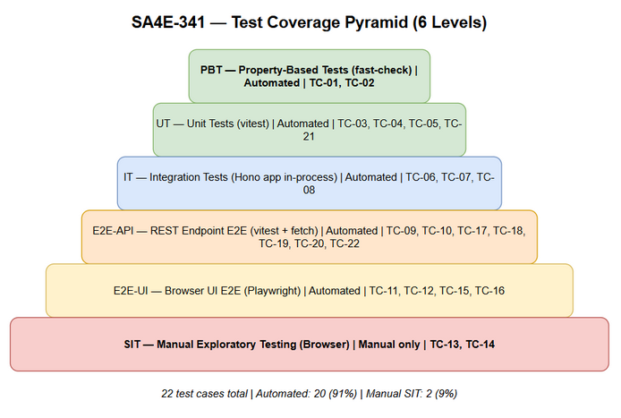
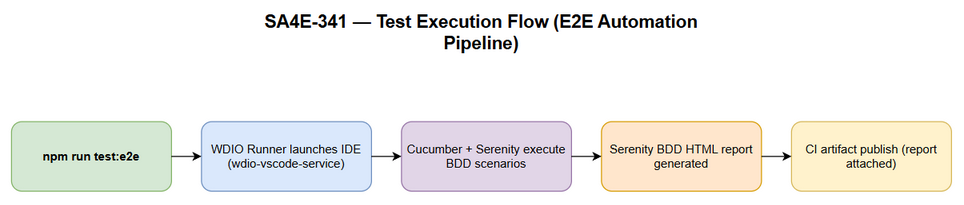

# Software Test Plan (STP)

## SDLC-Agents-4-Enterprise E2E Testing Framework — SA4E-341: [E2E Testing] Serenity/JS + wdio-vscode-service for VSCode-based IDEs (Kiro/Antigravity/Kilo)

---

## Document Information

| Field | Value |
|-------|-------|
| Jira Ticket | SA4E-341 |
| Title | [E2E Testing] Serenity/JS + wdio-vscode-service for VSCode-based IDEs (Kiro/Antigravity/Kilo) |
| Author | QA Agent |
| Version | 1.0 |
| Date | 2026-10-09 |
| Status | Draft |
| Related BRD | documents/SA4E-341/BRD.md v1.0 (Stories 1-7, NFR) |
| Related FSD | documents/SA4E-341/FSD.md v1.0 (UC-01..UC-07, BR-01..BR-08, error scenarios §7) |
| Related TDD | documents/SA4E-341/TDD.md v1.0 (root e2e/ architecture, folder structure §4, SPIKE-1..4 §11) |

---

## Author Tracking

| Role | Name - Position | Responsibility |
|------|-----------------|----------------|
| Author | QA Agent – QA Engineer (SDLC pipeline) | Create document |
| Peer Reviewer | BA Agent – Business Analyst (SDLC pipeline) | Review business coverage (RTM) |
| Peer Reviewer | SM Agent – Scrum Master (SDLC pipeline) | Review document |

---

## Revision History

| Version | Date | Author | Changes |
|---------|------|--------|---------|
| 1.0 | 2026-10-09 | QA Agent | Initiate document — 22 test cases across 6 test levels (PBT 2, UT 4, IT 3, E2E-API 7, E2E-UI 4, SIT 2), traceable to BRD US-01..07, FSD UC-01..07, BR-01..08 |

---

## Sign-Off

| Name | Signature and date |
|------|--------------------|
| | ☐ I agree and confirm the test plan in this STP |
| | ☐ I agree and confirm the test plan in this STP |

---

## 1. Introduction

### 1.1 Purpose

This Software Test Plan (STP) defines the test strategy, scope, environments, test data strategy, entry/exit criteria, requirements traceability, risks, and schedule for verifying the **BDD E2E testing framework** delivered by SA4E-341.

SA4E-341 delivers a **test-infrastructure capability** — not production features. The framework under test is the new root-level `e2e/` standalone npm package (TDD §2.1): WebdriverIO v9 + wdio-vscode-service + Serenity/JS 3 (Cucumber + Screenplay Pattern). The framework launches and controls VSCode-based IDEs (VSCode, Kiro, Antigravity IDE, Kilo) over WebDriver/CDP, executes Gherkin scenarios implemented as Screenplay Tasks/Questions, captures automatic failure screenshots, generates the Serenity BDD HTML report, and runs headless in CI (Linux xvfb).

Because the deliverable is itself a test framework, this STP applies a **meta-testing strategy**: the framework's own correctness is verified at 6 test levels before it is trusted to test anything else.

### 1.2 Scope

**In Scope:**

| # | Feature / Story | Priority | FSD Reference | Test Type |
|---|----------------|----------|---------------|-----------|
| 1 | US-01 / UC-01: Integration spike — Serenity/JS + wdio-vscode-service | MUST HAVE | UC-01, BR-07 | PBT, E2E-API, E2E-UI |
| 2 | US-02 / UC-02: E2E test skeleton (wdio.conf.ts, features, npm scripts) | MUST HAVE | UC-02, BR-01, BR-03 | UT, IT, E2E-API |
| 3 | US-03 / UC-03: IDE fork spike — CDP attach + chromedriver mapping (Kiro/Antigravity/Kilo) | MUST HAVE | UC-03, BR-07 | PBT, E2E-API, E2E-UI |
| 4 | US-04 / UC-04: BDD/Screenplay test authoring (at least 5 Gherkin scenarios) | MUST HAVE | UC-04, BR-03, BR-04 | UT, E2E-UI |
| 5 | US-05 / UC-05: WebView / AI chat panel testing (coverage boundary) | SHOULD HAVE | UC-05 | E2E-UI, SIT |
| 6 | US-06 / UC-06: Serenity BDD HTML report + automatic failure screenshots | MUST HAVE | UC-06, BR-08 | IT, E2E-UI |
| 7 | US-07 / UC-07: Headless CI execution (Linux xvfb / Windows runner) | SHOULD HAVE | UC-07 | E2E-API, SIT |
| 8 | Business rules BR-01..BR-08 | MUST HAVE | FSD §4 | UT, IT, E2E-API |
| 9 | Error scenarios (FSD §7.1) | MUST HAVE | FSD §7.1 | UT, E2E-API |
| 10 | NFRs: budgets, flaky rate, portability, security (FSD §8) | MUST HAVE | FSD §8 | E2E-API, UT |

**Out of Scope:**

| # | Feature | Reason |
|---|---------|--------|
| 1 | Migrating existing extension/backend tests into the Serenity/JS framework | BRD §1.2 — existing tests keep passing unchanged (only regression-checked, TC-22) |
| 2 | Performance/load testing of the extension or backend | BRD §1.2 — only framework budgets are measured (BR-06) |
| 3 | Functional changes to production code in `extension/` or `backend/` | BRD §1.2 — this epic delivers testing capability only (FSD §1.1) |
| 4 | Automation of non-VSCode-based IDEs (e.g., JetBrains family) | BRD §1.2 |
| 5 | Integration with defect-tracking/test-management tools beyond publishing CI artifacts | BRD §1.2 |
| 6 | UAT with business users | Test-infrastructure epic; Product Owner consumes report quality (US-06) — covered by SIT visual checks |

### 1.3 References

| Document | Location |
|----------|----------|
| BRD (primary input for RTM — US-01..07 + NFR) | documents/SA4E-341/BRD.md |
| FSD (primary input — UC-01..07, BR-01..08, §7 errors) | documents/SA4E-341/FSD.md |
| TDD (architecture, folder structure §4, Spike Plan §11) | documents/SA4E-341/TDD.md |
| Test Cases (STC) | documents/SA4E-341/STC.md |
| Test data CSVs | documents/SA4E-341/testdata/ |
| Serenity/JS Handbook | https://serenity-js.org/handbook/ |
| wdio-vscode-service | https://github.com/webdriverio-community/wdio-vscode-service |
| wdio-electron-service (fallback) | https://webdriver.io/docs/wdio-electron-service/ |

---

## 2. Test Strategy

### 2.1 Test Approach

1. **BDD + Screenplay Pattern** — all E2E scenarios are authored in Gherkin (Given/When/Then) and implemented as Serenity/JS Screenplay Tasks/Questions (BR-04); step definitions delegate only.
2. **Spike-first, evidence-based (BR-07)** — SPIKE-1..4 (TDD §11) resolve the 4 ticket risks (CDP attach, chromedriver-Electron mapping, webview handling, CI headless) before full-scale authoring; every go/no-go result is backed by committed evidence.
3. **Meta-testing pyramid** — the framework's own code is tested bottom-up: PBT/UT (env config, Screenplay conventions) → IT (config contract wiring in-process) → E2E-API (real CLI runs) → E2E-UI (real IDE interaction) → SIT (visual/UX only).
4. **Automation-first** — 20 of 22 test cases (91%) are automated; SIT is reduced to visual/UX-only checks requiring human judgment.
5. **Risk-based prioritization** — MUST HAVE stories (US-01..04, US-06) and Critical error scenarios (fail-fast env validation, chromedriver mismatch, xvfb missing) are tested first; SHOULD HAVE stories (US-05, US-07) follow.
6. **Test data via CSVs** — all test data is specified in `documents/SA4E-341/testdata/*.csv`, referenced by test case IDs; fixtures are temporary and isolated (BR-05).

### 2.2 Test Levels (6 levels)

| Level | Scope | Automation | Tools | Owner |
|-------|-------|------------|-------|-------|
| PBT | Correctness properties with random inputs: (a) env-config validation — `resolveE2EEnv` (TDD §7.2) throws `EnvConfigError` for ANY invalid `E2E_IDE` value and fails fast iff binary path missing (BR-01); (b) chromedriver ↔ Electron version mapping table consistency (UC-03, SPIKE-2) | Automated | fast-check + vitest | QA |
| UT | Unit tests of `e2e/` framework modules with mock WDIO handles: Screenplay Tasks (OpenEditor, RunCommand), Questions (ActiveTabText, IsPanelVisible), step-definitions delegation-only audit (BR-04), committed-config hygiene (BR-01/BR-02) | Automated | vitest | QA |
| IT | Framework integration in-process (no IDE spawn): `wdio.conf.ts` config contract vs FSD §5.2 schema, env→capabilities mapping (BR-01), Serenity cast + Cucumber glue registration | Automated | vitest + Node (in-process) | QA |
| E2E-API | Process/CLI-level E2E (no REST API in this epic — real `npm run test:e2e` / `npm test` runs spawned as child processes): wdio-vscode-service capabilities resolution, one-command run exit codes + report artifacts, chromedriver auto-detection, headless xvfb run, fail-fast env errors, retry policy, regression of existing suites | Automated | vitest + Node `child_process` (spawn) | QA |
| E2E-UI | IDE UI E2E via the mandated stack (WDIO v9 + wdio-vscode-service + Serenity/JS Screenplay): workbench open-editor journey, terminal/command run journey, webview switchFrame chat-panel interaction, report generation with failure screenshot | Automated | WebdriverIO + Serenity/JS + wdio-vscode-service | QA |
| SIT | Manual visual/UX-only checks: webview visual layout, AI chat panel UX | Manual | Browser + manual IDE inspection | QA |

> **Note:** SA4E-341 has no REST API — "E2E-API" here means **process/CLI-level end-to-end**: real npm/WDIO executions verified by exit codes, console error signals, and generated artifacts. E2E-API never mocks the IDE process; only at UT level are WDIO handles mocked.

---

## 3. Test Environment

### 3.1 Environment Requirements

| Environment | Location | OS | Purpose |
|-------------|----------|----|---------|
| Local development (primary) | QA workstation: repo `C:\projects\kiro\SDLC-Agents-4-Enterprise`, `e2e/` node_modules installed (`npm --prefix e2e install`) | Windows 10+ | PBT, UT, IT, E2E-API, E2E-UI execution |
| CI — Linux (primary, UC-07) | CI runner: Node 22.x + xvfb virtual display (DISPLAY=:99) + IDE binary on runner | Linux x64 | E2E-API headless runs (TC-18, TC-20); E2E_HEADLESS=true; IDE flags via vscodeArgs (--disable-gpu, --no-sandbox) |
| CI — Windows (UC-07 AF-1) | Validated in SPIKE-4, or explicitly deferred with documented reason | Windows | Compatibility validation only |

### 3.2 Browser / IDE Requirements

| IDE / Browser | Version | OS | Required |
|---------------|---------|----|----------|
| VSCode | 1.85.0+ | Windows 10+, Linux x64 | Yes — baseline (E2E_IDE=code) |
| Kiro | per compatibility matrix (UC-03) | Windows 10+ | Yes — target fork (E2E_IDE=kiro) |
| Antigravity IDE | per compatibility matrix (UC-03) | Windows 10+ | If installable (decided by UC-03) |
| Kilo | per compatibility matrix (UC-03) | Windows 10+ | If installable (decided by UC-03) |
| Chrome | latest | Windows 10+ | Yes — SIT report viewing (TC-13) |
| xvfb | system package | Linux CI | Yes — headless runs (UC-07) |
| Java runtime | 8+ | Dev + CI | Yes — Serenity BDD HTML render (TDD OI-4); fallback: raw serenity-summary.json |

### 3.3 External Dependencies

| System | Dependency | Mock/Stub Available |
|--------|-----------|---------------------|
| IDE binaries (VSCode/Kiro/Antigravity/Kilo) | Launched and controlled over WebDriver/CDP | No — real binaries required at E2E-UI/E2E-API (never stubbed) |
| npm Registry | Supplies WDIO/Serenity/Cucumber/chromedriver packages | No — network access required at install |
| CI runner (Linux xvfb) | Headless execution + artifact publishing (UC-07) | No — real runner required |
| Java runtime (Serenity BDD render) | HTML report generation | Fallback only: raw serenity-summary.json (UC-06 AF-1) |
| chromedriver | Must match IDE Electron runtime (UC-03 mapping) | wdio-vscode-service auto-detection; pinned per mapping table on mismatch (TC-02) |

---

## 4. Test Data Strategy

| Data Type | Description | Source | Preparation |
|-----------|-------------|--------|-------------|
| Test case register | 22 test cases with level, related requirement, priority, automation flag | testdata/test-cases.csv | Generated with this STP |
| Env var config | E2E_IDE, E2E_IDE_BINARY_PATH, E2E_BASE_URL, E2E_HEADLESS, DISPLAY variants (valid + invalid) per IDE target | testdata/test-data-env.csv | Set per test-case preconditions; never committed (BR-01) |
| Gherkin features | The 5+ committed .feature files (smoke/launch, workbench/open-editor, commands/run-extension-command, webview/chat-panel, report/screenshot) | e2e/features/ per TDD §4.1 | Authored per UC-04 |
| Spike artifacts | Compatibility matrix (ide, cdp_attach, electron_version, chromedriver_version) + findings register + webview inventory | documents/SA4E-341/spikes/ | Produced by SPIKE-1..4, committed (BR-07) |
| Report artifacts | e2e/target/site/serenity/ — index.html, pages/, serenity-summary.json | Generated per run (UC-06) | Cleaned via npm run test:e2e:clean before fresh runs |
| Fixture workspace | Dedicated temporary workspace opened by the IDE under test (E2E_BASE_URL) | Created per test session | Never the repo itself (BR-05) |

> **Rule (BR-01/BR-02):** env vars are machine-specific and NEVER committed. Concrete example paths in this STP/STC are examples for the QA workstation only.

---

## 5. Entry / Exit Criteria

### 5.1 Entry Criteria per Level

| Level | Entry Criteria |
|-------|---------------|
| PBT | `e2e/src/support/env.ts` implemented per TDD §7.2 (resolveE2EEnv + EnvConfigError); fast-check + vitest installed in e2e/ |
| UT | Framework modules (env.ts, cast.ts, Tasks/Questions, step definitions, features) implemented per TDD §8 checklist items 1-22 |
| IT | `e2e/wdio.conf.ts` implemented per TDD §5.1; PBT + UT green |
| E2E-API | Skeleton committed (TDD gate G1); env vars E2E_IDE + E2E_IDE_BINARY_PATH set (BR-01); IT green; IDE binaries present per compatibility matrix |
| E2E-UI | UC-01/UC-03 stack decision go (SPIKE-1); E2E-API green; extension builds via --extensionDevelopmentPath |
| SIT | E2E-UI green; report artifacts generated (e2e/target/site/serenity/); CI job run completed (SPIKE-4) |

### 5.2 Exit Criteria per Level

| Level | Exit Criteria |
|-------|--------------|
| PBT | 2/2 property tests pass (TC-01, TC-02); no unresolved counterexamples |
| UT | 4/4 unit tests pass; BR-04 delegation audit = 0 raw WDIO commands in step definitions (TC-05); committed-config hygiene clean (TC-21) |
| IT | 3/3 integration tests pass; wdio.conf.ts matches FSD §5.2 contract (TC-06, TC-07, TC-08) |
| E2E-API | 7/7 process-level tests pass; fail-fast behaviors verified (TC-19); retry policy honored (TC-20); budgets measured (TC-10, TC-18) |
| E2E-UI | 4/4 IDE E2E tests pass; smoke + workbench + webview journeys green on target IDEs |
| SIT | 2/2 visual checks completed and signed off (TC-13, TC-14) |
| Epic (overall) | 100% RTM coverage; 0 Critical defects; at most 2 Major defects open; TDD gates G1-G5 satisfied (TDD §8.4) |

---

## 6. Requirements Traceability Matrix (RTM)

### 6.1 User Stories (BRD §2.2) mapped to Use Cases (FSD §3) and Test Cases

| BRD Story | FSD Use Case | Covering Test Cases | Coverage |
|-----------|--------------|---------------------|----------|
| US-01: Feasibility spike — Serenity/JS + wdio-vscode-service integration | UC-01 (FSD 3.1) | TC-02, TC-09, TC-11, TC-17 | 100% |
| US-02: E2E test skeleton setup | UC-02 (FSD 3.2) | TC-06, TC-07, TC-08, TC-10, TC-21, TC-22 | 100% |
| US-03: IDE fork spike (Kiro/Antigravity/Kilo) | UC-03 (FSD 3.3) | TC-02, TC-09, TC-11, TC-17 | 100% |
| US-04: BDD/Screenplay test authoring | UC-04 (FSD 3.4) | TC-03, TC-04, TC-05, TC-11, TC-12 | 100% |
| US-05: WebView / AI chat panel testing | UC-05 (FSD 3.5) | TC-13, TC-14, TC-15 | 100% |
| US-06: Serenity BDD HTML report + failure screenshots | UC-06 (FSD 3.6) | TC-08, TC-10, TC-16 | 100% |
| US-07: Headless CI execution | UC-07 (FSD 3.7) | TC-18, TC-19, TC-20 | 100% |

### 6.2 Business Rules (FSD §4) mapped to Test Cases

| Business Rule | Rule Summary | Covering Test Cases | Coverage |
|---------------|--------------|---------------------|----------|
| BR-01 | IDE type + binary path via env vars E2E_IDE / E2E_IDE_BINARY_PATH; fail fast if missing; no hardcoded paths | TC-01, TC-07, TC-19, TC-21 | 100% |
| BR-02 | Credentials/secrets via env vars only; no secrets committed or logged | TC-21 | 100% |
| BR-03 | Retry limit 2 per scenario; persistent flakiness raised as defect, not masked | TC-06, TC-20 | 100% |
| BR-04 | 100% step logic as Screenplay Tasks/Questions; step definitions delegate only | TC-03, TC-05 | 100% |
| BR-05 | Tests do not modify repo/workspace state outside dedicated fixtures | TC-07, TC-13 | 100% |
| BR-06 | Single scenario 60s or less; CI stage 15 minutes for up to 50 scenarios | TC-10, TC-18 | 100% |
| BR-07 | Every spike go/no-go references committed evidence | TC-02, TC-11 | 100% |
| BR-08 | Every failed step has an automatic screenshot; capture failure never masks original failure | TC-06, TC-16 | 100% |

### 6.3 Coverage Summary

| Category | Total | Covered | Coverage % |
|----------|-------|---------|------------|
| User Stories (US-01..07) | 7 | 7 | 100% |
| Use Cases (UC-01..07) | 7 | 7 | 100% |
| Business Rules (BR-01..08) | 8 | 8 | 100% |
| **Overall** | **22** | **22** | **100%** |

---

## 7. Risks and Mitigations

| # | Risk | Impact | Likelihood | Mitigation |
|---|------|--------|------------|------------|
| 1 | IDE forks (Kiro/Antigravity/Kilo) may not allow WebDriver/CDP attach (SA4E-341 risk 1, SPIKE-1) | High | Medium | Run SPIKE-1 first; fallback to wdio-electron-service or manual test scripts; IDE excluded from automation matrix; TC-09/TC-11 verify actual attach |
| 2 | chromedriver ↔ Electron version mismatch breaks automation (SA4E-341 risk 2, SPIKE-2) | High | Medium | Pin package versions after the mapping spike; wdio-vscode-service auto-detection; committed mapping table verified by TC-02/TC-17 |
| 3 | WebdriverIO cannot fully handle webview/iframe content such as the AI chat panel (SA4E-341 risk 3, SPIKE-3) | Medium | Medium | Webview spike; document the coverage boundary; route non-automatable panels to manual testing (TC-13, TC-14, TC-15) |
| 4 | CI headless environment differences (Linux xvfb / Windows runner) cause instability (SA4E-341 risk 4, SPIKE-4) | Medium | Medium | CI spike; fail-fast xvfb validation; publish IDE/WDIO logs as artifacts (TC-18, TC-20) |
| 5 | Java unavailable for Serenity BDD HTML render (TDD OI-4) | Medium | Medium | Verify at SPIKE-1/SPIKE-4; fallback to raw serenity-summary.json as evidence (UC-06 AF-1) |
| 6 | E2E tests become flaky, eroding trust in the suite | Medium | Medium | Screenplay Pattern with explicit waits; retry limit 2 (BR-03, TC-20); defects raised instead of masking |
| 7 | IDE binaries not available on all machines (Antigravity/Kilo) | Medium | Medium | VSCode baseline always available (E2E_IDE=code fallback per UC-02 AF-1); per-IDE matrix records "not installable" with reason |

---

## 8. Schedule and Milestones

| Phase | Start Date | End Date | Duration | Milestone |
|-------|-----------|----------|----------|-----------|
| Test Planning (STP + STC) | 2026-10-09 | 2026-10-09 | 1 day | STP + STC approved (BA coverage review) |
| SPIKE-1: IDE fork CDP attach (UC-01/UC-03) | 2026-10-09 | 2026-10-10 | 1 day | POC + go/no-go for risk 1 (TC-09, TC-11) |
| SPIKE-2: chromedriver mapping (UC-03) | 2026-10-10 | 2026-10-10 | 0.5 day | Mapping table committed (TC-02, TC-17) |
| SPIKE-3: webview handling (UC-05) | 2026-10-10 | 2026-10-13 | 1 day | Webview inventory + at least 1 scenario (TC-13..TC-15) |
| SPIKE-4: CI headless (UC-07) | 2026-10-13 | 2026-10-13 | 0.5 day | Headless run validated (TC-18) |
| PBT + UT execution | 2026-10-13 | 2026-10-14 | 1 day | 6/6 green (PBT 2 + UT 4) |
| IT + E2E-API execution | 2026-10-14 | 2026-10-15 | 1.5 days | 10/10 green (IT 3 + E2E-API 7) |
| E2E-UI execution | 2026-10-15 | 2026-10-16 | 1 day | 4/4 green on target IDEs |
| SIT visual checks | 2026-10-16 | 2026-10-16 | 0.5 day | 2/2 signed off |
| Defect fix and retest | 2026-10-16 | 2026-10-19 | 1 day (buffer) | 0 Critical, at most 2 Major open |
| Epic completion sign-off | 2026-10-19 | 2026-10-19 | 0.5 day | TDD gates G1-G5 satisfied; BRD objectives met |

---

## 9. Defect Management

### 9.1 Severity Levels

| Severity | Definition | Example (this epic) |
|----------|-----------|---------------------|
| Critical | Framework unusable, run cannot start or complete, environment damage | Fail-fast validation does not abort before IDE launch (TC-19); skeleton run fails (TC-10) |
| Major | Feature not working, workaround exists | chromedriver mismatch without explicit error (TC-17); failed steps missing screenshots (TC-16) |
| Minor | Partial limitation, cosmetic defect | Report rendering glitch (TC-13); minor UX issue in chat panel (TC-14) |
| Trivial | Typo, minor alignment issue | Documentation typo in README layout section |

### 9.2 Priority Levels

| Priority | Definition | SLA (Fix Time) |
|----------|-----------|----------------|
| P1 | Must fix immediately — blocks the epic | 4 hours |
| P2 | Must fix before epic completion | 1 business day |
| P3 | Should fix if time permits | 3 business days |
| P4 | Nice to fix, can defer | Next release |

### 9.3 Defect Lifecycle

```
New -> Open -> In Progress -> Fixed -> Ready for Retest -> Verified -> Closed
                                                       -> Reopened -> In Progress
```

**Flakiness policy (BR-03):** retry limit 2 per scenario; persistent flakiness is logged and raised as a defect ticket — never masked by retries (verified by TC-20).

---

## 10. Appendix — Diagram Index

| # | Diagram | Image (PNG) | Source (editable) | Section |
|---|---------|-------------|-------------------|---------|
| 1 | Test Execution Flow | DIAGRAM-PNG-EXECUTION-FLOW | diagrams/test-execution-flow.drawio | §2.2 |
| 2 | Test Coverage Overview | DIAGRAM-PNG-COVERAGE | diagrams/test-coverage.drawio | §6 |

Cross-references (produced by BA/SA, valid — not modified): documents/SA4E-341/BRD.md §8 (use-case.png, business-flow.png), FSD.md §9.1 (system-context.png, sequence-e2e-run.png, state-scenario.png), TDD.md Appendix A (architecture.png, component.png, class-screenplay.png).

*End of STP — SA4E-341 v1.0.*

## 11. Test Artifacts & Diagram Index

### 11.1 Test Coverage Pyramid



### 11.2 Test Execution Flow (E2E Automation Pipeline)



### 11.3 Diagram Index

| Diagram | Source File | Exported PNG | Description |
|---------|-------------|--------------|-------------|
| Test Coverage Pyramid | diagrams/test-coverage.drawio | diagrams/test-coverage.png | 6 test levels with mapped test case IDs: PBT (TC-01, TC-02), UT (TC-03, TC-04, TC-05, TC-21), IT (TC-06, TC-07, TC-08), E2E-API (TC-09, TC-10, TC-17, TC-18, TC-19, TC-20, TC-22), E2E-UI (TC-11, TC-12, TC-15, TC-16), SIT manual (TC-13, TC-14) |
| Test Execution Flow | diagrams/test-execution-flow.drawio | diagrams/test-execution-flow.png | E2E automation pipeline: npm run test:e2e → WDIO runner launch IDE (wdio-vscode-service) → Cucumber + Serenity execute scenarios → Serenity BDD HTML report → CI artifact publish |
