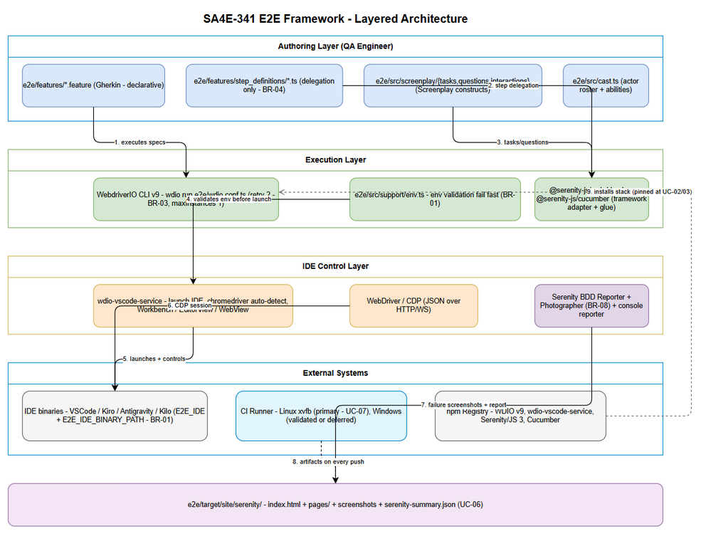
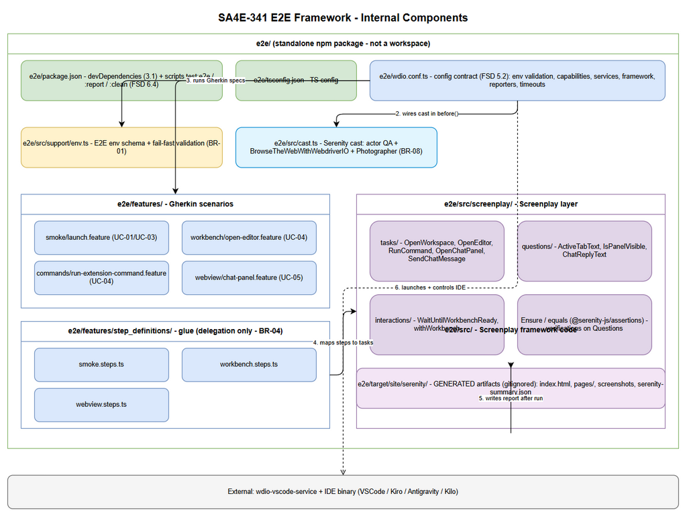
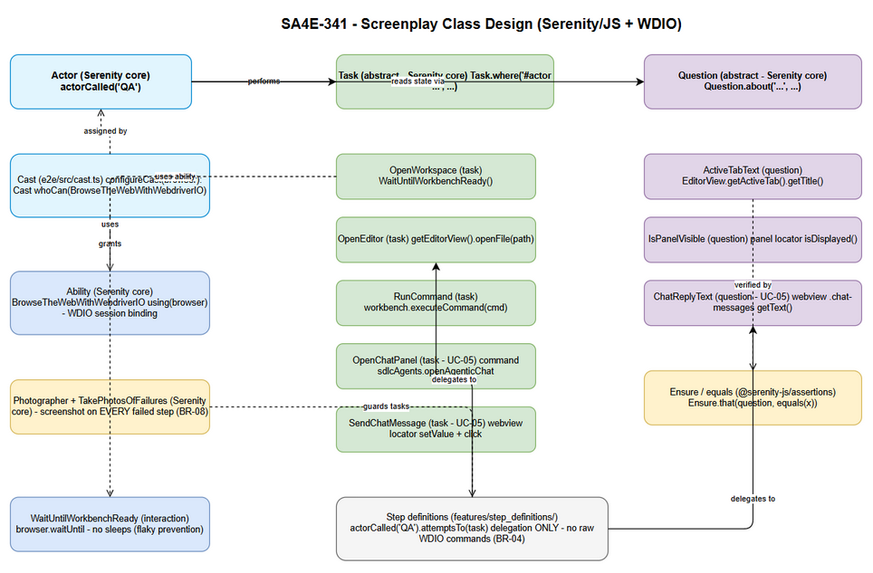

# Technical Design Document (TDD)

## SDLC-Agents-4-Enterprise — SA4E-341: [E2E Testing] Serenity/JS + wdio-vscode-service for VSCode-based IDEs (Kiro/Antigravity/Kilo)

---

## Document Information

| Field | Value |
|-------|-------|
| Jira Ticket | SA4E-341 |
| Title | [E2E Testing] Serenity/JS + wdio-vscode-service for VSCode-based IDEs (Kiro/Antigravity/Kilo) |
| Type | Epic |
| Priority | Medium |
| Author | SA Agent (Solution Architect) |
| Version | 1.0 |
| Date | 2026-10-09 |
| Status | Draft (verified against FSD v1.0 + actual codebase) |
| Related BRD | documents/SA4E-341/BRD.md v1.0 (Stories 1-7) |
| Related FSD | documents/SA4E-341/FSD.md v1.0 (UC-01..UC-07, BR-01..BR-08) |
| Labels | e2e-testing, serenity-js, vscode, wdio |

---

## Author Tracking

| Role | Name - Position | Responsibility |
|------|-----------------|----------------|
| Author | SA Agent – Solution Architect (SDLC pipeline) | Create document |
| Peer Reviewer | SM Agent – Scrum Master (SDLC pipeline) | Review document |

---

## Revision History

| Version | Date | Author | Changes |
|---------|------|--------|---------|
| 1.0 | 2026-10-09 | SA Agent | Initiate document — derived from FSD v1.0 (primary), BRD v1.0, Jira ticket SA4E-341, and verified codebase analysis (root package.json, extension/package.json, extension/vitest.e2e.config.ts, extension/src/test/). Key decisions: root `e2e/` placement, standalone npm package model, WDIO v9 + Serenity/JS 3 + Cucumber stack, spike-first risk plan (SPIKE-1..4). Discrepancies recorded in Appendix B (Open Issues) — no separate DISCREPANCY.md file per pipeline instruction. |

---

## Sign-Off

| Name | Signature and date |
|------|--------------------|
| | ☐ I agree and confirm the technical design in this TDD |
| | ☐ I agree and confirm the technical design in this TDD |

---

## 1. Introduction

> **Scope Boundary:** Functional requirements (UC-01..UC-07), business rules (BR-01..BR-08), data specifications (FSD §5), and error scenarios (FSD §7) live in FSD v1.0. This TDD specifies HOW to implement them: technology choices, framework placement, folder structure, component and Screenplay class design, Gherkin data design, implementation checklist, error/security handling, and the 4-spike risk plan. It does NOT modify production code in `extension/` or `backend/` (FSD §1.1) and keeps the existing test setup functional.

### 1.1 Purpose

This TDD designs the **BDD E2E testing framework** for VSCode and VSCode-based IDE forks (Kiro, Antigravity IDE, Kilo) using the stack mandated by the ticket: **WebdriverIO + wdio-vscode-service + Serenity/JS (Cucumber + Screenplay Pattern)**.

The framework is a **test-infrastructure deliverable**:

- It launches and controls the target IDE (VSCode or a fork) via wdio-vscode-service over WebDriver/CDP.
- It executes Gherkin scenarios implemented as Serenity/JS Screenplay Tasks/Questions (BR-04).
- It produces the Serenity BDD HTML report with automatic failure screenshots on every run (UC-06, BR-08).
- It runs headless in CI (Linux xvfb primary; Windows runner validated or deferred — UC-07).

Implements UC-01..UC-07, BR-01..BR-08 (traceability per section throughout this document).

### 1.2 Scope

**In scope (technical):**

| Area | Design sections |
|------|-----------------|
| Framework placement in the monorepo workspace (root `e2e/` vs `extension/e2e`) | §2.1 |
| Tech stack: WebdriverIO v9, wdio-vscode-service, Serenity/JS 3, Cucumber | §3 |
| Folder structure of `e2e/` (features, step definitions, screenplay, config, support) | §4 |
| Component design: `wdio.conf.ts`, Serenity config, cast, Tasks/Questions, feature files | §5 |
| Screenplay class design (Actor, Abilities, Tasks, Questions) | §6 |
| Data design: Gherkin feature files, env var config, report artifacts | §7 |
| Implementation checklist (files to create/modify) | §8 |
| Error handling (IDE launch fail, webview not found, flaky retry) | §9 |
| Security design (secrets via env vars, test isolation) | §10 |
| Spike plan for the 4 ticket risks (CDP attach, chromedriver mapping, webview, CI headless) | §11 |

**Out of scope (from FSD §1.2):** migrating existing extension/backend tests into this framework, performance/load testing, functional changes to production code, automation of non-VSCode-based IDEs (JetBrains), defect-tracking integrations beyond CI artifacts.

### 1.3 Technology Stack (summary)

| Layer | Technology | Version (pinned at UC-02 install) |
|-------|-----------|-----------------------------------|
| Language | TypeScript | 5.4+ (same major as extension/backend) |
| Runtime | Node.js | 22.x (root `engines` field) |
| Test runner / automation engine | WebdriverIO (WDIO) | v9.x |
| IDE control service | wdio-vscode-service | latest stable (verify at UC-01/UC-03) |
| BDD framework | Serenity/JS 3 (@serenity-js/*) | 3.x |
| BDD runner (glue) | Cucumber (@cucumber/cucumber) | 10.x+ |
| Report | Serenity BDD HTML (@serenity-js/serenity-bdd) | 3.x |
| CI display | xvfb (Linux) | system package |
| IDE under test | VSCode / Kiro / Antigravity IDE / Kilo | per-IDE compatibility matrix (UC-03) |

Full package table with purposes: §3. All package versions are pinned after the chromedriver-Electron mapping spike (UC-03) per BRD §3 Dependencies.

### 1.4 Design Principles

- **Spike-first, evidence-based (BR-07)** — the 4 unknowns from the ticket are resolved by committed spike artifacts before full-scale authoring (UC-04).
- **Additive, non-invasive** — the framework lives in a new self-contained directory; production code, extension tests, and backend tests are untouched (FSD §1.1, BR-05).
- **Screenplay Pattern everywhere (BR-04)** — 100% of step logic is Tasks/Questions; step definitions delegate only; no raw WebdriverIO commands in step definitions.
- **Configuration via environment variables (BR-01, BR-02)** — no machine-specific paths or secrets committed; fail-fast validation before IDE launch.
- **Report never masked (BR-08)** — every failed step gets an automatic screenshot; a screenshot-capture failure never hides the original failure.
- **Reuse before invention** — the design reuses FSD-defined contracts (`wdio.conf.ts` schema §5.2, npm scripts §6.4) instead of inventing new ones.

### 1.5 Constraints

- Node.js 22.x runtime (root `package.json` `engines`); npm workspaces are `backend` + `extension` — the `e2e/` package is deliberately NOT registered as a workspace (§2.1).
- The existing test setup must keep passing: **extension vitest suites** (`npm run test`, `npm run test:e2e` inside `extension/`) and **backend Node tests** (FSD §1.1 says "@vscode/test-electron extension tests" — see Open Issues OI-1: the actual codebase uses vitest).
- IDE E2E sessions are serialized (`maxInstances: 1`) — one IDE instance per run (FSD §5.2).
- Single scenario 60s or less (typical); CI stage 15 minutes for up to 50 scenarios (BR-06).
- Retry limit 2 per scenario (BR-03); persistent flakiness raised as a defect ticket, never masked.
- Windows 10+ development; Linux x64 + xvfb for CI headless (UC-07).

### 1.6 References

| Document | Location |
|----------|----------|
| FSD (primary input) | documents/SA4E-341/FSD.md v1.0 |
| BRD | documents/SA4E-341/BRD.md v1.0 |
| Jira ticket data | documents/SA4E-341/JIRA_TICKET.md |
| Predecessor spike (Serenity/JS evaluation) | documents/SA4E-340/JIRA_TICKET.md |
| Serenity/JS Handbook | https://serenity-js.org/handbook/ |
| wdio-vscode-service | https://github.com/webdriverio-community/wdio-vscode-service |
| VSCode — Testing Extensions API | https://code.visualstudio.com/api/working-with-extensions/testing-extension |
| wdio-electron-service (fallback) | https://webdriver.io/docs/wdio-electron-service/ |
| Extension under test | extension/ (SDLC Agents 4 Enterprise, engines.vscode ^1.85.0) |

---

## 2. System Architecture

### 2.1 Architecture Overview — Framework Placement in the Workspace

**Decision: the E2E framework lives in a new self-contained root-level `e2e/` directory (NOT `extension/e2e`).**

| Criterion | Root `e2e/` (CHOSEN) | `extension/e2e` |
|-----------|----------------------|-----------------|
| FSD consistency | FSD §2.1 ("self-contained `e2e/` directory") and §5.1 (`e2e/wdio.conf.ts`, `e2e/features/...`) specify root-level paths | Would deviate from the FSD folder contract |
| Test isolation (BR-05) | Extension unit/vitest suites untouched; E2E deps isolated in their own package | Risk of coupling E2E deps (WDIO/Serenity, heavy) into the extension package used for `vsce` packaging |
| Scope | Tests exercise the FULL IDE experience (extension + backend integration, workbench, webview) — cross-cutting, not extension-package-specific | Frames the E2E suite as belonging to the extension package only |
| npm scripts (FSD §6.4) | Root `test:e2e` / `test:e2e:report` / `test:e2e:clean` — single command from repo root | Would collide conceptually with the existing extension script `test:e2e` (vitest-based, see OI-2) |
| CI targeting (UC-07) | CI job targets `e2e/` only; IDE-heavy job does not trigger on extension-only changes | Extension changes would retrigger IDE jobs unnecessarily |
| Dependency evolution | WDIO v9 / Serenity 3 versions evolve independently of extension/backend deps | Version bumps would affect the extension lockfile |

**Package model: `e2e/` is a standalone private npm package with its own `package.json`, deliberately NOT added to the root `workspaces` array** (`["backend", "extension"]` unchanged). Rationale:

1. Root `npm test` runs `npm run test --workspaces` — keeping `e2e/` out of workspaces guarantees a blanket `npm install` / `npm test` at the root can never launch IDEs or install E2E deps implicitly (protects existing tests, FSD §1.1).
2. WDIO v9 + Serenity/JS + chromedriver downloads are heavy; explicit opt-in install (`npm --prefix e2e install`, documented in the setup checklist §8) keeps the workspace lean.
3. Dependency isolation: E2E stack versions are pinned per the UC-03 mapping spike without touching the extension lockfile.
4. Self-contained artifacts: report output resolves to `e2e/target/site/serenity/` (see OI-3 for the FSD path interpretation) — a single `.gitignore` entry covers it.

**Layered architecture (from FSD §2.2, verified against the workspace layout):**

1. **Authoring layer** — `e2e/features/*.feature` (Gherkin) + `e2e/features/step_definitions/*.ts` (delegation only — BR-04) + `e2e/src/screenplay/{tasks,questions,interactions}` (reusable Screenplay constructs).
2. **Execution layer** — WebdriverIO CLI (`wdio run e2e/wdio.conf.ts`): parses the config contract (FSD §5.2), spawns IDE sessions, executes Gherkin specs, applies the retry policy (2 — BR-03).
3. **IDE control layer** — wdio-vscode-service: launches the target IDE binary with extension-development args and a CDP port, auto-detects the chromedriver matching the IDE Electron runtime, exposes page objects (Workbench, EditorView, WebView).
4. **Framework / reporting layer** — `@serenity-js/webdriverio` (WDIO framework adapter), `@serenity-js/cucumber` (Gherkin glue), Serenity cast + Screenplay runtime, `Photographer` (screenshots on every failed step — BR-08), Serenity BDD reporter → `e2e/target/site/serenity/`.
5. **Artifacts layer** — `e2e/target/site/serenity/` (index.html, per-scenario pages, screenshots, serenity-summary.json), published by CI on every push (UC-07).


*[Edit in draw.io](diagrams/architecture.drawio)*

**Interactions with external systems (FSD §2.1):** IDE binaries (VSCode/Kiro/Antigravity/Kilo) controlled over WebDriver/CDP; CI Runner (Linux xvfb primary; Windows validated or deferred) triggers headless runs and receives report artifacts; npm Registry supplies the stack packages.

### 2.2 Component Diagram

The framework consists of 8 internal components plus the IDE under test:


*[Edit in draw.io](diagrams/component.drawio)*

| Component | Responsibility | Technology | Source |
|-----------|---------------|------------|--------|
| `e2e/wdio.conf.ts` | Configuration contract: env validation (fail fast, BR-01), capabilities, services, framework adapter, reporters, timeouts | TypeScript + WDIO v9 | FSD §5.2 |
| `e2e/src/support/env.ts` | Environment variable schema resolution + binary existence check before IDE launch (BR-01) | TypeScript (Node `fs`/`process.env`) | BR-01 |
| `e2e/src/cast.ts` | Serenity cast: actor roster + abilities (BrowseTheWebWithWebdriverIO, Photographer screenshots) | @serenity-js/core | FSD §5.1 |
| `e2e/features/*.feature` | Gherkin scenarios (declarative, Given/When/Then) | Gherkin | FSD §5.1 |
| `e2e/features/step_definitions/*.ts` | Glue: Gherkin steps to Screenplay tasks (delegation only — BR-04) | @cucumber/cucumber + @serenity-js/cucumber | BR-04 |
| `e2e/src/screenplay/tasks/*.ts` | Reusable composite interactions (OpenWorkspace, OpenEditor, RunCommand, OpenChatPanel) | @serenity-js/webdriverio page objects | UC-04 |
| `e2e/src/screenplay/questions/*.ts` | State questions for assertions (ActiveTabText, IsPanelVisible, ChatReplyText) | @serenity-js/webdriverio + assertions | UC-04 |
| Report artifacts `e2e/target/site/serenity/` | index.html + per-scenario pages + screenshots + serenity-summary.json (fallback evidence) | @serenity-js/serenity-bdd | UC-06 |
| IDE under test (external) | VSCode / Kiro / Antigravity IDE / Kilo binary launched with extension-development args + CDP port | wdio-vscode-service | UC-01/UC-03 |

### 2.3 Deployment Architecture

| Environment | Topology | Notes |
|-------------|----------|-------|
| Local development (Windows 10+) | QA workstation: repo + installed IDE binaries (VSCode, Kiro, ...) + `e2e/` node_modules. `npm run test:e2e` (root) → `wdio run e2e/wdio.conf.ts` spawns the IDE on the real display | E2E_IDE + E2E_IDE_BINARY_PATH from a local (uncommitted) env setup — BR-01 |
| CI — Linux (primary, UC-07) | Runner: Node 22.x + xvfb virtual display (DISPLAY=:99) + IDE binary on the runner. Headless: E2E_HEADLESS=true; IDE flags via vscodeArgs (--disable-gpu, --no-sandbox) where needed | Job on push to main (Autonomy Level 3); artifacts published every run (pass or fail) |
| CI — Windows (UC-07 AF-1) | Validated in a spike; if not validated, explicitly DEFERRED with a documented reason (BRD risk 4) | Per-IDE compatibility matrix records the result |

There is no server-side deployment: the framework is on-demand tooling run by QA locally and by the CI job. The Serenity BDD report is static HTML (opens standalone in any browser — UC-06).

### 2.4 Communication Patterns

| From | To | Protocol | Pattern | Description |
|------|----|----------|---------|-------------|
| WDIO runner | wdio-vscode-service | In-process (WDIO service API) | Sync | Service lifecycle: onPrepare (validate env, pick chromedriver), beforeSession (launch IDE) |
| wdio-vscode-service | IDE binary | Process spawn + CLI args | Async (spawn) | Launches IDE with --extensionDevelopmentPath, CDP port, userSettings |
| wdio-vscode-service | IDE (Electron/Chromium) | WebDriver / CDP (JSON over HTTP/WebSocket) | Sync per command | Element queries, workbench commands, frames |
| Serenity runtime | WDIO browser | @serenity-js/webdriverio adapter | Sync per interaction | Tasks/Questions translated to WDIO commands |
| Serenity BDD reporter | Disk `e2e/target/site/serenity/` | File writes | Async (afterAll) | index.html, pages/, screenshots, serenity-summary.json |
| CI job | Artifact store | CI platform artifact upload | Async | Report + screenshots published every run (UC-07) |

---
## 3. Tech Stack (detailed)

### 3.1 Package Table

| Package | Version (design date) | Purpose | Notes |
|---------|----------------------|---------|-------|
| `@wdio/cli` | ^9.x | WDIO CLI: `wdio run e2e/wdio.conf.ts` execution engine | NEW DEPENDENCY — mandated by ticket; no existing alternative in the repo (extension tests use vitest, which cannot launch IDEs) |
| `@wdio/local-runner` | ^9.x | WDIO local runner (`runner: "local"`, FSD §5.2) | Transitive of @wdio/cli; pinned explicitly for the config contract |
| `wdio-vscode-service` | latest stable (^0.6.x — verify at UC-01/UC-03) | IDE control: launches VSCode/forks with extension-development args + CDP port; chromedriver auto-detection; Workbench / EditorView / WebView page objects | NEW DEPENDENCY — core of the IDE control layer; exact option keys verified during UC-01 spike against the service README |
| `@serenity-js/core` | ^3.x | Serenity Screenplay runtime: Actor, Cast, Task, Question, Photographer (failure screenshots — BR-08) | NEW DEPENDENCY — mandated by ticket |
| `@serenity-js/webdriverio` | ^3.x | WDIO framework adapter (`framework: "@serenity-js/webdriverio"`) + BrowseTheWebWithWebdriverIO ability | NEW DEPENDENCY — the runner/reporting layer on WDIO (ticket "Bối cảnh") |
| `@serenity-js/cucumber` | ^3.x | Cucumber glue: maps Gherkin steps to Screenplay tasks; provides `actorCalled` in step definitions | NEW DEPENDENCY — implements BR-04 |
| `@serenity-js/serenity-bdd` | ^3.x | Serenity BDD HTML report generation per run + raw serenity-summary.json | NEW DEPENDENCY — implements UC-06 |
| `@serenity-js/console-reporter` | ^3.x | Console output during runs (logLevel warn locally, info in CI) | NEW DEPENDENCY — FSD §5.2 |
| `@serenity-js/assertions` | ^3.x | Ensure / See expectations on Questions | Implements FSD §6.3 |
| `@cucumber/cucumber` | 10.x+ | BDD runner + Gherkin parser (step definition DSL) | NEW DEPENDENCY — glue between .feature and Screenplay |
| `typescript` | ^5.4.0 | TS compilation for e2e code (tsconfig.json §4) | Same major as extension/backend — no new toolchain |
| `@types/node` | ^22.0.0 | Node types for env.ts (fs, process.env) | Matches root engines 22.x |
| chromedriver | per-IDE (mapped at UC-03) | Browser/IDE driver matching the IDE Electron runtime | NOT committed as a fixed dep — wdio-vscode-service auto-detects; mapping table committed to documents/SA4E-341/spikes/ per UC-03 |
| xvfb | system package (Linux CI) | Virtual display for headless IDE launch (UC-07) | Install hint on missing (FSD §7.1); not an npm dep |

**Dependency policy:** all packages are devDependencies of the standalone `e2e/package.json` (not the root or extension package.json). Exact versions are pinned at UC-02 install time and re-pinned after the UC-03 chromedriver-Electron mapping spike (BRD §3 Dependencies: "versions must be pinned after the chromedriver ↔ Electron mapping spike").

### 3.2 Stack Rationale

| Choice | Why |
|--------|-----|
| WebdriverIO v9 (not Playwright) | wdio-vscode-service is a WDIO service — the ticket mandates the WDIO route; @serenity-js/webdriverio is the adapter |
| Serenity/JS 3 (not plain WDIO+Mocha) | Provides Screenplay Pattern (BR-04) + Serenity BDD HTML report with automatic failure screenshots (UC-06, BR-08) in one framework; SA4E-340 confirmed high compatibility with the VSCode ecosystem |
| Cucumber (not WDIO Mocha specs) | Business-readable Gherkin scenarios (ticket "Lợi ích"); @serenity-js/cucumber glue keeps step definitions as delegation-only (BR-04) |
| TypeScript (not JS) | Matches the repo's main language (extension/backend are TS); shares typing conventions; WDIO v9 compiles TS configs natively |
| Standalone e2e package (not workspace) | Test isolation + explicit opt-in install (§2.1) |

---

## 4. Folder Structure

### 4.1 Full tree of `e2e/` (root-level, self-contained)

```
SDLC-Agents-4-Enterprise/
├── package.json                        # MODIFIED: + test:e2e, test:e2e:report, test:e2e:clean scripts (FSD 6.4)
├── .gitignore                          # MODIFIED: + e2e/target/, e2e/node_modules/
├── backend/                            # UNCHANGED (production + Node tests)
├── extension/                          # UNCHANGED (production + vitest tests)
│   ├── package.json                    # UNCHANGED (context: engines.vscode ^1.85.0, vitest suites)
│   └── src/webview/components/ChatPanel.svelte   # UNCHANGED (webview under test — UC-05)
├── e2e/                                # NEW — the E2E framework (standalone npm package, not a workspace)
│   ├── package.json                    # NEW: private package, devDependencies (§3.1), scripts test:e2e/:report/:clean
│   ├── tsconfig.json                   # NEW: TS config (module ES2022, moduleResolution bundler, types node)
│   ├── wdio.conf.ts                    # NEW: configuration contract (§5.1 — implements FSD §5.2)
│   ├── features/                       # NEW: Gherkin scenarios (declarative)
│   │   ├── smoke/
│   │   │   └── launch.feature          # NEW: IDE launch smoke (UC-01/UC-03 evidence)
│   │   ├── workbench/
│   │   │   └── open-editor.feature     # NEW: core workbench/editor journey (UC-04 sample)
│   │   ├── commands/
│   │   │   └── run-extension-command.feature   # NEW: extension command journey (UC-04)
│   │   └── webview/
│   │       └── chat-panel.feature      # NEW: AI chat panel journey (UC-05)
│   ├── features/step_definitions/      # NEW: glue — delegation only (BR-04)
│   │   ├── workbench.steps.ts
│   │   ├── smoke.steps.ts
│   │   └── webview.steps.ts
│   ├── src/                            # NEW: Screenplay framework code
│   │   ├── cast.ts                     # NEW: Serenity cast — actor roster + abilities (§5.2)
│   │   ├── support/
│   │   │   └── env.ts                  # NEW: env var schema + fail-fast validation (BR-01)
│   │   └── screenplay/
│   │       ├── tasks/                  # NEW: reusable composite interactions (§6.3)
│   │       │   ├── OpenWorkspace.ts
│   │       │   ├── OpenEditor.ts
│   │       │   ├── RunCommand.ts
│   │       │   ├── OpenChatPanel.ts
│   │       │   └── SendChatMessage.ts
│   │       ├── questions/              # NEW: state questions for assertions (§6.4)
│   │       │   ├── ActiveTabText.ts
│   │       │   ├── IsPanelVisible.ts
│   │       │   └── ChatReplyText.ts
│   │       └── interactions/           # NEW (optional): low-level interactions shared by tasks
│   │           └── WaitUntilWorkbenchReady.ts
│   └── target/                         # GENERATED (gitignored): report artifacts
│       └── site/serenity/
│           ├── index.html              # GENERATED: Serenity BDD report entry point (UC-06)
│           ├── pages/                  # GENERATED: per-scenario pages + failure screenshots
│           └── serenity-summary.json   # GENERATED: raw JSON results (fallback evidence)
└── documents/SA4E-341/
    └── spikes/                         # NEW: committed spike artifacts (findings register, compatibility matrix)
```

### 4.2 Folder rules

| Path | Required | Purpose (FSD §5.1) |
|------|----------|--------------------|
| e2e/wdio.conf.ts | Yes | WDIO + wdio-vscode-service + Serenity/JS configuration |
| e2e/features/*.feature | Yes | Gherkin scenarios (at least 5 by epic completion — UC-04) |
| e2e/features/step_definitions/*.ts | Yes | Glue: delegation only (BR-04) |
| e2e/src/screenplay/tasks/*.ts | Yes | Reusable composite interactions |
| e2e/src/screenplay/questions/*.ts | Yes | State questions for assertions |
| e2e/src/screenplay/interactions/*.ts | No | Low-level interactions shared by tasks |
| e2e/src/cast.ts | Yes | Serenity cast — actor roster and abilities |
| e2e/tsconfig.json | Yes | TypeScript config for the e2e code |
| e2e/target/site/serenity/ | Generated | Serenity BDD report output (UC-06) |
| documents/SA4E-341/spikes/ | Yes | Committed spike artifacts (UC-01/UC-03 — BR-07) |

---
## 5. Component Design

### 5.1 Component: `e2e/wdio.conf.ts` (configuration contract)

**Implements:** FSD §5.2 schema, BR-01 (env + fail fast), BR-03 (retry 2), UC-02.

The config is the single source of truth for the run. It resolves and validates environment variables BEFORE the IDE launch (fail fast — BR-01), then wires WDIO + wdio-vscode-service + Serenity/JS:

```typescript
// e2e/wdio.conf.ts — FSD 5.2 configuration contract
import { join } from 'node:path';
import { resolveE2EEnv } from './src/support/env';
import { Serenity, Photographer, TakePhotosOfFailures } from '@serenity-js/core';
import { SerenityBDDReporter } from '@serenity-js/serenity-bdd';

const env = resolveE2EEnv();   // throws EnvConfigError BEFORE IDE launch if invalid (BR-01)

export const config = {
    runner: 'local',                                        // FSD 5.2
    specs: [ join(__dirname, 'features', '**', '*.feature') ],
    maxInstances: 1,                                        // serialized IDE sessions (FSD 5.2)

    capabilities: [{
        browserName: 'vscode',                              // IDE selection (FSD 5.2)
        'wdio-vscode-service:options': {
            binaryPath: env.ideBinaryPath,                  // E2E_IDE_BINARY_PATH (BR-01)
            extensionPath: join(__dirname, '..', 'extension'),   // extension under development
            workspacePath: env.workspacePath,               // E2E_BASE_URL (BR-01), undefined if absent
            vscodeArgs: env.headless
                ? { 'disable-gpu': true, 'no-sandbox': true }    // CI headless flags (UC-07)
                : {},
            userSettings: { 'update.mode': 'none', 'extensions.autoUpdate': false },   // test isolation (BR-05)
        },
    }],

    services: [
        'vscode',                                           // wdio-vscode-service (FSD 5.2)
        ['serenity-bdd', { specDirectory: 'features' }],    // post-run HTML render (UC-06) — syntax verified at SPIKE-1
    ],

    framework: '@serenity-js/webdriverio',                  // Screenplay + reporting (FSD 5.2)
    frameworkOptions: {
        cucumberOpts: {
            features: [ join(__dirname, 'features', '**', '*.feature') ],
            stepDefinitions: [ join(__dirname, 'features', 'step_definitions') ],
            retry: 2,                                       // BR-03
            failFast: env.failFast,                         // env-driven (FSD 5.2)
        },
    },

    reporters: [ SerenityBDDReporter ],                     // JSON events -> serenity-summary.json; syntax verified at SPIKE-1

    outputDir: 'target/site/serenity',                      // resolves relative to e2e/ (see OI-3)

    baseUrl: env.workspacePath,                             // from E2E_BASE_URL (FSD 5.2)

    connectionRetryTimeout: 120000,                         // IDE launch budget; CI dumps logs on timeout (UC-07 EF-2)
    connectionRetryCount: 1,                                // no silent retries beyond BR-03
    logLevel: env.ci ? 'info' : 'warn',                     // FSD 5.2 (info in CI for diagnosis)

    before: async () => {
        // Bind the Serenity cast to the live WDIO browser session.
        Serenity.configure({
            crew: [
                (await import('./src/cast')).configureCast(browser),   // e2e/src/cast.ts (FSD 5.1)
                Photographer.whoWillTakePhotosOfActivities(TakePhotosOfFailures),   // BR-08 — screenshot on EVERY failed step
            ],
        });
    },
};
```

**Verification points (SPIKE-1 records actuals):**
- Exact `wdio-vscode-service:options` keys (FSD §5.2 contract vs service README — e.g., how `extensionPath` maps to `--extensionDevelopmentPath`).
- Exact Serenity/JS reporter + cast registration syntax with the `@serenity-js/webdriverio` adapter.
- `serenity-bdd` service requires a Java runtime to render HTML (verify at UC-01/UC-07 — see OI-4).

### 5.2 Component: `e2e/src/cast.ts` (cast of actors)

**Implements:** FSD §5.1 (`e2e/src/cast.ts` — Serenity cast), FSD §6.3 (Actor/cast).

```typescript
// e2e/src/cast.ts — Serenity cast: actor roster and abilities (FSD 5.1)
import { Actor, Cast } from '@serenity-js/core';
import { BrowseTheWebWithWebdriverIO } from '@serenity-js/webdriverio';
import type { Browser } from 'webdriverio';

export function configureCast(browser: Browser): Cast {
    return Cast.where((actor: Actor) =>
        actor.whoCan(
            // Binds the actor to the WDIO browser/IDE session (FSD 6.3)
            BrowseTheWebWithWebdriverIO.using(browser),
        ),
    );
}
```

Step definitions address the actor via `actorCalled('QA')` (FSD §6.3 convention). The `browser` handle is injected by WDIO at session start and wired in the `before()` hook (§5.1) — the exact binding point is verified at SPIKE-1.

### 5.3 Component: Serenity config summary

| Concern | Mechanism | Rule |
|---------|-----------|------|
| Screenplay runtime | `@serenity-js/webdriverio` framework adapter (§5.1) | FSD §5.2 |
| Actor roster | `configureCast()` in `e2e/src/cast.ts`, wired in `before()` | FSD §5.1 |
| Failure screenshots | `Photographer.whoWillTakePhotosOfActivities(TakePhotosOfFailures)` | BR-08 — every failed step |
| HTML report | `SerenityBDDReporter` (JSON) + `serenity-bdd` service (HTML render) → `e2e/target/site/serenity/` | UC-06 |
| Console output | Serenity/JS console output; `logLevel` warn (local) / info (CI) | FSD §5.2 |
| Retry policy | `cucumberOpts.retry: 2` | BR-03 |
| Gherkin glue | `@serenity-js/cucumber` — `actorCalled`, step delegation only | BR-04 |

### 5.4 Sample feature file (component view)

One block per scenario, declarative Gherkin, no implementation detail (BR-04 / FSD UC-04 validation rules). Full examples with step mapping: §7.1.

### 5.5 Performance mechanics

| Mechanism | Setting | Rationale |
|-----------|---------|-----------|
| Session serialization | `maxInstances: 1` | One IDE instance — IDE UI automation is not parallelizable safely (FSD §5.2) |
| IDE launch budget | `connectionRetryTimeout: 120000`, `connectionRetryCount: 1` | CI: timeout dumps logs, no silent retries (UC-07 EF-2, BR-03) |
| Flaky prevention | Screenplay Wait interactions (`WaitUntilWorkbenchReady`) instead of sleeps | BRD risk 5 (flaky erosion) |
| Retry policy | `cucumberOpts.retry: 2` | BR-03; persistent flakiness → defect ticket |
| Scenario budget | 60s or less (typical) per scenario | BR-06 |
| CI stage budget | 15 minutes for up to 50 scenarios | BR-06; UC-07 postconditions |
| Report generation | under 60 seconds for up to 50 scenarios | FSD §8; Serenity BDD render step |

---
## 6. Class / Module Design (Screenplay Pattern)

### 6.1 Package structure

The full tree is in §4.1. The Screenplay layer follows the FSD §5.1 layout: `e2e/src/screenplay/{tasks,questions,interactions}` + `e2e/src/cast.ts`. Package conventions:

| Package | Contents | Naming convention (FSD UC-04 validation rules) |
|---------|----------|------------------------------------------------|
| `screenplay/tasks/` | Composite interactions | Verbs — `OpenEditor`, `RunCommand`, `OpenChatPanel` |
| `screenplay/questions/` | State readers for assertions | Noun phrases — `ActiveTabText`, `IsPanelVisible`, `ChatReplyText` |
| `screenplay/interactions/` | Low-level helpers shared by tasks | `WaitUntilWorkbenchReady`, `withWorkbench` |
| `support/` | Env schema + fail-fast validation | `resolveE2EEnv()` |

### 6.2 Screenplay class model


*[Edit in draw.io](diagrams/class-screenplay.drawio)*

| Construct | Origin | Role |
|-----------|--------|------|
| `Actor` | @serenity-js/core | Named actor (`actorCalled("QA")`) performing tasks; receives Abilities |
| `Cast` | @serenity-js/core | Actor roster — `configureCast(browser)` in `e2e/src/cast.ts` (FSD §5.1) |
| `Ability: BrowseTheWebWithWebdriverIO` | @serenity-js/webdriverio | Binds the actor to the WDIO browser/IDE session (FSD §6.3) |
| `Photographer` + `TakePhotosOfFailures` | @serenity-js/core | Screenshots on every failed step (BR-08) |
| `Task` (abstract) | @serenity-js/core | `Task.where("#actor ...", ...)` — composite interactions |
| `Question` (abstract) | @serenity-js/core | `Question.about("...", ...)` — readable state for assertions |
| `Ensure` / `equals` | @serenity-js/assertions | Verifications on Questions (FSD §6.3) |
| Custom Tasks / Questions | e2e/src/screenplay/* | IDE-specific automation (below) |

### 6.3 Custom Tasks (implemented, §8 checklist)

Page-object method names (Workbench / EditorView / WebView APIs) are verified at SPIKE-1/SPIKE-3 — sketches below are the design contract; UC-01 records actuals.

```typescript
// e2e/src/screenplay/tasks/OpenWorkspace.ts — UC-02/UC-04
import { Task } from '@serenity-js/core';
import { WaitUntilWorkbenchReady } from '../interactions/WaitUntilWorkbenchReady';

export const OpenWorkspace = () =>
    Task.where(`#actor opens the IDE workspace`,
        WaitUntilWorkbenchReady(),
    );
```

```typescript
// e2e/src/screenplay/tasks/OpenEditor.ts — UC-04 (FSD: OpenEditor.at("path/to/file.ts"))
import { Task } from '@serenity-js/core';
import { BrowseTheWebWithWebdriverIO } from '@serenity-js/webdriverio';

export const OpenEditor = (path: string) =>
    Task.where(`#actor opens the editor at ${path}`,
        async (actor) => {
            const workbench = BrowseTheWebWithWebdriverIO.as(actor).browse().workbench();
            await workbench.getEditorView().openFile(path);   // EditorView API verified at SPIKE-1
        },
    );
```

```typescript
// e2e/src/screenplay/tasks/RunCommand.ts — UC-04 (extension commands)
import { Task } from '@serenity-js/core';
import { BrowseTheWebWithWebdriverIO } from '@serenity-js/webdriverio';

export const RunCommand = (command: string) =>
    Task.where(`#actor executes the command "${command}"`,
        async (actor) => {
            const workbench = BrowseTheWebWithWebdriverIO.as(actor).browse().workbench();
            await workbench.executeCommand(command);
        },
    );
```

```typescript
// e2e/src/screenplay/tasks/OpenChatPanel.ts — UC-05 (uses the real extension command
// "sdlcAgents.openAgenticChat" from extension/package.json activationEvents)
import { Task } from '@serenity-js/core';
import { BrowseTheWebWithWebdriverIO } from '@serenity-js/webdriverio';

export const OpenChatPanel = () =>
    Task.where(`#actor opens the SDLC chat panel`,
        async (actor) => {
            const workbench = BrowseTheWebWithWebdriverIO.as(actor).browse().workbench();
            await workbench.executeCommand('sdlcAgents.openAgenticChat');
        },
    );
```

```typescript
// e2e/src/screenplay/tasks/SendChatMessage.ts — UC-05 (webview interaction)
import { Task } from '@serenity-js/core';
import { BrowseTheWebWithWebdriverIO } from '@serenity-js/webdriverio';

export const SendChatMessage = (message: string) =>
    Task.where(`#actor sends the chat message "${message}"`,
        async (actor) => {
            const browser = BrowseTheWebWithWebdriverIO.as(actor).browse();
            const workbench = browser.workbench();
            // Webview reach strategy (iframe / switchFrame) verified at SPIKE-3
            const chatWebview = await workbench.getWebviewByLocator('iframe[name*="sdlcChatPanel"]');
            await chatWebview.locator('textarea, input[type="text"]').setValue(message);
            await chatWebview.locator('button[type="submit"]').click();
        },
    );
```

### 6.4 Custom Questions

```typescript
// e2e/src/screenplay/questions/ActiveTabText.ts — UC-04 (FSD: Text.of(Editor.activeTab()))
import { Question } from '@serenity-js/core';
import { BrowseTheWebWithWebdriverIO } from '@serenity-js/webdriverio';

export const ActiveTabText = () =>
    Question.about('the text of the active editor tab', async (actor) => {
        const editorView = BrowseTheWebWithWebdriverIO.as(actor).browse().workbench().getEditorView();
        const tab = await editorView.getActiveTab();
        return tab ? tab.getTitle() : '';   // EditorView API verified at SPIKE-1
    });
```

```typescript
// e2e/src/screenplay/questions/IsPanelVisible.ts — UC-04 (panel visibility)
import { Question } from '@serenity-js/core';
import { BrowseTheWebWithWebdriverIO } from '@serenity-js/webdriverio';

export const IsPanelVisible = (panelName: string) =>
    Question.about(`whether the ${panelName} panel is visible`, async (actor) => {
        const browser = BrowseTheWebWithWebdriverIO.as(actor).browse();
        const panel = await browser.$(`[data-panel-id*="${panelName}"]`);
        return panel.isDisplayed();
    });
```

```typescript
// e2e/src/screenplay/questions/ChatReplyText.ts — UC-05 (webview state)
import { Question } from '@serenity-js/core';
import { BrowseTheWebWithWebdriverIO } from '@serenity-js/webdriverio';

export const ChatReplyText = () =>
    Question.about('the chat reply area content', async (actor) => {
        const browser = BrowseTheWebWithWebdriverIO.as(actor).browse();
        const workbench = browser.workbench();
        const chatWebview = await workbench.getWebviewByLocator('iframe[name*="sdlcChatPanel"]');
        return chatWebview.locator('.chat-messages').getText();   // selector verified at SPIKE-3
    });
```

### 6.5 Step definitions (delegation ONLY — BR-04)

```typescript
// e2e/features/step_definitions/workbench.steps.ts
import { Given, Then, When } from '@cucumber/cucumber';
import { actorCalled } from '@serenity-js/cucumber';
import { Ensure, equals } from '@serenity-js/assertions';
import { OpenWorkspace } from '../../src/screenplay/tasks/OpenWorkspace';
import { OpenEditor } from '../../src/screenplay/tasks/OpenEditor';
import { ActiveTabText } from '../../src/screenplay/questions/ActiveTabText';

Given('the IDE is launched with the extension under development', async () => {
    await actorCalled('QA').attemptsTo(OpenWorkspace());
});

When('the editor opens the file {string}', async (path: string) => {
    await actorCalled('QA').attemptsTo(OpenEditor(path));
});

Then('the active editor tab shows {string}', async (expected: string) => {
    await actorCalled('QA').attemptsTo(Ensure.that(ActiveTabText(), equals(expected)));
});
```

**Rule check (BR-04):** zero raw WebdriverIO commands inside step definitions — every step delegates to a Task/Question. Step-definition files are the ONLY place allowed to reference `actorCalled`.

### 6.6 Low-level interactions (optional layer)

```typescript
// e2e/src/screenplay/interactions/WaitUntilWorkbenchReady.ts — flaky prevention (no sleeps)
import { Task } from '@serenity-js/core';
import { BrowseTheWebWithWebdriverIO } from '@serenity-js/webdriverio';

export const WaitUntilWorkbenchReady = () =>
    Task.where(`#actor waits until the workbench is ready`,
        async (actor) => {
            const browser = BrowseTheWebWithWebdriverIO.as(actor).browse();
            await browser.waitUntil(async () =>
                (await browser.$('.monaco-workbench')).isDisplayed(),
                { timeout: 30000, timeoutMsg: 'Workbench not ready within 30s' },
            );
        },
    );
```

---

## 7. Data Design

> **No database in this epic.** The only persisted data are: (a) Gherkin feature files, (b) environment-variable configuration, (c) committed spike artifacts, (d) generated report artifacts (FSD §5.3).

### 7.1 Gherkin feature file examples

```gherkin
# e2e/features/smoke/launch.feature — UC-01/UC-03 evidence (BR-07)
Feature: IDE launch smoke
  The framework launches the target IDE with the extension under development.

  Scenario: IDE launches and workbench is ready
    Given the IDE is launched with the extension under development
    Then the workbench is ready
```

```gherkin
# e2e/features/workbench/open-editor.feature — UC-04 sample
Feature: Core workbench journey — open editor
  QA opens a file in the editor and sees its tab activated.

  Scenario: Open a file and verify the active tab
    Given the IDE is launched with the extension under development
    When the editor opens the file "extension/src/extension.ts"
    Then the active editor tab shows "extension.ts"
```

```gherkin
# e2e/features/webview/chat-panel.feature — UC-05
Feature: AI chat panel — webview interaction
  QA opens the extension chat panel, sends a message, and verifies the reply renders.

  Scenario: Send a chat message and see the reply
    Given the IDE is launched with the extension under development
    When the SDLC chat panel is opened
    And a chat message "Show status" is sent
    Then the chat reply area renders a response
```

**Step-to-Task mapping (delegation only — BR-04):**

| Gherkin step | Screenplay construct |
|--------------|----------------------|
| Given the IDE is launched with the extension under development | `OpenWorkspace()` |
| Then the workbench is ready | `Ensure.that(IsPanelVisible("workbench"), is(true))` |
| When the editor opens the file "..." | `OpenEditor("...")` |
| Then the active editor tab shows "..." | `Ensure.that(ActiveTabText(), equals("..."))` |
| When the SDLC chat panel is opened | `OpenChatPanel()` |
| And a chat message "..." is sent | `SendChatMessage("...")` |
| Then the chat reply area renders a response | `Ensure.that(ChatReplyText(), isNonEmpty())` |

### 7.2 Environment variable configuration (BR-01, FSD §5.2)

| Variable | Required | Values / Validation | Purpose |
|----------|----------|---------------------|---------|
| E2E_IDE | Yes | kiro / code / antigravity / kilo (enum-validated) | Target IDE type for wdio-vscode-service |
| E2E_IDE_BINARY_PATH | Yes | Must exist on the machine/runner; fail fast if missing | Path to the IDE executable |
| E2E_BASE_URL | No | Must exist if provided | Workspace/folder opened by the IDE under test |
| E2E_HEADLESS | Yes (CI) | true / false | Headless execution flag |
| DISPLAY | Yes (Linux CI) | e.g., :99 | xvfb virtual display (UC-07) |

Fail-fast validation (`e2e/src/support/env.ts`, BR-01):

```typescript
// e2e/src/support/env.ts — env var schema + fail-fast validation (BR-01)
import { existsSync } from 'node:fs';

export class EnvConfigError extends Error {
    constructor(message: string) {
        super(message);
        this.name = 'EnvConfigError';
    }
}

export interface E2EEnv {
    ide: string;               // kiro | code | antigravity | kilo
    ideBinaryPath: string;     // must exist (BR-01)
    workspacePath?: string;    // E2E_BASE_URL — must exist if provided
    headless: boolean;
    ci: boolean;               // drives logLevel info (FSD 5.2)
    failFast: boolean;
}

const VALID_IDES = ['kiro', 'code', 'antigravity', 'kilo'];

export function resolveE2EEnv(): E2EEnv {
    const ide = process.env.E2E_IDE;
    if (!ide || !VALID_IDES.includes(ide)) {
        throw new EnvConfigError(
            `E2E_IDE must be one of: ${VALID_IDES.join(' | ')} (got "${ide ?? 'undefined'}"). ` +
            `Setup: set E2E_IDE and E2E_IDE_BINARY_PATH before running (BR-01).`,
        );
    }
    const ideBinaryPath = process.env.E2E_IDE_BINARY_PATH ?? '';
    if (!ideBinaryPath || !existsSync(ideBinaryPath)) {
        throw new EnvConfigError(
            `E2E_IDE_BINARY_PATH does not exist: "${ideBinaryPath}". ` +
            `Run aborts before IDE launch (BR-01). Set the path to the IDE executable.`,
        );
    }
    const workspacePath = process.env.E2E_BASE_URL;
    if (workspacePath && !existsSync(workspacePath)) {
        throw new EnvConfigError(`E2E_BASE_URL does not exist: "${workspacePath}" (BR-01).`);
    }
    return {
        ide,
        ideBinaryPath,
        workspacePath,
        headless: process.env.E2E_HEADLESS === 'true',
        ci: process.env.CI === 'true' || Boolean(process.env.DISPLAY),
        failFast: process.env.E2E_FAIL_FAST === 'true',
    };
}
```

### 7.3 Spike artifacts data (committed — BR-07)

| Artifact | Fields | Source |
|----------|--------|--------|
| Findings register (documents/SA4E-341/spikes/findings-register.md) | risk_area, ide, result (go/no-go/blocked), chromedriver_version, evidence_path, notes | BRD Story 1 |
| Compatibility matrix (documents/SA4E-341/spikes/compatibility-matrix.md) | ide, ide_version, cdp_attach, electron_version, chromedriver_version, smoke_scenario, notes | BRD Story 3 |
| Webview inventory (documents/SA4E-341/spikes/webview-inventory.md) | panel, strategy, automatable (Yes/Partial/No), scenario_ref, manual_checklist | BRD Story 5 |

### 7.4 Report artifacts (generated — UC-06, FSD §5.3)

| Path / File | Type | Description |
|-------------|------|-------------|
| e2e/target/site/serenity/index.html | File | Serenity BDD HTML report entry point — standalone, no server required |
| e2e/target/site/serenity/pages/ | Directory | Per-scenario result pages + embedded failure screenshots |
| e2e/target/site/serenity/serenity-summary.json | File | Raw Serenity JSON results (fallback evidence if HTML render fails) |
| screenshot_on | Behavior | Screenshots captured on every failed step (BR-08) |

---
## 8. Implementation Checklist

### 8.1 Files to Create (e2e/ framework)

| # | File | Purpose | Trace |
|---|------|---------|-------|
| 1 | e2e/package.json | Standalone private npm package: devDependencies (§3.1), scripts test:e2e / test:e2e:report / test:e2e:clean (FSD 6.4) | UC-02 |
| 2 | e2e/tsconfig.json | TS config: target ES2022, module ES2022, moduleResolution bundler, types: node | UC-02 |
| 3 | e2e/wdio.conf.ts | Configuration contract (§5.1 — implements FSD §5.2): env validation, capabilities, services, framework, reporters, timeouts | UC-02, BR-01, BR-03 |
| 4 | e2e/src/support/env.ts | Env var schema + fail-fast validation (BR-01) | UC-02, BR-01 |
| 5 | e2e/src/cast.ts | Serenity cast — actor roster + abilities (§5.2) | UC-02 |
| 6 | e2e/src/screenplay/interactions/WaitUntilWorkbenchReady.ts | Workbench-ready wait (no sleeps — flaky prevention) | UC-04 |
| 7 | e2e/src/screenplay/interactions/withWorkbench.ts | Low-level helper shared by tasks (optional) | UC-04 |
| 8 | e2e/src/screenplay/tasks/OpenWorkspace.ts | Open IDE workspace task | UC-02, UC-04 |
| 9 | e2e/src/screenplay/tasks/OpenEditor.ts | Open editor at path task | UC-04 |
| 10 | e2e/src/screenplay/tasks/RunCommand.ts | Execute extension command task | UC-04 |
| 11 | e2e/src/screenplay/tasks/OpenChatPanel.ts | Open SDLC chat panel task (webview) | UC-05 |
| 12 | e2e/src/screenplay/tasks/SendChatMessage.ts | Send chat message task (webview) | UC-05 |
| 13 | e2e/src/screenplay/questions/ActiveTabText.ts | Active editor tab text question | UC-04 |
| 14 | e2e/src/screenplay/questions/IsPanelVisible.ts | Panel visibility question | UC-04 |
| 15 | e2e/src/screenplay/questions/ChatReplyText.ts | Chat reply content question (webview) | UC-05 |
| 16 | e2e/features/smoke/launch.feature | IDE launch smoke scenario (spike evidence) | UC-01, UC-03, BR-07 |
| 17 | e2e/features/workbench/open-editor.feature | Core workbench/editor journey | UC-04 |
| 18 | e2e/features/commands/run-extension-command.feature | Extension command journey | UC-04 |
| 19 | e2e/features/webview/chat-panel.feature | AI chat panel webview journey | UC-05 |
| 20 | e2e/features/step_definitions/smoke.steps.ts | Glue: smoke steps (delegation only) | BR-04 |
| 21 | e2e/features/step_definitions/workbench.steps.ts | Glue: workbench steps (delegation only) | BR-04 |
| 22 | e2e/features/step_definitions/webview.steps.ts | Glue: webview steps (delegation only) | BR-04 |
| 23 | documents/SA4E-341/spikes/findings-register.md | Spike findings register (risk_area, ide, result, chromedriver_version, evidence_path, notes) | UC-01, UC-03, BR-07 |
| 24 | documents/SA4E-341/spikes/compatibility-matrix.md | Per-IDE compatibility matrix (ide, ide_version, cdp_attach, electron_version, chromedriver_version, smoke_scenario) | UC-03 |
| 25 | documents/SA4E-341/spikes/webview-inventory.md | Webview inventory (panel, strategy, automatable, scenario_ref, manual_checklist) | UC-05 |

### 8.2 Files to Modify (minimal, additive)

| # | File | Change | Trace |
|---|------|--------|-------|
| 1 | package.json (root) | Add scripts: `"test:e2e": "npm run test:e2e --prefix e2e"`, `"test:e2e:report": "npm run test:e2e:report --prefix e2e"`, `"test:e2e:clean": "npm run test:e2e:clean --prefix e2e"` — workspaces array UNCHANGED | UC-02, FSD 6.4 |
| 2 | .gitignore | Add `e2e/target/` and `e2e/node_modules/` | UC-02 |
| 3 | README.md (root) | Document the e2e/ directory layout + authoring setup (`Cucumber for VSCode` + `CucumberJS Test Runner` extensions per SA4E-340) | UC-02 postconditions |

### 8.3 Files explicitly NOT touched

| File | Reason |
|------|--------|
| extension/package.json | Production packaging + existing vitest suites unaffected (FSD §1.1); no E2E deps added to the extension package |
| extension/src/** (production code) | Functional changes to production code are out of scope (FSD §1.2) |
| backend/** | Production code + Node tests unaffected (FSD §1.1) |
| documents/SA4E-341/BRD.md, FSD.md | Not modified by SA (pipeline role boundaries) |

### 8.4 Acceptance gate for the checklist

| Gate | Check | Trace |
|------|-------|-------|
| G1 | `npm run test:e2e` (root) runs the skeleton end-to-end and exits 0 on a stable run | UC-02 |
| G2 | Existing extension vitest suites + backend Node tests still pass | FSD §1.1 |
| G3 | At least 5 Gherkin scenarios, 100% Screenplay step logic, flaky rate below 5% over 10 consecutive runs | UC-04, BR-03 |
| G4 | Every run produces e2e/target/site/serenity/index.html; 100% failed steps have screenshots | UC-06, BR-08 |
| G5 | No hardcoded machine-specific paths or secrets in committed config | BR-01, BR-02 |

---

## 9. Error Handling Design

Maps FSD §7.1 error scenarios to technical mechanisms. All errors are user-facing console signals plus report artifacts; no silent retries beyond BR-03.

| # | Scenario | Severity | Technical mechanism | Expected behavior |
|---|----------|----------|---------------------|-------------------|
| 1 | E2E_IDE_BINARY_PATH missing or invalid | Critical | `resolveE2EEnv()` throws `EnvConfigError` in wdio.conf.ts module scope — BEFORE IDE launch (§5.1) | Fail-fast console error naming the env var + setup instructions; run aborts, exit code not 0 (BR-01) |
| 2 | IDE launch timeout (CI) | Critical | WDIO `connectionRetryTimeout: 120000` + `connectionRetryCount: 1`; CI dumps IDE/WDIO logs as artifacts | Job marked failed; no silent retries beyond retry limit 2 (BR-03, UC-07 EF-2) |
| 3 | chromedriver-Electron version mismatch | Critical | wdio-vscode-service auto-detection; on failure raise an explicit version-mapping error referencing the UC-03 mapping table (§11 SPIKE-2) | Pin a compatible chromedriver; run blocked until fixed (FSD §7.1) |
| 4 | Webview not found / context switch unsupported | Warning | Webview Task/Question catches and rethrows as a limitation signal; recorded in the webview inventory (§7.3) | Panel routed to manual testing — no-workaround rule (UC-05 EF-1, BRD risk 3) |
| 5 | Screenshot capture failure | Warning | Serenity `Photographer` guarantees the original activity failure propagates; capture failure is logged in the report | Original failure never masked (BR-08, FSD UC-06 EF-1) |
| 6 | HTML report generation failure | Warning | Raw serenity-summary.json retained and published as fallback evidence | JSON results published (UC-06 AF-1) |
| 7 | Flaky scenario | Warning | `cucumberOpts.retry: 2` (BR-03); persistent flakiness logged, defect ticket raised — never masked by retries | Defect raised (UC-04 EF-1) |
| 8 | xvfb missing on Linux CI runner | Critical | CI step validates xvfb presence BEFORE test execution — fail fast with installation hint | Job fails fast (UC-07 EF-1) |
| 9 | EnvConfigError hierarchy | Critical | `EnvConfigError extends Error` with named error class; wdio.conf.ts aborts at import time (§7.2) | Clear error surface before any IDE spawn |

**Retry policy summary (BR-03):** scenario-level retry = 2 (`cucumberOpts.retry`), IDE-connection retry = 1 (`connectionRetryCount`). Persistent failures after retries are logged and raised as defect tickets instead of being masked.

---

## 10. Security Design

### 10.1 Secrets handling (BR-02)

| Data | Storage | Never committed | Never printed in logs |
|------|---------|-----------------|----------------------|
| IDE binary paths (machine-specific) | Environment variables E2E_IDE_BINARY_PATH / E2E_BASE_URL (BR-01) | Yes — wdio.conf.ts reads them at runtime | Path may appear in WDIO logs (IDE launch args) — acceptable, not a secret; document in README |
| Credentials / tokens | Environment variables only (BR-02) | Yes — no secrets in committed configuration (grep-gated) | Yes — `logLevel: warn` local / `info` CI; no credential echo in Serenity report |
| Local env setup | Uncommitted (e.g., local `.env` excluded by .gitignore or shell profile) | Yes | N/A |

**Validation rule (BR-02):** the committed `e2e/` configuration contains NO secrets and NO machine-specific paths — verified by the G5 gate (§8.4). If future scenarios need credentials, they are injected via env vars and consumed through `resolveE2EEnv()` (§7.2), never hardcoded.

### 10.2 Test isolation (BR-05)

| Mechanism | Implementation |
|-----------|----------------|
| Temporary user settings | `wdio-vscode-service:options.userSettings` (§5.1) — IDE runs with isolated settings, not the developer profile |
| Dedicated workspace | `workspacePath` from E2E_BASE_URL — tests open a dedicated workspace, never mutate the repo |
| No repo mutation | Tasks/Questions only read IDE state and interact with the UI; no file writes outside fixtures (BR-05) |
| Auto-update suppression | `userSettings: { 'update.mode': 'none', 'extensions.autoUpdate': false }` — prevents nondeterministic IDE state changes |

### 10.3 Input validation

| Input | Validation | Sanitization |
|-------|------------|--------------|
| E2E_IDE | Enum whitelist (kiro / code / antigravity / kilo) | Fail fast on invalid value (§7.2) |
| E2E_IDE_BINARY_PATH | `existsSync` check | Fail fast before IDE launch (BR-01) |
| E2E_BASE_URL | `existsSync` check when provided | Fail fast (BR-01) |
| Gherkin step parameters | Typed in step definitions (§6.5) | No shell/command execution from step text — command names are code constants (§6.3 RunCommand) |

### 10.4 Audit trail

| Event | Where recorded |
|-------|----------------|
| Run results + failure screenshots | Serenity BDD report (e2e/target/site/serenity/) + CI artifacts (UC-06/UC-07) |
| Spike go/no-go conclusions | documents/SA4E-341/spikes/ with committed evidence (BR-07) |
| Persistent flakiness / defects | Defect ticket + Serenity report (FSD §7.2) |

---
## 11. Spike Plan — 4 Ticket Risks (Rủi ro cần Spike)

The ticket defines 4 risks that MUST be resolved by spikes before full-scale authoring (UC-04). Each spike records a go/no-go/blocked result with committed evidence (BR-07) in documents/SA4E-341/spikes/ (findings register §7.3).

### 11.1 SPIKE-1: IDE fork CDP attach (ticket risk 1) — UC-01/UC-03

| Attribute | Value |
|-----------|-------|
| Risk | IDE forks (Kiro/Antigravity/Kilo) may not allow WebDriver/CDP attach |
| Approach | For each fork binary: launch with CDP attach flags (remote-debugging port + extension-development args via `wdio-vscode-service:options.binaryPath` + `vscodeArgs`), then probe WebDriver attach by running the smoke scenario (e2e/features/smoke/launch.feature) |
| Measurement | cdp_attach enum (go / no-go / blocked) per IDE; workbench-ready within the launch budget |
| Evidence | Compatibility matrix row + committed smoke scenario (BR-07) |
| Fallback if blocked | wdio-electron-service (https://webdriver.io/docs/wdio-electron-service/) or manual test scripts; IDE excluded from the automation matrix (FSD UC-01 EF-1, UC-03 EF-1) |
| Notes | Forks are assumed to be VSCode-based (BRD §5.2 assumption) — verified by this spike; some forks require --disable-gpu on Linux (record in notes) |

### 11.2 SPIKE-2: chromedriver ↔ Electron version mapping (ticket risk 2) — UC-03

| Attribute | Value |
|-----------|-------|
| Risk | Each IDE fork's Electron runtime must match a compatible chromedriver; a mismatch breaks automation |
| Approach | Read the IDE's Electron version (IDE CLI version output, or via CDP Browser.getVersion), map to the matching chromedriver version (chromedriver version table), then verify wdio-vscode-service auto-detection picks a compatible driver; if auto-detection fails, pin the driver explicitly per the mapping table |
| Measurement | electron_version + chromedriver_version per IDE; smoke scenario passes with the pinned mapping |
| Evidence | Compatibility matrix row (chromedriver_version field) + pinned versions in e2e/package.json after the spike |
| Fallback if no match | Raise an explicit version-mapping error referencing the UC-03 mapping table (FSD UC-02 EF-2); IDE blocked until fixed |
| Notes | Package versions are pinned after this spike (BRD §3 Dependencies); the mapping table is referenced from the framework configuration documentation |

### 11.3 SPIKE-3: Webview / AI chat panel handling (ticket risk 3) — UC-05

| Attribute | Value |
|-----------|-------|
| Risk | WebdriverIO cannot fully handle webview/iframe content such as the AI chat panel (extension webview sdlcChatPanel rendered by extension/src/webview/components/ChatPanel.svelte) |
| Approach | Open the SDLC chat panel (command sdlcAgents.openAgenticChat — real activation event from extension/package.json), then probe how far WDIO reaches the webview content: switchFrame / webview context API per IDE (workbench.getWebviewByLocator, §6.3) |
| Measurement | For each target panel: strategy (switchFrame / webview context API), automatable enum (Yes / Partial / No), reply-render assertion feasible? |
| Evidence | Webview inventory row (§7.3) + at least 1 automated webview scenario where feasible (e2e/features/webview/chat-panel.feature) |
| Fallback if unsupported | Record the limitation in the inventory; route the panel to manual testing with a manual checklist (no-workaround rule — limitations reported, not masked; UC-05 EF-1) |
| Notes | Webviews render in iframes inside the IDE; fork differences (Kiro/Antigravity/Kilo) recorded per IDE |

### 11.4 SPIKE-4: CI headless (ticket risk 4) — UC-07

| Attribute | Value |
|-----------|-------|
| Risk | CI headless environment differences (Linux xvfb / Windows runner) cause instability |
| Approach (Linux, primary) | Linux runner + xvfb virtual display (DISPLAY=:99 or xvfb-run), E2E_HEADLESS=true, IDE launch flags via vscodeArgs (--disable-gpu, --no-sandbox) where needed; run the suite; verify exit code + artifacts |
| Approach (Windows) | Validate in this spike; if not validated, explicitly DEFERRED with a documented reason (UC-07 AF-1, BRD risk 4) |
| Measurement | Headless run completes within the 15-minute budget (BR-06); artifacts published on every run (pass or fail) |
| Evidence | CI job config + published artifacts + compatibility matrix row |
| Fallback if unstable | Fail-fast xvfb validation (install hint); publish IDE/WDIO logs as artifacts for diagnosis; no silent retries beyond BR-03 |
| Notes | Java availability for the Serenity BDD HTML render step is verified here (OI-4) |

---

## Appendix A: Diagram Index

| # | Diagram | Image | Source (editable) | Section |
|---|---------|-------|-------------------|---------|
| 1 | Architecture Overview | [architecture.png](diagrams/architecture.png) | [architecture.drawio](diagrams/architecture.drawio) | §2.1 |
| 2 | Component Diagram | [component.png](diagrams/component.png) | [component.drawio](diagrams/component.drawio) | §2.2 |
| 3 | Screenplay Class Diagram | [class-screenplay.png](diagrams/class-screenplay.png) | [class-screenplay.drawio](diagrams/class-screenplay.drawio) | §6.2 |

Cross-references (already produced by BA, valid — see documents/SA4E-341/FSD.md §9.1): system-context.png, sequence-e2e-run.png, state-scenario.png, use-case.png, business-flow.png.

---

## Appendix B: Open Issues

Discrepancies and open points found during TDD verification (FSD v1.0 / BRD v1.0 vs actual codebase). Recorded here per pipeline instruction — NO separate DISCREPANCY.md file was created; BRD/FSD were NOT modified.

| # | Severity | Finding | FSD/BRD says | Actual codebase | Impact / Recommended action |
|---|----------|---------|--------------|-----------------|------------------------------|
| OI-1 | Low | Current test setup description | FSD §1.1 + BRD §1.3: extension tests use "@vscode/test-electron"; backend Node tests | extension/package.json has NO @vscode/test-electron dependency — extension tests run on vitest 4.1.8 (`test`, `test:unit`, `test:e2e` scripts; vitest.config.ts + vitest.e2e.config.ts); backend tests are Node/vitest-based | No design change (framework is additive, separate directory). BA should correct the constraint wording in the next FSD revision: "existing vitest suites (extension) and Node tests (backend) keep passing" |
| OI-2 | Low | npm script naming collision risk | FSD §6.4 fixes test:e2e / test:e2e:report / test:e2e:clean | extension/ already has a vitest-based `test:e2e` script (extension/vitest.e2e.config.ts — cross-process + drawio-convert e2e tests) | No technical conflict: npm resolves scripts per-package — root `test:e2e` (new, delegates to e2e/) is distinct from extension's script. Optional (out of scope): rename extension's script to `test:e2e:vitest` in a future ticket to avoid human confusion |
| OI-3 | Low | Report output path interpretation | FSD §5.1/§5.3: `target/site/serenity/` | WDIO resolves `outputDir` relative to the config file directory (`e2e/`), so artifacts land at `e2e/target/site/serenity/` | Resolved in this TDD: FSD's `target/site/serenity/` is read relative to the framework root (`e2e/`) → `e2e/target/site/serenity/`. Single .gitignore entry. BA may optionally annotate FSD §5.1 with the e2e/ prefix |
| OI-4 | Medium | Serenity BDD HTML render requires Java | FSD §5.2 lists @serenity-js/serenity-bdd for HTML report | The Serenity BDD HTML report is rendered by the serenity-bdd CLI (Java-based jar downloaded by @serenity-js/serenity-bdd postinstall) — a Java runtime is required on dev machines and the CI runner | Verify Java availability at SPIKE-1/SPIKE-4. If Java is NOT acceptable on the CI runner, fallback evidence is the raw serenity-summary.json (UC-06 AF-1) — record the decision in the spike findings register before UC-02 |
| OI-5 | Medium | Exact wdio-vscode-service option keys + Serenity/JS registration syntax | FSD §5.2 contract: capabilities["wdio-vscode-service:options"] = { binaryPath, extensionPath, workspacePath, vscodeArgs, userSettings, version }; framework @serenity-js/webdriverio | FSD §5.2 is treated as the contract; exact option keys (e.g., how extensionPath maps to --extensionDevelopmentPath) and reporter/cast wiring syntax are NOT verifiable without installing the packages | SPIKE-1 records actuals against the service README + Serenity/JS handbook; wdio.conf.ts (§5.1) is adjusted with committed evidence during UC-01 — no redesign expected |

---

*End of TDD — SA4E-341 v1.0.*
